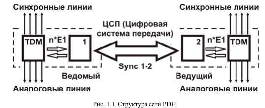
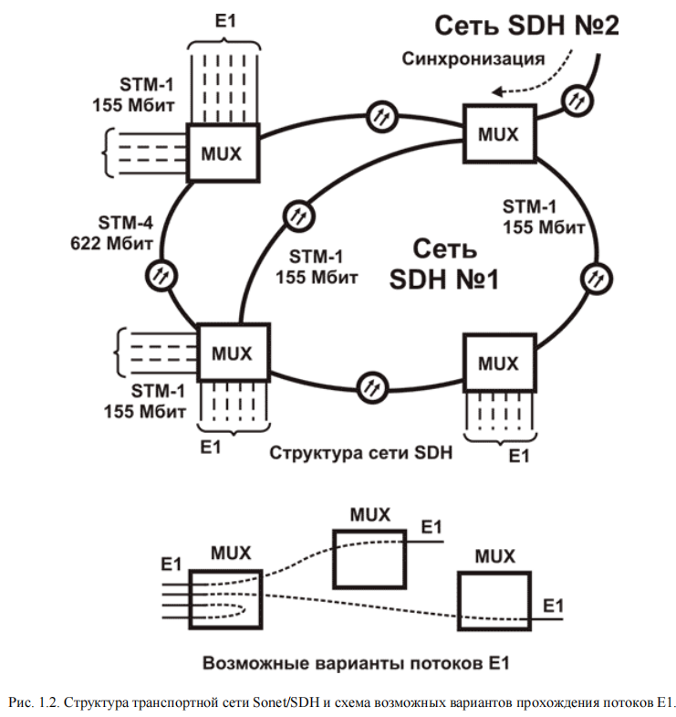

<strong>Кратко</strong>
<table><tr><td>

# Краткий пересказ для «тупого» (с расшифровками)

## О чём вообще текст?
Это первая глава книги про **сети передачи данных** (то, по чему бегает интернет и телефонные звонки). Автор рассказывает, как эти сети развивались — от старых технологий к новым. И объясняет, почему важно это знать, если ты работаешь у интернет-провайдера (компания, которая даёт людям интернет).

## Главная мысль
Ethernet (эзернет — самая популярная технология для локальных сетей, то есть сетей внутри офиса или дома) в провайдинге — штука новая. Чтобы понимать, как её использовать, надо знать историю и современное состояние «магистральных» сетей (магистральные — это большие, длинные сети между городами и странами).

## История по порядку

**1. PDH (Plesiochronous Digital Hierarchy — плезиохронная цифровая иерархия)**
- Появилась в 1957 году в США.
- Это способ передавать много телефонных разговоров по одному проводу.
- В США — поток **T1** (1,536 Мбит/с, 24 канала).
- В Европе и СССР — поток **E1** (2,048 Мбит/с, 30 каналов + служебные).
- Потом сделали более быстрые версии: E2, E3, E4, E5.
- «Плезиохронная» значит «почти синхронная» — у каждого узла свои часы, они чуть-чуть расходятся. Для больших сетей это неудобно.

**2. SDH (Synchronous Digital Hierarchy — синхронная цифровая иерархия) и SONET (Synchronous Optical Network — синхронная оптическая сеть)**
- Появились в 80-х, чтобы решить проблему синхронизации.
- Все узлы работают по одним часам — стало проще.
- Основа всех современных транспортных сетей в мире.
- Скорости: **STM-1** (155 Мбит/с), **STM-4** (622 Мбит/с), **STM-16** (2,4 Гбит/с).
- Но для передачи данных (не голоса) эта штука неудобная — слишком жёсткая структура.

**3. Frame Relay (ретрансляция кадров)**
- Появилась в 1984 году.
- Данные режутся на «кадры» разной длины, у каждого есть адрес получателя.
- Скорость: обычно до 2 Мбит/с, редко до 44 Мбит/с.
- Хорошо защищает данные, поэтому полюбилась банкам и корпорациям.

**4. ISDN (Integrated Service Digital Network — цифровая сеть с интеграцией служб)**
- Появилась в 1974, стандартизирована в 1984.
- Передаёт голос и данные по медным проводам.
- Скорость до 144 Кбит/с — очень медленно.

**5. ATM (Asynchronous Transfer Mode — режим асинхронной передачи)**
- Разработана в 1974, стандартизирована в 1984.
- Универсальная технология: может передавать всё — голос, данные, видео.
- Скорости: от 1,5 Мбит/с до 40 Гбит/с.
- Данные режутся на маленькие «ячейки» по 53 байта.
- Плюс: одна сеть для всего, экономия.
- Минус: сложная, дорогая, много поломок.
- В локальные сети не пробилась — там победил Ethernet.
- Зато в магистральных сетях до сих пор основная.

**6. Что сейчас?**
- **SDH/SONET** — транспорт (перевозчик).
- **ATM** и **Frame Relay** — поверх него, связывают локальные сети пользователей.

## Методы коммутации (как передаётся информация)

- **Коммутация каналов** — как телефонный разговор: соединение занято всё время, даже если молчишь. Неэффективно.
- **Многоскоростная коммутация каналов** — то же, но с разными скоростями. Всё равно негибко.
- **Быстрая коммутация каналов** — соединение создаётся только когда есть данные. Эффективнее, но сложнее и дороже.
- **Коммутация пакетов/кадров** — данные режутся на куски (пакеты/кадры), каждый идёт своим путём. Так работает **Frame Relay** и **Ethernet**.
- **Быстрая коммутация пакетов** — так работает **ATM**: маленькие ячейки, приоритеты.

## Про интернет

- **ARPAnet** — предок интернета, 1966 год, США. Сеть без центрального компьютера.
- 1969 — первый **RFC** (Request for Comment — документ с описанием стандартов интернета).
- 1982 — появились протоколы **TCP/IP** (Transmission Control Protocol / Internet Protocol — основа интернета).
- 1986 — **NSFNET** (National Science Foundation Network — научная сеть США) объединила 6 сетей. Это реальное рождение интернета.
- 1992 — **WWW** (World Wide Web — всемирная паутина), автор Тим Бернерс-Ли.
- 1993 — больше миллиона серверов.
- Интернет — это не одна сеть, а куча разных сетей и служб (почта, FTP (File Transfer Protocol — протокол передачи файлов), WWW и т.д.).
- Единство обеспечивается системой адресов и доменных имён, которой управляет **IANA** (Internet Assigned Numbers Authority — организация, которая выдаёт адреса и имена).

## Интернет в России

- 1982 — Курчатовский институт начал делать Unix-подобную ОС.
- 1986 — сеть из трёх узлов: Демос — КИАЭ — СП Диалог.
- 1990 — первый сеанс связи с зарубежным интернетом (Хельсинки). Зарегистрирован домен **.SU**.
- 1991 — первый междугородний канал TCP/IP (Москва — Барнаул, 9600 бод). Появилась коммерческая сеть **Релком**.
- 1994 — зарегистрирован домен **.RU**, начал работать **HTTP** (HyperText Transfer Protocol — протокол для передачи веб-страниц).
- Дальше — рутина, инженерия, работа. Романтика кончилась.

## Итог
Текст — это краткий курс истории сетей: от телефонных потоков E1 до интернета и Ethernet. Автор хочет, чтобы читатель понимал, откуда всё пришло, и мог говорить со связистами на одном языке.

</td></tr></table>

# Глава 1. Обзор сетей передачи данных

Использование сетей, построенных с использованием Ethernet, в провайдинге ещё нельзя назвать привычным. Для глубокого понимания роли этой технологии на рынке нужно хорошо представлять путь развития и современное состояние оборудования, используемого в магистральных сетях передачи данных.

Вполне возможно, с ними придётся конкурировать. Или использовать, модифицировать под свои нужды, заменять на что-то более современное. Для этого, как минимум, нужно разговаривать на одном языке со связистами. При этом никак не обойтись без знания основных понятий.

## История магистральных сетей передачи данных

К сетям передачи данных можно подойти издалека. Тем более путь прогресса прямым назвать сложно — барабаны и сигнальные костры используются в джунглях до наших дней. Старые технологии соседствуют с новыми. О чём говорить, если даже закон о связи, принятый 16 февраля 1995 года, сегодня выглядит весьма архаичным — для телекоммуникаций это уже практически юрский период (в крайнем случае меловой). А ведь это главный документ, реально регламентирующий деятельность российских операторов связи (и провайдеров в их числе).

Определение, под которое подпадают в свете действующего законодательства компьютерные сети, используемые для провайдинга, звучит так:

> **Сети электросвязи** — <mark><strong>технологические системы, обеспечивающие один или несколько видов передач: телефонную, телеграфную, факсимильную передачу данных и других видов документальных сообщений, включая обмен информацией между ЭВМ, телевизионное, звуковое и иные виды радио- и проводного вещания.</strong></mark>

Ситуация в связи сейчас очень сложная, потому что технологии за последние десять лет рванули вперёд слишком быстро. Вот пример для понимания: представь, что нужно заставить работать вместе одну команду, где у половины людей старые советские компьютеры «Нейрон», а у другой половины — дешёвые Pentium-III. И ещё куча разной техники из всех промежуточных поколений. Вот примерно так и в связи.

При этом проблемы не только у интернет-провайдеров. У телефонных операторов дела ещё хуже: на них давят огромные старые сети и куча устаревших законов. Если по-простому, то их старая система сигнализации ОКС-7 так же далека от современности, как компьютеры начала 90-х от нынешних.

Чтобы понимать, куда развивать сети, надо хотя бы примерно знать, какие технологии использовались раньше и какие используются сейчас. Тогда можно сравнивать варианты и видеть, что у них хорошо, что плохо и что выгоднее.

Давай посмотрим, насколько глубоко в прошлое уходят цифровые коммуникации.

## Плезиохронная иерархия цифровых потоков E1

В **1957 году** компания **Bell System** впервые сделала цифровой поток передачи данных. Потом эту технологию доработали и назвали **T1**. Нужно это было потому, что операторам связи становилось всё труднее справляться с растущим количеством звонков.

В США телефония тогда уже была более-менее нормальной. Менять что-то у клиентов, где использовались медные пары, никто не собирался — и, кстати, до сих пор не поменяли. Поэтому все силы бросили на **магистральные (транспортные) сети** — то есть на линии между городами и станциями, и на то, как эффективнее гонять по ним голос. О передаче данных тогда вообще никто не думал.

Что использовали:

- **Импульсно-кодовую модуляцию** — способ превращать голос в цифры.
- **Мультиплексирование с временным разделением каналов (Time Division Multiplexing, TDM)** — это когда несколько голосовых каналов, или тайм-слотов, передаются в одном потоке данных.

> **TDM (Time Division Multiplexing)** — метод мультиплексирования, при котором несколько каналов передачи данных передаются по одному физическому каналу путём разделения времени на тайм-слоты.

Дальше пошло вот как:

- В **США, Канаде и Японии** за основу взяли поток **T1**: скорость **1,536 кбит/с**, внутри **24 тайм-слота**.
- В **Европе**, а чуть позже и в **Советском Союзе**, взяли поток **E1**: скорость **2,048 кбит/с**, внутри **30 каналов** передачи данных по **64 кбит/с**, плюс канал сигнализации (**16-й тайм-слот**) и синхронизации (**нулевой тайм-слот**).

Это тогда казалось чем-то невероятным.

Потом появились ещё стандартизированные потоки **E2 — E3 — E4 — E5** со скоростями:

- **8448 кбит/с**
- **34368 кбит/с**
- **139264 кбит/с**
- **564992 кбит/с**

Всё это вместе называется **плезиохронной цифровой иерархией — PDH (Plesiochronous Digital Hierarchy)**. Она до сих пор часто используется и для телефонии, и для передачи данных. На оптике PDH почти полностью вытеснили более современные технологии, но на старых медных кабелях она всё ещё держится крепко.

> **PDH (Plesiochronous Digital Hierarchy)** — плезиохронная цифровая иерархия, набор стандартизированных цифровых потоков (E1–E5), в которых каждый узел имеет собственный тактовый генератор, работающий с небольшими отличиями от других.

**Рис. 1.1. Структура сети PDH.**

В каждом устройстве есть свой тактовый генератор, который работает немного по-своему. В паре приёмо-передатчиков ведущий узел задаёт свою синхронизацию (**Sync 1-2**), а ведомый под него подстраивается. **Единой синхронизации для большой сети нет.** Поэтому «плезиохронная» здесь означает **«почти» синхронная**. Для отдельных каналов это удобно, а вот при создании глобальных сетей добавляет лишние сложности.

## Синхронная цифровая иерархия SDH

Когда сети разных операторов связи начали объединять, сразу вылезла большая проблема: **узлы никак не могли синхронизироваться между собой на глобальном уровне**. Плюс стало сложно вытаскивать из общего потока отдельные каналы. Всё из-за того, что каждый узел работал со своей синхронизацией и добавлял выравнивающие биты. Проще говоря, чтобы из потока **E4** достать один **E1**, приходилось делать так:

- Разобрать **E4** на четыре **E3**
- Потом один **E3** разобрать на четыре **E2**
- И только теперь получить нужный **E1**

Это всё сильно всё усложняло, особенно на высоких скоростях. Обслуживать такое было тяжело, и стоило дорого. Тогда, в **80-х годах**, придумали удачное решение: **синхронную оптическую сеть SONET** и **синхронную цифровую иерархию SDH**. Часто их считают одной технологией — **SONET/SDH**.

> **SDH (Synchronous Digital Hierarchy)** — <mark><strong>синхронная цифровая иерархия, технология передачи данных, обеспечивающая глобальную синхронизацию узлов и возможность прямого извлечения низкоскоростных потоков из высокоскоростных.</strong></mark>

> **SONET (Synchronous Optical Network)** — синхронная оптическая сеть, американский стандарт, аналогичный SDH.

Как именно там всё преобразуется и передаётся — это сложно, и в книге это подробно не разбирается. Важно вот что:

- Минимальная «транспортная» единица — это **контейнер**.
- В нём **1890 байтов полезной нагрузки** и **540 байтов служебной части**.

Чтобы новую технологию нормально приняли на рынке, она должна была работать со старым оборудованием и потоками **PDH**. Это получилось. И сейчас **SDH — это основа почти всех транспортных сетей в мире**. Если упростить, то это как куча каналов **T1/E1**, собранных (мультиплексированных) в один канал **SONET/SDH**. При этом сами потоки между собой никак не связаны, и менять их нельзя (если не считать появившихся позже и довольно редких кросс-коннекторов).

**Рис. 1.2. Структура транспортной сети SONET/SDH и схема возможных вариантов прохождения потоков E1.**

Видно, что эта схема делалась строго под телефонию. Мультиплексоры (**MUX**) обычно ставят на **АТС**, где потоки **E1** (собранные с других мультиплексоров) превращаются в медные аналоговые линии. Чтобы сеть работала оптимально, подбирают соотношение между количеством абонентских линий и используемых потоков. Способ не самый экономичный, но зато простой и понятный.

Скорости в сети приличные:

- **STM-1** — 155 Мегабит
- **STM-4** — 622 Мегабита
- **STM-16** — 2,4 Гигабита

Поэтому даже низкоскоростные кодеки и подавление пауз особо не прижились.

Но для передачи данных структура **точка-точка** со статической схемой, мягко говоря, неудобна. Плюс вопрос **последней мили** так и не решён. Наверное поэтому **SDH очень редко используют для передачи данных напрямую**. Это стало задачей протоколов, которые используют SDH просто как магистральный транспорт.

## Коммутация пакетов на примере Frame Relay

Первой технологией, соединяющей глобальные и локальные сети, была X.25, которая сегодня постепенно отмирает. Более прогрессивными стали появившиеся в 1984 году сети Frame Relay. При их использовании данные разделяются на кадры (фреймы) разной длины передающим устройством, причём каждый кадр содержит заголовок с адресом получателя. После передачи они собираются на приёмном конце. Максимальная скорость передачи данных в ранних версиях составляла 2 Мбита. Позже у некоторых вендоров появились варианты, поддерживающие скорости до 44,725 Мбит/с, но широкого распространения, в связи с появлением ATM, они не успели получить.

> **Frame Relay** — технология коммутации кадров, при которой данные разделяются на кадры разной длины, каждый из которых содержит заголовок с адресом получателя.

**Рис. 1.3. Схема сети Frame Relay.**

Для каждого типа трафика может задаваться свой виртуальный канал (PVC), и соответственно может быть организована своя топология соединений. Скорость регулируется параметрами CIR (минимальная информационная скорость) и AR (скорость физического канала). Для соединения узлов Frame Relay обычно используется сеть SDH, а для организации каналов менее чем E1 — мультиплексоры TDM. На практике скорости более 128 кбит используются редко — более быстрое оборудование для соединения на «последней миле» появилось совсем недавно и успело устареть до своего широкого внедрения.

> **PVC (Permanent Virtual Circuit)** — постоянный виртуальный канал, логическое соединение между двумя узлами сети Frame Relay.

> **CIR (Committed Information Rate)** — минимальная гарантированная информационная скорость.

К достоинствам технологии можно отнести высокий уровень защиты данных, что в совокупности с прозрачностью FR для протоколов более высокого уровня снискало ему популярность в кругах распределённых банковских и корпоративных сетей.

## Универсальная технология ATM

Примерно на этом же этапе (разработана в 1974 году, стандартизована в 1984) возникла технология цифровой сети интегрального обслуживания — ISDN (Integrated Service Digital Network), которая обеспечивает передачу данных по медным проводам со скоростью до 144 Кбит/с.

> **ISDN (Integrated Service Digital Network)** — цифровая сеть с интеграцией служб, обеспечивающая передачу голоса и данных по медным проводам.

В отличие от Frame Relay, ISDN была изначально ориентирована на два типа передачи — голоса и данных. Достигалось это благодаря развитым средствам приоритезации трафика. Но из-за низких скоростей передачи ISDN (обычно 64 кбит/с) быстро возникла идея новой широкополосной технологии, названной ATM (Asynchronous Transfer Mode, или режим асинхронной передачи), которая принципиально может применяться на различных скоростях (от 1,5 Мбит/с до 40 Гбит/с). К большим её достоинствам можно отнести возможность относительно простого «наложения» на существующие сети SDH.

> **ATM (Asynchronous Transfer Mode)** — режим асинхронной передачи, универсальная технология, при которой информация всех типов разбивается на ячейки фиксированной длины (53 байта).

**Рис. 1.4. Схема сети ATM.**

Этот момент можно по праву назвать поворотным в истории коммуникаций. Уже успела сформироваться исторически узкая специализация транспортных сетей. Для каждого вида связи существовала, по меньшей мере, одна сеть, которая передаёт информацию этой службы. Имелось большое количество выделенных структур, каждая из которых требовала собственного этапа разработки, производства и дорогостоящего технического обслуживания. Хуже того, свободные ресурсы одной сети не могли быть использованы другой — и это при очень дорогих физических каналах.

ATM изначально разрабатывалась как универсальная и «академически правильная» технология, не зависящая от типа передаваемого трафика. Её могут использовать все существующие службы, так как ATM определяет протоколы на уровнях выше физического.

При условии, что все виды информации транспортируются одним методом, возможно проектирование, создание, управление и обслуживание одной сети. Это сокращает затраты и делает её (в теории) наиболее экономичной транспортной сетью электросвязи на сегодняшний день.

Несмотря на такой перечень достоинств, путь ATM не был лёгок. Как любое универсальное средство, эта технология уступала другим во многих частных случаях. Оборотная сторона универсальности, избыточная сложность, влекла удорожание и часто выливалась в большое количество неполадок не только на этапе внедрения, но и на начальных стадиях эксплуатации.

Поэтому в сферу локальных сетей ATM проникнуть не смогла и была вытеснена Ethernet в телекоммуникацию. Там, при отсутствии реальной альтернативы, именно ATM в настоящий момент принято рассматривать как основную технологию при построении транспортных сетей. Более дешёвый и простой Ethernet только начинает теснить её с занимаемых позиций. Но об этом пойдёт речь в следующих главах.

Если в общем оценить состояние отрасли связи в настоящий момент, то это SONET/SDH, который используют в качестве транспорта ATM и Frame Relay. Последние, в свою очередь, связывают локальные сети конечных пользователей ресурсов сети передачи данных.

## Основные методы коммутации

Для обобщения материала рассмотрим объяснение физической сущности описанных выше методов переноса информации. Основные режимы переноса информации, используемые в сетях связи, следующие:

- коммутация каналов;
- многоскоростная коммутация каналов;
- быстрая коммутация каналов;
- быстрая коммутация пакетов;
- коммутация пакетов или кадров.

> **Коммутация каналов (circuit switching)** — метод передачи информации, при котором на время сеанса связи устанавливается физический канал между двумя узлами, и все данные передаются по этому каналу непрерывно.

Передача голоса в телефонии — классический пример канала. Если объединить несколько каналов в один поток, то появится необходимость управлять, или коммутировать, отдельные каналы. Делается это для транспортировки данных в аналоговых сетях телефонной связи (и узкополосных цифровых сетях) на основе временного разделения потока (например, E1). Причём для передачи информации по каждому каналу используется один или несколько фиксированных временных интервалов (тайм-слотов).

Данный метод, по сути, лишён гибкости, так как продолжительность временного интервала (количество тайм-слотов) однозначно определяет скорость передачи. Передаются в канале данные или нет — место в потоке занято постоянно. Поэтому коммутация каналов — не лучший способ использовать магистральные сети.

Метод многоскоростной коммутации каналов был разработан для устранения недостатков предыдущего решения. В этом случае использовалось несколько каналов с различными временными интервалами и, следовательно, скоростями передачи. Однако недостатки оставались — при занятости низкоскоростного канала ни одно низкоскоростное соединение не могло быть установлено, даже при наличии не занятых более высокоскоростных каналов.

Технология быстрой коммутации каналов основана на тех же методах временного разделения, но соединение устанавливается только тогда, когда требуется передача данных. Хорошей иллюстрацией будет пример телефонного разговора. При коммутации и многоскоростной коммутации каналов будет установлено одно соединение на всю длительность разговора, а при быстрой коммутации будет установлено множество последовательных соединений, каждое из которых служит для передачи конкретного фрагмента речи.

Эффективность использования канала в последнем случае достаточно высокая, но минусы метода тоже велики. Уже нет гарантированной задержки, так важной для передачи голоса. Да и сложность (а значит, и стоимость) программно-аппаратного комплекса увеличивается в разы. Всё это приводит к тому, что на практике используется в основном простая коммутация каналов с синхронной иерархией SONET/SDH.

Для передачи данных между компьютерными сетями, а с появлением коммутаторов и внутри локальных сетей, используются методы коммутации пакетов или кадров. И кадр, и пакет в общем случае могут иметь разную длину и выделяются из общего массива информации только благодаря специальным последовательностям символов (флагам, заголовкам).

> **Коммутация пакетов (packet switching)** — метод передачи информации, при котором данные разбиваются на пакеты, каждый из которых передаётся независимо и может иметь разную длину.

Классическим примером коммутации кадров является протокол Frame Relay (ретрансляция кадров). При передаче информация разных пользователей или служб передаётся по одному потоку (каналу), а коммутаторы выполняют функции определения маршрута данных и создания и хранения очередей пакетов/кадров при перегрузке транспортной системы.

Популярный в настоящее время «классический» Ethernet построен ещё проще. Механизмы работы с очередями не предусмотрены, а вместо определения полного маршрута «заранее» используется более простая маршрутизация каждого пакета данных, причём только на пограничных узлах. Внутри сети пакеты передаются всем пользователям.

Но если рассматривать проблему с точки зрения метода переноса информации, Frame Relay и Ethernet близки. И обладают общим существенным недостатком — не могут гарантировать постоянной скорости.

Тут надо сделать существенное дополнение. Современный Frame Relay имеет развитые механизмы управления скоростью, позволяющие обойти этот недостаток. То же самое можно сказать и про коммутируемый Ethernet — новое оборудование вполне надёжно использует механизмы очередей, приоритизации трафика и другие атрибуты транспортных сетей.

Примером метода быстрой коммутации пакетов является ATM. Для достижения временной прозрачности применён метод, при котором информация всех типов сначала разбивается на пакеты малой фиксированной длины (53 байта, из них — 5 байт заголовок), называемые ячейками. Которые затем мультиплексируются в едином цифровом тракте. При этом ячейки, в зависимости от принадлежности к типу службы, могут иметь разный приоритет.

Если подходить строго, то ATM нельзя назвать методом быстрой коммутации пакетов. Ячейка хоть и мала, но имеет вполне конечную длину, и даже один байт информации вызовет передачу всего пакета. По той же причине нельзя сказать, что в полной мере обеспечивается гарантированная постоянная скорость. Разумеется, при реальном использовании смело можно не обращать внимания на сделанные допущения. Но для понимания сути процессов желательно про них помнить.

Материал по основам сетей передачи данных, на мой взгляд, достаточно сложен для восприятия. Но, не определившись с основами, трудно будет составить целостное понимание места и роли той или иной технологии в современном мире телекоммуникаций.

Перед переходом к следующему «тяжёлому» блоку попробуем немного расслабиться и отвлечься от технических деталей.

## Немного о сети сетей

Вспомним о том, что уже более трёх десятков лет так сильно подстёгивает развитие технологий передачи данных. Ведь именно Интернет даёт львиную долю той самой информации, которая передаётся по сетям электросвязи. И именно ему они обязаны головокружительным ростом. Поэтому их нельзя разделять ни в технических, ни в бизнес-расчётах — как нельзя разделять две стороны одной медали.

Предыстория Интернет начинается с 1966 года, когда Ларри Робертс пришёл в DARPA с идеей распределённой (не имеющей центрального компьютера) сети — ARPAnet (Advanced Research Projects Agency Network). В 1968 начали работать совместно четыре станции, в 1969 принят первый RFC (Request for Comment) «Программное обеспечение узла» Steve Crocker.

> **ARPAnet (Advanced Research Projects Agency Network)** — распределённая сеть, предшественник Интернет, не имеющая центрального компьютера.

> **RFC (Request for Comment)** — документ, содержащий технические спецификации и стандарты для Интернет.

**Рис. 1.5. Схема ARPAnet конца 60-х годов.**

В 1972 произошёл «выход в свет» — международная конференция с демонстрацией сети из 40 машин. 1982 — оформление протоколов ARPA в знакомое сегодня всем семейство TCP/IP.

**Рис. 1.6. Схема ARPAnet 1982 года.**

Но реальным рождением этого восьмого чуда света можно считать объединение шести крупных IP-сетей США в единую научную сеть NSFNET в 1986 году. Свою основополагающую роль NSFNET сохраняла до 1996 года, после чего сменила свою роль на менее значимую.

Всемирная паутина — World Wide Web (WWW) появилась много позже, в 1992 году. Точно известен автор — Тим Бернерс-Ли из Европейского центра ядерных исследований (CERN), расположенного в Женеве, Швейцария. Мало кому известная, появившаяся за счёт энтузиазма, технология обеспечила лавинообразный рост Интернет и тот океан информации, который мы видим сейчас. Рубежом можно считать 1993 год, когда количество подключённых серверов перевалило за миллион. После этого пропали последние сомнения в перспективах сети сетей.

> **WWW (World Wide Web)** — всемирная паутина, система гипертекстовых документов, связанных между собой ссылками.

Менее десятилетия спустя сложно отделаться от мысли, что Интернет представляет из себя что-то большое, цельное. Существующее помимо воли отдельных людей. С философской точки зрения это, пожалуй, соответствует действительности. Но в техническом плане всё по-другому. Даже присоединяя свой компьютер при помощи модема к узлу интернет-сервис-провайдера, вы делаете его полноправным участником всемирной сети. Который может (в теории) пользоваться такими же правами, как и любой другой узел.

Ведь Интернет представляет собой не более чем сеть связанных друг с другом компьютерных систем и различных компьютерных служб. Иначе говоря, является совокупностью различных компонентов. Таких, например, как электронная почта, телеконференции, WWW или FTP.

**Рис. 1.7. Количество узлов разных типов сетей. Только в 1997 году Internet стала самой большой сетью.**

Видимость единства Интернет создаётся единой системой адресации и доменных имён, которые назначаются специальной организацией под названием IANA. Для этого существует продуманная иерархическая схема, которая гарантирует уникальность каждого имени. В следующих главах, посвящённых маршрутизации, этот вопрос будет рассмотрен более подробно.

> **IANA (Internet Assigned Numbers Authority)** — организация, отвечающая за назначение IP-адресов и доменных имён.

**Рис. 1.8. Количество хостов Интернет.**

В данном контексте надо лишь особо отметить, что Интернет далеко не единственная глобальная сеть, которая существует в мире. Она лишь самая крупная из многих.

## История интернет в России

Обратимся к истории Интернет в России (или Советском Союзе). Отсчитывают её с 1982, когда Курчатовский институт начал разрабатывать unix-подобную операционную систему. К 1986 году появилась сеть из трёх узлов Демос — КИАЭ — СП Диалог. Там же в начале 1990 года состоялся первый сеанс связи с зарубежными сетями Интернет (Хельсинки). И уже к осени 90-го сложилось ядро UUCP-шной сети СССР. Узлы общались друг с другом по dial-up (скорость 1200/2400), то есть выделенных линий не было. Но это не помешало уже в сентябре зарегистрировать домен .SU.

> **UUCP (Unix-to-Unix Copy Protocol)** — протокол для обмена файлами и электронной почтой между Unix-системами, обычно по dial-up соединениям.

В феврале 1991 был запущен первый в России междугородний канал связи на протоколе TCP/IP. Работал он по модему между Москвой и Барнаулом на скорости 9600 бод. А к середине этого же года в Советском Союзе уже существовала коммерческая сеть Релком, первоначально организованная Демосом. Вообще говоря, история достаточно запутанная, и имеется несколько вариантов развития событий. Но в рамках данной книги это не слишком важно.

Постепенно новая технология вошла в моду, а движение от сетей «академического» назначения к коммерческой передаче данных стало массовым. Назвать его быстрым и согласованным нельзя (разумеется, по меркам Интернета). Известны и громкие скандалы, и успехи. Но общим было то, что развитие шло скорее за счёт энтузиазма и веры в будущее, чем реальных доходов.

Некоторое изменение ситуации стало заметно только в 1994 году. Быстро начало расти количество пользователей. 7 апреля зарегистрирован домен .RU, заверивший официально существование Интернета в России. А в начале ноября начал выходить первый в Рунете гипертекстовый журнал, то есть заработал протокол http.

Далее «писаная» история сетей плавно превратилась в историю контента — видимой стороны передачи данных. Романтика кончилась — началась будничная инженерная работа. В фокус общественного интереса вышли совсем другие персонажи. Это понятно и, скорее всего, правильно. Проекты, решения, согласования, нормы, правила: всё то, что сопровождает современный провайдинг, мало кому интересно.

Подобное развитие событий (разумеется, в значительно меньшем масштабе) ждёт и домашние (кампусные, территориальные, районные) сети. Экзотичность решений, новизна, поиск места на рынке ещё не стали историей. Но они уже позади. Начинается серьёзная инженерная работа.

## FAQ

**Что такое сети электросвязи?**
Технологические системы, обеспечивающие один или несколько видов передач: телефонную, телеграфную, факсимильную передачу данных и других видов документальных сообщений, включая обмен информацией между ЭВМ, телевизионное, звуковое и иные виды радио- и проводного вещания.

**Что такое TDM?**
Time Division Multiplexing — метод мультиплексирования, при котором несколько каналов передачи данных передаются по одному физическому каналу путём разделения времени на тайм-слоты.

**Что такое PDH?**
Plesiochronous Digital Hierarchy — плезиохронная цифровая иерархия, набор стандартизированных цифровых потоков (E1–E5), в которых каждый узел имеет собственный тактовый генератор, работающий с небольшими отличиями от других.

**Что такое SDH?**
Synchronous Digital Hierarchy — синхронная цифровая иерархия, технология передачи данных, обеспечивающая глобальную синхронизацию узлов и возможность прямого извлечения низкоскоростных потоков из высокоскоростных.

**Что такое SONET?**
Synchronous Optical Network — синхронная оптическая сеть, американский стандарт, аналогичный SDH.

**Что такое Frame Relay?**
Технология коммутации кадров, при которой данные разделяются на кадры разной длины, каждый из которых содержит заголовок с адресом получателя.

**Что такое PVC?**
Permanent Virtual Circuit — постоянный виртуальный канал, логическое соединение между двумя узлами сети Frame Relay.

**Что такое CIR?**
Committed Information Rate — минимальная гарантированная информационная скорость.

**Что такое ISDN?**
Integrated Service Digital Network — цифровая сеть с интеграцией служб, обеспечивающая передачу голоса и данных по медным проводам.

**Что такое ATM?**
Asynchronous Transfer Mode — режим асинхронной передачи, универсальная технология, при которой информация всех типов разбивается на ячейки фиксированной длины (53 байта).

**Что такое коммутация каналов?**
Метод передачи информации, при котором на время сеанса связи устанавливается физический канал между двумя узлами, и все данные передаются по этому каналу непрерывно.

**Что такое коммутация пакетов?**
Метод передачи информации, при котором данные разбиваются на пакеты, каждый из которых передаётся независимо и может иметь разную длину.

**Что такое ARPAnet?**
Advanced Research Projects Agency Network — распределённая сеть, предшественник Интернет, не имеющая центрального компьютера.

**Что такое RFC?**
Request for Comment — документ, содержащий технические спецификации и стандарты для Интернет.

**Что такое WWW?**
World Wide Web — всемирная паутина, система гипертекстовых документов, связанных между собой ссылками.

**Что такое IANA?**
Internet Assigned Numbers Authority — организация, отвечающая за назначение IP-адресов и доменных имён.

**Что такое UUCP?**
Unix-to-Unix Copy Protocol — протокол для обмена файлами и электронной почтой между Unix-системами, обычно по dial-up соединениям.

**Когда был зарегистрирован домен .SU?**
В сентябре 1990 года.

**Когда был зарегистрирован домен .RU?**
7 апреля 1994 года.

**Когда начал выходить первый в Рунете гипертекстовый журнал?**
В начале ноября 1994 года, когда заработал протокол http.