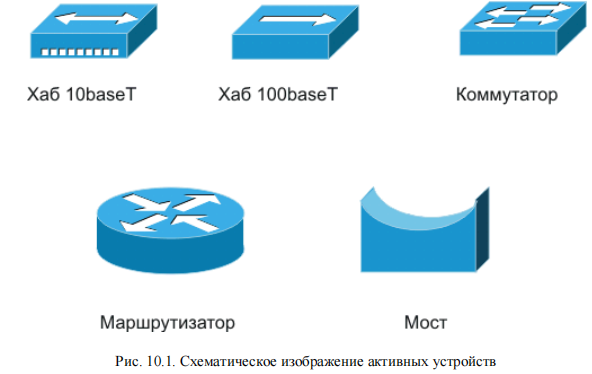
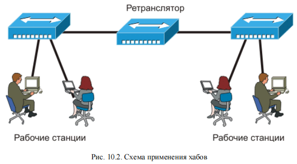
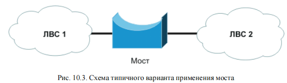
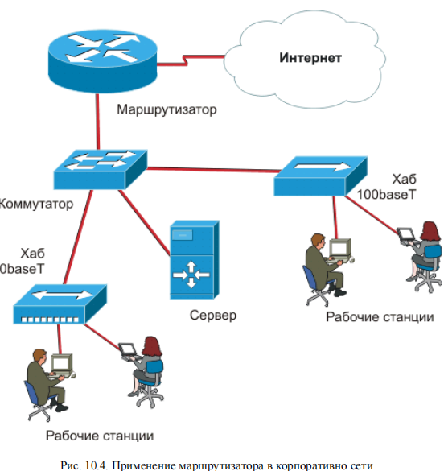
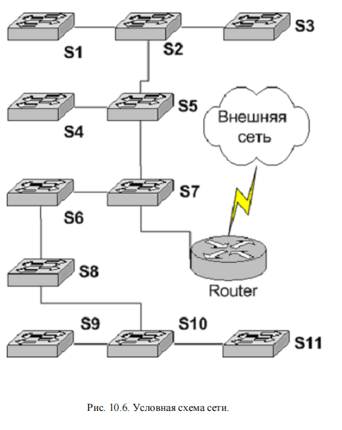

<strong>Кратко</strong>
<table><tr><td>

# Краткая выжимка: Глава 10. Активные устройства

## Общие сведения

**Активные устройства** — формируют, преобразуют, коммутируют и принимают сигнал с использованием внешнего источника энергии.

**Классификация:**
- Рабочие станции
- Повторители (концентраторы)
- Коммутаторы
- Мосты
- Маршрутизаторы

---

## Повторители и концентраторы (хабы)

**Назначение:** увеличение расстояния передачи сигнала путём его повторения (не усиления).

**Принцип работы:**
- Работают на физическом уровне OSI
- Не обрабатывают логически, не буферизируют, коллизии только фиксируются
- Все порты равноправны

**Функции:**
- Автосегментация (link test pulses каждые 16 мс)
- Индикация состояния портов (Port Status, Collisions, Activity, Power)
- Обнаружение и исправление ошибки полярности

**Топология:** шина, звезда, иерархическая звезда (дерево); кольцо недопустимо.

**Классы повторителей:**
| Класс | Задержка | Особенности |
|-------|----------|-------------|
| I | ~0,7 мс | Полное декодирование, поддержка разных технологий |
| II | <0,46 мс | Восстановление формы без декодирования, один протокол |

**Классификация хабов:**
- Начальный уровень (5–8 портов, BNC/AUI, $30–50)
- Средний уровень (12–24 порта, 19", вытеснены коммутаторами)
- Управляемые (RS-232, SNMP/IP, практически не применяются)
- Хабы 10/100 (с коммутатором между шинами, вытеснены свитчами)

**Применение:** домашние и территориальные сети (надёжность, большие расстояния, худшее качество кабеля). В офисных сетях вытеснены коммутаторами.

---

## Мосты (Bridge)

**Назначение:** соединение сегментов Ethernet, разделение коллизионных доменов.

**Принцип работы:**
- Принимают кадр в буфер, проверяют целостность и MAC-адрес
- Ведут таблицу MAC-адресов узлов на своей стороне
- Передают только broadcast и кадры без получателя на своей стороне
- Коллизии не транслируются
- Буферизация store-and-forward → задержка, но рост реальной скорости

**Эволюция:** многопортовые мосты → коммутаторы.

**Современное применение:** связь ЛВС по отличной от Ethernet среде (радиоканал, xDSL, модем).

**Ограничение:** не выполняют фрагментацию/сборку пакетов сетевого уровня; ограничение по размеру кадра (MTU).

---

## Маршрутизаторы (роутеры)

**Назначение:** выбор маршрута передачи данных, объединение разнородных сетей.

**Принцип работы:**
- Разворачивают кадр Ethernet, извлекают IP-дейтаграмму
- Направляют пакет по заголовку, упаковывают в новый кадр
- Восстанавливают уровень и форму сигнала
- Не передают коллизии и повреждённые кадры
- Изменяют все передаваемые кадры Ethernet

**Функции:** подсчёт трафика, авторизация, статистика, QoS, фильтрация.

**Производительность:** измеряется в PPS (Packets Per Second).
- Формула: Скорость = N/(K)×8×S, где K≈5, S — размер пакета
- Пример: Cisco 3620 — 32 Мбит/с

**Протоколы маршрутизации:**
- **RIP** — по числу хопов, прост, но ограничен
- **OSPF** — учитывает производительность, задержки; сложнее

**Применение:** граница между ЛВС и Интернет (локализация трафика, защита, QoS, отсутствие ограничений на число узлов, динамическая маршрутизация).

---

## Коммутаторы (свитчи)

**История:** технология предложена Kalpana (1990), куплена Cisco. Коммутация сегментов Ethernet — разделяемая среда исчезает.

**Принцип работы:**
- Кадр направляется только на порт с MAC-адресом назначения (destination port)
- Таблица CAM (content-addressable memory) формируется самообучением
- Неизвестный адрес → рассылка на все порты
- Вытеснение старых записей

**Классы:**
| Класс | Возможности |
|-------|-------------|
| Неуправляемые (Dumb) | Простая коммутация, нет управления |
| Настраиваемые (Smart) | RS-232/Ethernet, статические таблицы, фильтрация, VLAN |
| Управляемые (Intelligent) | Процессор, память, мониторинг в реальном времени |

**Свойства коммутируемой сети:**
- Коллизии отсутствуют
- Нет ограничений на длину линии и число устройств
- Опасность: broadcast-штормы (решается VLAN)

### Классификация по способу продвижения кадра

| Метод | Задержка | Особенности |
|-------|----------|-------------|
| Cut-through | 10–40 мкс | Анализ только заголовка |
| Store-and-Forward | 50–200 мкс | Полная буферизация, уничтожение испорченных кадров |
| Адаптивный | – | Автоматическая смена режима |

### Архитектуры коммутаторов

| Архитектура | Особенности |
|-------------|-------------|
| Коммутационная матрица | Быстрая, плохо масштабируется, применяется редко |
| Многовходовая разделяемая память | Сложна, дорога, не получила распространения |
| Общая шина | Доминирует на рынке, масштабируема, надёжна |

### Классификация по области применения

| Тип | Порты | Стоимость/порт | Применение |
|-----|-------|----------------|------------|
| Настольные | 8–16 | <$15–20 | Замена хабов |
| Для рабочих групп | 12–24+ | $30–100 | Объединение настольных, подключение к магистрали |
| Магистральные | Модульные | $100–1000 | Соединение ЛВС и СПД |

### Технические параметры

- **Скорость фильтрации** — кадров/с (приём, поиск порта, уничтожение)
- **Скорость продвижения** — кадров/с (приём, поиск порта, передача)
- **Пропускная способность** — Мбит/с
- **Задержка передачи кадра**
- **Размер CAM-таблицы** (2–3К адресов и более)
- **Объём буфера** (сотни КБ — несколько МБ)

### Дополнительные возможности

- **Стекирование** — соединение коммутаторов高速 шиной
- **STP (Spanning Tree Protocol)** — автоматическое построение древовидной топологии, блокировка петель, резервные связи
- **Управление входящим потоком** — Advanced Flow Control (802.3x), backpressure
- **Фильтрация трафика** — по MAC, VLAN, булевы выражения
- **Коммутация 3-го уровня (L3)** — упрощённая маршрутизация
- **Управление и мониторинг** — Telnet, Web, SNMP, RMON (9 групп объектов)
- **VLAN** — виртуальные сети

### RMON-I (9 групп объектов)

1. Statistics — статистика кадров, коллизий, ошибок
2. History — сохранённая статистика для анализа тенденций
3. Alarms — пороговые значения
4. Host — данные о хостах
5. Host TopN — таблица N хостов с наивысшими параметрами
6. Traffic Matrix — интенсивность трафика между парами хостов
7. Filter — условия фильтрации
8. Packet Capture — захваченные пакеты
9. Event — регистрация и оповещение о событиях

---

## Коммутаторы 3-го уровня (L3)

**Предпосылки:** рост скоростей, разрыв между коммутацией и классической маршрутизацией.

**Суть:** коммутатор L3 умеет анализировать кадры на 3-м уровне OSI (IP-маршрутизация).

**Варианты построения сети:**

| Вариант | Описание | Применение |
|---------|----------|------------|
| 1 | Все неуправляемые | Минимальная стоимость |
| 2 | S7, S5, S10 — управляемые L2 | Неэффективно |
| 3 | S7, S5, S10 — управляемые L3 | Небольшие офисные сети |
| 4 | Все управляемые L2 | Полный контроль, нужен мощный маршрутизатор |
| 5 | S7, S5, S10 — L3, остальные — L2 | Корпоративные и операторские сети |
| 6 | Все L3 | Избыточно |

**Примеры:**
- D-Link DES-3326S ($800) — для варианта 3
- Cisco Catalyst 3550-24 ($4500) — для варианта 5 (с Catalyst 2950)

**Выводы:**
- L3 не волшебное средство, а инструмент
- Применять по необходимости
- При массовом переходе на гигабит и 10G L3 станет более востребован

---

## Ключевые выводы по главе

1. **Хабы** — устаревающее оборудование; надёжны в тяжёлых условиях, но вытеснены коммутаторами.
2. **Мосты** — разделение коллизионных доменов; современное применение — связь по не-Ethernet среде.
3. **Маршрутизаторы** — объединение разнородных сетей; незаменимы на границе ЛВС/Интернет.
4. **Коммутаторы** — самый мощный и универсальный класс оборудования для ЛВС.
5. **L3-коммутаторы** — упрощённая маршрутизация; применять по необходимости.
6. **Дополнительные возможности** (STP, VLAN, QoS, RMON) определяют различия между моделями.
7. **Практика** — лучший критерий выбора оборудования.

</td></tr></table>

# Глава 10. Активные устройства

## Введение

> Активные устройства — <mark>устройства, осуществляющие формирование, преобразование, коммутацию, а также приём сигнала с использованием внешнего (не передающегося в составе сигнала) источника энергии.</mark>

<mark>Кабельная инфраструктура не является конечной целью — сеть создаётся для передачи данных между рабочими станциями, серверами и другими активными устройствами.</mark>

Правильный выбор оборудования важен даже в недорогих офисных сетях, а в домашних (территориальных) сетях с жёсткой внешней средой и критическими нагрузками важны даже мелочи — приходится ориентироваться не только на тип и параметры устройства, но и на опыт реальной эксплуатации разных моделей.

**Классификация активных устройств (с некоторой долей условности):**

- рабочие станции;
- повторители (концентраторы);
- коммутаторы;
- мосты;
- маршрутизаторы.

Простое соединение рабочих станций рассмотрено в главе 5. Использование пассивного оборудования не предусматривается стандартами Ethernet, но в некоторых случаях возможно (будет рассмотрено совместно с альтернативными способами построения сетей).

**Рис. 10.1 — Схематическое изображение активных устройств.**

---

## 10.1. Повторители и концентраторы

<mark>Физическая среда накладывает ограничение на расстояние передачи: рано или поздно мощность сигнала падает, и приём становится невозможным.</mark> Важно не абсолютное значение амплитуды, а соотношение сигнал/шум.

<mark>Привычное для аналоговых систем усиление не годится для высокочастотных цифровых сигналов: с увеличением расстояния искажения быстро нарушат целостность данных.</mark> В таких ситуациях применяют не усиление, а **повторение сигнала**: <mark>устройство на входе принимает сигнал, распознаёт его первоначальный вид и генерирует на выходе точное подобие.</mark> 

<mark>Теоретически такая схема может передавать данные на сколь угодно большие расстояния (без учёта особенностей разделения физической среды в Ethernet).</mark>

**Историческая справка:**

- первоначально в Ethernet использовался коаксиальный кабель с топологией «шина»; для соединения протяжённых сегментов применялись **повторители (repeater)** с двумя портами;
- позже появились многопортовые устройства — **концентраторы (concentrator)**: восстановленный сигнал транслировался на все активные порты, кроме того, с которого пришёл сигнал;
- с появлением 10baseT (витой пары) многопортовые повторители для витой пары стали называться **хабами (hub)**, а коаксиальные — **репитерами** (по крайней мере в русскоязычной литературе).

### 10.1.1. Особенности работы концентраторов

Концентраторы работают на **физическом уровне модели OSI** — им безразличны протоколы более высоких уровней. Идеология проста и надёжна. <mark>Все порты хаба равноправны, сигнал не подвергается логической обработке, не буферизируется, коллизии не обрабатываются (только фиксируется их наличие на индикации некоторых моделей).</mark>

**Простейшие операции, выполняемые большинством концентраторов автоматически:**

- **Автосегментация (network integrity)** — автоматическое включение или отключение порта. Порт с неисправной линией или без активного устройства считается свободным и находится в неактивном режиме; при обнаружении устройства работоспособность восстанавливается. Используются служебные сигналы проверки целостности линии (**link test pulses**) — периодический импульс длительностью **100 нс**, посылаемый через каждые **16 мс**;
- **Индикация состояния портов** — светодиодные индикаторы: состояние портов (Port Status), наличие коллизий (Collisions), активность канала передачи (Activity), наличие питания (Power);
- **Обнаружение ошибки полярности** (перепутаны проводники внутри пары) при использовании витопарного кабеля и автоматическое её переключение.

<mark>Повторители и концентраторы можно использовать как отдельное устройство или соединять друг с другом, увеличивая размер сети и усложняя топологию.</mark> Возможные варианты: шина, звезда, иерархическая звезда (дерево). **Кольцевая топология недопустима.**

<mark>Логической обработки сигнала нет</mark>, данные передаются с использованием всей полосы пропускания. Без учёта задержки на хабе (по стандарту IEEE 802.3 менее **3 микросекунд**, в реальности существенно меньше) концентратор ничем не отличается по смыслу от сегмента коаксиального кабеля.

**Плюсы:** <mark>полная прозрачность перед протоколами более высоких уровней</mark>, прямая доступность всех узлов.

**Недостатки разделяемой среды:** <mark>все устройства видят весь сетевой трафик; данные, адресованные другому узлу, принимаются, анализируются как минимум на уровне заголовка кадра и только после этого отбрасываются.</mark>

**По скорости** <mark>различают хабы 10baseT и 100baseT.</mark> Смешанные конструкции работают на полную скорость только при соединении с оборудованием 100baseT (при разных скоростях на разных портах придётся обрабатывать данные и накапливать их в буфере — резкое усложнение конструкции).

**Классы повторителей (стандарт 802.3u):**

- **Повторители I класса** — <mark>полностью декодируют входящий сигнал, преобразуют его в логическую форму и передают на активные порты</mark> (задержка около **0,7 мс**); возможно использование нескольких технологий одновременно (100BaseT4, 100BaseTX, 100BaseFX);
- **Повторители II класса** — <mark>восстанавливают форму сигнала без явного преобразования в логический вид;</mark> задержка заметно меньше (менее **0,46 мс** по стандарту), но можно использовать только один протокол.

<mark>На практике концентратор I класса встретить почти невозможно — они стали «мертворождённым раритетом»</mark> вместе с 100BaseT4 и подобными технологиями.

### 10.1.2. Назначение и классификация концентраторов

**Основное назначение** — <mark>объединение территориально сосредоточенных рабочих мест в рабочую группу. Возможно использование в качестве ретрансляторов между удалёнными сетями или связи нескольких рабочих групп.</mark>

**Рис. 10.2 — Схема применения хабов.**

<mark>Из-за отсутствия механизмов обеспечения безопасности и гарантированной скорости применение рационально только в части сети с общими требованиями по этим параметрам. Неправильно соединять при помощи хабов несколько фирм или бухгалтерию с отделом нелинейного видеомонтажа.</mark>

**Хабы — устаревающее оборудование:** <mark>по техническим показателям серьёзно уступают коммутаторам при близкой цене (дешевле всего на **30–40%**). В локальной сети предприятия их применение не имеет смысла — при незначительном увеличении затрат можно получить в десятки раз большую скорость.</mark>

<mark>В домашних или территориальных сетях хабы более надёжны в тяжёлых условиях эксплуатации и способны передавать данные на большие расстояния</mark> (или по кабелю худшего качества). В этой нише им предстоит ещё долгая жизнь; окончательно их вытеснит только широкое распространение оптики.

**Классы концентраторов по сложности:**

- **Начальный уровень** — 5- или 8-портовые концентраторы; часто порт для коаксиального кабеля (BNC), реже — порт AUI. При небольшой стоимости (**$30–50**) — простое и дешёвое решение для сети небольшого размера;
- **Средний уровень** — 12-, 16- и 24-портовые устройства; 19-дюймовое исполнение, BNC или AUI порты. Вытеснение хабов из этой ниши коммутаторами можно считать завершившимся;
- **Управляемые концентраторы** — консольный порт RS-232 для управления или сбора статистики с использованием протоколов SNMP/IP или IPX. Практически не применяются;
- **Хабы 10/100** — содержат коммутатор между 10- и 100-мегабитными шинами. Удобная и недорогая конструкция, но была полностью вытеснена дешёвыми неуправляемыми свитчами.

---

## 10.2. Мосты

> Мост (Bridge) — <mark>устройство для соединения двух (или более) сетей, которые слишком велики для объединения в один коллизионный домен или территориально удалены друг от друга.</mark>

<mark>Как и повторители, мосты принимают данные на входящий порт и передают на исходящий с восстановленными уровнем и формой сигнала. Но на этом сходство заканчивается.</mark>

**Рис. 10.3 — Схема типичного варианта применения моста.**

**Принцип работы моста:**

- принимает входящий кадр в свой буфер, определяет его целостность и адрес (MAC) назначения;
- каждая половина моста, анализируя поле адреса отправителя, ведёт таблицу Ethernet-адресов узлов на своей стороне;
- на другую сторону передаются только кадры широковещательной рассылки (Broadcast) и кадры, не имеющие получателя на своей стороне;
- коллизии не транслируются (в отличие от повторителей).

> Буферизация данных перед отправкой (store-and-forward) — приводит к большей по сравнению с концентраторами задержке, что несколько снижает скорость работы сети.

С другой стороны, количество устройств, разделяющих физическую среду, снижается — обычно реальная скорость передачи данных возрастает.

Первые мосты были двухпортовыми. С распространением 10baseT на многопортовых хабах популярность получили многопортовые мосты — **коммутаторы (switch)**, что полностью вытеснило старый термин.

**Современное использование термина «мост»:** <mark>устройства для связи ЛВС по отличной от Ethernet физической среде (радиоканал, xDSL, модемная связь и др.). С одной стороны моста кадры Ethernet инкапсулируются в иной протокол канального уровня, с другой — восстанавливаются обратно.</mark>

> Мосты не могут выполнять фрагментацию и повторную сборку пакетов более высокого (сетевого) уровня. Многие модели мостов имеют ограничение по размеру передаваемого кадра; слишком большой может быть отброшен как повреждённый.

Иногда приходится искусственно снижать посредством параметра **MTU (Maximum Transmission Unit)** размер дейтаграммы IP перед инкапсуляцией в кадр Ethernet, чтобы не превысить допустимый итоговый размер.

---

## 10.3. Маршрутизаторы

> Маршрутизатор (роутер, router) — <mark>устройство для выбора маршрута передачи данных (объединения разнородных сетей).</mark>

Если мосты для передачи кадров используют адреса физического уровня (MAC), то маршрутизаторы обычно используют IP-адреса глобальной сети Интернет. Для этого им нужно развернуть кадр Ethernet, извлечь из его поля данных дейтаграмму IP и по её заголовку направить пакет (возможно, опять упаковав дейтаграмму в кадр Ethernet). Большинство маршрутизаторов работает по ещё более сложному алгоритму, используя для передачи данных протоколы следующих уровней модели OSI (TCP, UDP, Novell IPX, AppleTalk II и другие).

**Рис. 10.4 — Применение маршрутизатора в корпоративной сети.**

**Сходства и различия:**

- подобно повторителям, маршрутизаторы восстанавливают уровень и форму передаваемого сигнала;
- как и мосты, не передают коллизии или повреждённые кадры, имеют задержку из-за буферизации;
- в отличие от повторителей, мостов и коммутаторов, маршрутизаторы **изменяют все передаваемые кадры Ethernet** (разбирают их и формируют заново по определённым правилам).

**Дополнительные функции** (зависят от типа и программного обеспечения): подсчёт трафика, авторизация пользователей, ведение статистики и т.п.

**По мощности** могут сильно отличаться: от персонального компьютера с несколькими сетевыми адаптерами (ПО — клоны Unix: Linux или FreeBSD, достаточно даже устаревших «486») до мощных систем (от нескольких сотен до многих сотен тысяч долларов).

**Применение в локальных сетях:** маршрутизаторы практически не применяются — в них нет надобности, а большие потенциальные возможности оборачиваются малой надёжностью и сложностью в эксплуатации. Маршрутизацию желательно применять как можно реже, только когда от неё невозможно отказаться.

**Классический пример** — <mark>граница между локальной сетью и Интернет. Незаменимые преимущества маршрутизаторов в этой нише:</mark>

- более высокий уровень локализации трафика, чем мост (фильтрация широковещательных кадров без корректных адресов назначения — нет угрозы бродкастовых штормов);
- развитые возможности защиты от несанкционированного доступа (фильтрация трафика на сетевом и транспортном уровнях);
- сеть, части которой соединены через маршрутизаторы, не имеет ограничений на число узлов;
- настройка параметров качества (**QoS**), системы приоритетов, ширины полосы пропускания для каждого типа трафика;
- поддержка основных протоколов динамической маршрутизации (**RIP, OSPF, BGP-4, IPX RIP/SAP**), связывание нескольких IP-сетей одновременно.

### 10.3.1. Алгоритмы выбора маршрута

**RIP (Routing Internet Protocol)** — <mark>основной критерий выбора: минимальное число сетевых устройств между отправителем и получателем. Просто реализуется, не требует существенных вычислительных ресурсов, часто применяется в простых сетях.</mark> Недостаток: лучше 10 ретрансляторов на оптоволокне, чем одно модемное соединение, — появляется много дополнительных ограничений, затрудняющих управление.

**OSPF (Open Shortest Path First)** — <mark>кроме числа «хопов» учитывает производительность сети, задержки при передаче пакета и т.п.</mark> Обратная сторона — относительно высокая сложность управления и требовательность к аппаратным ресурсам.

### 10.3.2. Производительность маршрутизаторов

Измеряется в **PPS (Packets Per Second)** — количество маршрутизируемых пакетов в секунду. Возможная скорость передачи данных:

$$\text{Скорость} = \frac{N}{K} \cdot 8 \cdot S$$

где:

- $K$ — коэффициент поправки на реальные условия (примерно около 5);
- $S$ — размер пакета (для Интернет — ~500, для ЛВС — ~1500, для VoIP — ~100).

**Пример:** для Cisco 3620 — $40000/5 \cdot 500 \cdot 8 = 32$ Мбит/с.

Access-листы, роутмапы, файрволы, динамический роутинг и другие дополнительные функции способны снизить реальную скорость маршрутизации в несколько раз.

---

## 10.4. Коммутаторы (свитчи)

> Коммутатор (свитч) — <mark>устройство, которое направляет кадр не на все активные порты, а только на тот, к которому подключено устройство с MAC-адресом, совпадающим с адресом назначения кадра.</mark>

<mark>Разделяемая среда Ethernet была и остаётся причиной обвинений технологии в недостаточной стабильности и надёжности — алгоритм CSMA/CD не обманешь программными решениями. Для преодоления этих недостатков фирма **Kalpana** (впоследствии куплена Cisco) в **1990 году** предложила технологию коммутации сегментов Ethernet: разделяемая среда (домен коллизий) не ограничивалась, а полностью исчезала.</mark>

**Технологический фундамент:** параллельная обработка поступающих кадров на разных портах (мосты обрабатывают кадры последовательно). Это позволило коммутаторам Kalpana передавать кадры независимо между каждой парой портов.

Ethernet повезло, что коммутаторы появились раньше массового применения ATM: пользователи вовремя получили достойную альтернативу с существенным ростом качества сети при небольших затратах. Достаточно было заменить концентраторы на коммутаторы или добавить последние для разделения сегментов. Огромное количество уже установленного оборудования (конечные узлы, кабельные системы, повторители и концентраторы) сохранялось — колоссальная экономия по сравнению с переходом на новую технологию (например, ATM).

<mark>Коммутаторы прозрачны для протоколов сетевого уровня; маршрутизаторы их «не видят». Простота настройки и установки: по умолчанию это самообучающееся устройство, конфигурировать не обязательно.</mark>

<mark>Сегодня коммутаторы — самый мощный, универсальный, удобный для ЛВС класс оборудования.</mark> В простейшем случае это многопортовый мост Ethernet, но развитие технологии внесло так много изменений, что основной принцип работы подчас тяжело увидеть за нагромождением полезнейших технических возможностей.

### 10.4.1. Техническая реализация коммутаторов

<mark>Кадр, попадающий на вход (**source port**), направляется не на все активные порты (как у концентратора), а только на тот, к которому подключено устройство с MAC-адресом, совпадающим с адресом назначения кадра (**destination port**).</mark>

**Таблица соответствия (content-addressable memory, CAM):** коммутатор формирует её в процессе «самообучения»: стоит порту получить ответ от устройства с физическим адресом X, как в CAM-таблице появляется соответствующая строка соответствия.

- кадры с адресом назначения (source address, SA), имеющимся в таблице, направляются на соответствующий порт;
- кадр, предназначенный всем узлам или имеющий неизвестный коммутатору адрес назначения (destination address, DA), направляется на все активные порты;
- при изменении физических адресов в таблице появляется новая запись; если нет свободного места, стирается самая старая запись (принцип вытеснения);
- неиспользованные длительное время записи автоматически удаляются (скорость выборки зависит от размера CAM-таблицы).

**Классы коммутаторов по управляемости:**

- **неуправляемые (Dumb)** — <mark>недорогие простые устройства, вытесняющие хабы из ниши простейших сетей; небольшое количество портов, «офисное» исполнение, невысокие технические характеристики; возможность управления отсутствует;</mark>
- **настраиваемые (Smart)** — <mark>через порт RS-232, обычный Ethernet или микро-клавиатуру администратор может менять конфигурационные параметры, считываемые при загрузке: блокировка «самообучения» (статическая таблица), фильтрация, виртуальные сети, скорость и другое;</mark>
- **управляемые (Intelligent)** — <mark>интерфейс к полноценному процессору (компьютеру с памятью), позволяющий контролировать работу и изменять параметры без перезагрузки, наблюдать за пакетами в реальном времени, считать трафик и т.п.</mark>

Общий принцип неизменен: все узлы соединены «отдельными» каналами с полной полосой пропускания (если нет одновременного обращения нескольких устройств к одному) и могут работать, не подозревая о существовании друг друга. Единственная опасность — **бродкастовые штормы** (лавинообразно нарастающая перегрузка широковещательными кадрами). Возможны только в больших сетях (несколько сотен узлов); большинство управляемых коммутаторов решает проблему разделением на виртуальные сети.

**Базовые свойства (и ограничения) Ethernet как разделяемой среды не применимы** к сети на коммутаторах: коллизии отсутствуют, нет физического обоснования понятия максимальной длины линии и максимального количества подключённых устройств. Реально могут использоваться оптоволоконные линии на сотни километров; локальные сети могут объединять сотни рабочих станций или серверов.

### 10.4.2. Классификация коммутаторов

**По способу продвижения кадра:**

- **на лету (cut-through)** — <mark>коммутатор анализирует адрес назначения в заголовке и по CAM-таблице направляет кадр в соответствующий порт (задержка **10–40 мкс**); штатная ситуация, когда кадр ещё не поступил целиком на входной порт, а его заголовок уже передаётся через выходной;</mark>
- **с буферизацией (Store-and-Forward)** — <mark>кадр записывается целиком, затем процессор порта принимает решение о передаче или фильтрации. Недостаток — большое время задержки; достоинства — уничтожение испорченного кадра, поддержка разнородных сетей. Большая часть современных коммутаторов поддерживает именно этот режим;</mark>
- **адаптация** — <mark>наиболее сложные и дорогие модели имеют автоматическую смену механизма работы в зависимости от объёма трафика, количества испорченных кадров и других параметров.</mark>

**По внутренней логической архитектуре:**

- **коммутационная матрица** — наиболее быстрый способ (реализован в первом промышленном коммутаторе). После анализа заголовка в начало кадра добавляется номер порта назначения; кадр попадает в двухмерную матрицу логических переключателей. Если нужный исходящий порт занят, кадр остаётся в буфере входного порта. Коммутируются физические каналы: несколько кадров на один порт или через один общий переключатель проходят только последовательно. Недостаток — быстро нарастающая с увеличением числа портов сложность; плохо масштабируется, применяется редко (кроме многоступенчатых коммутаторов);
- **многовходовая разделяемая память** — входные и выходные блоки соединяются через общую память; менеджер очередей выходных портов организует в памяти несколько очередей (по числу портов). Системы сложны, требуют дорогой быстродействующей памяти, но не имеют серьёзных преимуществ перед шинной архитектурой; широкого применения не нашли;
- **общая шина** — для связи процессоров портов используется одна шина. Её скорость должна быть по крайней мере в $C/2$ раз больше скорости поступления данных (где $C$ — сумма скоростей всех портов). Данные разбиваются на небольшие блоки (по несколько десятков байт) и передаются «почти» параллельно между несколькими портами — метод временной коммутации частей кадров (по аналогии с ATM — ячейки). Решение легко масштабируется, просто, надёжно, доминирует на рынке.

**Рис. 10.5 — Коммутация с использованием общей шины.**

**По области применения:**

- **настольные коммутаторы** — 8–16 портов, небольшие габариты, настольное или «настенное» исполнение; как правило, без управления; стоимость на порт менее **$15–20**. Типичные образцы: Surecom 808X, Compex 2208;
- **коммутаторы для рабочих групп** — объединение настольных коммутаторов или концентраторов 10/100Base-T и соединение с магистральной СПД; объёмная таблица маршрутизации (до нескольких десятков тысяч MAC-адресов), развитые средства фильтрации, виртуальные сети, мониторинг трафика; обязательное управление (обычно удалённое), протокол **SNMP**; порты 1000baseT или транковые соединения для серверов и связи свитчей. Стоимость **$30–100** за порт 10/100baseT: Surecom EP-716X, SVEC FD1310 (нижний порог); 3com 4400, Cisco 2950 (верхний);
- **магистральные коммутаторы** — сложные и мощные конструкции, часто модульные; масса дополнительных возможностей (вплоть до маршрутизации на III уровне), резервные источники питания, горячая замена модулей, поддержка приоритезации, Spanning Tree, 802.1q и других функций. Стоимость на порт **$100–1000**. Пример — тяжёлые коммутаторы серии Cisco Catalyst.

### 10.4.3. Технические параметры коммутаторов

**Основные параметры:**

> Скорость фильтрации (filtering) — количество кадров в секунду, с которыми коммутатор успевает: принять кадр в буфер, найти порт для адреса назначения в адресной таблице, уничтожить кадр (порт назначения совпадает с портом-источником).

> Скорость продвижения (forwarding) — количество кадров в секунду, которые могут быть обработаны: приём кадра в буфер, нахождение порта назначения, передача кадра в сеть через найденный порт.

По умолчанию эти показатели измеряются на протоколе Ethernet для кадров минимального размера (**64 байта**). Чем короче кадры, тем более серьёзную нагрузку они создают на процессор и шину коммутатора.

**Следующие по значимости параметры:**

- **пропускная способность (throughput)** — количество данных, переданных через порты в единицу времени. При «паспортной» скорости продвижения **14880 кадров/с** пропускная способность составит **5,48 Мбит/с** на пакетах по 64 байта, и ограничение скорости будет наложено коммутатором. При кадрах максимальной длины (1500 байт) скорость продвижения — **812 кадров/с**, пропускная способность — **9,74 Мбит/с**; ограничение будет определяться скоростью протокола Ethernet;
- **задержка передачи кадра** — время с момента начала записи кадра в буфер входного порта до появления на выходном порту. При коммутации «на лету» — **10–40 мкс**, при полной буферизации — **50–200 мкс** (в зависимости от длины кадров). При большой загруженности даже «на лету» большая часть кадров вынужденно буферизируется; сложные и дорогие модели имеют автоматическую смену механизма (адаптацию);
- **размер адресной таблицы (CAM-таблицы)** — максимальное количество MAC-адресов в таблице соответствия. В документации обычно на один порт, но иногда указывается размер памяти под таблицу в килобайтах (одна запись — не менее 8 Кб; «подменить» число выгодно недобросовестному производителю). При переполнении наиболее старая запись стирается, новая заносится; сеть может продолжить работу, но коммутатор замедлится, а сегменты будут загружены избыточным трафиком. Раньше встречались модели (3com SuperStack II 1000 Desktop) с таблицей на один-несколько адресов; сейчас даже самые дешёвые настольные коммутаторы имеют **2–3К адресов**, и параметр перестал быть узким местом;
- **объём буфера** — для временного хранения кадров, когда нет возможности сразу передать на порт назначения; сглаживает пульсации трафика. Простые модели — несколько сотен килобайт на порт, дорогие — несколько мегабайт;
- **производительность коммутатора** — сложное многопортовое устройство, оценить по каждому параметру в отдельности нельзя. Общей методики оценки (эталонного трафика) нет; используются «корпоративные тесты». Идеальный коммутатор передаёт кадры между портами с той же скоростью, с которой их генерируют узлы, без потерь и дополнительных задержек. На практике есть объективные ограничения (классический случай — несколько узлов интенсивно взаимодействуют с одним сервером). Лучший критерий — практика в реальной сети.

### 10.4.4. Дополнительные возможности коммутаторов

Современные коммутаторы имеют так много возможностей, что обычная коммутация уходит на второй план. Быстро и относительно качественно коммутировать кадры умеют модели стоимостью от **$50 до $5000**; различие — по дополнительным возможностям.

**Соединение коммутаторов в стек** — соединение нескольких устройств скоростной общей шиной для повышения производительности узла связи; возможны единое управление, мониторинг и диагностика. Не все вендоры используют специальные порты (стекирование); всё большее распространение получают линии **Gigabit Ethernet** или группировка нескольких (до **8**) портов в один канал связи.

> Spanning Tree Protocol (STP) — протокол покрывающего дерева: коммутаторы автоматически создают активную древовидную конфигурацию связей, находя её с помощью обмена служебными пакетами (Bridge Protocol Data Unit, BPDU), помещаемыми в поле данных кадра Ethernet. Порты, на которых замыкаются петли, блокируются, но могут быть автоматически включены при разрыве основного канала.

Технология STA обеспечивает поддержку резервных связей в сети сложной топологии и автоматическое изменение без участия администратора. Полезна в больших (распределённых) сетях, но из-за сложности редко используется в настраиваемых коммутаторах.

**Способы управления входящим потоком:**

- **агрессивный захват среды** — коммутатор может не соблюдать стандартные временные интервалы; годится только для «общей» среды, редко используемой в коммутируемом Ethernet;
- **обратное давление (backpressure)** — узлу передаются фиктивные кадры; тот же недостаток;
- **Advanced Flow Control** (стандарт IEEE 802.3х) — передача узлу специальных кадров «пауза».

**Фильтрация трафика** — задание на портах дополнительных условий фильтрации входящих или исходящих кадров (по MAC-адресу или тэгу виртуальной сети). Условия записываются в виде булевских выражений с операциями AND и OR. Сложная фильтрация требует дополнительной вычислительной мощности и может снизить производительность. Важна для сетей с «коммерческими» абонентами, которые могут предпринимать несанкционированные деструктивные действия (подделывать IP или MAC-адрес).

**Коммутация третьего уровня (Layer 3)** — управляемый коммутатор анализирует кадры на третьем уровне (по 7-уровневой модели OSI). Упрощённая маршрутизация позволяет поднять скорость и более гибко управлять трафиком большой ЛВС. В транспортных сетях применение коммутаторов пока ограничено, хотя тенденция к стиранию отличий от маршрутизаторов прослеживается.

**Управление и мониторинг** — современные коммутаторы управляются через порт 10/100baseT при помощи Telnet, веб-браузера или по протоколу **SNMP**. Для Ethernet интересны расширения **RMON** и **SMON**. Принцип: RMON-агенты на свитчах шлют информацию на центральный сервер, где специальное ПО (например, HP OpenView) обрабатывает её. Удалённым изменением настроек можно привести работу сети в норму. При помощи SNMP можно строить систему биллинга.

**Стандарт RMON-I MIB описывает 9 групп объектов:**

1. **Statistics** — текущие накопленные статистические данные о характеристиках кадров, количестве коллизий, ошибочных кадров (с детализацией по типам ошибок);
2. **History** — статистические данные, сохранённые через определённые промежутки времени для анализа тенденций;
3. **Alarms** — пороговые значения статистических показателей, при превышении которых агент RMON генерирует событие (требует реализации группы Events);
4. **Host** — данные о хостах сети, обнаруженных в результате анализа MAC-адресов;
5. **Host TopN** — таблица N хостов с наивысшими значениями заданных статистических параметров;
6. **Traffic Matrix** — статистика о интенсивности трафика между каждой парой хостов, упорядоченная в виде матрицы;
7. **Filter** — условия фильтрации пакетов; пакеты, удовлетворяющие условию, могут быть захвачены или генерировать события;
8. **Packet Capture** — группа пакетов, захваченных по заданным условиям фильтрации;
9. **Event** — условия регистрации событий и оповещения о событиях.

> Виртуальные сети (Virtual Local-Area Network, VLAN) — средствами коммутаторов (2 уровня модели OSI) создаётся несколько виртуальных (независимых) сетей на одной физической ЛВС Ethernet, с возможностью центральному маршрутизатору управлять портами (или группами портов) на отдалённых коммутаторах. Наиболее важная и широко используемая возможность современных коммутаторов; удобное средство для оказания услуг передачи данных (провайдинга).

---

## 10.5. Коммутаторы 3-го уровня

Технический прогресс последних лет: после освоения массового выпуска свитч-чипов в Китае стоимость коммутаторов упала почти до уровня упаковки — сносный неуправляемый 8-портовый коммутатор можно купить дешевле **$40**. Цены на профессиональные управляемые модели также снизились: всё, что положено делать «классическому» коммутатору, уже имеют модели дешевле **$400 за 24 порта**.

Производители коммутаторов начали «гонку уровней» — ведущие производители не захотели соревноваться ценой с устройствами «made in china» и перевели острие технологической моды на усложнение коммутаторов за счёт возможностей следующих уровней по модели OSI. В продаже — сравнительно недорогие модели 3-го и 4-го уровней, в которых видят универсальное средство решения всех проблем сетей — от увеличения производительности до обеспечения конфиденциальности трафика.

### 10.5.1. Немного теории

Если сузить поле применения стандартов до современных бюджетных сетей (не использующих SDH или ATM):

- **уровень 2** (по семиуровневой модели OSI) соответствует кадрам Ethernet; их передвижение происходит согласно MAC-адресам, известным CAM-таблицам коммутаторов. Свитчи, которые «не знают» ничего выше по стеку, называются **коммутаторами 2-го уровня**. При этом они могут производить сложные операции: ставить и убирать метки VLAN, распознавать приоритеты (QoS), устанавливать кадры в очереди, определять атаки, считать Ethernet-трафик, шейпить его, фильтровать по номерам портов и т.п. Классический тип «продвинутого» L2 — 3com SuperStack 3300, Catalyst 2924; следующие модели (3com SuperStack 4400, Catalyst 2950) уже имеют те или иные возможности следующих уровней;
- **соединять разные сети Ethernet** (реальные и виртуальные сети 2-го уровня) должны маршрутизаторы, обрабатывающие данные на **3-м уровне** (IP-пакетов). Заголовки IP идут по сети Ethernet в поле данных и обычным коммутаторам 2-го уровня недоступны.

Традиционно сети Ethernet соединялись друг с другом при помощи иной (не Ethernet) канальной среды передачи данных (WAN): Frame Relay, X.25, ATM, G.703 и т.п. Для преобразования данных нужна была гибкость, универсальность, сложный софт, и хватало небольшой скорости. Когда сети Ethernet «выросли» и внедрились в магистральные ниши, необходимость в таком подходе отпала и стала мешать (как любая избыточность возможностей). К месту появились **коммутаторы 3-го уровня**, способные в добавление к обычным функциям маршрутизировать трафик между портами на IP-уровне — быстро, но с ограниченными возможностями (как правило, нельзя подсчитать трафик, построить сложные фильтры, добавить скрипты, NAT и т.п.; хотя есть и монстры типа Catalyst 6509).

Исторически различали **маршрутизирующую коммутацию**, **коммутацию потоков** и **коммутирующую маршрутизацию** — сейчас эти термины анахронизм, но корни той же MPLS растут из них.

### 10.5.2. Применение в бюджетной сети

**Рис. 10.6 — Условная схема сети.**

Большинство небольших сетей сводятся к такой простой иллюстрации; из нескольких подобных сегментов можно построить крупную инфраструктуру.

**Варианты установки оборудования:**

1. **Полностью неуправляемые коммутаторы** — реальный вариант, но неинтересный; перспективность сомнительна, достоинство только одно — сверхнизкая стоимость;
2. **S7, S5, S10 — управляемые свитчи 2-го уровня, остальные неуправляемые** — заметного выигрыша не даст: если два управляемых коммутатора 2-го уровня разделены неуправляемым, большинство функций (VLAN, QoS) будет потеряно. Имеет смысл ставить мощные устройства только в точках S7 и S5;
3. **S7, S5, S10 — управляемые 3-го уровня, остальные неуправляемые** — эффективное использование для разделения сегментов в точках S5, S10; в S7, рядом с маршрутизатором, функции 3-го уровня могут быть излишни; в остальных точках контроль будет неполным;
4. **Все коммутаторы управляемые 2-го уровня** — полный контроль и при необходимости маршрутизация каждого порта; для мультисервисного использования — QoS, мультикастинг. Недостаток — необходим отдельный мощный маршрутизатор для всего междусегментного трафика;
5. **S7, S5, S10 — управляемые 3-го уровня, остальные — управляемые 2-го уровня** — фактически стандарт для серьёзных корпоративных и операторских структур; для небольших сетей рекомендовать рано;
6. **Все коммутаторы управляемые 3-го уровня** — возможно, неплох, но на сегодня избыточен даже для корпоративных решений.

При выборе стратегического направления можно использовать варианты **3 и 4**.

**Зачем нужно разделять трафик на уровне IP:**

- когда сети строились на хабах — нужно разделять коллизионные домены, поэтому маршрутизаторы (коммутаторы L3 были непозволительной роскошью) ставились между каждыми 4 хабами (или 30–40 пользователями); иначе — быстрая деградация производительности;
- в коммутируемой сети такого ограничения нет; размер ограничивается только бродкастовым трафиком, который постепенно заполняет полосу пропускания. «Бродкастовый шторм» может наступить около **300–500** одновременно работающих пользователей; это не предел, если в центре сети использовать оборудование с фильтрацией на 4-м уровне (по протоколам).

В России сетей с таким количеством пользователей в помещении, не разделёнными каналами WAN, единицы; типичный размер — **100–200 портов**. Технологическая причина применения L3 в «гладкой» сети Ethernet по сути отсутствует; традиционно узкие места типа коммутатор-сервер дешевле «расшить» недорогим гигабитом.

**Для чего нужно разделение на отдельные сегменты в случае 4:** подсчёт локального трафика, ограничение скорости отдельных сегментов, фильтрация, построение закрытых VLAN. Минусы: приличная стоимость управляемого железа (на все порты) и проведение межсегментного трафика через центральный узел (плохо сказывается на пропускной способности основной магистрали) — последнее и ограничивает размеры плоской сети Ethernet на управляемых коммутаторах 2-го уровня.

**Для варианта 3** вероятные причины сегментирования иные: подсчёт трафика на недорогих коммутаторах 3-го уровня затруднителен; закрытые VLAN сделать не удастся (разве что ставить управляемые свитчи во всех точках подключения «отдельных» пользователей). Единственный смысл — повысить производительность и управляемость сети в некоторых «узких» точках, локализовать неисправности, ограничить доступ пользователей друг до друга хотя бы на уровне нескольких узлов.

**Наиболее полно достоинства видны** на примере корпоративной сети, распределённой по нескольким отдалённым территориям, связанным бриджами xDSL. Коммутаторы L3 позволят строить сети без установки маршрутизаторов на каждый сегмент так, что низкоскоростные xDSL-линии будут загружены минимально (только данными, адресованными непосредственно на другую территорию). Достоинство — не нужен выделенный маршрутизатор, нет лишнего трафика через центральные магистрали. Недостаток — из-за многократной маршрутизации на IP-уровне сильно повышается сложность сети (лишние подсети, лишние проблемы); при более десятка сегментов придётся поднимать OSPF, RIP-2 или что-то подобное из арсенала операторов связи.

### 10.5.3. Сравнение коммутаторов L3

**Пример:** D-Link DES-3326S (**$800**) и Catalyst 3550-24 (**$4500**). Сравнение не на уровне технических параметров, а по парадигме использования.

- **D-Link DES-3326S** — ориентирован на вариант 3, для небольших офисных сетей без разветвлённой структуры и требований по ограничению доступа между пользователями. Хорошо вписываются коммутаторы с портовыми, нетегированными виланами, для которых L3 на ближайшей по топологии развилке — хорошее решение проблемы скорости и безопасности. Большую сеть построить сложно;
- **Cisco 3550** — «заточена» под вариант 5, проходит в связке с Catalyst 2950 через пособия по дизайну сетей: один 3550 или 3550-12G, к нему звездой — десяток-другой 2950 (2950T). Позволяет достичь максимальной скорости передачи данных. Нет в линейке свитчей с портовыми виланами, но поддержка тегированных 802.1q на маршрутизирующих портах становится принципиально необходимой.

### 10.5.4. Итоги

Решений много, выбирать или комбинировать нужно в каждом конкретном случае по-разному. Широкое применение устройств L3 с неуправляемыми или частично управляемыми коммутаторами (без поддержки полных возможностей L2) не позволяет получить значительных преимуществ в управлении сетью (нельзя произвольно контролировать каждый отдельный порт). Но с их помощью можно добиться повышения скорости передачи данных на структуре со сложной топологией или большим «горизонтальным» трафиком. В остальных случаях применение будет не слишком эффективным из-за наличия недорогой альтернативы гигабитных магистралей: пока пользователи включены на 100 мегабит, они не смогут (до определённого количества) перегрузить магистраль до центрального маршрутизатора.

Возможно, поэтому сейчас более широкое распространение получили устройства с «возможностями» 3-го, 4-го или более высоких уровней; при этом из полного спектра свойств IP-заголовка берётся всего несколько наиболее полезных (например, фильтрация по IP-адресу). Это не слишком дорого, но позволяет принять участие в «гонке уровней».

**Прогноз:** если пользователи массово перейдут на гигабит, а 10-гигабитные магистральные линии останутся слишком дорогим удовольствием, L3 станет более чем востребован (нельзя будет построить даже минимальную «пирамиду скорости» магистраль-пользователь). Более реален другой путь: десятигигабитные сетевые адаптеры уже существуют, и при появлении недорогой возможности перевода основных каналов на 10 гигабит ситуация повторится — на более высоких скоростях и с большими «дополнительными» возможностями.

Есть большое количество локальных вариантов использования коммутаторов 3-го уровня, при которых L3 будет удобен или даже незаменим. Но «третий уровень» — не волшебное средство решения всех проблем, а лишь инструмент, который имеет смысл применять к месту и в нужных количествах. Как лекарство.

---

## FAQ

**Что такое активные устройства?**
Устройства, осуществляющие формирование, преобразование, коммутацию и приём сигнала с использованием внешнего источника энергии.

**Какие группы активных устройств выделяют?**
Рабочие станции, повторители (концентраторы), коммутаторы, мосты, маршрутизаторы.

**На каком уровне OSI работают концентраторы?**
На физическом; им безразличны протоколы более высоких уровней.

**Что такое автосегментация?**
Автоматическое включение или отключение порта концентратора при обнаружении неисправной линии или отсутствии устройства; используются link test pulses (100 нс каждые 16 мс).

**Какие топологии допустимы при использовании концентраторов?**
Шина, звезда, иерархическая звезда (дерево); кольцевая недопустима.

**Чем отличаются повторители I и II класса?**
I класс — полное декодирование сигнала, преобразование в логическую форму (задержка ~0,7 мс), возможны несколько технологий. II класс — восстановление формы без логического преобразования (задержка менее 0,46 мс), только один протокол.

**Что такое мост?**
Устройство для соединения сетей, слишком больших для одного коллизионного домена или территориально удалённых; работает с MAC-адресами, буферизирует кадры (store-and-forward), не транслирует коллизии.

**Что такое коммутатор?**
Многопортовый мост; направляет кадр только на порт с MAC-адресом назначения, а не на все порты.

**Что такое CAM-таблица?**
Таблица соответствия портов и MAC-адресов, формируемая коммутатором в процессе самообучения.

**Какие классы коммутаторов по управляемости?**
Неуправляемые (Dumb), настраиваемые (Smart), управляемые (Intelligent).

**Чем отличается коммутация «на лету» от полной буферизации?**
«На лету» (cut-through) — анализ заголовка и передача (задержка 10–40 мкс); Store-and-Forward — приём кадра целиком, затем передача (задержка 50–200 мкс).

**Какие внутренние архитектуры коммутаторов?**
Коммутационная матрица, многовходовая разделяемая память, общая шина.

**Какие области применения коммутаторов?**
Настольные, для рабочих групп, магистральные.

**Что такое скорость фильтрации и скорость продвижения?**
Скорость фильтрации — количество кадров в секунду при приёме в буфер, поиске порта и уничтожении кадра. Скорость продвижения — то же, но с передачей кадра в сеть.

**Что такое Spanning Tree Protocol (STP)?**
Протокол, при котором коммутаторы автоматически создают древовидную конфигурацию связей; порты с петлями блокируются, но включаются при разрыве основного канала.

**Что такое RMON?**
Расширение SNMP для мониторинга; RMON-I MIB описывает 9 групп объектов (Statistics, History, Alarms, Host, Host TopN, Traffic Matrix, Filter, Packet Capture, Event).

**Что такое VLAN?**
Виртуальная локальная сеть — несколько независимых сетей на одной физической ЛВС Ethernet, создаваемых средствами коммутаторов 2-го уровня.

**Чем отличается коммутатор 3-го уровня от маршрутизатора?**
L3-коммутатор маршрутизирует трафик между портами на IP-уровне быстро, но с ограниченными возможностями (нельзя подсчитать трафик, сложные фильтры, NAT и т.п.).

**Какие протоколы динамической маршрутизации поддерживают маршрутизаторы?**
RIP, OSPF, BGP-4, IPX RIP/SAP.

**Чем отличаются RIP и OSPF?**
RIP — по минимальному числу сетевых устройств (хопов); OSPF — с учётом производительности сети, задержек и т.п.

**Как измеряется производительность маршрутизаторов?**
В PPS (Packets Per Second); скорость = N/K · 8 · S, где K — поправка (~5), S — размер пакета.

**Когда наступает «бродкастовый шторм»?**
Около 300–500 одновременно работающих пользователей (не предел при фильтрации на 4-м уровне).