

<strong>Кратко</strong>
<table><tr><td>

# Краткая выжимка по тексту «Часть 3. Глава 1. Прокладки „воздушек“»

## Суть
Это практическое руководство (в формате «военных заметок») по прокладке подвесных кабельных линий (воздушек) для домашних/провайдерских сетей Ethernet. Автор не даёт академических норм, а делится реальным опытом монтажа через крыши, улицы, деревья, столбы и стены — с оговоркой, что многие методы не одобрит инспектор по ТБ, но именно так десятилетиями работали сети кабельного ТВ и радиофикации в России.

## Ключевые тезисы

**1. Юридическая сторона.** Прокладка воздушек — это строительство: нужно согласование места, проект, лицензированная организация, а для коммерческих сетей — сдача с участием УГНСИ. На практике всё делается «на свой страх и риск», а правильные работы стоят дорого и требуют массы согласований.

**2. Безопасность.** На крыше работать только застрахованным. Страховочная система стоит от 300 рублей, жизнь дороже. Не кидать веревку с грузом на крыше — риск попасть в окно. Не применять случайные металлические грузы.

**3. Протяжка через несколько домов.** Пример: 5 домов, ~500 м, кабель П-296, 2 человека, 3–4 часа работы. Кабель поднимают на крышу через веревку, разматывают бухту по двору, перекидывают между домами, натягивают вдвоем (один тянет — второй крепит). Важно обходить растяжки антенн и провода радиофикации. Линия работала без ремонтов более 4 лет.

**4. Протяжка через оживленную улицу.** Требуется 4–5 человек, рации, мягкая веревка 4 мм, толстая веревка 8–10 мм (100 м), груз 700–800 г (идеально — мешочек с песком/дробью). Веревку перекидывают «с земли» пращевым движением. Опасности: запутывание на высоте (не тянуть груз обратно — опускать и перевязывать) и недокидывание на машины/людей. Лучшее время — раннее утро; ночью без прикрытия — риск попасть в отделение.

**5. Борьба с деревьями.** Деревья мешают чаще и сложнее, чем автострады. Если деревья выше крыш — только перекидывание или срубание веток. Метод «обведения»: веревку держат внатяг снизу и с крыши, обходят дерево, поднимают по диагонали и заводят сверху. Ошибка в планировании маршрута может обнулить половину работы. Старые тополя ломаются от ветра — обрыв кабеля обеспечен.

**6. Использование существующих коммуникаций.** Не трогать чужое имущество без договорённости. Брошенные кабельные хозяйства можно использовать. «Закладки» монтажников — вежливость на крыше обязательна. «Веревкоход»/«проволокоход» — самодельные устройства на автомобильных двигателях (стеклоочистителя, сигнализации) для перевозки груза по несущему кабелю. Рискованно, требует страховки.

**7. Столбы освещения и стены домов.** Альтернатива крышам: проще легализовать (меньше инстанций), лучше защита от вандалов, но дороже и требует спецнавыков (лестницы, автовышки). Кабель-восьмерку крепят за несущий трос; самонесущий (П-296) — спиральными зажимами или подручными средствами (шланг + пруток + хомуты). Ввод в здание по стене — безопаснее от гроз и вандалов, но провайдеры используют редко из-за сроков согласований.

**8. Крепление и подвес.** Крепить только к согласованным местам: трубостойки, анкера, арматурные крюки, стропила. Нельзя — к ограждениям крыш. Расчёт натяжения: T = PL/8F. По СНиП стрела провеса — 1/40–1/60 длины пролета (для 200 м — ~5 м). Не натягивать «как струну». Проволока 3 мм достаточна, 4–5 мм — с запасом. Главное — избегать «барашков» при размотке (почти 100% разрыв, иногда через год). Сращивание проволоки — плотной навивкой концов навстречу.

**9. Крепёж кабеля.** Два способа: (1) крепить кабель к проволоке до протяжки (стяжки, скобы — для коротких лёгких линий); (2) сначала натянуть проволоку, затем провесить кабель на скользящих зажимах. Прогрессивный метод — «спираль» (пружина 1,5–2 мм, витки ~100 мм): кабель лежит свободно внутри, не испытывая нагрузок (аналог FlexTender, Япония).

**10. Самонесущий кабель.** «Восьмерка» — конец троса отделяют и крепят за опору. П-296 (внутренняя оплётка ~100 кг) — спиральные зажимы (от $10) или подручные средства. Оптоволокно экспериментов не терпит — только медный П-296.

## Главный вывод автора
«Повыше на крышу, подальше от надзора» — не выигрышная стратегия. Легализация неизбежна, и вместе с ней придёт опыт использования стен и столбов освещения. А пока — работать аккуратно, страховаться и не забывать о технике безопасности.

</td></tr></table>

# Часть 3. Глава 1. Прокладка подвесных кабельных линий

## Введение

> **Подвесная кабельная линия (воздушка)** — <mark>линия связи, проложенная между зданиями или опорами по воздуху с использованием несущего троса, проволоки или самонесущего кабеля.</mark>

> **Самонесущий кабель** — <mark>кабель, способный выдерживать механическую нагрузку натяжения без дополнительного несущего элемента (например, П-296, кабель типа «восьмёрка»).</mark>

Вопрос «как кабели подвешиваются между домами» имеет простой ответ: эту работу выполняют люди. В строительстве воздушных линий нет принципиально неразрешимых сложностей — всё становится понятным из практических примеров.

Материал ниже — скорее список практических работ, чем законченное руководство. Тем не менее, сделана попытка обобщения опыта прокладок.

Не все описанные способы одобрит инспектор по технике безопасности и официальные органы. Однако похожим образом в России уже несколько десятилетий монтируются сети кабельного телевидения, радиофикации — Ethernet не будет исключением. Слишком далеки формальные правила от реальности.

Это не значит, что нормы не надо знать — совсем наоборот. Вопросам согласования посвящена отдельная глава. Кратко:

1. Прокладка подвесных кабельных линий — это строительство.
2. Требуется согласование места (районная администрация, управа, ДЕЗ, РЕМП).
3. Заказывается проект.
4. Выполняется строительство (формально — лицензированной организацией).
5. Для сети коммерческого назначения — сдача с участием УГНСИ (по приказу № 113).

### Техника безопасности

> **Страховочная система** — комплект снаряжения (страховочный пояс, стропа, карабины), предназначенный для предотвращения падения с высоты.

Работать на крыше можно только застрахованным (привязанным). По крайней мере, если крыша не плоская и не окружена высоким капитальным бордюром. Некоторые специалисты рекомендуют страховаться и в этом случае — чтобы не расслабляться.

Страховочная система стоит от 300 рублей, монтажный пояс можно найти даже бесплатно. Это несколько неудобно, но быстро привыкаешь. Жизнь дороже.

---

## Протяжка кабеля через несколько домов

Описанная протяжка выполнена весной 1999 года. Линия нормально работает без ремонтов более 4 лет. В то время сети были не столь популярны, и приходилось бороться за всех, даже весьма отдалённых пользователей.

После осмотра трассы прокладки (чуть менее 500 метров) выяснилась следующая картина (конец трассы на первой фотографии виден плохо, поэтому показан вид с обеих сторон):

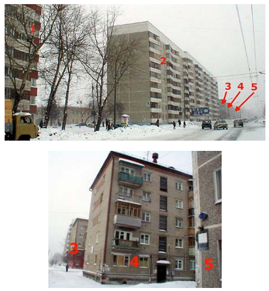

**Рис. 1.1.** Вид трассы, по которой нужно проложить линию (с обеих сторон).

На трассе 5 домов:

- **№1** — красная 14-этажка, уже стоял хаб, подключено несколько пользователей.
- **№2** — длинная (около 200 метров) 9-этажка. Несмотря на активную рекламу, желающих подключиться не нашлось.
- **№3 и №4** — 5-этажные «хрущёвки».
- **№5** — 5-этажная «брежневка», нужно было подключить заказчика.

Работу предстояло выполнить силами 2 человек.

### Материалы и подготовка

<mark>Из материалов и оборудования: бухта кабеля П-296 и 100-метровая верёвка.</mark> Это была первая прокладка с использованием П-296, и никто точно не знал, как он поведёт себя в реальных условиях.

> **П-296** — <mark>самонесущий кабель с внутренними упрочняющими элементами (металлическая оплётка), выдерживающий нагрузку около 100 кг.</mark>

За день до начала работ был найден в лифтовой ключ от дома №2, проверен на совпадение с замком реальной двери. Дом №1 был уже освоен. Выход на хрущёвки и брежневку был свободен, если не считать железных и вечно закрытых подъездных дверей.

### Ход работ

Работа началась после обеда, около 13 часов.

1. <mark>Напарник поднялся на крышу дома №2, спустил вниз верёвку, к которой был привязан конец кабеля.</mark>
2. Пришлось долго катать по двору железную бухту П-296 для разматывания кабеля. <mark>По мере разматывания напарник поднимал кабель на крышу.</mark>

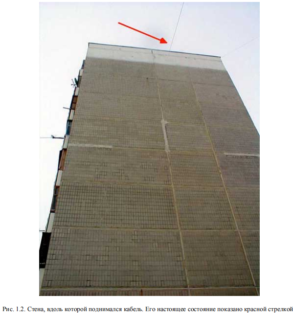

**Рис. 1.2.** Стена, вдоль которой поднимался кабель. Его настоящее состояние показано красной стрелкой.

3. После того как большая часть кабеля была разложена на крыше, остаток, предназначенный для затяжки на дом №3 и далее, был подвязан к дереву «внатяг», чтобы не мешать проезду машин. Конец кабеля длиной около 50 метров оставался свободным.

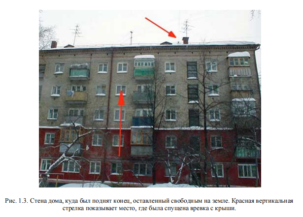

**Рис. 1.3.** Стена дома, куда был поднят конец, оставленный свободным на земле. Красная вертикальная стрелка показывает место, где была спущена верёвка с крыши.

4. Напарник поднялся на крышу дома №3, спустил верёвку вниз. Поднимаемый кабель сразу опускался с другой стороны двухскатной крыши на землю. Пришлось внимательно провести конец через растяжки крепления антенн и провода радиофикации, чтобы после натяжки они не мешали линии.
5. Верёвку даже не пришлось отвязывать от кабеля — сразу после спуска с другой стороны она была перекинута через дорогу и провода между домами №3 и №4.

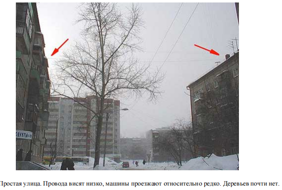

**Рис. 1.4.** Простая улица. Провода висят низко, машины проезжают относительно редко. Деревьев почти нет.

6. Кабель был сразу вытянут к подножью дома №4. Подвязывать к дереву не пришлось, так как напарник успел спустить верёвку с крыши №4. Далее операция повторена в комбинации №4–5.

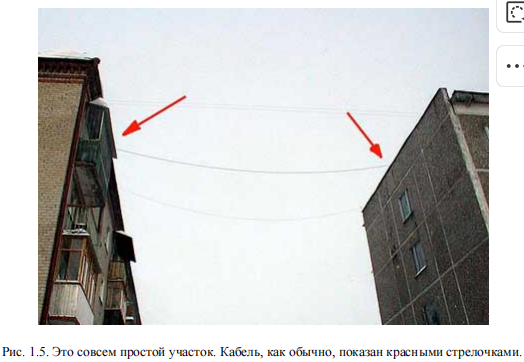

**Рис. 1.5.** Это совсем простой участок. Кабель, как обычно, показан красными стрелочками.

> **Правило:** не кидать на крыше верёвку с грузом. Долетит просто верёвка — хорошо. Не долетит — опускать на землю. Изыски а-ля Робин Гуд без подготовки до добра не доводят.

7. Кабель доведён до цели, закреплён, работа пошла в обратную сторону. Для натяжки поднимались на крыши вдвоём: один человек натягивает, второй закрепляет кабель на стойке.
8. Перед натяжкой пролёта между домами №2–3 кабель отвязан от дерева. Много хлопот причинила протяжка по крышам лифтовых 10 подъездов с закреплением и натяжкой на каждом. Кабель тяжёлый, тянуть его тяжело.
9. После закрепления на крыше дома №2 остаток спущен вниз.

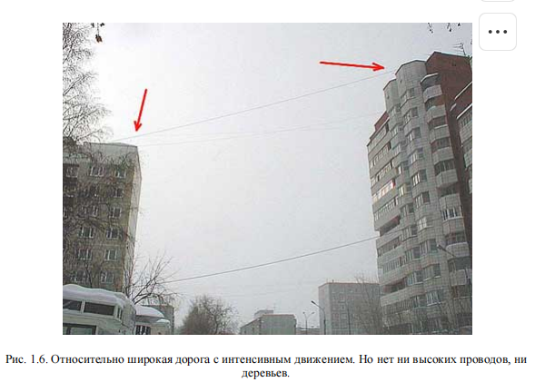

**Рис. 1.6.** Относительно широкая дорога с интенсивным движением. Но нет ни высоких проводов, ни деревьев.

10. Переход между домами №1–2 проведён по обычному методу. Крыши повыше, машин побольше. Всего протяжка заняла 3–4 часа тяжёлой работы.

Че делали

**Базовый цикл (то, что ты описал):**
1. Поднимаем кабель на крышу.
2. Спускаем с крыши.
3. Тянем до следующего дома.
4. Поднимаем на крышу следующего дома.
5. Протягиваем.
6. Повторяем для всего участка.

**Но в тексте есть нюансы:**

- **Подъём — не сразу всей бухты.** Сначала на крышу поднимают только конец кабеля (через верёвку), а бухту разматывают внизу, по мере чего кабель поднимается наверх. Поднять бухту целиком — плохой вариант: она тяжёлая и громоздкая.

- **Промежуточная фиксация.** Остаток кабеля, который пойдёт дальше, временно привязывают к дереву «внатяг», чтобы не мешал машинам и людям. Это не финальное крепление, а временное.

- **Обратный ход.** В этом тексте сначала **довели кабель до конца трассы** (дом №5), закрепили, а потом **пошли в обратную сторону** — натягивать и окончательно крепить. Натяжка делается вдвоём: один тянет, второй крепит на стойке.

- **Внимание к препятствиям.** При подъёме/спуске кабель проводят через растяжки антенн и провода радиофикации так, чтобы после натяжки они не мешали линии.

**Итого:** да, цикл «поднял → спустил → протянул → поднял на следующем» — правильный. Но:
- поднимают **конец**, а не всю бухту;
- есть **временные крепления** по пути;
- **финальная натяжка** идёт отдельным проходом, часто в обратную сторону;
- работают **минимум вдвоём** (один тянет, второй крепит).

### Эксперимент с длиной кабеля

Так как кабель П-296 использован впервые, решено провести эксперимент. Не стали отрезать конец (метров 50 из 500-метровой бухты) и подсоединили витопарный «хвостик» длиной 3 метра прямо к оконечному разъёму. На стороне абонента витая пара спущена с чердака и проведена по квартире. Всего ушло около 40 метров UTP.

Линия «такого» не перенесла: хотя «линки» на устройствах загорелись, и более приличное железо, скорее всего, заработало бы (позже был успешно сделан линк в «полную бухту»), в данном случае пришлось отрезать «запас». После этого всё пришло в норму.

 Что бл?

Проще говоря:

Они первый раз работали с кабелем П-296 и решили проверить: **будет ли интернет работать, если не отрезать лишний кусок кабеля?**

Что сделали:
- Оставили лишние **50 метров** кабеля в бухте (не отрезали).
- Прикрутили к нему маленький кусочек обычной витой пары (3 метра) и провели интернет в квартиру (там ещё 40 метров витой пары).

Что вышло:
- Интернет **не заработал** как надо.
- Лампочки на оборудовании загорелись (типа «связь есть»), но по факту ничего не работало.
- Автор думает: если бы оборудование было получше — может, и заработало бы. Позже у них получилось сделать связь даже на целой бухте.
- Но в тот раз пришлось **отрезать лишние 50 метров**.
- **После этого всё заработало нормально.**

**Вывод:** лишний кусок кабеля мешал. Отрезали — стало работать.

---

## Протяжка кабеля через оживлённую улицу

### Подготовка

<mark>По правилам подобные работы должны выполнять профессиональная бригада с участием ГАИ, перекрытием дороги и остановкой движения. Однако на практике ни разу не удалось быть свидетелем подобных действий</mark> (в том числе работников радиофикации или кабельного телевидения).

Стоимость полностью «правильных» работ немалая, а количество согласований ещё больше. Фактически остаётся прокладывать кабели на свой страх и риск. Речь может идти только о минимизации этого риска.

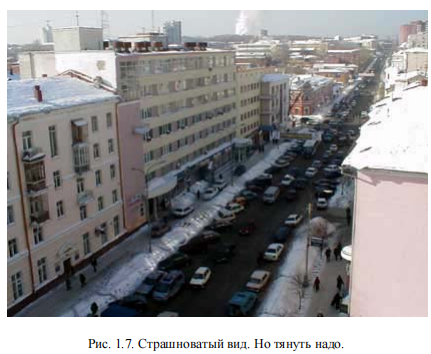

**Рис. 1.7.** Страшноватый вид. Но тянуть надо.

### Инструмент

- **Мягкая верёвка** средней толщины, примерно 4 мм в диаметре. Нитку использовать нежелательно — она путается, и кидать её неудобно. Жёсткий синтетический канат также неудобен.
- **Верёвка толстая** 8–10 мм, не менее 100 метров. Потребуется для перетяжки кабеля. Можно обойтись без неё, но стоимость обрыва может оказаться непомерно большой.
- **Груз** весом около 700–800 грамм, который можно хорошо привязать к концу верёвки. Хорошо подходит толстостенная трубка длиной сантиметров 10 (лучше, если на неё одет резиновый шланг). Идеальный вариант — специальный мешочек с песком или мелкой дробью. На крайний случай подойдёт камень, но лучше позаботиться заранее.
- **Рации** — значительно удобнее сотовых телефонов (связь мгновенна, это может быть важно).

### Люди

<mark>Потребуется не менее четырёх человек, лучше пять. Обязательно один из работников должен уметь хорошо перекидывать верёвку через провода. Если опыта нет — потренироваться заранее.</mark> Оживлённая улица не место для экспериментов.

<mark>Известно много способов «перекидывания» верёвки: промышленная рогатка, арбалет, спиннинг, даже теннисный мячик.</mark> Если в бригаде есть специалисты в подобном спорте — повезло. В противном случае применение технологических новинок может принести больше неприятностей: запутанные на трубостойках лески, выбитые окна и тому подобные следствия ошибочных бросков вполне реальны.

<mark>Самый стабильный результат даёт перебрасывание верёвки «с земли». Кидать верёвку с грузом нужно по типу пращи, только не раскручивать, а просто «с замаха»: держать за верёвку на расстоянии 20–30 см от груза, пару раз качнуть и кинуть.</mark> При некоторой сноровке провода на уровне 3–4 этажа проблемой не будут.

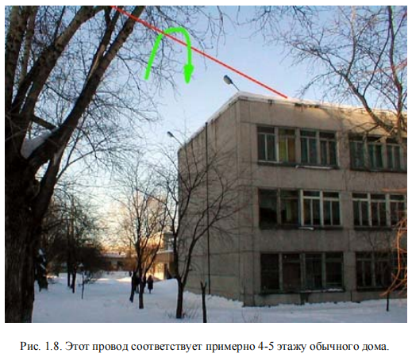

**Рис. 1.8.** Этот провод соответствует примерно 4–5 этажу обычного дома.

Самый высокий провод, который приходилось перебрасывать (выделен красной линией): с середины крыши 3-этажной школы провод уходит через дорогу на крышу 12-этажки.

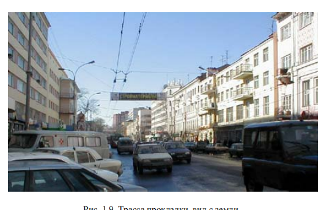

**Рис. 1.9.** Трасса прокладки, вид с земли.

С обеих сторон улицы «освещёнка». Провода высокие и, самое неприятное, стоят очень близко к дорогим окнам кафе и ресторана. Масса припаркованных автомобилей. На проезжей части — троллейбусные провода и мощный поток машин.

Действовать желательно рано утром. Согласовать выходы на крыши, подготовиться. Работа ночью без «прикрытия» — верный способ попасть в отделение милиции. Если улица днём совершенно непроходима, желательно озаботиться присутствием знакомого из какого-либо силового ведомства.

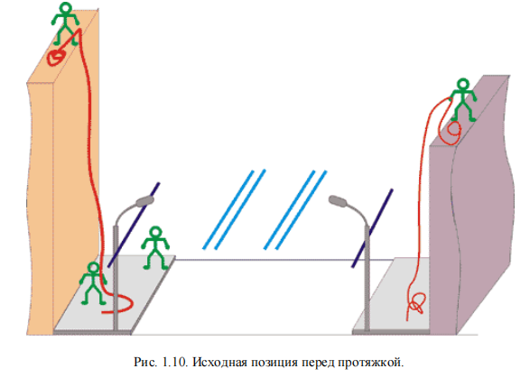

**Рис. 1.10.** Исходная позиция перед протяжкой.

На рисунке — исходная позиция. На неё можно выходить не торопясь, помех это никому не создаст. Но дальше нужно действовать быстро и аккуратно.

- Человек сверху справа — пока статист.
- Сверху слева — управляет верёвкой. Это не синекура: в один момент нужно ослабить, в другой — натянуть, в третий — перейти вдоль крыши, чтобы удобно обойти препятствие.
- Двое внизу — основной «перекидывающий» и помощник.

**Задачи помощника:**
1. Постоянно держать верёвку натянутой (не туго, но без слабины). Иначе она запутается, её затопчут прохожие, а на проезжей части — и того хуже.
2. Выдавать «перекидывающему» конец удобной длины, помогать укладывать верёвку перед броском.

Метать груз удобно, стоя почти под проводами, в полоборота. Важно хорошо уложить верёвку — кольцами на ровном месте. Витки обязательно должны идти сверху вниз, если смотреть от груза.

Остаётся выбрать удобное место, дождаться «окна» в потоке машин и перекинуть верёвку.

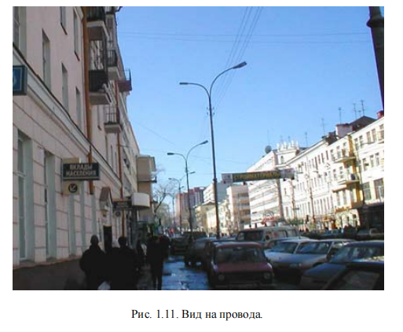

**Рис. 1.11.** Вид на провода.

**Опасные факторы:**
1. Можно запутать конец на высоте. Старайтесь не вытягивать груз обратно при неудачном броске. При подъёме (быстром уменьшении плеча маятника) груз может начать раскачиваться, и верёвка перекрутится несколько раз вокруг провода. Поэтому опускайте неудачно перекинутый груз, отвязывайте его, вытягивайте верёвку, привязывайте опять. Если верёвка запуталась — можно либо вызывать автовышку, платить, или (очень вредный совет) потихоньку покинуть место работ.
2. Недокинуть груз до провода так, что он упадёт на машину (прохожего, стекло). Тут не помешает пара помощников, которые смогут «подстраховать» место падения.

### Дорога

Удачный бросок. Груз аккуратно перелетел через провода и плавно спустился до земли. Далее нужно перетянуть всю верёвку через провода. Если на ней нет узлов, это несложно. Бояться напряжения не надо — «освещёнка» днём отключена (в случае силовых проводов придётся действовать втройне аккуратно).

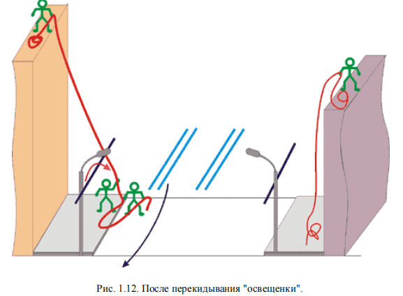

**Рис. 1.12.** После перекидывания «освещёнки».

В таком положении нужно оказаться после перекидывания верёвки через первую «освещёнку». Чёрной стрелочкой обозначено движение машин, которым придётся так или иначе вас объезжать. Главное — не нервничать, действовать спокойно и предсказуемо.

Перекидывание троллейбусных проводов по сути ничем не отличается. Только придётся действовать быстро — всё происходит посередине оживлённой дороги. Многое зависит от расторопности помощника: придержать, подать, подтянуть, ослабить. Даже задержать на минуту поток автомобилей (в конце концов, все люди, и можно договориться).

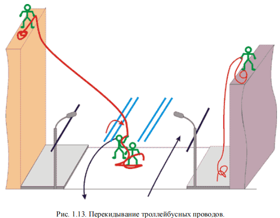

**Рис. 1.13.** Перекидывание троллейбусных проводов.

Следующая позиция. Ничего нового, главное — добраться до неё быстро, за 2–3 минуты. Троллейбусные токонесущие провода (как и трамвайные) сверху защищены проволокой. Поэтому нет ничего страшного в том, что на них лежит верёвка. Помощник при этом должен держать верёвку «внатяг», чтобы она не мешала проезду машин.

Действуя по описанному алгоритму (верёвку уложить кольцами, кинуть, перетянуть, уложить), попадаем в следующую ситуацию:

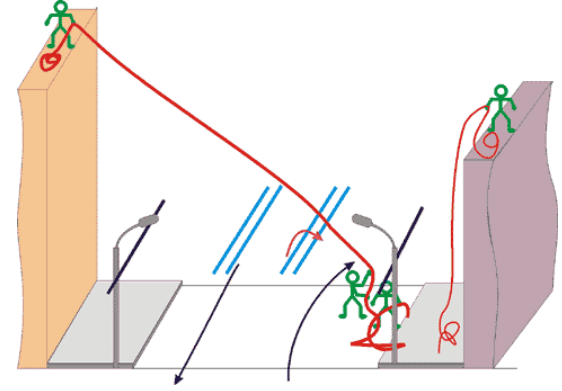

**Рис. 1.14.** Вторая троллейбусная линия.

Дорога пройдена. Можно не торопиться, передохнуть перед последним этапом. Всё выглядит просто на рисунке, в реальности гораздо сложнее. Провода идут близко от дома, всего в 2–2,5 метрах. Плюс к этому — козырёк кафе и магазина, огромные стёкла. Кидать в сторону витрин и окон нельзя: слишком велик шанс промахнуться.

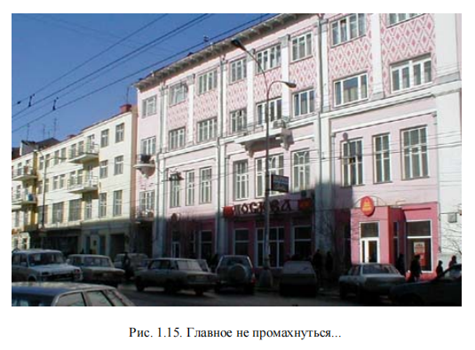

**Рис. 1.15.** Главное не промахнуться...

Поэтому перекидывается конец другой верёвки, как показано стрелочкой, «от дома» к дороге. Задача помощника — держать верёвку максимально высоко, в натяг с крыши дома, чтобы ничего не мешало проезду машин и троллейбусов, до тех пор, пока не будет перекинута через «освещёнку» вторая верёвка.

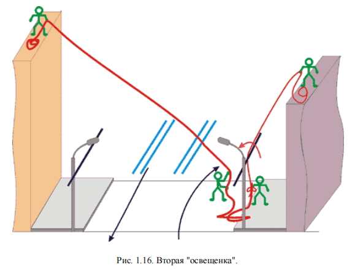

**Рис. 1.16.** Вторая «освещёнка».

В реальности описанной протяжки пришлось перекидывать именно неправильно. Сделать «правильно» помешали припаркованные на обочине машины — между ними не было достаточного для броска просвета. А отступать поздно.

> **Приём «подсечка»** — резкая остановка груза в верхней точке траектории (например, наступив на бухту верёвки), из-за чего груз резко меняет направление и падает по крутой траектории.

Операция деликатная, рекомендовать её к обычному применению нельзя.

Дальше всё просто: верёвки связываются и вытягиваются на крыши. Придерживать их с земли надо «до последнего», чтобы ничего не запуталось. Особенно внимательно надо следить за протяжкой через провода узла, желательно делать это «с волной». Резкое движение конца верёвки, чтобы пустить «бегущую волну», делать умеют наверное все. Тут это надо сделать в нужный момент.

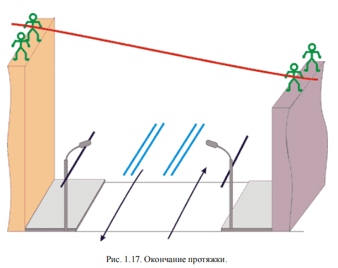

**Рис. 1.17.** Окончание протяжки.

Затем все поднимаются на крышу и помогают коллегам перетянуть кабель, закрепить его, развести по крыше. Заодно порадоваться сделанной работе.

**Рис. 1.18.** Вид сверху.

---

## Борьба с деревьями

Больше всего протягивать кабели мешают не широкие дороги с большим потоком машин, а обычные деревья. Они встречаются гораздо чаще, а преодолевать их иногда даже сложнее, чем автострады.

Самый неприятный случай — когда деревья выше крыш домов. Строительство линии превращается в акробатику, требующую не только «отработанного» броска верёвки с камнем, но и навыков древолазания.

### Простой пример

Для работы понадобилось две верёвки средней толщины длиной около 40 метров и 3 человека.

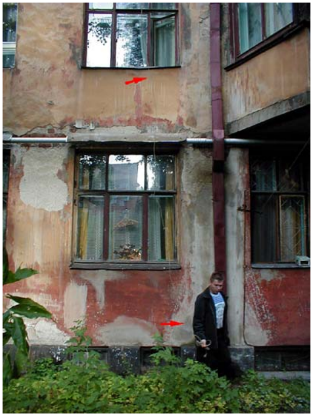

**Рис. 1.19.** Спуск верёвки с первого дома.

Выбрано место, где спуску верёвки не помешают балконы, трубы и прочие элементы советской градостроительной архитектуры.

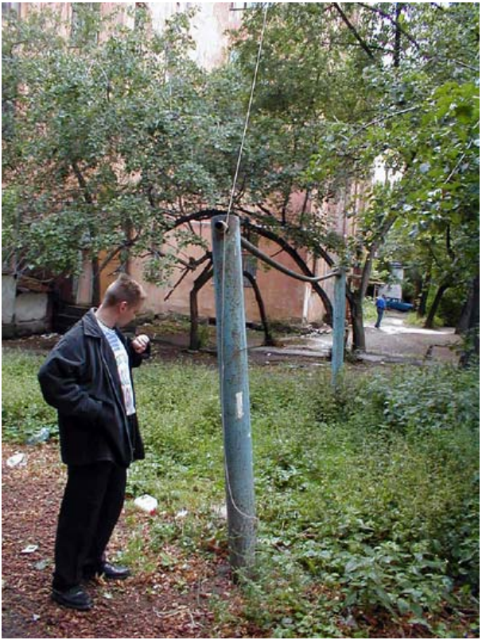

**Рис. 1.20.** Верёвка закреплена перед дальнейшей работой.

Выбрано место, где на линии предполагаемой протяжки растёт минимальное количество деревьев. Спущенная ранее верёвка обведена между невысоких деревьев (скорее кустарников) и закреплена так, чтобы ничего не мешало её подъёму вверх.

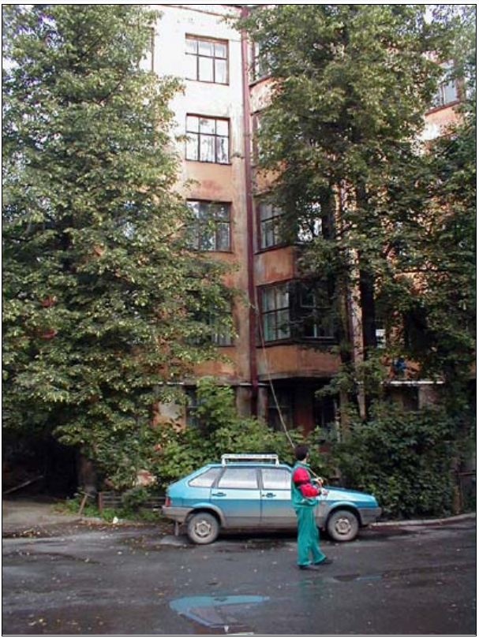

**Рис. 1.21.** Спуск верёвки со второго дома.

То же самое повторяется с другой стороны протяжки. Вторая верёвка спущена с крыши и «обведена» вокруг дерева так, чтобы оказаться над ним (в данном случае частично).

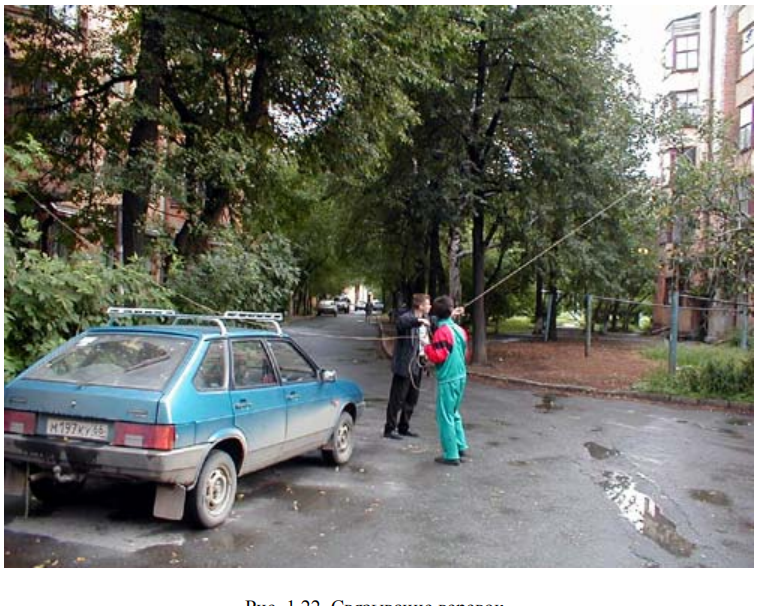

**Рис. 1.22.** Связывание верёвок.

Верёвки сводятся вместе и связываются прочным узлом (ведь с их помощью будет перетянут кабель).

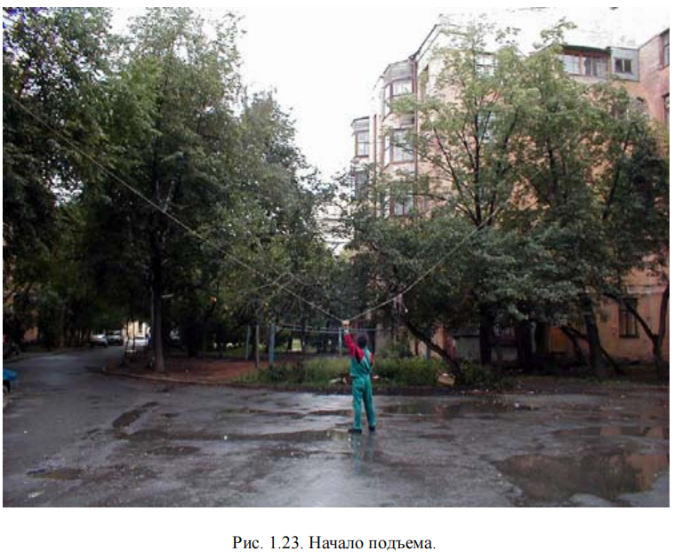

**Рис. 1.23.** Начало подъёма.

При подъёме необходимо постараться до последнего придерживать верёвку, чтобы она аккуратно миновала все ветви деревьев. Бывало, что качание при резком подъёме так запутывало верёвку, что приходилось начинать сначала не только работу, но и покупать новую оснастку.

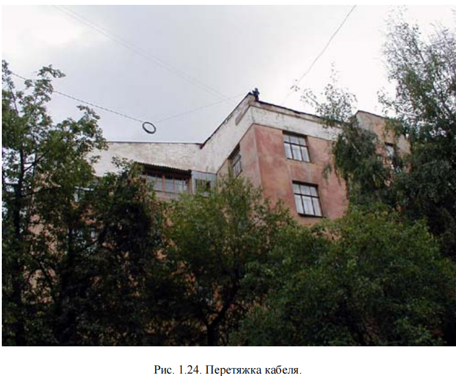

**Рис. 1.24.** Перетяжка кабеля.

К концу поднятой и слегка натянутой верёвки привязывается кабель (в данном случае оптоволокно) и не торопясь перетягивается на другую сторону. Вся работа заняла примерно 20–30 минут.

### «Уральские джунгли»

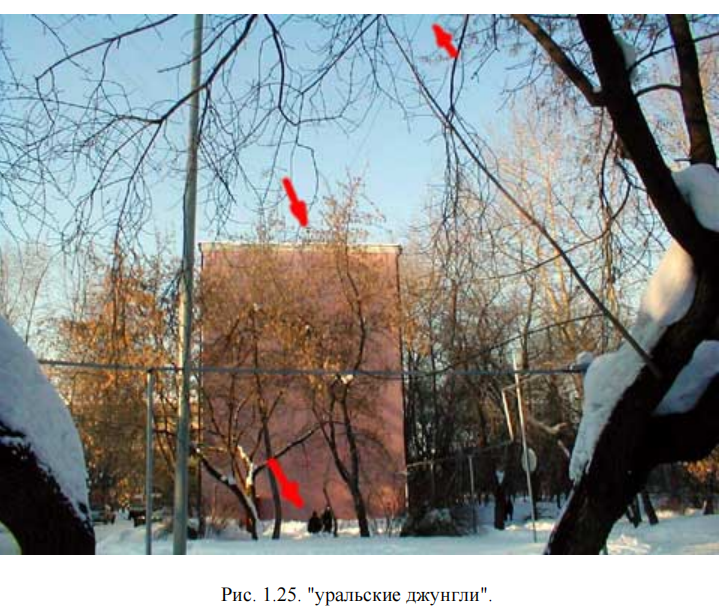

**Рис. 1.25.** «Уральские джунгли».

Протянутый кабель (показан красными стрелками) практически не виден за ветками даже зимой. Летом всё выглядит как сплошная зелёная стена.

Первый снимок сделан примерно с середины 200-метровой протяжки. Второй — с места, где стоят люди (обозначено красной стрелкой), немного не доходя до стены 5-этажки, на которой крепится один конец кабеля.

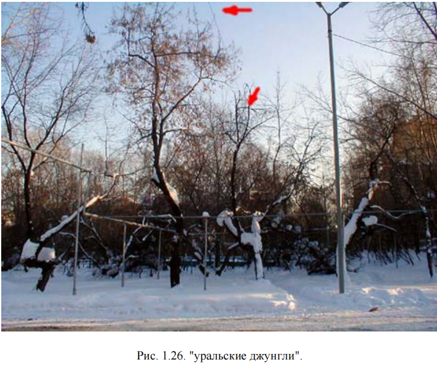

**Рис. 1.26.** «Уральские джунгли».

Сколько ни пытался найти между деревьев «окошечко» с прямой видимостью до дома, на который уходит линия, — не смог.

Данная протяжка делалась спешно, в условиях цейтнота. Нужно было срочно подключить дом, где жил коммунальный начальник районного масштаба, хотя бы временно, не считаясь со сложностями. Дешёвого оборудования радио-Ethernet тогда (в 1999/2000 году) не было.

Обойти практически невозможно: с одной стороны военный госпиталь (а за ним большой парк), с другой — комплекс зданий нескольких екатеринбургских институтов с совершенно непонятными зонами ответственности. Отступать было некуда.

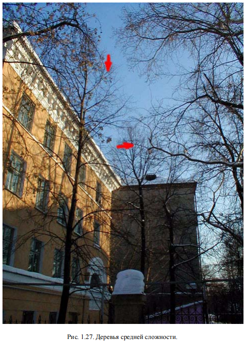

**Рис. 1.27.** Деревья средней сложности.

Немного вдали виден дом (серая хрущёвка), куда приходит провод (обозначен красными стрелками). Слева — недоступное здание, имеющее отношение к министерству образования.

Этот участок протяжки был относительно несложен. Верёвка спущена с крыши и «обведена» между ветками (насколько это было возможно).

**Метод обхода деревьев:**
1. Один человек внизу и один на крыше держат верёвку «внатяг».
2. Передвигаясь по земле, нужно постараться обойти деревья (или наиболее мешающие ветки) одно за другим.
3. Пройдя за дерево, отойти как можно дальше в сторону (насколько позволят соседние деревья).
4. Натянуть (поднять по диагонали с крыши) верёвку как можно выше и завести её уже сверху на дерево.
5. «Положить» верёвку на верхние тонкие ветви кроны.
6. Повторить операцию со следующим деревом.

На словах процесс несложен, однако реально часто бывает, что ветви соседних деревьев переплетаются, и нужно их перебрасывать подобно проводам освещения. Порой приходится преодолевать небольшие, но плотно сросшиеся деревья или кустарники.

Можно использовать разный подход к разным видам деревьев: прочность ветвей, их направление (вверх или вниз), гладкость коры — всё можно учитывать для максимально эффективной работы.

В данной протяжке с большим трудом, но удалось миновать деревья, растущие близко к зданиям. Однако в середине протяжки встретилась следующая проблема:

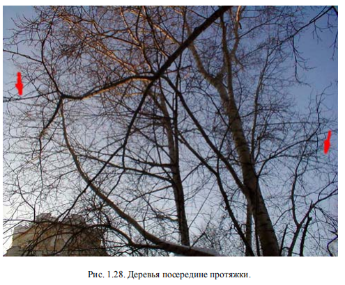

**Рис. 1.28.** Деревья посередине протяжки.

Такие деревья нельзя «обойти» с натянутой верёвкой. Их кроны выше крыш домов, и завести сверху ничего не получится. Остаётся только вариант подъёма с использованием перекидывания, срубания веток. Могут помочь дополнительные направляющие верёвки (с их помощью основной канат можно в некоторой степени отводить в сторону).

На рисунке почти безвыходная ситуация — кабель нужно было заранее провести между двух деревьев. Небольшая ошибка в первоначальном плане — и нужно по крайней мере половину работы начинать сначала.

Так как в данном случае строилась по сути времянка, было решено положиться на уникальные свойства П-296. Расчёт оправдался — через два года линия была спокойно заменена на постоянную (проложенную по другому маршруту).

### Деревья как угроза

Деревья мешают не только во время протяжки. Высокие тополя довольно часто ломаются. Небольшой шквалистый ветер — и можно наблюдать следующую картину:

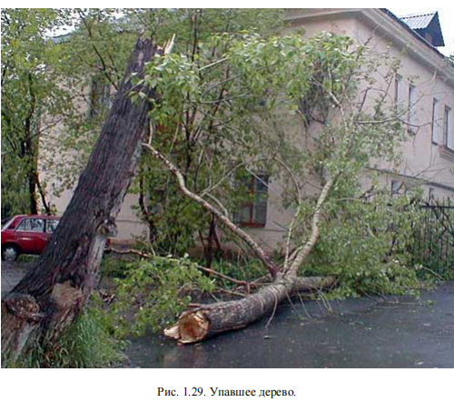

**Рис. 1.29.** Упавшее дерево.

Если на пути ствола или ветки встретится кабель — обрыв обеспечен. И хорошо, если не пострадают конструкции, где кабель был закреплён. Это нужно учитывать и по возможности избегать улиц, засаженных старыми тополями.

---

## Использование существующих коммуникаций

В современном городе с трудом можно найти крышу, через которую уже не проложены линии радиофикации, кабельного телевидения или даже телефонии. Не всегда они совпадают по направлению со строящейся сетью Ethernet, но такое бывает очень часто. Цели строителей этих весьма разных сетей во многом совпадают.

Можно ли использовать уже имеющиеся коммуникации? Безусловно.

**Самый простой способ** — разъединить имеющийся кабель, перетянуть его на одну сторону с двойной верёвкой, после чего вытянуть обратно (и привести соединение в прежнее состояние). К сожалению, рекомендовать подобное нельзя: трогать чужое имущество — далеко не лучший вариант.

В то же время есть два пути:
1. Часто кабельное хозяйство бывает брошенным (особенно этим грешат ранние сети кабельного телевидения), и его можно использовать практически без опасений.
2. Договориться с собственником на кратковременное рассоединение линии. Если услуга некритична — это вполне реально.

Ещё одна возможность — монтажники при предыдущих прокладках оставляют своеобразные «закладки» на будущее. Например, кусок полёвки, который проходит над сложной улицей и не ведёт к какому-либо оборудованию. После использования такой закладки очень желательно всё привести в исходное состояние — взаимная вежливость на крыше просто необходима.

### Веревкоход (проволокоход)

> **Веревкоход (проволокоход)** — самодвижущееся устройство, перемещающееся по натянутому кабелю, проволоке или тросу и предназначенное для доставки груза (верёвки, кабеля) между опорами.

Конструкций существует множество:

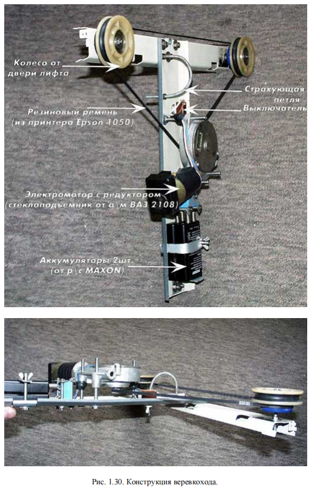

**Рис. 1.30.** Конструкция веревкохода.

**Потребительские свойства:**
- Заезжает по кабелю с углом 40–45°.
- Затем начинают пробуксовывать колёса.
- При грузе 3 кг проблем не возникало, скорость движения — 5 м/мин.
- Питание — два аккумулятора от радиостанций Maxon (10,8 В, 0,8 А·ч каждый), хватает на 1 час работы.

> **Автомобильная составляющая** — использование серийных автомобильных устройств с 12-вольтовым питанием (например, двигателя стеклоочистителя, сигнализации) в качестве основы для самодельных устройств.

Если приспособить автомобильную сигнализацию, можно получить весьма «умное» приспособление с дистанционным управлением, способное передвигаться в обе стороны и даже выполнять простейшие действия (например, «довезти» верёвку до определённой точки и отпустить конец). Доработка небольшая, но достаточно одной «хитрой» протяжки, чтобы все затраты окупились с лихвой.

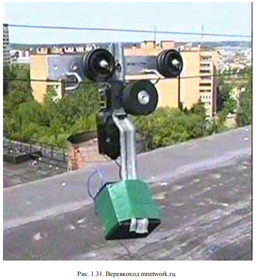

**Рис. 1.31.** Веревкоход mnetwork.ru.

Этот образец сделан на основе двигателя стеклоочистителя (12V BOSH) от «народного» автомобиля. Используются два направляющих пластиковых ролика и один «ведущий» резиновый, плюс аккумулятор (6 А·ч 12 В) от UPS. Тянет очень хорошо, может заезжать по проволоке, натянутой под 30–45°, и завозить за собой груз в 2–3 кг.

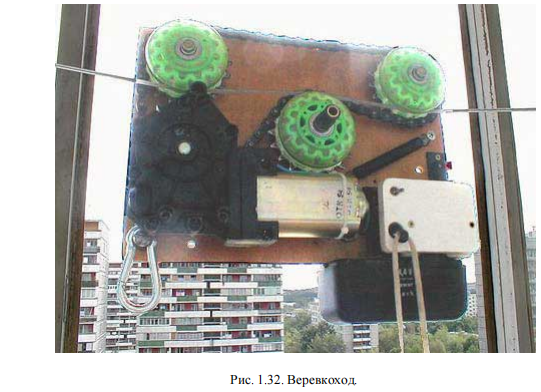

**Рис. 1.32.** Веревкоход.

Колёса использованы от роликовых коньков, цепь от велосипеда. Двигатель опять автомобильный.

При наличии заметной разницы в высоте между домами (большом наклоне существующего кабеля) можно обойтись без электропривода.

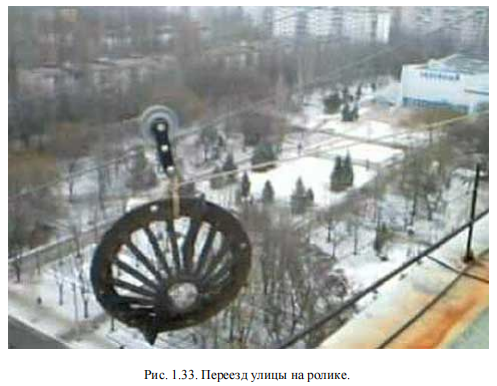

**Рис. 1.33.** Переезд улицы на ролике.

Длина пролёта, который был пройден в данном случае — около 300 метров. Простейшее устройство, всего несколько минут — и пролёт пройден.

> **Внимание!** Надо осознавать риск применения подобных приспособлений. Может произойти серьёзная трагедия, если что-то пойдёт не так. Применять самоделки надо очень осмотрительно, максимально страхуясь от несчастных случаев — от отказа системы до обрыва несущего кабеля.

**Главное:** нельзя применять в качестве груза случайные металлические конструкции. Мешочек с песком или мелкой дробью на порядок безопаснее. Фотография демонстрирует, как делать ни в коем случае не надо.

### Экстремальный метод (скользящая петля)

Следующий материал можно отнести к разряду экстремальных. К повторению рекомендуется только в самых редких случаях, когда при большом наклоне несущего кабеля ролик не требуется.

Линия «предшественников» упрощала задачу — при большом перепаде высот хотелось просто опустить петлю с новым кабелем «по направляющей» П-296. Однако попытка была неудачной. Петля из оптоволокна с несущим тросом, не достигнув и половины пути, остановилась. Сильный боковой ветер и малый вес оптоволокна свели на нет все усилия.

По-хорошему, надо остановиться и начать заново с лучшей технической подготовкой: применить ролик или более сложный самодвижущийся аппарат. Но действует обычная штурмовщина, сильна вера в «авось»... И бригада решается на опасный трюк.

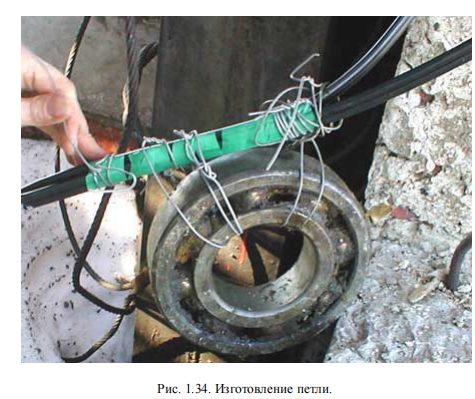

**Рис. 1.34.** Изготовление петли.

Если мал вес — его можно легко добавить, не стесняясь, тяжёлым подшипником. А внизу, надо заметить, оживлённая улица. Люди ходят толпами, машины ездят...

Примотали, не жалея стальной проволоки. Если рухнет, то только вместе с опорным П-296. Перетереться ничего не может — петля с 5-миллиметровым тросом выдержит многое. П-296 тоже не гнилая нитка.

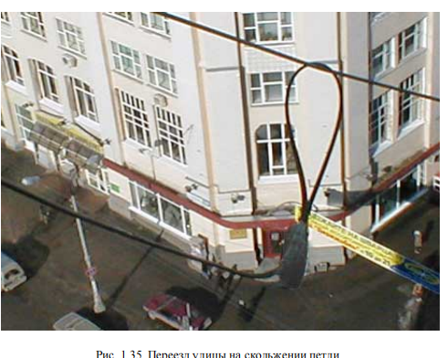

**Рис. 1.35.** Переезд улицы на скольжении петли.

Груз отпущен вниз и быстро удаляется по направлению к соседней крыше.

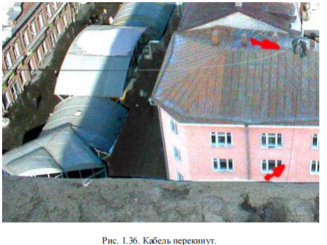

**Рис. 1.36.** Кабель перекинут.

...И вполне благополучно приходит в руки ожидающих монтажников. Вернее, почти приходит. Скольжение было настолько плохое, что пришлось немного потрясти опорный П-296 на последних метрах дистанции — петля застряла, не доходя 8–10 метров. Впрочем, несколько рывков, и груз достигает цели. Кабель закрепляется, работа завершена...

**Повторюсь:** несмотря на вполне невинное окончание операции, повторять её крайне не рекомендуется. Вера в «авось» может и культурная традиция России, но и о технике безопасности надо подумать.

---

## Столбы освещения и стены домов

Когда говорят о прокладке оптоволокна, всплывает традиционная картина: открытые люки, кабель, уходящий под землю, бригада работников ГТС в спецовках и кирзовых сапогах... Проволока на два квартала и грузовичок-техничка.

Для тех, кто сталкивался с домашними сетями, — это крыши, проволока, верёвки. Перекидывание через провода, деревья, крепление за мрачные качающиеся конструкции...

Но есть третий путь. Что делать, когда на трассе кабеля нет домов (и соответственно крыш)? Либо они недоступны или неудобны? В этом случае возможна прокладка по столбам освещения (электроснабжения, трамвайно-троллейбусным опорам) или по стенам домов. Так как они часто дополняют друг друга (ввод в здание со столба обычно идёт по стене), данные методы объединены под общим заголовком.

### Преимущества и недостатки

**Преимущества:**
- Прокладка по столбам освещения очень удобна для строительства магистралей.
- Проще легализовать — меньше инстанций (обычно достаточно согласия собственника столбов и управления архитектуры).
- Хорошая защита от вандалов: если провод размещён на столбе или на стене, до него значительно сложнее добраться, чем до крыши. Злоумышленник значительно более заметен в процессе своего «дела».

**Недостатки:**
- Прокладка требует разрешений, проекта, что стоит немалых денег.
- Работа более дорогостоящая, трудоёмкая, требует специальных навыков и оснастки (лестниц, автовышки).
- Более чем вероятна арендная плата за использование имущества (в основном касается столбов).

Разумеется, не исключена плата и за прокладку кабелей по крышам. Но в российских реалиях она обычно меньше или вообще отсутствует.

Тем не менее, использование столбов и стен — мощный и эффективный инструмент Ethernet-провайдера. В Екатеринбурге так проложено несколько десятков (если не сотен) километров провайдерских магистралей. Хорошая альтернатива грабительским расценкам прокладок по канализации Электросвязи.

Рассматриваемый способ в мире не нов:

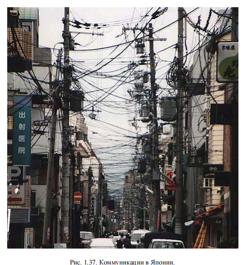

**Рис. 1.37.** Коммуникации в Японии.

В Японии такие коммуникации используют не от хорошей жизни — в условиях частых землетрясений прокладывать трассы под землёй почти невозможно.

### Примеры

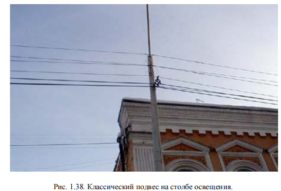

**Рис. 1.38.** Классический подвес на столбе освещения.

Тут подвешен не один, а сразу три кабеля (бывает и больше). Проблем с такими линиями немного, были бы в порядке столбы. Использовано оптоволокно с внешним несущим тросом («восьмёрка»), его можно крепить к самым недорогим подвесным системам.

**Этапы работ:**
1. Установка крепежа на столбы. Обычно делается с простой раздвижной лестницы, только в исключительных случаях применяется автовышка. Так проходится вся трасса, заодно определяется план работ и сложные участки.
2. Подвеска кабеля. Сначала (вчерновую) — без натяга, столб за столбом проходится монтажниками с кабелем. Часто его для удобства сматывают восьмёркой, так и переносят по всей трассе (и даже оставляют бухту на ночь привязанной повыше на столбе).
3. Возможна и работа «с барабана». Технически последний способ сложнее, но считается, что при этом риск повреждения кабеля минимален. Впрочем, на практике, вдали от инструкций и начальников, разница отсутствует — кабель перед крепежом всё равно разматывается по земле, так как тяжёлая тележка с барабаном неповоротлива и неудобна.
4. Сложные места (деревья, оживлённые улицы) преодолеваются с автовышкой. Перебросить кабель тут мало — нужно его ещё правильно закрепить на большой высоте.
5. Натяжение. Проводится от середины линии к краям. Так же последовательно, столб за столбом, трасса приводится в надлежащий вид. Однако автовышку второй раз стараются не вызывать, и часто в результате процесса можно видеть следующие «артефакты»:

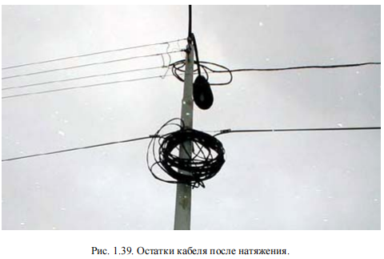

**Рис. 1.39.** Остатки кабеля после натяжения.

Внешне хорошего в такой картине мало, однако разварка в муфту стоит дорого, снижает надёжность и по сути не добавляет изящества линии. В то же время такой «остаток» можно использовать в будущем для ремонта или разветвления. Так и висит бухточка кабеля до лучших времён.

Всем хороша магистраль по столбам. Однако при таком способе прокладки самым непростым делом становится ввод кабеля в точку назначения. Сложно попасть в здание, удалённое более чем на несколько десятков метров от линии столбов. Порой приходится проложить кабель по нескольким домам, чтобы наконец попасть в нужный.

Линия при этом может выглядеть следующим образом:

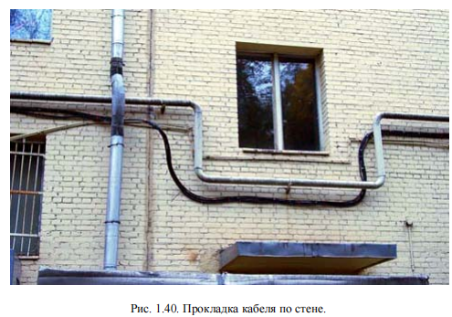

**Рис. 1.40.** Прокладка кабеля по стене.

Хорошо заметно, что тонкий кабель идёт параллельно с более толстым телефонным. Такая прокладка значительно безопаснее в плане гроз (и вандалов), поэтому телефонисты уже несколько десятилетий обходят стороной крыши в пользу стен (хотя из этого правила хватает исключений).

Тут даже не надо придумывать ничего особенного — достаточно копировать опыт более «старших» коллег. К сожалению, в настоящий момент провайдеры используют прокладку по стене очень редко. Вернее сказать — незаслуженно редко.

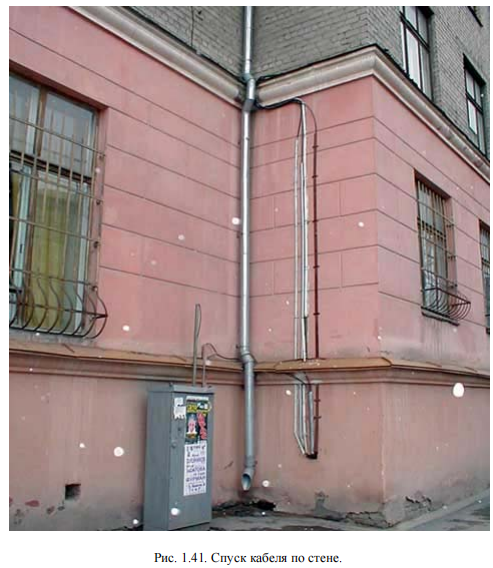

**Рис. 1.41.** Спуск кабеля по стене.

Простейший металлический жёлоб является достаточно надёжной защитой — показанные на фотографии линии нормально работают в течение более чем десяти лет.

### Почему эти способы редки?

1. **Предыстория.** Многие современные Ethernet-провайдеры «выросли» из полулегальных любительских структур, им просто непривычно прокладывать кабели легально.
2. **Сроки.** Согласования проектов проводятся не быстро, порой на это могут уйти месяцы. Для такой быстрорастущей отрасли, как провайдинг, это слишком долго. Клиент обычно столько не ждёт, уходит к конкуренту. А работать «на опережение» для небольших фирм слишком дорого и сложно.

Девиз «повыше на крышу, подальше от надзора» не будет выигрышной стратегией долго. Легализация неизбежна — и с ней придёт опыт использования как стен, так и столбов освещения.

---

## Крепление и подвес кабеля

История подвешивания кабеля в воздухе насчитывает уже несколько веков. За это время выработано великое множество приспособлений и технологий. В специализированной фирме можно увидеть каталоги, содержащие сотни позиций разнообразного крепежа.

Но стоимость специализированного оборудования весьма велика, тратить несколько десятков долларов на точку большинству домашних сетей не по карману. Поэтому ниже рассмотрены способы сделать надёжную линию без больших затрат.

### Выбор точки крепления

Начать протяжку нужно с выбора точки крепления кабеля на крыше дома. Хороших мест не так и много. А законных, к сожалению, того меньше. Строго говоря, крепить можно только в место, согласованное с владельцем дома или эксплуатирующей организацией. Либо к трубостойке (анкеру), специально предназначенной для крепления воздушных линий по проекту.

> **Трубостойка (анкер)** — металлическая стойка, закреплённая на крыше или стене здания, предназначенная для крепления воздушных линий связи.

**Первая возможность** — стойки радиофикации и телевизионные антенны. Крепить к ним просто и удобно. Единственная проблема — могут возникнуть вопросы от собственников стоек. При их урегулировании кабельная инфраструктура буквально обретает «землю под ногами». Поэтому данный способ безусловно наиболее предпочтительный.

Что делать, если трубостоек нет или их владельцы категорически против? Если идти полностью законным путём, остаётся один выход — согласовывать место крепления, возможно ставить свою трубостойку. Это реально, но не дёшево.

> **Требование к точке крепления:** в случае форс-мажорных обстоятельств кабельная линия должна разрушиться заведомо раньше, чем точка крепления.

Поэтому ни в коем случае нельзя использовать для крепежа ограждения крыш (это опаснейший вариант) и прочие недостаточно прочные элементы.

Хорошо подойдут арматурные крюки капитальных стен, перекрытий, стропила деревянных крыш и т.п. При их отсутствии можно, например, установить анкер в стену.

**Долговечность узла.** Проволока, трос, стяжки — все используемые материалы не должны иметь люфта, ведущего к постепенному перетиранию элементов. Также нельзя использовать материалы «на излом» или другим способом, ведущим к преждевременному разрушению.

### Способы подвеса

Можно разделить протяжки на два принципиально разных способа:
- **С использованием троса (проволоки).**
- **Самонесущий кабель.**

### Расчёт натяжения

Выбор допустимого натяжения как кабеля, так и троса (проволоки) можно рассчитать по формуле:

$$T = \frac{PL}{8F}$$

где:
- $P$ — вес кабеля, Н/м (кг/м);
- $T$ — натяжение кабеля, Н (кг);
- $L$ — длина пролёта, м;
- $F$ — стрела провиса, м.

> **Стрела провиса** — максимальное вертикальное отклонение кабеля (троса) от прямой линии между точками крепления.

Далее, взяв значение допустимого напряжения для проволоки, можно получить её минимальный диаметр.

Однако на практике расчётами никто себя не утруждает. Тем более, допустимые величины получаются очень небольшими. Так, по одной из прикидок, для 200-метрового пролёта достаточно проволоки диаметром 0,8 мм — и это с двукратным запасом прочности.

В результате была применена оцинкованная 3-миллиметровая проволока, недорогая и удобная в работе. Полагаю, что 4–5 мм хватит с огромным запасом на самые длинные и сложные линии. Так как стоимость проволоки невелика, экономить на ней нет смысла.

### Нормативы СНиП 3.05.06-85

> **3.81.** Диаметр и марка каната, а также расстояние между анкерными и промежуточными креплениями каната определяются в рабочих чертежах. Стрела провеса каната после подвески кабелей должна быть в пределах 1/40 — 1/60 длины пролёта. Расстояния между подвесками кабелей должны быть не более 800–1000 мм.

То есть при протяжке в 200 метров нормальная величина стрелы провеса (отклонение вниз от идеальной прямой) должна составлять порядка 5 метров (а это целых 2 этажа). Из этого можно вывести два важных вывода:

1. Если линия проходит над какими-либо инженерными коммуникациями, нельзя рассчитывать, что кабель пройдёт по прямой линии между точками.
2. Не надо пытаться натянуть трос «как струну». Пользы это не принесёт, только лишняя нагрузка на материалы. Поэтому нет смысла массово применять тали и лебёдки — подавляющее большинство линий можно натянуть силами 2–3 человек.

### Протяжка с использованием троса (проволоки)

Принцип строительства линии понятен из названия: кабель любого типа по всей длине крепится к несущей проволоке (тросу), которая берёт на себя все механические нагрузки.

**Что использовать — проволоку или трос?**

Трос лучше: он пластичней и прочнее при том же диаметре. Но при этом заметно дороже и более подвержен коррозии. С другой стороны, кабель — не лифт, нагрузка намного меньше, да и ущерб при падении не так велик. Поэтому трос (желательно в пластиковой изоляции или с гальваническим покрытием) обычно используется только в самых сложных, исключительных случаях. В остальных достаточно проволоки.

### Работа с проволокой

Самое сложное — разматывать её так, чтобы не допустить образование «барашков».

> **«Барашек»** — петля, узел или перекрут на проволоке, возникающий при неправильном разматывании; почти 100% гарантия разрыва линии.

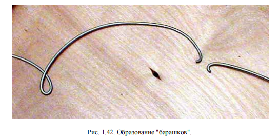

**Рис. 1.42.** Образование «барашков».

Особенно часто они возникают, если проволока разматывается не со специального вращающегося держателя, а через край, виток за витком. Только чуть-чуть расслабиться, недоглядеть — проволока перекрутится, и в линию уйдёт маленький и незаметный «барашек». При всей внешней безобидности это почти 100% разрыв. Последствия могут быть весьма тяжёлыми.

Самое неприятное — проволока может сломаться не сразу. Иногда через час, иногда через неделю. А иногда и через год.

**Пример из практики:** при протяжке 350-метрового пролёта тяжёлой бронированной оптикой использовалась 4-миллиметровая проволока вполне достойного качества. Но через несколько недель она переломилась. Кабель оказался прочным, выбрал слабину и провис над ремонтной базой. Раскачиваясь на ветру, сломал антенну на одном из строений. Озлобленное руководство базы дало команду крановщику порвать кабель. История дальше была длинная, но закончилась тривиально: муфта, сварка и повторно сделанная работа. Всё за свой счёт. А виноват был всего-то «барашек» на проволоке.

### Соединение проволоки

Второй навык, совершенно необходимый для работы с проволокой — умение её соединять. Вязать сталь как верёвку нельзя: усталость материала рано или поздно сделает своё кристаллическое дело.

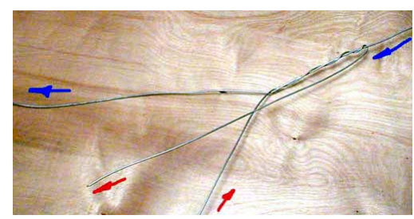

**Рис. 1.43.** Начало сращивания проволоки.

**Порядок сращивания:**
1. Концы проволоки берутся немного «накрест» навстречу друг другу с приличным запасом (около 60–70 см).
2. Один конец обвивается вокруг другой проволоки примерно на 1/3–1/4 оставленного «запаса».
3. То же самое проделывается со вторым концом.
4. Концы проволоки загибаются и навиваются в обратном направлении уже навстречу друг другу.

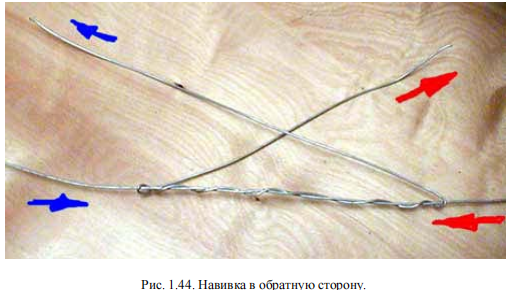

**Рис. 1.44.** Навивка в обратную сторону.

Чем плотнее навита проволока, тем лучше.

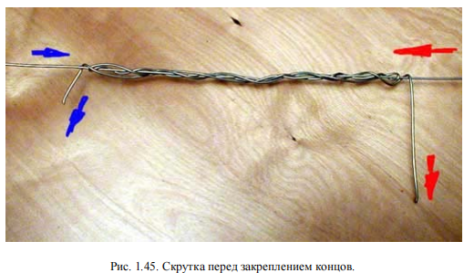

**Рис. 1.45.** Скрутка перед закреплением концов.

5. Закрепить оставшиеся концы проволоки. Можно завести оставшийся конец «под петлю», как показано слева. Но красивее смотрится плотная намотка на проволоку, как видно справа. Можно и сочетать оба метода.
6. «Обкусить» оставшиеся кончики. Желательно это сделать так, чтобы при необходимости через получившуюся скрутку можно было относительно безболезненно «протащить» арматуру подвеса кабеля в обе стороны.

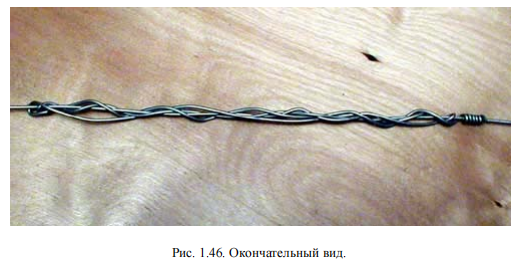

**Рис. 1.46.** Окончательный вид.

При самом минимальном навыке работа по соединению занимает несколько минут. Выполнить её вполне по силам одному человеку, хотя с помощником значительно удобнее.

**Важно:** как ни надёжна скрутка — без неё всё же намного лучше. Поэтому проволоку нужно разматывать очень аккуратно.

### Крепёж кабеля к проволоке

Способы крепежа кабеля к тросу (проволоке) можно разделить на два типа.

#### Тип 1: Соединение перед протяжкой

Кабель растягивается рядом с тросом и прикрепляется (с небольшим запасом) через 0,6–0,8 метра кусочками проволоки или жестяными скобами. Иногда используют капроновые стяжки, но они могут разрушаться под действием ультрафиолета или морозов, поэтому применять их нежелательно.

В стеснённых условиях можно осуществлять крепёж такого типа и по мере протяжки линии. Для этого понадобится несколько дополнительных монтажников, или работа приобретёт циклический характер: протяжка 5 метров — остановка для крепления — и т.д.

После протяжки кабель жёстко прикреплён к проволоке и может смещаться лишь незначительно, в пределах одной-двух точек крепления. Это позволит немного выправить неравномерность крепежа, но не более того. Как монтаж, так и демонтаж проволоки придётся проводить только вместе с кабелем.

**Минусы:** с кабелем линию сложнее натягивать, его нельзя оперативно заменить без полного демонтажа, повреждение (особенно оптики) в ходе работ более вероятно. **Плюсы:** удобно для коротких линий с лёгким кабелем, навыки минимальные, работа быстрая.

#### Тип 2: Сначала проволока, затем кабель

Для сложных длинных протяжек, особенно с тяжёлым кабелем, рационально сначала натянуть проволоку, а затем по ней провесить кабель. Самое простое — использовать скользящие зажимы из проволоки (хотя фабричные металлические скобы более надёжны).

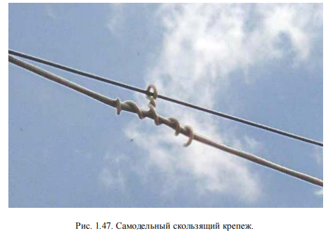

**Рис. 1.47.** Самодельный скользящий крепёж.

Перед началом работ следует позаботиться о том, чтобы после протяжки проволоки осталась ещё одна верёвка (иначе работу по её перекидыванию на другую крышу придётся повторить). Затем кабель неторопясь, по одной петле, надевается на проволоку и перетягивается верёвкой на соседнюю крышу.

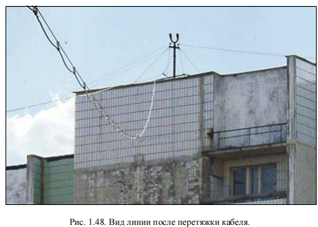

**Рис. 1.48.** Вид линии после перетяжки кабеля.

По завершении протяжки нужно «не в натяг» зафиксировать концы кабеля.

### Подвес на «спирали»

Следующий способ более прогрессивен. Он быстрее, менее трудоёмок и вместе с тем обеспечивает значительно лучшую защиту кабеля. Минус — не слишком симпатичный вид линии после протяжки.

> **Спираль** — плотная пружина из проволоки толщиной около 1,5–2 мм с диаметром витков около 100 мм, намотанная на токарном станке.

Соотношение длины спирали в начальном состоянии и после растяжения задать сложно, но легко регулировать в процессе протяжки, добавляя или убирая витки с линии.

**Технология:**
1. Протягивается проволока (или трос). Сразу натягивается и хорошо закрепляется. Особенно удобно на больших пролётах, где вес имеет большое значение. Желательно до этого надеть на проволоку «спираль». Но можно легко это сделать и после — последовательной навивкой.
2. Внутрь «спирали» пропускается кабель, конец которого вместе с концом «спирали» привязывается к ранее протянутой верёвке.

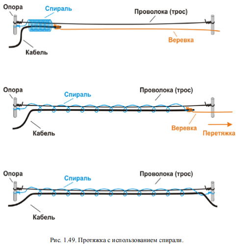

**Рис. 1.49.** Протяжка с использованием спирали.

3. При помощи верёвки кабель и конец спирали перетягиваются на другую сторону. При этом первоначально плотная пружина растягивается по трассе протяжки, образуя надёжный канал с кабелем и проволокой (тросом) внутри.

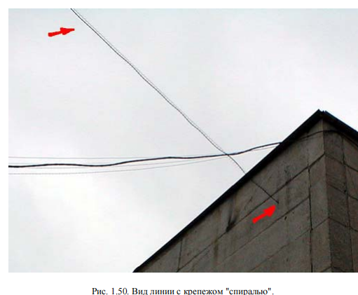

**Рис. 1.50.** Вид линии с крепежом «спиралью».

Если присмотреться, видно, как извивается подвешенный кабель. Это говорит о том, что лежит он свободно, не испытывая никаких нагрузок.

**Аналог:** у показанной технологии есть патентованный аналог — способ крепежа под брендом FlexTender продвигает компания «General Corporation» (Япония).

### Крепление самонесущего кабеля

Самонесущий кабель бывает двух видов:
- **С внешним тросом («восьмёрка»).**
- **С внутренними упрочняющими элементами** (наиболее распространён П-296).

#### Кабель-«восьмёрка»

С креплением проблем не возникает. Конец несущего троса отделяется от кабеля и закрепляется наиболее удобным способом за опору. Если линия предполагается к сдаче в ГСН — желательно использовать специальный сертифицированный крепёж. В противном случае можно использовать более простой способ.

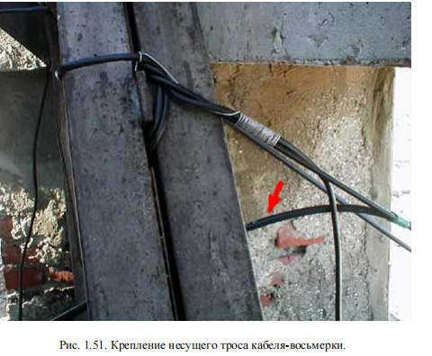

**Рис. 1.51.** Крепление несущего троса кабеля-восьмёрки.

Красной стрелкой показан кабель, трос которого завязан на опоре. При этом узлов нет — для фиксации использована проволока.

#### Кабель с внутренними упрочняющими элементами (П-296)

Значительно сложнее крепить самонесущий кабель с внутренними упрочняющими элементами. Классический пример — П-296, внутренняя металлическая оплётка которого легко выдерживает нагрузку около 100 кг.

По сути единственный цивилизованный способ — спиральные зажимы. Существуют ещё клиновые зажимы, но они менее удобны и заметно дороже, поэтому распространения не получили.

**Рис. 1.52.** Крепление при помощи спирального зажима.

> **Спиральный зажим** — устройство из нескольких сталистых проволок, соединённых вместе и скрученных в спираль; на внутреннюю поверхность нанесён абразив, препятствующий скольжению. В процессе крепежа зажим наматывается на кабель, и чем больше усилие, вытягивающее его из спирали, тем плотнее сжимается зажим.

Механизм прост и весьма надёжен. Однако стоимость спирального зажима составляет более десяти долларов, не всегда эти средства имеются в наличии. Поэтому часто применяются решения подобные следующему:

**Рис. 1.53.** Крепление самонесущего кабеля подручными средствами.

В данном случае использован кусок резинового шланга для защиты изоляции, металлический пруток и сантехнические хомуты. Также известны способы, использующие самозатягивающийся проволочный бандаж (подобно спиральному зажиму) или альпинистский инвентарь для крепления верёвок.

При крайней нужде можно обернуть кабель несколько раз вокруг трубостойки и закрепить концы проволокой. Метод не слишком красивый, но надёжный и простой. Правда, такое обращение может выдержать только медный кабель типа П-296. С оптоволокном эксперименты проводить не рекомендуется.

---

## FAQ

**Вопрос:** Можно ли работать на крыше без страховки?
**Ответ:** Нет. Работать на крыше можно только застрахованным (привязанным), особенно если крыша не плоская и не окружена высоким капитальным бордюром.

**Вопрос:** Какое минимальное количество человек нужно для протяжки кабеля через оживлённую улицу?
**Ответ:** Не менее четырёх, лучше пять. Один из них обязательно должен уметь хорошо перекидывать верёвку через провода.

**Вопрос:** Что такое «барашек» на проволоке и чем он опасен?
**Ответ:** «Барашек» — это петля или перекрут на проволоке, возникающий при неправильном разматывании. Это почти 100% гарантия разрыва линии, причём проволока может сломаться не сразу, а через час, неделю или даже год.

**Вопрос:** Можно ли использовать капроновые стяжки для крепления кабеля к проволоке?
**Ответ:** Нежелательно. Они могут разрушаться под действием ультрафиолета или морозов. Лучше использовать проволоку или жестяные скобы.

**Вопрос:** Что делать, если верёвка запуталась на высоте?
**Ответ:** Можно либо вызывать автовышку и платить, либо (очень вредный совет) потихоньку покинуть место работ. Лучше не допускать этого: не вытягивать груз обратно при неудачном броске, а опускать его, отвязывать и вытягивать верёвку.

**Вопрос:** Какая стрела провиса считается нормальной?
**Ответ:** По СНиП 3.05.06-85 — в пределах 1/40 — 1/60 длины пролёта. Для 200-метрового пролёта это порядка 5 метров.

**Вопрос:** Можно ли крепить кабель к ограждениям крыш?
**Ответ:** Ни в коем случае. Это опаснейший вариант. Точка крепления должна быть прочнее кабельной линии, чтобы при форс-мажоре разрушилась линия, а не крепление.

**Вопрос:** Чем опасны старые тополя на трассе прокладки?
**Ответ:** Они довольно часто ломаются. Небольшой шквалистый ветер — и упавшее дерево может оборвать кабель. По возможности следует избегать улиц, засаженных старыми тополями.

**Вопрос:** Можно ли использовать существующие коммуникации для протяжки?
**Ответ:** Да, но осторожно. Нельзя трогать чужое имущество без разрешения. Если кабельное хозяйство брошено — можно использовать. Если нет — договориться с собственником на кратковременное рассоединение. После использования «закладок» желательно привести всё в исходное состояние.