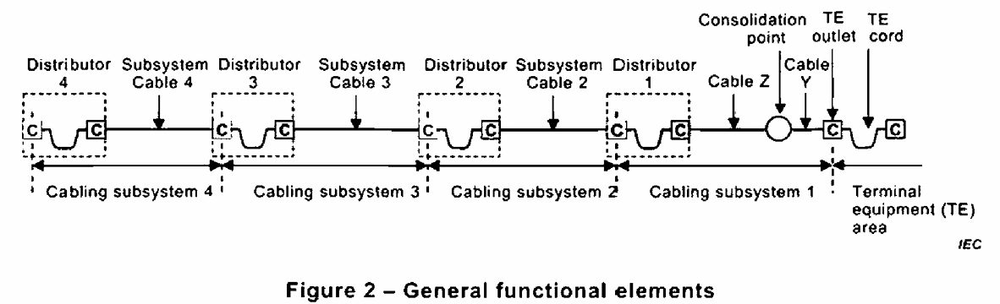
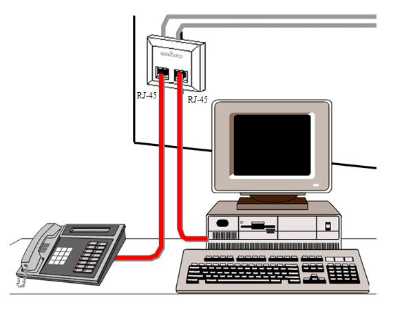
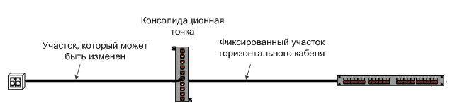
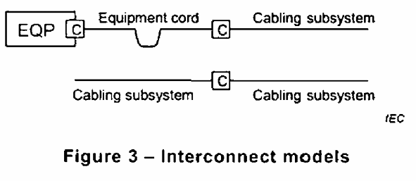
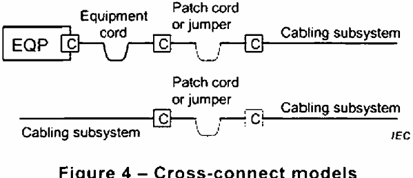
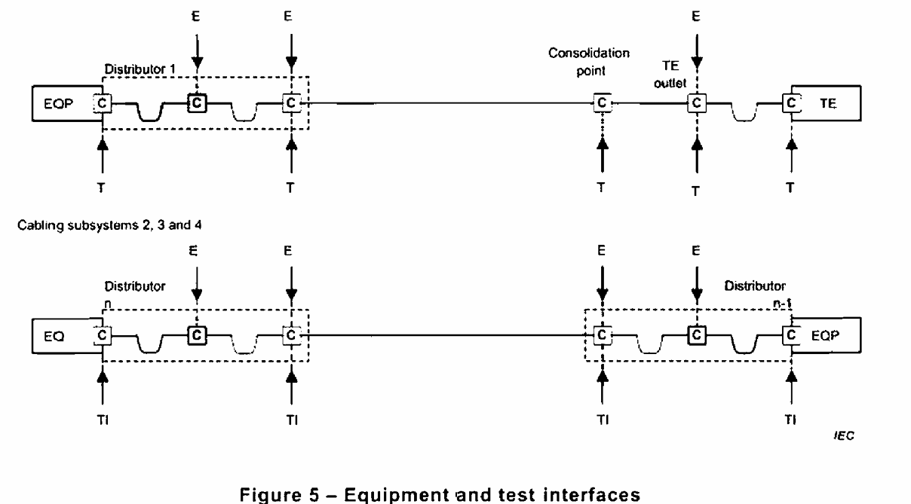

<strong>Кратко</strong>
<table><tr><td>

Кратко и простым языком:

**Универсальная кабельная система** — это стандартная кабельная сеть в здании (для интернета, телефонии, видеонаблюдения и т.п.). Она строится из типовых элементов, как конструктор.

**Основные элементы:**
- **Розетка** — куда включаешь устройство (ноутбук, телефон).
- **Консолидационная точка (CP)** — промежуточный узел между розеткой и распределительным пунктом. Через неё оборудование напрямую не подключают.
- **Кабель подсистемы** — кабель от розетки к распределительному пункту (если есть CP, делится на части Y и Z).
- **Дистрибьютор** — главный узел, где кабели соединяются и переключаются.
- **Другие кабели и дистрибьюторы** — для более сложных сетей.

**Как соединяется:**
- **Активно** — через оборудование (коммутатор и т.п.).
- **Пассивно** — просто соединение кабелей:
    - **Межсоединение** — напрямую, без шнура.
    - **Кроссировка** — через патч-корд или перемычку.

**Термины:**
- **Патч-корд** — гибкий шнур для соединения.
- **Перемычка** — кусок кабеля без разъёмов.
- **Сращивание** — соединение проводов или волокон напрямую.

**Интерфейсы:**
- **EI (интерфейс оборудования)** — где подключают рабочее оборудование (концы подсистем, дистрибьюторы).
- **TI (интерфейс испытаний)** — где проверяют кабель (концы подсистем, консолидационные точки).
- **CP** — только промежуточный узел, не для подключения оборудования.

**Подсистемы:**
- **Подсистема 1** — от дистрибьютора 1 до розетки.
- **Подсистемы n > 2** — от дистрибьютора n до дистрибьютора n−1.
- **Внешние магистрали комплекса зданий** — между зданиями.
- **Внутренние магистрали здания** — между дистрибьюторами внутри здания.
- **Связующие кабели** — дополнительные прямые соединения между дистрибьюторами одного уровня.

**Канал и постоянная линия:**
- **Канал** — весь путь передачи между двумя устройствами (например, коммутатор → компьютер), включая все шнуры.
- **Постоянная линия** — путь внутри установленной кабельной системы, включая соединения на концах, но без шнуров рабочей зоны и оборудования.

**Важно:** шнуры терминального оборудования и шнуры оборудования не считаются частью подсистемы кабельной системы, потому что зависят от приложения.

</td></tr></table>

# 5. Структура универсальной кабельной системы

## 5.1. Функциональные элементы

<mark><strong>Универсальная кабельная система</strong></mark>, специфицируемая стандартами по проектированию кабельных систем, <mark><strong>содержит некоторые или все функциональные элементы, показанные на рис. 2.</strong></mark>

> **Универсальная кабельная система (generic cabling)** — структурированная телекоммуникационная кабельная система, способная поддерживать широкий спектр стандартизованных приложений.

> **Функциональный элемент (functional element)** — <mark><strong>составная часть универсальной кабельной системы, выполняющая определённую функцию</strong></mark> (розетка, консолидационная точка, кабель подсистемы, дистрибьютор и т.д.).

**Рис. 2 — Общие функциональные элементы**

Эти элементы включают:

- **a)** телекоммуникационную розетку терминального оборудования (TE outlet);

- **b)** консолидационную точку (consolidation point, CP);

- **c)** кабель подсистемы 1 (разделённый на кабель Y и кабель Z при наличии консолидационной точки);
- **d)** дистрибьютор 1;
- **e)** другие кабели подсистем (2, 3 и 4 на рис. 2);
- **f)** другие дистрибьюторы (2, 3 и 4 на рис. 2).

> **Телекоммуникационная розетка (telecommunications outlet, TO); розетка терминального оборудования (terminal equipment outlet)** — фиксированное соединительное устройство, обеспечивающее интерфейс к терминальному оборудованию.

> **Консолидационная точка (consolidation point, CP)** — точка соединения в подсистеме горизонтальной кабельной системы между этажным дистрибьютором и телекоммуникационной розеткой.

> **Дистрибьютор (distributor)** — функциональный элемент, обеспечивающий оконцевание и соединение подсистем кабельной системы с другими подсистемами кабельной системы или передающим оборудованием.

Группы этих функциональных элементов соединяются вместе, образуя подсистемы кабельной системы. Наличие и термины, применяемые к каждому из функциональных элементов, специфицируются в стандартах по проектированию кабельных систем.

<mark><strong>Соединения между подсистемами кабельной системы являются либо активными, требующими оборудования приложений, либо пассивными. </strong></mark>Подключение к оборудованию приложений использует либо подход межсоединения, либо подход кроссировки (см. рис. 3 и рис. 4). Пассивные соединения между подсистемами кабельной системы обычно выполняются с использованием кроссировок посредством коммутационных шнуров, перемычек или сращиваний.

> **Межсоединение (interconnect)** — пассивное соединение с подсистемой кабельной системы без использования коммутационного шнура или перемычки.

> **Кроссировка (cross-connection)** — соединение посредством кросса; кросс — пассивное соединение между подсистемами кабельной системы с использованием коммутационного шнура или перемычки.

> **Коммутационный шнур (patch cord)** — шнур, используемый для кроссировки.

> **Перемычка (jumper)** — кабель, кабельный узел или кабельный элемент без соединителей, используемый для кроссировки.

> **Сращивание (splice)** — соединение проводников или оптических волокон, обычно из отдельных оболочек.

В случае централизованной кабельной системы пассивные соединения в дистрибьюторах выполняются с использованием кроссировок или межсоединений. Кроме того, для централизованной волоконно-оптической кабельной системы возможно создание соединений в дистрибьюторах с использованием сращиваний, хотя это снижает способность кабельной системы поддерживать реконфигурацию.

**Рис. 3 — Модели межсоединения**

**Рис. 4 — Модели кроссировки**

<strong>Проще</strong>
<table><tr><td>

Простыми словами: это описание того, из чего состоит универсальная кабельная система (например, для интернета, телефонии и других слаботочных сетей в здании).

### Главная идея
Универсальная кабельная система — это «конструктор» из стандартных частей. Она может поддерживать разные приложения: интернет, телефон, видеонаблюдение и т.п.

### Основные элементы
1. **Розетка** — то, куда ты включаешь кабель устройства (ноутбука, телефона, телевизора).
2. **Консолидационная точка (CP)** — промежуточный узел между розеткой и главным распределительным пунктом. Нужна, чтобы удобнее переключать и перекладывать кабели.
3. **Кабель подсистемы** — сам кабель, который идёт от розетки к распределительному пункту. Если есть CP, кабель делится на две части: Y и Z.
4. **Дистрибьютор** — главный распределительный узел, где кабели соединяются и переключаются.
5. **Другие кабели и дистрибьюторы** — дополнительные части для более сложных систем.

### Как всё соединяется
Соединения бывают:
- **Активные** — нужны устройства (например, коммутатор).
- **Пассивные** — просто соединение кабелей без электроники.

Пассивные соединения делают двумя способами:
- **Межсоединение** — напрямую, без шнура.
- **Кроссировка** — через патч-корд или перемычку.

### Термины
- **Патч-корд** — гибкий шнур для соединения.
- **Перемычка** — кусок кабеля без разъёмов.
- **Сращивание** — соединение проводов или волокон напрямую.

### Вывод
Это стандартное описание того, как устроена кабельная сеть в здании: розетки → промежуточные точки → распределительные узлы. Всё соединяется либо напрямую, либо через патч-корды.

</td></tr></table>

## 5.2. Интерфейсы

Интерфейсы оборудования к универсальной кабельной системе расположены на концах каждой подсистемы. Любой дистрибьютор может иметь интерфейс оборудования к внешней службе на любом порту и может использовать либо межсоединения, как показано на рис. 3, либо кроссировки, как показано на рис. 4. Консолидационная точка не обеспечивает интерфейс оборудования к универсальной кабельной системе. На рис. 5 показаны потенциальные интерфейсы оборудования к подсистемам кабельной системы.

> **Интерфейс оборудования (equipment interface, EI)** — точка, в которой оборудование приложений может быть подключено к универсальной кабельной системе или кабельной системе сетевого доступа.

Интерфейсы испытаний к универсальной кабельной системе расположены на концах каждой подсистемы и в консолидационных точках, где они присутствуют. На рис. 5 показаны потенциальные интерфейсы испытаний к подсистемам кабельной системы.

> **Интерфейс испытаний (test interface, TI)** — место, где происходит соединение между испытательным оборудованием и кабельной системой, подлежащей испытанию.

**Рис. 5 — Интерфейсы оборудования и испытаний**

<strong>Про интерфейсы</strong>
<table><tr><td>

Простыми словами: тут объясняется, **где именно можно подключать оборудование и где можно проверять кабельную систему**.

### 1. Интерфейс оборудования (EI)
Это **точка, куда подключается реальное оборудование** (компьютер, коммутатор, телефон и т.п.).

Где он находится:
- **На концах каждой подсистемы** — то есть в начале и в конце кабельного участка.
- **В любом дистрибьюторе** — можно подключить внешнюю службу (например, интернет от провайдера) к любому порту.
- **Способы подключения**: либо напрямую (межсоединение), либо через патч-корд (кроссировка).

Важно:
- **Консолидационная точка (CP) — это НЕ интерфейс оборудования.** Через неё нельзя подключить устройство напрямую. Это просто промежуточный узел для кабеля.

### 2. Интерфейс испытаний (TI)
Это **точка, куда подключают测试ное оборудование**, чтобы проверить кабель.

Где он находится:
- **На концах каждой подсистемы** — с обеих сторон.
- **В консолидационных точках** — если они есть.

То есть: если нужно проверить кабель, ты подключаешься именно в этих местах.

### Коротко
| Что | Где | Зачем |
|---|---|---|
| **EI** (интерфейс оборудования) | Концы подсистем, дистрибьюторы | Подключить рабочее оборудование |
| **TI** (интерфейс испытаний) | Концы подсистем, консолидационные точки | Проверить кабель |
| **CP** (консолидационная точка) | Между розеткой и дистрибьютором | Промежуточный узел, **не** для подключения оборудования |

### Аналогия
Представь удлинитель:
- **EI** — это розетки, куда ты включаешь приборы.
- **TI** — это места, где можно замерить напряжение.
- **CP** — это просто соединительная муфта на самом удлинителе, в неё ничего не включают.

</td></tr></table>

## 5.3. Подсистемы кабельной системы

### 5.3.1. Подсистема кабельной системы 1

Подсистема кабельной системы 1 простирается от дистрибьютора 1 до подключённой к нему телекоммуникационной розетки(ок) терминального оборудования (TE). Подсистема включает:

- **a)** кабель подсистемы 1 (или кабели Y и Z на рис. 2, если консолидационная точка поддерживается стандартом по проектированию кабельных систем и присутствует);
- **b)** перемычки и коммутационные шнуры в дистрибьюторе 1;
- **c)** механическое оконцевание кабеля подсистемы 1 (или кабеля Y на рис. 2, если консолидационная точка поддерживается стандартом по проектированию кабельных систем и присутствует) в телекоммуникационной розетке;
- **d)** механическое оконцевание кабеля подсистемы 1 в дистрибьюторе 1, включая соединительное оборудование, например межсоединения или кроссировки (см. рис. 3 и рис. 4);
- **e)** консолидационную точку (опционально, если поддерживается стандартом по проектированию кабельных систем);
- **f)** телекоммуникационные розетки.

> **Шнур терминального оборудования (terminal equipment cord)** — шнур, соединяющий терминальное оборудование с телекоммуникационной розеткой.

> **Шнур оборудования (equipment cord)** — шнур, соединяющий один конец подсистемы кабельной системы в дистрибьюторе с передающим оборудованием.

Хотя шнуры терминального оборудования и шнуры оборудования используются для подключения терминального и передающего оборудования соответственно к подсистеме кабельной системы, они не считаются частью подсистемы кабельной системы, поскольку являются специфичными для приложения.

### 5.3.2. Подсистемы кабельной системы n > 2

Подсистемы кабельной системы n (для n > 2) простираются от дистрибьютора n до дистрибьютора n − 1. При наличии подсистема включает:

- **a)** кабели n;
- **b)** перемычки и коммутационные шнуры в дистрибьюторе n и дистрибьюторе n − 1;
- **c)** соединительное оборудование, на котором оконцовываются кабели n (в дистрибьюторе n и дистрибьюторе n − 1).

Хотя шнуры оборудования используются для подключения передающего оборудования к подсистеме кабельной системы, они не считаются частью подсистемы кабельной системы, поскольку могут быть специфичными для приложения.

### 5.3.3. Общие подсистемы

#### 5.3.3.1. Общие положения

Следующие подсистемы и связанные с ними дистрибьюторы используются в двух или более частях серии ISO/IEC 11801 и подробно описаны здесь для обеспечения соответствующих ссылок.

#### 5.3.3.2. Подсистема кабельной системы внешних магистралей комплекса зданий

При наличии подсистема кабельной системы внешних магистралей комплекса зданий включает:

- **a)** кабели внешних магистралей комплекса зданий;
- **b)** компоненты вводно-кабельных устройств зданий;
- **c)** перемычки и коммутационные шнуры в дистрибьюторах комплекса зданий и зданий (обычно расположенных в отдельных зданиях);
- **d)** соединительное оборудование, на котором оконцовываются кабели внешних магистралей комплекса зданий (в дистрибьюторах комплекса зданий и зданий).

> **Кабель внешней магистрали комплекса зданий (campus backbone cable)** — фиксированный кабель, соединяющий дистрибьюторы в подсистеме внешних магистралей комплекса зданий.

> **Дистрибьютор комплекса зданий (campus distributor, CD)** — дистрибьютор, от которого начинается кабельная система внешних магистралей комплекса зданий.

> **Вводно-кабельное устройство здания (building entrance facility, BEF)** — устройство, обеспечивающее все необходимые механические и электрические услуги и соответствующее всем соответствующим нормам, для ввода телекоммуникационных кабелей в здание.

#### 5.3.3.3. Подсистема кабельной системы внутренних магистралей здания

Подсистема кабельной системы внутренних магистралей здания простирается от дистрибьютора здания до следующих подключённых к нему дистрибьюторов:

- **a)** в ISO/IEC 11801-2: этажный дистрибьютор;
- **b)** в ISO/IEC 11801-3: этажный дистрибьютор;
- **c)** в ISO/IEC 11801-4: первичный домашний дистрибьютор;
- **d)** в ISO/IEC 11801-6: сервисный дистрибьютор.

При наличии подсистема кабельной системы внутренних магистралей здания включает:

1) кабели внутренних магистралей здания;
2) перемычки и коммутационные шнуры в обоих дистрибьюторах;
3) соединительное оборудование, на котором оконцовываются кабели внутренних магистралей здания (в обоих дистрибьюторах).

> **Кабель внутренней магистрали здания (building backbone cable)** — фиксированный кабель, соединяющий дистрибьюторы в подсистеме внутренних магистралей здания.

> **Дистрибьютор здания (building distributor, BD)** — дистрибьютор, в котором заканчиваются кабели внутренней магистрали здания и в котором могут выполняться соединения с кабелями внешней магистрали комплекса зданий.

### 5.3.4. Связующая кабельная система

> **Связующие кабели (tie cables)** — дополнительные фиксированные кабели, соединяющие дистрибьюторы одного иерархического уровня, которые устанавливаются в дополнение к базовой иерархической топологии.

Связующие кабели, обеспечивающие прямые соединения «точка-точка» между дистрибьюторами, являются опциональными и, при их наличии, должны быть дополнением к требуемым для базовой иерархической топологии.

При наличии связующая кабельная система включает:

- **a)** связующие кабели;
- **b)** перемычки и коммутационные шнуры в обоих дистрибьюторах;
- **c)** соединительное оборудование, на котором оконцовываются связующие кабели (в обоих дистрибьюторах).

### 5.3.5. Канал и постоянная линия

Передаточные характеристики универсальной кабельной системы подробно описаны в разделах 6 и 7 в терминах канала и постоянной линии.

> **Канал (channel)** — сквозной путь передачи, соединяющий любые два устройства приложений.

Канал — это путь передачи между оборудованием, таким как коммутатор/концентратор ЛВС (EQP на рис. 5), и терминальным оборудованием. Типичный канал межсоединения состоит из подсистемы кабельной системы 1 вместе со шнуром терминального оборудования и шнуром оборудования. Типичный канал кроссировки состоит из подсистемы кабельной системы 1 вместе со шнуром терминального оборудования, коммутационным шнуром или перемычкой и шнуром оборудования. Могут использоваться опциональные консолидационные точки. Для услуг с большей дальностью канал может быть образован соединением двух или более подсистем (включая шнуры терминального оборудования и шнуры оборудования). Производительность канала не включает соединения на оборудовании приложений.

> **Постоянная линия (permanent link)** — путь передачи между дистрибьюторами или между дистрибьютором 1 и телекоммуникационной розеткой, включая соединения на обоих концах.

Постоянная линия — это путь передачи установленной подсистемы кабельной системы, включая соединительное оборудование на концах установленного кабеля. В подсистеме кабельной системы 1 постоянная линия состоит из телекоммуникационной розетки, опциональной консолидационной точки (если поддерживается стандартом по проектированию кабельных систем), кабеля подсистемы 1 (или кабелей Y и Z на рис. 2, если консолидационная точка поддерживается стандартом по проектированию кабельных систем и присутствует) и оконцевания кабеля подсистемы 1 в дистрибьюторе 1. Постоянная линия включает соединения на концах установленной кабельной системы.

**Примечание.** Постоянная линия не включает шнуры рабочей зоны TE, шнуры оборудования, коммутационные шнуры и перемычки, но включает соединение на каждом конце. Она может включать опциональную консолидационную точку.

## FAQ

**Что такое функциональные элементы универсальной кабельной системы?**
Это телекоммуникационная розетка, консолидационная точка, кабели подсистем, дистрибьюторы и другие элементы, из которых строится кабельная система.

**Что такое подсистема кабельной системы 1?**
Это подсистема, простирающаяся от дистрибьютора 1 до телекоммуникационной розетки терминального оборудования.

**Что такое подсистемы n > 2?**
Это подсистемы, простирающиеся от дистрибьютора n до дистрибьютора n − 1.

**Что такое канал?**
Сквозной путь передачи, соединяющий любые два устройства приложений, например коммутатор ЛВС и терминальное оборудование.

**Что такое постоянная линия?**
Путь передачи установленной подсистемы кабельной системы, включая соединительное оборудование на концах установленного кабеля, но не включая шнуры рабочей зоны, шнуры оборудования, коммутационные шнуры и перемычки.

**Чем межсоединение отличается от кроссировки?**
Межсоединение — пассивное соединение с подсистемой без использования коммутационного шнура или перемычки; кроссировка — соединение посредством кросса с использованием коммутационного шнура или перемычки.

**Что такое консолидационная точка?**
Точка соединения в подсистеме горизонтальной кабельной системы между этажным дистрибьютором и телекоммуникационной розеткой.

**Что такое связующие кабели?**
Дополнительные фиксированные кабели, соединяющие дистрибьюторы одного иерархического уровня в дополнение к базовой иерархической топологии.

**Что такое дистрибьютор комплекса зданий?**
Дистрибьютор, от которого начинается кабельная система внешних магистралей комплекса зданий.

**Что такое дистрибьютор здания?**
Дистрибьютор, в котором заканчиваются кабели внутренней магистрали здания и в котором могут выполняться соединения с кабелями внешней магистрали комплекса зданий.

**Что такое вводно-кабельное устройство здания?**
Устройство, обеспечивающее все необходимые механические и электрические услуги для ввода телекоммуникационных кабелей в здание.

**Что такое интерфейс оборудования?**
Точка, в которой оборудование приложений может быть подключено к универсальной кабельной системе или кабельной системе сетевого доступа.

**Что такое интерфейс испытаний?**
Место, где происходит соединение между испытательным оборудованием и кабельной системой, подлежащей испытанию.

**Включает ли подсистема кабельной системы шнуры терминального оборудования и шнуры оборудования?**
Нет, они не считаются частью подсистемы кабельной системы, поскольку являются специфичными для приложения.