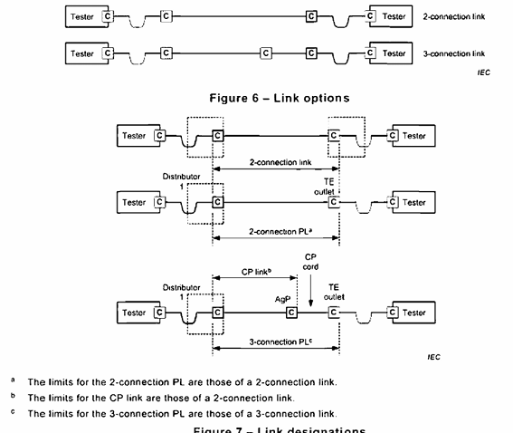

<strong>Кратко</strong>
<table><tr><td>
Кратко и простым языком о **разделе 7 «Требования к характеристикам линка»**:

**О чём это:**
Раздел описывает требования к **линку** — части кабельной системы между двумя точками соединения (например, между дистрибьютором и розеткой). Линк бывает двух типов:
- **2-соединительный линк** — два соединения (например, на дистрибьюторе и в розетке).
- **3-соединительный линк** — три соединения, включает консолидационную точку (CP) и шнур от неё до розетки.

Линк — это, по сути, **постоянная линия (permanent link)**: фиксированная часть кабельной системы без шнуров рабочей зоны и оборудования.

**Важные моменты:**
- Испытательная плоскость находится внутри испытательного шнура.
- Соединитель испытательного шнура, который стыкуется с линком, считается частью линка.
- Если шнур консолидационной точки меняется, измерения для 3-соединительного линка становятся недействительными.
- Линк с консолидационной точкой тестируется как 2-соединительный линк.

**Классы сбалансированных линков:**
- Classes A–FA, BCT-B, Class I и II.
- 2- и 3-соединительные линки поддерживаются классами A–FA.
- 3-соединительные линки **не поддерживаются** классами BCT-B, I и II.
- Номинальный импеданс — 100 Ом.

**Основные параметры линка:**
- **Return loss** — обратные отражения;
- **Insertion loss (затухание)** — ослабление сигнала;
- **NEXT / PS NEXT** — перекрёстные помехи на ближнем конце;
- **ACR-N / PS ACR-N** — отношение помех к затуханию на ближнем конце;
- **ACR-F / PS ACR-F** — перекрёстные помехи на дальнем конце;
- **DC loop resistance** — сопротивление шлейфа постоянному току;
- **DC resistance unbalance** — разбаланс сопротивления;
- **Propagation delay и delay skew** — задержка и разброс задержки;
- **TCL, ELTCTL, coupling attenuation** — для экранированных систем Class I и II;
- **Alien crosstalk (PS ANEXT, PS AACR-F)** — помехи от соседних кабелей (для Classes EA, FA, I, II).

**Коаксиальные линки (Class BCT-C):**
- Подклассы L и M, до 3000 МГц.
- Параметры: return loss, insertion loss, DC loop resistance, токовая нагрузка, screening attenuation.

**Оптические линки:**
- Затухание линка не должно превышать сумму затуханий компонентов.
- Используются требования к кабелю (Table 93) и соединительному оборудованию (Table 136).

**Коротко:**
Раздел 7 устанавливает, какими должны быть характеристики **линка** (постоянной линии) — в зависимости от класса, типа (2- или 3-соединительный) и типа кабеля (витая пара, коаксиал, оптика) — чтобы он мог быть частью канала и надёжно поддерживать приложения.

</td></tr></table>

# 7. Требования к производительности линии

## 7.1. Общие положения

Линия с 2 соединениями, показанная на рис. 7, может находиться либо в магистральной, либо в подсистемах кабельной системы для конкретных помещений (постоянная линия, PL), определённых в стандартах по проектированию кабельных систем. Обозначение TE зависит от применимой подсистемы кабельной системы.

> **Постоянная линия (permanent link, PL)** — путь передачи между дистрибьюторами или между дистрибьютором 1 и телекоммуникационной розеткой, включая соединения на обоих концах.

> **Линия с 2 соединениями (2-connection link)** — линия передачи, включающая два соединительных оборудования на концах (например, на дистрибьюторе и в телекоммуникационной розетке).

> **Линия с 3 соединениями (3-connection link)** — линия передачи, включающая три соединительных оборудования (например, на дистрибьюторе, в консолидационной точке и в телекоммуникационной розетке).

Линия с 3 соединениями, показанная на рис. 7, может встречаться в подсистемах кабельной системы для конкретных помещений, определённых в стандартах по проектированию кабельных систем, и также называется постоянной линией. Она включает фиксированный кабельный элемент от дистрибьютора 1 до консолидационной точки и шнур консолидационной точки до розетки TE. Обозначение консолидационной точки и TE зависит от применимой подсистемы кабельной системы. Измерения, выполненные для этой конфигурации, недействительны, если шнур консолидационной точки изменён.

> **Линия консолидационной точки (consolidation point link)** — часть постоянной линии между этажным дистрибьютором и консолидационной точкой, включая соединительное оборудование на каждом конце.

Линия консолидационной точки должна испытываться в соответствии с требованиями к линии с 2 соединениями. Название, применяемое к этой линии, определено в подсистемах кабельной системы для конкретных помещений, определённых в других частях серии ISO/IEC 11801.

Во всех конфигурациях эталонная плоскость испытаний линии находится внутри испытательного шнура. Соединитель испытательного шнура, который сочленяется с точкой оконцевания испытываемой линии, является частью испытываемой линии.

При измерении производительности при других температурах следует рассмотреть расчёт производительности для наихудшего случая при наихудших температурах.

**Рис. 6 — Варианты линии**

**Рис. 7 — Обозначения линий**

**Примечания к рис. 7:**
- a Пределы для 2-соединённой PL — это пределы линии с 2 соединениями.
- b Пределы для линии CP — это пределы линии с 2 соединениями.
- c Пределы для 3-соединённой PL — это пределы линии с 3 соединениями.

## 7.2. Симметричные кабельные системы

### 7.2.1. Общие положения

Подраздел 7.2 содержит требования к симметричным линиям классов A–FA, BCT-B, класса I и II.

Линии с 2 и 3 соединениями на рис. 6 и рис. 7 поддерживаются моделями линий классов A–FA.

Линии с 3 соединениями на рис. 7 не поддерживаются моделями линий класса BCT-B, класса I или II.

Параметры, указанные в 7.2, применяются к симметричным линиям с экранированными или неэкранированными кабельными элементами, с общим экраном или без него, если явно не указано иное. Когда требуется, измерения линий (включая необходимые для расчётов линий) должны выполняться согласно IEC 61935-1, если иное не указано в 7.2.

Номинальный импеданс симметричных линий составляет 100 Ом. Этот импеданс достигается соответствующим проектированием и надлежащим выбором кабельных компонентов.

Требования в 7.2 даны в виде пределов, вычисленных с точностью до одного десятичного знака, с использованием формулы для определённого частотного диапазона. Пределы для задержки распространения и разброса задержки вычислены с точностью до трёх десятичных знаков. Где уместно, в информативных таблицах для максимальной реализации на ключевых частотах значения $L$, $Y$ и $n$ составляют: $Y = 1$ для всех классов, $L = 90$, $n = 3$ для классов A–FA; $L = 7,8$, $n = 2$ для класса BCT-B-L; $L = 21,0$, $n = 2$ для класса BCT-B-M; $L = 26,0$, $n = 2$ для классов I и II. Требования к линиям по небалансному затуханию и затуханию связи — ffs. Многие спецификации в 7.2 имеют плато в заданном требовании. Эти плато неточно отражают производительность системы. Они добавлены для целей измерений.

### 7.2.2. Потери отражения

$RL$ каждой пары линии с 2 или 3 соединениями должна соответствовать требованиям, выведенным по формуле в табл. 46.

Значения $RL$ каждой пары линии на ключевых частотах приведены в табл. 47 только для информации.

Требования к $RL$ должны соблюдаться на обоих концах кабельной системы.

**Таблица 46. Потери отражения для линии с 2 или 3 соединениями**

| Класс | Частота, МГц | Минимальные потери отражения, дБ |
|---|---|---|
| C | 1 ≤ f ≤ 16 | 15,0 |
| D | 1 ≤ f < 20 | 19,0 |
| | 20 ≤ f ≤ 100 | 32 − 10·lg(f) |
| E | 1 ≤ f < 10 | 21,0 |
| | 10 ≤ f < 40 | 26 − 5·lg(f) |
| | 40 ≤ f ≤ 250 | 34 − 10·lg(f) |
| EA | 1 ≤ f < 10 | 21,0 |
| | 10 ≤ f < 40 | 26 − 5·lg(f) |
| | 40 ≤ f < 398,1 | 34 − 10·lg(f) |
| | 398,1 ≤ f ≤ 500 | 8,0 |
| F | 1 ≤ f < 10 | 21,0 |
| | 10 ≤ f < 40 | 26 − 5·lg(f) |
| | 40 ≤ f < 251,2 | 34 − 10·lg(f) |
| | 251,2 ≤ f ≤ 600 | 10,0 |
| FA | 1 ≤ f < 10 | 21,0 |
| | 10 ≤ f < 40 | 26 − 5·lg(f) |
| | 40 ≤ f < 251,2 | 34 − 10·lg(f) |
| | 251,2 ≤ f < 631 | 10,0 |
| | 631 ≤ f < 1000 | 38 − 10·lg(f) |
| BCT-B | 1 ≤ f < 10 | 21,0 |
| | 10 ≤ f < 100 | 27,6 − 6,3·lg(f) |
| | 100 ≤ f < 251,2 | 25 − 5·lg(f) |
| | 251,2 ≤ f < 600 | 25,7 − 5,3·lg(f) |
| | 600 ≤ f < 1000 | 36 − 9·lg(f) |
| I | 1 ≤ f < 3 | 21 + 4·lg(f/3) |
| | 3 ≤ f < 10 | 21,0 |
| | 10 ≤ f < 40 | 26 − 5·lg(f) |
| | 40 ≤ f < 100 | 18,0 |
| | 100 ≤ f < 464,2 | 42 − 12·lg(f) |
| | 464,2 ≤ f < 631 | 10,0 |
| | 631 ≤ f < 1000 | 38 − 10·lg(f) |
| | 1000 ≤ f < 1600 | 8,0 |
| | 1600 ≤ f ≤ 2000 | 8 − 19·lg(f/1600) |
| II | 1 ≤ f < 3 | 21 + 4·lg(f/3) |
| | 3 ≤ f < 10 | 21,0 |
| | 10 ≤ f < 40 | 26 − 5·lg(f) |
| | 40 ≤ f < 100 | 18,0 |
| | 100 ≤ f < 464,2 | 42 − 12·lg(f) |
| | 464,2 ≤ f < 631 | 10,0 |
| | 631 ≤ f < 1000 | 38 − 10·lg(f) |
| | 1000 ≤ f < 1600 | 8,0 |
| | 1600 ≤ f ≤ 2000 | 8 − 19·lg(f/1600) |

**Примечание.** Значения $RL$ на частотах, где вносимые потери ниже 3,0 дБ, приведены только для информации.

**Таблица 47. Информативные значения потерь отражения для линий на ключевых частотах**

| Частота, МГц | C | D | E | EA | F | FA | BCT-B | I | II |
|---|---|---|---|---|---|---|---|---|---|
| 1 | 15,0 | 19,0 | 21,0 | 21,0 | 21,0 | 21,0 | 21,0 | 19,1 | 19,1 |
| 16 | 15,0 | 19,0 | 20,0 | 20,0 | 20,0 | 20,0 | 20,0 | 20,0 | 20,0 |
| 100 | — | 12,0 | 14,0 | 14,0 | 14,0 | 14,0 | 15,0 | 18,0 | 18,0 |
| 250 | — | — | 10,0 | 10,0 | 10,0 | 10,0 | 13,0 | 13,2 | 13,2 |
| 500 | — | — | — | 8,0 | 10,0 | 10,0 | 11,4 | 10,0 | 10,0 |
| 600 | — | — | — | — | 10,0 | 10,0 | 11,0 | 10,0 | 10,0 |
| 1000 | — | — | — | — | — | 8,0 | 9,0 | 8,0 | 8,0 |
| 1600 | — | — | — | — | — | — | — | 8,0 | 8,0 |
| 2000 | — | — | — | — | — | — | — | 6,2 | 6,2 |

### 7.2.3. Вносимые потери / затухание

Вносимые потери каждой пары линии с 2 или 3 соединениями должны соответствовать требованиям, выведенным по формуле в табл. 48.

Метод установления соответствия производительности линии — продемонстрировать, что запас между измеренным значением и пределами канала из табл. 5 достаточен для размещения любых дополнительных кабельных компонентов, используемых для создания канала.

Значения вносимых потерь каждой пары линии при максимальной реализации на ключевых частотах приведены в табл. 49 только для информации.

**Таблица 48. Вносимые потери для линии с 2 или 3 соединениями**

| Класс | Частота, МГц | Максимальные вносимые потери, дБ |
|---|---|---|
| A | f = 0,1 | 16,0 |
| B | f = 0,1 | 5,5 |
| | f = 1 | 5,8 |
| C | 1 ≤ f ≤ 16 | 0,9 × (3,23·√f) + 3 × 0,2 |
| D | 1 ≤ f ≤ 100 | (L/100) × (1,9108·√f + 0,0222·f + 0,2/√f) + n × 0,04 × √f |
| E | 1 ≤ f ≤ 250 | (L/100) × (1,82·√f + 0,0169·f + 0,25/√f) + n × 0,02 × √f |
| F | 1 ≤ f ≤ 600 | (L/100) × (1,82·√f + 0,0091·f + 0,25/√f) + n × 0,02 × √f |
| FA | 1 ≤ f ≤ 1000 | (L/100) × (1,8·√f + 0,01·f + 0,2/√f) + n × 0,02 × √f |
| BCT-B | 1 ≤ f ≤ 1000 | (L/100) × (1,8·√f + 0,005·f + 0,25/√f) + n × 0,02 × √f |
| I | 1 ≤ f ≤ 500 | (L/100) × (1,8·√f + 0,005·f + 0,25/√f) + 2 × 0,02 × √f |
| | 500 ≤ f ≤ 2000 | (L/100) × (1,8·√f + 0,005·f + 0,25/√f) + 2 × (0,02 × √f) |
| II | 1 ≤ f ≤ 2000 | (L/100) × (1,8·√f + 0,005·f + 0,25/√f) + 2 × (0,00649·√f + 0,000605·f) |

где
- $L_{FC}$ — длина фиксированного кабеля (м);
- $L_{CP}$ — длина удлинения линии, где присутствует (м);
- $L = L_{FC} + L_{CP} \times Y$;
- $Y$ — отношение вносимых потерь кабеля удлинения линии (дБ/м) к вносимым потерям фиксированного кабеля (дБ/м) (см. 9.3.2.6);
- $n = 2$ для конфигураций линии с 2 соединениями (см. рис. 6);
- $n = 3$ для конфигураций линии с 3 соединениями (см. рис. 6).

**Примечания:**
- Вносимые потери ($IL$) на частотах, соответствующих расчётным значениям менее 4,0 дБ, должны возвращаться к максимальному требованию 4,0 дБ.
- Вносимые потери ($IL$) на частотах, соответствующих расчётным значениям менее 2,0 дБ, должны возвращаться к максимальному требованию 2,0 дБ.
- Вносимые потери ($IL$) на частотах, соответствующих расчётным значениям менее 3,0 дБ, должны возвращаться к максимальному требованию 3,0 дБ.

**Таблица 49. Информативные значения вносимых потерь для линий с максимальной реализацией на ключевых частотах**

| Частота, МГц | A | B | C | D | E | F | FA | BCT-B-L | BCT-B-M | I | II |
|---|---|---|---|---|---|---|---|---|---|---|---|
| 0,1 | 16,0 | — | — | — | — | — | — | — | — | — | — |
| 1 | — | 5,5 | 4,0 | 4,0 | 4,0 | 4,0 | 4,0 | 2,0 | 2,0 | 3,0 | 3,0 |
| 16 | — | 5,8 | 12,2 | 7,7 | 7,1 | 7,0 | 6,9 | 2,0 | 4,3 | 5,2 | 5,2 |
| 100 | — | — | — | 20,4 | 18,5 | 17,8 | 17,7 | 3,0 | 6,9 | 8,4 | 8,4 |
| 250 | — | — | — | — | 30,7 | 28,9 | 27,7 | 4,2 | 9,9 | 12,0 | 12,0 |
| 500 | — | — | — | — | — | 42,1 | 39,8 | 4,6 | 10,9 | 13,3 | 13,2 |
| 600 | — | — | — | — | — | — | 43,9 | 6,1 | 14,3 | 17,7 | 17,4 |
| 1000 | — | — | — | — | — | — | 57,6 | — | — | 23,3 | 22,4 |
| 1600 | — | — | — | — | — | — | — | — | — | 26,5 | 25,3 |

### 7.2.4. NEXT

#### 7.2.4.1. NEXT пара-пара

NEXT каждой пары комбинаций линии с 2 или 3 соединениями должна соответствовать требованиям, выведенным по формуле в табл. 50.

Значения NEXT каждой пары комбинаций линии при максимальной реализации на ключевых частотах приведены в табл. 51 только для информации.

Требования к NEXT должны соблюдаться на обоих концах кабельной системы.

**Таблица 50. NEXT для линии с 2 или 3 соединениями**

| Класс | Частота, МГц | Минимальный NEXT, дБ |
|---|---|---|
| A | f = 0,1 | 27,0 |
| B | 0,1 ≤ f ≤ 1 | 25 − 5·lg(f) |
| C | 1 ≤ f ≤ 16 | 40,1 − 15,8·lg(f) |
| D | 1 ≤ f ≤ 100 | ... |
| E | 1 ≤ f ≤ 250 | 65,3 − 15·lg(f) |
| | 1 ≤ f ≤ 300 | 74,3 − 15·lg(f) |
| | 300 < f ≤ 500 | 87,46 − 21,57·lg(f) |
| F | 1 ≤ f ≤ 600 | 102,4 − 15·lg(f) |
| FA | 1 ≤ f ≤ 600 | 102,4 − 15·lg(f) |
| | 600 < f ≤ 1000 | 106,1 − 18,5·lg(f) |
| BCT-B | 1 ≤ f ≤ 600 | 75,3 − 15·lg(f) |
| | 600 < f ≤ 1000 | 124,85 − 25,25·lg(f) |
| I | 1 ≤ f ≤ 500 | 94 − 20·lg(f) |
| | 500 < f ≤ 2000 | 105,4 − 15·lg(f) |
| II | 1 ≤ f ≤ 1000 | ... |
| | 1000 < f ≤ 1600 | ... |
| | 1600 < f ≤ 2000 | 56,3 − 90·lg(f/1000) |

**Примечания:**
- NEXT на частотах, соответствующих расчётным значениям более 65,0 дБ, должны возвращаться к минимальному требованию 65,0 дБ.
- Значения NEXT на частотах, где вносимые потери ($IL$) ниже 4,0 дБ, приведены только для информации.
- Для конфигураций линии с 3 соединениями (см. рис. 7) эта формула: 102,22 − 27,54·lg(f).
- Для линий с 2 соединениями, когда вносимые потери линии класса EA на 450 МГц менее 12 дБ, вычесть член 1,4·((f − 450)/50) из приведённой выше формулы для диапазона 450–500 МГц.
- Для конфигурации линии с 3 соединениями (см. рис. 7) эта формула: 139,7 − 30,6·lg(f).
- Для линий с 2 соединениями, когда вносимые потери линии класса FA на 900 МГц менее 17 дБ, вычесть член 2,8·((f − 900)/100) из приведённой выше формулы для диапазона 900–1000 МГц.
- При использовании соединительного оборудования с улучшенными характеристиками на соединении B (см. 10.2.5.1) пределы линии консолидационной точки не представляют подходящих минимальных требований к производительности и поэтому не применяются. В этом случае вместо этого должна испытываться линия с 3 соединениями на соответствие.
- Члены в формулах не предназначены для отражения производительности компонентов.

**Таблица 51. Информативные значения NEXT для линий с максимальной реализацией на ключевых частотах**

| Частота, МГц | A | B | C | D | E | EA | F | FA | BCT-B | I | II |
|---|---|---|---|---|---|---|---|---|---|---|---|
| 0,1 | 27,0 | — | — | — | — | — | — | — | — | — | — |
| 1 | — | 40,0 | 40,1 | 64,2 | 65,0 | 65,0 | 65,0 | 65,0 | 65,0 | 65,0 | 65,0 |
| 16 | — | 25,0 | 21,1 | 45,2 | 54,6 | 54,6 | 65,0 | 65,0 | 65,0 | 53,9 | 65,0 |
| 100 | — | — | — | 32,3 | 41,8 | 41,8 | 65,0 | 65,0 | 65,0 | 40,5 | 59,1 |
| 250 | — | — | — | — | 35,3 | 35,3 | 60,4 | 65,0 | 61,7 | 33,6 | 53,6 |
| 500 | — | — | — | — | — | 29,2 (27,9) | 55,9 | 61,7 | 56,1 | 28,4 | 52,1 |
| 600 | — | — | — | — | — | — | 54,7 | 56,1 | 54,7 | 26,2 | 47,9 |
| 1000 | — | — | — | — | — | — | — | 49,1 (47,9) | 49,1 | 19,6 | 31,5 |
| 1600 | — | — | — | — | — | — | — | — | — | 12,9 | 27,7 |
| 2000 | — | — | — | — | — | — | — | — | — | 9,6 | — |

**Примечание.** Значение применимо к конфигурации линии с 3 соединениями (см. рис. 7).

#### 7.2.4.2. Суммарный NEXT

Требования к PS NEXT применимы к классам D–FA, BCT-B, I и II.

PS NEXT каждой пары линии с 2 или 3 соединениями должна соответствовать требованиям, выведенным по формуле в табл. 52.

Значения PS NEXT каждой пары линии при максимальной реализации на ключевых частотах приведены в табл. 53 только для информации.

Требования к PS NEXT должны соблюдаться на обоих концах кабельной системы.

$PS\ NEXT_k$ пары $k$ вычисляется следующим образом:

$$PS\ NEXT_k = -10 \cdot \lg \sum_{i=1, i \neq k}^{n} 10^{-\frac{NEXT_{ik}}{10}} \tag{11}$$

где
- $i$ — номер мешающей пары;
- $k$ — номер подверженной пары;
- $n$ — общее число пар;
- $NEXT_{ik}$ — потери переходных помех на ближнем конце, связанные из пары $i$ в пару $k$.

**Таблица 52. PS NEXT для линии с 2 или 3 соединениями**

| Класс | Частота, МГц | Минимальный PS NEXT, дБ |
|---|---|---|
| D | 1 ≤ f ≤ 100 | 62,3 − 15·lg(f) |
| E | 1 ≤ f ≤ 250 | 72,3 − 15·lg(f) |
| EA | 1 ≤ f ≤ 300 | 72,3 − 15·lg(f) |
| | 300 < f ≤ 500 | 80 − 20·lg(f) |
| F | 1 ≤ f ≤ 600 | 99,4 − 15·lg(f) |
| FA | 1 ≤ f ≤ 600 | 99,4 − 15·lg(f) |
| | 600 < f ≤ 1000 | 103,1 − 18,5·lg(f) |
| BCT-B | 1 ≤ f ≤ 500 | 121,85 − 25,25·lg(f) |
| | 500 < f ≤ 2000 | 37 − 38·lg(f/500) |
| I | 1 ≤ f ≤ 1000 | 72,3 − 15·lg(f) |
| II | 1 ≤ f ≤ 1000 | 102,4 − 15·lg(f) |
| | 1000 < f ≤ 1600 | 102,4 − 15·lg(f) |
| | 1600 < f ≤ 2000 | 53,3 − 90·lg(f/1000) |

**Примечания:**
- PS NEXT на частотах, соответствующих расчётным значениям более 62,0 дБ, должны возвращаться к минимальному требованию 62,0 дБ.
- Значения PS NEXT на частотах, где вносимые потери ($IL$) ниже 4,0 дБ, приведены только для информации.
- Для конфигураций линии с 3 соединениями (см. рис. 7) эта формула: 104,65 − 29,57·lg(f).
- Для линий с 2 соединениями, когда вносимые потери линии класса EA на 450 МГц менее 12 дБ, вычесть член 1,4·((f − 450)/50) из приведённой выше формулы для диапазона 450–500 МГц.
- Для конфигураций линии с 3 соединениями (см. рис. 7) эта формула: 136,7 − 30,6·lg(f).
- Для линий с 2 соединениями, когда вносимые потери линии класса FA на 900 МГц менее 17 дБ, вычесть член 2,8·((f − 900)/100) из приведённой выше формулы для диапазона 900–1000 МГц.
- При использовании соединительного оборудования с улучшенными характеристиками на соединении B (см. 10.2.5.1) пределы линии консолидационной точки не представляют подходящих минимальных требований к производительности и поэтому не применяются. В этом случае вместо этого должна испытываться линия с 3 соединениями на соответствие.
- Члены в формулах не предназначены для отражения производительности компонентов.

**Таблица 53. Информативные значения PS NEXT для линий с максимальной реализацией на ключевых частотах**

| Частота, МГц | D | E | EA | F | FA | BCT-B | I | II |
|---|---|---|---|---|---|---|---|---|
| 1 | 57,0 | 62,0 | 62,0 | 62,0 | 62,0 | 62,0 | 62,0 | 62,0 |
| 16 | 42,2 | 52,2 | 52,2 | 62,0 | 62,0 | 62,0 | 50,9 | 62,0 |
| 100 | 29,3 | 39,3 | 39,3 | 62,0 | 62,0 | 62,0 | 37,5 | 56,1 |
| 250 | — | 32,7 | 32,7 | 57,4 | 62,0 | 58,7 | 30,6 | 50,6 |
| 500 | — | — | 26,4 (24,8) | 52,9 | 58,7 | 53,1 | 25,4 | 49,1 |
| 600 | — | — | — | 51,7 | 53,1 | 51,7 | 23,2 | 44,9 |
| 1000 | — | — | — | — | 46,1 (44,9) | 46,1 | 16,6 | 28,5 |
| 1600 | — | — | — | — | — | — | 9,9 | 24,7 |
| 2000 | — | — | — | — | — | — | 6,6 | — |

**Примечание.** Значение применимо к конфигурации линии с 3 соединениями (см. рис. 7).

### 7.2.5. Отношение затухания к переходным помехам на ближнем конце

#### 7.2.5.1. Общие положения

Требования к ACR-N применимы только к классам D–FA, BCT-B, I и II.

#### 7.2.5.2. ACR-N пара-пара

ACR-N пара-пара — это разность между NEXT пара-пара и вносимыми потерями кабельной системы в децибелах.

ACR-N каждой пары комбинаций линии с 2 или 3 соединениями должна соответствовать разности требования NEXT из табл. 50 и требования вносимых потерь из табл. 48 соответствующего класса.

Значения ACR-N каждой пары комбинаций линии при максимальной реализации на ключевых частотах приведены в табл. 54 только для информации.

Требования к ACR-N должны соблюдаться там, где применяются требования к NEXT, и на обоих концах кабельной системы.

$ACR\text{-}N_{ik}$ пар $i$ и $k$ вычисляется следующим образом:

$$ACR\text{-}N_{ik} = NEXT_{ik} - IL_k \tag{12}$$

где
- $i$ — номер мешающей пары;
- $k$ — номер подверженной пары;
- $NEXT_{ik}$ — потери переходных помех на ближнем конце, связанные из пары $i$ в пару $k$;
- $IL_k$ — вносимые потери пары $k$.

**Таблица 54. Информативные значения ACR-N для линий с максимальной реализацией на ключевых частотах**

| Частота, МГц | D | E | EA | F | FA | BCT-B-L | BCT-B-M | I | II |
|---|---|---|---|---|---|---|---|---|---|
| 1 | 60,2 | 61,0 | 61,0 | 61,0 | 61,0 | 63,0 | 63,0 | 62,0 | 62,0 |
| 16 | 37,5 | 47,5 | 47,6 | 58,1 | 58,2 | 63,0 | 63,0 | 50,9 | 62,0 |
| 100 | 11,9 | 23,3 | 24,0 | 47,3 | 47,7 | 60,7 | 58,7 | 35,3 | 59,8 |
| 250 | — | 4,7 | 6,4 | 31,6 | 34,0 | 54,8 | 50,7 | 25,2 | 50,7 |
| 500 | — | — | −12,9 (−14,2) | 13,8 | 16,4 | 46,2 | 41,6 | 16,4 | 41,6 |
| 600 | — | — | — | 8,1 | 10,8 | 43,8 | 38,9 | 12,9 | 38,9 |
| 1000 | — | — | — | — | −8,5 (−9,7) | 34,8 | 30,5 | 1,9 | 30,5 |
| 1600 | — | — | — | — | — | — | — | −10,4 | 9,1 |
| 2000 | — | — | — | — | — | — | — | −16,9 | 2,4 |

**Примечание.** Значение применимо к конфигурации линии с 3 соединениями (см. рис. 7).

#### 7.2.5.3. Суммарный ACR-N

PS ACR-N каждой пары линии с 2 или 3 соединениями должна соответствовать разности требования PS NEXT из табл. 52 и требования вносимых потерь из табл. 48 соответствующего класса.

Значения PS ACR-N каждой пары линии при максимальной реализации на ключевых частотах приведены в табл. 55 только для информации.

Требования к PS ACR-N должны соблюдаться там, где применяются требования к PS NEXT, и на обоих концах кабельной системы.

$PS\ ACR\text{-}N_k$ пары $k$ вычисляется следующим образом:

$$PS\ ACR\text{-}N_k = PS\ NEXT_k - IL_k \tag{13}$$

где
- $k$ — номер подверженной пары;
- $PS\ NEXT_k$ — суммарные потери переходных помех на ближнем конце пары $k$;
- $IL_k$ — вносимые потери пары $k$.

**Таблица 55. Информативные значения PS ACR-N для линий с максимальной реализацией на ключевых частотах**

| Частота, МГц | D | E | EA | F | FA | BCT-B-L | BCT-B-M | I | II |
|---|---|---|---|---|---|---|---|---|---|
| 1 | 53,0 | 58,0 | 58,0 | 58,0 | 58,0 | 61,0 | 61,0 | 59,0 | 59,0 |
| 16 | 34,5 | 45,1 | 45,2 | 55,1 | 55,2 | 61,0 | 61,0 | 47,9 | 59,0 |
| 100 | 8,9 | 20,8 | 21,5 | 44,3 | 44,7 | 58,7 | 56,7 | 32,3 | 56,8 |
| 250 | — | 2,0 | 3,8 | 28,6 | 31,0 | 52,8 | 48,1 | 22,2 | 47,7 |
| 500 | — | — | −15,7 (−16,3) | 10,8 | 13,4 | 44,2 | 39,9 | 13,4 | 38,6 |
| 600 | — | — | — | 5,1 | 7,8 | 41,8 | 36,9 | 9,9 | 35,9 |
| 1000 | — | — | — | — | −11,5 (−12,7) | 32,8 | 28,5 | −1,1 | 27,5 |
| 1600 | — | — | — | — | — | — | — | −13,4 | 6,1 |
| 2000 | — | — | — | — | — | — | — | −19,9 | −0,6 |

**Примечание.** Значение применимо к конфигурации линии с 3 соединениями (см. рис. 7).

### 7.2.6. Отношение затухания к переходным помехам на дальнем конце

#### 7.2.6.1. Общие положения

Требования к ACR-F применимы только к классам D–FA, BCT-B, I и II.

#### 7.2.6.2. ACR-F пара-пара

ACR-F каждой пары комбинаций линии с 2 или 3 соединениями должна соответствовать требованиям табл. 56.

Значения ACR-F каждой пары комбинаций линии при максимальной реализации на ключевых частотах приведены в табл. 57 только для информации.

$ACR\text{-}F_{ik}$ пар $i$ и $k$ вычисляется следующим образом:

$$ACR\text{-}F_{ik} = FEXT_{ik} - IL_k \tag{14}$$

где
- $i$ — номер мешающей пары;
- $k$ — номер подверженной пары;
- $FEXT_{ik}$ — потери переходных помех на дальнем конце, связанные из пары $i$ в пару $k$;
- $IL_k$ — вносимые потери пары $k$.

**Примечание.** Разность FEXT вход-выход и вносимых потерь подверженной пары имеет отношение к рассмотрению сигнал-шум. Результаты, вычисленные по формальному определению выше, охватывают все возможные комбинации вносимых потерь пар и соответствующих FEXT вход-выход.

**Таблица 56. ACR-F для линии с 2 или 3 соединениями**

| Класс | Частота, МГц | Минимальный ACR-F, дБ |
|---|---|---|
| D | 1 ≤ f ≤ 100 | 63,8 − 20·lg(f) |
| E | 1 ≤ f ≤ 250 | 67,8 − 20·lg(f) |
| EA | 1 ≤ f ≤ 500 | 67,8 − 20·lg(f) |
| F | 1 ≤ f ≤ 600 | 75,1 − 20·lg(f) |
| FA | 1 ≤ f ≤ 1000 | 83,1 − 20·lg(f) |
| BCT-B-L | 1 ≤ f ≤ 1000 | 91 − 20·lg(f) |
| BCT-B-M | 1 ≤ f ≤ 1000 | 103,9 − 20·lg(f) |
| I | 1 ≤ f ≤ 2000 | 101,6 − 20·lg(f) |
| II | 1 ≤ f ≤ 1000 | 101,6 − 20·lg(f) |
| | 1000 < f ≤ 1600 | 101,6 − 20·lg(f) |
| | 1600 < f ≤ 2000 | 25,52 − 40·lg(f/1600) |

**Примечания:**
- $n = 2$ для конфигураций линии с 2 соединениями (см. рис. 6).
- $n = 3$ для конфигураций линии с 3 соединениями (см. рис. 6).
- ACR-F на частотах, соответствующих измеренным значениям FEXT более 70,0 дБ, приведены только для информации.
- ACR-F на частотах, соответствующих расчётным значениям более 65,0 дБ, должны возвращаться к минимальному требованию 65,0 дБ.

**Таблица 57. Информативные значения ACR-F для линий с максимальной реализацией на ключевых частотах**

| Частота, МГц | D | E | EA | F | FA | BCT-B-L | BCT-B-M | I | II |
|---|---|---|---|---|---|---|---|---|---|
| 1 | 58,6 | 64,2 | 64,2 | 65,0 | 65,0 | 65,0 | 65,0 | 65,0 | 65,0 |
| 16 | 34,5 | 40,1 | 40,1 | 59,3 | 64,7 | 65,0 | 65,0 | 48,3 | 65,0 |
| 100 | 18,6 | 24,2 | 24,2 | 46,0 | 48,8 | 53,7 | 51,8 | 32,4 | 53,5 |
| 250 | — | 16,2 | 16,2 | 39,2 | 40,8 | 45,7 | 43,8 | 24,4 | 45,6 |
| 500 | — | — | 10,2 | 34,0 | 34,8 | 39,7 | 37,8 | 18,4 | 39,5 |
| 600 | — | — | — | 32,6 | 33,2 | 38,1 | 36,2 | 16,8 | 38,0 |
| 1000 | — | — | — | — | 28,8 | 33,7 | 31,8 | 12,4 | 33,5 |
| 1600 | — | — | — | — | — | — | — | 8,3 | 18,5 |
| 2000 | — | — | — | — | — | — | — | 6,4 | 14,8 |

#### 7.2.6.3. Суммарный ACR-F

PS ACR-F каждой пары линии с 2 или 3 соединениями должна соответствовать требованиям, выведенным по формулам в табл. 58.

Значения PS ACR-F каждой пары линии при максимальной реализации на ключевых частотах приведены в табл. 59 только для информации.

$PS\ ACR\text{-}F_k$ пары $k$ вычисляется следующим образом:

$$PS\ ACR\text{-}F_k = \left(-10 \cdot \lg \sum_{i=1, i \neq k}^{n} 10^{-\frac{FEXT_{ik}}{10}}\right) - IL_k \tag{15}$$

где
- $i$ — номер мешающей пары;
- $k$ — номер подверженной пары;
- $n$ — общее число пар;
- $FEXT_{ik}$ — потери переходных помех на дальнем конце, связанные из пары $i$ в пару $k$;
- $IL_k$ — вносимые потери пары $k$.

**Таблица 58. PS ACR-F для линии с 2 или 3 соединениями**

| Класс | Частота, МГц | Минимальный PS ACR-F, дБ |
|---|---|---|
| D | 1 ≤ f ≤ 100 | 60,8 − 20·lg(f) |
| E | 1 ≤ f ≤ 250 | 64,8 − 20·lg(f) |
| EA | 1 ≤ f ≤ 500 | 64,8 − 20·lg(f) |
| F | 1 ≤ f ≤ 600 | 72,1 − 20·lg(f) |
| FA | 1 ≤ f ≤ 1000 | 80,1 − 20·lg(f) |
| BCT-B-L | 1 ≤ f ≤ 1000 | 91 − 20·lg(f) |
| BCT-B-M | 1 ≤ f ≤ 1000 | 92,3 − 20·lg(f) |
| I | 1 ≤ f ≤ 2000 | 87 − 15·lg(f) |
| II | 1 ≤ f ≤ 1000 | 100,9 − 20·lg(f) |
| | 1000 < f ≤ 1600 | 98,6 − 20·lg(f) |
| | 1600 < f ≤ 2000 | 22,52 − 40·lg(f/1600) |

**Примечания:**
- $n = 2$ для конфигураций линии с 2 соединениями (см. рис. 6).
- $n = 3$ для конфигураций линии с 3 соединениями (см. рис. 6).
- PS ACR-F на частотах, соответствующих измеренным значениям PS FEXT более 70,0 дБ, приведены только для информации.
- PS ACR-F на частотах, соответствующих расчётным значениям более 62,0 дБ, должны возвращаться к минимальному требованию 62,0 дБ.
- Члены в формулах не предназначены для отражения производительности компонентов.

**Таблица 59. Информативные значения PS ACR-F для линий с максимальной реализацией на ключевых частотах**

| Частота, МГц | D | E | EA | F | FA | BCT-B-L | BCT-B-M | I | II |
|---|---|---|---|---|---|---|---|---|---|
| 1 | 55,6 | 61,2 | 61,2 | 62,0 | 62,0 | 62,0 | 62,0 | 62,0 | 62,0 |
| 16 | 31,5 | 37,1 | 37,1 | 56,3 | 61,7 | 62,0 | 62,0 | 45,3 | 62,0 |
| 100 | 15,6 | 21,2 | 21,2 | 43,0 | 45,8 | 50,7 | 48,8 | 29,4 | 50,5 |
| 250 | — | 13,2 | 13,2 | 36,2 | 37,8 | 42,7 | 40,8 | 21,4 | 42,6 |
| 500 | — | — | 7,2 | 31,0 | 31,8 | 36,7 | 34,8 | 15,4 | 36,5 |
| 600 | — | — | — | 29,6 | 30,2 | 35,1 | 33,2 | 13,8 | 35,0 |
| 1000 | — | — | — | — | 25,8 | 30,7 | 28,8 | 9,4 | 30,5 |
| 1600 | — | — | — | — | — | — | — | 5,3 | 15,5 |
| 2000 | — | — | — | — | — | — | — | 3,4 | 11,8 |

### 7.2.7. Сопротивление шлейфа постоянному току

Сопротивление шлейфа постоянному току каждой пары линии с 2 или 3 соединениями должно соответствовать требованиям, выведенным по формуле в табл. 60 при измерении при 20 °C или приведении к 20 °C.

Значения сопротивления шлейфа постоянному току каждой пары линии при максимальной реализации на ключевых частотах приведены в табл. 61 только для информации.

**Таблица 60. Сопротивление шлейфа постоянному току для линии с 2 или 3 соединениями**

| Класс | Максимальное сопротивление шлейфа постоянному току, Ом |
|---|---|
| A | 530 |
| B | 140 |
| C | 34 |
| D | (L/100) × 19 + n × 0,4 |
| E | (L/100) × 19 + n × 0,4 |
| EA | (L/100) × 19 + n × 0,4 |
| F | (L/100) × 19 + n × 0,4 |
| FA | (L/100) × 19 + n × 0,4 |
| BCT-B | (L/100) × 19 + 2 × 0,4 |
| I | (L/100) × 14,0 + 2 × 0,4 |
| II | (L/100) × 14,0 + 2 × 0,4 |

где
- $L_{FC}$ — длина фиксированного кабеля (м);
- $L_{CP}$ — длина шнура консолидационной точки, где присутствует (м);
- $L = L_{FC} + L_{CP} \times Y$;
- $Y$ — отношение вносимых потерь кабеля шнура консолидационной точки (дБ/м) к вносимым потерям фиксированного кабеля (дБ/м) (см. 9.3.2.6);
- $n = 2$ для конфигураций линии с 2 соединениями (см. рис. 6);
- $n = 3$ для конфигураций линии с 3 соединениями (см. рис. 6).

**Таблица 61. Информативные значения сопротивления шлейфа постоянному току для линий с максимальной реализацией**

| Класс | Максимальное сопротивление шлейфа постоянному току, Ом |
|---|---|
| A | 530 |
| B | 140 |
| C | 34 |
| D | 18,3 |
| E | 18,3 |
| EA | 18,3 |
| F | 18,3 |
| FA | 18,3 |
| BCT-B-L | 2,3 |
| BCT-B-M | 4,8 |
| I | 4,4 |
| II | 4,4 |

### 7.2.8. Несбалансированность сопротивления постоянному току

Несбалансированность сопротивления постоянному току между двумя проводниками внутри каждой пары линии с 2 или 3 соединениями не должна превышать большее из 3 % или 0,150 Ом для всех классов.

Максимальная несбалансированность сопротивления постоянному току между парами внутри линии не должна превышать 7 % или 100 мОм, в зависимости от того, что больше.

**Примечание.** Для целей полевых измерений расчёты, дающие значения менее 200 мОм, возвращаются к 200 мОм.

### 7.2.9. Задержка распространения

Задержка распространения каждой пары линии с 2 или 3 соединениями должна соответствовать требованиям, выведенным по формулам в табл. 62.

Метод установления соответствия производительности линии — продемонстрировать, что запас между измеренным значением и пределами канала из табл. 17 достаточен для размещения любых дополнительных кабельных компонентов, используемых для создания канала. Это выполняется, если требования к вносимым потерям и разбросу задержки для линии с 2 или 3 соединениями соблюдены.

Значения задержки распространения каждой пары линии при максимальной реализации на ключевых частотах приведены в табл. 63 только для информации.

**Таблица 62. Задержка распространения для линии с 2 или 3 соединениями**

| Класс | Частота, МГц | Максимальная задержка распространения, мкс |
|---|---|---|
| A | f = 0,1 | 19,400 |
| B | 0,1 ≤ f ≤ 1 | 4,400 |
| C | 1 ≤ f ≤ 16 | (L/100) × (0,534 + 0,036/√f) + n × 0,0025 |
| D | 1 ≤ f ≤ 100 | (L/100) × (0,534 + 0,036/√f) + n × 0,0025 |
| E | 1 ≤ f ≤ 250 | (L/100) × (0,534 + 0,036/√f) + n × 0,0025 |
| EA | 1 ≤ f ≤ 500 | (L/100) × (0,534 + 0,036/√f) + n × 0,0025 |
| F | 1 ≤ f ≤ 600 | (L/100) × (0,534 + 0,036/√f) + n × 0,0025 |
| FA | 1 ≤ f ≤ 1000 | (L/100) × (0,534 + 0,036/√f) + n × 0,0025 |
| BCT-B | 1 ≤ f ≤ 1000 | (L/100) × (0,534 + 0,036/√f) + 2 × 0,0025 |
| I | 1 ≤ f ≤ 2000 | (L/100) × (0,534 + 0,036/√f) + 2 × 0,0025 |
| II | 1 ≤ f ≤ 2000 | (L/100) × (0,534 + 0,036/√f) + 2 × 0,0025 |

где
- $L_{FC}$ — длина фиксированного кабеля (м);
- $L_{CP}$ — длина шнура консолидационной точки, где присутствует (м);
- $L = L_{FC} + L_{CP}$;
- $n = 2$ для конфигураций линии с 2 соединениями (см. рис. 6);
- $n = 3$ для конфигураций линии с 3 соединениями (см. рис. 6).

**Таблица 63. Информативные значения задержки распространения для линий с максимальной реализацией на ключевых частотах**

| Частота, МГц | A | B | C | D | E | EA | F | FA | BCT-B-L | BCT-B-M | I | II |
|---|---|---|---|---|---|---|---|---|---|---|---|---|
| 0,1 | 19,400 | — | — | — | — | — | — | — | — | — | — | — |
| 1 | — | 4,400 | 4,400 | 0,521 | 0,521 | 0,521 | 0,521 | 0,521 | 0,049 | 0,125 | 0,150 | 0,150 |
| 16 | — | — | 0,496 | 0,496 | 0,496 | 0,496 | 0,496 | 0,496 | 0,047 | 0,119 | 0,142 | 0,142 |
| 100 | — | — | — | 0,491 | 0,491 | 0,491 | 0,491 | 0,491 | 0,047 | 0,118 | 0,141 | 0,141 |
| 250 | — | — | — | — | 0,490 | 0,490 | 0,490 | 0,490 | 0,047 | 0,118 | 0,141 | 0,141 |
| 500 | — | — | — | — | — | 0,490 | 0,490 | 0,490 | 0,047 | 0,117 | 0,141 | 0,141 |
| 600 | — | — | — | — | — | — | 0,489 | 0,489 | 0,047 | 0,117 | 0,141 | 0,141 |
| 1000 | — | — | — | — | — | — | — | 0,489 | — | — | 0,140 | 0,140 |
| 1600 | — | — | — | — | — | — | — | — | — | — | 0,140 | 0,140 |

### 7.2.10. Разброс задержки

Разброс задержки между всеми парами линии с 2 или 3 соединениями должен соответствовать требованиям, выведенным по формулам в табл. 64.

Метод установления соответствия производительности линии — продемонстрировать, что запас между измеренным значением и пределами канала из табл. 19 достаточен для размещения любых дополнительных кабельных компонентов, используемых для создания канала. Это выполняется, если требования к вносимым потерям и задержке распространения для линии с 2 или 3 соединениями соблюдены.

Значения разброса задержки между всеми парами линии при максимальной реализации на ключевых частотах приведены в табл. 65 только для информации.

**Таблица 64. Разброс задержки для линии с 2 или 3 соединениями**

| Класс | Частота, МГц | Максимальный разброс задержки, мкс |
|---|---|---|
| A | f = 0,1 | N/A |
| B | 0,1 ≤ f ≤ 1 | N/A |
| C | 1 ≤ f ≤ 16 | (L/100) × 0,045 + n × 0,00125 |
| D | 1 ≤ f ≤ 100 | (L/100) × 0,045 + n × 0,00125 |
| E | 1 ≤ f ≤ 250 | (L/100) × 0,045 + n × 0,00125 |
| EA | 1 ≤ f ≤ 500 | (L/100) × 0,045 + n × 0,00125 |
| F | 1 ≤ f ≤ 600 | (L/100) × 0,025 + n × 0,00125 |
| FA | 1 ≤ f ≤ 1000 | (L/100) × 0,025 + n × 0,00125 |
| BCT-B | 1 ≤ f ≤ 1000 | (L/100) × 0,025 + 2 × 0,00125 |
| I | 1 ≤ f ≤ 2000 | (L/100) × 0,045 + 2 × 0,00125 |
| II | 1 ≤ f ≤ 2000 | (L/100) × 0,025 + 2 × 0,00125 |

где
- $L_{FC}$ — длина фиксированного кабеля (м);
- $L_{CP}$ — длина шнура консолидационной точки, где присутствует (м);
- $L = L_{FC} + L_{CP}$;
- $n = 2$ для конфигураций линии с 2 соединениями (см. рис. 6);
- $n = 3$ для конфигураций линии с 3 соединениями (см. рис. 6).

**Таблица 65. Информативные значения разброса задержки для линий с максимальной реализацией**

| Частота, МГц | A | B | C | D | E | F | FA | BCT-B-L | BCT-B-M | I | II |
|---|---|---|---|---|---|---|---|---|---|---|---|
| 0,1 | N/A | — | — | — | — | — | — | — | — | — | — |
| 1 | — | N/A | — | — | — | — | — | — | — | — | — |
| 16 | — | — | 0,044 | 0,044 | 0,044 | 0,044 | 0,044 | 0,026 | 0,026 | 0,004 | 0,008 |
| 100 | — | — | — | 0,044 | 0,044 | 0,044 | 0,044 | 0,026 | 0,026 | 0,004 | 0,008 |
| 250 | — | — | — | — | 0,044 | 0,044 | 0,044 | 0,026 | 0,026 | 0,004 | 0,008 |
| 500 | — | — | — | — | — | 0,026 | 0,026 | 0,026 | 0,026 | 0,004 | 0,008 |
| 600 | — | — | — | — | — | — | 0,026 | 0,026 | 0,026 | 0,004 | 0,008 |
| 1000 | — | — | — | — | — | — | — | — | — | 0,0142 | 0,009 |

**Примечания:**
- a Это результат расчёта 0,9 × 0,045 + 3 × 0,00125.
- b Это результат расчёта 0,9 × 0,025 + 3 × 0,00125.
- c Это результат расчёта 0,078 × 0,025 + 2 × 0,00125.
- d Это результат расчёта 0,21 × 0,025 + 2 × 0,00125.
- e Это результат расчёта 0,26 × 0,045 + 2 × 0,00125.
- f Это результат расчёта 0,26 × 0,025 + 2 × 0,00125.

### 7.2.11. Небалансное затухание и затухание связи

#### 7.2.11.1. Общие положения

Небалансное затухание (TCL и ELTCTL) и затухание связи специфицированы для экранированных систем классов I и II.

#### 7.2.11.2. Небалансное затухание, ближний конец

Небалансное затухание на ближнем конце измеряется как потери продольного преобразования (TCL).

Минимальные требования к TCL применимы к экранированным системам классов I и II. TCL постоянной линии класса I или II должен соответствовать требованиям табл. 66.

Значения TCL каждой пары линии при максимальной реализации на ключевых частотах приведены в табл. 67 только для информации.

Требования к TCL должны соблюдаться на обоих концах кабельной системы и должны быть достигнуты путём проектирования и установки в соответствии с инструкциями производителя.

**Таблица 66. TCL для экранированных постоянных линий классов I и II**

| Класс | Частота, МГц | Экранирование пар кабеля | E₁ | E₂ | E₃ |
|---|---|---|---|---|---|
| I | 1 ≤ f ≤ 2000 | неэкранированные пары | 60,0 − 17·lg(f) | 60,0 − 17·lg(f) | 60,0 − 17·lg(f) |
| | | экранированные пары | 50,0 − 17·lg(f) | 50,0 − 17·lg(f) | 50,0 − 17·lg(f) |
| II | 1 ≤ f ≤ 2000 | неэкранированные пары | 60,0 − 17·lg(f) | 60,0 − 17·lg(f) | 60,0 − 17·lg(f) |
| | | экранированные пары | 50,0 − 17·lg(f) | 50,0 − 17·lg(f) | 50,0 − 17·lg(f) |

**Примечания:**
- Рассчитанные значения более 40 дБ должны возвращаться к минимальному требованию 40 дБ.
- Рассчитанные значения более 30 дБ должны возвращаться к минимальному требованию 30 дБ.
- Рассчитанные значения менее 3 дБ должны возвращаться к требованию 3 дБ.

**Таблица 67. Информативные значения TCL для экранированных постоянных линий классов I и II на ключевых частотах**

| Частота, МГц | I (неэкранированные пары) E₁ | I (неэкранированные пары) E₂ | I (неэкранированные пары) E₃ | I (экранированные пары) E₁ | I (экранированные пары) E₂ | I (экранированные пары) E₃ | II (неэкранированные пары) E₁ | II (неэкранированные пары) E₂ | II (неэкранированные пары) E₃ | II (экранированные пары) E₁ | II (экранированные пары) E₂ | II (экранированные пары) E₃ |
|---|---|---|---|---|---|---|---|---|---|---|---|---|
| 1 | 40,0 | 40,0 | 40,0 | 30,0 | 30,0 | 30,0 | 40,0 | 40,0 | 40,0 | 30,0 | 30,0 | 30,0 |
| 100 | 26,0 | 26,0 | 26,0 | 16,0 | 16,0 | 16,0 | 26,0 | 26,0 | 26,0 | 16,0 | 16,0 | 16,0 |
| 250 | 19,2 | 19,2 | 19,2 | 9,2 | 9,2 | 9,2 | 19,2 | 19,2 | 19,2 | 9,2 | 9,2 | 9,2 |
| 500 | 14,1 | 14,1 | 14,1 | 4,1 | 4,1 | 4,1 | 14,1 | 14,1 | 14,1 | 4,1 | 4,1 | 4,1 |
| 1000 | 9,0 | 9,0 | 9,0 | 3,0 | 3,0 | 3,0 | 9,0 | 9,0 | 9,0 | 3,0 | 3,0 | 3,0 |
| 1600 | 5,5 | 5,5 | 5,5 | 3,0 | 3,0 | 3,0 | 5,5 | 5,5 | 5,5 | 3,0 | 3,0 | 3,0 |
| 2000 | 3,9 | 3,9 | 3,9 | 3,0 | 3,0 | 3,0 | 3,9 | 3,9 | 3,9 | 3,0 | 3,0 | 3,0 |

#### 7.2.11.3. Небалансное затухание, дальний конец

Небалансное затухание на дальнем конце измеряется как потери продольного преобразования при передаче равного уровня (ELTCTL).

Минимальные требования к ELTCTL применимы только к постоянным линиям классов I и II. ELTCTL канала класса I или II должен соответствовать требованиям табл. 68.

Значения ELTCTL каждой пары линии при максимальной реализации на ключевых частотах приведены в табл. 69 только для информации.

Требования к ELTCTL должны соблюдаться на обоих концах кабельной системы и должны быть достигнуты путём проектирования и установки в соответствии с инструкциями производителя.

**Таблица 68. ELTCTL для постоянных линий классов I и II**

| Класс | Частота, МГц | Экранирование пар кабеля | E₁ | E₂ | E₃ |
|---|---|---|---|---|---|
| I | 1 ≤ f ≤ 2000 | неэкранированные пары | 44,6 − 20·lg(f) | 44,6 − 20·lg(f) | 44,6 − 20·lg(f) |
| | | экранированные пары | 34,6 − 20·lg(f) | 34,6 − 20·lg(f) | 34,6 − 20·lg(f) |
| II | 1 ≤ f ≤ 2000 | неэкранированные пары | 44,6 − 20·lg(f) | 44,6 − 20·lg(f) | 44,6 − 20·lg(f) |
| | | экранированные пары | 34,6 − 20·lg(f) | 34,6 − 20·lg(f) | 34,6 − 20·lg(f) |

**Примечания:**
- Рассчитанные значения более 40 дБ должны возвращаться к минимальному требованию 40 дБ.
- Рассчитанные значения более 30 дБ должны возвращаться к минимальному требованию 30 дБ.
- Рассчитанные значения менее 3 дБ должны возвращаться к требованию 3 дБ.

**Таблица 69. Информативные значения ELTCTL для постоянных линий классов I и II на ключевых частотах**

| Частота, МГц | I (неэкранированные пары) E₁ | I (неэкранированные пары) E₂ | I (неэкранированные пары) E₃ | I (экранированные пары) E₁ | I (экранированные пары) E₂ | I (экранированные пары) E₃ | II (неэкранированные пары) E₁ | II (неэкранированные пары) E₂ | II (неэкранированные пары) E₃ | II (экранированные пары) E₁ | II (экранированные пары) E₂ | II (экранированные пары) E₃ |
|---|---|---|---|---|---|---|---|---|---|---|---|---|
| 1 | 40,0 | 40,0 | 40,0 | 30,0 | 30,0 | 30,0 | 40,0 | 40,0 | 40,0 | 30,0 | 30,0 | 30,0 |
| 100 | 4,6 | 4,6 | 4,6 | 3,0 | 3,0 | 3,0 | 4,6 | 4,6 | 4,6 | 3,0 | 3,0 | 3,0 |
| 250 | 3,0 | 3,0 | 3,0 | 3,0 | 3,0 | 3,0 | 3,0 | 3,0 | 3,0 | 3,0 | 3,0 | 3,0 |
| 500 | 3,0 | 3,0 | 3,0 | 3,0 | 3,0 | 3,0 | 3,0 | 3,0 | 3,0 | 3,0 | 3,0 | 3,0 |
| 1000 | 3,0 | 3,0 | 3,0 | 3,0 | 3,0 | 3,0 | 3,0 | 3,0 | 3,0 | 3,0 | 3,0 | 3,0 |
| 1600 | 3,0 | 3,0 | 3,0 | 3,0 | 3,0 | 3,0 | 3,0 | 3,0 | 3,0 | 3,0 | 3,0 | 3,0 |
| 2000 | 3,0 | 3,0 | 3,0 | 3,0 | 3,0 | 3,0 | 3,0 | 3,0 | 3,0 | 3,0 | 3,0 | 3,0 |

#### 7.2.11.4. Затухание связи

Минимальные требования к затуханию связи применимы только к постоянным линиям классов I и II. Затухание связи постоянной линии, предназначенной для воздействия экологической классификации Er, должно соответствовать требованиям табл. 70.

Значения затухания связи каждой пары линии при максимальной реализации на ключевых частотах приведены в табл. 71 только для информации.

Требования к затуханию связи должны соблюдаться на обоих концах кабельной системы и должны быть достигнуты путём проектирования и установки в соответствии с инструкциями производителя.

**Таблица 70. Затухание связи для экранированной постоянной линии**

| Класс | Частота, МГц | E₁ | E₂ | E₃ |
|---|---|---|---|---|
| I, II | 30 ≤ f < 100 | 50 | 50 | 60 |
| | 100 ≤ f ≤ 2000 | 90 − 20·lg(f) | 90 − 20·lg(f) | 100 − 20·lg(f) |

**Таблица 71. Информативные значения затухания связи для экранированных постоянных линий на ключевых частотах**

| Частота, МГц | I E₁ | I E₂ | I E₃ | II E₁ | II E₂ | II E₃ |
|---|---|---|---|---|---|---|
| 1 | — | — | — | — | — | — |
| 30 | 50,0 | 50,0 | 60,0 | 50,0 | 50,0 | 60,0 |
| 100 | 50,0 | 50,0 | 60,0 | 50,0 | 50,0 | 60,0 |
| 250 | 42,0 | 42,0 | 52,0 | 42,0 | 42,0 | 52,0 |
| 500 | 36,0 | 36,0 | 46,0 | 36,0 | 36,0 | 46,0 |
| 1000 | 30,0 | 30,0 | 40,0 | 30,0 | 30,0 | 40,0 |
| 1600 | 25,9 | 25,9 | 35,9 | 25,9 | 25,9 | 35,9 |
| 2000 | 24,0 | 24,0 | 34,0 | 24,0 | 24,0 | 34,0 |

### 7.2.12. Внешние переходные помехи

#### 7.2.12.1. Общие положения

Следующие требования к внешним переходным помехам применимы к классам EA, FA, I и II. Внешние переходные помехи класса F считаются такими же хорошими, как производительность внешних переходных помех, специфицированная для класса EA. Для информации о производительности внешних переходных помех кабельной системы класса E см. ISO/IEC TR 24750. Для квалификации внешних переходных помех с использованием затухания связи см. 7.2.12.6.

#### 7.2.12.2. Суммарный внешний NEXT

PS ANEXT каждой пары линии с 2 или 3 соединениями должна соответствовать требованиям, выведенным по формулам в табл. 72.

Значения PS ANEXT каждой пары линии при максимальной реализации на ключевых частотах приведены в табл. 73 только для информации.

Требования к PS ANEXT должны соблюдаться на обоих концах кабельной системы.

$PS\ ANEXT_k$ пары $k$ вычисляется следующим образом:

$$PS\ ANEXT_k = -10 \cdot \lg \sum_{l=1}^{N} \sum_{i=1}^{n_l} 10^{-\frac{ANEXT_{i,l,k}}{10}} \tag{16}$$

где
- $k$ — номер подверженной пары в подверженной линии;
- $i$ — номер мешающей пары в мешающей линии $l$;
- $l$ — номер мешающей линии;
- $N$ — общее число мешающих линий;
- $n_l$ — число мешающих пар в мешающей линии $l$;
- $ANEXT_{i,l,k}$ — потери внешних переходных помех на ближнем конце, связанные из пары $i$ мешающей линии $l$ в пару $k$ подверженной линии.

**Таблица 72. PS ANEXT для линии с 2 или 3 соединениями**

| Класс | Частота, МГц | Минимальный PS ANEXT, дБ |
|---|---|---|
| EA | 1 ≤ f ≤ 100 | 80 − 10·lg(f) |
| | 100 < f ≤ 500 | 90 − 15·lg(f) |
| FA | 1 ≤ f ≤ 100 | 95 − 10·lg(f) |
| | 100 < f ≤ 1000 | 105 − 15·lg(f) |
| I | 1 ≤ f ≤ 100 | 105 − 10·lg(f) |
| | 100 < f ≤ 2000 | 115 − 15·lg(f) |
| II | 1 ≤ f ≤ 100 | 105 − 10·lg(f) |
| | 100 < f ≤ 2000 | 115 − 15·lg(f) |

**Примечания:**
- PS ANEXT на частотах, соответствующих расчётным значениям более 67,0 дБ, должны возвращаться к минимальному требованию 67,0 дБ.
- Если средние вносимые потери всех подверженных пар на 100 МГц, $IL_{100\text{MHz,avg}}$, менее 7 дБ, то вычесть следующее для $f > 100$ МГц:
  $$\min\left(\frac{f - 100}{400} \cdot \frac{7 - IL_{100\text{MHz,avg}}}{6}, \frac{f - 100}{400}\right)$$
  где $f$ — частота в МГц;
  $$IL_{100\text{MHz,avg}} = \frac{1}{4} \sum_{i=1}^{4} IL_{100\text{MHz},i}$$
  $IL_{100\text{MHz},i}$ — вносимые потери пары $i$ на 100 МГц.
- PS ANEXT на частотах, соответствующих расчётным значениям более 75,0 дБ, должны возвращаться к минимальному требованию 75,0 дБ.

**Таблица 73. Информативные значения PS ANEXT для линий на ключевых частотах**

| Частота, МГц | EA | FA | I | II |
|---|---|---|---|---|
| 1 | 67,0 | 67,0 | 75,0 | 75,0 |
| 100 | 67,0 | 67,0 | 75,0 | 75,0 |
| 250 | 60,0 | 67,0 | 75,0 | 75,0 |
| 500 | 54,0 | 64,5 | 74,5 | 74,5 |
| 1000 | 49,5 | 60,0 | 70,0 | 70,0 |
| 1600 | — | — | 66,9 | 66,9 |
| 2000 | — | — | 65,5 | 65,5 |

#### 7.2.12.3. PS ANEXTavg

PS ANEXTavg каждой линии с 2 или 3 соединениями должна соответствовать требованиям, выведенным по формулам в табл. 74.

Значения PS ANEXTavg каждой пары линии при максимальной реализации на ключевых частотах приведены в табл. 75 только для информации.

Требования к PS ANEXTavg должны соблюдаться на обоих концах кабельной системы.

$PS\ ANEXT_{avg}$ вычисляется следующим образом:

$$PS\ ANEXT_{avg} = \frac{1}{n} \sum_{k=1}^{n} PS\ ANEXT_k \tag{17}$$

где
- $k$ — номер подверженной пары в подверженной линии;
- $n$ — число пар в подверженной линии.

**Таблица 74. PS ANEXTavg для линии с 2 или 3 соединениями**

| Класс | Частота, МГц | Минимальный PS ANEXTavg, дБ |
|---|---|---|
| EA | 1 ≤ f ≤ 100 | 82,25 − 10·lg(f) |
| | 100 < f ≤ 500 | 92,25 − 15·lg(f) |

**Примечания:**
- PS ANEXTavg на частотах, соответствующих расчётным значениям более 67,0 дБ, должны возвращаться к минимальному требованию 67,0 дБ.
- Если средние вносимые потери всех подверженных пар на 100 МГц, $IL_{100\text{MHz,avg}}$, менее 7 дБ, то вычесть следующее для $f \geq 100$ МГц:
  $$\min\left(\frac{f - 100}{400} \cdot \frac{7 - IL_{100\text{MHz,avg}}}{6}, \frac{f - 100}{400}\right)$$
  где $f$ — частота в МГц;
  $$IL_{100\text{MHz,avg}} = \frac{1}{4} \sum_{i=1}^{4} IL_{100\text{MHz},i}$$
  $IL_{100\text{MHz},i}$ — вносимые потери пары $i$ на 100 МГц.

**Таблица 75. Информативные значения PS ANEXTavg для линий на ключевых частотах**

| Частота, МГц | Минимальный класс EA PS ANEXTavg, дБ |
|---|---|
| 1 | 67,0 |
| 100 | 62,3 |
| 250 | 56,3 |
| 500 | 51,8 |

#### 7.2.12.4. Суммарное внешнее ACR-F для линий классов EA, FA, I и II с 2 или 3 соединениями

PS AACR-F каждой пары линии с 2 или 3 соединениями должна соответствовать требованиям, выведенным по формуле в табл. 76.

Значения PS AACR-F каждой пары линии при максимальной реализации на ключевых частотах приведены в табл. 77 только для информации.

PS AACR-F должны соблюдаться на обоих концах кабельной системы.

PS AACR-F вычисляется на основе AFEXT и вносимых потерь мешающей и подверженной линий.

$PS\ AACR\text{-}F_k$ подверженной пары $k$ определяется согласно уравнению (18):

$$PS\ AACR\text{-}F_k = PS\ AFEXT_k - IL_k \tag{18}$$

**Таблица 76. PS AACR-F для линии с 2 или 3 соединениями**

| Класс | Частота, МГц | Минимальный PS AACR-F, дБ |
|---|---|---|
| EA | 1 ≤ f ≤ 500 | 77 − 20·lg(f) |
| FA | 1 ≤ f ≤ 1000 | 92 − 20·lg(f) |
| I | 1 ≤ f ≤ 2000 | 102 − 20·lg(f) |
| II | 1 ≤ f ≤ 2000 | 102 − 20·lg(f) |

**Примечания:**
- PS AACR-F на частотах, соответствующих расчётным значениям PS AFEXT более 67,0 дБ или 102 − 15·lg(f) дБ, приведены только для информации.
- PS AACR-F на частотах, соответствующих расчётным значениям более 67,0 дБ, должны возвращаться к минимальному требованию 67,0 дБ.

**Таблица 77. Информативные значения PS AACR-F для линий на ключевых частотах**

| Частота, МГц | EA | FA | I | II |
|---|---|---|---|---|
| 1 | 67,0 | 67,0 | 75,0 | 75,0 |
| 100 | 37,0 | 52,0 | 62,0 | 62,0 |
| 250 | 29,0 | 44,0 | 54,0 | 54,0 |
| 500 | 23,0 | 38,0 | 48,0 | 48,0 |
| 1000 | — | 32,0 | 42,0 | 42,0 |
| 1600 | — | — | 37,9 | 37,9 |
| 2000 | — | — | 36,0 | 36,0 |

#### 7.2.12.5. PS AACR-Favg

PS AACR-Favg каждой линии с 2 или 3 соединениями должна соответствовать требованиям, выведенным по формулам в табл. 78.

Значения PS AACR-Favg каждой пары линии при максимальной реализации на ключевых частотах приведены в табл. 79 только для информации.

Требования к PS AACR-Favg должны соблюдаться на обоих концах кабельной системы.

$PS\ AACR\text{-}F_{avg}$ вычисляется следующим образом:

$$PS\ AACR\text{-}F_{avg} = \frac{1}{n} \sum_{k=1}^{n} PS\ AACR\text{-}F_k \tag{19}$$

где
- $k$ — номер подверженной пары в подверженной линии;
- $n$ — число пар в подверженной линии.

**Таблица 78. PS AACR-Favg для линии с 2 или 3 соединениями**

| Класс | Частота, МГц | Минимальный PS AACR-Favg, дБ |
|---|---|---|
| EA | 1 ≤ f ≤ 500 | 81 − 20·lg(f) |

**Примечания:**
- PS AACR-Favg на частотах, соответствующих расчётным значениям PS AFEXTavg более 67,0 дБ или 102 − 15·lg(f) дБ, приведены только для информации.
- PS AACR-Favg на частотах, соответствующих расчётным значениям более 67,0 дБ, должны возвращаться к минимальному требованию 67,0 дБ.
- PS AACR-Favg для линий класса FA соблюдается, если соблюдены пределы спецификации PS AACR-F класса FA в табл. 25.

**Таблица 79. Информативные значения PS AACR-Favg для линий на ключевых частотах**

| Частота, МГц | Минимальный класс EA PS AACR-Favg, дБ |
|---|---|
| 1 | 67,0 |
| 100 | 41,0 |
| 250 | 33,0 |
| 500 | 27,0 |

#### 7.2.12.6. Внешние переходные помехи и затухание связи для экранированных линий

Когда затухание связи для линии соответствует значениям табл. 80 или превышает их, пределы PS ANEXT выполняются при проектировании.

Когда затухание связи для линии соответствует значениям табл. 80 или превышает их, пределы PS AACR-F выполняются при проектировании.

**Таблица 80. Внешние переходные помехи и затухание связи для экранированных линий**

| Класс | Частота, МГц | Минимальное затухание связи для соблюдения пределов PS ANEXT, дБ | Минимальное затухание связи для соблюдения пределов PS AACR-F, дБ |
|---|---|---|---|
| EA | 30 ≤ f < 100 | 50 | 50 |
| | 100 ≤ f ≤ 500 | 90 − 20·lg(f) | 90 − 20·lg(f) |
| F | 30 ≤ f ≤ 100 | 50 | 50 |
| | 100 < f ≤ 600 | 90 − 20·lg(f) | 90 − 20·lg(f) |
| FA | 30 ≤ f ≤ 100 | 65 | 65 |
| | 100 < f ≤ 1000 | 105 − 20·lg(f) | 105 − 20·lg(f) |
| I | 30 ≤ f ≤ 100 | 50 | 65 |
| | 100 ≤ f ≤ 2000 | 90 − 20·lg(f) | 105 − 20·lg(f) |
| II | 30 ≤ f ≤ 100 | 50 | 65 |
| | 100 ≤ f ≤ 2000 | 90 − 20·lg(f) | 105 − 20·lg(f) |

## 7.3. Коаксиальные кабельные системы

### 7.3.1. Общие положения

Раздел 7.3 содержит требования к коаксиальным линиям класса BCT-C.

Требования в 7.3 даны в виде пределов, вычисленных с точностью до одного десятичного знака, с использованием формулы для определённого частотного диапазона. Пределы для задержки распространения вычислены с точностью до трёх десятичных знаков. Где уместно, в информативных таблицах для максимальной реализации на ключевых частотах $L = 30,0$ для класса BCT-C-L и $L = 69,0$ для класса BCT-C-M. Спецификации вносимых потерь в 7.3 имеют плато в заданном требовании. Эти плато неточно отражают производительность системы. Они добавлены для целей измерений.

### 7.3.2. Потери отражения

См. 6.4.3.1.

### 7.3.3. Вносимые потери

Вносимые потери ($IL$) линии должны соответствовать требованиям табл. 81.

Значения $IL$ линии при максимальной реализации на ключевых частотах приведены в табл. 82 только для информации.

**Таблица 81. Вносимые потери для линии**

| Класс | Частота, МГц | Максимальные вносимые потери, дБ |
|---|---|---|
| BCT-C | 1 ≤ f ≤ 100 | (L/100) × (0,625·√f + 0,0001·f) + 2 × 0,0001·f |
| | 100 < f ≤ 3000 | (L/100) × (0,597·√f + 0,0026·f) + 2 × 0,0001·f |

**Примечание.** Вносимые потери ($IL$) на частотах, соответствующих расчётным значениям менее 2,0 дБ, должны возвращаться к максимальному требованию 2,0 дБ.

**Таблица 82. Информативные значения вносимых потерь для линии на ключевых частотах**

| Частота, МГц | BCT-C-L | BCT-C-M |
|---|---|---|
| 1 | 2,0 | 2,0 |
| 10 | 2,0 | 2,0 |
| 100 | 2,0 | 4,3 |
| 200 | 2,7 | 6,2 |
| 600 | 5,0 | 11,3 |
| 1000 | 6,6 | 15,0 |
| 2400 | 11,1 | 25,0 |
| 3000 | 12,7 | 28,5 |

### 7.3.4. Сопротивление шлейфа постоянному току

Сопротивление шлейфа постоянному току линии должно соответствовать требованиям табл. 83.

**Таблица 83. Сопротивление шлейфа постоянному току для линии**

| Класс | Максимальное сопротивление шлейфа постоянному току, Ом |
|---|---|
| BCT-C-L | 2,7 |
| BCT-C-M | 6,2 |

### 7.3.5. Допустимая нагрузка по постоянному току

См. 6.4.3.4.

### 7.3.6. Затухание экранирования

См. 6.4.3.6.

## 7.4. Волоконно-оптические кабельные системы

Затухание линий (со ссылкой на рис. 6 и рис. 7) на указанной длине волны не должно превышать сумму указанных значений затухания для компонентов на этой длине волны (где затухание участка кабельного оптического волокна рассчитывается как его коэффициент затухания, умноженный на его длину).

Для целей определения пределов линии должны использоваться требования к кабелю из табл. 93 и требования к соединительному оборудованию из табл. 136.

## FAQ

**Что такое линия?**
Путь передачи между двумя интерфейсами кабельной системы, включая соединения на каждом конце.

**Что такое постоянная линия?**
Путь передачи между дистрибьюторами или между дистрибьютором 1 и телекоммуникационной розеткой, включая соединения на обоих концах, но не включая шнуры рабочей зоны, шнуры оборудования, коммутационные шнуры и перемычки.

**Что такое линия с 2 соединениями?**
Линия передачи, включающая два соединительных оборудования на концах (например, на дистрибьюторе и в телекоммуникационной розетке).

**Что такое линия с 3 соединениями?**
Линия передачи, включающая три соединительных оборудования (например, на дистрибьюторе, в консолидационной точке и в телекоммуникационной розетке).

**Что такое линия консолидационной точки?**
Часть постоянной линии между этажным дистрибьютором и консолидационной точкой, включая соединительное оборудование на каждом конце.

**Какие классы симметричных линий определены в документе?**
Классы A–FA, BCT-B, I и II.

**Какие классы коаксиальных линий определены в документе?**
Класс BCT-C, подразделяемый на подклассы BCT-C-L и BCT-C-M.

**Какие параметры специфицированы для симметричных линий?**
Потери отражения, вносимые потери, NEXT, PS NEXT, ACR-N, PS ACR-N, ACR-F, PS ACR-F, сопротивление шлейфа постоянному току, несбалансированность сопротивления постоянному току, задержка распространения, разброс задержки, небалансное затухание (TCL, ELTCTL), затухание связи, внешние переходные помехи (PS ANEXT, PS ANEXTavg, PS AACR-F, PS AACR-Favg).

**Какие параметры специфицированы для коаксиальных линий?**
Потери отражения, вносимые потери, сопротивление шлейфа постоянному току, допустимая нагрузка по постоянному току, затухание экранирования.

**Что такое TCL?**
Потери поперечного преобразования: отношение между мощностью синфазного сигнала и мощностью инжектированного дифференциального сигнала.

**Что такое ELTCTL?**
Потери продольного преобразования при передаче равного уровня: небалансное затухание на дальнем конце.

**Что такое PS ANEXT?**
Суммарные по мощности потери внешних переходных помех на ближнем конце от нескольких мешающих пар одного или нескольких каналов или линий к подверженной паре другого канала или линии.

**Что такое PS AACR-F?**
Разность в децибелах между суммарными по мощности потерями внешних переходных помех на дальнем конце от нескольких мешающих пар одного или нескольких каналов или линий и вносимыми потерями подверженной пары в другом канале или линии.

**Какие требования к задержке распространения и разбросу задержки для линий?**
Задержка распространения и разброс задержки специфицированы для линий классов A–FA, BCT-B, I и II в таблицах 62–65.

**Что такое несбалансированность сопротивления постоянному току?**
Разница сопротивлений двух проводников внутри пары (не более 3 % или 0,150 Ом) и между парами (не более 7 % или 100 мОм) для линии с 2 или 3 соединениями.

**Что такое затухание связи?**
Отношение в децибелах дифференциальной мощности в сигнальных парах к мощности, генерируемой возбуждёнными синфазными токами.

**Что такое внешние переходные помехи?**
Связь сигнала от мешающей пары канала или линии к подверженной паре другого канала или линии.

**Когда пределы PS ANEXT и PS AACR-F выполняются при проектировании?**
Когда затухание связи для линии соответствует значениям табл. 80 или превышает их.