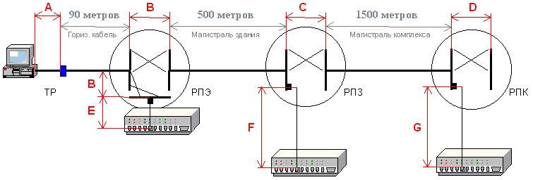
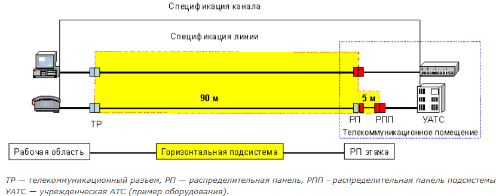
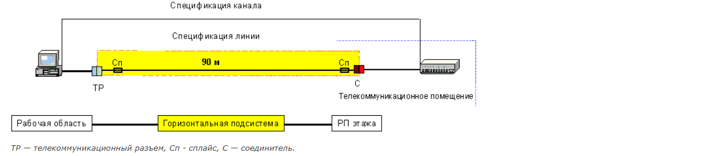
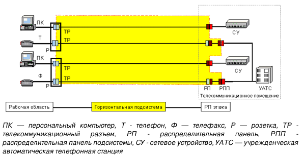
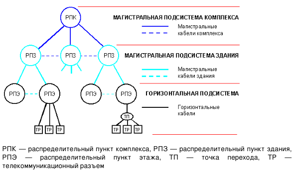
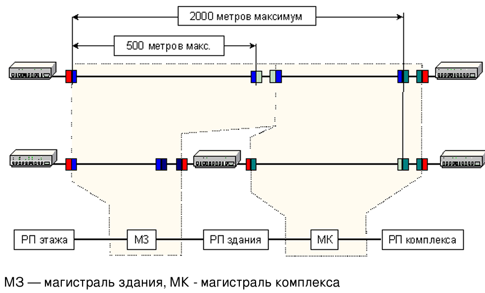

<strong>Кратко</strong>
<table><tr><td>

Простыми словами: это глава о том, **какой длины могут быть кабели в СКС и какие типы кабелей использовать**.

## Главное

СКС делится на две подсистемы:
- **Горизонтальная** — от розетки на рабочем месте до распределительного пункта этажа (РПЭ).
- **Магистральная** — между распределительными пунктами: этажа, здания, комплекса.

## Горизонтальная подсистема

**Длины:**
- Горизонтальный кабель (фиксированный) — **до 90 м**.
- Гибкие кабели (абонентские + коммутационные + сетевые) — **до 10 м суммарно**.
- Коммутационные кабели и перемычки в РП этажа — **до 5 м**.

**Типы кабелей:**
- **Предпочтительно:** симметричный 100 Ом, многомодовое волокно 62,5/125 мкм.
- **Альтернатива:** симметричный 120 Ом или 150 Ом, многомодовое волокно 50/125 мкм.

**Важно:** абонентский и сетевой кабели **не входят** в СКС, но влияют на общую длину канала.

**Оптоволокно:** может быть со сплайсами на концах, коммутационных кабелей нет.

## Магистральная подсистема

**Топология:** «звезда», не более **двух уровней коммутации**. От РП этажа до РП комплекса — не более одного распределительного пункта.

**Длины:**
- РП комплекса ↔ РП этажа — **до 2000 м** (больше — только на одномодовом волокне, до 3 км).
- РП здания ↔ РП этажа — **до 500 м**.
- Перемычки и коммутационные кабели в РП здания/комплекса — **до 20 м**. Если больше — вычитается из длины магистрали.
- Кабели от оборудования до РП — **до 30 м**.

**Типы кабелей:** многомодовое и одномодовое волокно, симметричный 100/120/150 Ом.

## Общие правила

- **Категория линии определяется худшим элементом.** Если смешать кабель категории 5 и разъём категории 3 — линия будет категории 3.
- **Нельзя смешивать** элементы с разным волновым сопротивлением в одной линии.
- **Нельзя соединять** волокна с разным диаметром сердцевины в одной линии.
- Шунтированные отводы (один проводник в нескольких местах) **запрещены**.

## Отличия от американского стандарта ANSI/TIA/EIA-568-A

- Нет кабеля 120 Ом и волокна 50/125 мкм.
- Коаксиальный кабель 50 Ом признаётся, но не рекомендуется.
- Длина коммутационных кабелей — до 6 м (вместо 5 м).
- Расстояние РП этажа ↔ РП комплекса на медных линиях — до 800 м.

## Аналогия

Представь офис:
- **Горизонтальная подсистема** — это дорожка от твоего стола до щитка на этаже. Она не должна быть длиннее 90 м, иначе сигнал ослабнет.
- **Магистральная подсистема** — это дороги между щитками: этаж → здание → комплекс. Тут можно до 2 км, но только на хорошем кабеле (волокне).
- **Правило худшего элемента** — как цепь: если одно звено слабое, вся цепь слабая.

</td></tr></table>

# 6. Подсистемы СКС

Данная глава определяет модель горизонтальной и магистральной подсистем, <mark><strong>максимальную длину, предпочтительные и рекомендованные типы кабелей.</strong></mark> Рекомендуется соответствие этим требованиям для большинства установленных систем.

Максимально допустимые длины кабелей указаны на рисунке 4 и в пояснениях к нему.

**Рис. 4. Максимальная длина фиксированных и соединительных кабелей СКС**

> **ТР** — телекоммуникационный разъём, **РПЭ** — распределительный пункт этажа, **РПЗ** — распределительный пункт здания, **РПК** — распределительный пункт комплекса.

1. Общая длина абонентских <mark><strong>(А)</strong></mark>, коммутационных <mark><strong>(В)</strong></mark> и сетевых кабелей <mark><strong>(Е)</strong></mark>, образующих канал горизонтальной подсистемы, — <mark><strong>до 10 метров.</strong></mark>

2. Длина коммутационных кабелей в РП здания <mark><strong>(С)</strong></mark> и РП комплекса <mark><strong>(D)</strong></mark> — <mark><strong>не более 20 метров.</strong></mark>

3. Длина сетевых кабелей в РП здания <mark><strong>(F)</strong></mark> и РП комплекса <mark><strong>(G)</strong></mark> — <mark><strong>не более 30 метров.</strong></mark>

<mark><strong>Соблюдение указанных длин строго рекомендуется, однако не является требованием</strong></mark>, поскольку абонентские и сетевые кабели находятся за рамками международного, европейского и американского стандартов.

Требования к элементам системы — кабелям и разъёмам — определяются в разделах 8 «Требования к кабелям» и 9 «Требования к разъёмам». Симметричные кабели с волновым сопротивлением 100 и 120 Ом и разъёмы для них подразделяются по категориям. Параметры передачи категорий 3, 4 и 5 определены в полосе частот 16, 20 и 100 МГц соответственно.

> **Категория кабеля (разъёма)** — <mark><strong>классификационная характеристика симметричного кабеля (разъёма), определяющая максимальную частоту сигнала и соответствующий набор нормируемых параметров.</strong></mark>

Кабели и разъёмы различных категорий могут быть установлены в пределах подсистемы и / или кабельной линии, но <mark><strong>передающие рабочие характеристики линии будут определяться категорией худшего элемента.</strong></mark>

1. <mark><strong>Элементы с различным волновым сопротивлением не допускается устанавливать в одной линии. </strong></mark>
2. <mark><strong>Оптические волокна с различными диаметрами сердцевины не разрешается соединять в пределах одной кабельной линии.</strong></mark> Многократное появление одного и того же проводника или проводников (шунтированные отводы) не может являться частью кабельной системы.

## 6.1. Горизонтальная подсистема

### 6.1.1. Длина кабелей

- <mark><strong>Максимальная длина горизонтального кабеля должна составлять 90 м,</strong></mark> независимо от типа среды. Она <mark><strong>измеряется от разъёма (панели) в РП этажа до телекоммуникационного разъёма на рабочем месте.</strong></mark> 
- <mark><strong>Максимальная</strong></mark> механическая длина <mark><strong>абонентских, коммутационных (перемычек) и сетевых кабелей</strong></mark> — <mark><strong>не более 10 метров.</strong></mark>
- Для соответствия требованиям приложений настоятельно <mark><strong>рекомендуется использование абонентских и сетевых кабелей, рабочие характеристики которых соответствуют или превышают параметры коммутационных кабелей.</strong></mark> 
- <mark><strong>Длина коммутационных кабелей и перемычек в РП этажа не должна превышать 5 м.</strong></mark>

На рис. 5а показана модель горизонтальной подсистемы, обеспечивающая согласование параметров кабелей (раздел 8 «Требования к кабелям») и линий (раздел 7 «Спецификация линий»). Для этого <mark><strong>фиксированный кабель горизонтальной линии ограничен длиной 90 метров</strong></mark> и <mark><strong>гибкий — длиной 5 метров</strong></mark> (что эквивалентно суммарной электрической длине 97,5 метров), <mark><strong>а линия включает три разъёма одинаковой категории.</strong></mark> Точка перехода является резервной и отсутствует в данной модели. Если используется точка перехода, параметры линии должны соответствовать модели с двумя разъёмами и длиной кабеля не более 90 метров.

**Рис. 5а. Модель горизонтальной подсистемы — симметричный электропроводный кабель**

> **ТР** — телекоммуникационный разъём, **РП** — распределительная панель, **РПП** — распределительная панель подсистемы, **УАТС** — учрежденческая АТС (пример оборудования).

<mark><strong>Абонентский и сетевой кабели не входят в состав структурированной кабельной системы, однако позволяют создать канал с параметрами, задаваемыми стандартами.</strong></mark> Предполагается, что общая электрическая длина сетевого и абонентского кабелей эквивалентна 7,5 метрам (в соответствии с условиями раздела 8 «Требования к кабелям»). Разница механической и электрической длины для гибких кабелей обусловлена требованиями к затуханию, определёнными в Приложении С.

**Отличия ANSI/TIA/EIA-568-A**

Длина коммутационных кабелей (или перемычек) и сетевых кабелей не должна превышать 6 метров. Предполагается, что длина абонентского кабеля (от ТР до рабочей станции) составляет 3 метра, а общая длина соединительных кабелей ограничена 10 метрами.

Ограничение на уровне обязательного требования длины коммутационных кабелей позволяет установить параметры горизонтальной подсистемы СКС. Для организации канала действует рекомендация по суммарной длине всех гибких кабелей — до 10 метров.

Гибкие или соединительные кабели отличаются типом разъёмов (штекерные, в отличие от гнёздовых у фиксированных кабелей) и конструкцией проводников — каждый проводник состоит из семи медных жил — А.В.

В американскую модель линии оказался включённым сетевой кабель, который согласно положениям того же стандарта не входит в состав СКС. Это одно из противоречий, которого нет в международных и европейских стандартах — А.В.

<mark><strong>Модель оптоволоконных горизонтальных кабелей отличается возможным наличием сплайсов на обоих концах подсистемы и отсутствием коммутационных кабелей.</strong></mark>

**Рис. 5б. Модель горизонтальной подсистемы — оптоволоконный кабель**

> **ТР** — телекоммуникационный разъём, **Сп** — сплайс, **С** — соединитель.

Некоторые технологии, в частности мониторинг соединений СКС с помощью системы LAN Sense, подразумевают создание каналов с коммутацией также и для оптоволоконных горизонтальных подсистем — А.В.

Спецификации коммутационных и других гибких кабелей даны в Приложении С «Требования к гибким симметричным кабелям 100, 120 и 150 Ом».

### 6.1.2. Выбор типа кабеля

Для использования <mark><strong>в горизонтальной кабельной подсистеме рекомендуются кабели двух типов:</strong></mark>

- **Предпочтительные:** симметричный кабель 100 Ом и многомодовое оптическое волокно 62,5/125 мкм.
- **Альтернативные:** симметричный кабель 120 Ом, симметричный кабель 150 Ом, кабели с многомодовым оптическим волокном 50/125 мкм.

Параметры кабелей, разъёмов приведены в разделах 8 «Требования к кабелям» и 9 «Требования к разъёмам». Для подключения нескольких телекоммуникационных разъёмов возможно применение гибридного и композиционного кабелей. Если имеются экранированные или заземлённые проводники, следует руководствоваться положениями раздела 10 «Практика экранирования».

**Отличия ANSI/TIA/EIA-568-A**

Отсутствуют симметричный кабель 120 Ом и кабели с многомодовым оптическим волокном 50/125 мкм.

В качестве среды передачи признаётся коаксиальный кабель 50 Ом. Однако он не рекомендован для монтажа во вновь устанавливаемых СКС и должен быть исключён из следующей редакции стандарта. Другие типы среды передачи, также не включённые в стандарт и допускаемые к использованию в качестве дополнения к минимальной конфигурации, — экранированные кабели 100 Ом, многопарные кабели и коаксиальные кабели 75 Ом.

### 6.1.3. Конфигурация телекоммуникационных разъёмов

Два телекоммуникационных разъёма, обеспечивающие минимальные ресурсы рабочей области в соответствии с разделом 5 «Структура СКС», могут быть установлены следующим образом:

- **а)** один телекоммуникационный разъём должен быть установлен на симметричном кабеле категории 3 или выше;
- **б)** второй телекоммуникационный разъём должен быть установлен на симметричном кабеле категории 5 (100 Ом или 120 Ом), на симметричном кабеле 150 Ом или на многомодовом оптоволоконном кабеле.

**Рис. 6. Типовая схема горизонтальной подсистемы с подключённым оборудованием**

> **ПК** — персональный компьютер, **Т** — телефон, **Ф** — телефакс, **Р** — розетка, **ТР** — телекоммуникационный разъём, **РП** — распределительная панель, **РПП** — распределительная панель подсистемы, **СУ** — сетевое устройство, **УАТС** — учрежденческая автоматическая телефонная станция.

<mark><strong>Требования по конфигурации ТР занижены с точки зрения современных требований: кабели категории 3 практически не используются.</strong></mark> Наибольшее распространение получили кабели с волновым сопротивлением 100 Ом, обеспечивающие согласованную среду передачи для подавляющего большинства образцов стандартного сетевого оборудования — А.В.

## 6.2. Магистральная подсистема

### 6.2.1. Физическая топология

В магистральной подсистеме должно быть не более двух уровней коммутации, что позволяет ограничить деградацию сигнала в пассивных системах и упростить администрирование. На пути от РП этажа до РП комплекса должен быть не более чем один распределительный пункт.

Единственный распределительный пункт может обеспечить коммутацию всей магистральной подсистемы. Распределительные пункты магистральной кабельной системы могут располагаться в телекоммуникационных помещениях или аппаратных. В приложении D даны рекомендации по созданию логической топологии «кольцо», «шина» и других на основе физической топологии «звезда».

Топология «звезда» применима не только к кабелям, но и кабельным элементам передающей среды, таким как индивидуальные волокна или пары. В зависимости от параметров системы, кабельные элементы могут находиться в одном кабеле по всей длине или только на части длины линии. В магистральной подсистеме допускается использование гибридных и многоэлементных кабелей, соответствующих параметрам раздела 8 «Требования к кабелям».

Пример топологии «иерархическая звезда» с дополнительными одноуровневыми связями показан на рис. 7.

**Рисунок 7. Топология «иерархическая звезда»**

> **РПК** — распределительный пункт комплекса, **РПЗ** — распределительный пункт здания, **РПЭ** — распределительный пункт этажа, **ТП** — точка перехода, **ТР** — телекоммуникационный разъём.

### 6.2.2. Выбор типов кабелей

<mark><strong>Стандарт определяет пять типов передающей среды.</strong></mark> В магистральной подсистеме возможно использование более одного типа:

- <mark><strong>многомодовое и одномодовое оптическое волокно</strong></mark> (предпочтение отдаётся многомодовому волокну 62,5/125 мкм);
-<mark><strong> симметричный кабель 100 Ом, 120 Ом или 150 Ом</strong></mark> (предпочтение отдаётся симметричному кабелю 100 Ом). Расстояния магистрали для всех высокоскоростных приложений, использующих электропроводные кабели, должны быть ограничены в соответствии с разделом 6.1.1 «Длина кабелей».

**Отличия ANSI/TIA/EIA-568-A**

Отсутствуют симметричный кабель 120 Ом и многомодовые оптоволоконные кабели 50/125 мкм.

В качестве среды передачи признаётся коаксиальный кабель 50 Ом. Однако он не рекомендован для монтажа во вновь устанавливаемых СКС и должен быть исключён из следующей редакции стандарта. Другие типы среды передачи, также не включённые в стандарт и допускаемые к использованию в качестве дополнения к минимальной конфигурации, — экранированные кабели 100 Ом, многопарные кабели и коаксиальные кабели 75 Ом.

### 6.2.3. Длина кабелей магистрали

Максимальные расстояния между распределительными пунктами должны соответствовать параметрам, указанным на рис. 8. В системах, размеры которых превышают указанные параметры, следует спроектировать дополнительные РП, длина магистралей которых не превышает параметры данного раздела.

**Рисунок 8. Максимальные расстояния магистралей**

> **МЗ** — магистраль здания, **МК** — магистраль комплекса.

**Примечание.** Приведённые максимальные расстояния применимы не ко всем комбинациям кабельных сред и приложений. До выбора магистральной среды рекомендуется проконсультироваться с производителями оборудования, поставщиками систем и проверить на соответствие прикладным стандартам.

Данное примечание означает, что ограничения длины магистрали носят условный характер. При использовании наиболее распространённого многомодового оптоволокна 62,5/125 с полосой пропускания 160 МГц × км в окне 850 нм канал длиной 2000 метров обеспечивает работу приложений класса С (10 МГц) и ниже. То же волокно позволяет передавать сигналы Fast Ethernet не более чем на 1300 метров, а Gigabit Ethernet — 220 метров. Другими словами, при определении типа среды и длины каналов магистралей следует учитывать тип и требования протоколов — А.В.

<mark><strong>Расстояние между РП комплекса и РП этажа не должно превышать 2000 м. Расстояние между РП здания и РП этажа не должно превышать 500 м.</strong></mark> Максимальное расстояние в 2000 м между РП комплекса и РП этажа может быть увеличено при использовании одномодового волоконно-оптического кабеля. Расстояние между РП комплекса и РП этажа, превышающее 3 км в случае применения одномодового оптического волокна, выходит за рамки настоящего стандарта. Длина перемычек и коммутационных кабелей в РП комплекса и РП здания не должна превышать 20 м. Значения длин, превышающие 20 м, вычитаются из максимально допустимой длины магистрального кабеля.

**Отличия ANSI/TIA/EIA-568-A**

Расстояние между РП этажа и РП комплекса при использовании электропроводных линий не должно превышать 800 метров.

Данное положение американского стандарта противоречит ограничению суммарной длины магистрали в 2000 метров для многомодового оптоволокна. Если в магистрали комплекса имеются электропроводные и оптоволоконные кабели, будет действовать ограничение по меньшему расстоянию. В соответствии с международными / европейскими стандартами длина канала зависит от категории среды передачи и класса приложений (например, для кабелей категории 5 и приложений класса А допустимая длина канала составляет 3000 метров) — А.В.

### 6.2.4. Внешние службы

Кабели, по которым передаются сигналы внешних сетей (например, принимаемые антенной), могут входить в здание в местах, удалённых от распределительных пунктов. При определении максимальной длины магистрального кабеля необходимо учитывать расстояние между точками ввода внешних сетей и распределительным пунктом, к которому они подключены. Местные нормативы и правила, регулирующие местоположение интерфейсов внешних сетей, также влияют на их удаление от распределительных пунктов. Длину и параметры кабелей внешних сетей следует документировать и предоставлять операторам услуг по запросу.

### 6.2.5. Подключение активного телекоммуникационного оборудования

Предполагается, что длина кабелей, напрямую соединяющих телекоммуникационное оборудование с РП комплекса и РП здания, не превышает 30 м. Если используются кабели большей длины, магистральные расстояния должны быть соответственно уменьшены.

**Отличия ANSI/TIA/EIA-568-A**

Стандарт содержит дополнительные рекомендации по планированию магистралей. Как правило, практически невозможно или экономически нецелесообразно устанавливать магистраль на весь срок службы системы. Рекомендуется предусматривать один — три периода продолжительностью от трёх до десяти лет. Для каждого из периодов проектируется и устанавливается максимальное число кабелей и разъёмов в РП комплекса, зданий, этажей и в точках ввода.

## FAQ

**Какая максимальная длина горизонтального кабеля?**
90 м, независимо от типа среды. Измеряется от разъёма (панели) в РП этажа до телекоммуникационного разъёма на рабочем месте.

**Какая максимальная длина абонентских, коммутационных и сетевых кабелей в горизонтальной подсистеме?**
Не более 10 метров суммарно.

**Какая максимальная длина коммутационных кабелей и перемычек в РП этажа?**
Не более 5 м.

**Какие типы кабелей рекомендуются для горизонтальной подсистемы?**
Предпочтительные: симметричный кабель 100 Ом и многомодовое оптическое волокно 62,5/125 мкм. Альтернативные: симметричный кабель 120 Ом, симметричный кабель 150 Ом, кабели с многомодовым оптическим волокном 50/125 мкм.

**Сколько уровней коммутации допускается в магистральной подсистеме?**
Не более двух уровней коммутации.

**Какое максимальное расстояние между РП комплекса и РП этажа?**
2000 м. Может быть увеличено при использовании одномодового волоконно-оптического кабеля. Расстояние, превышающее 3 км, выходит за рамки стандарта.

**Какое максимальное расстояние между РП здания и РП этажа?**
500 м.

**Какая максимальная длина перемычек и коммутационных кабелей в РП комплекса и РП здания?**
Не более 20 м. Значения длин, превышающие 20 м, вычитаются из максимально допустимой длины магистрального кабеля.

**Какая максимальная длина кабелей, напрямую соединяющих телекоммуникационное оборудование с РП комплекса и РП здания?**
Не более 30 м. Если используются кабели большей длины, магистральные расстояния должны быть соответственно уменьшены.

**Какие типы передающей среды определяет стандарт?**
Пять типов: многомодовое и одномодовое оптическое волокно, симметричный кабель 100 Ом, 120 Ом или 150 Ом.

**Какие типы кабелей отсутствуют в ANSI/TIA/EIA-568-A по сравнению с международными стандартами?**
Симметричный кабель 120 Ом и многомодовые оптоволоконные кабели 50/125 мкм.

**Почему ограничения длины магистрали носят условный характер?**
Приведённые максимальные расстояния применимы не ко всем комбинациям кабельных сред и приложений. При определении типа среды и длины каналов магистралей следует учитывать тип и требования протоколов.

**Что такое точка перехода?**
Точка перехода является резервной и отсутствует в модели горизонтальной подсистемы. Если используется точка перехода, параметры линии должны соответствовать модели с двумя разъёмами и длиной кабеля не более 90 метров.

**Чем отличаются гибкие кабели от фиксированных?**
Гибкие или соединительные кабели отличаются типом разъёмов (штекерные, в отличие от гнёздовых у фиксированных кабелей) и конструкцией проводников — каждый проводник состоит из семи медных жил.