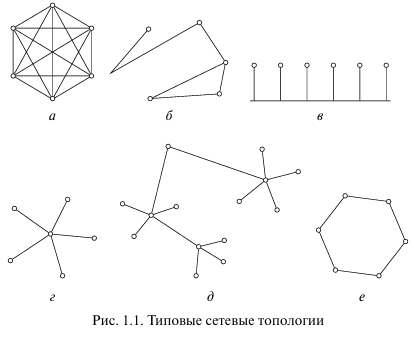
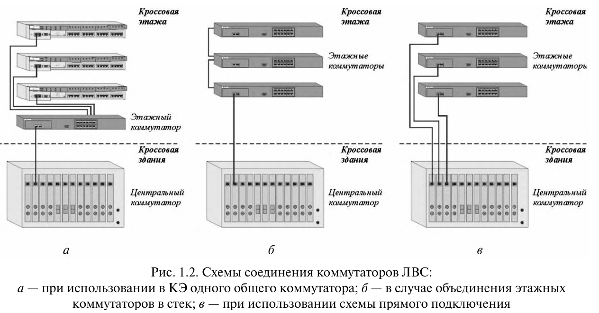

<details><summary><strong>Кратко</strong></summary><table><tr><td>

1. **Информационно-телекоммуникационные системы (ИТС)** — совокупность аппаратных (компьютеры, коммутаторы, маршрутизаторы, кабельные системы) и программных (сетевые ОС, приложения) компонентов для коллективного использования информационных ресурсов.

2. **Топология сети** — граф соединений активных сетевых устройств. Различают физическую и логическую топологию. Рассмотрены типовые топологии: полносвязная, ячеистая, «общая шина», «звезда», «иерархическая звезда», кольцевая и смешанная.

3. **Оборудование для построения ЛВС** — сетевые карты, преобразователи среды, коммутаторы (второго и третьего уровня).

4. **Конструкция коммутаторов** — матрица соединений, адресные таблицы MAC-адресов, блокируемые и неблокируемые архитектуры.

5. **Схемы соединения коммутаторов ЛВС** — три основные схемы: через центральный коммутатор, стек коммутаторов, прямое подключение up-link-портов к центральному коммутатору. Описаны их достоинства и области применения.

6. **Схемы соединения оборудования УПАТС** — централизованная и распределённая схемы построения телефонной сети. Отмечено, что распределённая схема применяется редко, а выбор категории кабельной системы зависит от требуемой скорости информационного обмена.

</td></tr></table></details>

# Информационно-телекоммуникационные системы и структурированные кабельные системы

## Введение

Эффективное функционирование любой организации в условиях рыночной экономики и высоких темпов научно-технического прогресса невозможно без серьёзной информационной поддержки, оказываемой различными информационно-телекоммуникационными системами (ИТС).

> **ИТС (информационно-телекоммуникационная система)** — <mark><strong>совокупность аппаратных и программных компонентов, предоставляющих возможность коллективного использования различных информационных ресурсов.</strong></mark>

Современный этап развития ИТС характеризуется быстрым ростом их размеров, расширением объёма выполняемых функций, чётко наметившейся тенденцией интеграции в единое информационное пространство отделов, филиалов и офисов одной организации, часто удалённых друг от друга на десятки километров. Функционирование ИТС крупного предприятия требует передачи всё большего объёма разнообразных данных со всё более высокими скоростями.

Современная ИТС реализуется в соответствии с 7-уровневой моделью открытых систем.

> **Модель OSI (Open Systems Interconnection)** — эталонная 7-уровневая модель сетевого взаимодействия, определяющая уровни: физический, канальный, сетевой, транспортный, сеансовый, представления и прикладной.

В качестве её первого физического уровня используются преимущественно проводные каналы связи, формируемые с привлечением структурированной кабельной системы (СКС), часто называемой также структурированной кабельной сетью.

> **СКС (структурированная кабельная система)** —<mark><strong> универсальная кабельная система здания или комплекса зданий, предназначенная для передачи различных сигналов и построенная по иерархическому принципу.</strong></mark>

Широкому распространению этого направления техники способствуют: высокая пропускная способность, удобство администрирования (управления), лёгкость подключения новых пользователей и т.д. Массовое применение других средств (системы радиосвязи, передача по силовой проводке и т.д.) не является целесообразным из-за их ограниченных функциональных возможностей.

В методических указаниях рассматриваются базовые вопросы проектирования СКС. Пособие предназначено для студентов, обучающихся по программе бакалавриата по направлениям подготовки 15.03.04 «Автоматизация технологических процессов и производств» и 27.03.04 «Управление в технических системах».

<details><summary><strong>Разница скс, лвс, итс</strong></summary><table><tr><td>

Это три термина из мира сетевой инфраструктуры, и их часто путают. Разберём по порядку — от «железа» к «системе в целом».

## Коротко

| Термин | Что это | Уровень |
|---|---|---|
| **СКС** | Структурированная кабельная система | «Физика» — кабели, розетки, панели |
| **ЛВС** | Локальная вычислительная сеть | «Логика» — сеть в пределах здания |
| **ИТС** | Информационно-телекоммуникационная система | «Всё вместе» — СКС + ЛВС + сервисы |

Грубо: **СКС — это фундамент, ЛВС — это сеть на нём, ИТС — это весь дом целиком.**

---

## 1. СКС — Структурированная кабельная система

**Что это.** Это **вся кабельная инфраструктура здания**, построенная по единому стандарту. Не просто «провода», а **упорядоченная система**, где всё подписано, промаркировано и задокументировано.

**Что входит:**
- кабели (витая пара, оптика),
- розетки на рабочих местах,
- патч-панели в серверных,
- кроссовое поле,
- кабельные каналы (лотки, трубы, короба),
- маркировка и документация.

**Ключевая идея.** СКС **не привязана к конкретному оборудованию**. Сегодня по ней идёт Ethernet, завтра — телефония, послезавтра — видеонаблюдение. Кабель один, а сервисов много.

**Аналогия.** СКС — это **водопровод и канализация в доме**. Трубы проложены один раз, а что по ним течёт — вода, отопление, что-то ещё — решается потом.

**Стандарты:** ISO/IEC 11801, TIA/EIA-568, ГОСТ Р 53246-2008.

---

## 2. ЛВС — Локальная вычислительная сеть

**Что это.** Это **сеть**, которая связывает устройства в пределах одного здания или кампуса: компьютеры, серверы, принтеры, коммутаторы, Wi-Fi-точки.

**Что входит:**
- активное оборудование: коммутаторы, маршрутизаторы, точки доступа,
- логическая топология: IP-адреса, VLAN, маршрутизация,
- сетевые сервисы: DHCP, DNS, файловые серверы.

**Ключевая идея.** ЛВС **работает поверх СКС**. СКС — это дороги, ЛВС — это машины, которые по ним едут.

**Аналогия.** ЛВС — это **система водоснабжения**: насосы, краны, счётчики. Вода течёт по трубам СКС, но управляется она насосами и кранами ЛВС.

**Важно:** ЛВС может быть **без СКС** — например, если компьютеры соединены напрямую патч-кордами. Но тогда это «времянка», а не структурированная система.

---

## 3. ИТС — Информационно-телекоммуникационная система

**Что это.** Самый широкий термин. Это **всё вместе**: СКС + ЛВС + серверы + телефония + видеонаблюдение + СКУД + диспетчеризация + всё, что передаёт информацию.

**Что входит:**
- СКС (кабельная инфраструктура),
- ЛВС (локальная сеть),
- телефония (IP-АТС),
- видеонаблюдение,
- системы контроля доступа (СКУД),
- серверные мощности,
- системы хранения данных,
- иногда — инженерные системы (отопление, вентиляция, освещение), если они управляются по сети.

**Ключевая идея.** ИТС **объединяет все слаботочные системы** здания в единый комплекс. Это уже не «сеть», а **инфраструктура объекта в целом**.

**Аналогия.** ИТС — это **весь дом**: водопровод, канализация, электрика, отопление, вентиляция — всё, что делает здание пригодным для жизни.

---

## Как они соотносятся

```
┌─────────────────────────────────────────────┐
│  ИТС — Информационно-телекоммуникационная   │
│  система                                    │
│  ┌───────────────────────────────────────┐  │
│  │  ЛВС — Локальная вычислительная сеть  │  │
│  │  ┌─────────────────────────────────┐  │  │
│  │  │  СКС — Структурированная        │  │  │
│  │  │  кабельная система              │  │  │
│  │  │  (кабели, розетки, панели)      │  │  │
│  │  └─────────────────────────────────┘  │  │
│  │  + коммутаторы, маршрутизаторы, IP    │  │
│  └───────────────────────────────────────┘  │
│  + телефония, видеонаблюдение, СКУД,        │
│    серверы, диспетчеризация                 │
└─────────────────────────────────────────────┘
```

**СКС ⊂ ЛВС ⊂ ИТС** — каждый следующий уровень включает предыдущий.

---

## Пример на практике

Представьте офисное здание.

**СКС:**
- в каждую комнату проложена витая пара и оптика,
- на стенах — розетки RJ-45 и оптические порты,
- в серверной — патч-панели,
- всё промаркировано: «1 этаж, каб. 105, порт 3».

**ЛВС:**
- в серверной стоят коммутаторы,
- они соединены с патч-панелями патч-кордами,
- настроены VLAN: бухгалтерия отдельно, разработка отдельно,
- раздаётся Wi-Fi,
- работает IP-телефония.

**ИТС:**
- всё вышеперечисленное,
- плюс камеры видеонаблюдения,
- плюс турникеты на входе (СКУД),
- плюс серверы 1С и файлохранилище,
- плюс система оповещения о пожаре,
- плюс диспетчеризация инженерных систем.

---

## Кто чем занимается

| Специалист | Что делает |
|---|---|
| **Проектировщик СКС** | Рисует трассы кабелей, считает длины, подбирает материалы |
| **Монтажник СКС** | Прокладывает кабели, ставит розетки, разделывает патч-панели |
| **Сетевой инженер** | Настраивает коммутаторы, VLAN, маршрутизацию |
| **Системный интегратор ИТС** | Собирает всё вместе: СКС, ЛВС, сервисы, слаботочку |

---

## Итог

| Вопрос | СКС | ЛВС | ИТС |
|---|---|---|---|
| Что это | Кабельная инфраструктура | Сеть в пределах здания | Все слаботочные системы |
| Уровень | Физический | Логический | Системный |
| Что входит | Кабели, розетки, панели | Коммутаторы, IP, VLAN | СКС + ЛВС + сервисы |
| Кто проектирует | Проектировщик СКС | Сетевой инженер | Системный интегратор |
| Аналогия | Трубы в доме | Водоснабжение | Весь дом |

**Запомнить просто:**
- **СКС** — это «провода и розетки».
- **ЛВС** — это «сеть, которая по ним работает».
- **ИТС** — это «всё вместе: сеть, телефония, камеры, доступ, серверы».

Хотите, разберу **этапы проектирования СКС** — от ТЗ до сдачи объекта?

</td></tr></table></details>


---

## 1. Информационно-телекоммуникационные системы

<mark><strong>Информационно-телекоммуникационная система представляет собой совокупность аппаратных и программных компонентов, предоставляющих возможность коллективного использования различных информационных ресурсов.</strong></mark>

Под **аппаратными компонентами** сети понимаются компьютеры различных типов (рабочие станции пользователей и серверы), активное сетевое оборудование (коммутаторы и маршрутизаторы) и кабельные системы.

**Программные компоненты** сети представлены сетевыми операционными системами и сетевыми приложениями (почтовые программы, сетевые БД и др.).

### 1.1. Топология сети

> **Топология сети** — <mark><strong>граф, вершинам которого соответствуют отдельные активные сетевые устройства, а рёбрам — физические связи между ними.</strong></mark>

Функции сетевых устройств в данном случае выполняют преимущественно рабочие станции пользователей, различные коммутаторы и серверы.

При рассмотрении сетей различают физическую и логическую топологию.

> **Физическая топология** — соединения активных сетевых устройств между собой каналами связи.

> **Логическая топология** — маршруты передачи данных между узлами, которые зависят от физической топологии сети и настроек аппаратуры.

**Полносвязная топология** на физическом уровне (рис. 1.1, а) предусматривает<mark><strong> связь каждого компьютера сети со всеми остальными. Данный вариант отличается громоздкостью и обычно крайне неэффективен, так как требует значительных финансовых затрат и длительного времени реализации.</strong></mark> Это происходит потому, что каждый сетевой узел должен иметь большое количество коммуникационных портов, а для каждой пары таких сетевых устройств должна быть предусмотрена отдельная линия связи.

**Ячеистая топология** (рис. 1.1, б) <mark><strong> получается из полносвязной после исключения некоторых связей. Непосредственно соединяются те сетевые устройства, между которыми происходит интенсивный обмен данными. Во всех остальных случаях используется транзитная передача через промежуточные узлы.</strong></mark>

**Топология «общая шина»** (рис. 1.1, в) <mark><strong>предполагает подключение отдельных сетевых устройств к одному моноканалу, функции которого обычно выполняет кабель или радиоканал. Передаваемая информация поступает на все узлы сети, но принимается только её получателем.</strong></mark>

> **Моноканал** — единый канал передачи данных, к которому подключены все узлы сети.

**Топология «звезда»** (рис. 1.1, г) <mark><strong> предусматривает подключение каждого сетевого устройства отдельным кабелем к концентратору, установленному в центре сети. Концентратор направляет передаваемую информацию одному (коммутирующий концентратор или просто коммутатор) или всем остальным сетевым узлам (обычный концентратор).</strong></mark> Современные ИТС строятся на коммутаторах, которые значительно увеличивают эффективность их функционирования.

**Топология «иерархическая звезда»** (рис. 1.1, д) <mark><strong>распространяет звездообразную топологию на общий случай и строится на нескольких концентраторах, иерархически соединённых между собой.</strong></mark>

**Кольцевая топология** (рис. 1.1, е) <mark><strong>обеспечивает передачу данных по кольцу в одном направлении от одного сетевого узла к другому. Эта конфигурация очень удобна из-за простоты подтверждения приёма отправленного сообщения.</strong></mark>

**Смешанная топология** <mark><strong>характеризуется наличием произвольных связей между отдельными сетевыми устройствами. Такие сети можно представить в виде композиции конечного числа связанных фрагментов (подсетей), имеющих одну из упомянутых выше канонических топологий.</strong></mark>



**Рис. 1.1 — Типовые сетевые топологии**

### 1.2. Оборудование для построения ЛВС

В процессе построения ЛВС находят применение следующие основные типы сетевых устройств.

> **ЛВС (локальная вычислительная сеть)** — <mark><strong>сеть, объединяющая вычислительные устройства в пределах ограниченной территории.</strong></mark>

> **Сетевая карта (плата)** — <mark><strong>устройство для подключения к сети терминальных устройств.</strong></mark>

Наиболее широко распространены карты, работающие по симметричным кабельным трактам СКС. Настройка большинства таких устройств, в т.ч. выбор скорости 1000/100/10 Мбит/с, происходит в автоматическом режиме. Выпускаются также сетевые карты с оптическим интерфейсом. Для них из-за разной рабочей длины волны автоматическое изменение скорости невозможно.

> **Преобразователь среды (media converter)** — <mark><strong>устройство, обеспечивающее переход между кабелями различных типов (оптический и симметричный, многомодовый и одномодовый оптический и т.д.).</strong></mark>

Преобразователи делятся на индивидуальные и групповые, причём последние представлены модульными и моноблочными вариантами.

> **Коммутатор (коммутирующий концентратор)** — групповое устройство, позволяющее объединять в сеть терминальные приборы и серверы.

Он работает на втором (канальном) уровне модели OSI. Более сложное устройство данной разновидности может выполнять маршрутизацию (коммутатор третьего уровня). Коммутатор обеспечивает разгрузку сети за счёт локализации трафика.

### 1.3. Особенности конструкции коммутаторов ЛВС

<mark><strong>Ключевым элементом коммутатора является матрица, которая устанавливает независимые друг от друга связи между разными парами портов.</strong></mark>

> **Неблокируемая архитектура** — архитектура коммутатора, при которой не допускается потеря кадров в процессе функционирования.

<mark><strong>Процесс коммутации выполняется с помощью адресных таблиц, фиксирующих связь каждого порта с уникальными MAC-адресами сетевых устройств.</strong></mark>

> **MAC-адрес** — уникальный аппаратный адрес сетевого устройства, присваиваемый на предприятии-изготовителе.

<mark><strong>Таблица заполняется при анализе адресов станций-отправителей в передаваемых ими кадрах.</strong></mark>

Кадр передаётся через коммутатор локально в соответствующий порт только тогда, когда MAC-адрес получателя уже содержится в адресной таблице этого порта. В случае отсутствия этого адреса в таблице, а также в случае поступления широковещательного кадра рассылка производится во все порты. Если коммутатор обнаруживает, что MAC-адрес станции назначения приходящего кадра находится в таблице MAC-адресов, приписанной за портом, то этот кадр сбрасывается — он уже поступил к получателю, находящемуся в данном сегменте.

Коммутаторы дополнительно делятся на блокируемые и неблокируемые. Неблокируемые коммутаторы отличаются высокой пропускной способностью внутренней шины, которая по этому параметру превосходит суммарную пропускную способность всех портов для подключения активных сетевых устройств нижнего уровня. Замечательным свойством такого коммутатора становится то, что он обеспечивает минимальную задержку передаваемого сигнала и гарантирует отсутствие потерь пакетов информации. В плане устройства кабельной системы применение подобных коммутаторов означает повышенные требования в части пропускной способности трактов, которые, в силу этого, должны реализовываться на элементной базе более высоких категорий (например, категорий 6 и 6а в электропроводной части сети и волокнах категорий ОМ3 и ОМ4 в волоконно-оптической подсистеме).

### 1.4. Схемы соединения коммутаторов ЛВС

На практике находят применение три основные разновидности подключения сетевых устройств масштаба рабочей группы к ЛВС предприятия (рис. 1.2).



**Рис. 1.2 — Схемы соединения коммутаторов ЛВС:**
- а — при использовании в КЭ одного общего коммутатора;
- б — в случае объединения этажных коммутаторов в стек;
- в — при использовании схемы прямого подключения.

**Первая схема** (рис. 1.2, а) строится на <mark><strong>центральном высокопроизводительном групповом устройстве, к линейным портам которого подключаются порты up-link-модулей коммутаторов уровня рабочей группы.</strong></mark>

> **Up-link-порт** — порт коммутатора, предназначенный для подключения к устройству более высокого уровня иерархии сети.

**Вторая схема** (рис. 1.2, б) основана на возможности создания стека коммутаторов.

> **Стек коммутаторов** — <mark><strong>объединение нескольких коммутаторов в единое логическое устройство</strong></mark> с общей внутренней шиной.

Для этого <mark><strong>применяется их прямое соединение на уровне внутренней шины с помощью специального дополнительного порта или через дополнительный up-link-порт.</strong></mark> Первое решение обеспечивает меньшее время задержки и увеличение быстродействия создаваемой сети, однако такие дополнительные порты не стандартизированы и требуют для работы специальных дорогих и малодоступных коммутационных шнуров. Дополнительным минусом таких шнуров является их ограниченная длина, обычно позволяющая соединять коммутаторы только в пределах одного шкафа.

Согласно **третьей схеме**, изображённой на рис. 1.2, в, <mark><strong>up-link-порты коммутаторов рабочих групп непосредственно подключаются через магистральные кабели к портам центрального коммутатора, который устанавливается в техническом помещении более высокого уровня</strong></mark> и, в частности, в аппаратной.


> **КЭ (кроссовая этажа)** — техническое помещение на этаже, где размещается коммутационное оборудование и кроссы СКС.

<mark><strong>Первая схема наиболее экономична по требуемым ресурсам магистральной части СКС.</strong></mark> Данный вариант применялся на ранних этапах развития техники ЛВС. В настоящее время по ряду причин встречается достаточно редко. Он может использоваться при выдвижении заказчиком требований, ограничивающих стоимость решения, а быстродействие ЛВС и объём оборудования, которое устанавливается в технических помещениях нижнего уровня, при этом имеет второстепенное значение.

<mark><strong>Вторая схема характерна для ЛВС с небольшим объёмом трафика,</strong></mark> когда пропускная способность внутренней шины отдельного коммутатора не ограничивает эффективность информационного обмена. Кроме того, должно быть заранее известно, что информационная система будет строиться на активном сетевом оборудовании ЛВС одного производителя. Выполнение последнего требования позволяет снять ограничение нестандартного исполнения дополнительных портов и малой доступности специализированных коммутационных шнуров.

<mark><strong>Третья схема предполагает организацию отдельного тракта передачи сигналов на каждый up-link-порт коммутатора уровня рабочей группы. Она обладает наибольшей эксплуатационной гибкостью</strong></mark> и не ограничивает объём трафика.

Схема, показанная на рис. 1.2, б, по потребляемым ресурсам магистральной части СКС превосходит схему на рис. 1.2, в, обеспечивая достаточно высокий уровень сервиса. Её применение вполне допустимо на ранних этапах развития ИТС предприятия. По мере развития сети отдельные этажные коммутаторы из-за роста нагрузки на внутреннюю шину начинают отключаться от стека и подключаться к центральному коммутатору напрямую. Это означает, что схема, показанная на рис. 1.2, б, с течением времени модифицируется в схему на рис. 1.2, в. С учётом длительного срока эксплуатации кабельной системы происходит постепенная модификация структуры, показанной на рис. 1.2, б, в структуру со схемой на рис. 1.2, в.

### 1.5. Схемы соединения оборудования УПАТС

Телефонная сеть предприятия может строиться на базе IP-телефонии или же на основе классической аналоговой, квазиэлектронной или цифровой УПАТС.

> **УПАТС (учрежденческо-производственная автоматическая телефонная станция)** — телефонная станция, обслуживающая учреждение или производственный объект.

> **IP-телефония** — технология передачи голосового сигнала по сетям с протоколом IP.

Решение на основе IP-телефонии не может вытеснить классические телефонные станции из-за своей большей стоимости и требования обязательного применения высокопроизводительного оборудования ЛВС. Выполнение последнего условия обязательно с точки зрения обеспечиваемых качественных показателей функционирования телефонной сети, так как только в этом случае удаётся гарантировать отсутствие задержек передаваемого голосового сигнала.

Современные УПАТС различных производителей, вне зависимости от применяемого в них принципа коммутации голосового сигнала, могут реализовывать централизованную и распределённую схемы построения сети.

**Централизованная схема.** При создании централизованной схемы коммутация сигналов всех телефонных аппаратов осуществляется в точке размещения УПАТС. При этом в остальных промежуточных пунктах сети осуществляется простое соединение отдельных стационарных линий кабельной системы шнурами и перемычками с целью формирования прямого тракта.

**Распределённая схема.** Распределённая схема организации связи предполагает наличие выносов (подстанций), подключение которых к центральному блоку станции выполняется по стандартным групповым линиям Е1 или Е3 (скорость передачи данных 2,048 или 34,368 Мбит/с соответственно).

> **Вынос (подстанция)** — удалённый блок УПАТС, подключаемый к центральной станции по групповым линиям связи.

Достоинства данного варианта построения сети телефонной связи начинают проявляться только при расстояниях между связываемыми узлами в сотни метров и выше. На большинстве предприятий телефонные сигналы обычно передаются в пределах одного здания. Таким образом, распределённая схема используется на практике сравнительно редко.

С учётом данной особенности выбор категории той части кабельной системы, которая обеспечивает работоспособность телефонной сети предприятия, осуществляется исходя из той скорости информационного обмена, который требуется для обеспечения нормального функционирования отдельных блоков распределённой УПАТС.

---

## FAQ

**Что такое ИТС?**

ИТС (информационно-телекоммуникационная система) — совокупность аппаратных и программных компонентов, предоставляющих возможность коллективного использования различных информационных ресурсов.

**Что такое СКС?**

СКС (структурированная кабельная система) — универсальная кабельная система здания или комплекса зданий, предназначенная для передачи различных сигналов и построенная по иерархическому принципу.

**Чем отличается физическая топология от логической?**

Физическая топология определяется соединениями активных сетевых устройств между собой каналами связи. Логическая топология задаётся маршрутами передачи данных между узлами и зависит от физической топологии и настроек аппаратуры.

**Какие типовые топологии сетей существуют?**

Полносвязная, ячеистая, «общая шина», «звезда», «иерархическая звезда», кольцевая и смешанная.

**Какие основные типы сетевых устройств применяются при построении ЛВС?**

Сетевые карты, преобразователи среды, коммутаторы (включая коммутаторы третьего уровня).

**Что такое неблокируемая архитектура коммутатора?**

Архитектура, при которой коммутатор не допускает потери кадров в процессе функционирования за счёт высокой пропускной способности внутренней шины.

**Какие схемы соединения коммутаторов ЛВС применяются на практике?**

Три основные схемы: на центральном высокопроизводительном групповом устройстве; через стек коммутаторов; через прямое подключение up-link-портов к центральному коммутатору.

**Какие схемы построения телефонной сети на базе УПАТС существуют?**

Централизованная (коммутация всех сигналов в точке размещения УПАТС) и распределённая (с выносами, подключаемыми по линиям Е1 или Е3).

**Что такое IP-телефония и почему она не вытесняет классические УПАТС?**

IP-телефония — технология передачи голоса по IP-сетям. Она не вытесняет классические станции из-за большей стоимости и требования обязательного применения высокопроизводительного оборудования ЛВС для гарантии отсутствия задержек голосового сигнала.

**Какие категории элементной базы требуются для неблокируемых коммутаторов?**

Категории 6 и 6а в электропроводной части сети и волокна категорий ОМ3 и ОМ4 в волоконно-оптической подсистеме.