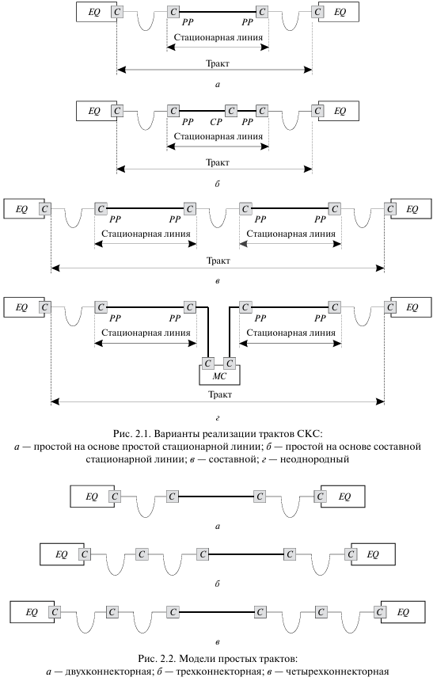
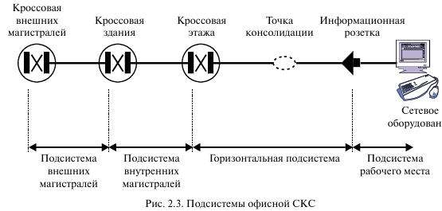
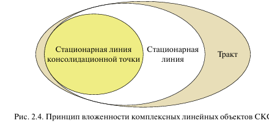

<strong>Кратко</strong>
<table><tr><td>

**Краткое содержание документа «2. КОМПЛЕКСНЫЕ ОБЪЕКТЫ И ПОДСИСТЕМЫ СКС»**

Документ описывает структуру структурированной кабельной системы (СКС) через её комплексные объекты и подсистемы.

**Основные понятия:**

- **Стационарная линия** — фиксированный линейный кабель с розеточными частями разъёмов на обоих концах. Может включать промежуточные соединители и неразъёмные сростки. Конфигурация не меняется в течение срока эксплуатации. В открытых офисах допускается составная стационарная линия с точкой консолидации (кабель между коммутационной панелью и точкой консолидации — не менее 15 м).

- **Тракт (канал)** — полная совокупность компонентов для передачи сигнала от разъёма до разъёма активного оборудования. Включает минимум одну стационарную линию и два шнура. Виды: простой (одна стационарная линия), составной (две и более), неоднородный (разные среды с преобразователем). По количеству соединителей: двух-, трёх- и четырёхконнекторные.

**Подсистемы СКС:**

1. **Магистральные подсистемы** — соединяют коммутационное оборудование в разных технических помещениях:
    - *Внутренних магистралей* — внутри здания.
    - *Внешних магистралей* — между зданиями на общей территории (кампус). Максимальная протяжённость магистрального тракта — 2000 м. Каждому приложению соответствует своя линия (оптика для ЛВС, симметричные кабели для телефонии и управления зданием).

2. **Горизонтальная подсистема** — включает розеточный модуль, горизонтальный кабель, опциональную точку консолидации и коммутационную панель. Максимальная длина кабеля — 90 м, тракта — 100 м. Используется 4-парный симметричный кабель. Неразъёмные соединители для симметричных кабелей запрещены; в оптике — разрешены.

3. **Подсистема рабочего места** — формально не входит в СКС, включает шнуры для подключения терминального оборудования (рабочая станция, телефон, принтер) и адаптеры. Суммарная длина шнуров на обоих концах — не более 10 м. При превышении длина инсталляционного кабеля сокращается по формуле H = 90 – 1,5(L – 10).

**Принцип вложенности** — стационарная линия точки консолидации всегда является частью обычной стационарной линии и не имеет самостоятельного значения.

</td></tr></table>

# Комплексные объекты и подсистемы СКС

## 2.1. Стационарная линия и тракт

<mark><strong>СКС состоит из различных кабельных изделий, которые в процессе формирования трактов передачи последовательно соединяются друг с другом с помощью различных разъёмов и прямо или через адаптер подключаются к активному сетевому оборудованию.</strong></mark> С учётом данной особенности СКС удобно представлять в виде совокупности укрупнённых комплексных объектов, номенклатура которых должна быть минимальной. Функции этих объектов выполняют стационарная линия и тракт.

> **Стационарная линия** — <mark><strong>комплексный объект СКС, включающий «фиксированный» линейный кабель и установленные на него с обеих сторон розеточные части разъёмных соединителей.</strong></mark>

Розеточные части разъёмных соединителей образуют пользовательский интерфейс кабельной системы и конструктивно входят в состав индивидуального или группового коммутационного оборудования.

Опциональными элементами стационарной линии являются промежуточные разъёмные соединители и неразъёмные сростки, которые недоступны пользователю кабельной системы в режиме текущей эксплуатации. Необходимость использования этих элементов определяется местными условиями объекта установки кабельной системы и применяемой технологией монтажа. Учёт вида исполнения промежуточных сростков предусматривается стандартами и требуется в процессе проектирования, построения и сертификации на соответствие требованиям волоконно-оптической подсистемы.

Стационарная линия не меняет своей конфигурации на протяжении всего срока эксплуатации СКС. При построении информационной проводки в так называемых открытых офисах в горизонтальной подсистеме допускается использование составной стационарной линии, где это правило частично не выполняется. Необходимым условием её формирования является применение так называемой точки консолидации.

Введение точки консолидации заметно увеличивает эксплуатационную гибкость кабельной системы, так как при изменении конфигурации открытого офиса замене подлежат исключительно короткие концевые отрезки горизонтального кабеля. Протяжённость линейного кабеля между коммутационной панелью в КЭ и точкой консолидации должна быть не менее 15 м. В противном случае падает экономическая эффективность создаваемой кабельной инфраструктуры. Кроме того, из-за особенностей функционирования современных тестирующих приборов, которые используют импульсные методики выполнения измерений, могут возникнуть проблемы с её сертификацией на соответствие требованиям стандартов.

> **Тракт (канал, channel)** — полная совокупность компонентов, обеспечивающих передачу информационного сигнала от разъёма до разъёма активного сетевого оборудования.

Тракт содержит хотя бы одну стационарную линию и по меньшей мере два шнура для подключения активного сетевого оборудования.

> **Простой тракт** — тракт, который содержит в своём составе только одну стационарную линию.

> **Составной тракт** — тракт, который образован двумя или более стационарными линиями, последовательно соединёнными между собой коммутационными шнурами.

> **Неоднородный тракт** — тракт, отдельные стационарные линии которого построены на электропроводной и волоконно-оптической элементной базе и соединены друг с другом протокольно прозрачным преобразователем среды.

Стандартами предусматривается также так называемый неоднородный тракт. В реальной практике построения информационных систем неоднородные тракты встречаются чрезвычайно редко.

Основные варианты реализации кабельных трактов СКС в схематической форме представлены на рис. 2.1.

**Рис. 2.1 — Варианты реализации трактов СКС:**
- а — простой на основе простой стационарной линии;
- б — простой на основе составной стационарной линии;
- в — составной;
- г — неоднородный.

Дополнительно тракты различают по количеству соединителей, которые задействуются для их формирования. Бывают двух-, трёх- и четырёхконнекторные тракты (рис. 2.2).

**Рис. 2.2 — Модели простых трактов:**
- а — двухконнекторная;
- б — трёхконнекторная;
- в — четырёхконнекторная.

Тип соединения, а также количество отдельных строительных длин линейного кабеля и стационарных линий, используемых при организации тракта, не оказывает влияния на его структуру. Однако от разновидности применяемого соединения в оптической подсистеме зависит суммарное затухание, которое не должно превышать значений, нормируемых стандартами.

> **Строительная длина** — отрезок кабеля определённой длины, поставляемый производителем.

## 2.2. Магистральные подсистемы СКС

СКС делится (структурируется) на отдельные подсистемы (рис. 2.3). Каждая подсистема обладает стандартизованным интерфейсом и заранее известными характеристиками. Данные свойства позволяют очень гибко согласовывать СКС с потребностями конкретной ИТС.

**Рис. 2.3 — Подсистемы офисной СКС**

> **Точка консолидации** — элемент горизонтальной подсистемы СКС, позволяющий увеличить эксплуатационную гибкость кабельной системы за счёт замены коротких концевых отрезков горизонтального кабеля при изменении конфигурации открытого офиса.

Магистральные подсистемы СКС используются для соединения между собой группового коммутационного оборудования в отдельных технических помещениях.

> **Подсистема внутренних магистралей** — подсистема СКС, организуемая внутри здания для соединения группового коммутационного оборудования.

> **Подсистема внешних магистралей** — подсистема СКС, предназначенная для связи отдельных зданий, расположенных на общей территории заказчика (кампусе).

<mark><strong>В зависимости от области установки различают подсистему внутренних магистралей, которая организуется внутри здания, и подсистему внешних магистралей, предназначенную для связи отдельных зданий. Последние, согласно требованиям действующих стандартов, должны располагаться на общей территории заказчика (так называемый кампус). В той ситуации, когда это требование не выполняется (например, две территории разделены дорогой общего пользования), нормативные документы рекомендуют не создавать подсистему внешних магистралей или её часть, а обращаться к услугам операторов связи.</strong></mark>

> **Кампус** — территория, на которой расположены здания одной организации, объединённые общей кабельной системой.

Особенностью магистральной подсистемы является отказ от принципа универсальности. На уровне магистралей каждому приложению (разновидности аппаратуры) ставится в соответствие своя линия. Обычно сигналы ЛВС передаются по линиям волоконно-оптической связи, телефонная сеть строится с использованием симметричных кабелей. Симметричными кабелями пользуется также быстро набирающая популярность в последнее время сеть управления инженерным оборудованием здания (вентиляция, кондиционирование, контроль доступа, видеонаблюдение и т.д.).

Максимальная протяжённость магистрального тракта СКС ограничена длиной 2000 м. Одновременно стандартами отмечается возможность передачи сигналов ЛВС и иных видов оборудования на расстояние, по меньшей мере, в 40 км. При необходимости увеличения дальности связи используется соответствующая аппаратура или ресурсы телекоммуникационных операторов.

## 2.3. Горизонтальная подсистема

Стационарная линия горизонтальной подсистемы включает в себя: розеточный модуль в пользовательской ИР, горизонтальный кабель, опциональную точку консолидации и коммутационную панель в техническом помещении.

> **ИР (информационная розетка)** — <mark><strong>розеточный модуль на рабочем месте пользователя, к которому подключается терминальное оборудование.</strong></mark>

Максимальная протяжённость кабеля любой стационарной линии горизонтальной подсистемы не должна превышать 90 м, а длина тракта — 100 м.

Для реализации горизонтальной подсистемы используется преимущественно 4-парный симметричный кабель. Организация этой части СКС по схеме «волокно до рабочего места» практикуется в единичных случаях в ситуациях сложной электромагнитной обстановки или же выдвижения особых требований в части обеспечения конфиденциальности передаваемой информации.

Симметричные линии чувствительны к воздействию электромагнитного излучения, что учитывается при проектировании СКС. Рекомендации по решению данной проблемы приведены в стандарте ANSI/EIA/TIA-569.

В стационарных линиях горизонтальной подсистемы не допускается применение неразъёмных соединителей для симметричных кабелей. Также запрещено использование параллельного подключения к проводникам в любой форме. При необходимости выполнения такой процедуры следует пользоваться соответствующими адаптерами, которые не входят в состав СКС и в канонической форме своего исполнения располагаются за пределами стационарной линии.

В волоконно-оптической подсистеме использование неразъёмных сростков разрешено без ограничений. Данный вид соединений применяется при сращивании отдельных строительных длин и организации ответвлений, а также при терминировании оптических кабелей монтажными шнурами.

> **Монтажный шнур** — отрезок оптического волокна длиной около 1 м во вторичном защитном покрытии с вилкой, установленной на него в заводских условиях.

Соединение волокон в сростке осуществляется с помощью сварки или механических сплайсов.

> **Механический сплайс** — устройство для соединения оптических волокон без сварки, обеспечивающее механическую фиксацию и выравнивание сердцевин.

На рабочем месте пользователя устанавливаются ИР с двумя или более розеточными модулями, которые организационно также относятся к горизонтальной подсистеме. Такое исполнение ИР позволяет одновременно предоставлять пользователю услуги телефонной связи и ЛВС.

Для нормального функционирования экранированной СКС необходима телекоммуникационная система заземления. Она строится по стандарту ANSI/TIA/EIA-607 или в соответствии с национальными нормативами.

## 2.4. Подсистема рабочего места

Подсистема рабочего места формально не относится к СКС. При топологическом разбиении информационной проводки на отдельные укрупнённые функциональные модули элементы подсистемы рабочего места включаются в состав горизонтальной подсистемы. С учётом этой особенности и за счёт того, что через компоненты подсистемы рабочего места передаются различные сигналы того оборудования, для поддержки функционирования которого создана СКС, на её параметры накладываются строгие ограничения, которые подлежат обязательному выполнению.

В состав подсистемы рабочего места входят шнуры для подключения терминального оборудования. Функции последнего в реалиях построения современных ИТС чаще всего выполняют рабочая станция локальной сети, телефонный аппарат пользователя и групповой принтер (обычно один на помещение). В ряде случаев в состав подсистемы рабочего места могут включаться адаптеры. Их применение типично при наличии на рабочем месте двух или более телефонных аппаратов.

Максимально допустимая суммарная длина всех коммутационных шнуров, применяемых на обоих концах линии горизонтальной подсистемы, составляет 10 м. Длина шнура, подключаемого к ИР, редко превышает 3 м. Категория шнура должна соответствовать категории стационарной линии.

В тех ситуациях, когда общая длина $L$ коммутационных шнуров в составе горизонтального тракта превышает 10 м, длина $H$ инсталляционного кабеля должна быть в обязательном порядке сокращена до:

$$H = 90 - 1{,}5(L - 10) \text{ м}$$

Адаптеры, предназначенные для поддержки функционирования некоторых видов аппаратуры, не входят в состав стационарной линии и всегда относятся к тракту передачи. Это требование стандарта обеспечивает универсальность СКС и её независимость от конкретных приложений.

## 2.5. Принцип вложенности

В отношении комплексных объектов действует принцип вложенности, что в схематическом виде изображено на рис. 2.4. Процесс «инкапсуляции» этих комплексных объектов имеет определённые нюансы.

**Рис. 2.4 — Принцип вложенности комплексных линейных объектов СКС**

Стационарная линия консолидационной точки не имеет самостоятельного практического значения и в режиме нормальной эксплуатации СКС всегда представляет собой часть обычной стационарной линии. В частности, данная особенность проявляется в том, что один из интерфейсов стационарной линии точки консолидации практически не используется обслуживающим персоналом ИТС в процессе текущей деятельности. Сама инкапсуляция не является полной, т.е. второй «рабочий» интерфейс стационарной линии точки консолидации «по совместительству» выполняет функции интерфейса обычной стационарной линии.

---

## FAQ

**Что такое стационарная линия?**

Стационарная линия — комплексный объект СКС, включающий «фиксированный» линейный кабель и установленные на него с обеих сторон розеточные части разъёмных соединителей. Она не меняет своей конфигурации на протяжении всего срока эксплуатации СКС.

**Что такое тракт (канал)?**

Тракт (канал, channel) — полная совокупность компонентов, обеспечивающих передачу информационного сигнала от разъёма до разъёма активного сетевого оборудования. Тракт содержит хотя бы одну стационарную линию и по меньшей мере два шнура для подключения активного сетевого оборудования.

**Какие виды трактов существуют?**

Простой (одна стационарная линия), составной (две или более стационарных линий, соединённых коммутационными шнурами), неоднородный (линии на электропроводной и волоконно-оптической базе, соединённые преобразователем среды).

**Чем различаются тракты по количеству соединителей?**

Бывают двух-, трёх- и четырёхконнекторные тракты. Тип соединения и количество строительных длин не влияют на структуру тракта, но от разновидности соединения в оптической подсистеме зависит суммарное затухание.

**Что такое точка консолидации?**

Точка консолидации — элемент горизонтальной подсистемы СКС, позволяющий увеличить эксплуатационную гибкость кабельной системы за счёт замены коротких концевых отрезков горизонтального кабеля при изменении конфигурации открытого офиса. Протяжённость кабеля между коммутационной панелью в КЭ и точкой консолидации должна быть не менее 15 м.

**Какие магистральные подсистемы существуют?**

Подсистема внутренних магистралей (внутри здания) и подсистема внешних магистралей (для связи отдельных зданий на общей территории заказчика — кампусе).

**Какова максимальная протяжённость магистрального тракта СКС?**

Максимальная протяжённость магистрального тракта СКС ограничена длиной 2000 м. Стандартами отмечается возможность передачи сигналов на расстояние, по меньшей мере, 40 км при использовании соответствующей аппаратуры.

**Какова максимальная длина горизонтальной подсистемы?**

Максимальная протяжённость кабеля любой стационарной линии горизонтальной подсистемы не должна превышать 90 м, а длина тракта — 100 м.

**Какие ограничения накладываются на подсистему рабочего места?**

Максимально допустимая суммарная длина всех коммутационных шнуров на обоих концах линии горизонтальной подсистемы составляет 10 м. Если общая длина шнуров $L$ превышает 10 м, длина инсталляционного кабеля $H$ сокращается до $H = 90 - 1{,}5(L - 10)$ м.

**Разрешено ли использование неразъёмных соединителей в горизонтальной подсистеме?**

В стационарных линиях горизонтальной подсистемы не допускается применение неразъёмных соединителей для симметричных кабелей. В волоконно-оптической подсистеме использование неразъёмных сростков разрешено без ограничений.

**В чём суть принципа вложенности?**

Стационарная линия консолидационной точки не имеет самостоятельного практического значения и в режиме нормальной эксплуатации СКС всегда представляет собой часть обычной стационарной линии. Инкапсуляция не является полной: второй «рабочий» интерфейс стационарной линии точки консолидации выполняет функции интерфейса обычной стационарной линии.