<details><summary><strong>Кратко</strong></summary><table><tr><td>

**Краткое содержание главы I «Общие сведения о СКС»**

**1.1. История и стандарты**

- Идея СКС предложена AT&T в 1983 г. Первая универсальная система — IBM (2-парный экранированный кабель 150 Ом, 9 типов кабеля). Из-за цены и узкой специализации широкого распространения не получила.
- 1985 — EIA начала разработку стандарта; 1988 — подключилась TIA; 1990 — TIA/EIA-569 (кабельные пути); 1991 — TIA/EIA-568 (структура и требования), TSB36 (категории UTP), TSB40 (разъёмы); 1993 — TIA/EIA-606 (администрирование); 1994 — TIA/EIA-607 (заземление); 1995 — TIA/EIA-568A (исключён коаксиал, разрешены одномодовые волокна), TSB72 (централизованное администрирование), TSB75 (открытые офисы); 1998 — TSB95 (Gigabit Ethernet); 1999 — TIA/EIA-570A (оптические разъёмы).
- Международные: ISO/IEC 11801 (1995, ред. 2000), EN 50173 (CENELEC), ISO/IEC 14763-1/2/3 (администрирование, планирование, тестирование), CEI/IEC 61935-1 (тестирование электрических линий).
- В России ГОСТа на СКС нет; используются международные и американские стандарты, а также ПУЭ и отдельные ГОСТы.

**1.2. Структура СКС**

- **Топология** — древовидная (иерархическая звезда). Узлы — коммутационное оборудование (дистрибьюторы) в технических помещениях.
- **Технические помещения**: аппаратные (сетевое оборудование коллективного пользования — АТС, серверы) и кроссовые (КВМ, КЗ, КЭ). В СКС одна КВМ; в каждом здании не более одной КЗ; допускается совмещение КВМ с КЗ, КЗ с КЭ.
- **Подсистемы** (по ISO/IEC 11801): внешних магистралей (между зданиями, до 1500 м), внутренних магистралей (внутри здания, до 500 м), горизонтальная (КЭ — ИР, до 90 м). Дополнительно выделяют подсистему рабочего места (не входит в СКС).
- **Коммутация** — только ручная (шнуры и перемычки); СКС не зависит от электропитания.
- **Администрирование**: многоточечное (классическая иерархическая звезда, переключение минимум двух шнуров) и одноточечное (все розетки к одному помещению, для небольших сетей).
- **Кабели**: симметричные (100, 120, 150 Ом; экранированные и неэкранированные) и волоконно-оптические (одномодовые и многомодовые). Коаксиальные кабели исключены из новых стандартов.

**1.3. Классы, категории и длины**

- **Классы приложений** (ISO/IEC 11801): A (до 100 кГц), B (до 1 МГц), C (до 16 МГц), D (до 100 МГц), оптический.
- **Категории кабелей и разъёмов**: 3 (16 МГц), 4 (20 МГц), 5 (100 МГц), 5е (100 МГц, Gigabit Ethernet), 6 (250 МГц), 7 (600 МГц). Категории 6 и 7 — классы E и F.
- **Соответствие**: категория 3 → класс C; категория 5 → класс D; категория 6 → класс E; категория 7 → класс F.
- **Максимальные длины**: горизонтальный кабель — 90 м, тракт — 100 м; внутренняя магистраль — 500 м; внешняя магистраль — 1500 м (до 2000 м суммарно); одномодовые волокна — до 3000 м. Шнуры в горизонтальной подсистеме — до 10 м (для электрических), в кроссовых магистралях — до 20 м, оконечные — до 30 м.

**1.4. Дополнительные варианты топологии**

- **Горизонтальная подсистема**: прямое соединение, точка перехода (ТП), многопользовательская розетка (MUTO), консолидационная точка (CP). Для открытых офисов: MUTO (до 20 м оконечный шнур, формула W = (102 – H)/1,2 – 7) и CP.
- **Централизованное администрирование** (TSB72): одноуровневая топология на оптике, вариант с одним межсоединением (до 300 м) и без межсоединений (до 90 м). Позволяет сосредоточить активное оборудование в одном месте.

**1.5. Принцип Cable Sharing**

- Использование 4-парного кабеля для одновременной передачи сигналов нескольких приложений (2, 3 или 4). Официально допускается ISO/IEC 11801 и EN 50173. Требует специальных элементов: Y-адаптеры, балуны, разветвительные шнуры, сдвоенные розеточные модули. Наиболее эффективен в сетях небольшого и среднего размера. В России мало популярен из-за ориентации на TIA/EIA-568A и отсутствия рынка SOHO.

**1.6. Гарантийная поддержка**

- **Гарантия на компоненты** (базовая) — 5 лет (иногда до 20).
- **Системная гарантия** — 15–16 лет для категории 5, до 20–25 лет для более высоких категорий. Условия: только разрешённые компоненты, соответствие стандартам, авторизованный персонал.
- **Гарантия работы приложений** — поддержка конкретных приложений.
- **Обобщённая гарантия** — расширение списка приложений, увеличение длины базовой линии, нулевой уровень ошибок.
- Сертификат выдаётся на СКС или её владельца; гарантийный ремонт выполняет инсталлятор.

**1.7. Выводы**

- СКС — основа информационной инфраструктуры предприятия, реализуется по иерархическому звездообразному принципу.
- Интеграция оптических и электрических линий обеспечивает поддержку современных и перспективных приложений.
- Максимальная дальность — 3000 м, пропускная способность — 1 Гбит/с и выше.
- Стандартизованные варианты построения позволяют адаптировать СКС к любым условиям.
- Гарантированный срок эксплуатации — 15 лет и более.

</td></tr></table></details>

# Глава I. Общие сведения о СКС

## 1.1. Историческая справка о происхождении СКС и развитии стандартов

Идея создания структурированной кабельной системы как основы слаботочной кабельной разводки здания была высказана специалистами фирмы AT&T (ныне Lucent Technologies) в 1983 году [10].

> Структурированная кабельная система (СКС) — <mark><strong>универсальная кабельная система здания или комплекса зданий, построенная по иерархическому звездообразному принципу и предназначенная для передачи сигналов различных слаботочных приложений (данные, телефония, системы безопасности и др.) по единой кабельной инфраструктуре.</strong></mark>

Первая достаточно удачная попытка создания универсальной кабельной системы для построения офисных информационных систем была предпринята корпорацией IBM. В 80-е годы специалистами этой компании на основе 2-парного экранированного симметричного кабеля с волновым сопротивлением 150 Ом была разработана система IBM, предназначенная для обеспечения функционирования сетей Token Ring, серверов AS/400, терминалов 3270 и других аналогичных устройств. Спецификация кабельной части системы IBM включала в себя 9 различных «типов» кабеля (табл. 1.1). Интересно, что сама IBM никогда не производила компоненты своей кабельной системы — этим по фирменным спецификациям IBM занимаются другие компании. Из девяти возможных вариантов кабелей наибольшую популярность получили типы 1 и 6. Они до сих пор продолжают применяться в сетях Token Ring, хотя последние несколько лет IBM рекомендует использовать для этого кабели категории 3, 4 или 5 с 8-контактными модульными разъемами. Поддержка функционирования устройств с коаксиальным и твинаксиальным интерфейсами обеспечивалась включением в состав системы развитой номенклатуры балунов.

> Балун (balun, от balanced–unbalanced) — согласующее устройство, предназначенное для перехода между симметричной (витая пара) и несимметричной (коаксиальный кабель) линиями передачи.

**Таблица 1.1. Типы кабелей по спецификации IBM**

| Тип кабеля | Конструкция                                                                                                                                          |
|------------|------------------------------------------------------------------------------------------------------------------------------------------------------|
| Тип 1      | 2 экранированные витые пары из монолитных проводников (22 AWG, 150 Ом) в общем внешнем экране в виде оплётки                                         |
| Тип 2      | 2 экранированные (22 AWG, 150 Ом) и 4 неэкранированные (22 AWG, до 1 МГц) витые пары из монолитных проводников в общем внешнем экране в виде оплётки |
| Тип 3      | 4 неэкранированные (22 или 24 AWG, до 1 МГц) витые пары из монолитных проводников                                                                    |
| Тип 4      | Не специфицирован                                                                                                                                    |
| Тип 5      | Два многомодовых оптических волокна                                                                                                                  |
| Тип 6      | Коммутационный кабель. 2 экранированные витые пары из многожильных проводников (26 AWG) в общем внешнем экране                                       |
| Тип 7      | Не специфицирован                                                                                                                                    |
| Тип 8      | Плоский кабель для прокладки под ковровыми покрытиями. 2 неперевитые экранированные пары из монолитных проводников (26 AWG)                          |
| Тип 9      | 2 пары из монолитных или многопроволочных проводников (26 AWG)                                                                                       |

В силу ряда причин, основными из которых являются высокая цена, низкая технологичность монтажа, ориентированность в основном на продукты IBM и трудности интегрирования в современные сетевые структуры[^1], <mark><strong>эта кабельная система не получила широкого распространения.</strong></mark>

[^1]: Не все производители активного сетевого оборудования гарантируют его нормальное функционирование в среде с волновым сопротивлением 150 Ом. Таким образом, кабельная система IBM не обеспечивает полной универсальности и независимости от приложений.

В 1985 году Ассоциация электронной промышленности США (Electronic Industries Association — EIA) приступила к созданию стандарта для телекоммуникационных кабельных систем зданий. Подготовку нормативной документации выполняло несколько рабочих групп:

- TR41.8.1 — рабочая группа по кабельным системам офисных и промышленных зданий;
- TR41.8.2 — рабочая группа по кабельным системам жилых зданий и зданий офисного типа с низким коэффициентом использования полезной площади;
- TR41.8.3 — рабочая группа по кабельным каналам для телекоммуникационных кабелей;
- TR41.8.4 — рабочая группа по магистральным кабельным системам жилых зданий и зданий офисного типа с низким коэффициентом использования полезной площади;
- TR41.8.5 — рабочая группа по формализации терминов и определений;
- TR41.7.2 — рабочая группа по заземлению и строительным решениям;
- TR41.7.3 — рабочая группа по электромагнитной совместимости.

В 1988 году к работе по стандартизации подключилась Ассоциация телекоммуникационной промышленности США (Telecommunications Industry Association — TIA). 

В 1989 году известная американская исследовательская организация Underwriters Laboratories (UL) совместно с фирмой Anixter разработали новую классификацию кабелей на витых парах. В её основу было положено понятие «уровень». Толкование уровней представлено в табл. 1.2.

**Таблица 1.2. Классификация витых пар по уровням**

| Тип кабеля | Максимальная частота сигнала | Типовые приложения |
|---|---|---|
| Уровень 1 | Нет требований | Цепи питания и низкоскоростной обмен данными |
| Уровень 2 | До 1 МГц | Голосовые каналы связи и системы безопасности |
| Уровень 3 | До 16 МГц | Локальные сети Token Ring и Ethernet 10BaseT |
| Уровень 4 | До 20 МГц | Локальные сети Token Ring и Ethernet 10BaseT |
| Уровень 5 | До 100 МГц | Локальные сети со скоростью передачи данных до 100 Мбит/с |

Результатом деятельности рабочей группы TR41.8.1 стал стандарт телекоммуникационных кабельных систем коммерческих зданий TIA/EIA-568, который был одобрен в июле 1991 года. Этот документ определял структуру кабельной системы и требования к характеристикам кабелей и разъёмов, применяемых для её построения. Для построения системы допускалось использование кабелей из неэкранированных витых пар с волновым сопротивлением 100 Ом и экранированных витых пар с сопротивлением 150 Ом, а также 50-омных коаксиальных кабелей и многомодовых волоконно-оптических кабелей. Документ не сертифицировал волоконно-оптический разъём [13].

В ноябре 1991 года рабочая группа TR41.8.1 выпустила дополнительные спецификации на симметричные электрические кабели из неэкранированных витых пар — технический бюллетень TIA/EIA TSB-36 [14]. В этом документе впервые вводилось понятие категорий кабелей из неэкранированных витых пар, которые были определены практически в полном соответствии с уровнями по классификации UL и Anixter (табл. 1.3). Фактически произошла только смена термина, и классификация по уровням перестала применяться. Первые два уровня витых пар для низкоскоростных приложений в бюллетене TSB-36 не специфицированы.

> Категория кабеля — классификационная характеристика симметричного кабеля на витых парах, определяющая максимальную частоту сигнала, на которую рассчитан данный кабель, и соответствующий набор нормируемых электрических параметров.

**Таблица 1.3. Соответствие различных стандартов [12]**

| Наименование | Международные | Американские | Европейские |
|---|---|---|---|
| Общие характеристики кабельной системы | ISO/IEC 11801 | TIA/EIA 568A | EN 50173 |
| Планирование, инсталляция и администрирование | ISO/IEC 14763-1, ISO/IEC 14763-2 | TIA/EIA-569, TIA/EIA-606, TIA/EIA-607 | prEN 50174 |
| Испытания | — | TSB-67 | — |
| Прокладка кабеля | CD 14763-3, CD 14763-4 | TIA/EIA-569A | — |

В другом дополнении к стандарту TIA/EIA-568 — техническом бюллетене TIA/EIA TSB-40 [15] — были описаны дополнительные спецификации на разъёмы для кабелей из неэкранированных витых пар. Они также подразделялись на категории 3, 4 и 5. Бюллетень предписывал использовать разъёмы категорией не ниже категории кабелей, на которые они устанавливались.

В октябре 1995 года увидела свет вторая редакция стандарта TIA/EIA-568 — TIA/EIA-568A, — которая включала в себя и уточняла все основные положения технических спецификаций бюллетеней TSB-36 и TSB-40. Наиболее существенное отличие от предшествующего документа состояло в том, что применение коаксиального кабеля не рекомендовалось для построения вновь создаваемых СКС и одновременно было разрешено использование одномодовых волоконно-оптических кабелей в магистральных подсистемах.

В январе 1993 года был одобрен ещё один важный нормативный документ, подготовленный рабочей группой TR41.8.3, — TIA/EIA-606 «Стандарт на администрирование телекоммуникационной инфраструктуры коммерческих зданий» [16]. Стандарт определяет правила ведения документации по СКС на этапе эксплуатации — маркировка, ведение записей, правила оформления схем, отчёты и т.д. Документ рекомендовал ведение документации в электронном виде.

Ещё один смежный стандарт — TIA/EIA-607 — принимается в августе 1994 года. Он включает в себя требования к различным устройствам заземления, применяемым в здании. Традиционно основным назначением системы заземления было обеспечение безопасности эксплуатации электроустановок, то есть защита человека от поражения электрическим током. Стандарт TIA/EIA-607 определяет дополнительные требования к организации систем заземления, выполнение которых является необходимым условием обеспечения эффективной и надёжной передачи электрических сигналов по СКС. Документы TIA/EIA-568A, TIA/EIA-569, TIA/EIA-606 и TIA/EIA-607 являются национальными стандартами США.

Быстрое совершенствование средств волоконно-оптической техники, снижение её стоимости и массовое внедрение в состав кабельной проводки зданий офисного типа позволили применять при построении СКС структуры с так называемым централизованным администрированием. Переход к этому принципу позволяет существенно упростить процесс администрирования СКС. Возможные варианты и правила их построения описаны в техническом бюллетене TSB-72, изданном в октябре 1995 года.

В августе 1996 года появляется технический бюллетень TSB-75, который существенно расширил возможности проектировщиков и служб эксплуатации кабельной системы так называемых открытых офисов.

В сентябре 1998 года был принят технический бюллетень TSB-95, в котором содержалась информация о дополнительных контролируемых параметрах канала категории 5. Соответствие этих параметров норме является необходимым условием обеспечения нормальной работы приложения Gigabit Ethernet.

В мае 1999 года подкомитет по стандартизации TR42.2 утвердил стандарт TIA/EIA-570A, нормирующий оптические разъёмы, используемые в абонентских розетках. Согласно этому нормативному документу в новых СКС на рабочих местах наряду с разъёмами типа SC допускалась установка малогабаритных разъёмов нового поколения.

К 2000 году подкомитет TR42 ассоциации TIA опубликовал ряд приложений к стандарту TIA/EIA-568A, которые, вероятнее всего, без каких-либо существенных изменений войдут в новую редакцию американского стандарта (рабочее название TIA/EIA-568B). Так, в частности, дополнение 1 задаёт количественные ограничения на параметры delay и skew. В дополнении 5 определены характеристики улучшенной категории 5е, которые превосходят нормы упомянутого выше технического бюллетеня TSB-95.

Параллельно с TIA/EIA работу над стандартизацией СКС вели Международная организация по стандартизации (ISO) и Международная электротехническая комиссия (IEC). В 1995 году они выпустили совместный документ — стандарт ISO/IEC 11801 «Информационные технологии. Универсальная кабельная система для зданий и территории Заказчика». Его содержание имеет непринципиальные отличия от стандарта TIA/EIA-568A, связанные в основном со структурой документа, с различной терминологией и с глубиной проработки некоторых положений. Дополнительно отметим, что стандарт ISO/IEC 11801 допускает применение витых пар с волновым сопротивлением в 120 Ом и многомодовых оптических кабелей с волокнами 50/125, популярных в некоторых европейских странах.

Европейская организация по стандартизации CENELEC подготовила свой стандарт EN 50173[^2], окончательная редакция которого увидела свет в августе 1995 года. Его англоязычная версия в содержательной своей части практически является копией международного стандарта ISO/IEC 11801.

[^2]: EN — Europe Norm.

Стандарты ISO/IEC и CENELEC постоянно развиваются и дополняются. Наиболее значительные изменения в этой области за последнее время произошли в 1999–2000 годах, когда была принята целая группа новых нормативно-технических документов.

В начале 2000 года увидела свет дополненная редакция стандарта ISO/IEC 11801, в которой введён ряд новых параметров и уточнены значения традиционных параметров отдельных компонентов и трактов на основе витых пар. Выполнение требований, изложенных в этом нормативном документе, обеспечивает передачу в горизонтальной подсистеме информационных потоков сетевых интерфейсов Gigabit Ethernet и аналогичных им.

В 1999 году принимается стандарт ISO/IEC 14763-1 [17], являющийся аналогом американского стандарта TIA/EIA-606 и определяющий правила администрирования кабельной системы.

Процедуры тестирования электрических кабельных линий различных видов, построенных в соответствии со стандартом ISO/IEC 11801, нормирует стандарт CEI/IEC 61935-1 [18]. Аналогичный документ ISO/IEC TR 14763-3 [19] задаёт процедуры тестирования волоконно-оптических кабельных линий.

Документ ISO/IEC TR 14763-2 [20] регламентирует процесс разработки и создания кабельной разводки, начиная с планирования и составления спецификации и заканчивая организацией проведения монтажных работ и составления спецификации.

Все три основных стандарта достаточно близки друг к другу и подробно нормируют основной комплекс вопросов, связанных с построением СКС (табл. 1.3). Определённые отличия непринципиального характера имеются как в перечне допустимой для построения СКС элементной базе (табл. 1.4) и предельно допустимых параметрах отдельных компонентов, так и в терминологии и глубине освещения некоторых вопросов. На практике именно из-за последнего обстоятельства в различных ситуациях приходится пользоваться как международным стандартом ISO/IEC 11801, так и американским стандартом TIA/EIA-568A, а также дополняющими его техническими бюллетенями TSB. Тем не менее можно констатировать, что за прошедшие десять лет удалось в значительной степени преодолеть имеющиеся первоначальные различия: известные на середину 2000 года версии основных нормативно-технических документов СКС отличаются друг от друга значительно меньше. Общая структура СКС показана на рис. 1.1.

**Таблица 1.4. Основные отличия между стандартами [21]**

| Параметр | ISO/IEC 11801 | EN 50173 | TIA/EIA-568A |
|---|---|---|---|
| Поддерживаемый кабель | UTP, FTP, STP | UTP, FTP, STP | UTP, STP |
| Кабель с $Z_в = 120$ Ом | Допускается | Допускается | Не допускается |
| Диаметр проводника, мм | 0,40–0,65 | 0,40–0,6 | 0,511–0,643 |
| Число пар в горизонтальном кабеле | 2 или 4 | 2 или 4 | 4 |
| Категория компонентов | 3, 4 и 5 | 3 и 5 | 3, 4 и 5 |
| Затухание кабелей для шнуров | Больше на 50% | Больше на 50% | Больше на 20% |
| Оптоволокно 62,5/125 | Основное | Основное | Основное |
| Оптоволокно 50/125 | Альтернативное | Альтернативное | Не допускается |
| Экранированное гнездо | Допускается | Допускается | Не допускается |
| Категории кабелей рабочего места | 5 + 3 | 5 + 5 | 5 + 3 |

Кроме международных стандартов в ряде европейских стран действуют свои национальные нормативные документы, учитывающие требования местной промышленности, исторические традиции, законодательные акты смежных областей и другие особенности. Ссылки на такие документы могут встречаться в сопроводительной технической документации в случае поступления оборудования СКС в рамках реализации комплексных проектов. Так, в своей практической деятельности авторам данной монографии приходилось достаточно часто сталкиваться со ссылками на нормы DIN/VDE, так как кабельная система ICCS достаточно активно и в течение длительного времени — вплоть до продажи в начале 2000 года этого направления бизнеса американской фирме Corning — продвигалась на российском рынке немецким концерном Siemens. По данным сервера www.cabletesting.com, своя нормативная база, ориентированная в основном на положения американских стандартов, имеется в Австралии и Новой Зеландии. Сразу же отметим, что известные авторам данной работы национальные нормы не имеют принципиальных расхождений с международными, европейскими и американскими стандартами. Эти документы отличаются главным образом используемой терминологией и глубиной проработки отдельных положений. Поэтому в дальнейшем они специально не рассматриваются и упоминаются только в случае необходимости.

К сожалению, по состоянию на середину 2000 года в России только разворачивалась работа по созданию национального стандарта по телекоммуникационным кабельным системам, которые можно рассматривать как аналог соответствующих зарубежных. Поэтому излагаемый далее материал базируется на международных стандартах и национальных стандартах США. Отечественными нормативными документами, дополнительно использованными при написании этой работы, являются Правила устройства электроустановок (ПУЭ), а также некоторые ГОСТы по правилам выполнения проектных работ, оформления проектной документации и тестированию кабельных изделий.

## 1.2. Структура СКС

### 1.2.1. Топология СКС

<mark><strong>В основу любой структурированной кабельной системы положена древовидная топология, которую иногда называют также структурой иерархической звезды.</strong></mark> Обобщённая структурная схема СКС изображена на рис. 1.2. Узлами структуры являются коммутационное оборудование различного вида (в соответствии с терминологией стандарта ISO/IEC 11801 — дистрибьютор, distributor), которое обычно устанавливается в технических помещениях и соединяется друг с другом и с информационными розетками на рабочих местах электрическими и оптическими кабелями.

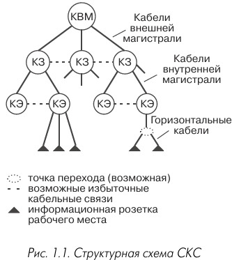

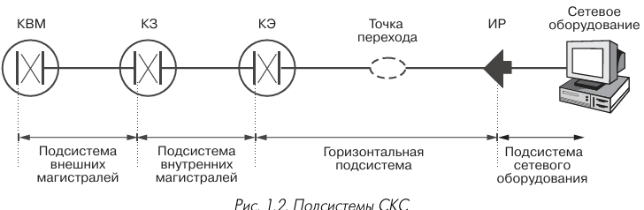

<details><summary><strong>улосные обозначения</strong></summary><table><tr><td>

1. информационная розетка: 


КВМ, КЗ и КЭ — это типы кроссовых помещений в структурированной кабельной системе (СКС). Они представляют собой узлы, через которые проходят кабели системы и осуществляется коммутация соединений.

2. КВМ — кроссовая внешних магистралей. В неё сходятся кабели внешней магистрали, которые подключают отдельные кроссовые здания (КЗ).

3. КЗ — кроссовая здания. В неё заводятся внутренние магистральные кабели, которые подключают кроссовые этажей (КЭ).

4. КЭ — кроссовая этажа. К ней горизонтальными кабелями подключены розеточные модули информационных розеток рабочих мест.

Особенности организации
- Во всей СКС может быть только одна КВМ.
- В каждом здании может находиться не более одной КЗ.
- Допускается объединение КВМ с КЗ, если они расположены в одном здании.
- Аналогично КЗ может быть совмещена с КЭ, если они расположены на одном этаже.
- При малой плотности рабочих мест на этаже или его части допускается подключение к КЭ горизонтальных кабелей смежных этажей.

</td></tr></table></details>

Вот как выглядит декомпозиция:


Или вот карсивая картинка:


Или вот хорошая:

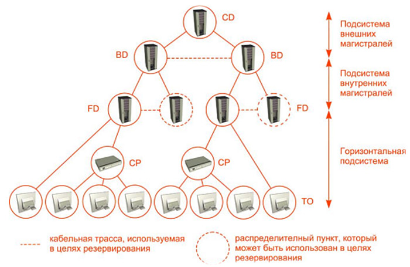

> Дистрибьютор (distributor) — коммутационное оборудование, устанавливаемое в техническом помещении и предназначенное для подключения и переключения кабелей СКС.

<mark><strong>Стандарты не регламентируют тип коммутационного оборудования, определяя только его параметры.</strong></mark> Для монтажа и дальнейшей эксплуатации коммутационного оборудования необходимы технические помещения. Все кабели, входящие в технические помещения, обязательно заводятся на коммутационное оборудование, на котором осуществляются все необходимые подключения и переключения в процессе строительства и текущей эксплуатации кабельной системы. Это обеспечивает гибкость СКС, возможность лёгкой переконфигурации и адаптируемости под конкретное приложение.

<mark><strong>Основой для применения именно иерархической звездообразной топологии является возможность её использования для поддержки работы всех основных сетевых приложений</strong></mark> (см. табл. 1.5). Из данных таблицы следует вывод о том, что топология рассматриваемого вида является той платформой, которая обеспечивает функционирование современных средств передачи данных.

**Таблица 1.5. Логическая и физическая топология современных сетей передачи данных**

| Протокол              | Логическая топология | Физическая топология |
|-----------------------|----------------------|----------------------|
| Token Ring            | Кольцо               | Кольцо, звезда       |
| High Speed Token Ring | Кольцо               | Кольцо, звезда       |
| FDDI                  | Кольцо               | Кольцо, звезда       |
| Ethernet              | Шина                 | Шина, звезда         |
| Fast Ethernet         | Шина                 | Звезда               |
| Gigabit Ethernet      | Шина                 | Звезда               |
| ATM                   | Виртуальный канал    | Кольцо, звезда       |

<details><summary><strong>Почему вдруг?</strong></summary><table><tr><td>

Иерархическая звездообразная топология — это **физическая** топология (звезда, а точнее — иерархическая звезда / дерево). При этом **логическая** топология может быть иной — например, кольцо или шина.

**Что это значит на практике:**

- **Физически** сеть построена как звезда (или дерево): все устройства подключены к концентраторам/коммутаторам, которые образуют иерархию.
- **Логически** (с точки зрения передачи кадров, доступа к среде, маршрутизации) сеть может работать как кольцо (Token Ring, FDDI) или как шина (Ethernet).

**Почему это важно и почему это «основание»:**

Именно такая комбинация — **физическая звезда при иной логической топологии** — позволяет:

1. **Поддерживать все основные сетевые приложения** (как сказано в тексте).
2. **Обеспечивать совместимость** разных протоколов (Token Ring, Ethernet, ATM и т.д.) на единой физической инфраструктуре.
3. **Упрощать эксплуатацию**: централизованное управление, легкая диагностика, масштабирование.
4. **Повышать надежность**: выход из строя одного узла (или даже сегмента) не парализует всю сеть, как в чистой шине или кольце.

**Посмотрите на таблицу 1.5:**

| Протокол | Логическая топология | Физическая топология |
|----------|----------------------|----------------------|
| Token Ring | Кольцо | Кольцо, звезда |
| Ethernet | Шина | Шина, звезда |
| Fast Ethernet | Шина | Звезда |
| Gigabit Ethernet | Шина | Звезда |
| ATM | Виртуальный канал | Кольцо, звезда |

Видно, что почти везде <mark><strong>**физическая топология включает звезду**, даже если логическая — кольцо или шина.</strong></mark>

</td></tr></table></details>

### 1.2.2. Технические помещения

<mark><strong>Технические помещения, необходимые для построения СКС и информационной системы предприятия, в целом делятся на: </strong></mark>
1. аппаратные и 
2. кроссовые.

> Аппаратная — <mark><strong>техническое помещение, в котором наряду с коммутационным оборудованием СКС располагается сетевое оборудование коллективного пользования</strong></mark> (АТС, серверы, концентраторы).

Если основной объём установленных в этом помещении технических средств составляет оборудование ЛВС, то его иногда называют серверной, а если учрежденческая АТС и системы внешних телекоммуникаций — узлом связи. Аппаратные оборудуются фальшполами, системами пожаротушения, кондиционирования и контроля доступа.

> Кроссовая — <mark><strong>помещение, в котором размещается коммутационное оборудование СКС, сетевое и другое вспомогательное оборудование.</strong></mark>

<mark><strong>Аппаратная может быть совмещена с кроссовой здания (КЗ).</strong></mark> В этом случае его сетевое оборудование может подключаться непосредственно к коммутационному оборудованию СКС. Если аппаратная расположена отдельно, то её сетевое оборудование подключается к локально расположенному коммутационному оборудованию или к обычным информационным розеткам рабочих мест. В кроссовую внешних магистралей (КВМ) сходятся кабели внешней магистрали, подключающие к ней КЗ. В КЗ заводятся внутренние магистральные кабели, подключающие к ним кроссовые этажей (КЭ). К КЭ, в свою очередь, горизонтальными кабелями подключены информационные розетки рабочих мест. В качестве дополнительных связей, увеличивающих гибкость и живучесть системы, допускается прокладка внешних магистральных кабелей между КЗ и внутренних магистральных кабелей между КЭ (пример изображён на рис. 1.1).


<mark><strong>Во всей СКС может быть только одна КВМ, а в каждом здании может присутствовать не более одной КЗ. Допускается объединение КВМ с КЗ, если они расположены в одном здании. Аналогично КЗ может быть совмещена с КЭ, если они расположены на одном этаже.</strong></mark> Если плотность рабочих мест на этаже или его части мала, то в качестве исключения допускается подключение к КЭ горизонтальных кабелей смежных этажей. Пример структуры СКС с привязкой к зданиям приведён на рис. 1.3.

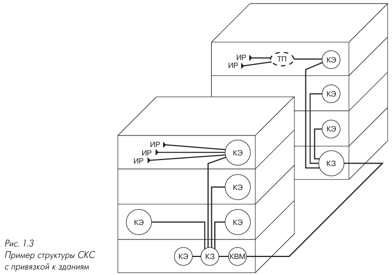

### 1.2.3. Подсистемы СКС

В самом общем случае <mark><strong>СКС, согласно международному стандарту ISO/IEC 11801, включает в себя три подсистемы</strong></mark> (рис. 1.2):

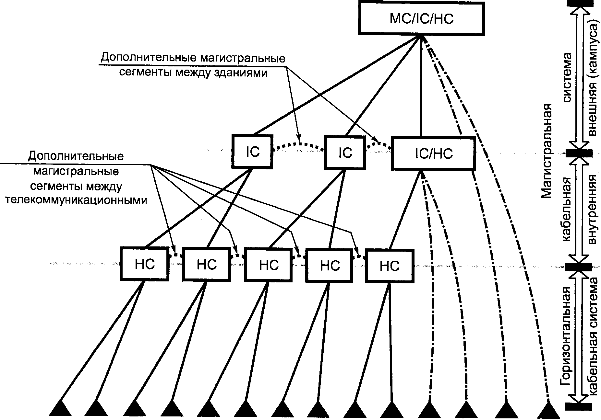

#### Подсистема внешних магистралей 

1. **Что это?** Подсистема внешних магистралей — это <mark><strong>часть структурированной кабельной системы (СКС), которая соединяет отдельные здания между собой на одной территории (кампусе).</strong></mark> В европейской терминологии её также называют первичной подсистемой.
2. Из чего состоит:
   1. **Внешние магистральные кабели** — проложены между:
       - **КВМ** — кроссовая внешних магистралей (главный распределительный узел, обычно в главном здании)
       - **КЗ** — кроссовая здания (распределительный узел в каждом отдельном здании)
   2. **Коммутационное оборудование** в КВМ и КЗ — то, к чему физически подключаются эти кабели.
   3. **Коммутационные шнуры и/или перемычки** в КВМ — для соединения портов и организации нужных схем.
3. Зачем она нужна
Это **основа для построения сети связи между зданиями**, расположенными компактно на одной территории (campus). Без неё здания были бы изолированными островками.
4. Как это выглядит
   На практике эта подсистема достаточно часто имеет физическую кольцевую топологию, что дополнительно обеспечивает увеличение надёжности за счёт наличия резервных кабельных трасс. <mark><strong>здания соединяются в цикл (кольцо) или двойной цикл (двойное кольцо).</strong></mark>
   - Почему именно цикл, а не «звезда» или «дерево»
     - **Цикл даёт резервирование**: если кабель между A и B повреждён, трафик от A к B пойдёт в обход — через D и C.
     - **Звезда** (все здания к одному центру) такого резерва не даёт: обрыв луча — здание изолировано.
     - **Дерево** (иерархия) — тоже без альтернативных путей.


Если СКС устанавливается автономно только в одном здании — подсистема внешних магистралей отсутствует, потому что соединять нечего: внешних магистралей между зданиями просто нет.

#### **Подсистема внутренних магистралей** (building backbone cabling)

1. Что это? Подсистема внутренних магистралей — это часть СКС, которая соединяет отдельные этажи и/или пространственно разнесённые помещения внутри одного здания. В европейской терминологии — вторичная подсистема, также называют магистральной системой здания или вертикальной подсистемой.
2. Из чего состоит:
   1. **Внутренние магистральные кабели** — проложены между:
      - **КЗ** — кроссовая здания (главный узел в здании, обычно на первом этаже или в подвале)
      - **КЭ** — кроссовая этажа (распределительный узел на каждом этаже)
   2. **Коммутационное оборудование** в КЗ и КЭ — то, к чему подключаются магистральные кабели.
   3. **Коммутационные шнуры и/или перемычки** в КЗ — для соединения портов и организации схем.
3. Зачем нужна
   - **Этажи между собой** — классическая «вертикальная» магистраль: кабель идёт от КЗ вверх по стояку к каждому этажу.
   - **Пространственно разнесённые помещения** в пределах одного здания — если здание большое и раскидано по площади (например, разные крылья).
4. Как это выглядит? Для внешних магистралей - Кольцо / двойное кольцо, а <mark><strong>для внутренних магистралей обычно звезда / иерархия</strong></mark>
5. Итог. Подсистема внутренних магистралей — это **«позвоночник» здания**: она соединяет этажные кроссовые (КЭ) с кроссовой здания (КЗ) и обеспечивает связь между всеми этажами и удалёнными помещениями внутри одного здания.

Если СКС обслуживает **один этаж** — подсистема внутренних магистралей **может отсутствовать**, потому что соединять этажи не нужно: всё находится на одном уровне.


#### **Горизонтальная подсистема** (horizontal cabling)

1. Что это?
Горизонтальная подсистема — это <mark><strong>часть СКС, которая соединяет кроссовую этажа (КЭ) с информационными розетками на рабочих местах.</strong></mark> В европейской терминологии — третичная подсистема. Это самый «нижний» и самый массовый уровень СКС, потому что именно к нему подключается конечное оборудование пользователей.

2. Из чего состоит:
   1. **Горизонтальные кабели** — проложены между:
      - **КЭ** — кроссовая этажа (распределительный узел на этаже)
      - **Информационными розетками** рабочих мест (то, куда пользователь включает компьютер, телефон, IP-телефон и т.д.)
   2. **Информационные розетки** на рабочих местах — точки подключения конечного оборудования.
   3. **Коммутационное оборудование** в КЭ — коммутаторы/патч-панели, к которым подключаются горизонтальные кабели.
   4. **Коммутационные шнуры и/или перемычки** в КЭ — для соединения портов патч-панелей с активным оборудованием.
3. Зачем нужна
   - **Подключение рабочих мест** — доводит кабель от этажного узла до каждой розетки, обеспечивая связь конечных пользователей с сетью.
   - **«Последняя миля» СКС** — от этажного узла до конкретного сотрудника.
4. Как это выглядит?
<mark><strong>Для горизонтальной подсистемы обычно звезда — каждый кабель идёт от КЭ к своей розетке.</strong></mark> Допускается **одна точка перехода**, в которой происходит изменение типа прокладываемого кабеля (например, переход на плоский кабель для прокладки под ковровым покрытием с эквивалентными передаточными характеристиками).
5. Итог. Горизонтальная подсистема — это **самый массовый уровень СКС**: она соединяет этажную кроссовую (КЭ) с информационными розетками рабочих мест и обеспечивает подключение конечных пользователей. Она допускает одну точку смены типа кабеля при условии сохранения передаточных характеристик.

Если СКС обслуживает **один этаж** — горизонтальная подсистема всё равно присутствует, потому что она соединяет КЭ с розетками рабочих мест в пределах этого этажа.

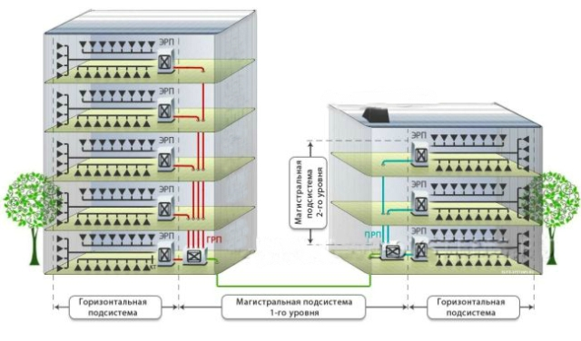

> Точка перехода (transition point, ТП) — <mark><strong>элемент горизонтальной подсистемы СКС, в котором происходит соединение двух кабелей различных типов с эквивалентными передаточными характеристиками.</strong></mark>

#### Общее сравнение подсистем СКС

| Критерий                        | Внешние магистрали                                                             | Внутренние магистрали                                                                         | Горизонтальная                                                                          |
|---------------------------------|--------------------------------------------------------------------------------|-----------------------------------------------------------------------------------------------|-----------------------------------------------------------------------------------------|
| **Что это**                     | Часть СКС, соединяющая здания между собой на одной территории (кампус)         | Часть СКС, соединяющая этажи и/или пространственно разнесённые помещения внутри одного здания | Часть СКС, соединяющая кроссовую этажа с информационными розетками рабочих мест         |
| **Что соединяет**               | Здания между собой                                                             | Этажи внутри здания                                                                           | КЭ ↔ рабочие места                                                                      |
| **Узлы**                        | КВМ ↔ КЗ                                                                       | КЗ ↔ КЭ                                                                                       | КЭ ↔ розетки                                                                            |
| **Кабели**                      | Внешние магистральные между КВМ и КЗ                                           | Внутренние магистральные между КЗ и КЭ                                                        | Горизонтальные между КЭ и розетками                                                     |
| **Коммутационное оборудование** | В КВМ и КЗ                                                                     | В КЗ и КЭ                                                                                     | В КЭ                                                                                    |
| **Шнуры/перемычки**             | В КВМ                                                                          | В КЗ                                                                                          | В КЭ                                                                                    |
| **Розетки**                     | —                                                                              | —                                                                                             | Информационные розетки рабочих мест                                                     |
| **Зачем нужна**                 | Связь между зданиями кампуса; основа сети связи компактно расположенных зданий | Связь этажей и удалённых помещений внутри здания; «позвоночник» здания                        | Подключение конечных пользователей; «последняя миля» от этажного узла до рабочего места |
| **Типовая топология**           | Кольцо / двойное кольцо (для резервирования)                                   | Звезда / иерархия                                                                             | Звезда (каждый кабель от КЭ к своей розетке)                                            |
| **Особенность**                 | Двойное кольцо повышает надёжность за счёт резервных трасс                     | —                                                                                             | Допускается одна точка перехода (смена типа кабеля при эквивалентных характеристиках)   |
| **Европейская терминология**    | Первичная                                                                      | Вторичная                                                                                     | Третичная                                                                               |
| **Альтернативные названия**     | Магистраль комплекса зданий (campus backbone)                                  | Магистральная система здания, вертикальная                                                    | Горизонтальная проводка (horizontal cabling)                                            |
| **Когда отсутствует**           | Если СКС в одном здании                                                        | Если СКС на одном этаже                                                                       | Отсутствует только там, где нет рабочих мест                                            |
| **Итог**                        | «Скелет» кампуса                                                               | «Позвоночник» здания                                                                          | «Последняя миля»                                                                        |

Рассматриваемое здесь <mark><strong>деление СКС на отдельные подсистемы применяется независимо от вида или формы реализации сети, то есть оно будет одинаковым, например, для офисной и производственной сети.</strong></mark>

Иногда из соображений удобства проектирования и эксплуатационного обслуживания применяется более мелкое дробление оборудования СКС на отдельные подсистемы. Так, например, элементы подключения сетевого оборудования к СКС в кроссовой выделяются в отдельную административную подсистему, а шнуры, адаптеры и другие элементы, необходимые на рабочих местах, образуют отдельную подсистему рабочего места и т.д.

<mark><strong>В самом общем случае СКС, согласно действующим редакциям международных нормативно-технических документов, включает в себя восемь компонентов:</strong></mark>

- линейно-кабельное оборудование подсистемы внешних магистралей;
- коммутационное оборудование подсистемы внешних магистралей;
- линейно-кабельное оборудование подсистемы внутренних магистралей;
- коммутационное оборудование подсистемы внутренних магистралей;
- линейно-кабельное оборудование горизонтальной подсистемы;
- коммутационное оборудование горизонтальной подсистемы;
- точки перехода;
- информационные розетки.

В подавляющем большинстве случаев подключение к СКС сетевого оборудования производится с помощью коммутационного шнура.<mark><strong> В некоторых ситуациях кроме шнура может понадобиться адаптер, обеспечивающий согласование сигнальных и механических параметров оптических или электрических интерфейсов (разъёмов) СКС и сетевого оборудования.</strong></mark> Например, адаптеры применяются для подключения к СКС сетевого оборудования с интерфейсами V.24 (RS-232C), устройств кабельного телевидения, систем IBM AS/400 с терминалами 5250, терминальных контроллеров IBM 3274 и терминалов 3270, а также дополнительных приложений, которые разрабатывались для других кабельных систем.

<mark><strong>Подсистема рабочего места обеспечивает подключение сетевого оборудования на рабочих местах. Применяемое для её реализации оборудование целиком и полностью зависит от конкретного приложения. Она не является частью СКС и выходит за рамки действия стандартов ISO/IEC 11801 и TIA/EIA-568A</strong></mark>, хотя эти нормативные документы накладывают на её параметры и характеристики определённые ограничения, более подробно обсуждаемые ниже.

### 1.2.4. Коммутация в СКС

**Главная особенность СКС** — <mark><strong>коммутация в ней всегда производится **вручную** коммутационными шнурами и/или перемычками.</strong></mark> Это принципиально отличает СКС от электронных АТС и сетевого компьютерного оборудования.

**Ключевое следствие:** функционирование СКС <mark><strong>**не зависит от электропитания**</strong></mark> — она построена на пассивных компонентах.

**Почему отказываются от электронной коммутации:**

- Введение электронных/электромеханических элементов требует **штатного источника питания**.
- Это **экономически и технически неоправданно**: среднее количество переключений одного порта — единицы раз в год, а источник питания **менее надёжен**, чем пассивные компоненты кабельной системы.

**Оборотная сторона отказа от электропитания:**

- Нужны коммутационные шнуры — они **ухудшают массогабаритные показатели** оборудования и усложняют администрирование.
- **Невозможно** встроить штатные коммутаторы, контроллеры, датчики — это снижает удобство эксплуатации, увеличивает время поиска неисправностей, затрудняет диагностику.

**Про активные компоненты:**

- Существуют отдельные серийные разработки с активными компонентами в подсистемах СКС.
- Но они носят **вспомогательный характер** (опрос портов, индикация, коммутация низкоскоростных приложений), **не затрагивают передачу информационных сигналов** и **не нормируются** действующими стандартами.

**Итог:** СКС сознательно строится как **пассивная система с ручной коммутацией** — это обеспечивает независимость от электропитания и высокую надёжность. Активные элементы пока не получили распространения, так как их преимущества не оправдывают усложнения и снижения надёжности.

### 1.2.5. Принципы администрирования СКС

<mark><strong>Принципы администрирования (иначе управления) СКС целиком и полностью определяются её структурой.</strong></mark> 
Различают: 
1. одноточечное и 
2. многоточечное администрирование.

> Многоточечное администрирование —<mark><strong> управление СКС, построенной по классической архитектуре иерархической звезды, при котором для изменения конфигурации требуется переключение минимум двух шнуров.</strong></mark>

Основным признаком этого варианта является необходимость выполнения переключения минимум двух шнуров в общем случае изменения конфигурации. <mark><strong>Использование данного принципа гарантирует наибольшую гибкость управления и возможность адаптации СКС для поддержки новых приложений.</strong></mark>

> Одноточечное администрирование — <mark><strong>управление СКС, при котором все информационные розетки рабочих мест соединены напрямую с единственным техническим помещением.</strong></mark>

<mark><strong>Архитектура одноточечного администрирования применяется в тех ситуациях, когда требуется максимально упростить управление кабельной системой.</strong></mark> Принципиально может использоваться только для СКС, установленных в одном здании и не имеющих магистральной подсистемы. Её основным признаком является прямое соединение всех информационных розеток рабочих мест с единственным техническим помещением. Несложно убедиться в том, что одноточечное администрирование может быть использовано только в небольших сетях и упрощает процесс управления кабельной системой благодаря выполнению всех коммутаций шнурами в одном месте.

<details><summary><strong>Правильно ли я понимаю, что речь про квм, кз и кэ? Тогда почему именно два переключения?
А одноточечное администрирование - когда система физически не разделяется на квм, кз, кэ?</strong></summary><table><tr><td>

# Разбираемся с многоточечным и одноточечным администрированием

## Почему «минимум два переключения»?

Да, речь именно про иерархию **КВМ → КЗ → КЭ → рабочее место**.

Причина в том, что в классической иерархической звезде сигнал между двумя рабочими местами проходит **через несколько кроссовых узлов**, и на каждом уровне нужно физически соединить порты шнуром/перемычкой.

### Пример: нужно соединить рабочее место A (этаж 1) и рабочее место B (этаж 2)

**Путь сигнала:**

```
Розетка A → КЭ-1 → КЗ → КЭ-2 → Розетка B
```

**Что нужно переключить:**

1. **В КЭ-1** — соединить порт горизонтального кабеля от розетки A с портом магистрального кабеля, идущего в КЗ (перемычка №1).
2. **В КЗ** — соединить магистральный кабель от КЭ-1 с магистральным кабелем, идущим в КЭ-2 (перемычка №2).
3. **В КЭ-2** — соединить магистральный кабель от КЗ с портом горизонтального кабеля к розетке B (перемычка №3).

То есть в общем случае — **три переключения**, но **минимум два**, если, например:

- рабочее место A и B находятся на одном этаже, но подключены через разные КЭ, или
- одно из рабочих мест уже скоммутировано, и меняется только часть пути.

**Формулировка «минимум два шнура»** означает: в общем случае изменение конфигурации затрагивает **не одну точку**, а как минимум две кроссовые — потому что сигнал идёт через иерархию узлов, и на каждом уровне своя коммутация.

### Ключевая идея

В **многоточечном** администрировании коммутация распределена по нескольким кроссовым (КЭ, КЗ, КВМ). Чтобы изменить путь сигнала, нужно **согласованно переключить шнуры в нескольких местах** — отсюда «минимум два».

Это даёт **гибкость**: можно перенаправлять сигналы через разные узлы, подключать новые приложения, менять маршруты.

**Минус:** сложнее администрировать — нужно помнить, что связано в каждом узле, и синхронно менять несколько перемычек.

---

## Одноточечное администрирование — да, без иерархии

**Да, вы понимаете правильно.** Одноточечное администрирование — это когда **вся СКС сведена в одно техническое помещение**, без разделения на КВМ, КЗ и КЭ (точнее, без магистральных подсистем).

### Как это выглядит

```
Розетка 1 ─┐
Розетка 2 ─┤
Розетка 3 ─┼──→ ЕДИНСТВЕННОЕ техническое помещение
Розетка 4 ─┤
Розетка 5 ─┘
```

**Все горизонтальные кабели от всех розеток идут напрямую в одно помещение.** Там стоит одно коммутационное оборудование (патч-панели, коммутаторы), и **все переключения делаются только там**.

### Почему это работает только в небольших сетях

- **Ограничение по расстоянию:** горизонтальный кабель по стандарту — до 90 м. Если здание большое или многоэтажное, кабель от дальнего рабочего места до единственного помещения просто не дотянется.
- **Ограничение по масштабу:** чем больше розеток, тем больше кабелей сходится в одну точку — это физически громоздко и неудобно.
- **Нет магистральной подсистемы:** нет КЗ и КВМ, нет внешних и внутренних магистралей — только горизонтальная подсистема.

### Преимущество

**Все коммутации в одном месте** — не нужно бегать по этажам и зданиям, всё под рукой. Просто и удобно для маленькой сети.

---

## Сравнение в таблице

| | Многоточечное | Одноточечное |
|---|---|---|
| **Узлы** | КВМ + КЗ + КЭ (иерархия) | Одно техническое помещение |
| **Коммутация** | Распределена по нескольким кроссовым | Только в одном месте |
| **Сколько переключений** | Минимум два (в общем случае — больше) | Одно (в одном месте) |
| **Гибкость** | Высокая | Ограниченная |
| **Масштаб** | Любой | Только небольшая сеть в одном здании |
| **Ограничение** | Сложнее администрировать | Длина кабеля до 90 м, ограниченное число розеток |

---

## Итог

- **Многоточечное** — сигнал идёт через **несколько кроссовых** (КЭ → КЗ → КЭ), поэтому для изменения конфигурации нужно переключить шнуры **минимум в двух местах**. Это гибко, но сложнее.
- **Одноточечное** — **вся СКС сходится в одно помещение**, без КЗ и КВМ, без магистралей. Все переключения — в одном месте. Просто, но только для маленьких сетей.

**Ваше понимание верное:** одноточечное — это фактически отсутствие иерархии КВМ/КЗ/КЭ, когда всё сведено в одну точку.

</td></tr></table></details>

### 1.2.6. Кабели СКС

<mark><strong>Одним из удачных способов повышения технико-экономической эффективности кабельных систем офисных зданий является минимизация типов кабелей, применяемых для их построения.</strong></mark> В СКС согласно международному стандарту <mark><strong>ISO/IEC 11801 допускается использование только:</strong></mark>

- <mark><strong>симметричных электрических кабелей на основе витой пары</strong></mark> с волновым сопротивлением 100, 120 и 150 Ом в экранированном и неэкранированном исполнении;
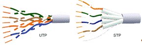
- <mark><strong>одномодовых и многомодовых оптических кабелей.</strong></mark>
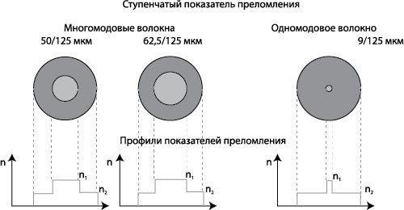

1. <mark><strong>Электрические кабели используются в основном для создания горизонтальной разводки.</strong></mark> По ним передаются как телефонные сигналы и низкоскоростные данные, так и данные высокоскоростных приложений. <mark><strong>Применение оптических решений в горизонтальной подсистеме в настоящее время встречается достаточно редко, хотя их доля растёт очень быстрыми темпами</strong></mark> (решения в рамках концепции fiber to the desk). 
2. В подсистеме внутренних магистралей электрические и оптические кабели применяются одинаково часто, причём электрические кабели предназначены для передачи главным образом телефонных сигналов и данных с тактовыми частотами до 1 МГц, тогда как оптические кабели обеспечивают передачу данных высокоскоростных приложений. 
3. <mark><strong>На внешних магистралях оптические кабели играют доминирующую роль.</strong></mark>

> Fiber to the desk (FTTD) — <mark><strong>концепция построения горизонтальной подсистемы СКС на волоконно-оптическом кабеле, доведённом до рабочего места.</strong></mark>

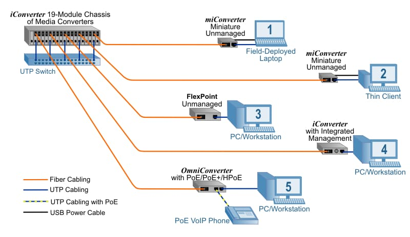


#### Переход с электрического кабеля на оптический

Для перехода с электрического кабеля на оптический при передаче данных со скоростью **10 Мбит/с и выше** в технических помещениях устанавливается специальное сетевое оборудование — **преобразователи среды (трансиверы)**. Обычно они обслуживают групповое устройство: концентратор системы передачи данных, выносной модуль АТС, контроллер инженерной системы здания и т.д.

**Когда оптика оправдана, а когда нет:**

- Прямое использование ВОК для **телефонных сигналов и низкоскоростных данных** на современном этапе **экономически нецелесообразно**.
- Оно применяется только тогда, когда другие решения невозможны или предъявляются **особые требования к защите информации** от несанкционированного доступа.
- Для повышения эффективности сети преобразование низкоскоростного электрического сигнала в оптический обычно **совмещается с мультиплексированием**.


#### Экранированный и неэкранированный кабель в горизонтальной подсистеме

Стандарты допускают применение обоих типов кабелей.

| Критерий | Экранированный | Неэкранированный |
|---|---|---|
| **Электрические характеристики** | Потенциально лучше | Хуже |
| **Прочностные характеристики** | В некоторых случаях лучше | — |
| **Критичность к монтажу и заземлению** | Очень высокая | Ниже |
| **Стоимость** | Заметно выше | Ниже |
| **Массогабаритные показатели** | Хуже | Лучше |

**Вывод:** несмотря на потенциальные преимущества экрана, основным кабелем для передачи электрических сигналов по СКС, по крайней мере в нашей стране, остаются **неэкранированные витые пары**.

> Экранированные конструкции превалируют лишь в некоторых странах с «зелёными» настроениями, например в Германии.

#### Волновое сопротивление электрических кабелей

Стандарты разрешают строить СКС на кабелях с волновым сопротивлением **100, 120 и 150 Ом**.

- Кабели **120 и 150 Ом** часто обладают **лучшими характеристиками**.
- Однако из-за технических и экономических причин **широкого распространения в нашей стране не получили**.

#### Оптические кабели по подсистемам

| Тип волокна | Где применяется |
|---|---|
| **Многомодовое** | В основном — подсистема внутренних магистралей |
| **Одномодовое** | Только длинные внешние магистрали |

#### Коаксиальные кабели

**Не включаются** в новые стандарты и **исключаются** из очередных редакций старых.

**Причины:**
- низкая надёжность сетей на их основе;
- невысокая технологичность;
- более высокая стоимость по сравнению с витыми парами.

Для работы сетевой аппаратуры с **коаксиальным и триаксиальным интерфейсом** по СКС используется широкая номенклатура **адаптеров**.

## 1.3. Понятие классов и категорий и их связь с длинами кабельных трасс

### 1.3.1. Классы приложений, категории кабелей и разъёмов СКС

#### Классы приложений (что умеет сеть)

Стандарт **ISO/IEC 11801** делит все приложения на классы по **максимальной частоте сигнала**:

| Класс | Что это | Частота |
|---|---|---|
| **A** | Телефон, низкоскоростные данные | 100 кГц |
| **B** | Средняя скорость | 1 МГц |
| **C** | Высокая скорость | 16 МГц |
| **D** | Очень высокая скорость | 100 МГц |
| **Оптический** | Оптика | 10 МГц и выше |

**Проще:** A — медленно, D — быстро. Оптический — отдельно, там оптоволокно.

**Забавный факт:** класса с частотой 20 МГц нет — потому что нет популярных приложений на 16–20 МГц. В Германии иногда называют 200 МГц — **D+**, 300 МГц — **D++**.

#### Категории кабелей (что умеет кабель)

Кабель и разъёмы тоже делят по категориям — чем выше, тем большую частоту держат:

| Категория | Частота | Что тянет |
|---|---|---|
| **3** | до 16 МГц | Token Ring, Ethernet 10BaseT, телефон |
| **4** | до 20 МГц | Token Ring, Ethernet 10BaseT |
| **5** | до 100 МГц | Сети до 100 Мбит/с |
| **5е** | до 100 МГц | Сети до 1000 Мбит/с |
| **6** | до 250 МГц | Сети до 1000 Мбит/с |
| **7** | до 600 МГц | Сети до 1000 Мбит/с |

**Проще:** категория кабеля = его «мощность». Кабель выше категории тянет всё, что тянет кабель ниже.

**Соответствие классов и категорий:**

- Класс A и B — нет категорий (слишком просто)
- Класс C — категория 3
- Класс D — категория 5
- Класс E — категория 6
- Класс F — категория 7

#### Что было дальше (конец 90-х)

- Начали делать **категории 6 и 7** для новых классов **E и F**.
- **Категория 5е** — улучшенная пятёрка для **Gigabit Ethernet**.
- **Класс E (кат. 6)** — сначала до 200 МГц, потом до 250 МГц.
- **Класс F (кат. 7)** — до 600 МГц, для **АТМ 622 Мбит/с** и аналогового ТВ до 550 МГц.

**Проблема с категорией 7:** обычный модульный разъём (RJ-45) не тянет такие частоты — работает только на крайних парах. Нужен новый разъём, но решение долго не принимали.

#### Главное правило

Линия работает по определённой категории, если:

1. **Все компоненты** (кабели, разъёмы, шнуры) — не хуже этой категории.
2. **Проект** соблюдает ограничения (длины, количество точек коммутации).
3. **Монтаж** сделан правильно.

**Проще:** хороший кабель + хорошие разъёмы + правильный монтаж = работает.

#### Что не рассматривается

- **Классы A и B** — слишком простые, Ethernet не тянут, универсальную сеть не построишь.
- **Категории 5е, 6, 7** — на 1999 год ещё официально не стандартизированы.

### 1.3.2. Ограничения на длины кабелей и шнуров СКС

#### Главная таблица

| Среда | Класс A | Класс B | Класс C | Класс D | Оптика |
|---|---|---|---|---|---|
| **Витая пара кат. 3** | 2 км | 200 м | 100 м* | — | — |
| **Витая пара кат. 4** | 3 км | 260 м | 150 м | — | — |
| **Витая пара кат. 5** | 3 км | 260 м | 160 м | — | — |
| **Кабель 150 Ом** | 3 км | 400 м | 250 м | — | — |
| **Многомодовый оптический** | — | — | — | — | 2 км |
| **Одномодовый оптический** | — | — | — | — | 3 км** |

\* 100 м = 90 м горизонтального кабеля + 10 м шнуров.
\** 3 км — формальное ограничение стандарта, не физический предел для одномода.

**Проще:** чем выше класс (A → D), тем короче максимальная длина. Оптика тянет километры, медь — сотни метров.

#### Откуда взялись эти цифры

**Горизонтальная подсистема — 90 м (+10 м на шнуры):**

- Выбрано под **Fast Ethernet** — самый массовый высокоскоростной протокол на момент принятия стандарта.
- Учитывались реальные возможности витой пары, приёмо-передатчиков и **типовые офисные здания**.
- Для оптики в горизонтали — те же 90 м, чтобы гарантированно уложиться в ограничения Fast Ethernet по диаметру коллизионного домена.

**Внутренние магистрали — 500 м:**

- Нужны, чтобы объединить все технические помещения в одном здании.
- Это не завышенное требование: в практике авторов был случай СКС в здании длиной **400 м**.

**Внешние магистрали — 1,5 км (до 3 км для одномода):**

- Объединяют отдельные здания.
- Максимальная длина между КЭ и КВМ: **2000 м** (500 м внутренней + 1500 м внешней магистрали).
- Для одномода — до **3000 м**.
- **Важно:** современная оптика с серийной аппаратурой тянет **100+ км**, но стандарт ограничивает 3 км. Для больших расстояний предполагается использовать **линии связи общего пользования**.

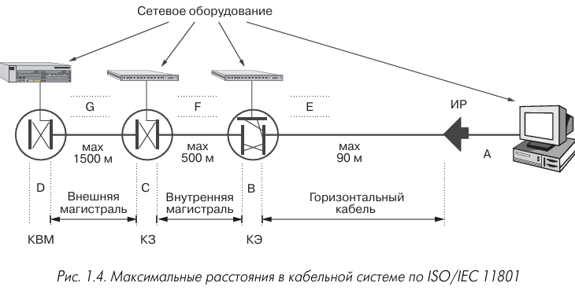

#### Длины шнуров

**В горизонтальной подсистеме (ISO/IEC 11801, редакция 2000):**

| Схема подключения | Максимальная длина шнуров |
|---|---|
| Коммутационное подключение, электрика | **9 м** |
| Коммутационное соединение, электрика | **10 м** |
| Любая схема, оптика | **10 м** |

> В редакции 1995 года было **всегда 10 м** — в 2000 году требования ужесточили.

**В магистральных кроссовых (КЗ и КВМ):**

- Коммутационный шнур — до **20 м**.
- Оконечный шнур (для подключения оборудования) — до **30 м**.

#### Итог

| Подсистема | Максимальная длина |
|---|---|
| **Горизонтальная** | 90 м кабель + 10 м шнуры = 100 м |
| **Внутренние магистрали** | 500 м |
| **Внешние магистрали** | 1,5 км (до 3 км для одномода) |
| **КЭ ↔ КВМ** | 2000 м (500 + 1500) |

**Проще:** горизонталь — до 100 м, внутри здания — до 500 м, между зданиями — до 1,5–3 км. Дальше — только через операторов связи.

## 1.4. Дополнительные варианты топологического построения СКС

Ниже рассматриваются дополнительные возможности построения горизонтальной подсистемы и подсистемы внутренних магистралей, часть из которых не вошла в основные действующие стандарты по СКС. 

### 1.4.1. Варианты построения горизонтальной подсистемы СКС

Горизонтальная подсистема СКС при её реализации на кабелях из витых пар может быть построена по четырём различным схемам, которые приведены на рис. 1.5.

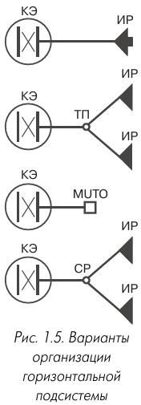

Горизонтальная подсистема — это часть кабельной сети, которая идёт от розетки на рабочем месте до кроссовой на этаже. Её можно построить **четырьмя способами**:

#### 1. Обычный вариант (самый частый)
<mark><strong>Один непрерывный кабель длиной **до 90 метров**</strong></mark> соединяет розетку и коммутационную панель. Всё просто: одна линия — один кабель.

#### 2. С точкой перехода (ТП)
Здесь <mark><strong>тракт состоит из **двух разных кабелей**, которые соединяются в точке перехода.</strong></mark> Важно: характеристики у них должны быть одинаковыми.
- По стандарту ISO/IEC 11801 можно соединять: «многопарный + четырёхпарный» или «круглый + плоский».
- По американскому стандарту TIA/EIA-568A — только «плоский + круглый».

**Что нельзя делать в точке перехода:**
- подключать активное оборудование;
- использовать коммутационные шнуры;
- выполнять администрирование.

#### 3 и 4. Варианты для открытых офисов
Открытый офис — это большое помещение, разделённое мебелью или лёгкими перегородками. Там люди часто пересаживаются, и рабочие места постоянно меняются.

Для таких офисов придумали два решения:

| Обычный офис | Открытый офис |
|---|---|
| Обычный проброс | **Многопользовательская розетка (MUTO)** |
| Точка перехода | **Консолидационная точка (CP)** |

**MUTO** — одна розетка на несколько человек. Ставится на колоннах, стенах, под фальшполом и т.д.  
Длина шнура от розетки до компьютера считается по формуле:

$$
W = \frac{102 - H}{1{,}2} - 7 \text{ м}, \quad W \leq 20 \text{ м}
$$

Где \(H\) — длина горизонтального кабеля.  
Если шнур 20 м, то кабель — не больше 70 м.

**CP (консолидационная точка)** — аналог точки перехода, но для открытого офиса. От неё идут короткие кабели к розеткам. Подходит, если люди пересаживаются, но не очень часто.

#### Главные правила
- В одной линии можно использовать **только одну** точку перехода, MUTO или CP.
- В CP **нельзя** ставить активное оборудование и делать администрирование.

Если хочешь, могу ещё короче — в виде шпаргалки или схемы.

### 1.4.2. Топологии с централизованным администрированием

Системы с централизованным администрированием определены в техническом бюллетене TSB-72 [24] и относятся к случаю построения разводки внутри одного здания полностью на оптическом кабеле. <mark><strong>Основная идея, заложенная в этом документе, состоит в предоставлении проектировщику СКС возможности отказа в данной ситуации от жёсткого деления кабельной разводки на горизонтальную подсистему и подсистему внутренних магистралей с их объединением в единое целое и переход, за счёт этого, от двухуровневой звездообразной топологии к простой одноуровневой.</strong></mark>

Применение принципа централизованного администрирования позволяет:

- <mark><strong>значительно увеличить управляемость ЛВС</strong></mark> за счёт появления возможности формирования любых заранее заданных рабочих групп на физическом уровне без использования виртуальных соединений;
- <mark><strong>сосредоточить всё активное оборудование в одном месте, что увеличивает защищённость от несанкционированного доступа к информации</strong></mark>, уменьшает потребности в высокоскоростных каналах и упрощает процедуру проведения эксплуатационных измерений;
- з<mark><strong>начительно сократить или даже полностью (в некоторых случаях) отказаться от выделенных помещений для кроссовых этажей.</strong></mark>

<mark><strong>Актуальность практического использования централизованного администрирования резко возросла в связи с массовым внедрением в широкую инженерную практику волоконно-оптической техники передачи сигналов, которая не накладывает на длины высокоскоростных каналов физического 90-метрового ограничения витой пары.</strong></mark>

Согласно бюллетеню TSB-72 кабельные системы рассматриваемого вида могут быть построены с использованием одного межсоединения и без него. Вариант с одним соединением позволяет сохранить прежнюю телекоммуникационную инфраструктуру здания, так как кроссовое оборудование для его реализации размещается в помещениях, зарезервированных первоначальным проектом под кроссовые этажей. Этот вариант возможен в двух разновидностях. Первую из них можно назвать схемой ответвления [25]. Согласно этой схеме до кроссовых доводится магистральный кабель, дальнейшая разводка выполняется абонентским кабелем, который соединяется с магистральным неразъёмным соединителем. Вторая разновидность получила в [24] название пассивной коммутационной панели. В соответствии с данной схемой предусматривается процесс коммутации с использованием обычного коммутационного шнура. Максимальное расстояние от информационной розетки до кроссовой этажа в рассматриваемом варианте составляет 90 м. Это позволяет сохранить преемственность с TIA/EIA-568A в отношении горизонтальной проводки, также обеспечивает лёгкость возврата к стандартной двухуровневой топологии. Максимальная длина канала с межсоединением выбрана равной 300 м из соображений получения на кабеле с волокном типа 62,5/125 пропускной способности канала связи 1 Гбит/с, то есть поддержки наиболее скоростных на сегодняшний день приложений типа Gigabit Ethernet и Fiber Channel. По аналогии со структурами на электрическом кабеле, в которых применяются точки перехода различного вида, какое-либо активное оборудование в месте размещения кросса не устанавливается.

Упомянутое выше в разделе 1.3.2 ограничение протокольного характера сетей Fast Ethernet разработчиками TSB-72 считается в данном случае малосущественным, вероятно, из-за сравнительно малой распространённости волоконно-оптической аппаратуры стандарта 100BaseFX, работающей в режиме разделения полосы пропускания.

При построении СКС без межсоединений длина любого канала опять же из соображений обеспечения преемственности ограничена значением 90 м. Это ощутимо сужает возможности организации системы с централизованным администрированием в ряде офисных зданий, однако в пределе позволяет обойтись вообще без выделенных кроссовых этажей. Если же они предусматриваются проектом, то говорят о проходной схеме и в кроссовых рекомендуют выделять места для хранения свёрнутого в бухты запаса кабелей и установки коммутационного оборудования.

Отметим также некоторые дополнительные ограничения и рекомендации бюллетеня TSB-72:

- в точке межсоединения не рекомендуется смешивать разъёмные и неразъёмные соединители волоконных световодов;
- основным типом разъёмного оптического соединителя считается SC в одиночном или дуплексном вариантах;
- неразъёмные соединители могут выполняться как сваркой, так и с помощью механических сплайсов;
- в вариантах с одним межсоединением в случае выполнения промежуточных неразъёмных соединений световодов допускается использовать различные типы кабелей на горизонтальном и магистральном участках;
- идентификация и маркировка отдельных волокон и соединителей должна выполняться в соответствии с правилами стандарта TIA/EIA-606.

<details><summary><strong>Короче</strong></summary><table><tr><td>

Давай совсем на пальцах.

## Представь дом или офис

В здании есть **этажные кроссовые** — это такие шкафчики/комнатки на каждом этаже, где сходятся все кабели.

И есть **оптоволокно** — тонкая стеклянная нитка, по которой летит интернет.

Бюллетень TSB-72 говорит: оптоволоконную сеть в здании можно собрать **двумя способами**.

---

## Способ 1: С межсоединением

**Что это значит?**

Где-то по пути кабель **разрывается** и соединяется заново — либо через разъём (как удлинитель в розетку), либо напрямую (сваркой).

**Зачем?**

Чтобы **использовать старые кроссовые**, которые уже есть в здании. Ничего перестраивать не надо.

**Две разновидности:**

- **Ответвление** — магистральный кабель приходит в кроссовую, а дальше идёт абонентский кабель. Соединяют их **напрямую** (сваркой или сплайсом), без разъёма.
- **Пассивная коммутационная панель** — то же самое, но соединение через **обычный шнур** (разъёмное).

**Цифры:**
- От розетки до кроссовой — **90 метров**.
- Весь канал с межсоединением — **до 300 метров** (чтобы хватило на 1 Гбит/с).

**Важно:** в месте кросса **нельзя ставить активное оборудование** (коммутаторы, серверы и т.п.).

---

## Способ 2: Без межсоединения

**Что это значит?**

Кабель идёт **целиком**, без разрывов и соединений.

**Цифра:**
- Любой канал — **не больше 90 метров**.

**Плюс:** можно вообще **не делать кроссовые на этажах**.
**Минус:** сложнее централизованно управлять сетью.

Если кроссовые всё же есть — это называется **проходная схема**. Там просто хранят запас кабеля и ставят коммутаторы.

---

## Простыми словами

| | С межсоединением | Без межсоединения |
|---|---|---|
| Кабель | Разрывается и соединяется | Идёт целиком |
| Длина | До 300 м | До 90 м |
| Кроссовые | Используем старые | Можно вообще без них |
| Активное оборудование в кроссе | Нельзя | — |

---

## Ещё несколько правил (совсем коротко)

- Не смешивай разъёмные и неразъёмные соединители в одном месте.
- Главный разъём — **SC**.
- Соединять волокна можно **сваркой** или **механическим сплайсом**.
- Если есть промежуточные соединения — на разных участках можно использовать **разные кабели**.
- Маркировка — по стандарту **TIA/EIA-606**.

---

Вот и всё. Если хочешь, могу ещё проще — буквально в трёх предложениях.

</td></tr></table></details>

## 1.5. Принцип Cable Sharing

Основным типом кабеля горизонтальной подсистемы современной СКС является 4-парный симметричный кабель, имеющий четыре различных варианта конструктивного исполнения (см. далее раздел 3.1.2). Большинство наиболее распространённых в настоящее время среднескоростных (Ethernet 10BaseT, Token Ring) и высокоскоростных (Fast Ethernet 100BaseTX, TP-PMD, ATM) приложений требуют для работы только две витые пары. Остальные две пары не используются и некоторыми типами сетевых интерфейсов просто замыкаются на землю, то есть для них являются фактически бесполезными. Уровень электрических характеристик горизонтальных кабелей, требуемый действующими редакциями стандартов и практически достигнутый на сегодняшний день, принципиально позволяет передавать по таким кабелям сигналы одновременно нескольких (двух, а в некоторых случаях трёх или даже четырёх) приложений с пренебрежимо малым уровнем влияния друг на друга. Подобное техническое решение по использованию горизонтального кабеля представляет собой адаптацию методов использования магистральных кабелей на область горизонтальной разводки и называется принципом разделения или расщепления кабеля (cable sharing). Это решение официально допускается для практического применения стандартами ISO/IEC 11801 и EN 50173.

> Cable sharing (разделение кабеля) — принцип использования горизонтального 4-парного кабеля для одновременной передачи сигналов нескольких приложений по разным парам одного кабеля.

Для практической реализации принципа cable sharing разработан и внедрён в серийное производство достаточно большой набор различных специализированных элементов, которые подробно рассмотрены далее и могут быть разделены на следующие группы:

- Y-адаптеры (см. раздел 3.4.2), а также сдвоенные и строенные балуны (см. раздел 3.4.2);
- двойные адаптерные вставки (см. раздел 3.2.2);
- разветвительные шнуры (см. раздел 3.4);
- монтажные шнуры специального вида (см. раздел 3.4.1);
- сдвоенные и строенные розеточные модули, позволяющие выполнять на них разводку одного кабеля.

Все перечисленные выше решения, за исключением последних двух, позволяют, в случае необходимости, легко вернуться к стандартному 4-парному варианту организации горизонтального участка тракта передачи электрического сигнала, то есть не затрагивают свойство универсальности кабельной системы.

Стандарты не выдвигают никаких особых требований к оборудованию, используемому для реализации рассматриваемого принципа, за исключением применения отличительной маркировки розеток.

Сразу же отметим, что наиболее адаптированы для передачи сигналов одновременно двух приложений горизонтальные кабели с так называемой четвёрочной скруткой (см. раздел 3.1.2), которые фактически представляют собой два одинаковых элемента, заключённых в общую оболочку. Однако в силу целого ряда причин эти кабели не получили широкого распространения и выпускаются только единичными производителями техники для СКС.

Использование обсуждаемого принципа организации СКС наиболее выгодно в сетях небольшого и среднего размера, в основном, по двум причинам:

- затраты на горизонтальную проводку составляют относительно большую величину — одновременная передача по одному кабелю сигналов двух приложений обеспечивает заметную экономию капитальных финансовых затрат на организацию сети;
- в таких сетях задача применения сверхвысокоскоростных приложений типа Gigabit Ethernet, требующих для своей работы одновременно четырёх пар, является существенно менее актуальной из-за относительно меньшего объёма передаваемой информации; в таких условиях ожидаемая проблема нехватки трактов передачи сигналов отодвигается на неопределённо далёкую перспективу.

Отметим, что принцип cable sharing получил достаточно большое распространение в некоторых европейских странах, где он используется существенно чаще по сравнению с решениями на основе двухпарных кабелей. Однако по состоянию на середину 2000 года данное решение мало популярно в Российской Федерации. Укажем на следующие причины такого положения дел:

- значительная доля российских СКС строится в соответствии с требованиями стандарта TIA/EIA-568A, который не допускает одновременную передачу сигналов двух приложений по одному горизонтальному кабелю;
- принцип cable sharing наиболее эффективен в системах с индивидуальной экранировкой отдельных пар, которые по причинам экономического характера устанавливаются существенно реже систем без такой экранировки (большая стоимость элементной базы и трудоёмкость монтажа не компенсируется экономией затрат за счёт меньшего количества прокладываемых кабелей);
- в нашей стране в настоящее время практически отсутствует рынок SOHO и домашних сетей, где самым широким образом применяется передача различных высокоскоростных и широкополосных сигналов в одном горизонтальном кабеле.

Относительно большое распространение в нашей стране имеет только решение на основе Y-адаптера или функционально аналогичной ему адаптерной вставки некоторых СКС, которые применяется для передачи по одному кабелю сигналов Ethernet 10BaseT и аналогового телефона в небольших и достаточно часто несертифицируемых сетях.

## 1.6. Гарантийная поддержка современных СКС

Современная СКС является сложным высокотехнологичным продуктом, рассчитанным на эксплуатацию в течение продолжительного времени. В этой связи особо важное значение приобретает система гарантий производителя СКС на свою продукцию и установленную систему. Действующие редакции стандартов не предписывают каких-либо жёстких правил в этой области, и только стандарт ISO/IEC 11801 рекомендует устанавливать продолжительность гарантии не менее чем в 10 лет. Указанное значение выбрано не в последнюю очередь из-за того, что среднестатистический срок между двумя косметическими ремонтами в зданиях офисного типа, после которого обычно производится перекладка кабельной системы, составляет примерно 9 лет. На основании этого в дальнейшем рассматриваются принципы и методы гарантийной поддержки, сложившиеся в отрасли на правах стандартов де-факто.

В настоящее время производители СКС применяют различные виды гарантий. Их можно разделить на четыре основные группы (рис. 1.8).

> Гарантия на компоненты (базовая гарантия) — гарантия того, что все компоненты кабельной системы не имеют производственных дефектов и при использовании по назначению в соответствии с ТУ не потеряют своих потребительских качеств на протяжении определённого периода времени с момента покупки.

Классическим видом гарантии является гарантия на компоненты, или базовая гарантия. Она означает, что все компоненты кабельной системы не имеют производственных дефектов и при использовании по назначению в соответствии с ТУ не потеряют своих потребительских качеств на протяжении определённого периода времени с момента покупки. Обычный срок гарантии на компоненты составляет пять лет; в последнее время наметилась тенденция увеличения этого значения: например, Lucent Technologies предоставляет на продукты серии Gigaspeed 20-летнюю гарантию данного вида. Условием получения базовой гарантии является приобретение компонента по официальным каналам в порядке, установленном производителем СКС.

> Системная (расширенная) гарантия — гарантия, предоставляемая на спроектированную и установленную по всем правилам СКС; под ней понимается соответствие характеристик смонтированной системы требованиям стандартов.

Расширенная, или системная, гарантия предоставляется на спроектированную и установленную по всем правилам СКС. Под ней понимается соответствие характеристик смонтированной системы требованиям стандартов. Основная масса производителей определяет срок этого вида гарантии на системы категории 5 в 15–16 лет. Системам, характеристики которых превышают требования категории 5, гарантийный срок обычно увеличивается до 20 лет, а некоторыми производителями даже до 25 лет. Основные принципы предоставления системной гарантии могут быть сформулированы следующим образом:

- применение в составе системы исключительно компонентов, официально разрешённых для установки в данную конкретную СКС. На использование компонентов, не входящих в официальный перечень разрешённых, в каждом конкретном случае должно быть получено отдельное разрешение производителя;
- построение системы в полном соответствии с требованиями действующих редакций стандартов, то есть без превышения длины кабельных трасс и шнуров, количества соединителей в тракте и т.д.;
- соответствие количества циклов соединения-разъединения разъёмов значению, задаваемому стандартами;
- проектирование и построение системы только прошедшим соответствующее обучение и авторизованным персоналом; все изменения и дополнения также должны производиться только авторизованным персоналом[^9].

[^9]: Отметим, что данное положение не затрагивает процесс переключения оконечных и коммутационных шнуров, так как в противном случае нормальная эксплуатация кабельной системы становится невозможной. Перечень действий, которые может совершать на установленной СКС обслуживающий персонал, как правило, подробно указан в гарантийном обязательстве компании-производителе кабельной системы.

Некоторые производители СКС выдвигают также дополнительные требования, сводящиеся к необходимости предоставления протоколов измерений, использованию для тестирования только измерительных приборов из определённого перечня и т.д.

Из приведённого выше несложно убедиться в том, что системная гарантия включает в себя также базовую и даже усиливает её (имеется в виду увеличение гарантийного срока). Кажущаяся на первый взгляд нелогичность этого положения (гарантия на всю систему целиком превышает по продолжительности гарантию на любой её компонент) объясняется тем, что кабель в смонтированной системе не подвергается значительным механическим нагрузкам в процессе прокладки, то есть гарантированно эксплуатируется в существенно менее жёстких условиях.

> Гарантия работы приложений — гарантия способности правильно смонтированной и установленной СКС (то есть СКС, уже имеющей системную гарантию) поддерживать работу тех или иных приложений.

Под гарантией работы приложений понимается способность правильно смонтированной и установленной СКС (то есть СКС, уже имеющей системную гарантию) поддерживать работу тех или иных приложений. Гарантия работы приложений в классическом смысле была достаточно популярной на ранних этапах развития техники СКС, когда на рынке предлагалось большое количество типов оборудования, созданного изначально без учёта возможности работы по структурированной кабельной проводке.

В конце 90-х годов в среде производителей СКС чётко наметилась тенденция предоставления специальных вариантов гарантии работы приложений, которые назовём в данном случае обобщённой гарантией[^10]. Гарантия этого вида юридически закрепляет улучшение производителем определённых параметров предлагаемого решения свыше уровня стандартов. Гарантии этой группы имеют три разновидности. Первая из них основана на списке приложений, куда часто включаются такие из них, которые формально не могут поддерживаться стандартной СКС данной конкретной категории. Иногда она предоставляется на поддержку функционирования любого приложения, аппаратура которого изначально спроектирована для работы по СКС той или иной категории. Вторая разновидность расширенной гарантии предполагает возможность увеличения длины так называемого тракта или канала (см. далее раздел 12.2) свыше задаваемых стандартом 100 м (компании BICC и ITT NS&S) для конкретных приложений из определённого списка. И наконец, третья разновидность обобщённой гарантии заключается в том, что производитель СКС (например, фирмы Krone и Hubbell) гарантирует нулевой уровень ошибок при функционировании одного или нескольких определённых приложений. Обоснованием такого подхода является тот факт, что появление ошибок приводит к необходимости повторной трансляции кадров, сопровождающейся резким снижением эффективной скорости передачи информации (см. табл. 1.12).

[^10]: Возможно, более правильно было бы назвать её расширенной, но этот термин в соответствии с традициями, сложившимися в области техники СКС, уже употребляется как синоним системной гарантии.

**Таблица 1.12. Зависимость эффективной скорости передачи данных от интенсивности повторной передачи кадров [26]**

| Интенсивность повторной передачи кадров, % | Эффективная скорость передачи данных, Мбит/с |
|---|---|
| 0 | 100 |
| 1 | 20 |
| 2 | 4 |
| 3 | 0,8 |
| 4 | 0,16 |
| 5 | 0,032 |

Изложенное показывает, что в общем случае гарантия работы приложений показывает потребителю лишь уровень запасов, который разработчик конкретной СКС заложил в свою систему, то есть степень превышения требований стандартов, причём применительно только к какому-либо конкретному приложению или их более или менее обширной группе. На основании этого заявляемая некоторыми авторами (см., например, [27]) бессмысленность гарантии на компоненты и системной гарантии без гарантии работы приложений не имеет под собой каких-либо серьёзных оснований, так как современное сетевое оборудование создаётся «под СКС», а не наоборот.

Документом, подтверждающим наличие у СКС гарантии того или иного вида, является сертификат производителя установленного им образца. Сертификат может выдаваться как на собственно СКС, установленную по конкретному адресу (например, АйТи и Lucent), так и владельцу СКС (естественно, что в этом случае требуется переоформление при смене владельца; примерами являются ITT NS&S, RIT Technologies, Molex). К сертификату прикладывается регистрационный документ с более или менее полным описанием системы, который может быть дополнен схематическим планом её структуры, а также результатами её инструментального тестирования (если эта процедура проводится согласно правилам установки СКС).

Гарантийный ремонт обычно выполняется компанией-инсталлятором конкретной СКС, что в некоторых случаях является одним из условий заключения соответствующего партнёрского соглашения между производителем СКС и системным интегратором. В тех случаях, когда эта компания в силу каких-либо причин не может выполнить работы, производитель поручает их проведение другому местному партнёру или же выполняет их самостоятельно.

Гарантийный ремонт не производится при неправильной эксплуатации, превышении нагрузки, механических повреждениях и повреждениях в результате стихийных бедствий, применении неразрешённых компонентов и в других аналогичных случаях.

Дополнительные сведения о различных аспектах предоставления и реализации гарантийной поддержки содержатся в обзоре [28].

## 1.7. Выводы

Структурированная кабельная система является основой информационно-вычислительной и телекоммуникационной инфраструктуры любого современного предприятия начиная от небольшой фирмы с несколькими сотрудниками и кончая корпорацией, в которой работает несколько десятков тысяч человек.

Современная СКС реализуется по иерархическому звездообразному принципу и состоит в общем случае из нескольких подсистем с детально стандартизованными на международном уровне параметрами и интерфейсом, взаимодействующих между собой по определённым правилам. Интеграция в одной системе волоконно-оптических и электрических кабельных линий связи на основе симметричного кабеля даёт возможность обеспечить средой передачи основную массу современных и перспективных видов сетевой аппаратуры. Кабельные тракты СКС, созданные на основе серийных компонентов, обеспечивают максимальную дальность связи 3000 м и информационную пропускную способность 1 Гбит/с и выше.

Наличие ряда стандартизованных вариантов построения горизонтальной подсистемы СКС существенно расширяет возможности адаптации к конкретным местным условиям. Это даёт возможность получения оптимального по критерию технико-экономической эффективности решения для основной массы офисных помещений как в зданиях старой постройки, так и в специально спроектированных бизнес-центрах.

Заложенная в стандарты функциональная гибкость позволяет при необходимости легко расширить область применения СКС за пределы офисных зданий и создавать кабельные системы как на производстве, так и в бытовом секторе.

Достигнутый технический уровень элементной базы и обеспечиваемое обученными специалистами качество проектирования и монтажа позволяет производителю гарантировать безотказную работу смонтированной кабельной системы на протяжении 15 лет и более. В свою очередь, это означает, что правильно установленная СКС работает на протяжении всего времени между двумя капитальными ремонтами офисного здания.

## FAQ

**Что такое СКС?**
Структурированная кабельная система — универсальная кабельная инфраструктура здания или комплекса зданий, построенная по иерархическому звездообразному принципу и предназначенная для передачи сигналов различных слаботочных приложений по единой кабельной системе.

**Когда и кем была предложена идея СКС?**
Идея была высказана специалистами фирмы AT&T (ныне Lucent Technologies) в 1983 году.

**Какая топология лежит в основе СКС?**
Древовидная топология, которую также называют структурой иерархической звезды.

**Из каких подсистем состоит СКС?**
Из трёх подсистем: внешних магистралей, внутренних магистралей и горизонтальной.

**Чем отличаются классы приложений от категорий кабелей?**
Классы (A, B, C, D, E, F) описывают приложения и требования к линиям связи, а категории (3, 4, 5, 5е, 6, 7) — характеристики кабелей и разъёмов по максимальной частоте сигнала.

**Какая максимальная длина горизонтального кабеля в СКС?**
90 м, плюс до 10 м на соединительные шнуры.

**Что такое cable sharing?**
Принцип использования горизонтального 4-парного кабеля для одновременной передачи сигналов нескольких приложений по разным парам одного кабеля.

**Какие виды гарантий применяются для СКС?**
Гарантия на компоненты (базовая), системная (расширенная), гарантия работы приложений и обобщённая гарантия.

**Какой срок гарантии рекомендует стандарт ISO/IEC 11801?**
Не менее 10 лет.

**Почему коаксиальные кабели исключены из новых стандартов?**
Из-за низкой надёжности сетей на их основе, невысокой технологичности и более высокой стоимости по сравнению с кабелями на витых парах.