

Кратко

# Краткая выжимка: Проектирование СКС (Глава X)

## 1. Принципы проектирования

**Стадии проектирования:**
- **Архитектурная** — определение общей структуры СКС, оптимальной по технико-экономическим характеристикам. Закладываются стояки, помещения кроссовых и аппаратных, пути прокладки кабелей. Выполняется на этапе разработки проекта здания.
- **Телекоммуникационная** — разработка конкретной структуры СКС, перечня оборудования, планов размещения. Выполняется после капитальных строительно-монтажных работ.

**Этапы создания СКС (по ГОСТ 34.601-90):**
1. Формирование требований (обследование объекта, требования пользователя)
2. Техническое задание (разработка и утверждение ТЗ)
3. Эскизный проект (предварительные решения, пояснительная записка, смета)
4. Технический проект (проектные решения, документация, спецификация)
5. Рабочая документация (точные чертежи, схемы, таблицы)
6. Ввод в действие (монтаж, пусконаладка, испытания)
7. Сопровождение (гарантийное и послегарантийное обслуживание)

**Исходные данные:** предпроектное обследование, стандарты, технические требования заказчика (часто в виде приложения к тендеру). Итог — утверждённое «Техническое задание» (ГОСТ 34.602-89).

**Документация:** пояснительная записка (П1/П2), схема структурная (С1), ведомость технического проекта (ТП), ведомость покупных изделий (ВП), план расположения (С8), спецификация (В4), локальная смета (Б2/Б3), таблицы соединений (С6), сборочные чертежи (СБ) и др.

## 2. Архитектурная стадия проектирования

**Основной норматив:** TIA/EIA-569. Регламентирует организацию аппаратных, кроссовых, кабельных трасс (горизонтальных, внутренних и внешних магистралей), ввода в здание, а также требования к электропитанию, отоплению, вентиляции и кондиционированию.

**Проблемы старых зданий:** недостаточная ёмкость кабельных трасс, необходимость новых стояков, перепланировок для аппаратных и кроссовых.

### 2.1. Аппаратные

**Назначение:** размещение сетевого оборудования коллективного пользования (УАТС, серверы, коммутаторы).

**Размещение:**
- Совмещена или максимально приближена к КЗ
- Недалеко от постов службы безопасности
- Не проходная, без окон, не на верхних этажах, не рядом с лифтами и опасными материалами
- В подвале — риск заливания (нужна гидроизоляция)
- Рядом должны быть грузовые лифты

**Площадь:** 0,7% от рабочей площади, но не менее 14 м². Для зданий с низкой плотностью (гостиницы, больницы): 100 мест — 14 м², 101–400 — 37 м², 401–800 — 74 м², 801–1200 — 111 м².

**Условия среды:**
- Температура: 18–24 °C (скорость изменения ≤3 °C/час)
- Влажность: 30–55% без конденсации (≤6%/час)
- Освещённость: ≥540 лк
- Вибрация: 5–22 Гц — амплитуда ≤0,12 мм; 22–500 Гц — ускорение ≤2,5 м/с²
- Напряжённость электрического поля: ≤3 В/м
- Загрязняющие вещества: хлор ≤0,01 ppm, сероводород ≤0,05 ppm, окислы азота ≤0,1 ppm, двуокись серы ≤0,3 ppm, пыль ≤10⁻⁶ г/м³·сутки, углеводороды ≤10⁻⁶ г/м³·сутки
- Отводимая тепловая мощность: ≥2,5 кВт (IEC-721)

**Конструкция:**
- Квадратная комната, короткая стена ≥3 м, высота ≥2,5 м
- Пол: распределённая нагрузка ≥12 кПа, точечная ≥4,4 кПа; фальшпол ≥0,25 м
- Стены: возможность обшивки экранами, крепление аппаратуры ≥100 кг
- Дверь: металлическая, наружу, ≥2,0×0,9 м, порог, огнестойкость ≥45 мин
- Системы: охранная и пожарная сигнализация, пожаротушение, кондиционирование, освещение, аварийное освещение, заземление
- ИБП с двумя независимыми подключениями к городской сети
- Ввод кабелей городской телефонной сети и операторов связи
- Рекомендуется: стол для администратора, шкафы для документации и ЗИП, держатель для шнуров, углекислотный огнетушитель

### 2.2. Кроссовые

**Назначение:** КВМ, КЗ, КЭ. КЭ — служебное помещение для ввода кабелей внутренних магистралей и горизонтальной подсистемы, монтажа коммутационного и сетевого оборудования.

**Размещение:**
- На каждом этаже (решение с обслуживанием соседних этажей — нежелательно)
- Максимально близко к вертикальным стоякам
- При площади этажа >1000 м² или длине кабелей >90 м — более одной КЭ
- Ближе к геометрическому центру обслуживаемой зоны
- Без окон, не проходная, вдали от источников помех и вибрации
- При нескольких КЭ — желательно разные стояки

**Площадь:** ≤1000 м² обслуживаемой площади, 100–250 рабочих мест, ≥6 м². Рекомендуемые размеры: 1000 м² — 3,0×3,4 м; 800 м² — 3,0×2,8 м; 500 м² — 3,0×2,2 м.

**Условия среды:**
- Температура: 10–30 °C
- Влажность: 30–55% без конденсации
- Освещённость: ≥540 лк
- Вибрация: в пределах допустимого для оборудования
- Напряжённость электрического поля: ≤3 В/м
- Загрязняющие вещества: в пределах санитарных норм

**Конструкция:**
- Квадратная комната, короткая стена ≥2 м, высота ≥2,5 м
- Стены: крепление аппаратуры ≥100 кг
- При стояке через кроссовую — без фальшпотолка и фальшпола, дверь на смежной стене
- Огнестойкость ≥45 мин
- Системы: пожарная и охранная сигнализация, вентиляция и освещение, заземление
- Информационная розетка, соединённая с УАТС
- Электропитание как в аппаратных
- Дополнительно: пожаротушение, кондиционирование, аварийное освещение

### 2.3. Кабельные трассы подсистемы внешних магистралей

- **Телефонная канализация:** трубы Ø100 мм (асбоцемент, бетон, пластмасса), глубина 0,4–1,5 м, смотровые колодцы через 40–100 м
- **Технология Dura-line:** трубы silicore Ø21–33 мм, длина ≥1750 м, внутренняя смазка, укладка в грунт без защиты
- **Эстакады:** на промышленных предприятиях
- **Воздушная подвеска:** специальные подвесные или самонесущие кабели, шаг крепления ~70 см
- **Укладка в грунт:** в песчаную подушку для защиты от деформации

### 2.4. Кабельные трассы подсистемы внутренних магистралей

**Назначение:** связь КЗ с КЭ, КВМ и аппаратными; прокладка внешних магистральных кабелей от ввода до КВМ/КЗ.

**Стояки:** сечение 8000 мм² обслуживает 2500 м² рабочей площади (с 3-кратным резервом).

**Элементы прохода перекрытий:**
- **Трубы:** хорошая защита, ограниченная гибкость
- **Рукава:** короткие отрезки труб, легкость установки, меньшая ёмкость
- **Слоты:** прямоугольные проемы, гибкость, но сложность пожарной безопасности и ослабление перекрытия

**Требования:**
- Внутренний диаметр труб и рукавов: 100 мм
- Не более двух изгибов ≤90° на трубу
- Заполнение труб: по табл. 10.7 (например, Ø20,9 мм — 183 мм² для одного кабеля, 107 мм² для двух, 138 мм² для трёх)
- Минимальный радиус изгиба: для кабелей со стальными элементами — 210 мм (Ø20,9), для других — 130 мм

**Прокладка:** короба, трубы, лотки, траверсы (Г-образные, шаг ≤1,5 м). Все металлические конструкции заземлены.

### 2.5. Кабельные трассы горизонтальной подсистемы

**Назначение:** прокладка кабелей от КЭ до рабочих мест. Способы: в конструкциях пола, под потолком, в настенных каналах.

#### 2.5.1. В конструкциях пола

**Подпольные каналы:**
- Одноуровневые (толщина пола ≥63 мм)
- Двухуровневые (≥100 мм)
- Открытые (≥25 мм)
- Магистральные и распределительные, вытяжные коробки через ≤6 м
- 650 мм² на каждые 10 м² рабочей площади
- Расстояние между распределительными каналами: 1520–1825 мм, до стены: 450–600 мм, между магистральными: ~18 м

**Ячеистые полы:** полости в бетонных плитах, большая ёмкость, хуже экранирование.

**Фальшполы:**
- Плитки на стойках с регулировкой высоты
- Система Intercell: пьедесталы 55/85 мм, плиты 500×500×2 мм
- Быстрый доступ, прочность ≥1500 кг/м²
- Недостатки: уменьшение высоты, акустика, необходимость plenum-кабелей
- Альтернатива: закрытые металлические лотки с крышками, отвод металлорукавом

**Закладные трубы:**
- Магистральные и распределительные
- Не более двух изгибов ≤90°, длина ≤30 м
- Радиус изгиба: ≥6 внутренних диаметров (≥10 для Ø>50 мм и оптики)
- Емкость: по табл. 10.8
- Вытяжные коробки при длине >30 м, >2 изгибах или разветвлении

#### 2.5.2. Подпотолочные каналы

**Виды:** перфорированные/сплошные лотки, траверсы, желоба, закрытые лотки с крышкой.

**Крепление:** боковые кронштейны (к стене) или скобы (к потолку), шаг ≤1500 мм.

**Требования:** 650 мм² на 10 м² площади, заземление, свободное пространство ≥300 мм, запрет разрыва в проёмах.

**Методы подвода к рабочим местам:**
- **Зонный:** зоны до 72 м², точка перехода, вертикальные короба/колонны
- **Связки кабелей:** пучок вдоль коробов, ответвления к розеткам
- **В кабельных лотках:** пучок на лотке, крепление стяжками
- **Через перекрытие:** только в крайних случаях

**Крепление одиночных проводов:** площадка под стяжку, клипса, фиксатор-прижим, дюбель-колье. Запрещена фиксация за элементы подвесного потолка.

#### 2.5.3. Настенные каналы

- **Накладные:** декоративные короба, плинтусы
- **Скрытые:** в толще стены, только розетки на поверхности

**Заполнение:** 30–60% площади сечения, при отсутствии данных — коэффициент 0,5. Скрытые каналы — гибкие пластмассовые трубки (как закладные трубы).

## Ключевые нормативы и рекомендации

- **ГОСТ 34.601-90** — этапы создания автоматизированных систем
- **ГОСТ 34.602-89** — техническое задание
- **ГОСТ 34.201-89** — шифры документов
- **РД 50-34.698-90** — содержание документов
- **TIA/EIA-569** — коммерческие здания, кабельные пути
- **ISO/IEC 11801, EN 50173** — СКС
- **IEC-721** — отводимая тепловая мощность

## 10.3. Телекоммуникационная стадия проектирования

На этой стадии выполняется расчёт количества компонентов СКС. Предлагается более мелкое деление на подсистемы (по сравнению с ISO/IEC 11801):

1. **Подсистема рабочего места**
2. **Горизонтальная подсистема**
3. **Магистрали кабельной системы**
4. **Подсистема кабелей оборудования**
5. **Административная подсистема**

Проектирование ведётся последовательно (в указанном порядке). Результаты оформляются в таблицах, которые служат исходными данными для следующих подсистем и итоговой спецификации.

---

## 10.3.1. Исходные данные для проектирования

**Строительные решения** (если проектирование начинается с телекоммуникационной фазы):
- Линейные размеры, поэтажные планы, площади, высота этажей
- Структура этажей (коридорная, открытые/сотовые офисы, лестницы, техпомещения)
- Строительные решения (материал стен, перекрытий, наличие подвесных потолков/фальшполов)
- Расположение инженерных систем (водопровод, отопление, канализация, силовые кабели)
- Наличие и размеры кроссовых/аппаратных
- Кабельная канализация, ввод в здание, каналы для вертикальных и горизонтальных трасс
- Электроснабжение и заземление

Все данные контролируются на соответствие TIA/EIA-569.

**Требования к СКС:**
- Виды сетевого оборудования (ЛВС, телефон, безопасность, управление зданием)
- Требования к пропускной способности, ёмкости магистралей, перспективам расширения
- Требования к методам прокладки и совместимости с интерьером

**Состав розеток на рабочих местах:**
- Информационные (симметричные и оптические)
- Силовые (гарантированное и бытовое питание)
- По ISO/IEC 11801 — минимум 2 ИР на рабочее место, одна — категории 3 или выше, остальные — категории 5 или оптика. Рекомендуется применять ИР категории 5.

---

## 10.3.2. Проектирование подсистемы рабочего места

**Задачи:** разработка плана расположения розеток, определение типов и количества оконечных шнуров, адаптеров, переходников.

**Расположение розеток:**
- Равномерно по площади (СНиП 2.09.04-87 — минимум 4 м² на рабочее место; ISO/IEC 11801 (2000) — 10 м²)
- Учитывается возможность прокладки кабеля и монтажа розеток
- Привязка к мебели снижает стоимость, но нарушает структурированность и гибкость
- Компромисс: архитектурные решения рассчитываются на полную ёмкость, а розетки устанавливаются по фактическому размещению сотрудников

**Оконечные шнуры:**
- Количество = количество единиц сетевого оборудования + до 10% в ЗИП
- Длины: 2–3 м для небольших комнат, до 8 м для больших; до 10% шнуров длиннее 3 м
- Самодельные шнуры не рекомендуются

**Таблица 10.9** — распределение рабочих мест (этаж, помещение, количество рабочих мест, типы розеток, метод крепления).

---

## 10.3.3. Проектирование горизонтальной подсистемы

Наиболее сложный и ответственный этап — здесь сосредоточена основная масса оборудования по номенклатуре, количеству и стоимости.

**Процесс:**
1. Привязка рабочих мест к кроссовым
2. Выбор типа телекоммуникационных розеток
3. Выбор типа и категории кабеля, расчёт количества
4. Проектирование точек перехода (при необходимости)

### Привязка к кроссовым
- Максимальная длина горизонтального кабеля — 90 м
- Минимизация кабелей длиной >70 м
- Равномерное распределение рабочих мест по кроссовым
- Минимизация средней длины каналов

**Таблица 10.10** — горизонтальные подключения (кроссовая, количество рабочих мест, розеточных модулей, тип и количество кабелей).

### Выбор типа информационных розеток
- Определяется эскизным проектом
- Конкретизируются: количество розеточных модулей, принципы крепления
- Основная масса ИР — с двумя модулями (телефон + компьютер)
- Корпуса на 4–12 модулей — для открытых офисов и больших залов

### Расчёт горизонтального кабеля

**Выбор типа и категории:**
- Симметричные (витая пара) и оптические кабели
- Категория зависит от максимальной частоты сигнала
- Не рекомендуется смешивать категории 3 и 5 на одном рабочем месте — нарушает универсальность
- На практике прокладывают два кабеля категории 5 на рабочее место
- Сдвоенные кабели — экономия, но неудобство протяжки
- Многопарные кабели — только до 6–12-портовых розеток или через точки перехода
- Запрещено запараллеливание пар и сращивание муфтами

**Методы расчёта количества:**

1. **Метод суммирования** — точный, но трудоёмкий; требует автоматизации (CADDY)

2. **Эмпирический метод** — для систем >30 рабочих мест; предполагает равномерное распределение рабочих мест

**Формулы:**
- Средняя длина трассы: `Lav = (Lmin + Lmax) / 2 × Ks + X`
    - Lmin, Lmax — длины до ближайшего и самого дальнего рабочего места
    - Ks = 1,1 (10% технологический запас)
    - X = X1 + X2 — запас на разделку (X1 = 30 см со стороны рабочего места, X2 — со стороны кроссовой)
- Количество трасс на катушку: `Ncr = Lcb / Lav` (округление вниз)
- Общее количество кабеля: `Lc = Lcb × Nto / Ncr`

**Формула для Excel (10.1):**
`=ОКРУГЛВВЕРХ(Nto/(ОКРУГЛВНИЗ(Lcb/(Lav×1,1+X);0));0)×305`

### Проектирование точек перехода
- Место изменения типа кабеля без ухудшения качества
- Плоский кабель → круглый, или ветвление многопарного на несколько 4-парных
- Оборудование: панели типа 110 (предпочтительно с запараллеленными контактами)
- Не предназначена для администрирования и подключения активного оборудования
- Емкость рассчитывается по количеству пар в кабеле от КЭ

---

## 10.3.4. Магистральные подсистемы СКС

**Задачи:**
- Выбор типа и категории кабелей
- Расчёт ёмкости и количества магистрального кабеля

### Выбор типа и категории
- Симметричные и/или волоконно-оптические кабели
- Категория — по табл. 1.6 (зависит от частоты)
- Оптика: многомодовая для внутренних магистралей (до 2000 м для 100 Мбит/с, до 550 м для Gigabit Ethernet), одномодовая — для внешних >500 м
- Комбинированные кабели — для совместной передачи данных и УАТС
- При несовместимости приложений — разные кабели или разные связки в одном кабеле
- Допускаются магистрали разных категорий (например, 3 и 5)

### Расчёт ёмкости и количества

**Ориентировочные значения:**
- Низкая интеграция (1 модуль, 1 кабель на РМ): минимум 2 пары на РМ
- Средняя интеграция (2+ модуля): минимум 3 пары на РМ
- Высокая интеграция: минимум 3 пары + 0,2 волокна на РМ (внутренние), 2 пары + 0,2 волокна (внешние)

**Обоснование:** 1 тракт внутренних магистралей = 4 пары на 10 рабочих мест; 0,2 волокна = 2 волокна / 10 РМ.

**Расчёт:**
- Для каждой КЭ: минимальное количество пар/волокон × количество РМ
- Округление до стандартной ёмкости кабеля (25, 50, 100, 200 пар; 4, 6, 8, 12, 24, 48 волокон)
- При оптических магистралях рекомендуется дублирование 25-парными кабелями категории 5

**Таблица 10.11** — магистральные соединения (маркировка, начало, конец, тип кабеля, количество пар/волокон, кабелей, длина, назначение).

### Особенности внешних магистралей
- Использование канализации ГТС — нужны согласования и разрешённые кабели
- Индивидуальный расчёт для каждого проекта
- Разветвительные муфты при длине общего участка >300–400 м
- Повышенные запасы ёмкости (двойной запас световодов)
- Широкое резервирование

### Резервирование магистралей
- Увеличение ёмкости кабеля
- Пространственно разнесённые трассы (например, два стояка)
- Транзитные соединения волокон (сварка или механические сплайсы)
- Особенно рекомендуется при прокладке в канализации ГТС

---

## 10.3.5. Подсистема кабелей оборудования

**Назначение:** подключение активного сетевого оборудования в кроссовых и аппаратных.

**Задачи:**
- Выбор метода подключения
- Выбор типа и категории кабелей
- Расчёт количества

### Методы подключения (рис. 10.22)
1. **Коммутационное подключение (cross-connect)** — через дополнительную коммутационную панель; защита портов, разгрузка лицевых панелей
2. **Коммутационное соединение (interconnect)** — прямое соединение шнурами; лучше для высокоскоростных ЛВС
3. **Связь между кроссами** — через многопарный кабель; для низкоскоростных приложений

**Правила выбора:**
- Высокоскоростные ЛВС — коммутационное соединение
- Остальные приложения — связь между кроссами
- Коммутационное подключение — для сетей среднего размера

### Выбор типа и категории, расчёт количества
- Категория 5 — для горизонтальной и магистральных подсистем
- Расчёт: по количеству рабочих мест или по ёмкости активного оборудования
- Длина — по планам размещения в технических помещениях

**Таблица 10.12** — кабели оборудования (тип, количество пар/волокон, кабелей, всего пар, длина, назначение).

---

## 10.3.6. Административная подсистема

Наиболее сложный этап проектирования.

**Задачи:**
- Определение функциональных секций кроссовых и аппаратных
- Расчёт ёмкости каналов передачи информации
- Определение типа коммутационного оборудования
- Разработка планов размещения оборудования
- Расчёт количества конструктивных единиц и коммутационного оборудования
- Определение типов и количества коммутационных шнуров

### Функциональные секции
Цветовая кодировка по TIA/EIA-606 (табл. 10.13):
- **Зелёная** — внешние кабели сетевого интерфейса
- **Фиолетовая** — кабели оборудования общего пользования (УАТС, концентраторы)
- **Жёлтая** — УАТС специального назначения (ISDN)
- **Белая** — кабели внутренней магистрали
- **Голубая** — кабели горизонтальной подсистемы
- **Оранжевая** — кабели оборудования систем передачи данных (модемы)
- **Серая** — вспомогательные магистральные линии
- **Коричневая** — кабели внешней магистрали
- **Красная** — кабели оборудования специального назначения

**Таблица 10.14** — состав оборудования кроссовой (цветовая кодировка, назначение, количество кабелей, пар/волокон, каналов, тип и количество коммутационного оборудования).

### Ёмкость каналов передачи информации
- Горизонтальная подсистема («голубая») — всегда 4 пары (или 2 волокна)
- Кабели оборудования («фиолетовая», «жёлтая», «оранжевая», «красная») — зависит от типа оборудования (1–4 пары)
- Магистральные секции («белая», «серая», «коричневая») — обычно 1 пара на канал; при известных приложениях — 4 пары для данных, 2 пары для остальных

### Выбор типа коммутационного оборудования
- **Панели типа 66** — устаревшие, только для небольших СКС с жёсткими требованиями по стоимости
- **Панели типов 110 и S210** — для «голубой» секции при большом числе телефонов; удобство администрирования отдельными парами
- **Панели с модульными разъёмами** — для ЛВС; высокая плотность, эстетичность, но выше стоимость магистралей
- **Волоконно-оптические** — полки в 19" конструктиве или настенные муфты

### Планы размещения оборудования
Способы размещения (табл. 10.15):
- **На стене** — до 24 рабочих мест; коммутационное соединение или подключение
- **В 19" конструктиве** — один шкаф до 120 РМ, два шкафа 100–300 РМ
- **Смешанный вариант** — >30 РМ, предпочтителен >250 РМ; коммутационное подключение или связь между кроссами

**Факторы выбора:** высота помещения, точки ввода кабелей, размещение силовых розеток, вентиляция, удобство обслуживания, освещение, строительные ограничения, перспективы.

### Расчёт количества конструктивных единиц

**Секция горизонтальных кабелей:**
- Панели 110: одна 25-парная линейка = 6 каналов; 100-парный блок = 24 канала
- Модульные панели: 4-парный кабель = 1 розетка; 25-парная связка = 6 розеток

**Секции магистральных кабелей:**
- Панели 110: 100-парный блок = 100 пар
- Модульные панели: 25-парная связка = 6 разъёмов (24 порта = 100 пар, 32 = 150, 48 = 200, 64 = 300)
- Оптические панели: ограничение по числу кабельных вводов (обычно 2 на 1U)

**Секции кабелей оборудования:**
- Панели 110: 25 / (пар в кабеле) × 4 = кабелей на блок
- Модульные панели: 4-парные — 1 кабель на разъём; многопарные — по каналам

**Размещение панелей 110:**
- На стене: кроссовые башни, вертикальные организаторы между колоннами, через каждые 3 колонны
- В 19" шкафу: коммутационное оборудование ≤60% высоты шкафа; при недостатке — два шкафа
- Принципы: непрерывность секций, учёт ввода кабелей, перспективы расширения

**Размещение модульных панелей:**
- В 19" шкафу: организатор между секциями, через каждые 72 порта внутри секции
- На стене: вертикальные колонны, организаторы между секциями, через каждые 72 порта и 3 колонны

**Таблица 10.16** — состав коммутационного оборудования (кроссовая, тип и количество оборудования, организаторы, дополнительное оборудование).

### Коммутационные шнуры
- Заводского изготовления
- Матрица связей функциональных секций (табл. 10.17)
- Рекомендуется 4-парные шнуры для данных, 1–2-парные для низкоскоростных приложений
- Разные длины: Lср = (Lmax + Lmin) / 2 — максимальное количество
- **Таблица 10.18** — коммутационные шнуры (функциональные секции, количество каналов, тип вилки, длины, тип и количество шнуров)

### Оформление спецификации
- По ГОСТ 21.110-95
- Разделы с заголовками
- Графы: позиция, наименование, тип/марка, код, изготовитель, единица измерения, количество, масса, примечание
- Титульный лист, утверждение руководителями заказчика и подрядчика

---

## Ключевые формулы и нормативы

- **Длина горизонтального кабеля:** ≤90 м
- **Средняя длина трассы:** `Lav = (Lmin + Lmax)/2 × 1,1 + X`
- **Количество кабеля:** `Lc = Lcb × Nto / Ncr`
- **Ёмкость магистралей:** низкая интеграция — 2 пары/РМ; средняя — 3 пары/РМ; высокая — 3 пары + 0,2 волокна/РМ
- **Коммутационное оборудование:** ≤60% высоты шкафа
- **Организаторы:** между секциями, через каждые 72 порта (горизонтальные), через 3 колонны (вертикальные)
- **TIA/EIA-606** — цветовая кодировка секций
- **ГОСТ 21.110-95** — спецификация

# Краткая выжимка: Пример проектирования СКС (раздел 10.4) и выводы (10.5)

## 10.4. Пример проектирования СКС

Рассмотрен пример проектирования кабельной системы в гипотетическом четырёхэтажном здании.

### 10.4.1. Исходные данные

**Здание:**
- 4 этажа, размеры в плане 50 × 15 м
- Высота этажа в свету — 3,5 м, толщина перекрытий — 50 см
- Коридорная планировка: 30 рабочих помещений на этаже по 6 × 3 м (18 м² каждое)
- Коридор шириной 3 м по продольной оси
- Рабочая площадь этажа — 540 м²

**Строительные особенности:**
- В коридорах — подвесной потолок (свободное пространство 35 см)
- В помещениях подвесного потолка нет
- Стены — кирпич, штукатурка 1 см
- Дополнительных каналов в полу и стенах нет

**Технические помещения (табл. 10.19):**
| Помещение | Назначение | Фактическая площадь | По норме |
|-----------|-----------|---------------------|----------|
| 111 | Аппаратная | 36,60 м² | 11,3 (14) м² |
| 211 | Кроссовая | 9,10 м² | 8,4 м² |
| 311 | Кроссовая | 9,10 м² | 8,4 м² |
| 411 | Кроссовая | 9,10 м² | 8,4 м² |

**Требования:**
- ЛВС + телефонная сеть
- На каждом рабочем месте — информационная розетка с двумя розеточными модулями
- Соединение УАТС с входным 100-парным кроссом ГТС
- Дополнительно: 2 силовые розетки гарантированного питания + 1 бытовая
- Блоки розеток на высоте 1 м
- Разводка в декоративных коробах

### 10.4.2. Архитектурная фаза проектирования

**Расчёт рабочих мест:**
- По СНиП 2.09.04-87: 135 блоков розеток на этаж (540 всего)
- По площади помещений: 120 розеток на этаж
- Принята большая цифра (540), дополнительные розетки — в коридорах, техпомещениях, для принтеров, факсов, охраны, серверов
- Неиспользованные розетки — в ЗИП

**Кабельные трассы:**
- Вдоль коридора за подвесным потолком — лотки
- Расстояние от лотка до капитального потолка — 25 см
- Кроссовая в центре этажа: на каждую половину лотка — 270 м²
- Сечение лотка: 650 × (270/10) × 2/3 = 11700 мм² → стандартный лоток 200 × 60 мм
- Переход от лотков к коробам — через закладные трубы Ø ~26 мм
- В каждой комнате — 4 блока розеток (по 2 с каждой стороны)
- Короб: 4 информационных + 2 силовых кабеля
- Расчётный диаметр кабеля — 5,5 мм
- Площадь 4 информационных кабелей — ~100 мм²
- При 50% заполнении — 200 мм²
- Выбран 3-секционный короб Legrand L/30026 (60 × 16 мм)
- Крепление: нейлоновый дюбель или джет-плаг

**Вертикальные стояки:**
- Кроссовые и аппаратная расположены друг над другом
- Используются слоты или рукава
- Проём 1 (этажи 2–4): площадь 5200 мм² → 300 × 50 мм
- Проём 2 (этажи 3, 4): 3500 мм² → 200 × 50 мм
- Проём 3 (этаж 4): 1730 мм² → 100 × 50 мм
- Учтён трёхкратный запас по площади

**Принцип администрирования:** многоточечный (УАТС, серверы, центральное оборудование ЛВС — в аппаратной).

### 10.4.3. Телекоммуникационная стадия проектирования

**Распределение рабочих мест (табл. 10.21):**
- Всего: 1080 розеточных модулей категории 5 (по 2 на рабочее место)
- 1080 силовых розеток гарантированного питания
- 540 бытовых силовых розеток

**Горизонтальная подсистема:**
- По 2 розеточных модуля категории 5 на рабочее место
- Точек перехода нет (нет больших залов и обособленных групп)
- Неэкранированный 4-парный кабель категории 5, по 2 на блок розеток
- Эмпирический метод расчёта (>30 розеток на этаже, равномерное распределение)
- Подъём/спуск: 3,25 + 2,25 = 5,5 м
- Lmin = 5,5 + 5 = 10,5 м; Lmax = 5,5 + 35 = 40,5 м
- Lav = (10,5 + 40,5)/2 × 1,1 + 3 = 31 м
- 305/31 = 9 трасс на катушку
- 540 × 2 / 9 = 120 катушек = 36600 м

**Подсистема внутренних магистралей:**
- Телефония — многопарный электрический кабель категории 3
- ЛВС — оптический кабель со 100% дублированием электрическим категории 5
- Высокая степень интеграции: 2 пары кат. 3 + 0,4 пары кат. 5 + 0,2 волокна на рабочее место
- На этаж: 270 пар кат. 3, 54 пары кат. 5, 27 волокон
- Высота этажа 4 м, запас на разделку 3 м с каждого конца
- Итого: 95 м 25-парного кат. 5; 143 м 100-парного кат. 3; 95 м 16-волоконного оптического (заменён на 2×8-волоконный Riser)

**Административная подсистема:**
- Панели типа 110 (количество модулей для телефонии = для ЛВС)
- Аппаратная — смешанное размещение (стена + шкаф)
- Кроссовые — в шкафах
- Метод подключения — коммутационное соединение
- 100-парный блок 110 = 24 горизонтальных кабеля или 4 многопарных
- Оптические полки 19" 1U с 16 розетками SC
- Сварка волокон, сплайс-пластина
- Шкафы 42U, запас на разделку 3 м

**Состав оборудования кроссовой (табл. 10.23):**
| Секция | Кабелей | Пар/волокон | Всего | В канале | Каналов | Оборудование | Кол-во |
|--------|---------|-------------|-------|----------|---------|--------------|--------|
| Голубая | 270 | 4 | 1080 | 4 | 270 | 100-парные блоки 110 | 12 |
| Белая (кат. 5) | 2 | 25 | 50 | 4 | 12 | 100-парные блоки 110 | 1 |
| Белая (кат. 3) | 3 | 100 | 300 | 4 | 72 | 100-парные блоки 110 | 3 |
| Белая (опт.) | 2 | 16 | 32 | 2 | 16 | Оптические полки | 2 |

**Аппаратная (табл. 10.23):**
| Секция | Кабелей | Пар/волокон | Всего | В канале | Каналов | Оборудование | Кол-во |
|--------|---------|-------------|-------|----------|---------|--------------|--------|
| Голубая | 270 | 4 | 1080 | 4 | 270 | 100-парные блоки 110 | 12 |
| Белая (кат. 5) | 6 | 25 | 150 | 4 | 36 | 100-парные блоки 110 | 2 |
| Белая (кат. 3) | 9 | 100 | 900 | 4 | 216 | 100-парные блоки 110 | 9 |
| Фиолетовая (УАТС) | 46 | 25 | 1150 | 1 | 1150 | 100-парные блоки 110 | 12 |
| Фиолетовая (ЛВС) | 135 | 4 | 540 | 4 | 135 | 100-парные блоки 110 | 6 |
| Зелёная | 1 | 100 | 100 | 1 | 100 | 100-парные блоки 110 | 1 |
| Белая (опт.) | 6 | 16 | 96 | 2 | 48 | Оптические полки | 6 |

**Размещение в кроссовых (табл. 10.24):**
- Монтажный шкаф 28U
- Белая (кат. 5) — 27U, 25U
- Белая (кат. 3) — 26U, 24U
- Голубая — 22U–5U (по 2U)
- Белая (опт.) — 4U, 2U
- Организаторы — 3U, 1U
- Сетевое оборудование — ниже

**Размещение в аппаратной (табл. 10.25):**
- Монтажный шкаф + кроссовое поле на стене
- Секции: фиолетовая (ЛВС), голубая, фиолетовая (АТС), белая (кат. 3), белая (кат. 5), белая (опт.), зелёная
- Организаторы между секциями

**Оконечные и коммутационные шнуры (табл. 10.26):**
- Кроссовые: 110-110 (1 пара) — 135 шт; 110-RJ45 (4 пары) — 135 шт; оптические SC — 12 шт
- Аппаратная: 110-110 (1 пара) — 405 шт; 110-RJ45 (4 пары) — 36 шт; оптические SC — 36 шт; 110-110 (1 пара) для ГТС — 7 шт; 110-110 (1 пара) для ГТС-голубая — 3 шт; RJ45-RJ45 7,6 м — 135 шт; RJ45-RJ45 1,5 м — 10 шт

**Оконечные шнуры на рабочих местах:**
- 540 розеточных модулей для ЛВС
- 1/3 подключена initially: 180 + 10% = 200 шт
- 200 шт × 2,1 м + 20 шт × 4,57 м
- Телефонные шнуры — в комплекте с аппаратами

**Аппаратная — оконечные шнуры:**
- УАТС: 46 шт 25-парных кабелей с TELCO (7 м)
- Рабочие места 1 этажа: 70 шт × 7,6 м
- Концентраторы: 10 шт × 1,5 м
- Оптические: 36 шт

**Спецификация (табл. 10.27) — выдержка:**
- Горизонтальная подсистема: розеточные модули кат. 5 — 540 шт; кабель 36600 м
- Внутренние магистрали: кат. 5 25 пар — 95 м; кат. 3 100 пар — 143 м; оптика 8×62,5/125 — 190 м
- Коммутационное оборудование: панели 110 200-парные — 8 шт; башни 400-парные — 5 шт; 500-парные — 5 шт; оптические полки — 12 шт; организаторы — 12 шт
- Коммутационные шнуры: 110-110 (1 пара) разных длин — 126+257+326+186+60 шт; 110-RJ45 — 114+246+171+66+15 шт; оптические SC — 12+60 шт
- Оконечные шнуры: RJ45-RJ45 2,13 м — 140 шт; 4,57 м — 20 шт
- Монтажное оборудование: шкафы 42U — 4 шт; вентиляторы — 4 шт; полки — 4 шт; силовые розетки — 8 шт
- Инструмент: ударные инструменты, Pentascanner, Certifiber
- Силовые розетки: 1080 + 540 шт
- Вспомогательные материалы: стяжки, маркеры

**Структурная схема (рис. 10.30):** УАТС, центральный коммутатор, распределительные полки, FO, кроссовые, концентраторы, горизонтальные кабели Cat. 5, Cat. 3, рабочие места.

## 10.5. Выводы

1. **Проектирование СКС** — сложный многоступенчатый процесс из двух стадий: архитектурной и телекоммуникационной.

2. **Архитектурная стадия** — подготовка технических помещений и кабельных трасс. Требования стандартов к кроссовым и аппаратным позволяют определить площадь, условия среды, требования к инженерным системам.

3. **Кабельные трассы** — различные варианты подпольных и надпотолочных каналов, вертикальных стояков, комбинируются в широких пределах.

4. **Телекоммуникационная стадия** — расчёт компонентов по принципу «от частного к общему», начиная от рабочего места. Ключевые факторы: конфигурация рабочего места, принцип администрирования, способ размещения коммутационных панелей.

5. **Итерационный характер** — расчёты могут повторяться; рекомендуется табличная форма и использование вычислительной техники для облегчения перехода между этапами и подготовки спецификации.

# Глава 10. Проектирование СКС

## 10.1. Принципы проектирования

### 10.1.1. Стадии проектирования

> **Архитектурная стадия проектирования** — <mark>этап определения общей структуры СКС, оптимальной по технико-экономическим характеристикам на этапе создания и последующей эксплуатации; выполняется при разработке проекта нового или реконструируемого здания.</mark>

> **Телекоммуникационная стадия проектирования** — <mark>этап разработки конкретной структуры СКС, перечня оборудования и планов его размещения; обычно выполняется после завершения капитальных строительно-монтажных работ.</mark>

<mark>Основной задачей архитектурной стадии является определение общей структуры СКС. На этой стадии в проект закладываются вертикальные стояки, помещения кроссовых и аппаратных, пути и способы прокладки кабелей внутри и снаружи здания (кабельная канализация).</mark> Исходные данные (рис. 10.1):

- <mark>форма, этажность, архитектурные, планировочные и геометрические характеристики здания и прилегающей территории;</mark>
- <mark>строительные и другие нормативные документы на проектирование служебных помещений и кабельных трасс;</mark>
- <mark>нормативная документация по СКС</mark> (стандарты);
- <mark>дополнительные требования заказчика.</mark>

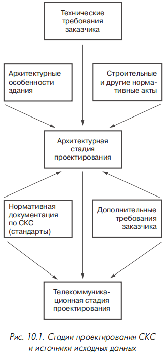

**Рис. 10.1.** Стадии проектирования СКС и источники исходных данных.

<mark>На архитектурной стадии работы проводятся специализированными проектными организациями с учётом требований подрядчика. Телекоммуникационная стадия может начинаться по окончании архитектурной, но обычно — после завершения капитальных строительно-монтажных работ.</mark> К проектированию привлекаются фирмы, специализирующиеся на СКС и системной интеграции; они же выполняют большую часть монтажных и пусконаладочных работ. Исходные данные:

- результаты обследования здания и прилегающей территории или проект архитектурной стадии;
- нормативная документация по СКС (стандарты);
- дополнительные требования заказчика (количество и размещение рабочих мест, число розеток, требования к производительности, надёжности, безопасности и т.д.).

### 10.1.2. Этапы создания СКС

В России отсутствует стандарт, определяющий СКС как технический объект и правила её проектирования. Наиболее близкий нормативный документ — **ГОСТ 34.601-90**, согласно которому создание системы разбивается на этапы и фазы (табл. 10.1).

ГОСТ 34.601-90

ГОСТ 34.601-90 — это межгосударственный стандарт из комплекса документов по информационным технологиям. Его полное название: «Информационная технология. Комплекс стандартов на автоматизированные системы. Автоматизированные системы. Стадии создания».

ГОСТ 34 и ГОСТ 19 — это два разных комплекса стандартов в сфере информационных технологий, которые регулируют документацию при разработке программного обеспечения и автоматизированных систем (АС). Их ключевое различие заключается в масштабе и предмете регулирования: ГОСТ 19 фокусируется на документации для программного изделия, а ГОСТ 34 — на полном цикле создания комплексной автоматизированной системы, включающей ПО, аппаратные средства, организационные процессы и другие виды обеспечения.

**Таблица 10.1. Этапы и фазы создания СКС**

| Этап | Фаза |
|---|---|
| 1. Формирование требований | 1.1. Обследование объекта 1.2. Формирование требований пользователя к системе |
| 2. Техническое задание | 2.1. Разработка и утверждение технического задания |
| 3. Эскизный проект | 3.1. Разработка предварительных проектных решений 3.2. Разработка пояснительной записки и локальной сметы |
| 4. Технический проект | 4.1. Разработка проектных решений по системе и её частям 4.2. Разработка документации на систему и её части 4.3. Разработка и оформление документации на поставку изделий |
| 5. Рабочая документация | 5.1. Разработка рабочей документации на систему и её части |
| 6. Ввод в действие | 6.1. Подготовка объекта к вводу системы в действие 6.2. Подготовка и обучение персонала 6.3. Комплектация системы поставляемыми изделиями 6.4. Строительно-монтажные работы 6.5. Пусконаладочные работы 6.6. Проведение опытных испытаний 6.7. Проведение опытной эксплуатации 6.8. Проведение приёмочных испытаний |
| 7. Сопровождение системы | 7.1. Выполнение работ по гарантийным обязательствам 7.2. Послегарантийное обслуживание |

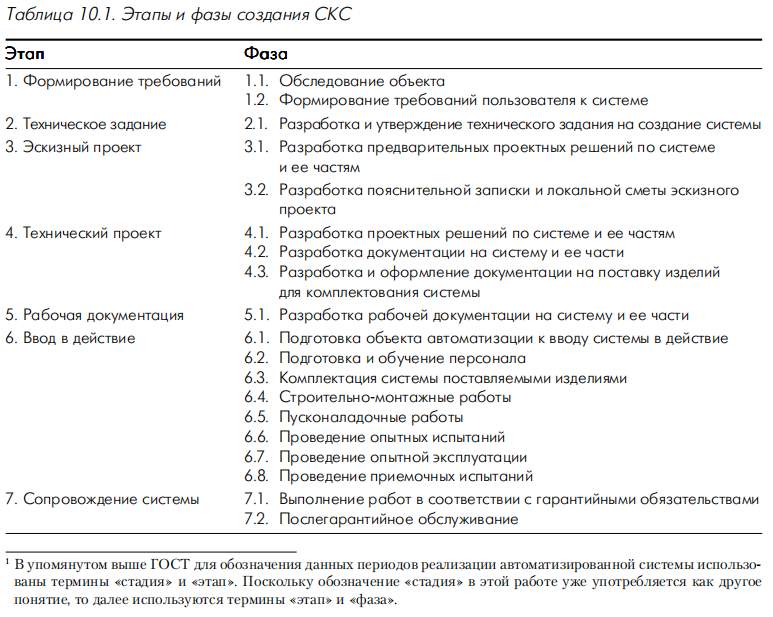

Работы по проектированию выполняются на этапах «Эскизный проект», «Технический проект», «Рабочая документация». К моменту ввода системы в действие должна быть разработана эксплуатационная документация, учитывающая изменения, внесённые в рабочую документацию в процессе пусконаладочных и строительно-монтажных работ, опытной эксплуатации и приёмочных испытаний, а также включающая руководства по использованию и поддержке системы.

Отдельная стадия может быть опущена, если это заведомо не приведёт к снижению качества. <mark>Оформление текстовой документации — по **РД 50-34.698-90**. Планы, схемы и чертежи — по стандартам серии **СПДС (ГОСТ 21.ххх)**. Для подготовки чертежей могут использоваться AutoCAD, ArchiCAD, CADDY и др.</mark>

#### 10.1.2.1. Исходные данные для проектирования

<mark>Основная исходная информация — сведения предпроектного обследования объекта, нормы стандартов и технические требования заказчика</mark> (часто оформляются как приложение к приглашению для участия в тендере). Итоговый документ предпроектной стадии — утверждённое **«Техническое задание» (ТЗ)**, составляемое по **ГОСТ 34.602-89**. Основную работу по подготовке ТЗ выполняет Исполнитель в тесном контакте с ответственным представителем заказчика; при необходимости привлекается третья сторона. Проекту присваивается шифр по **ГОСТ 34.201-89**.

#### 10.1.2.2. Эскизный проект

> **Эскизный проект (техническое предложение)** — <mark>этап разработки предварительных проектных решений; документация имеет общий характер и небольшой объём (обычно 5–10 страниц), может содержать несколько вариантов решения, их краткий анализ и рекомендации по выбору.</mark>

Часто предоставляется заказчику до заключения официального договора (в процессе тендера) и называется коммерческим или бюджетным предложением. <mark>Разрабатываются структурная схема СКС и конфигурация рабочего места, производится выбор среды передачи сигнала и методов прокладки кабелей.</mark>

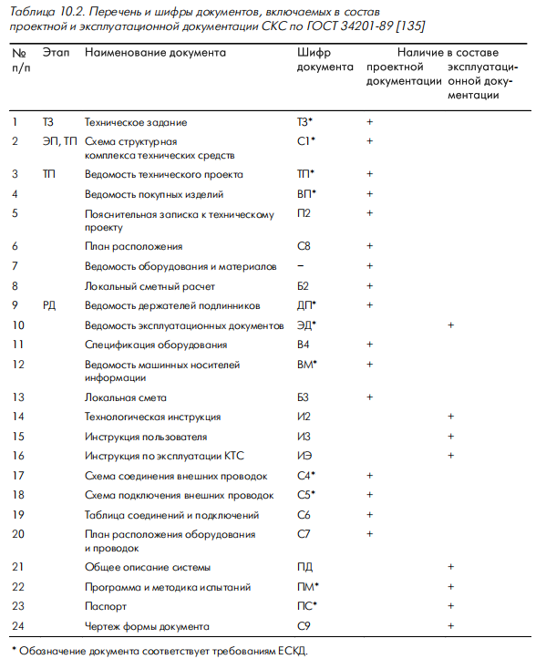

В состав документации могут включаться: пояснительная записка к эскизному проекту (**П1**); схема структурная комплекса технических средств (**С1**, может быть включена в П1); оценка стоимости создания системы (**Б0**). Правила оформления — в **РД 50-34.698-90**.

#### 10.1.2.3. Технический проект

<mark>Цель — глубокая разработка и обоснование проектных решений по системе в целом и её отдельным частям. В состав документации входят:</mark>

- ведомость технического проекта (**ТП**, по **ГОСТ 2.106-96**);
- пояснительная записка к техническому проекту (**П2**);
- структурная схема комплекса технических средств (**С1**, может быть включена в П2);
- ведомость (спецификация) оборудования и материалов;
- локальный сметный расчёт (**Б2**) — рекомендуется оформлять отдельным документом.

#### 10.1.2.4. Разработка рабочей документации

<mark>Цель — подготовка точных чертежей, схем и таблиц для монтажников. Рабочая документация обеспечивает детальную привязку компонентов к объекту.</mark> Основные документы:

- схемы размещения оборудования и проводок (**С7**);
- таблицы соединений и подключений (**С6**);
- сборочные чертежи (**СБ**).

---

## 10.2. Архитектурная стадия проектирования

### 10.2.1. Цели и задачи

<mark>Основной нормативный документ — **TIA/EIA-569** «Стандарт коммерческих зданий на кабельные пути и закладные телекоммуникационных кабелей». Стандартом регламентируются правила организации:</mark>

- аппаратных;
- кроссовых;
- кабельных трасс горизонтальной подсистемы;
- кабельных трасс подсистемы внутренних магистралей;
- области ввода в здание кабелей подсистемы внешних магистралей;
- кабельных трасс подсистемы внешних магистралей.

Приводятся требования к системе электропитания, отопления, вентиляции и кондиционирования здания в части, относящейся к телекоммуникационной инфраструктуре.

<mark>Цель архитектурной стадии — создание предпосылок для телекоммуникационной стадии. Тщательная проработка решений снижает стоимость создания и эксплуатации СКС, влияет на надёжность и безопасность.</mark> На практике процесс осложняется тем, что многие здания создавались под два вида проводок (силовая и телефонная), при норме «один телефон на комнату». Старые здания перепрофилировались под офисы. Проектировщик сталкивается с недостаточной ёмкостью кабельных трасс, необходимостью новых стояков, расширения лотков и перепланировок для аппаратных и кроссовых. Реконструкция требует капитальных вложений и не всегда возможна. В развитых странах проблему решали сносом старых зданий. Многие новые офисные здания в России слабо приспособлены для систем телекоммуникаций с интенсивным обменом данными.

### 10.2.2. Проектирование аппаратных

> **Аппаратная** — <mark>техническое помещение, в котором располагается сетевое оборудование коллективного пользования (УАТС, серверы, коммутаторы ЛВС, сетевые концентраторы).</mark>

Аппаратные требуют повышенного внимания ввиду специфики оборудования: нормальная работа организаций зависит от оперативного доступа к информации и качества телекоммуникаций. Стандартом «де-факто» является организация систем пожаротушения, кондиционирования и контроля доступа.

#### 10.2.2.1. Размещение аппаратной

<mark>Принципы выбора места:</mark>

- совмещение или максимальное приближение к КЗ для минимизации длины соединяющих кабелей;
- расположение недалеко от постов службы безопасности;
- помещение не должно быть проходным;
- желательно отсутствие окон и примыкания к внешним стенам;
- при размещении в подвале — минимизация риска заливания грунтовыми водами и аварий водопровода/канализации;
- не рекомендуется размещение на верхних этажах (затруднён ввод внешних кабелей, сильнее страдают при пожаре и протечках);
- нежелательно соседство с лифтовыми шахтами, лестничными маршами, вентиляционными камерами;
- запрещено соседство с помещениями для хранения огнеопасных или агрессивных химических материалов;
- избегать близости мощных источников электрических/магнитных полей и вибрации;
- недалеко от аппаратной должны находиться грузовые лифты.

#### 10.2.2.2. Площадь аппаратной

Размеры определяются составом оборудования. При отсутствии информации — 0,7% всей рабочей площади, но не менее 14 м². Для зданий с низкой плотностью рабочих мест (гостиницы, больницы) — по табл. 10.3.

**Таблица 10.3. <mark>Рекомендуемая площадь аппаратной для зданий с низкой плотностью рабочих мест**</mark>

| Количество рабочих мест | Площадь аппаратной, м² |
|---|---|
| ≤100 | 14 |
| 101–400 | 37 |
| 401–800 | 74 |
| 801–1200 | 111 |

<mark>Аппаратная часто совмещается с кроссовой этажа и/или внутренними магистралями. Создание одной большой аппаратной дешевле нескольких маленьких той же суммарной площади.</mark>

#### 10.2.2.3. Условия окружающей среды в аппаратной

- **Температура воздуха** — от 18 до 24 °C на высоте 1,5 м от пола; максимальная скорость изменения — не более 3 °C/ч. При превышении верхней границы оборудование сохраняет работоспособность, но ускоренно стареет.
- **Влажность** — от 30 до 55% без конденсации; скорость изменения — не более 6%/ч.
- **Освещённость** — не менее 540 лк на высоте 1 м от пола на свободном от оборудования пространстве; равномерная, без дополнительных ламп при любом виде работ.
- **Уровень вибрации** — в диапазоне 5–22 Гц амплитуда не более 0,12 мм; в диапазоне 22–500 Гц максимальное ускорение не более 2,5 м/с².
- **Напряжённость электрического поля** — не выше 3 В/м во всём спектре частот.
- **Содержание загрязняющих веществ** — не выше предельных значений (табл. 10.4).

**Таблица 10.4. Предельное содержание загрязняющих веществ в аппаратной**

| Вещество                 | Содержание |
|--------------------------|------------|
| Хлор, ppm                | 0,01       |
| Сероводород, ppm         | 0,05       |
| Окислы азота, ppm        | 0,1        |
| Двуокись серы, ppm       | 0,3        |
| Пыль, г/м³·сутки         | 10⁻⁶       |
| Углеводороды, г/м³·сутки | 10⁻⁶       |

Дополнительно **IEC-721** требует, чтобы отводимая тепловая мощность у сетевого оборудования составляла не менее 2,5 кВт (для правильного проектирования системы кондиционирования).

#### 10.2.2.4. Требования к конструкции и оборудованию аппаратной

<mark>Оптимальная форма — квадратная или близкая к ней комната с длиной короткой стены не менее 3 м. Расстояние между полом (фальшполом) и потолком (фальшпотолком) — не менее 2,5 м.</mark>

Пол — распределённая нагрузка не менее 12 кПа, точечная — 4,4 кПа. Желателен фальшпол минимальной высотой 0,25 м из легкосъёмных металлических плит, обеспечивающий ввод кабельных жгутов в 19-дюймовый конструктив снизу с соблюдением минимального радиуса изгиба каждого кабеля. Стены — с учётом обшивки металлическими экранирующими панелями и крепления аппаратуры массой не менее 100 кг.

Шкафы и стойки желательно располагать с доступом к передней и задней частям. Вход — металлическая дверь, открываемая наружу, размером не менее 2,0 × 0,9 м, с порогом для защиты от воды. Огнестойкость межэтажных перекрытий, стен и двери — не менее 45 мин.

<mark>Аппаратная оборудуется системами:</mark>
- охранной сигнализации; 
- пожарной сигнализации; 
- пожаротушения; 
- кондиционирования и освещения; 
- аварийного освещения; 
- защитного и телекоммуникационного заземления с возможностью подключения к главной пластине заземления. 
- Предусматривается установка одного или нескольких телефонных аппаратов; при профилактических работах помогает система громкоговорящей связи.

<mark>Сетевое оборудование получает питание от ИБП с двумя независимыми подключениями к городской сети с автоматическим переключением. Питание охранной и пожарной сигнализации — от двух систем. В аппаратную вводятся кабели городской телефонной сети и других операторов, а при наличии подсистемы внешних магистралей — и её кабели </mark> (из кабельной канализации, коллектора, с эстакад, столбов). Иногда для ввода выделяется отдельное помещение с кроссовым оборудованием, соединяемое с аппаратной кабелями внутренней прокладки.

<mark>Рекомендуется предусмотреть: компьютерный или письменный стол со стулом для системного администратора; шкафы, стеллажи или полки для документации, измерительной аппаратуры и ЗИП; настенный держатель для шнуров; углекислотный огнетушитель.</mark>

### 10.2.3. Проектирование кроссовых

> **Кроссовая** — <mark>служебное помещение, в которое вводятся кабели подсистемы внутренних магистралей и кабели горизонтальной подсистемы; в нём монтируется коммутационное, сетевое и вспомогательное оборудование.</mark>

<mark>Кроссовые подразделяются на кроссовые внешних магистралей (**КВМ**), здания (**КЗ**) и этажа (**КЭ**). На практике КВМ и КЗ часто совмещают с аппаратными</mark>, поэтому ниже рассматриваются КЭ. <mark>В кроссовых нельзя размещать оборудование, не имеющее отношения к их функциям (например, силовые распределительные щиты этажа).</mark> Отказ оборудования в КЭ обычно означает остановку работы только обслуживаемых ею рабочих мест, поэтому требования к КЭ менее жёсткие, чем к аппаратным.

#### 10.2.3.1. Размещение кроссовых

<mark>Принципы выбора места:</mark>

- <mark>КЭ можно совместить с одной из КЗ на том же этаже;</mark>
- <mark>КЭ должна быть на каждом этаже (решение с кроссовой, обслуживающей соседние этажи, ограничивает расширение и модернизацию);</mark>
- <mark>КЭ должна быть максимально приближена к вертикальным стоякам; идеально — стояк проходит через неё;</mark>
- <mark>при рабочей площади этажа более 1000 м² или необходимости дополнительных кроссовых для соблюдения предельной длины горизонтальных кабелей 90 м допускается более одной КЭ на этаже;</mark>
- <mark>для минимизации длины кабелей КЭ располагается как можно ближе к геометрическому центру обслуживаемой зоны;</mark>
- комната не должна иметь окон, быть проходной или совмещаться с другими производственными помещениями;
- избегать близости мощных источников электрических/магнитных полей и вибрации.

Вертикальный стояк

Вертикальный стояк — это вертикальный канал (шахта, короб, труба) в здании, по которому прокладывают инженерные коммуникации — кабели, трубы водоснабжения, канализации, вентиляции и т. п.

Что бывает внутри вертикального стояка

- Слаботочные кабели: витая пара, оптика, сигнальные линии — для сетей, телефонии, СКУД, видеонаблюдения.
- Силовые кабели: питание стоек, освещения, оборудования.
- Кабельные лотки, короба, трубы: чтобы упорядочить прокладку и защитить линии.
- Иногда — отдельные отсеки или перегородки для разных типов линий (например, силовые отдельно от слаботочных).

Если на этаже несколько КЭ, желательно обслуживание разными вертикальными стояками (избежать горизонтальной прокладки магистральных кабелей и повысить живучесть). При нарушении условия часть КЭ может подключаться к КЗ транзитом через другие КЭ (рис. 10.2).

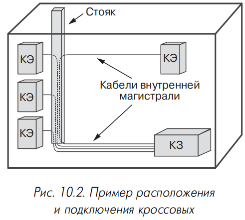

**Рис. 10.2.** Пример расположения и подключения кроссовых.

#### 10.2.3.2. Площадь кроссовых

<mark>Площадь рабочих помещений, обслуживаемых КЭ, по **ISO/IEC 11801** и **EN 50173** — не более 1000 м² (100–250 рабочих мест). Площадь самой КЭ — не менее 6 м². При отсутствии априорной информации</mark> — по табл. 10.5.

**Таблица 10.5. Рекомендуемые размеры КЭ в зависимости от обслуживаемой рабочей площади**

| Обслуживаемая рабочая площадь, м² | Габаритные размеры КЭ, м |
|---|---|
| 1000 | 3,0 × 3,4 |
| 800 | 3,0 × 2,8 |
| 500 | 3,0 × 2,2 |

#### 10.2.3.3. Условия окружающей среды в кроссовых

- **Температура воздуха** — от 10 до 30 °C на высоте 1,5 м от пола.
- **Влажность** — от 30 до 55% без конденсации.
- **Освещённость** — не менее 540 лк на высоте 1 м от пола на свободном пространстве; принципы выбора светильников — как для аппаратных.
- **Уровень вибрации** — не выше предельно допустимого для установленного оборудования.
- **Напряжённость электрического поля** — не более 3 В/м во всём спектре частот.
- **Содержание загрязняющих веществ** — не выше предельно допустимых санитарных норм.

#### 10.2.3.4. Требования к конструкции и оборудованию кроссовых

Оптимальная форма — квадратная или близкая к ней комната с минимальной длиной короткой стены 2 м; высота — не менее 2,5 м. Стены — с учётом обшивки металлическими экранирующими панелями и крепления аппаратуры массой не менее 100 кг.

При прокладке вертикального стояка через кроссовую в ней не должно быть фальшпотолка и фальшпола, а дверь располагается на смежной со стояком стене. Требования к двери и проёму — как для аппаратных. Огнестойкость — не менее 45 мин.

Кроссовая оборудуется системами: 
- пожарной и 
- охранной сигнализации; 
- вентиляции и 
- освещения; 
- защитного и телекоммуникационного заземления. 
- Предусматривается информационная розетка, соединённая с УАТС. Требования к электропитанию — как для аппаратных. При необходимости — пожаротушение, кондиционирование, аварийное освещение.

### 10.2.4. Кабельные трассы подсистемы внешних магистралей

<mark>Волоконно-оптический и электрический кабели вне зданий прокладываются в большинстве случаев в телефонной канализации. Её основа — круглые трубы с внутренним диаметром 100 мм из асбоцемента, бетона или пластмассы.</mark> Канализация прокладывается на глубине от 0,4 до 1,5 м и состоит из отдельных блоков, герметично состыкованных между собой. Через 40–100 м размещают смотровые колодцы с консолями для укладки кабеля и соединительных муфт.

Широкое распространение получила технология компании **Dura-line**: трубы **silicore** с внутренним диаметром от 21 до 33 мм и максимальной длиной не менее 1750 м (на барабанах или в бухтах). Внутренняя поверхность покрыта слоем твёрдой смазки, что уменьшает усилие протяжки и позволяет применять метод пневмозаготовки каналов. Прочность трубки позволяет укладывать её непосредственно в грунт без дополнительной механической защиты. В состав системы входит развитый набор аксессуаров.

На промышленных предприятиях применяются технологические эстакады с системой лотков, поддерживающих кронштейнов и других элементов. Воздушная подвеска кабелей не получила широкого распространения из-за сложностей реализации; применяется, когда прокладка другими способами невозможна. Для подвески на столбах используются специальные подвесные или самонесущие кабели со специальной крепёжной и натяжной арматурой. Допустима подвеска обычных кабелей на несущем тросике с использованием навивки или специальных хомутов (шаг крепления ~70 см).

Иногда используется укладка кабеля непосредственно в грунт. Для защиты в зимний период от повреждений деформацией рекомендуется укладка в песчаную подушку.

### 10.2.5. Кабельные трассы подсистемы внутренних магистралей

> **Подсистема внутренних магистралей** — <mark>совокупность кабельных трасс для связи КЗ с КЭ, КВМ и аппаратными, а также для прокладки внешних магистральных кабелей от места ввода в здание до КВМ или КЗ.</mark>

<mark>Магистральные кабели прокладываются вертикально и горизонтально. Горизонтальные участки — конструкции, аналогичные горизонтальной подсистеме. Вертикальные участки — стояки или шахты.</mark>

Размеры: стояк сечением 8000 мм² позволяет проложить магистральные кабели, обслуживающие 2500 м² рабочей площади (с учётом всех этажей). Результат полезного сечения рекомендуется увеличить в три раза для резерва под расширение.

<mark>Функции стояков выполняют слоты, рукава и закладные трубы (табл. 10.6).</mark>

**Таблица 10.6. Сравнительная характеристика труб, рукавов и слотов**

| Элемент | Краткое описание | Достоинства | Недостатки |
|---|---|---|---|
| Трубы | Вертикально установленные вдоль стены кроссовой огнестойкие трубы | Хорошая защита от проникновения воды, пыли, пламени; эффективная защита кабелей от механических повреждений | Ограниченная гибкость; требует больших запасов на расширение |
| Рукава | Вертикально установленные в перекрытии короткие отрезки труб из негорючего материала | Хорошая защита от воды, пыли, пламени; лёгкость установки и дешевизна; простота прокладки кабеля | Меньшая ёмкость и гибкость по сравнению со слотами |
| Слоты | Прямоугольные проёмы с бортиком в межэтажном перекрытии вдоль стены кроссовой | Гибкость использования; хорошие массогабаритные показатели | Сложность выполнения норм пожарной безопасности; высокая стоимость установки; ослабляет механическую прочность перекрытия |

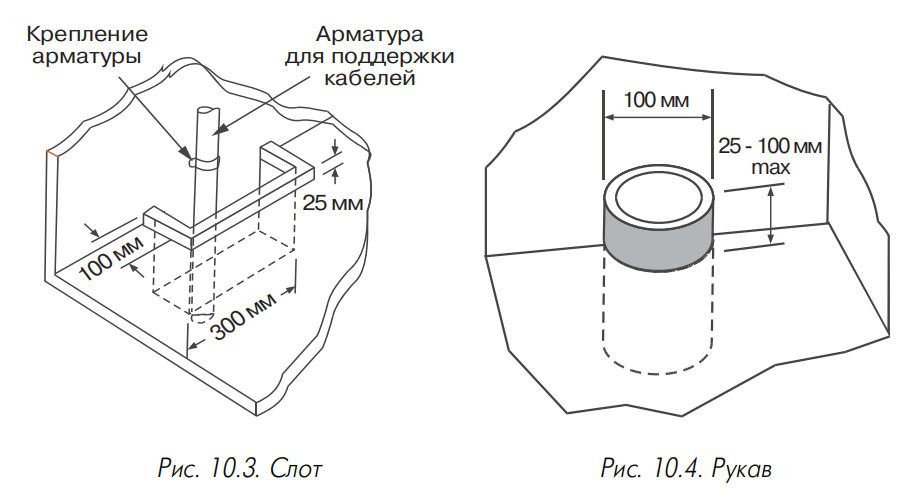

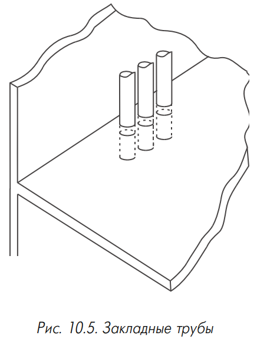

**Рис. 10.5.** Закладные трубы.

Слот (рис. 10.3) — <mark>проём прямоугольной формы в межэтажном перекрытии кроссовой рядом со стеной, обязательно с бордюром. Кабели крепятся к стене хомутами; по окончании прокладки проём заделывается огнеупорной заглушкой.</mark>

Рукав (рис. 10.4) — <mark>относительно короткий отрезок трубы в межэтажном перекрытии; концы выступают с обеих сторон минимум на 25 мм. Закладные трубы (рис. 10.5) отличаются большей длиной.</mark>

Рекомендуемый внутренний диаметр труб и рукавов — 100 мм. <mark>Необходимо контролировать заполнение (при превышении — проблемы с прокладкой и допустимыми усилиями протяжки из-за трения).</mark> На усилие влияют диаметр трубы, число кабелей, количество изгибов и их радиус. Ни одна закладная труба не должна иметь более двух изгибов с углом поворота не более 90° каждый. Данные по заполнению и радиусам изгиба — в табл. 10.7.

**Таблица 10.7. Рекомендуемый уровень максимального заполнения трубчатых элементов магистральными кабелями и минимальный радиус изгиба**

| Диаметр трубы «в свете», мм | Площадь трубы «в свете», мм² | Макс. заполняемая площадь, мм² (один кабель) | Макс. заполняемая площадь, мм² (два кабеля) | Макс. заполняемая площадь, мм² (три кабеля) | Мин. радиус изгиба для кабелей со стальными упрочняющими элементами, мм | Мин. радиус изгиба для других кабелей, мм |
|---|---|---|---|---|---|---|
| 20,9 | 345 | 183 | 107 | 138 | 210 | 130 |
| 26,6 | 559 | 296 | 173 | 224 | 270 | 160 |
| 35,1 | 973 | 516 | 302 | 389 | 350 | 210 |
| 40,9 | 1322 | 701 | 410 | 529 | 410 | 250 |
| 52,5 | 2177 | 1154 | 675 | 871 | 530 | 320 |
| 62,7 | 3106 | 1646 | 963 | 1242 | 630 | 630 |
| 77,9 | 4794 | 2541 | 1486 | 1918 | 780 | 780 |
| 90,1 | 6413 | 3399 | 1988 | 2565 | 900 | 900 |
| 102,3 | 8268 | 4382 | 2563 | 3307 | 1020 | 1020 |
| 128,2 | 12984 | 6882 | 4025 | 5194 | 1280 | 1280 |
| 154,1 | 18760 | 9943 | 5816 | 7504 | 1540 | 1540 |

<mark>В зависимости от размеров и архитектуры здания может быть один или несколько стояков. Решение с одним стояком и одной КЭ — только если из кроссовой можно проложить горизонтальные кабели длиной не более 90 м до всех розеток этажа. В остальных случаях — несколько стояков или дополнительные КЭ без выделенных стояков, связанные горизонтальными магистральными кабелями. Для живучести — два или более пространственно разнесённых стояка.</mark>

Для горизонтальных участков — короба, трубы, лотки. При наличии фальшпотолка — крепление к стене или капитальному потолку пластиковой стяжкой и дюбель-колье или анкер-клином. Для многопарных электрических кабелей — траверсы (Г-образные элементы; расстояние между траверсами не более 1,5 м; эффективны только для кабелей повышенной жёсткости).

Особое внимание — пожарной безопасности (глава 9). Все металлические конструкции кабельных трасс должны быть надёжно заземлены.

### 10.2.6. Кабельные трассы горизонтальной подсистемы

> **Горизонтальная подсистема** — <mark>совокупность кабельных трасс от КЭ до рабочих мест.</mark>

<mark>Кабели прокладываются: в конструкциях пола; под потолком; в настенных каналах. Общее требование — заземление всех металлических элементов.</mark>

#### 10.2.6.1. Кабельные трассы в конструкциях пола

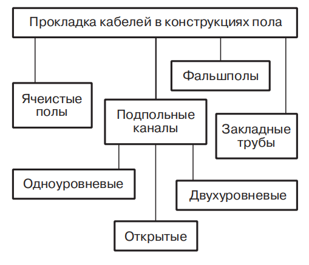

**Рис. 10.6.** Варианты прокладки горизонтального кабеля в конструкциях пола.

Разновидности (рис. 10.6): подпольные каналы; ячеистые полы; фальшполы; закладные трубы. Традиционно в России наиболее широко используются закладные трубы.

**Подпольные каналы** — <mark>металлические или пластиковые конструкции с прямоугольным сечением, устанавливаемые в структуре межэтажного перекрытия перед «чистой заливкой» пола. Обеспечивают механическую защиту, снижают наводки и электромагнитное излучение, скрытность. Недостатки: высокая стоимость, необходимость завершения монтажа до окончания строительно-монтажных работ, применение специальных напольных коробок, увеличение массы пола.</mark>

Структура: магистральные и распределительные подсистемы. На пересечениях — вытяжные (протяжные) коробки; расстояние между ними не более 6 м. В точках рабочих мест — напольные коробки с розетками. Крышки — на одном уровне с «чистым полом». Возможны комбинированные варианты с настенными коробами.

Три разновидности:

- **одноуровневые** — магистральные и распределительные на одном уровне; толщина «чистого пола» от 63 мм;
- **двухуровневые** (рис. 10.7) — на разных уровнях (распределительные выше); толщина «чистого пола» не менее 100 мм;
- **открытые** (рис. 10.8) — верхние поверхности и крышки коробок на одном уровне с полом; минимальная толщина «чистого пола» 25 мм; минимальная защита кабелей.

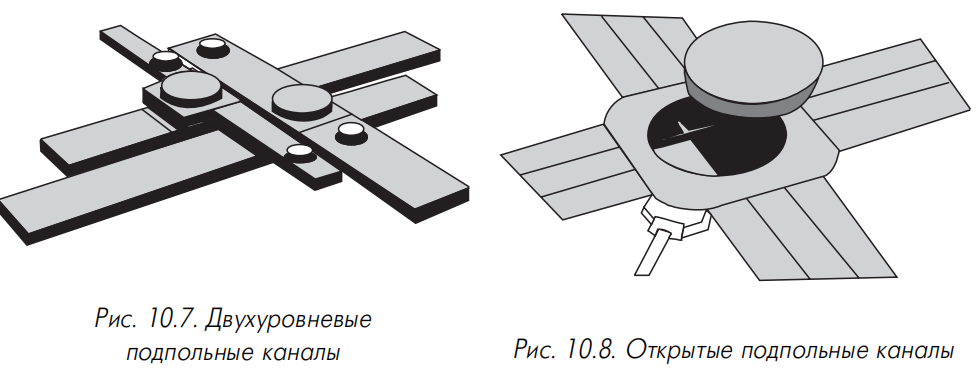

Иногда каналы разделяются на секции для кабелей различного назначения. Каждые 10 м² рабочей площади должны обслуживаться каналами с площадью поперечного сечения 650 мм². Расстояние между параллельными распределительными каналами — 1520–1825 мм; до внешней стены или несущей колонны — 450–600 мм. Расстояние между параллельными магистральными каналами — обычно 18 м. Окончания каналов в кроссовой — с удобством вывода кабелей (рис. 10.9).

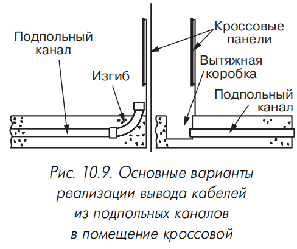

**Рис. 10.9.** Основные варианты реализации вывода кабелей из подпольных каналов в помещение кроссовой.

**Ячеистые полы** (рис. 10.10) — система непрерывных полостей в бетонных плитах. Свойства аналогичны подпольным каналам, но превосходят по ёмкости и уступают по эффективности экранирования.

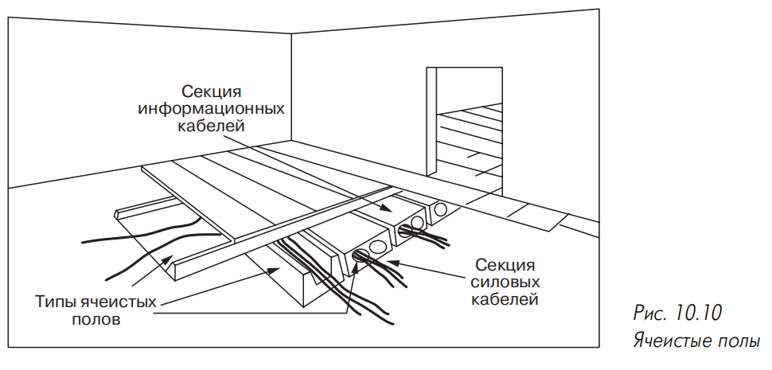

**Рис. 10.10.** Ячеистые полы.

**Фальшполы** (рис. 10.11) — квадратные плитки на металлических стойках с регулировкой высоты или на решётке каркаса. Плитки из литого металла с верхним покрытием из линолеума. Компания **Intercell** предлагает низкопрофильный фальшпол **Cable Management Flooring System**: сборка из 16 пьедесталов высотой 55 или 85 мм, объединённых нижними перемычками; изготавливается штамповкой из одного листа металла, укладывается на пол с фиксацией на клею. Плиты 500 × 500 мм толщиной 2 мм с боковыми бортиками и нижним звукопоглощающим покрытием. Дополнительные аксессуары: подпольная коробка с крышкой-плитой и лючком; огнезащитный барьер; уголки для краевых участков и дверных проёмов.

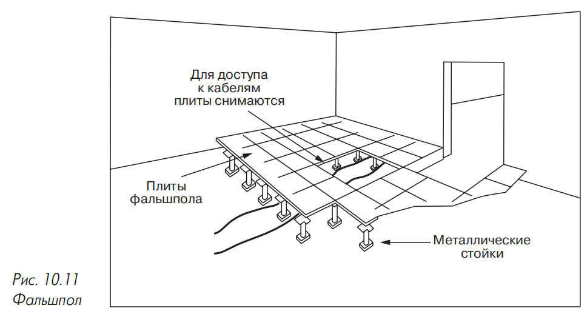

**Рис. 10.11.** Фальшпол.

Фальшполы обеспечивают быстрый доступ, не ограничивают количество кабелей и направление прокладки, механическая прочность — 1500 кг/м² и более. Недостатки: уменьшение высоты помещения, акустические эффекты, необходимость пожаробезопасных кабелей (пространство под фальшполом — plenum-полость). Часто применяются закрытые металлические лотки малого сечения с крышками; отвод к коробкам — металлорукавом (снижает требования к пожаробезопасности кабелей).

**Закладные трубы** — сеть металлических или пластмассовых труб в структуре перекрытия перед «чистой заливкой». Может делиться на магистральную и распределительную подсистемы. Низкая стоимость, но ограниченная гибкость и малая ёмкость.

Проектируется без секций с более чем двумя изгибами под прямым углом между точками вытяжки или промежуточными коробками. Длина любого канала — не свыше 30 м. Минимальный внутренний радиус изгиба — не менее 6 внутренних диаметров трубы; при диаметре более 50 мм — не менее 10; для оптических кабелей — всегда не менее 10. Иногда ввод труб в протяжную коробку под углом 45° вместо 90°. Выбор количества кабелей — по табл. 10.8.

**Таблица 10.8. Ёмкость закладных труб различного диаметра**

| Внутр. диаметр трубы, мм | 3,3 | 4,6 | 5,6 | 6,1 | 7,4 | 7,9 | 9,4 | 13,5 | 15,8 | 17,8 |
|---|---|---|---|---|---|---|---|---|---|---|
| 15,8 | 3 | 2 | 2 | 2 | 1 | 1 | 1 | 0 | 0 | 0 |
| 20,9 | 6 | 5 | 4 | 3 | 2 | 2 | 1 | 0 | 0 | 0 |
| 26,6 | 8 | 8 | 7 | 6 | 3 | 3 | 2 | 1 | 0 | 0 |
| 35,1 | 16 | 14 | 12 | 10 | 6 | 4 | 3 | 1 | 1 | 1 |
| 40,9 | 20 | 18 | 16 | 15 | 7 | 6 | 4 | 2 | 1 | 1 |
| 52,5 | 30 | 26 | 22 | 20 | 14 | 12 | 7 | 4 | 3 | 2 |
| 62,7 | 45 | 40 | 36 | 30 | 17 | 14 | 12 | 6 | 3 | 3 |
| 77,9 | 70 | 60 | 50 | 40 | 20 | 20 | 17 | 7 | 6 | 6 |
| 90,1 | – | – | – | – | – | – | 22 | 12 | 7 | 6 |
| 102,3 | – | – | – | – | – | – | 30 | 14 | 12 | 7 |

В процессе монтажа в трубах оставляются протяжки из стальной проволоки. Концы труб — без острых краёв и заусенцев. Каждая труба маркируется с обоих концов уникальным идентификатором с указанием длины.

При длине трассы более 30 м, более двух изгибов под прямым углом или необходимости разветвления — обязательна вытяжная коробка с замком или задвижкой и уплотнителем. Длина коробки для прямого протягивания — не менее 8 внутренних диаметров самой большой входящей трубы. Дополнительные требования:

- расстояние между каждым выходом трубы и противоположной стенкой коробки — не менее 6 внутренних диаметров самой большой трубы;
- расстояние между торцами труб для одного кабеля — не менее того же;
- если труба входит в днище коробки, глубина последней — не меньше суммы внутреннего диаметра самой большой трубы из днища и шести внешних диаметров самого толстого кабеля.

#### 10.2.6.2. Подпотолочные кабельные каналы

**Виды каналов:**

- перфорированные или сплошные лотки без верхней крышки;
- кабельные траверсы (два боковых продольных несущих рельса, трубчатые или проволочные несущие элементы, соединённые поперечными перекладинами);
- желоб со сплошным или перфорированным дном;
- закрытые кабельные лотки со съёмной верхней крышкой и перфорированным или сплошным дном.

Траверсы из проволочных элементов — единственные обладают высокой гибкостью, эффективны в стеснённых условиях. Все каналы могут иметь аксессуары: углы, переходники, крышки, отводы, адаптеры к трубам и т.д.

Площадь эффективного поперечного сечения — из расчёта 650 мм² на каждые 10 м² рабочей площади (при трёх розетках на рабочее место; при другой плотности — корректируется).

Крепление: боковые кронштейны (к стене) или трапециевидные, П-образные, Г-образные скобы (к потолку). Крепёжные элементы — не реже чем через 1500 мм. Контроль отсутствия острых углов и заусенцев. Запрещается разрывать каналы в проёмах между стенами; по окончании прокладки проёмы заделываются огнеупорным материалом. Силовые кабели и кабели СКС — по разным каналам с контролем разноса. Металлические элементы заземляются на телекоммуникационную шину заземления в кроссовой.

Высота свободного пространства между каналом и капитальным потолком — не менее 300 мм; доступ не должен ограничиваться другими инженерными системами.

При прокладке пучка горизонтальных кабелей допускается непосредственное крепление к стене или потолку пластиковой стяжкой и дюбель-колье или анкер-клином. Иногда используются кабельные траверсы — короткие отрезки тавровой балки на двух стальных прутьях с резьбой; отрезки располагаются полками вверх для предотвращения передавливания провода (рис. 10.12). Особенно жёстко — для UTP категории 6. Для одиночного провода — самоклеющаяся или с отверстиями площадка с проушиной под стяжку, клипсы, фиксатор-прижим Rehau (рис. 10.13).

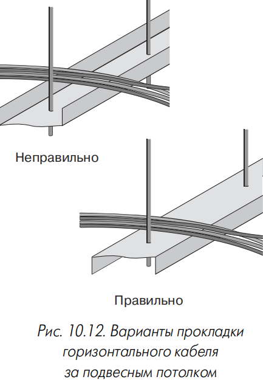

**Рис. 10.12.** Варианты прокладки горизонтального кабеля за подвесным потолком.

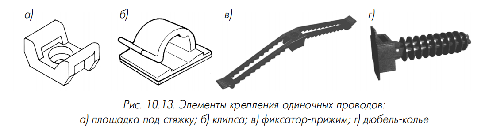

**Рис. 10.13.** Элементы крепления одиночных проводов: а) площадка под стяжку; б) клипса; в) фиксатор-прижим; г) дюбель-колье.

**Методы подвода кабелей к рабочим местам.** Условия при прокладке за подвесным потолком:

- потолки разборные, высота не более 3,4 м от пола;
- достаточно свободного места для вспомогательных конструкций и протяжки (высота между каналом и перекрытием — не менее 300 мм);
- наличие каналов и/или чистой поверхности стен или потолка;
- запрещается фиксация кабелей за элементы крепления подвесного потолка и укладка на ячейки или рельсы.

Четыре основных способа (рис. 10.14):

- **«зонный» метод** (рис. 10.15) — площадь разбивается на зоны до 72 м²; розетки монтируются с использованием вертикальных коробов или колонн, выведенных в пространство над фальшпотолком; в каждой зоне — точка перехода, до которой прокладывается многопарный кабель; от точки перехода кабель доводится до короба или колонны и далее до розетки. Достоинства: простота, гибкость. Недостаток: сложность при большом объёме оборудования других систем над потолком;
- **«связки кабелей»** (рис. 10.16) — пучок кабелей укладывается вдоль мест установки коробов или колонн с креплением к стене или потолку; при проходе мимо короба ответвляется один или несколько кабелей. Достоинства: гибкость, простота, уменьшение наводок от ламп дневного света. Недостатки: необходимость plenum-кабелей или прокладки в защитных трубах;
- **в кабельных лотках** (рис. 10.17) — пучок укладывается на лоток и крепится стяжками; при проходе розеток кабели отделяются. Достоинства: защита от механических воздействий, простота прокладки дополнительных кабелей. Недостатки: сложность реализации, повышенный вес потолочных конструкций; применяется в служебных помещениях и коридорах;
- **«через перекрытие»** (рис. 10.18) — кабель протягивается через отверстие в межэтажном перекрытии из-под подвесного потолка нижнего этажа. Применяется только в крайних случаях (уменьшение огнестойкости и механической прочности перекрытий).

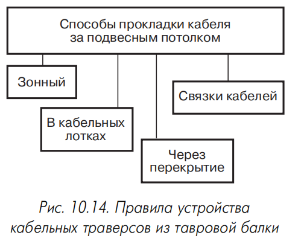

**Рис. 10.14.** Правила устройства кабельных траверсов из тавровой балки.

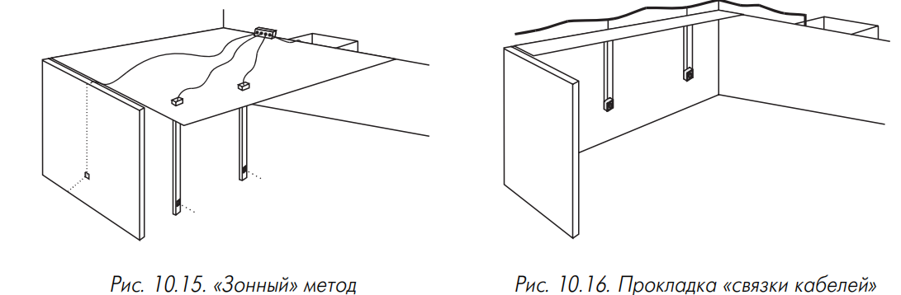

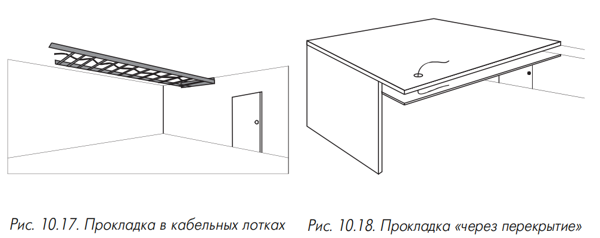

На практике часто используются комбинации способов.

#### 10.2.6.3. Прокладка кабелей в настенных каналах

Настенные каналы — для прокладки кабелей до розеток на удобной высоте; иногда для жгутов горизонтальных кабелей на участках от кроссовой до входа в помещение с розетками. Разновидности:

- накладные кабельные каналы, декоративные короба или плинтусы (раздел 5.2);
- скрытые кабельные каналы в толще стены (на поверхность выходят только розетки).

Заполнение коробов — обычно 30–60% площади поперечного сечения (зависит от минимального радиуса изгиба, способа монтажа розеток, перспектив расширения). При отсутствии априорной информации коэффициент заполнения — 0,5. Для определения требуемой ёмкости суммируют площади сечений кабелей и делят на коэффициент заполнения. Скрытые каналы — на основе гибких пластмассовых трубок; применимы все положения о закладных трубах (раздел 10.2.6).

# 10.3. Телекоммуникационная стадия проектирования

> **Телекоммуникационная стадия проектирования** — этап разработки конкретной структуры СКС, расчёта количества компонентов, выбора оборудования и подготовки спецификаций.

На этой стадии выполняется расчёт количества компонентов кабельной системы. Для облегчения проектирования целесообразно применить более мелкое, чем в ISO/IEC 11801, деление СКС и взаимодействующего с ней оборудования на подсистемы:

1. **Подсистема рабочего места.**
2. **Горизонтальная подсистема.**
3. **Магистрали кабельной системы.**
4. **Подсистема кабелей оборудования.**
5. **Административная подсистема.**

Согласно предлагаемому делению в отдельные подсистемы в классической древовидной структуре СКС (рис. 1.1) выделены как узлы, так и ветви дерева.

Проектирование подсистем выполняется последовательно; рекомендуемая очерёдность совпадает с указанным порядком. Результаты расчётов по каждой подсистеме представляются в табличной форме; данные этих таблиц используются как исходная информация для проектирования следующих подсистем. На заключительном этапе по этим документам готовятся спецификации оборудования. Формы таблиц могут быть любыми, удобными для разработчика; допускаются бумажные и электронные варианты (последние ускоряют подготовку спецификации).

## 10.3.1. Исходные данные для проектирования

### 10.3.1.1. Строительные решения

Если проектирование СКС ведётся через архитектурную фазу, работа на телекоммуникационной фазе облегчается. При старте с телекоммуникационной фазы в качестве исходных данных используются:

- линейные размеры здания или поэтажные планы помещений с указанием размеров;
- общая и/или используемая площадь помещений;
- высота этажей;
- структура этажей: система размещения помещений (коридорная, открытые или сотовые офисы); наличие архитектурно выделенных зон и их размеры; расположение лестничных маршей; наличие технических помещений;
- строительные решения: материал и толщина стен, перегородок; материал и толщина межэтажных перекрытий; наличие подвесных потолков и фальшполов; конфигурация и расположение радиаторов центрального отопления;
- расположение распределительных узлов и вертикальных стояков систем водопровода, отопления, канализации, пожаротушения, сети питания электрических устройств большой мощности, источников сильных электромагнитных полей;
- кроссовые и аппаратные: наличие и готовность технических помещений, их размеры;
- наличие и состояние кабельной канализации, эстакад, столбов и аналогичных сооружений для укладки или подвески кабелей внешней прокладки;
- наличие и параметры кабельного ввода в здание: типы и ёмкости вводимых кабелей, информация о владельце; использование устройств электрической защиты; наличие свободных каналов и их состояние;
- каналы для вертикальных участков: типы и состояние элементов прохода межэтажных перекрытий; типы и состояние элементов перехода от вертикальных к горизонтальным участкам;
- каналы для горизонтальных участков: наличие и состояние кабельных лотков за подвесным потолком; наличие и состояние закладных кабельных каналов в полу; наличие и степень заполнения декоративных коробов;
- особенности интерьера;
- электроснабжение объекта: категория надёжности, схема подвода питающих фидеров;
- заземление: наличие заземляющего контура, защитного зануления, структура системы заземления здания.

Полученные данные контролируются на соответствие архитектурным и планировочным требованиям **TIA/EIA-569** (раздел 10.2). При существенных расхождениях следует известить заказчика, подготовить предложения по внесению изменений в строительный проект и проконтролировать их выполнение.

### 10.3.1.2. Требования к кабельной системе

Для формирования требований к СКС необходима информация:

- виды сетевого оборудования, которое будет использовать СКС для информационного обмена с ЛВС, телефонной сетью, системой безопасности, системой управления технологическим оборудованием здания (лифты, вентиляция, кондиционирование), другими системами;
- требования заказчика к телекоммуникационным характеристикам;
- пропускная способность;
- ёмкость подсистемы внутренних и внешних магистралей;
- перспективы расширения;
- требования к методам прокладки и совместимости с интерьером;
- требования к совместимости оборудования, устанавливаемого в здании;
- другие требования.

### 10.3.1.3. Состав розеток на рабочих местах

> **Информационная розетка (ИР)** — розетка, подключаемая к симметричному электрическому или волоконно-оптическому кабелю.

В составе блока розеток на рабочих местах могут находиться:

- ИР на симметричном электрическом кабеле;
- ИР на волоконно-оптическом кабеле;
- силовые розетки системы гарантированного электроснабжения;
- силовые розетки системы бытового электроснабжения.

Согласно **ISO/IEC 11801** на каждом рабочем месте следует устанавливать не менее двух ИР. Минимум одна ИР должна подключаться к кабелю категории 3 или выше; остальные — к кабелю категории 5 или оптическому. Для универсальности рекомендуется применять ИР категории 5. Отклонения от рекомендаций стандартов (по количеству и категории розеток) допустимы по настоянию заказчика и фиксируются в ТЗ с указанием причины.

## 10.3.2. Проектирование подсистемы рабочего места

**Задача:** разработка, согласование и утверждение плана расположения информационных и силовых розеток, определение типа и количества оконечных шнуров, адаптеров, переходников.

Места установки розеток отмечаются на планах этажей. Основная информация заносится в **табл. 10.9**, которая заполняется также при отсутствии планов или невозможности отметить точные места; в такой ситуации она является основным документом, описывающим подсистему рабочего места.

При выборе мест расположения ИР исходят из равномерного распределения рабочих мест по площади (по **СНиП 2.09.04-87** — минимум 4 м² на рабочее место; **ISO/IEC 11801:2000** — 10 м², с оговоркой о желательности минимизации и возможности применения национальной нормативной базы). Учитывается возможность прокладки кабеля и монтажа розеток.

> **Примечание.** Расположение розеток по планам размещения мебели снижает стоимость за счёт уменьшения количества розеток, но нарушает принцип структурированности, привязывает систему к мебели и снижает гибкость. Такой подход допустим только в крайних случаях; заказчик должен быть предупреждён о негативных последствиях (проявляются через 2–3 года или раньше — при первом массовом перемещении сотрудников или установке новой мебели).

**Компромисс:** все архитектурные решения (ёмкость коробов, количество и габариты стояков) изначально рассчитываются на полную ёмкость, а количество рабочих мест на первом этапе организуется с привязкой к фактическому размещению сотрудников. Тогда доукладка нескольких линий выполняется быстро силами службы эксплуатации и не влияет на деятельность подразделений. Условие: доукладка не должна превращаться в перманентную операцию — количество розеток сразу рассчитывается по площади помещения.

**Количество оконечных шнуров** равно количеству единиц сетевого компьютерного оборудования (рабочие станции, сетевые принтеры и т.п.), подключаемого к СКС сразу после сдачи. В ЗИП закладывается до 10% (иногда больше) дополнительных шнуров. Оконечные шнуры для телефонов и факсов обычно входят в комплект поставки и не учитываются в спецификации.

**Длины оконечных шнуров** выбираются по размерам помещений. Для небольших комнат с равномерным распределением розеток достаточно шнуров одной длины 2–3 м. В больших помещениях — до 8 м. Применение более длинных шнуров противоречит стандартам (**ISO/IEC 11801** и др.), но до 10% общего количества шнуров должны иметь длину более 3 м. Для открытого офиса — см. раздел 1.4.1.

> **Примечание.** Самодельные шнуры не рекомендуются из-за худших электрических параметров и надёжности; большинство изготовителей СКС их не сертифицируют.

При подключении специального активного оборудования в спецификации рабочего места предусматриваются переходники, балуны и адаптеры для согласования и/или преобразования параметров кабельного и приборного интерфейсов.

**Таблица 10.9. Распределение рабочих мест**

Заказчик: ___________________
Объект: ____________________
Здание: _____________________

| № п/п | Этаж | № помещения | Кол-во раб. мест | Информационные розетки: Кат. 3 | Кат. 5 | Опт. | Силовые розетки: Гарант. питания | Бытовые | Метод крепления |
|---|---|---|---|---|---|---|---|---|---|
| 1 | 2 | 3 | 4 | 5 | 6 | 7 | 8 | 9 | 10 |

## 10.3.3. Проектирование горизонтальной подсистемы

Процесс наиболее сложный и ответственный: решения определяют технико-экономическую эффективность системы, так как в горизонтальной подсистеме сосредоточена основная масса оборудования по номенклатуре, количеству и стоимости. В процессе проектирования осуществляется:

- привязка рабочих мест к кроссовым;
- выбор типа телекоммуникационных розеток;
- выбор типа и категории кабеля с расчётом количества;
- проектирование точек перехода (при необходимости).

**Рис. 10.19.** Диаграмма процесса проектирования горизонтальной подсистемы.

На этом этапе выбирается тип и рассчитывается количество всех элементов тракта передачи сигнала, кроме оборудования, устанавливаемого в кроссовых и аппаратных (оно относится к административной подсистеме).

### 10.3.3.1. Привязка отдельных рабочих мест к кроссовым

Количество кроссовых и места их расположения задаются на архитектурной стадии. При одной кроссовой на этаже процесс формален — перенос суммарных данных из табл. 10.9 в табл. 10.10. При нескольких кроссовых соблюдаются условия:

- максимальная длина горизонтального кабеля — не более 90 м;
- рекомендуется минимизировать количество трасс длиной свыше 70 м;
- каждая кроссовая обслуживает примерно одинаковое число рабочих мест;
- распределение рабочих мест — по принципу минимизации средней длины каналов с кабелем.

Результаты заносятся в **табл. 10.10**.

> **Примечание.** Далее материал относится к модели обычного офиса (раздел 1.4.1); при проектировании открытого офиса положения адаптируются с учётом элементной базы.

**Таблица 10.10. Горизонтальные подключения**

Заказчик: ___________________
Объект: ____________________
Здание: _____________________

| № п/п | Кроссовая | Кол-во рабочих мест | Кол-во розеточных модулей: Кат. 3 | Кат. 5 | Опт. | Кабель кат. 3: Тип | Кол-во | Кабель кат. 5: Тип | Кол-во | Оптический кабель: Тип | Кол-во |
|---|---|---|---|---|---|---|---|---|---|---|---|
| 1 | 2 | 3 | 4 | 5 | 6 | 7 | 8 | 9 | 10 | 11 | 12 |

### 10.3.3.2. Выбор типа информационных розеток

Вид и категория ИР задаются параметрами эскизного проекта (тип среды передачи). В процессе проектирования горизонтальной подсистемы конкретизируются:

- количество розеточных модулей на рабочих местах;
- принципы их крепления.

На выбор влияют конструктивное исполнение и способ крепления в точке установки. Используются ИР с одним или двумя (реже тремя) розеточными модулями (раздел 3.3.3). Основная масса ИР — с двумя модулями (формально для телефона и компьютера). Корпуса на 4–12 модулей эффективны для выделенной группы рабочих мест (залы большой площади, открытый офис — раздел 1.4.1).

Метод крепления выбирается с учётом способа прокладки кабелей и отражается в столбце 10 табл. 10.9.

### 10.3.3.3. Расчёт горизонтального кабеля

**Выбор типа и категории**

Согласно **ISO/IEC 11801** для горизонтальной подсистемы могут использоваться симметричные электрические и оптические кабели. Категория симметричных кабелей определяется по табл. 1.6 в зависимости от максимальной частоты сигнала.

> **Примечание.** Ранее практиковалось доведение до рабочего места одного кабеля категории 5 и одного категории 3 (для компьютера и телефона). Это снижает стоимость, но нарушает принцип универсальности и ограничивает гибкость. Ведущие системные интеграторы в большинстве случаев прокладывают два кабеля категории 5 с соответствующими розеточными модулями.

При двухпортовых рабочих местах некоторая экономия достигается применением **сдвоенных кабелей** (два 4-парных элемента за один цикл протяжки). Массовое внедрение сдерживается неудобством протяжки из-за несимметричной формы и отсутствием сдвоенных конструкций у многих производителей.

Многопарные кабели прокладываются непосредственно до рабочих мест только при использовании 6- и 12-постовых розеточных модулей. В остальных случаях проектируются **точки перехода**. Использование многопарных кабелей на розетках меньшей ёмкости недопустимо: стандарты требуют подключения всех пар к розеточным модулям (проводники не должны «висеть» в воздухе). Распределение витых пар многопарного кабеля по нескольким модулям без точки перехода невозможно: витая пара без оболочки не может находиться вне корпуса информационной розетки. Запрет снимается при применении многоэлементных кабелей (присутствуют в штатных компонентах очень небольшого количества СКС).

> **Запрещено:** запараллеливание пар электрических кабелей и применение муфт для их сращивания. Для сетевого оборудования, подключаемого по принципу «многоточки» и требующего нагрузочных резисторов, применяются соответствующие адаптеры (раздел 3.4.2.4).

**Расчёт количества**

Каждый модуль ИР связывается с коммутационным оборудованием в кроссовой этажа одним кабелем. Длина по **ISO/IEC 11801** — не более 90 м. Кабели прокладываются по каналам без бухт и петель; учитываются спуски, подъёмы и повороты.

**Два метода вычисления количества кабеля:**

**1. Метод суммирования.** Подсчёт длины трассы каждого кабеля с последующим сложением. Добавляется технологический запас не более 10% и запас на разделку в розетках и на кроссовых панелях. Достоинство — высокая точность. Недостаток — чрезмерная трудоёмкость при большом количестве портов без средств автоматизации; практически исключает расчёт нескольких вариантов. Рекомендуется при наличии специализированных программ автоматического проектирования (например, **CADDY**).

**2. Эмпирический метод.** Реализует положение центральной предельной теоремы теории вероятностей; даёт хорошие результаты для систем с числом рабочих мест свыше 30. Ограничение — предположение о равномерном распределении рабочих мест по площади. При нарушении условия рабочие места объединяются в группы с равномерным распределением; для каждой группы расчёт отдельный. При дроблении групп вплоть до одиночного кабеля метод переходит в метод суммирования.

Средняя длина кабельных трасс:

$$L_{av} = \frac{L_{min} + L_{max}}{2} \cdot K_s + X$$

где:
- $L_{min}$, $L_{max}$ — длины трассы от точки ввода кабельных каналов в кроссовую до розеточного модуля соответственно самого близкого и самого далёкого рабочего места (с учётом спусков, подъёмов, поворотов, сквозных межэтажных проёмов);
- $K_s$ — коэффициент технологического запаса, 1,1 (10%);
- $X = X_1 + X_2$ — запас на разделку кабеля; $X_1 = 30$ см со стороны рабочего места; $X_2$ — запас со стороны кроссовой (расстояние от точки входа горизонтальных кабелей в кроссовую до самого дальнего коммутационного элемента с учётом спусков, подъёмов и поворотов).

Количество кабельных трасс, на которые хватает одной катушки:

$$N_{cr} = \frac{L_{cb}}{L_{av}}$$

где $L_{cb}$ — длина кабельной катушки (стандартные значения 305 м, 500 м, 1000 м); результат округляется вниз до ближайшего целого.

Общее количество кабеля:

$$L_c = \frac{L_{cb}}{N_{cr}} \cdot N_{to}$$

где $N_{to}$ — количество розеточных модулей информационных розеток СКС.

Алгоритм может быть использован в Excel. Формула для 305-метровых (1000-футовых) упаковок:

$$=ОКРУГЛВВЕРХ\left(\frac{N_{to}}{ОКРУГЛВНИЗ\left(\frac{L_{cb}}{L_{av} \cdot 1{,}1 + X}; 0\right)}; 0\right) \cdot 305 \tag{10.1}$$

где $N_{to}$, $L_{cb}$, $L_{av}$, $X$ — числовые значения или ссылки на ячейки. Округление в разных направлениях уменьшает вероятность ошибки расчёта.

При разводке на кабелях различных категорий расчёт ведётся по каждой отдельно. При однотипных ИР с разными типами модулей количество кабеля разных категорий одинаково — расчёт выполняется один раз.

### 10.3.3.4. Проектирование точек перехода

> **Точка перехода** — место горизонтальной подсистемы, в котором происходит изменение типа используемого кабеля без изменения характеристик качества передачи.

Согласно **ISO/IEC 11801** в точке перехода плоский кабель соединяется с обычным круглым или выполняется ветвление многопарного кабеля на несколько четырёхпарных (более частый на практике в России вариант). В крайних случаях точка перехода используется для сращивания двух одинаковых кабелей (наращивание длины или восстановление связи при аварии). Такое решение не сертифицируется производителем СКС; при первой возможности провод заменяется непрерывным кабелем.

В точке перехода устанавливается коммутационное оборудование, но она не предназначена для администрирования и подключения активных сетевых устройств. Наиболее удобны панели типа 110 (предпочтительны панели с запараллеленными контактами розеток, раздел 3.3.2.1). При использовании других типов панелей провода со стороны КЭ разводятся на неразъёмных сторонах контактов, а для разводки кабелей к ИР используются разъёмные стороны с обязательной дополнительной механической фиксацией. Ёмкость коммутационного оборудования для точки перехода рассчитывается только по количеству пар в кабеле от КЭ.

Общие сведения о горизонтальной подсистеме сводятся в **табл. 10.10**.

## 10.3.4. Магистральные подсистемы СКС

**Задачи:**

- выбор типа и категории кабелей;
- расчёт ёмкости и количества магистрального кабеля.

### 10.3.4.1. Выбор типа и категории магистральных кабелей

Согласно **ISO/IEC 11801** магистральные подсистемы могут строиться на симметричных электрических и/или волоконно-оптических кабелях. Категория симметричного кабеля — по табл. 1.6 в зависимости от максимальной частоты сигнала. Вид оптического кабеля (одномодовый или многомодовый) — по типу сетевого оборудования и длине магистрали (табл. 1.10).

**Сетевое оборудование ЛВС со скоростью не выше 100 Мбит/с** допускает многомодовый кабель на линиях до 2000 м (на практике это значение может быть сильно превышено — некоторые виды оборудования имеют паспортную дальность 5–10 км). Однако при сложившихся ценах экономически целесообразным и технически более перспективным является применение **одномодовой техники при трассах свыше 1500 м** [137].

**ЛВС Gigabit Ethernet** (802.3z): максимальная длина многомодового кабеля — не более 550 м. Вывод: оптическая подсистема внутренних магистралей должна строиться преимущественно на многомодовом кабеле, внешних магистралей длиной свыше 500 м — преимущественно на одномодовом. При передаче по оптическому кабелю сигналов других приложений (например, УАТС) возможно применение комбинированных конструкций с одномодовыми и многомодовыми волокнами.

**При выборе симметричного многопарного кабеля** дополнительно контролируется совместимость сигналов приложений. При несовместимости:

- при 25-парных кабелях — сигналы передаются по разным кабелям;
- при кабеле большой ёмкости — сердечник 50-парного кабеля (и большей ёмкости) собирается из отдельных 25-парных связок, каждая из которых имеет характеристики 25-парного кабеля той же категории; сигналы несовместимых приложений передаются по разным связкам одного кабеля.

Допускается использование двух внутренних магистралей различной категории (например, 3 и 5) — обычно для телефонных систем, не требующих высококачественных кабелей на большие расстояния. Магистрали разных категорий могут начинаться в одной или разных кроссовых здания. При выборе варианта учитываются:

- перспективы использования магистральных кабелей для более требовательного оборудования;
- выделение отдельных кабелей для разного оборудования снижает гибкость системы.

### 10.3.4.2. Расчёт ёмкости и количества магистральных кабелей

Расчёт начинается с составления перечня кабелей внутренней магистрали на основе эскизного проекта; в проектной документации поясняется предполагаемое назначение каждого кабеля.

Ёмкость рассчитывается с учётом конфигурации рабочего места и типа среды передачи. Ориентировочные значения:

- **Низкая степень интеграции** (один модуль в ИР, один горизонтальный кабель на рабочее место): минимум **2 пары** на рабочее место в кабелях внутренней магистрали.
- **Средняя степень интеграции** (два и более розеточных модуля на ИР, типовое решение на середину 1999 года): минимум **3 пары** на рабочее место.
- **Высокая степень интеграции** (два и более модуля, возможно использование оптики для внутренней и внешней магистралей и горизонтальной подсистемы): минимум **3 пары и 0,2 волокна** на рабочее место в кабелях внутренней магистрали и минимум **2 пары и 0,2 волокна** на рабочее место в кабелях внешней магистрали.

**Обоснование выбора значений:**

- современные системы телефонной связи используют одну или две витые пары; строятся по централизованной схеме без выносов и подстанций; поэтому при низкой степени интеграции — минимум 2 пары на рабочее место;
- при построении ЛВС в кроссовых этажей устанавливается активное оборудование (повторители, коммутаторы, мультиплексоры), имеющее 1–2 порта для подключения к центральному оборудованию и 4–24 порта для рабочих станций. На **рис. 10.20** приведена зависимость объёма поставок концентраторов ЛВС фирмы **Allied Telesyn** от количества портов (по данным компании АйТи). Выборка 2207 устройств репрезентативна: среднее количество портов на один концентратор — **10,96**. Практика показывает примерно равную вероятность подключения up-link-порта как к локальному серверу/коммутатору, так и к кабелю магистральной подсистемы. С 10% запасом среднее количество портов для обслуживания рабочих мест — **10**, то есть работа 10 рабочих мест обеспечивается одним трактом внутренних магистралей. Один тракт — четыре пары электрического магистрального кабеля; следовательно, к двум парам добавляется ещё одна на рабочее место.

Для внутренней магистрали со средней и высокой степенью интеграции также добавляется одна пара (4 пары / 10 рабочих мест = 0,4 пары на рабочее место ≈ 1 пара на рабочее место). Аналогично — **0,2 волокна** на рабочее место для оптических кабелей (2 волокна / 10 рабочих мест), так как тракт передачи данных по оптике образуется двумя волокнами.

> **Примечание.** Указанные значения — нижняя допустимая граница. По согласованию с заказчиком суммарное значение может быть увеличено. Необходимость увеличения следует из анализа рис. 10.20 (высокая популярность 8-портовых концентраторов). Дополнительные витые пары и световоды улучшают гибкость, позволяют ввести резервирование и создают предпосылки для расширения.

**Определение количества магистральных кабелей:** для каждого кроссового этажа минимальное количество пар/волокон на рабочее место умножается на количество рабочих мест (графа 3 табл. 10.10), обслуживаемых этой кроссовой. Значение округляется вверх до ближайшего количества пар/волокон, получаемого при использовании одного или нескольких кабелей стандартной ёмкости (25, 50, 100, 200 и т.д. пар; 4, 6, 8, 12, 24, 48 и т.д. волокон). Значение в парах/волокнах и число кабелей заносятся в **табл. 10.11**. При распределённых магистралях расчёт ведётся по тем же принципам.

Если основа внутренней магистрали — оптические кабели, рекомендуется предусмотреть дублирование каждой трассы одним или несколькими 25-парными кабелями категории 5 (готовность к оборудованию на симметричных кабелях и резервирование на случай выхода из строя оптики или оборудования с оптическими интерфейсами).

Длина кабелей определяется с учётом всех спусков, поворотов, топологических особенностей трассы и запасов на разделку. Результаты заносятся в **табл. 10.11**.

**Рис. 10.20.** Зависимость объёма поставок концентраторов ЛВС от количества портов.

**Таблица 10.11. Таблица магистральных соединений**

Заказчик: ___________________
Объект: ____________________
Здание: _____________________

| № п/п | Маркировка | Начало | Конец | Тип кабеля | Кол-во пар/волокон | Кол-во кабелей | Длина кабелей, м | Назначение |
|---|---|---|---|---|---|---|---|---|
| 1 | 2 | 3 | 4 | 5 | 6 | 7 | 8 | 9 |

### 10.3.4.3. Особенности проектирования подсистемы внешних магистралей

Правила в основном совпадают с правилами для внутренних магистралей. Особенности:

- часто используются кабельные трассы в канализации ГТС и коллекторах городских служб; возникает проблема согласований и технических условий на прокладку только кабелей из перечня разрешённых (не все кабели СКС имеют сертификат Госкомсвязи России), а также договоров на аренду;
- из-за малой ёмкости кабельных трасс расчёт выполняется каждый раз индивидуально; универсальных рекомендаций нет;
- если кабели соединяют несколько зданий и частично прокладываются по одному пути, имеет смысл рассмотреть применение на трассе **разветвительной муфты**; при ценах на середину 1999 года это экономически предпочтительно при длине общего участка свыше 300–400 м (экономия на работах по прокладке и стоимости кабеля);
- большая стоимость и продолжительность работ заставляет вводить повышенные запасы ёмкости (для оптических кабелей — по меньшей мере двойной запас световодов);
- из-за сложностей быстрого восстановления целостности кабеля при авариях рекомендуется широко применять **принцип резервирования** (раздел 10.3.4).

### 10.3.4.4. Резервирование магистральных кабелей

> **Резервирование магистральных кабелей** — принцип увеличения живучести сети за счёт увеличения ёмкости кабелей и/или прокладки по пространственно разнесённым трассам.

Наиболее целесообразно для волоконно-оптических кабелей, которые:

- не накладывают жёстких ограничений на количество промежуточных разъёмных и неразъёмных соединителей;
- имеют примерно постоянные массогабаритные показатели независимо от числа световодов в широком диапазоне ёмкости.

Простейший случай (применим к оптическим и электрическим решениям) — двух-, трёх- и более кратное увеличение ёмкости кабеля. Более эффективно — применение нескольких пространственно разнесённых трасс (например, двух различных стояков здания), гарантирующих сохранение связи при физическом повреждении одной трассы. На **рис. 10.21** — часто встречающийся случай подключения трёх кроссовых К1–К3 к аппаратной А при отсутствии прямой связи с одной из них. Для резервных связей применяются транзитные соединения волокон (коммутационными шнурами или прямым сращиванием световодов сваркой или механическими сплайсами; последний вариант предпочтительнее по стоимости и вносимым потерям).

> **Рекомендация.** Резервирование кабельных трасс настоятельно рекомендуется при прокладке в кабельной канализации ГТС. Разовые затраты на резервную линию и повышенная (но умеренная) арендная плата быстро окупаются при первой серьёзной аварии на трассе основного кабеля (продолжительное восстановление канализации, сложность организации ремонтных работ, необходимость разрешений и согласований).

**Рис. 10.21.** Подключение трёх кроссовых к аппаратной с резервированием кабельных трасс.

## 10.3.5. Подсистема кабелей оборудования

> **Кабели оборудования** — оконечные и монтажные шнуры и кабели, с помощью которых к СКС подключается активное сетевое оборудование, установленное в кроссовых и аппаратных.

На этом этапе не выполняется расчёт коммутационных шнуров для соединения отдельных каналов на кроссовом поле. Выполняется выбор:

- метода подключения сетевого оборудования к кабельной системе;
- типа и категории кабелей оборудования.

Также производится расчёт количества этих элементов.

### 10.3.5.1. Выбор метода подключения сетевого оборудования к кабельной системе

Активное сетевое оборудование (коммутаторы и повторители ЛВС и т.д.) подключается в любой кроссовой СКС. В кроссовой верхнего уровня (КВМ и КЗ) подключается центральное сетевое оборудование (центральный коммутатор, УАТС, контроллеры системы сигнализации и т.п.). КЭ обслуживают активное сетевое оборудование (обычные и коммутирующие концентраторы рабочих групп, выносные блоки телефонных станций и т.д.), работающее на ограниченную группу пользователей.

Подсистема кабелей оборудования, как и подсистема кабелей рабочего места, не входит в область действия **ISO/IEC 11801** (на конструкцию компонентов влияют конкретные приложения). Проектирование ведётся с учётом рекомендаций производителей активного оборудования и стандартов на приложения. Тем не менее **ISO/IEC 11801** содержит ограничения по длине и пропускной способности: общая

# 10.4. Пример проектирования СКС

Рассмотрим пример использования изложенного выше материала для проектирования кабельной системы в некотором гипотетическом проекте.

## 10.4.1. Исходные данные

СКС устанавливается в четырёхэтажном здании (рис. 10.28) с размерами в плане 50 × 15 м. Высота этажа в свету между перекрытиями — 3,5 м, общая толщина перекрытий — 50 см. На всех этажах использована однотипная коридорная планировка рабочих помещений размером 6 × 3 м. Коридор шириной 3 м проходит по всей длине продольной оси здания (рис. 10.29).

**Рис. 10.27.** Распределение числа коммутационных шнуров по их длине.

**Рис. 10.28.** Габаритные размеры здания.

**Рис. 10.29.** Типовой этаж здания.

В коридорах имеется подвесной потолок с высотой свободного пространства 35 см; в помещениях подвесного потолка нет. Стены — из обычного кирпича, покрыты штукатуркой толщиной 1 см. Дополнительных каналов в полу и стенах строительным проектом не предусмотрено. Перечень технических помещений приведён в табл. 10.19.

**Таблица 10.19. Кроссовые и аппаратные**

| Номер помещения | Назначение | Площадь фактическая | Площадь по норме |
|---|---|---|---|
| 111 | Аппаратная | 36,60 | 11,3 (14) |
| 211 | Кроссовая | 9,10 | 8,4 |
| 311 | Кроссовая | 9,10 | 8,4 |
| 411 | Кроссовая | 9,10 | 8,4 |

Создаваемая СКС должна обеспечивать функционирование оборудования ЛВС и телефонной сети здания: на каждом рабочем месте монтируется информационная розетка с двумя розеточными модулями. Дополнительно предусматривается соединение учрежденческой АТС с входным 100-парным кроссом городской телефонной сети.

Помимо информационных розеток, на рабочем месте монтируются две силовые розетки сети гарантированного электроснабжения и одна силовая розетка сети бытового электроснабжения. Прокладку силовых кабелей и установку силового распределительного оборудования осуществляет смежная субподрядная организация.

По требованиям заказчика блоки розеток устанавливаются на высоте 1 м над уровнем пола. Кабельная разводка в рабочих помещениях выполняется в декоративных коробах.

## 10.4.2. Архитектурная фаза проектирования

На каждом этаже — по 30 рабочих помещений площадью 18 м² каждое, общая рабочая площадь этажа — 540 м². По **СНиП 2.09.04-87** (раздел 3.2) для обслуживания этой площади необходимо 135 блоков розеток, всего в здании — 540 блоков. Расчёт по площади отдельного помещения даёт другое значение: в каждом помещении монтируется по четыре розеточных блока, то есть 120 розеток на этаже. Разница возникает из-за того, что площадь отдельного помещения составляет не 16, а 18 м². Обычно в проект закладывают большую цифру, получаемую расчётом из общей площади этажа. Дополнительные розетки устанавливаются в коридорах, технических помещениях и некоторых рабочих помещениях (для принтеров, факсов, телефонов постов охраны, серверов и т.д.).

Неиспользованные розетки остаются в ЗИП для ремонта и расширения. При особой требовательности заказчика к дешевизне СКС в договор закладывается положение о выкупе системным интегратором неиспользованных розеток по номинальной стоимости после завершения строительства.

Для прокладки кабелей горизонтальной подсистемы на этажах вдоль коридора за подвесным потолком устанавливаются лотки. Расстояние от верхней кромки лотка до капитального потолка — 25 см. Кроссовая располагается в центре этажа, поэтому на каждую половину лотка укладываются кабели, обслуживающие 270 м² рабочей площади.

Площадь поперечного сечения лотка (раздел 10.2.6.2) с учётом двух розеток на рабочем месте:

$$650 \cdot \frac{270}{10} \cdot \frac{2}{3} = 11700 \text{ мм}^2$$

Такой площадью обладает стандартный кабельный лоток размером 200 × 60 мм. По мере удаления от кроссовой могут использоваться лотки меньшего сечения.

В рабочих помещениях прокладка кабеля выполняется в декоративных коробах. Для перехода от лотков к коробам в стенках коридора сверлятся отверстия с закладными трубами. По табл. 10.8 внутренний диаметр трубы — около 26 мм. В каждой комнате устанавливается по четыре блока розеток — по два с каждой стороны. Ёмкость декоративного короба выбирается из расчёта прокладки четырёх горизонтальных информационных и двух силовых кабелей (один для гарантированного электропитания, другой — для бытового).

Расчётный диаметр горизонтального кабеля — 5,5 мм (табл. 3.5), то есть на 10% выше номинального внешнего диаметра (учёт неровностей укладки). Общая площадь поперечного сечения четырёх информационных кабелей — примерно 100 мм². При 50% заполнении секции короба площадь её поперечного сечения должна составлять 200 мм². Кроме того, предусматривается минимум одна отдельная секция для силовых кабелей.

Используем 3-секционный короб типа **L/30026** компании **Legrand** размером 60 × 16 мм: площадь центральной секции — 200 мм², боковые секции достаточны для силовых кабелей. В качестве крепёжного элемента коробов и розеточных модулей (табл. 11.3) может применяться нейлоновый дюбель или джет-плаг.

Помещения кроссовых и аппаратной располагаются непосредственно друг над другом (рис. 10.29, табл. 10.19). В качестве вертикальных стояков для магистральных кабелей можно использовать слоты или рукава с крепёжной арматурой. Площадь межэтажного проёма выбирается с учётом раздела 10.2.5 и нахождения аппаратной в помещении 111 (первый этаж). Проём с первого на второй этаж обслуживает три этажа; проём со второго на третий — два этажа. Результаты расчётов сведены в табл. 10.20. Слот в перекрытии между первым и вторым этажами имеет габариты 300 × 50 мм; остальные слоты — такие же или меньшие.

**Таблица 10.20. Площади проёмов и слотов в межэтажных перекрытиях**

| Номер проёма | Обслуживаемые этажи | Площадь, м² | Площадь проёма, мм² | Размеры, мм* |
|---|---|---|---|---|
| 1 | 2–4 | 1620 | 5200 | 300×50 |
| 2 | 3, 4 | 1080 | 3500 | 200×50 |
| 3 | 4 | 540 | 1730 | 100×50 |

* Результаты расчётов размеров проёмов даны с учётом рекомендуемого трёхкратного запаса по площади.

Площади технических помещений соответствуют типовым нормам (табл. 10.19). Дополнительно контролируется возможность обеспечения условий окружающей среды (разделы 10.2.2 и 10.2.3). При необходимости выдаются частные технические задания смежным субподрядчикам на доработку помещений.

УАТС, серверы и центральное оборудование ЛВС размещаются в аппаратной — используется принцип многоточечного администрирования (раздел 1.2.5).

## 10.4.3. Телекоммуникационная стадия проектирования

Информация о количестве информационных и силовых розеток в каждом помещении заносится в **табл. 10.9**. На каждом рабочем месте — по одной информационной розетке с двумя розеточными модулями (порты СКС) и по три силовые розетки, объединяемые в блок.

Тип розеточных модулей определяется требованиями по пропускной способности, конфигурацией рабочего места и способом крепления. В данном случае удобно использовать двухпортовые розеточные модули. Их общее количество, как и число силовых розеток, находится суммированием значений в колонках 5–9 (**табл. 10.21**). Дополнительно в спецификацию вводятся элементы крепления силовых и информационных розеток в декоративном коробе или рядом с ним.

### 10.4.3.1. Проектирование горизонтальной подсистемы

На каждом рабочем месте — по два информационных розеточных модуля категории 5. Количество розеток определено на архитектурной фазе; применение двух модулей категории 5 определяется соображениями универсальности.

В здании отсутствуют большие залы и компактные обособленные группы пользователей. Поэтому не применяется прокладка кабелей под ковром и нецелесообразна реализация отдельных участков на многопарном кабеле. Следовательно, **точки перехода не требуются**.

Горизонтальная подсистема строится на неэкранированных 4-парных кабелях категории 5, проложенных по два к каждому блоку розеток. Количество кабеля рассчитывается эмпирическим методом (на каждом этаже свыше 30 розеток, выполнено требование равномерного распределения).

Подъём от выводного отверстия монтажного шкафа до кабельных лотков в коридорах и спуск до декоративного короба в комнатах:

$$3{,}25 + 2{,}25 = 5{,}5 \text{ м}$$

Длина трассы кабеля от кроссовой до ближайшего и наиболее удалённого блока розеток — 5 м и 35 м соответственно. Минимальная и максимальная длины кабелей:

$$L_{min} = 5{,}5 + 5 = 10{,}5 \text{ м}; \quad L_{max} = 5{,}5 + 35 = 40{,}5 \text{ м}$$

Средняя длина кабельных трасс:

$$L_{av} = \frac{10{,}5 + 40{,}5}{2} \cdot 1{,}1 + 3 = 31 \text{ м}$$

Одной катушки (305 м) достаточно для 9 средних трасс (305 / 31 = 9). Для горизонтальной подсистемы необходимо:

$$\frac{540 \cdot 2}{9} = 120 \text{ катушек} = 120 \cdot 305 = 36600 \text{ м}$$

### 10.4.3.2. Проектирование подсистемы внутренних магистралей

Кабели внутренних магистралей связывают кроссовые и аппаратную. По ним передаются информационные потоки ЛВС и телефонные сигналы УАТС. При двухпортовых розетках и отсутствии этажных выносов УАТС следует ожидать передачи по магистральным кабелям сигналов значительного числа телефонных разговоров. Согласно принципу многоточечного администрирования принимается следующая идеология:

- часть подсистемы для телефонной сети — на многопарном электрическом кабеле категории 3;
- часть для ЛВС — на волоконно-оптическом кабеле со 100% дублированием электрическим кабелем категории 5.

**Расчёт ёмкости.** СКС имеет высокую степень интеграции: две информационные розетки с соответствующим количеством горизонтальных кабелей на рабочее место. На каждое рабочее место во внутренней магистрали:

- 2 пары категории 3;
- 0,4 пары категории 5;
- 0,2 волокна.

На каждый этаж (135 рабочих мест):

- 270 пар категории 3;
- 54 пары категории 5;
- 27 оптических волокон.

При высоте этажей 4 м и запасе на разделку 3 м с каждого конца (вертикальный стояк проходит через кроссовые) длины трасс заносятся в **табл. 10.22**.

Суммируя значения с технологическим запасом 10%, получаем:

- **95 м** 25-парного кабеля категории 5;
- **143 м** 100-парного кабеля категории 3;
- **95 м** 16-волоконного оптического кабеля.

Не все производители выпускают оптические кабели внутренней прокладки на 16 волокон. Применим вдвое большее количество 8-волоконного кабеля в конструктивном исполнении по нормам пожарной безопасности не ниже **Riser** для прокладки в вертикальных стояках.

### 10.4.3.3. Проектирование административной подсистемы

Количество модулей информационных розеток для телефонной системы совпадает с количеством модулей для ЛВС. Поэтому в качестве коммутационного оборудования применим **панели типа 110**.

Из-за большого количества обслуживаемых кабелей в аппаратной используется смешанный способ размещения оборудования — на стене и в шкафу. В кроссовой всё оборудование размещается в шкафу. Другой возможный вариант (не применяется в данном проекте) — открытая 19-дюймовая стойка.

Во всех технических помещениях для подключения сетевого оборудования используется **метод коммутационного соединения**. Результаты расчётов сведены в **табл. 10.22**.

Расчёт количества функциональных элементов коммутационного оборудования выполняется в предположении, что к одному 100-парному кроссовому блоку типа 110 подключается 24 горизонтальных кабеля или 4 многопарных кабеля.

Оптические кабели внутренней магистральной подсистемы разводятся в 19-дюймовых полках с 16 розетками SC высотой 1U. Для монтажа вилок оптических разъемов используется технология сварки; укладка защитных гильз и технологического запаса длины волокна — в общий организатор типа сплайс-пластины.

Площадь кроссовых превышает рекомендуемую, поэтому оборудование размещается в закрытых монтажных шкафах. Из-за большого количества рабочих мест используются шкафы максимальной высоты (42U или 45U). Запас на разделку кабеля — 3 м, поэтому шкафы устанавливаются рядом со стояками. В **табл. 10.23** показан вариант размещения коммутационного оборудования в монтажном шкафу. Собранные 19-дюймовые 200-парные кроссовые панели типа 110 содержат штатные горизонтальные организаторы кроссовых шнуров. Дополнительно предусматриваются 19-дюймовые горизонтальные организаторы высотой 1U для оптических полок. Сетевое оборудование ЛВС размещается ниже организаторов оптических полок. При ёмкости одного концентратора 12 портов оно занимает 12U; всего в шкафу занято 40U из 42.

В аппаратной на стене монтируется коммутационное оборудование всех функциональных секций, за исключением магистральных «белой» категории 5 и «белой» оптической (магистральные кабели «белой» секции используются сетевым оборудованием для связи между собой без подключения рабочих мест). Для электрической части этой секции понадобятся кроссовые башни с общим количеством кроссовых блоков не менее 40 (табл. 10.22). С запасом около 10% — 5 колонн кроссовых башен, каждая из 400-парной и 500-парной башни. Для «белой» секции категории 5 в монтажном шкафу — 200-парная кроссовая панель типа 110. Для оптической части «белой» секции — полки с 16 розетками SC высотой 1U (шесть полок, табл. 10.22). Под каждой полкой — организатор коммутационных шнуров. **Табл. 10.24** показывает пример размещения кроссового оборудования в аппаратной.

### 10.4.3.4. Расчёт количества и определение длин оконечных и коммутационных шнуров

**Оконечные шнуры на рабочих местах.** Для подключения персональных компьютеров к телекоммуникационным розеткам применяются оконечные шнуры с вилками модульных разъемов. Всего для подключения рабочих станций к ЛВС предполагается использовать 540 розеточных модулей. На первом этапе к ЛВС будет подключена 1/3 рабочих мест — 180 шнуров плюс 10% в запас. Используем шнуры длиной 2,1 м; около 10% шнуров для эксплуатационной гибкости — длиной 5 м. Итого: 200 шнуров длиной 2,1 м и 20 шнуров длиной 4,57 м.

Оконечные шнуры для телефонных аппаратов обычно поставляются в комплекте с аппаратами и в спецификацию не включаются.

**Кроссовые.** Предусматриваются следующие виды коммутационных шнуров:

- однопарные шнуры с вилками типа 110 для подключения этажных розеток к УАТС (соединение горизонтальных кабелей с многопарным вертикальным) — всего 135 шнуров на этаж;
- 4-парные комбинированные шнуры для подключения горизонтального кабеля к портам этажных концентраторов ЛВС — 135 шнуров на этаж;
- оптические шнуры для подключения оптических up-link-портов этажных концентраторов к вертикальной магистрали — 12 шнуров на этаж;
- резервные комбинированные 4-парные шнуры для подключения электрических up-link-портов этажных концентраторов к вертикальному кабелю категории 5 — 12 шнуров на этаж.

**Табл. 10.18** содержит информацию о коммутационных шнурах для аппаратной и кроссовых. Для определения минимальной и максимальной длины используется схема размещения коммутационного оборудования (пример — табл. 10.24). Распределение длин — по **рис. 10.27**.

**Аппаратная.** Требуются оконечные шнуры для подключения УАТС и рабочих мест первого этажа к сетевому оборудованию ЛВС.

Для подключения УАТС используются монтажные шнуры в виде 25-парных кабелей с разъемами TELCO на одном конце. Длина зависит от расстояния между УАТС и кроссовым полем; могут быть заказаны шнуры до 30 м. Примем длину 7 м. Каждый кабель предназначен для подключения одной 16-портовой платы внутренних номеров УАТС или одной 8-портовой платы внешних номеров. Для 540 рабочих мест и 96 городских номеров потребуется **46 кабелей**.

Для подключения рабочих мест первого этажа к ЛВС — монтажные шнуры с вилками модульных разъемов. Максимальная длина монтажного шнура — 10 м. Некоторые производители не выпускают монтажные шнуры; в такой ситуации заказывают обычные оконечные шнуры с вилками модульных разъемов на обоих концах и разрезают их пополам или обрезают одну вилку (из-за небольшой стоимости вилки второй вариант практически не проигрывает по стоимости и вполне применим на практике). При наличии на первом этаже 68 рабочих станций (135 / 2 = 68) предусмотрим **70 стандартных шнуров длиной 7,6 м**.

Подключение концентраторов ЛВС в аппаратной к центральному коммутатору — через электрические порты из-за малого расстояния. Предполагается не более 10 обычных или коммутирующих концентраторов нижнего уровня (типовая ёмкость 12–16 портов). Для их подключения — **10 оконечных шнуров** с вилками электрических модульных разъемов длиной по 1,5 м.

Для подключения оптических портов центрального коммутатора к вертикальной магистрали — оптические шнуры, количество равно общему числу оптических up-link-портов сетевого оборудования ЛВС в кроссовых: **36** (по 12 на этаж).

Все коммутационные панели и активное сетевое оборудование в кроссовых монтируется в 19-дюймовых шкафах высотой 42U. Глубина шкафа выбирается в зависимости от глубины корпусов активных сетевых устройств. Для улучшения охлаждения — вентиляционная полка. По табл. 10.23 в шкафу монтируется 32 устройства, каждое крепится в четырёх точках. Для крепления — по три упаковки болтов М6 и квадратных гаек на шкаф. Для оборудования без элементов крепления в 19-дюймовом конструктиве — по одной полке на шкаф. Питание сетевых устройств — от двух вертикальных распределителей.

Полный окончательный вариант выдержки из спецификации по колонкам 2, 6 и 7 представлен в **табл. 10.27**. Заполнение остальных колонок зависит от конкретного производителя СКС. В спецификации предусмотрено также технологическое оборудование: однопроводные и 5-парные ударные инструменты — для подключения кабелей к розеточным модулям и коммутационным панелям; приборы **Pentascanner** и **Certifiber** — для тестирования кабельных линий. Ударные инструменты и тестирующее оборудование после завершения монтажа передаются заказчику и используются в процессе эксплуатации для проверок, мелкого ремонта, доукладки кабельных линий и т.д. В процессе монтажа они выполняют функции наглядных пособий и используются для обучения персонала заказчика (если предусмотрено договором).

Дополнительно в спецификацию введены нейлоновые стяжки различной длины (расходные материалы) для формирования пучков кабелей и привязки к кабельным лоткам. Маркировка кабелей, шнуров и розеток выполняется клейкими маркерами. На каждый кабель — по четыре маркера (2 для технологической и 2 для финишной маркировки), на шнур — два. Розетки маркируются один раз. Подробнее — в разделе 13.1.4.

Общая структурная схема спроектированной сети изображена на **рис. 10.30**. Для облегчения восприятия не показана часть коммутационных шнуров.

**Рис. 10.30.** Упрощённая структурная схема проектируемой сети.

## 10.5. Выводы

Процедура проектирования СКС — сложный многоступенчатый процесс, состоящий из двух основных стадий: **архитектурной** и **телекоммуникационной**.

Главная задача первой стадии — подготовка технических помещений и кабельных трасс горизонтальной и магистральной подсистем к работам по монтажу СКС. Требования стандартов к помещениям кроссовых и аппаратной позволяют однозначно определить их площадь, условия окружающей среды внутри и снаружи, что даёт возможность сформулировать требования к системам инженерного обеспечения здания. Процесс проектирования технических помещений облегчается благодаря единству требований к основным параметрам кроссовых и аппаратных (с несколько более жёсткими требованиями к аппаратным по некоторым характеристикам).

В зависимости от архитектурных особенностей здания применяются различные варианты подпольных и надпотолочных кабельных каналов, вертикальных стояков; отдельные разновидности кабельных трасс комбинируются в широких пределах.

Расчёт количества отдельных компонентов конкретной реализации СКС выполняется на телекоммуникационной стадии. Процедуру расчёта целесообразно проводить по принципу «от частного к общему», начиная от рабочего места, в соответствии с моделью иерархической звездообразной структуры кабельной системы. Фактор, определяющий количество компонентов СКС, — выбранная конфигурация рабочего места и заданный принцип администрирования (централизованный или многоточечный). Состав оборудования технических помещений сильно зависит от выбранного способа размещения коммутационных панелей (на стене, в 19-дюймовом конструктиве или по смешанной схеме).

Процесс расчёта компонентов на телекоммуникационной стадии может носить итерационный характер. Для облегчения перехода от одного этапа к другому, а также подготовки окончательной спецификации оборудования результаты расчётов отдельных подсистем СКС рекомендуется оформлять в табличной форме и с использованием средств вычислительной техники.

### Таблицы примера

**Таблица 10.21. Распределение рабочих мест**

Заказчик: ___________________
Объект: ____________________
Здание: _____________________

| № п/п | Этаж | № помещения | Кол-во рабочих мест | Розеточные модули: Кат. 3 | Кат. 5 | Опт. | Силовые розетки: Гарант. питания | Бытовые | Метод крепления |
|---|---|---|---|---|---|---|---|---|---|
| 1 | 1 | 101 | 4 | – | 8 | – | 8 | 4 | На поверхность стены рядом с коробом в рамке |
| … | | | | | | | | | |
| 120 | 4 | 429 | 4 | – | 8 | – | 8 | 4 | На поверхность стены рядом с коробом в рамке |
| Всего | | | 1080 | – | 1080 | – | 1080 | 540 | |

**Таблица 10.22. Таблица магистральных соединений**

Объект: ____________________
Здание: _____________________

| № п/п | Маркировка | Начало | Конец | Тип кабеля | Кол-во пар/волокон | Кол-во кабелей | Длина трассы, м | Назначение |
|---|---|---|---|---|---|---|---|---|
| 1 | КМ021 | 111 | 211 | Кат. 5 | 25 | 2 | 10 | ЛВС (резерв) |
| 2 | КМ022 | 111 | 211 | Кат. 3 | 100 | 3 | 10 | Телефония |
| 3 | КМ023 | 111 | 211 | Опт. | 16 | 2 | 10 | ЛВС |
| 4 | КМ031 | 111 | 311 | Кат. 5 | 25 | 2 | 14 | ЛВС (резерв) |
| 5 | КМ032 | 111 | 311 | Кат. 3 | 100 | 3 | 14 | Телефония |
| 6 | КМ033 | 111 | 311 | Опт. | 16 | 2 | 14 | ЛВС |
| 7 | КМ041 | 111 | 411 | Кат. 5 | 25 | 2 | 18 | ЛВС (резерв) |
| 8 | КМ042 | 111 | 411 | Кат. 3 | 100 | 3 | 18 | Телефония |
| 9 | КМ043 | 111 | 411 | Опт. | 16 | 2 | 18 | ЛВС |

**Таблица 10.23. Состав оборудования кроссовой**

Заказчик: ___________________
Объект: ____________________
Здание: _____________________

| № п/п | Цветовая кодировка | Назначение | Кол-во кабелей | Пар/волокон в кабеле | Всего пар/волокон | Пар/волокон в канале | Каналов | Тип комм. оборудования | Кол-во устройств |
|---|---|---|---|---|---|---|---|---|---|
| **Кроссовая: 211 (311, 411)** | | | | | | | | | |
| 1 | Голубая | Гориз. кабели | 270 | 4 | 1080 | 4 | 270 | 100-парные блоки 110 | 12 |
| 2 | Белая (кат. 5) | Внутренняя магистраль | 2 | 25 | 50 | 4 | 12 | 100-парные блоки 110 | 1 |
| 3 | Белая (кат. 3) | Внутренняя магистраль | 3 | 100 | 300 | 4 | 72 | 100-парные блоки 110 | 3 |
| 4 | Белая (опт.) | Внутренняя магистраль | 2 | 16 | 32 | 2 | 16 | Оптические полки (16 портов) | 2 |
| **Аппаратная: 111** | | | | | | | | | |
| 1 | Голубая | Гориз. кабели | 270 | 4 | 1080 | 4 | 270 | 100-парные блоки 110 | 12 |
| 2 | Белая (кат. 5) | Внутренняя магистраль | 6 | 25 | 150 | 4 | 36 | 100-парные блоки 110 | 2 |
| 3 | Белая (кат. 3) | Внутренняя магистраль | 9 | 100 | 900 | 4 | 216 | 100-парные блоки 110 | 9 |
| 4 | Фиолетов. (УАТС) | Кабели УАТС | 46 | 25 | 1150 | 1 | 1150 | 100-парные блоки 110 | 12 |
| 5 | Фиолетов. (ЛВС) | Кабели ЛВС | 135 | 4 | 540 | 4 | 135 | 100-парные блоки 110 | 6 |
| 6 | Зелёная | Кабели ГТС | 1 | 100 | 100 | 1 | 100 | 100-парные блоки 110 | 1 |
| 7 | Белая (опт.) | Внутренняя магистраль | 6 | 16 | 96 | 2 | 48 | Оптические полки (16 портов) | 6 |

**Таблица 10.24. Схема размещения коммутационного оборудования в кроссовых**

| Монтажный шкаф | | |
|---|---|---|
| 28U | Белая (кат. 5) | Белая (кат. 3) |
| 27U | | |
| 26U | Белая (кат. 3) | Белая (кат. 3) |
| 25U | | |
| 24U | Голубая | Голубая |
| … | … | … |
| 4U | Белая (опт.) | |
| 3U | 19" организатор | |
| 2U | Белая (опт.) | |
| 1U | 19" организатор | |
| | Сетевое оборудование | |

**Таблица 10.25. Схема размещения коммутационного оборудования в аппаратной**

| Монтажный шкаф | Кроссовое поле на стене аппаратной |
|---|---|
| 15U Белая (кат. 5) | Фиол. (ЛВС), Голубая, Фиол. (АТС), Фиол. (АТС), Белая (кат. 3) |
| 12U Белая (опт.) | Фиол. (ЛВС), Голубая, Фиол. (АТС), Фиол. (АТС), Белая (кат. 3) |
| 11U Организатор | |
| 10U Белая (опт.) | Фиол. (ЛВС), Голубая, Фиол. (АТС), Фиол. (АТС), Белая (кат. 3) |
| 9U Организатор | |
| 8U Белая (опт.) | Фиол. (ЛВС), Голубая, Фиол. (АТС), Белая (кат. 3) |
| 7U Организатор | |
| 6U Белая (опт.) | Фиол. (ЛВС), Голубая, Зелёная, Фиол. (АТС), Белая (кат. 3) |
| 5U Организатор | |
| 4U Белая (опт.) | Фиол. (ЛВС), Голубая, Фиол. (АТС), Белая (кат. 3) |
| 3U Организатор | |
| 2U Белая (опт.) | Голубая, Голубая, Фиол. (АТС), Белая (кат. 3) |
| 1U Организатор | |
| Сетевое оборудование ЛВС | Голубая, Голубая, Фиол. (АТС), Белая (кат. 3) |

**Таблица 10.26. Оконечные и коммутационные шнуры**

Заказчик: ___________________
Объект: ____________________
Здание: _____________________

| № п/п | Функциональные секции | Кол-во каналов | Тип вилки 1 | Тип вилки 2 | Длина min, м | Длина max, м | Тип | Длина, м | Кол-во |
|---|---|---|---|---|---|---|---|---|---|
| **Кроссовая: 211, 311, 411** | | | | | | | | | |
| 1 | Голубая – Белая (кат. 3) | 135 | 1 пара 110 | 1 пара 110 | 0,5 | 2,0 | 110–110, 1 пара | 0,5 / 1,0 / 1,5 / 2,0 | 22 / 45 / 46 / 22 |
| 2 | Голубая – Сетевое оборуд. | 135 | 4 пары 110 | Модульный | 0,5 | 1,5 | 110–модульный, 4 пары | 0,5 / 1,0 / 1,5 | 33 / 68 / 34 |
| 3 | Белая (кат. 5) – Сетевое оборуд. | 12 | 4 пары 110 | Модульный | 1,0 | 1,5 | 110–модульный, 4 пары | 1,5 | 12 |
| 4 | Белая (опт.) – Сетевое оборуд. | 12 | 2×SC | 2×SC | 0,5 | 1,0 | Оптический | 1,0 | 12 |
| **Аппаратная: 111** | | | | | | | | | |
| 5 | Голубая – Фиолет. (УАТС) | 135 | 1 пара 110 | 1 пара 110 | 0,5 | 2,5 | 110–110, 1 пара | 0,5 / 1,0 / 1,5 / 2,0 / 2,5 | 15 / 30 / 45 / 30 / 15 |
| 6 | Голубая – Фиолет. (ЛВС) | 135 | 4 пары 110 | Модульный | 0,5 | 2,5 | 110–110, 4 пары | 0,5 / 1,0 / 1,5 / 2,0 / 2,5 | 15 / 30 / 45 / 30 / 15 |
| 7 | Белая (кат. 3) – Фиолет. (УАТС) | 405 | 1 пара 110 | 1 пара 110 | 0,5 | 2,5 | 110–110, 1 пара | 0,5 / 1,0 / 1,5 / 2,0 / 2,5 | 45 / 90 / 135 / 90 / 45 |
| 8 | Белая (кат. 5) – Сетевое оборуд. | 36 | 4 пары 110 | Модульный | 1,0 | 1,5 | 110–модульный, 4 пары | 1,0 / 1,5 | 12 / 24 |
| 9 | Белая (опт.) – Сетевое оборуд. | 36 | 2×SC | 2×SC | 0,5 | 1,0 | Оптический | 0,5 / 1,0 | 12 / 24 |
| 10 | Зелёная – Белая* (кат. 3) | 7 | 1 пара 110 | 1 пара 110 | 0,5 | 1,5 | 110–110, 1 пара | 1,0 / 1,5 | 2 / 5 |
| 11 | Зелёная – Голубая* | 3 | 1 пара 110 | 1 пара 110 | 0,5 | 1,5 | 110–110, 1 пара | 1,0 / 1,5 | 0 / 3 |
| 12 | Фиолет. (ЛВС) – Сетевое оборуд. | 135 | Модульный | Модульный | 7,6 | 7,6 | Модульный, 4 пары | 7,6 | 135 |
| 13 | – | 10 | Модульный | Модульный | 1,5 | 1,5 | Модульный, 4 пары | 1,5 | 10 |

* Прямые городские номера.

**Таблица 10.27. Выдержка из спецификации оборудования**

| Наименование и техническая характеристика | Ед. изм. | Кол-во |
|---|---|---|
| **Горизонтальная подсистема** | | |
| Розеточный модуль категории 5, 2-портовый, T568B, наклонный | шт. | 540 |
| Адаптер 45 × 45 мм (для установки розеток серии CT в рамки Mozaic компании Legrand) | шт. | 540 |
| Кабель витая пара 5 кат., 4 пары | м | 36600 |
| **Подсистема внутренней магистрали** | | |
| Кабель 5 кат., 25 пар | м | 95 |
| Кабель 3 кат., 100 пар | м | 143 |
| Кабель оптический 8×62,5/125 волокна в PVC-оболочке | м | 190 |
| **Оконечные шнуры в аппаратной** | | |
| 25-парный коммутационный шнур, односторонний «папа», 7,62 м | шт. | 46 |
| Коммутационный шнур категории 5 с разъёмами RJ45–RJ45, 7,62 м | шт. | 68 |
| Коммутационный шнур категории 5 с разъёмами 110–RJ45, 2,5 м | шт. | 15 |
| Коммутационный шнур категории 5 с разъёмами 110–RJ45, 1,5 м | шт. | 10 |
| **Коммутационное оборудование** | | |
| Кроссовая панель типа 110 19" категории 5, 200-парная с организатором | шт. | 8 |
| Кроссовая башня типа 110 категории 5, 400-парная | шт. | 5 |
| Вертикальный организатор для 400-парных кроссовых башен | шт. | 3 |
| Кроссовая башня типа 110 категории 5, 500-парная | шт. | 5 |
| Вертикальный организатор для 500-парных кроссовых башен | шт. | 3 |
| Распределительная полка 19"-1U-SC-MM-16 | шт. | 12 |
| Горизонтальный организатор, 1U | шт. | 12 |
| Шнур монтажный многомодовый, 1 м (62,5/125) | шт. | 144 |
| Гильза защитная | шт. | 144 |
| Организатор на 16 волокон для коммутационных полок 19" (сплайс-пластина) | шт. | 12 |
| **Коммутационные шнуры в технических помещениях** | | |
| Коммутационный шнур категории 5 с разъёмами 110–110, 1 пара, 0,5 м | шт. | 126 |
| Коммутационный шнур категории 5 с разъёмами 110–110, 1 пара, 1,0 м | шт. | 257 |
| Коммутационный шнур категории 5 с разъёмами 110–110, 1 пара, 1,5 м | шт. | 326 |
| Коммутационный шнур категории 5 с разъёмами 110–110, 1 пара, 2,0 м | шт. | 186 |
| Коммутационный шнур категории 5 с разъёмами 110–110, 1 пара, 2,5 м | шт. | 60 |
| Коммутационный шнур категории 5 с разъёмами 110–RJ45, 0,5 м | шт. | 114 |
| Коммутационный шнур категории 5 с разъёмами 110–RJ45, 1,0 м | шт. | 246 |
| Коммутационный шнур категории 5 с разъёмами 110–RJ45, 1,5 м | шт. | 171 |
| Коммутационный шнур категории 5 с разъёмами 110–RJ45, 2,0 м | шт. | 66 |
| Коммутационный шнур категории 5 с разъёмами 110–RJ45, 2,5 м | шт. | 15 |
| Оптический шнур с разъёмами SC, 62,5/125, дуплексный, 0,5 м | шт. | 12 |
| Оптический шнур с разъёмами SC, 62,5/125, дуплексный, 1,0 м | шт. | 60 |
| **Оконечные шнуры на рабочих местах** | | |
| Коммутационный шнур категории 5 с разъёмами RJ45–RJ45, 2,13 м | шт. | 140 |
| Коммутационный шнур категории 5 с разъёмами RJ45–RJ45, 4,57 м | шт. | 20 |
| **Монтажное оборудование** | | |
| Шкаф напольный 42U, 2033×600×600 мм | шт. | 4 |
| Модуль вентиляторный 600 Series (монтаж сверху), 2 вентилятора High Performance | шт. | 4 |
| Комплект для заземления | шт. | 4 |
| Ножки для монтажного шкафа 19" (набор из 4 шт.) | шт. | 4 |
| Полка перфорированная для оборудования 19", L = 454 мм | шт. | 4 |
| Силовые розетки для шкафов, вертикальные, 8 роз. | шт. | 8 |
| Винт с шайбой и гайкой для 19" оборудования, 50 шт. | шт. | 12 |
| **Инструмент для работы со СКС** | | |
| Ударный инструмент на 1 проводник (без лезвия) | шт. | 1 |
| Сменное лезвие для ударного инструмента на 1 проводник, тип 110 | шт. | 1 |
| Ударный инструмент на 5 пар, тип 110 | шт. | 1 |
| Прибор Pentascanner+ with 2-way injector+ | шт. | 1 |
| Прибор Certifiber | шт. | 1 |
| **Силовая кабельная система** | | |
| Розетка 2P+T «Мозаик» фр. стиля (гарантированное электроснабжение) | шт. | 1080 |
| Розетка 2P+T «Мозаик» нем. стиля (бытовое электроснабжение) | шт. | 540 |
| **Вспомогательные материалы и оборудование** | | |
| Стяжка нейлоновая для кабеля, 250 мм, упаковка 100 шт. | шт. | 7 |
| Стяжка нейлоновая для кабеля, 340 мм, упаковка 100 шт. | шт. | 4 |
| Стяжка нейлоновая для кабеля, 550 мм, упаковка 100 шт. | шт. | 5 |
| Маркеры для маркировки розеток на рабочих местах, лист 290 меток | шт. | 5 |
| Маркеры для маркировки горизонтальных кабелей, лист 64 метки | шт. | 68 |
| Маркеры для маркировки коммутационных шнуров, лист 49 меток | шт. | 69 |
| Маркеры для маркировки многопарных кабелей, лист 21 метка | шт. | 5 |