

<strong>Кратко</strong>
<table><tr><td>

# Краткая выжимка: Электрические компоненты СКС (Глава III)

## 3.1. Кабели на основе витых пар

### Классификация
Четыре основных вида:
- **Горизонтальный кабель** — от кроссовой до розеток рабочих мест
- **Многопарный кабель** — магистральные подсистемы (более 4 пар)
- **Кабель для шнуров** — гибкий, многопроволочные жилы
- **Провод для перемычек** — кроссировочный, обычно 1 пара, кат. 3

### Горизонтальный кабель
- Волновое сопротивление: **100 Ом** (основное), 120 и 150 Ом (реже)
- Конструкции: 4-парные (основные), 2-парные (овальные), спаренные/строенные
- **Проводники**: монолитная медь (solid), диаметр 0,5–0,65 мм
- **Изоляция**: ПВХ (кат. 3), полиэтилен/полипропилен/тефлон (кат. 5+), вспененные материалы
- **Скрутка**: парная (основная) и четверочная; различные шаги скрутки для снижения взаимного влияния
- **Оболочки**: ПВХ, негорючие компаунды, малодымные полимеры, полиэтилен (для внешней прокладки)

### Экранирование
| Тип | Экран | Цель |
|-----|-------|------|
| UTP | нет | — |
| STP (PiMF) | индивидуальный для каждой пары | снижение ЭМИ, повышение NEXT |
| S/UTP (ScTP, FTP) | общий для всех пар | защита от помех |
| S/STP | индивидуальный + общий | макс. защита, NEXT +10–15 дБ |

### Электрические характеристики (кат. 5, 100 м, 20 °C)
- Затухание: ≤22 дБ на 100 МГц
- NEXT: ≥32 дБ на 100 МГц
- Волновое сопротивление: 100±15 Ом (>1 МГц)
- Сопротивление постоянному току: ≤9,38 Ом
- NVP: 0,6–0,65
- SRL: ≥23 дБ (кат. 5)

### Кабели с улучшенными характеристиками
- **Кат. 5е**: ACR=10 дБ до ~85 МГц
- **Кат. 6** (350–550 МГц): центральный сепаратор, увеличенный диаметр жилы
- **Кат. 7** (600 МГц+): экранированные S/STP, до 1,4 ГГц

### Цветовая маркировка
12 основных цветов (IEC 7081, TIA/EIA598). Для 4-парных кабелей: синий, оранжевый, зелёный, коричневый + белый.

## 3.2. Разъемы

### IDC-контакты
Типы: **110**, **66**, **Krone (LSA+)**, **KATT**, трубчатые. Обеспечивают врезной контакт сквозь изоляцию.

### Модульные разъемы (8P8C/RJ-45)
- Вилка + розетка, контакты из бериллиевой бронзы с золочением
- 2500+ циклов включения
- Экранированные варианты для STP/S/STP
- **Схемы разводки**: T568A, T568B (основные), USOC
- Категории: 3, 4, 5, 5е, 6

### Разъемы типа 110
- Вилка + линейка + соединительный блок 110C
- Возможность администрирования отдельными парами
- Категория 5

### Высокочастотные разъемы (кат. 7)
- **GG45/GP45** (Alcatel) — совместим с модульным
- **Category 7 Modular** (AMP) — печатные проводники
- **TERA** (Siemon), **MiniC** (IBM) — нетрадиционные схемы

## 3.3. Коммутационное оборудование

### Шнуры
- Коммутационные (вилка-вилка), оконечные, монтажные
- Категории 3–7, длины от 0,3 до 10 м
- Экранированные и неэкранированные

### Панели
| Тип | Особенности |
|-----|-------------|
| **110** | Администрирование парами, кроссовые башни до 900 пар |
| **66** | Перемычки, телефония, кат. 3 |
| **С модульными розетками** | Основные для ЛВС, 12–120 портов, неразборные/разборные/наборные |
| **Претерминированные** | Разводка на заводе |
| **Бесшнуровые** | Внутренние соединения |

### Информационные розетки
- Внешние/внутренние, прямые/угловые (45°)
- 1–12 модулей, обычно 2
- Защитные крышки, маркировка
- Экранированные варианты с заземлением

### Решения для открытых офисов
- Подпольные коробки
- MUTO (multi-user telecommunications outlet) — 6–12 портов
- Консолидационные точки

## 3.4. Адаптеры и удлинители

- **Переходники**: T568A↔USOC, DB9/15/25, Token Ring
- **Y-адаптеры**: разветвление 4 пар на 2×2
- **Гармоники**: разветвление 25-парного кабеля
- **Балуны**: витая пара ↔ коаксиал/твинаксиал, согласование 100↔150 Ом
- **I-адаптеры**: удлинение шнуров
- **Мостовые адаптеры**: многоточечные схемы
- **Фильтры среды**: для Token Ring, ФНЧ 25 МГц
- **Удлинители**: до 5 розеток

## 3.5. Дополнительное оборудование
- Комплекты для быстрой установки СКС
- Соединительные модули (сращивание кабелей)
- Автоматические кроссы
- Демонстрационное оборудование

## 3.6. Выводы
- Основной кабель — **100 Ом**, 4-парный UTP
- Экранированные — при высоких помехах или требованиях безопасности
- Модульный разъем — основной до кат. 6; тип 110 — для парного администрирования
- Коммутационное оборудование: модульное, наборное, фиксированное (100–900 пар)
- Кат. 6/7 — перспектива для высокоскоростных приложений
- Адаптеры расширяют функциональность СКС

</td></tr></table>

# Глава III. Электрические компоненты СКС (сокращённая версия)

## 3.1. Кабели на основе витых пар

### 3.1.1. Общие положения и классификация

Кабели на основе витых пар с медными проводниками широко применяются в СКС для передачи электрических сигналов. Любой такой кабель содержит одну или несколько скрученных с различными шагами витых пар и относится к симметричным.

> **Симметричный кабель** — кабель, содержащий одну или несколько скрученных с различными шагами витых пар проводов, предназначенный для передачи электрических сигналов.

> **Сердечник** — совокупность витых пар и дополнительных защитных, экранирующих и технологических элементов кабеля.

> **Кабель** — электротехническое изделие, имеющее общую внешнюю защитную оболочку сердечника.

> **Провод** — электротехническое изделие без общей внешней защитной оболочки.

Кабельные изделия для СКС подразделяются на четыре основных вида: горизонтальный кабель, многопарный кабель, кабель для шнуров, провод для перемычек. Кабели СКС должны отвечать требованиям пожарной безопасности.

### 3.1.2. Горизонтальный кабель

#### 3.1.2.1. Разновидности

> **Горизонтальный кабель** — кабель для горизонтальной подсистемы на участке от кроссовой этажа до информационных розеток рабочих мест.

Основная масса конструкций имеет волновое сопротивление 100 Ом, во Франции популярны 120-омные. Стандарты допускают также 150 Ом (США). Наиболее распространены четырехпарные кабели. Двухпарные кабели ограничивают возможности системы (не поддерживают Gigabit Ethernet). Спаренные (сдвоенные) 4-парные кабели (shotgun) применяются для 2-портовых рабочих мест. В 2001 году появились строенные кабели.

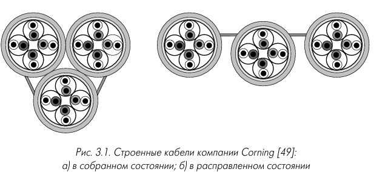

**Рис. 3.1 — Строенные кабели компании Corning: а) в собранном состоянии; б) в расправленном состоянии**

#### 3.1.2.2. Материалы проводников

Проводники горизонтального кабеля изготавливаются из монолитной (Solid) медной проволоки.

> **Монолитный (Solid) проводник** — проводник из цельной медной проволоки.

По видам скрутки различают парную и четверочную (рис. 3.2).

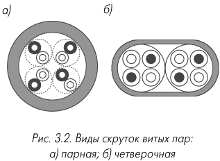

**Рис. 3.2 — Виды скруток витых пар: а) парная; б) четверочная**

Для уменьшения взаимного влияния пар используют различные и некратные шаги скрутки.

**Таблица 3.2 — Шаги скрутки (мм) витых пар горизонтальных кабелей категории 5**

| Фирма               | Пара 1 | Пара 2 | Пара 3 | Пара 4 |
|---------------------|--------|--------|--------|--------|
| General Cable       | 14     | 17     | 12     | 20     |
| BICC                | 18     | 15     | 20     | 12     |
| Belden              | 25     | 20     | 16     | 32     |
| Lucent Technologies | 15     | 13     | 20     | 24     |
| Mohawk/CDT          | 25     | 17     | 28     | 20     |

#### 3.1.2.3. Материалы изоляции проводников

В кабелях категории 3 обычно используется поливинилхлорид, в кабелях категории 5 и выше — полиэтилен и полипропилен (табл. 3.3). Применяются сплошные и вспененные материалы (рис. 3.3). Вспененные материалы за счет меньших диэлектрических потерь дают лучшие электрические характеристики, но дороже и применяются в кабелях с частотой свыше 100 МГц. Толщина изоляции ~0,2 мм.

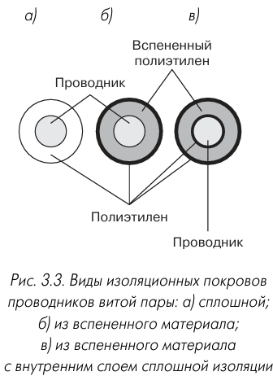

**Рис. 3.3 — Виды изоляционных покровов проводников витой пары: а) сплошной; б) из вспененного материала; в) из вспененного материала с внутренним слоем сплошной изоляции**

> *[Место для вставки изображения: виды изоляционных покровов проводников витой пары]*

**Таблица 3.3 — Основные изоляционные материалы проводников симметричных кабелей СКС**

| Материал                        | Сокращение     | Диэлектрическая проницаемость ε | Рабочий диапазон температур, °С |
|---------------------------------|----------------|---------------------------------|---------------------------------|
| Поливинилхлорид                 | PVC            | 4,0–5,0                         | –40…+85                         |
| Полипропилен                    | PP             | 2,4                             | –10…+100                        |
| Полиэтилен                      | PE             | 2,3                             | –55…+85                         |
| Ячеистый полиэтилен             | Foam           | 1,2                             | –55…+85                         |
| Ячеистый полиэтилен с оболочкой | Skin PE        | 1,5                             | –55…+85                         |
| Тефлон                          | FEP, PTFE, PFA | 2,0                             | –190…+260                       |

#### 3.1.2.4. Внешние оболочки

Для внешней оболочки применяется поливинилхлорид, не содержащие галогенов компаунды, малодымные полимеры. Переход на негорючие материалы увеличивает цену на 20–30 %. Оранжевая окраска обычно означает негорючий материал (для plenum-полостей). Конструкции для внешней прокладки снабжаются полиэтиленовой оболочкой. На оболочку наносятся маркирующие надписи: тип кабеля, диаметр проводников, фирма-производитель, стандарт, метки длины. Американские компании применяют футовые метки, европейские — метровые.

#### 3.1.2.5. Экранирование горизонтальных кабелей

> **Экранированный кабель** — кабель с дополнительными экранирующими покрытиями отдельных витых пар и/или сердечника.

> **Неэкранированный кабель** — кабель без экранирующих покрытий.

Принципиально возможны четыре типа: UTP (без экрана), STP (экран каждой пары), S/UTP (общий экран), S/STP (экран каждой пары + внешний экран).

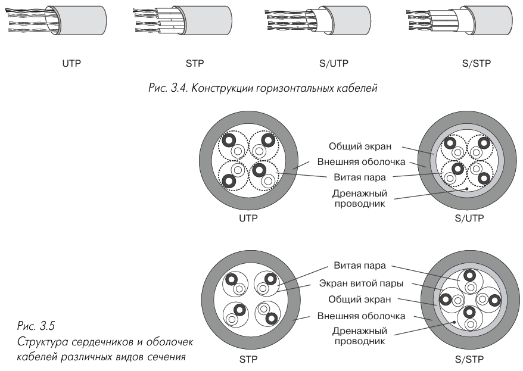

**Рис. 3.4 — Конструкции горизонтальных кабелей UTP, STP, S/UTP, S/STP**

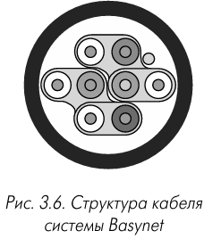

**Рис. 3.6 — Структура кабеля системы Basynet**

**Таблица 3.4 — Виды конструкций горизонтального кабеля**

| Обозначение | Альтернативное | Экран | Цель экранирования |
|---|---|---|---|
| UTP | — | Отсутствует | — |
| STP | PiMF, PMF | Экран каждой пары | Снижение ЭМИ, защита от помех, повышение NEXT |
| S/UTP | ScTP, FTP | Общий экран | Снижение ЭМИ, защита от помех |
| S/STP | STP, SSTP | Экран каждой пары + внешний | Снижение ЭМИ, защита от помех, повышение NEXT, механическая прочность |

S/UTP — до 90 % выпуска экранированных конструкций. S/STP обеспечивает NEXT на 10–15 дБ выше и позволяет передавать сигналы с тактовой частотой свыше 250–300 МГц на 90 м.

**Таблица 3.5 — Типовые механические характеристики горизонтальных 4-парных кабелей**

| Тип кабеля | UTP Кат. 5 | STP Кат. 5 | S/UTP Кат. 6 (пленочный) | S/UTP Кат. 6 (комбинир.) | S/STP |
|---|---|---|---|---|---|
| Масса, кг/км | 30–33 | 34–37 | 42 | 49 | 65–85 |
| Внешний диаметр, мм | 4,9 | 5,2 | 5,4 | 6,2 | 7,6 |
| Рабочий диапазон температур, °С | –20…+60 | –20…+60 | –20…+60 | –20…+60 | –20…+60 |
| Радиус изгиба, мм | 30–35 | 35–40 | 40–45 | 82–88 | 82–88 |

#### 3.1.2.6. Электрические характеристики

Основные нормируемые параметры: затухание, NEXT, волновое сопротивление, сопротивление постоянному току, NVP.

**Таблица 3.6 — Максимально допустимое затухание для горизонтальных кабелей категорий 3, 4 и 5 при 20 °C по TIA/EIA-568A**

| Частота, МГц | Кат. 3, 100 м | Кат. 4, 100 м | Кат. 5, 100 м |
|---|---|---|---|
| 0,772 | 2,2 | 1,9 | 1,8 |
| 1,00 | 2,6 | 2,2 | 2,0 |
| 4,00 | 5,6 | 4,3 | 4,1 |
| 10,00 | 9,7 | 6,9 | 6,5 |
| 16,00 | 13,1 | 8,9 | 8,2 |
| 20,00 | — | 10,0 | 9,3 |
| 31,25 | — | — | 11,7 |
| 62,50 | — | — | 17,0 |
| 100,00 | — | — | 22,0 |

**Таблица 3.7 — Минимальное значение NEXT для горизонтальных кабелей категорий 3, 4 и 5**

| Частота, МГц | NEXT Кат. 3 | NEXT Кат. 4 | NEXT Кат. 5 |
|---|---|---|---|
| 0,772 | 43 | 58 | 64 |
| 1,00 | 41 | 56 | 62 |
| 4,00 | 32 | 47 | 53 |
| 10,00 | 26 | 41 | 47 |
| 16,00 | 23 | 38 | 44 |
| 20,00 | — | 36 | 42 |
| 31,25 | — | — | 40 |
| 62,50 | — | — | 35 |
| 100,00 | — | — | 32 |

**Таблица 3.8 — Требования к остальным электрическим характеристикам витых пар**

| Параметр | ISO/IEC 11801 | TIA/EIA-568A |
|---|---|---|
| Волновое сопротивление <1 МГц | 75÷150 Ом | — |
| Волновое сопротивление >1 МГц | 100±15 Ом | (100±15 %) Ом |
| Сопротивление шлейфа 100 м при 20 °C | 19,2 Ом | — |
| Сопротивление проводника 100 м | — | 9,38 Ом |
| Несимметрия сопротивлений | 3 % | 5 % |
| Емкость дисбаланса (100 м, 1 кГц) | 340 пФ | 330 пФ |
| Сопротивление изоляции | 150 МОм·км | — |
| Пробивное напряжение (пост.) | 1 кВ, 1 мин | — |
| Пробивное напряжение (перем.) | 0,7 кВ, 1 мин | — |
| Skew, нс | 45 | — |

#### 3.1.2.7. Механические характеристики

**Таблица 3.9 — Требования к механическим характеристикам горизонтальных кабелей**

| Параметр | ISO/IEC 11801 | TIA/EIA-568A |
|---|---|---|
| Диаметр проводников | 0,4–0,65 мм | 0,5–0,65 мм (24/22 AWG) |
| Диаметр изоляции | <1,4 мм | <1,22 мм |
| Внешний диаметр | <6,35 мм | <6,35 мм |
| Температурный диапазон | монтаж: 0…+50 °С; эксплуатация: –20…+60 °С | — |
| Радиус изгиба при прокладке | <8 диаметров | — |
| Радиус изгиба при эксплуатации | <4 диаметров | — |
| Усилие на растяжение | <50 Н/мм² | <400 Н |

#### 3.1.2.8. Кабели с волновым сопротивлением 120 Ом

Допускаются стандартом ISO/IEC 11801. Обеспечивают меньшие структурные возвратные потери и меньшее затухание без роста габаритов.

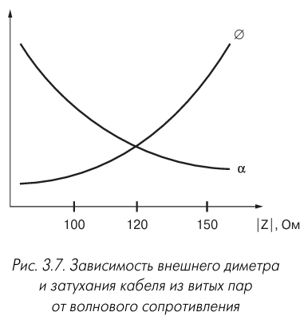

**Рис. 3.7 — Зависимость внешнего диаметра и затухания кабеля от волнового сопротивления**

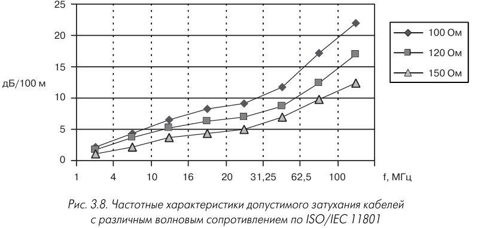

**Рис. 3.8 — Частотные характеристики допустимого затухания кабелей с различным волновым сопротивлением по ISO/IEC 11801**

#### 3.1.2.9. Упаковка горизонтальных кабелей

Поставляются в картонных коробках (305 м, 500 м, 100–120 м для SOHO) и на катушках (500 и 1000 м). Коробочная поставка удобна для монтажников, катушечная — меньше отходов, но неудобна при транспортировке.

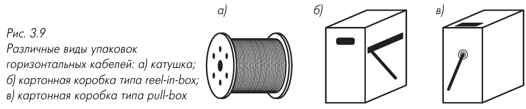

**Рис. 3.9 — Виды упаковок: а) катушка; б) коробка reel in box; в) коробка pullbox**

> *[Место для вставки изображения: виды упаковок горизонтальных кабелей]*

#### 3.1.2.10. Производство горизонтального кабеля

Основные операции: нанесение изоляции на медную проволоку, скрутка пар, формирование сердечника, нанесение экрана, нанесение оболочки, резка на отрезки, проверка NEXT и затухания.

### 3.1.3. Многопарный кабель

#### 3.1.3.1. Конструктивные особенности

> **Многопарный кабель** — кабель для магистральных подсистем СКС, содержащий более четырех витых пар.

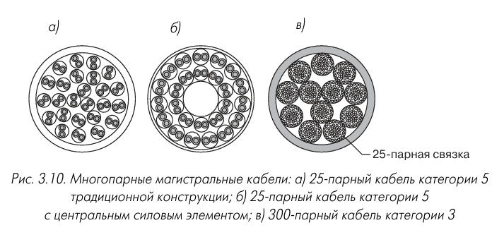

**Рис. 3.10 — Многопарные магистральные кабели: а) 25-парный кат. 5; б) 25-парный с центральным силовым элементом; в) 300-парный кат. 3**

**Таблица 3.10 — Типовые емкости магистральных кабелей**

| Категория | Количество пар |
|---|---|
| 3 | 25, 50, 75, 100, 200, 300, 600, 900, 1800 |
| 5 | 25, 50, 100 |

#### 3.1.3.2. Электрические характеристики

Требования соответствуют горизонтальным кабелям. Для многопарных кабелей в горизонтальной подсистеме NEXT должен возрасти на:

$$\Delta \text{NEXT} = 6 + 10\lg(n+1)\ \text{дБ} \tag{3.1}$$

где $n$ — количество смежных элементов в пучке. Разница между мощностью сигналов приложений в одном пучке не должна превышать 6 дБ.

#### 3.1.3.3. Механические характеристики

**Таблица 3.11 — Требования к механическим характеристикам многопарных кабелей**

| Параметр | Значение |
|---|---|
| Диаметр проводников | 0,5÷0,65 мм (24–22 AWG) |
| Диаметр изоляции | ≤1,22 мм |
| Температурный диапазон | монтаж: 0…+50 °C; эксплуатация: –20…+60 °C |
| Радиус изгиба при прокладке | ≤8 диаметров |
| Радиус изгиба при эксплуатации | ≤6 диаметров |

### 3.1.4. Другие электрические кабельные изделия СКС

#### 3.1.4.1. Кабель для шнуров

> **Кабель для шнуров (гибкий кабель)** — кабель для изготовления коммутационных и оконечных шнуров.

> **Многопроволочный (Stranded) проводник** — проводник из семи тонких перевитых медных проволок.

Отличия: многопроволочные проводники (30–34 AWG), утолщенная изоляция (~0,25 мм), гибкая оболочка. Затухание на 20 % (TIA/EIA-568A) или на 50 % (ISO/IEC 11801) выше, чем у горизонтального кабеля.

**Таблица 3.12 — Максимально допустимое затухание кабелей для шнуров категорий 3, 4 и 5 при 20 °C**

| Частота, МГц | Кат. 3 | Кат. 4 | Кат. 5 |
|---|---|---|---|
| 0,772 | 2,7/3,3 | 2,3/2,9 | 2,2/2,7 |
| 1,00 | 3,1/3,9 | 2,6/3,3 | 2,4/3,0 |
| 4,00 | 6,7/8,4 | 5,2/6,5 | 4,9/6,2 |
| 10,00 | 11,7/14,6 | 8,3/10,4 | 7,8/9,8 |
| 16,00 | 15,7/19,7 | 10,7/13,4 | 9,9/12,3 |
| 20,00 | — | 12,0/15,0 | 11,1/14,0 |
| 31,25 | — | — | 14,1/17,8 |
| 62,50 | — | — | 20,4/25,5 |
| 100,00 | — | — | 26,4/33,0 |

**Таблица 3.13 — Взаимосвязь между электрической и механической длиной**

| Механическая длина | Электрическая длина TIA/EIA-568A | Электрическая длина ISO/IEC 11801 |
|---|---|---|
| 1 | 1,2 | 1,5 |

#### 3.1.4.2. Провод для перемычек

> **Провод для перемычек (кроссировочный провод)** — одна неэкранированная витая пара категории 3 без внешней оболочки.

Применяется на панелях типа 66 и 110. Стандартная упаковка — катушка 305 или 201 м.

#### 3.1.4.3. Кабель для прокладки под ковром

> **Кабель для прокладки под ковром (under carpet cable)** — кабель для напольного монтажа без дополнительных защитных элементов.

Имеет плоскую конструкцию с боковыми «крыльями» (рис. 3.11).

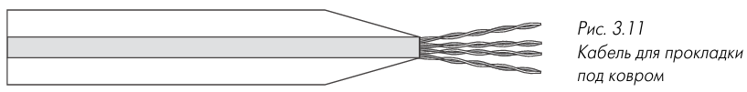

**Рис. 3.11 — Кабель для прокладки под ковром**

> *[Место для вставки изображения: кабель для прокладки под ковром]*

**Таблица 3.14 — Кабели СКС для прокладки под ковром**

| Фирма | Наименование | Категория | Упаковка, м |
|---|---|---|---|
| Hubbell | DCTP04200 | 3 | 61 |
| AMP | 5578741 | 3 | 76,2 |
| AMP | 5553181 | 5 | 76,2 |
| PCnet | 6550498 | 5 | 61 |
| PCnet | 6530498 | 3 | 61 |

#### 3.1.4.4. Горизонтальные кабели с граничной частотой свыше 100 МГц

Обеспечивают ACR = 10 дБ на 150–200 МГц. Улучшение NEXT достигается центральным сепаратором (рис. 3.13) или точностью балансировки. Характеристики нормируются до 350–550 МГц. Делятся на два подкласса: 350 МГц (категория 5е) и 550–600 МГц (категория 6).

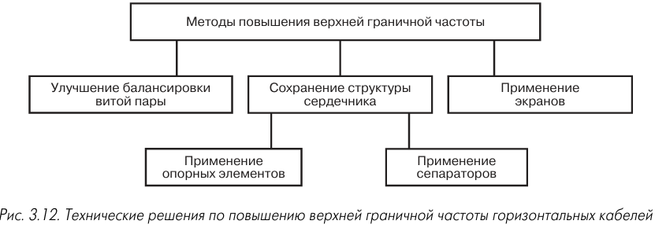

**Рис. 3.12 — Технические решения по повышению верхней граничной частоты**

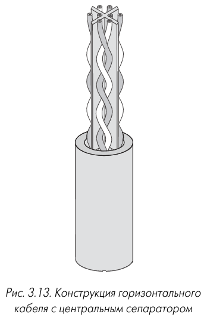

**Рис. 3.13 — Конструкция кабеля с центральным сепаратором**

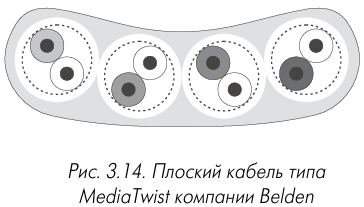

**Рис. 3.14 — Плоский кабель типа MediaTwist компании Belden**

**Таблица 3.15 — Горизонтальные кабели UTP с граничной частотой свыше 100 МГц**

| Фирма | Тип | $f_{гр}$ по ACR=10 дБ, МГц | $f_в$, МГц | Затухание на $f_в$, дБ/100 м | SRL на $f_в$, дБ |
|---|---|---|---|---|---|
| **Подкласс 350 МГц** | | | | | |
| Alcatel | LANMark | 210 | 350 | 37,6 | 13,1 |
| AMP | FUTURELAN 350 | 140 | 350 | 44,9 | 16 |
| Belden | 1700A | 160 | 350 | 37,7 | 30 |
| Mohawk/CDT | MegaLAN 400 | 160 | 400 | 48,5 | 12 |
| Pirelli | DX11003 | 175 | 200 | 37 | — |
| BICC Brand-Rex | TurboLAN 350 | 150 | 350 | 41,2 | — |
| NK Cables | UC 400 24 4P | 240 | 400 | 45 | — |
| Elgadphon | GigaStar | 200 | 250 | 33 | 17,3 |
| PCnet | Category 5plus | 100 | 350 | 44,3 | — |
| **Подкласс 550–600 МГц** | | | | | |
| Lucent Technologies | 1071, 2071, 3071 | 180 | 550 | 55,3 | 15,9 |
| Mohawk/CDT | AdvanceNet | 180 | 550 | 53,7 | 17,8 |
| RiT Technologies | Giga UTP | 185 | 600 | 55 | — |
| Belden | 1872A | 165 | 550 | 55,3 | 16 |
| BICC Brand-Rex | TurboLAN 1000 | 390 | 550 | 52 | 13 |

#### 3.1.4.5. Комбинированные конструкции

> **Комбинированный (композитный, гибридный) кабель** — кабель, содержащий одновременно несколько типов кабельных элементов.

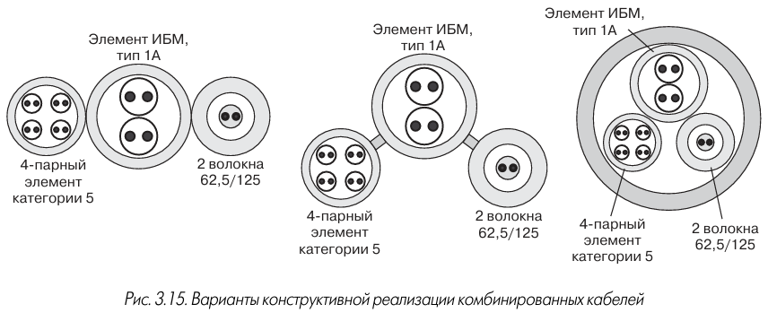

**Рис. 3.15 — Варианты конструктивной реализации комбинированных кабелей**

### 3.1.5. Цветовая маркировка электрических кабелей СКС

Стандарты IEC 708-1 и TIA/EIA-598 задают 12 маркирующих цветов.

**Таблица 3.16 — Маркирующие цвета проводников и световодов**

| N | 1 | 2 | 3 | 4 | 5 | 6 |
|---|---|---|---|---|---|---|
| Цвет | Синий | Оранжевый | Зеленый | Коричневый | Серый | Белый |

| N | 7 | 8 | 9 | 10 | 11 | 12 |
|---|---|---|---|---|---|---|
| Цвет | Красный | Черный | Желтый | Фиолетовый | Розовый | Голубой |

**Таблица 3.17 — Цветовая маркировка пар в пучке многопарного кабеля**

| Группа | Цвет 1-го провода | Пара 1 | Пара 2 | Пара 3 | Пара 4 | Пара 5 |
|---|---|---|---|---|---|---|
| 1 | Белый | Синий | Оранжевый | Зеленый | Коричневый | Серый |
| 2 | Красный | Синий | Оранжевый | Зеленый | Коричневый | Серый |
| 3 | Черный | Синий | Оранжевый | Зеленый | Коричневый | Серый |
| 4 | Желтый | Синий | Оранжевый | Зеленый | Коричневый | Серый |
| 5 | Фиолетовый | Синий | Оранжевый | Зеленый | Коричневый | Серый |

## 3.2. Разъемы для электрических кабелей

### 3.2.1. Механические и электрические параметры

#### 3.2.1.1. Подключение проводников

> **IDC (Insulation Displacement Connection)** — метод соединения, основанный на использовании двойного пружинящего контакта с острыми режущими кромками, в зазор между которыми при установке вводится проводник.

Типы IDC-контактов: 110, 66, Krone (LSA-Plus), KATT. Контакты 110 и 66 — прямое расположение кромок, Krone и KATT — угловое. Контакты 110 не допускают подключения более одного проводника.

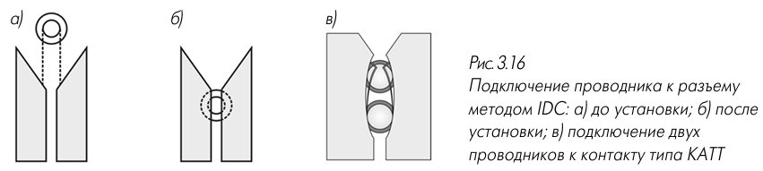

**Рис. 3.16 — Подключение проводника методом IDC: а) до установки; б) после установки; в) два проводника к КАТТ**

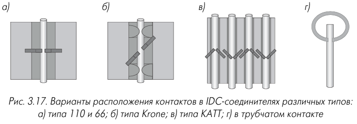

**Рис. 3.17 — Расположение контактов в IDC-соединителях: а) типа 110 и 66; б) Krone; в) KATT; г) трубчатый**

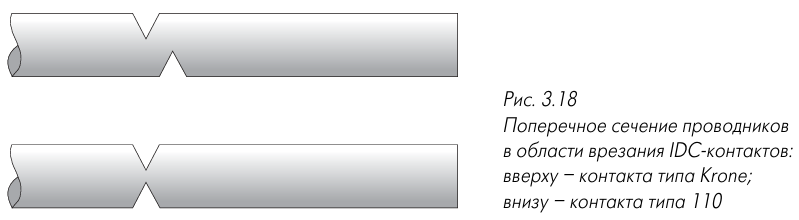

**Рис. 3.18 — Поперечное сечение проводников в области врезания IDC-контактов: вверху — Krone; внизу — 110**

**Таблица 3.18 — Общие характеристики IDC-контактов**

| Тип | Расположение кромок | >1 проводника | Категория |
|---|---|---|---|
| 110 | Прямое | Невозможно | 3–5 |
| 66 | Прямое | Возможно | 3* |
| Krone | Угловое | Возможно | 3–5 |
| KATT | Угловое | Возможно | 3–5 |

#### 3.2.1.2. Электрические характеристики разъемов

Стандарты предъявляют к разъемам более жесткие требования по NEXT, чем к кабелям.

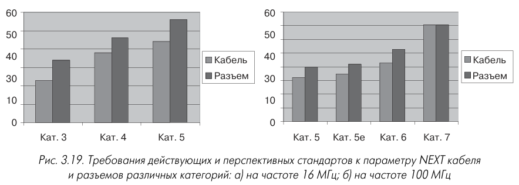

**Рис. 3.19 — Требования стандартов к NEXT кабеля и разъемов: а) 16 МГц; б) 100 МГц**

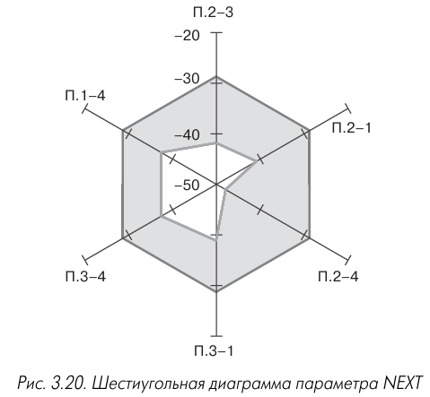

**Рис. 3.20 — Шестиугольная диаграмма параметра NEXT**

**Таблица 3.19 — Максимально допустимое затухание и NEXT для разъемов, дБ**

| Частота, МГц | Кат. 3 Затух. | Кат. 3 NEXT | Кат. 4 Затух. | Кат. 4 NEXT | Кат. 5 Затух. | Кат. 5 NEXT |
|---|---|---|---|---|---|---|
| 1,00 | 0,40 | 58 | 0,1 | >65 | 0,1 | >65 |
| 4,00 | 0,40 | 46 | 0,1 | 58 | 0,1 | >65 |
| 10,00 | 0,40 | 38 | 0,1 | 50 | 0,1 | 60 |
| 16,00 | 0,40 | 34 | 0,2 | 46 | 0,2 | 56 |
| 20,00 | — | — | 0,2 | 44 | 0,2 | 54 |
| 31,25 | — | — | — | — | 0,2 | 50 |
| 62,50 | — | — | — | — | 0,3 | 44 |
| 100,00 | — | — | — | — | 0,4 | 40 |

**Таблица 3.20 — NEXT на 100 МГц для комбинаций пар панелей SMART 24 (RiT)**

| Контакты | 1–2 | 3–6 | 4–5 | 7–8 |
|---|---|---|---|---|
| 1–2 | — | 42,4 | 54,0 | 54,0 |
| 3–6 | 42,4 | — | 42,1 | 42,0 |
| 4–5 | 54,0 | 42,1 | — | 46,7 |
| 7–8 | 54,0 | 42,0 | 46,7 | — |

**Таблица 3.21 — Минимально допустимый уровень возвратных потерь разъема, дБ**

| Частота, МГц | Кат. 4 | Кат. 5 |
|---|---|---|
| 1–20 | 23 | 26 |
| 20–100 | — | 26 – 20lg(f/20) |

**Таблица 3.22 — Требования перспективных стандартов к NEXT и FEXT на 100 МГц**

| Категория | NEXT | FEXT |
|---|---|---|
| 5 | 40 | Не специфицировано |
| 5Е | 43 | 35 |
| 6 | 54 | 43 |

#### 3.2.1.3. Механические характеристики

Диаметр проводника 0,5–0,65 мм. К розеточному модулю подключается 8 проводников. Контакт выдерживает не менее 750 циклов. Температурный диапазон по TIA/EIA-568A: –10…+60 °С.

### 3.2.2. Модульные разъемы

#### 3.2.2.1. Общие положения

> **Модульный разъем** — разъем из вилки и розетки, реализующий принцип «контактной шины».

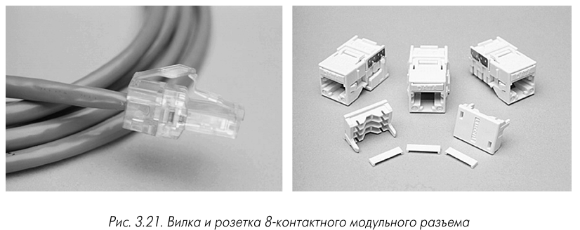

**Рис. 3.21 — Вилка и розетка 8-контактного модульного разъема**

> *[Место для вставки изображения: вилка и розетка 8-контактного модульного разъема]*

Модульные разъемы обеспечивают характеристики категорий 3, 4, 5, 5е, 6. Нарушение фабричной свивки пар допускается не более чем на 13 мм для категории 5 и 25 мм для категорий 3 и 4. Контакты покрываются золотом (1,27 мкм) на никелевой подложке (2,54 мкм). Выдерживают 2500 циклов (Panduit MBX — 10000).

#### 3.2.2.2. Вилки модульных разъемов

**Таблица 3.23 — Геометрические параметры кабелей для монтажа вилки**

| Параметр | Значение |
|---|---|
| Диаметр проводников пар, мм | 0,5–0,65 |
| Внешний диаметр изоляции проводников | 0,8–1,0 |
| Внешний диаметр оболочки | 4–6 |

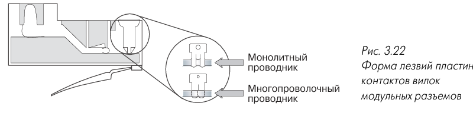

**Рис. 3.22 — Форма лезвий пластин контактов вилок модульных разъемов**

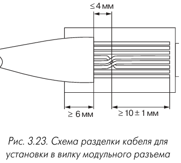

**Рис. 3.23 — Схема разделки кабеля для установки в вилку модульного разъема**

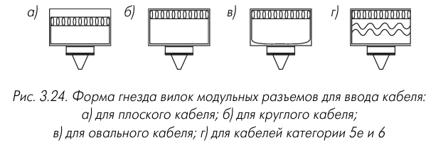

**Рис. 3.24 — Форма гнезда вилок для ввода кабеля: а) плоский; б) круглый; в) овальный; г) для кат. 5е и 6**

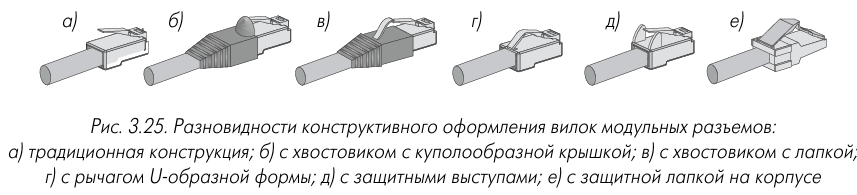

**Рис. 3.25 — Разновидности конструктивного оформления вилок: а) традиционная; б) с куполообразной крышкой; в) с лапкой; г) с U-образным рычагом; д) с защитными выступами; е) с защитной лапкой**

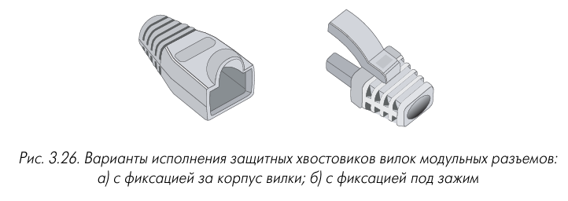

**Рис. 3.26 — Варианты исполнения защитных хвостовиков: а) с фиксацией за корпус; б) с фиксацией под зажим**

#### 3.2.2.3. Розетки модульных разъемов

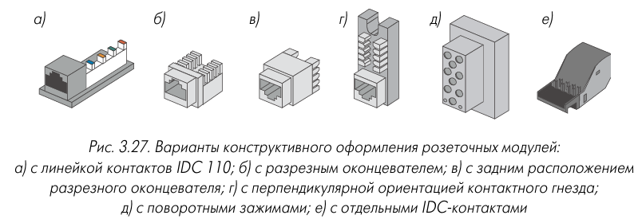

**Рис. 3.27 — Варианты конструктивного оформления розеточных модулей: а) с линейкой IDC 110; б) с разрезным оконцевателем; в) с задним расположением оконцевателя; г) с перпендикулярной ориентацией гнезда; д) с поворотными зажимами; е) с отдельными IDC-контактами**

> *[Место для вставки изображения: варианты конструктивного оформления розеточных модулей]*

**Рис. 3.28 — Особенности конструкции оконцевателя розетки типа HXJ6B фирмы Hubbell**

> *[Место для вставки изображения: особенности конструкции оконцевателя розетки типа HXJ6B]*

**Рис. 3.29 — Розетка немецкой компании FMT**

> *[Место для вставки изображения: розетка немецкой компании FMT]*

**Рис. 3.30 — Варианты конструктивной реализации розеточных модулей на основе модульных вставок: а) AMP; б) Datwyler**

> *[Место для вставки изображения: варианты конструктивной реализации розеточных модулей на основе модульных вставок]*

**Рис. 3.31 — Технические решения по дополнительной фиксации кабеля в розетке: а) хомут и Т-образная лапка; б) врезные элементы S100 Siemens; в) зажим панелей Elgadphon**

> *[Место для вставки изображения: технические решения по дополнительной фиксации кабеля в розетке]*

**Рис. 3.32 — Установка розеточных модулей: а) угловая с выступом; б) плоская; в) keystone; г) угловая keystone**

> *[Место для вставки изображения: установка розеточных модулей в короб или розетку]*

**Рис. 3.33 — Разновидности розеток: а) 8-контактная; б) 8-контактная с ключом; в) 6-контактная; г) 6-контактная модифицированная**

> *[Место для вставки изображения: разновидности розеток модульных разъемов]*

#### 3.2.2.4. Схемы разводки модульных разъемов

**Рис. 3.34 — Схемы разводки витых пар: а) T568A; б) T568B; в) USOC 8-контактный; г) USOC 6-контактный**

> *[Место для вставки изображения: схемы разводки витых пар по контактам модульного разъема]*

**Таблица 3.24 — Разводка витых пар по контактам модульного разъема**

| Контакт | T568A Пара | T568A Сигнал | T568B Пара | T568B Сигнал | USOC Пара | USOC Сигнал |
|---|---|---|---|---|---|---|
| 1 | 3 | T3 | 2 | T2 | 4 | T4 |
| 2 | 3 | R3 | 2 | R2 | 3 | T3 |
| 3 | 2 | T2 | 3 | T3 | 2 | T2 |
| 4 | 1 | R1 | 1 | R1 | 1 | R1 |
| 5 | 1 | T1 | 1 | T1 | 1 | T1 |
| 6 | 2 | R2 | 3 | R3 | 2 | R2 |
| 7 | 4 | T4 | 4 | T4 | 3 | R3 |
| 8 | 4 | R4 | 4 | R4 | 4 | R4 |

**Таблица 3.25 — Использование схем T568B некоторыми системами передачи данных**

| Приложение | Скорость, Мбит/с | Активные контакты | Пары |
|---|---|---|---|
| IEEE 802.3 (Ethernet) | 10 | 1,2,3,6 | P2, P3 |
| IEEE 802.3u (Fast Ethernet) | 100 | 1,2,3,6 | P2, P3 |
| IEEE 802.3ab (Giga Ethernet) | 1000 | 1–8 | P1–P4 |
| IEEE 802.5 (Token Ring) | 4/16 | 3,4,5,6 | P1, P3 |
| IEEE 802.12 (100VG-AnyLAN) | 100 | 1–8 | P1–P4 |
| ATM (TP) | 155 | 1,2,7,8 | P2, P4 |
| TP-PMD | 100 | 1,2,7,8 | P2, P4 |
| ISDN | 2,048 | 1–8 | P1–P4 |

### 3.2.3. Разъемы типа 110

Разъемы типа 110 — «панельный» элемент для коммутационного оборудования. Состоит из вилки и линейки. Соединительный блок 110C выполняет функции розетки. Вилки изготавливаются на 1, 2, 3 и 4 пары.

**Рис. 3.35 — Вилка разъема типа 110**

> *[Место для вставки изображения: вилка разъема типа 110]*

**Разъемы типа Telco** — 50-контактные многоканальные разъемы для многопарных кабелей. Обеспечивают категории 3 и 5. Контактные части должны закрываться защитными колпачками.

**Рис. 3.36 — Варианты подвода кабелей к вилке Telco: а) 120°; б) 90°; в) 180°**

> *[Место для вставки изображения: варианты подвода кабелей к вилке разъема Telco]*

### 3.2.4. Другие типы разъемов

**4-контактные MIC** — для кабельной системы IBM (150 Ом), гермафродитная конструкция. **Разъемы серии DB** — для 100-омных кабелей, варианты на 9, 16, 25 контактов. **G4 и CAG 8** — для 150-омных кабелей.

### 3.2.5. Разъемы типа 110 нетрадиционных схем

#### 3.2.5.1. Система VisiPatch

**Рис. 3.37 — Вилка шнура системы VisiPatch**

> *[Место для вставки изображения: вилка шнура системы VisiPatch]*

Контакты развернуты на 180°, кабель направлен в панель. Подпружиненная защелка, крышка для защиты контактов.

#### 3.2.5.2. Разъемы типа S210

Обеспечивают NEXT на 25 дБ выше категории 5 и на 11 дБ выше проекта категории 6. Контакты сгруппированы по два и окружены экраном.

**Таблица 3.26 — Геометрические параметры соединительных блоков**

| Тип блока | Система | Ширина, мм | Глубина, мм | Толщина, мм |
|---|---|---|---|---|
| P110C4W | 110 и VisiPatch | 30 | 22,6 | 6,2 |
| GPCB4 | GigaPUNCH | 22 | 22,6 | 8,8 |
| S210C4 | S210 | 45,5 | 24,5 | 8 |

#### 3.2.5.3. Система GigaPUNCH

Двухрядное размещение контактов в шахматном порядке. Панели высокой и стандартной плотности.

**Таблица 3.27 — Электрические характеристики разъемов на 250 МГц**

| Параметр | Проект кат. 6 | GigaPUNCH | S210 | VisiPatch* |
|---|---|---|---|---|
| NEXT | >45 | 52 | 58 | 49,6 |
| PSNEXT | >42 | 49 | 55,2 | 44,9 |
| FEXT | >35 | 47 | 61,5 | н/д |
| PSFEXT | >32 | 44 | 59,2 | н/д |
| Затухание | <0,32 | 0,03 | н/д | н/д |
| Обратные потери | >15 | 24 | 20,7 | н/д |

**Рис. 3.38 — Соединительные блоки разъемов: слева — 110 и VisiPatch, в центре — S210, справа — GigaPUNCH**

> *[Место для вставки изображения: соединительные блоки разъемов]*

### 3.2.6. Высокочастотные разъемы для категории 7

#### 3.2.6.1. Состояние разработок

Стандартный модульный разъем не удовлетворяет требованиям категории 7. Применяются однорядная и двухрядная схемы.

**Рис. 3.39 — Варианты расположения контактов: а) двухрядный; б) однорядный**

> *[Место для вставки изображения: варианты расположения контактов отдельных пар в высокочастотных разъемах]*

#### 3.2.6.2. Решения модульного типа

**GG45/GP45 (Alcatel)** — с дополнительными полосковыми контактами и движковым переключателем.

**Рис. 3.40 — Розетка разъема типа GG45 компании Alcatel**

> *[Место для вставки изображения: розетка разъема типа GG45 компании Alcatel]*

**Category 7 Modular Plug & Jack (AMP)** — печатные проводники в форме миниатюрных коаксиальных кабелей.

**Рис. 3.41 — Вилка разъема Category 7 Modular Plug & Jack компании АМР**

> *[Место для вставки изображения: вилка разъема системы Category 7 Modular Plug & Jack компании АМР]*

#### 3.2.6.3. Решения нетрадиционных схем

Не совместимы с модульными разъемами. Двухрядная схема, крестообразный металлический сепаратор для полного кругового охвата экраном.

## 3.3. Коммутационное оборудование

### 3.3.1. Коммутационные шнуры

> **Коммутационный шнур** — отрезок кабеля с многопроволочными проводниками и двумя разъемами на концах.

**Рис. 3.42 — Коммутационный шнур**

> *[Место для вставки изображения: коммутационный шнур]*

**Таблица 3.28 — Основные типы коммутационных шнуров СКС**

| 1-й конец | 2-й конец | Число пар | Назначение |
|---|---|---|---|
| 110 | 110 | 1–4 | Подключение к оборудованию типа 110 |
| 110 | Модульный | 2 или 4 | Подключение 110 к модульным панелям |
| Модульный | Модульный | 4 | Подключение модульных панелей |

**Таблица 3.29 — Неэкранированные коммутационные шнуры категории 5**

| Фирма | Тип | 1-й конец | 2-й конец | Длина мин., м | Длина макс., м |
|---|---|---|---|---|---|
| Homaco | MA584TXXS | Модульный | Модульный | 0,31 | 10,0 |
| Lucent Technologies | D8AU22 | Модульный | Модульный | 0,61 | 3,1 |
| Lucent Technologies | 110P8CAT52X | 110 | 110 | 0,61 | 4,6 |
| Lucent Technologies | 119P8CAT52X | 110 | Модульный | 0,61 | 4,6 |
| Ortronics | OR827DTP80XXDE | Модульный | Модульный | 0,31 | 5,49 |
| Panduit | UTPCX | Модульный | Модульный | 0,61 | 6,1 |
| Siemon | MC58T(XX)B(XX) | Модульный | Модульный | 0,91 | 7,62 |
| Siemon | S110P1P1(XX) | 110 | 110 | 0,91 | 7,62 |
| Hubbell | C504P24JXXDESN | Модульный | Модульный | 0,61 | 7,62 |
| ITT NS&S | 195500XXXX | Модульный | Модульный | 0,3 | 10,0 |
| ICC | ICPC9XXBL | Модульный | Модульный | 0,91 | 7,62 |
| ICC | ICPC5XXBL | 110 | Модульный | 0,91 | 3,05 |

**Рис. 3.43 — Устройство Perfect Patch**

> *[Место для вставки изображения: устройство Perfect Patch]*

### 3.3.2. Коммутационные панели

Три основные группы: панели типа 110, типа 66, с модульными разъемами.

#### 3.3.2.1. Коммутационные панели типа 110

**Рис. 3.44 — Коммутационная панель типа 110 для настенного монтажа**

> *[Место для вставки изображения: коммутационная панель типа 110 для настенного монтажа]*

**Таблица 3.30 — Кроссовые башни типа 110 с четырехпарной разводкой**

| Компания | Тип панели | Количество пар |
|---|---|---|
| Lucent Technologies | 110PB2300FT | 300 |
| Lucent Technologies | 110PB2900FT | 900 |
| Ortronics | OR806003522 | 300 |
| Ortronics | OR806003525 | 900 |
| Panduit | P110KT3004 | 300 |
| Panduit | P110KT9004 | 900 |
| Siemon | S110MB2300FT | 300 |
| Siemon | S110MB2400FT | 400 |
| Siemon | S110MB2500FT | 500 |

**Таблица 3.31 — Панели типа 110 для настенной установки**

| Компания | Марка | Пар | Компания | Марка | Пар |
|---|---|---|---|---|---|
| Panduit | P110KB1004 | 100 | AMP | 5888411 | 50 |
| Panduit | P110KB3004 | 300 | AMP | 5888421 | 100 |
| Ortronics | OR30200006 | 100 | AMP | 5888431 | 300 |
| Ortronics | OR30200007 | 300 | Siemon | S110AW150 | 50 |
| Lucent | 110AB2100FT | 100 | Siemon | S110AW1100 | 100 |
| Lucent | 110AB2300FT | 300 | Siemon | S110AW1200 | 200 |
| BICC | CAT5S110AW150 | 50 | Siemon | S110AW1300 | 300 |
| BICC | CAT5S110AW1100 | 100 | ICC | IC110WF050 | 50 |
| BICC | CAT5S110AW1300 | 300 | ICC | IC110WF100 | 100 |
| | | | ICC | IC110WF300 | 300 |

#### 3.3.2.2. Коммутационные панели типа 66

**Рис. 3.45 — Коммутационная панель типа 66**

> *[Место для вставки изображения: коммутационная панель типа 66]*

**Рис. 3.46 — Контакты панелей типа 66: а) односекционный; б) двухсекционный; в) четырехсекционный; г) восьмисекционный**

> *[Место для вставки изображения: контакты панелей типа 66]*

#### 3.3.2.3. Коммутационные панели с розетками модульных разъемов

**Рис. 3.47 — Коммутационная панель с модульными розетками**

> *[Место для вставки изображения: коммутационная панель с модульными розетками]*

**Рис. 3.48 — Варианты реализации коммутационных блоков панелей**

> *[Место для вставки изображения: варианты реализации коммутационных блоков панелей]*

**Рис. 3.49 — Y-адаптер**

> *[Место для вставки изображения: Y-адаптер]*

**Таблица 3.32 — Коммутационные панели с модульными розетками категории 5**

| Компания | Марка | Портов | Высота |
|---|---|---|---|
| Siemon | HD516А4 | 16 | 1U |
| Siemon | HD524A4 | 24 | 1U |
| Siemon | HD532A4 | 32 | 2U |
| Siemon | HD548A4 | 48 | 2U |
| Lucent Technologies | 1100AA124 | 24 | 1U |
| Lucent Technologies | 1100AA1148 | 48 | 2U |
| Alcatel | ACS503.124 | 48 | 3U |
| Homaco | MJPC5837TB | 24 | 1U |
| Homaco | MJPC5835TB | 48 | 2U |
| Hubbell | MCC5802110A19 | 16 | 1U |
| Hubbell | MCC5806110A19 | 48 | 2U |
| Hubbell | MCC5812110A19 | 96 | 4U |
| Hubbell | MCC5815110A19 | 120 | 5U |
| ICC | ICMPPOXX5B | 24 | 1U |

**Рис. 3.50 — Решения по облегчению разводки панелей: а) откидная; б) кронштейны; в) выдвижной корпус**

> *[Место для вставки изображения: технические решения по облегчению процесса разводки панелей]*

**Таблица 3.33 — Панели с разъемами TELCO и розетками модульных разъемов**

| Компания | Марка | Портов | Категория |
|---|---|---|---|
| Lucent Technologies | 2500-Cat5 | 24, 48 | 5 |
| Mod-Tap | 27.6E.241.B004G | 24 | 3 |
| Ortronics | OR808004926 | 24 | 3 |
| Ortronics | OR808004927 | 24 | 3 |
| Siemon | CTPNLXXXX01 | 16–96 | 5 |
| Telesafe | 41450000 | 24 | 3 |
| Telesafe | 41430000 | 24 | 3 |

#### 3.3.2.4. Претерминированные и бесшнуровые панели

**Рис. 3.51 — Принципиальная схема разводки модулей панелей с встроенным переключателем**

> *[Место для вставки изображения: принципиальная схема разводки модулей панелей с встроенным переключателем]*

#### 3.3.2.5. Прочие разновидности панелей

Панели Ethernet, телефонные панели, ISDN-панели, панели с балунами, панели с активным оборудованием.

#### 3.3.2.6. Распределители

Пластиковый корпус на 4–6 розеточных модулей для монтажа вне технических помещений.

### 3.3.3. Информационные розетки

#### 3.3.3.1. Традиционные конструкции

**Рис. 3.52 — Варианты конструктивной реализации информационных розеток**

> *[Место для вставки изображения: варианты конструктивной реализации информационных розеток]*

**Таблица 3.34 — Габаритные размеры установочных окон**

| Стандарт | Размеры, мм |
|---|---|
| 6СЕ | 50×25 |
| 6С | 21,3×36,7 |
| Mosaic 45 | 45×45 |
| 6A | 24×17,5 |

**Рис. 3.53 — Виды информационных розеток: а) внешняя прямая; б) внутренняя прямая; в) внутренняя угловая с выступом; г) внутренняя угловая с выемкой**

> *[Место для вставки изображения: различные виды информационных розеток]*

#### 3.3.3.2. Розетки для телефонных аппаратов

**Рис. 3.54 — Форма розеток различных национальных стандартов: а) французская; б) бельгийская; в) немецкая; г) португальская; д) испанская; е) международная**

> *[Место для вставки изображения: форма розеток для подключения телефонных аппаратов]*

### 3.3.4. Решения для открытых офисов

#### 3.3.4.1. Розетки для подпольных коробок

Напольные модули (bodentank) — корпуса-адаптеры под конкретную коробку.

#### 3.3.4.2. Розетки MUTO и консолидационных точек

**Рис. 3.55 — Устройство RICI**

> *[Место для вставки изображения: устройство RICI]*

## 3.4. Оконечные шнуры, адаптеры и удлинители

### 3.4.1. Оконечные шнуры

#### 3.4.1.1. Конструктивные особенности

Оконечные шнуры предназначены для подключения сетевого оборудования. Конструктивно не отличаются от коммутационных шнуров с модульными разъемами.

**Рис. 3.56 — Варианты подключения сетевого оборудования к СКС: а) оконечный шнур; б) монтажный шнур; в) оконечный шнур и панель SMART**

> *[Место для вставки изображения: варианты подключения сетевого оборудования к СКС]*

#### 3.4.1.2. Разновидности 4-парных оконечных шнуров

**Рис. 3.57 — Схема соединения контактов вилок: а) прямой; б) обращенный; в) нуль-модемный**

> *[Место для вставки изображения: схема соединения контактов вилок модульных разъемов различных видов шнуров]*

#### 3.4.1.3. Монтажные шнуры и оконцованные кабели

Монтажный шнур — вилка модульного разъема с одного конца, второй конец разводится на панели. Оконцованные кабели — 25-парный кабель категории 5 с разъемами Telco.

#### 3.4.1.4. Комбинированные и многопарные оконечные шнуры

**Рис. 3.58 — Шнур типа «гидра»**

> *[Место для вставки изображения: шнур типа «гидра»]*

### 3.4.2. Адаптеры

#### 3.4.2.1. Переходники

**Рис. 3.59 — Принципиальная схема согласующего адаптера**

> *[Место для вставки изображения: принципиальная схема одной из возможных реализаций согласующего адаптера]*

#### 3.4.2.2. Разветвители

Y-адаптеры, гармоники.

**Рис. 3.60 — Гармоника**

> *[Место для вставки изображения: гармоника]*

#### 3.4.2.3. Балуны

> **Балун** — устройство для соединения витой пары и коаксиального или твинаксиального кабеля.

**Рис. 3.61 — Балун: а) внешний вид; б) принципиальная схема**

> *[Место для вставки изображения: балун]*

#### 3.4.2.4. Другие виды адаптеров

**Рис. 3.62 — Измерительные адаптеры: а) вариант А; б) вариант В; в) мониторный**

> *[Место для вставки изображения: варианты исполнения измерительных адаптеров]*

**Таблица 3.35 — I-адаптеры**

| Фирма | Наименование | Тип | Макс. скорость, Мбит/с |
|---|---|---|---|
| Lucent Technologies | 451A50 | Прямой | 10 |
| Lucent Technologies | 451A60 | Прямой | 10 |
| AMP | 5550521 | Прямой | 16 |
| AMP | 5550511 | Угловой | 16 |
| UNICOM | ILCU508AXX | Прямой | 100 |
| Hubbell | BRIA4P | Прямой | 16 |
| Hubbell | BRIAJF8 | С фланцем | 16 |
| ICC | ICMMA3508DR | Прямой | — |
| Panduit | MMC | Прямой | — |

**Рис. 3.63 — Схема внутренних соединений в мостовом адаптере типа 367A**

> *[Место для вставки изображения: схема внутренних соединений в мостовом адаптере типа 367A]*

### 3.4.3. Удлинители

Удлинители и распределители для подключения оборудования с невысокими требованиями к полосе пропускания.

## 3.5. Дополнительное оборудование

### 3.5.1. Комплекты для установки кабельной системы

**Таблица 3.36 — Комплекты для установки кабельной системы**

| Фирма | Наименование | Кабель | Панель | Розетки | Шнуры | Шкаф | Кат. |
|---|---|---|---|---|---|---|---|
| Alcatel | OffiSys | UTP/FTP | 2 | 10 | 10 двойных | 12U | 5 |
| Lucent | Systipack | — | — | — | 20 | — | 3 |
| Ackermann | NetBundle | — | — | — | 12/24/48 | — | 5 |
| Molex | 28.D0030 | UTP 305 м | 12-порт. | 12 одинарных | 24 | 8 двойных | 3 |

### 3.5.2. Соединительные модули

Для сращивания двух концов горизонтальных кабелей. Запрещены стандартами СКС, выпускаются ограниченно.

### 3.5.3. Автоматические кроссы

Устройства с несколькими входами и выходами, соединение между которыми устанавливается по управляющему сигналу. Емкость до 98 портов, время переключения 4,5 мс, категория 3.

### 3.5.4. Демонстрационное оборудование

Демонстрационные стойки (demo rack) в 19-дюймовом формате и чемоданы (sample case) с розетками и разъемами.

## 3.6. Выводы

Наличие широкой гаммы серийных электрических кабельных и коммутационных изделий позволяет стандартными средствами решать все виды задач при создании СКС емкостью до нескольких десятков тысяч портов. Основная масса изделий имеет волновое сопротивление 100 Ом. Горизонтальные четырехпарные кабели образуют основную массу кабельных изделий СКС. Основным видом разъема в СКС (вплоть до категории 6) является модульный, при необходимости администрирования отдельными парами эффективны разъемы типа 110. Коммутационное оборудование СКС строится по модульной, наборной или фиксированной схеме с емкостью от 100 до 900 пар.

## FAQ

**Вопрос: Чем отличается горизонтальный кабель от многопарного?**

Ответ: Горизонтальный кабель предназначен для горизонтальной подсистемы (от кроссовой до розеток) и обычно содержит четыре витые пары. Многопарный кабель предназначен для магистральных подсистем и содержит более четырех витых пар.

**Вопрос: Можно ли обжимать однопроволочный кабель (solid) разъемом RJ45?**

Ответ: Нет. Для фиксированных участков СКС используется однопроволочный кабель, для соединения устройств с розетками — заводские патч-корды на основе многопроволочного кабеля. Обжим solid-кабеля приводит к повреждению жилы и «блуждающим неисправностям».

**Вопрос: Какой кабель выбрать — UTP или FTP?**

Ответ: Если на объекте нет гарантированного заземления, лучше использовать UTP. Экран FTP-кабеля без заземления работает как антенна. UTP составляет около 90 % продаж витой пары в России.

**Вопрос: Что такое IDC-контакт и какие типы существуют?**

Ответ: IDC — метод соединения проводников с помощью двойного пружинящего контакта с острыми режущими кромками. Основные типы: 110, 66, Krone (LSA-Plus) и KATT.

**Вопрос: Какие схемы разводки модульных разъемов используются в СКС?**

Ответ: T568A, T568B и USOC. В СКС используются T568A и T568B. В России преимущественно применяется T568B. Стандарты запрещают одновременное применение двух разных схем в одной СКС.

**Вопрос: Что такое балун и для чего он используется?**

Ответ: Балун — устройство для соединения витой пары и коаксиального или твинаксиального кабеля, обеспечивающее переход от несимметричной схемы к симметричной и согласование волновых сопротивлений.

**Вопрос: Чем модульная патч-панель лучше патч-панели 110 типа?**

Ответ: Модульная патч-панель позволяет устанавливать модули разных типов, использовать цветовую идентификацию и упрощает сертификацию: при переобжиме одного порта не требуется заново сертифицировать все порты.