

<strong>Кратко</strong>
<table><tr><td>

# Краткая выжимка: Глава III. Электрические компоненты СКС

## 3.1. Кабели на основе витых пар

### Общие положения и классификация
- Кабели на основе витых пар с медными проводниками широко применяются в СКС для передачи электрических сигналов.
- Конструкция включает: витые пары, изоляцию, сердечник, защитную оболочку.
- Классификация по применению:
    - горизонтальный кабель;
    - многопарный кабель;
    - кабель для шнуров;
    - провод для перемычек.
- Требования пожарной безопасности — см. главу 9.

### 3.1.2. Горизонтальный кабель

**Разновидности:**
- Основная масса — 4-парные, волновое сопротивление 100 Ом (также 120 и 150 Ом).
- Двухпарные (овальные) — менее функциональны, не поддерживают Gigabit Ethernet.
- Спаренные (shotgun) — два кабеля в общей оболочке, снижают стоимость монтажа.
- Строенные — три и более 4-парных элемента.

**Материалы проводников:**
- Электротехническая медь (монолитная).
- Альтернативы: оцинкованная, посеребренная, никелированная медь, никель.

**Изоляция:**
- Кат. 3 — поливинилхлорид; кат. 5+ — полиэтилен, полипропилен, вспененные материалы.
- Толщина изоляции ~0,2 мм; коэффициент пористости ≤0,5.

**Внешние оболочки:**
- ПВХ, негорючие компаунды, малодымные полимеры.
- Цвета: серый, синий, фиолетовый, белый, красный; оранжевый — негорючий (plenum).
- Для внешней прокладки — полиэтиленовая оболочка.

**Экранирование:**
- Типы: UTP (без экрана), STP (экран каждой пары), S/UTP (общий экран), S/STP (индивидуальный + общий).
- Экраны: металлизированные пленки, оплетка, дренажный проводник.
- S/STP обеспечивает лучший NEXT и подходит для частот >250–300 МГц.

**Электрические характеристики:**
- Затухание, NEXT, волновое сопротивление, сопротивление постоянному току, NVP.
- Нормы по TIA/EIA-568-A и ISO/IEC 11801.

**Механические характеристики:**
- Диаметр проводников 0,4–0,65 мм; внешний диаметр <6,35 мм.
- Радиус изгиба: прокладка <8 диаметров, эксплуатация <4 диаметров.
- Температурный диапазон: –20…+60 °С.

**Кабели 120 Ом:**
- Альтернатива 100-омным, популярны во Франции.
- Меньшее затухание, лучший ACR, выше пропускная способность.

**Упаковка:**
- Картонные коробки (305 м), катушки (500, 1000 м).
- Типы: reel-in-box, pull-box, самонесущая обмотка.

**Производство:**
- Этапы: нанесение изоляции, скрутка пар, формирование сердечника, экранирование, нанесение оболочки, резка, контроль.

### 3.1.3. Многопарный кабель

**Конструкция:**
- Более 4 витых пар; до 25 пар — без дополнительных элементов, свыше 25 — пучки по 25 пар.
- Многоэлементные — 2- или 4-парные элементы с индивидуальной оболочкой.
- Типовые емкости: кат. 3 — до 1800 пар; кат. 5 — до 100 пар.

**Электрические характеристики:**
- Аналогичны горизонтальным, но учитывается суммарная мощность наводок (Power Sum).
- Формула ΔNEXT = 6 + 10lg(n+1).

**Механические характеристики:**
- Диаметр проводников 0,5–0,65 мм; внешний диаметр до 20 мм.
- Радиус изгиба: прокладка ≤8 диаметров, эксплуатация ≤6 диаметров.

### 3.1.4. Другие кабельные изделия

**Кабель для шнуров:**
- Гибкий, проводники из 7 перевитых проволок (30–34 AWG).
- Затухание выше на 20% (TIA/EIA) или 50% (ISO/IEC).
- Экранированные и неэкранированные варианты.

**Провод для перемычек:**
- 1 неэкранированная витая пара кат. 3, монолитные проводники 0,51 мм.
- Варианты: 2-, 3-, 4-парные.

**Кабель для прокладки под ковром:**
- Плоская конструкция с боковыми «крыльями».
- Кат. 3 и 5, упаковка 61–76 м.

**Кабели с частотой >100 МГц:**
- Подклассы: 350 МГц (кат. 5е) и 550–600 МГц (кат. 6).
- Улучшение NEXT за счет сепараторов, центральных элементов, балансировки.
- Экранированные S/STP — до 1,4 ГГц.

**Комбинированные кабели:**
- Содержат витую пару + оптические волокна.
- Преимущества: меньшие габариты, ниже затраты на прокладку.
- Сдерживающие факторы: мало решений fiber-to-the-desk, сложность разводки.

# Краткая выжимка: Продолжение главы III

## 3.1.5. Цветовая маркировка электрических кабелей СКС

**Основные нормативные документы:** IEC 708-1 и TIA/EIA-598.

**12 основных маркирующих цветов:**
1. Синий
2. Оранжевый
3. Зеленый
4. Коричневый
5. Серый
6. Белый
7. Красный
8. Черный
9. Желтый
10. Фиолетовый
11. Розовый
12. Голубой

**Принцип маркировки:**
- Первые 5 цветов — для маркировки пары в группе.
- Остальные 7 — для маркировки групп.
- Цвет группы — первый проводник пары; цвет пары — второй проводник.

**4-парные кабели:**
- Первый провод пары — белый.
- В кабелях кат. 3 (шаг скрутки >38 мм) — кольцевые метки через 10–15 мм.
- Принцип «двухцветного» обозначения: W-BL («белый от синего»).

**Многопарные кабели:**
- 25-парный пучок делится на 5 групп по 5 пар.
- Цветовая нумерация групп начинается с белого.
- Каждый пучок обмотан цветными лентами/нитками.

**Проблемы окраски:**
- Полиэтилен плохо поддается окраске.
- Красители содержат металлические частицы, ухудшающие электрические характеристики (особенно коричневый).

---

## 3.2. Разъемы для электрических кабелей

**Основные требования:**
- Минимальное затухание
- Высокое переходное затухание (NEXT)
- Минимальные структурные возвратные потери
- Небольшое сопротивление постоянному току
- Временная и температурная стабильность
- Простота установки и подключения
- Хорошие массогабаритные показатели

### 3.2.1. Механические и электрические параметры разъемов

**Метод IDC (Insulation Displacement Connection):**
- Двойной пружинящий контакт с острыми режущими кромками.
- Проводник вводится в зазор, кромки прорезают изоляцию.
- Обеспечивает герметичность, стабильность, вибрационную стойкость.
- Минимум 100 циклов включения-отключения.

**Основные типы IDC-контактов:**

| Тип | Расположение кромок | Подключение >1 проводника | Категория |
|-----|---------------------|---------------------------|-----------|
| 110 | Прямое | Невозможно | 3–5 |
| 66 | Прямое | Возможно | 3* |
| Krone | Угловое | Возможно | 3–5 |
| KATT | Угловое | Возможно | 3–5 |

*Категория 5 в варианте 66М1.

**Электрические характеристики разъемов:**
- NEXT для разъемов нормируется жестче, чем для кабелей.
- Величины NEXT для разных комбинаций пар различаются.
- Шестиугольная диаграмма NEXT — для оценки запаса.
- Затухание: кат. 3 — 0,4 дБ; кат. 5 — 0,4 дБ на 100 МГц.
- SRL: кат. 4 — 23 дБ; кат. 5 — 26 дБ.
- Проходное сопротивление: ≤0,3 Ом.
- Сопротивление связи: 10 мОм (1 МГц), 200 мОм (10 МГц).

**Механические характеристики:**
- Диаметр проводников: 0,5–0,65 мм.
- 8 проводников на розеточный модуль.
- ≥750 циклов включения-отключения.
- Температурный диапазон: –10…+60 °С.

### 3.2.2. Модульные разъемы

**Общие положения:**
- Разработаны для телефонии, сертифицированы для ISDN в 1987 г.
- Принцип «контактной шины».
- Корпуса из термостойкого пластика.
- Контакты из бериллиевой бронзы с золотым напылением.
- До 2500 циклов включения-отключения (Panduit MBX — 10000).
- Исходно специфицированы до 3 МГц, модернизированы до 200–250 МГц.

**Вилки модульных разъемов:**
- Для кабелей с монолитными и многопроволочными проводниками.
- Лезвия пластин контактов различаются.
- Корпус из прозрачного пластика.
- Схема разделки по TIA/EIA-568A:
    - Срез оболочки ~20 мм от конца.
    - Пересечение проводников 4 и 5 — ≤4 мм от оболочки.
    - Отрезка проводников — 14 мм от оболочки.
    - Ввод в вилку — оболочка ≥6 мм.
- Защитные колпачки (boot) для радиуса изгиба.
- Решения против зацепления рычага защелки:
    - Куполообразная крышка (snag-free cap)
    - Идентификатор порта
    - U-образный рычаг
    - «Рысьи уши»
    - Гибкая планка

**Розетки модульных разъемов:**
- Состоят из контактного гнезда и оконцевателя.
- Способы подключения проводников:
    - Линейка IDC 110 (разрезной оконцеватель)
    - Отдельные IDC-контакты
    - Поворотные зажимы К10 (Legrand)
    - Линейка Krone
    - Трубчатые IDC-контакты
    - Винтовые зажимы (устаревшие)

**Конструктивные особенности:**
- Двухрядное расположение IDC-контактов.
- Печатная плата для соединения контактов.
- Модульные вставки (AMP Edge Connector, Datwyler).
- Крышки для фиксации проводников.
- Дополнительная фиксация кабеля:
    - Пластиковые стяжки
    - Клинья
    - Зажимные кольца
    - Врезные элементы
    - Пружинные зажимы
    - Металлические хомуты

**Экранированные розетки:**
- Экранирующие кожухи.
- Металлические вставки для гальванической связи.
- 2–4 пружинящих контакта.

**Разновидности розеток:**
- 8-контактные (RJ-45)
- 8-контактные с ключом (DEC)
- 6-контактные (RJ-11/12)
- 6-контактные модифицированные (MMJ)
- 10-контактные (RIT Technologies SMART)

**Схемы разводки:**
- T568A
- T568B (рекомендуется в России)
- USOC

| Контакт | T568A | T568B | USOC |
|---------|-------|-------|------|
| 1 | Пара 3 | Пара 2 | Пара 4 |
| 2 | Пара 3 | Пара 2 | Пара 3 |
| 3 | Пара 2 | Пара 3 | Пара 2 |
| 4 | Пара 1 | Пара 1 | Пара 1 |
| 5 | Пара 1 | Пара 1 | Пара 1 |
| 6 | Пара 2 | Пара 3 | Пара 2 |
| 7 | Пара 4 | Пара 4 | Пара 3 |
| 8 | Пара 4 | Пара 4 | Пара 4 |

**Использование T568B различными приложениями:**
- Ethernet 10/100 Мбит/с — контакты 1,2,3,6 (пары 2,3)
- Gigabit Ethernet — все 8 контактов (пары 1–4)
- Token Ring — контакты 3,4,5,6 (пары 1,3)
- ATM 155 Мбит/с — контакты 1,2,7,8 (пары 2,4)
- Телефония — контакты 3,4,5,6 (пары 1,3)

### 3.2.3. Разъемы типа 110

**Общие сведения:**
- Разработаны в 1972 г. в Bell Laboratories.
- Панельный элемент для коммутационного оборудования.
- Заменили перемычки для улучшения характеристик.

**Конструкция:**
- Вилка и линейка (с соединительным блоком 110C).
- Контакты вилки — перпендикулярные пластины.
- Покрытие золотом.
- Предохранительные выступы от неправильного подключения.
- Вилки на 1, 2, 3, 4 пары.
- Корпус из двух половин на защелках.
- Прозрачный пластик для полевой установки.

**Соединительные блоки 110C:**
- X-образные элементы с IDC-контактами.
- Установка 5-парным ударным инструментом.
- 8 защелок для крепления.
- Вторая сторона — разъемы 110 для шнуров.

**Разъемы типа Telco:**
- 50-контактные многоканальные разъемы.
- Не нормируются стандартами СКС.
- Категории 3 и 5.
- 120-градусная модификация.
- Защитные крышки в нерабочем положении.
- Сложность подключения — рекомендуются фабричные шнуры.

# Краткая выжимка: Продолжение главы III (разделы 3.2.4–3.3.2.6)

## 3.2.4. Другие типы разъемов для приложений класса С и D

**4-контактные разъемы типа MIC (IBM):**
- Для кабелей с волновым сопротивлением 150 Ом.
- Гермафродитная конструкция (только вилки).
- Не получили распространения: сложность монтажа, большие габариты, несовместимость с 4-парными кабелями.

**Разъемы серии DB:**
- Для ЛВС, 100-омные кабели.
- Варианты: 9, 16, 25 контактов (наибольшая популярность — 9-контактный D-Sub).
- Эффективная связь экранов, рабочий диапазон до 300 МГц.
- Установка: завинчивание/вывинчивание двух винтов.
- Применение: полки серии 12443 (Ackermann), розетки серии 27689.

**Разъемы G4 и CAG 8 (Ackermann):**
- Для кабелей 150 Ом.
- Нормальнозамкнутые контакты для кольцевых структур ISDN.

## 3.2.5. Разъемы типа 110 нетрадиционных схем для СКС с повышенной пропускной способностью

**Предпосылки:**
- Панели типа 110 менее популярны, чем модульные, из-за эстетики, габаритов вилок, требований к администратору.
- Преимущества: администрирование отдельными парами, потенциально лучший NEXT (нет перехлеста пар 36/45).
- Эффективны при большом количестве телефонных и низкоскоростных устройств.

**Новые разработки (1998–1999):**
- Сохраняют функциональную гибкость типа 110.
- Характеристики выше категории 5.
- Устранены недостатки прототипа.

### 3.2.5.1. Разъемы системы VisiPatch (Lucent Technologies, 1999)
- Плоскость контактов развернута на 180° (принцип инверсной укладки шнуров).
- Подпружиненная защелка от случайного отключения.
- Дополнительная крышка для защиты контактов.
- Линейка — интегральная часть блока разводки 110UW-28.

### 3.2.5.2. Разъемы типа S210 (Siemon)
- Для System 6, превосходят проекты категории 6 и класса Е.
- NEXT: запас 25 дБ к категории 5, 11 дБ к проекту категории 6 (на 100 МГц).
- Контакты сгруппированы по два, окружены экраном для каждой пары.
- Ширина в 1,5 раза больше классического 110 (4 разъема на линейке вместо 6).
- Полная идентичность с 110 по монтажу.

### 3.2.5.3. Разъем системы Giga-PUNCH (Panduit)
- Для панелей типа 110 с характеристиками проекта категории 6.
- Двухрядное размещение контактов в шахматном порядке.
- Скругление угловых участков для удобства монтажа.
- Варианты панелей: high density (144/432 пары) и standard density (96/288 пар).

**Электрические характеристики разъемов на 250 МГц:**

| Параметр | Проект кат. 6 | Giga-PUNCH | S210 | VisiPatch |
|----------|---------------|------------|------|-----------|
| NEXT | >45 | 52 | 58 | 49,6 |
| PS-NEXT | >42 | 49 | 55,2 | 44,9 |
| FEXT | >35 | 47 | – | н/д |
| Затухание | <0,32 | 0,03 | н/д | н/д |
| Обратные потери | >15 | 24 | 24,3 | 20,7 |

## 3.2.6. Высокочастотные разъемы для решений проекта категории 7

**Проблемы модульных разъемов:**
- Параллельное и близкое расположение контактов неоптимально для частот в сотни МГц.
- Не удовлетворяют категории 7 и классу F по большинству комбинаций пар.
- Разработки AMP и Telegartner: 600 МГц только по парам 1–2 и 7–8.

**Схемы расположения контактов:**
- Однорядная
- Двухрядная (чаще используется)

### 3.2.6.2. Решения модульного типа

**GG-45/GP-45 (Alcatel):**
- Совместимость с традиционными модульными разъемами.
- Две пары дополнительных полосковых контактов в углах.
- Движковый переключатель (основной недостаток).
- Сепаратор крестообразной формы.

**Category 7 Modular Plug & Jack (AMP):**
- Внутренние проводники печатного типа.
- Заземленные проводящие экраны вокруг каждого проводника.
- Два крайних заземляющих контакта (0 и 9).
- Увеличенная длина корпуса.
- Y-адаптеры для cable sharing.

### 3.2.6.3. Решения нетрадиционных схем
- Не совместимы с традиционными модульными разъемами.
- Двухрядная схема, для кабелей S/STP.
- Крестообразный металлический сепаратор в розетке.
- Примеры: TERA (Siemon), 7777F (INFRA+), CMG (Telesafe), ALL-LAN (Montrose/CDT), MiniC (IBM).
- Контакты: плоские или штыревые.
- Варианты: 4-, 2-, 1-парные («половинки» и «четвертинки»).
- Трудоемкая установка на S/STP.

---

## 3.3. Коммутационное оборудование

### 3.3.1. Коммутационные шнуры

**Назначение:** ручная коммутация сегментов СКС.

**Конструкция:** отрезок кабеля с многопроволочными проводниками + два разъема.

**Типы шнуров:**

| Первый конец | Второй конец | Число пар | Назначение |
|--------------|--------------|-----------|------------|
| 110 | 110 | 1–4 | Подключение оборудования типа 110 |
| 110 | Модульный | 2 или 4 | Подключение 110 к модульным панелям |
| Модульный | Модульный | 4 | Подключение модульных панелей |

**Характеристики:**
- Категории 3–5.
- Радиус изгиба: 20–25 мм.
- Рекомендуются шнуры с разводкой T568В.
- Стандарт TIA/EIA-568A: длина ≤6,1 м.
- Устройство Perfect Patch для регулировки длины.
- Цветовая маркировка: окраска кабелей/хвостовиков, цветные манжеты, этикетки.

### 3.3.2. Коммутационные панели

**Основные требования:**
- Высокая плотность портов.
- Простота переключения.
- Эффективная маркировка.
- Соблюдение норм по изгибу и растяжению.
- Крепление в 19-дюймовом конструктиве.
- Простота монтажа.

**Три основные группы:**
1. Панели типа 110
2. Панели типа 66
3. Панели с модульными разъемами

### 3.3.2.1. Коммутационные панели типа 110

**Основные элементы:**
- Коммутационный блок (100-парный, 4 контактные полосы)
- Соединительные блоки (110C-2, 110C-3, 110C-4, 110C-5)
- Маркировочные полосы
- Организаторы
- Элементы крепления

**Особенности:**
- Возможность переключения отдельной пары.
- Емкость кроссовых башен: до 900 пар.
- Настенные панели: 100, 300 пар.
- Комбинированные панели с модульными розетками.
- Панели с нормальнозамкнутыми контактами (S110T).
- Система VisiPatch для улучшения эстетики.

### 3.3.2.2. Коммутационные панели типа 66

**Особенности:**
- Коммутация перемычками (без шнуров).
- IDC-контакты S66.
- Для телефонных систем.
- Контакты: 1-, 2-, 4-, 8-секционные.
- Преимущества: высокая плотность, гибкость, эстетика.
- Недостатки: требования к администратору, неудобство коммутации.
- Категория 3 (ограниченно — 4, 5, 5е с контактами S66M1-50).

### 3.3.2.3. Коммутационные панели с розетками модульных разъемов

**Основные элементы:**
- Коммутационный блок
- Элементы маркировки
- Организаторы кабеля
- Элементы крепления

**Типы блоков:**
- Неразборные (заводская установка розеток)
- Разборные (монтаж на объекте)
- Промежуточные (Edge Connector, AMP NetConnect)

**Характеристики:**
- Плотность: 16–24 порта на 1U (неразборные), до 48 (Molex)
- Емкость: 12, 16, 24, 32, 48, 64, 96, 120 портов
- Разводка: 568А и 568В
- IDC-контакты: 110 или Krone

**Решения для удобства монтажа:**
- Откидные панели
- Монтажные кронштейны (RIT)
- Распределительные модули (Lucent PATCHMAX)
- Передние линейки IDC
- Front Access Modular to 110 (Ortronics)
- Выдвижные полки

**Экранированные панели:**
- Экранированные розеточные модули
- Средства заземления (П-образные скобы)
- Плотность: 16 портов на 1U (вместо 24)

**Настенные панели:**
- Мини-панели (12 портов)
- Вертикальная ориентация
- Пластиковые рамки типа S89

### 3.3.2.4. Претерминированные и бесшнуровые панели

**Претерминированные:**
- Разводка выполнена на заводе.
- Блоки 110 или 66 с многопарными кабелями.
- Разъемы TELCO на втором конце.
- Емкость до 900 пар.
- Для подключения УАТС.

**Бесшнуровые:**
- Внутренние соединения по печатной плате.
- Пример: Cordless patch (Siemon).
- Панели с переключателями (RIT SMART, Elgadphon).
- Возможность работы без коммутационных шнуров.

### 3.3.2.5. Прочие разновидности

- Панели Ethernet (Hubbell, SMP) — для двухпарных адаптеров.
- Телефонные панели — 6-контактные розетки, до 50 портов на 1U.
- ISDN-панели — шина S0, по 8 розеток.
- Панели с балунами — для коаксиальных/триаксиальных интерфейсов.
- Панели с элементами активного оборудования.

### 3.3.2.6. Распределители

- Для SOHO и домашних сетей.
- Пластиковый корпус на 4–6 розеточных модулей.
- Монтаж: стена, короб, рабочий стол.
- Ввод кабеля: задняя/боковая стенка, днище.
- Дополнительно: ножки, магниты, маркировочные поля.
- Пример: серия MPD (Telegartner).

# Краткая выжимка: Продолжение главы III (разделы 3.3.3–3.6)

## 3.3.3. Информационные розетки

### 3.3.3.1. Традиционные конструкции

**Назначение:** установка на рабочих местах для подключения горизонтального кабеля.

**Минимальная конфигурация по ISO/IEC 11801:**
- Один модуль категории 3 или выше
- Один модуль категории 5 или оптический разъем

**Классификация корпусов:**
- Внутренние (декоративная лицевая панель)
- Внешние (закрывают модуль со всех сторон)
- С прямой установкой
- С угловой установкой (с выступом или с выемкой)
- Плоские
- Типа keystone

**Стандарты установочных окон:**

| Стандарт | Размеры, мм |
|----------|-------------|
| 6СЕ | 50×25 |
| 6С | 21,3×36,7 |
| Mosaic 45 | 45×45 |
| 6A | 24×17,5 |

**Требования к корпусу:**
- Эстетичный внешний вид
- Место для маркировки
- Устойчивость к механическим воздействиям
- Защита от разборки без инструмента

**Крепление внешних розеток:**
- Шурупы с дюбелем
- Двухсторонняя липкая лента
- Магнитные фиксаторы

**Защита гнезда:**
- Сдвижные крышки
- Откидные подпружиненные крышки
- Скрытые розетки (hideout outlet)

**Угловая установка (45°):**
- Больший радиус изгиба шнура
- Меньшие нагрузки при рывках
- Лучшая защита от пыли

**Розеточные модули:**
- Категории 3, 4, 5, 5е, 6, 7
- Экранированные варианты (S/UTP, S/STP)
- Дополнительная фиксация кабеля стяжками

**Маркировка:**
- Цветные вставки с иконками (телефон, монитор)
- Надписи DATA, PHONE, LAN, VOICE
- Защитные адаптеры и крышки
- Окраска лицевой поверхности
- Окошки для этикеток
- Цифровая нумерация портов

### 3.3.3.2. Розетки для телефонных аппаратов
- Специализированные, несовместимые со стандартными модульными разъемами
- Применяются редко (посты охраны)
- Рекомендуются телефонные адаптеры
- Пример: адаптеры MX-WP-SS (Siemon)

---

## 3.3.4. Решения для открытых офисов

### 3.3.4.1. Розетки для монтажа в подпольных коробках
- Подпольные коробки для рабочих мест в больших залах
- Напольные модули (bodentank) — корпус-адаптер с установленными розетками

### 3.3.4.2. Розетки MUTO и консолидационных точек
- MUTO: 6- или 12-розеточные модули
- Ввод 25-парных магистральных кабелей
- Открытая установка или под фальшполом
- Примеры: Modular Distribution Box (AMP), zone wiring boxes (Lucent)
- Устройство RICI (Molex): два корпуса, розетки DataGate и вилки WE8W, категория 5е

---

## 3.4. Оконечные шнуры, адаптеры и удлинители

### 3.4.1. Оконечные шнуры

**Назначение:** подключение сетевого оборудования на рабочих местах и в кроссовых.

**Конструкция:** отрезок кабеля для шнуров + 8-контактные вилки модульных разъемов.

**Категории:** 3–5, доступны 5е, 6, 7.

**Экранированные варианты:**
- STP, S/UTP, S/STP
- Одностороннее заземление (разрыв экрана, конденсатор 150 нФ)
- Шнуры GLP (Drahtek) с двойной экранировкой

**Изготовление:**
- Заводское (автоматическое/полуавтоматическое)
- Полевое (ручной обжимной инструмент, вилка 700А8 Lucent)

**Разновидности 4-парных шнуров:**
- Прямые (контакты 1-1, 2-2, ...)
- Обращенные (1-3, 2-6, ...)
- Специальные (нуль-модемные, для cable sharing)
- Комбинированные (110 + модульный)
- Модульные соединительные (Telegartner)

**Монтажные шнуры:**
- Вилка модульного разъема на одном конце
- Разводка на 110 или модульном разъеме на другом
- Для схемы cross-connect
- Неэкранированные и экранированные (Kerpen)

**Оконцованные кабели:**
- 25-парный кабель с разъемами Telco
- 4-парные кабели (реже)
- Пример: CC525PP (Lucent)

### 3.4.1.4. Комбинированные и многопарные оконечные шнуры
- Комбинированные: DB-15, DB-25, штырьковые разъемы
- Многопарные: TELCO (RJ-71), до 3,05 м
- Разветвительные шнуры («гидра»): 50-контактный TELCO + 6 × 4-парных вилок
- Категория 3, UTP и S/UTP

### 3.4.2. Адаптеры

**Функции:**
- Подключение несовместимых разъемов
- Изменение схемы разводки
- Разветвление многопарного кабеля
- Соединение кабелей

### 3.4.2.1. Переходники
- T-переходники (T568A → USOC), до 10 Мбит/с
- Переходники на RS-232 (DB09, DB15, DB25)
- Согласующие адаптеры Token Ring (MIC ↔ модульный, трансформатор 100/150 Ом)

### 3.4.2.2. Разветвители
- Y-адаптеры (двойники, сплиттеры): 1 вилка + 2 розетки
- Гармоники (harmonica): разветвление 25-парного кабеля на 2-, 3-, 4-парные группы
- До 12 модульных розеток
- До 10 Мбит/с

### 3.4.2.3. Балуны
- Соединение витой пары с коаксиальным/твинаксиальным кабелем
- Согласование сопротивлений (100/150 Ом)
- Коаксиальные (ТВ, 47–862 МГц, потери ≤2 дБ)
- Твинаксиальные (3270 — красный, AS/400 — зеленый)
- Видеоадаптеры (baseband, broadband)
- Панели с балунами (Hubbell, 16/32 порта)

### 3.4.2.4. Другие виды адаптеров
- Модульные адаптеры (для панелей 66/110)
- Измерительные адаптеры (варианты А, В, мониторные)
- I-адаптеры (проходные, до 100 Мбит/с)
- Мостовые адаптеры (bridging, многоточка)
- ISDN-адаптеры (нагрузочные резисторы)
- Телефонные адаптеры (розеточные конверторы)
- Фильтры среды (ФНЧ 25 МГц, для Token Ring)

### 3.4.3. Удлинители
- Аналоги бытовых удлинителей
- Вариант 1: шнур с вилкой + корпус с розеткой
- Вариант 2: распределитель (5 розеток)
- Для телефонных аппаратов, Ethernet

---

## 3.5. Дополнительное оборудование

### 3.5.1. Комплекты и наборы для установки кабельной системы
- Для быстрого развертывания небольших СКС
- Производители: Molex, Lucent, Alcatel, Ackermann
- Состав: розетки, шнуры, панели, кабель, шкаф, инструмент
- Категории 3–5
- Предразведенный сетевой центр EncloseNet (Allied Telesyn)

### 3.5.2. Соединительные модули
- Для сращивания двух концов горизонтальных кабелей
- Ремонт, точки перехода
- IDC-контакты, печатная плата
- Примеры: VM 8-8 (Telegartner, до 600 МГц), 4732-100 (Telesafe)
- Стандартами запрещены в горизонтальной проводке

### 3.5.3. Автоматические кроссы
- Управляемое соединение входов/выходов
- Функции: разъединение, транзит, подключение аппаратуры, измерения
- Емкость до 49×98 портов
- Бистабильные реле
- Пример: FSA-Plus (Krone)

### 3.5.4. Демонстрационное оборудование
- Демонстрационные стойки (demo rack) — 19-дюймовые
- Чемоданы (sample case) — розетки, разъемы
- Для презентаций, обучения, маркетинга

---

## 3.6. Выводы

1. **Широкая гамма изделий** позволяет решать задачи СКС до десятков тысяч портов.

2. **100-омные кабели** — рекомендуются для СКС; 120-омные — менее предпочтительны из-за малого предложения.

3. **Неэкранированные кабели** обеспечивают требуемые параметры с запасами; экранированные — для условий сильных помех и защиты информации.

4. **Горизонтальные 4-парные кабели** — основа СКС; разнообразие конструкций улучшает технико-экономические параметры.

5. **Экранированные кабели** — до 1,4 ГГц; неэкранированные — до 600 МГц; задел для категории 6 и выше.

6. **Модульный разъем** — основной в СКС (до категории 6); тип 110 — для администрирования отдельными парами; категория 7 — модульные или несовместимые.

7. **Коммутационное оборудование** — модульное, наборное или фиксированное; емкость 100–900 пар; установка в 19-дюймовом конструктиве или на стене.

8. **Переходники и адаптеры** — для коаксиального/триаксиального интерфейса, измерений, расширения функциональности.

9. **Дополнительное пассивное оборудование** повышает гибкость и удобство эксплуатации СКС.

---

**Ключевые выводы по главе:**
- Информационные розетки — основа рабочих мест; внутренние и внешние, прямые и угловые.
- Оконечные шнуры, адаптеры и удлинители — для подключения сетевого оборудования.
- Комплекты для быстрого развертывания СКС.
- Соединительные модули, автоматические кроссы, демонстрационное оборудование.
- Стандартизация обеспечивает совместимость и универсальность решений.

**Ключевые выводы:**
- Разъемы класса С и D: MIC, DB, G4, CAG 8 — ограниченное применение.
- Новые разъемы типа 110 (VisiPatch, S210, Giga-PUNCH) — повышенная пропускная способность.
- Высокочастотные разъемы категории 7: модульные (GG-45, AMP) и нетрадиционные (TERA, CMG).
- Коммутационные шнуры: категории 3–5, длина ≤6,1 м, разводка T568В.
- Панели типа 110 — гибкость, типа 66 — телефония, модульные — ЛВС.
- Претерминированные и бесшнуровые панели — упрощение монтажа.
- Распределители — для небольших офисов и домашних сетей.
- Цветовая маркировка по IEC 708-1 и TIA/EIA-598 — 12 цветов.
- IDC-контакты — основа подключения в СКС.
- Модульные разъемы — наиболее распространенный тип.
- T568B — рекомендуется для СКС в России.
- Разъемы типа 110 — для коммутационного оборудования.
- Telco — для многопарных кабелей в технических помещениях.
- Горизонтальные кабели — основа СКС, преимущественно 4-парные, 100 Ом.
- Экранирование повышает помехозащищенность и NEXT.
- Многопарные кабели — для магистралей, требуют учета Power Sum.
- Кабели для шнуров и перемычек — гибкие, с повышенным затуханием.
- Перспективы — кабели >100 МГц (кат. 5е, 6, 7) и комбинированные конструкции.

</td></tr></table>

# Глава III. Электрические компоненты СКС

## 3.1. Кабели на основе витых пар

### 3.1.1. Общие положения и классификация

> СКС — структурированная кабельная система.

> Симметричный кабель — <mark>кабель, содержащий одну или несколько скрученных с различными шагами витых пар проводов.</mark>

Кабели на основе витых пар с медными проводниками широко применяются в СКС для передачи электрических сигналов. Любой такой кабель содержит одну или несколько витых пар и по действующей классификации относится к **симметричным**.

> Сердечник — совокупность витых пар и дополнительных защитных, экранирующих и технологических элементов кабеля.

<mark>Каждый провод снабжается изоляцией из сплошного или вспененного диэлектрика.</mark> Вспененный диэлектрик снижает массу кабеля и улучшает частотные свойства, но повышает себестоимость.

> Кабель — конструкция, имеющая общую внешнюю защитную оболочку сердечника.

Все прочие изделия для передачи электрических информационных сигналов считаются **проводами**.

<mark>По области применения</mark> и конструкции кабели СКС на витых парах делятся <mark>на четыре вида:</mark>

- <mark>горизонтальный кабель;</mark>
- <mark>многопарный кабель;</mark>
- <mark>кабель для шнуров;</mark>
- <mark>провод для перемычек.</mark>

Кабели СКС должны отвечать требованиям пожарной безопасности (подробнее — глава 9).

<mark>На основе этих кабелей реализуются все три подсистемы СКС, но на внешних магистралях их применение для высокоскоростных приложений класса D затруднено из-за ограничений длины сегмента. Поэтому большинство электрических кабелей предназначено для прокладки внутри здания.</mark> Ограниченная номенклатура кабелей на витых парах может прокладываться между зданиями, но для ЛВС они не получили распространения, зато массово применяются для низкоскоростного оборудования, например УАТС.

> УАТС — учрежденческая автоматическая телефонная станция.
>
> ЛВС — локальная вычислительная сеть.

---

### 3.1.2. Горизонтальный кабель

#### 3.1.2.1. Разновидности горизонтальных кабелей

> Горизонтальный кабель — <mark>кабель для горизонтальной подсистемы на участке от коммутационного оборудования в кроссовой этажа до информационных розеток рабочих мест.</mark>

Название получил потому, что чаще всего прокладывается горизонтально с минимумом вертикальных участков.

Чаще всего кабель содержит **четыре витых пары**. Часть оборудования использует только две пары, поэтому стандарты ISO/IEC 11801 (1995) и EN 50173 допускают двухпарные кабели. Они дешевле и компактнее, но ограничивают возможности системы — например, не поддерживают Gigabit Ethernet. 

<mark>Для 2-портовых рабочих мест выпускают **спаренные (сдвоенные) 4-парные кабели**, на сленге — **shotgun** («дробовик, двустволка»).</mark> Две основные разновидности:

1. Два отдельных шланга соединены перемычкой — **зипкорд**, **сиамский кабель**, **UTP Figure 8** или **FIG-8**.

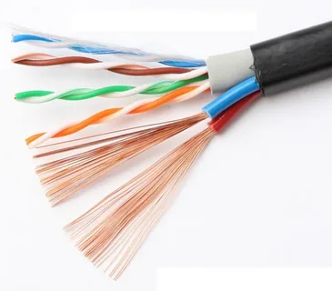

2. Два кабеля объединены общей внешней оболочкой (тип 2 1061С Lucent Technologies, Uninet 1002 2 4P Datwyler). Шланги окрашены по-разному для идентификации.

Большинство спаренных кабелей содержат элементы категории 5; у кабелей AMP середины 90-х один элемент категории 5, второй — категории 3 или 4. Электрические характеристики не отличаются от обычных, но снижается стоимость работ: за один цикл протягиваются сразу два элемента.

Механическая прочность спаренного кабеля на растяжение примерно вдвое выше одиночного, на раздавливание — почти такая же.

В 2001 году появились первые **строенные горизонтальные кабели**. Фиксирующие перемычки могут располагаться со смещением, что позволяет свернуть ленту «в трубку» (рис. 3.1а) и облегчить протяжку.

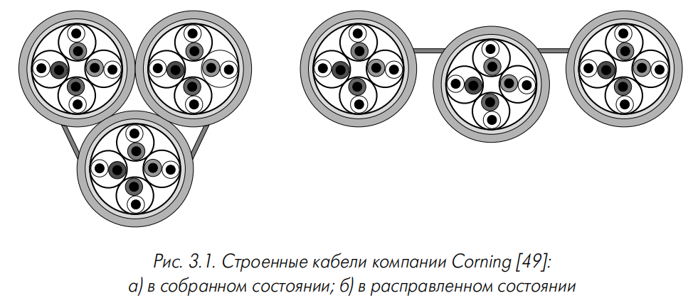

**Рис. 3.1 — Строенные кабели компании Corning [49]:**
- **а)** в собранном состоянии;
- **б)** в расправленном состоянии.

P.S  Если спаренный — это два обычных 4-парных горизонтальных кабеля, сцепленных тонкой перемычкой по оболочке (в стиле zip-cord), то строенный — то же самое, но из трёх кабелей.

Кабели с тремя и более 4-парными элементами под общей оболочкой относятся к многопарным (раздел 3.1.3.1).

#### 3.1.2.2. Материалы проводников

Основные свойства материалов приведены в табл. 3.1. Для изготовления жил используется **электротехническая медь**; другие материалы применяются редко. Недостаточная коррозионная стойкость меди компенсируется изоляцией и контактами.

<mark>Для снижения затухания проводники делают из **монолитной (Solid) медной проволоки**. Витые пары образуют сердечник, покрытый общей оболочкой толщиной **0,5–0,6 мм**.</mark> Для сохранения структуры применяют обмотку полимерными лентами или нитями. Для облегчения разделки добавляют **разрывную нить (rip-cord)**.

По виду скрутки различают **парную** и **четверочную** (рис. 3.2). При четверочной скрутке проводники одной пары располагаются напротив друг друга. Она даёт меньшие габариты, стабильность и лучшие электрические характеристики, но сложнее в производстве и разделке, поэтому в СКС малораспространена (кроме Франции). Её достоинство — меньший радиус изгиба и меньше места в канале.

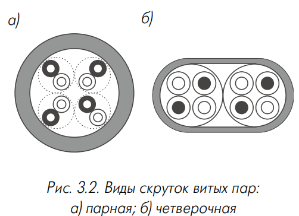

**Рис. 3.2 — Виды скруток витых пар:**
- **а)** парная;
- **б)** четверочная.

Для уменьшения взаимного влияния пар используют различные и некратные шаги скрутки (табл. 3.2). Шаг выбирается так, чтобы:

- сигналы пар минимально влияли друг на друга (максимальное переходное затухание);
- в паре не возникали сильные резонансные явления.

**Таблица 3.1 — Основные свойства материалов жил проводников**

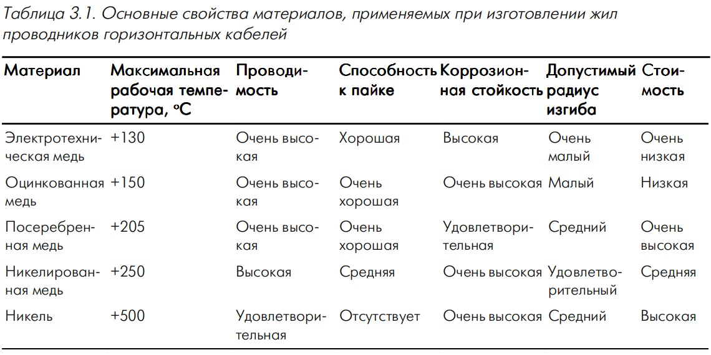

**Таблица 3.2 — Шаги скрутки (мм) витых пар кабелей категории 5 [34]**

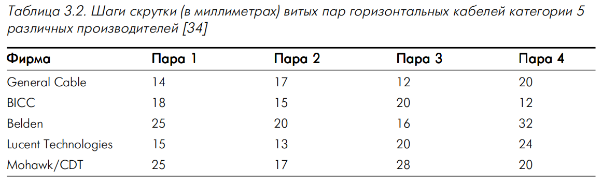

В кабелях с четверочной скруткой пары прилегают плотнее, но электрически развязаны: их плоскости перпендикулярны друг другу.

#### 3.1.2.3. Материалы изоляции проводников

В кабелях категории 3 используется **поливинилхлорид**, в кабелях категории 5 и выше — **полиэтилен** и **полипропилен** (табл. 3.3).

Применяются сплошные (рис. 3.3а) и вспененные материалы; последние дают лучшие электрические характеристики, но дороже и применяются при граничной частоте свыше 100 МГц. Толщина изоляции — около **0,2 мм**.

Коэффициент пористости — не более **0,5**.

> Коэффициент пористости — отношение объёма воздушных включений к общему объёму образца.

Иначе изоляция продавливается проводниками при малом радиусе изгиба, что ведёт к короткому замыканию. Вспененная изоляция часто снабжается верхним слоем обычного материала (**foam skin**, рис. 3.3б). Вспененный материал также снижает диэлектрическую постоянную $\varepsilon$ (табл. 3.3), уменьшая ёмкость пары и улучшая частотные свойства.

Иногда применяется дополнительный внутренний слой сплошной изоляции у жилы (рис. 3.3в) [50]: это почти не ухудшает частотные свойства и улучшает изгибные за счёт увеличения эффективного диаметра проводника.

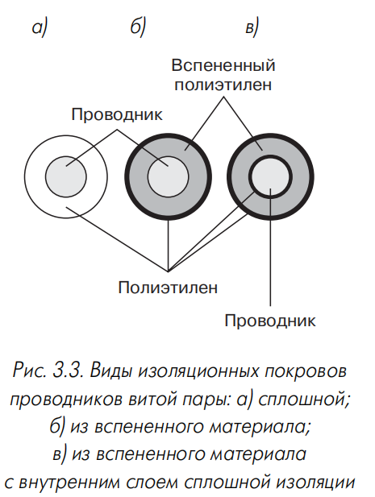

**Рис. 3.3 — Виды изоляционных покровов проводников витой пары:**
- **а)** сплошной;
- **б)** из вспененного материала;
- **в)** из вспененного материала с внутренним слоем сплошной изоляции.

**Таблица 3.3 — Основные изоляционные материалы проводников симметричных кабелей СКС**

| Материал | Сокращение | $\varepsilon$ | Рабочий диапазон температур, °С |
|---|---|---|---|
| Поливинилхлорид | PVC | 4,0–5,0 | –40…+85 |
| Полипропилен | PP | 2,4 | –10…+100 |
| Полиэтилен | PE | 2,3 | –55…+85 |
| Ячеистый полиэтилен | — | 1,2 | –55…+85 |
| Ячеистый полиэтилен с оболочкой | Foam Skin PE | 1,5 | –55…+85 |
| Тефлон | FEP, PTFO, PFA* | 2,0 | –190…+260 |

\* В зависимости от варианта.

#### 3.1.2.4. Внешние оболочки

Для внешней оболочки наряду с поливинилхлоридом применяются не содержащие галогенов компаунды и малодымные полимеры. Переход на негорючие материалы увеличивает цену на **20–30%**, а компаунды без галогенов обладают низкой огнестойкостью (подробнее — глава 9).

Хрупкость оболочки для точного надреза достигается добавлением мела.

Оболочка обычно серая, но бывает синей, фиолетовой, белой, красной. Оранжевая окраска чаще всего означает негорючий материал — кабель можно прокладывать в **plenum-полостях** (глава 9).

> Plenum-полость — пространство между фальшполом и перекрытием или между подвесным потолком и перекрытием для циркуляции воздуха.

Разные цвета оболочек помогают различать кабели функциональных секций, розеток и категорий. Цветовая гамма может меняться даже в небольших партиях; для крупных партий сырьё заказывается нужного цвета.

Для внешней прокладки применяется полиэтиленовая оболочка (влагостойкость выше), которая наносится вторым слоем. Известны изделия Mohawk/CDT с гелевым заполнением (М56871), для воздушной подвески (М57041) и с броней из гофрированной стальной ленты (М57042).

На оболочку наносятся маркирующие надписи: тип кабеля, диаметр и тип проводников, характеристики оболочки, производитель, стандарт, сертифицирующая лаборатория, футовые или метровые метки. Американские производители сертифицируются в **Underwriters Laboratory (UL)**, европейские — в **Delta Electronics Testing** (Дания). Американцы используют футовые метки, европейцы — метровые.

#### 3.1.2.5. Экранирование горизонтальных кабелей

> Экранированный кабель — кабель с дополнительными экранирующими покрытиями пар и/или сердечника.
>
> Неэкранированный кабель — кабель без экранирующих покрытий.

Возможны четыре типа: без экранов, с общим экраном, с экраном каждой пары, с экранированием пар и сердечника одновременно. Экранирование повышает переходное затухание, снижает ЭМИ и повышает помехозащищённость; некоторые экраны добавляют механическую прочность (рис. 3.4, 3.5).

> ЭМИ — электромагнитное излучение.

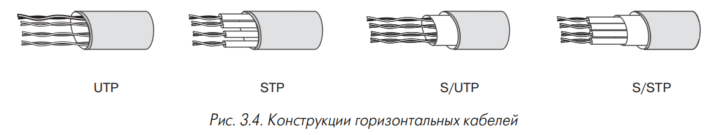

**Рис. 3.4 — Конструкции горизонтальных кабелей:** UTP, STP, S/UTP, S/STP.

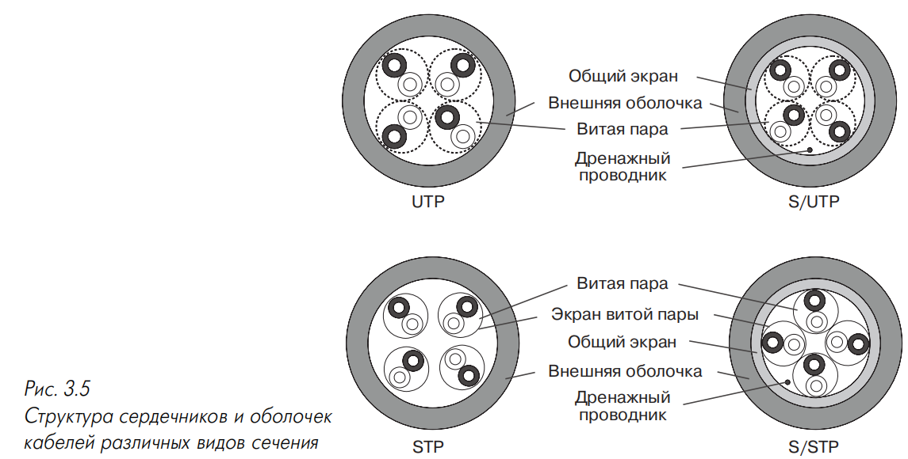

**Рис. 3.5 — Структура сердечников и оболочек кабелей различных видов сечения.**

Для экранирования пар чаще всего применяют металлизированные алюминием полимерные плёнки (толщина металлизации около **50 мкм**), с ориентацией металла внутрь или наружу. Края фольги укладываются с нахлёстом или соединяются продольным швом.

В большинстве конструкций плёночный экран выполняется для каждой пары индивидуально. В 2001 году Draka Multimedia Cable GmbH выпустила кабель для системы Basynet: пары сгруппированы попарно, экран общий для двух пар, но S-образная форма даёт каждой паре индивидуальную экранировку (рис. 3.6). Пары в общей фольге смещены, что делает сердечник плотнее и уменьшает диаметр.

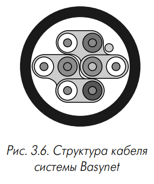

**Рис. 3.6 — Структура кабеля системы Basynet.**

Внешние экраны сердечника — из такой же плёнки или в виде оплётки из оцинкованной медной проволоки. Оплётка часто накладывается на внутреннюю оболочку из тонкой полимерной плёнки (Uninet 1002P Datwyler) [2].

Плёночные экраны сердечника обычно однослойные. Alcatel в GIGATEK использовала двойной плёночный экран с разными направлениями намотки для прочности и гибкости. В плёночный экран вводится **дренажный проводник** диаметром около **0,5 мм**.

> Дренажный проводник — проводник, обеспечивающий электрическую непрерывность экрана при разрывах плёнки.

Некоторые розетки используют дренажный проводник для гальванической связи экранов кабеля и розетки. При двухслойном экране дренажный проводник укладывается между слоями. Плотность оплётки указывается в процентах.

Широко распространены кабели с общим плёночным экраном плюс оплётка — **HIGH Screen**. Оплётка даёт полный круговой контакт с экранирующим кожухом разъёма; плёнка защищает от высокочастотных помех (RFI), оплётка — от низкочастотных (EMI). Дренажный проводник при двухслойном экране излишен, но часто оставляется технологически.

> RFI — радиочастотные помехи.
>
> EMI — электромагнитные помехи.

Далее улучшают характеристики многослойные экраны «плёнка-оплётка-плёнка» или «плёнка-оплётка-плёнка-оплётка» (**Super Screen** [51]).

Общепринятой терминологии нет; производители используют свои обозначения. Плёночный экран часто кодируется буквой **F** (foiled), оплётка — **S**, **Sc** (screen) или **BS** (Braided Screen). Четверочная скрутка обозначается **STQ** (star quad). Обозначения сведены в табл. 3.4.

Кабели **S/UTP** применяются в горизонтальной подсистеме при сильных наводках (производственные цеха) или повышенных требованиях к безопасности. По некоторым данным — до **90%** выпуска экранированных конструкций [52].

**S/STP** лучше STP по защите от помех и ЭМИ, но главное преимущество — более высокое (на **10–15 дБ** и более при правильном монтаже) значение NEXT. Считается, что дуплексную передачу с тактовой частотой свыше **250–300 МГц** на **90 м** можно обеспечить только на S/STP.

> NEXT — переходное затухание на ближнем конце.

STP и S/STP применяют во всех случаях, перечисленных для S/UTP, когда:

- нужны сегменты длиннее 90 м;
- электрических характеристик категории 5 недостаточно;
- нужна повышенная защита от несанкционированного доступа.

Параметры кабелей с индивидуальным экранированием пар могут существенно превосходить категорию 5 (особенно NEXT и ACR). Однако официальных стандартов на увеличенные длины сегментов и на такие сети пока нет.

> ACR — отношение сигнал/помеха на ближнем конце.

Преимущества UTP перед экранированными:

- меньшая стоимость;
- меньшая трудоёмкость монтажа и эксплуатации;
- нет повышенных требований к заземляющему контуру здания;
- лучшие массогабаритные показатели;
- меньший радиус изгиба.

Преимущества экранированных: лучшая защита от наводок, повышенная механическая прочность (оплёточные экраны), лучшая защита от несанкционированного доступа. Высокая теплопроводность металлических элементов обеспечивает отвод тепла, поэтому некоторые производители гарантируют меньшее затухание.

**Таблица 3.4 — Виды конструкций горизонтального кабеля**

| Обозначение | | Экран | Цель экранирования |
|---|---|---|---|
| основное | альтернативное | | |
| UTP | – | Отсутствует | – |
| STP | PiMF, PMF | Индивидуальный плёночный экран каждой пары | Снижение ЭМИ; защита от помех; переходное затухание |
| S/UTP | ScTP, FTP | Общий экран для всех пар | Снижение ЭМИ; защита от помех |
| S/STP | STP, S2STP | Экран каждой пары + внешний экран | Снижение ЭМИ; защита от помех; переходное затухание; механическая прочность |

Экранированные конструкции также снижают экологические нагрузки при высокой концентрации оборудования [53], но корректное обсуждение пока невозможно из-за отсутствия общепризнанных медицинских норм на высокочастотное ЭМИ. Сравнение параметров — в табл. 3.5.

**Таблица 3.5 — Типовые механические характеристики горизонтальных 4-парных кабелей**

| Тип кабеля | UTP Кат. 5 | STP Кат. 6 | S/UTP Пленочный экран | S/UTP Комбинированный экран | S/STP | |
|---|---|---|---|---|---|---|
| Масса, кг/км | 30–33 | 34–37 | 42 | 49 | 65–85 | 82–88 |
| Внешний диаметр, мм | 4,9 | 5,2 | 5,4 | 6,2 | 7,6 | 8,0 |
| Рабочий диапазон температур, °С | –20…+60–70 | | | | | |
| Радиус изгиба, мм | 30–35 | 35–40 | 40–45 | | | |

#### 3.1.2.6. Электрические характеристики

Основные нормируемые параметры горизонтального кабеля:

- затухание;
- переходное затухание или NEXT;
- волновое сопротивление;
- сопротивление постоянному току;
- NVP.

> NVP — Nominal Velocity of Propagation, номинальная скорость распространения сигнала.

В следующих редакциях стандартов список расширится (табл. 1.9).

Требования TIA/EIA-568-A к максимальному затуханию пар кабелей категорий 3, 4 и 5 на длине 100 м при 20 °C — в табл. 3.6. Значения получены по формуле 2.8 с округлением до первого десятичного знака. Кабели часто поставляются отрезками по 1000 футов (305 м); для входного контроля в таблице приведены значения и для 305 м (по TIA/EIA TSB-36). ISO/IEC 11801 (2000) даёт практически те же значения с отступлением на 0,1–0,2 дБ на некоторых частотах.

**Таблица 3.6 — Максимально допустимое затухание для горизонтальных кабелей категорий 3, 4 и 5 при 20 °C по TIA/EIA-568-A**

| Частота, МГц | Затухание, дБ | | | | | |
|---|---|---|---|---|---|---|
| | Кат. 3, 100 м | Кат. 3, 305 м | Кат. 4, 100 м | Кат. 4, 305 м | Кат. 5, 100 м | Кат. 5, 305 м |
| 0,772 | 2,2 | 6,8 | 1,9 | 5,7 | 1,8 | 5,5 |
| 1,00 | 2,6 | 7,8 | 2,2 | 6,5 | 2,0 | 6,3 |
| 4,00 | 5,6 | 17 | 4,3 | 13 | 4,1 | 13 |
| 10,00 | 9,7 | 30 | 6,9 | 22 | 6,5 | 20 |
| 16,00 | 13,1 | 40 | 8,9 | 27 | 8,2 | 25 |
| 20,00 | – | – | 10,0 | 31 | 9,3 | 28 |
| 31,25 | – | – | – | – | 11,7 | 36 |
| 62,50 | – | – | – | – | 17,0 | 52 |
| 100,00 | – | – | – | – | 22,0 | 67 |

При температуре выше 20 °C значения для категорий 4 и 5 увеличиваются на **0,4%** на градус превышения, для категории 3 — на **1,5%**.

Требования к минимальному NEXT — в табл. 3.7. Из-за слабой зависимости NEXT от длины для сегментов до 305 м можно пользоваться теми же значениями.

**Таблица 3.7 — Минимальное значение NEXT для горизонтальных кабелей категорий 3, 4 и 5**

| Частота, МГц | NEXT, дБ | | |
|---|---|---|---|
| | Кат. 3 | Кат. 4 | Кат. 5 |
| 0,772 | 43 | 58 | 64 |
| 1,00 | 41 | 56 | 62 |
| 4,00 | 32 | 47 | 53 |
| 10,00 | 26 | 41 | 47 |
| 16,00 | 23 | 38 | 44 |
| 20,00 | – | 36 | 42 |
| 31,25 | – | – | 40 |
| 62,50 | – | – | 35 |
| 100,00 | – | – | 32 |

ISO/IEC 11801 задаёт близкие к TIA/EIA-568-A значения затухания и NEXT, но в диапазоне 20–100 МГц даёт альтернативу через параметр ACR (свобода выбора производителю: лучше затухание при чуть худшем NEXT). В редакции 2000 года это положение снято — расчётные и нормативные ACR совпадают.

Требования к NVP — в табл. 2.2. Значения SRL — в табл. 2.3; ISO/IEC 11801 близок к американскому аналогу. Частота $f$ — в мегагерцах.

> SRL — Structural Return Loss, структурные возвратные потери.

Остальные электрические характеристики (табл. 3.8) одинаковы для категорий 3, 4 и 5.

**Таблица 3.8 — Требования к остальным электрическим характеристикам витых пар**

| Параметр | ISO/IEC 11801 | TIA/EIA-568-A |
|---|---|---|
| Волновое сопротивление на частотах менее 1 МГц | 75÷150 Ом | – |
| Волновое сопротивление на частотах более 1 МГц | $100 \pm 15$ Ом ($100 \pm 15\%$) | – |
| Макс. сопротивление постоянному току короткозамкнутой пары 100 м при 20 °C | 19,2 Ом | – |
| Макс. сопротивление проводника 100 м постоянному току | – | 9,38 Ом |
| Несимметрия сопротивлений проводников пары | 3% | 5% |
| Макс. ёмкость дисбаланса пары на землю (100 м, 1 кГц, 20 °C) | 340 пФ | 330 пФ |
| Мин. сопротивление изоляции проводник-проводник или проводник-экран | 150 МОм·км | – |
| Пробивная стойкость изоляции по постоянному напряжению | 1 кВ, 1 мин или 2,5 кВ, 2 с | – |
| Пробивная стойкость изоляции по переменному напряжению | 0,7 кВ, 1 мин или 1,7 кВ, 2 с | – |
| Параметр skew, нс | 45 | – |

#### 3.1.2.7. Механические характеристики

Механические характеристики зависят от материалов оболочки и изоляции и от внешнего диаметра (табл. 3.9). Первые три параметра определяют геометрию; их несоблюдение ведёт к несовместимости с модульными разъёмами и IDC-контактами.

> IDC — Insulation Displacement Contact, контакт со смещением изоляции.

Рекомендуется диаметр проводников не менее **0,5 мм** для нормальной установки современных разъёмов.

Внешний диаметр важен при расчёте ёмкости каналов, закладных и стояков, а также связан с минимальным радиусом изгиба. Более тонкие кабели предпочтительнее при прокладке.

**Таблица 3.9 — Требования к механическим характеристикам горизонтальных кабелей**

| Параметр | ISO/IEC 11801 | TIA/EIA-568-A |
|---|---|---|
| Диаметр проводников | 0,4–0,65 мм | 0,5–0,65 мм (24 или 22 AWG*) |
| Диаметр изоляции проводников | <1,4 мм | <1,22 мм |
| Внешний диаметр кабеля | <6,35 мм | <6,35 мм |
| Температурный диапазон без ухудшения механических свойств | монтаж: 0…+50 °С; эксплуатация: –20…+60 °С | – |
| Минимальный радиус изгиба: прокладка / эксплуатация | <8 / <4 внешних диаметров | – |
| Допустимое усилие на растяжение при монтаже | <50 Н/мм² | <400 Н |

\* Перевод AWG в мм — табл. П1.4.

Минимальный радиус изгиба определяет условия прокладки: производители указывают два значения — при прокладке и после неё. При протяжке за конец на малом радиусе кабель может повредиться или лопнуть; после прокладки резкие повороты ухудшают электрические характеристики. Радиус при прокладке может вдвое превышать радиус после неё. Кабели с меньшим допустимым радиусом предпочтительнее для поворотов трасс.

Максимальное усилие на растяжение: превышение ведёт к разрывам оболочки и нарушениям скрутки. Для кабелей внутренней прокладки производители не всегда указывают усилие — значит, кабель выдерживает ручную прокладку.

Рабочий температурный диапазон — от **–20 до +60 °С**; ISO/IEC 11801 допускает до **–30 °С** для холодного климата. Прокладка большинства конструкций — только при температурах выше **0 °С**.

#### 3.1.2.8. Кабели с волновым сопротивлением 120 Ом

Кабели 120 Ом допускаются ISO/IEC 11801 и EN 50173 как альтернатива 100-омным (основным). Популярны во Франции и некоторых странах Европы.

Две причины использования:

1. При тех же абсолютных разбросах $Z_в$ большее номинальное значение даёт меньшие структурные возвратные потери — проще построить линии с частотой свыше 100 Мбит/с.
2. Умеренное увеличение волнового сопротивления снижает затухание без заметного роста габаритов (рис. 3.7) [54].

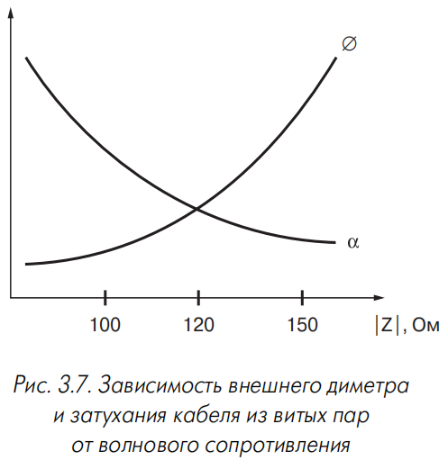

**Рис. 3.7 — Зависимость внешнего диаметра и затухания кабеля из витых пар от волнового сопротивления.**

Это следует из соотношения:

$$\alpha \sim \frac{R}{2|Z_в|}$$

где $R$ — активное погонное сопротивление кабеля.

Волновое сопротивление и внешний диаметр примерно пропорциональны расстоянию между проводниками пары. ISO/IEC 11801 нормирует затухание отдельно для 100- и 120-омных кабелей, ужесточая нормы для вторых (рис. 3.8). Меньшее затухание улучшает ACR (переходное затухание одинаково), увеличивая пропускную способность. Многие СКС на 120-омных кабелях (Alcatel, Legrand, Infra+) обеспечивают более широкую полосу, чем стандартные тракты категории 5.

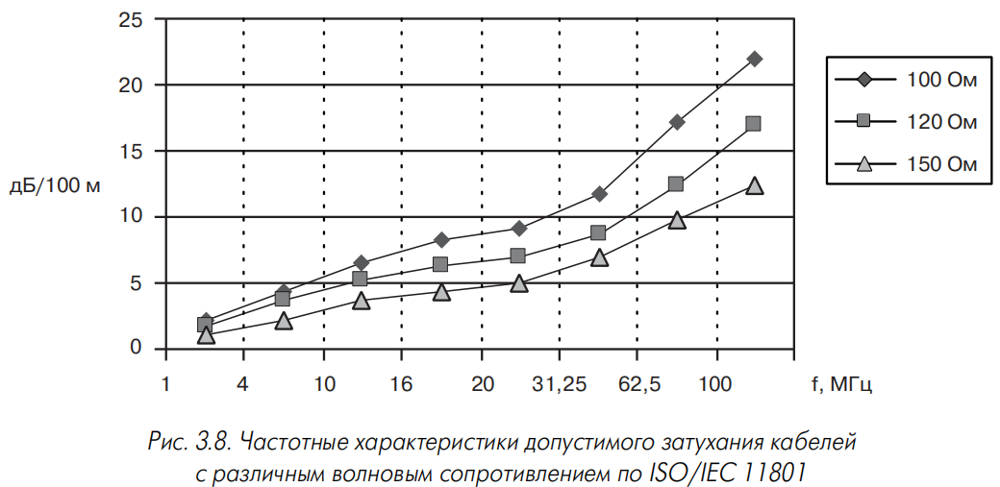

**Рис. 3.8 — Частотные характеристики допустимого затухания кабелей с различным волновым сопротивлением по ISO/IEC 11801.**

#### 3.1.2.9. Упаковка горизонтальных кабелей

Два вида упаковки: картонные коробки и катушки.

<mark>В коробке обычно **305 м**</mark> (1000 футов) на внутренней бобине (**reel-in-box**, рис. 3.9б) или в виде самонесущей обмотки (**pull-box**, **reel free**, рис. 3.9в). Внешний конец выводится через щель или втулку, которая задаёт направление и защищает оболочку. На коробку наносится информация о производителе, типе кабеля и метке длины; иногда — логотип СКС.

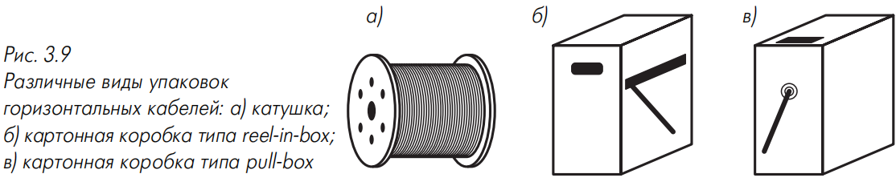

**Рис. 3.9 — Виды упаковок горизонтальных кабелей:**
- **а)** катушка;
- **б)** картонная коробка типа reel-in-box;
- **в)** картонная коробка типа pull-box.

Реже встречается другая длина: Brand-Rex и RiT Technologies — 500 м; для SOHO (Molex, Micronet) — 100–120 м. Коробочная поставка популярна у монтажников: удобна при хранении, транспортировке и размотке без приспособлений. В коробке есть отверстие-ручка; крышка без дополнительных фиксаторов — лёгкий доступ к катушке. У некоторых поставщиков есть отрывной клапан для доступа ко второму концу кабеля.

Компания AESP пакует коробки попарно в дополнительную упаковку и помещает бобину на оси в две квадратные пластмассовые боковины — можно разматывать без коробки.

Фиксация конца обмотки: либо фиксирующая лапка, либо пустотелая пластмассовая пробка-колпачок.

До **4%** кабелей поставляется в **short length-коробках** (100- и 200-метровых; фактически от 100 до 199 м и от 200 до 304 м). Цена установлена на уровне 100 и 200 м для стимулирования покупки.

<mark>Катушки — стандартно **500 и 1000 м**</mark> (ITT NS&S — 2500 футов, 763 м; Lucent Technologies — 1200 и 1500 м для типа 1071). Масса 1000-метровой катушки — от **50 кг**, что неудобно на объекте. Преимущество — меньше отходов; недостатки — неудобство транспортировки и хранения, сложности размотки.

Катушки из пластмассы, дерева или фанеры (рис. 3.9а). Пластиковые барабаны делают из полипропилена (без галогенов, безопасен при утилизации).

#### 3.1.2.10. Производство горизонтального кабеля

Производство высокотехнологичное и автоматизированное: персонал только заряжает станки, снимает продукцию, контролирует параметры и переналаживает. Процесс разбит на этапы для быстрого перехода между типами кабеля и контроля качества.

Основные операции:

- нанесение диэлектрической оболочки на медную проволоку (скорость **20–40 м/мин**);
- скрутка витой пары на отдельном станке со своим шагом; возможен индивидуальный экран (PiMF);
- формирование сердечника из четырёх пар; при необходимости — плёночный экран с дренажным проводником;
- нанесение экранирующей оплётки для S/STP на отдельном моточном станке (в HIGHT Screen оплётка наносится на плёночный экран);
- формирование внешней оболочки экструдером с маркировкой и проверкой пробивной стойкости; охлаждение в водяных ваннах с понижающейся температурой; станок самый габаритный;
- резка на 305-метровые отрезки с обмоткой или намоткой на катушку и укладкой в коробку;
- выборочная или сплошная проверка NEXT и затухания.

Из-за невысокой производительности изготовление ведётся непрерывно и круглосуточно с остановками на профилактику и переналадку. Контроль — автоматикой и визуально оператором.

---

### 3.1.3. Многопарный кабель

#### 3.1.3.1. Конструктивные особенности

> Многопарный кабель — <mark>кабель, содержащий более четырёх витых пар и предназначенный в основном для магистральных подсистем СКС.</mark>

<mark>Применяется в магистральных подсистемах для связи кроссовых; во внешних магистралях прокладывается горизонтально, во внутренних — вертикально.</mark> Ограниченно используется в горизонтальной подсистеме (кроссовая — точка перехода, консолидационная точка или 12-портовая розетка).

Признак многопарного кабеля — **более четырёх витых пар** и отсутствие индивидуальных оболочек для отдельных пар или четвёрок.

Некоторые фирмы предлагают **многоэлементные (multi unit) кабели**: сердечник образуют не отдельные пары, а 2- или 4-парные элементы с индивидуальной защитной оболочкой, аналогичные горизонтальному кабелю.

Конструкция зависит от ёмкости: до **25 пар** — без дополнительных элементов (рис. 3.10а); свыше **25 пар** — пучки по 25 пар (рис. 3.10в), скреплённые полиэтиленовыми ленточками. Для прочности может применяться центральный стеклопластиковый пруток. Снаружи — общая диэлектрическая оболочка. Выпускаются также S/UTP-конструкции с экраном под оболочкой.

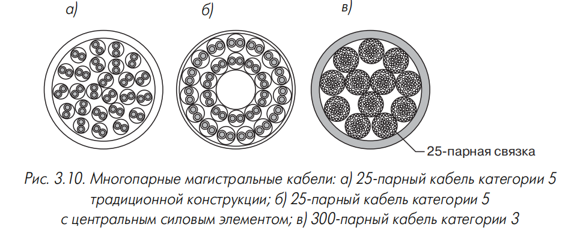

**Рис. 3.10 — Многопарные магистральные кабели:**
- **а)** 25-парный кабель категории 5 традиционной конструкции;
- **б)** 25-парный кабель категории 5 с центральным силовым элементом;
- **в)** 300-парный кабель категории 3.

Кабели категории 5 первого поколения имели нерегулярную структуру; упорядоченность давали связки из пяти пар цветными нитками. С конца 90-х растёт популярность регулярной структуры с центральным силовым элементом (рис. 3.10б).

Маркировка аналогична горизонтальным кабелям: тип, диаметр и количество проводников, тестирующая лаборатория, метки длины.

Проводники — монолитная медная проволока, категории от 3 до 5 (категория 4 встречается редко). Типовые ёмкости — в табл. 3.10. В системе ISCS компании ITT NS&S нет панелей типа 110, поэтому кабели имеют ёмкость 24, 48 и 96 пар. Многоэлементные кабели обычно меньшей ёмкости: до 24 двухпарных и до 16 четырёхпарных элементов.

**Таблица 3.10 — Типовые ёмкости магистральных кабелей**

| Категория кабеля | Количество пар |
|---|---|
| 3 | 25, 50, 75, 100, 200, 300, 600, 900, 1800 |
| 5 | 25, 50, 100 |

Погонная масса 25-парного кабеля категории 5 — **180–190 кг/км**, рабочий диапазон температур — **–20…+60 °С**.

Кабели делятся на внутренней и внешней прокладки. Для внешней прокладки сердечник защищают от влаги: полиэтиленовая оболочка, гелевое заполнение (с конца 90-х — и в СКС), броня из алюминиевой или стальной гофрированной ленты (ARMM, ANMW Lucent Technologies). Но в большинстве производятся кабели внутренней прокладки; многопарные кабели внешней прокладки категории 3, а тем более 5, не получили широкого распространения.

#### 3.1.3.2. Электрические характеристики

Требования в целом соответствуют горизонтальным кабелям. Важно: мощность наводок от соседних пар на ближнем конце в многопарном окружении может быть выше (наводки суммируются). Поэтому велика доля конструкций, сертифицированных по критерию суммарной мощности (**Power Sum**).

> Power Sum — суммарная мощность наводок от нескольких пар.

Если многопарный кабель используется в горизонтальной подсистеме для подключения пучком к нескольким розеточным модулям, требования к NEXT ужесточаются. По ISO/IEC 11801:

$$\Delta NEXT = 6 + 10\lg(n+1), \text{ дБ} \tag{3.1}$$

где $n$ — количество смежных кабельных элементов (пар, четвёрок) в пучке.

Разница мощностей сигналов приложений в одном пучке — не более **6 дБ** (поправочный коэффициент в формуле 3.1). Приложения с большей разностью передавать в одном пучке нельзя.

Наибольший вклад в наводки дают ближайшие пары; пары из других пучков почти не влияют. Поэтому высокоскоростные приложения рекомендуется разносить по разным пучкам; в многоэлементных конструкциях это происходит автоматически.

Многопарный кабель чаще прокладывается рядом с силовыми цепями, поэтому TIE/EIA-568-A требует повышенной пробивной стойкости диэлектрика: **3 с при постоянном напряжении 5 кВт**.

Условия тестирования и приборы — те же, что для горизонтальных кабелей.

#### 3.1.3.3. Механические характеристики

Требования — в табл. 3.11. Первые два параметра определяют геометрию проводов; их несоблюдение ведёт к несовместимости с IDC-разъёмами кроссовых.

**Таблица 3.11 — Требования к механическим характеристикам многопарных кабелей**

| Параметр | Значение |
|---|---|
| Диаметр проводников | 0,5÷0,65 мм (24–22 AWG*) |
| Диаметр изоляции проводников | ≤1,22 мм |
| Температурный диапазон без ухудшения механических свойств | монтаж: 0…+50 °C; эксплуатация: –20…+60 °C |
| Минимальный радиус изгиба: прокладка / эксплуатация | ≤8 / ≤6 внешних диаметров |

\* Перевод AWG в мм — табл. П1.4.

Внешний диаметр достигает **20 мм** и более. Максимальное усилие на растяжение значительно, растёт с диаметром (дополнительные опорные и упрочняющие элементы) и указывается производителем.

С уменьшением радиуса изгиба нагрузки на элементы растут; кратковременные нагрузки менее вредны, чем постоянные. Из-за плохо контролируемых динамических нагрузок при прокладке радиус изгиба при эксплуатации допускается меньшим, чем при прокладке (табл. 3.11).

---

### 3.1.4. Другие электрические кабельные изделия СКС

#### 3.1.4.1. Кабель для шнуров

> Кабель для шнуров (гибкий кабель) — <mark>кабель для изготовления коммутационных и оконечных шнуров.<mark>

Обычно содержит четыре витые пары и <mark>похож на горизонтальный кабель. Отличия:</mark>

- проводники — <mark>семь тонких перевитых медных проволок</mark> диаметром **0,15–0,25 мм** (30–34 AWG), **Stranded** («многопроволочная конструкция»);
- <mark>изоляция проводника толще</mark> (около **0,25 мм**);
- <mark>внешняя оболочка из более гибкого материала.</mark>

Электрические характеристики почти совпадают с горизонтальным кабелем, кроме затухания (принципиально выше из-за жилы). TIE/EIA-568-A допускает превышение погонного затухания на **20%**, ISO/IEC 11801 — на **50%** (табл. 3.12). Поэтому используют понятия электрической и механической длины:

$$\text{электрическая длина} = (1 + \Delta\alpha) \cdot \text{механическая длина} \tag{3.2}$$

где $\Delta\alpha$ — максимальное относительное приращение погонного затухания (табл. 3.13).

**Таблица 3.12 — Максимально допустимое затухание кабелей для шнуров категорий 3, 4 и 5 при 20 °C по TIE/EIA-568-A и ISO/IEC 11801**

| Частота, МГц | Затухание, дБ/100 м | | | | | |
|---|---|---|---|---|---|---|
| | кат. 3 | кат. 3 | кат. 4 | кат. 4 | кат. 5 | кат. 5 |
| 0,772 | 2,7 | 3,3 | 2,3 | 2,9 | 2,2 | 2,7 |
| 1,00 | 3,1 | 3,9 | 2,6 | 3,3 | 2,4 | 3,0 |
| 4,00 | 6,7 | 8,4 | 5,2 | 6,5 | 4,9 | 6,2 |
| 10,00 | 11,7 | 14,6 | 8,3 | 10,4 | 7,8 | 9,8 |
| 16,00 | 15,7 | 19,7 | 10,7 | 13,4 | 9,9 | 12,3 |
| 20,00 | – | – | 12,0 | 15,0 | 11,1 | 14,0 |
| 31,25 | – | – | – | – | 14,1 | 17,8 |
| 62,50 | – | – | – | – | 20,4 | 25,5 |
| 100,00 | – | – | – | – | 26,4 | 33,0 |

**Таблица 3.13 — Взаимосвязь между электрической и механической длиной**

| Механическая длина | Электрическая длина | |
|---|---|---|
| | TIA/EIA-568-A | ISO/IEC 11801 |
| 1 | 1,2 | 1,5 |

Длина шнура редко превышает **10 м**, но затухание нормируется на **100 м** для унификации с горизонтальными кабелями.

Кабели для шнуров делятся на категории; на середину 2000 года выпускаются категории 5, 5е и 6. Принципиальных конструктивных отличий от горизонтальных кабелей нет. Центральный сепаратор для категории 6 менее популярен из-за снижения гибкости.

Механические характеристики почти совпадают с горизонтальным кабелем, но минимальный радиус изгиба уменьшен до **20–25 мм**. Оптимальный диаметр изоляции проводников для вилки 8-контактного модульного разъёма — **0,8–1 мм**.

Кабели для шнуров испытывают большие и частые изгибные и тянущие усилия, поэтому имеют более широкий температурный диапазон. Например, R322900 RiT Technologies: рабочий **–20…+60 °C** (хранение –30…+70 °C); горизонтальный R3729070: рабочий **–5…+50 °C** (хранение –20…+60 °C).

Выпускаются экранированные (S/UTP и S/STP) и неэкранированные варианты. Цветовая маркировка должна соответствовать горизонтальному кабелю (у американских производителей бывают другие варианты). Маркировка на оболочке — как у горизонтальных кабелей.

Иногда под оболочкой есть дополнительные элементы. В шнурах системы PatchView (RiT Technologies) — девятый проводник **0,4 мм** (26 AWG) по оси кабеля для сигналов кабельного сканера. В шнурах PatchSee (Франция) — два полимерных световода для поиска второго конца.

Шнуры используются в кроссовых и рабочих помещениях, не относящихся к plenum-полостям, поэтому изначально не требовали негорючей и малодымной оболочки. С конца 90-х, с ростом числа портов, многие производители стали предлагать кабели для шнуров с оболочкой, отвечающей требованиям пожарной безопасности.

#### 3.1.4.2. Провод для перемычек

> Провод для перемычек (кроссировочный провод) — <mark>провод, обычно одна неэкранированная витая пара категории 3 без внешней защитной оболочки.</mark>

Проводники — монолитная медная проволока **0,51 мм** с изоляцией из поливинилхлорида. По TIA/EIA-568-A один провод белый, второй — чаще синий или красный. Назначение — коммутационные панели типа 66 с контактами IDC 66; иногда панели типа 110. Стандартная упаковка 2-парного провода — **305 м** (1000 футов) или **201 м** (660 футов) на катушке диаметром около **15 см**.

Существуют двух-, трёх- и четырёхпарные варианты (скрутка витых пар друг с другом). Некоторые производители выпускают провод с 2, 3 и 4 парами в общей оболочке — фактически горизонтальный кабель. Такая оболочка сохраняет структуру витков между контактами панели, поэтому перемычка может обеспечивать характеристики категории 4 и даже 5.

Цветовая кодировка многопарных проводов соответствует горизонтальному кабелю.

#### 3.1.4.3. Кабель для прокладки под ковром

> <mark>Кабель для прокладки под ковром (under carpet cable) — кабель плоской конструкции для напольной прокладки без дополнительных защитных средств.</mark>

Обычно кабели прокладываются в коробах под фальшполом и за фальшпотолком. Если это невозможно, остаётся прокладка по полу — через подпольные каналы, напольные короба или специальные кабели. Подпольные каналы — строительное решение (раздел 10.2), напольные короба — раздел 5.2. Здесь — только специальные кабели для напольного монтажа.

Характерная черта — **плоская конструкция** для распределения давления. Боковые «крылья» трапециевидной формы примыкают большим основанием к оболочке (рис. 3.11); их максимальная толщина равна внешнему диаметру кабеля. Это облегчает крепление скобками или липкой лентой и устраняет закручивание при прокладке.

**Рис. 3.11 — Кабель для прокладки под ковром.**

Общие правила — как для обычных горизонтальных кабелей. По TIA/EIA-568-A запрещается: использовать во влажных помещениях, подвергать воздействию агрессивных жидкостей, прокладывать параллельно силовой проводке ближе **152 мм** (6 дюймов). При пересечении с силовым проводом информационный кабель должен проходить сверху.

Кабели могут быть категории 3 и 5 (табл. 3.14).

**Таблица 3.14 — Кабели СКС для прокладки под ковром**

| Фирма-изготовитель | Наименование | Категория | Упаковка, м |
|---|---|---|---|
| Hubbell | DCTP04200 | 3 | 61 |
| AMP | 557874-1 | 3 | 76,2 |
| AMP | 555318-1 | 5 | 76,2 |
| PCnet | 65504-98 | 5 | 61 |
| PCnet | 65304-98 | 3 | 61 |

Из-за малой длины трасс упаковка короче — обычно **200–250 футов (61–76 м)**.

#### 3.1.4.4. Горизонтальные кабели с граничной частотой свыше 100 МГц

Выпускаются серийные горизонтальные кабели с характеристиками выше категории 5. Общие черты неэкранированных конструкций:

- ACR порядка **10 дБ** на частотах **150–200 МГц** и более (соответствует категории 6 с запасом);
- рост ACR в основном за счёт NEXT (на **10 дБ** и более), частично — за счёт снижения затухания;
- нормировка до **350–550 МГц** для однонаправленных приложений (многоканальное эфирное и кабельное телевидение). Деление на два подкласса: **350** и **550–600 МГц**. Младший подкласс — улучшенные NEXT и PS-NEXT; высокочастотные — ещё и меньшее затухание. Кабели **300–350 МГц** — для трактов категории 5е, **550–600 МГц** — для категории 6.

Сводка типов UTP с улучшенными характеристиками — в табл. 3.15.

Для снижения затухания диаметр жилы увеличивают до **0,55–0,6 мм** (против **0,51–0,53 мм** у категории 5) и применяют изоляцию с малыми потерями (вспененные материалы). Отсюда большие масса и диаметр (табл. 3.5).

Рост NEXT ведётся в двух направлениях (рис. 3.12). Первое — сохранение структуры сердечника за счёт силовой основы: центральный пластиковый пруток (Belden 1711А) или полиэтиленовый сепаратор **С3 (Central Crosstalk Cancellation)** в форме четырёхлучевой звезды (рис. 3.13). Первые такие кабели появились в 1998 году; с 2000 года популярность быстро растёт (LANMark Alkatel, 7812A Belden, серия 81 Lucent Technologies, R3729ХХХ RIT Technologies).

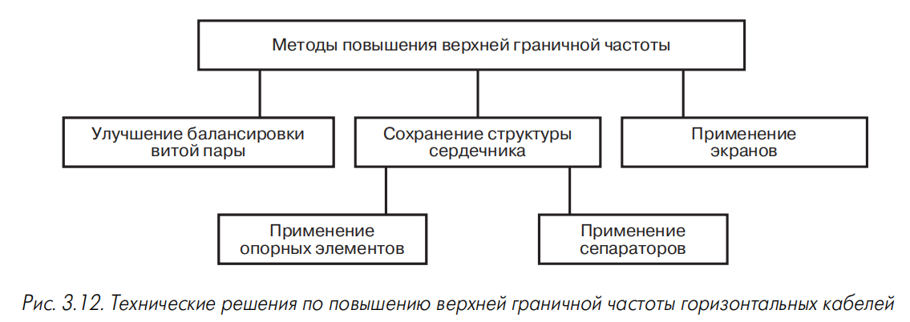

**Рис. 3.12 — Технические решения по повышению верхней граничной частоты горизонтальных кабелей.**

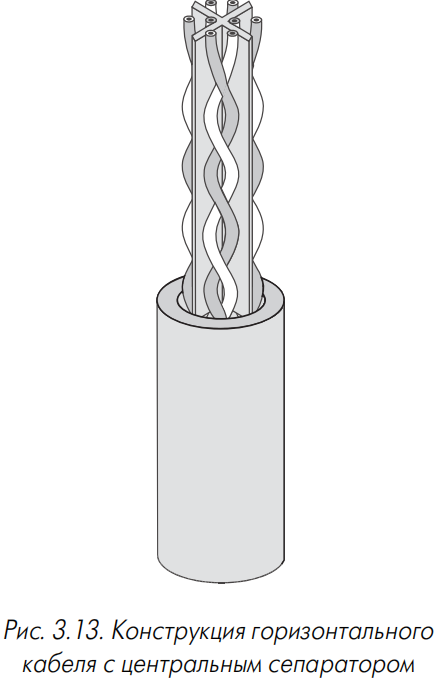

**Рис. 3.13 — Конструкция горизонтального кабеля с центральным сепаратором.**

В конструкции с сепаратором каждая пара укладывается в индивидуальный паз, что увеличивает NEXT и ACR (см. LANMark в табл. 3.15).

**Таблица 3.15 — Горизонтальные кабели UTP с граничной частотой свыше 100 МГц**

| Фирма-изготовитель | Тип | $f_{гр}$ по ACR=10 дБ, МГц* | $f_в$, МГц | Затухание на $f_в$, дБ/100 м | SRL на $f_в$, дБ | Источник |
|---|---|---|---|---|---|---|
| **Подкласс 350 МГц** | | | | | | |
| Alcatel | LANMark | 210 | 350 | 37,6 | 13,1 | [55] |
| AMP | FUTURELAN 350 | 140 | 350 | 44,9 | 16 | [56] |
| Belden | 1700A | 160 | 350 | 37,7 | 30 | [57] |
| Mohawk/CDT | MegaLAN 400 | 160 | 400 | 48,5 | 12 | [32] |
| Pirelli | DX1100-3 | 175 | 200 | 37 | – | [58] |
| BICC Brand-Rex | TurboLAN 350 | 150 | 350 | 41,2 | – | [59] |
| NK Cables | UC 400 24 4P | 240 | 400 | 45 | – | [60] |
| Elgadphon | Giga-Star | 200 | 250 | 33 | 17,3 | [61] |
| PCnet | Category 5plus | 100 | 350 | 44,3 | – | [62] |
| **Подкласс 550–600 МГц** | | | | | | |
| Lucent Technologies | 1071, 2071, 3071 | 180 | 550 | 55,3 | 15,9 | [63] |
| Mohawk/CDT | AdvanceNet 500 | 180 | 550 | 53,7 | 17,8 | [32] |
| RIT Technologies | Giga UTP | 185 | 600 | 55 | – | [64] |
| Belden | 1872A | 165 | 550 | 55,3 | 16 | [65] |
| BICC Brand-Rex | TurboLAN 1000 | 390 | 550 | 52 | 13 | [59] |

\* Значения $f_{гр}$ получены расчётным путём по характеристикам затухания и переходного затухания из материалов фирм.

Сепаратор обычно отдельная деталь; иногда формируется головкой экструдера и механически скреплён с оболочкой.

Второе направление — высокая точность балансировки пар (шага скрутки). Lucent Technologies и NEK/CDT тщательно контролируют шаг свивки и несколько уменьшают его; NEK/CDT дополнительно скручивает пары в сердечнике. Belden применяет склейку проводников пары — высокая стойкость к малым изгибам, но сложнее разделка. Без центрального силового элемента такие кабели часто поставляются на катушках.

PS-NEXT улучшается за счёт разноса пар: отказ от круглой оболочки в пользу овальной — **плоский кабель** (рис. 3.14), например MediaTwist Belden и 9С6R4 Siemon [30].

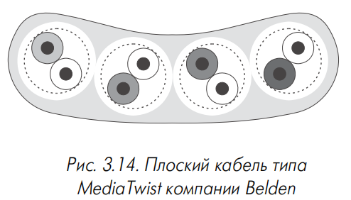

**Рис. 3.14 — Плоский кабель типа MediaTwist компании Belden.**

SRL минимизируются ужесточением допусков на диаметр жилы и эксцентриситет жилы и оболочки (до **±1%** против **±3%** для категории 5).

По мнению специалистов, частоты свыше **400–500 МГц** по критерию ACR = 10 дБ при современном уровне техники достижимы только на экранированных конструкциях.

S/STP существенно повышают граничную частоту: серийные кабели нормируются до **1,0** и даже **1,4 ГГц**. Их делят на категорию 7 (**600 МГц**) и кабели мультимедиа. Применение: приложения класса F, системы SOHO, системы категории 8 (обсуждаются в комитетах по стандартизации на середину 2001 года) [65]. Граничная частота свыше **900 МГц** перспективна для абонентской разводки кабельного ТВ с верхней частотой спектра **862 МГц** (Европа), **855 МГц** (США), **765 МГц** (Япония) [66].

Массовое применение сдерживают:

- отсутствие официальных стандартов на частоты свыше 100 МГц;
- отсутствие распространённых высокочастотных разъёмов высокого качества.

Рост стоимости: около **30%** для UTP с граничной частотой 350 МГц на этапе налаживания; на середину 2000 года — превышение над категорией 5 на **10–15%**.

Рост выпуска младшего подкласса — с конца 1999 года после перехода ведущих производителей на категорию 5е.

#### 3.1.4.5. Комбинированные конструкции кабелей для горизонтальной подсистемы СКС

> <mark>Комбинированный (композитный, гибридный) кабель — кабель, содержащий несколько типов кабельных элементов: оптические волокна, витую пару, коаксиальную трубку и другие.</mark>

Применяются конструкции с волоконными световодами и витой парой: в некоторых системах розетка имеет один оптический и один электрический порт. Преимущества — меньшие габариты и затраты на прокладку по сравнению с отдельными кабелями.

Первые серийные комбинированные конструкции появились у американских компаний: к середине 90-х — кабели с 4-парным UTP, элементом типа 1 ИБМ и 2- или 4-волоконным оптическим кабелем (**dual-** и **tri-media-кабели**). Элементы могли иметь общую оболочку или индивидуальные с креплением перемычками (рис. 3.15). До конца 90-х широкого распространения не имели.

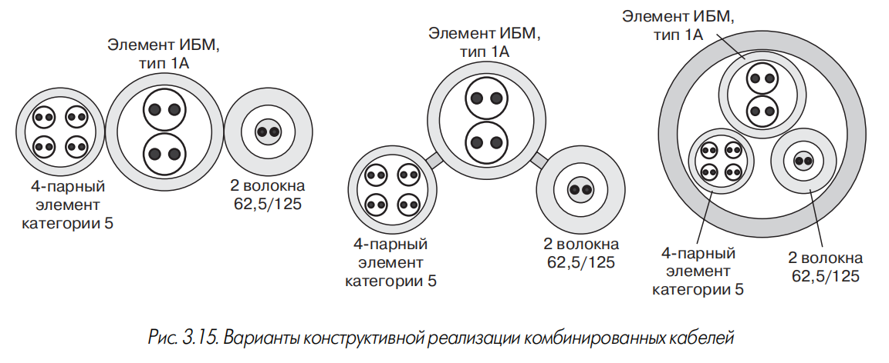

**Рис. 3.15 — Варианты конструктивной реализации комбинированных кабелей.**

Специальные изделия понадобились с ростом доли решений с доведением оптики до рабочего места. Новые конструкции отличаются высокой плотностью упаковки. Пример — MNC880FO (INFRA+): два четырёхпарных элемента категории 6 (четверочная скрутка) и два световода 62,5/125.

Второй вариант — кабель blotwist системы Blolite (раздел 4.7). Также растёт популярность гибридных кабелей с коаксиальной трубкой и четырёхпарным элементом категории 3 для жилого сектора.

Комбинированный кабель может быть основным элементом СКС производителя. Например, AMCS (all media cabling system) фирм Ackermann и Huber+Suhner — кабель с двумя витыми парами категории 5 и четырьмя световодами. Наибольшие преимущества — при централизованных оптических архитектурах (оптика для ЛВС, витая пара для телефонов).

Сдерживающие факторы:

- мало решений fiber to the desk (волокно до рабочего места) на середину 2001 года;
- более жёсткие требования к минимальному радиусу изгиба;
- сложность разводки по отдельным панелям в технических помещениях.

Поэтому некоторые <mark>производители СКС не рекомендуют композитные кабели для структурированной кабельной проводки [68].</mark>

## 3.1.5. Цветовая маркировка электрических кабелей СКС

<mark>При монтаже кабелей СКС важно иметь эффективный механизм идентификации витых пар и их проводников в электрических кабелях и волоконных световодов в оптических.</mark> Из-за малых размеров этих элементов маркирующие надписи неэффективны, поэтому используется кодировка, основанная на окраске изоляционных оболочек и других элементов кабельного сердечника. Буквенно-цифровой код, аббревиатуры, знаки и пиктограммы применяются исключительно на внешних оболочках.

> Цветовая маркировка — <mark>способ идентификации витых пар и проводников путём окраски изоляционных оболочек в различные цвета.</mark>

<mark>Основные нормативные документы, определяющие правила цветовой кодировки: **IEC 708-1** и **TIA/EIA-598**. Они используют одинаковый принцип и задают двенадцать основных маркирующих цветов</mark> (табл. 3.16). В электрических симметричных кабелях первые пять цветов задействованы для маркировки пары в группе, остальными семью маркируются группы. Цветом группы отмечается первый проводник пары, а в цвета пары окрашивается второй проводник.

**Таблица 3.16 — Маркирующие цвета проводников и световодов кабелей СКС по IEC 708-1 и TIA/EIA-598**

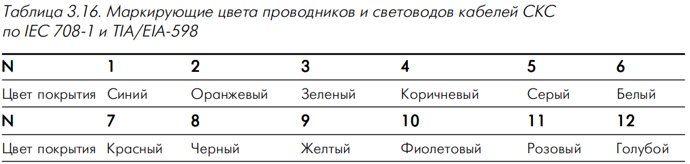

В 4-парных кабелях изоляция первого провода пары окрашивается в белый цвет (табл. 3.17). Принадлежность белого провода к той или иной паре в кабелях UTP и S/UTP категории 5 и 6 определяется плотной свивкой с основным проводом.

В кабелях с шагом скрутки свыше **38 мм** (фактически категории 3) для идентификации второго провода пары используются кольцевые метки на оболочке через каждые **10–15 мм**, цвет метки совпадает с цветом оболочки другого провода пары. Отсюда принцип «двухцветного» обозначения: провод **W-BL** или «белый от синего» («бело-синий») означает «белый провод с синими метками» («белый провод, свитый с синим»). Этот принцип используется и в некоторых кабелях категории 5 (Belden, Plastic Insulated Cable). Встречается также маркировка белого провода цветной линией вдоль оси — особенно удобно в кабелях для шнуров.

Правила цветовой маркировки магистральных кабелей задаются **IEC 708-1** (табл. 3.17). В пределах каждого 25-парного пучка пары разбиваются на 5 групп по 5 пар. Внутри группы один проводник каждой пары имеет цвет, свой для каждой группы. Цветовая нумерация групп начинается с цвета 6 (белого). Второй проводник пары имеет цвет по номеру пары внутри группы. Каждый пучок в кабеле ёмкостью свыше 25 пар дополнительно обмотан двумя цветными полиэтиленовыми ленточками или нитками.

> Пучок — <mark>группа из 25 витых пар, на которые разбиваются пары в многопарном кабеле ёмкостью свыше 25 пар.</mark>

**Таблица 3.17 — Цветовая маркировка пар в пучке многопарного кабеля**

| Группа | Цвет первого провода | Цвет второго провода | | | | |
|---|---|---|---|---|---|---|
| | | Пара 1 | Пара 2 | Пара 3 | Пара 4 | Пара 5 |
| 1 | Белый | Синий | Оранжевый | Зелёный | Коричневый | Серый |
| 2 | Красный | Синий | Оранжевый | Зелёный | Коричневый | Серый |
| 3 | Чёрный | Синий | Оранжевый | Зелёный | Коричневый | Серый |
| 4 | Жёлтый | Синий | Оранжевый | Зелёный | Коричневый | Серый |
| 5 | Фиолетовый | Синий | Оранжевый | Зелёный | Коричневый | Серый |

В некоторых случаях применяется цветовая кодировка, отличная от табл. 3.16, что определяется национальными нормами или внутрифирменными стандартами. Подборка схем цветового кодирования различных производителей представлена в монографии [1].

Окраска оболочек проводников — нетривиальная задача. При нанесении окраски учитываются два обстоятельства:

- полиэтилен (основной материал изоляции жил) плохо поддаётся окраске;
- красящие составы содержат металлические частицы, отрицательно влияющие на электрические характеристики пары и кабеля. В частности, коричневая краска вызывает рост ёмкостной взаимосвязи между проводниками и увеличивает затухание витой пары.

---

## 3.2. Разъёмы для электрических кабелей

> Разъём для витых пар — <mark>элемент, обеспечивающий разъёмное соединение кабелей СКС с коммутационным оборудованием в кроссовых, информационными розетками рабочих мест и с сетевым оборудованием.</mark>

Основные технические требования к разъёмам:

- минимальное затухание;
- высокое переходное затухание;
- минимальные структурные возвратные потери;
- небольшое сопротивление постоянному току;
- временная и температурная стабильность характеристик;
- простота установки на кабель;
- лёгкость подключения;
- хорошие массогабаритные показатели.

### 3.2.1. Механические и электрические параметры разъёмов

#### 3.2.1.1. Подключение проводников кабеля к контактам разъёмов

Способ подключения проводников к контактам разъёмов играет важную роль в обеспечении электрических, частотных и эксплуатационных характеристик тракта передачи сигнала. <mark>Стандарт IEC-352 предусматривает соединение накруткой, обжатием, запрессовкой; также применяются пайка и соединение под винт.</mark>

<mark>В разъёмах СКС используется метод **IDC (Insulation Displacement Connection)**.</mark>

> <mark>IDC-контакт — контакт, реализующий соединение методом смещения изоляции: проводник вводится в зазор между острыми режущими кромками, которые прорезают изоляцию и создают электрический контакт с проводником.</mark>

Данная технология отличается простотой реализации, высокой температурной и временной стабильностью, вибрационной стойкостью, возможностью многократного подключения и работы при высоком уровне загрязнённости воздуха.

<mark>Любая реализация метода IDC основана на двойном пружинящем контакте с острыми режущими кромками (рис. 3.16).</mark> Кромки прорезают в изоляции узкую щель и создают электрический контакт с проводником. Врезание кромки в медь обеспечивает очень небольшую величину переходного сопротивления. Со временем из-за диффузии увеличивается эффективная площадь взаимодействия, что даже улучшает электрические характеристики контакта. Малая толщина ножей в сочетании с отсутствием механических напряжений даёт хорошую герметичность зоны соединения. Кислород не попадает на контакт — нет проблемы окисления и электрохимической коррозии.

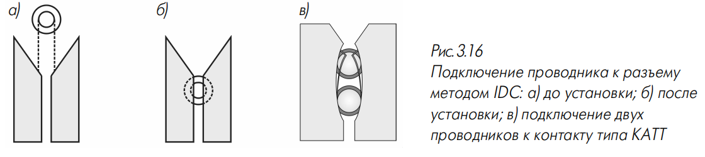

**Рис. 3.16 — Подключение проводника к разъёму методом IDC:**
- **а)** до установки;
- **б)** после установки;
- **в)** подключение двух проводников к контакту типа КАТТ.

Основные разновидности IDC-контактов (рис. 3.17):

- типа 110;
- типа 66;
- типа Krone или LSA-Plus;
- типа KATT.

Ограниченно применяются трубчатые варианты IDC-контактов. Общая характеристика — в табл. 3.18.

<mark>Конструкция IDC-контактов рассчитывается на сохранение электрических и механических характеристик при минимум **100 циклах** включения-отключения.</mark> С конца 90-х используются «одноразовые» IDC-контакты: режущие кромки допускают многократное соединение, но корпус его не выдерживает. Принцип одноразовой установки гарантирует хорошие свойства разъёмов на частотах существенно выше 100 МГц за счёт отсутствия механических деформаций при повторной установке.

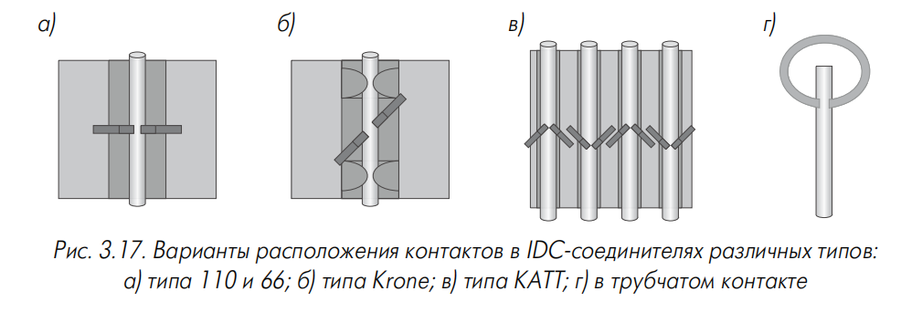

**Рис. 3.17 — Варианты расположения контактов в IDC-соединителях различных типов:**
- **а)** типа 110 и 66;
- **б)** типа Krone;
- **в)** типа KATT;
- **г)** в трубчатом контакте.

**Таблица 3.18 — Общие характеристики различных типов IDC-контактов**

| Тип контакта | Расположение режущих кромок | Возможность подключения более одного проводника | Категория |
|---|---|---|---|
| 110 | Прямое | Невозможно | 3–5 |
| 66 | Прямое | Возможно | 3* |
| Krone | Угловое | Возможно | 3–5 |
| KATT | Угловое | Возможно | 3–5 |

\* Категория 5 в варианте 66М1.

Контакты 110 и 66 имеют прямое расположение режущих кромок; Krone и KATT — угловое. Контакты 110 не предназначены для подключения более одного проводника; остальные типы позволяют параллельное соединение нескольких (обычно двух) проводников одного диаметра, что важно в телефонии. Возможность подключения нескольких проводников реализуется увеличением длины режущего элемента (контакт 66) или специальной формой режущей части (контакты КАТТ с серповидными ножами, рис. 3.17в). Первый подход ухудшает электрические характеристики из-за большой собственной реактивности и более не используется в высокоскоростных каналах.

В контактах IDC 66 режущие кромки расположены друг против друга и имеют длину около **25 мм**. Они рассчитаны в первую очередь для подключения перемычек и широко используются для низкоскоростных приложений (УАТС, параллельные телефонные линии).

Контакты типа 110 отличаются меньшими геометрическими размерами и ориентированы на высокоскоростные цепи категории 5. Они рассчитаны на подключение только одного проводника. Использована параллельная установка ножей, перпендикулярных оси проводника.

Контакты с угловой установкой ножей: рабочая поверхность ножа врезается в медь острой угловой кромкой, а не плоскостью, как в контактах 66 и 110. За счёт этого не возникают узкие клиновидные щели, в области которых начинается коррозия [69].

**Krone:** ножи располагаются параллельно друг другу с разворотом под углом **45°** к оси проводника. За счёт осевого разнесения точек врезания площадь поперечного сечения проводника уменьшается незначительно (рис. 3.18). Постоянно действующие силы кручения обеспечивают большую устойчивость к механическим воздействиям. Серебрение рабочих поверхностей увеличивает эксплуатационную надёжность.

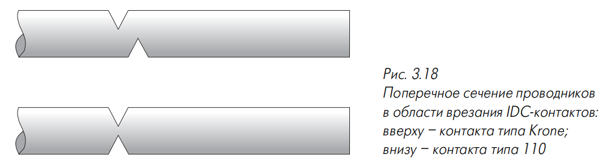

**Рис. 3.18 — Поперечное сечение проводников в области врезания IDC-контактов: вверху — контакта типа Krone; внизу — контакта типа 110.**

Принципиальный недостаток Krone: после запрессовки из-за угловой установки ножей нарушается заданная ориентация проводника. Это вынудило увеличить длину элемента введением длинной пластмассовой направляющей, что ухудшает массогабаритные показатели. Недостаток устранён в контакте **KATT** (разработка Mod Tap): угловая установка ножей, но плоскости контактных элементов образуют угол, близкий к прямому. В модуле KATT соседние контакты развёрнуты вершиной угла в противоположные стороны (рис. 3.17в) — высокая стойкость к вырывающим осевым воздействиям.

Идея дополнительных фиксирующих элементов воплощена в контакте типа 110 компании Reichle & De-Massari: пластмассовые направляющие в длинном канале имеют выступы, воздействующие на оболочку проводника в нескольких точках — более высокая стойкость к вибрационным нагрузкам.

Трубчатый контакт: потенциально меньшие габариты, но не получил распространения из-за критичности к точности обрезки проводника и невозможности групповых инструментов. Улучшение достигнуто фирмой Raychem: верхняя часть трубки имеет острую кромку, отрезающую лишнюю часть проводника.

#### 3.2.1.2. Электрические характеристики разъёмов для витых пар

Величины NEXT, нормируемые стандартами СКС (TIA/EIA-568-A, ISO/IEC 11801, EN 50173), приведены в табл. 3.19. На рис. 3.19 сведены данные по NEXT кабелей и разъёмов различных категорий. Стандарты выдвигают к разъёмам более жёсткие требования по NEXT, чем к кабелям, — создаётся запас, так как на переходную помеху сильно влияет качество монтажа, не контролируемое изготовителем разъёма.

**Таблица 3.19 — Максимально допустимое затухание и NEXT для разъёмов, дБ**

| Частота, МГц | Категория 3 | | Категория 4 | | Категория 5 | |
|---|---|---|---|---|---|---|
| | Затухание | NEXT | Затухание | NEXT | Затухание | NEXT |
| 1,00 | 0,40 | 58 | 0,1 | >65 | 0,1 | >65 |
| 4,00 | 0,40 | 46 | 0,1 | 58 | 0,1 | >65 |
| 10,00 | 0,40 | 38 | 0,1 | 50 | 0,1 | 60 |
| 16,00 | 0,40 | 34 | 0,2 | 46 | 0,2 | 56 |
| 20,00 | – | – | 0,2 | 44 | 0,2 | 54 |
| 31,25 | – | – | – | – | 0,2 | 50 |
| 62,50 | – | – | – | – | 0,3 | 44 |
| 100,00 | – | – | – | – | 0,4 | 40 |

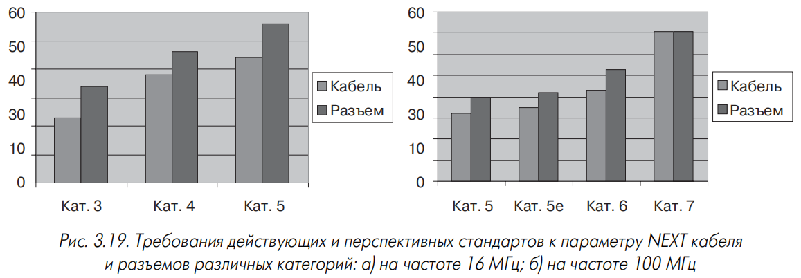

**Рис. 3.19 — Требования действующих и перспективных стандартов к параметру NEXT кабеля и разъёмов различных категорий:**
- **а)** на частоте 16 МГц;
- **б)** на частоте 100 МГц.

Из-за линейного расположения контактов величины NEXT для различных комбинаций пар разные (табл. 3.20). Стандарты нормируют только наихудшее значение. Для оценки фактического NEXT удобна **шестиугольная диаграмма** (рис. 3.20): каждая ось соответствует комбинации пар, откладываются норма и фактическая величина NEXT на фиксированной частоте. Пространство между точками (заливка) показывает гарантированный запас по переходной помехе.

**Таблица 3.20 — Величина параметра NEXT на частоте 100 МГц для различных комбинаций пар модульных разъёмов панелей серии SMART 24 компании RiT Technologies**

| Контакты | 1–2 | 3–6 | 4–5 | 7–8 |
|---|---|---|---|---|
| 1–2 | | 42,4 | 54,0 | 54,0 |
| 3–6 | 42,4 | | 42,1 | 42,0 |
| 4–5 | 54,0 | 42,1 | | 46,7 |
| 7–8 | 54,0 | 42,0 | 46,7 | |

**Рис. 3.20 — Шестиугольная диаграмма параметра NEXT.**

Иногда практикуется аналитическое определение NEXT. Например, для разъёма GG-45 концерна Alcatel:

$$NEXT > 80 \text{ дБ при } f < 31{,}25 \text{ МГц};$$
$$NEXT = 80 - 20\lg(f / 31{,}25) \text{ дБ при } 31{,}25 < f < 600 \text{ МГц},$$

где $f$ — частота сигнала (МГц).

Зависимость переходной помехи от номеров пар учитывают разработчики активного оборудования. Например, в системе АТМ передача ведётся по максимально разнесённым парам (для разводок серии 568 — пары 1 и 4).

Величины затуханий разъёмов нормируются в рабочей полосе частот (табл. 3.19). Для разъёмов категории 3 ISO/IEC 11801 дополнительно нормирует максимальное и среднее затухание после монтажа — **0,4 и 0,2 дБ** независимо от частоты.

Структурные возвратные потери задаются для разъёмов категорий 4 и 5 (табл. 3.21).

**Таблица 3.21 — Минимально допустимый по ISO/IEC 11801 уровень возвратных потерь разъёма для витых пар, дБ**

| Частота, МГц | Категория 4 | Категория 5 |
|---|---|---|
| 1–20 | 23 | 26 |
| 20–100 | – | $26 - 20\lg(f/20)$ |

Проходное сопротивление постоянному току по ISO/IEC 11801 — не более **0,3 Ом**. Превышение свидетельствует о плохой заделке проводников.

Сопротивление связи (для экранированных конструкций) по ISO/IEC 11801 (2000) — **10 мОм** на частоте 1 МГц и **200 мОм** на частоте 10 МГц.

Некоторые компании гарантируют лучшие значения: Telegartner для MJ-45LFS категории 5 указывает максимальное затухание **0,14 дБ** на 100 МГц (стандарт — 0,4 дБ). NEXT у серийных разъёмов обычно на **1–3 (реже 5) дБ** выше стандарта.

Перспективные требования к NEXT и FEXT — в табл. 3.22.

> FEXT — переходное затухание на дальнем конце.

**Таблица 3.22 — Требования перспективных редакций стандартов к величинам переходного затухания на частоте 100 МГц электрических разъёмов различных категорий**

| Категория | NEXT | FEXT |
|---|---|---|
| 5 | 40 | Не специфицировано |
| 5Е | 43 | 35 |
| 6 | 54 | 43 |

#### 3.2.1.3. Механические характеристики разъёмов для витых пар

Основные нормируемые параметры:

- номинальный диаметр проводника — **0,5–0,65 мм** (одно- или многопроволочный);
- количество проводников, подключаемых к розеточному модулю информационной розетки, — **8**;
- контактный элемент должен выдерживать не менее **750 циклов** включения-отключения без ухудшения параметров;
- рабочий температурный диапазон по TIA/EIA-568-A — **от –10 до +60 °С**.

### 3.2.2. Модульные разъёмы

#### 3.2.2.1. Общие положения

<mark>Модульный разъём изначально разработан для телефонных систем. Простота подключения и отключения (одно линейное движение без инструментов) привела к широкому распространению в передаче данных;</mark> в 1987 году сертифицирован для ISDN. Сейчас наиболее часто применяется в СКС во всех трёх подсистемах — для коммутации кроссового оборудования и подключения активных сетевых устройств (рис. 3.21).

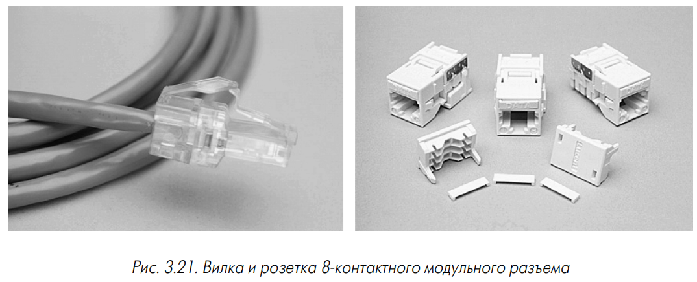

> <mark>Модульный разъём — разъём, состоящий из вилки и розетки и реализующий принцип «контактной шины».</mark>

<mark>Принцип «контактной шины»: контакты вилки при подключении скользят по контактам розетки, обеспечивая надёжную гальваническую связь за счёт плоской конструкции большой длины и сдвигая частицы загрязнений. Нижнее расположение контактов розетки вызывает повышенное загрязнение,</mark> поэтому гнездо дополнительно защищается.

Корпуса вилки и розетки — из термостойкого пластика. <mark>Материал контактов — обычно легированная бериллием медь (бериллиевая бронза). Рабочая поверхность может покрываться тонким слоем золота.</mark> Некоторые компании предлагают разъёмы с золотым покрытием различной толщины. У Lucent Technologies и Mod-Tap двухслойное покрытие: золото **1,27 мкм** на никелевой подложке **2,54 мкм**. Иногда подложка — латунь (DeltaCom).

Высококачественный контакт выдерживает несколько сотен и более циклов без ухудшения характеристик. Большинство ведущих изготовителей указывают **2500 циклов**; Panduit в серии MBX гарантирует **10000 циклов**.

Модульные разъёмы определены стандартом **IEC 603-7** [71] и специфицированы до частоты **3 МГц**. За счёт модернизации верхнюю граничную частоту увеличили почти на два порядка — до **200–250 МГц** у лучших образцов.

<mark>Конструкция допускает экранированный вариант: корпус вилки металлизируется для контакта с экраном кабеля после обжима. Гнездо розетки и IDC-контакты экранируются металлическими кожухами.</mark> При подключении металлические элементы вилки и розетки контактируют, создавая электрическую непрерывность экрана.

8-контактные модульные разъёмы обеспечивают характеристики категорий 3, 4 и 5. На рынке есть разъёмы категорий 5е и 6. При заделке кабеля важно сохранять фабричную завивку витых пар: нарушение допускается не более чем на **13 мм** для категории 5 и **25 мм** для категорий 3 и 4. Иначе резко уменьшается переходное затухание.

#### 3.2.2.2. Вилки модульных разъёмов

Вилка модульного разъёма предназначена в первую очередь для кабеля для шнуров, но может монтироваться и на горизонтальном кабеле (табл. 3.23).

**Таблица 3.23 — Геометрические параметры кабелей для монтажа вилки 8-контактного модульного разъёма**

| Параметр | Значение |
|---|---|
| Диаметр проводников пар, мм | 0,5–0,65 |
| Внешний диаметр изоляции проводников | 0,8–1,0 |
| Внешний диаметр оболочки | 4–6 |

Проводники подключаются к контактам вилки методом IDC. Пластина контакта имеет острые выступы, которые при обжиме надрезают изоляцию и обеспечивают контакт с жилой. <mark>Лезвия пластин различны для монолитных и витых проводников. Лезвие для монолитного проводника — полукруглое с двумя зубцами на концах; для многопроволочного — острый выступ посередине, входящий между проволоками (рис. 3.22). Установка вилки на несоответствующий тип проводников грозит потерей надёжности контактов.</mark>

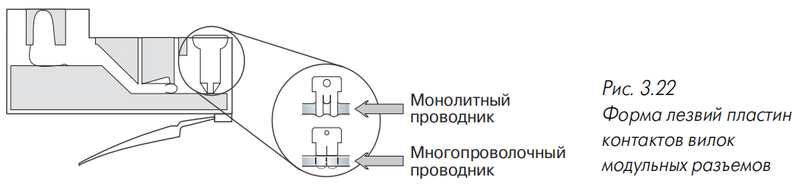

**Рис. 3.22 — Форма лезвий пластин контактов вилок модульных разъёмов.**

<mark>Корпус большинства вилок — из бесцветного прозрачного пластика для визуального контроля. Окрашенный прозрачный пластик применяется редко</mark> (при особых требованиях к цветовой кодировке шнуров), цена возрастает на **20–30%**.

Для установки вилки в полевых условиях применяется ручной обжимной инструмент. Компании ITT Datakom, Panduit, AMP, Lucent Technologies, Reichle & De-Massari разработали вилки без инструмента (**no tool termination**): функции нажимного элемента выполняет съёмная крышка вилки. IDC-контакты таких вилок могут располагаться в один или два ряда. Большинство имеет характеристики категории 3, некоторые гарантируют категорию 5 и выше.

Ровный ввод проводников обеспечивается направляющими каналами. Два способа формирования: узкие параллельные выступы длиной около **5 мм** в установочном гнезде корпуса (наиболее распространён) или предварительная оправка с выступами, вставляемая в корпус.

Схема разделки кабеля при установке вилки определена в TIA/EIA-568-A (рис. 3.23): оболочка срезается на расстоянии около **20 мм** от конца, концу придаётся плоская форма, пары развиваются до края оболочки и раскладываются по выбранной схеме. Место пересечения проводников 4 и 5 проводником 6 — не более **4 мм** от края оболочки. Проводники отрезаются на расстоянии **14 мм** от края оболочки. Оболочка должна заходить в вилку как минимум на **6 мм** для надёжного захвата фиксатором.

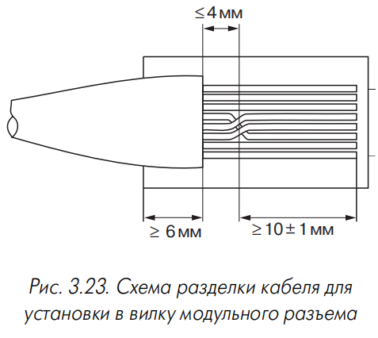

**Рис. 3.23 — Схема разделки кабеля для установки в вилку модульного разъёма.**

Процедура требует высокой точности. Инструмент WPT-8 компании Panduit (шаблон) помогает подготовить кабель.

Для улучшения электрических характеристик в некоторых конструкциях применяется двухрядное расположение проводов в двух плоскостях со смещением на половину расстояния между проводниками (рис. 3.24г). Lucent Technologies и Panduit используют специальную форму конечной части установочного гнезда. В вилках D8GS Lucent Technologies: длина расплетения пар уменьшена до **6 мм**; проводники разводятся с поворотом на **90°** на две группы IDC-контактов; ленточные проводники расположены в двух плоскостях. Это потребовало изменений хвостовой части корпуса и делает невозможной установку в полевых условиях.

Steward Connector развила принцип многоуровневого расположения: вынос проводников во вторую плоскость для максимального разноса критичных пар 3–6 и 4–5.

Механическая прочность соединения вилки и кабеля обеспечивается двумя методами:

1. **Механическая фиксация** — в вилках с длинным корпусом (**long body**), одноразовый зажим срабатывает под воздействием обжимного инструмента или пресса. Внутрь корпуса должно заходить минимум **6 мм** оболочки. Форма гнезда хвостовой части подбирается под тип кабеля: круглый, овальный, плоский (рис. 3.24).
2. **Заливка отвердевающей пластической массой** — в вилках с коротким корпусом (**short body**) с последующей штамповкой для формирования хвостовика. С конца 2000 года известна реализация в вилках с длинным корпусом для шнуров категории 6. Применяется при изготовлении шнуров в производственных условиях (рис. 3.25).

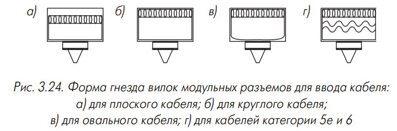

**Рис. 3.24 — Форма гнезда вилок модульных разъёмов для ввода кабеля:**
- **а)** для плоского кабеля;
- **б)** для круглого кабеля;
- **в)** для овального кабеля;
- **г)** для кабелей категории 5е и 6.

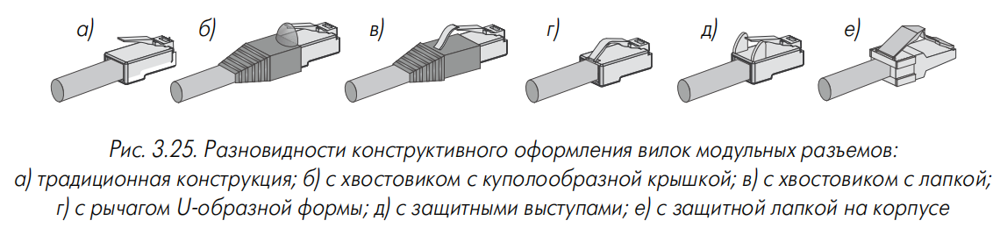

**Рис. 3.25 — Разновидности конструктивного оформления вилок модульных разъёмов:**
- **а)** традиционная конструкция;
- **б)** с хвостовиком с куполообразной крышкой;
- **в)** с хвостовиком с лапкой;
- **г)** с рычагом U-образной формы;
- **д)** с защитными выступами;
- **е)** с защитной лапкой на корпусе.

Вилка фиксируется в розетке упругой защёлкой рычажного типа. На заднюю часть часто одевается упругий колпачок (**boot**) с хвостовиком, закрывающий **10–15 мм** кабеля. Колпачки выпускаются с различным диаметром отверстия (шаг **0,5 мм**). Назначение — задание радиуса изгиба кабеля в месте входа в корпус. Хвостовик имеет прямоугольный вырез для хода рычага защёлки. Задняя часть часто рифлёная или с прорезями для гибкости.

Фиксация хвостовика: надвигание на заднюю часть вилки с зацепом за выступ (рис. 3.26а) или фиксация на корпусе во время обжима за технологические выступы (рис. 3.26б). Второй вариант сложнее, но хвостовик — естественное продолжение корпуса, не увеличивает поперечное сечение при меньшем расходе полимера.

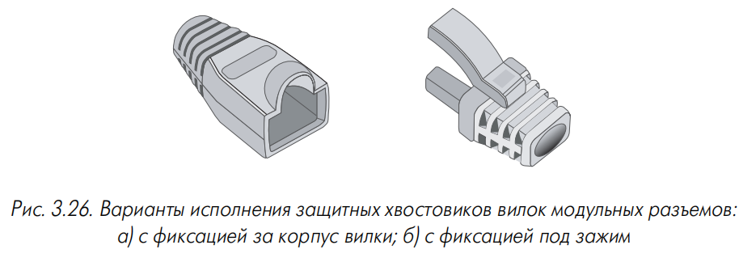

**Рис. 3.26 — Варианты исполнения защитных хвостовиков вилок модульных разъёмов:**
- **а)** с фиксацией за корпус вилки;
- **б)** с фиксацией под зажим.

Рычаг защёлки традиционной конструкции (рис. 3.25а) выступает над корпусом и цепляется за провода. Предложены решения двух групп:

**Первая группа — защитные хвостовики специальной формы:**

- хвостовики с мягкой куполообразной крышкой, закрывающей конец рычага (**snag-free cap**, рис. 3.25б); иногда крышка заменяется полукольцом;
- идентификатор порта (port identifier) серии OR-20300082 компании Ortronics: выступающая дугообразная лапка перекрывает конец рычага (рис. 3.25в); аналогично — вилки шнуров серии PC5EFS компании Superior.

Задняя часть хвостовика имеет круглое отверстие различного диаметра; возможна плоская форма для низкочастотного кабеля.

**Вторая группа — изменение формы хвостовой части корпуса вилки:**

- вилка PAN-PLUG компании Panduit: рычаг защёлки из упругой пластмассы уменьшенной толщины, U-образной формы (рис. 3.25г);
- вилка шнуров серии «Tangle Free»: два небольших выступа треугольной формы типа «рысьи уши» (рис. 3.25д);
- вилка D8GS компании Lucent Technologies: гибкая прямая планка под углом около **30°** к продольной оси, перекрывающая конец рычага (рис. 3.25е).

В ряде решений второй группы хвостовик не применяется, что создаёт угрозу деградации электрических параметров из-за резкого изгиба кабеля.

В 2001 году PatchSee представила шнуры с идентификатором порта — клипсой с защитным выступом из пластмассы **16 цветов**, одеваемой на заднюю часть хвостовика. Аналогичная идея — у HellermannTyton: съёмная защитная клипса с защитной планкой из прозрачной бесцветной пластмассы с маркировочным окном для двузначного цифрового кода.

#### 3.2.2.3. Розетки модульных разъёмов

##### Подключение кабелей к розеткам

<mark>Розетка изготавливается в виде розеточного модуля из двух частей: контактного гнезда и оконцевателя.</mark>

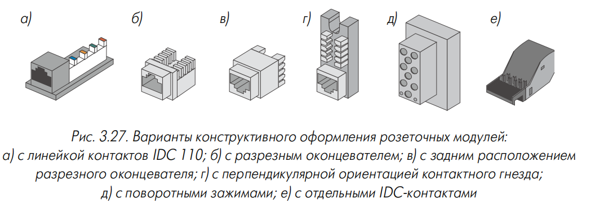

> Оконцеватель — часть розеточного модуля, предназначенная для подключения проводников кабеля.

<mark>В большинстве конструкций оконцеватель — набор IDC-контактов. Способы подключения проводников:</mark>

- линейкой контактов IDC 110 (часто две группы по четыре контакта — **разрезной оконцеватель**);
- отдельными IDC-контактами под однопроводный ударный инструмент или нажимную крышку;
- поворотными на **1/4 оборота** зажимами типа К10 под одиночный провод или пару (Legrand);
- линейкой контактов Krone (розетки типа RJ-K фирмы Krone);
- одиночными трубчатыми IDC-контактами;
- винтовыми зажимами для зачищенного проводника.

Последний способ устарел: не обеспечивает надёжности из-за коррозии, неудобен из-за ломкости монолитного проводника со снятой изоляцией. Используется только в телефонных розетках.

Для установки проводников:

- в оконцеватели на основе линейки IDC — однопроводный ударный инструмент;
- поворотный зажим Legrand — обычная шлицевая отвертка;
- в одиночные IDC-контакты — вставка-толкатель, часто интегрированная с защитной крышкой; может применяться нажимной инструмент типа клещей (PJT-X и CJT-X компании Panduit; CGST рычажного типа).

Большинство розеточных модулей размещают оконцеватель в верхней или нижней части корпуса. Подвод витых пар проще всего сзади. Подвод с других направлений (в коробах и настенных розетках) сопровождается резким поворотом пар под углом около **90°** и ухудшением NEXT. Для устранения используются решения с разворотом гнезда или оконцевателя на **90°**:

- Krone: оконцеватель в задней части корпуса, плоскость перпендикулярна оси;
- BICC, модуль CAT5C-WDO-SL450-001: гнездо розетки перпендикулярно плоскости контактов оконцевателя;
- частичное устранение — небольшая полукруглая выемка в задней части разрезного оконцевателя между линейками контактов.

В 2001 году Hubbell предложила розетку HXJ6B с парной группировкой контактов оконцевателя под углом **45°** к продольной оси (рис. 3.28) — минимальное нарушение структуры скрутки пар при монтаже.

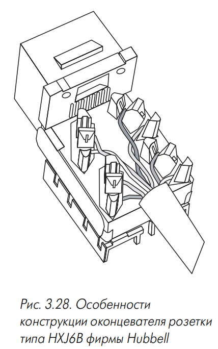

**Рис. 3.28 — Особенности конструкции оконцевателя розетки типа HXJ6B фирмы Hubbell.**

Для уменьшения монтажной высоты (при прокладке под ковром) AMP выпускает модули 558053 категории 5 с разрезным оконцевателем, повёрнутым на **90°** вбок.

Оболочка кабеля в розетке должна удаляться вплотную к контактам оконцевателя; длина витых пар без оболочки — минимальной. Нарушение допускается только некоторыми производителями и только если кабель в оболочке не может быть изогнут с минимальным радиусом.

Розеточные модули разных категорий одного производителя часто одинаковы по виду и габаритам. Для визуальной идентификации: маркировка CAT5 на модулях М100 Lucent Technologies; вставки с розеткой в NetConnect AMP; указание категории цифрой в ромбе у Siemon.

Для обеспечения NEXT необходимо сохранять форму токоведущих элементов, минимизировать длину расплетения и не допускать резких изгибов. Мероприятия:

- предельное уменьшение габаритов деталей (в модуле 808 ITT NS&S длина расплетения — **9–10 мм** вместо **13 мм**);
- двухрядное расположение IDC-контактов, часто разной высоты и с диэлектрическими пластинками;
- оконцеватель типа 110 со специальной формой токоведущих деталей (AMP);
- расположение IDC-контактов пары со смещением (разъём TERA компании Siemon);
- отказ от ударного инструмента в пользу нажимной крышки (**toolless jacks**) или рычага/толкателя/клещей;
- конструкции, допускающие только однократную установку (модули 808 ITT NS&S, S100 и S250 Corning);
- заделка края оболочки в корпус розетки;
- крышки с укладочными пазами;
- подвод кабеля параллельно оси при заднем оконцевателе или перпендикулярно при традиционных конструкциях;
- в двухмодульных розетках для коробов — ввод кабеля под углом **45°** фиксирующим хомутом (FMT, рис. 3.29);
- поворотный на **1/4 оборота** зажим на два провода пары (Legrand).

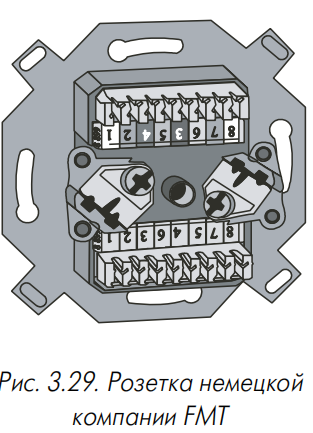

**Рис. 3.29 — Розетка немецкой компании FMT.**

##### Конструктивные особенности корпусов розеток

В 8-контактном модульном разъёме должны быть разведены все **8 проводников**. Правильность подключения обеспечивается цветными наклейками и/или цифровой маркировкой. Некоторые розетки имеют двойную маркировку гнёзд (А и В или 568А и 568В). Наклейки размещаются рядом с пазами оконцевателя или на боковой поверхности корпуса.

Соединения IDC-контактов оконцевателя с контактами гнезда выполняются по трём схемам:

1. **Прямое соединение** — контакты штампуются из одного листа медного сплава; средняя часть может располагаться в разных плоскостях с диэлектрическими пластинками.
2. **Соединение через печатную плату** — контакт из двух частей, связанных дорожкой из медной фольги; на плате формируются печатные конденсаторы, улучшающие характеристики по переходным помехам. Более перспективна для высоких частот, но дороже. Проще реализовать скрещивание проводников (перевод 4-го провода на контакт 6 при разводке 568), что уменьшает развитие пар и улучшает параметры.
3. **Модульная вставка** — вводит дополнительный разъёмный соединитель и ухудшает параметры; поддерживается ограниченным кругом производителей (рис. 3.30).

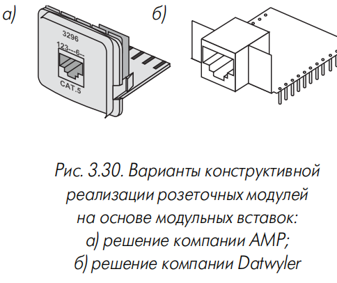

**Рис. 3.30 — Варианты конструктивной реализации розеточных модулей на основе модульных вставок:**
- **а)** решение компании AMP;
- **б)** решение компании Datwyler.

У AMP на печатной плате модульной вставки выполнены печатные проводники, вставляемые в разъём соединителя (**Edge Connector**). Edge Connector — до **300 МГц**; Edge Connector Mark II — до **1 ГГц**. Лицензионная копия — в вставках серии АСО системы VDI компании Legrand. У Datwyler — штыревые проводники, вставляемые в гнёзда; меньшая реактивность штыревого контакта увеличивает верхнюю граничную частоту. Наличие монтажной платы большой площади позволяет реализовать **cable sharing**. В некоторых вставках с двумя розетками контакты соединяются со штыревыми контактами через коммутационную колодку; вид разводки задаётся коммутационным элементом.

Увеличение эксплуатационной надёжности достигается крышками, одеваемыми на IDC-контакты после монтажа и фиксирующими проводники за оболочку. Варианты — на одну, две и четыре пары. В розетках FTJ компании Hubbell функции крышки выполняет поворотная пластинка; в розетках Reichle & De-Massari ось поворотной крышки — в передней части модуля. Крышки на 8 проводов часто с боковыми защёлками. В розетках М100 Lucent Technologies крышка — П-образная деталь, фиксирует две пары на разных частях оконцевателя и выполняет функции ключа-фиксатора. Крышка розеток HD58 Hubbell закрывает две пары на одной стороне оконцевателя и может использоваться как толкатель.

Для защиты от потери гальванической связи при тянущих и изгибающих усилиях и сохранения структуры витков применяются (рис. 3.31):

- дополнительная фиксация кабеля пластиковой стяжкой за Т-образную лапку (рис. 3.31а) или прорезь;
- фиксация клином в специальном гнезде корпуса экранированной розетки (Datwyler); аналогично — в модулях серии 7700 INFRA+ (клин с фиксатором-трещоткой);
- зажимные кольца, дополнительно обеспечивающие контакт экранов кабеля и модуля;
- острые или длинные ножеобразные выступы, врезающиеся в оболочку (Siemens, модули S100 и U100) — рис. 3.31б;
- в панелях серии ALPHA 824 компании Elgadphon — разрезной трубчатый пружинный зажим (рис. 3.31в);
- металлические фиксирующие хомуты или съёмные U-образные держатели; одна из таких деталей — обязательный аксессуар экранированной конструкции, выполняет функции заземляющего элемента.

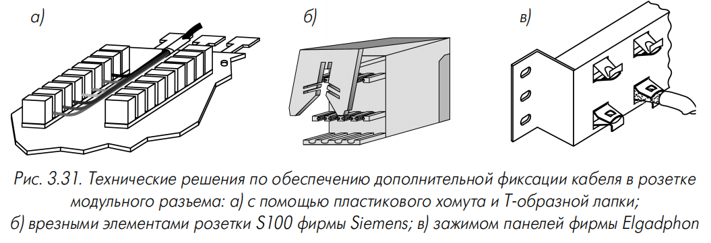

**Рис. 3.31 — Технические решения по обеспечению дополнительной фиксации кабеля в розетке модульного разъёма:**
- **а)** с помощью пластикового хомута и Т-образной лапки;
- **б)** врезными элементами розетки S100 фирмы Siemens;
- **в)** зажимом панелей фирмы Elgadphon.

Розетки могут иметь различные схемы разводок. В современных конструкциях часто используется прямое подключение к отдельным контактам без развивки пар, а схема обеспечивается внутренним перекрещиванием проводников. Диэлектрические пластинки, разделяющие проводники, выполняются из специальных материалов и имеют определённую толщину — это даёт гальваническую развязку, заданную ёмкость и симметризацию внутренних цепей. Ранее применялись дискретные конденсаторы, но это не давало высокой пробивной стойкости и не разрешалось стандартами. Встречается формирование симметрирующих конденсаторов в форме планарного элемента за счёт выбора формы токоведущих дорожек.

Экранированные розетки выполняются в едином стиле с UTP-розетками. Отличие — экранирующие кожухи и элементы гальванической связи экранов вилки и розетки. Кожух чаще всего — крышка на оконцевателе после разводки проводников. Panduit для серии MUSJC588 применяет экранирующий корпус из тонкого листового металла, закрывающий розетку со всех сторон. В модулях S100 Corning экран составной: первая часть контактирует с экраном кабеля, вторая — силовая основа и полный круговой охват гнезда. У Alcatel различают собственно экранированные модули (экранируется только гнездо) и модули типа EMC (полная экранировка гнезда и оконцевателя).

Элемент гальванической связи экранов кабеля и шнура — металлическая вставка в гнездо розетки с пружинящими самоочищающимися контактами в виде отогнутых лапок. В большинстве конструкций — два контакта; в S100 — три лапки; в системе EMT компании AMP — четыре контакта (компенсация люфтов из-за больших допусков IEC 603-7).

Конструкция корпуса розетки зависит от назначения. Основные варианты:

- **универсальный розеточный модуль** — устанавливается с использованием защёлок; выполняется угловым, плоским и в стиле keystone (рис. 3.32), последний — в прямом и угловом виде. Для монтажа в декоративный короб требуется лицевая панель-адаптер; в информационной розетке — напрямую. Возможны модули keystone с внешней угловой установкой гнезда (рис. 3.32г) — применяется, например, тайваньской компанией HCI [72];
- **розеточный модуль с лицевой панелью** — специализированная конструкция для декоративных коробов, розеточных коммутационных панелей и розеток мультимедиа. В связи с 2-портовыми рабочими местами модули выполняются двухпортовыми из трёх деталей: гнезда, оконцевателя и монтажной печатной платы. Оконцеватель — линейка типа 110, линейки параллельны. В Европе популярны двухпортовые модули с пластиковой или металлической фигурной силовой основой; декоративная лицевая пластина крепится на винтах или защёлках.

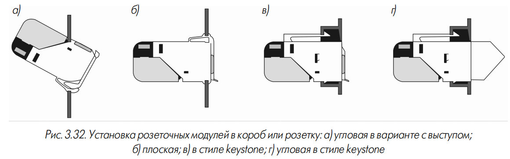

**Рис. 3.32 — Установка розеточных модулей в короб или розетку:**
- **а)** угловая в варианте с выступом;
- **б)** плоская;
- **в)** в стиле keystone;
- **г)** угловая в стиле keystone.

Некоторые модули с лицевой панелью имеют откидную или сдвижную подпружиненную заслонку гнезда. Для монтажа защитных крышек на универсальный модуль применяется адаптер. Отдельные адаптеры могут кодировать вилку на подключение только к определённому гнезду. Решение **zero-footprint shutter** компании Molex — защитная крышка внутри гнезда, уходящая назад без углового поворота [73]; лучше защищает от загрязнений. Для предотвращения несанкционированного подключения дверца может запираться на ключ (RW-AS08-LOC компании RW Data).

##### Разновидности розеток

Контакты разъёмов нумеруются слева направо от 1 до 8 (рис. 3.33).

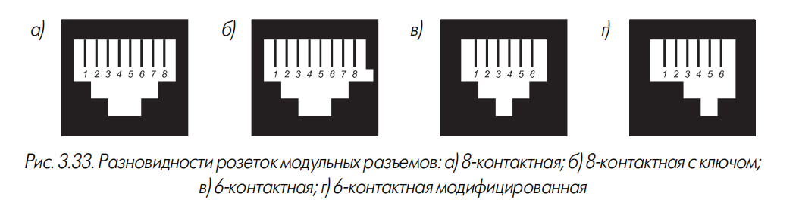

**Рис. 3.33 — Разновидности розеток модульных разъёмов:**
- **а)** 8-контактная;
- **б)** 8-контактная с ключом;
- **в)** 6-контактная;
- **г)** 6-контактная модифицированная.

- **Традиционный 8-контактный разъём** (рис. 3.33а) — Western Plug, 8PMJ (8-position modular jack) или 8P8C (8 position 8 conductor), часто некорректно называемый **RJ-45**. Широко применяется в СКС: информационные розетки, коммутационное оборудование, интерфейс сетевого оборудования.
- **8-контактный разъём с ключом** (рис. 3.33б) — разработан DEC, чтобы вилки не подключались к обычной розетке. Не получил распространения, не рекомендуется в СКС. То же — для 6-контактных модифицированных (MMJ, рис. 3.33г).
- **6-контактные разъёмы** (рис. 3.33в), часто некорректно называемые RJ-11 или RJ-12, широко используются в неструктурированных системах для телефонов. В СКС информационные розетки должны быть только 8-контактными. Вилка 6-контактного разъёма может подключаться к 8-контактной розетке, контакты 1 и 8 остаются незадействованными.
- **10-контактный модульный разъём** — в системе SMART компании RIT Technologies. Два дополнительных проводника (используется один) позволяют сканеру контролировать соединение портов панели шнуром и передавать управляющую и диагностическую информацию. Совместимость с другими типами — за счёт особой конструкции гнезда: можно вставить стандартную вилку 8-контактного разъёма, но обмен служебной информацией становится невозможным. Подробнее — раздел 13.1.3.

#### 3.2.2.4. Схемы разводки модульных разъёмов

Проводники симметричного кабеля могут разводиться в розетке различными способами. Из-за плоской конструкции вилки выбор схемы — компромисс.

Наибольшее распространение получили три схемы (рис. 3.34): **T568A**, **T568B** и **USOC**. В СКС используются первые две; некоторые приложения используют USOC, поэтому выпускаются шнуры с разъёмами, скроссированными по USOC.

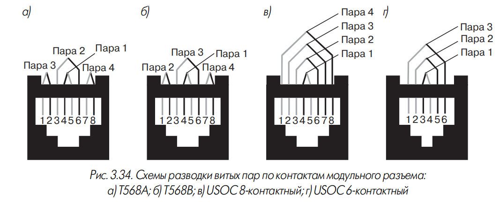

**Рис. 3.34 — Схемы разводки витых пар по контактам модульного разъёма:**
- **а)** T568A;
- **б)** T568B;
- **в)** USOC 8-контактный;
- **г)** USOC 6-контактный.

Информация о разводке по контактам вилки и розетки согласно T568A, T568B и USOC — в табл. 3.24 и на рис. 3.34.

Достоинство USOC: при подключении 6-контактной вилки к 8-контактной розетке подсоединяются пары 1, 2 и 3. Недостаток: худшая балансировка пар 3 и 4 из-за значительного разнесения контактов.

T568A и T568B почти совпадают, отличаются цветом пар 2 и 3 (оранжевый и зелёный). Дополнительное преимущество T568A — совместимость по 1 и 2 парам с USOC. Однако **T568B** (AT&T, WECO или BELL 258) получила в нашей стране более широкое распространение — из-за применения в СКС Systimax компании Lucent Technologies. Для построения СКС рекомендуется **разводка 568В**. Стандарты не предписывают обязательную схему; единственное ограничение — TIA/EIA-568A запрещает одновременное применение в одной СКС двух разных схем разводки.

**Таблица 3.24 — Разводка витых пар по контактам модульного разъёма для различных схем кроссировки**

| Контакт | T568A | | T568B | | USOC | |
|---|---|---|---|---|---|---|
| | Пара | Сигнал* | Пара | Сигнал* | Пара | Сигнал* |
| 1 | 3 | T3 | 2 | T2 | 4 | T4 |
| 2 | 3 | R3 | 2 | R2 | 3 | T3 |
| 3 | 2 | T2 | 3 | T3 | 2 | T2 |
| 4 | 1 | R1 | 1 | R1 | 1 | R1 |
| 5 | 1 | T1 | 1 | T1 | 1 | T1 |
| 6 | 2 | R2 | 3 | R3 | 2 | R2 |
| 7 | 4 | T4 | 4 | T4 | 3 | R3 |
| 8 | 4 | R4 | 4 | R4 | 4 | R4 |

\* T — передача сигнала, R — приём сигнала.

Помимо T568A и T568B существуют другие схемы. Часть совместима с T568A и T568B (Token Ring (802.5)), некоторые — с точностью до обозначений пар (10Base-T (802.3), TP-PMD (X3T9.5)). Примеры использования T568B — в табл. 3.25.

**Таблица 3.25 — Использование схем T568B некоторыми типами систем передачи данных**

| Приложение | Скорость, Мбит/с | Активные контакты (568В) | Используемые пары (568В) |
|---|---|---|---|
| IEEE 802.3 (Ethernet) | 10 | 1236 | P2P3 |
| IEEE 802.3u (Fast Ethernet) | 100 | 1236 | P2P3 |
| IEEE 802.3ab (Giga Ethernet) | 1000 | 12345678 | P1P2P3P4 |
| IEEE 802.5 (Token Ring) | 4/16 | 3456 | P1P3 |
| IEEE 802.12 (100VGAnyLAN) | 100 | 12345678 | P1P2P3P4 |
| 3270 | 2,36 | 45 | P1 |
| S/3X и AS/400 | 1 | 45 | P1 |
| Телефонные аппараты | <0,1 | 3456(78) | P1P3(P4) |
| V24 – V.28 (RS 232 C) | 0,0192 | 3456(1278) | P1P3(P2P4) |
| Apple Talk – Local Talk | 0,23 | 3456 | P1P3 |
| Arcnet | 1/20 | 45 | P1 |
| Telex, Fax | <0,1 | 45 | P1 |
| ATM (TP) | 155 | 1278 | P2P4 |
| TP-PMD | 100 | 1278 | P2P4 |
| ISDN | 2,048 | 12345678 | P1P2P3P4 |

### 3.2.3. Разъёмы типа 110

> <mark>Разъём типа 110 — панельный коммутационный элемент, разработанный в 1972 году в Bell Laboratories на основе контактов типа 66 [74].</mark>

Разъёмы типа 110 ориентированы на установку в коммутационном оборудовании технических помещений. Отдельные детали широко применяются как оконцеватель в информационных розетках, разъёмах консолидационных точек и аналогичных элементах. Как элемент интерфейса активного оборудования практически не используется из-за больших линейных размеров в 3- и 4-парном вариантах.

До появления элементов типа 110 коммутация осуществлялась перемычками, не обеспечивавшими плотной завивки проводников: повышалось затухание и ухудшался NEXT до характеристик не выше категории 3. Создание разъёмов типа 110 позволило использовать коммутационные шнуры с вилками (рис. 3.35): за счёт внешней оболочки обеспечивается стабильно плотная завивка пар и более высокие электрические характеристики. При частых переключениях шнуры удобнее перемычек.

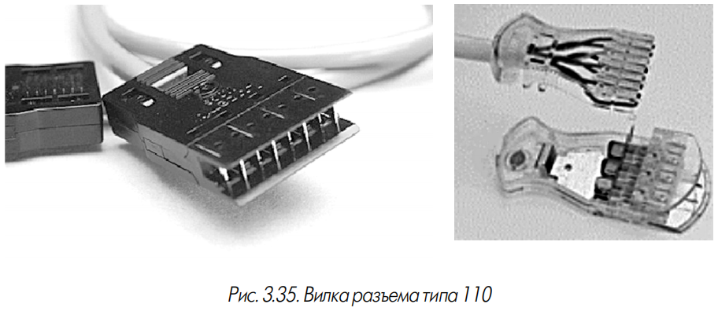

**Рис. 3.35 — Вилка разъёма типа 110.**

Разъём типа 110 состоит из вилки и линейки. Линейка после установки соединительного блока 110С выполняет функции розетки. Контакты вилки — перпендикулярные плоскости корпуса металлические пластины, входящие в зазор между контактами линейки. Токопроводящие элементы вилки и розетки защищены пластмассовыми деталями корпуса. Контакты могут покрываться золотом толщиной несколько микрометров.

Корпус вилки имеет предохранительные выступы, блокирующие неправильное подключение. Для визуальной индикации — изображение стрелки. Siemon разработала разъём 110 с несимметричной формой корпуса (козырёк сверху). На корпусе 4-парных вилок Siemon — впадины с насечкой для прочности захвата.

Вилки типа 110 изготавливаются на 1, 2, 3 и 4 пары. Для аналогового телефонного канала достаточно однопарной; для ЛВС рекомендуются 4-парные. Корпус собирается из двух половин с защёлками. Проводники подключаются к IDC 110 однопроводным ударным инструментом. Контакты нумеруются слева направо; между номерами контактов и проводниками пар — прямое соответствие, что упрощает установку и минимизирует переходную помеху.

Корпус вилки для фабричной установки — из непрозрачной пластмассы. В вилках для полевых условий часто прозрачный пластик для визуального контроля. Прозрачными выполняются обе половины (SD110P Siemon, ICMP110XPR ICC) или только верхняя крышка (Р110РС-4 Panduit). Крупный корпус вилки 110 удобен для маркировки этикетками; у Siemon — овальные пластмассовые иконки десяти цветов.

Соединительные блоки типа 110C устанавливаются на контактную полосу после разводки пар. В блоке — металлические X-образные элементы с IDC-контактами; лезвия врезаются в проводник под воздействием 5-парного ударного инструмента, блок крепится восемью тугими защёлками. Для перекоммутации блок снимается пассатижами. Вторая сторона блока — разъёмы типа 110 для шнуров или перемычек. Блоки различной ёмкости позволяют гибко администрировать СКС.

Разъёмы типа 110 принципиально не обеспечивают непрерывность экрана экранированных кабелей. В разъёме Siemon предусмотрен внутренний экран, разделяющий витые пары вплоть до места подключения к IDC-контактам и обеспечивающий контакт с экраном кабеля S/UTP и S/STP.

### Разъёмы типа Telco

> Разъём типа Telco — 50-контактный многоканальный телекоммуникационный разъём, рассчитанный на работу с многопарными кабелями.

Разъёмы типа Telco не нормируются стандартами СКС, но широко применяются при построении коммутационного оборудования технических помещений. Конструкция не рассчитана на частые переключения, но даёт выигрыш по габаритам и удобству коммутации больших групп интерфейсов. Области применения — интерфейсная часть пассивного и активного оборудования коллективного пользования.

По электрическим характеристикам разъёмы Telco обеспечивают категории 3 и 5. Категория 3 — для УАТС; категория 5 — для Fast Ethernet на уровне рабочих станций ЛВС.

Первые серийные образцы имели подвод кабеля параллельно или перпендикулярно плоскости контактов (рис. 3.36). Из-за большого диаметра 25-парного кабеля и плохой гибкости это создавало неудобства. Разработан **120-градусный разъём Telco**: кабельный ввод вилки образует с плоскостью контактов угол **120°**. Розеточную часть на некоторых панелях располагают под углом **45°** к продольной оси.

Отличительная особенность: в нерабочем положении контактные части вилки и розетки должны быть закрыты штатными пластиковыми защитными крышками.

Подключение разъёма Telco к многопарному кабелю — сложная процедура, особенно в полевых условиях. Большинство производителей рекомендует шнуры фабричного производства. Исключение — AMP с приспособлением «butterfly» типа MI-1 для оконцевания кабеля разъёмом Telco.

## 3.2.4. Другие типы разъёмов для передачи сигналов приложений классов C и D

Кроме основных типов, ограниченно применяются другие разъёмы для витых пар.

> MIC — 4-контактный разъём (номер 8310574 IBM), разработанный для кабельной системы IBM, рассчитан на кабели с волновым сопротивлением 150 Ом.

Отличается **гермафродитной конструкцией**: применяются только вилки, деления на вилку и розетку нет. Не получил распространения из-за сложности монтажа, больших габаритов (вдвое уступает модульным) и невозможности подключения к 4-парным кабелям.

> DB (D-Sub) — серия разъёмов для приложений ЛВС, рассчитана на 100-омные кабели.

Выпускаются на 9, 16 и 25 контактов; популярнее 9-контактный (тип D-Sub). Розетки близки по габаритам к модульным, но проигрывают по удобству: установка и демонтаж вилки связаны с завинчиванием/вывинчиванием двух невыпадающих винтов. Обеспечивают эффективную связь экранов, что расширяет рабочий диапазон (до **300 МГц**). Могут устанавливаться в коммутационном оборудовании и информационных розетках (например, полки серии 12443 ХХ и розетки 27689 ХХ компании Ackermann). Для подключения проводников применяется обжим или разводка на IDC Krone.

> G4 и CAG 8 — разъёмы компании Ackermann (4-полюсный и 8-контактный), рассчитаны на кабель 150 Ом.

Некоторые варианты розеток имеют нормальнозамкнутые контакты — позволяют формировать кольцевые структуры без коммутаций в кроссовых и поддерживать ISDN.

## 3.2.5. Разъёмы типа 110 нетрадиционных схем для СКС с повышенной пропускной способностью

Наибольшее распространение получило коммутационное оборудование на модульных разъёмах. Панели типа 110 менее популярны из-за плохой эстетики, больших габаритов вилок шнуров, более высоких требований к администратору и цены (шнуры в 4-парном варианте дороже примерно в **2,5 раза**).

Полному вытеснению препятствует **функциональная гибкость**: администрирование отдельными парами без адаптеров и потенциально лучшие характеристики по NEXT из-за отсутствия перехлёста проводников пар 36/45, характерного для схем 568. Дополнительно — меньшая длина развивки пар и их разнос. Несмотря на ширину 4-парной вилки, меньшая высота гребёнки и двухрядное расположение дают плотность **24 порта на 1U**.

> Панели типа 110 эффективны, когда кабельная система обслуживает большое число устройств, не использующих 4-парную схему передачи (телефоны, средне- и низкоскоростные устройства).

С 1998–1999 годов появились новые разновидности оборудования типа 110 с улучшенной пропускной способностью. Их признаки:

- основа — разъём типа 110 (полностью или частично оригинальной конструкции);
- электрические параметры выше категории 5;
- сохранена функциональная гибкость (администрирование отдельной парой);
- устранены недостатки прототипа.

### 3.2.5.1. Разъёмы системы VisiPatch

Система **VisiPatch** предложена Lucent Technologies в 1999 году. Цель — улучшить монтажные, эстетические и эксплуатационные параметры при сохранении характеристик GigaSpeed.

Ключевые изменения:

- плоскость контактов вилки развёрнута на **180°**; контакты подняты над корпусом и ориентированы рабочей стороной к шнуру. Кабель шнура не отходит от панели, а направлен в неё (**Reverse Patch Cord**, «принцип инверсной укладки шнуров»). Толщина концевой части — около **17 мм**;
- подпружиненная защёлка устраняет случайное отключение вилки;
- торцевая часть корпуса свободна для маркировки этикетками;
- дополнительная крышка перед контактами улучшает перекоммутацию и ослабляет эффект цепляния за провода.

> Линейка пазов — интегральная часть блока разводки типа 110UW-28, существенных отличий от классической линейки нет.

### 3.2.5.2. Разъёмы типа S210

Разъёмы **S210** разработаны Siemon для высокоскоростных приложений; элемент системы System 6. По параметрам превосходят проекты категории 6 и класса Е на середину 1999 года: запас по NEXT — **25 дБ** относительно категории 5 и **11 дБ** относительно проекта категории 6 (на 100 МГц).

> Достигнуто за счёт нового размещения контактов: сгруппированы по два и на всей протяжённости окружены (частично или полностью) общим для каждой пары экраном в соединительном блоке.

Аналогично классическому 110 состоит из вилки и коммутационного блока. Отличия: проводники пары укладываются в пару пазов левее направляющего выступа цветным проводником вправо (выступ поднят над линейкой); на корпусе блока — декоративные направляющие выступы.

Внутри корпуса вилки — экранирующая металлическая вставка, разделяющая пары контактов; наиболее эффективна для S/UTP и S/STP. Проводники в месте установки в IDC-контакты окружены экраном — высокие параметры по переходным влияниям. Корпус в месте ввода кабеля — в виде захвата под пальцы; место для маркирующей иконки 12 цветов.

Вилка и блок шире классического 110 примерно в **1,5 раза** (табл. 3.26): на стандартной линейке размещается **четыре** разъёма вместо шести.

**Таблица 3.26 — Геометрические параметры соединительных блоков разъёмов**

| Тип блока | P110C4W | GPCB4 | S210C-4 |
|---|---|---|---|
| Система | 110 и VisiPatch | Giga-PUNCH | S210 |
| Ширина, мм | 30 | 22 | 45,5 |
| Глубина, мм | 22,6 | 22,6 | 24,5 |
| Толщина, мм | 6,2 | 8,8 | 8 |

### 3.2.5.3. Разъём системы Giga-PUNCH

Система **Giga-PUNCH** фирмы Panduit — комплекс на основе панели типа 110 с характеристиками проекта категории 6. Требования: габариты вилки, соизмеримые с модульной, и сохранение администрирования отдельными парами.

> Решение: отказ от линейной схемы, двухрядное размещение контактов со смещением примерно на половину шага (шахматный порядок). Это позволяет укладывать проводники в направляющих пазах без сгибов.

Особенности: скругление угловых участков рабочих поверхностей блока и выступов линейки. Два варианта панелей:

- **high density** — 144 и 432 пары (четыре или двенадцать линеек);
- **standard density** — 96 и 288 пар (для плоских кабелей; есть промежутки между группами пазов).

**Таблица 3.27 — Электрические характеристики разъёмов на частоте 250 МГц**

| Параметр | Проект категории 6 | Giga-PUNCH | S210 | VisiPatch* |
|---|---|---|---|---|
| NEXT | >45 | 52 | 58 | 49,6 |
| PS-NEXT | >42 | 49 | 55,2 | 44,9 |
| FEXT | >35 | 47 | – | н/д |
| PS-FEXT | >32 | 44 | – | н/д |
| ELFEXT | – | – | 61,5 | н/д |
| PS-ELFEXT | – | – | 59,2 | н/д |
| Затухание | <0,32 | 0,03 | н/д | н/д |
| Обратные потери | >15 | 24 | 24,3 | 20,7 |

\* Для VisiPatch параметры получены расчётным путём по стандартной модели тракта с тремя разъёмами.

## 3.2.6. Высокочастотные разъёмы для решений проекта категории 7

### 3.2.6.1. Состояние разработок и применяемые схемы

Стандартный 8-контактный модульный разъём широко распространён благодаря стандартизованному интерфейсу, отработанной конструкции и массовому применению в активном оборудовании. Основной недостаток — параллельное и близкое расположение контактов, неоптимальное для частот в сотни мегагерц. Характеристики не удовлетворяют категории 7 и классу F по большинству комбинаций пар. Разработки AMP и Telegartner позволяют передавать **600 МГц** только по максимально разнесённым парам 1–2 и 7–8; требуемый NEXT часто достигается только при соединении нерабочих пар с массой, что нарушает универсальность.

Различают **однорядную** и **двухрядную** схемы расположения контактов (рис. 3.39); чаще используется двухрядная — больший разнос пар при сохранении форм-фактора модульного разъёма.

> 29 июля 1999 года разъём GG-45/GP-45 выбран рабочей группой WG3 комитетов ISO/IEC в качестве базового разъёма категории 7 для совместимости со стандартными модульными разъёмами категорий 5 и 6.

### 3.2.6.2. Решения модульного типа

Основное свойство — прямая и обратная совместимость с традиционными модульными разъёмами. Два основных решения:

**1. GG-45/GP-45 (Alcatel).** Форма корпуса вилки GP-45 (GigaPatch) и розетки GG-45 (GigaGate) почти копирует прототип. Отличия: две пары дополнительных полосковых контактов в углах нижней торцевой части и движковый переключатель с торцевым рабочим элементом. Идея — разнести пары на максимальное расстояние по двухрядной схеме. Обратная совместимость потребовала механического переключателя — основной недостаток [75]. Развязка пар — за счёт сепаратора крестообразной формы.

**2. Category 7 Modular Plug & Jack Connector System (AMP).** Основано на внутренних проводниках печатного типа. Плата обеспечивает развязку за счёт заземлённых проводящих экранов, каждый окружён заземлённой оболочкой (фактически миниатюрный коаксиальный кабель). Для связи экранов вилки и розетки предусмотрены два крайних заземляющих контакта (0 и 9). Корпус заметно длиннее из-за печатной платы.

Преимущество AMP — широкая номенклатура Y-адаптеров для передачи по одному кабелю сигналов нескольких приложений. Недостаток — сложность производства.

### 3.2.6.3. Решения нетрадиционных схем

Не обеспечивают совместимость с традиционными модульными разъёмами. Реализуются главным образом по двухрядной схеме (по однорядной — только CF8 компании Ackermann), ориентированы на S/STP.

> Требование: полный круговой охват проводников пары экраном на всём протяжении. В розеточную часть вводится крестообразный металлический сепаратор.

Если высокие частоты не требуются, круговой экран заменяется металлической разделительной стенкой (например, ALL-LAN компании Montrose/CDT — ACR не хуже **24 дБ** на 300 МГц).

Третья разновидность — симметричная схема экрана: одинаковые открытые детали вилки и розетки образуют замкнутую камеру в собранном состоянии (разъём MiniC компании IBM).

Контакты вилок и розеток — плоские (TERA компании Siemon, 7777F компании INFRA+) или штыревые (CMG компании Telesafe; характеристики часто выше проекта категории 7, нормируются до **850–1000 МГц**).

Распространены также 2- и 1-парные варианты по схеме «половинки» и «четвертинки»: две двухпарные вилки можно установить в гнездо одной розетки рядом. Тракты категории 7 часто используются в режиме **cable sharing**.

Установка вилки и розетки на S/STP трудоёмка из-за необходимости малого переходного сопротивления между экранирующими деталями. Siemon предложила универсальный инструмент без дополнительного кримпирования.

## 3.3. Коммутационное оборудование

### 3.3.1. Коммутационные шнуры

> Коммутационный шнур — <mark>отрезок кабеля с многопроволочными проводниками, на концах которого установлены два разъёма; предназначен для ручной коммутации кабельных сегментов СКС.</mark>

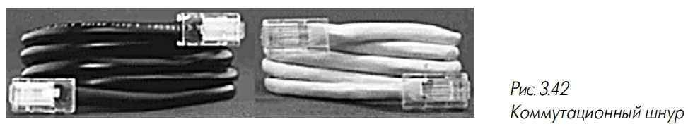

Шнуры могут быть армированы двумя вилками модульных разъёмов, двумя вилками типа 110 или комбинированными. Назначение — в табл. 3.28. Ограниченно применяются комбинированные шнуры с вилкой модульного разъёма и вилкой MIC системы Token Ring, а также шнуры с модульной вилкой и 1- или 2-парной вилкой типа 110 для высокоскоростных приложений с двухпарной схемой.

**Таблица 3.28 — Основные типы коммутационных шнуров СКС**

| Разъём на первом конце | Разъём на втором конце | Число пар | Назначение                                                                        |
|------------------------|------------------------|-----------|-----------------------------------------------------------------------------------|
| 110                    | 110                    | 1–4       | Подключение по одной или нескольким парам оборудования типа 110                   |
| 110                    | Модульный              | 2 или 4   | Подключение по 2 или 4 парам оборудования типа 110 к модульным/розеточным панелям |
| Модульный              | Модульный              | 4         | Подключение по 4 парам модульных/розеточных панелей                               |

Шнуры классифицируются по категориям от 3 до 5. Типы шнуров категории 5 — в табл. 3.29. Малая допустимая величина радиуса изгиба важна для ограниченного пространства 19-дюймовых шкафов; большинство — **20–25 мм**.

**Таблица 3.29 — Неэкранированные коммутационные шнуры категории 5**

| Фирма               | Тип шнура*         | Разъёмы (1-й / 2-й концы) | Длины, м (мин.–макс.) |
|---------------------|--------------------|---------------------------|-----------------------|
| Homaco              | MA5-84T-XX-S       | Модульный / Модульный     | 0,31–10,0             |
| Lucent Technologies | D8AU2-2            | Модульный / Модульный     | 0,61–3,1              |
|                     | 110P8CAT52X        | 110 / 110                 | 0,61–4,6              |
|                     | 119P8CAT5-2X       | 110 / Модульный           | 0,61–4,6              |
| Ortronics           | OR-827DTP80XXDE    | Модульный / Модульный     | 0,31–5,49             |
| Panduit             | UTPCX              | Модульный / Модульный     | 0,61–6,1              |
| Siemon              | MC5-8T-(XX)-B(XX)  | Модульный / Модульный     | 0,91–7,62             |
|                     | S110P1-P1-(XX)     | 110 / 110                 | 0,91–7,62             |
|                     | S110P4A4-(XX)-(XX) | Модульный / Модульный     | 0,91–7,62             |
| Hubbell             | C504P24JXXDESN     | Модульный / Модульный     | 0,61–7,62             |
| ITT NS&S            | 195500-XXXX        | Модульный / Модульный     | 0,3–10,0              |
| ICC                 | ICPC9XXBL          | Модульный / Модульный     | 0,91–7,62             |
|                     | ICPC5XXBL          | 110 / Модульный           | 0,91–3,05             |
|                     | ICPCSBXXBL         | 110 / 110                 | 0,91–3,05             |

\* Буквой Х обозначен переменный числовой индекс.
\** Шнуры с модульными разъёмами имеют разводку по схеме 568В.

Название шнура — буквенно-цифровой индекс, шифрующий тип вилок, длину, цвет кодировки, иногда фирму. Цвет задаётся цифровым (Siemon) или 2-позиционным буквенным индексом (BL — синий, BK — чёрный и т.д.).

Рекомендуются шнуры с модульными разъёмами по схеме **T568В**. Число пар в шнурах с двумя разъёмами типа 110 определяется приложением. Экранированный вариант — только с двумя модульными разъёмами.

Для администрирования выпускаются шнуры разной длины с футовым или дециметровым шагом. **TIA/EIA-568-A не рекомендует шнуры длиннее 6,1 м (20 футов).**

Избыток длины укладывается в организатор. Устройство **Perfect Patch** фирмы Perfect Patch — мягкий зажим: избыток складывается несколько раз, на концы ставится зажим (регулятор длины).

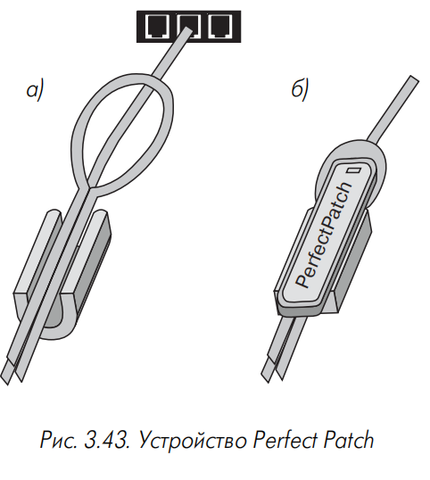

Шнуры изготовляются в производственных условиях или на объекте; рекомендуются фабричные — выше характеристики и надёжность.

Цветовая маркировка: окраска кабелей/хвостовиков вилок (иногда с цветными иконками — шнуры МС5 и MC6 Siemon) или цветные манжеты-защёлки на задней части вилки (ITT NS&S; стандартизовано **6 типов**, упаковки по 50 штук). IBM применяет манжету с фиксирующим ремешком; Ortronics в серии OR-827DTP800(X)DE — площадку для этикетки под прозрачной крышкой.

### 3.3.2. Коммутационные панели

> <mark>Коммутационная панель — элемент СКС, монтируемый в кроссовых и аппаратных для подключения кабелей подсистем и ручного соединения сегментов шнурами или перемычками.</mark>

Основные требования:

- <mark>максимальная плотность портов на единицу высоты;</mark>
- <mark>простота переключения шнурами/перемычками;</mark>
- <mark>эффективная символьная и цветовая маркировка портов и панели;</mark>
- <mark>ввод кабелей с соблюдением норм по изгибу и растяжению;</mark>
- <mark>крепление в 19-дюймовом конструктиве напрямую или через адаптер;</mark>
- <mark>простота монтажа порта и панели.</mark>

Для экранированных кабелей — полный круговой охват экрана и низкое переходное сопротивление.

Подключение кабелей — IDC-контакты. Для шнуров — разъёмы типа 110 или модульные; для перемычек — 110 или панели типа 66.

<mark>Три основные группы панелей:</mark>

- типа 110;

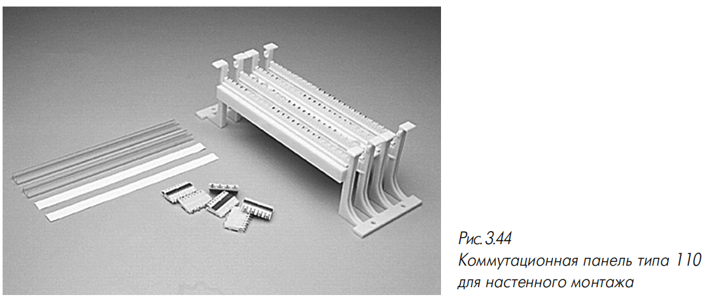

- типа 66;

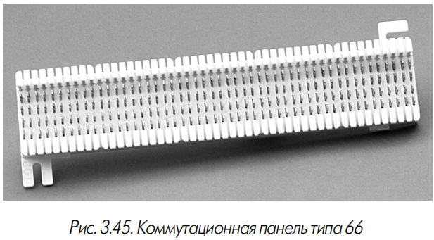

- с модульными разъёмами.

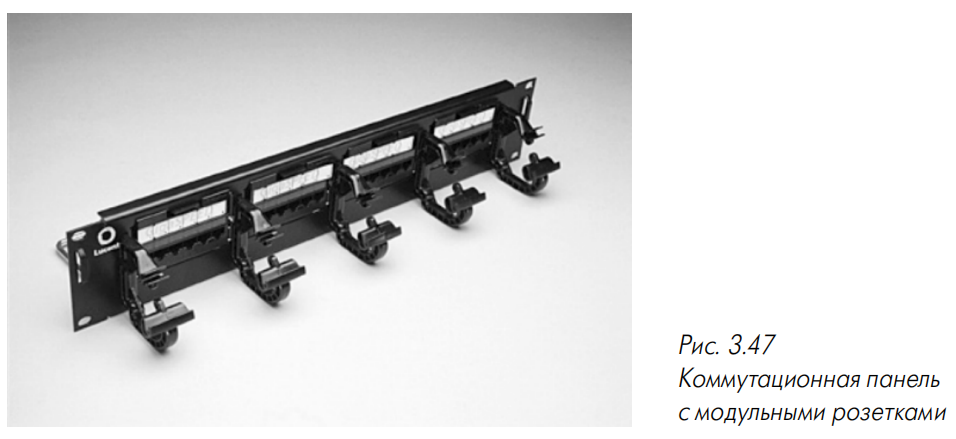

Панели с разъёмами Krone (Я так понял речь про плинты)

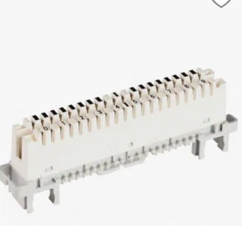

в СКС пока не получили широкого распространения. После признания категории 6 ожидаются панели с разъёмами S210 (раздел 3.2.5.2).

Отдельные образцы: панель BIX компании NORDX/CDT, панели с розетками DB (популярны в Европе).

#### 3.3.2.1. Коммутационные панели типа 110

Панель типа 110 образована одноимёнными разъёмами (раздел 3.2.3). Преимущество — переключение отдельной пары (высокая гибкость). Недостатки — более глубокие знания администратора и менее эстетичный вид.

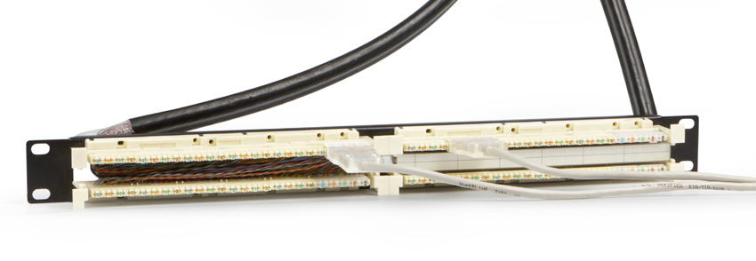

Большинство панелей — категория 5; примеры с более высокой пропускной способностью — PAN-PUNCH (Panduit, 5е) и 110 Patch Panels (Lucent Technologies).

Основные элементы:

- коммутационный блок;
- соединительные блоки;
- маркировочные полосы;
- организаторы кроссовых шнуров;
- элементы крепления.

> Коммутационный блок — базовый элемент панели типа 110: пластиковое основание с выступающими контактными полосами.

На каждой полосе — **50 пазов** для проводников и IDC-контактов соединительных блоков. Ёмкость линейки — один 25-парный пучок магистрального кабеля или шесть горизонтальных кабелей. Ввод многопарного кабеля — через овальные отверстия в левой и правой частях разделительного паза; некоторые панели имеют дополнительные отверстия в центре. Оболочка кабеля обычно удаляется так, чтобы в пазу проходили только витые пары (исключения — Panduit и ICC: оболочка 4-парных кабелей удаляется только с разводимой части).

Для облегчения монтажа контактные пары группируются по три, четыре или пять; торцевая часть выступа маркируется цветом второго провода пары. Распространены **100-парные** блоки с четырьмя полосами; есть **50-парные** половинной высоты.

Обязательный элемент — пластмассовые выступы с квадратной площадкой на конце по краям каждой полосы; площадка для маркировки (фабричные цифры 1–12 или наклейки/маркер на объекте).

Соединительные блоки — на 2 (110C-2), 3 (110C-3), 4 (110C-4) и 5 (110C-5) пар.

> Требование: даже при частичном заполнении 25-контактной полосы все пазы должны быть закрыты соединительными блоками.

Маркировочные полосы — сменные надписи (раздел 13.1.4): бумага под прозрачной крышкой между контактными полосами.

Организаторы — укладка избытка длины шнуров, предотвращение петель, видимость маркировки, защита от провисания. Для категории 5 применение организаторов обязательно. Организаторы большой ёмкости — вертикальные, отдельная позиция оборудования (раздел 5.1.4). Горизонтальные малой ёмкости разделяют 100-парные блоки кроссовых башен. Ёмкость штатного организатора — все шнуры соседних блоков (четыре линейки). Некоторые типы имеют съёмные декоративные кожухи.

Элементы крепления — монтаж блока или панели на стене или в 19-дюймовом конструктиве. Для 19 дюймов — металлические пластины с фиксаторами цангового типа (rivet) или винтами: две вертикальные колонны из 100-парных блоков и организаторов.

> Кроссовая башня — совокупность коммутационных блоков с разделяющими организаторами на монтажном основании.

Основание — металлические П-образные рамы из анодированной стали с отверстиями, выштамповками под стяжки. В системе VisiPatch (Lucent Technologies) — пластмассовая рама из двух деталей (удобнее транспортировать; прочность за счёт большей толщины; окраска «под металл»). Обеспечена гальваническая развязка и наращивание высоты.

Основание монтируется на стене; для 19 дюймов — П-образные монтажные скобы (пара скоб — две кроссовые башни рядом).

**Таблица 3.30 — Кроссовые башни типа 110 с четырёхпарной разводкой**

| Компания | Тип панели | Количество пар |
|---|---|---|
| Lucent Technologies | 110PB2-300FT | 300 |
| | 110PB2-900FT | 900 |
| Ortronics | OR-806003522 | 300 |
| | OR-806003525 | 900 |
| Panduit | P110KT3004 | 300 |
| | P110KT9004 | 900 |
| Siemon | S110MB2-300FT | 300 |
| | S110MB2-400FT | 400 |
| | S110MB2-500FT | 500 |

Ёмкость панелей с монтажным основанием — до **900 пар** (типовые 300 и 900).

Панели для настенного монтажа — пластмассовые ножки с отверстиями под шурупы; типовая ёмкость **100 и 300 пар** (табл. 3.31). Ножки — интегральные или отдельные.

**Таблица 3.31 — Коммутационные панели типа 110 с четырёхпарной разводкой для настенной установки**

| Компания | Марка панели | Количество пар |
|---|---|---|
| Panduit | P110KB1004 | 100 |
| | P110KB3004 | 300 |
| Ortronics | OR-30200006 | 100 |
| | OR-30200007 | 300 |
| Lucent Technologies | 110AB2-100FT | 100 |
| | 110AB2-300FT | 300 |
| AMP | 588841-1 | 50 |
| | 588842-1 | 100 |
| | 588843-1 | 300 |
| Siemon | S110AW1-50 | 50 |
| | S110AW1-100 | 100 |
| | S110AW1-200 | 200 |
| | S110AW1-300 | 300 |
| BICC | CAT5-S110-AW1-50 | 50 |
| | CAT5-S110-AW1-100 | 100 |
| | CAT5-S110-AW1-300 | 300 |
| ICC | IC110WF050 | 50 |
| | IC110WF100 | 100 |
| | IC110WF300 | 300 |

Разновидности настенного крепления:

- рамка типа 36.С0010 компании Molex (семь блоков, монтаж в одну колонну);
- элемент 110A1 Hanger Bracket компании Lucent Technologies — планка 110,5 см с отгибными лапками; пара планок позволяет навесить до пяти кроссовых башен типа 1210 (300 и 900 пар).

Большинство панелей типа 110 — горизонтальные. Единичные образцы с вертикальными полосами (для стены) используют рамку панелей типа 66; ёмкость — до **50 пар**.

Кроссовые башни обычно из блоков одного типа; ограниченно — из блоков на разное число пар (4- и 3-парных) для сетей с жёстким разделением секций на компьютерные и телефонные.

При защите от несанкционированного доступа, огня, влаги, солнца оборудование типа 110 может закрываться в металлическом шкафу. Пример импортного — 3A Cable Terminal Section компании Lucent Technologies.

Классические панели 110 рассчитаны на шнуры с вилками 110, что расширяет номенклатуру шнуров. Для устранения разработаны комбинированные панели: контакты линейки параллельны контактам гнезда модульного разъёма — можно обойтись только модульными шнурами. Плотность портов снижается, что несущественно в сетях до **100 рабочих мест**. Дополнительное преимущество — меньшая монтажная глубина (кабели заводятся на разъёмы 110). Розетки могут располагаться рядом с линейками (S100DB1-24RJPA фирмы Siemon) или отдельным блоком сбоку (MJWC5-8-39TB компании Homaco; линейки закрываются декоративной крышкой).

Ограниченная номенклатура панелей типа 110 с параллельными контактами линеек двух разъёмов по дорожкам печатной платы и нормальнозамкнутым контактом, размыкаемым адаптером (для тестирующего оборудования; важно для телефонных сигналов и точек перехода). Пример — S110T(X)1 компании Siemon.

Эстетика панели типа 110 улучшается съёмными крышками штатных горизонтальных организаторов (Siemon). Лучшие показатели — у серии VisiPatch (Lucent Technologies): пластмассовые блоки разводки (wiring block) с крышками и вилки шнуров с обратной ориентацией контактных пластин.

#### 3.3.2.2. Коммутационные панели типа 66

Панели типа 66 известны несколько десятилетий; коммутационные шнуры не используются — коммутация перемычками. Подключение кабелей и перемычек — IDC-контакты S66 (рис. 3.45). Из-за отсутствия разъёмного соединителя ориентированы на приложения без частой перекоммутации; основная область — телефонные системы.

**Рис. 3.45 — Коммутационная панель типа 66.**

На середину 2001 года многие производители исключают панели типа 66 из штатного оборудования, некоторые оставляют «по инерции».

Типовая конструкция:

- коммутационный блок;
- маркировочные элементы;
- организаторы;
- элементы крепления.

> Коммутационный блок — пластиковое основание различной высоты с линейками IDC-контактов типа 66 разной ёмкости.

Ориентированы на разводку 25-парного пучка магистрального кабеля; возможна разводка кабелей другой ёмкости с монолитными проводниками. Кабели с многопроволочными проводниками не рекомендуются. Контакты — одно-, двух-, четырёх- и восьмисекционные; иногда с лапкой для пайки или накрутки (рис. 3.46). Некоторые типы имеют направляющую щель перед режущими кромками; верхняя часть рабочего элемента — выступ-носик против выскакивания провода.

**Рис. 3.46 — Контакты панелей типа 66:**
- **а)** односекционный;
- **б)** двухсекционный;
- **в)** четырёхсекционный;
- **г)** восьмисекционный.

Некоторые блоки имеют штатную защитную крышку (надевается или с петлями на пазы организатора перемычек). Крышки могут окрашиваться для обозначения секций (Siemon — девять цветов).

Маркировочные элементы — полоса бумаги под прозрачной частью защитной крышки.

Организаторы — пазы в планках по длинной стороне коммутационного поля; обеспечивают позиционирование перемычек без фиксирующего или ослабляющего натяжения.

Элементы крепления — на стену или в 19-дюймовый конструктив. Для стены — пластиковая рамка с защёлками (штатный крепёж; ориентация по надписи «Top» со стрелкой). Рамки — основание при монтаже нескольких панелей на металлическую раму. Для помещений с посторонними — металлические шкафчики; для консолидационных точек — пластмассовые с прозрачной крышкой. Монтаж в 19 дюймов используется редко.

Преимущества панелей типа 66:

- высокая плотность контактов и хорошие массогабаритные показатели перемычек;
- подключение к контакту более одной пары кабелей и более одной перемычки — гибкая конфигурация;
- эстетичный вид (нет пучков шнуров).

Недостатки: более глубокое знакомство администратора со структурой СКС; менее удобная коммутация перемычками. Большая длина развивки пары и габариты контактов не позволяют в большинстве случаев получить характеристики выше категории 3 — наибольшее применение в телефонии. Ограниченная номенклатура панелей типа 66 с улучшенными характеристиками (главным образом NEXT) за счёт уменьшения габаритов контактов S66M1-50 и увеличения расстояния между ними: высота контактного элемента уменьшена с **25,7 мм (1,01 дюйма)** до **19,7 мм (0,775 дюйма)** — пригодны для категорий 4, 5 и даже 5е [76].

#### 3.3.2.3. Коммутационные панели с розетками модульных разъёмов

Главный признак — розетки 8-контактных модульных разъёмов на лицевой стороне для вилок коммутационных шнуров (рис. 3.47).

**Рис. 3.47 — Коммутационная панель с модульными розетками.**

Компоненты:

- коммутационный блок;
- элементы маркировки;
- организаторы кабеля;
- элементы крепления.

> Коммутационный блок — пластинчатое основание с розетками модульных разъёмов; основной материал — анодированный алюминий.

Пластина выполняет функции лицевой панели. Большинство производителей размещают логотип слева, наименование и категорию справа.

Большинство панелей — горизонтальное расположение розеток в один (до 24 портов) или несколько (максимум пять) рядов. Рекомендуемая минимальная плотность — **16 на 1U** и **48 на 3U** [77]. Ограниченно — панели с вертикальными сборками по 4 или 5 розеток (Reichle & De-Massari, Ackermann).

Лицевая поверхность обычно чёрная; возможна цветовая кодировка секций (ITT NS&S: категория 3 — чёрный, красный, зелёный).

Коммутационные блоки: неразборные, разборные и промежуточные (рис. 3.48).

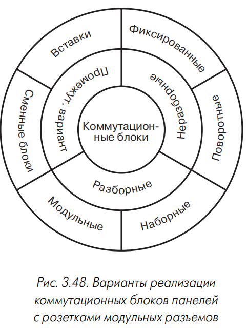

**Рис. 3.48 — Варианты реализации коммутационных блоков панелей с розетками модульных разъёмов.**

В отличие от информационных розеток (раздел 3.3.3), подавляющее большинство панелей — с прямой установкой розеточных модулей. Единичные образцы с угловой установкой — серия 4224 норвежской компании Telesafe (удобство коммутации и чтения маркировки).

Наиболее развитая номенклатура маркирующих элементов. Для отдельных розеток — маркировочные поля прямоугольной формы (индивидуальные или непрерывные на группу). Запись — мягким карандашом или маркером. Варианты со сменными надписями (окошко с прозрачной крышкой на защёлках) широкого распространения не получили. В панелях серии ALPHA компании Elgadphon цифровое обозначение порта и маркировочное поле совмещены (скос левого верхнего угла окошка). Возможна двойная маркировка с цветной вставкой-иконкой (в гнездо лицевой панели или в установочный элемент гнезда розетки — некоторые панели Ortronics).

Организаторы кабеля — укладка горизонтальных и магистральных кабелей и шнуров. Чаще — отдельный элемент (раздел 5.1.4); есть варианты с интегральными разрезными кольцами под розетками. Организаторы разделываемых кабелей — съёмная скоба (пазы или винты) для уменьшения габаритов упаковки.

Элементы крепления — на стену или в 19-дюймовый конструктив (чаще второй). Для 23-дюймового — штатные адаптеры.

Обычно на задней поверхности — только IDC-контакты. В панелях серии SMART компании RIT Technologies и панелях Elgadphon IDC-контакты нижнего ряда заменены гнёздами модульных разъёмов — фактически **проходные адаптеры** (раздел 3.4.2). Обычные шнуры используются как монтажные (рис. 3.49): подключение вилки сзади «разгружает» лицевую поверхность, улучшает эстетику и чтение маркировки. В интеллектуальных панелях RIT Technologies сзади — дополнительный разъём для ленточного кабеля к сканеру PatchView (раздел 13.1.3).

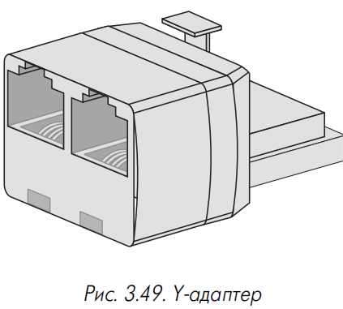

**Рис. 3.49 — Y-адаптер.**

##### Варианты конструктивного исполнения коммутационных блоков

**Неразборные блоки** (рис. 3.48) — розетки установлены на заводе; высокая плотность и возможность разводки большого количества кабелей. Передача сигналов от IDC-контактов к розеткам — по проводникам печатной платы. Сборки розеток и оконцевателей на одной плате имеют разную ёмкость; популярны 6- и 8-портовые. Из-за печатного монтажа разводка некоторых панелей — только однопроводным ударным инструментом (5-парный запрещён из-за опасности повреждения платы). Большинство неразборных блоков — по фиксированной схеме; для устранения неудобств применяются поворотные (распределительные) модули.

**Разборные блоки** — монтаж розеточных модулей на объекте. При монтаже напрямую — **наборные панели** (под один тип модуля; плотность не уступает неразборным — 24 на 1U).

**Модульные панели** — блоки через адаптеры, унифицированные с блоками информационных розеток. Высокая гибкость: установка нужных модулей в нужном количестве; лёгкий переход от электрических решений к оптическим (Mix-and-Match-Panels). Свободные проёмы закрываются заглушками. Поставка: панель и модули отдельно (сборка на объекте) или с установленными модулями.

Большинство панелей на разборных блоках — «нормальная» установка розеточных модулей (контакты сверху, выемка для рычага защёлки снизу). «Боковая» установка — редко (например, некоторые панели Quante).

В крупных сетях разборные блоки малоцелесообразны — проигрывают неразборным по стоимости и плотности. Пример: 96-портовые HD5-96 (неразборный) и CT-PLN-96-ID (разборный) компании Siemon — высота **4U** и **7U**. Преимущества проявляются в небольших системах или при постоянных изменениях.

**Промежуточный вариант** — две модификации:

- **AMP (NetConnect)**: кабель подключается к контактам панели, модуль снабжён коммутационной вставкой с печатными проводниками (**Edge Connector**). Гибкое изменение типа интерфейса (8- и 6-контактные модульные, MIC Token Ring и т.д.), но стоимость выше; тяготеет к неразборному блоку;
- разборные блоки в виде сборок по несколько штук (панели CPP компании Panduit), устанавливаются в корпусе по мере необходимости. Незанятые проёмы — заглушки; в серии ALPHA компании Elgadphon на торце заглушки (8-module blind cover) изображены гнёзда розеточных модулей.

##### Области применения и варианты исполнения

Панели с модульными розетками наиболее эффективны для приложений ЛВС (достаточно администрировать полными 4-парными каналами). Наилучшие эстетические характеристики, простота коммутации. При администрировании отдельными парами заметно повышают стоимость СКС (особенно в магистральных подсистемах). Основная область — горизонтальная подсистема.

Типовые значения ёмкости: **12, 16, 24, 32, 48, 64, 96 и 120** розеток (портов). Панели с большим количеством портов нецелесообразны — затрудняют управление шнурами. Максимальная ёмкость панели 1U — обычно **24 порта**; единичные образцы — 48 портов (Molex). Панели с большим количеством портов — увеличенной высоты.

Большинство производителей выпускают панели с разводкой 568А и 568В; рекомендуется **T568В**. Общие сведения — в табл. 3.32.

В панелях серии SMART компании RiT каждое гнездо снабжено красным индикаторным светодиодом; для коммутации применяются специальные **9-проводные** шнуры (раздел 13.1.3).

**Таблица 3.32 — Коммутационные панели с модульными розетками категории 5 и разводкой 568В**

| Компания | Марка панели | Число портов | Высота |
|---|---|---|---|
| Siemon | HD5-16А4 | 16 | 1U |
| | HD5-24A4 | 24 | 1U |
| | HD5-32A4 | 32 | 2U |
| | HD5-48A4 | 48 | 2U |
| Lucent Technologies | 1100AA1-24 | 24 | 1U |
| | 1100AA11-48 | 48 | 2U |
| Alcatel | ACS-503.124 | 48 | 3U |
| MOD-TAP | IDC-KATT1U-24xRJ45 cat 5 | 24 | 1U |
| | IDC-KATT1U-48xRJ45 cat 5 | 48 | 2U |
| Homaco | MJPC5-8-37TB | 24 | 1U |
| | MJPC5-8-35TB | 48 | 2U |
| Hubbell | MCC5802110A19 | 16 | 1U |
| | MCC5806110A19 | 48 | 2U |
| | MCC5812110A19 | 96 | 4U |
| | MCC5815110A19 | 120 | 5U |
| ICC | ICMPPOXX5B | 24 | 1U |

##### Подключение кабелей к коммутационным панелям

IDC-контакты розеток модульных разъёмов — в вариантах 110 или Krone. Американские производители тяготеют к 110, в Европе популярнее LSA+ фирмы Krone. Иногда предлагаются оба варианта. Контакты обычно с задней стороны в один или два ряда — неудобства при разводке. Решения (рис. 3.50):

- **откидные панели** — 19-дюймовые конструктивы с петлями/шарнирами: панель откидывается вбок или вперёд под углом, близким к **180°** (рис. 3.50а);
- **монтажные кронштейны** компании RIT Technologies — навешиваются на рельсы, панель устанавливается с поворотом примерно на **135°**; после подключения кабелей панель снимается, кронштейны удаляются (рис. 3.50б);
- **модульная панель PATCHMAX** компании Lucent Technologies — 4 или 8 шестипортовых распределительных модулей DM2150; вставляются на защёлках, поворачиваются вокруг горизонтальной оси почти на **180°** для доступа к IDC-контактам 110;
- **развёрнутые на 180° линейки IDC-контактов** на передней панели рядом с розетками; после разделки закрываются откидной или накладной заслонкой. Снижение плотности — примерно **0,5U** на каждый ряд розеток. В панелях Reichle & De-Massari снижения плотности практически нет (IDC-контакты закрываются откидными крышками с маркировочными полями);
- **Front Access Modular to 110** компании Ortronics — розетки на выступающем из лицевой панели основании: кабели к гребёнкам типа 110 подводятся без доступа к задней поверхности. Невысокая эстетика, но эффективно в сильно загруженном шкафу;
- **выдвижная полка** с отклонением вниз на угол примерно **30°** (Alcatel, Ackermann и др., рис. 3.50в).

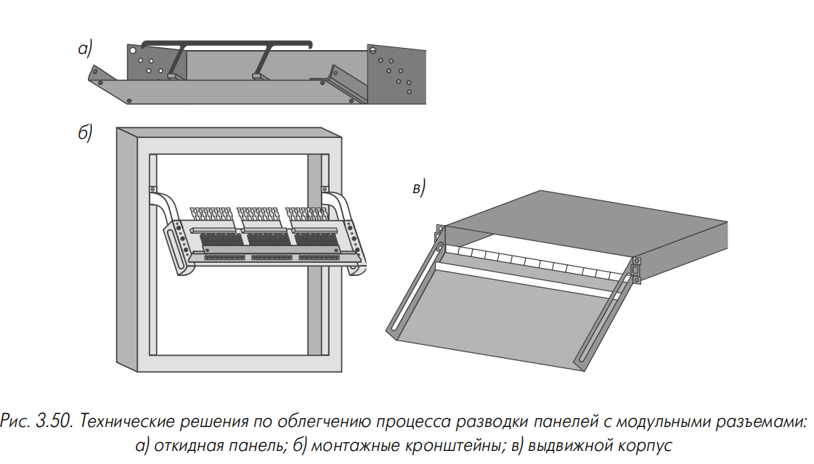

**Рис. 3.50 — Технические решения по облегчению процесса разводки панелей с модульными разъёмами:**
- **а)** откидная панель;
- **б)** монтажные кронштейны;
- **в)** выдвижной корпус.

Для подключения многопарных кабелей к модульным панелям используют разъёмы TELCO (табл. 3.33); часто выпускаются два варианта панели — с вилкой и розеткой TELCO. Термины «патч-панель типа 110» и «патч-панель типа TELCO».

**Таблица 3.33 — Коммутационные панели с разъёмами TELCO и розетками модульных разъёмов**

| Компания | Марка панели | Число портов | Категория |
|---|---|---|---|
| Lucent Technologies | 2500Cat5 Modular Jack Panel | 24, 48 | 5 |
| Mod-Tap | 27.6E.241.B004G | 24 | – |
| Ortronics | OR-808004926 | 24 | 3 |
| | OR-808004927 | | |
| Siemon | CT-PNL-XX-XX-01 | 16–96 | 3 |
| Telesafe | 4145-0000 | 24 | 5 |
| | 4143-0000 | 24 | 3 |

Кроме технических помещений, панели с разъёмами TELCO рекомендуются как основной элемент консолидационной точки.

##### Особенности коммутационных панелей для экранированных кабелей

Панели для S-STP отличаются экранированными розеточными модулями и средствами заземления экрана. Для S-UTP — только общий экранирующий кожух (винты или защёлки; предпочтительнее защёлки). Заземление — съёмная или интегральная П-образная скоба с зажимами (**grounding bracket**) в задней части панели; иногда зажимы на отогнутой назад полке. Скоба выполняет функции организатора кабелей. В разборных блоках низкое переходное сопротивление иногда обеспечивается прямым контактом экранирующего кожуха модуля с установочным гнездом панели.

Низкое переходное сопротивление между корпусом блока и контуром заземления — при затяжке крепёжных винтов в 19-дюймовом конструктиве; остатки краски и лака иногда мешают. Поэтому в комплектацию экранированной панели обязательно входит заземляющий кабель.

Плотность портов экранированной панели обычно ниже: как правило, **16 розеток на 1U** вместо 24. Исключения редки: 24 экранированных порта на 1U — панель типа 502 компании АйТи.

##### Панели для настенного монтажа

Применяются в небольших СКС с жёсткими требованиями по стоимости. Панель обычно устанавливается горизонтально с использованием 19-дюймового конструктива. Распространены конструкции на небольшое число портов (как правило, **12**) с вертикальным монтажом (558260 компании АМР, HD5-89D-12 фирмы Siemon) — **мини-панели** (mini patch panels). Установка — с пластиковой рамкой типа S89, аналогичной панелям типа 66.

Панели с вертикальной ориентацией обычно по фиксированной схеме на основе двух 6-портовых сборок. Принципиальный недостаток — гнёзда розеток повёрнуты на **90°** — считается несущественным. Единичные серийные изделия по наборной схеме с нормальной ориентацией гнёзд: А10 (10 портов) и PP12RB (12 портов) компании Superior [78].

#### 3.3.2.4. Претерминированные и бесшнуровые панели

Разводка панели — сложная и утомительная процедура для квалифицированного персонала со специальным инструментом и дорогим контрольным оборудованием. Решения двух групп:

1. **Претерминированные (предразведённые) панели** — разводка выполнена на заводе; предназначены главным образом для облегчения подключения телефонных станций. Обычно один или несколько блоков 110 или 66 с разделаными многопарными кабелями; на втором конце — вилка или розетка TELCO. Конструкции с розетками модульных разъёмов распространены меньше. Максимальная ёмкость претерминированных панелей типа 110 — до **900 пар**. Разводка некоторых панелей типа 66 — кроссировочным проводом; розетки TELCO и модульные устанавливаются на корпусе сзади или сбоку, по отдельности или вместе. К претерминированным условно относятся панели с модульными разъёмами, выходы которых соединены с контактами TELCO. Большинство — для кроссовых и подключения сетевого оборудования коллективного пользования; единичные — для многопользовательских розеток MUTO в открытых офисах (OR-60950092 и OR-854044831 компании Ortronics).

2. **Бесшнуровые панели** — несколько пар модульных разъёмов с короткими внутренними соединениями по дорожкам печатной платы. Разводка по разной схеме; требует согласования с типом шнура. Пример — Cordless patch® компании Siemon.

Развитие принципа — на основе разъёмного соединения двух проводников в одной ячейке (панели серии SMART компании RIT Technologies). Некоторые модели (**switching patch panel**) — модульные разъёмы, попарно соединённые по дорожкам внутренней печатной платы; такое же решение у Elgadphon. Отличие — дополнительный движковый переключатель, разрывающий соединение (рис. 3.51). Использован запрет стандартов СКС на параллельное подключение оборудования к тракту: не нужны доступные с лицевой панели контакты, вместо вставки с розеткой — переключатель. При тщательном планировании можно обойтись без коммутационных шнуров (по крайней мере на первом этапе).

Кроме основного назначения, панели с переключателями за счёт параллельного соединения одноимённых проводников двух розеток позволяют эффективно подключать контрольное оборудование.

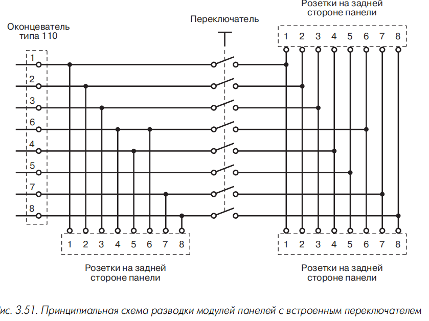

**Рис. 3.51 — Принципиальная схема разводки модулей панелей с встроенным переключателем.**

#### 3.3.2.5. Прочие разновидности коммутационных панелей

- **Панели Ethernet** (Hubbell, SMP) — для «двухпарных» вариантов сетевых адаптеров; снижают стоимость, но теряется универсальность трактов СКС. В нашей стране распространения не получили.
- **Телефонные панели** — для аналоговых и цифровых телефонов; 6-контактные розетки дают повышенную плотность (Molex — 50-портовая панель высотой 1U).
- **ISDN-панели** — в немецкоязычных странах; розетки сгруппированы по 8 и соединены по схеме шины S0.
- **Панели с балунами** — для больших объёмов сетевого оборудования с коаксиальным и триаксиальным интерфейсами. Обычно 16-портовые; 32-портовые реже. На лицевую сторону выводится модульная, коаксиальная или триаксиальная розетка (Hubbell, AMP).
- **Панели с элементами активного оборудования** — не стандартные изделия СКС; ограниченное распространение в конце 90-х (глава 7).

#### 3.3.2.6. Распределители

> Распределитель — коммутационное устройство для монтажа без монтажных конструктивов и вне технических помещений.

Выделились в конце 90-х в связи с ростом СКС для небольших офисов и домашних сетей (SOHO). Пластиковый корпус с **4–6** розеточными модулями модульных разъёмов. Внешне похож на многопортовую информационную розетку (раздел 3.3.3), но розетки — только на одной узкой стороне корпуса.

Монтируются на стене, декоративном коробе, рабочем столе; несколько распределителей — друг над другом (крепежный хомут) или рядом. Ввод кабеля — с задней, боковой стенок или днища. Корпус — термопластичная пластмасса с низким содержанием галогенов; возможны металлические корпуса. На декоративной крышке — поля и окошки для маркировки и иконок.

Дополнительно: ножки с антипроскальзывающими накладками, магниты для стальных поверхностей. Пример серийного продукта — изделия серии MPD компании Telegartner [79].

# Глава III. Электрические компоненты СКС (продолжение)

## 3.3.3. Информационные розетки

### 3.3.3.1. Традиционные конструкции

> Информационная розетка — устройство на рабочем месте для подключения горизонтального кабеля; состоит из корпуса и одного или нескольких (максимум 12) розеточных модулей 8-контактных модульных разъёмов.

> Розеточный модуль — электрический модуль розетки, являющийся составной частью горизонтальной подсистемы.

Согласно ISO/IEC 11801 одна розетка должна обслуживать примерно **10 м²** рабочей площади и обеспечивать минимальную конфигурацию:

- один модуль категории 3 или выше;
- один модуль категории 5 или оптический разъём.

При двухпарных кабелях розеточные модули должны быть соответствующим образом промаркированы.

Корпус обычно пластмассовый; по способу крепления различают:

- **внешние** корпуса (рис. 3.53а) — закрывают розеточный модуль со всех сторон;
- **внутренние** корпуса (рис. 3.53б–г) — декоративная лицевая панель или монтажное основание, оставляющее часть модуля открытой.

**Рис. 3.52 — Варианты конструктивной реализации информационных розеток.**

**Рис. 3.53 — Различные виды информационных розеток:**
- **а)** внешняя с прямой установкой;
- **б)** внутренняя с прямой установкой;
- **в)** внутренняя с угловой установкой и выступом;
- **г)** внутренняя с угловой установкой и выемкой.

Дизайн и крепёж панелей учитывают национальные и региональные стандарты (итальянский, французский, немецкий, скандинавский и др.), отличающиеся габаритами и размерами установочного окна (табл. 3.34).

**Таблица 3.34 — Габаритные размеры установочных окон для розеточных модулей**

| Стандарт | Габаритные размеры, мм |
|---|---|
| 6СЕ | 50×25 |
| 6С | 21,3×36,7 |
| Mosaic 45 | 45×45 |
| 6A | 24×17,5 |

**Требования к корпусу:**

- эстетичный внешний вид;
- место для маркировки;
- устойчивость к механическим воздействиям;
- желательна невозможность разборки без инструмента (защита от любопытных).

**Крепление внешнего корпуса:** шурупы с дюбелем, двухсторонняя липкая лента, магнитные фиксаторы (Molex — по спецзаказу; Lucent Technologies — съёмный фиксатор: один для корпусов на четыре модуля, четыре — для шести и двенадцати модулей).

**Крепление внутреннего корпуса:** защёлки (винты — реже, главным образом в тяжёлых экранированных конструкциях).

**Защита гнезда:** сдвижные или откидные подпружиненные крышки (вверх или вниз). Сдвижная — элемент корпуса, откидная — деталь розеточной части модуля или съёмный адаптер. Большинство модулей имеют индивидуальные крышки; иногда крышка закрывает пару розеток сдвоенного модуля (Corning ICCS).

> Скрытая розетка (hideout outlet) — внешняя розетка с общей крышкой и вырезами под кабели шнуров; после подключения шнуров крышка защищает вилки от повреждений и незадействованные гнёзда от загрязнений.

**Крепление розеточного модуля:** пластмассовые защёлки (обычно), винты через лицевую металлическую панель, фиксация декоративной накладкой. Гнездо располагается перпендикулярно корпусу (рис. 3.53а,б) или под углом вниз (рис. 3.53в,г). Угол — обычно **45°** (иногда 15°, 75° и др.).

**Преимущества угловой установки:**

- больший радиус изгиба шнура (провисает практически вертикально) — меньше вероятность повреждения и лучше электрические характеристики; то же для горизонтального кабеля в коробах;
- при рывках за шнур меньшее плечо рычага — меньшие механические нагрузки на модуль;
- более эффективная защита гнезда от пыли и посторонних предметов.

Угловая установка с выступом: специализированный модуль в плоскую панель или плоский модуль с выступом на панели. Информационная розетка с угловой установкой — единственно возможная для некоторых типов подпольных коробок.

Большинство внутренних розеток имеют один или два модуля; с тремя модулями (середина 2001 года) — редко. Модули располагаются треугольником (Telesafe серии 4671) или в один ряд (Panduit MINICOM).

Решения для адаптации к условиям установки редки: подвижная верхняя часть в пределах **5,4 мм** (ряд немецких фирм) или двойная защёлка Lucent Technologies (прямая или под углом **45°**).

Известны розетки с защитой от высокого напряжения и импульсных помех: газовые разрядники, диодные цепочки, RC-цепочки. Нагрузочные резисторы как штатные элементы — в некоторых модульных вставках NETConnect компании AMP.

**Разводка горизонтального кабеля:** на линейке разъёма типа 110 или на отдельных IDC-контактах. В последнем случае контакты часто закрываются пластмассовой крышкой (иногда — установочный элемент для проводов). Для надёжности — дополнительная фиксация кабеля пластиковой стяжкой (в комплекте, иногда уже продета).

**Ввод кабеля во внешний корпус:** сзади, сбоку или снизу; просвет отверстия закрывает тонкая пластмассовая перегородка, выламываемая при протяжке кабеля.

**Экранированные модули** отличаются экранирующим кожухом и проводящей вставкой в гнездо для непрерывности экрана. Раньше экран крепился к лепестку кожуха накруткой; с конца 90-х — хомут или зажим с полным круговым контактом. Известны разрезные зажимы: одна часть фиксирует оболочку, вторая накладывается на зачищенный экран [80]. Для S/UTP часто общий кожух на все модули; для S/STP — каждый модуль обязательно с кожухом.

**Электрические характеристики:** категории 3, 4, 5, 5е, 6 и 7; перечень параметров совпадает со списком для разъёмов. Некоторые производители двухмодульных розеток указывают переходное затухание между парами соседних модулей.

**Маркировка розеток:**

- цветные вставки с иконкой (телефонная трубка, монитор) или надписями DATA, PHONE, LAN, VOICE;
- защитные адаптеры и съёмные откидные крышки различного цвета;
- модули с различной окраской лицевой поверхности (белый, серый, чёрный, синий, красный, жёлтый);
- окошки для клеевых этикеток и сменных надписей;
- нумерация в корпусах на 6 и 12 портов;
- специальные маркеры с липкой подложкой.

Некоторые компании предлагают вставки, формирующие гнездо 6-контактного модульного разъёма (удобство подключения телефона и средство маркировки).

Корпуса — несколько цветов; наиболее распространены белые различных оттенков.

### 3.3.3.2. Розетки для телефонных аппаратов

Специализированные розетки для телефонов применяются редко, преимущественно там, где другое сетевое оборудование маловероятно (посты охраны). Из-за национальных особенностей и несовместимости со стандартными модульными разъёмами (рис. 3.54) большинство производителей СКС не включают их в свои системы и не сертифицируют решения на их основе. Для подключения телефонов рекомендуются телефонные адаптеры (раздел 3.4.2).

Применение специализированных решений возможно, только если они сохраняют розетку модульного разъёма. Известны розетки для настенных телефонов с прямой установкой одного модуля (плоская и keystone) и двумя круглыми пластмассовыми выступами со шляпками для навешивания аппарата. Обычно собираются на основе лицевой пластины-адаптера; возможны 8- и 6-контактные модули. Пример — стальные адаптеры MX-WP-SS и MX-WP(XX)-SS для модулей серии MAX компании Siemon.

**Рис. 3.54 — Форма розеток для подключения телефонных аппаратов различных национальных стандартов [81]:**
- **а)** французская;
- **б)** бельгийская;
- **в)** немецкая;
- **г)** португальская;
- **д)** испанская;
- **е)** международная.

### 3.3.4. Решения для открытых офисов

#### 3.3.4.1. Розетки для монтажа в подпольных коробках

Для рабочих мест в больших залах вдали от стен широко применяются подпольные коробки (раздел 5.2.4.1). Конструкция корпусов обычно рассчитана на обычные внутренние информационные розетки. Иногда производитель коробок выпускает только корпус, адаптируемый под конкретное применение.

> Напольный модуль (bodentank) — корпус-адаптер под коробку конкретного производителя с уже установленными внутренними розетками [82].

#### 3.3.4.2. Розетки MUTO и консолидационных точек

> MUTO (Multi User Telecommunications Outlet) — многопользовательская телекоммуникационная розетка.

Функции розеток MUTO чаще выполняют информационные розетки с **6 или 12** модулями. Корпуса рассчитаны на ввод обычных горизонтальных и 25-парных магистральных кабелей. Большинство — для открытой установки в офисе с соответствующим дизайном; есть варианты под фальшпол с упрощённым дизайном и меньшей стоимостью.

Специализированные изделия: AMP — 6-портовые розетки Modular Distribution Box (варианты 568А и 568В, разъём Telco для горизонтального кабеля, места под иконки). Lucent Technologies — зоновые распределительные коробки (zone wiring boxes): ввод шести 4-парных или одного 25-парного кабеля с разделкой на контактах 110; выход — шесть модульных розеток (MUTO) или типа 110 (консолидационная точка); настенная установка. Корпус AHB1 — подключение 25-парного кабеля через Telco, выход — шесть модульных розеток.

Появляются оптические (раздел 4.3.6) и комбинированные розетки консолидационных точек с модульным принципом построения.

Большинство консолидационных точек реализует индивидуальную схему подключения: каждая розетка подключается отдельным одиночным кабелем.

> RICI (Rapid Inter-Connect Interface) — шестипортовое групповое устройство компании Molex (рис. 3.55).

**Рис. 3.55 — Устройство RICI.**

Два симметричных корпуса: на одном — розетки DataGate, на другом — вилки WE8W (категория 5е). Корпуса из высокопрочного пластика Lexan, соединяются захватами. Универсальное монтажное основание для стены или за фальшпотолком. Лёгкость переключения штыревой части и обслуживание сразу шести портов экономят до **30%** затрат при изменении конфигурации СКС.

## 3.4. Оконечные шнуры, адаптеры и удлинители

> Оконечные шнуры, адаптеры и удлинители — элементы для подключения сетевого оборудования к СКС; формально не входят в сферу действия стандартов СКС.

Стандарты их подробно не специфицируют, давая общие рекомендации. Детальное знакомство необходимо по двум причинам:

- часто входят в список дополнительного оборудования производителя СКС или системного интегратора;
- удачный выбор расширяет список приложений, использующих СКС, то есть определяет технико-экономическую эффективность кабельной системы.

### 3.4.1. Оконечные шнуры

#### 3.4.1.1. Конструктивные особенности

> Оконечный шнур — отрезок кабеля для шнуров с двумя 8-контактными вилками модульных разъёмов; предназначен для подключения сетевого оборудования на рабочих местах и в кроссовых.

Стандарты задают только тип разъёма и общие ограничения по длине. При совпадении длин оконечный и коммутационный шнуры взаимозаменяемы. Классифицируются по категориям от 3 до 5; доступны категории 5е, 6 и 7. Могут быть неэкранированными и экранированными (STP, S/UTP, S/STP).

**Одностороннее заземление:** экран горизонтальной подсистемы соединяется с контуром заземления в кроссовой. Для этого — экранированные шнуры с гальванической развязкой экрана одной вилки от экрана кабеля:

- разрыв экрана у одной вилки (с маркировкой вилки); недостаток — риск неправильного подключения;
- **SAFEGROUND®** (Telesafe): разрыв примерно в середине кабеля, обе части экрана соединены конденсатором **150 нФ** с пробивной стойкостью не менее **230 В** — непрерывность экрана по переменному току и гальваническая развязка;
- **GLP** (Drahtek): двойная экранировка, каждый экран связан только с одной вилкой.

**Изготовление:** заводское (автоматическое/полуавтоматическое оборудование) или на объекте. В полевых условиях — ручной обжимной инструмент или вилка типа **700А8** (Lucent Technologies): корпус из двух половин с винтом-саморезом, восемь IDC-контактов в один ряд. Простота сборки ценой ухудшения характеристик: по ТУ максимальная скорость — не более **10 Мбит/с**.

Многие производители СКС запрещают в сертифицируемых системах шнуры не заводского изготовления (меньшая надёжность, трудности обеспечения категории 5 и выше, особенно NEXT).

Длины — дискретный ряд с шагом (американские компании — футовый, европейские — дециметровый).

Оконечные шнуры конструктивно не отличаются от коммутационных и часто вводятся в спецификации как элемент подключения рабочих станций. Шнуры с четырёхпозиционными вилками для телефонов обычно входят в комплект поставки аппаратов и в спецификации не отражаются.

В кроссовых оконечными шнурами соединяются порты сетевого оборудования и коммутационной панели (рис. 3.56а). На рис. 3.56в — решение на панелях серии SMART компании RiT Technologies (аналогично в панелях ALPHA фирмы Elgadphon): «разгрузка» передней части от кабелей шнуров, улучшение эстетики и чтения маркировки. Те же преимущества — у монтажных шнуров (рис. 3.56б).

**Рис. 3.56 — Варианты подключения сетевого оборудования к СКС:**
- **а)** с помощью оконечного шнура;
- **б)** с помощью монтажного шнура к панели с модульными разъёмами;
- **в)** с помощью оконечного шнура и панели SMART компании RiT Technologies.

Для регулировки длины в кроссовых — устройство Perfect Patch (раздел 3.3.1).

#### 3.4.1.2. Разновидности 4-парных оконечных шнуров

- **Прямой шнур** — проводники соединяют контакты вилок с одинаковыми номерами (рис. 3.57а).
- **Обращённый шнур** — во второй вилке порядок обратный: контакт 1 первой вилки с контактом 3 второй, контакт 2 с контактом 6 и т.д. (рис. 3.57б). Нужен редко — при непосредственном соединении двух рабочих станций одноранговой ЛВС без концентратора.
- **Специальные шнуры** — чаще для кабелей S-STP с рабочей частотой **600 МГц** и выше: используются крайние пары контактов, провода остальных пар соединяются с землёй. Для подключения Ethernet, Fast Ethernet и Token Ring — адаптеры или специальные шнуры с внутренним перекрещиванием проводников (подключение к парам 1 и 4). Пример — нуль-модемный шнур (рис. 3.57в) для связи двух компьютеров через последовательный порт. Для идентификации — маркирующие надписи и окраска оболочек.

**Рис. 3.57 — Схема соединения контактов вилок модульных разъёмов различных видов шнуров:**
- **а)** прямой шнур;
- **б)** обращённый шнур;
- **в)** нуль-модемный шнур.

В оптических подсистемах широко используются комбинированные (гибридные) шнуры с вилками оптических разъёмов разных типов. В электрических подсистемах комбинированные шнуры распространены меньше: в кроссовых — шнуры с вилками 110 и модульного разъёма (иногда как оконечные).

**Модульные соединительные шнуры** (Telegartner) реализуют cable sharing: соответствующее скрещивание пар для одновременной передачи 10Base-T (жёлтая оболочка) и 100Base-T (зелёная оболочка).

Для контрольных и измерительных приборов — специальные шнуры: вилка модульного разъёма или типа 110 на одном конце, клеммы «под винт» или зажимы «крокодил» на другом.

Шнуры для телефонов часто выполняются в виде упругой спирали (диаметр витков около **1,5 см**) — удобны, но не дают характеристик для высокоскоростных систем.

#### 3.4.1.3. Монтажные шнуры и оконцованные кабели

> Монтажный шнур — отрезок кабеля для шнуров с вилкой модульного разъёма на одном конце; витые пары второго конца разводятся на контактах 110 или модульного разъёма коммутационной панели.

Кабель прокладывается с обратной стороны панели — улучшает эстетику и чтение маркировки (рис. 3.56б). Обязательный элемент при построении коммутационного поля по схеме **cross-connect**. Также применяется для соединения панелей консолидационных точек с информационными розетками.

Выпускаются в основном неэкранированными (категория 5); экранированные (например, серия 9КЕ020ХХ компании Kerpen) — работают на частотах существенно выше 100 МГц.

Стоимость ниже коммутационных, но жёстко задают конфигурацию оборудования; замена требует доступа к задней поверхности панели. Поэтому выпускает ограниченная группа фирм (Lucent Technologies, RiT Technologies), и решение не получило повсеместного распространения. Lucent Technologies предлагает также монтажный шнур с вилкой MIC системы Token Ring.

Применение монтажного шнура для оконцевания горизонтальных кабелей добавляет в тракт дополнительное соединение, что не допускается стандартами. Установка разъёма на электрический кабель проще, чем на оптический, поэтому классические монтажные шнуры используются редко. Пример — **WTP pig-tail** (Telesafe, до 2000 года): короткий разветвительный шнур внутри настенной розетки, соединяющий горизонтальный кабель с отдельными модулями выходного интерфейса при Cable Sharing; работает до **862 МГц**, имеет встроенный балун для перехода на коаксиальный разъём; подключение к S/STP — через разъём CMG.

> Оконцованный кабель (connectorized cable) — электрический аналог претерминированной сборки: отрезок кабеля с установленными на концах разъёмами.

Чаще всего — 25-парный кабель категории 5 с разъёмами Telco (пример — серия CC525PP компании Lucent Technologies). Оконцованные 4-парные кабели — реже, когда основа СКС — коммутационная панель модульного типа; производитель предлагает набор строительных длин до **90 м** (пример — ICCS компании Corning).

#### 3.4.1.4. Комбинированные и многопарные оконечные шнуры

**Комбинированный шнур** — на втором конце 15-контактный DB-15, 25-контактный DB-25 или несколько штырьковых разъёмов; схемы разводки зависят от приложения.

**Многопарный шнур** — стандартная длина до **3,05 м** (10 футов), разъёмы TELCO (RJ-71). Коммутационная часть — две полосы по 25 контактов. Вилка и розетка почти одинаковы, легко монтируются на многопарном кабеле. Ранее категория не выше третьей; сейчас Lucent Technologies и AMP выпускают TELCO категории 5. Разъём устанавливается на одном или обоих концах; кабель с одним разъёмом вторым концом разводится на IDC-контактах. Шнур с вилкой или розеткой TELCO на обоих концах — для подключения УАТС к СКС.

> Особенность: во внерабочем состоянии контактные элементы разъёма обязательно закрываются защитными колпачками (обычно синий для розетки, красный для вилки).

> Разветвительный шнур («гидра», hydra) — 50-контактная вилка или розетка TELCO с заведёнными на неё шестью 4-парными кабелями с модульными вилками на другом конце (рис. 3.58).

**Рис. 3.58 — Шнур типа «гидра».**

Известны варианты с 8, 12 и даже 24 6-контактными вилками — подключение каждой пары многопарного кабеля. Характеристики — категория 3. Изготавливаются из UTP и S/UTP; большинство — на неэкранированном кабеле. В систему Mod-Tap входят разветвительные шнуры 23А-212-816 и 23А-208-811 для экранированного 25-парного кабеля.

### 3.4.2. Адаптеры

> Адаптер — элемент для подключения сетевого оборудования к СКС; выполняет хотя бы одну функцию: подключение разъёмов несовместимых размеров или типов (переходник), изменение схемы разводки, распределение многопарного кабеля на несколько (разветвитель), соединение кабелей.

Согласно TIA/EIA-568-A подавляющее большинство адаптеров имеет пожизненную гарантию производителя (контроль качества и золочёные контакты).

#### 3.4.2.1. Переходники

> T-переходник — элемент для изменения схемы подключения модульного разъёма, например с T568A на USOC.

Состоит из короткого отрезка кабеля с 8-контактной вилкой и корпуса с одной модульной розеткой; известны «жёсткие» варианты «вилка-розетка». Пропускная способность — не свыше **10 Мбит/с**. Пример — серия 950 компании Hubbell.

**Переходники на RS232 и RS/6000** (модульные адаптеры) — для подключения устройств с разъёмами DB09, DB15 или DB25 интерфейса RS-232 (V.24). Корпус с вилкой или розеткой DB и модульной розеткой; экранированный и неэкранированный варианты. Часто конфигурируется пользователем на объекте: штыревые контакты DB соединены с контактами модульной розетки короткими проводниками с цветовой кодировкой; для установки — инструмент-толкатель.

**Переходники на Token Ring** (согласующие, matching, волновые адаптеры) — корпус с разъёмом MIC системы Token Ring и модульной розеткой с активными контактами 1, 2, 3 и 6; внутренний трансформатор для согласования сопротивлений (рис. 3.59). Экранированный и неэкранированный варианты (со стороны MIC экран всегда есть). Позволяют перейти от интерфейса Ethernet, Fast Ethernet, CDDI и ATM на интерфейс Token Ring и передавать сигналы по 150-омным кабелям STP системы IBM. В нашей стране практически не встречаются, но могут быть заказаны (адаптеры 558420-1 и 558421-1 компании AMP).

**Рис. 3.59 — Принципиальная схема одной из возможных реализаций согласующего адаптера.**

#### 3.4.2.2. Разветвители

> Y-адаптер (двойник, сплиттер, duplex coupler) — устройство для разветвления пар кабеля, подключённых к контактам одной вилки модульного разъёма, на две (реже три или четыре) информационные розетки.

Большинство содержит 8-контактную вилку и корпус с двумя модульными розетками. Вилка может быть жёстко зафиксирована (адаптеры 400В2 и 400К компании Lucent Technologies) или соединена коротким отрезком кабеля (модульный адаптер компании Siemon) — см. рис. 3.49. Некоторые модели Quante имеют дополнительный фиксирующий винт с накаткой на передней поверхности между розетками (только со специальными розетками).

Выходные гнёзда — друг рядом с другом или друг над другом (последнее не перекрывает второе гнездо при горизонтальной ориентации). В **easy flex** адаптере компании Reichle & De-Massari вилка на шарнире с поворотом в пределах **60°** — для розеток с угловой установкой.

Корпус обычно удерживается только рычажным фиксатором вилки; иногда — дополнительная фиксация винтами (адаптеры серии 75XX компании INFRA+, винт обычной шлицевой отвёрткой; Quante — винт с накаткой).

Единичные образцы с большим количеством розеток: **female duplex coupler** (ICC) — три розетки; однопарный модульный адаптер для четырёх шестипозиционных вилок к гнезду высокочастотного разъёма AMP (фактически разветвитель с интегрированным шнуром с вилкой).

Внутри корпуса — требуемые взаимные подключения контактов. Чаще всего Y-адаптер разветвляет 4-парный горизонтальный кабель на две группы по 2 пары: два телефона или телефон и компьютер с Ethernet. Поддерживают скорость не свыше **10 Мбит/с**; большинство — неэкранированные, экранированные редки [83].

Иногда функции Y-адаптеров выполняют оконечные розетки: **dualport modular jack** серии BRWP компании Hubbell — два 6-позиционных гнезда на передней панели и 8 IDC-контактов сзади (нарушает универсальность разводки; предпочтительнее сменные модульные вставки NetConnect компании AMP).

> Гармоника (harmonica, multiline-адаптер) — обобщение Y-адаптера для многопарного кабеля: разветвление 25-парного кабеля на группы по 2, 3 или 4 пары.

Два основных варианта: выходы 8-контактных модульных разъёмов на вилку или розетку 25-парного TELCO (более распространён) или шесть 4-парных линеек типа 110. Количество выходных розеток зависит от схемы ветвления: при разводке по двум парам — до **12**. Варианты с параллельной и перпендикулярной плоскостью монтажа модульных разъёмов относительно TELCO (адаптеры серии 258 компании Lucent Technologies). Могут быть отдельным устройством (рис. 3.60), модулем для коробок или монтироваться в панели для 19-дюймового конструктива (**harmonica patch panel**). Пропускная способность — не более **10 Мбит/с**.

**Рис. 3.60 — Гармоника.**

#### 3.4.2.3. Балуны

> Балун (BALance-UNbalance) — устройство для соединения витой пары и коаксиального или твинаксиального кабеля; осуществляет переход от несимметричной схемы передачи к симметричной и согласование волновых сопротивлений.

Две основные разновидности: коаксиальный и твинаксиальный.

Коаксиальные балуны — для передачи телевизионных сигналов: высокие передаточные характеристики в широком диапазоне. Пример: балун Telesafe — рабочий диапазон **47–862 МГц**, потери не более **2 дБ**, обратное отражение не хуже **–10 дБ**.

Твинаксиальные балуны — для соединения терминального оборудования с большим компьютером (интерфейс на твинаксиальном разъёме).

Цветовая кодировка корпуса: красный — терминалы типа 3270; зелёный — твинаксиальные компоненты для AS/400. Балуны для твинаксиальных кабелей типа 365А компании Lucent Technologies — два элемента: 365 Balun Adapter (переход) и 365A Terminating Adapter (минимизация обратного отражения при отключенной станции).

Конструктивно: корпус с интегрированными модульным и коаксиальным разъёмами (миниатюрный балун) или один/оба элемента на отрезках кабеля (балун 384A компании Lucent Technologies — длина симметричного кабеля **3,6 м**). Большинство — отдельное навесное устройство. AMP производит серию балунов для NetConnect как модульную вставку в универсальную розетку или панель (меньше риск механического повреждения). AMP предлагает многопарный шнур 555540 типа hydra с 16 вилками или розетками BNC и встроенными согласующими трансформаторами.

Стандартный горизонтальный кабель содержит четыре витых пары с хорошими передаточными характеристиками, поэтому известны балуны с двумя и тремя коаксиальными разъёмами: первый — телевизионный сигнал и звук, второй — сигналы основных цветов.

> Видеоадаптер (baseband video adapter) — балун для передачи телевизионного сигнала в базовой полосе.
>
> Широкополосный видеоадаптер (broadband video adapter) — балун для многопрограммного телевизионного сигнала.

Выход балуна на витую пару — розетка на корпусе или вилка (чаще на отрезке горизонтального кабеля).

Hubbell выпускает 16- и 32-портовые панели с балунами: на лицевую панель выводится розетка 8-контактного модульного или коаксиального разъёма BNC. Элементы модульного разъёма балуна — экранированные или неэкранированные; в экранированном экран соединяется с внешним проводником BNC. Выходные проводники трансформатора в модульной розетке — чаще к парам 1–2 и 4–5. Внешний вид и схема — на рис. 3.61.

**Рис. 3.61 — Балун:**
- **а)** внешний вид;
- **б)** принципиальная схема.

#### 3.4.2.4. Другие виды адаптеров

**Модульный адаптер** — «дружественный» интерфейс для подключения к панели типа 66 и 110: корпус с гнездом модульного разъёма и элементами для подключения к контактам панели. Альтернатива комбинированному шнуру при подключении к панели типа 110. Варианты на три или четыре пары со стороны 110 (изделия 1110А1-3 и 1110А1-4 компании Lucent Technologies). Основная область — подключение измерительного оборудования к базовым линиям. Большинство — до четырёх пар. Siemon предлагает TAP-50 для одновременного подключения к 25 парам блока типа 66; на второй стороне — вилка или розетка TELCO.

**Измерительный адаптер** — схож с модульным, но устанавливается на размыкающие перемычки специальных панелей; может снабжаться согласующими нагрузочными резисторами. Варианты различаются направлением тестирования (исполнения А и В); возможно параллельное подключение (мониторный адаптер, рис. 3.62в). Предпочтительная область — консолидационные точки [31].

**Рис. 3.62 — Варианты исполнения измерительных адаптеров:**
- **а)** с размыканием, вариант А;
- **б)** с размыканием, вариант В;
- **в)** измерительный адаптер мониторного типа.

> I-адаптер (проходной, in-line адаптер) — устройство для увеличения длины коммутационных и оконечных шнуров с вилками модульных разъёмов.

Применение вызывает рост переходных помех и отражённого сигнала (уменьшение NEXT и SRL) — допустимо только при больших запасах. Корпус пластмассовый; для удобства — цветовая кодировка; возможен внешний металлический кожух для непрерывности экрана. Гнёзда — на противоположных торцах (прямой адаптер) или смежных боковых (угловой, облегчает повороты). Перечень — в табл. 3.35. Большинство — одиночного применения. UNICOM выпускает панель PATU5-816D-RA для 19-дюймового конструктива с 16 гнёздами. Hubbell предусматривает фланец и клипсу для монтажа в платах и панелях.

**Таблица 3.35 — I-адаптеры**

| Фирма-изготовитель | Наименование | Тип | Макс. скорость передачи, Мбит/с |
|---|---|---|---|
| Lucent Technologies | 451A-50 | Прямой | 10 |
| | 451A-60 | Прямой | 10 |
| AMP | 555052-1 | Прямой | 16 |
| | 555051-1 | Угловой | 16 |
| UNICOM | ILC-U508A-XX | Прямой | 100 |
| Hubbell | BRIA4P | Прямой | 16 |
| | BRIAJF8 | С фланцем | 16 |
| ICC | ICMMA3508DR | Прямой | – |
| Panduit | MMC | Прямой | – |

**Мостовой адаптер (bridging adapter)** — для нескольких рабочих станций или устройств по схеме многоточки: несколько розеток модульных разъёмов с запараллеленными одноимёнными контактами. При двух розетках — Y-мостовой (Y-Bridge). Пример — устройство типа 367A компании Lucent Technologies для подключения семи рабочих станций к хосту IBM System 36/38 или AS/400 через балун 365А (рис. 3.63). Практически не выполняется как отдельное устройство (не рекомендовано стандартами); чаще — вставка в розетку или декоративный короб с маркировкой. Входной порт — вилка или розетка.

**Рис. 3.63 — Схема внутренних соединений в мостовом адаптере типа 367A.**

Функции мостового адаптера выполняет **ADS-планка** компании CNZ Neubauer: 19-дюймовая панель с двумя независимыми группами по 9 розеток; один разъём — порт входа-выхода, остальные — в кольцевой структуре. При отключенной вилке замыкаются внутренние проводники для сохранения структуры кольца.

**ISDN-адаптеры** — для подключения оконечных устройств ISDN: вилка для 8-позиционного модульного гнезда, розетка на 6- или 8-позиционную вилку; внутри нагрузочный резистор для шины ISDN. Иногда по мостовой схеме с несколькими резисторами и розетками.

**Телефонные адаптеры** (розеточные конверторы) — для телефонных аппаратов с вилкой, отличной от 6-контактного модульного разъёма: корпус с гнездом соответствующей формы; подключение к информационной розетке — вилкой на корпусе или на коротком отрезке кабеля. Широкая номенклатура — у ITT NS&S.

**Фильтры среды (Media filter)** — фильтр нижних частот с граничной частотой **25 МГц** и крутизной **60 дБ на декаду**. Применение увеличивает NEXT за счёт подавления высокочастотного сигнала вне рабочей полосы. Рекомендуется для Token Ring. Обеспечивает интерфейс между 100-омным UTP и 150-омным разъёмом Token Ring. Исходно Token Ring предполагал экранированные витые пары типа 1 и 2; фильтр уменьшает паразитное излучение при передаче по UTP за счёт симметризации сигнала. Наибольшая эффективность — для 4-мегабитного Token Ring; при 16 Мбит/с эффект слабее [84]. Дополнительно обмотка фильтра работает как запирающая катушка. Конструктивно: пластмассовый корпус (экранированный — с металлическим кожухом); розетка DB9 на одном торце, гнездо 8-позиционного (иногда 6-позиционного) модульного разъёма или ввод шнура до **8,6 м** с 6- или 8-позиционной вилкой. Пример — изделия 558280 и 558281 компании AMP.

### 3.4.3. Удлинители

> Удлинитель (Line Extension) — устройство для увеличения длины соединения в СКС; применяется при отсутствии шнуров нужной длины и при невысоких требованиях к полосе пропускания.

Два варианта:

1. Соединительный шнур с вилкой модульного разъёма — составная часть прибора; на втором конце корпус с розеткой. Пример — Deutsche Electraplan (687 521 860 с 8-позиционной розеткой, 687 602 810 с 6-позиционной).
2. **Распределитель (distributor)** — корпус с пятью модульными розетками, одна из которых для соединения с розеткой СКС; для подключения используется обычный оконечный шнур. Многопортовое устройство для одинаковых или разных устройств. Пример — распределитель Reichle & De-Massari для четырёх аналоговых телефонов; устройство MCS компании Telena — для аналоговых телефонов, рабочих станций и устройств Ethernet.

Функции однопортового удлинителя может выполнять обычный оконечный шнур с I-адаптером (раздел 3.4.2).

## 3.5. Дополнительное оборудование для построения трактов передачи информации СКС

Оборудование, не получившее широкого распространения и выпускаемое ограниченным кругом компаний. Большинство изделий формально выходит за область действия стандартов, но их применение расширяет функциональные возможности кабельной системы.

### 3.5.1. Комплекты и наборы для установки кабельной системы

Для быстрого развёртывания небольших кабельных систем ряд компаний (Molex, Lucent Technologies, Alcatel и др.) выпускают комплекты компонентов и расходных материалов (табл. 3.36). Обязательные элементы: абонентские розетки, коммутационные и оконечные шнуры заводского изготовления, коммутационные панели. Дополняются кабелем, монтажным шкафом, тестирующим оборудованием, инструментом. Помощь — подробная инструкция и даже видеокассета (Molex). При необходимости — несколько комплектов или специальный комплект расширения (Molex). Часто характеристики не свыше категории 3.

В комплект Ackermann введены настенный шкаф и концентратор Ethernet; **бандлы (bundle)** на 12, 24 и 48 портов для подключения рабочих групп к серверу и телефонной связи (2-портовые абонентские розетки) [85].

Allied Telesyn (март 2001) — **предразведённый сетевой центр** (Pre-configured networking center, торговая марка EncloseNet): 19-дюймовый настенный шкаф с кабельным организатором, 24-портовой коммутационной панелью и коммутатором Ethernet; порты панели и коммутатора уже соединены шнурами в организаторе; подключение кабелей СКС — с передней стороны панели [86].

Комплекты для SOHO из ОЕМ-продуктов третьих компаний предлагают и производители сетевого оборудования нижнего уровня (система Wiring System компании Micronet) — с широким спектром сетевых адаптеров, модемов, миниконцентраторов.

Наборы выпускают производители декоративных кабельных коробов: розеточный модуль известного производителя СКС, компоненты для монтажа в короб, декоративная накладка, инструкция. Пример — полные комплекты для быстрого монтажа шведской фирмы Thorsman [87].

**Таблица 3.36 — Комплекты для установки кабельной системы**

| Фирма | Наименование | Кабель | Коммутационная панель | Информационные розетки | Коммутационные шнуры | Шкаф | Категория |
|---|---|---|---|---|---|---|---|
| Alcatel | OffiSys | UTP или FTP | 2 | 10 | 10 двойных | 20 | 12U | 5 |
| Lucent Technologies | Systipack | UTP, 305 м | 12-портовая розетка | 12 одинарных | 24 | – | 3 |
| Ackermann | Net-Bundle-12/-24/-48 | н/д | 1–4 | 24 порта | 12, 24 или 48 двойных | 24–96 | 6U или 12U | 5 |
| Molex | 28.D0030 | UTP, 120 м | 8-портовая коробка | 8 двойных | 8 | – | 3 |

### 3.5.2. Соединительные модули

> Соединительный модуль — устройство для сращивания двух концов горизонтальных кабелей; неразъёмный соединитель.

Позволяет удлинить 4-парный кабель или срастить повреждённый без прокладки нового сегмента. Применяется при ремонте и для организации точки перехода. Корпус с фиксаторами для кабелей и два набора врезных контактов, соединённых по дорожкам печатной платы. Для защиты от ЭМИ — внутренний экранирующий кожух.

Стандарты СКС запрещают элементы сращивания горизонтальных кабелей, поэтому выпускается ограниченным числом фирм. Пример — модуль VM 8-8 компании Telegartner (кабели до **10 мм**, IDC LSA-Plus Krone, до **600 МГц**). Аналогично — соединительный модуль 4732-100 компании Telesafe.

### 3.5.3. Автоматические кроссы

> Автоматический кросс (automatic distributor) — устройство с несколькими входами и выходами, соединение между которыми устанавливается подачей задающего сигнала на управляющий вход.

Применение позволяет [23]:

- разъединять цепи;
- транслировать цепи;
- подключать дополнительную аппаратуру;
- измерять параметры линий;
- изменять конфигурацию сети.

Переключения на физическом уровне — независимость от приложений, возможна коммутация аналоговых телефонных станций с высокими вызывными токами.

Ёмкость — до **49** (98 портов), время переключения **4,5 мс**, электрические характеристики — категория 3. Независимость от питания — бистабильные электромеханические реле. Ограниченное применение в СКС с большим количеством телефонных линий. Номенклатура — серия **FSA-Plus** компании Krone.

### 3.5.4. Демонстрационное оборудование

> Демонстрационное оборудование — оборудование для презентаций, выставок и учебного процесса; включает типичные компоненты СКС, часть — с прозрачными корпусами или макетами с увеличенными габаритами.

Две основные разновидности:

- **демонстрационные стойки (demo rack)** — 19-дюймовый формат, стационарное оборудование; электрические и оптические панели, организаторы, плинты и др.;
- **чемоданы (sample case)** — розетки, разъёмы и «мелочёвка» для рабочих мест или конкретной технологии; берутся на выездные занятия, семинары, маркетинговые мероприятия.

Некоторые производители СКС ставят условием партнёрского соглашения закупку демонстрационного оборудования.

## 3.6. Выводы

Широкая гамма серийных электрических кабельных и коммутационных изделий и аксессуаров позволяет стандартными средствами решать все задачи при создании СКС ёмкостью до нескольких десятков тысяч портов.

Основная масса кабельных и коммутационных изделий СКС имеет волновое сопротивление **100 Ом** — их рекомендуется применять для построения кабельных систем. Кабели **120 Ом** менее предпочтительны из-за меньшего объёма предложения на отечественном рынке.

Характеристики неэкранированных кабелей СКС обеспечивают выполнение требований стандартов со значительными запасами. Экранированные конструкции из-за сложностей монтажа и повышенной стоимости эффективны только при значительном уровне помех или особых требованиях по защите от несанкционированного доступа.

Горизонтальные четырёхпарные кабели образуют основную массу кабельных изделий СКС. Разнообразие конструктивных разновидностей улучшает технико-экономические параметры и эксплуатационную гибкость системы при многообразии архитектурно-планировочных решений офисных зданий.

Наиболее совершенные серийные экранированные кабели нормируются до **1,4 ГГц**; высокочастотные неэкранированные — до **600 МГц**. Это открывает перспективы создания кабельных систем категории 6 и выше.

Основной вид разъёма в СКС (вплоть до проекта категории 6) — модульный; при администрировании отдельными парами эффективны разъёмы типа 110. Разъёмы категории 7 могут реализовываться по схеме модульного разъёма или иметь несовместимый интерфейс.

Коммутационное оборудование СКС строится по модульной, наборной или фиксированной схеме; типовая ёмкость — от **100 до 900 пар**. Штатные средства позволяют устанавливать панели как в 19-дюймовом конструктиве, так и на стене — создавать все виды коммутационных узлов в технических помещениях и открытых офисах.

Развитая номенклатура переходников и адаптеров позволяет использовать инфраструктуру СКС для сетевой аппаратуры с коаксиальным и триаксиальным интерфейсом и выполнения измерений. Функциональная гибкость и удобство обслуживания СКС возрастают при применении дополнительного пассивного оборудования, не входящего в область действия стандартов СКС.

---

## FAQ

**Сколько модулей может быть в информационной розетке?**
Максимум 12; обычно один или два.

**Какую площадь обслуживает одна информационная розетка по ISO/IEC 11801?**
Примерно 10 м².

**Чем отличается внешний корпус розетки от внутреннего?**
Внешний закрывает розеточный модуль со всех сторон; внутренний — декоративная лицевая панель или монтажное основание.

**Какие преимущества даёт угловая установка розеточного модуля?**
Больший радиус изгиба шнура, меньшие нагрузки при рывках, лучшая защита гнезда от пыли.

**Что такое скрытая розетка (hideout outlet)?**
Внешняя розетка с общей крышкой и вырезами под кабели шнуров; защищает вилки и незадействованные гнёзда.

**Что такое MUTO?**
Multi User Telecommunications Outlet — многопользовательская телекоммуникационная розетка (обычно 6 или 12 модулей).

**Чем отличается оконечный шнур от коммутационного?**
Конструктивно часто не отличаются; при совпадении длин взаимозаменяемы.

**Что такое обращённый шнур?**
Шнур, в котором проводники во второй вилке подключены в обратном порядке; нужен для соединения двух рабочих станций без концентратора.

**Что такое монтажный шнур?**
Отрезок кабеля для шнуров с вилкой модульного разъёма на одном конце; второй конец разводится на контактах 110 или модульного разъёма панели.

**Что такое гармоника?**
Разветвитель 25-парного кабеля на группы по 2, 3 или 4 пары (до 12 модульных розеток).

**Что такое балун?**
Устройство для соединения витой пары с коаксиальным или твинаксиальным кабелем; переход от несимметричной схемы к симметричной и согласование сопротивлений.

**Что такое I-адаптер?**
Проходной (in-line) адаптер для увеличения длины шнуров с модульными вилками.

**Что такое мостовой адаптер?**
Адаптер с запараллеленными одноимёнными контактами нескольких розеток для схемы многоточки.

**Что такое фильтр среды?**
Фильтр нижних частот (25 МГц, 60 дБ на декаду) для увеличения NEXT при передаче Token Ring по UTP.

**Что такое соединительный модуль?**
Неразъёмный соединитель для сращивания двух концов горизонтальных кабелей; стандартами СКС запрещён.

**Что такое автоматический кросс?**
Устройство с входами и выходами, соединение между которыми устанавливается управляющим сигналом; ёмкость до 98 портов, время переключения 4,5 мс.

**Какое волновое сопротивление у большинства кабелей СКС?**
100 Ом.

**До каких частот нормируются лучшие серийные экранированные кабели?**
До 1,4 ГГц.

**Что такое гермафродитная конструкция разъёма MIC?**
Применяются только вилки, деления на вилку и розетку нет; вилка несимметричной формы подключается непосредственно к другой вилке.

**Для чего предназначены разъёмы серии DB?**
Для поддержки приложений ЛВС; ориентированы на 100-омные кабели; обеспечивают эффективную связь экранов и рабочий диапазон до 300 МГц.

**Какие разъёмы разработаны для СКС с повышенной пропускной способностью?**
VisiPatch (Lucent Technologies), S210 (Siemon), Giga-PUNCH (Panduit).

**Что такое кроссовая башня?**
Совокупность коммутационных блоков с разделяющими организаторами на монтажном основании; ёмкость — до 900 пар.

**Чем отличаются неразборные, разборные и модульные коммутационные блоки?**
Неразборные — розетки установлены на заводе (высокая плотность). Разборные — монтаж модулей на объекте (наборные панели). Модульные — блоки через адаптеры, унифицированные с информационными розетками (высокая гибкость).

**Что такое претерминированные панели?**
Панели с разводкой, выполненной на заводе; обычно блоки 110 или 66 с разделаными многопарными кабелями и вилкой/розеткой TELCO на втором конце.

**Что такое бесшнуровые панели?**
Панели с короткими внутренними соединениями между парами модульных разъёмов по дорожкам печатной платы; разводка согласуется с типом шнура.

**Что такое распределитель?**
Коммутационное устройство для монтажа вне технических помещений; пластиковый корпус с 4–6 розеточными модулями на одной узкой стороне.

**Какие высокочастотные разъёмы применяются для категории 7?**
GG-45/GP-45 (Alcatel), Category 7 Modular Plug & Jack Connector System (AMP), а также нетрадиционные решения: TERA (Siemon), 7777F (INFRA+), CMG (Telesafe), ALL-LAN (Montrose/CDT), MiniC (IBM).

**Что такое цветовая маркировка кабелей СКС?**
Способ идентификации витых пар и проводников путём окраски изоляционных оболочек в различные цвета.

**Какие стандарты определяют цветовую кодировку?**
IEC 708-1 и TIA/EIA-598.

**Сколько основных маркирующих цветов задают стандарты?**
Двенадцать.

**Что означает обозначение W-BL?**
«Белый провод с синими метками» («белый провод, свитый с синим»).

**Как маркируются пары в 25-парном пучке?**
Разбиваются на 5 групп по 5 пар; первый проводник имеет цвет группы, второй — цвет по номеру пары внутри группы.

**Что такое IDC-контакт?**
Контакт, реализующий соединение методом смещения изоляции: проводник вводится между острыми кромками, прорезающими изоляцию.

**Какие основные типы IDC-контактов существуют?**
110, 66, Krone (LSA-Plus), KATT.

**Чем отличаются контакты 110 и 66?**
110 — меньшие размеры, для высокоскоростных цепей категории 5, только один проводник. 66 — большая длина кромок, для перемычек и низкоскоростных приложений, возможны параллельные соединения.

**Что такое модульный разъём?**
Разъём из вилки и розетки, реализующий принцип «контактной шины»; наиболее распространён в СКС.

**Какие схемы разводки модульных разъёмов наиболее распространены?**
T568A, T568B и USOC.

**Какая схема разводки рекомендуется для СКС в нашей стране?**
T568B (568В).

**Что такое разъём типа 110?**
Панельный коммутационный элемент, разработанный в Bell Laboratories в 1972 году; состоит из вилки и линейки с соединительным блоком 110С.

**Для чего применяются разъёмы типа Telco?**
Для коммутации больших групп интерфейсов в технических помещениях; обеспечивают категории 3 и 5.

**Что такое 120-градусный разъём Telco?**
Разъём, у которого кабельный ввод вилки образует с плоскостью контактов угол 120°.

**Что такое симметричный кабель?**
Кабель с одной или несколькими витыми парами проводов.

**Какие четыре вида кабелей СКС на витых парах существуют?**
Горизонтальный, многопарный, для шнуров, провод для перемычек.

**Какое волновое сопротивление у большинства горизонтальных кабелей?**
100 Ом; допускаются 120 и 150 Ом.

**Сколько пар обычно в горизонтальном кабеле?**
Четыре.

**Что такое спаренный (shotgun) кабель?**
Сдвоенный 4-парный кабель для протяжки сразу двух элементов за один цикл.

**Чем отличается парная скрутка от четверочной?**
При парной скручены проводники одной пары; при четверочной — четыре пары вместе, проводники одной пары напротив друг друга.

**Какие материалы изоляции проводников используются?**
Поливинилхлорид (категория 3), полиэтилен и полипропилен (категория 5 и выше), вспененные материалы.

**Что такое дренажный проводник?**
Проводник для электрической непрерывности экрана при разрывах плёнки.

**Какие четыре типа экранирования горизонтальных кабелей?**
UTP (без экрана), STP (экран каждой пары), S/UTP (общий экран), S/STP (экран пар + внешний экран).

**Что такое NEXT?**
Переходное затухание на ближнем конце.

**Что такое ACR?**
Отношение сигнал/помеха на ближнем конце.

**Что такое NVP?**
Nominal Velocity of Propagation — номинальная скорость распространения сигнала.

**Чем отличается многопарный кабель от многоэлементного?**
Многопарный — более четырёх витых пар; многоэлементный — из 2- или 4-парных элементов с индивидуальной оболочкой.

**Для чего предназначен кабель для шнуров?**
Для изготовления коммутационных и оконечных шнуров.

**Чем отличается провод для перемычек от кабеля для шнуров?**
Провод для перемычек — одна неэкранированная витая пара категории 3 без оболочки; кабель для шнуров — гибкий кабель с многопроволочными проводниками.

**Для чего предназначен кабель для прокладки под ковром?**
Для напольной прокладки без дополнительных защитных средств.

**Что такое комбинированный кабель?**
Кабель с несколькими типами элементов: оптика, витая пара, коаксиальная трубка и другие.