

<strong>Кратко</strong>
<table><tr><td>

# Краткая выжимка: Глава IV. Волоконно-оптические компоненты СКС

## 4.1. Оптические кабели

### 4.1.1. Области применения и классификация

**Назначение:** передача оптических сигналов внутри зданий и между ними.

**Применение в подсистемах СКС:**
- Горизонтальная подсистема — ограниченное применение (fiber to the desk, fiber to the room)
- Внутренние магистрали — одинаково часто с витыми парами
- Внешние магистрали — доминирующая роль

**Классификация по области применения:**
- Кабели внешней прокладки (outdoor cables)
- Кабели внутренней прокладки (indoor cables)
- Кабели для шнуров

### 4.1.2. Конструктивные особенности и оптические параметры

**Конструкция волоконного световода:**
- Сердцевина (core)
- Оболочка (cladding)
- Слой лака (2–3 мкм)
- Первичное защитное покрытие из эпоксиакрилата (245±15 мкм)

**Типы волокон:**
- Одномодовые: диаметр сердцевины 9,3±0,5 мкм (IEC 793, G.652)
- Многомодовые: 50 или 62,5 мкм (IEC 793, G.651)
- Внешний диаметр оболочки: 125±2 мкм (унификация)

**Нормируемые параметры:**
- Некруглость сердцевины: ≤5%
- Некруглость оболочки: ≤2%
- Эксцентриситет сердцевина-оболочка: ≤3 мкм
- Диаметр модового поля (одномодовые): 8,7–10 мкм (1310 нм)
- Длина волны отсечки: ≤1270 нм (TIA/EIA-568A), ≤1280 нм (ISO/IEC)

**Предельно допустимые параметры многомодовых кабелей:**

| Параметр | 850 нм | 1300 нм |
|----------|--------|---------|
| Затухание (TIA/EIA-568A) | 3,75 дБ/км | 1,05 дБ/км |
| Затухание (ISO/IEC 11801) | 3,5 дБ/км | 1,0 дБ/км |
| Широкополосность (TIA/EIA-568A) | 160 МГц·км | 400 МГц·км |
| Широкополосность (ISO/IEC 11801) | 200 МГц·км | 500 МГц·км |

**Требования IEC 793 к многомодовым световодам:**

| Параметр | 62,5/125 (850 нм) | 50/125 (850 нм) | 62,5/125 (1300 нм) | 50/125 (1300 нм) |
|----------|-------------------|-----------------|---------------------|-------------------|
| Затухание, дБ/км | 3,2 | 2,8 | 0,9 | 0,8 |
| Широкополосность, МГц·км | 200 | 400 | 500 | 1000 |

**Предельно допустимые параметры одномодовых кабелей (TIA/EIA-568A / IEC 793):**

| Длина волны | Затухание, дБ/км | Дисперсия, пс/нм·км |
|-------------|-------------------|----------------------|
| 1310 нм | 1,0 / 0,5 | 3,5 |
| 1550 нм | 1,0 / 0,3 | 18 |

**Композитные кабели (одномодовые + многомодовые):**

| Общее число | Одномодовые | Многомодовые |
|-------------|-------------|--------------|
| 18 | 6 | 12 |
| 24 | 6 | 18 |
| 24 | 12 | 12 |
| 30 | 6 | 24 |
| 36 | 12 | 24 |
| 60 | 12 | 48 |

### 4.1.3. Вторичные защитные покрытия волоконных световодов

**Три основных вида:**

1. **Модульная конструкция** (для внешней прокладки):
    - Трубка из пластика диаметром 2–3 мм
    - Свободная укладка 1–12 световодов
    - Заполнение гидрофобным гелем
    - Малая чувствительность к температуре и растяжению
    - Недостатки: большие габариты, сложность герметизации, снижение пожаростойкости

2. **Вторичное буферное покрытие 0,9 мм** (tight buffer, для внутренней прокладки):
    - Без зазора на первичном покрытии 0,25 мм
    - Высокая гибкость, простота монтажа разъемов
    - Недостатки: плохая защита от влаги, рост затухания от микроизгибов

3. **Квазивторичные покрытия** (semi tight buffer):
    - **Микромодульная конструкция**: трубка 0,9 мм со свободной укладкой одного световода, заполнение гелем
    - **Двухслойное покрытие**: внутренний слой из мягкого силикона (400–500 мкм)
    - **Mini-breakout**: тонкостенная трубка 0,9 мм с двумя световодами без геля

### 4.1.4. Широкополосные многомодовые световоды

**Предпосылки создания:**
- Gigabit Ethernet (1998) выявил ограничения стандартных волокон: дальность 220–275 м на 850 нм
- Лазерные излучатели VCSEL (850 нм) вместо светодиодов
- Стоимость VCSEL в 5 раз ниже лазеров LX-диапазона (1300 нм)
- Разница в стоимости трансиверов SX и LX >1000 долларов

**Технические параметры светодиодов и VCSEL:**

| Параметр | Светодиод | VCSEL |
|----------|-----------|-------|
| Длина волны | 850 нм | 850 нм |
| Спектральная ширина | 50 нм | 0,5 нм |
| Ток модуляции | 60 мА | 10 мА |
| Выходная мощность | –15 дБм | 0 дБм |
| Макс. скорость | 125 Мбит/с | 2000 Мбит/с |

**Задачи разработки новых волокон:**
- Оптимизация для 850 нм
- Подавление дифференциальной модовой задержки (DMD)

**Методы решения:**
- Сдвиг максимума коэффициента широкополосности в коротковолновую область
- Устранение центрального провала профиля показателя преломления
- Применение MCP-шнуров (mode condition patch-cord) для смещения точки ввода

**Сравнение волокон 50/125 и 62,5/125:**
- 50/125 имеет лучшие частотные свойства (меньше направляемых мод)
- Популярность 50/125 растет, несмотря на ограничения TIA/EIA-568A
- Стоимость 50/125 ниже на ~5%

**Многомодовые волокна с улучшенными свойствами:**

| Фирма | Название | Тип | Затухание 850/1300 нм, дБ/км | Широкополосность, МГц·км | Дальность Gigabit Ethernet, м |
|-------|----------|-----|-------------------------------|---------------------------|-------------------------------|
| Alcatel | GigaLite | 62,5/125 | 3,2/0,9 | 500/500 | 550/– |
| Alcatel | GigaLite | 50/125 | 2,4/0,7 | 700/1200 | 750/– |
| Corning | Infinicore 1000 | 62,5/125 | 3,0/0,7 | – | 500/1000 |
| Corning | Infinicore 2000 | 50/125 | 2,5/0,8 | – | 600/2000 |
| Lucent | LazrSpeed | 50/125 | – | – | 600/600 |

**Технологии производства:**
- OVD (Outside Vapour Deposition) — Corning
- APVD (Advanced Plasma and Vapour Deposition) — Alcatel

**Перспективы:**
- Волокна LazrSpeed и Blolite (BICC Brand-Rex): до 10 Гбит/с при спектральном уплотнении
- Требуемая широкополосность: ≥2,2 ГГц·км

# Краткая выжимка: Раздел 4.1.5. Разновидности оптических кабелей СКС

## 4.1.5.1. Кабели внешней прокладки

**Назначение:** подсистема внешних магистралей СКС.

**Основные требования:**
- Малое затухание и большая широкополосность
- Высокая механическая прочность (растяжение, сдавливание)
- Влагостойкость
- Широкий диапазон рабочих температур
- Хорошие массогабаритные показатели

### Четыре группы конструкций сердечников

1. **С профилированным сердечником** (рис. 4.7а,б):
    - Фигурный элемент с пазами для световодов
    - Распространены в 80-х годах
    - Ограниченная емкость (обычно ≤16 волокон)
    - Применяются редко

2. **Модульная (многомодульная) конструкция** (рис. 4.7в):
    - Традиционная повивная скрутка
    - Модули диаметром ~2 мм (1–12 волокон)
    - Свободная укладка волокон, гидрофобный гель
    - Одноповивная конструкция (6 или 8 модулей)
    - Доминирующее положение на рынке
    - Емкость до 144 волокон

3. **С центральной трубкой** (рис. 4.7г):
    - Одна трубка большого диаметра по оси
    - Удобство разделки, лучшая защита от сдавливания
    - Уступает по температурному диапазону и растяжению
    - Spiral Space (NK Cables) — спиральный канал

4. **Ленточные кабели** (рис. 4.7д):
    - Плотная компоновка, большое число волокон (сотни)
    - Для городских магистралей
    - Нецелесообразны для СКС (сложность монтажа)

### Виды кабелей внешней прокладки

**С металлическими упрочняющими элементами:**
- Большая прочность к сдавливанию и растяжению
- Защита от грызунов
- Меньший внешний диаметр
- Недостаток: нет гальванической развязки

**Полностью диэлектрические:**
- Гальваническая развязка
- Меньшая прочность

### Упрочняющие покрытия и элементы

**Работающие на растяжение:**
- Центральный силовой элемент (стеклопластик, стальной трос)
- Кевларовые оплетки
- Стеклопластиковые прутки
- Броневые покровы

**Типы брони:**
- Стальная проволока: до 10000 Н (двухслойная — до 20000 Н)
- Другие виды брони: 2500–3500 Н
- Гофрированная стальная лента (параллельный или спиральный шов)
- Плотная металлическая оплетка

**Защита от сдавливания:**
- Покровы и оболочки: ≥1000 Н/см
- Профилированный сердечник
- Амортизационный слой (Ericsson)

### Типовые механические характеристики кабелей внешней прокладки

| Параметр | Значение |
|----------|----------|
| Число волокон | 4–144 |
| Внешний диаметр | 10–20 мм |
| Температура монтажа | –10…+50 °С |
| Температура эксплуатации | –40…+60 °С |
| Радиус изгиба (прокладка) | 20 диаметров |
| Радиус изгиба (эксплуатация) | 15 диаметров |
| Усилие на растяжение | 2500–10000 Н |
| Усилие на сдавливание | 2000–4000 Н/см |

### Элементы влагостойкости

**Продольная герметизация:**
- Гидрофобный гель (углеводородные компаунды)
- Требования: водоотталкивание, морозостойкость, вязкость, химическая нейтральность

**Поперечная герметизация:**
- Полиэтиленовые оболочки (черные, стойкие к УФ)
- Целлюлозная бумага (разбухает при влаге)
- Металлическая оболочка (для предельной влажности)
- Броня из гофрированной ленты с проклейкой/сваркой шва

### Дополнительные элементы
- Разрывная нить (rip-cord) для разделки
- Защита от грызунов (броня, стеклопластиковые нити, ядовитые добавки)

---

## 4.1.5.2. Кабели внутренней прокладки

**Назначение:** горизонтальная подсистема и внутренние магистрали СКС.

**Отличия от кабелей внешней прокладки:**
- Меньший диаметр и масса, выше гибкость
- Отсутствие гидрофобного заполнителя
- Облегченные упрочняющие покрытия
- Лучшие характеристики пожарной безопасности (Plenum, Riser)

**Конструкция:**
- Световоды в буферном покрытии 900 мкм
- Слой кевларовых нитей под оболочкой
- Две разновидности:
    - **Distribution** — световоды в общей оболочке
    - **Breakout** — каждый световод в отдельном шланге (2–3 мм)

**Типовые механические характеристики:**

| Параметр | Значение |
|----------|----------|
| Число волокон | 2–36 |
| Внешний диаметр | 5–15 мм |
| Температура прокладки | 0…+30 °С |
| Температура эксплуатации | –20…+70 °С |
| Радиус изгиба (прокладка) | 15 диаметров |
| Радиус изгиба (эксплуатация) | 10 диаметров |
| Усилие на растяжение | 400–3000 Н |
| Усилие на сдавливание | 1500–2000 Н/см |

**Увеличение емкости:**
- Вокруг центрального элемента укладываются несколько кабелей
- Общая внешняя оболочка
- Емкость до 144 волокон
- Замена модулей упрочняющими прутками

**Уменьшение габаритов:**
- Ленточная конструкция (Ericsson GAXLBD)

---

## 4.1.5.3. Кабели для соединения зданий

**Назначение:** промежуточное положение между внутренними и внешними кабелями.

**Отличительные черты:**
- Расширенный температурный диапазон (–30…–40…+70…+80 °С)
- Дополнительная влагостойкость
- Полимерная защита от грызунов (Qline, Leoni)

**Конструкции:**
- Двухслойная внешняя оболочка (внешний слой — малодымный безгалогенный, внутренний — влагостойкий)
- Второй слой кевларовых нитей между оболочками
- Влагонепроницаемая лента (Ericsson)

**Преимущества:**
- Отказ от переходных муфт на входе в здание
- Повышение эксплуатационной надежности

---

## 4.1.5.4. Кабели для шнуров

**Назначение:** изготовление коммутационных и оконечных шнуров, fiber to the desk, fiber to the room.

**Конструкция:**
- 1–2 световода в буферном покрытии 0,9 мм
- Слой кевларовых нитей
- Внешняя оболочка

**Разновидности:**
- **Одинарные (simplex)**
- **Двойные:**
    - Zip-cord (без общей оболочки)
    - Heavy duty duplex (с общей оболочкой)
    - Dual subunit duplex
    - Round duplex
    - Mini-breakout (два световода в тонкостенной трубке)
    - С двойной лентой

**Типовые механические характеристики:**

| Параметр | Значение |
|----------|----------|
| Число волокон | 1–2 |
| Буферное покрытие | 900 мкм |
| Внешний диаметр | 2,5–3,0 мм |
| Температура прокладки | 0…+30 °С |
| Температура эксплуатации | –20…+70 °С |
| Радиус изгиба (прокладка) | 15 диаметров |
| Радиус изгиба (эксплуатация) | 10 диаметров |
| Усилие на растяжение (одинарные) | 350 Н |
| Усилие на растяжение (двойные) | 700 Н |
| Усилие на сдавливание | 200 Н/см |

**Особенность:** передаточные параметры эквивалентны магистральным кабелям.

---

## 4.1.6. Цветовая кодировка и маркировка оптических кабелей

**Принципы:**
- Маркировка по аналогии с электрическими кабелями
- Окраска внешних покрытий световодов, трубок модулей, элементов группировки

**Особенности:**
- Нет деления цветов на волокна и группы
- Практически не применяется парная группировка
- Часто используются отличные от стандартных кодировки

**Цветовая кодировка европейских производителей:**

| Фирма | 1 | 2 | 3 | 4 | 5 | 6 | 7 | 8 | 9 | 10 | 11 | 12 |
|-------|---|---|---|---|---|---|---|---|---|----|----|----|
| Brugg | Красный | Зеленый | Желтый | Синий | Белый | Фиолетовый | Оранжевый | Черный | Серый | Коричневый | Розовый | Бирюзовый |
| Draka Norsk | Черный | Коричневый | Красный | Оранжевый | Желтый | Зеленый | | | | | | |
| Siemens | Красный | Зеленый | Синий | Желтый | Бесцветный | – | | | | | | |
| Ericsson | Красный | Синий | Белый | Зеленый | Желтый | Серый | Коричневый | Черный | Оранжевый | Фиолетовый | Розовый | Бирюзовый |
| Fabryka Kabli | Красный | Зеленый | Синий | Белый | Фиолетовый | Оранжевый | Серый | Желтый | Коричневый | Розовый | Черный | Бирюзовый |
| Helkama | Синий | Белый | Желтый | Зеленый | Серый | Красный | | | | | | |

**Ключевая схема кодирования:**
- Два окрашенных модуля в повиве (ключевой и опорный)
- Нумерация от ключевого к опорному
- Заполнители и упрочняющие элементы — черные

**Маркировка оболочек:**
- Оранжевая — негорючие малодымные материалы
- Желтая — одномодовые кабели для шнуров
- Марка по DIN VDE 0888 (Германия)
- Цветные опознавательные ленты (Siemens, Siecor)

**Маркировка кабелей:**
- Буквенно-цифровой индекс (рекомендация МЭК-794-1)
- Футовые или метровые метки длины
- Краска или термический способ
- Знак волны (оптический кабель), телефонной трубки (кабель связи)

# Краткая выжимка: Раздел 4.2. Оптические разъемы

## 4.2.1. Назначение и основные требования

**Назначение:** разъемное подключение шнуров к коммутационному оборудованию, розеткам и сетевому оборудованию.

**Основные функции:**
- Ввод волокна в точку сращивания с заданным радиусом изгиба
- Защита волокна от внешних воздействий
- Фиксация волокна в центрирующей системе

**Основные требования:**
- Минимальное затухание, высокое затухание обратного рассеяния
- Долговременная стабильность и воспроизводимость
- Высокая прочность при минимальных габаритах
- Простота установки, подключения и отключения
- Выпуклые торцевые поверхности наконечников

**Требования стандартов (ISO/IEC 11801):**

| Параметр | Многомодовые | Одномодовые |
|----------|--------------|-------------|
| Затухание | ≤0,5 дБ | ≤0,5 дБ |
| Коэффициент обратного отражения | ≤–20 дБ | ≤–26 дБ |
| Циклы соединения/разъединения | 500 | 500 |

**Допустимые типы разъемов в СКС:** SC (основной), ST (для существующих СКС).

**Маркировка A/B:** вилка A — источник, розетка A — приемник; вилка B — приемник, розетка B — передатчик.

**Типы разъемов:** контактные (основные), линзовые (устаревшие).

**Основные параметры разъемов:**

| Тип | Материал наконечника | Фиксатор | Затухание 1300 нм (MM/SM), дБ |
|-----|----------------------|----------|-------------------------------|
| FC | Керамика | Накидная гайка | 0,2/0,3 |
| MIC | Керамика | Защелка | 0,3/0,4 |
| SC | Керамика | Защелка | 0,2/0,25 |
| SMA | Сталь | Накидная гайка | 1,0/– |
| ST | Керамика | Байонет | 0,25/0,3 |
| E-2000 | Мельхиор | Защелка | 0,2/0,25 |

---

## 4.2.2. Параметры оптических разъемов

### 4.2.2.1. Вносимые потери

**Причины потерь:**
- Внутренние факторы (эксцентриситет, эллиптичность, разность диаметров, числовых апертур, профилей)
- Внешние факторы (воздушный промежуток, радиальные и угловые смещения, непараллельность)
- Отражения и рассеяние
- Загрязнения

### 4.2.2.2. Обратные отражения

**Классы одномодовых разъемов:**
- PC < –30 дБ
- Super PC (SPC) < –40 дБ
- Ultra PC (UPC) < –50 дБ
- Angled PC (APC) < –60 дБ

**Методы минимизации:**
- Нажимные пружины
- Выпуклые торцевые поверхности (радиус 10–15 мм)
- Специальная обработка торца
- Скошенные торцы (8°)
- Иммерсионная жидкость (устаревшее)

---

## 4.2.3. Конструктивные особенности

**Основные узлы:**
- Наконечник
- Элемент центрирования
- Корпус
- Элементы фиксации
- Хвостовик
- Защитный колпачок

### 4.2.3.1. Наконечники вилок
- Цилиндрические, диаметр 2,5 мм
- Моноблочные (керамика, металл, пластмасса, стекло)
- Композитные (керамическая втулка + мельхиоровая вставка)
- Пассивная и активная юстировка

### 4.2.3.2. Защита от проворачивания
- Направляющий выступ + паз
- Линейное включение
- Некруглые наконечники

### 4.2.3.3. Крепление к кабелю
- Конусообразный металлический хвостовик
- Цилиндрический хвостовик + обжимная гильза
- Ребристые/накатанные хвостовики
- Крепление к кевларовым нитям

### 4.2.3.4. Хвостовики
- Длина 3–5 см
- Резина или мягкий полимер
- Система прорезей для гибкости
- Цветовая кодировка

### 4.2.3.5. Розетки
- Корпус с элементами крепления
- Центратор (разрезная гильза из керамики или бронзы)
- Крепление: резьба, фланец, защелка

### 4.2.3.6. Защитные колпачки
- Для вилок и розеток
- Резина или полимер
- Цветовая кодировка (черный/красный — MM, желтый — SM)

---

## 4.2.4. Основные типы оптических разъемов СКС

### 4.2.4.1. Разъемы типа SC
- Разработан NTT (1986), стандарт IEC 874-13
- Основной тип для СКС
- Пластмассовый корпус, керамический наконечник 2,5 мм
- Линейное подключение (push-pull)
- Одинарный и дуплексный (12,7 мм между осями)
- Цвет: голубой (SM), серый/бежевый (MM), зеленый (APC)

### 4.2.4.2. Разъемы типа ST
- Разработан Bell/AT&T (1985), стандарт IEC 874-10
- Керамический наконечник 2,5 мм
- Байонетный фиксатор (поворот на 1/4 оборота)
- Варианты: ST, STII, STII+ (Lucent)
- Преимущества: низкая стоимость, простота
- Недостатки: выступающий наконечник, нет дуплексного варианта, трение при подключении

---

## 4.2.5. Другие типы оптических разъемов

### 4.2.5.1. Разъемы типа FC
- Стандарт IEC 874-7
- Для одномодовой техники
- Керамический наконечник со скруглением
- Накидная гайка
- Розетки: SF (квадратный фланец), RF (круглый фланец)

### 4.2.5.2. Разъемы типа MIC
- Для сетей FDDI
- Пластмассовый корпус, защелка
- Механическая блокировка (несимметричная форма)
- Сменные ключи для портов A, B, M, S
- Дуплексный

### 4.2.5.3. Разъемы типа SMA
- Разработан Amphenol (конец 70-х), стандарт IEC 874-2
- Металлический наконечник 3,175 мм
- Плоский торец (нет физического контакта)
- Варианты: SMA-905 (FSMA-I), SMA-906 (FSMA-II)
- Устаревший

### 4.2.5.4. Разъемы типа DIN
- Стандарты DIN 47256, DIN 47255, IEC 874-6
- Керамический наконечник 2,5 мм
- Накидная гайка
- Малые габариты
- Устаревший

---

## 4.2.6. Разъемы с увеличенной плотностью установки

**Общее свойство:** розетка совместима по посадочному месту с розеткой модульного разъема.

**Направления разработки:**
1. Наконечники уменьшенного диаметра (1,25 мм)
2. Модернизация традиционной конструкции (2,5 мм)
3. Групповые (многоканальные) разъемы
4. Отказ от центрирующего наконечника

### 4.2.6.1. Конструкции с наконечниками 1,25 мм

**LC (Lucent Technologies, 1997):**
- Керамический наконечник 1,25 мм
- Пластмассовый корпус, внешняя защелка
- 500 циклов
- Одинарный и дуплексный

**MU (NTT):**
- «Mini-SC», керамический наконечник 1,25 мм
- Внутренняя защелка (push-pull)
- Дуплексный: 4,5 мм или 6,5 мм между осями

**F-3000:**
- Усовершенствованный E-2000
- Наконечник 1,25 мм, металлическая крышка
- Совместим с розеткой LC

**Технические характеристики:**

| Параметр | LC-MM | LC-SM | MU-SM |
|----------|-------|-------|-------|
| Средние потери, дБ | 0,1 | 0,1 | 0,09 |
| Коэффициент отражения, дБ | –20 | –50 | –52,1 |
| Изменение после 500 циклов, дБ | 0,2 | 0,2 | – |

### 4.2.6.2. Малогабаритные разъемы с наконечниками 2,5 мм

**E-2000 (Diamond):**
- Композитный или керамический наконечник
- Внешняя защелка
- Дуплексные варианты: обычный (12,7 мм), компактный (6,4 мм), вертикальный
- 8 цветов кодировки, защитная крышка

**SC-Compact (Reichle & De Massari):**
- Модернизация SC
- Расстояние между осями 7,5 мм
- Совместим с розеткой модульного разъема

**High Density SC (3M):**
- Уменьшенные габариты вилки (6,0×7,2 мм)
- Счетверенная розетка (7 мм между центрами)

**FJ / Opti-Jack (Panduit, 1996):**
- Керамический наконечник 2,5 мм
- Расстояние между осями 6,4 мм
- Дуплексный, защелка рычажного типа
- Разборная розетка

### 4.2.6.3. Разъемы группового типа

**SCDC / SCQC (Siecor, Siemens, IBM):**
- 2 или 4 канала
- Корпус симплексного SC

**Mini-MT (Siecor) / MT-RJ (AMP, Siecor, HP, USConec, Fujikura):**
- Прямоугольный центрирующий элемент
- 2 или 4 световода
- MT-RJ — защелка как у модульного разъема

**Mini-MPO (Berg Electronics):**
- До 18 волокон

### 4.2.6.4. Конструкции без центрирующего наконечника

**Optoclip II (Huber+Suhner):**
- Симметричная схема
- Три шарика (120°) для центрирования
- Одинарная вилка, дуплексный вариант

**VF-45 (3M):**
- V-образная канавка
- Два волокна ленточного кабеля
- Угол 45°, защитная крышка сдвигается вбок
- Промывочное устройство

**Особенности:**
- Выступающее волокно, скалывание при монтаже
- Подпружиненная крышка
- Фирменная оснастка
- Одномодовые варианты (с конца 90-х)

---

## Таблица перспективных разъемов

| Фирма | Тип СКС | LC | E-2000 | MT-RJ | MTP | LX.5 |
|-------|---------|-----|--------|-------|-----|------|
| ADC | Enterprise | + | + | | | |
| AMP | NetConnect (Solarum) | | | + | | |
| BTR Telecom | Opdat | + | | | | |
| Corning | Corning Cable Systems | + | | | | |
| IBM | ACS | + | + | | | |
| Lucent | SYSTIMAX | + | | | | |
| Molex | Premise Networks | + | + | + | | |
| Ortronics | GigaMo/GigaMo+ | + | + | + | | |
| RiT | Smart | + | | | | |
| Siemon | Siemon Cabling System | + | + | | | |

# Краткая выжимка: Разделы 4.3–4.8. Коммутационное оборудование и оконцованные изделия

## 4.3. Коммутационное оборудование

### 4.3.1. Конструктивные особенности и варианты подключения

**Назначение оптического коммутационного оборудования:**
- Подключение волокон сегментов СКС друг к другу коммутационными шнурами
- Подключение сетевого оборудования через оконечные шнуры
- Неразъемное сращивание волокон магистральных/горизонтальных кабелей

**Типовые элементы конструкции:**
- Корпус (металл/пластик) с элементами крепежа, съемной/откидной крышкой
- Панель с розетками оптических разъемов (основной тип — SC, двойные)
- Элементы маркировки портов
- Организатор световодов (барабан, поддон, разрезные кольца)
- Организатор неразъемных соединителей (сплайс-пластина, до 16 волокон)
- Кабельный фиксатор (зажим, защелка, цанга, планка, лапка под стяжку)

**Три схемы внутренней разводки:**
1. Простая — вилки устанавливаются на световоды кабеля (клеевая/механическая технология, претерминированная сборка)
2. С групповым разъемом — короткий комбинированный шнур внутри корпуса
3. Сварка/механические сплайсы — монтажные шнуры (pigtail) ~120 см, дополнительное неразъемное соединение

### 4.3.2. Коммутационные стойки
- Для систем с сотнями портов
- Несущая рама с выдвижными/откидными кассетами
- Пример: стойка NGF (ADC) — 12 выдвижных блоков, каркас FMDF 2,1 м
- Центральная панель для укладки избытка шнуров (15 выступов)
- Возможность установки разветвителей, мультиплексоров

### 4.3.3. 19-дюймовое коммутационное оборудование

**Коммутационные полки классической конструкции:**
- Крепежные кронштейны (подвижные для регулировки глубины)
- Передняя панель: интегральная, съемная или модульная
- Варианты расположения розеток: горизонтальный, вертикальный, угловой, двухрядный со смещением
- Ввод кабеля: прямой, угловой с выступом/выемкой
- Организаторы: горизонтальные, откидные

**Примеры полок:**

| Фирма | Тип | Розетки | Примечание |
|-------|-----|---------|------------|
| Lucent | 600 | 12/24 ST/SC | Прозрачная крышка, сменная панель |
| Panduit | FRME | 24/48 ST | Сменные 6-позиционные панели |
| Siemon | FCP-DWR | 12/24 ST/SC | Угловая установка, встроенный организатор |
| RiT | SMART F/O 96 | 96 SC | Система PatchView |
| RiT | R3203050 | 12 ST | Угловая установка |

**Другие виды 19-дюймового оборудования:**
- Разборные блоки с оптическими вставками
- Монолитные панели (Alcatel Omega, RW Data global fiber panel)
- Промежуточные муфты в 19-дюймовом конструктиве (Datwyler, Lucent LIU100/200)

### 4.3.4. Настенные муфты
- Для кабелей до 24 волокон
- Переход от внешнего к внутреннему кабелю
- Металлический/пластиковый корпус, розетки на боковой поверхности
- Сменные вставки с 6 гнездами
- Защитные экраны, замки

**Примеры настенных муфт:**

| Фирма | Тип | Розетки | Примечание |
|-------|-----|---------|------------|
| Lucent | 100A3/200A3 | 12/24 ST, MIC | Сменные панели |
| Panduit | FWHE | 24/48 ST | Защитная стенка и дверца |
| Siemon | SWIC | 12/24/48 ST/SC | Угловая установка, откидная дверца |
| Molex | M.O.R.E. | 12/24 ST, FC, SC | Модульные панели, замок |

### 4.3.5. Оптические модули
- Уменьшенная полка с односторонним креплением
- Пример: модуль INFRA+ для двухволоконного кабеля
- Установка в распределительные рамы, стек друг над другом

### 4.3.6. Оптические многопользовательские розетки и консолидационные точки
- Для открытых офисов (fiber to the desk)
- Закрытый корпус, эстетичный дизайн
- До 12 портов
- Примеры: AMP 406818-406820 (розетки), 406771 (консолидационная точка)

### 4.3.7. Информационные розетки
- Интерфейс со стороны пользователей
- Вставка с розетками SC (основной тип) или ST
- Прямая/угловая установка, направляющие пазы вниз
- Радиус изгиба кабеля ≥30 мм
- Розетки мультимедиа для комбинирования электрических и оптических портов
- «Двухэтажные» конструкции с организатором
- Полуоткрытые конструкции с барабанным организатором (Panduit CFS2XX, AMP 2-966936-5)

---

## 4.4. Оконцованные волоконно-оптические кабельные изделия

### 4.4.1. Коммутационные и оконечные шнуры
- Двойные шнуры (основной вариант), одинарные (для измерений)
- Вилки SC с маркировкой A-B или B-A
- Вилки ST — маркировка хвостовиками разных цветов
- Стандартные длины: 3, 5, 10, 15 м

### 4.4.2. Претерминированные кабельные изделия

**Претерминированные сборки:**
- Отрезок многоволоконного кабеля с вилками, установленными на заводе
- Защитная арматура (герметичный наконечник)
- Проушина или рым-болт для протяжки
- Составная арматура (головная часть удаляется, задняя — силовой элемент)
- Претерминированные полки (Lucent, ADC, Fibertron, Molex)
- Применение: трассы до 2 км, временные связи

**Ремонтные кабельные вставки:**
- Отрезок кабеля 100–300 м на катушке с муфтами
- Для быстрого восстановления связи
- Рюкзачный тип для транспортировки

### 4.4.3. Монолитные распределительные панели
- Новый тип (конец 90-х)
- Монолитный корпус, нет доступа внутрь
- Кабель оконцовывается вилкой группового соединителя
- Три схемы: «экономичная», «гибкая», без кабеля

---

## 4.5. Адаптеры

**Назначение:** подключение вилок разъемов разных типов.

**Основные виды:**
- **Переходные розетки** — проходная розетка с гнездами двух типов (например, MIC-ST)
- **FM-разъемы** (female-male) — вилка + гнездо розетки другого типа

**Оптические аттенюаторы:**
- Для предотвращения перегрузки фотоприемника
- Аттенюаторы-розетки и FM-адаптеры со встроенными аттенюаторами
- Фиксированные и переменные

---

## 4.6. Промежуточные муфты

**Назначение:** сращивание сегментов кабелей внешней прокладки.

**Условия эксплуатации:**
- Колодцы кабельной канализации
- Грунт, болота, водоемы
- Столбы воздушных линий

**Конструкция:**
- Корпус (цилиндр, параллелепипед, диск)
- Лоток с кассетами для сростков
- Элементы герметизации (заливочная масса, термоусаживаемые трубки, прокладки, манжеты)
- Механическая герметизация (болты, хомуты)

**Типы:** прямая, тупиковая, проходная, разветвительная.

---

## 4.7. Система Blolite

**Концепция:** прокладка пустых каналов (bloducts) с последующим вдуванием волокна сжатым воздухом.

**Компоненты:**
- Специальные волокна (9/125, 50/125, 62,5/125) с антистатической оболочкой
- Каналы диаметром 5 или 8 мм (до 7 в общей оболочке)
- Blotwist — кабель с электрическими модулями категории 5 и трубкой канала

**Характеристики:**
- До 4 световодов в канале (перспектива — 8–12)
- Скорость прокладки 40 м/мин
- До 300 поворотов с радиусом 25 мм
- Трассы до 500 м (5 мм) или 1000 м (8 мм)
- Вертикальные трассы до 300 м

**Оборудование:** BloCentre (компрессор + осушитель), тестовые приспособления.

**Преимущества:** распределение расходов во времени (до 65%), ремонт на 40% дешевле.

---

## 4.8. Выводы

1. **Полное соответствие** волоконно-оптических изделий современным требованиям СКС.

2. **Унификация** с сетями связи общего пользования обеспечивает превышение фактических параметров над стандартными и низкие цены.

3. **Три подсистемы СКС** — свой основной тип оптического кабеля.

4. **Многомодовые кабели** — основные для СКС; рост популярности одномодовых из-за Gigabit Ethernet.

5. **Волокно 62,5/125** — рекомендуется для оптической подсистемы; для Gigabit Ethernet на 300–500 м — широкополосные световоды.

6. **SC — основной разъем**; в перспективе — разъемы повышенной плотности с форм-фактором модульного разъема.

7. **19-дюймовая полка** — основное коммутационное оборудование; настенные муфты и стойки — для гибкого учета условий.

8. **Развитая номенклатура** оконцованных изделий обеспечивает быстроту построения и восстановления линий.

---

**Ключевые выводы по главе:**
- Оптическое коммутационное оборудование: полки, стойки, настенные муфты, модули, розетки.
- Оконцованные изделия: шнуры, претерминированные сборки, ремонтные вставки, монолитные панели.
- Адаптеры: переходные розетки, FM-разъемы, аттенюаторы.
- Промежуточные муфты для внешних магистралей.
- Система Blolite — инновационная пневмопрокладка волокна.
- Стандартизация и унификация — основа совместимости и экономической эффективности.

- SC — основной тип разъема для СКС; ST — для существующих систем.
- Контактные разъемы (стык волокон) доминируют над линзовыми.
- Основные параметры: затухание ≤0,5 дБ, обратное отражение ≤–20 дБ (MM), ≤–26 дБ (SM).
- Классы PC, SPC, UPC, APC для минимизации обратных отражений.
- Наконечники: керамические (основные), композитные, металлические, пластмассовые.
- Разъемы повышенной плотности: LC, MU, E-2000, SC-Compact, FJ, MT-RJ, VF-45.
- Групповые разъемы: до 18 волокон (Mini-MPO).
- Конструкции без наконечника: Optoclip II, VF-45.

- Кабели внешней прокладки: 4 группы конструкций, броня, гидрофобный гель, до 144 волокон.
- Кабели внутренней прокладки: distribution и breakout, кевлар, до 144 волокон.
- Кабели для соединения зданий: промежуточные, двухслойная оболочка, расширенный температурный диапазон.
- Кабели для шнуров: 1–2 волокна, zip-cord, heavy duty duplex, mini-breakout.
- Цветовая кодировка: разнообразие у европейских производителей, ключевая схема.
- Маркировка: буквенно-цифровой индекс, метки длины, знаки.

- Оптические кабели — основа магистральных подсистем СКС.
- Три вида кабелей: внешней прокладки, внутренней прокладки, для шнуров.
- Основные типы волокон: одномодовые (9,3/125) и многомодовые (50/125, 62,5/125).
- Вторичные защитные покрытия: модульные, tight buffer, квазивторичные.
- Широкополосные многомодовые световоды оптимизированы для Gigabit Ethernet (850 нм).
- Волокна 50/125 набирают популярность благодаря лучшим частотным свойствам.
- Новые технологии производства обеспечивают дальность до 2000 м для Gigabit Ethernet.

</td></tr></table>

# Глава IV. Волоконно-оптические компоненты СКС

## Введение

Линии волоконно-оптической связи используются в основном для организации магистральных подсистем СКС. Структурная схема линии связи для подсистемы внешних магистралей приведена на рис. 4.1.

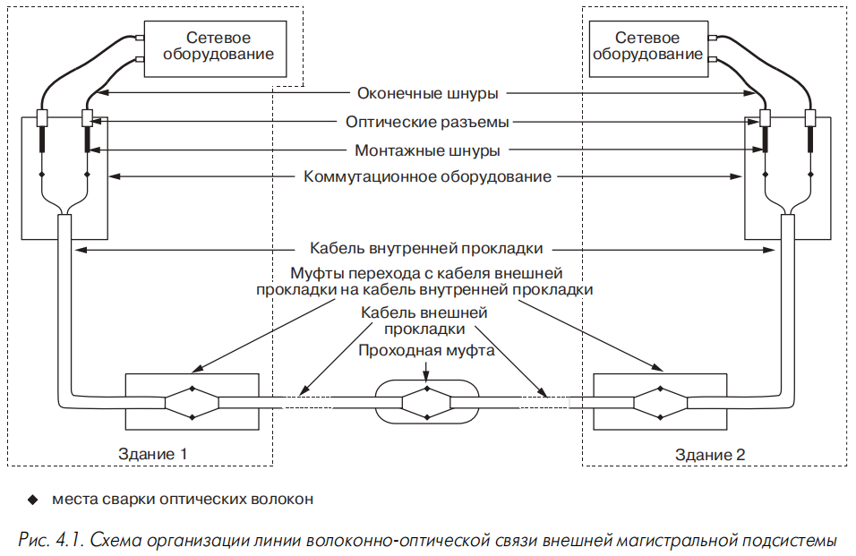

**Рис. 4.1 — Схема организации линии волоконно-оптической связи внешней магистральной подсистемы.**

<mark>Основные элементы линии:</mark> 
1. сетевое оборудование, 
2. оконечные шнуры, 
3. оптические разъёмы, 
4. монтажные шнуры, 
5. коммутационное оборудование, 
6. кабель внутренней прокладки, 
7. кабель внешней прокладки, 
8. проходная муфта, 
9. муфты перехода с кабеля внешней прокладки на кабель внутренней прокладки, 
10. места сварки оптических волокон.

---

## 4.1. Оптические кабели

### 4.1.1. Области применения и классификация

> <mark>Волоконно-оптический кабель — кабель для передачи оптических сигналов внутри зданий и между ними.</mark>

<mark>На их основе могут быть реализованы все три подсистемы СКС, хотя в горизонтальной подсистеме волоконная оптика пока находит ограниченное применение для ЛВС. В подсистеме внутренних магистралей оптические кабели применяются одинаково часто с витыми парами, а в подсистеме внешних магистралей доминируют.</mark>

**Три основных вида кабелей:**

- **кабели внешней прокладки (outdoor cables)** — для подсистемы внешних магистралей, связывают здания;
- **кабели внутренней прокладки (indoor cables)** — для внутренней магистрали здания;
- **кабели для шнуров** — для соединительных и коммутационных шнуров, а также горизонтальной разводки при проектах **fiber to the desk** (волокно до рабочего места) и **fiber to the room** (волокно до комнаты).

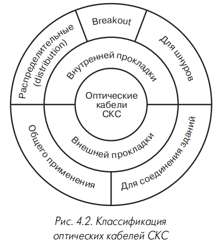

**Рис. 4.2 — Классификация оптических кабелей СКС.**

### 4.1.2. Конструктивные особенности и оптические параметры

<mark>Основой волоконно-оптического кабеля являются волоконные световоды из кварцевого стекла.</mark> Кварцевое стекло имеет низкую механическую прочность и устойчивость к атмосферным воздействиям, поэтому остальные элементы кабеля защищают волокна от механических воздействий и влаги.

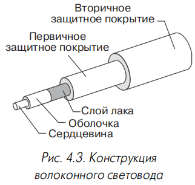

**Рис. 4.3 — Конструкция волоконного световода.**

> <mark>Волоконный световод — цилиндрическая структура из концентричных слоёв; основные — сердцевина и оболочка.</mark>

> Сердцевина — центральная часть световода, по которой распространяется оптическое излучение.

> <mark>Оболочка — слой вокруг сердцевины с меньшим показателем преломления, обеспечивающий полное внутреннее отражение.</mark>

**Диаметры сердцевины:**

- одномодовые световоды (IEC-793, G.652): **9,3±0,5 мкм** (некоторые изготовители — 7–10 мкм при тех же допусках);
- многомодовые (IEC-793, G.651): **50 или 62,5 мкм** при разбросе ±3 мкм.

> Одномодовый световод — световод, в котором распространяется одна мода.

> Многомодовый световод — световод, в котором распространяется несколько мод.

<mark>В СКС возможно использование волокон всех трёх типов.</mark> Многомодовое волокно **50/125** в ISO/IEC 11801 рассматривается как альтернативное, тогда как TIA/EIA-568-A в действующей редакции его не разрешает. По сравнению с 62,5/125 световод 50/125 имеет лучшие частотные свойства, что важно для Fiber Channel и Gigabit Ethernet. Поэтому популярность таких кабелей возросла в конце 90-х.

Внешний диаметр оболочки многомодовых и одномодовых световодов — **125±2 мкм**. На оболочку наносится слой лака толщиной **2–3 мкм** (входит в номинальную толщину оболочки) для защиты от влаги и коррозии.

> Первичное защитное покрытие — покрытие из эпоксиакрилата внешним диаметром **245±15 мкм**, обеспечивающее гибкость волокна.

В 1999 году ряд производителей ужесточил допуск до ±10 и даже ±5 мкм. Световод в таком покрытии считается недостаточно защищённым, поэтому его снабжают дополнительными упрочняющими элементами (раздел 4.1.3).

**Нормируются также:**

- некруглость сердцевины — не более **5%**;
- некруглость оболочки — максимум **2%**;
- эксцентриситет сердцевина-оболочка — не более **3 мкм**.

<mark>Для идентификации волокон с обоих концов производители часто окрашивают внешнее защитное покрытие в различные цвета (табл. 3.17);</mark> на оптические характеристики не влияет.

<mark>Кабель может содержать только многомодовые, только одномодовые или те и другие волокна одновременно.</mark> Информация о комбинированных (композитных) кабелях в каталогах приводится редко, но их изготовление можно заказать. Данные по количеству волокон — в табл. 4.1.

**Таблица 4.1 — Число световодов композитных кабелей [88]**

| Общее количество световодов | Одномодовые | Многомодовые |
|-----------------------------|-------------|--------------|
| 18                          | 6           | 12           |
| 24                          | 6           | 18           |
| 24                          | 12          | 12           |
| 30                          | 6           | 24           |
| 36                          | 12          | 24           |
| 60                          | 12          | 48           |

<mark>Многомодовые кабели иногда применяются в горизонтальной подсистеме (обычно при fiber to the desk).</mark> Основой внутренних магистралей часто являются многомодовые кабели, дополняемые одномодовыми. Во внешних магистралях в зависимости от расстояния и полосы частот прокладываются кабели с многомодовыми или одномодовыми волокнами.

**Таблица 4.2 — Предельно допустимые затухание и коэффициент широкополосности многомодовых оптических кабелей СКС**

| Длина волны, нм | 850 | | 1300 | |
|---|---|---|---|---|
| Стандарт | TIA/EIA-568-A | ISO/IEC 11801 | TIA/EIA-568-A | ISO/IEC 11801 |
| Коэффициент затухания, дБ/км | 3,75 | 3,5 | 1,05 | 1,0 |
| Коэффициент широкополосности, МГц·км | 160 | 200 | 400 | 500 |

> Коэффициент широкополосности — параметр, определяющий полосу пропускания оптического волокна.

ISO/IEC 11801 предъявляет несколько более жёсткие требования, чем TIA/EIA-568-A. ISO/IEC 11801 (2000) допускает применение многомодовых кабелей с коэффициентом широкополосности **160 МГц·км** на длине волны 850 нм, но ограничивает максимальную длину линии **1,6 км**.

**Таблица 4.3 — Требования стандарта IEC-793 к многомодовым световодам**

| Длина волны, нм | 850 | | 1300 | |
|---|---|---|---|---|
| Тип волокна | 62,5/125 | 50/125 | 62,5/125 | 50/125 |
| Коэффициент затухания, дБ/км | 3,2 | 2,8 | 0,9 | 0,8 |
| Коэффициент широкополосности, МГц·км | 200 | 400 | 500 | 1000 |

Из экономической целесообразности в СКС и сетях общего пользования применяется однотипная продукция. Реальные значения затухания и коэффициента широкополосности лучше стандартных требований СКС. Примеры: кабели BICC — гарантированный коэффициент широкополосности **900 МГц·км** вместо 500; кабели Mohawk — затухание **0,8 дБ/км** вместо 1 дБ/км (для 1300 нм и 62,5/125).

<mark>Сетевое оборудование для локальных и корпоративных сетей по многомодовому кабелю одинаково часто использует окна прозрачности **850 и 1300 нм**, поэтому кабели СКС оптимизированы именно для этих длин волн.</mark>

> <mark>Окно прозрачности — диапазон длин волн, в котором оптическое волокно имеет минимальное затухание.</mark>

Характеристики одномодовых кабелей СКС наиболее полно задаёт TIA/EIA-568-A (на основе спецификации TIA/EIA-492BAAA — одномодовое волокно без смещения дисперсии). Коэффициент затухания — в табл. 4.4. Там же — требования IEC-793 (G.652).

**Таблица 4.4 — Предельно допустимые затухание и дисперсия одномодовых оптических кабелей по TIA/EIA-568-А и IEC-793**

| Длина волны, нм | Затухание, дБ/км | Дисперсия, пс/нм·км |
|---|---|---|
| 1310 | 1,0/0,5 | 3,5 |
| 1550 | 1,0/0,3 | 18 |

> Дисперсия — уширение оптического импульса при распространении по волокну.

**TIA/EIA-568-A нормирует также:**

- длину волны нулевой хроматической дисперсии одномодовых кабелей — от **1300 до 1324 нм** при крутизне характеристики дисперсии не свыше **0,093 пс/км·нм²**;
- диаметр модового поля на длине волны 1310 нм — от **8,7 до 10 мкм**;
- длину волны отсечки — не более **1270 нм** (ISO — 1280 нм).

> Диаметр модового поля — удвоенное расстояние от оси волокна до точки, где плотность оптической мощности падает в 2,72 раза.

> Длина волны отсечки — длина волны, на которой волокно ещё работает в одномодовом режиме.

### 4.1.3. Вторичные защитные покрытия волоконных световодов

На кабельные заводы волокно поступает в первичном буферном покрытии диаметром **0,25 мм**. Оно считается недостаточно защищённым, поэтому его снабжают дополнительными трубчатыми защитными элементами — **вторичными защитными покрытиями**.

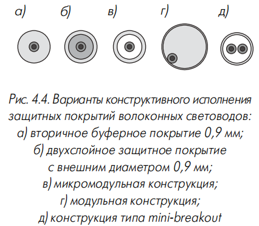

**Три основных вида вторичных защитных покрытий:**

**1. Модульная конструкция (рис. 4.4г)** — трубка из пластика диаметром **2–3 мм** со свободно уложенными одним или несколькими световодами (максимум **12** в серийных образцах). Прямой механической связи между волокном и покрытием нет — малая чувствительность затухания к температуре и растяжению. Свободное пространство заполняется гидрофобным гелем (защита от влаги, но снижает пожаростойкость). Большие габариты затрудняют герметизацию в муфтах и установку вилок разъёмов.

**2. Вторичное буферное покрытие 0,9 мм (tight buffer, рис. 4.4а)** — без зазора на первичном покрытии 0,25 мм. Малый диаметр, высокая гибкость, отсутствие геля — простота монтажа вилок. Недостатки: плохая защита от влаги, ухудшение массогабаритных характеристик, рост затухания из-за микроизгибов.

**3. Квазивторичные покрытия (semi tight buffer)** — два вида:

- **микромодульная конструкция (рис. 4.4в)** — трубка 0,9 мм со свободной укладкой одного световода и гидрофобным гелем;
- **двухслойное покрытие (рис. 4.4б)** — внутренний слой из мягкого силикона диаметром **400–500 мкм**.

Оба варианта обеспечивают механическую развязку внешнего слоя и поверхности волокна (меньше потерь на микроизгибах) и улучшают влагостойкость. Такие кабели могут применяться для соединения зданий на трассах до нескольких сотен метров.

**Решение mini-breakout (рис. 4.4д)** — распространение модульного принципа на кабели внутренней прокладки: тонкостенная трубка 0,9 мм со свободно уложенными двумя световодами в первичном покрытии без геля. Целесообразно при установке разъёмов с увеличенной плотностью монтажа; позволяет вдвое улучшить массогабаритные показатели кабеля для шнуров [88].

**Рис. 4.4 — Варианты конструктивного исполнения защитных покрытий волоконных световодов:**
- **а)** вторичное буферное покрытие 0,9 мм;
- **б)** двухслойное защитное покрытие с внешним диаметром 0,9 мм;
- **в)** микромодульная конструкция;
- **г)** модульная конструкция;
- **д)** конструкция типа mini-breakout.

### 4.1.4. Широкополосные многомодовые световоды

Параметры стандартных световодов фиксируют уровень техники конца 80-х — начала 90-х, когда волоконно-оптический тракт считался не ограничивающим пропускную способность. Ситуация изменилась в 1998 году с массовым использованием **Gigabit Ethernet**: стандартные кабели СКС не гарантируют дальность связи свыше **220–275 м** в окне 850 нм, что ограничивает проектировщика.

**Особенности оборудования Gigabit Ethernet:**

- излучатель — полупроводниковый лазер (светодиоды не обладают нужным быстродействием);
- предпочтительно первое окно прозрачности (**850 нм**, SX-диапазон) для хороших стоимостных показателей.

Основная масса передающих блоков 1000Base-X — на лазерах со структурой **VCSEL (Vertical Cavity Surface Emitting Laser)**, работающих в диапазоне 850 нм. Сравнение с светодиодом — в табл. 4.5. Преимущество над лазерами LX-диапазона (1300 нм) — значительно меньшая стоимость элементной базы: соотношение стоимости лазеров LX и VCSEL в середине 1998 года — **5:1**. По данным АйТи (конец 1999 года), разница в стоимости трансиверов LX и SX превышала **1000 долларов** на интерфейс [89].

**Таблица 4.5 — Технические параметры светодиодов и лазеров структуры VCSEL**

| Излучатель | Длина волны, нм | Спектральная ширина, нм | Ток модуляции, мА | Выходная мощность, дБм | Макс. скорость передачи, Мбит/с |
|---|---|---|---|---|---|
| Светодиод | 850 | 50 | 60 | –15 | 125 |
| Лазер VCSEL | 850 | 0,5 | 10 | 0 | 2000 |

**Задачи при разработке новых волокон:**

- оптимизация характеристик для работы в диапазоне 850 нм (сильнее проявляются дисперсионные искажения);
- подавление эффекта дифференциальной модовой задержки при лазерных излучателях.

> Дифференциальная модовая задержка — дробление импульса из-за разных скоростей распространения мод, возбуждаемых лазером.

**Оптимизация характеристик** — сдвиг максимума коэффициента широкополосности в область коротких волн (рис. 4.5): улучшение частотных свойств в окне 850 нм и выравнивание DF в SX- и LX-диапазонах. Возможны две разновидности волокна по степени выравнивания (пример — HiCap компании Plasma Optical Fiber: standard и dual window).

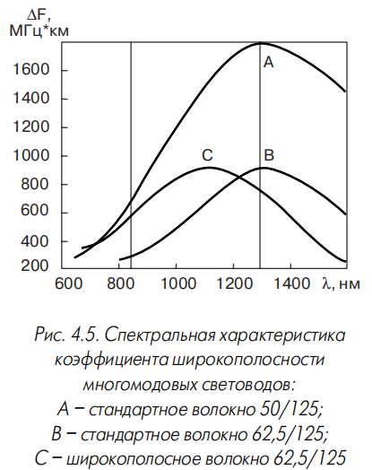

**Рис. 4.5 — Спектральная характеристика коэффициента широкополосности многомодовых световодов:**
- **А** — стандартное волокно 50/125;
- **В** — стандартное волокно 62,5/125;
- **С** — широкополосное волокно 62,5/125.

**Борьба с дифференциальной модовой задержкой:**

- смещение точки ввода излучения от оси волокна с помощью **MCP-шнура** (mode condition patch-cord) — для волокон старых типов;
- гладкий профиль показателя преломления без центрального провала (рис. 4.6) — для новых волокон.

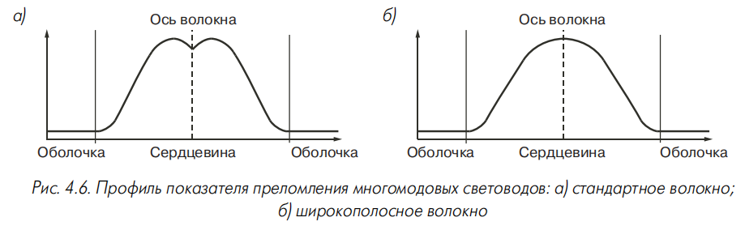

**Рис. 4.6 — Профиль показателя преломления многомодовых световодов:**
- **а)** стандартное волокно;
- **б)** широкополосное волокно.

Коэффициент широкополосности определяется межмодовой дисперсией, пропорциональной количеству направляемых мод. В волокне **50/125** мод меньше, поэтому проще добиться больших значений ΔF, чем в 62,5/125. Многие производители СКС из США вводят кабели с волокном 50/125, несмотря на запрет TIA/EIA-568-A (например, AMP и Siemon). Дополнительный плюс — меньшая стоимость (примерно на **5%**).

**Таблица 4.6 — Многомодовое оптическое волокно с улучшенными частотными свойствами**

| Фирма | Название | Тип волокна | Затухание, дБ/км (850/1300 нм) | Коэффициент широкополосности, МГц·км | Дальность Gigabit Ethernet, м (850/1300 нм) |
|---|---|---|---|---|---|
| Alcatel | GigaLite | 62,5/125 | 3,2/0,9 | 500/500 | 550/– |
| Alcatel | GigaLite | 50/125 | 2,4/0,7 | 700/1200 | 750/– |
| Corning | Infinicore 1000 | 62,5/125 | 3,0/0,7 | – | 500/1000 |
| Corning | Infinicore 2000 | 50/125 | 2,5/0,8 | – | 600/2000 |
| Lucent Technologies | LazrSpeed | 50/125 | – | – | 600/600 |

Сверхвысокочастотные интерфейсы (Gigabit Ethernet, Fiber Channel, ATM) имеют меньший энергетический потенциал (порядка **7 дБ** против **11**), поэтому в новых волокнах гарантируются меньшие значения затухания для запаса по помехоустойчивости.

**Технологии изготовления:**

- Corning для Infinicore — **OVD (Outside Vapour Deposition)**;
- Alcatel для GigaLite — **APVD (Advanced Plasma and Vapour Deposition)**.

Новые волокна идентичны стандартным по оптическим и механическим параметрам. Иногда их называют «световодами для лазерных сетевых интерфейсов», а традиционные — «световодами для светодиодных оптических передатчиков». Стандартов и общепризнанных рекомендаций в этой области пока нет. Corning для Infinicore гарантирует достижение определённой дальности без указания коэффициента широкополосности (сильная зависимость от условий измерений); производители кабелей с этим волокном указывают параметр из соображений единообразия.

Большинство рассматриваемых световодов поддерживают приложения до **1 Гбит/с**. Волокна LazrSpeed и системы Blolite (BICC Brand-Rex) по фирменным ТУ могут поддерживать **10 Гбит/с** при спектральном уплотнении на четырёх длинах волн (задел под 10 Gigabit Ethernet); их коэффициент широкополосности должен составлять не менее **2,2 ГГц·км**.

## 4.1.5. Разновидности оптических кабелей СКС

### 4.1.5.1. Кабели внешней прокладки

> <mark>Кабель внешней (наружной) прокладки — кабель для подсистемы внешних магистралей СКС; основное требование — высокая механическая прочность, влагостойкость, широкий диапазон рабочих температур при малом затухании и большой широкополосности.</mark>

**Четыре группы конструкций сердечников (рис. 4.7):**

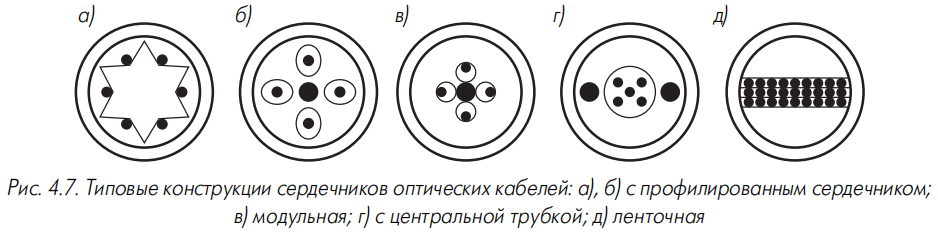

**1. Профилированный сердечник (рис. 4.7а,б)** — фигурный элемент с пазами или полостями для световодов. Был распространён в 80-х; ограниченная ёмкость (обычно не более **16 волокон**), сейчас применяется редко.

**2. Модульная (многомодульная) конструкция (рис. 4.7в)** — традиционная повивная скрутка из модулей диаметром около **2 мм** (раздел 4.1.3), в модуле — от 1 до **12 волокон**. Волокна уложены свободно, слегка скручены по спирали — возможны упругое растяжение и сгибание без ухудшения характеристик. Обычно одноповивная конструкция; распространены **шестимодульные**, реже восьмимодульные варианты. При увеличении ёмкости — два повива или центральный силовой элемент. Называют также **multitube cable** («многотрубочный кабель»).

> Повив — каждый слой проводников (модулей) в кабеле.

**3. Однотрубочная (одномодульная) конструкция (рис. 4.7г)** — одна трубка большого диаметра по оси кабеля. Удобнее в разделке, лучшая защита от сдавливания (максимальное удаление волокон от оболочки), но уступает многомодульной по диапазону температур и устойчивости к растяжению. NK Cables (бывшая Nokia) применяет в трубчатых элементах **Spiral Space** — канал спиральной формы.

**4. Ленточная конструкция (рис. 4.7д)** — очень плотная компоновка, преимущество при большом количестве волокон (несколько сотен и более). Используется для основных магистралей городских телекоммуникационных сетей; для СКС пока нецелесообразна (высокая ёмкость не требуется, а установка разъёмов требует сложного оборудования и высокой квалификации).

**Рис. 4.7 — Типовые конструкции сердечников оптических кабелей:**
- **а), б)** с профилированным сердечником;
- **в)** модульная;
- **г)** с центральной трубкой;
- **д)** ленточная.

<mark>Основная масса кабелей модульной конструкции — ёмкость не более **144 волокон**; они доминируют в выпуске кабелей внешней прокладки (хорошая защита, простота разделки и монтажа).</mark>

Ограниченно выпускаются кабели, объединяющие профилированный сердечник и модульную конструкцию: в пазы профилированного элемента уложены трубки модулей. Профилированный сердечник даёт высокую устойчивость к раздавливанию (например, Ericsson GNSLWLV — **6 кН** вместо обычных **1,5 кН** [91]), трубки модулей — удобство работы и продольную герметичность.

**Виды кабелей внешней прокладки (рис. 4.8):**

- с металлическими упрочняющими элементами и/или электрическими проводниками;
- полностью диэлектрические.

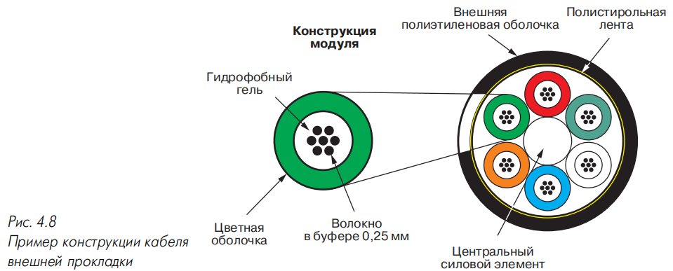

**Рис. 4.8 — Пример конструкции кабеля внешней прокладки.**

Кабели с металлическими элементами прочнее к сдавливанию и растяжению, световоды не повреждаются грызунами, при равной разрывной прочности — меньший диаметр. Недостаток — нет полной гальванической развязки соединяемых пунктов.

**Рабочий температурный диапазон** кабелей внешней прокладки широкого применения — от **–40 до +70 °С**. Специальные морозостойкие — до **–60 °С** (ограничение — хрупкость полиэтилена при –70 °С и температура застывания геля). Верхняя граница — характеристики полиэтилена (точка плавления около **120 °С**); некоторые производители гарантируют параметры при кратковременном нагреве до **90 °С** без механических нагрузок. Специальные термостойкие конструкции для нефтехранилищ выдерживают нагрев до нескольких сотен градусов в течение нескольких часов [7].

#### Упрочняющие покрытия и элементы

> <mark>Упрочняющие элементы — стеклопластиковые и/или металлические элементы, воспринимающие деформирующие усилия при прокладке и эксплуатации.</mark>

Требования к механической прочности оптических кабелей жёстче, чем к симметричным электрическим: стекло допускает относительное удлинение не более **2–3%** против **5–6%** у медного проводника.

**Работающие на растяжение элементы:**

- <mark>в сердечнике: центральный силовой элемент (стеклопластиковый пруток, стальной трос в шланге, проволока); в модульных кабелях часть модулей может заменяться прутками (filler);</mark>
- <mark>вне сердечника: кевларовые оплётки, проволоки или стеклопластиковые прутки в толще шланга (рис. 4.7г), броневые покровы из стальной проволоки.</mark>

**Броневые покровы:**

- стальная проволока — типовое максимальное растягивающее усилие **10000 Н** (двухслойная броня — **20000 Н** и более);
- другие виды брони — **2500–3500 Н** (стальная проволока хорошо работает на растяжение).

**Виды брони:**

- редкая или плотная металлическая оплётка;
- гофрированная стальная лента: шов параллельно оси кабеля (лента с гофрами для гибкости) или обмотка под углом (лента гладкая, меньший диаметр); поверхность часто с полимерным покрытием;
- круглая оцинкованная стальная проволока различного диаметра — для тяжёлых условий; при необходимости два слоя с разными направлениями намотки;
- плотная оплётка из проволоки — меньшая высота и большая гибкость, но ограниченное распространение из-за малой производительности моточных станков.

Главные броневые покровы дополняются оплётками из стеклопластиковых нитей; ленточная броня иногда усиливается стальными проволоками в толще шланга (Lucent Technologies, Siemens) — стойкость к растяжению близка к проволочной броне при небольшом росте массы и диаметра.

> По классификации некоторых производителей (Siemens) броневыми считаются только слои круглой стальной проволоки; остальные усиливающие компоненты — элементы защиты от грызунов.

**Защита от раздавливающих усилий** — покровы и оболочки, обеспечивающие защиту от усилия **1000 Н** и более на 1 см длины [92]. Профилированный сердечник заметно увеличивает устойчивость. Ericsson (GNSLLDV) применяет амортизационный слой из терморасширяющейся ленты между двумя внешними оболочками.

**Таблица 4.7 — Типовые механические и эксплуатационные характеристики современных кабелей внешней прокладки**

| Параметр | Значение |
|---|---|
| Число волокон | 4–144 |
| Внешний диаметр кабеля, мм | 10–20 |
| Рабочий температурный диапазон: монтаж / эксплуатация* | –10…+50 °С / –40…+60 °С |
| Минимальный радиус изгиба: прокладка / эксплуатация | 20 / 15 внешних диаметров |
| Максимально допустимое усилие на растяжение при монтаже | 2500–10000 Н |
| Максимально допустимое усилие на сдавливание | 2000–4000 Н/см |

\* Существуют морозостойкие кабели с нижней рабочей температурой до –60 °С.

#### Элементы обеспечения влагостойкости

> Влагостойкость — свойство кабеля, определяемое элементами продольной и поперечной герметизации.

**Продольная герметизация** — гидрофобный гель, заполняющий пустоты сердечника и свободное пространство в модулях. Требования к гелю:

- сохранение водоотталкивающих свойств во всём диапазоне температур;
- отсутствие затвердевания при низких температурах;
- вязкость, не препятствующая перемещению световодов и не допускающая вытекания;
- химическая нейтральность (в том числе к первичному покрытию световода) и нетоксичность.

При прокладке в водопроводных трубах (популярно в Западной Европе) гель должен быть абсолютно нейтрален к питьевой воде. Чаще всего — компаунды на основе высокомолекулярных углеводородов; обычно одинаковый гель для модулей и сердечника, известны конструкции с разным составом.

**Поперечная герметизация** — наружные оболочки (чаще модификации полиэтиленов, чёрного цвета для стойкости к УФ). Иногда — слой целлюлозной бумаги, разбухающей при попадании влаги и герметизирующей проколы.

> Гидрофобный гель защищает от диффундирующих молекул воды. При эксплуатации в условиях предельной влажности (постоянно в воде) наиболее эффективна тонкая металлическая оболочка из алюминия или меди — абсолютно непроницаемая для влаги.

Поперечную герметизацию увеличивают некоторые броневые покровы, наиболее эффективна броня из стальной гофроленты с проклейкой или сваркой продольного шва.

#### Дополнительные элементы конструкции

- **Разрывная нить (rip-cord)** под внешней оболочкой — для продольного разреза при разделке; иногда для вскрытия клеевого шва брони.
- **Защита от грызунов** — бронированные кабели (наиболее эффективно и недорого); при необходимости гальванической развязки — неметаллические элементы (оплётки из стеклопластиковых нитей, монолитные трубки) под шлангом внешней оболочки; известны ядовитые и отпугивающие компоненты в материале оболочки.

### 4.1.5.2. Кабели внутренней прокладки

> Кабель внутренней прокладки (indoor cable, кабель внутриобъектовой прокладки) — кабель для горизонтальной подсистемы и подсистемы внутренних магистралей СКС.

**Отличия от кабелей внешней прокладки:**

- меньший внешний диаметр и масса, более высокая гибкость (нет гидрофобного заполнителя, облегчённые упрочняющие покрытия без брони); иногда называются кабелями с «сухой конструкцией»;
- лучшие характеристики пожарной безопасности.

Производители подразделяют кабели внутренней прокладки на **Plenum** и **Riser** (подробнее — глава 8).

Световоды обязательно снабжаются вторичным защитным покрытием **900 мкм** без зазора на первичном **250 мкм** — допускает непосредственную установку вилки оптического разъёма. Удобство монтажа ценой некоторого роста затухания (несущественно: длина внутренней магистрали по стандартам не более **500 м**).

**Защита от механических воздействий** — слой кевларовых нитей под шлангом внешней оболочки (свободная укладка без сплетения в оплётку).

**Две основные конструктивные разновидности:**

1. **Распределительные кабели (distribution)** — световоды в буферном покрытии 0,9 мм с кевларовыми нитями в общей защитной оболочке; разделка в коммутационных устройствах (раздел 4.3).
2. **Breakout-кабели** — каждый световод дополнительно в защитном шланге **2–3 мм**; конструктивный аналог многоэлементного электрического многопарного кабеля. Больший диаметр и прочность (центральный силовой элемент + кевлар под каждым шлангом). Для претерминированных сборок (раздел 4.4.2) и отводов отдельных световодов без разветвительных муфт; редко — для многоволоконных соединительных шнуров.

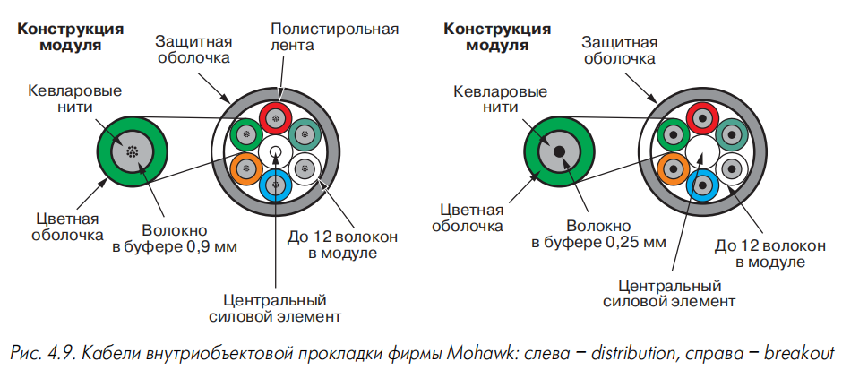

**Рис. 4.9 — Кабели внутриобъектовой прокладки фирмы Mohawk: слева — distribution, справа — breakout.**

**Таблица 4.8 — Типовые механические характеристики современных кабелей внутренней прокладки**

| Параметр | Значение |
|---|---|
| Число волокон | 2–36 |
| Внешний диаметр кабеля, мм | 5–15 |
| Рабочий температурный диапазон: прокладка / эксплуатация | 0…+30 °С / –20…+70 °С |
| Минимальный радиус изгиба: прокладка / эксплуатация | 15 / 10 внешних диаметров |
| Максимально допустимое усилие на растяжение при монтаже | 400–3000 Н |
| Максимально допустимое усилие на сдавливание | 1500–2000 Н/см |

Типовая максимальная ёмкость — не более **12 волокон**. Большинство кабелей без центрального силового элемента; прочность обеспечивается слоем кевларовых нитей. Некоторые фирмы (Ericsson, GNSLBDV) используют профилированный сердечник как силовую основу.

**Увеличение ёмкости** — вокруг центрального силового элемента укладывается несколько (обычно шесть, реже двенадцать) обычных кабелей, закрытых общей оболочкой — до **144 волокон**. При меньшей ёмкости часть «модулей» заменяется упрочняющими прутками и/или заполнителями. Такие кабели обычно изготавливаются на заказ.

Из-за дополнительных оболочек световода и меньшей плотности укладки габариты сердечника растут (особенно в breakout). В целом из-за отсутствия брони и облегчённых упрочняющих покрытий диаметр и масса кабелей внутренней прокладки заметно меньше, чем у кабелей внешней прокладки той же ёмкости.

Для уменьшения габаритов иногда применяют ленточную конструкцию (рис. 4.10 — четырёхволоконная лента Ericsson GAXLBD).

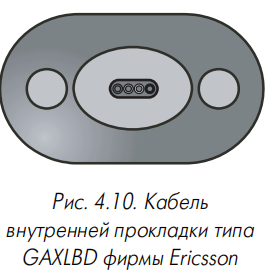

**Рис. 4.10 — Кабель внутренней прокладки типа GAXLBD фирмы Ericsson.**

Рабочая температура — обычно от **–20 до +70 °С**.

### 4.1.5.3. Кабели для соединения зданий

> Кабель для соединения зданий — кабель, занимающий промежуточное положение между кабелями внутренней и внешней прокладки; основа — кабель внутренней прокладки с повышенной устойчивостью к факторам окружающей среды.

Появились в конце 90-х из-за роста локальных сетей и доли внешних подсистем. Применяются для соединения зданий при длине трассы до нескольких сотен метров; по цене заметно превосходят обычные кабели внешней прокладки.

**Отличительные черты:**

- материалы для работы при температурах от **–30…–40 до +70…+80 °С** (расширенный диапазон);
- дополнительные элементы влагостойкости;
- в некоторых конструкциях — полимерные элементы защиты от грызунов (пример — Qline фирмы Leoni).

**Наибольшая популярность** — варианты с двухслойной внешней оболочкой: внешний слой из малодымного безгалогенного материала (пожароустойчивость для прокладки внутри зданий), внутренняя оболочка — влагостойкость. Дополнительный слой кевларовых нитей между оболочками улучшает прочность. Такие кабели называют **усиленными (reinforced)**. Второе решение (Ericsson) — влагонепроницаемая лента под внешней оболочкой, разбухающая при попадании влаги и герметизирующая проколы.

Применение таких кабелей позволяет отказаться от дорогостоящих переходных муфт на входе в здание, снижающих эксплуатационную надёжность.

Некоторые производители СКС допускают применение кабелей внутренней прокладки для внешних магистралей небольшой протяжённости, если они работают при **–40…+80 °С**; единственное ограничение — защита от влаги (обычно прокладка внутри трубки).

### 4.1.5.4. Кабели для шнуров

> <mark>Кабель для шнуров (миникабель) — кабель для изготовления коммутационных и оконечных шнуров; также для горизонтальной проводки при fiber to the desk и fiber to the room, локальной разводки в аппаратных и кроссовых.</mark>

Фактически — кабель внутренней прокладки с одним или двумя световодами в буферном покрытии **0,9 мм**, но из-за массовости выделяется в отдельную группу. Волокно в буферном покрытии **0,25 мм** практически не используется (пример — кабель ОКГ завода «Электропровод», выпуск прекращён из-за сложностей установки вилок).

**Конструкции (рис. 4.11):**

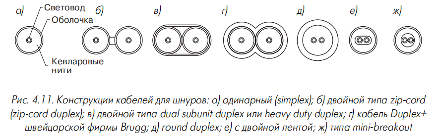

**Рис. 4.11 — Конструкции кабелей для шнуров:**
- **а)** одинарный (simplex);
- **б)** двойной типа zip-cord (zip-cord duplex);
- **в)** двойной типа dual subunit duplex или heavy duty duplex;
- **г)** кабель Duplex+ швейцарской фирмы Brugg;
- **д)** round duplex;
- **е)** с двойной лентой;
- **ж)** типа mini-breakout.

Кабели первого поколения — одинарные (рис. 4.11а) и двойные. Двойные без общей оболочки — **zip-cord** или **zip-cord duplex**; с общей оболочкой — **heavy duty duplex**. Обозначения: Kerpen (FLine) — duplex figure 8 (без оболочки) и duplex figure 0 (с оболочкой); Alcatel — dual fiber oval cable; Teldor — flat duplex.

**Две разновидности heavy duty duplex:**

1. Оболочка небольшой толщины охватывает защитные шланги волокон (Mohawk М9Х080 и М9Х081, Lucent Technologies 1861 — рис. 4.11в).
2. Оболочка большой толщины частично входит в зазор между шлангами (Brugg Duplex+, рис. 4.11г).

Кабели с общей оболочкой лучше защищены и удобнее, но zip-cord дешевле — отсюда их популярность.

Защита волокон — полимерное покрытие **900 мкм**; механическая прочность — слой кевларовых нитей под внешней оболочкой.

Пример специализированного изделия — двойные кабели DX серии Ultra-Fox компании Optical Cable Corporation с гибкой ПВХ-оболочкой; габариты оптимизированы для вилок MIC.

**Новые популярные конструкции (рис. 4.11е,ж)** — общая защитная оболочка стандартного диаметра **2,5–3 мм** с двумя световодами: волокна объединены в ленту (рис. 4.11е) или уложены в тонкостенную трубку **0,9 мм** (mini-breakout, рис. 4.11ж; световоды только с первичным покрытием **0,25 мм**). Для соединительных шнуров на основе разъёмов с увеличенной плотностью установки (раздел 4.2.6).

**Таблица 4.9 — Типовые механические характеристики кабелей для шнуров**

| Параметр | Значение |
|---|---|
| Число волокон | 1–2 |
| Диаметр защитного полимерного покрытия волокна, мкм | 900 |
| Внешний диаметр защитной оболочки каждого волокна, мм | 2,5–3,0 |
| Рабочий температурный диапазон: прокладка / эксплуатация | 0…+30 °С / –20…+70 °С |
| Минимальный радиус изгиба: прокладка / эксплуатация | 15 / 10 внешних диаметров |
| Максимально допустимое усилие на растяжение при прокладке: одинарные / двойные | 350 / 700 Н |
| Максимально допустимое усилие на сдавливание | 200 Н/см |

> Важная особенность: несмотря на повышенную гибкость, передаточные параметры (затухание, коэффициент широкополосности) полностью эквивалентны магистральным кабелям. Это позволяет варьировать длины шнуров, увеличивая их более чем на **30 м** за счёт уменьшения длин магистральных кабелей.

### 4.1.6. Цветовая кодировка и маркировка оптических кабелей

Цветовая маркировка строится преимущественно по принципу маркировки электрических кабелей: в основные маркирующие цвета окрашиваются внешние покрытия световодов, трубки модулей и элементы группировки волокон в пучки (ленточки и нити).

**Особенности:**

- маркирующие цвета не делятся на цвета для отдельных волокон и их групп;
- практически не применяются элементы парной группировки волокон (единичные образцы: два световода одного цвета, на втором — кольцевая метка через **20–30 мм**; формально — принадлежность к следующей группе, на практике — волокна одного цвета к одной паре розеток);
- в импортных оптических кабелях чаще, чем в электрических, используется кодировка, отличная от табл. 3.17 (примеры — табл. 4.10).

**Таблица 4.10 — Цветовая кодировка волокон и модулей европейских производителей оптических кабелей**

| Фирма-изготовитель | 1 | 2 | 3 | 4 | 5 | 6 |
|---|---|---|---|---|---|---|
| Brugg, Швейцария* | Красный | Зелёный | Жёлтый | Синий | Белый | Фиолетовый |
| Draka Norsk Kabel, Норвегия | Чёрный | Коричневый | Красный | Оранжевый | Жёлтый | Зелёный |
| Siemens, Германия** | Красный | Зелёный | Синий | Жёлтый | Бесцветный | – |
| Ericsson, Швеция | Красный | Синий | Белый | Зелёный | Жёлтый | Серый |
| Fabryka Kabli Oszarow, Польша | Красный | Зелёный | Синий | Белый | Фиолетовый | Оранжевый |
| Helkama, Финляндия | Синий | Белый | Жёлтый | Зелёный | Серый | Красный |

| Фирма-изготовитель | 7 | 8 | 9 | 10 | 11 | 12 |
|---|---|---|---|---|---|---|
| Brugg, Швейцария* | Оранжевый | Чёрный | Серый | Коричневый | Розовый | Бирюзовый |
| ABB, Норвегия | Синий | Фиолетовый | Серый | Белый | – | – |
| Siemens, Германия** | – | – | – | – | – | – |
| Ericsson, Швеция | Коричневый | Чёрный | Оранжевый | Фиолетовый | Розовый | Бирюзовый |
| Fabryka Kabli Oszarow, Польша | Серый | Жёлтый | Коричневый | Розовый | Чёрный | Бирюзовый |
| Helkama, Финляндия | – | – | – | – | – | – |

\* Тот же принцип принят в швейцарском стандарте PTT СH 840.05.02.
\** Тот же принцип принят в стандартах DIN 47002 и IEC-304.

> Ключевая схема кодирования — разновидность цветовой кодировки модулей кабелей внешней прокладки: в каждом повиве два окрашенных модуля разных цветов (необязательно рядом). Модулю одного цвета (например, красному) присваивается первый номер (**ключевой модуль**), далее модули нумеруются по возрастанию от первого цветного в сторону второго (**опорный модуль**). Трубчатые заполнители и упрочняющие элементы окрашиваются в чёрный цвет.

В немецкоязычных странах тип кабеля задаётся по **DIN VDE 0888** — продукция разных заводов одной конструкции имеет одинаковую марку. Для определения изготовителя под внешнюю оболочку закладывают цветную опознавательную ленту: Siemens — две белых, красная и зелёная нити; Siecor (Siemens и Corning) — две красных, зелёная и чёрная нитки [93].

Цветовая маркировка наружных оболочек кабелей внутренней прокладки и шнуров стандартами СКС не нормируется; определяется внутрифирменными стандартами. Широко используется оранжевая окраска оболочек из негорючих малодымных материалов (аналогично электрическим кабелям); оболочки одномодовых кабелей для шнуров практически всегда жёлтые.

**Маркировка кабелей** — по рекомендации МЭК-794-1: буквенно-цифровой индекс с основными сведениями о конструкции, назначении и оптических характеристиках; обязательно футовые или метровые метки длины. Маркировка кабелей внешней прокладки — краской или термическим способом (термическая износостойче, лучше сохраняется после протяжки). Дополнительные элементы: знак волны или двойной синусоиды (оптический кабель), телефонной трубки (кабель связи) — рис. 4.12.

**Рис. 4.12 — Дополнительные маркирующие элементы на внешней оболочке оптического кабеля.**

На российских кабельных заводах распространена термическая маркировка без заполнения знаков краской — снижает удобство работы, особенно при складском хранении.

## 4.2. Оптические разъёмы

> <mark>Оптический разъём (разъёмный соединитель) — устройство для разъёмного подключения соединительных и оконечных шнуров к коммутационному оборудованию в кроссовых, информационным розеткам рабочих мест и к сетевому оборудованию.</mark>

**Два принципиально разных способа сращивания световодов (рис. 4.13):**

- **разъёмные соединители (разъёмы)** — <mark>используются в СКС благодаря небольшой протяжённости трактов;</mark>
- **неразъёмные соединители (сростки)** — <mark>для линий связи большой протяжённости (городские и более).</mark>

**Классификация оптических соединителей:**

- разъёмные: контактные, линзовые;
- неразъёмные: сплавные, механические.

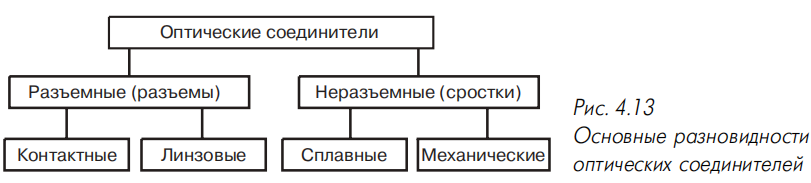

**Рис. 4.13 — Основные разновидности оптических соединителей.**

**Рис. 4.12 — Маркировка оптических кабелей внешней прокладки по DIN 0888.**

### 4.2.1. Назначение оптических разъёмов и основные требования

**Основные функции оптического разъёма:**

- обеспечение ввода волокна в точку сращивания с заданным радиусом изгиба;
- защита волокна от внешних механических и климатических воздействий;
- фиксация волокна в центрирующей системе.

**Основные технические требования:**

- минимальное затухание при высоком затухании обратного рассеяния;
- долговременная стабильность и воспроизводимость параметров;
- высокая механическая прочность при минимальных габаритах и массе;
- простота установки на кабель;
- простота подключения и отключения;
- выпуклые торцевые поверхности наконечников;
- предварительная специальная обработка наконечников.

Стандарты (TIA/EIA-568-A и ISO/IEC 11801) нормируют: типы разъёмов, основные передаточные параметры, требования к долговечности, правила подключения.

**Таблица 4.11 — Основные характеристики оптических разъёмов СКС по ISO/IEC 11801**

| Параметр | Многомодовые | Одномодовые |
|---|---|---|
| Затухание, дБ | 0,5 | 0,5 |
| Коэффициент обратного отражения, дБ | –20 | –26 |
| Количество циклов соединения-разъединения | 500 | 500 |

В СКС допускаются разъёмы только двух типов — **SC и ST**. Во всех вновь создаваемых СКС — только **SC**. В существующих СКС с ST их можно продолжать использовать и при расширении. Для подключения оборудования с другими разъёмами — оконечные шнуры (SC с одной стороны, другой тип с другой) или адаптеры (раздел 4.5).

**Маркировка A и B:**

- вилку с маркировкой A всегда подключать к розетке с маркировкой A, и наоборот;
- двойная вилка SC: если смотреть со стороны наконечников, ключи сверху, левая вилка — A, правая — B;
- проходная розетка имеет разную маркировку по разным сторонам (рис. 4.16);
- вилка A — источник, розетка A — приёмник, и наоборот;
- на сетевом оборудовании розетка A — вход оптического приёмника, B — выход передатчика.

Большинство разъёмов — на два световода. **Групповые (многоканальные)** разъёмы сращивают две и более пар волокон; их доля быстро растёт. **Герметичные** разъёмы — для特殊 условий (влажность, агрессивные пары). **Гибридные** — одновременное сращивание световодов и электрических проводников.

**Линзовые разъёмы (рис. 4.14)** — свет из передающего световода преобразуется в параллельный пучок, затем фокусируется на сердцевину принимающего. Меньшая чувствительность к осевым и боковым смещениям. Были распространены на ранних этапах.

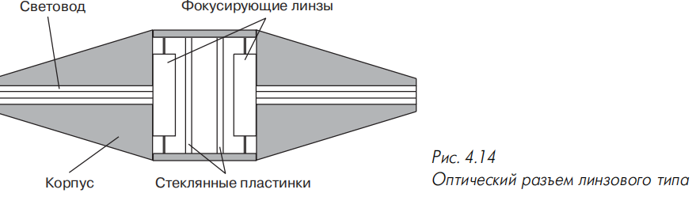

**Рис. 4.14 — Оптический разъём линзового типа.**

**Контактные разъёмы (рис. 4.15)** — соединение световодов встык с контролем параллельности осей и минимального расстояния между торцами. Лучшие массогабаритные показатели и принципиально меньшее затухание (нет потерь в линзах и на френелевское отражение). Подавляющее большинство современных разъёмов — контактные.

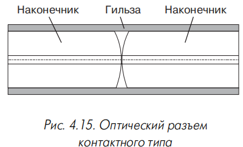

**Рис. 4.15 — Оптический разъём контактного типа.**

> Штекерный наконечник — основа большинства контактных разъёмов; вставляется в юстирующий элемент в виде втулки.

> Вилка (коннектор) и розетка (coupler) — два основных компонента разъёма.

**Симметричная схема** — оба световода армируются одинаковыми вилками, вставляемыми в соединительную розетку с центратором. **Несимметричные** разъёмы — только вилка и розетка.

**Фиксация вилки в розетке:**

- байонетный элемент (ST);
- защёлка внутренняя (SC) или внешняя рычажного типа (LC, E-2000);
- многогранная или круглая накатанная накидная гайка (FC, SMA).

**Одномодовые и многомодовые варианты:** одномодовый конструктивно аналогичен, но с более жёсткими допусками на геометрические размеры. Диаметр отверстия наконечника: одномодовые — **126+1/–0 мкм**, многомодовые — **127+2/–0 мкм**. Многие многомодовые разъёмы имеют вилки для волокон с оболочкой **125, 140, 280 мкм** и т.д. (отличаются диаметром отверстия наконечника).

Рабочий температурный диапазон большинства разъёмов — **от –40 до +85 °С** (совпадает с кабелями внешней прокладки).

**Таблица 4.12 — Основные параметры оптических разъёмов**

| Тип разъёма | Материал наконечника | Фиксатор | Среднее затухание, дБ (1300 нм), многомодовый | Среднее затухание, дБ (1300 нм), одномодовый |
|---|---|---|---|---|
| FC | Керамика | Накидная гайка | 0,2 | 0,3 |
| MIC | Керамика | Защёлка | 0,3 | 0,4 |
| SC | Керамика | Защёлка | 0,2 | 0,25 |
| SMA | Сталь | Накидная гайка | 1,0 | – |
| ST | Керамика | Байонетный | 0,25 | 0,3 |
| Е-2000 | Мельхиор | Защёлка | 0,2 | 0,25 |

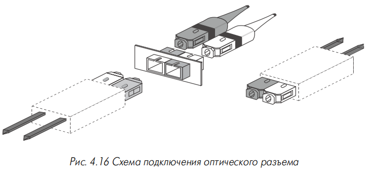

**Рис. 4.16 — Схема подключения оптического разъёма.**

### 4.2.2. Параметры оптических разъёмов

#### 4.2.2.1. Вносимые потери

**Причины потерь:**

- **внутренние факторы** — допуски на геометрические размеры световодов;
- **внешние факторы** — качество изготовления элементов разъёма и технологические допуски;
- потери от отражений и рассеяния;
- потери от загрязнений.

**Внутренние факторы:** эксцентриситет и эллиптичность сердцевины, разность диаметров, числовых апертур и профилей показателей преломления. В настоящее время эксцентриситет и эллиптичность не играют первостепенной роли [94]: при эллиптичности **5%** потери не превышают **0,1 дБ**. Потери за счёт разности диаметров — при переходе из волокна с большим диаметром в меньшее; при одинаковых номинальных диаметрах — из-за допуска на диаметры сердцевины. Потери за счёт разности числовых апертур — из-за производственных допусков.

> Числовая апертура — параметр, определяющий максимальный угол ввода излучения в световод.

**Внешние факторы:** воздушный промежуток между торцами, радиальные и угловые смещения, непараллельность торцевых поверхностей. При воздушном промежутке — дополнительные френелевские потери на границе воздух-стекло.

#### 4.2.2.2. Обратные отражения

> Обратное отражение — отражённый в обратном направлении световой поток, возникающий из-за френелевских отражений на переходе стекло-воздух-стекло.

Поток обратного отражения искажает работу высокоскоростных лазерных передатчиков (попадает обратно в резонатор). Наибольший вклад вносят оптические разъёмы. Мера — **коэффициент обратного отражения** (отношение мощности отражённого потока к падающему, в логарифмических единицах).

**Требования стандартов:** многомодовые — не хуже **–20 дБ**; одномодовые — не хуже **–26 дБ**. Последнее недостаточно для многих приложений.

**Классы одномодовых разъёмов:**

- **PC** < –30 дБ;
- **Super PC (SPC)** < –40 дБ;
- **Ultra PC (UPC)** < –50 дБ;
- **Angled PC (APC)** < –60 дБ.

> Физический контакт (Physical Contact, PC) — стекло сердцевины одной вилки прижато к стеклу другой без воздушного зазора; обязательное условие минимизации обратного отражения, особенно для одномодовых разъёмов.

**Способы достижения физического контакта:**

- нажимные пружины;
- наконечники с выпуклыми торцевыми поверхностями (радиус скругления **10–15 мм**, рис. 4.17б);
- специальная технология обработки торцевой поверхности.

**Наиболее эффективно** — наконечники со скошенными под углом примерно **8°** торцевыми поверхностями (pre-angled endface, рис. 4.17в).

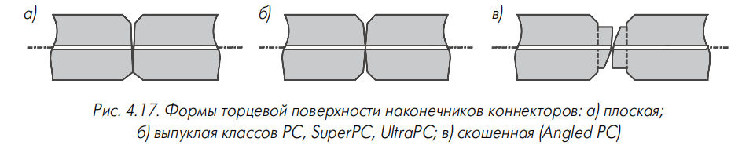

**Рис. 4.17 — Формы торцевой поверхности наконечников коннекторов:**
- **а)** плоская;
- **б)** выпуклая классов PC, SuperPC, UltraPC;
- **в)** скошенная (Angled PC).

Ранее применялась иммерсионная жидкость с показателем преломления, близким к стеклу; сейчас практически вытеснена (только в механических коннекторах и сплайсах, где число циклов сращивания минимально).

### 4.2.3. Конструктивные особенности оптических разъёмов

**Основные узлы и детали:**

- наконечник или другой элемент фиксации волокон;
- элемент центрирования волокон;
- корпус с элементами защиты от проворачивания и неправильного подключения;
- элементы фиксации за упрочняющие покрытия световодов и кабеля;
- хвостовик;
- защитный колпачок.

#### 4.2.3.1. Наконечники вилок

> Наконечник — осесимметричная деталь с центральным отверстием для фиксации конца световода; торец световода шлифуется и полируется заподлицо с торцом наконечника.

Большинство разъёмов — цилиндрические наконечники диаметром **2,5 мм**. Торцевая поверхность — с фаской (облегчает установку, создаёт пространство для частиц загрязнения, позволяя торцам прижаться вплотную).

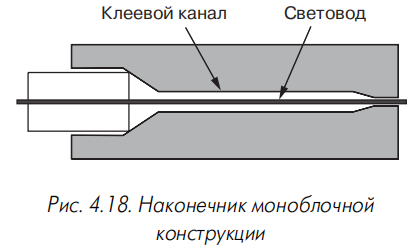

**Моноблочные наконечники (рис. 4.18)** — из одного материала:

- **керамика** (окись алюминия или циркония): окись алюминия дешевле, окись циркония прочнее и стабильнее. Керамические превосходят другие по долговечности и стабильности в широком диапазоне температур, позволяют достичь более жёстких допусков, обеспечивают меньшие вносимые потери (**0,2–0,3 дБ**);
- **пластмасса** — минимизация стоимости ценой ухудшения стабильности и потерь;
- **металл** (нержавеющая сталь) — промежуточное положение;
- **стекло** — при установке вилки клеем, отвердевающим под УФ.

Стандарты СКС требуют сохранения параметров на протяжении не менее **500 циклов** включения-отключения — поэтому в СКС в подавляющем большинстве случаев применяются керамические наконечники.

**Композитные наконечники (рис. 4.19)** — менее распространены:

- Е-2000 — керамическая втулка с мельхиоровой вставкой;
- «Лист-Булава» (СССР, середина 80-х) — стеклянный капилляр, заклеенный во внешнюю металлическую гильзу;
- SMA-906 — металлический наконечник с керамической центрирующей гильзой меньшей длины.

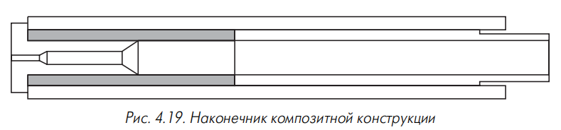

**Рис. 4.19 — Наконечник композитной конструкции.**

**Обоснование композитных конструкций:**

- внешнее покрытие из износостойкого материала — высокая долговечность;
- при недостаточной технологической базе не удавалось достичь точности изготовления центрального канала в твёрдом материале;
- многослойный наконечник с мягкой внутренней частью — дополнительная юстировка световода.

**Юстировка:**

- **пассивная** — после ввода волокна до затвердевания клея на торцевую часть мягкой вставки воздействуют кольцевым штампом с треугольным сечением; пластическая деформация плотно охватывает волокно, уменьшая остаточный эксцентриситет сердцевины до **2 мкм** (рис. 4.20);
- **активная** — после затвердевания клея штамп в виде сектора с углом **120°** ориентируют для минимизации остаточного отклонения осей (рис. 4.21). При типовом эксцентриситете оболочка-сердцевина **0,8 мкм** гарантируется эксцентриситет сердцевина-наконечник не более **0,5 мкм** (средние потери **0,12 дБ**) [95].

**Рис. 4.20 — Схема пассивной юстировки наконечника оптического разъёма.**

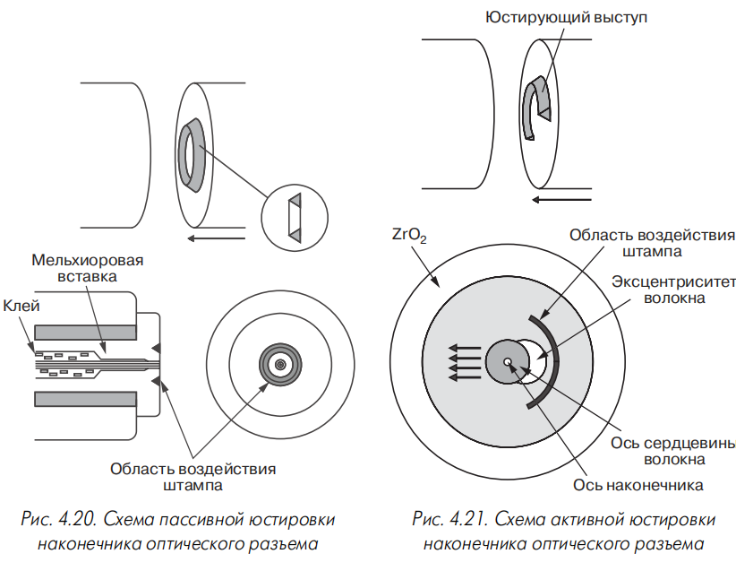

**Рис. 4.21 — Схема активной юстировки наконечника оптического разъёма.**

#### 4.2.3.2. Элементы защиты наконечников от проворачивания и неправильного подключения

При физическом контакте волокна механически взаимодействуют, что может повреждать торцевые поверхности. Риск возрастает при проворачивании волокон друг относительно друга.

**Способы защиты от проворачивания (рис. 4.22):**

- направляющий выступ вилки, вводимый в паз или выемку розетки;
- линейное включение вилки с цилиндрическим наконечником;
- наконечники нецилиндрической или неконической формы, подключаемые только линейным движением.

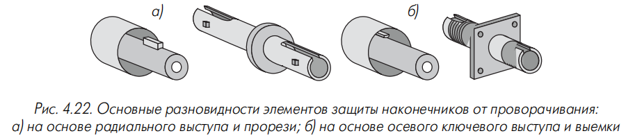

**Рис. 4.22 — Основные разновидности элементов защиты наконечников от проворачивания:**
- **а)** на основе радиального выступа и прорези;
- **б)** на основе осевого ключевого выступа и выемки.

**Защита от неправильного подключения:**

- **пассивные** — цветовые маркирующие элементы и надписи (визуальный контроль) или разные типы разъёмов для разных портов;
- **активные** — механическая блокировка: несимметричные корпуса вилок, направляющие выступы, вставки и рамки (в том числе подвижные) на вилку или розетку.

Иногда сочетают: блокирующие рамки адаптеров из пластмассы разных цветов.

#### 4.2.3.3. Элементы и способы крепления к кабелю

Вилки обычно для кабелей для шнуров с шлангом **2,5–3,0 мм**. При монтаже на волокне в буферном покрытии **0,9 мм** надевается трубчатый переходник с внешним диаметром **2,5–3,0 мм** (обеспечивает радиус изгиба). Иногда функции переходника выполняет резиновый хвостовик; при отсутствии — короткий отрезок защитного шланга.

Для надёжности в вилках многих современных разъёмов — втулка длиной **3–5 мм** с упорным фланцем, надеваемая на буферную оболочку **0,9 мм** и вдвигаемая «внатяг» под шланг (свободное перемещение световода относительно шланга).

Вилки многих разъёмов — только для определённого типа волокна (например, 0,9 мм); есть универсальные конструкции (при сборке используют часть деталей).

При наклейке вилки на световод в покрытии **0,25 мм** рекомендуется восстановить вторичное покрытие **900 мкм**:

- трубка (кембрик) 0,9 мм из набора D-181755 (Lucent Technologies);
- **Field Breakout Kit** (Mohawk) — металлическая трубка с шестью (М90272) или двенадцатью (М90273) кембриками 0,9 мм, устанавливается на модуль обжимным инструментом;
- комплекты серии 91.В0610–91.В0640 (Mod-Tap) — основание, крышка и терминирующий элемент на 4, 6, 8 и 12 волокон; цветовая кодировка кембриков, фиксация без кримпирующего инструмента, но хуже массогабаритные показатели;
- в клеевых разъёмах AMP — переходная пластмассовая втулка, фиксируемая кримпирующей гильзой.

**Способы крепления к кабелю (рис. 4.23):**

**Рис. 4.23 — Варианты исполнения хвостовиков вилок разъёмов для крепления к защитным покрытиям кабеля для шнуров.**

- **широкий конусообразный металлический хвостовик** (рис. 4.23а) — сжимается кримпирующим инструментом, фиксация клеем и трением. Плюсы: простота сборки, минимальные габариты. Минус: малая прочность к вырывающим осевым воздействиям;
- **цилиндрический хвостовик малого диаметра и обжимная гильза** (рис. 4.23б, более распространён) — кевларовые нити на хвостовике, гильза обжимается; нити работают сразу при вырывающем усилии. Дополнительно — ребристая или накатанная поверхность хвостовика; обжим гильзы на внешнюю оболочку (рис. 4.23в); цилиндрический выступ малого диаметра под шланг (рис. 4.23г).

В некоторых групповых разъёмах прочность — только за счёт крепления к внешним шлангам (кримпирующее кольцо или цанговый зажим).

#### 4.2.3.4. Хвостовики вилок

Хвостовик длиной **3–5 см** из резины или мягкого полимера задаёт радиус изгиба волокна. Увеличение гибкости — система взаимно перпендикулярных прорезей. В вилках серии 943 компании Amphenol — вставка для поворота кабеля на **90°** с заданным радиусом (полезно для портов оптических полок и настенных муфт с защитной шторкой).

Хвостовик также служит для цветовой кодировки вилок (когда конструкция не предусматривает дуплексную вилку).

#### 4.2.3.5. Розетки оптических разъёмов

Розетка устанавливается в лицевой панели информационной розетки, настенной муфты или распределительной полки. Состоит из корпуса с элементами крепления на панели и внутреннего центратора.

> Центратор — элемент для выравнивания наконечников вилок друг относительно друга.

Чаще всего — разрезная гильза из керамики или фосфористой бронзы, вставляемая жёстко или по плавающей схеме. В розетках без центрирующего наконечника центратор — без центрирующей гильзы (раздел 4.2.6).

**Крепление корпуса розетки на панели:** резьба под гайку, фланец квадратной/прямоугольной/ромбовидной/круглой формы с 2–4 отверстиями под винты М2, защёлка (для пластмассовых корпусов). Фиксация вилки: резьба, выступы байонетного фиксатора, элементы взаимодействия с защёлкой. Иногда — два элемента одновременно (защёлка и фланец).

Розетки — многомодовые и одномодовые, отличаются материалом корпуса (металл или пластмасса) и центратора (бронза или керамика).

Розетки разъёмов с направляющим выступом вилки должны монтироваться так, чтобы направляющие пазы были ориентированы в одну сторону. Дуплексные розетки с противоположными прорезями [96] — нестандартные, но могут использоваться для механической кодировки и блокировки портов.

Цветовая кодировка: одномодовые и многомодовые розетки с пластмассовым корпусом (SC) — цветом; с металлическим корпусом (ST) — маркирующими надписями и цветом защитного колпачка. Исключение — ST-розетки Lucent Technologies: штампованный логотип и аббревиатуры **SM** (одномодовый) и **MM** (многомодовый).

#### 4.2.3.6. Защитные колпачки и крышки

> Защитный колпачок — элемент для защиты наконечников или торцевых поверхностей вилок и гнёзд розеток во внерабочем состоянии от пыли и грязи.

Колпачок вилки закрывает всю переднюю часть корпуса или только наконечник (чаще при сильно выступающем наконечнике — ST, DIN). Отдельная деталь; в MIC — с темляком, висит на кабеле. Материал — резина или полимер; иногда окрашивается для кодировки. Требование — достаточно высокая жёсткость (иначе при съёме схлопывается и на торцевую часть попадает пыль).

Ряд современных разъёмов имеют защитные крышки как интегральную часть вилки и розетки (колпачок не нужен). В разъёмах без центрирующего наконечника (раздел 4.2.6) этот элемент обязателен.

Колпачок розеток: многомодовые — чёрный или красный, одномодовые — жёлтый. В серии 954 компании Amphenol — подпружиненная внешняя крышка; в Е-2000 фирмы Diamond — внутренняя. В SC компании Alcoa Fujikura — внешний адаптер. Крышка, автоматически закрывающаяся при вынутой вилке, особенно важна при мощных длинноволновых лазерных излучателях (защита глаз).

Розетки оптических интерфейсов сетевого оборудования — резиновые колпачки; Hewlett Packard — пластмассовые вставки с фиксаторами за выступы байонетного соединителя. SC-розетки — резиновая или пластмассовая вставка (иногда со штырьковым выступом); FC — пластмассовый или металлический колпачок с резьбой.

### 4.2.4. Основные типы оптических разъёмов СКС

#### 4.2.4.1. Разъёмы типа SC

> SC (subscriber connector; неофициально Stick-and-Click — «вставь и защёлкни») — разъём, разработанный в 1986 году японской корпорацией NTT; нормирован IEC-874-13; действующими стандартами определён как основной тип для СКС.

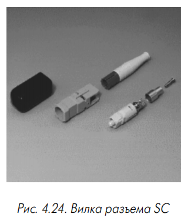

Может быть одинарным и двойным (дуплексным). Пластмассовый корпус хорошо защищает наконечник, обеспечивает плавное подключение и отключение линейным движением. Большинство вилок — с керамическими наконечниками; единичные — с наконечниками из нержавеющей стали. Наконечник утоплен в корпус (защита от загрязнений). Линейное движение удобно для 19-дюймовых полок (плотность портов за счёт сближения розеток). Защёлка открывается только при вытягивании за корпус (надёжность). Разъёмы SC стабильны (не менее **500 подключений и отключений**), нет проворачиваний наконечников. По вносимому затуханию — один из лучших (табл. 4.12). На верхней стороне вилки — ключ-выступ против неправильного подключения.

**Два способа получения двойного разъёма:** фиксаторы на корпусах вилок, взаимодействующие в собранном состоянии; внешний фиксатор (обойма из двух симметричных половин или Н-образная деталь). Пример — фиксатор типа 2А1 компании Lucent Technologies с маркировкой A и B. Расстояние между осями наконечников — **12,7 мм**.

**Цветовая маркировка:** по TIA/EIA-568-A одномодовый — голубой, многомодовый — серый (или бежевый). Выпускается одномодовый SC с зелёным корпусом и скошенной торцевой частью наконечника (уменьшение обратного отражения). Распространены нестандартные окраски: чёрный корпус многомодовой вилки и розетки («Перспективные технологии»), белый корпус многомодового SC (Methode).

#### 4.2.4.2. Разъёмы типа ST

> ST (straight tip connector; неофициально Stick-and-Twist — «вставь и поверни») — разъём, разработанный лабораторией Bell компании AT&T (ныне Lucent Technologies) в 1985 году для замены биконического разъёма; нормирован IEC 874-10.

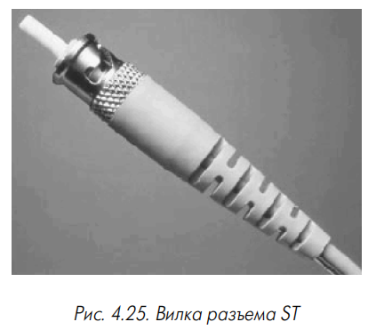

До появления SC был наиболее распространён в оптических подсистемах СКС и ЛВС. Керамический наконечник **2,5 мм** с выпуклой торцевой поверхностью. Фиксация вилки на розетке — подпружиненный байонетный элемент с поворотом на **1/4 оборота**; отсюда название **BFOC** (byonet fiber optic connector).

**Варианты конструкций ST** (форма и материал байонетного фиксатора, крепление корпуса к буферным оболочкам): Lucent Technologies — ST, STII, STII+, полностью совместимы по посадочным местам, незначительные улучшения. У ST гайка байонетного фиксатора с открытым осевым шлицем, у STII и STII+ — шлиц закрыт перемычкой (рис. 4.26). Особенность Lucent Technologies — не нужен кримпирующий инструмент при армировании волокна в буферном покрытии **0,9 мм**.

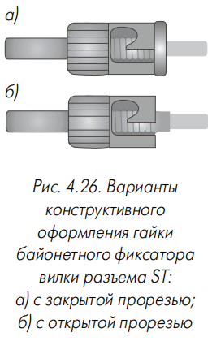

**Рис. 4.26 — Варианты конструктивного оформления гайки байонетного фиксатора вилки разъёма ST:**
- **а)** с закрытой прорезью;
- **б)** с открытой прорезью.

Металлический корпус вилки и розетки — высокая прочность, но затруднена кодировка. Единичные образцы с гайкой золотистого и серебристого цветов (Brugg). На корпусах розеток иногда выдавливаются **SM** и **MM**. Вилки ST с хвостовиками разного цвета; часто применяются нештатные кольца и гильзы.

Конструкция ST не позволяет формировать дуплексную вилку; розетка — обычно одиночная. Исключение — сдвоенные ST-розетки в одном корпусе (Alcatel).

**Преимущества ST:** низкая стоимость, простота монтажа и подключения.

**Недостатки ST:**

- сильно выступающий наконечник — вероятность загрязнения;
- нет двойного варианта — трудоёмкость подключения двойных шнуров и вероятность ошибки;
- нет цветовой или другой заводской маркировки — затруднена идентификация;
- поворачивающее усилие при подключении вызывает трение наконечников — повреждение полировки и рост затухания после многократных подключений;
- байонетная гайка не обеспечивает стабильности параметров при вибрациях.

Для частичной защиты наконечников от трения — специальный выступ вилки, вводимый в паз розетки.

### 4.2.5. Другие типы оптических разъёмов

#### 4.2.5.1. Разъёмы типа FC

> FC — разъём, определённый IEC 874-7; ориентирован в основном на одномодовую технику; наибольшее распространение — в телекоммуникационных системах сетей связи общего пользования.

Наконечник с округлением на конце (жёсткие допуски на геометрические размеры) для низкого затухания и минимума обратного отражения. Первый вариант имел плоский торец; после перехода на скруглённый (физический контакт) — **FC-PC**. Сейчас FC с плоским наконечником не производятся, названия FC и FC-PC эквивалентны.

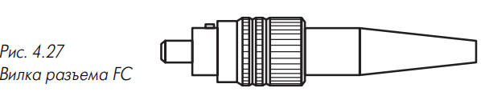

**Рис. 4.27 — Вилка разъёма FC.**

Конструкция защищает керамический наконечник от загрязнений; накидная гайка — герметичность и надёжность при вибрациях. Недостатки: большие габариты, неудобство (несколько оборотов гайки при включении/отключении).

Элемент защиты от проворачивания — цилиндр диаметром **2 мм** (Molex выпускает вилки с диаметром 2 мм для механической блокировки).

Розетка FC — двух вариантов: **SF** (квадратный фланец, крепление двумя винтами М2) и **RF** (круглый фланец, крепление под гайку).

#### 4.2.5.2. Разъёмы типа MIC

> MIC (medium interface connector) — двойной (дуплексный) разъём, разработанный специально для сетей FDDI. Разъёмы MIC компании AMP носят название FSD (fixed shroud duplex).

Пластмассовая вилка с фиксатором-защёлкой, несимметричная форма (механическая блокировка). Сменные ключи в виде цветных вставок кодируют MIC только для одного из портов A, B, M и S сетей FDDI. По вносимому затуханию — среднее положение (табл. 4.12).

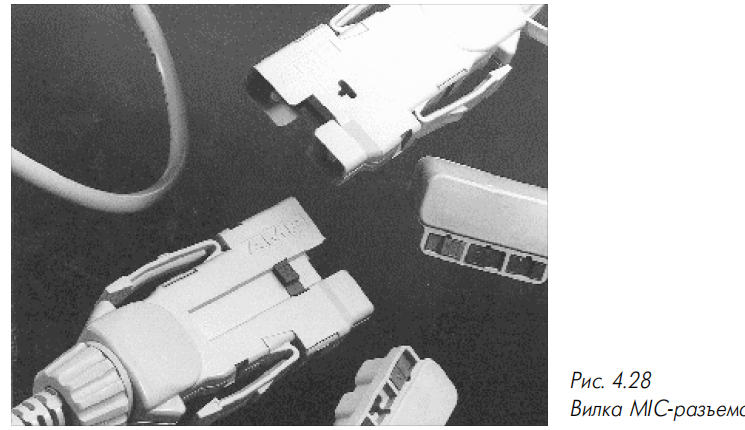

**Рис. 4.28 — Вилка MIC-разъёма.**

Крепление кабеля — обжимное кольцо или пластмассовый зажим. Многомодовый и одномодовый варианты. В середине 90-х — усовершенствованный вариант: уменьшенная длина корпуса, отогнутый под **45°** хвостовик (удобство при большой плотности портов FDDI).

**Преимущества MIC:** линейное подключение и отключение, корпус защищает торцы наконечников.

**Недостатки MIC:** большие габариты, сложность установки, высокая стоимость.

Широко используются в аппаратуре FDDI. Формально допускаются для 100BaseFX, но серийное оборудование с MIC авторам неизвестно.

#### 4.2.5.3. Разъёмы типа SMA

> SMA (FSMA, fibre sub-miniature assembly) — разъём, разработанный в конце 70-х компанией Amphenol; нормирован IEC-874-2.

Металлический наконечник диаметром **3,175 мм** (1/8 дюйма) с плоской торцевой поверхностью (не гарантирует физический контакт). Две разновидности: **SMA-905 (FSMA-I)** и **SMA-906 (FSMA-II)** — отличаются формой концевого участка наконечника. Крепление — шестигранная или реже круглая накидная гайка.

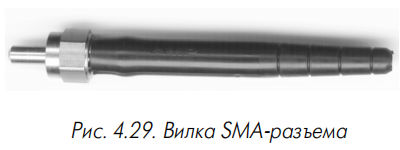

**Рис. 4.29 — Вилка SMA-разъёма.**

Нет направляющего штифта против вращения — хуже затухание и долговременная стабильность. Применяется в ЛВС, СКС, промышленных, медицинских и военных системах. Специальные меры — степень защиты до **IP-65** [97].

Считается устаревшим. Розетки SMA — в активном оборудовании Ethernet и модемах со скоростью не свыше **2 Мбит/с** (в основном американские компании).

#### 4.2.5.4. Разъёмы типа DIN

> DIN (LSA, LSB — от нем. Lichtwellenleiter Steckerverbinder) — разъёмы, определённые стандартами DIN 47256 и DIN 47255, а также IEC-874-6.

Керамический наконечник **2,5 мм** со скруглённой торцевой поверхностью (физический контакт). Фиксация — круглая накидная гайка с накатанной поверхностью. Ориентирован в основном на одномодовые приложения; отличительная особенность — очень малые габариты. Считается устаревшим, вытесняется. В СКС встречается редко (в основном у оборудования немецкоязычных стран); широко распространён в Австралии.

### 4.2.6. Разъёмы с увеличенной плотностью установки

Общий недостаток дуплексного SC — большие габариты, невозможность достичь плотности портов, эквивалентной электрическим решениям. Рассматриваемые конструкции по плотности не уступают электрическим модульным разъёмам; их розетка в дуплексном варианте по посадочному месту полностью соответствует розетке модульного разъёма (одинаковый форм-фактор) — стандартизация элементов монтажа в модульные панели.

**Четыре направления разработки:**

- наконечники уменьшенного до **1,25 мм** диаметра;
- модернизация традиционной конструкции с миниатюризацией компонентов;
- решения групповых (многоканальных) разъёмов;
- отказ от центрирующего наконечника.

Разъёмы нового поколения рассчитаны на кабель внешним диаметром не более **3 мм**. Стоимость в среднем на **30%** меньше традиционных (начало 2000 года) [98].

#### 4.2.6.1. Конструкции с наконечниками уменьшенного диаметра

**Разъём LC (link control; распространена расшифровка Lucent Connector)** — разработан Lucent Technologies в 1997 году (по другим данным, в 1996 [99]). Одномодовый и многомодовый варианты. Керамический наконечник **1,25 мм**, пластмассовый корпус с внешней защёлкой рычажного типа (рис. 4.30). Одиночное и дуплексное использование. Гарантируется **500 циклов** включения-отключения без ухудшения потерь (принцип push-pull). Стандартные процедуры заклейки на эпоксидной смоле; монтаж на волокне 0,9 мм — в полевых условиях, на шнурах со шлангом 2,4 мм — только на производстве.

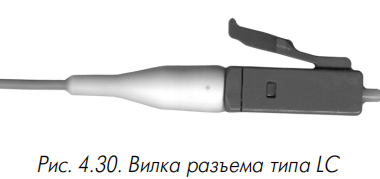

**Рис. 4.30 — Вилка разъёма типа LC.**

**Таблица 4.13 — Основные технические характеристики разъёмов с наконечниками уменьшенного диаметра**

| Параметр | LC-MM | LC-SM | MU-SM |
|---|---|---|---|
| Средние потери, дБ | 0,1 | 0,1 | 0,09 |
| СКО потерь, дБ | 0,1 | 0,07 | 0,07 |
| Коэффициент отражения, дБ | –20 | –50 | –52,1 |
| Изменение потерь после 500 циклов, дБ, не более | 0,2 | 0,2 | – |
| Изменение потерь в диапазоне –40…+75 °С, дБ, не более | 0,3 | 0,1 | – |
| Материал наконечника | Керамика | | |

**Разъём MU** (NTT) — малогабаритный вариант SC («mini-SC»): корпус с внутренней защёлкой (push-pull), примерно вдвое меньшие габариты [100]. Одиночный и дуплексный варианты: неразборная обойма с расстоянием между центрами **4,5 мм**; разборная — **6,5 мм**.

**Разъём F-3000** — усовершенствованная версия Е-2000: керамический наконечник **1,25 мм**, металлическая защитная крышка вместо пластмассовой (защита глаз при мощных лазерах). Вилка F-3000 может вставляться в розетку LC.

#### 4.2.6.2. Малогабаритные разъёмы с наконечниками диаметром 2,5 мм

**Разъём Е-2000** (Европа, 2000 год, компания Diamond) — распространён в Швейцарии, Германии и др. Два варианта по посадочным местам: Diamond — композитный наконечник (мельхиоровый цилиндр с керамической гильзой внатяг); Huber+Suhner — классический керамический цилиндр. Фиксация — внешняя защёлка рычажного типа. Одиночное и дуплексное исполнение: обычный (12,7 мм), компактный (6,4 мм), вертикальный (low profile duplex, вилки друг над другом с разворотом на 180°). Дуплексная розетка совместима с модульной только для компактного варианта. Цветовая кодировка (**8 цветов**), механическая блокировка сменной рамкой розетки, интегрированная защитная крышка (открывается автоматически).

**Разъём SC-Compact** (Reichle & De Massari) — глубокая модернизация SC: устранены внешние элементы крепления, новая фиксирующая оправка; расстояние между осями наконечников уменьшено с **12,7 до 7,5 мм**, розетка вписана в посадочные места модульной розетки. Вертикальный вариант дуплексной вилки SC (Honda Tsushin Kogyo) — **8,5 мм**; розетка близка к модульной, но не взаимозаменяема.

**High Density SC Connector** (3М) — габариты вилки в поперечном сечении уменьшены до **6,0×7,2 мм** против **7,4×9,0 мм** у прототипа. Наибольшее преимущество — для счетверённой розетки (расстояние между центрами около **7 мм**); плотность портов, примерно равная электрическим аналогам, но без обратной совместимости.

**Разъём FJ (fibre jack) или Opti-Jack** (Panduit, 1996) — для СКС PAN-NET, только дуплексный (рис. 4.31). Керамический наконечник **2,5 мм**, расстояние между осями **6,4 мм** (0,25 дюйма); габариты розетки — как у гнезда электрического модульного разъёма. Фиксация — защёлка рычажного типа, закрытая куполообразной крышкой хвостовика. Полевая сборка — оригинальная клеевая технология с двухкомпонентным анаэробным клеем. Очистка торцевых поверхностей — разборная конструкция розетки (детали на защёлках). Особенность: розетка не отдельный элемент, а всегда объединяется с одной из вилок; классическая розетка появилась в 1998 году [101], но только для измерений. Первоначально — многомодовый (бежевый корпус); в 1998 году — одномодовый (голубой).

**Рис. 4.31 — Оптический разъём типа Opti-Jack компании Panduit.**

#### 4.2.6.3. Разъёмы группового типа

Многоканальные (групповые) разъёмы [102]: наиболее совершенные сращивают до **18 световодов** — превосходят электрические модульные по плотности в **девять раз**. Часто — уменьшенный или упрощённый вариант «большого» группового разъёма. Общая черта — линейный принцип push-pull без резьбовых или байонетных фиксаторов.

**SCDC и SCQC** (консорциум Siecor, Siemens, IBM) — внешний корпус вилки традиционного симплексного SC; новый центрирующий элемент с двумя (SCDC) или четырьмя (SCQC) каналами для световодов.

**Mini-MT** (Siecor) и **MT-RJ** (консорциум AMP, Siecor, Hewlett Packard, USConec, Fujikura) — одинаковый центрирующий элемент близкой к прямоугольной формы на два или четыре световода. Отличие MT-RJ — фиксация вилки в розетке как у электрического модульного разъёма (рычажная защёлка). MT-RJ — один из основных элементов волоконно-оптической СКС Solarum компании AMP.

> MT — Mass Termination.

**Mini-MPO** (Berg Electronics) — наибольшая ёмкость среди перспективных разъёмов для СКС: до **18 волокон** одновременно.

#### 4.2.6.4. Конструкции без центрирующего наконечника

Центрирующий наконечник — дорогая прецизионная деталь (до **40%** стоимости вилки); армирование световода — сложная и продолжительная процедура.

**Общие признаки разъёмов без наконечника:**

- выступающее на несколько миллиметров из держателя волокно со сколотым торцом (подготовка при монтаже на специальном приспособлении);
- обязательная подпружиненная крышка, закрывающая волокна во внерабочем состоянии;
- установка вилки или розетки только с фирменной технологической оснасткой.

**Разъём Optoclip II** (Huber+Suhner; по другим данным — Compagnie Deutsch) — симметричная схема, одиночная вилка (может соединяться с другой для дуплекса). Предварительное выравнивание — конусообразная направляющая; окончательное — система из трёх шариков, сдвинутых на **120°**, один подвижный в вертикальном направлении.

**Разъём VF-45 (VG-45)** (3М) — на основе V-образной канавки; одна вилка армирует сразу два волокна ленточного кабеля. Фиксация концевого участка световодов в розетке с разворотом под **45°** (уменьшение длины изделия). Защитная крышка при установке сдвигается вбок. Промывочное устройство очищает волокна прокачкой очищающей жидкости через розетку.

**Рис. 4.32 — Разъём VF-45 компании 3М.**

Первоначально — только многомодовые (точность выравнивания недостаточна для одномодовых). Одномодовые — в конце 90-х; торец волокна скашивается под углом **9°** при обработке в скалывателе.

Цветовая кодировка: Optoclip II — корпус из пластика разных цветов; VF-45 — только защитная дверца разных цветов (многомодовое и одномодовое исполнение).

**Таблица 4.14 — Некоторые типы перспективных оптических разъёмов, поддерживаемых различными производителями СКС**

| Фирма | Тип СКС | LC | E-2000 | MT-RJ | MTP | LX.5 |
|---|---|---|---|---|---|---|
| ADC Telecommunication, США | Enterprise | + | + | | | |
| AMP, США | NetConnect (Solarum) | + | | | | |
| BTR Telecom, Германия | Opdat | + | | | | |
| Corning, США | Corning Cable Systems | + | | | | |
| IBM, США | ACS | + | + | | | |
| Lucent Technologies, США | SYSTIMAX | + | | | | |
| Molex, США | Molex Premise Networks | + | + | + | | |
| Ortronics, США | GigaMo, GigaMo+ | + | + | + | | |
| RiT Technologies, Израиль | Smart | + | | | | |
| Siemon, США | Siemon Cabling System | + | + | | | |

## 4.3. Коммутационное оборудование

### 4.3.1. Конструктивные особенности и варианты подключения

> <mark>Оптическое коммутационное устройство — корпус (пластмассовый или металлический) с розетками оптических разъёмов, организаторами, фиксаторами и вспомогательными элементами.</mark>

**Назначение:**

- подключение волокон сегментов СКС коммутационными шнурами;
- подключение сетевого оборудования через оконечные шнуры и адаптеры;
- неразъёмное сращивание волокон магистральных или горизонтальных кабелей внутри корпуса.

**Типовые элементы конструкции:**

- **корпус** — элементы внешнего крепежа, съёмная/откидная/сдвижная крышка или дверцы на петлях; требование — удобный доступ к волокнам и разъёмам, защита от механических воздействий, пыли и посторонних предметов;
- **панель с розетками** — основной тип разъёма для СКС — **SC**; для коммутации используются только двойные шнуры, поэтому розетки SC должны быть двойными. Проёмы для неустановленных розеток закрываются заглушками. Розетки должны быть смонтированы направляющими пазами в одну сторону; допускается горизонтальный и вертикальный монтаж розеток одной пары;
- **элементы маркировки портов** — в основном как в электрических панелях; две особенности: практически не применяются вставки с иконками (исключение — полки Siemon); из-за защитных экранов клеевые этикетки и сменные надписи часто устанавливаются на внешней поверхности панели;
- **организатор световодов** — хранение технологического запаса длины волокон с соблюдением минимального радиуса изгиба; выполняется в виде барабана с лепестками, поддона с загнутыми краями, разрезных колец, сборки колец на крестообразной рамке;
- **организатор неразъёмных соединителей** — крепление трубок защитных гильз сварных соединений или корпусов механических сплайсов. Часто объединяется с организатором световодов — **сплайс-пластина** (ёмкость обычно не более **16 волокон**; при необходимости устанавливаются рядом или друг над другом);
- **кабельный фиксатор** — крепление магистрального или горизонтального кабеля на входе в корпус (зажим, защёлка, цанга, перфорированная планка, лапка под стяжку).

**Три схемы внутренней разводки (рис. 4.33):**

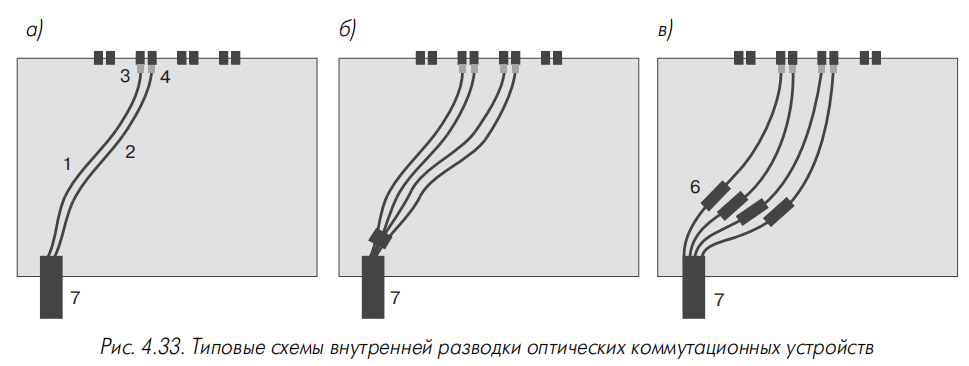

**Рис. 4.33 — Типовые схемы внутренней разводки оптических коммутационных устройств.**

- **простейший вариант (рис. 4.33а)** — без промежуточного соединения: на световоды 1 и 2 кабеля 7 устанавливаются вилки 3 и 4, подключаемые к внутренней части розеток. Характерен для клеевой и механической технологии установки вилок, а также для претерминированной сборки (раздел 4.4.2.1). Аналогичная разводка — при мини-пигтейлах (с дополнительным сварным соединением внутри корпуса);
- **вариант с групповым разъёмом 5 (рис. 4.33б)** — для претерминированной сборки: разводка световодов по розеткам коротким комбинированным шнуром внутри корпуса;
- **технологии сварки и механических сплайсов (рис. 4.33в)** — монтажные шнуры (pig tail) длиной около **120 см**; в тракт вводится дополнительное неразъёмное соединение. Элементы 6 (защитные гильзы, корпуса механических сплайсов) фиксируются внутри корпуса организатором.

### 4.3.2. Коммутационные стойки

> Коммутационная стойка — несущая рама со штатным и дополнительным оборудованием для работы с большим количеством кабелей и шнуров; применяется при числе оптических портов в несколько сотен и более.

Особое внимание — плотности компоновки и удобству работы со шнурами. Решения на основе выдвижных и откидных кассет; кассета в рабочем положении может опускаться вниз на угол около **30°**.

**Пример — стойка NGF компании ADC:** выдвижной блок с оптическими разъёмами; **12 блоков** в одну или две вертикальные колонны в каркасе FMDF высотой **2,1 м**. Между колоннами — центральная панель с **15** круглыми выступами для укладки избытка длины шнуров петлёй. Это позволяет коммутировать шнурами фиксированной длины **5,5 м**. Возможна установка разветвителей, мультиплексоров и других пассивных компонентов.

### 4.3.3. 19-дюймовое коммутационное оборудование

#### 4.3.3.1. Коммутационные полки классической конструкции

> Коммутационная полка — устройство для установки в 19-дюймовые монтажные конструктивы (рис. 4.34).

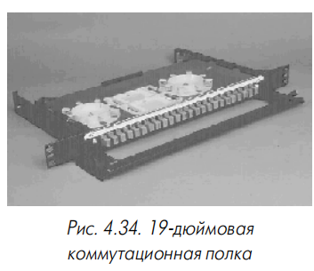

**Рис. 4.34 — 19-дюймовая коммутационная полка.**

Крепёжные кронштейны — подвижные (регулировка глубины) или разной длины. Передняя панель с розетками — интегральная или съёмная (на поворотных задвижках или винтах; гибкая адаптация под тип разъёма). Модульная конструкция — розетки на сменных вставках, унифицированных с настенными муфтами (меньшая плотность, но возможность установки разных типов разъёмов).

**Увеличение количества портов:**

- парная группировка розеток с вертикальным расположением пар;
- передние панели зигзагообразной формы с парой розеток на каждой площадке (рис. 4.35) — меньший радиус изгиба шнура;
- два уровня с боковым смещением (полка FCP 2 компании Siemon);
- один ряд под углом **45°** к продольной оси;
- увеличение высоты полки и многоуровневое расположение розеток.

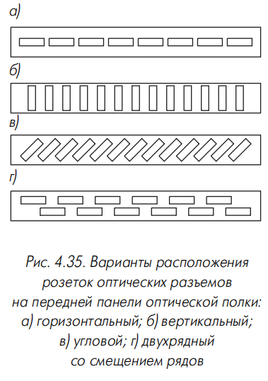

**Рис. 4.35 — Варианты расположения розеток оптических разъёмов на передней панели оптической полки:**
- **а)** горизонтальный;
- **б)** вертикальный;
- **в)** угловой;
- **г)** двухрядный со смещением рядов.

**PatchView в оптике (RiT Technologies):** полка SMART F/O 96O — каждая дуплексная SC-розетка с индикаторным светодиодом; полка подключается к сканеру; для коммутации — шнуры Smart Jumper с дополнительным электрическим проводником **26 AWG** (раздел 13.1.3.1).

**Ввод кабеля:** обычно с задней стенки; некоторые полки — с левой, правой или задней стороны; полки OR-625MMC компании Ortronics — два прямоугольных ввода в крышке.

Полки начала–середины 90-х — прямой кабельный ввод (плоскость совпадала с боковой или задней стенкой), что вызывало проблемы при разделке кабелей внешней прокладки в тесном пространстве. Современные конструкции — ввод под углом к продольной оси: выступ, выемка треугольной формы на задней стенке или проём с планкой под стяжку под углом **45°** (рис. 4.36). Первые два решения герметичнее.

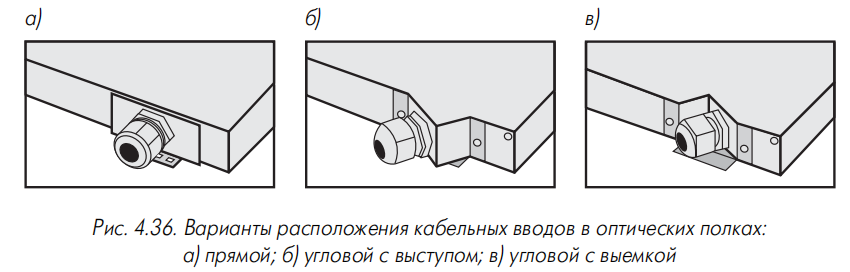

**Рис. 4.36 — Варианты расположения кабельных вводов в оптических полках:**
- **а)** прямой;
- **б)** угловой с выступом;
- **в)** угловой с выемкой.

Конец 90-х — конструкция с одним центральным отверстием в задней стенке: кабель укладывается горизонтально вдоль задней стенки, фиксируется стяжками, в корпус вводятся только трубки модулей. Кабель и место ввода могут закрываться декоративной крышкой (полки «Волоконно-оптическая техника»). Надёжное удержание кабеля, но неудобно в шкафах шириной **600 мм**.

**Для удобства монтажа и обслуживания:** полозья для выдвижения вперёд и откидывания вниз на **30°**; корпус на центральной или боковой оси во внешнем кожухе (популярность ограничена сложностью перемещения при жёстком кабеле внешней прокладки).

**Организатор:** под полкой или перед ней — горизонтальный (кольца или поддон); откидные организаторы в виде полок с кольцевыми выступами для намотки избытка шнуров, ось вращения сбоку, отверстие для ввода шнуров. Откидные организаторы улучшают эстетику и удобство обслуживания, особенно в СКС с развитой оптической подсистемой.

**Таблица 4.15 — Оптические полки**

| Фирма-производитель | Тип | Количество и тип розеток | Примечание |
|---|---|---|---|
| Lucent Technologies | 600 | 12 или 24 ST или SC | Прозрачная верхняя сдвижная крышка, сменная передняя панель на поворотных задвижках |
| Panduit | FRME | 24 или 48 ST | Установка розеток на сменных 6-позиционных лицевых панелях |
| Siemon | FCP-DWR-(X) | 12 или 24 ST или SC | Прозрачная верхняя крышка, угловая установка розеток на сменных вставках, встроенный полочный организатор шнуров |
| RiT Technologies | SMART F/O 96 | 96 SC | Полка оборудована системой PatchView |
| | R3203050 | 12 ST | Угловая установка розеток |

#### 4.3.3.2. Другие виды 19-дюймового оптического оборудования

**Разборные блоки 19-дюймовых панелей** (раздел 3.3.2.3): в гнёзда могут устанавливаться вставки с розетками оптических разъёмов (для информационных розеток на рабочих местах). Гибкая смена конфигурации, но неудобство монтажа (нет организатора световодов и соединителей). Panduit — организатор **fiber spool** барабанного типа на задней части панели через кронштейн.

**Alcatel:** универсальная передняя панель серии Omega типа ACS-202.125 с 6-портовыми оптоволоконными модулями (рис. 4.37). Модуль — передняя стенка с розетками, задняя горизонтальная полка со сплайс-пластиной и кабельным фиксатором. Безкорпусный вариант полки: меньшая стоимость, но нет защиты от механических воздействий и пыли.

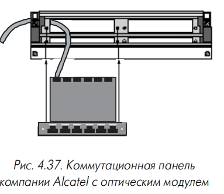

**Рис. 4.37 — Коммутационная панель компании Alcatel с оптическим модулем.**

**global fiber panel** (RW Data Cabling Sciences) — аналогичная схема, модули с розетками, держателем кабелей и сплайс-пластиной закрываются индивидуальными защитными крышками.

**Промежуточные муфты в виде 19-дюймовой полки:** Datwyler 404 866 и 404 867 (ёмкость **24 и 48** соединений); сращивание через разъёмные соединители, внутреннее пространство разделено продольной стенкой. Lucent Technologies LIU100 и LIU200 — корпуса на монтажной пластинке типа 742А друг напротив друга; панели с розетками крепятся только в одном корпусе.

**Преимущества** вместо обычных 19-дюймовых полок: снижение стоимости (вдвое меньше розеток и лицевых панелей, нет шнуров); уменьшение суммарных потерь (меньше разъёмных соединений); улучшение массогабаритных показателей.

### 4.3.4. Настенные муфты

> Настенная муфта (шкафчик) — оконечное и коммутационное устройство для кабелей с небольшим количеством волокон (как правило, не более 24); применяется при монтаже сетевого и коммутационного оборудования без закрытых конструктивов.

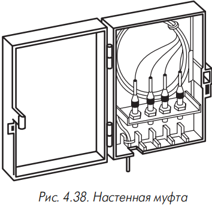

**Рис. 4.38 — Настенная муфта.**

Часто применяются для перехода от кабеля внешней прокладки к кабелю внутренней прокладки вблизи места захода в здание (могут не иметь розеток — роль промежуточной муфты). Некоторые изготовители — металлические защитные корпуса с замком на дверце (для помещений со свободным доступом).

**Конструкция:** тонкостенный металлический или пластмассовый корпус с организаторами и элементами крепления кабеля. Розетки — в один или два ряда на правой боковой поверхности (под правую руку); при 4–6 розетках иногда ориентируют вниз (защита от загрязнений). Отверстия для розеток — заводские или «по месту» (со специальным шаблоном). В импортных муфтах — сменные вставки с шестью гнёздами (крепление двумя фиксаторами цангового типа); иногда унифицированы с полками модульной конструкции.

**Защита шнура:** внутренняя стенка для монтажа розеток или дополнительный внешний откидной защитный экран (металл или прозрачная пластмасса, часто с внутренним замком).

При монтаже нескольких муфт друг над другом — конструкции с местом для транзитного прохода кабелей в левой части корпуса.

**Проблема доступа** к одной из сторон розеток при большом количестве портов. Ortronics — муфта surface mount fiber cabinet с откидной монтажной рамкой (по образцу трёхсекционных настенных 19-дюймовых шкафов); центральная секция откидывается на петлях вбок.

**Таблица 4.16 — Настенные оптические муфты**

| Фирма-производитель | Тип | Количество и тип розеток | Примечание |
|---|---|---|---|
| Lucent Technologies | 100A3 | 12 ST, 6 D-ST, 6 MIC | Комплектуются двумя или четырьмя лицевыми панелями с шестью или тремя отверстиями под розетки; незадействованные места закрываются заглушками |
| | 200А3 | 24 ST, 12 D-ST, 12 MIC | |
| Panduit | FWHE | 24 или 48 ST | Дополнительная защитная стенка и дверца, закрывающая розетки |
| Siemon | SWIC-(XX) | 12, 24, 48 ST и SC | Угловая установка вставок с одной или двумя парами розеток; розетки закрываются откидной дверцей |
| Molex | M.O.R.E. | 12, 24 ST, FC и SC | Комплектуются двумя или четырьмя 6-портовыми модульными лицевыми панелями; розетки закрываются откидной дверцей с замком |

### 4.3.5. Оптические модули

19-дюймовый конструктив обладает большими габаритами. **Оптический модуль** (рис. 4.39) — уменьшенная полка с односторонним креплением; входит в кабельную систему INFRA+, устанавливается на защёлках в распределительных рамах. Для разделки двухволоконного кабеля; при увеличении числа портов корпуса устанавливаются в стек друг над другом; доступ — после откидывания корпуса вбок на петле.

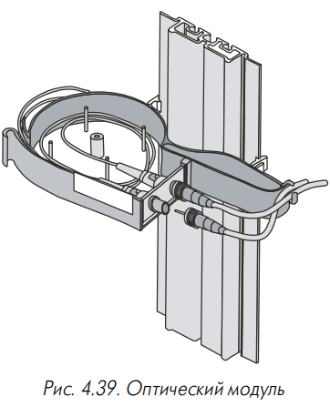

**Рис. 4.39 — Оптический модуль.**

### 4.3.6. Оптические многопользовательские розетки и консолидационные точки

Появились в конце 90-х в связи с ростом популярности открытых офисов; адаптируют концепцию **fiber to the desk** для открытого офиса. Иногда — дополнение розеток мультимедиа (раздел 5.2.3). Закрытый корпус без элементов крепления в 19-дюймовом конструктиве, с соответствующими эстетическими характеристиками. Для установки на колонне, стене и других строительных конструкциях. Максимальная ёмкость известных образцов — **12 портов** (функциональный аналог настенной муфты).

Примеры: 12-портовые изделия **406818–406820** компании AMP (MUTO); изделие **406771** компании AMP (консолидационная точка).

### 4.3.7. Информационные розетки

> Оптическая информационная розетка — интерфейсный элемент СКС со стороны пользователей на рабочих местах; к ней подключается горизонтальный кабель, связывающий её с КЭ.

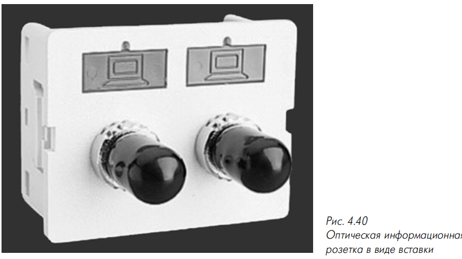

**Рис. 4.40 — Оптическая информационная розетка в виде вставки.**

Конструктивно — вставка из корпуса и одной или нескольких розеток оптических разъёмов. Варианты: прямая и угловая установка с выступом и выемкой. Предпочтительна установка розеток направляющими пазами вниз. При монтаже левая розетка маркируется символом **А**. Основной вид розеточных модулей (на середину 1999 года) — **SC**; в описанных выше случаях допускаются **ST**.

Корпус и способ установки должны обеспечивать радиус изгиба горизонтального кабеля не менее **30 мм**. В остальном конструкция аналогична электрическому аналогу.

**Розетки мультимедиа** (раздел 5.2.3.5) — возможность произвольно комбинировать электрические и оптические порты; большие габариты позволяют обеспечить требуемый радиус изгиба волокна.

**Информационные розетки первого поколения** — вставка для монтажа в короб с декоративной панелью. Недостатки: сложность монтажа разъёмов в полевых условиях, невозможность оконцевания монтажными шнурами.

**«Двухэтажные» конструкции:** первый уровень (монтажная коробка внутри короба) — организатор для технологического запаса волокон; второй верхний уровень — собственно розетка с розеточными модулями. Иногда рядом с розетками — дополнительная направляющая для заданного радиуса изгиба.

**«Полуоткрытый» вид (рис. 4.41):** организатор световодов барабанного типа в задней части розетки — перпендикулярно плоскости розетки на пластиковом кронштейне (**fiber spool** серии CFS2XX компании Panduit, рис. 4.41а) или параллельно ей (розетка типа 2-966936-5 фирмы АМР, рис. 4.41б). Ёмкость барабана — до **12 м** волокна в буферном покрытии 0,9 мм и до **2 м** стандартного дуплексного кабеля для шнуров. Первый вариант универсальнее (применим в коммутационных панелях); исполнение AMP — меньшие габариты.

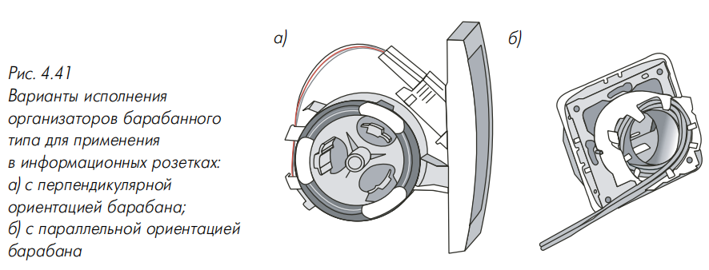

**Рис. 4.41 — Варианты исполнения организаторов барабанного типа для применения в информационных розетках:**
- **а)** с перпендикулярной ориентацией барабана;
- **б)** с параллельной ориентацией барабана.

## 4.4. Оконцованные волоконно-оптические кабельные изделия

### 4.4.1. Коммутационные и оконечные шнуры

> Оптический коммутационный шнур — отрезок кабеля для шнуров с вилками оптических разъёмов на концах; предназначен для ручной коммутации сегментов СКС.

В подавляющем большинстве — двойные шнуры; одинарные — редко, главным образом для измерительного оборудования.

Стандарты СКС: основной тип — **SC**. Вилки SC на кабеле шнура — с разной маркировкой: **A–B** или **B–A** (рис. 4.42). Для ST (без заводской маркировки) — маркировка другим способом по той же схеме (полимерные хвостовики разного цвета, например Siemon — чёрный и бежевый; гайки-фиксаторы из металла разных цветов — Brugg, реже). Иногда — самоламинирующиеся этикетки или сменные надписи.

**Рис. 4.42 — Коммутационный шнур с вилками SC-разъёмов.**

> Оптический оконечный шнур — отрезок двойного кабеля для шнуров с вилкой двойного SC-разъёма с одной стороны и одной двойной или двумя одиночными вилками другого типа с другой — для подключения к сетевому оборудованию.

Пример: для подключения к FDDI-концентратору — вилка **MIC** (рис. 4.43).

**Рис. 4.43 — Оконечный шнур ST-MIC.**

Стандартный ряд длин — **3, 5, 10 и 15 м**; другие — на заказ. Обозначение — буквенно-цифровые индексы (тип волокна, вилок, длина) [7]. Индивидуальная упаковка — прозрачный пластиковый пакет с этикеткой-паспортом (фактическое затухание, коэффициент обратного отражения для одномодовых).

### 4.4.2. Претерминированные кабельные изделия

#### 4.4.2.1. Претерминированные сборки

> Претерминированная сборка (preterminated cable) — отрезок многоволоконного оптического кабеля, оконцованный вилками оптических разъёмов в стационарных производственных условиях, со специальной оконечной арматурой.

Позволяет строить трассы без сварки и оконцовки волокон на объекте (меньше стоимость и время работ, рис. 4.44). Арматура — герметичный наконечник из металлической или пластмассовой трубки с уложенными вилками и запасом длины волокна. Монтаж: протяжка кабеля, удаление наконечника, подключение вилок к розеткам полки или настенной муфты.

**Рис. 4.44 — Претерминированная сборка.**

Поверхность наконечника — гладкая или гофрированная (гибкость, но выступы цепляются; защитный чехол из эластичного материала). На переднем конце — проушина или рым-болт (предпочтительнее — предупреждает закручивание). Защитная арматура может быть составной: головная часть удаляется, задняя остаётся как силовой элемент под зажим кабельного держателя (Brugg, серия fiber quick).

**Перспективно** — армирование групповым разъёмом (меньше длина и диаметр наконечника); для разводки по розеткам — короткий комбинированный шнур. Molex выпускает комплект для изготовления сборки на объекте: мягкий пластиковый наконечник с кольцом для протяжки и элементами крепления кабеля.

Сборка поставляется на барабане; при армировании обоих концов — намотка концевых участков в отдельной секции с внутренней стенкой.

**Претерминированные полки (preterminated shelves)** — Lucent Technologies, ADC, Fibertron, Molex: один конец кабеля уже введён в распределительную полку и подключён к розеткам. Полка — с одного или двух концов кабеля. Suhner — полки в защитных чехлах от пыли при протяжке.

Для временных связей — кабель до **300 м** на барабане диаметром около **70 см** с ножками и ручкой (Brugg). Применение оправдано при протяжённости трассы до **2 км**; требует точного знания длины. Армирование одного или двух концов — при заказе. Пример системы — **FLine** компании Kerpen.

#### 4.4.2.2. Ремонтные кабельные вставки

> Ремонтная кабельная вставка — отрезок кабеля длиной 100–300 м на катушке с муфтами с обоих концов; для быстрого восстановления связи при повреждении магистрального кабеля.

В муфте — розетки оптических разъёмов или запас волокна. Катушка с ручками и каркасом на колёсиках; муфты укладываются внутрь катушки, не выступая за края.

**Рюкзачный тип** — каркас в форме рамы станкового рюкзака для доставки к месту ремонта без автотранспорта (рис. 4.45).

**Рис. 4.45 — Ремонтная кабельная вставка рюкзачного типа.**

Подключение волокон магистрального кабеля — механическими сплайсами или адаптерами быстрого оконцевания.

### 4.4.3. Монолитные распределительные панели

> Монолитная распределительная панель (мини-панель, кассета, fibre cassette) — новый тип оконцованных кабельных изделий (конец 90-х); по идее похожа на претерминированные полки.

**Отличия:**

- корпус монолитный — пользователь и монтажник не имеют доступа внутрь; меньшие габариты;
- кабель оконцовывается вилкой группового соединителя.

**Три схемы построения тракта:**

- **«экономичная»** [104] — две панели с кабелями разной длины; длина одной определяется протяжённостью трассы (один разъёмный соединитель);
- **«гибкая»** — кабели панелей одинаковой небольшой длины (порядка **1 м**), соединение обычными претерминированными сборками (два соединителя);
- **без кабеля** — на корпусе только разъём (два соединителя).

## 4.5. Адаптеры

> Оптический адаптер — изделие для подключения вилок разъёмов разных типов; формально не входит в область действия стандартов СКС.

**Основные виды:**

- **переходные розетки** — проходная розетка с общей центрирующей гильзой и гнёздами двух разных типов по обе стороны. Пример — переходная розетка **MIC-2ST** (рис. 4.46); возможен переход между разъёмами с разным диаметром наконечника (MU и SC) [105];
- **FM-разъёмы (female-male)** — вилка, задняя часть которой выполнена в виде гнезда розетки для наконечника вилки другого типа (рис. 4.47). Для перехода с одного типа вилки на другой при отсутствии переходного шнура и в измерительных целях (защита излучателя или фотодиода прибора).

**Рис. 4.46 — Переходная розетка MIC-2ST.**

**Рис. 4.47 — FM-разъём.**

> Оптический аттенюатор — устройство для ослабления оптического сигнала; применяется при перегрузке чувствительного фотоприёмника на коротких трассах.

В СКС удобны **аттенюаторы-розетки** и **FM-адаптеры со встроенными аттенюаторами** (фиксированные и переменные с плавной регулировкой). Предпочтительнее аттенюаторы на основе FM-адаптеров.

## 4.6. Промежуточные муфты

> Промежуточная муфта — устройство для сращивания сегментов кабелей внешней прокладки в подсистеме внешних магистралей.

**Причины применения:**

- ограничения на длину строительных сегментов (обычно по **1–4 км**), длинные магистрали состоят из нескольких сегментов;
- защита мест сращивания при ремонте повреждённого или оборванного кабеля.

**Отличия от коммутационных полок и настенных муфт:** нет розеток для внешних шнуров; есть уплотняющие сальники, прокладки, манжеты для герметизации внутреннего объёма.

**Условия эксплуатации (рис. 4.48):** коллекторы и колодцы кабельной канализации; непосредственно в грунте; в болотах; на дне водоёмов; на столбах воздушных линий. Конструкция должна обеспечивать герметичность при замерзании во льду.

**Рис. 4.48 — Промежуточная муфта.**

**Конструкция:** корпус в форме цилиндра или параллелепипеда со скруглёнными кромками (иногда с рёбрами жёсткости); реже — диск. Внутри — лоток с кассетами для оптических сростков, элементы герметизации и обеспечения непрерывности броневых и упрочняющих элементов кабеля.

**Герметизация:** холодный или горячий способ — заливочная масса, термоусаживаемые трубки, прокладки, манжеты, мастики, герметизирующие ленты (лента VM компании 3М). Raychem — заливка желеобразной массой. Новые конструкции — чисто механическая герметизация (болты, хомуты) без герметиков и термоусадки (быстрее и проще при многократной сборке-разборке).

**По количеству и расположению вводов:** прямая (вводы с разных сторон), тупиковая (стаканчиковая; с одной стороны), проходная (два ввода), разветвительная (три и более).

Из-за небольшой протяжённости трасс СКС необходимость в сращивании возникает редко; промежуточные муфты в каталоге — лишь у некоторых производителей (Lucent Technologies, HellermannTyton).

## 4.7. Система Blolite

> Blolite — система пневмопрокладки оптических волокон (BICC, конец 80-х): по трассе прокладываются пустые кабельные каналы (bloducts), в которые затем вдувается оптическое волокно сжатым воздухом (рис. 4.49). В отличие от традиционной пневмозаготовки не применяется вытяжной парашют.

**Рис. 4.49 — Элементы системы Blolite:**
- **а)** кабельные каналы bloducts;
- **б)** кабель blotwist.

**Оптические волокна** — 9/125, 50/125 и 62,5/125 с дополнительной внешней оболочкой из антистатического материала (специальная структура поверхности усиливает продвижение в воздушном потоке). Для гибкости внешний диаметр вторичного защитного покрытия уменьшен примерно до **500 мкм**. Допускается непосредственная установка вилок оптических разъёмов без сварки и механических сплайсов.

**Кабельные каналы:** диаметр **5 или 8 мм** (внутренний **3,5 и 6 мм**); в общей оболочке — от одного до семи каналов (рис. 4.49а). Каналы 5 мм — трассы до **500 м**; 8 мм — до **1000 м**. Максимальная длина вертикальных трасс — **300 м**. Влагостойкая оболочка — для прокладки между зданиями. Внутри здания — кабель **Blotwist** с максимум четырьмя экранированными или неэкранированными электрическими модулями категории 5 и одной трубкой кабельного канала (рис. 4.49б): UTP (C5U), STP (C5F), S/STP (C5S); возможна окраска оболочек.

В одном канале — до **четырёх световодов** (в перспективе 8, затем 12); скорость прокладки — **40 м/мин**; до **300 поворотов** с радиусом изгиба **25 мм**. Прокладка дополнительных линий в большинстве случаев не требует остановки работы системы.

**Концепция:** в момент создания системы прокладываются относительно дешёвые каналы; количество световодов определяется текущими потребностями. Упрощаются замена волокна и ремонт (заменяемое волокно выдувается из канала).

**Аксессуары и оборудование:** элементы сращивания каналов (в том числе разного диаметра), заглушки, промежуточные муфты для внутреннего и внешнего монтажа. Прокладка — комплект **BloCentre** (электрический воздушный компрессор и осушитель воздуха; осушитель может подключаться к баллону со сжатым воздухом; два чемодана). Проверка каналов: вдувание полимерного шарика с уловителем (загибы, пережатия); проверка герметичности по постоянству давления (максимум **10 бар**).

**Оценка разработчиков:** распределение во времени до **65%** общего объёма средств на кабельную систему; стоимость ремонта повреждённых участков примерно на **40%** дешевле по сравнению с традиционными кабелями.

## 4.8. Выводы

Характеристики волоконно-оптических изделий полностью соответствуют современным требованиям к элементной базе СКС. Уровень стандартизации и техническое исполнение позволяют использовать при организации оптических и электрических подсистем СКС одинаковые типовые приёмы, правила построения и технические решения.

Кабельные изделия СКС и сетей связи общего пользования в значительной степени унифицированы: фактические параметры кабелей СКС (например, затухание) существенно превышают нормируемые стандартами, а цены на элементную базу низкие.

Применение различных типов вторичных защитных покрытий позволяет согласовывать конструкцию кабеля с областью применения; для каждой из трёх подсистем СКС существует свой основной тип оптического кабеля.

Для построения СКС применяются главным образом многомодовые кабели. Рост популярности одномодовых решений обусловлен необходимостью поддержки сверхвысокоскоростных интерфейсов типа Gigabit Ethernet.

Основная масса многомодовых кабелей и коммутационных шнуров СКС — на основе волокна **62,5/125**; их рекомендуется применять для оптической подсистемы. Для передачи Gigabit Ethernet на **300–500 м** предпочтительнее кабели с широкополосными многомодовыми световодами специальной конструкции.

Основной вид разъёма в СКС — **SC**; в ближайшей перспективе будут введены разъёмы с увеличенной плотностью монтажа и одинаковым форм-фактором с электрическим модульным разъёмом — это увеличит унификацию электрических и оптических коммутационных устройств и упростит интеграцию решений.

Основной вид коммутационного оборудования оптических подсистем — **19-дюймовая полка**. Настенная муфта и коммутационная стойка позволяют гибко учитывать местные условия в технических помещениях. Рост популярности **fiber to the desk** в открытых офисах определяет наличие абонентской розетки и консолидационной точки, не встречающихся в сетях связи общего пользования.

Развитая номенклатура оконцованных кабельных изделий гарантирует быстроту построения оптических линий СКС и восстановления связи в аварийных ситуациях без сложного и дорогого специализированного оборудования.

---

## FAQ

**Для чего предназначено оптическое коммутационное оборудование?**
Для подключения волокон сегментов СКС шнурами, подключения сетевого оборудования через оконечные шнуры и адаптеры, неразъёмного сращивания волокон внутри корпуса.

**Какие типовые элементы конструкции оптических коммутационных устройств?**
Корпус, панель с розетками, элементы маркировки, организатор световодов, организатор неразъёмных соединителей (сплайс-пластина), кабельный фиксатор.

**Что такое сплайс-пластина?**
Комбинированный элемент для крепления трубок защитных гильз сварных соединений или корпусов механических сплайсов; ёмкость обычно не более 16 волокон.

**Какие три схемы внутренней разводки коммутационных устройств?**
Без промежуточного соединения; с групповым разъёмом (претерминированная сборка); со сваркой и механическими сплайсами (монтажные шнуры pig tail).

**Когда применяются коммутационные стойки?**
При числе оптических портов в несколько сотен и более.

**Какой основной тип разъёма для СКС и коммутационных панелей?**
SC; розетки должны быть двойными (для двойных коммутационных шнуров).

**Что такое PatchView в оптике?**
Система RiT Technologies: полка SMART F/O 96O с индикаторными светодиодами на дуплексных SC-розетках, подключение к сканеру, шнуры Smart Jumper с дополнительным проводником 26 AWG.

**Для чего применяются настенные муфты?**
Как оконечные и коммутационные устройства для кабелей с небольшим количеством волокон (не более 24); для перехода от кабеля внешней прокладки к кабелю внутренней прокладки.

**Что такое оптический модуль?**
Уменьшенная полка с односторонним креплением для установки на защёлках в распределительных рамах (система INFRA+).

**Какова максимальная ёмкость оптических MUTO и консолидационных точек?**
Не более 12 портов.

**Какие требования к оптической информационной розетке?**
Радиус изгиба горизонтального кабеля не менее 30 мм; левая розетка маркируется символом А; основной вид розеточных модулей — SC.

**Что такое претерминированная сборка?**
Отрезок многоволоконного кабеля, оконцованный вилками разъёмов в производственных условиях, со специальной оконечной арматурой.

**Что такое претерминированная полка?**
Претерминированная сборка, один конец кабеля которой уже введён в распределительную полку и подключён к розеткам.

**Что такое монолитные распределительные панели?**
Мини-панели (кассеты) с монолитным корпусом без доступа внутрь; кабель оконцовывается вилкой группового соединителя.

**Какие виды оптических адаптеров?**
Переходные розетки и FM-разъёмы (female-male); также аттенюаторы-розетки и FM-адаптеры со встроенными аттенюаторами.

**Для чего применяются промежуточные муфты?**
Для сращивания сегментов кабелей внешней прокладки (ограничения длины строительных сегментов; ремонт повреждений).

**Какие условия эксплуатации промежуточных муфт?**
Коллекторы и колодцы кабельной канализации, грунт, болота, дно водоёмов, столбы воздушных линий; герметичность при замерзании во льду.

**Что такое система Blolite?**
Система пневмопрокладки оптических волокон: по трассе прокладываются пустые каналы (bloducts), в которые вдувается волокно сжатым воздухом.

**Какие параметры системы Blolite?**
Каналы 5 или 8 мм (внутренний 3,5 и 6 мм); до семи каналов в оболочке; трассы до 500 и 1000 м; вертикальные — до 300 м; до четырёх световодов в канале; скорость 40 м/мин; до 300 поворотов с радиусом 25 мм.

**Какие два способа сращивания световодов существуют?**
Разъёмные (разъёмы) и неразъёмные (сростки).

**Какие разъёмы допускаются в СКС?**
Только SC и ST; во вновь создаваемых СКС — только SC.

**Как маркируются вилки и розетки SC?**
Буквами A и B: вилка A подключается к розетке A, и наоборот. Вилка A — источник, розетка A — приёмник. На сетевом оборудовании розетка A — вход приёмника, B — выход передатчика.

**Какие требования стандартов к затуханию и обратному отражению?**
Затухание — 0,5 дБ; обратное отражение — не хуже –20 дБ (многомодовые) и –26 дБ (одномодовые); 500 циклов соединения-разъединения.

**Какие классы одномодовых разъёмов по обратному отражению?**
PC (< –30 дБ), Super PC (< –40 дБ), Ultra PC (< –50 дБ), Angled PC (< –60 дБ).

**Что такое физический контакт (PC)?**
Прижатие стекла сердцевины одной вилки к стеклу другой без воздушного зазора; обязательное условие минимизации обратного отражения.

**Какие материалы наконечников применяются?**
Керамика (основной), пластмасса, металл (нержавеющая сталь), стекло. Композитные — керамика с мельхиором и др.

**Что такое пассивная и активная юстировка?**
Пассивная — деформация мягкой вставки кольцевым штампом до затвердевания клея (эксцентриситет до 2 мкм). Активная — штамп-сектор 120° после затвердевания (эксцентриситет сердцевина-наконечник не более 0,5 мкм, потери 0,12 дБ).

**Чем отличается SC от ST?**
SC — пластмассовый корпус, защёлка, линейное движение, дуплексный вариант, основной тип в СКС. ST — металлический корпус, байонетный фиксатор, поворот на 1/4 оборота, нет дуплексного варианта, устаревает.

**Что такое LC, MU, E-2000, FJ?**
Разъёмы с увеличенной плотностью установки: LC — наконечник 1,25 мм; MU — mini-SC (наконечник 1,25 мм); E-2000 — наконечник 2,5 мм, компактная компоновка; FJ (Opti-Jack) — дуплексный, расстояние между осями 6,4 мм.

**Какие разъёмы без центрирующего наконечника существуют?**
Optoclip II (Huber+Suhner), VF-45 (3М).

**Что такое групповые разъёмы?**
Многоканальные разъёмы для одновременного сращивания нескольких пар волокон: SCDC, SCQC, Mini-MT, MT-RJ, Mini-MPO (до 18 волокон).

**Какие четыре группы конструкций сердечников кабелей внешней прокладки существуют?**
С профилированным сердечником, модульная, с центральной трубкой, ленточная.

**Какая конструкция кабелей внешней прокладки доминирует?**
Модульная (многомодульная), ёмкость до 144 волокон.

**Для чего используется ленточная конструкция?**
Для основных магистралей крупных городских телекоммуникационных сетей при большом количестве волокон (несколько сотен и более).

**Чем отличаются кабели с металлическими упрочняющими элементами от полностью диэлектрических?**
Прочнее к сдавливанию и растяжению, световоды не повреждаются грызунами, меньший диаметр; недостаток — нет полной гальванической развязки.

**Какой рабочий температурный диапазон кабелей внешней прокладки?**
От –40 до +70 °С; морозостойкие — до –60 °С.

**Какие броневые покровы применяются?**
Металлическая оплётка, гофрированная стальная лента, круглая оцинкованная проволока; плотная оплётка из проволоки (ограниченно).

**Какое максимальное растягивающее усилие у кабеля со стальной проволокой?**
10000 Н (двухслойная броня — 20000 Н и более).

**Чем обеспечивается продольная герметизация?**
Гидрофобным гелем, заполняющим пустоты сердечника и модулей.

**Чем обеспечивается поперечная герметизация?**
Наружными оболочками (полиэтилен); при предельной влажности — тонкой металлической оболочкой из алюминия или меди.

**Чем отличаются кабели внутренней прокладки от внешних?**
Меньший диаметр и масса, выше гибкость (нет геля и брони), лучшая пожарная безопасность.

**Какие две разновидности кабелей внутренней прокладки?**
Распределительные (distribution) и breakout.

**Чем отличается breakout-кабель?**
Каждый световод в защитном шланге 2–3 мм; для претерминированных сборок и отводов без муфт.

**Для чего предназначены кабели для соединения зданий?**
Для соединения зданий при длине трассы до нескольких сотен метров; занимают промежуточное положение между внутренними и внешними.

**Что такое mini-breakout?**
Конструкция кабеля для шнуров: общая оболочка 2,5–3 мм, два световода в тонкостенной трубке 0,9 мм; для разъёмов с увеличенной плотностью установки.

**Что такое ключевая схема кодирования?**
В каждом повиве два окрашенных модуля (ключевой и опорный), остальные нумеруются между ними; заполнители и упрочняющие элементы — чёрные.

**Как маркируются оптические кабели?**
Буквенно-цифровым индексом по МЭК-794-1 с метками длины; маркировка краской или термическим способом.

**Для чего используются волоконно-оптические линии в СКС?**
В основном для магистральных подсистем; во внешних магистралях доминируют.

**Какие три вида оптических кабелей СКС существуют?**
Кабели внешней прокладки, внутренней прокладки и для шнуров.

**Какие диаметры сердцевины у одномодовых и многомодовых световодов?**
Одномодовые — 9,3±0,5 мкм (7–10 мкм); многомодовые — 50 или 62,5 мкм (±3 мкм).

**Какое волокно лучше по частотным свойствам — 50/125 или 62,5/125?**
50/125; поэтому его популярность возросла для Fiber Channel и Gigabit Ethernet.

**Что такое первичное защитное покрытие?**
Покрытие из эпоксиакрилата диаметром 245±15 мкм, обеспечивающее гибкость волокна.

**Какие три вида вторичных защитных покрытий применяются?**
Модульная конструкция, tight buffer 0,9 мм, квазивторичные покрытия (микромодульная и двухслойная).

**Что такое mini-breakout?**
Тонкостенная трубка 0,9 мм с двумя световодами в первичном покрытии без геля; для разъёмов с увеличенной плотностью монтажа.

**Почему стандартные кабели СКС ограничивают дальность Gigabit Ethernet?**
Не гарантируют дальность свыше 220–275 м в окне 850 нм.

**Что такое VCSEL?**
Vertical Cavity Surface Emitting Laser — лазер с вертикальным резонатором, работающий на 850 нм; дешевле лазеров LX-диапазона (соотношение 5:1 в 1998 году).

**Что такое дифференциальная модовая задержка?**
Дробление импульса из-за разных скоростей распространения мод, возбуждаемых лазером.

**Как борются с дифференциальной модовой задержкой?**
Смещением точки ввода (MCP-шнур) или гладким профилем показателя преломления без центрального провала.

**Почему волокно 50/125 популярнее 62,5/125 для высокоскоростных приложений?**
Меньше направляемых мод — проще получить больший коэффициент широкополосности.

**Какие технологии применяются для новых типов волокон?**
OVD (Corning Infinicore), APVD (Alcatel GigaLite).

**До какой скорости поддерживают новые волокна?**
Большинство — до 1 Гбит/с; LazrSpeed и Blolite — до 10 Гбит/с при спектральном уплотнении на четырёх длинах волн.