

 Кратко 

Это **глава 5 учебного/справочного пособия по СКС** (структурированным кабельным системам). Она называется **«Дополнительные компоненты»** и посвящена оборудованию, которое используется при монтаже СКС — шкафам, стойкам, коробам и аксессуарам.

## О чём глава

Глава состоит из двух больших частей:

1. **Монтажное оборудование (19-дюймовые конструктивы)** — раздел 5.1.
2. **Декоративные кабельные короба** — раздел 5.2.

В конце — краткие выводы (5.3).

---

## 5.1. Монтажное оборудование

### 5.1.1. 19-дюймовые конструктивы
- **Зачем нужны:** компактно разместить оборудование (концентраторы, коммутаторы, маршрутизаторы, серверы) в кроссовых и аппаратных, обеспечив удобный доступ.
- **Стандарт:** ANSI/EIA RS-310D, позже перенесён в ISO/IEC-297. Есть также 17-, 23-, 24-дюймовые и метрические, но они редки.
- **Единица измерения высоты — U (юнит):** 1U = 1,75 дюйма = 44,45 мм. Обозначается также RMS, RU, HE, HU.
- **Крепёж:** квадратные гайки с пружинящими лапками, винты М5/М6, часто хромированные.
- **Габариты шкафов:** высота от 800 до 2200 мм (13–45U), ширина 550–900 мм (чаще 600), глубина 400–900 мм (чаще 600/800).
- **Особенность comrack (Schroff):** Н-образные верх/низ, пазы вместо отверстий — плавная регулировка высоты, экономия направляющих при установке в ряд.

### 5.1.2. Монтажные шкафы
- **Назначение:** закрытые 19" конструктивы, основной элемент для установки оборудования СКС.
- **Каркас:** сварной (жёстче) или сборный (удобнее транспортировать).
- **Преимущества шкафов:** ограничение доступа, защита от пыли/грязи/воды (IP), экранирование от ЭМП, эстетика.
- **Делятся на:** напольные и настенные.

**Напольные шкафы:**
- Высота 21–48U, ширина 600/800 мм, глубина 600/800 мм.
- Элементы: направляющие, каркас с основанием, верхняя крышка, боковые стенки, передняя и задняя двери.
- Проблема доступа к боковой/задней части при установке в ряд — решается поворотной рамой (до 180°) или выдвижной рамой (телескопические направляющие).
- Основание (цоколь): отверстия для кабелей снизу, съёмные панели, щёточные вводы, фильтры.
- Ножки: регулируемые, с шарниром до 35°, ролики (с арретиром или без).
- Двери: стальные (экранирование) или стеклянные (визуальный осмотр). Петли легкосъёмные, перевешиваются без инструмента.
- Двухсекционные (друг над другом) и двустворчатые (гардеробного стиля) двери.

**Охлаждение:**
- **Активное:** вентиляторы осевые/радиальные, вентиляторные полки, кондиционеры (на задней или боковой стенке).
- **Пассивное:** перфорация, люки в крышке, вентиляционные щели, утопленная установка двери.
- На практике часто комбинируют.

**Специальные разновидности:**
- Серверные (усиленные, принудительное охлаждение, перфорированные двери).
- Промышленные (IP43+, неразборные, сварной каркас, уплотнители).
- Офисные (эстетика, светлые тона, безрамные стёкла, IP20).
- Для наружной установки (цельносварные, двойные стенки, кондиционеры).

**Настенные шкафы:**
- Высота 3–15U, ширина 600 мм, глубина 250–450 мм.
- 3-секционные (основание + поворотная секция + дверь) и 2-секционные (корпус + дверь).
- Крепятся на стену, часто с шаблоном для разметки.
- Вентиляция — одиночный вентилятор (не полка).
- Бывают настенные шкафчики шириной меньше 19" — для консолидационных точек, датчиков, сигнализации.

### 5.1.3. Другие виды 19" оборудования
- **Открытые стойки** — дешевле шкафов, вдвое меньше площадь, лучше охлаждение. Одна или две пары направляющих. Рекомендуется крепить к стене/полу.
- **Монтажные рамы** — П-образные, на стену, высота обычно до 10U (у Molex — до 42U). Для небольшого объёма оборудования.
- **Настенные рамы** — прямоугольные, малой глубины, ограниченное применение.
- **Монтажные консоли** — модульная мебель для рабочего места администратора (диспетчерские, операторские).
- **Подвижные приборные стойки** — открытый каркас на колёсах, для тестирующего/диагностического оборудования.

### 5.1.4. Оборудование и аксессуары
- **Полки, поддоны, уголки:** для оборудования без штатного крепежа (мониторы, принтеры, системные блоки). Фиксированные и выдвижные. Нагрузка до 50–100 кг (поддоны — до 300 кг).
- **Распределители силового питания:** вертикальные (до 10 розеток, на задней направляющей) и горизонтальные (до 5 розеток, 1U). С фильтрами, варисторами, автоматами. Силовые кабели — не ближе 10 см от информационных.
- **Оборудование заземления:** внутренняя шина (медь ~0,5 см²), внутренние распределители «земли», болты. Обязательно для всех проводящих деталей.
- **Организаторы шнуров/кабелей:** кольцевые, щелевые, гребенчатые, поддерживающие. Горизонтальные (1–2U) и вертикальные (до 40U). Для оптики — с соблюдением радиуса изгиба (90° секторы).
- **Принудительная вентиляция:** одиночные вентиляторы и вентиляторные полки (1–2U, до 9 модулей, 50–150 м³/ч, ~40 дБ(А)). Регуляторы производительности.
- **Дополнительные аксессуары:** освещение (лампы накаливания — из-за броска тока), датчики (температура, влажность, фазы, охрана) с SNMP, нагреватели, ящики/карманы для документации, панели-заглушки, адаптеры, герметизирующие наборы (до IP54), балластные формы для устойчивости.

---

## 5.2. Декоративные кабельные короба

### 5.2.1. Назначение и конструкция
- **Назначение:** укладка информационных и силовых кабелей, установка розеток. Применяются, когда прокладка иначе невозможна/нецелесообразна, нужна защита от механических повреждений и вода/брызг, нужна эстетика.
- **Требования:** эстетика, пожаробезопасность (включая аэродинамику), ударопрочность, стойкость к УФ, пробивная стойкость (до 240 кВ/см), переходное сопротивление для металлических.
- **Виды:** цельные (с разрезом и утоньшением), составные (основание + П-образная или плоская крышка), сборные с поворотной крышкой. Сечения: прямоугольные, трапециевидные, треугольные, полукруглые, плинтусы.
- **Секционирование:** для раздельной прокладки силовых и информационных кабелей (например, Panduit T70: 587 мм² силовая / 2013 мм² информационная).
- **Материалы:** ПВХ (основной), безгалогенные (дороже), металлы (алюминий, сталь). Металл даёт экранирование (Al — ~25 дБ, напыление — ~10 дБ).
- **Окраска:** белый (наиболее популярен), матовый/глянцевый, по каталогу RAL (дороже на 5–30%, срок больше в 2,5–3 раза). Защитная плёнка до установки.
- **Поставка:** обычно 2 м, реже 3 м (Panduit, Siemon).

### 5.2.2. Стандартные комплектующие
- Внутренний/внешний угол (фиксированный 45–135° или гибкий 10–170°).
- Плоский угол (90°), отвод/тройник, крестовой соединитель, адаптеры (прямые, угловые, тройники).
- Заглушка, соединительная деталь (с внутренним соединителем), разделительная стенка.
- Декоративные накладки/манжеты, держатели/фиксаторы кабеля.
- Дополнительно: звукопоглощающие пластины, огнезащитные вставки, защитные колпачки, проходные втулки.

### 5.2.3. Установка розеток
Три варианта:
| Параметр | В короб | На короб | Рядом с коробом |
|---|---|---|---|
| Сложность | низкая | средняя | высокая |
| Стоимость | низкая | низкая | высокая |
| Эстетика | высокая | низкая | средняя |
| Требуемая ёмкость короба | высокая | низкая | низкая |

- **В короб:** монтажная коробка (подрозетник), кронштейн, лицевая пластина. Расстояние между отверстиями 60 мм (европ.) / 93 мм (амер.).
- **На короб («в профиль»):** монтажная рамка + розеточный модуль.
- **Рядом с коробом («вдоль профиля»):** монтажная рамка на стену/мебель, накладка закрывает вывод кабелей.
- **Комбинированные:** внешние корпуса, workstation outlet center (Panduit).
- **Розетки мультимедиа:** для электрических и оптических разъёмов, с организатором световодов (запас 1 м), установка на стену/пол/магниты, до 24 портов (Siemon).

### 5.2.4. Подключение рабочих мест в больших залах
- **Подпольные коробки:** 300×300 или 300×200 мм, в фальшпол. Вертикальная/горизонтальная установка розеток, зазор ≥45 мм, IP20, крышка с отгибом или поворотной шайбой.
- **Напольные коробки (пьедесталы):** на фальшпол, на 1–2 рабочих места, передняя панель с наклоном, защита свесом крышки или дугой.
- **Настольные розетки:** крепление к мебели винтовым зажимом, до 4 модулей.
- **Декоративные колонны:** высотой до 0,6 м или от пола до потолка, телескопические с винтовым домкратом, из анодированного алюминия.
- **Розеточная панель:** отрезок короба под столешницей или вертикально у стола.
- **Корпуса для консолидационных точек:** настенные/на колоннах, с замком, прозрачной крышкой, блоками 110/66.

### 5.2.5. Другие виды коробов
- **Для ВОК:** появились в конце 90-х, только прямоугольные, ограничение радиуса изгиба 30 мм, яркая окраска (оранжевый/жёлтый), прозрачные углы для контроля.
- **Под фальшполом и за фальшпотолком:** без секционирования, малые типоразмеры, перфорированное днище, переходные элементы, огнезащита.
- **Напольные короба:** полукруглые, для пешеходных переходов, рёбра жёсткости.
- **Кабельные каналы (wiring duct):** для неофисных помещений, гребёнка с отламываемыми ламелями, крышка.

### Специализированный инструмент
- Отрезной (ручной/электрический), резаки-гильотины с шаблонами, кондукторы, съёмники крышек.

---

## 5.3. Выводы
- Дополнительные компоненты обеспечивают эстетику, удобство обслуживания, защиту, ограничение доступа, экранирование.
- Рынок предлагает широкую номенклатуру конструктивов и коробов.
- Монтажное оборудование стандартизировано (взаимозаменяемость), короба — практически нет (высокие требования к поставщику).
- Тенденция: массовое использование датчиков и исполнительных элементов с SNMP.
- Развитие коробов: специализация (для оптики) и расширение областей применения (фальшпол, фальшпотолок, стояки).
- Специализированный инструмент ускоряет и улучшает монтаж.

---

Если нужно, могу сделать **совсем короткую выжимку** (5–7 предложений) или **таблицу по разделам**.

# Глава 5. Дополнительные компоненты

## 5.1. Монтажное оборудование

### 5.1.1. 19-дюймовые конструктивы

> **19-дюймовый конструктив** — <mark>стандарт монтажного оборудования, определяющий размеры передних панелей, высоту и расположение крепёжных отверстий.</mark>

<mark>Для компактного размещения оборудования СКС совместно с сетевыми устройствами на ограниченной площади кроссовых и аппаратных залов применяется 19-дюймовое монтажное оборудование (рис. 5.1). Существуют также 17-, 23-, 24-дюймовые и метрические конструктивы (535 мм)</mark>, однако в России преимущественно используется 19-дюймовый стандарт. Установка 19-дюймового оборудования в 23-дюймовый шкаф выполняется через съёмные адаптеры.

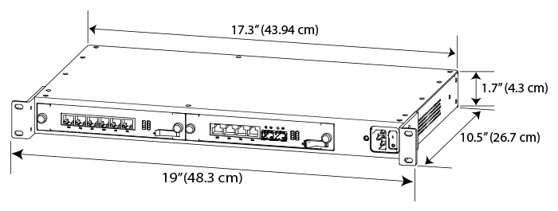

Основные размеры заданы стандартом ANSI/EIA RS-310D, положения которого в 1969 году перенесены в ISO/IEC 297.

RS-310D

ANSI/EIA RS‑310D — <mark>это стандарт, который задаёт габариты и монтажные параметры для телекоммуникационных шкафов и стоек</mark>, чтобы оборудование разных производителей можно было устанавливать в них единообразно.

Что регламентирует стандарт

- **Монтажный размер 19 дюймов.** Это <mark>ширина посадочного места под оборудование: расстояние между вертикальными направляющими составляет 19 дюймов (≈482,6 мм).</mark> Именно под этот размер выпускается подавляющее большинство серверного и сетевого оборудования.
- **Единицу высоты** — U (Unit). <mark>1U равен 1,75 дюйма (44,45 мм). Стандарт определяет, как оборудование должно размещаться по высоте в стойке, чтобы модули разных вендоров стыковались без зазоров и перекосов.</mark>
- **Точки крепления.** <mark>В стандарте описаны типовые схемы отверстий и резьб на направляющих</mark>, чтобы устройства фиксировались винтами или зажимами одинаково у всех производителей.
- **Габариты шкафов и стоек.** <mark>Стандарт фиксирует типовые внешние и внутренние размеры, чтобы шкафы можно было размещать в дата‑центрах и серверных,</mark> а также стыковать между собой.
- **Кабельные вводы и зазоры.** <mark>Описаны минимальные пространства для прокладки кабелей и вентиляции, чтобы при плотной установке оборудование не перегревалось и кабели не мешали монтажу.</mark>

Зачем это нужно на практике

Благодаря ANSI/EIA RS‑310D вы можете купить коммутатор, сервер или патч‑панель любого производителя — и они все встанут в одну и ту же 19‑дюймовую стойку. Это критично для:

монтажа в дата‑центрах, где важна унификация;
замены оборудования без переделки шкафов;
планирования пространства (сколько устройств влезет в стойку высотой N U).

Если у вас есть стойка на 42U, стандарт гарантирует, что:

- в неё можно установить 42 устройства высотой 1U каждое;
- они будут ровно стоять на направляющих и крепиться типовыми винтами;
- между ними останется место для вентиляции и прокладки кабелей.

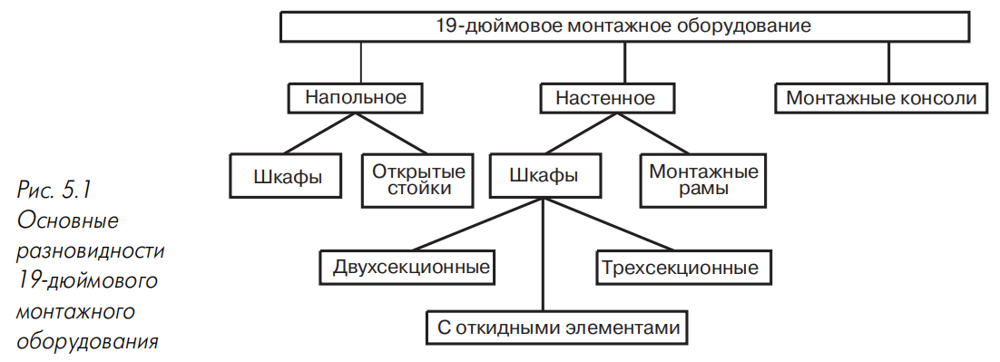

**Рис. 5.1.** Основные разновидности 19-дюймового монтажного оборудования.

#### 5.1.1.1. Габаритные параметры

> **Юнит (U, Unit)** — <mark>минимальная высота устройства для установки в 19-дюймовый конструктив; 1 U = 1,75 дюйма (44,45 мм).</mark>

Обязательный элемент — монтажные направляющие с отверстиями. Расстояние между кромками и центрами отверстий стандартизировано. Высота рабочей зоны измеряется в юнитах. Некоторые производители рекомендуют изготавливать лицевые панели с отрицательным допуском около 0,8 мм для облегчения монтажа.

Отверстия располагаются по два или три на юнит, преимущественно квадратной формы. По IEC 297-1 — два отверстия на юнит; в шкафах по EIA RS-310-C добавляется третье отверстие на оси симметрии (рис. 5.2, справа).

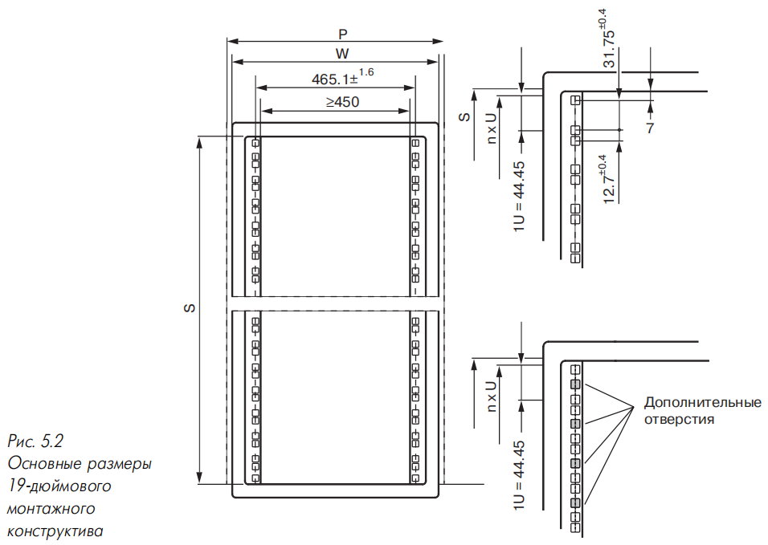

**Рис. 5.2.** Основные размеры 19-дюймового монтажного конструктива.

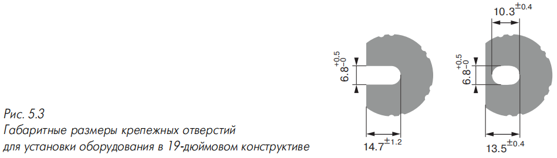

**Рис. 5.3.** Габаритные размеры крепёжных отверстий для установки оборудования в 19-дюймовом конструктиве.

**Таблица 5.1. Высота 19-дюймового шкафа**

| Высота шкафа, мм | Количество юнитов, U |
|---|---|
| 800 | 13 |
| 1000 | 18 |
| 1200 | 22 |
| 1400 | 27 |
| 1600 | 31 |
| 1800 | 36 |
| 2000 | 40 |
| 2200 | 45 |

**Таблица 5.2. Ширина 19-дюймового шкафа**

| Ширина шкафа, W ≤ P, мм |
|---|
| 550 |
| 600 |
| 700 |
| 800 |
| 900 |

**Таблица 5.3. Глубина 19-дюймового шкафа**

| Глубина шкафа, W ≤ P, мм |
|---|
| 400 |
| 600 |
| 800 |
| 900 |

Наиболее распространены шкафы 600×600 и 600×800 мм, реже — 800×800 мм. Крепёжные отверстия выполняются открытыми или закрытыми (рис. 5.3).

#### 5.1.1.2. Особенности 19-дюймового оборудования

Оборудование крепится к направляющим винтами и гайками. Квадратные гайки с пружинящими лапками фиксируются в отверстиях. Используются винты М5 и М6 с прямым или крестовым шлицем, часто хромированные, с шайбами.

Для упрощения установки гаек английская компания RW Data предложила устройство RS100 — пластиковую обойму с защёлками и тремя запрессованными втулками, устанавливаемую с передней стороны рамы.

Металлические элементы окрашиваются в серый цвет; по заказу возможен любой цвет по каталогу RAL (удорожание на 5–30%). Для эффективного заземления обеспечивается проводимость лакокрасочных покрытий, поэтому лакировка и анодирование практически вытеснены.

В Европе распространено оборудование серии comrack (Schroff) с Н-образными верхней и нижней деталями и профилированными планками с пазом (рис. 5.4). Это увеличивает объём боковых полостей для кабелей; три конструктива могут быть собраны с использованием трёх пар направляющих и двух пар оснований (рис. 5.5). Пазы вместо отверстий позволяют плавно регулировать высоту установки оборудования.

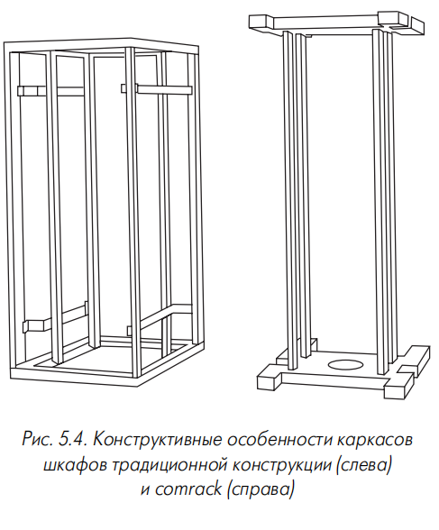

**Рис. 5.4.** Конструктивные особенности каркасов шкафов традиционной конструкции (слева) и comrack (справа).

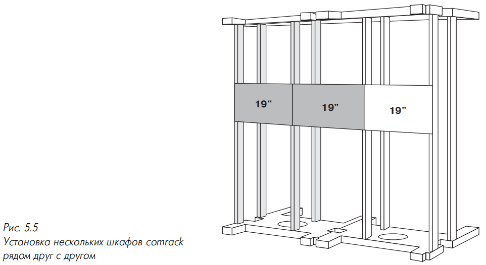

**Рис. 5.5.** Установка нескольких шкафов comrack рядом друг с другом.

### 5.1.2. Монтажные шкафы

> **Монтажный шкаф** — <mark>закрытый 19-дюймовый конструктив на основе каркаса и монтажных направляющих.</mark>

Каркас изготавливается из стали (сварным или сборным). Сварные жёстче, сборные удобнее при транспортировке. Направляющие могут быть перемещаемыми (регулировка по глубине) или фиксированными.

<mark>Шкафы обеспечивают: ограничение доступа, защиту от пыли и воды по IP, экранирование от электромагнитных полей, высокие эстетические показатели.</mark>

<mark>Делятся на напольные и настенные.</mark>

#### 5.1.2.1. Напольные шкафы

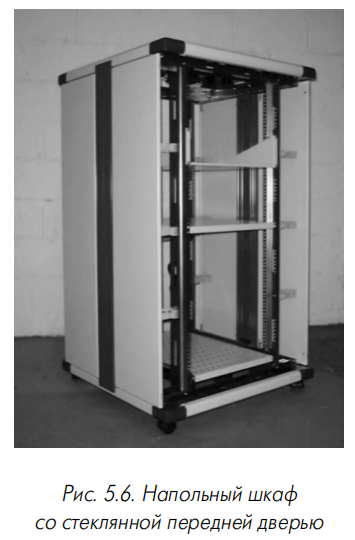

**Рис. 5.6.** Напольный шкаф со стеклянной передней дверью.

Типовые размеры: высота направляющих 21–48 U, ширина 600 (реже 800) мм, глубина 600 или 800 мм.

Основные элементы: монтажные направляющие, каркас с основанием, верхняя крышка, боковые стенки, передняя и задняя двери. Обычно четыре направляющие; некоторые фирмы поставляют шкафы с одной парой. Для облегчения установки на рельсы наносятся метки высоты. В средней части часто имеется перфорированная планка для жёсткости и укладки кабеля.

Недостаток традиционных шкафов — сложность доступа к боковым и задним поверхностям при установке в ряд. Применяются два решения: поворотная передняя пара рельсов (до 180°) и выдвижная монтажная рама на телескопических направляющих. В шкафах от 33 U поворотной может быть только половина рельсов. Максимальная масса оборудования: 200 кг (поворотная рама) против 50 кг (выдвижная).

Основание (цоколь) имеет центральное отверстие для циркуляции воздуха и подвода кабелей снизу. У Rittal оно закрывается съёмными трёхсекционными панелями; у «Перспективных технологий» — кабельными вводами с отламываемыми крышками. Предусматриваются боковые отверстия, щеточные вводы, фильтрующие вставки. В шкафу Compaq дополнительное отверстие — в нижней части задней двери.

Опоры — ножки с регулировкой уровня (отклонение до 35° на неровном полу), материалы накладок — резина или нейлон. Применяются самоориентирующиеся ролики (рис. 5.7), в том числе с арретиром для предотвращения случайного перемещения.

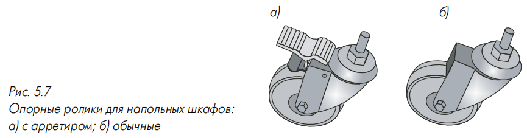

**Рис. 5.7.** Опорные ролики для напольных шкафов: а) с арретиром; б) обычные.

Верхняя крышка — стальная, часто с отогнутыми краями, может иметь отверстия и посадочные места. Отверстия для ввода кабелей в крышке выполняются редко (кабели заводятся через основание). Пространство между направляющими и стенками используется для укладки кабелей; полезно до 82% площади. Суммарная масса оборудования — до 500 кг и более; цоколь выдерживает до 300 кг. Для фальшполов Reichle & De-Massari предлагает шкафы с регулируемыми по высоте элементами.

**Двери и боковые стенки.** Боковые стенки — стальные, съёмные, крепятся винтами, защёлками или рычажными фиксаторами. Применяются углублённые стенки глубиной 50 и 100 мм (Rittal, QuickRack). Установка на петлях редка: Ultima Access Rack (Wilsher&Quick) — две откидные половины на центральном стержне; Rittal TS8 — неразрезные на петлях, при установке в ряд смежные стенки снимаются.

Угол раскрыва двери обычно 180°. Задняя дверь — оцинкованная сталь; передняя — сталь или ударопрочное стекло. Стеклянная дверь дешевле и позволяет визуальный осмотр; варианты — полностью стеклянная или с металлической рамой. Стальная дверь обеспечивает экранирование; для эффективности применяется разрезная юбка. Петли легкосъёмные, перевешиваются одним человеком.

Двери бывают одностворчатые, двухсекционные (створки друг над другом) и двухстворчатые (гардеробный стиль). Двухсекционные целесообразны при редком доступе к части оборудования; двухстворчатые не требуют изменений шкафа. Задняя дверь иногда заменяется съёмной крышкой; известны укороченные задние двери с заглушкой. Elgadphon (серия Intelligent) применяет трапециевидные двери.

Для защиты от несанкционированного доступа применяются поворотные задвижки, цилиндрические замки повышенной секретности, электромеханические замки, замки от чиповых и магнитных карт (Rittal серии 7200). Ручки разнообразны (рис. 5.8).

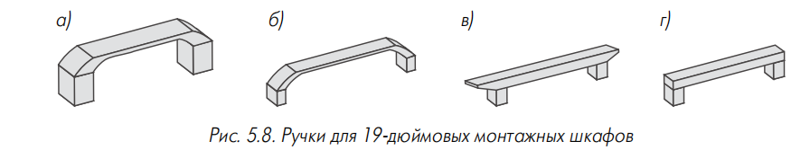

**Рис. 5.8.** Ручки для 19-дюймовых монтажных шкафов.

**Обеспечение температурного режима.** <mark>Активные решения — вентиляторы осевого или радиального типа (рис. 5.9); пассивные — отверстия для естественной конвекции</mark> (рис. 5.10): перфорация в виде вертикальных щелей, верхние крышки с люками, вентиляционные прорези в рамах дверей, утопленная установка передней двери. <mark>На практике решения комбинируются; применяются вентиляторные полки. Также используется кондиционер на корпусе герметичного шкафа</mark> (рис. 5.11), чаще на задней стенке, иногда в виде боковой стенки (Rittal).

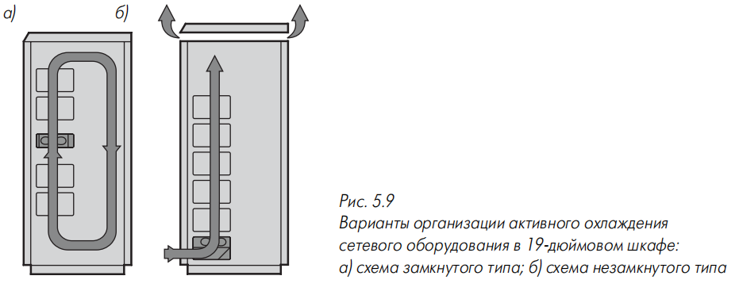

**Рис. 5.9.** Варианты организации активного охлаждения сетевого оборудования в 19-дюймовом шкафу: а) схема замкнутого типа; б) схема незамкнутого типа.

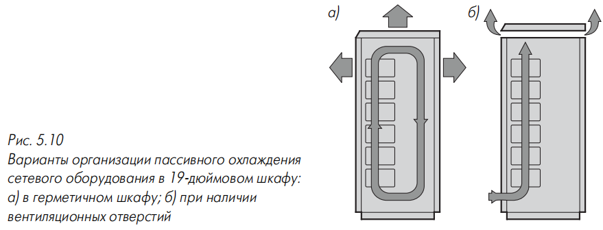

**Рис. 5.10.** Варианты организации пассивного охлаждения сетевого оборудования в 19-дюймовом шкафу: а) в герметичном шкафу; б) при наличии вентиляционных отверстий.

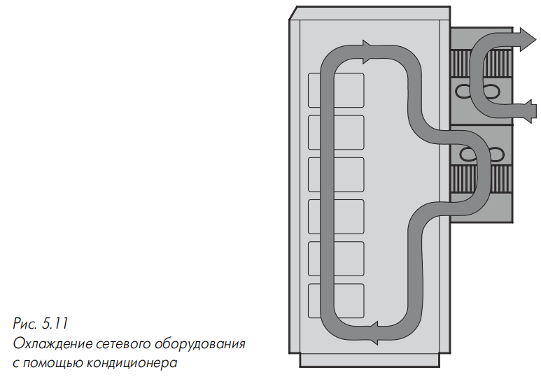

**Рис. 5.11.** Охлаждение сетевого оборудования с помощью кондиционера.

**Специальные разновидности напольных шкафов.** Серверные шкафы — усиленная конструкция, принудительное охлаждение, перфорированные двери (отверстия ~3 мм). Промышленные — защита не менее IP43, неразборные, стальной сварной каркас, упрощённый дизайн, подача воздуха через пылезащитный фильтр. Офисные — улучшенная эстетика, светлые тона, безрамные стеклянные двери, разборный каркас, алюминиевые сплавы, защита обычно не выше IP20. Шкафы для наружной установки — цельносварные корпуса, двойные стенки, крепёж на винтах, внутренние кондиционеры.

#### 5.1.2.2. Настенные шкафы

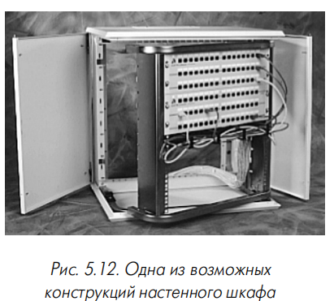

**Рис. 5.12.** Одна из возможных конструкций настенного шкафа.

<mark>Предназначены для монтажа на стенах кроссовых и аппаратных. Отличаются меньшей высотой и отсутствием задней двери. Делятся на 3-секционные и 2-секционные.</mark>

3-секционные: основание (глубина 10–15 см), поворотная секция с направляющими, передняя дверь. Поворотная секция откидывается вбок (петля типа рояльной; Legrand XL — шарниры с переносом). Дверь — стекло или сталь.

2-секционные: корпус и передняя дверь. Дешевле, но менее удобны. Недостатки компенсируются съёмными/откидными боковыми панелями (Rittal QuickBox — П-образная рама с надвигаемым кожухом; «Контур», Томск) или подвижными элементами (Wilsher&Quick TF; CNZ Neubauer KISS — Г-образная подвижная рама).

Для уменьшения габаритов Legrand предлагает серию Альмюраль: корпус глубиной 137 мм для коммутационных панелей и полка 33207 для концентратора.

Отверстия для циркуляции воздуха и подвода кабелей — в нижней и верхней панелях, смещены к задней стенке, закрыты крышкой. В 3-секционных — в монтажном основании. Применяются резиновые гермовводы и пластиковые заглушки-маты. В шкафах Rittal DK — обзорное окно. Дверь обычно с замком повышенной секретности; в 3-секционных замком снабжается и задвижка поворотной секции. Уплотнитель — резиновый или матерчатый.

Крепление — непосредственно на стену (4–5 отверстий), иногда с бумажным шаблоном; при необходимости провести кабели за задней стенкой — крепёжные кронштейны. Для принудительной циркуляции применяется одиночный вентилятор (экономия места) на боковой стенке.

Типовые размеры: высота направляющих 3–15 U, ширина 600 мм, глубина 250–450 мм. Цвет — серый; Molex предлагает зелёные и бежевые шкафы; DataRacks Elite — сменные пластиковые уголки четырёх цветов.

Также используются небольшие настенные шкафчики (ширина меньше 19 дюймов) для коммутационного оборудования консолидационных точек, выключателей, датчиков, контроллеров. Изготавливаются из ударопрочной пластмассы, часто с запираемой прозрачной дверцей.

### 5.1.3. Другие виды 19-дюймового монтажного оборудования

#### 5.1.3.1. Открытые стойки

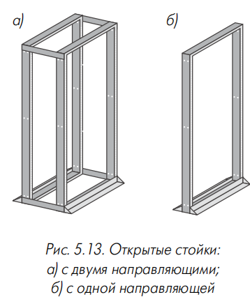

**Рис. 5.13.** Открытые стойки: а) с двумя направляющими; б) с одной направляющей.

> **Открытая стойка** — <mark>дешёвая альтернатива шкафу, применяемая при отсутствии требований к ограничению доступа, при частом доступе к оборудованию или при необходимости усиленного охлаждения.</mark>

<mark>Преимущество — примерно вдвое меньшая занимаемая площадь.</mark> Содержат основание и один или два ряда направляющих (с подкосами для жёсткости). Материал — сталь или алюминий; сталь рекомендуется для тяжёлого оборудования. Стойки с двумя парами направляющих поставляются собранными или разобранными. Большинство — напольные, возможна установка на ролики. Передняя пара рельсов может откидываться на петлях. Изготовители рекомендуют крепить стойки к стене и/или полу.

#### 5.1.3.2. Монтажные рамы

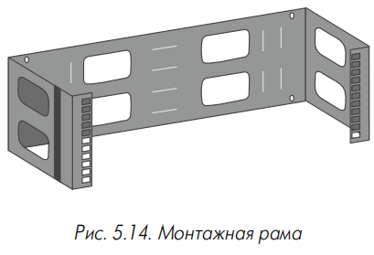

**Рис. 5.14.** Монтажная рама.

> **Монтажная рама (frame, wall adapter, bracket)** — <mark>П-образная конструкция, монтируемая поперечной панелью на стене; функциональный аналог 2-секционного настенного шкафа.</mark>

Высота обычно не более 10 U (у Molex — до 42 U). Применяется для небольших объёмов оборудования. Для защиты используются съёмная верхняя крышка и нижний поддон. Большинство производителей предлагает рамы глубиной 250 мм. Пример — Hinged Wall Brackets for 19-inch Panels (AMP). Для удобства обслуживания один из рельсов (чаще левый) устанавливается на вертикальной петле типа рояльной; в bottom hinged wall mount brackets (Ortronics) рабочая часть рельса — отдельная уголковая деталь на двух винтах.

#### 5.1.3.3. Настенные рамы

> **Настенная рама** — <mark>прямоугольная конструкция, монтируемая непосредственно на стене.</mark>

Из-за малой глубины не обеспечивает доступа к задней поверхности устройств и не позволяет монтировать большинство видов активного оборудования. Область применения в СКС ограничена.

#### 5.1.3.4. Монтажные консоли

> **Монтажная консоль** — специализированная модульная мебель для установки компьютерного оборудования и организации рабочего места.

Основной элемент — монтажная рама с развитой системой крепёжных отверстий, на которую навешиваются полки, ящики, столешницы, боксы. Конфигурация легко адаптируется. Элементы могут иметь стеклянные или металлические дверцы и 19-дюймовые рельсы (в том числе с углом наклона). Некоторые варианты снабжаются внешним каркасом.

#### 5.1.3.5. Подвижные приборные стойки

> **Подвижная приборная стойка** — открытый каркас с одной парой 19-дюймовых направляющих на самоориентирующихся колёсах.

Предназначены для тестирующего и диагностирующего оборудования. Часто снабжаются интегральными полками. Примеры: RiLab (Rittal), Metramobil (Knurr). В СКС популярность пока не получили.

### 5.1.4. Оборудование и аксессуары для 19-дюймовых конструктивов

#### 5.1.4.1. Полки, поддоны и крепёжные уголки

> **Крепёжная полка** — элемент для установки оборудования, не имеющего штатного крепления в 19-дюймовом конструктиве.

Максимальная масса — 50–100 кг. Рабочая поверхность гладкая или перфорированная. Полки делятся на фиксированные и выдвижные (телескопические шины, меньшая грузоподъёмность). Выдвижные полки могут иметь откидную поверхность с ковриком для мыши (Rittal PC4610/4620, PC4000/4621) или двухэтажную конструкцию (W&Q PSS) для принтера и бумаги. Полки для открытых стоек могут выступать вперед или иметь съёмную пластинку — полка с центральным креплением (двойная) против полки с креплением на краю (одинарной) — рис. 5.15. Пюпитры — полки с осью и фиксирующим подкосом. Крепёжные уголки — стальные, часто хромированные, меньше по габаритам, но позволяют устанавливать оборудование только определённой ширины. Поддоны для цокольной части — грузоподъёмность до 300 кг.

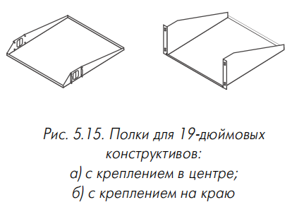

**Рис. 5.15.** Полки для 19-дюймовых конструктивов: а) с креплением в центре; б) с креплением на краю.

#### 5.1.4.2. Распределители силового электропитания

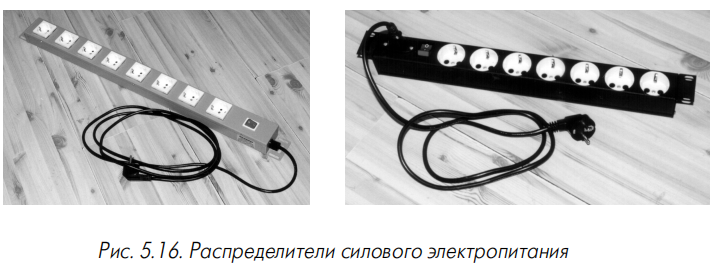

**Рис. 5.16.** Распределители силового электропитания.

> **Распределитель силового электропитания (блок розеток)** — <mark>устройство для подключения к одной входной цепи питания активного и вспомогательного оборудования шкафа.</mark>

Снабжаются общим выключателем с индикатором, автоматом защитного отключения, сетевым фильтром и варисторной защитой от импульсных помех (время срабатывания — десятки наносекунд; подавление до 70 дБ и выше). Длина кабеля — 2–2,5 м. Делятся на вертикальные (до 10 розеточных модулей, крепятся на задней направляющей) и горизонтальные (до 5 модулей, высота 1 U, обычно на передних направляющих). Пример объединения преимуществ — Hubbell MCCP5919 (выключатель на передней панели, розетки на задней стенке). Силовые кабели рекомендуется прокладывать не менее чем в 10 см от информационных.

#### 5.1.4.3. Оборудование заземления

> **Шина заземления** — медная полоса сечением около 0,5 см² с отверстиями с резьбой М5 для подключения внутренних распределителей «земли».

Состоит из внутренней шины заземления (монтируется с внутренней стороны боковой стенки) и внутренних распределителей «земли» (изолированные или голые медные провода с зажимными контактами), через которые к шине подключаются основание с каркасом, боковые стенки, двери, верхняя крышка и корпуса оборудования. В некоторых случаях роль шины выполняет основание шкафа. В комплект входят болты для соединения элементов и подключения к контуру заземления здания. Дополнительно применяются самоклеющиеся маркирующие плёнки с металлизацией для выравнивания потенциалов.

#### 5.1.4.4. Организаторы кроссовых шнуров, перемычек и кабелей

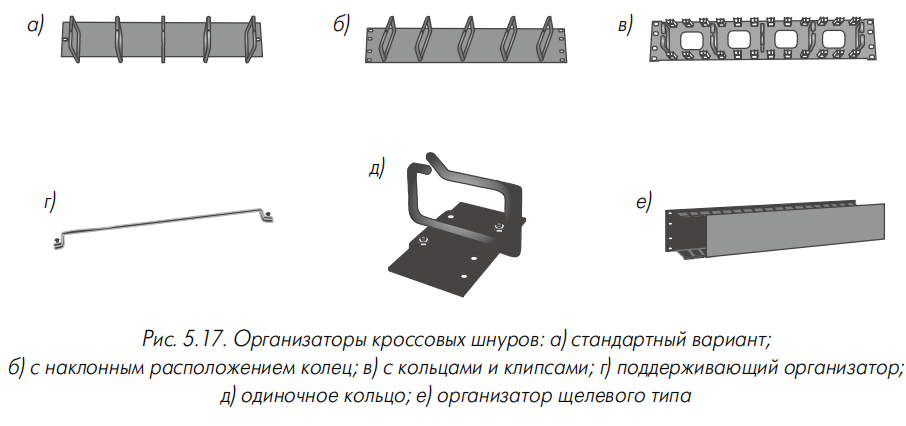

**Рис. 5.17.** Организаторы кроссовых шнуров: а) стандартный вариант; б) с наклонным расположением колец; в) с кольцами и клипсами; г) поддерживающий организатор; д) одиночное кольцо; е) организатор щелевого типа.

**Конструкции для шкафов.** Организаторы кроссовых шнуров (patch cord organizers, cable management panel) обеспечивают аккуратную укладку шнуров. Наиболее распространённый вариант — пластина с разрезными кольцами или скобами (рис. 5.17а). Кольца могут быть пластиковыми или металлическими. Дополнительные малые элементы — клипсы (рис. 5.17в). У Siemon WM-144-5-A, WM-145-5-A и Rittal 7255.035 кольца наклонены на 45° (рис. 5.17б). Panduit CPP — гребёнка с пружинящими лепестками. Поддерживающий организатор (Ortronics) — П-образная скоба на лицевой пластине (рис. 5.17г); аналоги — AMP cable support bar, Leviton SpaceMaker. Щелевые организаторы (рис. 5.17е) — П-образная деталь с прорезями и декоративной крышкой. Для оптики применяются полки для укладки избытка длины шнуров. Вертикальные организаторы большой высоты (до 40 U) устанавливаются на направляющую или на петли вместо двери. Одиночные кольца (cable rings) крепятся на рельсах лентой или болтами (рис. 5.17д). Для оптических шнуров — организаторы в виде 90-градусного сектора цилиндра с пазами.

**Конструкции для открытых стоек.** Применяются те же конструкции, что и в шкафах, с двумя отличиями: вертикальные организаторы в виде длинного узкого поддона между стойками; возможен верхний организатор в верхней части стойки. Для панелей типа 66 — незамкнутые кольца и цилиндрические втулки со шляпкой.

**Организаторы кабелей.** Повторяют решения для шнуров, отличаясь менее качественной отделкой. Применяются гладкие или перфорированные П-образные скобы на задней стороне панелей, хомуты на перфорированной поперечной планке. В экранированных панелях задняя скоба часто выполняет роль шины заземления экранов. Кабельный кронштейн — Г-образная пластина с отверстиями под стяжку. Лестничные организаторы — набор перфорированных поперечин в задней части шкафа. Спиральные организаторы — скрученная в трубку спираль из жёсткого материала для соблюдения малого радиуса изгиба.

#### 5.1.4.5. Оборудование принудительной вентиляции

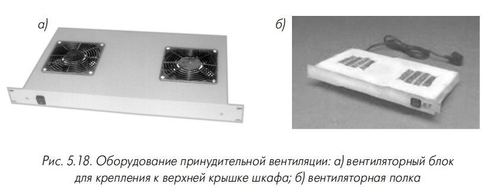

**Рис. 5.18.** Оборудование принудительной вентиляции: а) вентиляторный блок для крепления к верхней крышке шкафа; б) вентиляторная полка.

> **Вентиляторная полка** — <mark>конструктив высотой 1–2 U с вентиляторными модулями (до девяти, обычно 1–4), монтируемый на 19-дюймовых рельсах.</mark>

Производительность модуля — 50–150 м³/ч; уровень шума — около 40 дБ(А). Рекомендуется установка в нижней части шкафа для приточной вентиляции, однако на практике полки часто монтируются под активным устройством. Применяются потолочные вентиляторы в люках крышек. С конца 90-х популярны регуляторы производительности (по частоте вращения или отключением части модулей).

#### 5.1.4.6. Дополнительные аксессуары

Внутренние осветительные устройства — светильники (предпочтительны лампы накаливания из-за броска тока у люминесцентных). Крепление на крышке — винтовое или магнитное; выдвижные полки-светильники позволяют выбрать оптимальное положение. Датчики контролируют температуру, влажность, состояние фаз, охранную сигнализацию; выполняются в виде 19-дюймовой полки с модулями или отдельного контроллера. Информация используется для включения исполнительных устройств и передачи на консоль администратора по RS-232, модему или Ethernet (SNMP). Для неотапливаемых помещений — нагреватели (Legrand). Для документации и инструмента — футляры, карманы, ящики (часто с телескопическими направляющими и замком). Панели-заглушки (filler panel) высотой 1–2 U (АМР — до 5 U) закрывают неиспользуемые места. Адаптеры для оборудования меньшей ширины. Герметизирующие компоненты (Ackermann 27414BR/BP) обеспечивают IP54. Литые металлические формы-балласт смещают центр тяжести вниз.

---

## 5.2. Декоративные кабельные короба

### 5.2.1. Назначение и конструктивные особенности настенных коробов

#### 5.2.1.1. Основные требования к коробам

> **Декоративный кабельный короб** — <mark>полый закрытый желоб для укладки информационных и силовых кабелей и установки розеток.</mark>

<mark>Применяется, когда прокладка другими способами невозможна или нецелесообразна, требуется защита от механических повреждений и брызг, необходимы высокие эстетические характеристики.</mark>

Требования: эстетика, пожаробезопасность (включая аэродинамические критерии), ударопрочность, устойчивость к УФ, электрические параметры (пробивная стойкость до 240 кВ/см и более), для металлических коробов — контроль переходного сопротивления между секциями.

#### 5.2.1.2. Виды коробов

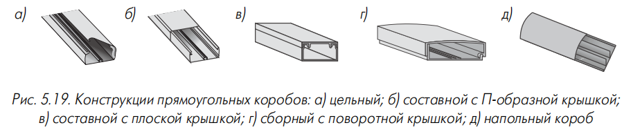

**Рис. 5.19.** Конструкции прямоугольных коробов: а) цельный; б) составной с П-образной крышкой; в) составной с плоской крышкой; г) сборный с поворотной крышкой; д) напольный короб.

Короба имеют съёмную или откидную крышку. Наиболее популярны прямоугольные сечения (рис. 5.19); также выпускаются трапециевидные, треугольные, полукруглые и декоративные плинтусы. Короб может быть:

- **цельным** — единый кусок пластика с разрезом и пазами по одному ребру; с противоположной стороны утоньшение для гибкости (рис. 5.19а). Фиксация крышки — обычной или двухсторонней защёлкой (рис. 5.20). Максимальный размер — обычно до 38×24 мм;
- **составным** — основание и крышка (П-образная или плоская) — рис. 5.19б, в. П-образная крепится на боковых защёлках; плоская вставляется выступами в пазы;
- **сборным с поворотной крышкой** — Г-образная крышка с валикообразным выступом в пазу основания (рис. 5.19г). Долговечнее и удобнее, но дороже.

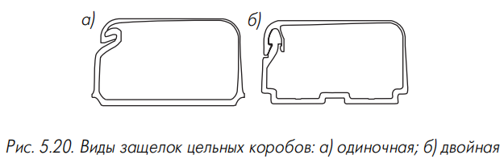

**Рис. 5.20.** Виды защёлок цельных коробов: а) одиночная; б) двойная.

В коробах Rehau AXIS снятие крышки возможно только специальным инструментом. При недостаточно плоской поверхности (неоштукатуренная кладка) Panduit и Thorsman предлагают вместо основания металлические скобки. Монтаж — на стене механической фиксацией, на клею (клеевая лента или специальный клей, желательна рифлёная поверхность), на магнитных полосах (Panduit, ширина 19 и 25 мм), на кронштейнах.

Прямоугольные короба различаются по сечению (от 14×7 до 250×60 мм). Выбор определяется количеством кабелей и способом установки розеток. Некоторые производители (AESP) запрещают короба малого сечения из-за несоблюдения радиуса изгиба.

**Таблица 5.4. <mark>Типовая ёмкость декоративных коробов при максимальном эксплуатационном заполнении**</mark>

| Размер короба, мм               | 40×12 | 60×16 | 75×20 | 100×50 |
|---------------------------------|-------|-------|-------|--------|
| Количество 4-парных кабелей UTP | 12    | 16    | 24    | 80     |

Внутреннее пространство коробов от 40×16 мм разбивается на секции. Боковые полости — для силовых и информационных кабелей, центральная — для розеток. Иногда применяется несимметричное деление (Panduit T70: 587 мм² для силовых, 2013 мм² для информационных). В коробах до 60×16 мм разделители обычно интегральные; в больших — съёмные. В коробах Thorsman INKA через каждые 200 мм в перегородке выполнены отверстия. Для улучшения обслуживания крышка продольно разделяется на части. Для повышения жёсткости применяются Г-образная крышка, двойная боковая стенка (Mita), скошенная краевая часть. Mita выпускает трансформируемые короба (до 25×16 мм); Thorsman — короб в бухте длиной 12 и 15 м. Rehau — предварительно просверленные отверстия под шурупы.

#### 5.2.1.3. Материалы и окраска

<mark>Основные материалы — ударопрочные пластмассы (главным образом ПВХ) и металлы (алюминий, оцинкованная или нержавеющая сталь).</mark> Безгалогенные пластмассы дороги. Пластмассовые короба легче, гибче, легче обрабатываются; <mark>металлические при заземлении выполняют функции экрана.</mark> Выпускаются пластмассовые короба с алюминиевой плёнкой и средствами заземления.

Исследования показывают: <mark>алюминиевый короб снижает мощность помехи примерно на 25 дБ, металлическое напыление на пластмассовом — на 10 дБ в диапазоне 100 МГц – 1 ГГц; стальной занимает промежуточное положение. Эффективность зависит от качества монтажа и переходного сопротивления; рекомендуется дополнительный неизолированный заземлённый провод.</mark>

Поверхность пластмассовых коробов — матовая или глянцевая. Наибольшее распространение получил белый цвет. Legrand применяет цветные вставки в пазы. Rehau и Unex используют самоклеющуюся полимерную плёнку, удаляемую после установки. Металлические короба окрашиваются эмалями или анодируются; нестандартный цвет увеличивает стоимость примерно наполовину, срок — в 2,5–3 раза. На пластмассовом коробе менее заметны царапины. Особое внимание — устойчивости к УФ. Металлические короба дороже; применяются при необходимости особо надёжной механической и электромагнитной защиты. Thorsman TMW — из берёзы или сосны с пропиткой огнезащитным лаком.

Поставка — обычно 2-метровыми упаковками (исключения: Panduit — 3 м; Siemon Perimeters — 1,8; 2,4; 3 м). В упаковке от 20 до 100 м. На внутреннюю поверхность наносится маркирующий индекс.

### 5.2.2. Стандартные комплектующие элементы

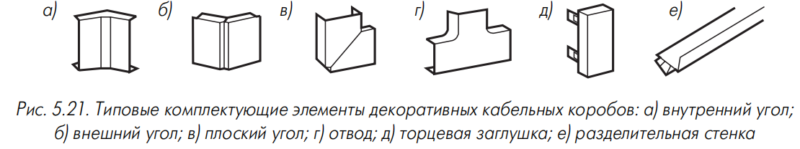

**Рис. 5.21.** Типовые комплектующие элементы декоративных кабельных коробов: а) внутренний угол; б) внешний угол; в) плоский угол; г) отвод; д) торцевая заглушка; е) разделительная стенка.

- **Внутренний угол** (рис. 5.21а) — для поворотов на внутренних стыках стен.
- **Внешний угол** (рис. 5.21б) — для выступающих стыков; фиксированный (45°, 60°, 90°, 120°, 135°) или гибкий (10°–170°).
- **Плоский угол** (рис. 5.21в) — поворот на 90° на плоской стене; для оптики — специальные углы с выступами (рис. 5.22).
- **Отвод (тройник)** (рис. 5.21г) — разветвление под 90°; варианты без выступа и с выступающей крышкой.
- **Крестовой соединитель** — пересечение под прямым углом.
- **Адаптер** — переход между коробами разного сечения; прямые, совмещённые с углами, адаптеры-тройники.
- **Заглушка** (рис. 5.21д) — крышка на торцевом срезе; для плинтусов — левые и правые.
- **Соединительная деталь** — закрывает шов, выравнивает секции; в металлических коробах минимизирует переходное сопротивление; иногда комбинируется с внутренним соединителем (пластиковая деталь Panduit или металлический стержень Rehau; зажим Thorsman FrontLine).
- **Разделительная стенка** (рис. 5.21е) — съёмный элемент для деления пространства (обычно от 75×20 мм).
- **Декоративные накладки (фартуки, манжеты)** — закрывают место входа короба в стену или фальшпотолок.
- **Держатель (фиксатор кабеля)** — накладка на пазы крышки, предотвращает выпадение кабелей.
- **Дополнительные элементы** — звукопоглощающие пластины, огнезащитные вставки, защитные колпачки, проходные втулки, накладки на кромки.

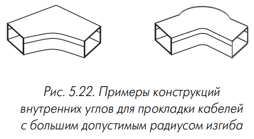

**Рис. 5.22.** Примеры конструкций внутренних углов для прокладки кабелей с большим допустимым радиусом изгиба.

Поставка комплектующих — в коробочной или пакетной упаковке (от 1 до 20 штук), со штрих-кодом.

### 5.2.3. Средства установки розеток в рабочих помещениях

> **Розеточный модуль** — <mark>сменный модуль (модульный, коаксиальный, оптический, силовой), устанавливаемый в короб или рядом с ним.</mark>

<mark>Установка розетки возможна: во внутреннее пространство короба; на короб; рядом с коробом.</mark>

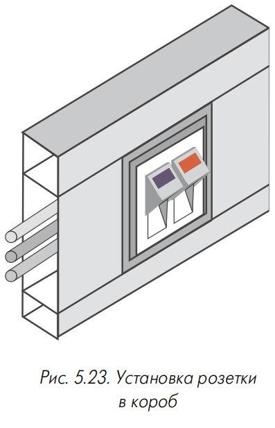

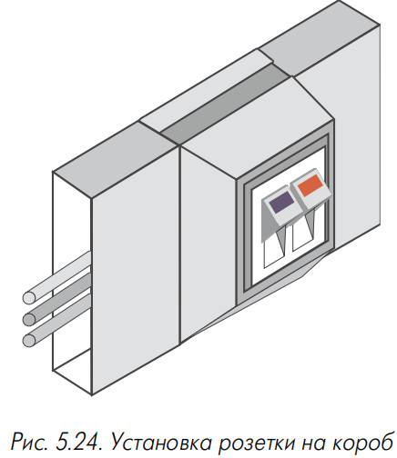

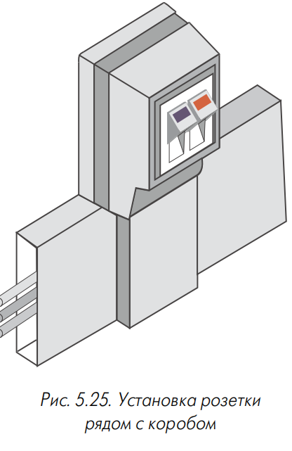

**Таблица 5.5. Сравнительные характеристики вариантов установки розеток**

| Параметр                    | В короб | На короб | Рядом с коробом |
|-----------------------------|---------|----------|-----------------|
| Сложность реализации        | Низкая  | Средняя  | Высокая         |
| Стоимость                   | Низкая  | Низкая   | Высокая         |
| Эстетические характеристики | Высокие | Низкие   | Средние         |
| Требуемая ёмкость короба    | Высокая | Низкая   | Низкая          |

Производители иногда разрабатывают адаптеры для установки розеточных модулей других компаний. Пример интеграции — альянс Lucent Technologies с Legrand и Thorsman. В короб также могут устанавливаться выключатели, регуляторы, переключатели, датчики. Более популярны однопостовые варианты; максимальное количество посадочных мест — до шести, наиболее распространены 2- и 3-постовые.

#### 5.2.3.1. Установка розетки во внутреннее пространство короба

**Рис. 5.23.** Установка розетки в короб.

Набор средств: монтажная коробка (подрозетник), розеточный модуль (с адаптером при необходимости), кронштейн крепления, лицевая пластина.

Монтажная коробка — пластмассовый корпус, открытый с лицевой стороны. Крепление: на пазы крышки или переборок (защёлки) либо на выступы днища (поворотные зажимы). Отверстия для кронштейна: 60 мм (европейский вариант) или 93 мм (американский). Некоторые коробки (Marshall FB175) имеют внутренний защитный экран. Кронштейн — металлическая пластина с фигурными вырезами. Применяется многосекционный короб; центральная секция — для розеток. Лицевая пластина закрывает крепление и выполняет декоративные функции. Для экономии места применяются лицевые пластины с угловой установкой модулей или отказ от монтажной коробки в пользу кронштейнов с боковыми экранами.

#### 5.2.3.2. Установка розетки на короб

**Рис. 5.24.** Установка розетки на короб.

Используются монтажная рамка и розеточный модуль. Рамка — пластмассовое основание с пазами и вырезом под модуль. Способ обозначается как «крепление в профиль». Позволяет использовать короб меньшего сечения, но розетки менее защищены и имеют наихудшие эстетические характеристики.

#### 5.2.3.3. Установка розетки рядом с коробом

**Рис. 5.25.** Установка розетки рядом с коробом.

Применима только к коробам небольших размеров. Монтажная рамка крепится на несущую поверхность рядом с коробом (шурупы или двухсторонняя лента), снабжается накладкой, закрывающей место вывода кабелей. Обозначается как «крепление вдоль профиля». Розетки слабо выступают над стеной, имеют хорошие эстетические показатели, позволяют полностью использовать внутреннее пространство короба, но трудоёмки в монтаже.

#### 5.2.3.4. Комбинированные решения

Внешние корпуса информационных розеток (на 6 и 12 мест) устанавливаются рядом с коробом. Panduit workstation outlet center O — для одного рабочего места, две силовые и две информационные розетки; силовые вынесены за пределы короба.

#### 5.2.3.5. Розетки мультимедиа

> **Розетка мультимедиа** — <mark>небольшая коробка с посадочными местами под электрические и оптические розетки, с обязательным внутренним организатором световодов.</mark>

Обеспечивает укладку технологического запаса волокна 1 м с соблюдением радиуса изгиба; иногда дополняется организатором сплайсов. Корпус обычно белый, форма — параллелепипед со скруглёнными кромками. Ввод кабелей — через заднюю поверхность и днище. Установка — на стену, реже на пол; возможны магнитные фиксаторы. Розетки устанавливаются на сменных вставках (плоских, уголковых) или сменных передних панелях. Часто выполняют функции многопользовательских розеток MUTO; по TSB-75 — не более 12 рабочих мест.

**Таблица 5.6. Технические характеристики розеток мультимедиа**

| Фирма               | Тип                  | Габариты, мм            | Кол-во розеток | Типы розеток                |
|---------------------|----------------------|-------------------------|----------------|-----------------------------|
| AMP                 | 559274-1             | 170×146×38              | 6              | ST, SC, FC, модульная, BNC  |
| Hubbell             | BRACOC               | 133×133×38              | 4              | ST, BNC, IBM, модульная     |
| Lucent Technologies | 40A1                 | 175×142×41              | 8              | ST, SC, MIC, BNC, модульная |
| Mod-Tap             | 17-5229-02, 17.B143G | 197×159×57              | 8              | ST, SC, BNC, модульная      |
| Panduit             | CBXF6 / CBXF12       | 170×120×25 / 170×170×46 | 6 / 12         | ST, SC, BNC, модульная, RCA |
| Siemon              | CT-MMMO-(XX)         | 200×200×57              | 24             | ST, SC, BNC, RCA            |

### 5.2.4. Элементы подключения рабочих мест в больших залах

#### 5.2.4.1. Подпольные коробки

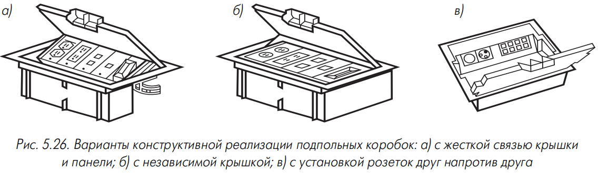

**Рис. 5.26.** Варианты конструктивной реализации подпольных коробок: а) с жёсткой связью крышки и панели; б) с независимой крышкой; в) с установкой розеток друг напротив друга.

> **Подпольная коробка** — <mark>корпус с крышкой, укладываемый на стойки фальшпола или вставляемый в вырез панели.</mark>

Материал — оцинкованная сталь, алюминий, ударопрочный пластик. Размеры — обычно 300×300 или 300×200 мм; редко круглые (Ackermann GRAF-9). Розетки устанавливаются вертикально друг напротив друга или в горизонтальную панель; минимальный зазор — не менее 45 мм. Крышка с резиновым уплотнителем (IP20). Вывод шнуров — через отгиб 4–5 см или поворотную шайбу. Крышка приспособлена для наклейки ковровых покрытий.

#### 5.2.4.2. Напольные и настольные коробки

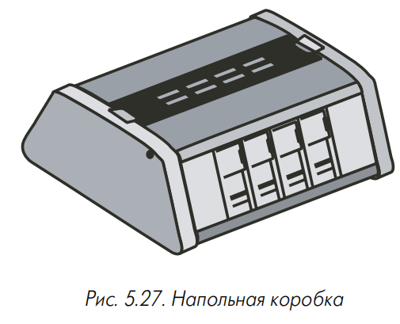

**Рис. 5.27.** Напольная коробка.

> **Напольная коробка (пьедестал, мини-пьедестал)** — <mark>корпус для установки на фальшпол без коврового покрытия, обслуживающий 1–2 рабочих места.</mark>

Корпус из алюминия или пластмассы (усечённая пирамида или округлая крышка). Передняя панель с розетками монтируется с положительным наклоном; известны варианты с разворотом на 90°. Защита — выступающий свес крышки или защитная дуга. Deutsche Electraplan — пьедесталы увеличенной ёмкости (до 16 портов). Настольные коробки — аналог напольных с креплением к мебели; применяются в лекционных залах. Настольные розетки (desktop monuments) — до четырёх модулей, крепление винтовым зажимом (АМР 5562ХХ).

#### 5.2.4.3. Декоративные колонны

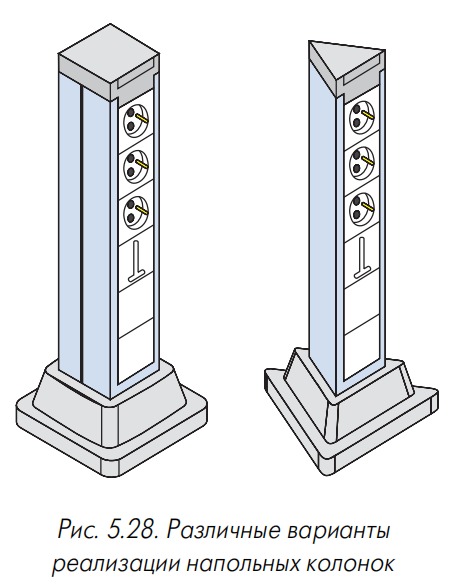

**Рис. 5.28.** Различные варианты реализации напольных колонок.

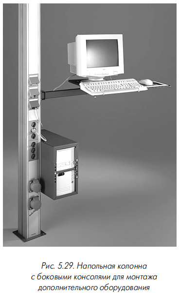

**Рис. 5.29.** Напольная колонна с боковыми консолями для монтажа дополнительного оборудования.

> **Декоративная колонна** — <mark>вертикальная конструкция для подключения рабочих мест в больших залах.</mark>

Варианты: выступающая колонка высотой до 0,6 м или непрерывная колонна от пола до потолка. Сечение — прямоугольное, квадратное, реже треугольное. При недостаточной ёмкости используются два коробчатых элемента. Подвод кабелей — из-под фальшпола или через напольный короб. Колонны изготавливаются из анодированного алюминия: на основе короба (MK Electric Prestige), несущих труб (Thorsman), одиночной стойки (Nordic Aluminium), вертикального короба с накладками (INFRA+ INTEGRATION 45). Фиксация между полом и потолком — телескопическая конструкция (Legrand) или винтовой домкрат. Дополнительные зажимы крепят колонну к столешнице. Прочность позволяет устанавливать системный блок и монитор (Thorsman, рис. 5.29). Место прохода фальшпотолка закрывается декоративной накладкой.

#### 5.2.4.4. Розеточная панель

> **Розеточная панель** — <mark>короткий отрезок короба большого сечения с торцевыми крышками, комплектуемый розетками и выключателями.</mark>

Размещается под столешницей с помощью зажимов; эффективна для мебели с внутренними полостями. Может комбинироваться с декоративными колоннами (с гибкой гофрированной трубкой). Известны панели для вертикальной установки рядом с боковой стенкой стола.

#### 5.2.4.5. Корпусы для оборудования консолидационных точек

> **Корпус для оборудования консолидационной точки** — коробка для монтажа на стенах или колоннах открытых офисов.

Крышка закрывается на замок или засов; центральная часть может быть прозрачной. Внутри — кроссовые блоки типа 110 (или 66) с организаторами. Различают вертикальный и горизонтальный варианты (Siemon CPEH-(XX) и CPEV-(XX)).

### 5.2.5. Другие виды коробов

#### 5.2.5.1. Короба для прокладки волоконно-оптических кабелей

Появились в конце 90-х. Применяются для локальной разводки в кроссовых и аппаратных, преимущественно в подвесном исполнении. Назначение: пространственное разделение оптических кабелей, соблюдение радиуса изгиба, ограничение растягивающих усилий, упрощение прокладки. Особенности: только прямоугольные сечения, ограничение радиуса изгиба 30 мм, развитая номенклатура вертикальных спусков, яркая окраска (оранжевый или жёлтый). Материалы — ПВХ и поликарбонат. Сращивание секций — специальными замками. Аксессуары: углы, тройники, адаптеры, торцевые крышки, центрирующий адаптер змеевидной формы. Углы и адаптеры из прозрачной пластмассы (Panduit). Поставляются как комплексное решение (Siemon Lightway, Panduit PANDUCT, Raychem FIST, HellermannTyton Lightguide).

#### 5.2.5.2. Короба для монтажа под фальшполом и за фальшпотолком

Отличаются менее качественной отделкой и, возможно, большей механической прочностью. Не имеют секционирования внутреннего пространства, небольшие типоразмеры. Возможно перфорированное днище. Для двухуровневой прокладки — переходные элементы (жёсткие или на шарнире). Секции устанавливаются на опоры или траверсы. Повороты с большим радиусом — через гофрированные корпуса. В комплекте — переходники на металлорукава, огнезащитные маты и заглушки. Напольные короба — для защиты кабелей в пешеходных переходах, полукруглого сечения, с рёбрами жёсткости (рис. 5.19в). Функциональный аналог вне офисов — кабельные каналы (wiring duct, slotted trunking) с гребёнчатыми стенками (рис. 5.30).

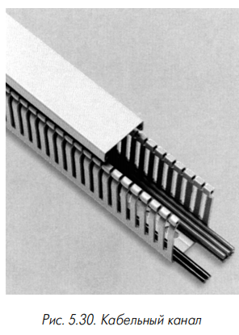

**Рис. 5.30.** Кабельный канал.

### Специализированные инструменты для работы с декоративными кабельными коробами

Отрезной инструмент — ручная или электрическая дисковая пила, ножницы; обычные ножовки не рекомендуются. Резаки — рычажные ножницы или гильотина (часто с шаблонами). Кондукторы и шаблоны — для формирования поворотов и сверления. Съёмники крышек — инструмент в виде лопатки.

---

## 5.3. Выводы

<mark>Применение дополнительных компонентов обеспечивает высокие эстетические характеристики помещений, удобство обслуживания, механическую защиту, ограничение доступа и (при необходимости) электромагнитное экранирование.</mark> На рынке доступна широкая номенклатура монтажных конструктивов и декоративных коробов, позволяющая стандартными средствами решать основные задачи СКС. Монтажное оборудование стандартизировано (взаимозаменяемость аксессуаров), стандартизация декоративных коробов практически отсутствует, что повышает требования к поставщику.

При проектировании следует учитывать тенденцию массового использования датчиков и электромеханических исполнительных элементов с передачей сигналов в центральный диспетчерский пункт (обычно по SNMP). Развитие коробов идёт в направлении специализированных изделий (для оптики) и расширения областей применения (магистральные трассы под фальшполом, за фальшпотолком, в коридорах, вертикальные стояки). Сборка и качество монтажа улучшаются при использовании специализированного инструмента.