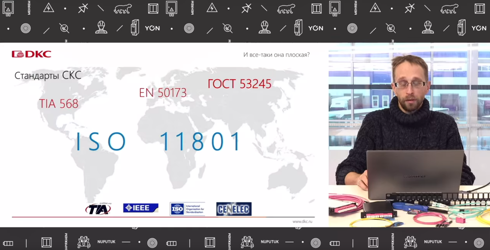
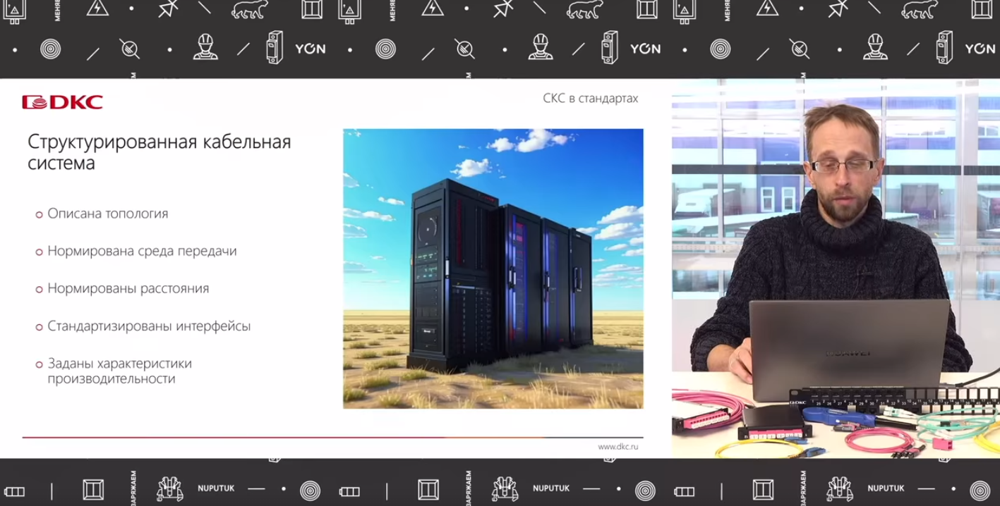
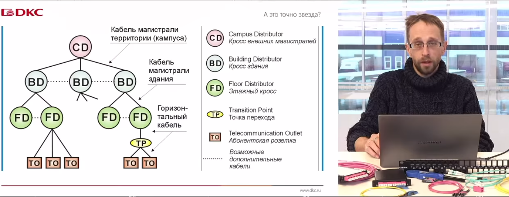

## Стандарты

### 1. Международные стандарты СКС

**ISO/IEC 11801**
*   **Статус:** Глобальный международный стандарт, описывающий практически всё.
*   **Структура:** Существует в шести частях.
*   **Локализация:** Первая часть в настоящее время переводится на русский язык и скоро выйдет как отдельный ГОСТ.
*   **Значение:** Это стандарт, по которому сейчас работает отрасль. Он описывает практически любые ситуации и является базой для тестирования при постановке системы на гарантию.

**TIA/EIA-568 и TIA/EIA-569 (ANSI/TIA-568)**
*   **Особенности:** Написаны простым английским языком с большим количеством иллюстраций.
*   **История:** Лежат у истоков передачи данных по витой паре.
*   **Рекомендация:** При возможности обязательно ознакомиться.

### 2. Европейские и Российские стандарты

**EN 50173 (Европа)**
*   **Статус:** Действует в Европе, но мало кто видел его вживую.
*   **Содержание:** По большому счёту дублирует TIA/EIA-568 и ISO 11801.

**ГОСТ 53245 и ГОСТ 53246 (Россия)**
*   **Назначение:** Первые отечественные стандарты, посвящённые проектированию, монтажу и тестированию СКС.
*   **Актуальность:** Сильно устарели, но всё ещё актуальны благодаря содержательной и осмысленной части.
*   **Рекомендация:** Крайне рекомендуются к прочтению, несмотря на имеющиеся недочёты.

---

### 3. Ключевые тезисы

1.  **ISO 11801** — основной стандарт, по которому мы живём. На него нужно тестировать для получения системной гарантии.
2.  **TIA/EIA-568/569** — простые и наглядные стандарты для изучения.
3.  **ГОСТ 53245/53246** — полезные документы, несмотря на устаревание.

## Что есть в стандартах

### 1. Что регламентируют стандарты СКС

Стандарты для структурированных кабельных систем описывают:
*   **Структура** — Элементы, их связи, основные подсистемы, топология.
*   **Среду передачи данных** — по чему можно передавать сигнал.
*   **Дальность передачи** — как далеко можно всё это передавать.
*   **Интерфейсы** — какие интерфейсы для этого используются.
*   **Расчётные параметры** — на что можно рассчитывать при проектировании.

---

### 2. Топология СКС

**Формально:** описывается как **звезда**.

**Фактически:** по большому счёту это **снежинка** — многоуровневая иерархическая структура.

**Иерархия уровней:**

1.  **Ядро** — центральный кросс здания или кампуса.
2.  **Кроссы более низкого порядка** — кроссы зданий (отходят от ядра).
3.  **Этажные кроссы** — следующий уровень иерархии.
4.  **Абонентские розетки** — конечные точки, расходящиеся от этажных кроссов.

**Итог:** всё это сводится в единую структуру, которая и называется структурированной кабельной системой.

---

Вот структурированный конспект третьего фрагмента:

---

## 1. Среда передачи данных

### Медные кабели
- **Тип:** витая пара с волновым сопротивлением **100 Ом**.
- **Категории:** категория **5E и выше**.
- **Исключение:** категория 3 к СКС не относится, но по-прежнему может применяться для телефонии.

### Оптические кабели
- **Диаметр сердцевины:** 9 или 50 мкм.
- **Диаметр буфера:** 125 мкм.
- **Типы:** одномод или многомод.
- **Устаревшее:** многомод 62,5/125 в стандарты больше не входит (рудимент).

---

## 2. Расстояния

| Стандарт | Максимальное расстояние |
|---|---|
| ISO 11801 | 2 км |
| ГОСТ 53246 | 5 км |

- Превышение 2 км по ISO 11801 не критично — просто система будет не одна, а две (или несколько). Это нормально.
- **Константы горизонтального сегмента:** 90 м — постоянная линия, 100 м — канал.
- Подробнее — в разделе про медь и горизонтальный сегмент СКС.

---

## 3. Интерфейсы

### Медь
- **8P8C (RJ-45)** — основной интерфейс для передачи данных по меди.
- **TERA / GG45** — разработаны для категорий 7 и 7А, но не пошли в серию:
    - высокочастотный разъём, занимает много места;
    - производители активного оборудования идею не поддержали.

### Оптика
- **Популярные:** LC, MPO (он же MTP).
- **Также существуют:** FC, ST.
- Все интерфейсы описаны в стандарте **FOCIS**.

---

## 4. Производительность: классы и категории

### Терминология
- **Класс** — относится к системе в целом (ISO 11801).
- **Категория** — относится либо к системе по ГОСТ, либо к отдельным компонентам (в ISO тоже есть категории для компонентов).

### Соответствие категорий и приложений

| Категория / Класс | Скорость | Примечание |
|---|---|---|
| 5E | до 1 Гбит | Теоретически; при неправильной прокладке падает до 100 Мбит |
| 6 | 1 Гбит | Честный гигабит; сейчас пытаются пускать больше |
| 6А | 10 Гбит | — |
| 7 (класс F) | 10 Гбит | Категорий 7/7А в TIA не существует, только в ISO |
| FA | 10 Гбит | — |
| 8 (класс I/II) | до 40 Гбит | — |

Строя систему соответствующей категории, мы понимаем, что сможем запустить соответствующее приложение.

---

## 5. Стандарты: общие положения

- Стандарты — **не законы, а рекомендации**.
- Следуя рекомендациям, мы получаем заведомо хороший результат.
- При тестировании системы, сделанной по стандартам, результат заведомо правильный и достоверный — система попадёт на **системную гарантию**.
- Отступление от стандартов → риск переделки всего объекта.
- **Исключения:** иногда отступать можно и даже нужно. Пример: расположение кроссовых комнат через этаж при маленькой площади этажа. Решение принимается самостоятельно с оценкой работоспособности.

---

## 6. Конфигурации горизонтальных линий

### Постоянная линия
- Прокладывается одножильным медным или оптическим кабелем.

### Канал
- Постоянная линия + коммутационные шнуры (для абонентов и активного оборудования).
- Может входить **кросс-коннект**.
- В постоянную линию может дополнительно входить **точка консолидации**.

### Ограничения
- **Максимум 4 соединения в канале.** Больше не нужно.
- Каждое соединение — дополнительное затухание, отражение и проблемы.

---

## 7. Требования к построению СКС

1. **Все соединения должны быть кроссируемыми** — необходимо кроссовое помещение.
    - Возможность соединить любой порт с любым портом.
2. **Все соединения — по четырём парам.**
    - Двухпарный кабель — стоп.
    - Однопарное решение — не относится к СКС (промышленность, IoT).
3. **Все соединения — на врезных контактах (IDC).**
    - Insulation Displacement Contact — контакты со смещением изоляции.
    - Ограничивает применение обжимных пластиковых коннекторов в горизонтальном медном кабеле.
    - Обжимные коннекторы — только для многопроволочного кабеля (патч-корды на месте).

---

## 8. Принцип работы меди

- Сигнал отражается в зеркальной полярности и запускается по двум скрученным проводникам.
- В приёмнике сигналы суммируются.
- **Помеха** всегда в одной полярности на оба проводника → при суммировании самоуничтожается.
- Результат: чистый исходный сигнал.

---

## 9. Принцип работы оптики

### Многомод
- Исторически: светодиоды, светят примерно во все стороны на заданной длине волны.
- Часть света выходит за границу среды передачи.
- Среда — стеклянная сердцевина; множество отражённых лучей = моды.
- **Моды высокого порядка** — лучи под критическим углом, распространяются между сердцевиной и буфером.
- Всё на слайде — стекло разных оптических плотностей, за счёт чего обеспечивается отражение.
- Моды высокого порядка **не влияют на передачу данных**, влияют только на тестирование.

### Одномод
- (На слайде снизу; подробности в следующих частях.)