# Краткий обзор стандартов СКС

## 1. Что такое СКС

> **СКС (структурированная кабельная система)** — <mark>кабельная часть телекоммуникационной инфраструктуры зданий, то есть среда передачи любых слаботочных сигналов в пределах комплекса жилых, офисных и промышленных зданий.</mark>

> **Слаботочные сигналы** — <mark>сигналы малой мощности (данные, телефон, сигнализация, видеонаблюдение), передаваемые по кабельным линиям.</mark>

<mark>СКС — основа локальных компьютерных и офисных телефонных сетей.</mark> Она завоёвывает всё большее признание благодаря универсальности, удобству эксплуатации и надёжности. Успех технологии зависит от организаций, развивающих, внедряющих и использующих СКС, в том числе от органов по стандартизации.

## 2. Необходимость и польза стандартов

<mark>Стандарты служат общественным интересам: устраняют недопонимание между производителями и потребителями, обеспечивают взаимозаменяемость и универсальное качество продукции</mark> наряду с доступностью и грамотным использованием.

Стандарты телекоммуникационной инфраструктуры зданий должны обеспечивать работу разнотипного оборудования любых производителей. <mark>Кабельные системы создаются на этапе строительства зданий и рассчитываются на длительную эксплуатацию.</mark>

### Польза от наличия стандартов

- **Конечным пользователям** — структурированная (хорошо организованная) кабельная система, не зависящая от типа приложений.
- **Инсталляторам** — инструкции, позволяющие проектировать и строить кабельные системы ещё до того, как станут известны конкретные требования пользователей, что обеспечивает планирование строительства и ремонта.
- **Рынку** — элементы для создания таких систем и гибкая схема прокладки кабелей, позволяющая легко и экономично выполнять модификацию системы.
- **Промышленности и организациям стандартизации** — кабельная система, обеспечивающая работу имеющегося сетевого оборудования и базу для разработки новых видов продукции.

## 3. Организации по стандартизации

### СКС в США

> **ANSI (American National Standards Institute)** — Американский национальный институт по стандартизации, издающий стандарты.

> **TIA (Telecommunications Industry Association)** — Ассоциация телекоммуникационной промышленности.

> **EIA (Electronic Industries Alliance)** — Ассоциация электронной промышленности.

Разработка стандартов ведётся совместно соответствующими комитетами EIA и TIA. Члены комитетов работают добровольно на общественной основе; компании, которые они представляют, не обязательно являются членами Ассоциации. Принятые документы — результат совместной деятельности заинтересованных специалистов и отражают их разносторонний опыт. Стандарты издаются ANSI, поэтому участники разработки представлены в названиях совместно: **ANSI/TIA/EIA**.

### Международные организации

> **ISO (International Organization for Standardization)** — Международная организация по стандартизации.

> **IEC (International Electrotechnical Commission)** — Международная электротехническая комиссия.

На международном уровне разработку стандартов СКС ведут ISO и IEC. Национальные организации — члены ISO и IEC — участвуют в разработке в составе Технических комитетов. Результаты передаются в национальные организации стандартизации для голосования; для принятия стандарта требуется не менее **75%** голосов.

### Европейские организации

> **CENELEC (European Committee for Electrotechnical Standardization)** — Европейский комитет стандартизации электротехники, действует регионально в тесной координации с ISO.

Страны, входящие в CENELEC, принимают европейские стандарты в качестве национальных без поправок, зачастую присваивая им тот же числовой индекс. Европейские стандарты публикуются на трёх официальных языках: английском, французском и немецком. Переводы на другие языки, сделанные членами CENELEC и заверенные в Центральном секретариате, получают статус официальных версий.

## 4. <mark>Базовые стандарты СКС</mark>

- **ANSI/TIA/EIA-568** — <mark>стандарт телекоммуникационных кабельных систем коммерческих зданий.</mark>
- **ISO/IEC 11801** — информационные технологии. <mark>Структурированная кабельная система для помещений заказчиков.</mark>
- **EN 50173** — информационные технологии. Структурированная кабельная система для помещений заказчиков.
- **ГОСТ Р 53245** — информационные технологии. <mark>Системы кабельные структурированные. Монтаж основных узлов системы. Методы испытания.</mark>
- **ГОСТ Р 53246** — информационные технологии. <mark>Системы кабельные структурированные. Проектирование основных узлов системы. Общие требования.</mark>

### Некоторые отличия стандартов СКС

Современные редакции базовых стандартов СКС хорошо гармонизированы и не имеют серьёзных отличий.

- Международный и европейский стандарты носят узкоспециализированный характер и рассматривают исключительно кабельную систему как таковую; информация по компонентам выносится в отдельные документы.
- Американский стандарт включает большой объём информации по компонентам для построения симметричного тракта.
- Допустимая длина одномодового оптического тракта в TIA/EIA-568 составляет **3000 м** против **2000 м** в ISO/IEC 11801.
- Американский стандарт допускает подключение распределительного пункта этажа прямо к распределительному пункту комплекса здания; международный стандарт требует наличия промежуточного распределительного пункта здания.

### Терминологические отличия стандартов

| ISO/IEC 11801 и EN 50173 | ANSI/TIA/EIA-568-A |
|---|---|
| Распределительный пункт комплекса (РП комплекса) | Главный пункт коммутации |
| Магистраль комплекса (МК) | Магистраль между зданиями |
| Распределительный пункт здания (РП здания) | Промежуточный пункт коммутации |
| Магистраль здания (МЗ) | Вертикальные кабели |
| Распределительный пункт этажа (РП этажа) | Горизонтальный пункт коммутации |
| Горизонтальные кабели (ГК) | Горизонтальные кабели |

### Выбор стандарта

Как правило, выбор стандарта идёт исходя из:

- территориального признака инсталлированной СКС;
- требований заказчика СКС.

В России долгое время отсутствовали стандарты СКС, и многие проектирующие организации выбирали в качестве основного международный стандарт ISO/IEC 11801.

Компоненты СКС EUROLAN отвечают требованиям всех основных стандартов: ANSI/TIA/EIA-568, ISO/IEC 11801, EN 50173, ГОСТ Р 53246 и т.д.

> **Важно!** Создатели СКС EUROLAN при разработке элементной базы, положений проектирования и правил инсталляции ориентируются на международный стандарт ISO/IEC 11801. Более жёсткие нормы ISO/IEC 11801 по сравнению с ANSI/TIA/EIA-568 обеспечивают увеличение качества инсталлированной кабельной системы.

### Дополнительные нормативные документы

<mark>Кроме базовых стандартов СКС в проектировании широко используется ряд других нормативных документов. Необходимость их применения обусловлена решением вопросов, не освещаемых в международных изданиях.</mark>

- **ПУЭ** — <mark>правила устройства электроустановок, регламентируют взаимодействие СКС с системой энергоснабжения.</mark>
- Руководящие документы **Министерства связи**.
- Строительные **СНиП** — описывают кабельные трассы и технические помещения.
- **СаНПиН**, ГОСТ на системы автоматизации и т.д. — часть параметров касательно преимущественно пользовательских помещений.

## 5. Определение СКС и её преимущества

### Определение СКС

> **СКС** — <mark>универсальная телекоммуникационная кабельная система офисного здания, предназначенная для поддержки функционирования широкого круга приложений: компьютерных, телефонных и телевизионных сетей; систем пожарной и охранной сигнализации; систем видеонаблюдения и т.д.</mark>

<mark>СКС относится к слаботочным кабельным системам, является основой физического уровня информационной инфраструктуры любой компании или её части и предназначена для автоматизации рабочих мест сотрудников и поддержки функционирования прочих инженерных систем.</mark> СКС обслуживает все инженерные системы предприятия, расположенные в его зданиях и на его территории.

### Признаки СКС

- <mark>Имеет стандартизованную структуру и топологию.</mark>
- <mark>Использует компоненты (кабели, распределительные устройства, разъёмы и т.д.) только из определённого стандартом закрытого перечня.</mark>
- <mark>Обеспечивает стандартизованные параметры (затухание, ширину полосы пропускаемых частот и др.) линий связи, организованных с её помощью.</mark>
- <mark>Управляется (администрируется) стандартизованными методами.</mark>

> **Исключительная кабельная система** — любая кабельная система, не обладающая хотя бы одним из основных четырёх признаков СКС; по потребительским качествам в обязательном порядке в большей или меньшей степени уступает СКС.

### Преимущества СКС

- <mark>Обеспечивает подключение любого стандартного активного и пассивного оборудования, поддерживает любое стандартное приложение своего класса.</mark>
- <mark>Позволяет в широких пределах менять топологию без замены существующей сети.</mark> Возможна поддержка разнообразных нестандартных приложений с помощью адаптеров.
- Обладает высокой экономичностью за счёт большой продолжительности эксплуатации без морального устаревания.
- <mark>Имеет высокую надёжность, обеспечивает простоту перехода к перспективным высокоскоростным протоколам простой заменой активного оборудования без реконструкции кабельной системы.</mark>

Прямые следствия наличия базовых признаков:

- способность поддерживать широкий ряд приложений, то есть **универсальность**;
- возможность инсталляции без предварительного знания приложения, которое будет использоваться (данные: Ethernet, Fast Ethernet, голос, видеоконференции, графика и мультимедиа);
- резкое сокращение номенклатуры применяемого оборудования;
- быстрота организации и модернизации пользовательских рабочих мест.

### Элементная база СКС

> **Элементная база СКС** — <mark>совокупность кабелей, коммутационных панелей, информационных розеток и соединительных шнуров, интегрируемых в систему по единым правилам и эксплуатируемых согласно определённым правилам.</mark>

<mark>СКС представляет собой иерархическую кабельную систему здания или группы зданий со стандартизованной структурой и топологией. Главные компоненты:</mark>

- набор кабелей: симметричных и/или оптических;
- различные коммутационные панели;
- информационные розетки (ИР);
- соединительные шнуры.

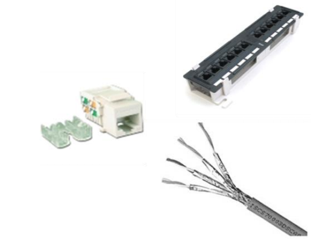

## 6. Топология СКС

> **Физическая топология** — <mark>описывает реальные связи между отдельными узлами в сети.</mark>

> **Логическая топология** — <mark>описывает прохождение данных по отдельным компонентам физической топологии от разъёма до разъёма активного оборудования.</mark>

Основные типы топологии:

- иерархическая звезда;
- кольцо (Token Ring);
- шина (Ethernet);
- решётчатые и полносвязанные структуры (более одного пути прохождения сигнала).

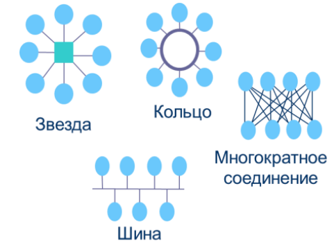

### Древовидная топология СКС

<mark>Любая СКС строится с привлечением древовидной топологии. Стандарт рекомендует также соединять резервными кабелями распределительные устройства одинакового иерархического уровня.</mark> Наличие резервных кабелей существенно увеличивает надёжность СКС, поскольку они могут быть использованы для оперативного восстановления связи при возможных обрывах кабелей магистрали территории или магистрали здания. Это также обеспечивает гибкость СКС и возможность лёгкой переконфигурации.

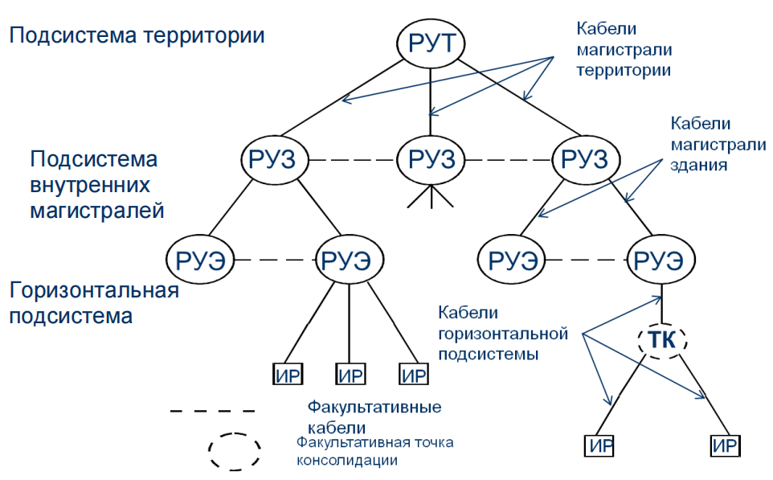

### Топология СКС и её подсистемы

<mark>Иерархическая звезда — традиционная архитектура СКС. Применяется как для группы зданий, так и для одного отдельно взятого здания.</mark> В составе звезды выделяются следующие разновидности кроссов, являющихся её узлами:

- центральный кросс системы (устанавливается в распределительном пункте комплекса зданий);
- главные кроссы зданий (устанавливаются в распределительном пункте здания);
- горизонтальные этажные кроссы (устанавливаются в распределительном пункте этажа).

Подсистемы: подсистема территории, подсистема внутренних магистралей, горизонтальная подсистема.

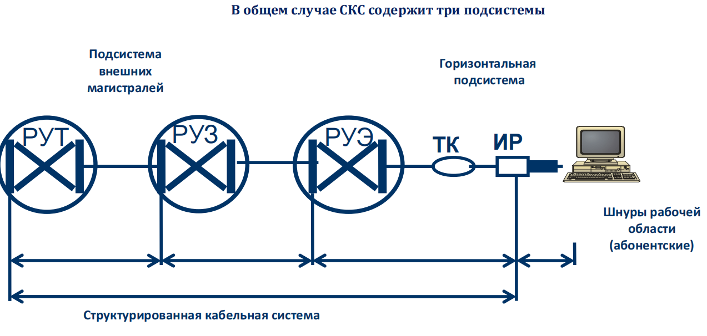

> **Кросс** — <mark>коммутационный узел, в котором осуществляется коммутация подсистем между собой и их подключение к активному сетевому оборудованию.</mark>

При необходимости кросс строится как многофункциональное устройство с выделением в нём соответствующих зон.

## 7. Структура СКС и взаимодействие подсистем

<mark>В общем случае СКС содержит три подсистемы.</mark>

### Взаимодействие подсистем СКС

<mark>Взаимодействие между подсистемами СКС осуществляется двумя способами:</mark>

- <mark>с помощью специфичного для каждого приложения активного оборудования;</mark>
- <mark>с помощью пассивного оборудования.</mark>

В зависимости от типа соединения отдельных подсистем формируются различные типы трактов:

- в первом случае — **неоднородные тракты**;
- во втором случае — **составные тракты**.

### Особенности отдельных подсистем

- **Подсистема внешних магистралей** <mark>реализуется в основном на оптическом кабеле.</mark>
- **Подсистема внутренних магистралей** — <mark>одинаково часто используются оптический и симметричный кабели.</mark>
- **Горизонтальная подсистема** <mark>в подавляющем большинстве случаев строится на 4-парных симметричных кабелях.</mark>

Все подсистемы строятся по одинаковым принципам, что облегчает проектирование, строительство и текущую эксплуатацию СКС. Отличия магистральных и горизонтальной подсистем минимальны по объёмам, не носят принципиального характера и позволяют более полно реализовать имеющиеся преимущества.

### Системные особенности СКС

Деление на три подсистемы не зависит от вида или формы реализации сети, то есть принципиально одинаково независимо от назначения и области использования офисного здания.

<mark>Коммутация подсистем между собой и их подключение к активному сетевому оборудованию осуществляется в кроссовых узлах</mark> (территории — КВМ, здания — КЗ, этажа — КЭ). <mark>Это обеспечивает возможность создания трактов с различной топологией: «шина», «звезда», «многократное соединение» или «кольцо».</mark>

<mark>Стандарты СКС не фиксируют тип коммутационного оборудования, задавая только его характеристики.</mark>

## 8. Подсистемы СКС

Один из принципов СКС — наличие нескольких уровней построения и их строгая иерархия. В структуре СКС выделяются подсистемы определённого функционального назначения, для каждой из которых регламентированы правила построения, топология и возможные варианты структуры, способы физических соединений линий.

<mark>Такой подход упрощает администрирование сети, облегчает обслуживание и позволяет неограниченно наращивать размер сети как количественно, так и структурно.</mark>

<mark>В основу любой СКС положена структура иерархической звезды (древовидная топология).</mark>

Полномасштабная СКС подразделяется на три подсистемы:

- подсистема внешних магистралей;
- подсистема внутренних магистралей здания;
- горизонтальная подсистема.

<mark>Деление на три подсистемы не зависит от вида или формы реализации сети. Коммутация подсистем между собой и их подключение к активному сетевому оборудованию осуществляется в кроссовых</mark> (территории — КВМ, здания — КЗ, этажа — КЭ). Это обеспечивает возможность создания трактов с различной топологией: «шина», «звезда», «многократное соединение» или «кольцо».

### Подсистема внешних магистралей

<mark>Кабели подсистемы внешних магистралей связывают между собой отдельные здания, находящиеся на общей территории (в кампусе). Если СКС устанавливается только в одном здании, подсистема внешних магистралей отсутствует.</mark>

> **Кампус** — <mark>территория, на которой расположена группа зданий, объединённых общей инфраструктурой.</mark>

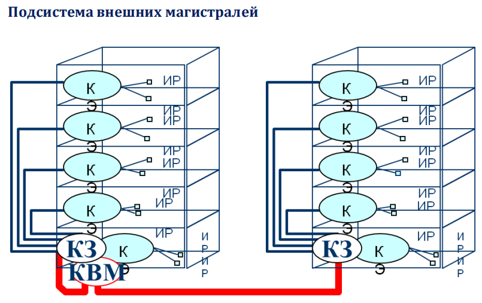

### Подсистема внутренних магистралей (вертикальная)

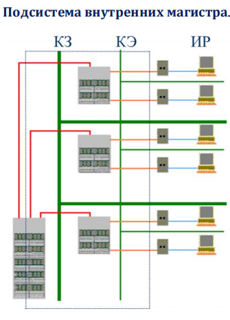

<mark>Кабели подсистемы внутренних магистралей:</mark>

- <mark>связывают между собой отдельные этажи здания;</mark>
- и/или пространственно разнесённые помещения в пределах одного этажа.

<mark>Если СКС обслуживает один этаж, подсистема внутренних магистралей может отсутствовать.</mark>

#### Дополнительные требования к магистральной подсистеме

> **Точка консолидации (ТК)** — <mark>промежуточная точка коммутации в горизонтальной подсистеме, допускаемая стандартом в ограниченных случаях.</mark>

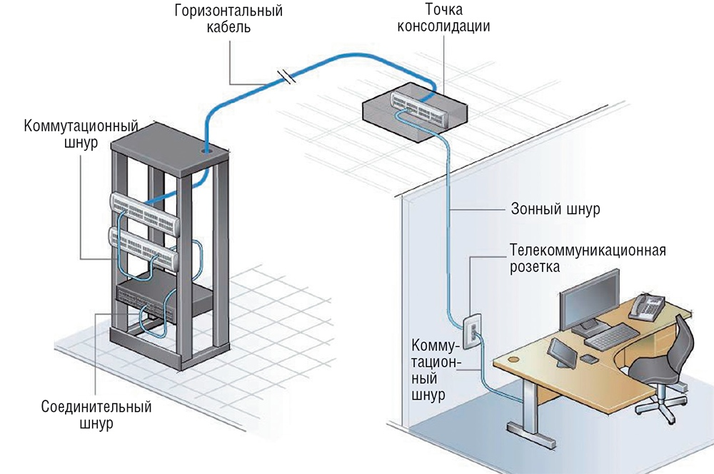

- Магистральная подсистема СКС **не должна содержать точек консолидации**.
- Кабели магистральных подсистем могут соединяться в проходных и разветвительных муфтах. Это обеспечивает гибкость СКС и возможность лёгкой переконфигурации под приложение.
- В отличие от горизонтальной подсистемы на магистральном уровне резко ограничена универсальность кабельной системы. Отдельные части магистральной подсистемы изначально реализуются под конкретное приложение.

> **Проходная муфта** — устройство для соединения кабелей без ответвлений.

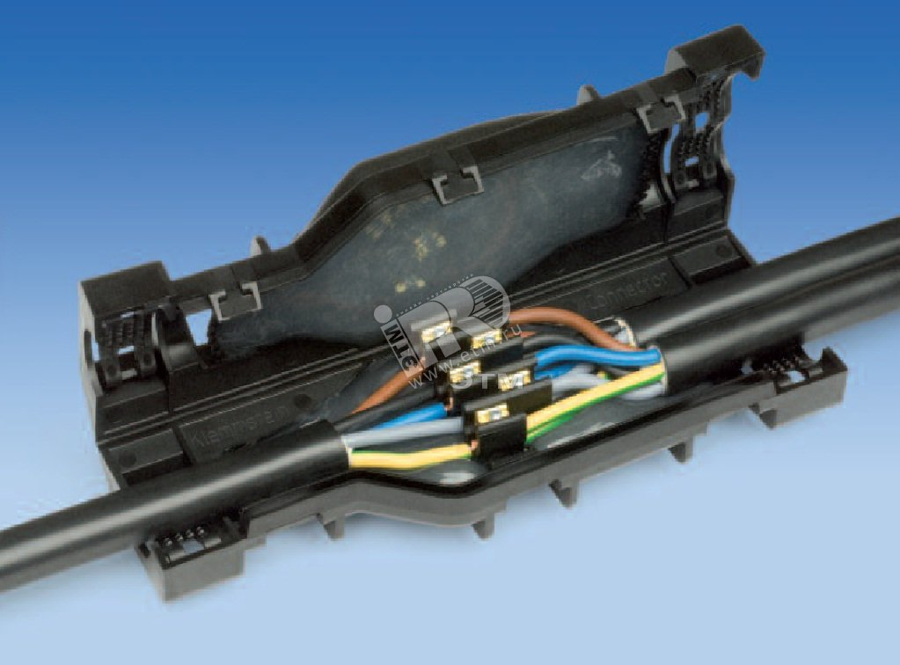

> **Разветвительная муфта** — устройство для соединения кабелей с ответвлениями.

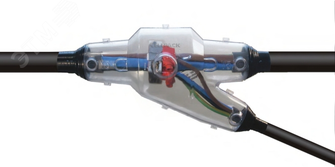

### Горизонтальная подсистема

<mark>Горизонтальная подсистема включает кроссовые панели, горизонтальный кабель и пользовательские информационные розетки, а также шнуры различного назначения. Реализуется в большинстве случаев на основе симметричного кабеля.</mark>

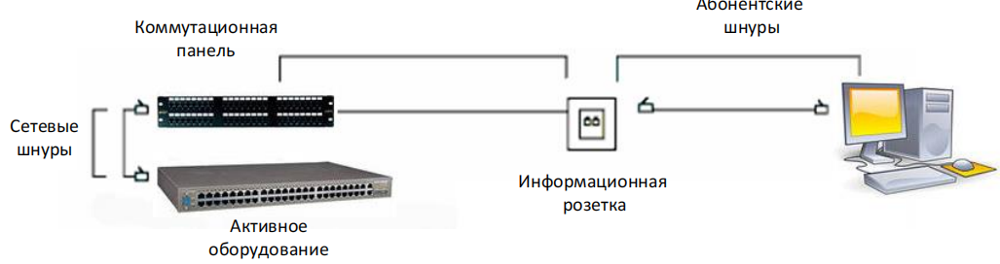

> **Важно!** Все пары горизонтального кабеля должны быть подключены к одному розеточному модулю информационной розетки (ИР).

#### Особенности горизонтальной подсистемы

- Горизонтальная подсистема — единственная подсистема СКС, обеспечивающая свойство **полной универсальности**.
- Протяжённость кабельных трактов горизонтальной подсистемы не превышает **100 м**.
- Горизонтальная подсистема, в отличие от магистральных, обслуживает конечных пользователей.
- В основной массе случаев строится на симметричном 4-парном кабеле.
- При построении могут быть использованы только двух- и трёхконнекторные модели трактов.
- Может содержать точку консолидации.

## 9. Основные комплексные объекты СКС

> **Тракт (канал, Channel)** — <mark>полный путь передачи сигнала от разъёма до разъёма активного сетевого оборудования (например, от рабочей станции до коммутатора ЛВС).</mark>

> **Стационарная линия (permanent link)** — <mark>отрезок линейного (инсталляционного) кабеля с установленными на обоих его концах коммутационными устройствами (панелями и информационными розетками).</mark>

Стационарная линия может быть реализована как на симметричном, так и на волоконно-оптическом кабеле. В состав стационарной горизонтальной линии может входить опциональная точка консолидации. Вне зависимости от типа кабеля протяжённость стационарной горизонтальной линии не может превышать **90 м**.

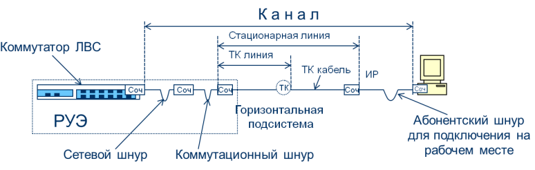

### СКС как совокупность стационарных линий

<mark>Любая СКС состоит из совокупности стационарных линий, в процессе формирования трактов соединяемых между собой и подключаемых к активному сетевому оборудованию коммутационными шнурами.</mark>

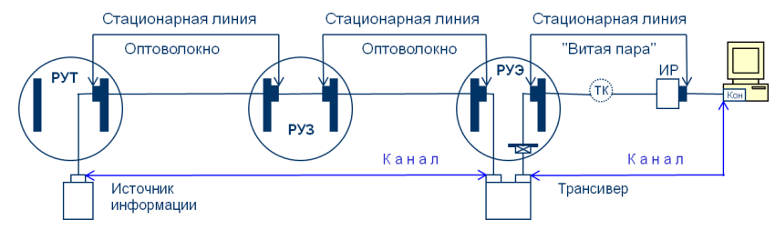

### Системные особенности трактов СКС

<mark>Тракт всегда включает одну или несколько стационарных линий и разнообразные шнуры, используемые для подключения активного оборудования и соединения стационарных линий между собой в промежуточных точках (при их наличии).</mark>

Требования стандартов к трактам и стационарным линиям учитывают их структуру и поэтому отличаются между собой. При наличии специальных требований на этапе приёмо-сдаточных испытаний может быть выполнена выборочная или сплошная проверка параметров тракта или стационарной линии.

### Структура горизонтального тракта

Структура горизонтального тракта описана в нормативной части стандартов; выполнение их положений позволяет гарантировать получение заданных параметров линии проводной связи.

<mark>Состав тракта на основе симметричного кабеля:</mark>

- мах **90 м** симметричного кабеля с жёсткими однопроволочными проводниками витых пар;
- мах **10 м** разнообразных шнуров с гибкими многопроволочными проводниками витых пар;
- **3 разъёмных соединителя** (разъёмные соединители аппаратуры не входят в состав тракта!).

### Особенности магистрального тракта

<mark>В отличие от горизонтальных трактов магистральный тракт может:</mark>

- реализовываться по составной схеме (включать две или более стационарных линий);
- иметь на обоих концах схему коммутации кроссконнекта.

В стационарных линиях магистральных трактов нельзя использовать точки консолидации. В составе магистральных трактов младших классов (A и B) могут применяться проходные и разветвительные муфты.

<mark>Магистральный тракт может реализовываться по неоднородной схеме. Оптический и симметричный сегменты такого тракта связываются друг с другом преобразователем среды.</mark>

> **Преобразователь среды (media converter)** — устройство для согласования оптического и медного сегментов тракта.

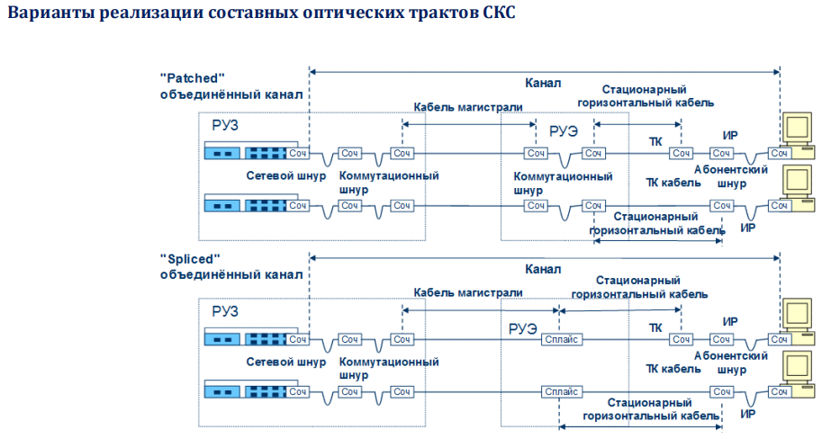

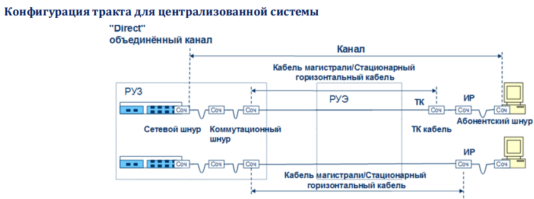

## 10. Особенности реализации стационарной линии и тракта

### Стационарная линия

<mark>Стационарная линия (permanent link) — отрезок линейного (инсталляционного) кабеля с установленными на обоих его концах коммутационными устройствами (панелями и информационными розетками). Может быть реализована как на симметричном, так и на волоконно-оптическом кабеле. В состав стационарной горизонтальной линии может входить опциональная точка консолидации.</mark> Вне зависимости от типа кабеля протяжённость стационарной горизонтальной линии не может превышать **90 м**.

### Канал

<mark>Канал (Channel) — полный путь передачи сигнала от разъёма одного активного сетевого оборудования до разъёма другого (например, от рабочей станции до коммутатора ЛВС).</mark>

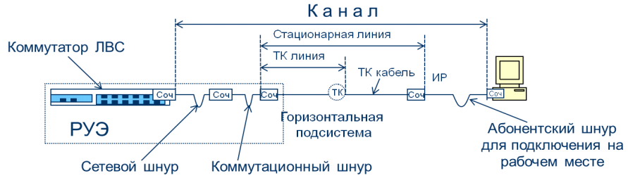

### Связь тракта и стационарной линии

<mark>Тракт обязательно включает хотя бы одну стационарную линию СКС и разнообразные шнуры, используемые для подключения.</mark> При наличии специальных требований на этапе приёмо-сдаточных испытаний может быть выполнена выборочная или сплошная проверка параметров тракта или стационарной линии.

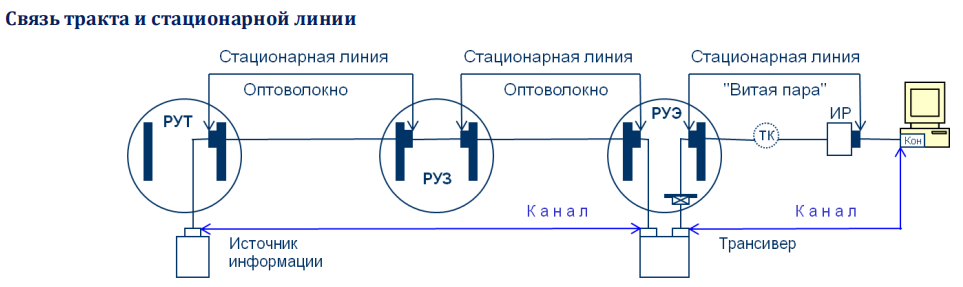

### Особенности симметричного тракта

<mark>Полная пропускная способность симметричного тракта определяется характеристиками тех компонентов, которые использованы для его формирования.</mark>

Состав горизонтального тракта на основе симметричного кабеля:

- мах **90 м** симметричного кабеля с жёсткими однопроволочными проводниками витых пар;
- мах **10 м** разнообразных шнуров с гибкими многопроволочными проводниками витых пар;
- **3 разъёмных соединителя** (разъёмные соединители аппаратуры не входят в состав тракта!).

## 11. Канонические модели подсистем СКС на симметричном кабеле

### Модели трактов горизонтальной подсистемы без ТК

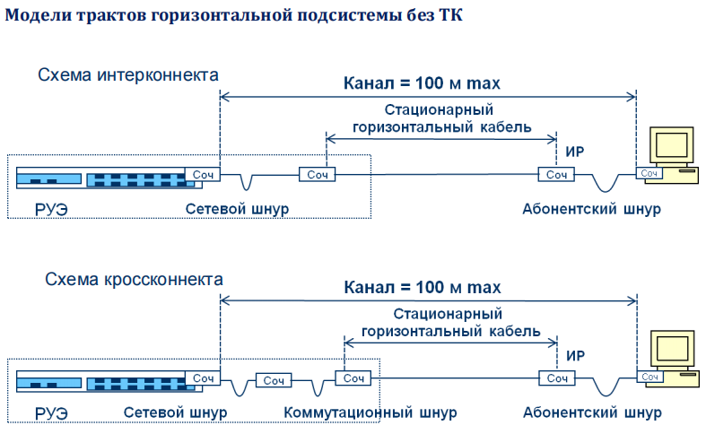

<mark>В обоих случаях стационарный горизонтальный кабель с одной стороны подключается к панели в РУЭ, а с другой — к модулю ИР или MUTO.</mark> Тракт включает все шнуры, указанные на слайде.

Горизонтальная подсистема образована внутренними горизонтальными кабелями между панелями в техническом помещении этажа (РУЭ), информационными розетками (ИР) рабочих мест, коммутационным оборудованием в РУЭ и коммутационными шнурами для подключения СКС к активному оборудованию.

> **РУЭ** — распределительный узел этажа, техническое помещение этажа.

> **MUTO** — Multi-User Telecommunications Outlet, многопользовательская телекоммуникационная розетка.

### Модели трактов горизонтальной подсистемы с ТК

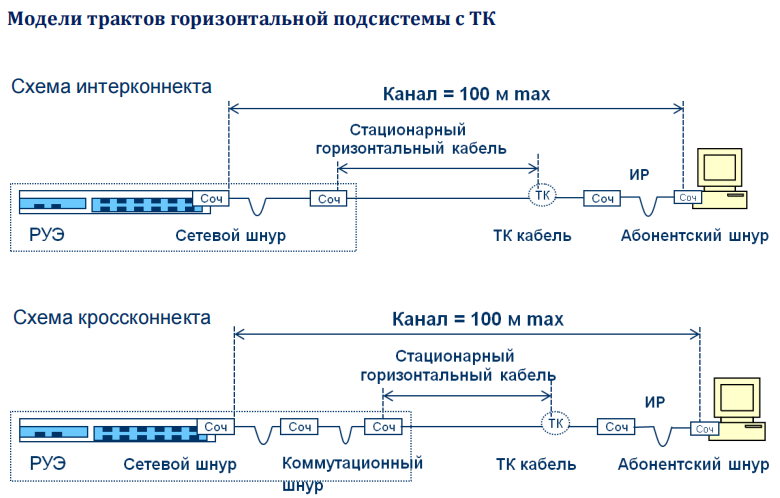

### Соединение цепей передачи

<mark>Кабели и компоненты различных категорий могут быть смешаны в линии или подсистеме СКС, при этом передаточные характеристики этой линии будут определяться параметрами кабеля или компонента **низшей категории**.</mark>

<mark>Стандарт запрещает использование в одной линии кабелей и компонентов с различным волновым сопротивлением, а в оптических линиях — волокон с различным диаметром сердцевины.</mark> Кроме того, в СКС запрещается при терминировании кабелей параллельное соединение проводников.

### Максимальные длины компонентов горизонтального тракта

Ограничения:

- физическая длина тракта: не более **100 м**;
- физическая длина стационарного горизонтального кабеля: не более **90 м**;
- длина кабеля от ТК до ИР: не более **20 м**;
- суммарная длина коммутационных шнуров в распределительном узле: не более **5 м**.

### Особенности модели стационарной линии горизонтальной подсистемы

- Максимальная длина горизонтального симметричного кабеля не зависит от типа применяемой элементной базы (экранированная или неэкранированная витая пара) и не должна превышать **90 м** независимо от категории элементной базы.
- На правило 90-метрового ограничения общей протяжённости горизонтальной стационарной линии не оказывает влияние наличие или отсутствие точки консолидации.
- При реализации горизонтального тракта на оптической элементной базе все указанные выше ограничения сохраняют силу.

### Модель магистрального тракта (на базе симметричного кабеля)

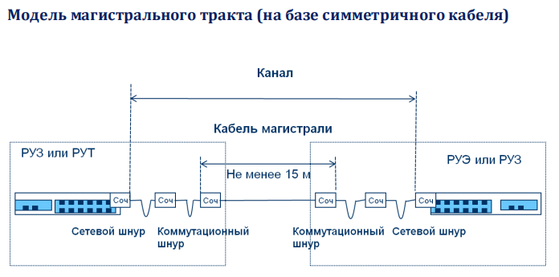

### Максимальные длины магистральных трактов

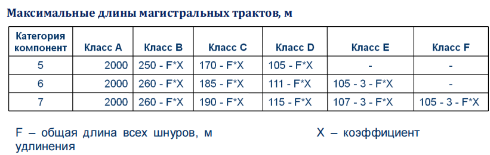

Ограничения для классов D, E и F:

- физическая длина тракта: не более **100 м** (ограничение из-за перекоса задержки распространения);
- в случае применения на обоих концах тракта схемы кроссконнекта максимальная длина магистрального кабеля уменьшается до **75 м**.

### Особенности нормирования максимальных длин магистральных трактов

<mark>Для приложений младших классов (до C включительно) максимальная протяжённость тракта может отличаться от рассчитанных по таблице значений в сторону уменьшения.</mark>

Таким образом, имеем прямую привязку кабельной системы к приложению. Это не является нарушением канонических принципов построения СКС, так как универсальность кабельной системы декларируется и гарантируется исключительно на уровне горизонтальной подсистемы. Соответствующие данные по таким трактам с отличными длинами находятся в информационном приложении к стандарту ISO/IEC 11801.

# Коммутация, администрирование и параметры СКС

## 9. Коммутация в СКС

> **Коммутация в СКС** — <mark>процесс подключения активного сетевого оборудования к кабельной системе и формирования трактов передачи на горизонтальном и магистральном уровнях.</mark>

<mark>Коммутация в СКС выполняется:</mark>

- в процессе подключения группового и терминального активного сетевого оборудования к кабельной системе;
- в процессе формирования трактов передачи на горизонтальном и магистральных уровнях.

<mark>Коммутация в СКС **всегда выполняется вручную** с помощью коммутационных шнуров. Функции стационарных компонентов устройств коммутации выполняет индивидуальное и групповое коммутационное оборудование.</mark>

Наличие в составе СКС коммутационного оборудования увеличивает эксплуатационную гибкость системы, существенно облегчает включение новых абонентов в сеть, переключение существующих и выполнение иных изменений конфигурации.

### Методы коммутации

> **Кроссконнект (cross connection)** — <mark>метод коммутации, при котором коммутационный шнур подключается только к панелям.</mark>

> **Интерконнект (interconnect)** — <mark>метод коммутации, при котором коммутационный шнур подключается к панели и активному сетевому оборудованию без промежуточной панели отображения.</mark>

В СКС применяется два основных метода коммутации:

- кроссовых соединений (кроссконнект);
- прямого подключения (интерконнект).

<mark>Коммутация всегда производится вручную коммутационными шнурами (перемычками — только в телефонных кроссах). Следовательно, функционирование СКС **не зависит от состояния электропитающей сети**.</mark>

#### Коммутация методом кроссконнекта

<mark>Данная разновидность формирования тракта предполагает подключение коммутационного шнура только к панелям. Для подключения сетевого оборудования в техническом помещении используются **две панели и два соединительных шнура** — сетевой и коммутационный.</mark>

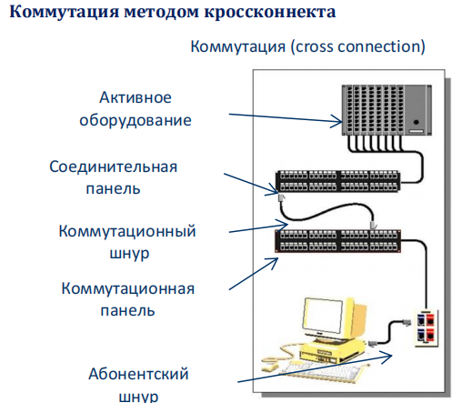

#### Коммутация методом интерконнекта

<mark>Данная разновидность формирования тракта предполагает подключение коммутационного шнура к панели и активному сетевому оборудованию без промежуточной панели отображения. Это самый простой и наиболее распространённый вариант построения СКС.</mark>

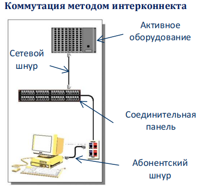

### Отображение кроссов

> **Отображение кроссов** — <mark>ситуация, когда на обоих концах стационарной линии находятся панели.</mark>

- По схеме отображения кроссов строятся магистральные линии.
- Схема отображения кроссов обычно используется для приложений класса A (телефония) или в оптических магистральных линиях (различаются полярностью A, B, C).
- На уровне горизонтальной подсистемы применение отображения кроссов **недопустимо** (нарушение ограничения трёх межсоединений).

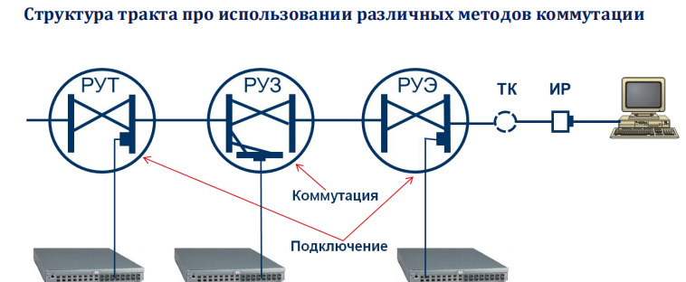

НАДО УТОЧНИТЬ ЧТО ЭТО (РАЗНИЦА КОММУТАЦИИ И ПОДКЛЮЧЕНИЯ)!!!

## 10. Технические средства коммутации

### Соединительные шнуры

> **Абонентские шнуры (work area cables)** — шнуры, используемые в рабочей области.

> **Сетевые шнуры (equipment cables)** — шнуры, используемые в распределительных узлах для подключения активного оборудования.

> **Коммутационные шнуры (patch-cords)** — шнуры для соединений между панелями.

<mark>В СКС применяются три разновидности шнуров:</mark>

- абонентские шнуры (work area cables) — используются в рабочей области;
- сетевые шнуры (equipment cables) — используются в распределительных узлах и служат для подключения активного оборудования;
- коммутационные шнуры (patch-cords) — служат для соединений между панелями.

<mark>Все разновидности соединительных шнуров используются при формировании трактов передачи данных и **не входят в состав СКС**.</mark>

> <mark>**Примечание.** Патч-кордами ошибочно называют все шнуры, в том числе абонентские и сетевые.</mark>

### Разновидности панелей

Групповое коммутационное оборудование в технических помещениях в зависимости от функционального назначения делится на:

- **коммутационные панели (patch panels)** — предназначены для подключения к ним линейных кабелей;
- **панели отображения** — используются при реализации схемы кроссконнекта и подключаются своей линейной стороной к портам активного сетевого оборудования;
- **кроссы (distribution frames)** — обычно выполняют функцию физического интерфейса телефонной станции.

### Коммутационные панели

Предназначены для:

- подключения к ним кабелей различных подсистем СКС;
- ручного соединения отдельных стационарных линий кабельной системы друг с другом коммутационными шнурами.

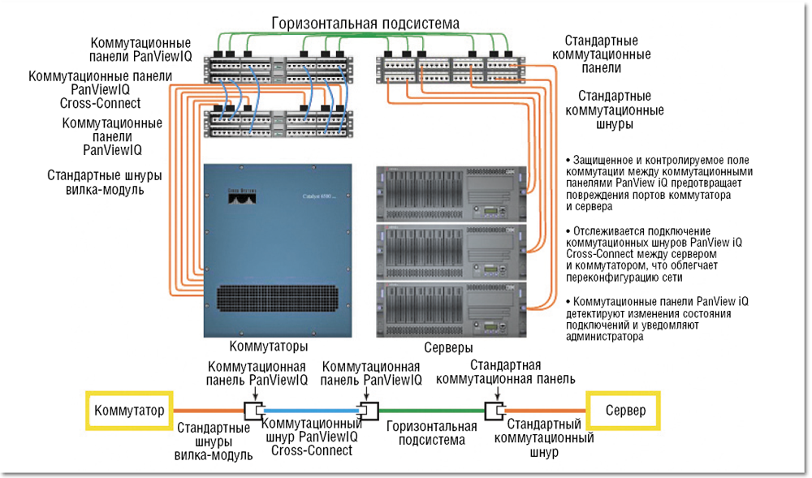

Основные требования:

- обладать максимально высокой плотностью портов на единицу высоты;
- предоставлять ввод кабелей с соблюдением действующих норм по величине изгиба (запаса), растягивающим усилиям и так далее;
- обеспечивать простоту монтажа отдельных портов и самой панели;
- обеспечивать простоту процесса переключения коммутационными шнурами;
- предоставлять возможность эффективной символьной и цветовой маркировки отдельных портов и самой панели целиком.

Применение коммутационных панелей даёт следующие преимущества:

- увеличивает гибкость всей системы;
- обеспечивает подключение новых абонентов в сеть;
- облегчает различные перемещения рабочих мест;
- обеспечивает поддержку новых приложений.

## 11. Администрирование СКС

> **Администрирование СКС** — <mark>совокупность способов и средств управления системой СКС на протяжении всего срока её эксплуатации.</mark>

<mark>Эксплуатация СКС предполагает, что в неё могут быть внесены изменения, осуществлены перемещения и выполнены удаления каких-либо компонентов. Администрирование имеет своей основной целью максимальное упрощение выполнения указанных процедур. Тип администрирования СКС полностью определяется её топологией.</mark>

<mark>Применяются два типа администрирования: **одноточечное** и **многоточечное**.</mark>

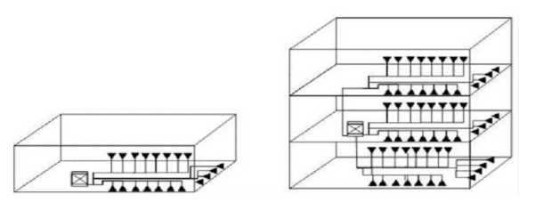

### Одноточечное администрирование

> **Одноточечное администрирование** — <mark>управление СКС путём переключений коммутационных шнуров в одном коммутационном центре.</mark>

<mark>Применяется при создании СКС с максимально упрощённым типом управления (централизованная кабельная система). Возможно только в кабельных системах с единственным техническим помещением. Кабели централизованной системы проложены из РУТ или РУЗ непосредственно к ИР рабочих мест, минуя промежуточные распределительные пункты.</mark>

### Многоточечное администрирование

> **Многоточечное администрирование** — <mark>управление СКС путём переключений коммутационных шнуров в нескольких точках.</mark>

<mark>Главный признак — необходимость выполнения переключения **минимум двух шнуров** в общем случае изменения конфигурации.</mark>

<mark>Применяется при построении СКС по классической архитектуре иерархической звезды. Необходимость переключения минимум двух шнуров гарантирует гибкость управления и возможность адаптации СКС для новых приложений.</mark>

Преимущество: число компонентов, могущих выйти из строя, ограничено. Отказ в одном из распределительных шкафов или на магистрали не влияет на работу сети в целом — страдает только данный участок.

### База данных как компонент администрирования

Администрирование основано на создании и поддержании в актуальном состоянии базы данных, которая является его центральным элементом. Записи базы данных формируются по единому шаблону.

База данных может вестись в:

- бумажном виде;
- электронной форме на основе продуктов общего назначения;
- на специализированном ПО.

База данных прямо или косвенно взаимодействует с идентификаторами, чертежами, нарядами на работу и отчётами, а также с файлами результатов тестирования.

## 12. Технология PoE и учёт её взаимодействия с кабельными трактами СКС

> **PoE (Power Over Ethernet)** — <mark>технология дистанционного питания постоянным током маломощных периферийных устройств по кабельным трактам СКС.</mark>

Технология PoE нормируется стандартом **IEEE 802.3af**. Задаются максимальные параметры:

- омическая асимметрия одной пары — не более $3\%$;
- допустимое значение постоянного тока в проводнике пары — $0{,}175$ А (во всём диапазоне температур);
- допустимое рабочее напряжение постоянного тока между проводниками — $72$ В (во всём диапазоне температур);
- максимальная мощность потребителя — $12{,}95$ Вт.

Для подачи дистанционного питания всегда используется **две витых пары**.

Дистанционное питание производится по так называемым фантомным цепям подачей напряжения в центральные отводы трансформаторов гальванической развязки. Это позволяет устранить взаимные влияния пар друг на друга и одновременно увеличить допустимую мощность потребления питаемого устройства. В горизонтальных кабелях подача дистанционного питания целесообразна по тем витым парам, которые не используются для передачи сигналов.

### Стандарт PoE+

> **PoE+ (IEEE 802.3at DTE Power Enhancements)** — расширение стандарта PoE, ориентированное на предельную мощность не менее $26$ Вт.

Стандарт позволяет расширить функциональность существующих PoE-устройств и стимулирует развитие новых областей применения. Соответствующие PoE+ камеры видеонаблюдения получат возможность панорамирования, наклона и изменения масштаба изображения, а IP-видеотелефоны смогут передавать в потоковом режиме цветное видео. Новый стандарт сможет поддерживать устройства с повышенными требованиями по мощности питания: WiMAX-передатчики, информационные киоски, компьютерные терминалы и тонкие клиенты.

### Особенности проектирования PoE и СКС

- <mark>Напряжение дистанционного питания может подаваться на оконечные устройства с коммутатора или отдельной панели питания. В последнем случае под неё резервируется отдельное посадочное место в шкафу.</mark>
- <mark>Системы класса PoE+ работают только по кабельным трактам категории 6 и выше.</mark>
- <mark>При высоких температурах, энергопотреблении оконечных устройств, близком к предельному, и плотных пакетах горизонтальных кабелей возможно превышение сопротивления шлейфа и отключение источников. Компенсируется уменьшением предельной протяжённости кабеля стационарной линии до $80$ м или обязательным применением на длинных линиях компонентов категории 6 с уменьшенным сопротивлением.</mark>

### Требования ISO/IEC 11801 по постоянному току

> **Сопротивление шлейфа по постоянному току (Direct Current Loop Resistance)** — численная мера характеристик тракта по постоянному току, нормируемая для каждого класса и измеряемая в соответствии с IEC 61935-1.

Нормы сопротивления шлейфа по классам:

| Класс | Сопротивление шлейфа, не более |
|---|---|
| A | $560$ Ом |
| B | $170$ Ом |
| C | $40$ Ом |
| D | $25$ Ом |
| E | $25$ Ом |
| F | $25$ Ом |

**Важно для систем PoE.**

## 13. Открытый офис и точка консолидации

> **Открытый офис** — <mark>пользовательское рабочее помещение большой площади, разделённое на отдельные секции мебелью или лёгкими некапитальными перегородками.</mark>

Для таких офисов характерны частые перемещения сотрудников и изменения конфигурации рабочих зон.

### Главные особенности СКС открытых офисов

- Горизонтальная подсистема СКС в обычном офисе с коридорно-кабинетной системой и в открытом офисе реализуется на практически идентичной элементной базе.
- На магистральных уровнях такие СКС отличий не имеют.
- В составе горизонтальной подсистемы активно применяются точки консолидации и многопользовательские розетки.
- Абонентские шнуры в открытом офисе в среднем имеют заметно большую длину.

### Точка консолидации (ТК)

> **Точка консолидации (Consolidation Point, CP)** — <mark>промежуточный пункт администрирования в горизонтальной подсистеме, применяемый в открытых офисах для организации свободного размещения информационных розеток на рабочих местах.</mark>

Точка консолидации применяется в открытых офисах, где требуется организовать свободное размещение ИР на рабочих местах сотрудников. Стандарты не предусматривают каких-либо различий в параметрах всего тракта горизонтальной подсистемы с точкой консолидации и без неё.

<mark>Согласно ISO/IEC 11801 ТК является пунктом администрирования (это отражается в соответствующих записях), а также местом подключения тестирующего оборудования к кабельной системе. ТК подлежит обязательному тестированию.</mark>

<mark>ТК — это дополнительное соединение, следовательно, с ним связаны:

- снижение надёжности СКС;
- ухудшение электромагнитных параметров линий;
- увеличение помех.</mark>

> **Важно!** ТК нужно применять только тогда, когда это необходимо.

Правила применения ТК:

- применяется только в горизонтальной подсистеме в количестве не более одной на любой тракт;
- ТК должны располагаться так, чтобы рабочие группы открытого офиса могли подключиться хотя бы к одной из них;
- одна ТК может обслуживать максимум **12 рабочих мест**;
- для симметричного кабеля ТК располагается на расстоянии не менее **15 м** от РУЭ;
- к ТК подключается только пассивное оборудование.

### Многопользовательская информационная розетка MUTO

> **MUTO (Multi-User Telecommunications Outlet)** — многопользовательская телекоммуникационная розетка, пользовательский компонент открытого офиса.

<mark>В отличие от точки консолидации MUTO находится в свободном доступе, является пользовательским компонентом и применяется преимущественно для подключения активного оборудования на рабочих местах сотрудников.</mark> MUTO рекомендуется размещать так, чтобы длины шнуров обслуживаемых ею рабочих мест были минимальными.

## 14. Централизованная кабельная система

> **Централизованная кабельная система (ЦКС)** — <mark>СКС, содержащая всего один распределительный узел, который даёт возможность осуществлять коммутацию любых линий во всех зданиях и на всей территории предприятия в одном месте.</mark>

Кабели централизованной системы могут идти из РУТ или РУЗ к ИР рабочих мест, минуя промежуточные распределительные пункты.

Положительные черты:

- уменьшение количества и номенклатуры коммутационного оборудования;
- возможность формирования любых наперёд заданных рабочих групп на физическом уровне без использования виртуальных соединений;
- сосредоточение всего активного оборудования в одном месте, что уменьшает число специально оборудованных технических помещений;
- значительное сокращение (или полное исключение) выделенных помещений для кроссовых этажей.

### Свойства централизованной кабельной системы

- Применяется преимущественно при реализации проектов класса «волокно до рабочего места».
- В связи с падением доли таких проектов встречается на практике при реализации крупных сетей достаточно редко.
- Обычно характеризуется более высокой средней длиной горизонтального кабеля, то есть проигрывает иерархическим структурам по капитальным затратам.
- Из-за массового внедрения в области ЛВС управляемых коммутаторов не имеет технических преимуществ при отсутствии особых требований в отношении режима несанкционированного доступа к информации.

## 15. Конструктивные особенности витой пары

> **Витая пара (twisted pair)** — кабель, содержащий одну или несколько скрученных пар проводников с медными жилами, находящихся под общей оболочкой.

Способность кабеля передавать высокочастотные сигналы определяется **сбалансированностью пары**. Суммарное излучение «идеальной пары» стремится к нулю. Если кабель содержит несколько пар, то для исключения взаимных влияний их скручивают с различным шагом.

### Конструкция жилы пары линейных кабелей

Для минимизации вредного влияния эффекта близости и поверхностного эффекта проводники витых пар линейных кабелей выполняются из **однопроволочного проводника (solid)**.

### Конструкция жилы пары шнуровых кабелей

Из соображений обеспечения устойчивости к многократным изгибам в процессе эксплуатации проводники витых пар гибких шнуровых кабелей выполняются из **многопроволочного проводника (stranded)**.

Многопроволочный проводник изготавливается из семи свитых тонких проводок диаметром около $0{,}2$ мм. Шнуровой кабель имеет более высокое затухание. Для частичной компенсации этого нежелательного явления общий диаметр проводника шнурового кабеля увеличивают по сравнению с линейным.

## 16. Параметры влияния витой пары

### NEXT (Near End Crosstalk)

> **NEXT (переходное затухание на ближнем конце)** — разность между уровнями передаваемого сигнала и создаваемой им помехи на соседней паре, измеренная на ближнем конце.

Электромагнитное излучение, возникающее из-за неидеальности балансировки витой пары, вызывает в соседних парах наведённые токи. Этот эффект называется переходными наводками, которые становятся помехой для полезных сигналов.

Свойства NEXT:

- не зависит от длины кабеля, поэтому измерения необходимо проводить с обеих сторон линии;
- кабель считается соответствующим требованиям стандарта, если во всём рабочем частотном диапазоне реальная величина NEXT не падает ниже значения, определённого нормами;
- величина NEXT частотнозависима (падает по мере роста частоты), но не зависит от длины линии;
- равен отношению сигнала, подаваемого на одну пару, к наведённому на ближнем конце другой пары;
- имеет тем большее значение, чем лучше сбалансирована пара, следовательно, тем меньший уровень имеет наводка в соседних парах;
- чем выше значение NEXT, тем меньше влияние помех между двумя парами проводников;
- необходимо измерять во всём диапазоне частот;
- в многопарном кабеле измерения должны производиться для **всех комбинаций пар**.

### PS NEXT (Power Sum Crosstalk)

> **PS NEXT (суммарное переходное затухание на ближнем конце)** — параметр, учитывающий одновременные наводки со всех пар, присутствующих в кабеле.

Суммарные показатели стали применяться в связи с тем, что в новых технологиях передача данных осуществляется одновременно по нескольким витым парам. При тестировании PS NEXT измерительный прибор определяет степень воздействия трёх влияющих пар на четвёртую. Это особенно важно для таких технологий, как Gigabit Ethernet и аналогичных им.

### Защищённость ACR (Attenuation to Crosstalk Ratio)

> **ACR-N (защищённость на ближнем конце)** — численно равна разнице между переходным затуханием и затуханием.

Защищённость является вычисляемым параметром и частотнозависимой величиной. По мере увеличения защищённости растёт качество передачи сигнала.

### FEXT (Far End Cross Talk)

> **FEXT (переходное затухание на дальнем конце)** — параметр, измеряемый во всём диапазоне используемых частот и выражаемый в децибелах; зависит от длины кабеля.

Для компенсации такого влияния нормируется и контролируется величина защищённости на дальнем конце, численно равная разности значений FEXT и рабочего затухания. Данная величина называется защищённостью на дальнем конце и обозначается как **ELFEXT (Equal Level FEXT)** или **ACR-F (Attenuation to Cross Talk Ratio – Far End)**:

$$ELFEXT = FEXT - IL$$

где $IL$ — рабочее затухание (insertion loss).

### Особенности параметров влияния

- Параметры влияния фиксируются в обычном (без дополнительного префикса), суммарном (префикс PS) и межкабельном (префикс A) вариантах.
- Параметр FEXT не имеет самостоятельного значения из-за сильной зависимости от длины.
- На основе величин NEXT и FEXT кабельным сканером автоматически рассчитываются величины ACR для ближнего и дальнего конца в обычном, суммарном и межкабельном вариантах, которые являются мерой отношения сигнала к шуму и определяют качество функционирования сетевого интерфейса.
- Межкабельные параметры влияния имеют смысл только в частотном диапазоне свыше $200$ МГц, то есть для техники категории 6А и выше в случае её исполнения в неэкранированном варианте.

## 17. Способы защиты симметричных трактов от воздействия внешней помехи

### Внешние источники помех

Два основных вида внешних наводок:

- **Радиопомехи и электромагнитные шумы.** Основные источники — сотовые телефоны, передатчики систем радиовещания и телевидения, источники питания с высокочастотным преобразованием.
- **Электромагнитная интерференция EMI.** Основные источники — электромоторы, стартеры флуоресцентных ламп, силовые кабели (сети переменного тока) и атмосферные явления, включая разряды молнии.

Стандарты не предусматривают специальных требований к уровню шума, наведённого внешним электромагнитным излучением.

### Методы борьбы с помехами

<mark>Эффективность подавления внешних помех обеспечивается следующими приёмами:</mark>

- <mark>высокой степенью симметрии витой пары;</mark>
- <mark>обеспечением целостности экранов кабеля;</mark>
- <mark>высококачественным заземлением экрана;</mark>
- <mark>увеличением расстояния между кабелем и источником помехи;</mark>
- <mark>ограничением длины взаимодействия с источником помех.</mark>

<mark>Указанные приёмы независимы друг от друга и могут применяться совместно.</mark>

### Расстояние от источников помех

Следует строго выдерживать минимальные расстояния кабеля от источников помех. Кроме указанных выше требований следует также предохранять кабель от лишних напряжений и влияния источников тепла.

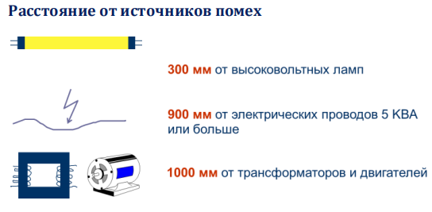

### Требования ПУЭ

> **ПУЭ (Правила устройства электроустановок)** — <mark>нормативный документ, регламентирующий взаимодействие СКС с системой энергоснабжения.</mark>

<mark>ПУЭ разрешает вести силовые и информационные кабели в одном канале при условии наличия в нём разделительной перегородки. Сила тока в сети не должна превышать $20$ А при напряжении $220$ В.</mark> Дополнительно ПУЭ запрещает прокладывать силовую и информационную проводки в одном и том же кабелепроводе (например, желобе, коробе или плинтусе) без перегородки.

Из указанного ограничения вытекает целесообразность применения для энергоснабжения рабочих станций ЛВС отдельной «чистой» сети.

## 18. Основные параметры оптических трактов СКС

Передача информации с заданным качеством по оптическим кабельным трактам СКС требует обязательного выполнения ряда норм.

Основными параметрами, отвечающими за качество передачи, являются:

- затухание;
- широкополосность;
- числовая апертура;
- геометрические характеристики сердцевины.

Широкополосность, числовая апертура и геометрические характеристики сердцевины гарантируются типом применяемой элементной базы. На затухание сильное влияние оказывает качество выполнения монтажа.

### Затухание (Attenuation)

> **Затухание** — постепенная потеря оптическим сигналом своей энергии в процессе распространения по волокну.

От величины затухания зависит максимальная дальность связи между двумя приёмопередатчиками. Затухание обусловлено потерями на рассеяние и на поглощение. Эффекты рассеяния и поглощения определяют рабочий диапазон длин волн волоконно-оптической связи. Затухание принято измерять в децибелах на километр.

### Составляющие потерь света

Потери света в волоконном световоде за счёт рассеивания и поглощения неизбежны.

### Затухание в волокне

- **Макроизгибы** — видимые изгибы. Вызывают большие потери на больших длинах волн.
- **Микроизгибы** — не видимы для глаза (появляются при изготовлении волокна).

### Нижний предел потерь волоконного световода

Минимальная величина потерь никогда не достигается из-за:

- кабельных потерь, возникающих в процессе изготовления оптического кабеля;
- примесей, содержащихся в материале сердцевины световода, которые приводят к резкому возрастанию потерь на определённых длинах волн.

### Окна прозрачности

> **Окна прозрачности** — области минимальных потерь в волоконно-оптическом кабеле, в которых работа эффективна.

Работа по волоконно-оптическим кабелям эффективна не на всех длинах волн, а только в определённых участках спектра, где достигаются минимальные потери. Для кварцевых световодов практический интерес представляют три окна прозрачности. Чаще всего это три длины: $850$ нм, $1300$ нм и $1550$ нм. Характеристики полупроводниковых излучателей и фотоприёмников оптимизированы для работы в этих окнах.

## FAQ

**Чем кроссконнект отличается от интерконнекта?**
При кроссконнекте коммутационный шнур подключается только к панелям (используются две панели и два шнура), при интерконнекте — к панели и активному оборудованию напрямую, без промежуточной панели отображения. Интерконнект проще и распространённее.

**Почему коммутация в СКС не зависит от электропитания?**
Потому что она всегда выполняется вручную коммутационными шнурами, а не активными электронными устройствами.

**Где допускается отображение кроссов?**
На магистральных линиях (приложения класса A, телефония, оптические магистрали). На горизонтальной подсистеме оно недопустимо из-за ограничения трёх межсоединений.

**Чем отличаются абонентские, сетевые и коммутационные шнуры?**
Абонентские используются в рабочей области, сетевые — в распределительных узлах для подключения активного оборудования, коммутационные — для соединений между панелями. Все они не входят в состав СКС.

**Что такое одноточечное и многоточечное администрирование?**
Одноточечное — управление переключениями в одном коммутационном центре (централизованная система). Многоточечное — в нескольких точках, при изменении конфигурации требуется переключить минимум два шнура; применяется в иерархической звезде.

**Сколько витых пар используется для PoE?**
Всегда две витых пары. По стандарту IEEE 802.3af максимальная мощность потребителя — $12{,}95$ Вт, ток в проводнике пары — $0{,}175$ А, напряжение — $72$ В.

**Какие кабельные тракты нужны для PoE+?**
Системы класса PoE+ работают только по кабельным трактам категории 6 и выше. При риске превышения сопротивления шлейфа предельная длина стационарной линии уменьшается до $80$ м.

**Сколько рабочих мест может обслуживать одна точка консолидации?**
Максимум 12 рабочих мест. Для симметричного кабеля ТК располагается не менее чем в $15$ м от РУЭ; на один тракт допускается не более одной ТК.

**Почему NEXT не зависит от длины кабеля?**
Потому что наводка измеряется на ближнем конце, где уровень помехи определяется балансировкой пары и частотой, а не длиной линии. Поэтому измерения проводят с обеих сторон.

**Что такое ELFEXT?**
Это защищённость на дальнем конце: $ELFEXT = FEXT - IL$, где $IL$ — рабочее затухание. Позволяет компенсировать зависимость FEXT от длины кабеля.

**Какие окна прозрачности используются в кварцевых световодах?**
Три основных: $850$ нм, $1300$ нм и $1550$ нм. Характеристики излучателей и фотоприёмников оптимизированы под эти длины волн.

**Можно ли прокладывать силовые и информационные кабели вместе?**
ПУЭ разрешает прокладку в одном канале только при наличии разделительной перегородки, при токе не более $20$ А и напряжении $220$ В. Без перегородки — запрещено.

**Что такое СКС простыми словами?**
Это универсальная кабельная «магистраль» здания, по которой передаются все слаботочные сигналы: интернет, телефон, сигнализация, видеонаблюдение. Она строится по единым стандартам и не привязана к конкретному приложению.

**Чем отличается физическая топология от логической?**
Физическая описывает реальные связи между узлами (кто с кем соединён кабелем), логическая — путь прохождения данных от разъёма до разъёма активного оборудования.

**Почему магистральная подсистема не должна содержать точек консолидации?**
Точки консолидации допускаются только в горизонтальной подсистеме. На магистральном уровне они запрещены, так как снижают надёжность и универсальность магистрали.

**Какая максимальная длина горизонтального тракта?**
Не более **100 м** в сумме: до **90 м** стационарного кабеля и до **10 м** шнуров, при этом коммутационные шнуры в распределительном узле — не более **5 м**.

**Можно ли смешивать компоненты разных категорий в одной линии?**
Да, но характеристики линии будут определяться компонентом **низшей категории**. Запрещено смешивать кабели с разным волновым сопротивлением и оптические волокна с разным диаметром сердцевины.

**Сколько разъёмных соединителей допускается в горизонтальном тракте?**
Три. Разъёмные соединители аппаратуры в состав тракта не входят.

**Чем отличается тракт от стационарной линии?**
Стационарная линия — это отрезок инсталляционного кабеля с коммутационными устройствами на концах. Тракт (канал) — полный путь сигнала, включающий одну или несколько стационарных линий и соединительные шнуры.

**Какой стандарт выбрать для проектирования в России?**
Базово — ISO/IEC 11801 (международный), при этом компоненты EUROLAN соответствуют также ANSI/TIA/EIA-568, EN 50173 и ГОСТ Р 53246. Выбор зависит от территориального признака СКС и требований заказчика.

**Почему стандарт ISO/IEC 11801 считается более жёстким?**
Его нормы по ряду параметров строже, чем в ANSI/TIA/EIA-568, что обеспечивает более высокое качество инсталлированной кабельной системы.

**Что такое неоднородный и составной тракт?**
Неоднородный тракт формируется при соединении подсистем через активное оборудование, специфичное для приложения. Составной — при соединении через пассивное оборудование.