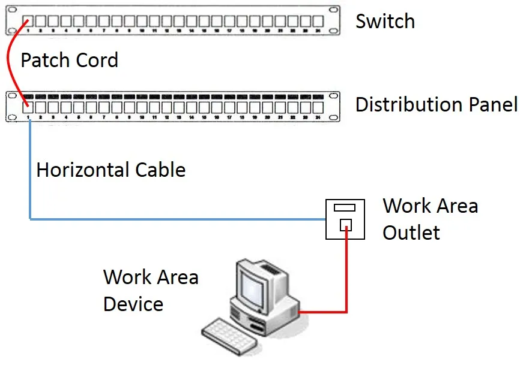
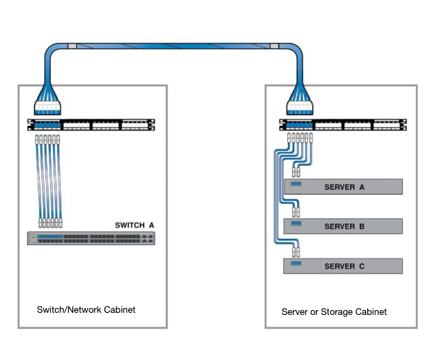
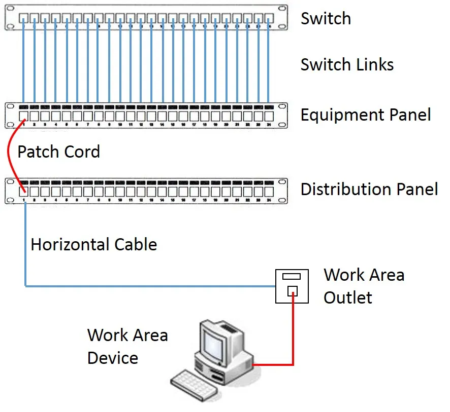
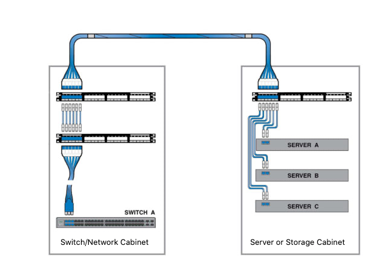
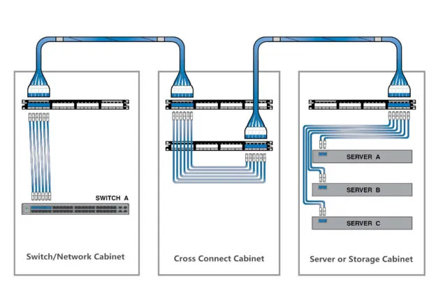

# Что такое Interconnect и Cross-Connect

## Введение

При размещении оборудования и данных в colocation-центре (ЦОД коллективного пользования) на первый план выходят потребности в пространстве и электроэнергии. Однако не менее <mark>важно понимать доступные варианты сетевого взаимодействия</mark>, чтобы ваши клиенты и бизнес-пользователи могли получить доступ к вычислительным ресурсам и хранимым данным. Собственно, сама возможность interconnection с экосистемой сервис-провайдеров внутри конкретного дата-центра — ключевое преимущество colocation. <mark>Существуют две базовые конфигурации соединений между горизонтальной кабельной системой и активным оборудованием (например, коммутаторами): interconnect и cross-connect.</mark>

> **Colocation** — размещение оборудования клиента в дата-центре, принадлежащем третьей стороне, с предоставлением пространства, питания, охлаждения и сетевого подключения.

> **Interconnect** — <mark>физическое или логическое соединение между двумя электронными устройствами или сетями.</mark>

> **Cross-connect** — <mark>физический, жестко подключённый кабель, обеспечивающий прямое соединение между двумя различными точками терминирования (патч-панелями)</mark> внутри дата-центра.

В отличие от корпоративных дата-центров, colocation-центры объединяют сети, интернет-провайдеров (ISP), контент-провайдеров, облачных провайдеров, интернет-обменники (Internet Exchange) и других клиентов или партнёров, с которыми ваша компания может устанавливать соединения. Для оптимизации сети и гибридных архитектур недостаточно знать, какие провайдеры доступны, — нужно понимать детали каждого типа подключения. Ниже описаны наиболее распространённые типы соединений и их ключевые атрибуты.

## Interconnect (взаимосоединение)

> **ISP (Internet Service Provider)** — <mark>интернет-провайдер, организация, предоставляющая доступ к сети Интернет.</mark>

> **Internet Exchange** — интернет-обменный пункт, инфраструктура, где различные сети обмениваются трафиком напрямую.

<mark>Interconnect (в общем смысле) — это физическое или логическое соединение между двумя электронными устройствами или сетями.</mark> Как глагол, «interconnect» означает установить соединение между двумя отдельными электронными сетями. В США термин «interconnection» определяется как «связывание двух или более сетей для взаимного обмена трафиком».

В телекоммуникациях interconnection (двухконнекторный interconnect) — это физическое связывание сети оператора с оборудованием или объектами, не принадлежащими этой сети. Термин может относиться к соединению между объектами оператора и оборудованием его клиента либо к соединению между двумя или более операторами.

<mark>В конструкции interconnect патчинг выполняется напрямую между активным оборудованием и распределительными патч-панелями (Distribution patch panel).</mark> Такая схема быстрее, проще и дешевле в развёртывании, чем cross-connect, и требует меньше стоечного пространства — что важно в коммуникационных помещениях с ограниченным местом. Однако она менее безопасна, так как техникам-патчерам требуется доступ как к активному оборудованию, так и к пассивной патч-зоне.

> **Патчинг** — <mark>процесс коммутации портов с помощью патч-кордов между патч-панелями и активным оборудованием.</mark>

> **Distribution patch panel** — <mark>распределительная патч-панель, пассивное устройство для терминирования горизонтальных кабелей и организации коммутации.</mark>

> **Активное оборудование** — <mark>устройства, требующие электропитания для обработки и передачи сигнала (коммутаторы, маршрутизаторы, серверы).</mark>

**Рис. 1 — Inter Connect Design Model** *(изображение в исходном тексте отсутствует в читаемом виде; вставьте оригинальную схему interconnect здесь)*

Это соединение можно представить на уровне стойки, как показано ниже.

## Cross-Connect (кросс-соединение)

<mark>Cross-connect — это физический, жестко подключённый кабель, обеспечивающий прямое соединение между двумя различными точками терминирования (патч-панелями) внутри дата-центра.</mark> Cross-connect — это физические или виртуальные соединения от одного объекта к другому (между двумя провайдерами).

<mark>В конструкции cross-connect порты коммутатора дублируются на патч-панели оборудования (Equipment patch panel), а патчинг выполняется между патч-панелью оборудования и распределительной патч-панелью.</mark> Коммутационные линки (Switch Links) между активным оборудованием и патч-панелью оборудования могут быть выполнены как одножильным (solid core), так и многожильным (stranded) кабелем — в зависимости от ограничений длины канала или пригодности терминирования патч-панели для многожильных проводников.

> **Equipment patch panel** — патч-панель оборудования, промежуточная панель, на которую дублируются порты коммутатора.

> **Switch Link** — коммутационный линк, кабель между активным оборудованием и патч-панелью оборудования.

> **Patch cord** — патч-корд, гибкий кабель с коннекторами для коммутации портов.

> **Horizontal cable** — горизонтальный кабель, кабельная линия от телекоммуникационной розетки до патч-панели.

> **Work Area Outlet** — розетка рабочей зоны, точка подключения конечного устройства.

**Рис. 2 — Cross-Connect Design Model** *(изображение в исходном тексте отсутствует в читаемом виде; вставьте оригинальную схему cross-connect здесь)*

<mark>Cross-connect традиционно выполнялись на медных кабелях (Cat5e/6 и т.п.), но в последнее время значительная их часть выполняется на оптоволокне для передачи большей пропускной способности.</mark> Варианты cross-connect включают:

- **Fiber** — оптоволокно;
- **Coaxial** — коаксиальный кабель;
- **Copper (CAT5/CAT6)** — медный кабель;
- **POTS** — традиционная телефонная линия (Plain Old Telephone Service).

> **Fiber** — оптоволоконный кабель, передающий данные посредством световых импульсов.

> **Coaxial** — коаксиальный кабель с центральным проводником и экраном.

> **POTS** — Plain Old Telephone Service, традиционная аналоговая телефонная служба.

<mark>В основном существуют два типа cross-connect: трёхконнекторный (three-connector) и четырёхконнекторный (four-connector).</mark>

### Трёхконнекторный cross-connect

На рисунке ниже показана базовая кабельная структура трёхконнекторного cross-connect. Здесь используются три патч-панели RJ45. <mark>Эта структура аналогична упомянутому выше interconnection, только на стороне коммутатора добавлен процесс кросс-соединения.</mark>

**Рис. 3 — Three-connector cross-connect** *(изображение в исходном тексте отсутствует в читаемом виде; вставьте оригинальную схему здесь)*

### Четырёхконнекторный cross-connect

Four-Connector Cross Connect — <mark>более сложная сетевая структура, широко применяемая на практике. Этот тип соединения обычно требует патч-поля (patch field), которым обычно служит отдельный шкаф.</mark> В этом случае два медных транковых кабеля работают как постоянные линии. Патч-корды используются в этом шкафу для подключения устройств. Применяются четыре патч-панели. Для кросс-соединения выделяется отдельный шкаф.

> **Trunk cable** — транковый кабель, магистральный кабель, соединяющий шкафы или зоны.

> **Patch field** — патч-поле, зона коммутации, обычно реализуемая в отдельном шкафу.

**Рис. 4 — Four-Connector Cross Connect** *(изображение в исходном тексте отсутствует в читаемом виде; вставьте оригинальную схему здесь)*

## Почему это называется cross-connect

По сути, это называется cross-connect, потому что это выделенный кабель от одной стойки к другой. Идея в том, что он не проходит через другие сетевые коммутаторы или иные устройства (сокращая число хопов), которые могли бы внести дополнительную задержку, стать единой точкой отказа или создать риск влияния на обслуживание других пользователей.

> **Hop (хоп)** — один переход между сетевыми устройствами на пути пакета.

> **Latency (задержка)** — время прохождения пакета от источника к получателю.

> **Single point of failure** — единая точка отказа, элемент, выход из строя которого нарушает работу всей системы.

## Преимущества и недостатки cross-connect

Кабельная система cross-connect предлагает ряд преимуществ. Самое важное — наличие выделенной зоны патчинга, которая упрощает управление перемещениями, добавлениями и изменениями (moves, adds and changes, MAC). Зона патчинга изолирует критически важное активное оборудование, поэтому риск нарушения работающих каналов при обслуживании патч-панелей снижается. Кроме того, cross-connect к операторам и облачным провайдерам позволяет экономить деньги, повышать надёжность и добавлять гибкость вашей сети.

> **MAC (Moves, Adds and Changes)** — перемещения, добавления и изменения — типовые операции по реконфигурации кабельной системы.

Недостатки: такая конструкция требует больше стоечного пространства и больше кабельных компонентов, а также больше трудозатрат на установку — всё это в сумме даёт более высокую стоимость.

## Итог и стандарты TIA/EIA-568A

В завершение статьи приведу формулировки согласно TIA/EIA-568A:

> **TIA/EIA-568A** — телекоммуникационный стандарт, определяющий структурированные кабельные системы для коммерческих зданий.

- **Cross-connect** — это средство (facility), позволяющее терминировать кабельные элементы и осуществлять их interconnection и/или cross connection, преимущественно с помощью патч-корда или перемычки (jumper).
- **Cross connection** — схема соединения между кабельными линиями, подсистемами и оборудованием с использованием патч-кордов или перемычек, подключаемых к соединительному оборудованию с каждого конца.
- **Interconnection** — схема соединения, использующая соединительное оборудование для прямого подключения кабеля к другому кабелю или к кабелю оборудования без патч-корда или перемычки.

## FAQ

**В чём основное отличие interconnect от cross-connect?**
<mark>Interconnect — прямое подключение активного оборудования к распределительной патч-панели. Cross-connect — подключение через промежуточную патч-панель оборудования, что требует больше компонентов, но даёт лучшую изоляцию и управляемость.</mark>

**Почему cross-connect дороже?**
<mark>Требуется больше стоечного пространства, больше кабельных компонентов (дополнительные патч-панели, патч-корды) и больше трудозатрат на монтаж.</mark>

**Когда выгоднее использовать interconnect?**
Когда пространство ограничено, а требования к безопасности и частоте изменений невысоки — например, в небольших коммуникационных помещениях.

**Что такое трёхконнекторный и четырёхконнекторный cross-connect?**
Трёхконнекторный использует три патч-панели и добавляет кросс-соединение на стороне коммутатора. Четырёхконнекторный сложнее: применяются четыре патч-панели, два транковых кабеля и отдельный шкаф для кросс-соединения.

**Какие типы кабелей используются для cross-connect?**
Оптоволокно, коаксиальный кабель, медный кабель (CAT5/CAT6) и POTS.

**Что означает «сокращение числа хопов» в контексте cross-connect?**
Выделенный кабель идёт напрямую от стойки к стойке, не проходя через промежуточные коммутаторы, что снижает задержку и риск отказа.

**Как TIA/EIA-568A определяет interconnection?**
Как схему соединения, использующую соединительное оборудование для прямого подключения кабеля к другому кабелю или к кабелю оборудования без патч-корда или перемычки.