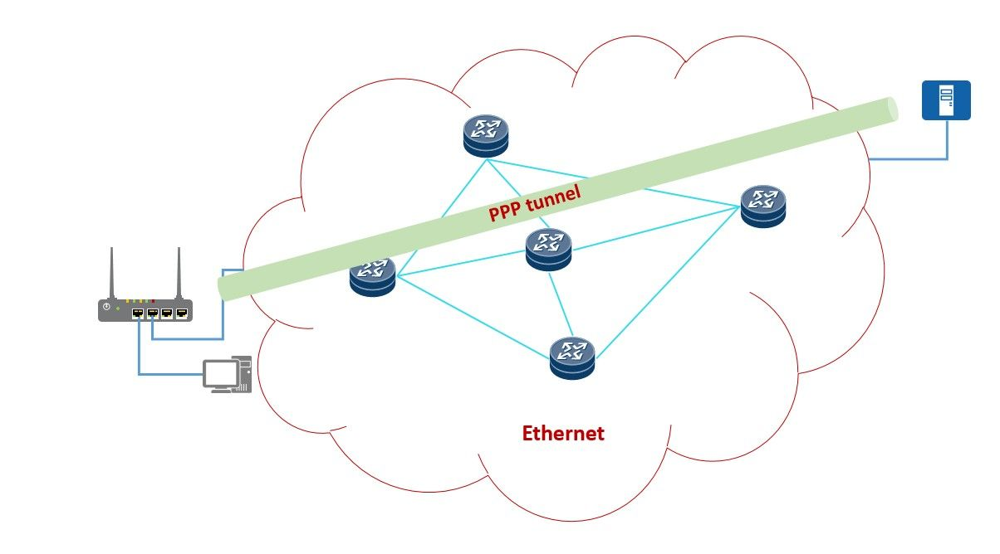
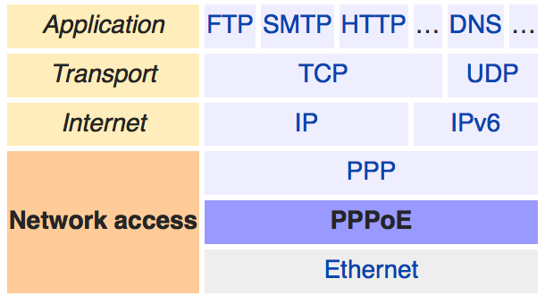
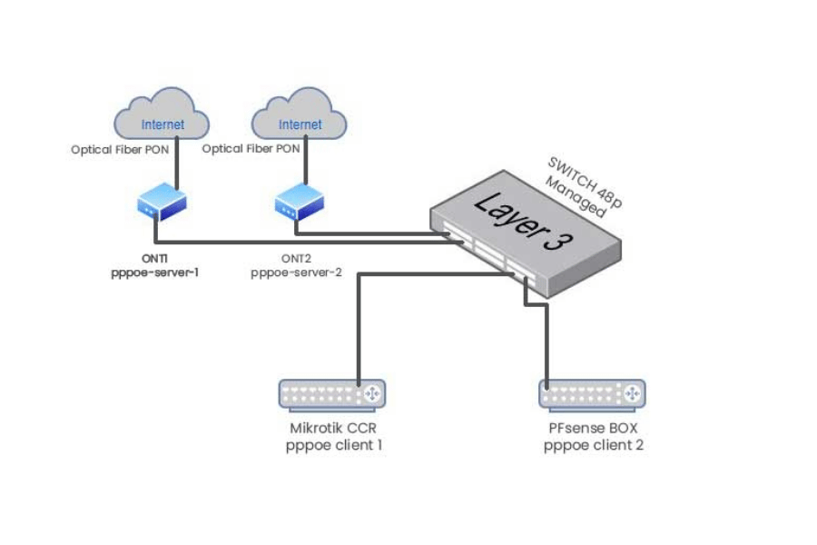
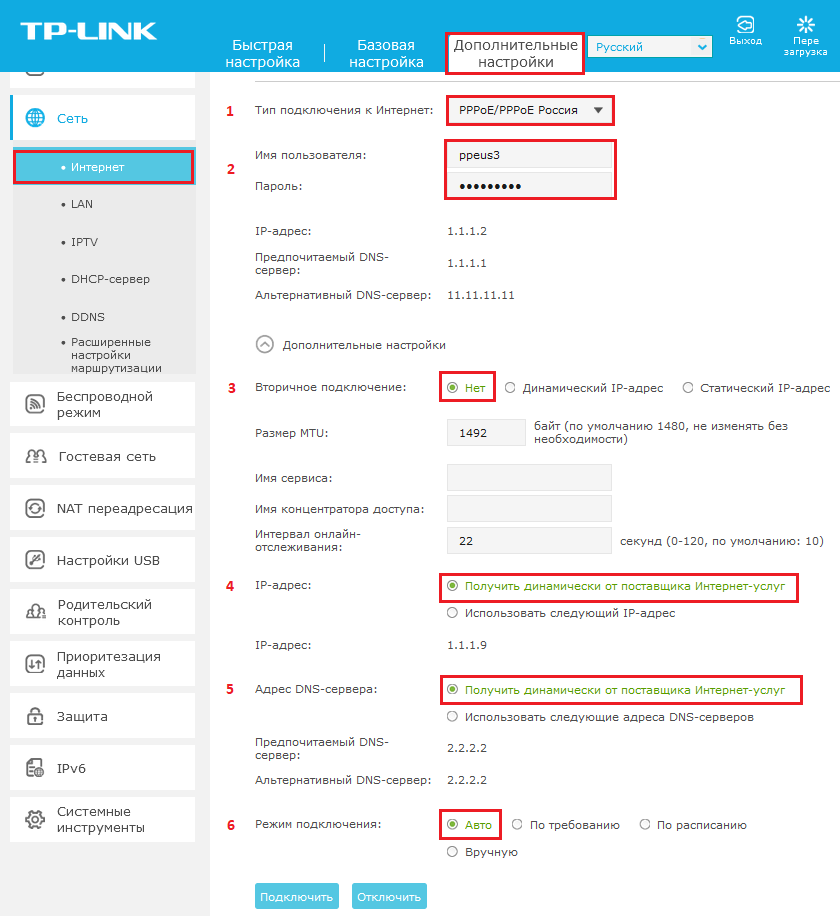

# Протокол PPPoE: полное руководство по настройке, безопасности и интеграции

Поскольку технологии, лежащие в основе сетей, продолжают развиваться, эффективность и надежность остаются основными целями современных систем связи. <mark>Протокол **Point-to-Point Protocol over Ethernet (PPPoE)** все чаще становится стандартной функцией в приложениях высокоскоростной доставки интернета, особенно там, где требуются безопасность и эффективность.</mark> Независимо от того, являетесь ли вы опытным сетевым администратором или ИТ-специалистом начального уровня, понимание деталей конфигурации PPPoE практически обязательно для повышения эффективности сети и обеспечения эффективной передачи данных.

Эта статья — практическое руководство по освоению PPPoE: от основ до пошаговых технических настроек и советов. После прочтения вы сможете реализовать PPPoE с высокой точностью в реальных условиях.

## Содержание

- [Что такое PPPoE и как он работает?](#что-такое-pppoe-и-как-он-работает)
- [PPPoE в сравнении с другими сетевыми протоколами](#pppoe-в-сравнении-с-другими-сетевыми-протоколами)
- [Причина использования PPPoE в современных сетях](#причина-использования-pppoe-в-современных-сетях)
- [Настройка сети для использования PPPoE](#настройка-сети-для-использования-pppoe)
- [Общие параметры и настройки конфигурации](#общие-параметры-и-настройки-конфигурации)
- [Важность DHCP при внедрении PPPoE](#важность-dhcp-при-внедрении-pppoe)
- [В чем разница между PPPoE и VLAN?](#в-чем-разница-между-pppoe-и-vlan)
- [Настройка ретрансляции PPPoE](#настройка-ретрансляции-pppoe)
- [Меры безопасности для сети PPPoE](#меры-безопасности-для-сети-pppoe)
- [FAQ](#частые-вопросы-faq)

---

# Что такое PPPoE и как он работает?

## Понимание основ PPPoE

> **PPPoE** — <mark>это аббревиатура Point-to-Point Protocol over Ethernet, сетевой протокол, используемый для инкапсуляции многопротокольных блоков данных в сетях Ethernet, особенно во время установления сеанса PPPoE.</mark>

> **Инкапсуляция** — <mark>это процесс помещения пакетов одного протокола в пакеты другого протокола для передачи через несовместимые сети.</mark>

<mark>PPPoE обычно используется для широкополосного доступа в Интернет с целью упрощения связи между поставщиком услуг и конечным пользователем. Поставщики услуг могут аутентифицировать пользователей, назначать IP-адреса и предоставлять несколько услуг по одной и той же среде передачи с помощью PPPoE, гарантируя безопасную и эффективную связь.</mark>

## PPPoE в сравнении с другими сетевыми протоколами

<mark>PPPoE предоставляет уникальные преимущества по сравнению с другими распространенными сетевыми протоколами</mark>, такими как **DHCP** и **IPoE**, особенно в случаях строгой аутентификации пользователей и контроля пропускной способности.

> **DHCP (Dynamic Host Configuration Protocol)** — протокол динамической конфигурации хоста, автоматически назначающий IP-адреса устройствам в сети без аутентификации.

> **IPoE (Internet Protocol over Ethernet)** — протокол передачи IP непосредственно поверх Ethernet без дополнительной инкапсуляции, обладающий лучшей масштабируемостью.

Например, в отличие от DHCP, который предлагает IP-адреса без какой-либо аутентификации, PPPoE использует надежные методы аутентификации пользователей через **PAP** или **CHAP**.

> **PAP (Password Authentication Protocol)** — протокол аутентификации по паролю, передающий учётные данные в открытом виде.

> **CHAP (Challenge-Handshake Authentication Protocol)** — протокол аутентификации с предварительным запросом и периодической проверкой, использующий шифрование.

Благодаря этому доступ к широкополосным услугам лучше регулируется с помощью PPPoE. <mark>Кроме того, PPPoE позволяет интернет-провайдерам (ISP) точно взимать плату и предоставлять услуги на основе информации о сеансе конкретного пользователя.</mark>

В отличие от IPoE, PPPoE обеспечивает улучшенную архитектуру, ориентированную на соединение, которая позволяет лучше контролировать пользовательские соединения. Однако <mark>PPPoE может генерировать накладные расходы на инкапсуляцию, что приводит к повышению неэффективности пакетов данных. Это особенно актуально в высокоскоростных сетях, где время имеет существенное значение.</mark>

<mark>Последние статистические данные по отрасли показывают, что PPPoE популярен в широкополосном доступе в жилых помещениях, особенно в районах, обслуживаемых DSL или оптоволокном.</mark> В регионах, где нормой является сеансовый аутентифицированный доступ, PPPoE продолжает широко использоваться в соответствии с требованиями интернет-провайдеров или нормативными требованиями. Многие городские и корпоративные сети выбирают IPoE из-за улучшенной масштабируемости и упрощенной архитектуры при обслуживании приложений с высокой пропускной способностью. Между тем <mark>PPPoE по-прежнему актуален для предоставления защищенных, настраиваемых услуг с контролируемым распределением ресурсов.</mark>

## Причина использования PPPoE в современных сетях

PPPoE остается актуальным даже в современном мире, поскольку обеспечивает авторизованный аутентифицированный доступ к Интернету. Он полезен для интернет-провайдеров с точки зрения бизнеса, так как обеспечивает надежный контроль на уровне пользователя и сеанса, а также подробный аудит использования политики для клиентского PPPoE. Эта функция делает его подходящим для случаев, когда необходимы индивидуально разработанные услуги, такие как широкополосный доступ в домах и сети небольших офисов. Более того, <mark>PPPoE предоставляет простые и эффективные средства управления полосой пропускания для всех пользователей, гарантируя равномерное распределение ресурсов и надежную производительность.</mark>

---

# Настройка сети для использования PPPoE

## Установка PPPoE с маршрутизатором

1. **Учетные данные для входа.** Имя пользователя и пароль по умолчанию для доступа к странице входа в систему — это значение по умолчанию маршрутизатора `192.168.1.1` или `192.168.0.0`. Введите его в строку ссылок и получите доступ к веб-сайту. Заполните данные администратора, чтобы разблокировать его функции.
2. **Перейдите в настройки WAN или Интернета.** Выберите параметры, в которых указано «WAN», «Интернет» или «Сеть».
3. **Измените метод подключения WAN на PPPoE.** Перейдите в главное меню пользователя и найдите метод подключения WAN, измените его на «PPPoE».
4. **Введите имя пользователя и пароль, предоставленные интернет-провайдером.** Убедитесь, что идентификатор интернет-провайдера дважды проверен.
5. **Отключитесь от Интернета или сохраните конфигурации.** Нажмите, чтобы сохранить и установить. Сбросьте настройки маршрутизатора, чтобы задействовать настройки для некоторых маршрутизаторов, и включите «сухое применение» для других — это означает, что не подключайте Ethernet во время фазы тестирования.
6. **Выполните проверку соединения.** После входа в систему проверьте монитор подключений на маршрутизаторе, чтобы определить активность подключения. Если поле PPPoE активно — значит, он работает; если нет — проверьте установленные учетные данные и дважды проверьте у интернет-провайдера.

## Общие параметры и настройки конфигурации

Основные параметры, на которые следует обратить внимание при настройке соединения PPPoE:

- **Имя пользователя и пароль.** Пароль и имя пользователя, предоставленные провайдером, должны быть введены правильно и точно так, как указано, чтобы избежать сбоя аутентификации. Каждые учётные данные уникальны для каждого пользователя и специально адаптированы для соединений PPPoE.
- **Имя службы.** Некоторые интернет-провайдеры предпочитают, чтобы в конфигурацию устройства было введено определённое «Имя службы». Если оставить значение пустым, оно будет установлено на общий запрос на подключение по умолчанию. Уточните у своего интернет-провайдера, требуется ли определённое имя службы.
- **VLAN ID.** Некоторые интернет-провайдеры определяют тегирование VLAN, которое требует настройки VLAN ID. Например, ряд оптоволоконных сетей работает через VLAN 10, хотя у других провайдеров есть много исключений.

> **VLAN ID** — идентификатор виртуальной локальной сети, используемый для логического разделения трафика внутри физической сети.

- **MTU (Максимальная единица передачи).** Общее значение MTU в PPPoE составляет 1492 байта. Вам следует заменить это значение на значение, выданное вашим интернет-провайдером, если фрагментация является проблемой с большими размерами пакетов.

$$ \text{MTU}_{\text{PPPoE}} = 1492 \text{ байта} $$

- **Способы подключения.** Наиболее распространенные режимы: «Всегда включен», «По требованию» и «Ручной». Большинство пользователей предпочитают режим «Всегда включен» для поддержания стабильного соединения; другие режимы могут использоваться для сокращения времени подключения или используемой пропускной способности.
- **DNS-серверы.** Если они не используются, настройки DNS-сервера могут быть доступны через интернет-провайдера автоматически. Для большего контроля пользователи могут настраивать свои DNS-серверы, например Google (`8.8.8.8` и `8.8.4.4`) или Cloudflare (`1.1.1.1`).
- **Конфигурация IP-адреса.** Подключения PPPoE могут использовать динамический IP (автоматически назначаемый провайдером) или статический IP (предварительно назначаемый провайдером). Если предлагаются статические IP, их необходимо настроить с маской подсети, шлюзом и адресами DNS.

Для обеспечения хорошей производительности при подключении PPPoE эти пункты следует изменить. Следуйте всем указаниям, предоставленным вашим интернет-провайдером, и проверьте параметры подключения после настройки.

---

# Важность DHCP при внедрении PPPoE

## Более подробный обзор протокола динамической конфигурации хоста

> **DHCP (Dynamic Host Configuration Protocol)** — протокол динамической конфигурации хоста, автоматизирующий назначение IP-адресов устройствам, подключённым к сети.

<mark>DHCP играет важную роль в автоматизации конфигурации сети в среде PPPoE. Он динамически выделяет IP-адреса из предопределенного пула, гарантируя эффективное использование доступных адресов и снижая вероятность конфликтов. Такая автоматизация повышает гибкость и простоту управления.</mark>

## Объединение DHCP с PPPoE

<mark>Это слияние позволяет пользователям извлекать выгоду из возможности динамического распределения IP-адресов вместе с аутентификацией и контролем сеансов PPPoE, что расширяет функциональные возможности сетевого администрирования. Это особенно выгодно для интернет-провайдеров и сетевых администраторов, контролирующих среды высокой плотности.</mark>

При совместном использовании DHCP автоматизирует назначение IP-адресов из установленного пула, когда устройства инициируют соединения PPPoE. В PPPoE учётные данные пользователя проверяются в процессе аутентификации перед установлением соединения, тогда как при использовании DHCP каждому устройству назначается IP-адрес автономно. Этот метод сводит к минимуму вероятность конфликтов дублирующих IP-адресов и высокоэффективен при распределении адресов — что <mark>действительно важно в сценариях с небольшим пулом IP-адресов, например в сетях IPv4.</mark>

<mark>Новые данные показывают, что в широкополосных системах широко используется совместное использование DHCP-PPPoE.</mark> Интернет-провайдеры, использующие эту интеграцию, фиксируют более низкие показатели отказов клиентских соединений, поскольку эти протоколы работают вместе безупречно. Способность DHCP динамически выдавать IP-адреса в аренду, а также чёткий контроль PPPoE над сеансами пользователей приводят к повышению эффективности использования полосы пропускания и улучшению производительности сети.

Для достижения этой интеграции приоритетной задачей администратора является настройка DHCP-сервера для правильной связи с PPPoE-сервером. Это означает настройку включения агентов DHCP-ретрансляции в среде PPPoE, настройку областей подсетей и определение параметров диапазона IP-адресов. <mark>Большинство маршрутизаторов и сетевых устройств сегодня готовы к использованию с DHCP и PPPoE, что исключает необходимость специализированной настройки.</mark>

В конечном итоге объединение DHCP с PPPoE улучшает современные сети, повышая их эффективность и масштабируемость, а также обеспечивая лучшее управление для жилых и корпоративных сетей.

## Контроль назначения IP-адресов

Назначение IP-адресов можно автоматизировать с помощью DHCP. DHCP обеспечивает динамическое распределение IP-адресов, что минимизирует конфликты и повышает эффективность. Статическое назначение позволяет администратору устанавливать фиксированные IP-адреса для определённых сетевых устройств, таких как принтеры или серверы. Для сохранения целостности сети важно отслеживать статические и зарезервированные адреса, а также регулярно проверять оставшиеся диапазоны распределения, чтобы убедиться в отсутствии перекрытий или исчерпания.

---

# В чем разница между PPPoE и VLAN?

## Краткое введение в VLAN

> **VLAN (Virtual Local Area Network)** — <mark>виртуальная локальная сеть, позволяющая разделить физическую сеть на несколько логических сетей.</mark>

Разделение физической сети на несколько логических сетей становится возможным благодаря VLAN. Например, даже если множество устройств физически не подключены к одному коммутатору, наличие одной и той же VLAN позволяет им взаимодействовать, что значительно упрощает передачу PPPoE-пакетов через PPPoE-ретранслятор. VLAN-сети на уровне хостов повышают эффективность сети за счёт уменьшения широковещательного трафика и повышения безопасности путём изоляции конфиденциальной информации определёнными группами устройств. Сетевые администраторы могут оптимизировать распределение ресурсов и минимизировать помехи между сегментами VLAN.

## Конфигурации PPPoE и VLAN

Конфигурации VLAN и PPPoE выполняют различные функции в сети:

- **Конфигурация PPPoE** используется для прямого соединения клиентского устройства с поставщиком интернет-услуг (ISP). Её основная роль — инкапсуляция сетевого трафика с поддержкой аутентификации и шифрования, что делает её идеальной для предоставления доступа в Интернет другим пользователям.
- **Конфигурация VLAN** служит для разделения физической сети на многочисленные изолированные логические сети. Эти конфигурации управляют эффективностью, безопасностью и масштабируемостью сети.

PPPoE управляет подключением к внешнему миру, тогда как VLAN нацелены на структурирование и оптимизацию внутренней сети. Выберите PPPoE, если цель — контролировать управление внешним подключением; выбирайте VLAN, если необходимо реализовать CIDR и контроль доступа.

> **CIDR (Classless Inter-Domain Routing)** — бесклассовая междоменная маршрутизация, метод распределения IP-адресов и маршрутизации.

## Эффективность за счёт интеграции PPPoE и VLAN

Объединение PPPoE с VLAN обеспечивает практичность как внешнего соединения, так и внутренней сетевой нарезки. Это облегчает многопользовательские сценарии, корпоративные сети и сети ISP, где контроль трафика и защита становятся всё более важными.

Смягчение несанкционированного трафика и векторов атак может быть достигнуто с помощью VLAN, что позволяет логически разделить различные наборы пользователей или устройств. Например, корпоративные отделы кадров, ИТ и финансов могут быть выделены в отдельные VLAN, чтобы предотвратить передачу конфиденциальной информации, одновременно повышая общую производительность сети. В свою очередь, с помощью PPPoE каждая VLAN может получить контролируемое и аутентифицированное зашифрованное соединение с внешними сетями.

Использование VLAN повышает эффективность пакетов PPPoE на стороне клиента, что достигается недавней разработкой внедрения PPPoE через VLAN-тегированные действия в крупных сетях. В сетях ISP VLAN обычно указывают помещения клиентов. Каждому клиенту назначается уникальный идентификатор VLAN, что позволяет PPPoE индивидуально управлять подключением к Интернету для каждого клиента через их соответствующие VLAN. Этот метод гарантирует надлежащий мониторинг и контроль для отслеживания полосы пропускания, выставления счетов и политик доступа.

Согласно некоторым отчётам, сети, использующие эти технологии, продемонстрировали улучшение коэффициентов доставки пакетов и снижение задержек при увеличении использования пакетов PPPoE. Комбинированное использование VLAN для сегментации трафика и сессионного управления PPPoE повышает масштабируемость, поскольку новые сегменты или соединения можно легко добавлять без вмешательства в существующую систему.

---

# Настройка ретрансляции PPPoE

## Конфигурация реле PPPoE для максимальной эффективности

Для оптимальной настройки PPPoE Relay следуйте этим инструкциям:

1. **Убедитесь, что есть сегментация VLAN.** Эффективно сегментируйте трафик с помощью VLAN для эффективной передачи информации, повышения производительности и безопасности для различных типов трафика.
2. **Включите реле для PPPoE.** Включите реле PPPoE на маршрутизаторе или коммутаторе. Оно должно быть совместимо с топологией сети и иметь возможность выполнять необходимые функции пересылки пакетов между клиентами и сервером.
3. **Отслеживайте потребление полосы пропускания.** Мониторьте используемую полосу пропускания в сетях VLAN и сеансах PPPoE, чтобы эффективно использовать доступные ресурсы и избегать узких мест.
4. **Установите новую прошивку устройства.** Замените старую прошивку на более новые версии, чтобы расширить сетевые возможности и избежать снижения производительности с течением времени.
5. **Проверьте конфигурацию.** После настройки проведите тесты производительности. Проверьте, работает ли система гладко, доставляет ли данные так, как ожидалось, и имеет ли низкую задержку.

Эти шаги помогут вам достичь эффективного и безопасного PPPoE Relay, который может работать без сбоев. Убедитесь, что все пользователи с установленным программным обеспечением клиента PPPoE настроены соответствующим образом.

## Анализ данных на реле PPPoE

Пакеты на PPPoE Relay представляют собой мельчайшие фрагменты информации, которыми обмениваются клиенты и серверы. Ретранслятор управляет пакетами, сначала считывая отдельные заголовки для сбора информации о сеансе и маршрутизируя данные соответствующим образом. Каждый пакет состоит из обязательных элементов, таких как заголовок и `PPPoE`. Инкапсулированные данные и идентификаторы сеанса хранятся в полезной нагрузке. Ретрансляторы получают пакеты и отправляют их по назначению, используя теги VLAN, MAC-адреса или идентификаторы сеанса PPP в зависимости от конфигурации. Протоколы маршрутизации и соответствующая обработка минимизируют потерю данных, задержки передачи и потери пакетов, поддерживая при этом надлежащие сетевые соединения.

## Решение распространённых проблем с системами ретрансляции PPPoE

При решении проблем, связанных с функционированием реле PPPoE, выполните следующие действия:

1. **Проверьте согласованность конфигурации.** Все параметры конфигурации VLAN инфраструктуры и PPPoE-реле, включая теги VLAN и идентификаторы сеансов, должны быть настроены для каждой сети. Неправильно настроенные сети могут привести к неправильной маршрутизации пакетов, разрыву соединений и т. д.
2. **Проверьте физические соединения.** Кабели, порты и оборудование должны быть проверены, а их соединения — убедиться, что порты включены и работают. Некоторые неисправные соединения могут нарушить часть потока данных.
3. **Анализ передачи пакетов.** Используйте программы захвата пакетов, которые будут отслеживать поток пакетов PPPoE для проверки на наличие повреждённых, отсутствующих или неправильно форматированных пакетов.
4. **Просмотрите журналы и сообщения об ошибках.** Системные и релейные журналы должны быть тщательно проверены и содержать коды ошибок. Многие из этих журналов могут точно определить проблему, такую как сбои аутентификации или тайм-ауты из-за отсутствия активности.
5. **Убедитесь, что прошивка/программное обеспечение обновлены.** Всегда проверяйте релейные устройства и убедитесь, что их прошивка или программное обеспечение последней версии. Большинство обновлений устраняют известные ошибки и добавляют улучшения.

Выполнив эти шаги, можно эффективно решить основные проблемы с ретрансляцией PPPoE и минимизировать время простоя сети.

---

# Меры безопасности для сети PPPoE

## Методы аутентификации для PPPoE

Доступ к сетям PPPoE основан на строгих методологиях аутентификации, которые обеспечивают безопасность:

- **PAP (Password Authentication Protocol)** — наиболее широко используемый подход, использующий простую аутентификацию имени пользователя и пароля.
- **CHAP (Challenge-Handshake Authentication Protocol)** — более безопасный вариант, использующий зашифрованную аутентификацию и периодическую проверку для предотвращения несанкционированного доступа.

Реализация этих методов аутентификации гарантирует, что только авторизованные пользователи смогут воспользоваться преимуществами сети PPPoE, что сохраняет целостность сети и предотвращает нарушения.

## Обеспечение безопасного доступа в Интернет

Получение безопасного доступа в Интернет в сети PPPoE требует внедрения нескольких подходов:

- **Брандмауэр.** Надёжный брандмауэр служит барьером для сети PPPoE от внешних источников, защищая клиентские пакеты. Брандмауэры определяют трафик, который может попасть в сеть, используя набор предопределённых правил безопасности.
- **Шифрование данных.** IPSec и SSL/TLS — одни из самых популярных протоколов шифрования, гарантирующих, что данные не будут прочитаны злонамеренными пользователями через соединение PPPoE.

> **IPSec (Internet Protocol Security)** — набор протоколов для защиты IP-соединений путём аутентификации и шифрования каждого пакета.

> **SSL/TLS** — протоколы шифрования транспортного уровня, обеспечивающие защищённую передачу данных.

- **Надёжные пароли.** Безопасность повышается за счёт использования надёжных паролей конечных точек, которые часто обновляются, а также для регистрации сетевой аутентификации.
- **Обновления и исправления.** Обновления программного обеспечения маршрутизаторов и подключённых устройств являются главным приоритетом для новых появляющихся уязвимостей. Сегодня около 60% нарушений происходят из-за отсутствия обновлений для устройств.
- **Многофакторная аутентификация (MFA).** Добавление MFA обеспечивает ещё один шаг проверки, значительно снижая вероятность несанкционированного доступа.

> **MFA (Multi-Factor Authentication)** — многофакторная аутентификация, требующая несколько независимых способов подтверждения личности.

- **IDPS.** Использование IDPS для отслеживания активности в сети позволяет противодействовать изменениям в среде для любых возможных угроз. Эти системы также могут анализировать поведение трафика.

> **IDPS (Intrusion Detection and Prevention System)** — система обнаружения и предотвращения вторжений.

## Рекомендуемые стратегии защиты сеансов PPPoE

1. **Включить шифрование.** Предотвратите несанкционированный доступ, шифруя передачу данных с помощью IPSec или SSL/TLS.
2. **Применить обновления программного обеспечения.** Защитите маршрутизаторы и другие подключённые устройства от несанкционированного доступа, регулярно устраняя известные уязвимости.
3. **Использовать сильные пароли.** Чаще меняйте сложные пароли на уникальные, чтобы снизить вероятность взлома.
4. **Внедрить многофакторную аутентификацию (MFA).** Предоставление второго этапа проверки для доступа к конфиденциальным доменам повышает уровень безопасности.
5. **Мониторинг сетевой активности.** Выявляйте и противодействуйте подозрительным действиям в режиме реального времени с помощью инструментов IDPS.

---

# Частые вопросы (FAQ)

**В: Что такое протокол Point-to-Point Protocol over Ethernet, также известный как PPPoE? Дайте подробное объяснение его значимости.**

**О:** PPPoE означает Point-to-Point Protocol over Ethernet — сетевой протокол, который интегрирует кадры PPP в кадры Ethernet. Методологии аутентификации, шифрования и сжатия, которые можно реализовать в сетях Ethernet, приводят к широкому использованию PPPoE для удалённого доступа, заказа широкополосных услуг доступа — экономично и безопасно.

---

**В: Каков процесс обнаружения PPPoE?**

**О:** Обнаружение конечной точки для PPP через Ethernet (PPPoE) — обязательный шаг при настройке сеанса. Он состоит из четырёх шагов:

1. Отправка **PADI** (PPPoE Active Discovery Initiation) клиентом.
2. Отправка **PADO** (PPPoE Active Discovery Offer) сервером-ответчиком.
3. Отправка **PADR** (PPPoE Active Discovery Request) клиентом.
4. Отправка **PADS** (PPPoE Active Discovery Session-confirmation) сервером.

Этот процесс также пытается получить Ethernet MAC удалённого сервера PPPoE и возвращает идентификатор сеанса PPPoE.

---

**В: Как устранить неполадки с подключением PPPoE?**

**О:** Следующие шаги помогут решить проблемы при подключении PPPoE:

1. Проверьте, что физические соединения не повреждены.
2. Проверьте данные, используемые для инициирования сеанса PPPoE.
3. Перезагрузите модем и маршрутизатор.
4. Проверьте на маршрутизаторе, активен ли PPPoE.
5. Проверьте версию драйвера устройства.
6. Проверьте, работают ли службы интернет-провайдера.
7. Проверьте и соберите пакеты PPPoE.
8. Обратитесь за помощью к поставщику услуг, если эти методы не устраняют проблемы.

---

**В: Что такое теги поставщика в PPPoE и как они используются?**

**О:** Специфичные для поставщика теги в PPPoE — это дополнительные поля, в которые можно поместить дополнительные данные. Пользовательская информация, такая как идентификатор цепи клиента или удалённый идентификатор, может передаваться между клиентом и сервером. Это позволяет поставщикам использовать пользовательские функции, такие как маркировка линий для идентификации, применение политик качества обслуживания или различные способы аутентификации пользователей, повышая гибкость и общую производительность соединений PPPoE.

---

**В: Как настроить PPPoE на интерфейсе LAN?**

**О:** Для настройки PPPoE на интерфейсе LAN:

1. Измените требуемые параметры на маршрутизаторе.
2. Перейдите в раздел LAN на вкладке.
3. Выберите интерфейс, на котором вы хотите включить PPPoE.
4. Заполните учётные данные для PPPoE: имя пользователя, пароль, тип аутентификации.
5. Настройте IP-адрес для интерфейса PPPoE.
6. Задайте параметры маршрутизации, если требуется.
7. Сохраните и примените необходимые изменения.

Обратите внимание, что эти шаги не одинаковы для каждой модели маршрутизатора.

---

**В: Для какой цели служит пакет PADT в PPPoE?**

**О:** Пакет **PADT** (PPPoE Active Discovery Terminate) используется для завершения сеанса PPPoE. Он может быть выдан как клиентом, так и сервером для указания на закрытие сеанса. Когда пакет PADT получен на обоих концах, соединение должно быть немедленно разорвано, а все связанные с ним ресурсы — освобождены. Это гарантирует правильное отключение и помогает поддерживать порядок в сети.

---

**В: Как можно реализовать контроль доступа PPPoE с помощью сервера RADIUS?**

**О:** Для реализации контроля доступа PPPoE с помощью сервера RADIUS:

1. Введите имена пользователей и пароли и определите политики на сервере RADIUS.
2. Включите аутентификацию RADIUS на сервере PPPoE или маршрутизаторе.
3. Настройте IP-адрес и общий секретный ключ сервера RADIUS.
4. Настройте PPPoE для обеспечения аутентификации и авторизации с использованием RADIUS.
5. Настройте все неиспользуемые атрибуты и политики, включённые RADIUS, для принудительного применения.
6. Проверьте настройку, чтобы убедиться, что она аутентифицирует и контролирует доступ, как и предполагалось.

> **RADIUS (Remote Authentication Dial-In User Service)** — протокол для централизованной аутентификации, авторизации и учёта (AAA) удалённых пользователей.

---

**В: Что такое интерфейсы группы агрегации PPPoE и как они настраиваются?**

**О:** Группа агрегации PPPoE — это набор интерфейсов, настроенных для взаимного управления заданным количеством процессов PPPoE. Чтобы настроить группу агрегации PPPoE:

1. Создайте отдельную группу смешивания.
2. Назначьте ей порты-члены.
3. Установите аутентификацию и ограничения.
4. Назначьте все необходимые политики QoS.
5. Сохраните эти настройки.

Это полезно для управления многими сеансами PPPoE, работающими на разных интерфейсах.

---

# Справочные источники

*Источники в оригинальном тексте не указаны.*

# Похожие статьи

- Что такое PPPoE и как он работает?
- Понимание основ PPPoE
- PPPoE в сравнении с другими сетевыми протоколами