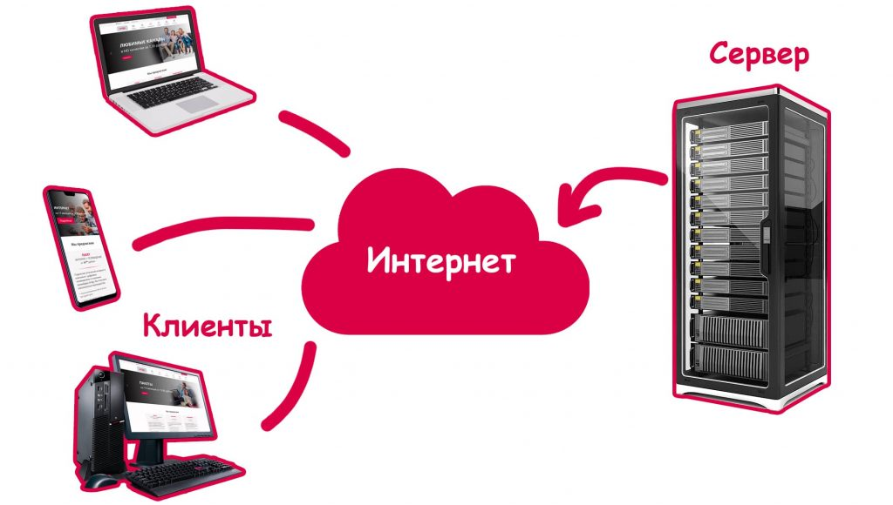
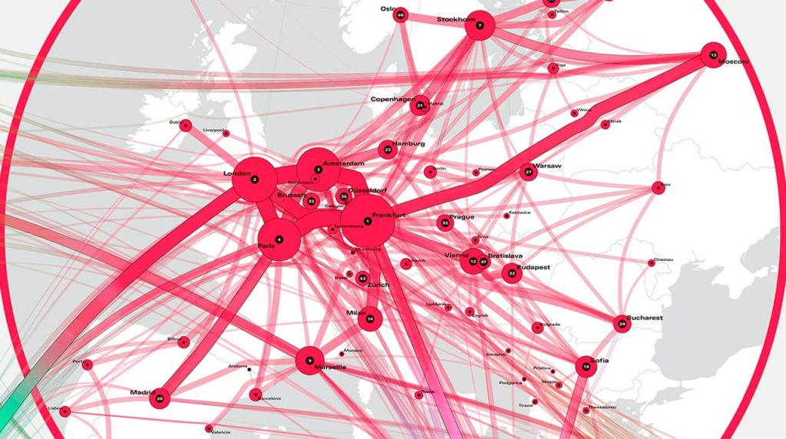
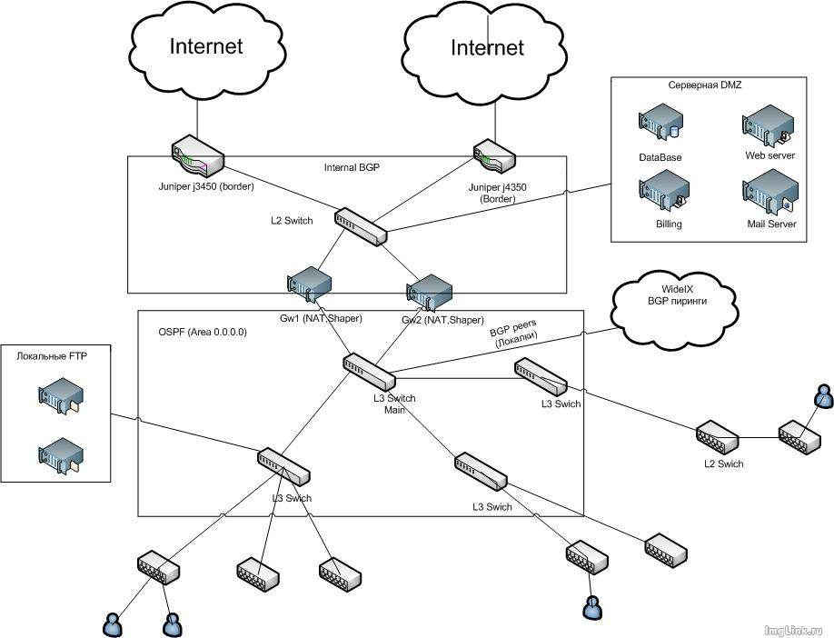

# Как работает интернет и сеть провайдера

Ниже — объединённый технический текст, собранный из двух исходников: общая модель интернета и логическая архитектура сети провайдера. Термины определяются при первом упоминании в логическом блоке, структура сохранена, формулы и ссылки на изображения — на месте.

---

## 1. Термины и определения

> Интернет — глобальная сеть взаимосвязанных компьютеров и других устройств, в которой одни узлы отправляют запросы, а другие отвечают на них.

> Клиент — устройство конечного пользователя (смартфон, планшет, ноутбук, ПК, умная колонка, телевизор), которое запрашивает информацию из сети.

> Сервер — вычислительная машина, предназначенная для хранения и передачи информации клиентским устройствам.

> Бэкбон (магистральный канал) — высокопропускной канал связи, соединяющий континенты, страны и города через крупнейшие узлы обмена трафиком.

> Маршрутизатор (роутер) — устройство, которое пересылает пакеты данных между сетями и раздаёт подключение устройствам.

> Провайдер — оператор связи, предоставляющий абонентам доступ в интернет.

> BGP (Border Gateway Protocol) — протокол динамической маршрутизации, используемый для обмена маршрутами между автономными системами, в том числе с магистральными операторами.

> Автономная система (AS) — совокупность сетей и маршрутизаторов под единым техническим управлением, имеющая собственный номер и политику маршрутизации.

> Ядро сети — центральная часть сети провайдера, где выполняются маршрутизация, NAT, шейпинг и биллинг.

> NAT (Network Address Translation) — механизм преобразования сетевых адресов, позволяющий множеству клиентов выходить в интернет через ограниченное число публичных IP-адресов.

> Шейпер (shaper) — устройство или программный модуль, ограничивающий скорость передачи данных для соблюдения тарифного плана.

> RADIUS-сервер — сервер авторизации, аутентификации и учёта (AAA), используемый для управления доступом абонентов.

> Биллинг — система учёта потреблённых услуг и расчёта платежей абонентов.

> OSPF (Open Shortest Path First) — протокол динамической маршрутизации, применяемый внутри сети провайдера для обмена внутренними и пиринговыми маршрутами.

> Уровень распределения (агрегация) — уровень сети, на котором коммутаторы квартала или района агрегируют трафик домовых сетей.

> Уровень доступа (access) — уровень сети, на котором домовые коммутаторы подключают конечных клиентов.

> VLAN (Virtual Local Area Network) — виртуальная локальная сеть, логически разделяющая устройства на одном физическом оборудовании.

> IGMP snooping — функция коммутатора, ограничивающая распространение multicast-трафика только тем портам, где есть заинтересованные получатели.

---

## 2. Что такое интернет и как он устроен

Если очень грубо, интернет — это огромное количество компьютеров, объединённых в одну сеть. Один компьютер отправляет запрос, другой на него отвечает. Весь интернет складывается из бесконечных запросов и ответов: ваш компьютер запросил информацию, другой ответил, а вы увидели нужный результат.

Все устройства в сети делятся на клиентские и серверные.

- **Клиентские** — смартфоны, планшеты, нетбуки, ноутбуки, умные колонки, персональные компьютеры и некоторые телевизоры.
- **Серверные** — такие же вычислительные машины, но предназначенные для передачи информации клиентским. Внешне это большие металлические ящики с мощными процессорами, большим объёмом оперативной памяти и жёсткими дисками.

**Примерная схема.**

---

## 3. Аналогия с кровеносной системой

От аорты кровь идёт в крупные артерии, затем в венозные сосуды и так до тончайших капилляров. Аналогично устроен интернет.

Основа — гигантские магистральные каналы (**бэкбоны**), соединяющие континенты, страны и города с крупнейшими узлами во Франкфурте, Лондоне, Амстердаме, Париже и Сингапуре. От них кабели прокладываются к интернет-провайдеру, провайдер прокладывает кабель поменьше до вашего района, размещает в одном из домов распределительный маршрутизатор и протягивает провода к соседним домам.

**Вот так выглядят интернет-магистрали (бэкбоны).**

---

## 4. Путь провода до вашего устройства

<mark><strong>Провод оказался в вашем доме — что дальше? В подвале или на крыше устанавливается маршрутизатор, из него провод попадает в квартиру в роутер, который раздаёт Wi-Fi на все ваши устройства.</strong></mark>

Практически всегда подключение к интернету выглядит так:

$$
\text{магистральный канал (бэкбон)} \rightarrow \text{городской узел} \rightarrow \text{интернет-провайдер} \rightarrow \text{районный маршрутизатор} \rightarrow \text{маршрутизатор в доме} \rightarrow \text{квартирный роутер} \rightarrow \text{ваше устройство}
$$

Как видим, интернет — это не просто облачко с фильмами, музыкой и котиками, а огромная сеть серверов, кабелей, проводов и маршрутизаторов, соединяющая всю планету.

---

## 5. Как устроена сеть провайдера

Многие задаются вопросом, как устроена сеть провайдера или как строить сеть самостоятельно. Ниже — пример логической архитектуры сети. Структура не претендует на идеальность: истина в том, что «спроси у двух провайдеров, как строить сеть, — получишь три разных варианта».

Типичная сеть передачи данных состоит из **четырёх уровней** (хотя некоторые говорят о трёх).

### 5.1. Уровень 1 — граница сети (бордер)

Это стык с другими операторами. На этом уровне ведётся работа с магистральными операторами, у которых берётся интернет, и с операторами-клиентами, которым интернет предоставляется. В 90% случаев взаимодействие осуществляется через протокол динамической маршрутизации **BGP**.

### 5.2. Уровень 2 — ядро сети

В ядро входят:

- биллинг;
- RADIUS-сервер;
- центральные коммутаторы, куда подключено всё оборудование;
- NAT;
- шейперы, которыми нарезается полоса клиенту.

Резать полосу можно и на порту управляемого коммутатора, но тогда локальные ресурсы тоже будут работать на тарифной скорости. Задача же — предоставить тарифную скорость в интернет и до 100 Мбит/с внутри своей сети.

Взаимодействие между оборудованием обычно происходит через протоколы динамической маршрутизации: BGP (в этом случае внутренний BGP) или OSPF. Есть и приверженцы статических маршрутов.

### 5.3. Уровень 3 — распределение (агрегация)

Сюда входят управляемые коммутаторы 2-го или 3-го уровня квартала или района — в зависимости от внутреннего устройства сети. В рассматриваемом случае ставятся коммутаторы 3-го уровня, иногда дополняемые коммутатором 2-го уровня: при схеме VLAN на дом не стоит «разгребать» домовые VLAN в ядре сети.

### 5.4. Уровень 4 — доступ (access)

Это домовые свитчи, которые стоят в подвалах и на чердаках домов в ящике. К ним подключаются клиенты. В странах СНГ чаще всего используется D-Link DES-3526, D-Link 3026, постепенно начали ставить D-Link DES-3028. Для юридических лиц обычно ставят Cisco Catalyst 2950.

---

## 6. Пример реализации сети провайдера

### 6.1. Устройства 1-го уровня

В качестве пограничных маршрутизаторов используются две железки **Juniper J4350**, к каждой из которых подключён свой магистральный аплинк. Взаимодействие с аплинками происходит через **BGP**: провайдер отдаёт аплинкам сети, закреплённые за его **AS (автономной системой)**, и получает от них полный список маршрутов в сети интернет (**full-view**).

### 6.2. Устройства 2-го уровня

На втором уровне происходит:

- NAT-инг клиентов;
- шейпирование тарифных скоростей;
- маршрутизация (интернет или пиринговые сети).

В качестве NAT-еров и шейперов используются две серверные платформы Intel под управлением **FreeBSD**. На каждом из них выполняется и NAT, и нарезка скоростей, при этом они резервируют друг друга.

- Шейпинг — через **dummynet** и таблицы (**tablearg**).
- NAT — через **pf**.

Между этими маршрутизаторами и пограничными маршрутизаторами (J4350) работает внутренний BGP: при отказе одного из бордеров можно быстро переключиться на второй, а балансировка трафика тоже не будет лишней.

Между маршрутизаторами и коммутаторами 3-го уровня работает **OSPF** для обмена внутрисетевыми и пиринговыми маршрутами. Дополнительно с маршрутизаторов на коммутаторы анонсируется **default route** (маршрут по умолчанию):

- маршрутизатор 1 — метрика 100;
- маршрутизатор 2 — метрика 200.

При отказе одного из маршрутизаторов все пакеты пойдут через резервный. Интервал переключения — около 10 секунд.

### 6.3. Устройства 3-го уровня

При схеме **VLAN на дом** на уровне распределения приходится держать коммутаторы 3-го уровня, которые занимаются маршрутизацией домовых сетей и VLAN.

На коммутаторах работает **IGMP snooping**, обрезается ненужный multicast, режутся бродкасты и порты **NetBIOS** (TCP/UDP 135–139, 445).

### 6.4. Устройства 4-го уровня

На четвёртом уровне стоят коммутаторы **D-Link DES-3526**, планируется ставить **DES-3028**, так как четыре гигабитных порта часто нужны. По слухам, 3526 уже **EOL**.

К коммутаторам напрямую подключаются клиенты. На абонентских портах:

- включён **loopback detect** — для выключения портов с петлёй;
- максимальное количество MAC-адресов на порту — **5**;
- включён **IGMP snooping**;
- фильтруется весь multicast, кроме диапазонов **224.200.100.0–224.200.150.255** и **224.0.0.2**;
- зарезаются все бродкасты, кроме **ARP**;
- блокируется весь **NetBIOS**.

**А теперь логическая схема всего этого дела:**

---

## 7. FAQ

**Почему интернет может работать медленнее заявленной скорости?**
Скорость зависит от тарифного плана, загрузки магистрального канала, качества линии до квартиры, возможностей роутера и Wi-Fi, а также от загрузки удалённого сервера.

**Что такое шейпер и зачем он нужен?**
Шейпер ограничивает скорость передачи данных, чтобы абонент получал именно тарифную скорость в интернет и до 100 Мбит/с внутри сети провайдера.

**Зачем нужен BGP?**
BGP используется для обмена маршрутами между автономными системами: провайдер отдаёт свои сети аплинкам и получает от них полный список маршрутов интернета.

**Чем OSPF отличается от BGP?**
BGP применяется на границе сети и между автономными системами, а OSPF — внутри сети провайдера для обмена внутренними и пиринговыми маршрутами.

**Почему на домовых коммутаторах ограничивают multicast и NetBIOS?**
Чтобы снизить лишнюю нагрузку на порты и сеть: IGMP snooping оставляет multicast только заинтересованным получателям, а блокировка NetBIOS и лишних бродкастов уменьшает служебный трафик.

**Что делать, если «всё висит и ничего не помогает»?**
Проверить питание и подключение роутера, перезагрузить его, убедиться в отсутствии петли в кабеле, обратиться в техподдержку провайдера с результатами диагностики.