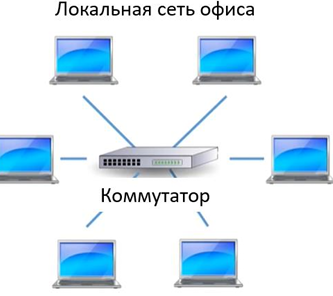
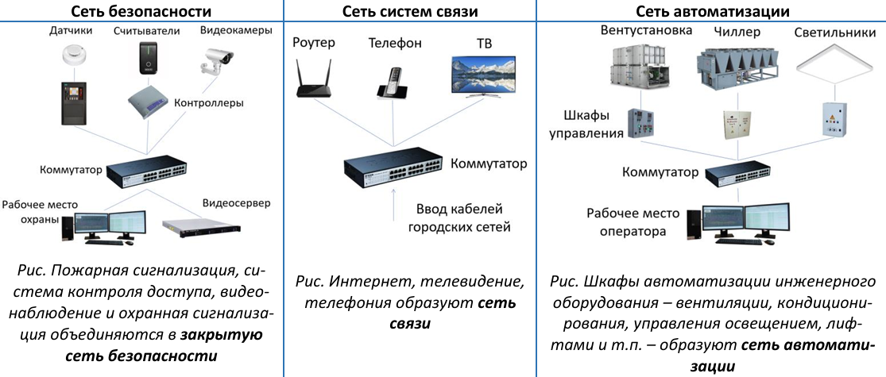
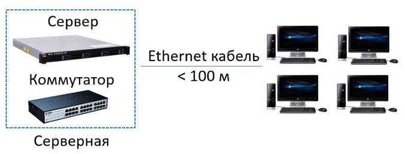
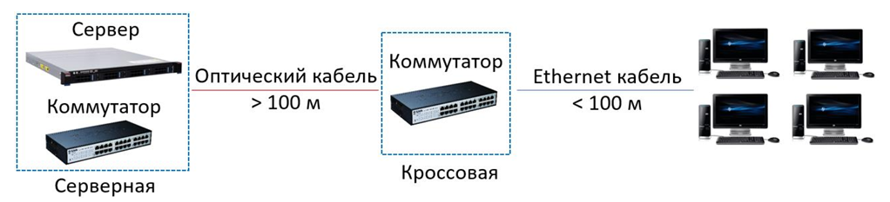
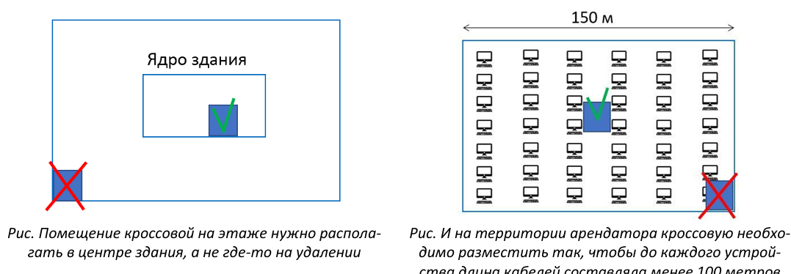
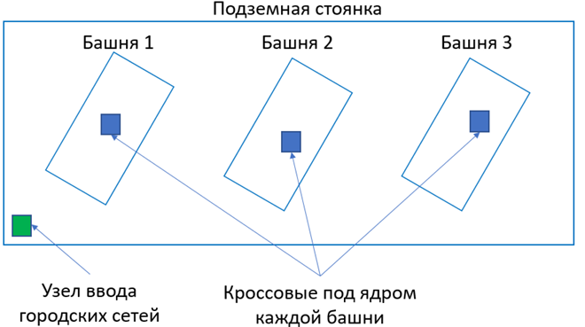
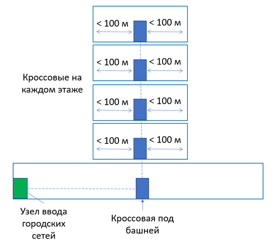
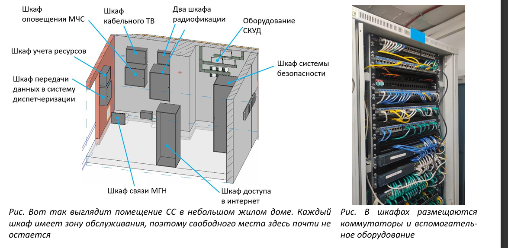

# ПОЧЕМУ ПОМЕЩЕНИЙ СЛАБОТОЧНЫХ СИСТЕМ ДОЛЖНО БЫТЬ МНОГО?

---

## 1. Термины и определения

> **Слаботочные системы** — <mark>совокупность инженерных систем здания, предназначенных для передачи информации, а не энергии (в отличие от систем электроснабжения).</mark>

> **Контроллер** — встроенный компьютер инженерной системы здания, обеспечивающий её функционирование за счёт получения и передачи информации.

> **Сеть передачи данных** — <mark>совокупность коммутаторов и кабельных линий, обеспечивающая обмен данными между устройствами.</mark>

> **Коммутатор** — <mark>устройство, которое сортирует данные и направляет их нужным адресатам. Существует несколько типов таких устройств — от очень умных (маршрутизаторы) до самых простых (хабы). Все их можно назвать собирательным термином «коммутаторы».</mark>

> **Ethernet** — <mark>технология передачи данных, использующая витую пару (Ethernet-кабель) для соединения коммутаторов с конечными устройствами. Слово образовано от английских *Ether* («эфир» как среда передачи данных) и *Network* («сеть»).</mark>

> **Кроссовая** — <mark>помещение для размещения коммутаторов и другого необходимого слаботочного оборудования. В нормативах называется телекоммуникационным помещением.</mark>

---

## 2. Как устроено современное здание
<mark>Если электроснабжение передаёт энергию, то все слаботочные системы передают информацию.</mark> Инженерные системы современного здания становятся «умнее», поэтому все они оснащены собственными компьютерами (контроллерами), которые не могут функционировать без получения и передачи массы информации. Для этого нужна сеть передачи данных.

**Рис. 1** — В вашем офисе все компьютеры, ноутбуки и принтеры объединяются в локальную сеть передачи данных, которой управляют коммутаторы.

<mark>Также и инженерные устройства современного здания соединяются между собой с помощью коммутаторов.</mark>

В отличие от компьютерной сети, которая может быть общей для всех сотрудников огромного здания, для различного инженерного оборудования создаются обособленные локальные сети:

- **Сеть безопасности**
- **Сеть систем связи**
- **Сеть автоматизации**

**Рис. 2** — Пожарная сигнализация, система контроля доступа, видеонаблюдение и охранная сигнализация объединяются в закрытую сеть безопасности.

**Рис. 3** — Интернет, телевидение, телефония образуют сеть связи.

**Рис. 4** — Шкафы автоматизации инженерного оборудования — вентиляции, кондиционирования, управления освещением, лифтами и т.п. — образуют сеть автоматизации.

*Ссылка на раздел «Спроси инженера» на нашем сайте*

---

## 3. Ethernet — палка о двух концах

Коммутаторы с конечными устройствами соединяются привычными интернет-кабелями, их называют Ethernet-кабелями. Термином называют не столько кабель, сколько саму технологию передачи данных, которая используется буквально повсеместно.

Технология Ethernet была создана в 1970-х годах и стала настоящим прорывом в передаче данных и построении сетей. В соответствии с этой технологией любой файл или сообщение разбивается на короткие отрезки (пакеты), каждый из которых имеет «ярлыки» с адресатом и отправителем, что не позволяет потеряться ни одному пакету.

Однако передача данных по Ethernet-кабелям имеет ограничение — длина такого кабеля не может быть более **100 метров**.

Приведём аналогию. Представим, как организуется дорожное движение на очень узком мосту, по которому может проехать лишь один ряд автомобилей.

**Рис. 6** — Реверсивное движение на дороге.

Регулировщик пропускает сначала машины в одну сторону, а встречные стоят в ожидании, потом всё наоборот, образуя «реверсивное движение». Если мост был бы очень-очень длинным, то такое дорожное движение было бы неприемлемым из-за колоссальных пробок на въездах. А вот для коротеньких мостов это могло бы подойти.

Примерно такой же механизм был заложен в Ethernet-технологии. Пакеты данных имеют определённую длину, а скорость движения в медных кабелях конечная, при этом сигнал в них постепенно затухает, поэтому только при определённой длине кабелей можно гарантировать работу сети. Чем длиннее кабель, тем больше ошибок будет при доставке данных до другого конца. Поэтому Ethernet-кабели длиной более 100 метров находятся под запретом, неважно, насколько дорогие кабели будут использоваться.

Формально ограничение можно записать так:

$$
L_{\text{кабеля}} \leq 100\ \text{м}
$$

где $L_{\text{кабеля}}$ — длина Ethernet-кабеля между коммутатором и конечным устройством.

---

## 4. Сколько должно быть помещений?

Зная лишь об этом стометровом ограничении, можно вывести большинство правил расстановки слаботочных помещений в любом здании. Вот пример с компьютерной сетью офиса.

**Рис. 7** — В малом офисе, где длина кабелей между компьютерами и сервером менее 100 метров, требуется только одно техническое помещение — в котором установлен сервер и коммутатор.

**Рис. 8** — Если же расстояние больше, то кроме серверной необходимо предусмотреть отдельную кроссовую, разместив её таким образом, чтобы от коммутатора в ней до дальнего потребителя было менее 100 метров. Между серверной и кроссовой прокладывается оптический кабель, который не имеет таких жёстких ограничений, как Ethernet-кабель.

*Ссылка на раздел «Спроси инженера» на нашем сайте*

### Правило № 1. Кроссовая в ядре или в центре помещения

Помещение для слаботочного оборудования (будем использовать слово «кроссовая» — место размещения коммутаторов и других необходимых элементов) нужно размещать в ядре здания или в центре помещения арендатора.

**Рис. 9** — Помещение кроссовой на этаже нужно располагать в центре здания, а не где-то на удалении.

**Рис. 10** — И на территории арендатора кроссовую необходимо разместить так, чтобы до каждого устройства длина кабелей составляла менее 100 метров.

### Правило № 2. Кроссовая в подземной части под каждым зданием

Заказчики требуют, чтобы в подземной части под каждой башней была собственная кроссовая, которая связывает узел ввода городских сетей (помещение оператора связи) с кроссовыми в надземной части. Идеальное местоположение такой кроссовой — прямо под шахтой слаботочных систем.

**Рис. 11** — Схема слаботочных помещений в подземной части.

### Правило № 3. Кроссовая должна быть на каждом этаже

Напомним, что стометровое ограничение распространяется не только на трассы от коммутатора до компьютера, но и до любого устройства, которое подключается к сети Ethernet — камера видеонаблюдения, точка доступа Wi-Fi, модуль системы контроля доступа, рекламная панель, умная навигационная табличка и т.п. Поэтому 100 метров — это совсем небольшое расстояние, а значит, от кроссовой (или в худшем случае — технической ниши для оборудования) на каждом этаже не уйти.

**Рис. 12** — Упрощённая схема расположения помещений слаботочных систем в здании: одно помещение оператора связи в подземной части, кроссовая под каждым зданием и по кроссовой на каждом этаже.

Если же этаж протяжённый, то на каждом этаже может быть несколько кроссовых. При этом нужно помнить, что 100 метров отмеривается не по кратчайшему пути, а по реальной трассировке кабеля, с учётом перепадов, обходов препятствий, а также разводки в самой кроссовой.

---

## 5. Размеры кроссовой

Логичный вопрос: а для чего нужна целая кроссовая, если там расположен только один коммутатор?

Как мы говорили в начале бюллетеня, для каждой группы систем (системы безопасности, компьютерная сеть, сеть автоматизации и др.) используется собственная сеть, а значит, и собственные коммутаторы. Кроме того, в кроссовой располагается множество и другого вспомогательного слаботочного оборудования, а также источники бесперебойного питания, щиты электроснабжения этих систем, кондиционеры, даже модули газового пожаротушения. Поэтому каждая кроссовая обычно заполнена до предела.

**Рис. 13** — Вот так выглядит помещение СС в небольшом жилом доме. Каждый шкаф имеет зону обслуживания, поэтому свободного места здесь почти не остаётся.

**Рис. 14** — В шкафах размещаются коммутаторы и вспомогательное оборудование.

Размеры кроссовых (в нормативах их называют телекоммуникационными помещениями) регулируются свежим ГОСТом Р 59315-2021 «Кабельные системы. Телекоммуникационные пространства и помещения».

**Таблица 1 — Рекомендуемые размеры телекоммуникационной комнаты**

| Обслуживаемое пространство этажа, м² | Размеры телекоммуникационной комнаты, м |
|---|---|
| 1000 | 3,0 × 3,4 |
| 800 | 3,0 × 2,8 |
| 500 | 3,0 × 2,2 |

Полные требования нормативов к помещениям кроссовых мы описывали в другом нашем номере.

---

## 6. FAQ

**Почему в здании недостаточно одной серверной?**
Потому что длина Ethernet-кабеля ограничена 100 метрами. Если расстояние от серверной до конечного устройства превышает это значение, сеть работать не будет.

**Почему 100 метров — это жёсткое ограничение?**
Сигнал в медном кабеле затухает, а пакеты данных имеют конечную длину и скорость передачи. При большей длине растёт число ошибок доставки, поэтому гарантировать работу сети невозможно.

**Можно ли использовать более дорогой кабель, чтобы увеличить длину?**
Нет. Ограничение в 100 метров не зависит от стоимости кабеля.

**Что делать, если расстояние больше 100 метров?**
Нужно предусмотреть промежуточную кроссовую, разместив её так, чтобы от коммутатора в ней до дальнего потребителя было менее 100 метров. Между серверной и кроссовой прокладывается оптический кабель.

**На какие устройства распространяется ограничение в 100 метров?**
На все устройства, подключаемые к сети Ethernet: компьютеры, камеры видеонаблюдения, точки доступа Wi-Fi, модули СКУД, рекламные панели, навигационные таблички и т.п.

**Почему в кроссовой нужно много места, если там всего один коммутатор?**
Для каждой группы систем (безопасность, связь, автоматизация) используется собственная сеть и собственные коммутаторы. Кроме того, в кроссовой размещаются источники бесперебойного питания, щиты электроснабжения, кондиционеры, модули газового пожаротушения и другое вспомогательное оборудование.

**Как отмеряются 100 метров?**
Не по кратчайшему пути, а по реальной трассировке кабеля — с учётом перепадов, обходов препятствий и разводки в самой кроссовой.

**Каким нормативом регулируются размеры кроссовых?**
ГОСТ Р 59315-2021 «Кабельные системы. Телекоммуникационные пространства и помещения».

---

*ООО «Траст Инжиниринг», тел.: (495) 120-20-76, e-mail: chudesova@trusteng.ru*