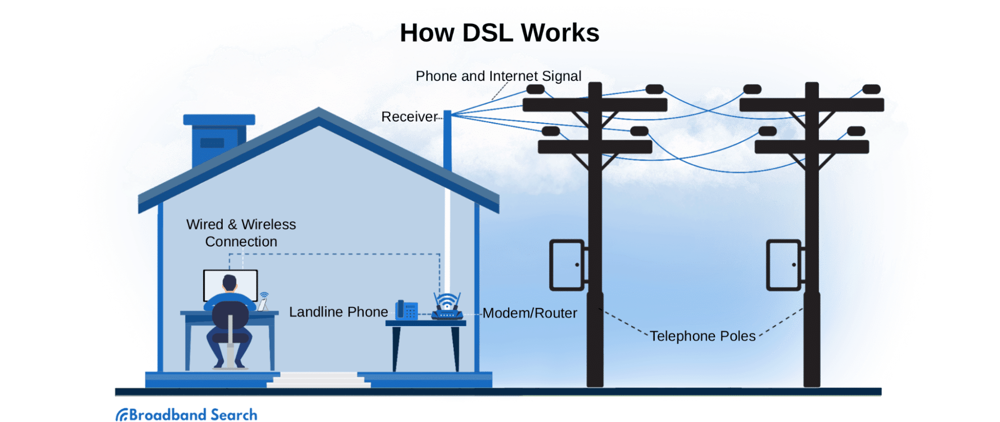
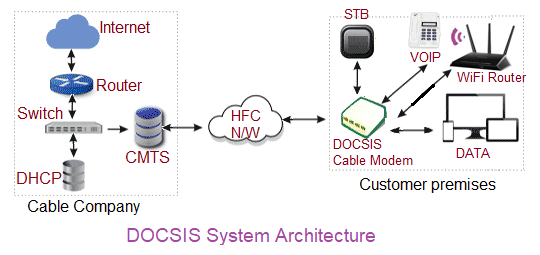

Ниже — три отдельных переработанных текста по вашим требованиям: точные, ясные, структурированные, с определениями терминов, MathJax, сохранением изображений/подписей и FAQ в конце каждого.

---

# Текст 1. Последняя миля

## 1. Определение

> **Последняя миля (last mile)** — в логистике, телекоммуникациях и теории транспортных систем заключительный этап доставки товара, передачи данных или оказания услуги от магистрального узла (распределительного центра, базовой станции, остановки общественного транспорта) до конечного потребителя (дома, офиса, квартиры, абонентского устройства).

Термин метафорически обозначает не столько физическое расстояние, сколько сложность и высокую стоимость организации связи или доставки на этом коротком, но наиболее трудоёмком участке цепи.

## 2. История возникновения термина

Понятие «последняя миля» первоначально возникло в сфере телекоммуникаций в середине XX века. Оно описывало участок телефонной сети, соединяющий абонента с ближайшей АТС. Прокладка кабеля к каждому отдельному дому или квартире требовала значительных капиталовложений и была технически сложнее, чем строительство магистральных линий между городами. В 1990-е годы, с развитием интернета и кабельного телевидения, термин приобрёл новое значение, став ключевым для описания проблемы широкополосного доступа.

В логистике термин начал активно использоваться с ростом электронной коммерции в 2000-е годы. Компании столкнулись с тем, что доставка товара до склада или сортировочного центра относительно дёшева, а вот развоз заказов по тысячам отдельных адресов — самая затратная и труднооптимизируемая часть цепочки поставок.

## 3. Последняя миля в телекоммуникациях

В области связи «последняя миля» — это физический канал, соединяющий оборудование оператора (базовую станцию сотовой связи, DSLAM, оптический терминал) с абонентским устройством (телефоном, компьютером, модемом). Технические решения на этом участке определяют доступную скорость и качество услуги.

> **DSLAM (Digital Subscriber Line Access Multiplexer)** — мультиплексор доступа цифровой абонентской линии, устанавливаемый на стороне оператора и агрегирующий подключения абонентов xDSL.

### 3.1. Технологии реализации

Существует несколько основных технологий, используемых для организации «последней мили»:

- **Медная телефонная пара (DSL).** Использует существующие телефонные линии. Технологии ADSL, VDSL позволяют передавать данные на скоростях до нескольких десятков мегабит в секунду, но сильно зависят от расстояния до АТС и качества линии.

- **Оптоволокно (FTTx).** Наиболее перспективная технология. Оптический кабель прокладывается до здания (FTTB — Fiber to the Building), до подъезда (FTTC — Fiber to the Curb) или непосредственно до квартиры (FTTH — Fiber to the Home). Обеспечивает скорости до 1 Гбит/с и выше, нечувствителен к электромагнитным помехам.

- **Коаксиальный кабель (DOCSIS).** Используется сетями кабельного телевидения. Позволяет достигать скоростей до 1 Гбит/с при модернизации сети до стандарта DOCSIS 3.1.

- **Беспроводные технологии:**
    - **Сотовая связь (4G/LTE, 5G).** Обеспечивает мобильный доступ. 5G позиционируется как технология, способная заменить проводной доступ для многих пользователей, обеспечивая низкие задержки и высокую пропускную способность.
    - **Wi-Fi.** Локальная беспроводная сеть внутри помещения, но не является самостоятельной «последней милей» для провайдера, так как требует подключения к магистральной сети через роутер.
    - **Спутниковая связь.** Применяется в труднодоступных районах, где прокладка кабеля невозможна или экономически нецелесообразна. Отличается высокими задержками (латентностью) и относительно низкой скоростью, хотя проекты низкоорбитальных спутниковых группировок (Starlink, OneWeb) стремятся решить эту проблему.

> **DSL (Digital Subscriber Line)** — семейство технологий высокоскоростной передачи данных по медной телефонной паре.
>
> **FTTx (Fiber to the x)** — обобщённое обозначение архитектур доведения оптического волокна до определённой точки: здания, подъезда, квартиры.
>
> **DOCSIS (Data Over Cable Service Interface Specification)** — стандарт передачи данных по коаксиальному кабелю в сетях кабельного телевидения.
>
> **Латентность (latency)** — задержка передачи данных, измеряемая как время от отправки запроса до получения ответа.

## 4. Проблема «последней мили» в телекоме

Главная проблема — высокая стоимость прокладки кабеля к каждому абоненту, особенно в малоэтажной и сельской застройке. В городах операторы часто сталкиваются с противодействием управляющих компаний, сложностью получения разрешений на земляные работы и необходимостью делить инфраструктуру с конкурентами. Это приводит к «цифровому неравенству», когда жители отдалённых районов имеют доступ только к медленным и дорогим каналам связи.

> **Цифровое неравенство (digital divide)** — разрыв в доступности и качестве цифровых услуг между разными группами населения и регионами.

## 5. Последняя миля в логистике и доставке

В логистике «последняя миля» — это этап доставки товара от последнего сортировочного центра или пункта выдачи до двери получателя. Этот этап может составлять от нескольких сотен метров до нескольких десятков километров, но именно он является самым дорогим (до 50% и более от общей стоимости доставки) и самым сложным с точки зрения организации.

### 5.1. Основные модели доставки

- **Доставка курьером до двери (D2D — Door-to-Door).** Классическая модель. Требует точного соблюдения временных интервалов, решения проблемы «незакрытых заказов» (если получателя нет дома), высокой квалификации курьеров.
- **Доставка до пунктов выдачи заказов (ПВЗ) и постаматов.** Позволяет снизить стоимость «последней мили», так как курьер доставляет сразу много заказов в одну точку. Получатель забирает товар самостоятельно в удобное время. В России эта модель получила широкое распространение благодаря сетям «Wildberries», «Ozon», «Яндекс.Маркет», «СберЛогистика».
- **Дроны и роботы-курьеры.** Экспериментальные и частично внедрённые технологии. Дроны (например, проект Amazon Prime Air) доставляют лёгкие грузы на короткие расстояния. Роботы-курьеры (например, «Яндекс.Ровер») перемещаются по тротуарам и доставляют заказы из магазинов и ресторанов. Пока их применение ограничено регуляторными нормами и погодными условиями.
- **Краудсорсинг (Crowdsourcing).** Привлечение частных лиц (водителей, пешеходов) для доставки заказов по принципу такси. Примеры — сервисы «Яндекс.Доставка», Uber Eats, DoorDash. Позволяет быстро масштабировать доставку, но создаёт проблемы контроля качества и безопасности.

> **ПВЗ (пункт выдачи заказов)** — стационарная точка, где получатель самостоятельно забирает заказ.
>
> **Постамат** — автоматизированный терминал для выдачи заказов без участия оператора.
>
> **Краудсорсинг** — модель привлечения внешних исполнителей (частных лиц) для выполнения задач.

### 5.2. Проблемы логистической «последней мили»

- **Высокая стоимость.** Доставка одного заказа может стоить дороже самого товара, особенно для недорогих товаров повседневного спроса.
- **Неудачные попытки вручения.** Если получателя нет дома, курьеру приходится совершать повторные визиты, что увеличивает затраты.
- **Транспортные заторы.** В крупных городах курьеры тратят много времени в пробках, что снижает количество доставок за смену.
- **Экологическая нагрузка.** Увеличение количества курьерских машин и мотоциклов ведёт к росту выбросов CO₂ и загруженности дорог.
- **Безопасность.** Риск краж, повреждения товаров, мошенничества со стороны получателей или курьеров.

## 6. Последняя миля в общественном транспорте

В транспортном планировании «последняя миля» — это проблема доступа пассажира от остановки общественного транспорта (метро, электрички, автобуса) до конечной точки маршрута (дома, работы, торгового центра). Часто этот участок составляет 1-3 километра, которые неудобно преодолевать пешком, особенно с багажом или в плохую погоду.

### 6.1. Решения для транспортной «последней мили»

- **Развитие микромобильности.** Прокат велосипедов, электросамокатов, гироскутеров. В Москве и других крупных городах России активно работают сервисы кикшеринга («Whoosh», «Яндекс Go», «Urent»).
- **Организация удобных пешеходных маршрутов.** Строительство пешеходных мостов, подземных переходов, освещённых тротуаров.
- **Запуск шаттлов (микроавтобусов).** Небольшие автобусы, курсирующие по фиксированным маршрутам от станций метро до жилых кварталов или бизнес-центров.
- **Системы «Park and Ride» (перехватывающие парковки).** Автомобилисты оставляют машину на парковке у станции общественного транспорта и далее едут на поезде, решая проблему «последней мили» в центре города.

> **Микромобильность** — использование лёгких индивидуальных транспортных средств (велосипедов, электросамокатов, гироскутеров) для коротких поездок.
>
> **Кикшеринг** — краткосрочная аренда электросамокатов и аналогичных средств передвижения.

## 7. Экономика и эффективность

Экономика «последней мили» характеризуется высокой долей переменных затрат (зарплата курьеров, амортизация транспорта, топливо). Для снижения издержек компании применяют следующие подходы:

- **Оптимизация маршрутов.** Использование алгоритмов машинного обучения для построения наиболее эффективных маршрутов с учётом пробок, времени суток и плотности заказов.
- **Консолидация грузов.** Объединение нескольких заказов в одну поездку курьера.
- **Гибкое ценообразование.** Динамическое изменение стоимости доставки в зависимости от времени, расстояния и загрузки курьеров.
- **Использование дроп-офф (Drop-off) моделей.** Стимулирование получателей забирать заказы из ПВЗ или постаматов с помощью скидок.

## 8. Критика и перспективы

Критики отмечают, что гонка за скоростью доставки (например, «доставка за 15 минут») ведёт к нерациональному использованию ресурсов: курьеры на электросамокатах и автомобилях создают хаос на дорогах, а сервисы быстрой доставки продуктов генерируют огромное количество одноразовой упаковки. Кроме того, проблема «последней мили» в телекоммуникациях остаётся нерешённой в сельской местности России, где до сих пор распространён доступ через ADSL или спутник.

Перспективными направлениями считаются:

- Развитие беспилотных технологий (дроны, роботы, беспилотные автомобили).
- Интеграция различных видов транспорта в единую мультимодальную систему (Mobility as a Service, MaaS).
- Строительство оптоволоконных сетей по технологии GPON (Gigabit Passive Optical Network), позволяющей подключать большое количество абонентов по одному кабелю.
- Внедрение стандарта 5G, который может стать основой для беспроводной «последней мили» в городах.

> **MaaS (Mobility as a Service)** — концепция интеграции различных видов транспорта в единую услугу.
>
> **GPON (Gigabit Passive Optical Network)** — гигабитная пассивная оптическая сеть.

## 9. FAQ

**Что такое «последняя миля»?**
Заключительный этап доставки товара, передачи данных или оказания услуги от магистрального узла до конечного потребителя.

**Почему термин называется «последняя миля», если речь не о расстоянии?**
Название метафорическое: оно подчёркивает сложность и высокую стоимость организации связи или доставки на коротком, но трудоёмком участке.

**Какие технологии используются на «последней миле» в телекоме?**
DSL, оптоволокно (FTTx), коаксиальный кабель (DOCSIS), сотовая связь (4G/5G), Wi-Fi, спутник.

**Что такое «цифровое неравенство»?**
Разрыв в доступности и качестве цифровых услуг между жителями городов и отдалённых районов.

**Почему логистическая «последняя миля» такая дорогая?**
Из-за высокой доли переменных затрат, доставки по тысячам адресов, повторных визитов и пробок.

**Что такое ПВЗ и постамат?**
Пункт выдачи заказов и автоматизированный терминал для самостоятельного получения заказов.

**Какие перспективы у «последней мили»?**
Беспилотная доставка, MaaS, GPON и 5G.
