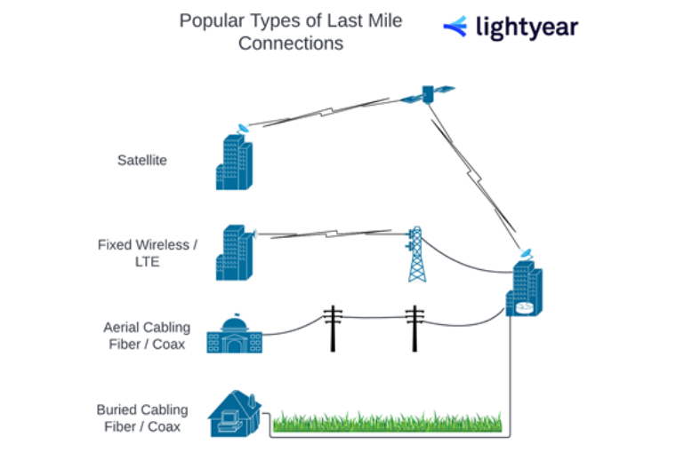

# Текст 3. Telecom-speak: last mile, middle mile и long haul

## 1. Введение

Телекоммуникационный жаргон вроде «подключение последней мили» и «подключение средней мили» не слишком подходит для светской беседы, но он поможет уверенно ориентироваться в сложных процессах телекоммуникационных закупок.

> **Подключение последней мили (last mile connectivity)** — финальная часть телекоммуникационной сетевой цепочки, физически достигающая собственности клиента.
>
> **Подключение средней мили (middle mile connectivity)** — сегмент сети между последней милей и магистральной сетью Интернета.
>
> **Дальняя связь (long haul connectivity)** — магистральные каналы, образующие backbone Интернета.

## 2. Подключение последней мили

Интернет-подключение — это круговой рейс: данные уходят, данные приходят. Поэтому описание разных частей путешествия пакета данных вызывает сложности.

Когда мы говорим о последней миле, важно понимать это описание с точки зрения интернет-провайдера. С этой позиции последняя миля — финальная часть телекоммуникационной сетевой цепочки, физически достигающая собственности клиента. Когда вы покупаете потребительский широкополосный сервис у Comcast или Spectrum, вы покупаете доступ по последней миле.

С точки зрения клиента тот же сегмент сети можно назвать «первой милей». То, что язык отражает точку зрения провайдера, возможно, подчёркивает давнюю отраслевую небрежность. Этот недостаток клиентоориентированного мышления выдаёт наследие отрасли, которая до недавнего времени была монополизирована гигантами — большинство из которых по-прежнему у руля.

### 2.1. Что нужно знать о подключении последней мили

Разные типы сетевых каналов требуют разных типов подключения последней мили. В зависимости от требуемого сетевого сервиса потребности в последней миле могут существенно различаться. MPLS (multi-protocol label switching) — хороший пример: если нужно подключить площадку за пределами инфраструктуры MPLS-провайдера, провайдеру придётся закупить выделенное подключение последней мили у другой компании в этом районе.

> **MPLS (multi-protocol label switching)** — многопротокольная коммутация по меткам.

Не все среды передачи последней мили одинаковы. Для большинства локаций есть несколько вариантов, охватывающих различные типы физических сред (оптоволокно, медь, беспроводная связь и т.д.), но у каждой свои преимущества и ограничения. Спутниковый интернет может быть отличным решением последней мили, особенно в удалённых районах, но есть недостатки: уровни задержки (латентности) при отправке данных в космос и обратно могут сделать некоторые онлайн-активности (например, видеозвонки) кошмаром. Если вы находитесь в удалённой локации и нуждаетесь в низкой латентности, сначала стоит изучить решение фиксированной беспроводной связи.

**Построение «Плана Б» в вашей последней миле.** Для бизнеса и организаций, которые не могут позволить себе простой интернета — даже в экстремальных обстоятельствах — планирование разнообразного, резервированного интернет-канала должно начинаться с последней мили. Закупка двух отдельных каналов у двух провайдеров с раздельной инфраструктурой последней мили обеспечит разнообразное резервирование, как и использование раздельных маршрутов доступа в здание (например, воздушная и подземная кабельная проводка).

> **Резервирование (redundancy)** — дублирование каналов и оборудования для обеспечения бесперебойной работы.

**Ключевой вывод по последней миле:** производительность вашей последней мили — и, следовательно, вашего интернет-соединения в целом — зависит от того, как сигнал покидает и прибывает в вашу локацию, и от того, какого интернет-провайдера вы выбрали и через какую среду передачи он предоставляет услугу.

## 3. Подключение средней мили

Итак, мы рассмотрели последнюю милю и собираемся рассмотреть дальнюю связь — нетрудно догадаться, где находится средняя миля. Подключение средней мили лежит между последней милей и магистральной сетью Интернета.

### 3.1. Что нужно знать о подключении средней мили

Для многих интернет-провайдеров средняя миля — это их «ядровая» сеть. Если вы не оператор Tier 1, средняя миля — это примерно максимум «территории», на которую можно претендовать.

> **Tier 1 ISP** — оператор первого уровня, владеющий магистральной инфраструктурой.

Интернет-провайдеры могут извлечь много пользы из своей средней мили. Помимо безопасного связывания своих дата-центров, средняя миля позволяет провайдеру предлагать услуги MPLS между локациями или дополнять услуги SD-WAN и SASE защищённой средней милей.

> **SD-WAN (Software-Defined Wide Area Network)** — программно-определяемая глобальная сеть.
>
> **SASE (Secure Access Service Edge)** — защищённый доступ к сервисам на периферии.

**Провайдеры с собственной средней милей обеспечивают большую согласованность.** Со всем этим дополнительным контролем провайдер может уверенно предлагать более предсказуемое подключение и производительность между площадками.

**Провайдеры с собственной средней милей дают лучшую производительность для облачных сервисов.** Часто провайдер средней мили резервирует смежное пространство дата-центра с облачным провайдером, что позволяет обеспечить более низкую латентность, лучшую безопасность и согласованную производительность для облачных приложений клиента. Если вам нужно согласованное облачное подключение для бизнеса, крайне важно спросить потенциальных провайдеров об их средней миле до подписания каких-либо документов.

**Ключевой вывод по средней миле:** любой, кому нужны ультранадёжные облачные сервисы и/или прямое сетевое взаимодействие между площадками по разумной цене, должен рассматривать провайдеров с надёжной сетью средней мили.

## 4. Дальняя связь (Long Haul)

Дальние каналы образуют магистраль Интернета. Они принадлежат почти полностью операторам Tier 1 — «крупным зверям», большинство из которых эволюционировали из старых монополий вроде British Telecom или Verizon. Большая часть магистральной кабельной проводки представляет собой тяжёлые кабели, охватывающие огромные расстояния между штатами и странами (значительная часть — подводные кабели на океанском дне, обеспечивающие подводное подключение).

### 4.1. Что нужно знать о дальней связи

Операторы используют дальние кабели для соединения своих основных сетевых узлов и формирования своей средней мили (или ядровой/магистральной сети).

Если корпоративный клиент работает над созданием собственной сети между площадками по выделенным каналам, термин «дальняя связь» будет часто использоваться применительно к волновым (DWDM) сетевым соединениям, которые обычно применяются. Это очень эффективный и безопасный способ создания частной сети, но такие соединения обычно стоят значительно дорого.

> **DWDM (Dense Wavelength Division Multiplexing)** — плотное мультиплексирование с разделением по длине волны.

**Ключевой вывод по дальней связи:** вам, скорее всего, придётся обсуждать это подробно только в том случае, если вы строите выделенную сквозную сеть.

## 5. FAQ

**Что такое «последняя миля»?**
Финальная часть телекоммуникационной сетевой цепочки, физически достигающая собственности клиента.

**Чем «последняя миля» отличается от «первой мили»?**
Это один и тот же сегмент сети, но «последняя миля» рассматривается с точки зрения провайдера, а «первая миля» — с точки зрения клиента.

**Что такое «средняя миля»?**
Сегмент сети между последней милей и магистральной сетью Интернета. Для многих провайдеров это их ядровая сеть.

**Что такое «дальняя связь» (long haul)?**
Магистральные каналы, образующие backbone Интернета. Принадлежат преимущественно операторам Tier 1.

**Почему важно спрашивать провайдера о средней миле?**
Провайдеры с собственной средней милей обеспечивают более низкую латентность, лучшую безопасность и согласованную производительность для облачных приложений.

**Что такое MPLS?**
Multi-protocol label switching — многопротокольная коммутация по меткам, используемая для организации сетей между площадками.

**Что такое DWDM?**
Dense Wavelength Division Multiplexing — плотное мультиплексирование с разделением по длине волны, используемое в магистральных сетях.

**Когда нужно обсуждать дальнюю связь?**
В основном при построении выделенной сквозной сети между площадками.

**Что такое резервирование в последней миле?**
Дублирование каналов и маршрутов доступа для обеспечения бесперебойной работы интернета.

**Что такое SD-WAN и SASE?**
SD-WAN — программно-определяемая глобальная сеть; SASE — защищённый доступ к сервисам на периферии.