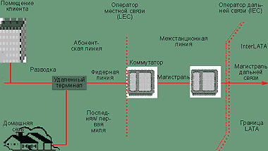

# Текст 2. Ключевое звено соединения между пользователем и общедоступной сетью

## 1. Введение

В июле 2001 г. комитет по стандартам для локальных и региональных сетей IEEE 802 утвердил проект реализации технологии Ethernet на первой миле (Ethernet in the First Mile, EFM). Для разработки первоначальной редакции нового стандарта в рамках рабочей группы 802.3 была создана специальная группа 802.3ah, а выпуск стандарта запланирован на сентябрь 2003 г.

> **EFM (Ethernet in the First Mile)** — стандарт IEEE 802.3ah, определяющий функции Ethernet для сетей абонентского доступа.
>
> **IEEE 802.3ah** — рабочая группа, разрабатывающая стандарт EFM.

Сегмент сетевой топологии, связывающий помещение клиента с провайдером, часто называют сетью доступа, или «последняя миля». Примером может служить абонентская линия (local loop) на витой паре между телефонным узлом (CO) и клиентом или абонентом (см. Рисунок 1).

> **Сеть доступа (access network)** — сегмент сетевой топологии, связывающий помещение клиента с провайдером.
>
> **Абонентская линия (local loop)** — физическая линия связи между телефонным узлом и клиентом.
>
> **CO (Central Office)** — телефонный узел, центральная станция оператора связи.

> **Рисунок 1. Границы сетевых сегментов.**
>
> *[Здесь должно быть изображение схемы сегментирования телефонной сети: абонентская линия, межстанционная линия, InterLATA.]*

Термин не имеет отношения к реальным расстояниям, он лишь подчёркивает те трудности, с которыми операторам и провайдерам приходится сталкиваться при развёртывании служб на базе разнотипных носителей и технологий (как правило, в условиях ограниченной пропускной способности) — пройти «последнюю милю» означает выдержать нелёгкое испытание. (Last mile — устойчивое словосочетание в английском языке, означающее «последний путь осуждённого на казнь» — прим. переводчика.) IEEE предпочитает определение «первая миля», полагая, что оно точнее отражает суть проблем доступа клиентов к сети.

> **Первая миля (first mile)** — ключевое звено соединения между корпоративными или индивидуальными пользователями и общедоступной сетью.

Домашним и офисным компьютерам сегодня предоставляются солидные уровни пропускной способности в локальных сетях, независимо от используемой сетевой технологии — Ethernet 802.3, Home Phoneline Networking Alliance (HomePNA) или 802.11 (беспроводные ЛС). Пользователей манят гигабитные и терабитные скорости региональных сетей, но пока приходится довольствоваться службами с быстродействием ниже 1 Мбит/с: это всё, на что способны каналы промежуточных соединений. <mark><strong>У Ethernet хорошие шансы прочно обосноваться на первой миле в качестве приоритетного протокола с пропускной способностью в несколько мегабит.</strong></mark>

Спрос на услуги Internet привёл к бурному распространению новых типов сетей абонентского доступа и соответствующих технологий. Провайдеры в острой конкурентной борьбе постоянно расширяют их функциональный диапазон, предлагая разнообразные дополнительные услуги. Перед EFM ставится задача — обеспечить возможность формирования эффективных архитектур Ethernet для сетей абонентского доступа. Это позволит вносить в текущие системы нужное количество усовершенствований, не выходя при этом за рамки приемлемых издержек (с учётом как капитальных, так и эксплуатационных затрат).

## 2. 802.3ah: сети абонентского доступа

Локальные сети Ethernet обычно находятся в частном владении. Их расширения для выхода в глобальную сеть нередко реализуются на базе выделенной общедоступной линии связи, но результирующие сети всё равно считаются частными. Назначение стандарта EFM (и его отличие от традиционных технологий Ethernet) состоит в том, что он будет определять функции, необходимые для сети абонентского доступа, т. е. для общедоступной сетевой среды.

Требования, предъявляемые к общедоступным и частным сетям, могут существенно различаться между собой. Хотя принципиальные схемы и тех и других, как правило, аналогичны, при проектировании частной сети в большинстве случаев заранее известно, как она будет использоваться конкретными конечными пользователями и какая потребуется пропускная способность, тогда как общедоступная сеть должна обслуживать широкий контингент пользователей, работающих с самыми разными приложениями, причём их потребность в пропускной способности может варьироваться. Различия возможны и в других аспектах помимо использования сети, таких как администрирование и управление в процессе эксплуатации, требования регулирующих органов и факторы окружающей среды.

## 3. Топология последней мили

На Рисунке 1 приводится примерная схема сегментирования современной телефонной сети относительно последней мили. Оператор местной связи (Local Area Exchange, LEC) обслуживает область локального доступа и передачи (Local Access and Transport Area, LATA), куда входят отрезок последней мили (абонентская линия) и межстанционные каналы связи.

> **LEC (Local Exchange Carrier)** — оператор местной связи.
>
> **LATA (Local Access and Transport Area)** — область локального доступа и передачи.

Выделение LATA служит отправной точкой для задания размеров различных участков инфраструктуры телефонии и соответствующих им типов сред передачи. Так, для абонентской линии (см. Рисунок 1) характерны расстояния в пределах до 6 км, а в качестве среды передачи используется медный кабель и многомодовое или одномодовое оптическое волокно. На отрезке межстанционной линии применяется многомодовый и одномодовый волоконно-оптический кабель и возможны расстояния до 8 км. Сетевой сегмент, связывающий различные зоны LATA (InterLATA), может содержать участки одномодового кабеля протяжённостью от 160 до 6700 км.

Относительные характеристики передачи могут претерпевать существенные изменения при пересечении границ сегментов сети. Если абонентской линии присущи низкие показатели пропускной способности передачи (главным образом на медном кабеле категории Voicegrade — предназначенном для голосовой связи), то на межстанционной линии мы имеем высокую пропускную способность, а в области InterLATA — сверхвысокую. Клиенты, стремящиеся воспользоваться высокоскоростной передачей, вынуждены ограничиваться возможностями медленных каналов межсоединений.

## 4. 802.3ah: цели проекта EFM

Рабочая группа EFM в настоящее время рассматривает три варианта топологии сети абонентского доступа, а также несколько спецификаций физического уровня. Как предполагается, благодаря применению Ethernet они позволят повысить производительность сети и расширить её функциональный диапазон по сравнению с традиционными технологиями доступа на первой миле. Кроме того, проект предусматривает описание правил администрирования и обслуживания в процессе эксплуатации (Operations, Administration and Maintenance, OAM) для EFM, включая индикацию удалённых сбоев, удалённую кольцевую проверку и мониторинг каналов связи.

> **OAM (Operations, Administration and Maintenance)** — администрирование и обслуживание в процессе эксплуатации, включая индикацию удалённых сбоев, удалённую кольцевую проверку и мониторинг каналов связи.
>
> **PHY (Physical layer)** — физический уровень модели OSI.
>
> **PMD (Physical Medium Dependent)** — уровень, зависимый от физической среды.

Итак, в рамках EFM изучаются следующие топологии сети доступа:

- «точка — много точек» (волоконно-оптический кабель);
- «точка — точка» (волоконно-оптический кабель);
- «точка — точка» (медный кабель).

Спецификации физического уровня EFM рассчитаны как на волоконно-оптическую инфраструктуру, так и на медный кабель. В спецификации физического уровня Ethernet (PHY) описываются типы передатчиков и приёмников, а также функции преобразования данных (кодирования) в сигналы, совместимые с используемым типом кабельной проводки (например, оптическое волокно, витые пары или коаксиальный кабель). Та часть, которая отвечает за взаимодействие со средой передачи, называется уровнем, зависимым от физической среды (Physical Medium Dependent, PMD).

Характеристики будущих спецификаций физического уровня EFM приведены в Таблицах 1 и 2. В Таблице 2 указаны три группы параметров, из которых на данный момент рабочей группой 802.3 CSMA/CD утверждена только одна — соответствующая скорости 10 Мбит/с.

## 5. Топология сети доступа «точка — точка» на оптических линиях

Стандарт EFM описывает характеристики для двухточечного соединения по одиночной нити одномодового волоконно-оптического кабеля с использованием оптики Gigabit Ethernet (1000BaseX) с расширенным температурным диапазоном и призван обеспечить корпоративным и индивидуальным домашним пользователям эффективный и высокоскоростной широкополосный доступ к средствам связи.

Реализация 1000BaseX по одной нити одномодового волоконно-оптического кабеля сокращает расходы на ввод в эксплуатацию канала связи между офисом или домом и разводкой или коммутатором доступа. Оптика 1000BaseX с расширенным температурным диапазоном позволит провайдерам располагать терминал оптической сети (Optical Network Terminator, ONT) в точке демаркации оптической сети и офисной или домашней сети (рабочий диапазон температур: от $-40^\circ C$ до $+85^\circ C$).

> **ONT (Optical Network Terminator)** — терминал оптической сети, устанавливаемый в точке демаркации оптической сети и сети помещения.

Как известно, прокладывать оптическое волокно до дома не очень выгодно ввиду невозможности добиться низкого уровня абсолютных затрат и приемлемого соотношения «цена/производительность». Оптический Ethernet на двухточечной волоконно-оптической линии позволяет использовать преимущества высокопроизводительных и недорогих трансиверов 1000BaseX, массовый выпуск которых налажен с конца 1997 г. Благодаря технологии 1000BaseLX решения наподобие «точка — точка» будут не только дешёвыми, но и обеспечат абонентам пропускную способность до 1000 Мбит/с.

Ethernet — идеальная технология для сетей коллективного пользования с топологией «точка — точка» на базе оптических линий. Оптическое волокно протягивается вплоть до абонента, в распоряжение которого предоставляется гигабитная пропускная способность. У провайдеров появляются новые источники дохода благодаря поддержке функции третьего уровня под названием «ограничение скорости». В сочетании с соответствующими соглашениями об уровне обслуживания с её помощью возможно применение физического канала 1000 Мбит/с для предоставления сервисов 10, 100 или 200 Мбит/с. Гигабитные сети «точка — точка» обладают чрезвычайной гибкостью и масштабируемостью. Для компании, предоставляющей не только высокоскоростной доступ в Internet, но и такие услуги, как доставка голоса и видео, волоконно-оптическая сеть Ethernet типа «точка — точка» окажется наилучшим решением.

Высокая пропускная способность двухточечных волоконно-оптических соединений Gigabit Ethernet гарантирует весьма длительный срок службы сетевой инфраструктуры: период её амортизации составляет не менее 20 лет. Таким образом, оптические технологии Ethernet на первой миле снижают ежегодные расходы на транспортные службы, а повышенная пропускная способность открывает возможности для поддержки новых выгодных услуг.

> **Рисунок 2. Волоконно-оптические линии «точка — точка».**
>
> *[Здесь должно быть изображение топологии сети «точка — точка» на базе оптического волокна.]*

На Рисунке 2 показана топология сети «точка — точка» на базе оптического волокна. Когда соединения Ethernet прокладываются до дома, абонент подключается к коммутатору доступа или агрегирующему коммутатору, установленному на цоколе поблизости от дома во всепогодном корпусе; для доступа к службе спасения 911 можно установить батареи резервного питания, также с защитными корпусами. Переход с оптического канала в домашнюю сеть на медном кабеле или ином носителе осуществляется на терминале оптической сети (ONT).

## 6. Топология сети доступа «точка — много точек» на оптических линиях

Стандарт EFM ориентируется на поддержку пассивных оптических сетей Ethernet (Ethernet Passive Optical Network, EPON), что обусловлено рядом преимуществ экономического характера. Устройство агрегирования, называемое терминалом оптической линии (OLT), может обслуживать не менее 16 абонентов через каждый порт с помощью пассивного оптического разветвителя. Таким образом, в сети EPON, по сравнению с сетью «точка — точка», уменьшается число волоконно-оптических линий, требующих управления из точки присутствия или телефонного узла, сокращается число трансиверов на телефонном узле и соответственно высвобождается полезная площадь. Это даёт ощутимую экономическую выгоду.

> **EPON (Ethernet Passive Optical Network)** — пассивная оптическая сеть Ethernet.
>
> **OLT (Optical Line Terminal)** — терминал оптической линии, устройство агрегирования в пассивной оптической сети.
>
> **ONU (Optical Network Unit)** — блок оптической сети, соединяющий оптическую сеть провайдера с домашней сетью.
>
> **WDM (Wavelength Division Multiplexing)** — мультиплексирование с разделением по длине волны.
>
> **FSAN (Full Service Access Network)** — спецификация полносервисной сети доступа.

Кроме того, топология EPON позволяет снизить затраты на обслуживание, так как для эксплуатации сети больше нет необходимости в ресурсах электропитания и активной электронике; правда, повышаются накладные расходы на диагностику и устранение неполадок. Для пассивных оптических разветвителей не нужны внешние батареи и защитные корпуса. Спецификация физического уровня EPON будет поддерживать расстояния между OLT и блоком оптической сети (Optical Network Unit, ONU) в 10 км и более, в зависимости от коэффициента ветвления и энергетического баланса оптической линии.

> **Рисунок 3. Волоконно-оптические линии «точка — много точек».**
>
> *[Здесь должно быть изображение топологии EPON.]*

Топология EPON проиллюстрирована на Рисунке 3. Оптическая распределительная сеть состоит из волоконно-оптической системы разводки и пассивного оптического разветвителя. Устанавливать поблизости активное оптическое или Ethernet-оборудование на уровне разводки или доступа не требуется.

Блок ONU выполняет функции по соединению волоконно-оптической сети провайдера со средой домашней сети. Он рассчитан на установку вне дома, хотя возможно подключение и к интеллектуальному шлюзу домашней сети или коммутатору Ethernet, установленному в помещении. Специалистам IEEE 802.3 по стандартизации EFM предстоит разработать описание интерфейса и демаркационной точки между оптической и домашней сетями, однако внутренние аспекты домашней сети выходят за рамки их компетенции.

Многие детали реализации EPON всё ещё продолжают обсуждаться участниками рабочей группы IEEE 802.3ah. Так, для физического уровня было предложено несколько схем мультиплексирования с разделением по длине волны (WDM). В одном из предложений, заимствованном из спецификации Full Service Access Network (FSAN), предусматривается передача данных в нисходящем направлении (к абоненту) с номинальной длиной волны 1550 нм и в восходящем направлении — с номинальной длиной волны 1310 нм. (Спецификация FSAN разрабатывается группой телекоммуникационных компаний и опирается на технологии ATM, PON и xDSL.)

Концепция работы сети EPON состоит в следующем. Терминал оптической линии (OLT) передаёт кадры (пакеты данных) блокам оптической сети (ONU) в режиме широковещательной рассылки. Каждый ONU отправляет данные в обратном направлении согласно полномочиям, полученным от OLT. Таким образом, в нисходящем направлении система функционирует аналогично широковещательной сети Ethernet. Выделяемая каждому ONU доля пропускной способности в восходящем направлении регулируется терминалом OLT. В сети можно организовать поддержку качества обслуживания (QoS) и класса обслуживания (CoS), используя теги приоритетов и механизмы очередей, встроенные в OLT. Заключая индивидуальные соглашения об уровне обслуживания, абоненты могут оговаривать для себя право на кратковременное резкое увеличение скорости передачи данных.

> **QoS (Quality of Service)** — качество обслуживания.
>
> **CoS (Class of Service)** — класс обслуживания.

Сеть EPON отличается от других локальных сетей Ethernet с общей средой передачи. В разделяемых локальных сетях Ethernet станции подключаются к повторителям, образуя широковещательный канал. Данные, переданные одной из станций, получают все остальные в соответствующем сегменте. Их работа осуществляется в полудуплексном режиме. В каждый момент времени, в соответствии с протоколом MAC, только одна станция в сети может отправлять данные. Главная цель проекта EFM — разработать простой протокол, чтобы EPON мог «эмулировать» совместимую сетевую топологию, используя имеющиеся наборы микросхем Ethernet уровней MAC и PHY.

> **MAC (Media Access Control)** — уровень управления доступом к среде.

## 7. Топология сети доступа «точка — точка» на медном кабеле

Допустимые скорости передачи данных и расстояния, задаваемые в спецификациях физического уровня, определяются исходя из типов используемых приёмников и передатчиков, функций кодирования данных в сигналы и среды передачи. Специалисты подгруппы разработки спецификаций для инфраструктуры EFM на медном кабеле («медноголовые», как их в шутку называют) сейчас занимаются составлением базового предложения и проводят технический анализ типов функций кодирования, подлежащих стандартизации, а также характеристик передачи данных по медному кабелю. Различия в обсуждаемых реализациях находят своё отражение в нескольких вариантах PHY, идентифицируемых в качестве целей проекта, причём, возможно, какая-то реализация позволит добиться большего, чем один из вариантов инфраструктуры голосовой связи, и достичь поставленных целей.

На роль базового предложения претендуют два кандидата: Ethernet over Digital Subscriber Line (EoDSL) и 100BaseCu (100BaseCopper). Первый предусматривает использование стандарта DSL: кадры Ethernet (содержащие данные и управляющую информацию) предлагается инкапсулировать в кадры DSL и передавать их с помощью технологии мультиплексирования с частотным разделением. Предложение 100BaseCu опирается на использование стандарта High Level Data Link Control (HDLC); кадры Ethernet будут инкапсулироваться в кадры HDLC и передаваться средствами мультиплексирования с разделением по времени.

> **EoDSL (Ethernet over Digital Subscriber Line)** — передача кадров Ethernet по DSL.
>
> **HDLC (High Level Data Link Control)** — высокоуровневый протокол управления каналом передачи данных.

Многие термины, связанные с абонентским доступом по медному кабелю, вошли в оборот после появления Акта о телекоммуникации в 1996 г.: он предоставлял право альтернативным операторам местной связи (CLEC) предлагать своим клиентам доступ к коммутируемым локальным услугам. Разделение (unbundling) — это процесс, посредством которого традиционный оператор (ILEC) обеспечивает альтернативному доступ к определённым элементам своей сети (например, к оборудованию или технологии системы коммутации).

> **CLEC (Competitive Local Exchange Carrier)** — альтернативный оператор местной связи.
>
> **ILEC (Incumbent Local Exchange Carrier)** — традиционный оператор местной связи.
>
> **Unbundling (разделение)** — процесс предоставления альтернативному оператору доступа к элементам сети традиционного оператора.

Федеральная комиссия связи США (FCC) играет активную роль в формулировании основных принципов работы оператора местной связи, касающихся надёжности сети, спектральной целостности «проводной» сети и возможностей взаимодействия. FCC учредила Совет по вопросам надёжности и взаимодействия сетей (Network Reliability and Interoperability Council, NRIC), задача которого состоит в выработке рекомендаций по перечисленным проблемам.

> **FCC (Federal Communications Commission)** — Федеральная комиссия связи США.
>
> **NRIC (Network Reliability and Interoperability Council)** — Совет по вопросам надёжности и взаимодействия сетей.

Подгруппа медной инфраструктуры добилась успехов в достижении консенсуса по поводу поддержки ограничений на управление спектром и планирование полосы частот, вводимых при работе в сетях общего доступа. Ограничения на управление спектром необходимы для уменьшения переходного затухания между витыми парами, возникающего при использовании одного кабеля несколькими службами. Ограничения полосы частот контролируют ширину полосы, выделяемой для передачи данных.

Подгруппа 802.3ah согласилась признать рекомендации NRIC, а также требования к управлению спектром, определённые в стандарте ANSI-T1.417-2001. Кроме того, ею были приняты соответствующие планы контроля частот, утверждённые группами ITU-T Study Group 15/Q4, ANSI-T1E1.4 и ETSI/TM6.

Наконец, подгруппой было решено определить набор тестовых линий и источников шумов, типичных для сетей абонентского доступа, по которым будет производиться оценка всех предложений PHY для медной инфраструктуры EFM «точка — точка».

Двухточечные соединения Ethernet на медном кабеле — это, пожалуй, оптимальный вариант для сформировавшихся жилых районов, бизнес-парков и комплексов MxU, так как они дают возможность повторно использовать уже действующую «первую милю» инфраструктуры голосовой связи на витых парах (см. Рисунок 4). MxU — это классы зданий, охватывающие жилые (Multi-Dwelling Unit, MDU), деловые (Multi-Tenant Unit, MTU) и гостиничные (Multi-Hospitality Unit, MHU) комплексы.

> **MxU** — классы зданий: жилые (MDU), деловые (MTU), гостиничные (MHU).

> **Рисунок 4. Линии «точка — точка» на медном кабеле.**
>
> *[Здесь должно быть изображение топологии «точка — точка» на медном кабеле.]*

Для новых районов лучше подойдёт волоконно-оптическая сеть Ethernet «точка — много точек», обладающая высокой пропускной способностью и продолжительным потенциальным сроком службы. Крупным коммерческим клиентам имеет смысл рекомендовать волоконно-оптическую инфраструктуру Ethernet «точка — точка», поскольку она хорошо масштабируется в соответствии с меняющимися потребностями в пропускной способности. Кроме того, если расстояние между центральным узлом и абонентом превышает милю, то волоконно-оптические линии (и «точка — точка», и «точка — много точек») могут стать основой для расширения решения Ethernet с топологией «точка — точка» на медном кабеле.

## 8. Управление сетью Ethernet на первой миле

Первая миля — совершенно новая область применения технологии Ethernet. Здесь конечный пользователь не подчиняется провайдеру услуг Ethernet и не связан с ним, а провайдер не всегда является владельцем среды передачи, на базе которой развёрнута его служба, или не всегда может её контролировать; всё это порождает потребность в абсолютно новом классе средств управления для Ethernet. В отличие от традиционных систем Ethernet, на первой миле можно выделить «головную часть» и «удалённую часть». Важно, чтобы оборудование первой могло отслеживать ключевые аспекты работы физического канала вплоть до демаркационной точки (физической или логической), отделяющей сеть провайдера от сети клиента.

По мнению участников рабочей группы EFM, стандарт должен обеспечивать возможности по управлению такой демаркационной точкой, включая функции удалённой индикации сбоев, удалённой кольцевой проверки и мониторинга каналов связи. Предполагается, что для успешной реализации Ethernet в качестве технологии доступа потребуется внедрить дополнительные возможности по управлению самим физическим уровнем. Конкретные предложения пока ещё находятся на стадии разработки, но уже ясно, что они должны обеспечивать прозрачность по отношению к существующему уровню Ethernet MAC, сохранение текущих характеристик скорости передачи кадров Ethernet и поддержку широкого ассортимента средств OAM, в том числе переключения при сбое, настройки канала сообщений и мониторинга производительности. Всем клиентам провайдеров понадобятся удалённые функции OAM для управления абонентскими сетями доступа. Программа работ по OAM, запланированная в рабочей группе EFM, — общая для всех трёх сетевых топологий.

## 9. Характеристики передачи данных по кабелям EFM

Кабельная проводка — главный предмет рассмотрения при разработке сетевых стандартов. Широкое распространение стандарта 10BaseT (Ethernet на 10 Мбит/с) объяснялось тем, что его можно было использовать с прокладываемым до настенных розеток рабочей зоны витыми парами 100 Ом телефонных проводов.

Рабочая группа 802.3ah идёт тем же путём, пытаясь в максимальной степени задействовать имеющуюся инфраструктуру телефонной связи. От характеристик проложенных кабелей первой мили будут зависеть допустимые значения расстояний и скоростей передачи данных, включаемые в стандарт. К сожалению, характеристики кабельной проводки последней мили прописаны не так чётко, как для кабеля локальной сети.

Спецификации Ethernet традиционно ссылаются на стандарты кабельной проводки ISO/IEC 11801 и ANSI/TIA/EIA-568 и определяют свойства телекоммуникационной кабельной инфраструктуры, монтируемой внутри коммерческих зданий офисного типа и в зоне диаметром до 3000 м между ними. Область применения указанных стандартов ограничена традиционными топологиями кабельных систем для локальных сетей Ethernet, поэтому они не приложимы к схемам телекоммуникационной кабельной проводки, необходимым для последней мили Ethernet.

### 9.1. Спецификации EFM для волоконно-оптических линий

В настоящее время за основу при обсуждении будущих спецификаций одномодового оптического волокна 802.3ah взяты рекомендации ITU-T серии G (см. ссылки на них в Таблице 3); в совокупности они охватывают 99% установленной базы одномодовых линий. Эти рекомендации широко использовались в сетях абонентского доступа главным образом для поддержки технологий цифровой передачи SDH и SONET.

**Хроматическая дисперсия.** Наиболее характерный параметр одномодового оптического волокна ITU — хроматическая дисперсия (см. Таблицу 3). Это увеличение ширины оптических импульсов при их распространении вдоль волоконной линии. Спектр импульсов, посылаемых передатчиком по оптическому волокну, состоит не из одной длины волны, а из нескольких. Хроматическая дисперсия вызывается тем, что световые волны разной длины в составе импульса передаются с разными скоростями. Различия в задержке между длинами волн в передатчике и в приёмнике приводят к расширению оптического импульса. Хроматическая дисперсия отрицательно сказывается на восстановлении сигнала данных. Длина волны, при которой дисперсия минимальна (примерно равна нулю), называется длиной волны с нулевой дисперсией и обозначается символом $\lambda_0$.

Подавляющая часть уже установленных одномодовых волоконно-оптических линий соответствует спецификации на волокно с несмещённой дисперсией (Dispersion Unshifted Fiber G.652), предложенной ITU-T в начале 80-х гг. Для этой категории оптического волокна длина волны с нулевой дисперсией составляет около 1310 нм. Такой кабель предписывается к применению во многих одномодовых инфраструктурах, включая Gigabit Ethernet и 10 Gigabit Ethernet, а также SONET/SDH. Рекомендация по волокну со смещённой дисперсией (Dispersion Shifted Fiber ITU-T G.653), появившаяся в середине 80-х гг., используется значительно реже, главным образом в одноканальных системах с длиной волны 1550 нм. Эта категория постепенно вытесняется спецификацией на волокно с ненулевой смещённой дисперсией (Non-Zero Dispersion Shifted Fiber G.655), введённой в начале 90-х гг. и оптимизированной для новых приложений DWDM. Такой кабель прокладывается в основном на подводных лодках и в наземных линиях дальней связи.

> **Хроматическая дисперсия** — увеличение ширины оптических импульсов при распространении вдоль волоконной линии из-за разных скоростей световых волн разной длины.
>
> **Длина волны с нулевой дисперсией ($\lambda_0$)** — длина волны, при которой дисперсия минимальна (примерно равна нулю).
>
> **DWDM (Dense Wavelength Division Multiplexing)** — плотное мультиплексирование с разделением по длине волны.

### 9.2. Спецификации медного кабеля EFM

Облегчить планирование предоставления качественной голосовой связи на высвобождаемых аналоговых телефонных линиях намерена рабочая группа T1A1.7 (занимающаяся в комитете T1 вопросами обработки сигналов и сетевой производительности для служб голосового диапазона частот). В составленном ею техническом отчёте №60 (TR.60) под названием «Высвобождённые аналоговые линии голосовой связи» (Unbundled Voicegrade Analog Loops) описываются характеристики передачи по высвобождённым линиям, используемым для подключения помещений абонентов к аналоговым службам голосового диапазона.

В отчёте дана характеристика технологий, используемых в высвобождённых аналоговых телефонных линиях. Речь идёт о пассивных сетях на медном кабеле с пупинизацией или без неё. Пупинизация может применяться для улучшения показателей передачи — так называется процедура добавления в инфраструктуру специальных пупиновских катушек для снижения затухания в диапазоне тональных частот (примерно 300—3300 Гц); однако это достигается ценой увеличения затухания на канале передачи вне обычного диапазона рабочих частей.

> **Пупинизация** — добавление в инфраструктуру специальных пупиновских катушек для снижения затухания в диапазоне тональных частот (примерно 300—3300 Гц).

## 10. Заключение

Использование технологии «IP поверх Ethernet» в системах абонентского доступа позволяет обойтись без некоторых сетевых уровней. Это, в свою очередь, приводит к сокращению числа элементов сети и, соответственно, — к снижению затрат на оборудование, эксплуатационных расходов и уровня сложности системы. На границе первой мили простыми архитектурами управлять проще. Применение «родного» протокола Ethernet на медном или волоконно-оптическом кабеле первой мили даёт солидное преимущество в соотношении «стоимость/производительность» по сравнению с конкурирующими технологиями. Разумеется, сети IP/Ethernet будут успешно сосуществовать с системами TDM и SONET/SDH. Например, бизнес-клиентам можно предоставлять услуги уровня T1 и Fractional T1 с помощью Ethernet на волоконно-оптических линиях. Кроме того, у провайдеров нередко появляется возможность обратной доставки трафика данных, голоса и видео в сеть SONET/SDH.

На первой миле все три топологии, рассматриваемые в группе IEEE 802.3ah, будут взаимно дополнять друг друга. Ethernet на медном кабеле — оптимальный вариант для сформировавшихся жилых районов, деловых центров и комплексов MxU: здесь можно повторно использовать уже проложенный кабель голосовой связи на витых парах. Для новых жилых и большинства деловых комплексов предпочтительнее вариант Ethernet поверх PON, для которого характерна высокая пропускная способность и продолжительный потенциальный срок службы. Крупным коммерческим клиентам рекомендуется волоконно-оптическая инфраструктура Ethernet «точка — точка», поскольку её удобно масштабировать в соответствии с меняющимися потребностями в пропускной способности. Провайдеры будут конструировать и гибридные сети, особенно если расстояние между центральным узлом и абонентом превышает милю. В системах волокно до тротуара (Fiber To The Curb, FTTC) и волокно до распределительного шкафа (Fiber To The Cabinet, FTTCab) для подключения к центральному узлу подойдут двухточечные волоконно-оптические линии или соединения EPON, расширяющие решение Ethernet на медном кабеле.

> **FTTC (Fiber To The Curb)** — волокно до тротуара.
>
> **FTTCab (Fiber To The Cabinet)** — волокно до распределительного шкафа.

## 11. Об авторах

Кристофер Т. ди Минико — вице-президент и главный технический директор сетевого отделения Cable Design Technologies (CDT). Он активно сотрудничает с организациями IEEE и TIA в области разработки телекоммуникационных стандартов.

Брюс У. Толли — менеджер отделения новых технологий в компании Cisco Systems, представляет Cisco в рабочих группах IEEE 802.3ah (EFM), IEEE 802.3ae (10 Gigabit Ethernet) и в техническом комитете объединения 10 Gigabit Ethernet Alliance.

## 12. FAQ

**Что такое EFM?**
Ethernet in the First Mile — стандарт IEEE 802.3ah, определяющий функции Ethernet для сетей абонентского доступа.

**Чем «первая миля» отличается от «последней мили»?**
Это один и тот же сегмент сети, но «первая миля» — термин, предпочитаемый IEEE, так как он точнее отражает суть проблем доступа клиентов к сети.

**Какие три топологии рассматривает EFM?**
«Точка — много точек» (оптоволокно), «точка — точка» (оптоволокно), «точка — точка» (медный кабель).

**Что такое EPON?**
Пассивная оптическая сеть Ethernet, позволяющая подключать большое количество абонентов по одному оптоволоконному кабелю с использованием пассивных разветвителей.

**Что такое OLT, ONU, ONT?**
OLT — терминал оптической линии (сторона оператора), ONU — блок оптической сети (сторона абонента в EPON), ONT — терминал оптической сети (точка демаркации).

**Что такое OAM?**
Operations, Administration and Maintenance — администрирование и обслуживание в процессе эксплуатации, включая индикацию удалённых сбоев, удалённую кольцевую проверку и мониторинг каналов связи.

**Что такое хроматическая дисперсия?**
Увеличение ширины оптических импульсов при распространении вдоль волоконной линии из-за разных скоростей световых волн разной длины.

**Что такое пупинизация?**
Добавление пупиновских катушек для снижения затухания в диапазоне тональных частот (300—3300 Гц).

**Что такое MxU?**
Классы зданий: жилые (MDU), деловые (MTU), гостиничные (MHU).
