# СКС для IP-видеонаблюдения

## Введение

В предыдущей статье **«ЛВС для IP-видеонаблюдения»** мы подробно рассмотрели вопросы построения ЛВС, расчёта пропускной способности, выбора коммутаторов, разобрали сетевые стандарты и протоколы.

Следующим этапом проектирования является построение кабельной инфраструктуры системы видеонаблюдения. Для IP-видеонаблюдения такой инфраструктурой является **СКС**.

> **СКС (Система Кабельная Структурированная)** — универсальная кабельная система здания или комплекса зданий, предназначенная для передачи информационных сигналов различного типа и построенная по иерархическому принципу с соблюдением требований международных и национальных стандартов.

## 1. Нормативная база проектирования СКС

Правила построения СКС для системы видеонаблюдения подчиняются общему стандарту. Для проектирования СКС существует отечественный стандарт **ГОСТ Р 53246-2008** «Информационные технологии. Системы кабельные структурированные. Проектирование основных узлов системы. Общие требования». Он основывается на международных стандартах и в большей части является переводом и интеграцией:

- ИСО/МЭК 11801:2002;
- ANSI/TIA/EIA-568B;
- ANSI/TIA/EIA-604-3.

Фактически проектирование СКС — это чёткое следование требованиям стандартов с учётом особенностей и возможностей сетевых компонентов выбранного производителя.

Кроме того, при проектировании СКС необходимо соблюдать требования федеральных стандартов, сводов правил и иных нормативно-правовых актов РФ в области проектирования кабельных и инженерных сетей зданий:

- Федеральный закон № 123-ФЗ «Технический регламент о требованиях пожарной безопасности»;
- ГОСТ 31565-2012 «Кабельные изделия. Требования пожарной безопасности»;
- СП 134.13330.2012 «Системы электросвязи зданий и сооружений. Основные положения проектирования»;
- ОСТН 600-93 «Отраслевые строительные нормы»;
- ПУЭ «Правила устройства электроустановок». Издание 7.

## 2. Типовая схема СКС для IP-видеонаблюдения

Типовая схема СКС для IP-видеонаблюдения изображена на рисунке.

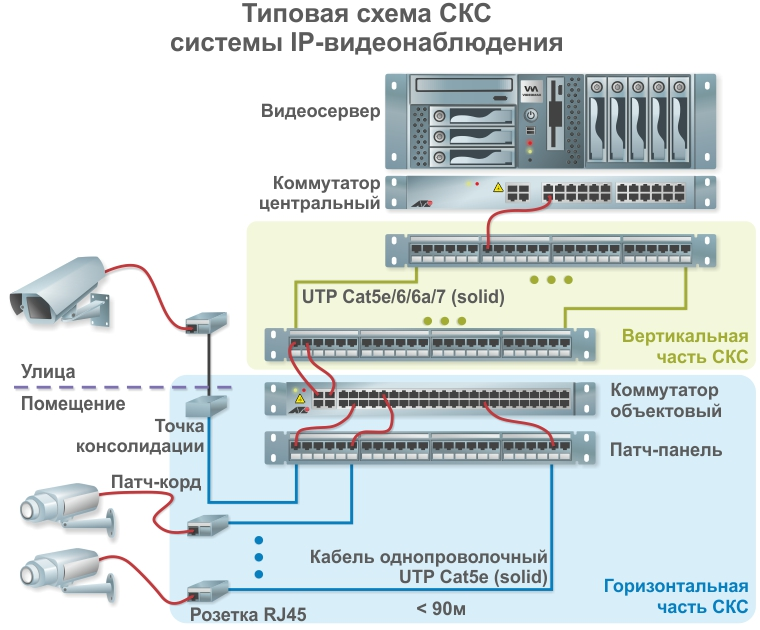

**Рис. 1 — Типовая схема СКС для IP-видеонаблюдения**

Здесь можно заметить, что **ПРАВИЛЬНОЕ** соединение камеры с коммутатором осуществляется через фиксированный сегмент сети между розеткой и патч-панелью, выполненный однопроволочным кабелем (solid).

> **Однопроволочный кабель (solid)** — кабельное изделие, в котором каждая жила образована одним цельным медным проводником.

> **Многопроволочный кабель (patch)** — кабельное изделие, в котором каждая жила образована сплетением множества тонких проводников.

Соединение камеры с розеткой и коммутатора с соответствующим портом патч-панели осуществляется патч-кордом в виде гибкого многопроволочного (patch) кабеля с разъёмами RJ45, изготовленным и протестированным в заводских условиях.

> **Патч-корд** — гибкий соединительный кабель заводского изготовления с разъёмами на обоих концах, предназначенный для коммутации портов активного и пассивного оборудования СКС.

Это единственный вариант соединения, предусмотренный стандартом. Иных вариантов, типа «проложить кабель, обжать RJ45 и воткнуть в камеру и коммутатор», не существует!

### 2.1. Одножильный и многожильный кабель

Чтобы вышеприведённый момент о **ПРАВИЛЬНОМ** соединении камеры с коммутатором усвоился на 100 %, давайте подробнее поговорим о причинах, по которым нельзя обжимать коннекторами RJ45 витую пару для фиксированных участков СКС.

> **Примечание.** По нашему мнению, правильнее говорить «многопроволочный» и «однопроволочный» кабель. Количество жил — это характеристика количества проводников в кабеле. Мы же говорим о типе жилы: один проводник (проволока) или жила, образованная сплетением проводников. Далее будем придерживаться терминов **однопроволочный** и **многопроволочный**.

### 2.2. Причина № 1 против использования RJ45 для solid. Особенности коннекторов RJ45

Коннекторы RJ45 (8P8C) в своей конструкции имеют ножи для прорезания кабеля и обеспечения контакта с жилой. Ножи бывают трёх типов:

- для кабеля с однопроволочной жилой;
- для кабеля с многопроволочной жилой;
- универсальные.

В большинстве своём на рынке присутствуют разъёмы для кабеля с многопроволочными жилами для изготовления патч-кордов. Ножи в таких разъёмах предназначены для раздвигания многопроволочной жилы и создания надёжного контакта со многими проводниками без их повреждения.

Когда ножи врезаются в однопроволочную жилу, они сдавливают медный проводник, который может треснуть и отломиться. В дополнение к этому сдавленная жила не обеспечивает постоянное давление на нож контакта (нет эффекта подпружинивания). Это приводит к тому, что при частых переключениях, вибрациях и других механических воздействиях на кабель и вилку возможно нарушение соединения, пропадание сигнала и неустойчивая связь. Эта ситуация проиллюстрирована на рисунке.

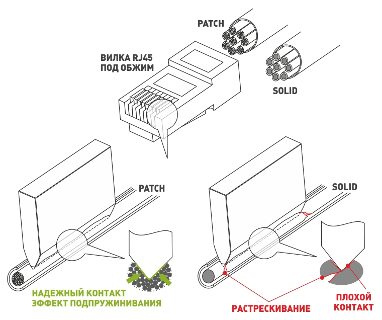

**Рис. 2 — Вилка коннектор RJ45 с кабелем solid и patch**

> **Обратить внимание.** Ещё раз отметим, что вилки RJ45 существуют с ножами для разделки однопроволочной жилы Solid. Они не повреждают жилу и обеспечивают надёжное соединение. Но вилки со специальными ножами для Solid кабеля являются редкостью. В большинстве своём в рознице, покупая «обычный» RJ45, вы приобретаете вилку для Patch кабеля. Другие причины отказа от обжима магистральных кабелей Solid читайте далее.

Обратная ситуация: проектировщик правильно соединил IP-камеру и коммутатор с использованием розеток и патч-панели, но для фиксированного участка (розетка — патч-панель) вместо однопроволочного заложил многопроволочный кабель. При разделке многопроволочного кабеля на кроссе 110-го типа происходит надрезание жилы, и проводники в итоге отделены (разрезаны), что также отрицательно сказывается на надёжности соединения.

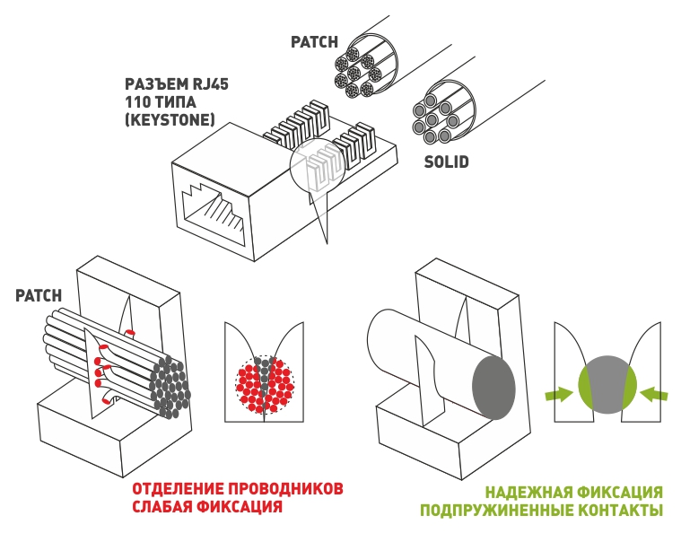

**Рис. 3 — Разъём keystone RJ45 типа 110 с кабелем solid и patch**

В дополнение к этому стоит заметить, что многопроволочный кабель уступает однопроволочному по характеристикам в части передачи информации, и максимальное расстояние для передачи данных значительно сокращается. Многопроволочный кабель имеет смысл использовать только для соединения устройств на расстоянии до 5 м. Именно поэтому длина заводских патч-кордов ограничена 5 метрами.

### 2.3. Причина № 2 против использования RJ45 для solid. Контроль качества заделки жил в RJ45

Процесс полевой заделки RJ45 сложно назвать комфортным. Как правило, это происходит на большой высоте, стоя на стремянке, с минимальным количеством инструмента, без возможности проверить качество соединения и заделки жил кабеля. И даже если соединение проверяют кабельным тестером, то, скорее всего, огрехи заделки кабеля он не покажет, так как электрическое соединение присутствует.

На производстве в заводских условиях заделку жил проверяют не только специализированным высокоточным тестером, но и с использованием микроскопа. Это позволяет проконтролировать, насколько точно ножи вошли в жилу, и гарантировать долгую работу патч-корда в условиях частого отключения-подключения.

В заводских условиях качество прорезания жил разъёма RJ45 контролируется с использованием микроскопа (на рисунке видно, как ножи попали не в жилу кабеля, а сбоку).

### 2.4. Причина № 3 против использования RJ45 для solid. Однопроволочная жила не выдерживает частых перегибаний

Что происходит с однопроволочной жилой, если её перегнуть несколько раз? Правильно — она сломается.

Solid-жилы применяются в кабелях для фиксированных участков соединения жёстко закреплённых устройств. Для любых межблочных соединений устройств, которые не имеют жёсткого крепления, используются только кабели и шлейфы с многопроволочными жилами.

Ровно этот принцип действует и в СКС для видеонаблюдения:

- для соединения патч-панелей и розеток используется однопроволочный кабель Solid;
- для соединения устройств с патч-панелями и розетками — кабель с многопроволочными жилами Patch (основа для патч-кордов).

За счёт этого обеспечивается:

- возможность многократного подключения и отключения устройств;
- перемещение устройств (например, при настройке IP-камер);
- устойчивость к вибрациям (камера на столбе, на производстве, ветровая нагрузка и т. п.).

> **Фиксируем.** Мы подробно разобрали вопрос, почему нужно использовать кабель с однопроволочными жилами для фиксированных участков и многопроволочный для гибких соединений, и почему нельзя обжимать однопроволочный кабель разъёмом RJ45. Нормы СКС не зря говорят, что для подключения любого оконечного устройства нужно поставить розетку, заделать в неё однопроволочный кабель и соединить устройство заводским патч-кордом на основе многопроволочного кабеля.

Всё это просто и очевидно, однако до сих пор многие проектировщики строят СКС для видеонаблюдения, используя типовые подходы для ОПС или СКУД, где главное — всё правильно соединить. В условиях высоких скоростей и питания PoE отход от стандартной схемы СКС чреват проблемами в работе системы. Причём проблемы могут быть самыми неприятными: периодические потери связи, перебои, потери пакетов, то есть то, что называется «блуждающей неисправностью».

## 3. Тип кабеля для СКС: UTP/FTP/нг(А)/LS/HF/FRLS/FRHF

Какой кабель лучше: UTP или FTP? Это частый вопрос, который задают нам проектировщики.

> **UTP (Unshielded Twisted Pair)** — неэкранированная витая пара.

> **FTP (Foiled Twisted Pair)** — витая пара с общим экраном из фольги.

Логика подсказывает, что экран помогает защититься от помех и электромагнитных наводок. Однако всё немного сложнее.

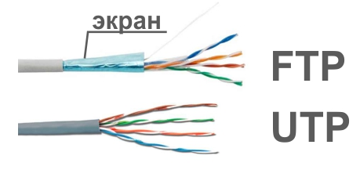

**Рис. 5 — UTP- или FTP-кабель?**

Наиболее распространены два типа кабелей: FTP — с экраном, и UTP — без экрана.

Экран кабеля — это фактически антенна, которая сама по себе может притягивать электромагнитное излучение и передавать его на кабель внутри экрана. Чтобы экран кабеля мог обеспечить защиту, необходимо, чтобы токи от электромагнитных наводок, которые образуются в металле экрана, могли «стекать» в землю. Таким образом, экран без подключения к заземлению вредит передаче информации.

Подключение экрана к заземлению нужно осуществлять с соблюдением соответствующих правил:

- подключение всех экранов должно осуществляться в одной точке;
- при подключении экрана в двух точках необходимо обеспечить выравнивание потенциалов (например, заземление возле камеры должно иметь тот же потенциал, что и «земля» в серверной);
- компоненты СКС должны иметь соответствующее исполнение для коммутации проводника заземления.

Если на объекте нет гарантий наличия заземления, выполненного в соответствии с нормами, то, без сомнения, лучше использовать кабель UTP.

Недаром 90 % продаж витой пары в России приходится именно на UTP. Стоит ещё отметить, что использование кабеля FTP не даёт никаких преимуществ по совместной прокладке с другими кабелями в лотке и тем более с силовыми.

### 3.1. Требования пожарной безопасности

Отдельного рассмотрения заслуживает вопрос сертификации кабеля на соответствие требованиям норм пожарной безопасности. В стандартах СКС нет требований по огнестойкости или выделению вредных веществ при пожаре, но нужно принимать во внимание общие требования к кабельным изделиям, применяемым в зданиях и сооружениях различного функционального назначения.

Согласно требованиям ГОСТ 31565-2012 в зданиях различного функционального назначения следует применять кабельные изделия категории **нг(А)** (не распространяющие горение при групповой прокладке, категории А), сертифицированные в установленном порядке.

Кроме того, согласно таблице 2 ГОСТ 31565-2012 могут потребоваться исполнения кабельных изделий типа **LS** или **HF** в зависимости от того, является ли данный объект зданием с массовым пребыванием людей или нет.

В некоторых случаях для отдельных видов объектов и систем возможны более жёсткие требования к кабельным изделиям. Так, в соответствии с СП 134.13330.2012 на объектах, для которых согласно таблице 1 требуется оснащение объекта видеонаблюдением (прим.: системой телевизионного наблюдения в терминологии «Свода правил»), следует соблюдать требования раздела 5.15 стандарта и учитывать возможность применения огнестойкого кабеля исполнения **FRLS (FRHF)** для обеспечения живучести системы при пожаре (при условии, что система видеонаблюдения участвует в организации процесса эвакуации людей при пожаре и руководстве при развёртывании средств подразделений пожарной охраны).

При проектировании конкретного объекта рекомендуем изучить существующие требования нормативных документов, а также ведомственные нормативные требования организации заказчика, если таковые имеются. Соответствующие указания должны быть приведены в техническом задании на проектирование.

## 4. 100 м — это не 100 м

На типовой схеме СКС для системы видеонаблюдения, приведённой в начале статьи, вы заметили, что фиксированный участок составляет 90 м. А где же обещанные 100 м?

Дело в том, что 100 м — это соединение «коммутатор — камера», включая запас на спуски, подъёмы и соединение патч-кордами. При всём при этом использование патч-кордов также сокращает максимальное расстояние.

Мы уже сказали, что многопроволочный кабель, из которого делают патч-корды, чтобы они были гибкими, хуже по характеристикам, чем однопроволочный, и итоговая длина считается по формуле:

$$L_2 + 2 \times (L_1 + L_3) < 100\ \text{м}$$

где:
- $L_1$ — длина патч-корда со стороны коммутатора;
- $L_2$ — длина фиксированного участка (розетка — патч-панель);
- $L_3$ — длина патч-корда со стороны камеры.

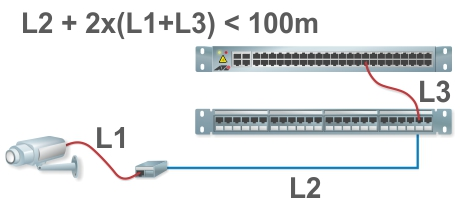

**Рис. 6 — Расчёт длины сегмента линка, включая патч-корды**

Максимальная длина в 100 м складывается из длины фиксированного участка и двойной длины соединительных кабелей.

При проектировании рекомендуется производить расчёт длин, исходя из ограничения в 90 м, и дополнительно учитывать сокращение длины из-за использования патч-кордов.

## 5. Подключение уличных камер на здании

Для прокладки кабеля по улице до наружной камеры требуется механически прочный кабель, устойчивый к воздействию ультрафиолета и низких температур. В основном это кабель с изоляцией из полиэтилена низкого давления (ПНД). Однако такой кабель нельзя прокладывать внутри здания ввиду его несоответствия требованиям по исполнению типа нг(А).

Чтобы решить эту проблему, стандарт СКС допускает использование точек консолидации.

> **Точка консолидации** — переходное устройство, которое соединяет два кабеля (например, уличный и внутренний).

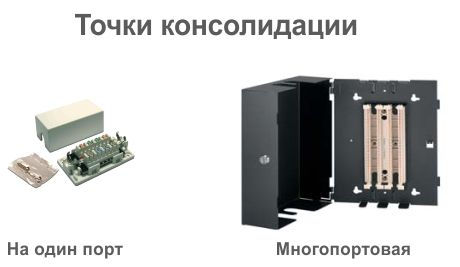

**Рис. 7 — Примеры точек консолидации**

Точки консолидации позволяют осуществить переход с одного типа кабеля на другой — с уличного на внутренний.

Точки консолидации бывают для соединения одного или нескольких кабелей. Устанавливаются они непосредственно на входе уличных кабелей в здание и должны иметь возможность обслуживания. Не следует «зашивать» их в гипсокартон или замуровывать в стену.

## 6. Модульные патч-панели или панели с кроссом 110 типа?

Патч-панели существуют двух видов: 110 типа и модульные.

> **Патч-панель 110 типа** — панель, подразумевающая наличие групп коннекторов 110 типа для расключения жил сетевого кабеля.

> **Модульная патч-панель** — панель, подразумевающая установку отдельных модулей-розеток RJ45, на которые индивидуально расшиваются кабели. Такой тип модулей ещё называют **кейстоун (keystone)**.

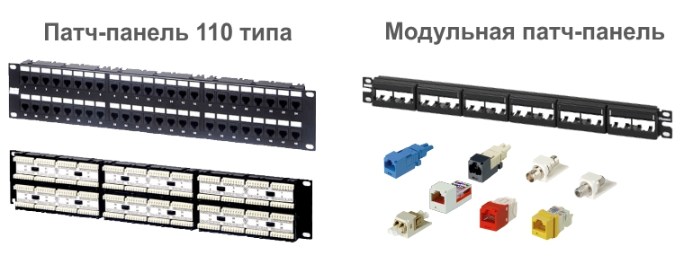

**Рис. 8 — Патч-панель 110 типа и модульная**

Модульные патч-панели обходятся несколько дороже, но обладают рядом преимуществ:

- **Гибкость конфигурации.** Возможно установить модули разного типа. В одной патч-панели могут быть модули пятой и шестой категорий, оптические модули и даже модули BNC, RCA и S-Video.
- **Цветовая идентификация.** Модули могут быть разного цвета, что повышает удобство обслуживания. Например, цветом можно отделить модули шестой категории от пятой либо вертикальную часть СКС от горизонтальной.
- **Упрощённая сертификация.** Модульные патч-панели имеют преимущества и с точки зрения сертификации СКС. Если вам потребуется добавить новые модули в патч-панель либо переобжать один из портов, то, в отличие от патч-панели 110 типа, нет необходимости заново сертифицировать все порты в патч-панели.

Мы затронули тему сертификации СКС. Об этом стоит рассказать подробнее.

## 7. Сертификация СКС

Страшное слово «сертификация» у нас ассоциируется с чиновниками, комиссиями, проверками. В СКС под сертификацией понимается тест линка фиксированной части от розетки до патч-панели на соответствие категории. Проверяется это специальным тестером. Результаты в электронном или бумажном виде передаются заказчику и являются частью исполнительной документации.

Как видите, ничего страшного нет. Конечно, при том условии, что всё спроектировано в точном соответствии со стандартами и используются качественные компоненты соответствующей категории.

Некоторые производители сетевых компонентов дают системную гарантию на 15 и даже 25 лет на сертифицированные СКС. Заказчики об этом знают и вполне могут потребовать у инсталлятора провести сертификацию и предоставить отчёт по линкам. Если в проекте есть допущения и не все требования стандартов и правил построения СКС выполнены, то сертификация это обязательно выявит.

## 8. Проектирование кросса

> **Кросс** — место, где осуществляется коммутация портов СКС и коммутаторов с использованием патч-кордов.

В большинстве случаев кросс для коммутации оборудования системы видеонаблюдения выделен в отдельное помещение, шкаф, стойку либо занимает выделенную обособленную часть в общем кроссе. Проектирование кросса заключается в определении взаимного расположения патч-панелей и коммутаторов.

Существует два типовых подхода:

1. **Создание поля патч-панелей (пассивной части СКС) и поля коммутаторов.**
2. **Каждый коммутатор окружается патч-панелями** с теми портами, которые предназначены для подключения к этому коммутатору.

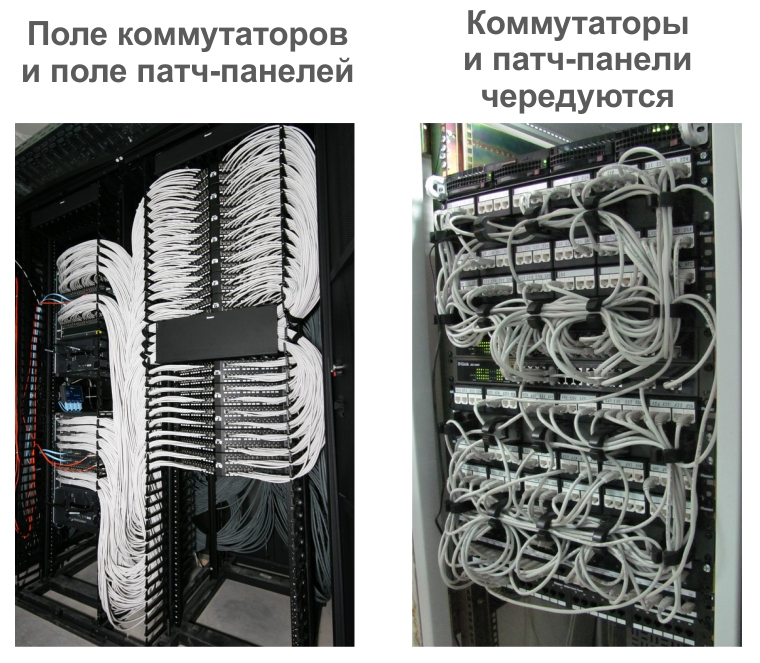

**Рис. 10 — Кроссовая с полем патч-панелей и полем коммутаторов и чередование патч-панелей и коммутаторов**

С точки зрения систематизации первый вариант предпочтителен. В этом случае проектировщик создаёт поле патч-панелей и задаёт в нём произвольную логику: все камеры по порядку, все уличные и все внутренние камеры и т. п. Соединение патч-панелей с коммутаторами осуществляется длинными патч-кордами. При обслуживании и модернизации системы переключение между портами удобное, наглядное и быстрое.

**Минусы первого варианта:**
- удлиняется соединение;
- требуются боковые организаторы или кольца для укладки патч-кордов.

Во втором варианте, когда коммутаторы и порты, к которым необходимо подключение, располагаются рядом, соединение осуществляется короткими патч-кордами. В этом случае на патч-панели расшиваются кабели от тех камер, которые предполагается подключить к рядом стоящему коммутатору. Расшивка панелей осуществляется, что называется, «вразнобой». Это может затруднить поиск нужного порта при обслуживании и эксплуатации системы видеонаблюдения.

Какой из двух вариантов выбрать — решать вам. Часто у местного системного администратора есть на этот счёт предпочтения. Рекомендуется согласовать схему размещения оборудования в кроссе у IT-службы заказчика во избежание проблем при сдаче системы в эксплуатацию.

Вне зависимости от того, какой вариант взаимного расположения коммутаторов и патч-панелей вы выбрали, настоятельно рекомендуется использование организаторов для укладки патч-кордов. Организаторы отнимают порой ценные юниты (U) в стойке, но без них обслуживание СКС становится затруднительным. Да и итоговый внешний вид кросса без организаторов заказчику точно не понравится, что вызовет дополнительные затруднения при сдаче объекта.

Организаторы — обязательный элемент кроссового шкафа.

## 9. Оптика. Магистральные линии, вертикальная часть СКС и периметр

Волоконно-оптические линии используются для соединения кроссовых, серверных, коммутаторов.

> **Волоконно-оптическая линия связи (ВОЛС)** — линия передачи данных, в которой носителем информации является оптическое излучение, распространяющееся по оптическому волокну.

Волоконно-оптические линии обладают рядом преимуществ перед медными:

- большая длина (до нескольких десятков километров);
- гальваническая изоляция;
- защита от помех и наводок (возможна совместная прокладка с силовыми кабелями);
- высокие скорости передачи информации.

У оптики нет альтернатив для периметральных систем видеонаблюдения.

Работать с оптикой не сложнее, чем с медным кабелем, при наличии специального инструмента: сварочного аппарата и рефлектометра. Существует множество организаций, которые специализируются на сварке и сертификации оптоволоконных линий. Стоимость подобного рода услуг невысока. Проектировщику следует только обеспечить соответствие требованиям стандарта СКС и заложить в проект всё необходимое для обустройства оптических кроссов.

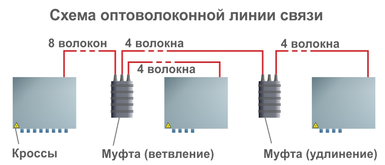

**Рис. 12 — Типовая схема оптической линии связи**

В оптоволоконной линии всегда присутствуют оптические кроссы.

> **Оптический кросс** — устройство, предназначенное для коммутации оптических волокон, а также для размещения запаса волокон и защиты сварных соединений.

> **Муфта** — устройство для ответвления и сращивания волоконно-оптического кабеля.

Частый вопрос: «Сколько сварок в волоконно-оптической линии допускается?» Каждое сварное соединение в муфте или кроссе — это неоднородность, которая вызывает потери, связанные с переотражениями и ослаблением светового пучка.

Потери в качественном сварном соединении составляют от 0,02 дБ, что в несколько раз меньше потерь на разъёмных соединениях — 0,15–0,3 дБ. С учётом того, что общие максимальные потери в линии измеряются единицами дБ, при разумном количестве сварных точек потерями на сварке можно пренебречь.

Расчёт затуханий в оптоволоконной линии должен производиться с учётом потерь в кабеле, в сварных точках, в разъёмных соединениях. Расчёт достаточно фундаментален и заслуживает отдельной статьи. Для локальных кроссов и расстояний до нескольких километров, когда очевидно, что запас длины и количества соединений достаточно большой, расчёт можно и не производить.

### 9.1. Состав оптического кросса

Оптический кросс бывает двух видов:

- настенного исполнения;
- для установки в 19-дюймовую стойку.

В кроссе предусмотрено место для намотки запаса оптоволоконных жил для того, чтобы можно было переварить дефектные соединения несколько раз. Кроме того, кросс имеет ложемент для фиксации КДЗС.

> **КДЗС (Комплект для защиты сварных стыков)** — гильзы, которые надеваются на место сварки и надёжно фиксируются во избежание перегибов и обламывания.

Часто в кроссах устанавливают готовые сплайс-кассеты, выполняющие роль устройств для намотки оптоволоконных жил и монтажа КДЗС.

Помимо запаса длины оптических волокон внутри кросса рекомендуется предусмотреть запас кабеля на входе в кросс. Как правило, это скрученный в несколько витков и сформированный в небольшую бухту волоконно-оптический кабель. Не лишним будет указать на это в проектной документации.

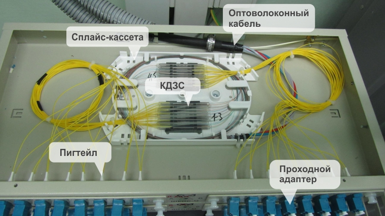

**Рис. 14 — Состав оптического оптоволоконного кросса**

Оптоволоконная жила сваривается с ответной частью, так называемым пиг-тэйлом (pig-tale).

> **Пиг-тэйл (pig-tale)** — оптический коннектор (вилка) с торчащим из неё оптическим кабелем до 1 метра длиной.

Именно эту часть и сваривают с оптическим волокном в приходящем кабеле. На выходе из кросса устанавливают проходные адаптеры. Внутри кросса в них фиксируются пиг-тэйлы, снаружи — это розетки для оптических патч-кордов.

Существует несколько типов адаптеров (розеток). Рассмотрим основные:

- **FC** — металлический круглый коннектор, подразумевающий винтовое соединение. Обеспечивает надёжное и виброустойчивое соединение для самых ответственных участков. Из недостатков — дополнительное время на отвинчивание коннектора при переключениях. В плотном кроссе с большим количеством разъёмов добраться до коннектора и отвинтить его может быть проблематично.
- **SC** — пластиковый недорогой разъём, обеспечивает быструю коммутацию. Фиксация в разъёме на защёлке.
- **LC и LC Duplex** — то же самое, что SC, но имеет меньшие габариты. Обеспечивает в два раза большую плотность по сравнению с SC и FC. Существует вариант LC Duplex — сдвоенный разъём LC для подключения сдвоенных патч-кордов LC (в одном разъёме — жилы RX и TX). LC Duplex де-факто стандарт для SFP-модулей.

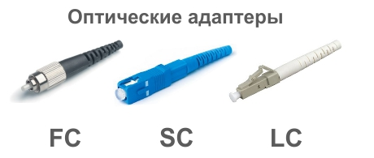

**Рис. 15 — Типы оптических разъёмов FC, SC и LC**

Выбор типа оптического адаптера для оптического кросса не регламентируется и остаётся за заказчиком или проектировщиком.

Так какой же тип адаптера выбрать для кросса? Фактически вы можете выбрать любой тип пиг-тэйла и соответствующий ему проходной адаптер. Необходимо лишь выбрать подходящий патч-корд. В номенклатуре любого производителя оптических патч-кордов вы найдёте различные варианты: LC-FC, LC-ST, ST-FC и т. п.

- Самое надёжное соединение — **FC**.
- Самое удобное — **SC**.
- Самое компактное — **LC**.

И даже более того, существуют проходные адаптеры, которые позволяют соединять разные виды разъёмов, например, с одной стороны пиг-тэйлы SC, а с другой — подключение патч-кордов FC. Вы можете как в конструкторе сделать так, как вам покажется наилучшим. Каких-то жёстких правил здесь нет. Если в ТЗ нет указаний на тип используемых адаптеров (розеток), то вам никто не скажет, что вы сделали что-то неправильно :)

Подробнее о построении оптоволоконных линий связи для видеонаблюдения на периметре мы рассказывали в нашей статье «Видеонаблюдение на периметре. Часть 3: построение ЛВС, оптика, коммутаторы».

## 10. Заключение

Мы рассмотрели основные моменты, которые вызывают затруднения при проектировании СКС для IP-видеонаблюдения. Остались в стороне вопросы правильной прокладки кабеля, соблюдение радиусов. Не поговорили о проектировании кабельных лотков, о том, что верхние кабели в лотке не должны сплющивать нижние, и все прочие требования для СКС. Это безусловно важно и требует от проектировщика знания стандартов и правил. Данную информацию можно почерпнуть из специализированной литературы или соответствующих обучающих курсов.

С примерами построения СКС для IP-видеонаблюдения можно ознакомиться в одном из готовых проектов у нас на сайте. В этом разделе вы найдёте проекты систем IP-видеонаблюдения в различного рода административных зданиях, проекты защиты периметра с использованием оптических линий связи и другие. Все проекты прошли проверку специалистов компании Видеомакс и имеют реальное воплощение.

## FAQ

**Вопрос: Можно ли обжать однопроволочный кабель (solid) разъёмом RJ45 и подключить его напрямую к камере и коммутатору?**

Ответ: Нет. Для фиксированных участков СКС (розетка — патч-панель) необходимо использовать однопроволочный кабель, а для соединения устройств с розетками и патч-панелями — заводские патч-корды на основе многопроволочного кабеля. Обжим solid-кабеля разъёмом RJ45 для patch-кабеля приводит к повреждению жилы, нарушению контакта и «блуждающим неисправностям».

**Вопрос: Какой кабель выбрать — UTP или FTP?**

Ответ: Если на объекте нет гарантированного заземления, выполненного по нормам, лучше использовать UTP. Экран FTP-кабеля без заземления работает как антенна и может ухудшать передачу сигнала. UTP составляет около 90 % продаж витой пары в России.

**Вопрос: Какие требования пожарной безопасности предъявляются к кабелю для СКС?**

Ответ: Согласно ГОСТ 31565-2012 в зданиях различного функционального назначения следует применять кабельные изделия категории нг(А). В зависимости от назначения объекта могут потребоваться исполнения LS или HF. Для отдельных объектов и систем, участвующих в эвакуации при пожаре, может потребоваться огнестойкий кабель FRLS (FRHF).

**Вопрос: Почему максимальная длина фиксированного участка составляет 90 м, а не 100 м?**

Ответ: 100 м — это общая длина канала «коммутатор — камера», включая патч-корды. Формула расчёта: $L_2 + 2 \times (L_1 + L_3) < 100$ м, где $L_2$ — фиксированный участок, $L_1$ и $L_3$ — патч-корды. При проектировании рекомендуется исходить из ограничения 90 м для фиксированного участка.

**Вопрос: Что такое точка консолидации и зачем она нужна?**

Ответ: Точка консолидации — переходное устройство для соединения двух кабелей, например уличного (с изоляцией ПНД) и внутреннего (нг(А)). Она позволяет выполнить переход с одного типа кабеля на другой на входе уличного кабеля в здание. Точки консолидации должны быть доступны для обслуживания.

**Вопрос: Чем модульная патч-панель лучше патч-панели 110 типа?**

Ответ: Модульная патч-панель позволяет устанавливать модули разных типов (категорий 5 и 6, оптические, BNC, RCA, S-Video), использовать цветовую идентификацию и упрощает сертификацию: при добавлении или переобжиме одного порта не требуется заново сертифицировать все порты.

**Вопрос: Сколько сварок допускается в волоконно-оптической линии?**

Ответ: Жёсткого ограничения нет. Потери в качественном сварном соединении составляют от 0,02 дБ, что значительно меньше потерь на разъёмных соединениях (0,15–0,3 дБ). При разумном количестве сварных точек потерями на сварке можно пренебречь. Расчёт затуханий рекомендуется для протяжённых линий.

**Вопрос: Какой тип оптического адаптера выбрать для кросса?**

Ответ: Выбор не регламентируется. FC — самое надёжное соединение, SC — самое удобное, LC — самое компактное. Существуют проходные адаптеры для соединения разных типов разъёмов. Если в ТЗ нет указаний, выбор остаётся за заказчиком или проектировщиком.