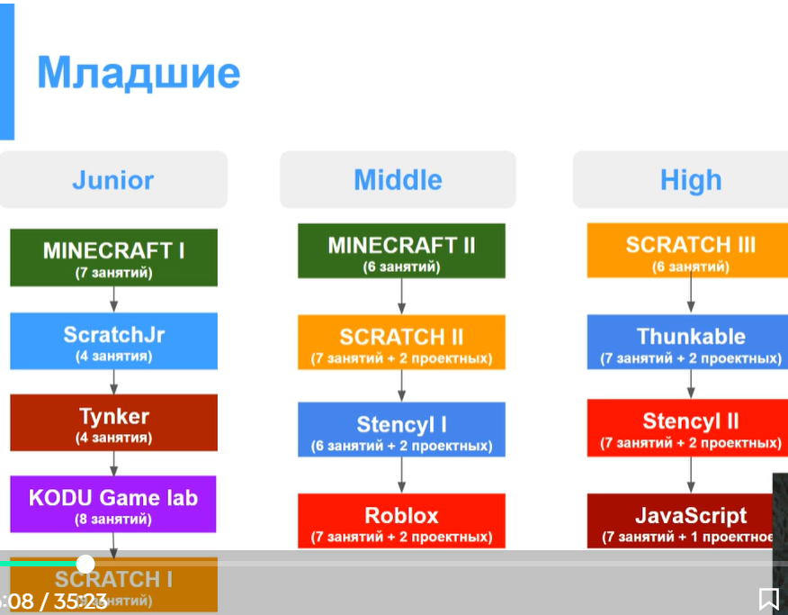
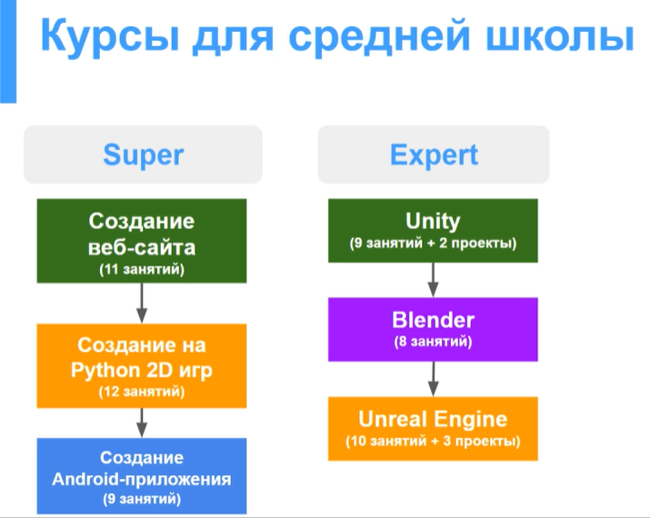
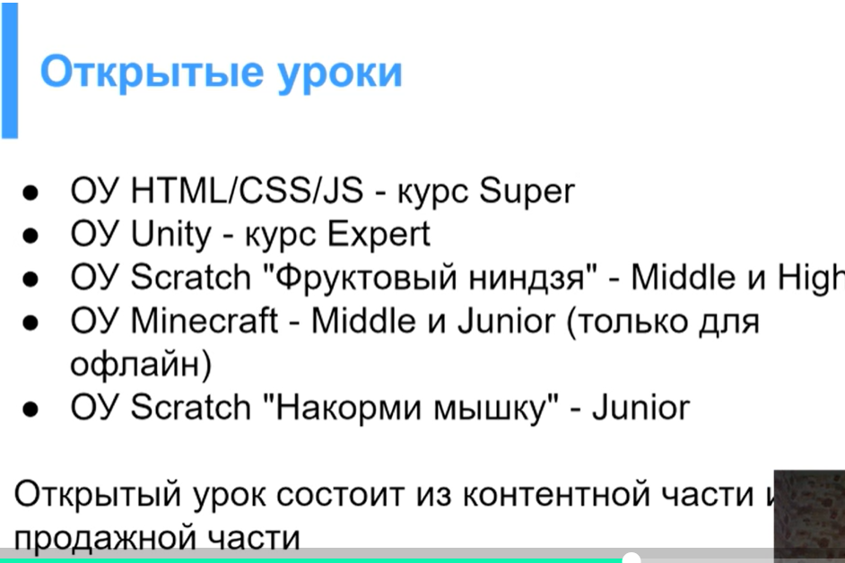
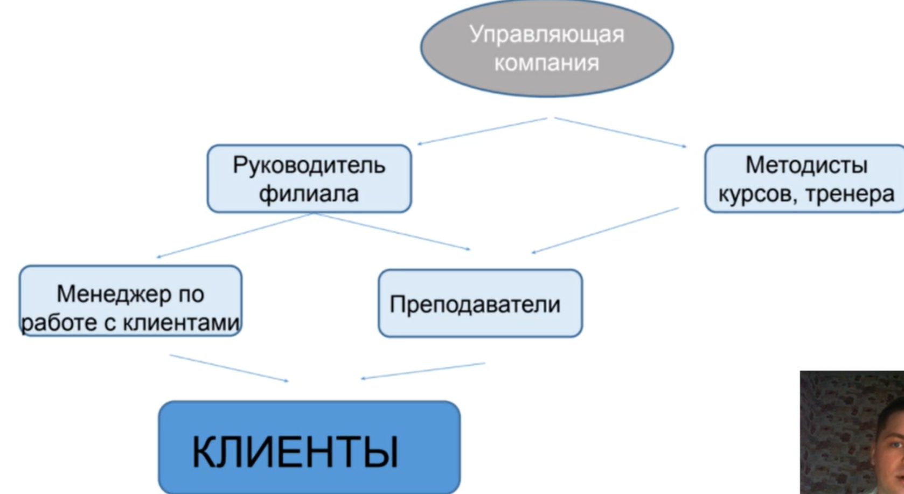
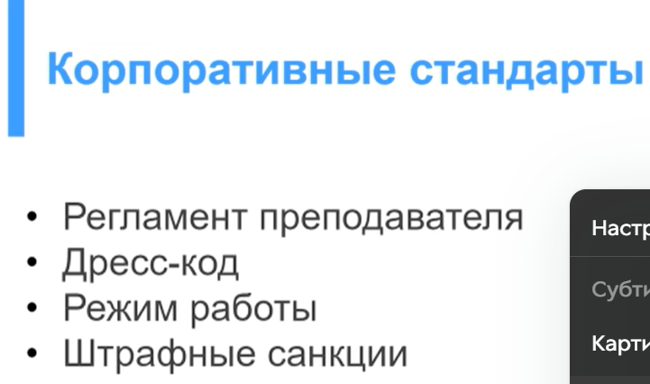

Так выглядят курсы (курсы состоят из модулей, которые состоят из занятий): 

32 занятия на курс.

Каждый курс/модуль независим и начинается с нуля.

Junior. 

1. Minecraft (с модом каким-то)
2. Scratch - Scratch — это визуальный язык программирования для детей, с помощью которого можно создавать анимации, игры и интерактивные истории
3. Tynker 
4. Kodu (3d)
5. Stancyl
6. Roblox
7. Thunkable
8. JavaScript

ДЛЯ СРЕДНЕЙ ШКОЛЫ:

Открытые уроки:

Структура и культура:

1. Упр компания - продает идею и эдементы
2. Руководитель флиала - покупатель франшизы
3. Методисты курсов - те, кто готовят материал
4. Преподаватели получают материал и место
5. Менеджер по работе с клиентами - тот, кто доебывает людей и предлагает купить что-нибудь

Еще есть вот такие документы и регламенты:

