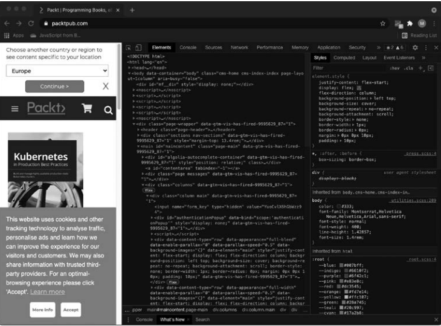
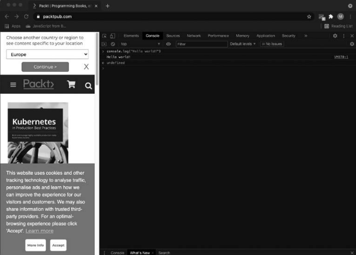
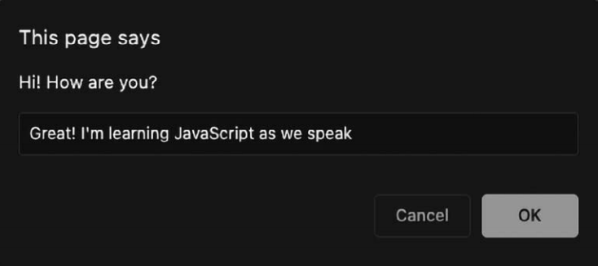
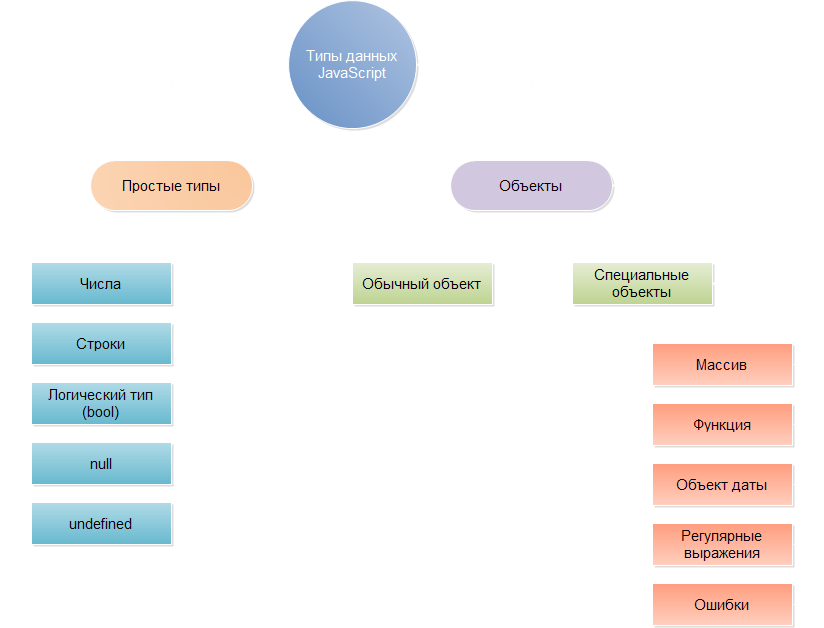
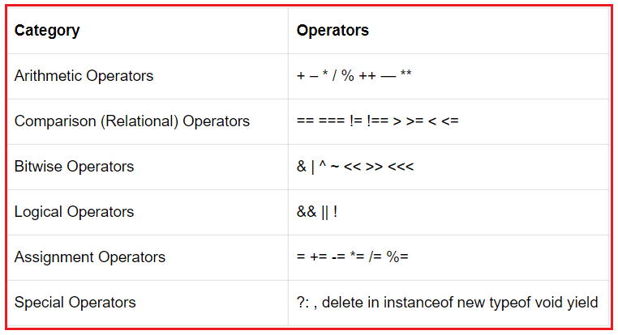

<details><summary>Кратко</summary>

## Краткая выжимка: Начало работы с JavaScript и Основы JavaScript (Главы 1–2)

### Глава 1. Начало работы с JavaScript

**Что такое JavaScript**
- Язык программирования <mark>для клиентской (браузер) и серверной (Node.js) части.</mark>
- <mark>Интерпретируемый: выполняется «на лету» движком браузера, без компиляции.</mark>
- <mark>Отвечает за интерактивность: всплывающие окна, фильтры, чаты, подменю.</mark>

**Среда разработки**
- <mark>Достаточно браузера + текстового редактора.</mark>
- <mark>Рекомендуется IDE (Visual Studio Code, Atom, Sublime Text, WebStorm)</mark> с подсветкой синтаксиса, отладкой и автодополнением.
- Браузеры: Chrome или Firefox (Internet Explorer не подходит).
- Альтернатива — онлайн-редакторы (поиск «online JavaScript IDE»).

**Три технологии веб-страницы**
- **HTML** — содержимое (теги).
- **CSS** — оформление (шрифты, цвета, расположение).
- **JavaScript** — поведение и взаимодействие.
- **ECMAScript (ES6)** — стандарт/спецификация JavaScript.

**Консоль браузера**
- <mark>Открывается по F12 (Windows) или Inspect (macOS).</mark>
- `console.log("Hello world!");` — вывод в консоль.
- Также: `console.table()`, `console.error()`.

**Добавление JavaScript на страницу**
1. **Внутри HTML** <mark>между тегами `<script>...</script>`.</mark>
2. **Внешний файл** <mark>`.js`, подключается через `<script src="file.js"></script>`.</mark>
    - Лучше: код организованнее, переиспользуется.
    - Пути: абсолютный (от корня) или относительный (`example/file.js`, `../file.js`).

**Форматирование кода**
- **Отступы** — для читаемости блоков `{}`.
- **Точки с запятой** — в конце операторов (не после блоков `if`, циклов).
- **Комментарии**: `//` однострочный, `/* ... */` многострочный.

**Полезные функции**
- `alert("текст")` — всплывающее окно.
- `prompt("вопрос")` — окно ввода, возвращает строку.
- `Math.random()` — случайное число от 0 до 1; `Math.floor(Math.random() * 100)` — целое от 0 до 99.

---

### Глава 2. Основы JavaScript

**Переменные**
- <mark>Объявление: `let`, `var`, `const`.</mark>
    - `let` — <mark>локальная, изменяемая (основной вариант).</mark>
    - `var` — <mark>глобальная, устаревшая.</mark>
    - `const` — <mark>только для чтения, переназначение вызывает `TypeError`</mark>.
- Имена: строчная буква, описательные, без пробелов, camelCase (`ageOfBuyer`).

**Примитивные типы данных**

| Тип       | Пример                                         | Особенности                                               |
|-----------|------------------------------------------------|-----------------------------------------------------------|
| String    | `'Hi'`, `"Hi"`, `` `Hi ${name}` ``             | Три вида кавычек; шаблонные строки с `${}`                |
| Number    | `5`, `1.5`, `1.4e15`, `0o10`, `0x3E8`, `0b101` | Один тип для всех чисел (64-бит float)                    |
| BigInt    | `90071992547409920n`                           | Для чисел вне диапазона Number; нельзя смешивать с Number |
| Boolean   | `true`, `false`                                | Логические значения                                       |
| Symbol    | `Symbol("desc")`                               | Уникальные значения, даже с одинаковым описанием          |
| undefined | `let x;`                                       | Переменная без значения                                   |
| null      | `let x = null;`                                | Явно пустое значение                                      |

**Escape-символы**
- `\n` — новая строка, `\t` — табуляция, `\\` — обратный слеш, `\"` — кавычка.
- `\"` и `\'` — экранирование кавычек внутри строк.

**Анализ и преобразование типов**
- `typeof x` — возвращает тип переменной (для `null` ошибочно возвращает `"object"`).
- `String()`, `Number()`, `Boolean()` — явное преобразование.
    - `Number("")` и `Number(null)` → `0`.
    - `Number("hello")` → `NaN`.
    - `Boolean("false")` → `true` (любая непустая строка — true).
- Неявное преобразование: `2 * "2"` → `4`, но `2 + "2"` → `"22"`.

**Операторы**

*Арифметические:*
- `+` (сложение/конкатенация), `-`, `*`, `/`, `**` (степень), `%` (остаток).
- `++` / `--` — инкремент/декремент.
    - Постфикс (`x++`) — возвращает старое значение, потом увеличивает.
    - Префикс (`++x`) — сначала увеличивает, потом возвращает.

*Приоритет:* `()` → `**` → `++/--` → `* / %` → `+ -`.

*Присваивание:*
- `=`, `+=`, `-=`, `*=`, `/=`, `**=`, `%=`.

*Сравнение:*
- `==` — нестрогое (только значение), `===` — строгое (значение + тип) — рекомендуется.
- `!=` / `!==` — аналогично.
- `>`, `>=`, `<`, `<=`.

*Логические:*
- `&&` — И (true, если оба истинны).
- `||` — ИЛИ (true, если хотя бы одно истинно).
- `!` — НЕ (отрицание).

---

### Итог
- JavaScript — интерпретируемый язык для веб-интерактивности.
- Код добавляется в HTML или внешним файлом.
- Переменные (`let`, `const`) хранят значения разных примитивных типов.
- `typeof` и преобразования (`String`, `Number`, `Boolean`) помогают управлять типами.
- Операторы позволяют вычислять, сравнивать и комбинировать значения.

</details>

# 1. Начало работы с JavaScript

Итак, вы решили начать изучать JavaScript — отличный выбор! <mark>JavaScript — язык программирования, который может применяться и в серверной, и в клиентской части приложения.</mark>

> Серверная часть приложения — <mark>внутренняя логика, которая обычно выполняется на компьютерах в центрах обработки данных и взаимодействует с базой данных.</mark>
>
> Клиентская часть — <mark>часть приложения, которая запускается на устройстве пользователя, часто с использованием браузера для JavaScript.</mark>

Вполне вероятно, что вы уже пользовались функциями, написанными на JavaScript, — особенно если работали в таких браузерах, как Chrome, Firefox, Safari или Edge. JavaScript чрезвычайно распространён. После открытия страницы вам предлагается принять cookie-файлы. Как только вы нажимаете ОК, всплывающее окно исчезает — это результат работы JavaScript. Когда вы перемещаетесь по разделам сайта и открываете подменю, также работает JavaScript. Или когда вы фильтруете товары в каталоге интернет-магазина. А как насчёт чатов, которые выскакивают в считаные секунды пребывания на сайте? Что ж, вы правы — это также JavaScript!

<mark>Практически любое взаимодействие, которое мы осуществляем с веб-страницами, происходит благодаря JavaScript.</mark> Кнопки, которые вы нажимаете, поздравительные открытки, которые создаёте, вычисления, которые проводите. Всё, чему мало статичной страницы, требует JavaScript.

В этой главе мы затронем следующие темы:

- почему надо изучать JavaScript;
- как настроить среду разработки;
- как браузер понимает JavaScript;
- как использовать консоль браузера;
- как добавить JavaScript на веб-страницу;
- как написать код JavaScript.

Решения упражнений и проектов, а также ответы на вопросы для самопроверки находятся в приложении.

## Почему надо знать JavaScript

<mark>Примеры распространённых и эффективных библиотек: React, Vue.js, jQuery, Angular и Node.js </mark>(не переживайте, если для вас это пока просто названия: мы кратко рассмотрим их в самом конце книги).

## Настройка среды разработки

Есть множество способов настройки среды программирования JavaScript. Скорее всего, ваш компьютер уже оснащён минимальным набором необходимого для работы с JavaScript. Рекомендуем немного упростить свою жизнь и использовать встроенную среду разработки (IDE).

### Встроенная среда разработки

> Встроенная среда разработки (IDE) — специальное приложение для написания, запуска и отладки кода.

Однако <mark>IDE способна на большее. Обычно в ней есть функция подсветки синтаксиса:</mark> определённые элементы кода выделяются определённым цветом, что позволяет быстрее находить ошибки. <mark>Другая полезная особенность — это автодополнение кода:</mark> редактор сам предлагает варианты заполнения, доступные в текущем месте кода. <mark>Большинство IDE содержат специальные плагины</mark>, которые помогают сделать работу интуитивно понятной и добавить дополнительные функции, например горячую перезагрузку (hot reload) в браузере.

Существует множество IDE, и все они отличаются наборами предлагаемых функций.

### Браузер

Вам также понадобится браузер. Большинство браузеров отлично подходят для задач JavaScript, но лучше не использовать Internet Explorer, который не поддерживает его обновлённые функции. Два хороших варианта: Chrome и Firefox. Они прекрасно работают с актуальным функционалом JavaScript, к тому же располагают полезными плагинами.

### Дополнительные инструменты

В своей работе не проходите мимо дополнительных возможностей, используемых при программировании, — в том числе <mark>плагинов браузеров, которые помогут вам с отладкой или упростят просмотр страницы.</mark> На начальном этапе вам всё это не понадобится; тем не менее уже сейчас берите на заметку инструменты, которые ценят другие разработчики.

### Онлайн-редактор

Это хорошее решение в случае, если у вас нет компьютера (возможно, только планшет) или вы не можете ничего на него устанавливать. В частности, для таких ситуаций есть отличные онлайн-редакторы. Мы не даём конкретных названий: онлайн-редакторы быстро развиваются, и предложенный нами список, вероятно, устареет к моменту выхода книги. Сделайте в интернете запрос online JavaScript IDE — система выдаст вам множество результатов, где вы сможете начать программировать на JavaScript простым нажатием кнопки.

## Как браузер понимает JavaScript

> <mark>Интерпретируемый язык — язык программирования, код которого распознаётся компьютером в процессе выполнения, без предварительной компиляции.</mark>
>
> <mark>Интерпретатор — «движок», понимающий и выполняющий JavaScript.</mark>

JavaScript является интерпретируемым языком программирования: это значит, компьютер распознаёт его в процессе работы кода. <mark>Некоторые языки перед запуском кода требуют обработки (данный процесс называется компиляцией) — но для JavaScript в этом нет необходимости.</mark> Компьютер интерпретирует JavaScript на лету.

<mark>Веб-страница — это не только JavaScript. Она создаётся с помощью трёх языков: HTML, CSS и JavaScript.</mark>

> HTML — <mark>язык разметки, определяющий содержимое веб-страницы.</mark>
>
> CSS — <mark>язык стилей, задающий внешний вид веб-страницы (размер шрифта, семейство шрифтов, расположение текста).</mark>
>
> ECMAScript — <mark>спецификация (стандартизация) языка JavaScript.</mark>

HTML определяет то, что отображается на странице: её содержимое хранится в нём. Если на странице есть абзац, в HTML-коде это будет прописано. Видим заголовок — значит, в HTML он тоже есть. И так далее. HTML состоит из элементов, которые называются тегами. Они описывают конкретный компонент страницы. Вот небольшой пример кода страницы с текстом Hello world!:

```html
<html>
  <body>
    Hello world!
  </body>
</html>
```

Работая с JavaScript, вы рано или поздно столкнётесь с термином ECMAScript. Это спецификация, или стандартизация, для языка JavaScript. Текущий стандарт — ECMAScript 6 (также называемый ES6). Браузеры используют его для поддержки JavaScript (в дополнение к таким возможностям, как объектная модель документа (DOM), — её мы рассмотрим позже). <mark>Существует множество незначительно различающихся реализаций JavaScript, и ECMAScript можно считать базовой спецификацией, про которую с уверенностью можно сказать, что в конкретную реализацию она будет включена.</mark>

## Использование консоли браузера

> <mark>Консоль браузера — встроенный инструмент для просмотра кода текущей страницы, логирования и отладки.</mark>
>
> <mark>Отладка — поиск проблем в случаях, когда приложение не отображает желаемый результат.</mark>

<mark>У браузера есть встроенные возможности для просмотра кода на текущей странице — возможно, вы уже имели с ними дело. Если, находясь в браузере, нажать клавишу F12 на компьютере с Windows</mark> или щёлкнуть правой кнопкой мыши на пункте Inspect (Проверка) в системе macOS, экран приобретёт вид, представленный на одном из следующих снимков экрана.

На вашем компьютере итог может несколько отличаться, но, как правило, на macOS результат нажатия Inspect выглядит так, как показано на рис. 1.1.



**Рис. 1.1 — Консоль браузера на сайте Packt**

На снимке экрана вверху видно несколько вкладок. Рассмотрим элементы, которые содержат в себе HTML и CSS (помните такие?). <mark>Если вы щёлкнете на вкладке консоли, в нижней части панели найдётся место, где можно непосредственно ввести код. Там могут появляться различные предупреждения и сообщения об ошибках — если страница в целом работает, не беспокойтесь о них: подобные уведомления не редкость.</mark>

<mark>Разработчики используют консоль для логирования происходящего и отладки.</mark> Консоль даёт некоторое представление о том, что происходит, когда вы вводите осмысленные сообщения. Итак, первая команда, которую мы выучим:

```javascript
console.log("Hello world!");
```

Щёлкните на вкладке консоли и введите этот код. После нажатия Enter на экране отобразится вывод вашего кода. Он должен выглядеть как на рис. 1.2.



**Рис. 1.2 — JavaScript в консоли браузера**

<mark>В книге мы будем часто использовать `console.log()`, чтобы проверять фрагменты кода и просматривать результаты. Существуют и другие консольные методы. Например, `console.table()` представляет введённые данные в виде таблицы. Ещё один консольный метод, `console.error()`, выводит сообщение об ошибке.</mark>

### Практическое занятие 1.1. Работа с консолью

1. Откройте консоль браузера, напишите `4 + 10` и нажмите Enter. Что было представлено в качестве ответа?
2. Введите команду `console.log()`, поместив в круглые скобки какое-нибудь значение. Попробуйте вписать своё имя в кавычках (кавычки нужны для указания факта, что перед нами текстовая строка; мы рассмотрим это подробнее в следующей главе).

## Добавление JavaScript на веб-страницу

Существует два способа добавления JavaScript-кода на веб-страницу. Один из них — ввести код прямо в HTML между парными тегами `<script>`. Первый `<script>` объявляет, что в рамках скрипта нужно выполнить следующий код. Далее располагается содержимое скрипта. Затем мы закрываем скрипт тем же тегом `<script>`, только в начале текста между скобками добавляем слеш — `</script>`. Второй способ — подключить файл JavaScript к HTML-файлу, используя соответствующий тег в заголовке страницы HTML.

### Непосредственно в HTML

Перед вами пример простой веб-страницы, на которой всплывает окно с надписью Hi there!:

```html
<html>
  <script type="text/javascript">
    alert("Hi there!");
  </script>
</html>
```

Если сохранить этот код как файл с расширением `.html` и открыть его в браузере, результат будет похожим на представленный на рис. 1.3. Сохраним файл как `Hi.html`.

**Рис. 1.3 — Код JavaScript реализовал всплывающее окно с текстом Hi there!**

Команда `alert` создаёт всплывающее окно с сообщением. Текст сообщения оформляется в скобках.

<mark>Сейчас наш контент располагается непосредственно между тегами `<html>`. Это не лучшее решение. Нужно создать ещё два элемента — `<head>` и `<body>`. В `head` мы укажем метаданные; также в данном теге внешние файлы подключаются к HTML-файлу. В `body` поместится содержимое веб-страницы.</mark>

<mark>Кроме этого, необходимо сообщить браузеру, с каким типом документа мы работаем, объявив `<!DOCTYPE>`. Поскольку мы начали писать код JavaScript в HTML, наполнение тега будет следующим: `<!DOCTYPE html>`.</mark> Пример:

```html
<!DOCTYPE html>
<html>
<head>
  <title>This goes in the tab of your browser</title>
</head>
<body>
  The content of the webpage
  <script>
    console.log("Hi there!");
  </script>
</body>
</html>
```

В результате веб-страница должна отобразить следующее: The content of the webpage. Если вы посмотрите в консоль браузера, то обнаружите там сюрприз: исполненный код JavaScript и строку Hi there!.

### Практическое занятие 1.2. JavaScript на HTML-странице

1. Откройте редактор кода и создайте HTML-файл.
2. Пропишите HTML-теги doctype, html, head и body и добавьте скрипт.
3. Между тегами скрипта напишите какой-нибудь JavaScript-код. Можете использовать `console.log("hello world!")`.

### Присоединение стороннего файла к веб-странице

<mark>Ещё один способ добавить JavaScript-код на страницу — подключить к файлу HTML сторонний файл. Данный вариант считается лучшим, поскольку код страницы в целом будет лучше организован и не будет слишком длинным.</mark>  В дополнение к этим преимуществам вы сможете использовать JavaScript при создании других страниц на сайте, не копируя исходный код. Скажем, все десять страниц вашего сайта содержат один и тот же код JavaScript, в который вам нужно внести изменения. Если вы настроите страницу так, как показано в примере ниже, вам придётся изменить только один файл.

Сначала нам понадобится отдельный файл JavaScript (расширение таких файлов — `.js`). Мы назовём его `ch1_alert.js`. Содержимое файла следующее:

```javascript
alert("Saying hi from a different file!");
```

Теперь создадим отдельный файл HTML (с расширением `.html`). И наполним его:

```html
<html>
  <script type="text/javascript" src="ch1_alert.js"></script>
</html>
```

Убедитесь, что файлы находятся в одной папке, или укажите точный путь к JavaScript-файлу в HTML-коде. Код чувствителен к регистру, поэтому имена должны полностью совпадать.

> <mark>Абсолютный путь — путь к файлу, который начинается в коренном каталоге (`/` для Linux и macOS, `C:/` для Windows).</mark>
>
> <mark>Относительный путь — путь к файлу, указывающий, как добраться к нему из текущего файла.</mark>

Указывая путь к JavaScript-файлу, можно использовать относительный или абсолютный путь. Прежде всего рассмотрим последний, более простой для объяснения. В компьютере есть коренной каталог. Для систем Linux и macOS это обычно `/`, а для Windows — `C:/`. Путь к файлу, который начинается в коренном каталоге, называется абсолютным. Прописывать его проще всего, и на вашем компьютере данный способ наверняка сработает. Но есть одна загвоздка: если папка вашего веб-сайта позже будет перемещена с компьютера на сервер, абсолютный путь больше не будет актуальным.

Второй, более безопасный способ — это относительный путь. Вы указываете, как добраться к JavaScript-файлу из файла HTML, в котором вы сейчас находитесь. Если оба файла располагаются в одной папке, просто указывается требуемое название. Допустим, файл JavaScript сохранён в папке `example`, которая находится внутри папки с HTML-файлом — в таком случае вы пишете `example/nameOfTheFile.js`. Если JavaScript-файл лежит на одну папку выше, по сути располагаясь рядом с HTML-файлом, вид записи будет следующим: `../nameOfTheFile.js`.

Когда вы откроете HTML-файл, вы должны увидеть следующее (рис. 1.4).


**Рис. 1.4 — Всплывающее окно, созданное JavaScript в стороннем файле**

### Практическое занятие 1.3. Подключение файла JavaScript

1. <mark>Создайте отдельный файл app с расширением `.js`.</mark>
2. Введите код JavaScript в файл `.js`.
3. Создайте подключение к отдельному файлу `.js` в коде HTML-файла, созданного на практическом занятии 1.2.
4. Откройте HTML-файл в браузере, чтобы удостовериться, что код JavaScript работает корректно.

## Написание кода JavaScript

<mark>Как отформатировать код, как правильно использовать отступы и точки с запятой, а также как добавлять комментарии.</mark>

### Форматирование кода

<mark>Два самых важных — это регулирование отступов и расстановка точек с запятой. Существуют также правила именования, но их мы рассмотрим отдельно позже.</mark>

### Отступы и пробелы

<mark>Код, который вы создаёте, обычно относится к определённому блоку (где написанное помещается в фигурные скобки (`{` вот так `}`)) или к родительскому оператору. Поэтому в рамках одного блока строки даются с отступом, чтобы можно было легко различить, что является частью блока и когда начинается новый блок.</mark>.

Без переноса на новую строку:

```javascript
let status = "new"; let scared = true; if (status === "new") { console.log("Welcome to JavaScript!"); if (scared) { console.log("Don't worry you will be fine!"); } else { console.log("You're brave! You are going to do great!"); } } else { console.log("Welcome back, I knew you'd like it!"); }
```

С переносом на новую строку, но без отступов:

```javascript
let status = "new";
let scared = true;
if (status === "new") {
console.log("Welcome to JavaScript!");
if (scared) {
console.log("Don't worry you will be fine!");
} else {
console.log("You're brave! You are going to do great!");
}
} else {
console.log("Welcome back, I knew you'd like it!");
}
```

С переносом на новую строку и с отступами:

```javascript
let status = "new";
let scared = true;
if (status === "new") {
  console.log("Welcome to JavaScript!");
  if (scared) {
    console.log("Don't worry you will be fine!");
  } else {
    console.log("You're brave! You are going to do great!");
  }
} else {
  console.log("Welcome back, I knew you'd like it!");
}
```

### Точки с запятой

<mark>Каждый оператор должен заканчиваться точкой с запятой. JavaScript очень снисходителен и, если вы забудете поставить нужный знак в конце конкретного кода, скорее всего, поймёт вас правильно, но лучше выработайте полезную привычку разбираться со знаками сразу.</mark> Когда вы объявляете блок кода, например оператор `if` или цикл, ставить точку с запятой в конце строки не надо, она обязательна только для отдельных операторов.

### Комментарии к коду

> Комментарий — <mark>часть кода, игнорируемая интерпретатором; бывает однострочным (`//`) и многострочным (`/* ... */`).</mark>

а) <mark>вы не хотите, чтобы какой-то код исполнялся во время запуска скрипта.</mark> Просто вынесите этот код в комментарий — и интерпретатор его не увидит;

б) <mark>вам нужно добавить к коду контекст (метаданные): например, имя автора или описание функции;</mark>

в) <mark>вы хотите пояснить фрагменты кода или обосновать выбор решения — в таких случаях комментарии даже необходимы.</mark>

Комментарии бывают однострочными и многострочными. Рассмотрим пример:

```javascript
// Я однострочный комментарий
// console.log("однострочный комментарий не логируется");
/* Я многострочный комментарий. Всё, что находится между символами слеш-
звёздочка и звёздочка-слеш, не будет выполнено.
console.log("Я не логируюсь, потому что я комментарий");
*/
```

### Практическое занятие 1.4. Добавление комментариев

1. Добавьте новый оператор в код JavaScript, объявив значение переменной, — как это сделать, вы узнаете в следующей главе, а пока просто используйте команду:
   ```javascript
   let a = 10;
   ```
2. В конце оператора добавьте комментарий о том, что 10 — это значение.
3. Выведите значение с помощью `console.log()`. Добавьте комментарий, поясняющий, что эта команда делает.
4. В конце кода JavaScript используйте многострочный комментарий. В реальном производственном сценарии вы можете использовать это пространство для краткого описания цели файла.

### Функция prompt()

> `prompt()` — <mark>функция, отображающая всплывающее окно с полем ввода и возвращающая введённое пользователем значение.</mark>

Рассмотрим ещё одну полезную команду — функцию `prompt()`. По большей части она работает как команда `alert`, но имеет окно ввода информации для пользователя. Очень скоро мы узнаем, как хранить переменные, и, как только вы это изучите, вы сможете сохранить результат этой функции и что-то с ним сделать. А пока замените `alert()` на `prompt()` в файле `Hi.html`, например, так:

```javascript
prompt("Hi! How are you?");
```

Далее обновите HTML-файл. Вы получите всплывающее окно с полем ввода, в котором сможете ввести текст, как показано на рис. 1.5.



**Рис. 1.5 — Страница с запросом на применение ввода**

Значение, которое вы (или любой другой пользователь) введёте, будет возвращено в скрипт и сможет быть использовано в коде! Таким образом, функция `prompt()` — отличный способ получить от пользователя данные и с их помощью модифицировать ваш код.

### Случайные числа

Развлечения ради в первых главах предлагаем вам создать генератор случайных чисел на JavaScript — абсолютно нормально, если вы сейчас не совсем понимаете, о чём мы. Давайте познакомимся с командой для создания случайных чисел:

```javascript
Math.random();
```

<mark>Можно реализовать её в консоли, логируя результат:</mark>

```javascript
console.log(Math.random());
```

Результатом будет десятичная дробь в пределах от 0 до 1. Если вам нужно случайное число в пределах от 0 до 100, умножьте значение на 100 следующим образом:

```javascript
console.log(Math.random() * 100);
```

Не переживайте, мы рассмотрим математические операторы в главе 2.

Десятичная дробь вам не подходит, можно использовать функцию `Math.floor` — она округлит результат до ближайшего целого числа.

```javascript
console.log(Math.floor(Math.random() * 100));
```

Не беспокойтесь, если пока вам ещё не всё понятно, — мы хорошенько изучим все эти вещи по ходу книги. Встроенные методы JavaScript мы рассмотрим в главе 8.

## Проект текущей главы. Создание HTML-файла и привязка JavaScript-файла

Создайте HTML-файл и отдельный JavaScript-файл. Сделайте привязку JavaScript-файла к HTML-файлу.

1. В файле JavaScript выведите своё имя на экран и добавьте к своему коду несколько строк комментария.
2. Попробуйте закомментировать консольное сообщение в файле JavaScript так, чтобы в консоли ничего не отображалось.

## Вопросы для самопроверки

1. Какой HTML-синтаксис присоединяет к веб-странице внешний файл JavaScript?
2. Можно ли запустить файл JavaScript с расширением JS в браузере?
3. Как написать многострочный комментарий в JavaScript?
4. Назовите лучший способ исключить код из процесса запуска, при том условии, что он может вам ещё понадобиться после отладки.

---

# 2. Основы JavaScript

## Переменные

> Переменная — <mark>именованное поле, в котором хранится значение; значения переменных могут быть различными при каждом запуске кода.</mark>

Переменные — первый строительный блок, который встретится вам при изучении большинства языков программирования. Значения переменных в вашем коде могут быть различными при каждом его запуске. Вот пример с двумя переменными:

```javascript
firstname = "Maaike";
x = 2;
```

<mark>Во время выполнения кода им может быть присвоено новое значение:</mark>

```javascript
firstname = "Edward";
x = 7;
```

<mark>Без переменных фрагмент кода будет давать один и тот же результат при каждом запуске.</mark> В некоторых случаях нужно, чтобы именно так и было, но благодаря переменным код можно сделать намного более полезным, заставляя его каждый раз делать что-то новое.

### Объявление переменных

<mark>Когда вы создаёте новую переменную, её необходимо объявить. Для этого требуются специальные операторы: `let`, `var` и `const`.</mark> Вкратце рассмотрим их использование. Когда вы вызываете переменную во второй раз, чтобы присвоить ей новое значение, вам необходимо только её имя:

```javascript
let firstname = "Maria";
firstname = "Jacky";
```

<mark>В примерах нашим переменным в коде мы будем давать значения вручную. Это называется «хардкодинг» (жёсткое программирование), поскольку значение переменной определяется в вашем скрипте, а не динамически поступает с какого-либо ввода.</mark> Это то, что редко применяется в реальном коде: <mark>чаще всего мы получаем значение из внешнего источника, такого как заполненное пользователем поле на веб-сайте, база данных или другой код, вызывающий ваш код.</mark> Использование переменных, поступающих из внешних источников, вместо жёстко прописанных <mark>позволяет скриптам адаптироваться к новой информации без необходимости переписывать код.</mark>

Вы видите, насколько мощным строительным блоком являются переменные. Какое-то время в примерах мы будем жёстко кодировать переменные, поэтому скрипты не будут меняться до тех пор, пока программист не изменит код. Однако скоро вы узнаете, как заставить переменные принимать значения из внешних источников.

### let, var и const

<mark>Определение переменной состоит из трёх частей: определяющего слова (`let`, `var` или `const`), названия и значения.</mark> Начнём с изучения разницы между `let`, `var` и `const`. Здесь представлены несколько примеров переменных, использующих различные ключевые слова:

```javascript
let nr1 = 12;
var nr2 = 8;
const PI = 3.14159;
```

<mark>`let` и `var` используются для переменных, которым где-то в программе может быть присвоено новое значение. Различия между `let` и `var` не так просты. Они связаны с областью их применения.</mark>

> <mark>Область действия (scope) — часть программы, в пределах которой переменная доступна.</mark>

<mark>Переменная `var` относится к глобальным переменным; `let` — локальная переменная.</mark> 

<mark>Оператор `const` используется для переменных, которым присваивается значение только один раз</mark>, например π, которое априори не меняется. Если вы попытаетесь переназначить переменную `const`, система выдаст сообщение об ошибке:

```javascript
const someConstant = 3;
someConstant = 4;
```

В результате вы получите:

```
Uncaught TypeError: Assignment to constant variable.
```

### Именование переменных

Мы добрались до присвоения имён переменным, и тут действуют свои правила.

- Переменные должны начинаться со строчной, а не с заглавной буквы и быть описательными. Если значение содержит данные о возрасте, не стоит присваивать переменной имя `x`, лучше использовать `age`. Так, когда вы позже прочтёте свой скрипт, вы сможете легко понять, что вы реализовали.
- Имена переменных не могут содержать пробелы, только нижние подчёркивания. Если вы используете пробел, JavaScript не распознает написанное как одну переменную.

## Примитивы

> Примитив — <mark>относительно простая структура данных; в JavaScript существует семь типов примитивов: String, Number, BigInt, Boolean, Symbol, undefined и null.</mark>
>
> Язык свободных типов — <mark>язык, в котором тип данных определяется на основе значения, а не объявляется явно.</mark>

Переменным присваивается значение. И эти значения могут быть разных типов. JavaScript — язык свободных типов. <mark>Это означает, что JavaScript определяет тип данных на основе значения. Тип не обязательно должен быть назван явно.</mark> Например, если вы присвоили переменной значение 5, JavaScript автоматически определит тип данных как численный.

Существует различие между примитивными типами данных и другими, более сложными. В этом разделе мы рассмотрим примитив — относительно простую структуру данных. В JavaScript есть семь типов примитивов: String, Number, BigInt, Boolean, Symbol, undefined и null. Далее познакомимся с каждым из них более подробно.



### Тип данных String

> String — <mark>строковый тип данных, используемый для передачи текстовых значений; представляет собой последовательность символов.</mark>

<mark>Есть несколько способов объявить переменную строкового типа:

- двойные кавычки;
- одинарные кавычки;
- обратные апострофы: специальные шаблонные строки, в которых вы можете напрямую использовать переменные.</mark>

Одинарные и двойные кавычки используются так:

```javascript
let singleString = 'Hi there!';
let doubleString = "How are you?";
```

<mark>Вы можете использовать тот вариант, который вам больше нравится, если только не работаете с кодом, где оформление уже выбрали до вас.</mark> Опять же последовательность в этом деле является ключевым фактором.

В строке, использующей обратные апострофы, вы можете ссылаться на переменные — значение переменной будет подставлено в строку. Как во фрагменте кода, представленном ниже:

```javascript
let language = "JavaScript";
let message = `Let's learn ${language}`;
console.log(message);
```

Итак, переменные придётся указывать с помощью довольно странного синтаксиса. Не пугайтесь! В этих строках они заключены между `${nameOfVariable}`. Подобный сложный синтаксис используется для того, чтобы избежать громоздкости, которая бы появилась в коде, оформи мы его привычным образом. В нашем случае вывод на экран будет выглядеть так:

```
Let's learn JavaScript
```

Как видите, переменная `language` заменяется её значением: `JavaScript`.

### Escape-символы

> Escape-символ — <mark>обратный слеш \, придающий следующему символу специальное значение.</mark>

Обратный слеш может использоваться для того, чтобы интерпретатор не видел одинарные или двойные кавычки и не заканчивал строку слишком рано:

```javascript
let str = "Hello, what's your name? Is it \"Mike\"?";
console.log(str);
let str2 = 'Hello, what\'s your name? Is it "Mike"?';
console.log(str2);
```

В консоли выводится:

```
Hello, what's your name? Is it "Mike"?
Hello, what's your name? Is it "Mike"?
```

<mark>У escape-символа есть много назначений. Вы можете использовать его для создания разрыва строки с помощью `\n` или для включения символа обратного слеша в текст с помощью `\\`:</mark>

```javascript
let str3 = "New \nline.";
let str4 = "I'm containing a backslash: \\!";
console.log(str3);
console.log(str4);
```

Вывод будет таким:

```
New
line.
I'm containing a backslash: \!
```

Есть ещё несколько вариантов использования escape-символов, но мы пока их оставим. Вернёмся к примитивам в целом, обратив внимание на числовой тип данных.

### Тип данных Number

> Number — <mark>числовой тип данных, представляющий 64-битное число с плавающей точкой; может хранить целые, десятичные, экспоненциальные, восьмеричные, шестнадцатеричные и двоичные числа.</mark>

<mark>Во многих языках существует очень чёткая разница между различными типами чисел. Разработчики JavaScript решили использовать один тип данных для них всех: Number (если точнее, это 64-битное число с плавающей точкой). Этот тип может хранить довольно большие числа (как со знаком, так и без), десятичные дроби и многое другое.</mark>

Существуют различные виды чисел, которые он может представлять. Прежде всего, целые числа, например 4 или 89. Но тип данных Number также может использоваться для представления десятичных, экспоненциальных, восьмеричных, шестнадцатеричных и двоичных чисел. Следующий пример кода говорит сам за себя:

```javascript
let intNr = 1;
let decNr = 1.5;
let expNr = 1.4e15;
let octNr = 0o10; //в десятичной системе будет 8
let hexNr = 0x3E8; //в десятичной системе будет 1000
let binNr = 0b101; //в десятичной системе будет 5
```

Вам не стоит переживать насчёт последних трёх позиций, если вы с ними не знакомы, это просто разные способы представления чисел, с которыми вы можете столкнуться в более продвинутых задачах информационных технологий. Главное здесь то, что все вышеперечисленные числа относятся к типу данных Number. Итак, целые числа — это числа, подобные этим:

```javascript
let intNr2 = 3434;
let intNr3 = -111;
```

Числа с плавающей точкой тоже относятся к типу Number:

```javascript
let decNr2 = 45.78;
```

И двоичные числа:

```javascript
let binNr2 = 0b100; // десятичная версия будет 4
```

Итак, мы только что рассмотрели тип данных Number — он действительно используется очень часто. Но в особых случаях вам может понадобиться большее число.

### Тип данных BigInt

> BigInt — <mark>числовой тип данных для чисел, выходящих за диапазон Number ($2^{53}-1$ и $-(2^{53}-1)$); обозначается окончанием `n`.</mark>

Диапазон значений типа данных Number находится между $2^{53}-1$ и $-(2^{53}-1)$. BigInt вступает в дело, когда вам требуются числа больше (или меньше) этого интервала. <mark>Тип данных BigInt можно узнать по окончанию `n`:</mark>

```javascript
let bigNr = 90071992547409920n;
```

Рассмотрим, что происходит, когда мы начинаем вычисления между ранее заданным целым числом типа Number, `intNr`, и значением типа BigInt, `bigNr`:

```javascript
let result = bigNr + intNr;
```

Результат будет таким:

```
Uncaught TypeError: Cannot mix BigInt and other types, use explicit conversions
```

Ошибка типов данных — TypeError! Совершенно ясно: что-то пошло не так. Для выполнения операций нельзя смешивать тип данных BigInt с типом данных Number. Это то, что следует запомнить на будущее, когда вы будете работать с BigInt, — вы можете использовать BigInt только с другими BigInt.

### Тип данных Boolean

> Boolean — <mark>логический тип данных, принимающий только два значения: `true` (истина) и `false` (ложь).</mark>

Логический тип данных Boolean может принимать два значения: `true` (истина) и `false` (ложь). И ничего больше. Этот тип данных часто используется в коде, особенно в логических выражениях:

```javascript
let bool1 = false;
let bool2 = true;
```

В этом примере представлены возможные параметры логического типа Boolean. Он используется в ситуациях, когда вы хотите определить значение `true` или `false` (которое может означать «вкл./выкл.» или «да/нет») для какой-то ситуации. Например, вы хотите обозначить, будет ли элемент удалён:

```javascript
let objectIsDeleted = false;
```

Или подсветка индикатора будет включена или выключена:

```javascript
let lightIsOn = true;
```

Соответственно, в этих записях переменные указывают на то, что объект не удалён и что горит соответствующий индикатор.

### Тип данных Symbol

> Symbol — <mark>символьный тип данных, представленный в ES6; каждый символ уникален, даже если его содержимое совпадает с содержимым другого символа.</mark>

Символьный тип Symbol совершенно новый и представлен в ES6 (мы упоминали стандарт ECMAScript 6 в главе 1 «Начало работы с JavaScript»). <mark>Он может устанавливаться в случаях, когда важно подчеркнуть, что переменные не равны, даже если их значение и тип одинаковы</mark> (в этом случае они обе примут тип символа). Сравните следующие объявления строк с объявлениями символов (и те и другие имеют одинаковое значение):

```javascript
let str1 = "JavaScript is fun!";
let str2 = "JavaScript is fun!";
console.log("These two strings are the same:", str1 === str2);

let sym1 = Symbol("JavaScript is fun!");
let sym2 = Symbol("JavaScript is fun!");
console.log("These two Symbols are the same:", sym1 === sym2);
```

Результат будет следующим:

```
These two strings are the same: true
These two Symbols are the same: false
```

### Значение undefined

> `undefined` — <mark>специальный тип данных для переменной, которой не было присвоено значение.</mark>

JavaScript крайне специфичный язык. В нём есть специальный тип данных для переменной, которой не было присвоено значение. И он называется `undefined`:

```javascript
let unassigned;
console.log(unassigned);
```

Результат будет таким:

```
Undefined
```

Мы также можем целенаправленно назначать `undefined` — важно знать, что такое возможно. Но ещё важнее знать, что присвоение типа `undefined` вручную — плохая практика:

```javascript
let terribleThingToDo = undefined;
```

Да, так можно, но лучше так не делайте. По целому ряду причин — например, в случаях, когда требуется проверить, совпадают ли две переменные. Если одна переменная не определена (`undefined`), а вашей собственной переменной вы вручную присвоили значение `undefined`, переменные будут считаться равными. Но вы же хотите знать, действительно ли значения равны, а не только то, что они не определены. Так, кличка чьего-то домашнего животного и фамилия хозяина могут считаться равными, тогда как на самом деле они являются просто пустыми значениями.

### Значение null

> `null` — <mark>специальное значение, указывающее на то, что переменная пуста или имеет неизвестное значение; записывается только строчными буквами.</mark>

Проблема, с которой мы столкнулись выше, может быть решена с помощью примитивного типа `null`. `null` — это специальное значение, указывающее на то, что переменная пуста или имеет неизвестное значение. Данное значение чувствительно к регистру — для написания `null` используются только строчные буквы:

```javascript
let empty = null;
```

<mark>Чтобы решить проблему, с которой мы столкнулись при объявлении переменной как неопределённой, следует установить для неё значение `null` — и проблем не возникнет. Это одна из причин, по которой лучше присваивать переменной значение `null`, если вы хотите указать, что она изначально пуста и неизвестна:</mark>

```javascript
let terribleThingToDo = undefined;
let lastName;
console.log("Same undefined:", lastName === terribleThingToDo);

let betterOption = null;
console.log("Same null:", lastName === betterOption);
```

Результат будет следующим:

```
Same undefined: true
Same null: false
```

Как видим, автоматически не определённая переменная, `lastName`, и намеренно не определённая переменная, `terribleThingToDo`, считаются равными — это проблематично. С другой стороны, `lastName` и `betterOption`, которой было присвоено значение `null`, не равны.

## Анализ и модификация типов данных

> Встроенный метод — <mark>часть логической схемы JavaScript, которую можно использовать сразу, не создавая вручную.</mark>

Мы рассмотрели примитивные типы данных. Существует несколько встроенных методов JavaScript, которые помогут справиться с распространёнными проблемами, возникающими при работе с примитивами. Встроенные методы — это части логической схемы, которые можно использовать сразу и не мучиться над их созданием вручную.

Мы уже встречали один из встроенных методов: `console.log()`. Существует множество встроенных методов. В этой главе вы познакомитесь лишь с некоторыми из них — теми, с которыми вы в своей практике столкнётесь прежде всего.

### Определение типа переменной

> `typeof` — оператор, возвращающий тип переменной.

Иногда трудно определить тип данных, с которым вы имеете дело, особенно в случае `null` и `undefined`. Рассмотрим оператор `typeof`. Он возвращает тип переменной. С его помощью вы можете получить эту информацию. Введите `typeof`, затем либо пробел, за которым следует рассматриваемая переменная, либо эту переменную в скобках:

```javascript
testVariable = 1;
variableTypeTest1 = typeof testVariable;
variableTypeTest2 = typeof(testVariable);
console.log(variableTypeTest1);
console.log(variableTypeTest2);
```

Как вы могли предположить, оба метода выведут `number`. Скобки не требуются, потому что технически `typeof` является оператором, а не методом, в отличие от `console.log`. Хотя на практике вы наверняка заметите, что использование скобок облегчает чтение вашего кода. Рассмотрим следующий пример:

```javascript
let str = "Hello";
let nr = 7;
let bigNr = 12345678901234n;
let bool = true;
let sym = Symbol("unique");
let undef = undefined;
let unknown = null;

console.log("str", typeof str);
console.log("nr", typeof nr);
console.log("bigNr", typeof bigNr);
console.log("bool", typeof bool);
console.log("sym", typeof sym);
console.log("undef", typeof undef);
console.log("unknown", typeof unknown);
```

Здесь, в той же команде вывода `console.log()`, мы вводим имя каждой переменной (в виде строки, объявленной в двойных кавычках), затем её тип (используя `typeof`). В результате получим:

```
str string
nr number
bigNr bigint
bool boolean
sym symbol
undef undefined
unknown object
```

Последний тип — это и есть тип `null`. В выводе можно наблюдать, что `typeof null` возвращает значение `object`, в то время как на самом деле `null` является примитивом, а не объектом. Это ошибка, которая существует в JavaScript с незапамятных времён и которую пока нет возможности исправить из-за проблем с обратной совместимостью. Не беспокойтесь о ней: на выполнение программ она не повлияет, но имейте эту ошибку в виду, поскольку в ближайшее время она никуда не денется и может повлиять на адекватную работу приложений.

### Преобразование типов данных

<mark>В JavaScript можно изменить тип данных переменных. Иногда JavaScript делает это автоматически.</mark> Как вы считаете, каким будет результат запуска следующего фрагмента кода?

```javascript
let nr1 = 2;
let nr2 = "2";
console.log(nr1 * nr2);
```

Мы попытались умножить переменную типа Number на переменную типа String. JavaScript не выдаёт ошибку (как сделали бы многие другие языки), а пытается сначала преобразовать значение переменной String в Number. Если это можно сделать, команда выполняется без каких-либо проблем, как если бы были объявлены две переменные типа Number. В таком случае метод `console.log()` выдаёт результат 4 на экране.

Но это достаточно опасный ход! Угадайте, что делает данный фрагмент кода:

```javascript
let nr1 = 2;
let nr2 = "2";
console.log(nr1 + nr2);
```

Результатом будет 22. Знак плюс можно использовать для объединения строк. Поэтому вместо преобразования string в number код преобразует number в string. И соединяет две строки — 2 и 2, выдавая в результате строку 22. К счастью, нам не нужно полагаться на поведение JavaScript при преобразовании типов данных. Существуют встроенные функции, которые мы можем для этого использовать.

> `String()` — функция, преобразующая значение в строковый тип.
>
> `Number()` — функция, преобразующая значение в числовой тип; при невозможности возвращает `NaN`.
>
> `Boolean()` — функция, преобразующая значение в логический тип; для `null`, `undefined`, `0`, пустой строки и `NaN` возвращает `false`.

Рассмотрим три метода преобразования: `String()`, `Number()` и `Boolean()`. Первый преобразует переменную в тип String. Он, в общем-то, принимает любое значение, включая `undefined` и `null`, и заключает его в кавычки.

Второй пытается преобразовать переменную в тип Number. Если это невозможно сделать логически, значением переменной станет `NaN` (not a number — «не число»). `Boolean()` преобразует переменную в тип Boolean. Данный метод будет работать для всего, кроме `null`, `undefined`, `0` (число), пустой строки и `NaN`. Посмотрим на эти методы в действии:

```javascript
let nrToStr = 6;
nrToStr = String(nrToStr);
console.log(nrToStr, typeof nrToStr);

let strToNr = "12";
strToNr = Number(strToNr);
console.log(strToNr, typeof strToNr);

let strToBool = "any string will return true";
strToBool = Boolean(strToBool);
console.log(strToBool, typeof strToBool);
```

Результат будет таким:

```
6 string
12 number
true boolean
```

Выглядит довольно просто, но не всё так очевидно. Например, вы всё ещё можете получить не то, на что рассчитывали:

```javascript
let nullToNr = null;
nullToNr = Number(nullToNr);
console.log("null", nullToNr, typeof nullToNr);

let strToNr = "";
strToNr = Number(strToNr);
console.log("empty string", strToNr, typeof strToNr);
```

В консоли появится следующий результат:

```
null 0 number
empty string 0 number
```

Как видим, пустая строка и `null` в итоге дают 0. Это выбор, сделанный создателями JavaScript, о котором вам нужно знать — данная опция может пригодиться в тех случаях, когда вы захотите преобразовать строку в 0, в то время как она пуста или равна нулю.

Далее введём фрагмент:

```javascript
let strToNr2 = "hello";
strToNr2 = Number(strToNr2);
console.log(strToNr2, typeof strToNr2);
```

В консоли отобразится следующая запись:

```
NaN number
```

Следовательно, всё, что нельзя интерпретировать как число, просто удалив кавычки, будет оцениваться как `NaN` (не число).

Продолжим таким кодом:

```javascript
let strToBool2 = "false";
strToBool2 = Boolean(strToBool2);
console.log(strToBool2, typeof strToBool2);

let strToBool = "";
strToBool = Boolean(strToBool);
console.log(strToBool, typeof strToBool);
```

Результат будет следующим:

```
true boolean
false boolean
```

Этот пример показывает, что практически любая строка возвращает значение `true`, когда преобразуется в тип Boolean, даже строка со значением `false`! Только пустая строка, `null` и `undefined` отправят логическое значение `false`.

Давайте ещё немного поэкспериментируем. Как думаете, каким будет результат?

```javascript
let nr1 = 2;
let nr2 = "2";
console.log(nr1 + Number(nr2));
```

В консоли вы увидите 4! Строка преобразуется в число до выполнения операции «плюс» — соответственно, это математическая операция, а не объединение строк. В следующих разделах данной главы мы рассмотрим операторы более подробно.

### Практическое занятие 2.1

Каковы типы переменных, перечисленных ниже? Проверяйте с помощью оператора `typeof` и выводите результаты на экран.

```javascript
let str1 = 'Laurence';
let str2 = "Svekis";
let val1 = undefined;
let val2 = null;
let myNum = 1000;
```

## Операторы

> Оператор — <mark> конструкция языка, применяемая к переменным (операндам) для изменения их, выполнения вычислений или сравнения.</mark>
>
> Операнд — <mark>то, к чему применяется оператор (например, в выражении `x + y` операндами являются `x` и `y`).</mark>

После знакомства с довольно большим количеством типов данных и некоторыми способами их преобразования пришло время для следующего строительного блока: операторов. <mark>Они будут полезны всякий раз, когда мы захотим работать с переменными, изменять их, выполнять над ними вычисления и сравнивать. Они называются операторами, потому что мы используем их, чтобы оперировать переменными.</mark>



### Арифметические операторы

Арифметические операторы могут использоваться для выполнения операций с числами. Большинство из них покажутся вам очень естественными: это базовая математика, с которой вы уже сталкивались раньше.

#### Сложение

Сложение в JavaScript выполняется очень просто, мы уже встречались с ним. Для этой операции используется оператор `+`.

```javascript
let nr1 = 12;
let nr2 = 14;
let result1 = nr1 + nr2;
```

Этот оператор также может быть очень полезен для объединения строк. Обратите внимание на пробел после `Hello` — он нужен в конечном результате:

```javascript
let str1 = "Hello ";
let str2 = "addition";
let result2 = str1 + str2;
```

В итоге `result1` и `result2` будут выведены так:

```
26
Hello addition
```

Как видите, сложение чисел и строк приводит к разным результатам. Если мы сложим две разные строки, это объединит их в одну строку.

### Практическое занятие 2.2

Создайте переменную для своего имени, ещё одну — для вашего возраста, и ещё одну — для строки, определяющей, умеете ли вы кодировать в JavaScript или нет.

Выведите на экран следующее суждение, где `name`, `age` и `true`/`false` будут переменными:

```
Hello, my name is Maaike, I am 29 years old and I can code JavaScript: true.
```

#### Вычитание

Вычитание также работает ожидаемым образом. Для этого действия используется оператор `-`. Как думаете, что хранится в переменной во втором примере?

```javascript
let nr1 = 20;
let nr2 = 4;
let str1 = "Hi";
let nr3 = 3;
let result1 = nr1 - nr2;
let result2 = str1 - nr3;
console.log(result1, result2);
```

Вывод будет следующим:

```
16 NaN
```

Первый результат — число 16. А второй результат намного более интересен. `NaN` не ошибка: это просто заключение, что результат вычитания числа из строки не является числом. Спасибо, что не падаешь, JavaScript!

#### Умножение

Мы можем умножать два числовых значения с помощью оператора `*`. В отличие от некоторых других языков в JavaScript данное действие не получится совершить с числом и строкой. Результатом умножения числового и нечислового значений является `NaN`:

```javascript
let nr1 = 15;
let nr2 = 10;
let str1 = "Hi";
let nr3 = 3;
let result1 = nr1 * nr2;
let result2 = str1 * nr3;
console.log(result1, result2);
```

Вывод:

```
150 NaN
```

#### Деление

Ещё один простой оператор — это деление. Мы можем разделить одно число на другое, используя оператор `/`:

```javascript
let nr1 = 30;
let nr2 = 5;
let result1 = nr1 / nr2;
console.log(result1);
```

Вывод будет следующим:

```
6
```

#### Возведение в степень

Возведение в степень означает возведение определённого базового числа в степень экспоненты, например $x^y$ (произносится как «возведение x в степень y»). Это значит, что $x$ будет умножено само на себя $y$ раз. Чтобы возвести число в степень в JavaScript, используем `**` для вызова оператора:

```javascript
let nr1 = 2;
let nr2 = 3;
let result1 = nr1 ** nr2;
console.log(result1);
```

В консоли вы увидите:

```
8
```

Результат этой операции равен 2 в степени 3 ($2 \times 2 \times 2$), что составляет 8. Чтобы не превращать книгу в урок математики, добавим только, что, используя дробные показатели, с помощью этой же операции мы можем найти корень числа: например, квадратный корень из значения — это то же самое, что возведение его в степень 0,5.

#### Оператор деления по модулю

Данный оператор обычно требует пояснений. Модуль — это операция, определяющая остаток после полного деления одного числа на другое. Количество раз, которое одно число может поместиться в другое, здесь не имеет значения — результатом будет остаток. Для вызова оператора используется символ `%`. Вот несколько примеров:

```javascript
let nr1 = 10;
let nr2 = 3;
let result1 = nr1 % nr2;
console.log(`${nr1} % ${nr2} = ${result1}`);

let nr3 = 8;
let nr4 = 2;
let result2 = nr3 % nr4;
console.log(`${nr3} % ${nr4} = ${result2}`);

let nr5 = 15;
let nr6 = 4;
let result3 = nr5 % nr6;
console.log(`${nr5} % ${nr6} = ${result3}`);
```

И вывод:

```
10 % 3 = 1
8 % 2 = 0
15 % 4 = 3
```

Первый пример — $10 \bmod 3$, где 3 умещается 3 раза в числе 10 с остатком 1. Второй — $8 \bmod 2$. Здесь результат 0, потому что 2 повторяется 4 раза в числе 8 и ничего не остаётся. Последний — $15 \bmod 4$, где 4 умещается 3 раза в числе 15, после чего получается остаток 3.

По сути, это те действия, которые вы бы совершили у себя в голове, если бы вас попросили добавить 125 минут к текущему времени. Вероятно, вы бы сделали две вещи: целочисленное деление, чтобы определить, сколько целых часов содержится в 125 минутах, а затем 125 модуль 60 (в терминах JavaScript, $125 \bmod 60$), чтобы сделать вывод, что вам придётся добавить ещё 5 минут. Скажем, наше текущее время 09:59. Скорее всего, вы начнёте с добавления 2 часов и дойдёте до 11:59, а затем добавите 5 минут, выполнив ещё одну операцию по модулю с 59 и 5, добавив ещё 1 час к общей сумме и оставив 4 минуты: 12:04.

#### Унарные операторы: инкремент и декремент

Последние два оператора нашего раздела арифметических операторов, если вы новичок в программировании (или работали с другим языком), вероятно, вам ещё не знакомы. Это инкремент и декремент. Здесь нам пригодится термин «операнд». Операнд — то, к чему применяется оператор. Если мы пишем $x + y$, то $x$ и $y$ — это операнды.

Для данных операторов потребуется только один операнд — поэтому они также называются унарными операторами. Если перед нами `x++`, то эту запись можно представить в виде `x = x + 1`. То же самое справедливо для оператора декремента: `x--` принимает вид `x = x – 1`:

```javascript
let nr1 = 4;
nr1++;
console.log(nr1);

let nr2 = 4;
nr2--;
console.log(nr2);
```

Вывод будет следующим:

```
5
3
```

#### Операторы prefix и postfix

Инкремент может располагаться после операнда (`x++`), в таком случае он будет называться постфиксным унарным оператором. Он также может располагаться до операнда (`++x`) — префиксный унарный оператор. Однако он выполняет кое-что другое — следующие строки могут быть сложными, так что не волнуйтесь, если вам нужно прочитать их несколько раз и внимательно ознакомиться с примерами.

Сначала отправляется переменная, потом выполняется постфикс и только после этого — операция. В следующем примере `nr` повышается на 1 после логирования. Поэтому в первый раз переменная логируется без изменений, потому что обновление ещё не произошло. Обновление произойдёт во второй раз:

```javascript
let nr = 2;
console.log(nr++);
console.log(nr);
```

Вывод будет следующим:

```
2
3
```

Префикс выполняется перед отправкой переменной, поэтому чаще всего используется именно он. Взгляните на следующий пример.

```javascript
let nr = 2;
console.log(++nr);
```

В результате вы получите:

```
3
```

Если вы можете определить, какие результаты следующих фрагментов кода логируются, то прекрасно, вы действительно разобрались в теме:

```javascript
let nr1 = 4;
let nr2 = 5;
let nr3 = 2;
console.log(nr1++ + ++nr2 * nr3++);
```

Результат будет равен 16. Сначала будет выполнено умножение в соответствии с основным математическим порядком операций. Для умножения используется число 6 (префикс поднял значение 5 до умножения) и 2 (постфикс поднял значение 2 только после выполнения операции, а значит, на текущие вычисления это не повлияло). Получается 12. У переменной `nr1` постфиксный оператор, поэтому он будет исполнен после операции сложения. Таким образом, результатом сложения 12 и 4 будет 16.

#### Сочетание операторов

Можно создавать сочетания операторов, и работать они будут так же, как и в математике. Они будут исполняться точно в том же порядке, и совершенно не обязательно слева направо. Это происходит благодаря явлению, называемому приоритетом оператора.

> Приоритет оператора — порядок выполнения операций в выражении.

Есть ещё одна деталь, которую следует принять во внимание, — группировка. Вы можете группировать операторы с помощью `(` и `)`. Операции, заключённые в круглые скобки, имеют наивысший приоритет. После этого порядок операций определяется в зависимости от их типа (сначала с наивысшим приоритетом). Если операции имеют одинаковый приоритет, они выполняются слева направо.

| Название                       | Символ        | Пример                    |
|--------------------------------|---------------|---------------------------|
| Группирование                  | `(...)`       | `(x + y)`                 |
| Возведение в степень           | `**`          | `x ** y`                  |
| Префиксы инкремент и декремент | `--`, `++`    | `--x`, `++y`              |
| Умножение, деление, модуляция  | `*`, `/`, `%` | `x * y`, `x / y`, `x % y` |
| Сложение и вычитание           | `+`, `-`      | `x + y`, `x - y`          |

### Практическое занятие 2.3

Напишите фрагмент кода для вычисления гипотенузы треугольника с использованием теоремы Пифагора при заданных значениях двух других сторон. Теорема гласит, что отношение между сторонами прямоугольного треугольника выражается так: $a^2 + b^2 = c^2$.

> Теорема Пифагора применима только к прямоугольным треугольникам. Стороны, соединённые под углом 90 градусов, называются катетами (в формуле обозначены как $a$ и $b$). Самая длинная сторона, не прилегающая к прямому углу, называется гипотенузой, обозначена буквой $c$.

Чтобы получить значение для $a$ и $b$, можно использовать `prompt()`. Напишите код, который будет запрашивать от пользователя длину катетов $a$ и $b$. Затем возведите значения $a$ и $b$ в квадрат. После сложите результаты и извлеките квадратный корень. Полученное значение выведите на экран.

### Операторы присваивания

> Оператор присваивания — оператор, присваивающий переменной значение; основной оператор — `=`, существуют также составные формы (`+=`, `-=` и т. д.).

Мы уже видели один назначающий оператор, когда присваивали значения переменным. Для операции присваивания чаще всего используется знак `=`. Но есть несколько других способов. Каждый двоичный арифметический оператор имеет соответствующий оператор присваивания — так можно сделать написанный код короче. Например, `x += 5` означает `x = x + 5`, а `x **= 3` означает `x = x ** 3` (x в степени 3).

В этом примере мы объявим переменную `x` и зададим ей начальное значение 2:

```javascript
let x = 2;
x += 2;
```

После операции присваивания значение `x` стало 4, потому что `x += 2` — это то же самое, что `x = x + 2`.

В следующей операции присваивания мы вычтем 2:

```javascript
x -= 2;
```

После этой операции `x` снова примет значение 2 (`x = x – 2`). Далее мы умножим значение на 6:

```javascript
x *= 6;
```

Когда эта строка кода будет исполнена, значение `x` с 2 изменится на 12 (`x = x * 6`). В следующей строке мы используем оператор присваивания, чтобы продемонстрировать деление:

```javascript
x /= 3;
```

После деления `x` на 3 получим значение 4. Далее мы используем оператор присваивания для возведения в степень:

```javascript
x **= 2;
```

Значение `x` теперь равно 16, потому что предыдущее значение 4, возведённое в степень 2, равняется 16 ($4 \times 4$). Последний оператор присваивания продемонстрирует модуляцию:

```javascript
x %= 3;
```

После выполнения этого оператора значение `x` стало равно 1, потому что 3 помещается 5 раз в числе 16 и остаётся 1.

### Практическое занятие 2.4

Создайте три численные переменные: `a`, `b` и `c`. Обновите эти переменные с помощью следующих действий, используя операторы присваивания:

- сложите `b` и `a`;
- разделите `a` на `c`;
- замените значение модуляцией `c` и `b`;
- выведите все три числа на экран.

### Операторы сравнения

> Оператор сравнения — оператор, результатом действия которого всегда является логическое значение (`true` или `false`).

Сравнительные операторы отличаются от тех, которые мы уже рассмотрели. Результат их действия всегда принимает значение типа Boolean: `true` или `false`.

#### Равно

Существует несколько операторов равенства, которые определяют, равны ли два значения. Они бывают двух видов: только равное значение или равные значение и тип данных. Первый возвращает значение `true`, когда значения равны, даже если тип отличается, в то время как второй возвращает значение `true` только тогда, когда значение и тип данных совпадают:

```javascript
let x = 5;
let y = "5";
console.log(x == y);
```

Оператор double equals (двойной знак равно) означает, что сравниваться будут только значения, но не типы данных. Если обе переменные имеют значение 5, в консоли выводится `true`. Такой тип равенства обычно называют свободным равенством.

Оператор triple equals (три знака равно) означает, что он будет оценивать как значение, так и тип данных, чтобы определить, равны ли обе переменные или нет. Чтобы этот оператор отправил значение `true`, они должны быть тождественно равны, но в нашем случае это не так, поэтому оператор вернёт значение `false`:

```javascript
console.log(x === y);
```

Также данный оператор называется строгим равенством. Тройное равенство используется в большинстве случаев, когда нужно проверить равенство, так как только с его помощью вы можете быть уверены, что обе переменные действительно равны.

#### Не равно

Не равно очень похоже на равно, только оно делает всё наоборот — возвращает `true`, когда две переменные не равны, и `false`, когда равны. Для обозначения этого оператора используется восклицательный знак перед знаком равно:

```javascript
let x = 5;
let y = "5";
console.log(x != y);
```

Этот код вернёт в консоль значение `false`. Если вам интересно, как всё работает, взгляните ещё раз на операторы double и triple equals: у операторов неравнозначности принцип действия аналогичный. Когда в операторе есть только один знак равенства, он не проводит строгое сравнение и возвращает результат `false`, если приходит к выводу, что переменные равны. Оператор, у которого два знака равенства, проверяет строгое несоответствие:

```javascript
console.log(x !== y);
```

Пока у `x` и `y` типы данных разные, операнды не равны, поэтому выводится значение `true`.

#### Больше и меньше

Оператор «больше» возвращает значение `true`, если левая часть уравнения больше правой. Для обозначения этого оператора используется знак `>`. Есть также оператор «больше либо равно», `>=`, который возвращает `true`, если левая часть больше или равна правой части.

```javascript
let x = 5;
let y = 6;
console.log(y > x);
```

В консоли будет зафиксировано значение `true`, потому что `y` больше, чем `x`.

```javascript
console.log(x > y);
```

Пока значение `x` будет меньше, чем значение `y`, это выражение будет возвращать значение `false`.

```javascript
console.log(y > y);
```

Значение `y` не больше `y`, поэтому результатом будет `false`.

```javascript
console.log(y >= y);
```

Этот оператор проверяет, будет ли `y` больше или равен `y`; пока это условие соблюдается, значение будет `true`.

Логично, что есть также операторы «меньше» (`<`) и «меньше либо равно» (`<=`). Они очень похожи на предыдущие.

```javascript
console.log(y < x);
```

Первый оператор будет выдавать результат `false`, пока `y` больше `x`.

```javascript
console.log(x < y);
```

Второй выдаёт `true`, потому что `x` меньше `y`.

```javascript
console.log(y < y);
```

Значение `y` не меньше `y`, поэтому результатом будет `false`.

```javascript
console.log(y <= y);
```

Этот оператор проверяет, будет ли `y` меньше или равен `y`. Переменные `y` равны, поэтому результатом будет `true`.

### Логические операторы

> Логический оператор — оператор для проверки двух условий одновременно или отмены условия: «И» (`&&`), «ИЛИ» (`||`), «НЕ» (`!`).

Логические операторы используются всякий раз, когда нужно проверить два условия в одном или отменить условие. Можно использовать «И», «ИЛИ» и «НЕ».

#### «И» (&&)

Рассмотрим первый оператор «И». Если вы хотите проверить, что `x` действительно больше `y` и `y` больше `z`, вы должны суметь объединить эти два выражения. Это можно реализовать с помощью оператора `&&`. Он вернёт значение `true`, только если оба выражения правдивы:

```javascript
let x = 1;
let y = 2;
let z = 3;
```

Используя эти переменные, мы рассмотрим логические операторы:

```javascript
console.log(x < y && y < z);
```

Это выражение выдаст значение `true`. Его можно расшифровать как «если `x` меньше `y` и `y` меньше `z`, результат будет `true`». Выражение верно, поэтому мы и получим `true`. Следующий пример выдаст результат `false`:

```javascript
console.log(x > y && y < z);
```

Поскольку значение `x` не превышает `y`, одна часть выражения не соответствует действительности, это приведёт к значению `false`.

#### «ИЛИ» (||)

Если вы хотите получить значение `true`, даже если всего одно из выражений истинно, стоит использовать «ИЛИ». Оператор «ИЛИ» выглядит так — `||`. Данные прямые линии используются для проверки того, является ли одно из двух представленных выражений истинным — в таком случае всё выражение оценивается как `true`. Рассмотрим оператор «ИЛИ» в действии:

```javascript
console.log(x > y || y < z);
```

Выражение приведёт к результату `true`, в то время как при использовании `&&` оно принимало значение `false`. Это связано с тем, что только одна из двух частей должна быть истинной, чтобы всё выражение оценивалось как `true`. В данном случае `y` действительно меньше `z`.

Если обе части выражения неверны, то будет возвращено значение `false`, как в следующем случае:

```javascript
console.log(x > y || y > z);
```

#### «НЕ» (!)

В некоторых случаях вам потребуется отрицать логическую переменную. Это действие изменит текущее значение на противоположное. Отрицание можно реализовать с помощью восклицательного знака, который означает «не»:

```javascript
let x = false;
console.log(!x);
```

Результат в консоли будет регистрироваться как `true`, поскольку оператор просто изменит логическое значение на противоположное. Вы также можете отрицать выражение, которое вычисляется как логическое значение, но вам придётся сначала его сгруппировать, дабы убедиться, что оно вычисляется в первую очередь.

```javascript
let x = 1;
let y = 2;
console.log(!(x < y));
```

Значение `x` меньше значения `y`, поэтому выражение считается `true`. Но оно отрицается восклицательным знаком — поэтому на экран будет выведен результат `false`.

## Проекты текущей главы

### Конвертер миль в километры

Создайте переменную, содержащую значение в милях, преобразуйте её в километры и запишите значение в километрах в следующем формате:

```
Расстояние 130 миль. равно 209,2142 км
```

### Вычислитель индекса массы тела (ИМТ)

Установите значения для роста в дюймах и веса в фунтах, затем преобразуйте значения в сантиметры и килограммы:

- 1 дюйм равен 2,54 см;
- 2,2046 фунта равны 1 кг.

Выведите результаты. Затем рассчитайте и запишите ИМТ: он равен весу (в килограммах), делённому на квадрат роста (в метрах). Выведите результаты на экран.

## Вопросы для самопроверки

1. К какому типу данных относится следующая переменная?
   ```javascript
   const c = "5";
   ```
2. Какой тип данных представляет переменная ниже?
   ```javascript
   const c = 91;
   ```
3. Какая из строк обычно считается лучшей, строка 1 или строка 2?
   ```javascript
   let empty1 = undefined; //строка 1
   let empty2 = null; //строка 2
   ```
4. Какой результат после выполнения следующего кода будет выведен на экран?
   ```javascript
   let a = "Hello";
   a = "world";
   console.log(a);
   ```
5. Какой результат выводится в консоли?
   ```javascript
   let a = "world";
   let b = `Hello ${a}!`;
   console.log(b);
   ```
6. Каково значение `a`?
   ```javascript
   let a = "Hello";
   a = prompt("world");
   console.log(a);
   ```
7. Какое значение `b` будет выведено на экран?
   ```javascript
   let a = 5;
   let b = 70;
   let c = "5";
   b++;
   console.log(b);
   ```
8. Каково значение `result`?
   ```javascript
   let result = 3 + 4 * 2 / 8;
   ```
9. Каковы значения `total` и `total2`?
   ```javascript
   let firstNum = 5;
   let secondNum = 10;
   firstNum++;
   secondNum--;
   let total = ++firstNum + secondNum;
   console.log(total);
   let total2 = 500 + 100 / 5 + total--;
   console.log(total2);
   ```
10. Какой результат вы увидите на экране?
    ```javascript
    const a = 5;
    const b = 10;
    console.log(a > 0 && b > 0);
    console.log(a == 5 && b == 4);
    console.log(true || false);
    console.log(a == 3 || b == 10);
    console.log(a == 3 || b == 7);
    ```

## Резюме

В этой главе мы рассмотрели первых два строительных блока программирования: переменные и операторы. Переменные — это поля, у которых есть имена и значения. Мы объявляем переменные с помощью определяющих слов: `let`, `var` или `const`. Переменные позволяют нам делать скрипты динамичными, сохранять значения, чтобы позже получать к ним доступ и изменять их. Мы обсудили некоторые примитивные типы данных, включая String, Number, Boolean и Symbol, а также более абстрактные типы, такие как `undefined` и `null`. Вы узнали, как определить тип переменной с помощью оператора `typeof`. Рассмотрели, как преобразовать тип данных с помощью встроенных методов JavaScript: `Number()`, `String()` и `Boolean()`.

Затем мы перешли к обсуждению операторов. Операторы позволяют нам работать с переменными. Их можно использовать для выполнения вычислений, сравнения переменных и многого другого. В рассмотренный нами перечень операторов входили арифметические операторы, операторы присваивания, операторы сравнения и логические операторы.

Теперь вы готовы к знакомству с более сложными типами данных, такими как массивы и объекты. Мы перейдём к их рассмотрению в следующей главе.

---

## FAQ

**Чем отличается серверная часть приложения от клиентской?**

Серверная часть — это внутренняя логика, выполняемая на серверах в центрах обработки данных; она взаимодействует с базой данных. Клиентская часть запускается на устройстве пользователя, часто в браузере.

**Что такое IDE и зачем она нужна?**

IDE (встроенная среда разработки) — приложение для написания, запуска и отладки кода. Обычно включает подсветку синтаксиса, автодополнение и отладку. Примеры: Visual Studio Code, Atom, Sublime Text, WebStorm.

**Почему JavaScript называют интерпретируемым языком?**

Потому что его код распознаётся и выполняется компьютером в процессе работы, без предварительной компиляции. Движок, понимающий JavaScript, называется интерпретатором.

**Чем HTML, CSS и JavaScript отличаются друг от друга?**

HTML определяет содержимое страницы, CSS — её внешний вид (шрифты, цвета, расположение), JavaScript — поведение и взаимодействие с пользователем.

**Что такое ECMAScript?**

ECMAScript — спецификация (стандартизация) языка JavaScript. Текущий стандарт — ECMAScript 6 (ES6). Браузеры используют его для поддержки JavaScript.

**Как добавить JavaScript на веб-страницу?**

Двумя способами: вписать код между тегами `<script>` прямо в HTML или подключить внешний `.js`-файл через атрибут `src` тега `<script>`.

**В чём разница между абсолютным и относительным путём?**

Абсолютный путь начинается в коренном каталоге (`/` или `C:/`). Относительный путь указывает, как добраться к файлу из текущего файла. Относительный путь безопаснее при переносе сайта на сервер.

**Зачем нужны комментарии и какие они бывают?**

Комментарии позволяют исключить код из выполнения, добавить контекст (автор, описание) или пояснить решение. Бывают однострочными (`//`) и многострочными (`/* ... */`).

**Чем `let`, `var` и `const` отличаются друг от друга?**

`var` — глобальная переменная, доступная в любом месте кода. `let` — локальная переменная, доступная только в блоке, где она определена. `const` — переменная, которой значение присваивается один раз; повторное присваивание вызывает `TypeError`.

**Что такое примитивы и какие они бывают?**

Примитив — относительно простая структура данных. В JavaScript семь типов примитивов: String, Number, BigInt, Boolean, Symbol, `undefined` и `null`.

**Чем `null` отличается от `undefined`?**

`undefined` — значение переменной, которой не было присвоено значение (или присвоенное вручную, что считается плохой практикой). `null` — специальное значение, указывающее, что переменная пуста или имеет неизвестное значение. При сравнении неопределённая переменная равна `undefined`, но не равна `null`.

**Почему `typeof null` возвращает `object`?**

Это историческая ошибка JavaScript, существующая с первых версий языка. Исправить её нельзя из-за проблем с обратной совместимостью. На работу программ она не влияет.

**Чем `==` отличается от `===`?**

`==` (свободное равенство) сравнивает только значения, игнорируя типы. `===` (строгое равенство) сравнивает и значения, и типы данных. Рекомендуется использовать `===`.

**Почему `2 * "2"` даёт 4, а `2 + "2"` даёт «22»?**

При умножении JavaScript преобразует строку в число и выполняет математическую операцию. При сложении знак `+` используется и для конкатенации строк, поэтому число преобразуется в строку и строки объединяются.

**Какие значения при преобразовании в Boolean дают `false`?**

Только `null`, `undefined`, `0`, пустая строка и `NaN`. Все остальные значения, включая строку `"false"`, дают `true`.

**Чем префиксный инкремент отличается от постфиксного?**

Префиксный (`++x`) увеличивает значение до использования переменной в выражении. Постфиксный (`x++`) увеличивает значение после использования переменной в выражении.

**В каком порядке выполняются операции в выражении?**

Сначала операции в круглых скобках, затем возведение в степень, затем префиксные инкремент/декремент, затем умножение, деление и модуль, затем сложение и вычитание. При одинаковом приоритете — слева направо.