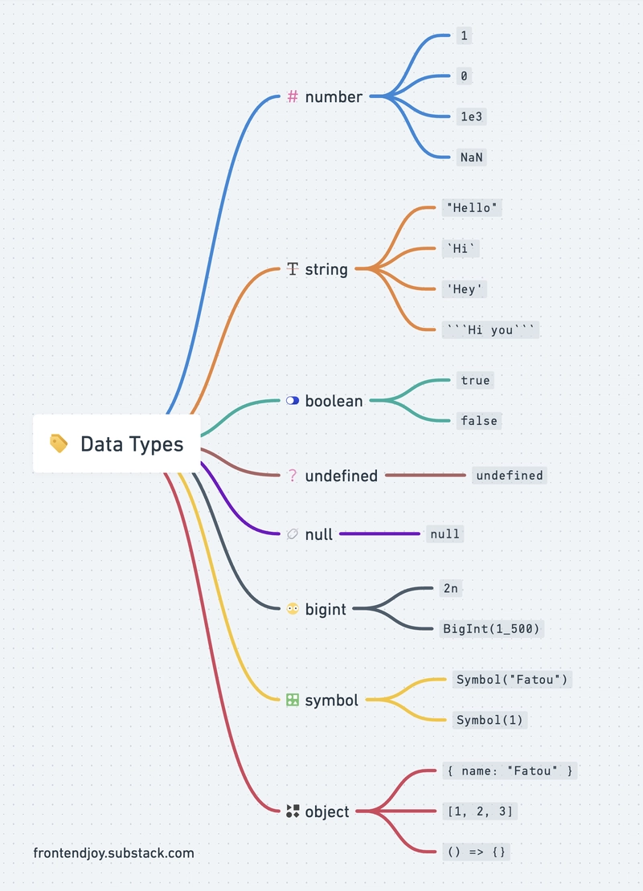

# Система типов JavaScript: полный разбор

## 1. Общая характеристика

JavaScript — язык с **динамической**, **слабой** (нестрогой) и **утиной** типизацией.

| Характеристика | Что это значит в JS |
|----------------|---------------------|
| **Динамическая** | Тип определяется у **значения** во время выполнения, а не у переменной при объявлении |
| **Слабая** | Автоматическое неявное приведение типов при операциях |
| **Утиная** | Важно не «кто ты», а «что ты умеешь» — наличие нужных методов/свойств |
| **Прототипная** | Наследование через цепочку прототипов, а не через классы (классы — синтаксический сахар) |

---

## 2. Две большие категории типов

```
Типы данных JS
│
├── Примитивы (7)
│   ├── number
│   ├── string
│   ├── boolean
│   ├── null
│   ├── undefined
│   ├── symbol       (ES6)
│   └── bigint       (ES2020)
│
└── Объекты (Reference types)
    ├── Object
    ├── Array
    ├── Function
    ├── Date
    ├── RegExp
    ├── Map / Set / WeakMap / WeakSet
    ├── Promise
    ├── Error
    └── ... (любые пользовательские)
```

### Принципиальная разница

| | Примитивы | Объекты |
|--|-----------|---------|
| Хранение | По значению | По ссылке |
| Изменяемость | Неизменяемы (immutable) | Изменяемы (mutable) |
| Сравнение | По значению | По ссылке |
| Методы | Есть (через обёртки) | Есть |
| `typeof` | Даёт конкретный тип | `"object"` (кроме функций) |

---

## 3. Примитивные типы подробно

### 3.1. `number`
```javascript
let a = 42;
let b = 3.14;
let c = 0b1010;      // двоичное → 10
let d = 0o17;        // восьмеричное → 15
let e = 0xFF;        // шестнадцатеричное → 255
let f = 1_000_000;   // разделитель (ES2021)
let g = Infinity;
let h = -Infinity;
let i = NaN;

// ВСЕ числа — 64-битные float (IEEE 754)
console.log(0.1 + 0.2);        // 0.30000000000000004
console.log(Number.MAX_SAFE_INTEGER); // 9007199254740991
console.log(1 / 0);            // Infinity
console.log(0 / 0);            // NaN
console.log(NaN === NaN);      // false (!)
```

### 3.2. `string`
```javascript
let s1 = "двойные";
let s2 = 'одинарные';
let s3 = `шаблонные ${s1}`;    // интерполяция

// Строки неизменяемы
let s = "abc";
s[0] = "X";       // молча не сработает
console.log(s);   // "abc"

// Но методы возвращают новые строки
console.log(s.toUpperCase()); // "ABC"
```

### 3.3. `boolean`
```javascript
let t = true;
let f = false;

// Ложные значения (falsy) — 8 штук:
// false, 0, -0, 0n, "", null, undefined, NaN
// Всё остальное — истина (truthy), включая [], {}, "0", "false"
```

### 3.4. `null`
```javascript
let x = null;
console.log(typeof null);  // "object"  ← баг, не исправляют
// Означает: «намеренное отсутствие значения»
```

### 3.5. `undefined`
```javascript
let y;
console.log(y);              // undefined
console.log(typeof y);       // "undefined"
// Означает: «значение не присвоено»
```

**Разница `null` vs `undefined`:**

| | `null` | `undefined` |
|--|--------|-------------|
| Смысл | Намеренное «пусто» | «Ещё не задано» |
| Присваивается | Вручную | Автоматически |
| `typeof` | `"object"` | `"undefined"` |
| `==` | `null == undefined` → `true` | |
| `===` | `null === undefined` → `false` | |

### 3.6. `symbol` (ES6)
```javascript
const id = Symbol("id");
const obj = { [id]: 123 };

console.log(typeof id);         // "symbol"
console.log(obj[id]);           // 123
console.log(Object.keys(obj));  // [] — символы не видны в keys

// Каждый Symbol уникален
console.log(Symbol("x") === Symbol("x")); // false
```

### 3.7. `bigint` (ES2020)
```javascript
const big = 9007199254740993n;   // суффикс n
console.log(typeof big);         // "bigint"

// Нельзя смешивать с number
// 1n + 1  → TypeError
console.log(1n + 1n);            // 2n
console.log(BigInt(Number.MAX_SAFE_INTEGER) + 2n); // корректно
```

---

## 4. Объектные типы

### 4.1. Всё — объект (кроме примитивов)
```javascript
typeof {};              // "object"
typeof [];              // "object"
typeof function(){};    // "function"  ← исключение
typeof new Date();      // "object"
typeof /regex/;         // "object"
typeof null;            // "object"    ← баг
```

### 4.2. Массив — частный случай объекта
```javascript
const arr = [1, 2, 3];
console.log(Array.isArray(arr));   // true
console.log(typeof arr);           // "object"
console.log(arr.length);           // 3

// Индексы — это строковые ключи!
arr["2"] = 99;
console.log(arr);                  // [1, 2, 99]
```

### 4.3. Функция — вызываемый объект
```javascript
function f() {}
console.log(typeof f);           // "function"
console.log(f instanceof Object);// true
f.custom = "prop";               // можно вешать свойства
console.log(f.custom);           // "prop"
```

---

## 5. Как JS определяет тип: `typeof`

```javascript
typeof 42           // "number"
typeof "str"        // "string"
typeof true         // "boolean"
typeof undefined    // "undefined"
typeof null         // "object"      ← баг
typeof Symbol()     // "symbol"
typeof 10n          // "bigint"
typeof {}           // "object"
typeof []           // "object"      ← не отличает от объекта
typeof function(){} // "function"
typeof NaN          // "number"      ← NaN формально число
```

### Надёжные способы проверки

```javascript
// Массив
Array.isArray([]);                       // true

// null
value === null;                          // true только для null

// NaN
Number.isNaN(NaN);                       // true (не путать с isNaN)

// Точный тип через Object.prototype.toString
Object.prototype.toString.call([]);      // "[object Array]"
Object.prototype.toString.call(null);    // "[object Null]"
Object.prototype.toString.call(new Date);// "[object Date]"
Object.prototype.toString.call(/x/);     // "[object RegExp]"

// Проверка на объект (не примитив и не null)
value !== null && typeof value === "object";
```

---

## 6. Приведение типов (coercion)

### 6.1. Явное (explicit)
```javascript
Number("42");        // 42
Number("abc");       // NaN
String(42);          // "42"
Boolean(0);          // false
Boolean("0");        // true (!)

parseInt("42px");    // 42
parseFloat("3.14");  // 3.14
+"42";               // 42 (унарный +)
!!"hello";           // true (двойное отрицание)
```

### 6.2. Неявное (implicit) — источник багов
```javascript
// Оператор +
"5" + 1        // "51"      (число → строка)
1 + "5"        // "15"
true + 1       // 2         (boolean → number)
null + 1       // 1         (null → 0)
undefined + 1  // NaN

// Операторы -, *, /
"5" - 1        // 4
"5" * "2"      // 10
"abc" - 1      // NaN
[] - 1         // -1        ([] → "" → 0)
[5] - 1        // 4         ([5] → "5" → 5)

// Логические операторы возвращают операнд, не boolean
"a" && "b"     // "b"
"" || "default"// "default"
null ?? "x"    // "x"  (nullish coalescing)
```

### 6.3. Таблица приведения при `+`

| Левый | Правый | Результат |
|-------|--------|-----------|
| number | number | сложение |
| number | string | конкатенация |
| string | number | конкатенация |
| string | string | конкатенация |
| object | any | object → примитив, затем правило выше |
| null | number | number |
| undefined | number | NaN |

### 6.4. Алгоритм `ToPrimitive`

Когда объект участвует в операции, JS вызывает:
1. `Symbol.toPrimitive` (если есть)
2. `valueOf()` — для чисел
3. `toString()` — для строк

```javascript
const obj = {
    valueOf()  { return 42; },
    toString() { return "obj"; }
};

console.log(obj + 1);        // 43      (valueOf)
console.log(`${obj}`);       // "obj"   (toString)
console.log(obj + "");       // "42"    (valueOf → строка)
```

---

## 7. Сравнение: `==` vs `===`

```javascript
// ==  — нестрогое, с приведением типов
1 == "1"           // true
0 == false         // true
null == undefined  // true
[] == false        // true
"" == 0            // true

// === — строгое, без приведения
1 === "1"          // false
0 === false        // false
null === undefined // false
[] === false       // false
NaN === NaN        // false

// Особые случаи ==
null == 0          // false (!)
null == undefined  // true
NaN == NaN         // false
```

### Правило
> **Всегда используйте `===` и `!==`**, кроме проверки `x == null` — она элегантно ловит и `null`, и `undefined`.

---

## 8. Изменяемость и ссылки

```javascript
// Примитивы копируются по значению
let a = 10;
let b = a;
b = 20;
console.log(a);  // 10

// Объекты копируются по ссылке
let o1 = { x: 1 };
let o2 = o1;
o2.x = 99;
console.log(o1.x); // 99 — изменился и o1!

// Поверхностная копия
let o3 = { ...o1 };            // spread
let o4 = Object.assign({}, o1);
let arr2 = [...arr1];

// Глубокая копия
let deep = structuredClone(o1); // современный способ
```

---

## 9. Обёртки примитивов

У примитивов нет методов, но JS автоматически оборачивает их в объекты:

```javascript
"abc".toUpperCase();  // JS создаёт new String("abc"), вызывает метод, удаляет
(42).toFixed(2);      // new Number(42)
true.toString();      // new Boolean(true)

// Но:
typeof new String("x")  // "object", не "string"!
new String("x") === "x" // false
```

**Не создавайте обёртки вручную** — только через литералы.

---

## 10. Проверка типов в реальном коде

```javascript
// Универсальная функция определения типа
function getType(value) {
    if (value === null) return "null";
    if (Array.isArray(value)) return "array";
    return typeof value;
}

getType(42);         // "number"
getType(null);       // "null"
getType([]);         // "array"
getType({});         // "object"
getType(() => {});   // "function"
getType(Symbol());   // "symbol"
```

---

## 11. Проблемы слабой типизации и их решения

| Проблема | Пример | Решение |
|----------|--------|---------|
| Неявное приведение | `"5" - 1` → `4` | Явно: `Number("5") - 1` |
| `NaN` заражает | `NaN + 1` → `NaN` | `Number.isNaN()` проверка |
| `typeof null` | `"object"` | `value === null` |
| Массив = объект | `typeof []` → `"object"` | `Array.isArray()` |
| Сравнение через `==` | `0 == ""` → `true` | Использовать `===` |
| Изменение по ссылке | `o2.x = 99` меняет `o1` | `structuredClone()` |
| Нет проверки типов при компиляции | `f("str")` вместо `f(1)` | **TypeScript** |

---

## 12. TypeScript — статическая надстройка

```typescript
// Явные типы
let n: number = 42;
let s: string = "hello";
let b: boolean = true;
let arr: number[] = [1, 2, 3];
let obj: { x: number; y: number } = { x: 1, y: 2 };

// Проверка на этапе компиляции
n = "строка";  // ❌ Ошибка компиляции

// Объединения
let id: number | string;

// Дженерики
function first<T>(arr: T[]): T | undefined {
    return arr[0];
}
```

TypeScript **не меняет runtime** — типы стираются при компиляции, остаётся обычный JS. Но он ловит ошибки до запуска.

---

## 13. Итоговая схема

```
┌─────────────────────────────────────────────────────┐
│              СИСТЕМА ТИПОВ JAVASCRIPT               │
├─────────────────────────────────────────────────────┤
│                                                     │
│  Динамическая  → тип у значения, не у переменной    │
│  Слабая        → неявные приведения типов           │
│  Утиная        → важен набор методов, не класс      │
│  Прототипная   → наследование через [[Prototype]]   │
│                                                     │
├─────────────────────────────────────────────────────┤
│                                                     │
│  ПРИМИТИВЫ (7)          ОБЪЕКТЫ                     │
│  ├─ number              ├─ Object                   │
│  ├─ string              ├─ Array                    │
│  ├─ boolean             ├─ Function                 │
│  ├─ null                ├─ Date, RegExp, Map, Set   │
│  ├─ undefined           ├─ Promise, Error           │
│  ├─ symbol              └─ пользовательские         │
│  └─ bigint                                          │
│                                                     │
├─────────────────────────────────────────────────────┤
│                                                     │
│  КЛЮЧЕВЫЕ ОСОБЕННОСТИ:                              │
│  • typeof null === "object"                         │
│  • typeof NaN === "number"                          │
│  • Нет типа char (символ = string)                  │
│  • "+" перегружен (конкатенация vs сложение)        │
│  • "-", "*", "/" всегда приводят к числу            │
│  • Примитивы по значению, объекты по ссылке         │
│  • === безопаснее, чем ==                           │
│                                                     │
└─────────────────────────────────────────────────────┘
```

---

## 14. Практические рекомендации

1. **Всегда `"use strict"`** (или модули — они строгие по умолчанию).
2. **Всегда `const`**, `let` — только когда нужно переприсваивание, `var` — никогда.
3. **Всегда `===`**, кроме `x == null`.
4. **Проверяйте тип явно**: `Array.isArray()`, `Number.isNaN()`, `value === null`.
5. **Не полагайтесь на `typeof`** для объектов.
6. **Избегайте неявных приведений** — преобразовывайте явно (`Number()`, `String()`, `Boolean()`).
7. **Для глубокого копирования** — `structuredClone()`, а не `JSON.parse(JSON.stringify())`.
8. **Для больших проектов** — TypeScript.

---

Если хотите, могу углубиться в любую тему: прототипное наследование, `Symbol.toPrimitive`, работу `valueOf`/`toString`, или сравнить с системой типов Python.