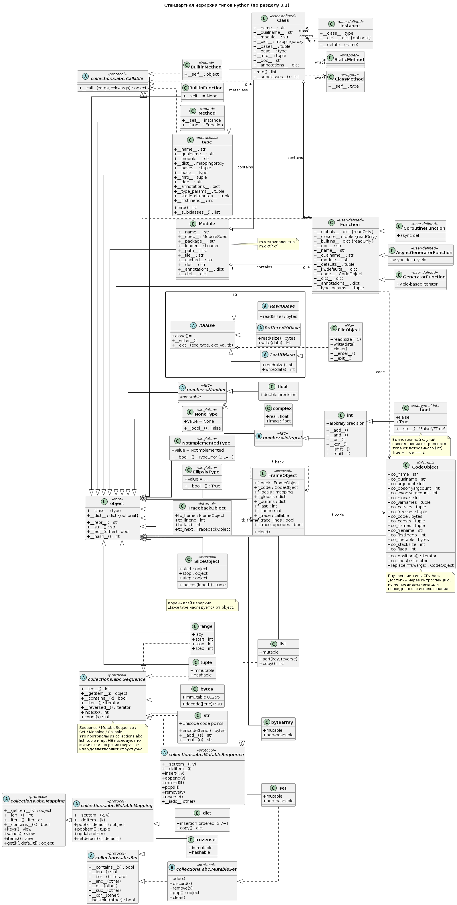

<details><summary>Краткл</summary>

# Краткое содержание: "3.2. The standard type hierarchy" (Стандартная иерархия типов Python)

## Общее описание
Документ описывает встроенные типы Python. Расширения (на C, Java и др.) могут добавлять свои типы. Некоторые описания содержат «специальные атрибуты» — доступ к реализации, не предназначенный для общего использования.

---

## 3.2.1. None
- Единственное значение — `None`
- Означает отсутствие значения
- Возвращается функциями без `return`
- Ложное значение (false)

## 3.2.2. NotImplemented
- Единственное значение — `NotImplemented`
- Возвращается числовыми методами и методами сравнения, если операция не реализована
- Не должен вычисляться в логическом контексте
- С версии 3.14 вычисление в логическом контексте вызывает `TypeError`

## 3.2.3. Ellipsis
- Единственное значение — `...` или `Ellipsis`
- Истинное значение (true)

## 3.2.4. numbers.Number
- Создаются числовыми литералами; неизменяемы
- Строковые представления — валидные числовые литералы в base 10
- Три подтипа:

### 3.2.4.1. numbers.Integral
- **Integers (int)** — неограниченный диапазон (ограничен памятью); отрицательные числа — вариант 2's complement
- **Booleans (bool)** — `False` и `True`; подтип int; ведут себя как 0 и 1, но строки — `"False"` и `"True"`

### 3.2.4.2. numbers.Real (float)
- Машинная двойная точность
- Python не поддерживает одинарную точность

### 3.2.4.3. numbers.Complex (complex)
- Пара чисел двойной точности
- Атрибуты: `z.real`, `z.imag`

---

## 3.2.5. Sequences (Последовательности)
- Конечные упорядоченные наборы, индексируемые неотрицательными числами
- `len()` — количество элементов; индексы от 0 до n-1
- Отрицательные индексы: `a[-2]` = `a[n-2]`
- Срезы: `a[start:stop]`, расширенные срезы: `a[i:j:k]`
- Делятся по изменяемости:

### 3.2.5.1. Immutable sequences (Неизменяемые)
- **Strings (str)** — Unicode code points; нет отдельного типа символа; `ord()`, `chr()`, `encode()`, `decode()`
- **Tuples** — произвольные объекты; singleton: `(1,)`; пустой: `()`
- **Bytes** — неизменяемый массив 8-битных байтов (0–255); литералы `b'abc'`; `decode()`

### 3.2.5.2. Mutable sequences (Изменяемые)
- **Lists** — произвольные объекты; `[...]`
- **Byte Arrays (bytearray)** — изменяемый массив; `bytearray()`

---

## 3.2.6. Set types (Множества)
- Неупорядоченные конечные наборы уникальных неизменяемых объектов
- Не индексируются, но итерируются; `len()`
- Применение: проверка принадлежности, удаление дубликатов, пересечение, объединение, разность
- **Sets** — изменяемые; `set()`, метод `add()`
- **Frozen sets** — неизменяемые и хешируемые; `frozenset()`; могут быть элементами других множеств или ключами словарей

---

## 3.2.7. Mappings (Отображения)
- Конечные наборы объектов, индексируемые произвольными наборами индексов
- `a[k]`, `len()`
- **Dictionaries** — единственный встроенный тип отображения
    - Ключи: неизменяемые типы (числа, строки, кортежи)
    - Числовые ключи: `1` и `1.0` взаимозаменяемы
    - Сохраняют порядок вставки (с 3.7)
    - Изменяемые; `{}`
    - Дополнительно: `dbm.ndbm`, `dbm.gnu`, `collections`

---

## 3.2.8. Callable types (Вызываемые типы)

### 3.2.8.1. User-defined functions
- Создаются определением функции
- **Read-only атрибуты:** `__builtins__`, `__globals__`, `__closure__`
- **Writable атрибуты:** `__doc__`, `__name__`, `__qualname__`, `__module__`, `__defaults__`, `__code__`, `__dict__`, `__annotations__`, `__annotate__`, `__kwdefaults__`, `__type_params__`
- Поддержка произвольных атрибутов

### 3.2.8.2. Instance methods
- Комбинируют класс, экземпляр и вызываемый объект
- Атрибуты: `__self__`, `__func__`, `__doc__`, `__name__`, `__module__`
- Bound methods: `x.f(1)` эквивалентно `C.f(x, 1)`
- Classmethod: `__self__` — класс

### 3.2.8.3. Generator functions
- Содержат `yield`; возвращают итератор
- `__next__()` выполняется до `yield`; `StopIteration` в конце

### 3.2.8.4. Coroutine functions
- Определяются `async def`; возвращают coroutine object
- Содержат `await`, `async with`, `async for`

### 3.2.8.5. Asynchronous generator functions
- `async def` + `yield`; возвращают асинхронный итератор
- `__anext__` возвращает awaitable; `StopAsyncIteration` в конце

### 3.2.8.6. Built-in functions
- Обёртка вокруг C-функции; примеры: `len()`, `math.sin()`
- Атрибуты: `__doc__`, `__name__`, `__self__`, `__module__`

### 3.2.8.7. Built-in methods
- Built-in function с неявным дополнительным аргументом
- Пример: `alist.append()`; `__self__` — объект

### 3.2.8.8. Classes
- Вызываемы; фабрики экземпляров
- `__new__()`, `__init__()`

### 3.2.8.9. Class Instances
- Могут быть вызываемыми при определении `__call__()`

---

## 3.2.9. Modules (Модули)
- Базовая организационная единица кода
- Создаются import-системой
- Пространство имён — словарь; `m.x` = `m.__dict__["x"]`

### 3.2.9.1. Import-related атрибуты
- `__name__` — уникальное имя; `"__main__"` для исполняемого модуля
- `__spec__` — запись состояния импорта
- `__package__` — пакет (устаревает, использовать `__spec__.parent`)
- `__loader__` — загрузчик (устаревает)
- `__path__` — пути подмодулей пакета
- `__file__`, `__cached__` — пути файлов (опциональны)

### 3.2.9.2. Другие writable атрибуты
- `__doc__`, `__annotations__`, `__annotate__`

### 3.2.9.3. Словари модулей
- `__dict__` — пространство имён модуля (read-only)

---

## 3.2.10. Custom classes (Пользовательские классы)
- Создаются определениями классов
- Пространство имён — словарь; `C.x` = `C.__dict__["x"]`
- Поиск по базовым классам: C3 method resolution order (MRO)
- Classmethod → instance method с `__self__` = C
- Staticmethod → обёрнутый объект

### 3.2.10.1. Специальные атрибуты
- `__name__`, `__qualname__`, `__module__`, `__dict__`, `__bases__`, `__base__`, `__doc__`, `__annotations__`, `__annotate__`, `__type_params__`, `__static_attributes__`, `__firstlineno__`, `__mro__`

### 3.2.10.2. Специальные методы
- `mro()` — настройка MRO
- `__subclasses__()` — список живых подклассов

---

## 3.2.11. Class instances (Экземпляры классов)
- Создаются вызовом класса
- Пространство имён — словарь; поиск атрибутов: экземпляр → класс → базовые классы
- User-defined function → instance method с `__self__` = экземпляр
- `__getattr__()` при отсутствии атрибута
- Присваивание/удаление обновляют словарь экземпляра
- Могут имитировать числа, последовательности, отображения

### 3.2.11.1. Специальные атрибуты
- `__class__` — класс экземпляра
- `__dict__` — словарь атрибутов (не у всех экземпляров)

---

## 3.2.12. I/O objects (Файловые объекты)
- Представляют открытый файл
- Создание: `open()`, `os.popen()`, `os.fdopen()`, `socket.makefile()`
- Контекстные менеджеры (`with`)
- `sys.stdin`, `sys.stdout`, `sys.stderr` — текстовый режим (`io.TextIOBase`)
- Методы: `read(size=-1)`, `write(data)`, `close()`

---

## 3.2.13. Internal types (Внутренние типы)

### 3.2.13.1. Code objects
- Байт-код; неизменяемы; не содержат контекста
- **Read-only атрибуты:** `co_name`, `co_qualname`, `co_argcount`, `co_posonlyargcount`, `co_kwonlyargcount`, `co_nlocals`, `co_varnames`, `co_cellvars`, `co_freevars`, `co_code`, `co_consts`, `co_names`, `co_filename`, `co_firstlineno`, `co_lnotab` (устарел), `co_linetable`, `co_stacksize`, `co_flags`
- **Методы:** `co_positions()`, `co_lines()`, `replace(**kwargs)`

### 3.2.13.2. Frame objects
- Представляют кадры выполнения
- **Read-only:** `f_back`, `f_code`, `f_locals`, `f_globals`, `f_builtins`, `f_lasti`, `f_generator`
- **Writable:** `f_trace`, `f_trace_lines`, `f_trace_opcodes`, `f_lineno`
- **Метод:** `clear()`

### 3.2.13.3. Traceback objects
- Представляют стек вызовов исключения
- **Read-only:** `tb_frame`, `tb_lineno`, `tb_lasti`
- **Writable:** `tb_next`

### 3.2.13.4. Slice objects
- Представляют срезы для `__getitem__()`
- Атрибуты: `start`, `stop`, `step`
- **Метод:** `indices(length)`

### 3.2.13.5. Static method objects
- Обёртка, предотвращающая преобразование в method
- Создаются `staticmethod()`

### 3.2.13.6. Class method objects
- Обёртка, изменяющая получение из классов/экземпляров
- Создаются `classmethod()`

</details>

# 3.2. Стандартная иерархия типов

Ниже — встроенные типы Python. Модули расширений (C, Java и др.) могут добавлять свои типы. В будущих версиях иерархия может пополняться (например, рациональные числа), но чаще такие дополнения идут через стандартную библиотеку.

Некоторые описания содержат «специальные атрибуты» — доступ к реализации, не предназначенный для общего использования; их определение может измениться.



## 3.2.1. None

> None — тип с единственным значением и единственным объектом, доступным через имя `None`. Обозначает отсутствие значения (например, возврат функции без `return`). Истинностное значение — ложь.

## 3.2.2. NotImplemented

> NotImplemented — тип с единственным значением и единственным объектом, доступным через имя `NotImplemented`. Числовые методы и методы сравнения возвращают его, если не реализуют операцию для данных операндов (интерпретатор попробует отражённую операцию или запасной вариант). Не должен вычисляться в булевом контексте.

- 3.9: вычисление в булевом контексте признано устаревшим.
- 3.14: теперь вызывает `TypeError` (ранее — `True` + `DeprecationWarning`).

## 3.2.3. Ellipsis

> Ellipsis — тип с единственным значением и единственным объектом, доступным через литерал `...` или имя `Ellipsis`. Истинностное значение — истина.

## 3.2.4. numbers.Number

> numbers.Number — числовые объекты, создаваемые литералами и возвращаемые арифметическими операторами и функциями. Неизменяемы; связаны с математическими числами, но ограничены машинным представлением.

Свойства строковых представлений (`__repr__()`, `__str__()`):

- допустимые числовые литералы, воспроизводящие исходное значение через конструктор класса;
- по возможности основание 10;
- ведущие нули (кроме одного перед точкой) не показываются;
- завершающие нули (кроме одного после точки) не показываются;
- знак — только для отрицательных.

Различаются целые, вещественные и комплексные числа.

### 3.2.4.1. numbers.Integral

> numbers.Integral — элементы математического множества целых чисел (положительных и отрицательных).

*Примечание:* правила представления целых дают осмысленную интерпретацию сдвигов и масок с отрицательными числами.

Два типа целых:

**int**

> int — числа неограниченного диапазона (ограничены лишь доступной памятью). Для сдвигов и масок предполагается двоичное представление; отрицательные — в варианте дополнительного кода, создающем иллюзию бесконечной строки знаковых битов влево.

**bool**

> bool — истинностные значения `False` и `True`; это единственные булевы объекты. Подтип `int`; ведут себя как 0 и 1 почти везде, кроме преобразования в строку (`"False"` / `"True"`).

### 3.2.4.2. numbers.Real (float)

> numbers.Real (float) — числа с плавающей точкой двойной точности. Диапазон и переполнение зависят от архитектуры и реализации C/Java. Одинарная точность не поддерживается: экономия меркнет на фоне накладных расходов объектов Python.

### 3.2.4.3. numbers.Complex (complex)

> numbers.Complex (complex) — комплексные числа как пара чисел двойной точности. Оговорки те же, что для float. Действительная и мнимая части доступны через `z.real` и `z.imag` (только чтение).

## 3.2.5. Последовательности

> Последовательность — конечный упорядоченный набор, индексируемый неотрицательными числами. `len()` возвращает число элементов.

При длине $n$ индексы — $0, 1, \ldots, n-1$; элемент $i$ — `a[i]`. Отрицательные индексы добавляют длину: `a[-2]` = `a[n-2]`. Индекс должен быть неотрицательным целым меньше $n$, иначе `IndexError`.

Срезы: `a[start:stop]` выбирает элементы с $start \le k < stop$; результат — последовательность того же типа. Ошибки при выходе за границы не возбуждаются. Если `start`/`stop` отсутствуют или `None` — берутся 0 и длина соответственно.

Расширенные срезы: `a[i:j:k]` выбирает элементы с индексом $x = i + n \cdot k$, $n \ge 0$, $i \le x < j$.

По изменяемости:

### 3.2.5.1. Неизменяемые последовательности

> Неизменяемая последовательность — объект, который не может измениться после создания (хотя объекты, на которые он ссылается, могут быть изменяемыми).

**Строки**

> str — последовательность кодовых точек Unicode (диапазон 0–0x10FFFF). Отдельного типа символа нет: каждая кодовая точка — строка длины 1. `ord()` / `chr()` преобразуют код и символ; `str.encode()` / `bytes.decode()` — между `str` и `bytes`.

**Кортежи**

> tuple — элементы произвольны. Кортеж из 2+ элементов — выражения через запятую; синглтон — выражение с запятой; пустой — `()`.

**Байты**

> bytes — неизменяемый массив 8-битных байтов (целые $0 \le x < 256$). Создаются литералами (`b'abc'`) и конструктором `bytes()`; декодируются в строки методом `decode()`.

### 3.2.5.2. Изменяемые последовательности

> Изменяемая последовательность — может меняться после создания; подписка и срезы могут быть целями присваивания и `del`.

*Примечание:* примеры — модули `collections` и `array`.

**Списки**

> list — элементы произвольны; создаются перечислением выражений в квадратных скобках (особых случаев для длины 0 или 1 нет).

**Байтовые массивы**

> bytearray — изменяемый массив; создаётся конструктором `bytearray()`. Кроме изменяемости (и нехешируемости) интерфейс совпадает с `bytes`.

## 3.2.6. Типы множеств

> Множество — неупорядоченный конечный набор уникальных неизменяемых объектов. Не индексируется, но итерируется; `len()` возвращает число элементов. Применения: проверка принадлежности, удаление дубликатов, пересечение, объединение, разность, симметричная разность.

Правила неизменяемости элементов те же, что для ключей словаря. Числа подчиняются обычному сравнению: если 1 и 1.0 равны, во множестве будет только одно из них.

**set**

> set — изменяемое множество; создаётся `set()`, изменяется методами вроде `add()`.

**frozenset**

> frozenset — неизменяемое множество; создаётся `frozenset()`. Будучи неизменяемым и хешируемым, может быть элементом другого множества или ключом словаря.

## 3.2.7. Отображения

> Отображение — конечный набор объектов, индексируемый произвольными наборами индексов. `a[k]` выбирает элемент; работает в выражениях, присваиваниях и `del`. `len()` возвращает число элементов.

### 3.2.7.1. Словари

> dict — конечный набор объектов, индексируемый почти произвольными значениями. Неприемлемы ключи, содержащие списки, словари и другие изменяемые типы, сравниваемые по значению: эффективная реализация требует постоянного хеша ключа. Числовые ключи подчиняются обычному сравнению (1 и 1.0 взаимозаменяемы).

Словари сохраняют порядок вставки: ключи выдаются в порядке добавления. Замена ключа порядок не меняет; удаление и повторная вставка переносят ключ в конец.

Изменяемы; создаются нотацией `{}`. Дополнительные примеры отображений — `dbm.ndbm`, `dbm.gnu`, `collections`.

- 3.7: до 3.6 порядок не сохранялся; в CPython 3.6 сохранялся, но считался деталью реализации.

## 3.2.8. Вызываемые типы

Типы, к которым применима операция вызова:

### 3.2.8.1. Пользовательские функции

> Пользовательская функция — объект, создаваемый определением функции; вызывается со списком аргументов, соответствующим формальным параметрам.

**Специальные атрибуты только для чтения:**

| Атрибут | Значение |
|---|---|
| `function.__builtins__` | словарь встроенного пространства имён функции (3.10) |
| `function.__globals__` | словарь глобальных переменных модуля определения |
| `function.__closure__` | `None` или кортеж ячеек для имён из `co_freevars`; у ячейки есть `cell_contents` |

**Специальные записываемые атрибуты** (большинство проверяет тип):

| Атрибут | Значение |
|---|---|
| `function.__doc__` | строка документации или `None` |
| `function.__name__` | имя функции |
| `function.__qualname__` | полное имя (3.3) |
| `function.__module__` | имя модуля определения или `None` |
| `function.__defaults__` | кортеж значений по умолчанию или `None` |
| `function.__code__` | объект кода скомпилированного тела |
| `function.__dict__` | пространство произвольных атрибутов |
| `function.__annotations__` | аннотации параметров и `'return'` (3.14: ленивые, PEP 649) |
| `function.__annotate__` | функция аннотаций или `None` (3.14) |
| `function.__kwdefaults__` | значения по умолчанию для keyword-only параметров |
| `function.__type_params__` | параметры типа обобщённой функции (3.12) |

Функции поддерживают произвольные атрибуты через точечную нотацию. *CPython:* пока только для пользовательских функций.

Дополнительно — через объект кода (`__code__`).

### 3.2.8.2. Методы экземпляра

> Метод экземпляра — объект, объединяющий класс, экземпляр класса и вызываемый объект (обычно пользовательскую функцию).

Только для чтения: `__self__` (экземпляр), `__func__` (исходная функция), `__doc__`, `__name__`, `__module__`. Доступ к произвольным атрибутам функции — только чтение.

Метод создаётся при получении атрибута класса (через экземпляр), если это пользовательская функция или `classmethod`. Для функции `__self__` — экземпляр (связанный метод), для `classmethod` — сам класс. Вызов `x.f(1)` эквивалентен `C.f(x, 1)`; для `classmethod` — `f(C, 1)`.

Функции-атрибуты экземпляра **не** становятся связанными методами.

### 3.2.8.3. Функции-генераторы

> Функция-генератор — функция или метод с выражением `yield`. При вызове возвращает итератор; `iterator.__next__()` выполняет тело до очередного `yield`. При `return` или завершении — `StopIteration`.

### 3.2.8.4. Корутинные функции

> Корутинная функция — определённая через `async def`; при вызове возвращает объект корутины. Может содержать `await`, `async with`, `async for`.

### 3.2.8.5. Асинхронные функции-генераторы

> Асинхронная функция-генератор — `async def` с `yield`; при вызове возвращает асинхронный итератор для `async for`. `aiterator.__anext__` возвращает awaitable; при завершении — `StopAsyncIteration`.

### 3.2.8.6. Встроенные функции

> Встроенная функция — обёртка вокруг C-функции (например, `len()`, `math.sin()`). Число и типы аргументов определяет C-функция. Только для чтения: `__doc__`, `__name__`, `__self__` (`None`), `__module__`.

### 3.2.8.7. Встроенные методы

> Встроенный метод — встроенная функция с неявным дополнительным аргументом-объектом (например, `alist.append()`). `__self__` указывает на этот объект.

### 3.2.8.8. Классы

Классы вызываемы: обычно фабрики экземпляров; могут переопределять `__new__()`. Аргументы вызова передаются в `__new__()` и, как правило, в `__init__()`.

### 3.2.8.9. Экземпляры классов

Экземпляры можно сделать вызываемыми, определив `__call__()`.

## 3.2.9. Модули

> Модуль — базовая организационная единица кода Python; создаётся системой импорта (`import`, `importlib.import_module()`, `__import__()`). Пространство имён — словарь (тот же, что `__globals__` функций модуля). `m.x` эквивалентно `m.__dict__["x"]`; `m.x = 1` — `m.__dict__["x"] = 1`. Код инициализации в объекте модуля не хранится.

### 3.2.9.1. Атрибуты модулей, связанные с импортом

Заполняются на основе спецификации модуля до выполнения загрузчика. Для динамического создания рекомендуется `importlib.util.module_from_spec()`; `types.ModuleType` — более подвержен ошибкам.

**Внимание:** кроме `__name__`, рекомендуется опираться на `__spec__` и его атрибуты. Обновление атрибута `__spec__` не обновляет одноимённый атрибут модуля.

```
import typing
typing.__name__, typing.__spec__.name
('typing', 'typing')
typing.__spec__.name = 'spelling'
typing.__name__, typing.__spec__.name
('typing', 'spelling')
typing.__name__ = 'keyboard_smashing'
typing.__name__, typing.__spec__.name
('keyboard_smashing', 'spelling')
```

- `module.__name__` — уникальное имя в системе импорта; для напрямую исполняемого модуля — `"__main__"`. Должно совпадать с `__spec__.name`.
- `module.__spec__` — запись состояния импорта (3.4).
- `module.__package__` — пакет модуля; `''` для top-level; используется для относительных импортов. Рекомендуется `__spec__.parent`. Устарело с 3.13, будет удалено в 3.15.
- `module.__loader__` — объект загрузчика. Рекомендуется `__spec__.loader`. Устарело с 3.12, будет удалено в 3.16.
- `module.__path__` — последовательность строк с расположениями подмодулей пакета (только для пакетов). Рекомендуется `__spec__.submodule_search_locations`.
- `module.__file__` / `module.__cached__` — необязательные пути к файлу модуля и скомпилированной версии. Рекомендуется `__spec__.cached`. Устарело с 3.13, будет удалено в 3.15.

### 3.2.9.2. Прочие записываемые атрибуты модулей

- `module.__doc__` — строка документации или `None`.
- `module.__annotations__` — аннотации переменных, собранные при выполнении тела (3.14: ленивые, PEP 649).
- `module.__annotate__` — функция аннотаций или `None` (3.14).

### 3.2.9.3. Словари модулей

`module.__dict__` — пространство имён модуля; недоступно как глобальная переменная внутри модуля, только как атрибут.

*CPython:* словарь модуля очищается при выходе модуля из области видимости, даже если на словарь есть живые ссылки. Чтобы избежать — копируйте словарь или держите модуль.

## 3.2.10. Пользовательские классы

> Пользовательский класс — тип, обычно создаваемый определением класса. Пространство имён — словарь. `C.x` → `C.__dict__["x"]`; при отсутствии поиск идёт по базовым классам в порядке C3 MRO (корректен и при «ромбовидном» наследовании).

Ссылка на атрибут класса может дать метод класса (преобразуется в метод экземпляра с `__self__ = C`) или `staticmethod` (преобразуется в обёрнутый объект). Присваивание атрибутов обновляет словарь класса, не базового. Класс вызываем и даёт экземпляр.

### 3.2.10.1. Специальные атрибуты

| Атрибут | Значение |
|---|---|
| `type.__name__` | имя класса |
| `type.__qualname__` | полное имя |
| `type.__module__` | модуль определения |
| `type.__dict__` | mapping proxy — только чтение |
| `type.__bases__` | кортеж базовых классов |
| `type.__base__` | *CPython:* базовый класс, ответственный за layout экземпляров (`tp_base`) |
| `type.__doc__` | строка документации; не наследуется |
| `type.__annotations__` | аннотации переменных класса (3.14: ленивые) |
| `type.__annotate__()` | функция аннотаций или `None` (3.14) |
| `type.__type_params__` | параметры типа обобщённого класса (3.12) |
| `type.__static_attributes__` | имена атрибутов, присваиваемых через `self.X` (3.13) |
| `type.__firstlineno__` | номер первой строки определения, включая декораторы (3.13) |
| `type.__mro__` | кортеж классов для разрешения методов |

**Предупреждение:** прямое чтение `__annotations__` у класса может вернуть аннотации не того класса (при `from __future__ import annotations`). Используйте `annotationlib.get_annotations()`.

### 3.2.10.2. Специальные методы

- `type.mro()` — может переопределяться метаклассом; вызывается при создании класса, результат — в `__mro__`.
- `type.__subclasses__()` — список живых прямых подклассов в порядке определения.

```python
class A: pass
class B(A): pass
A.__subclasses__()
[<class 'B'>]
```

## 3.2.11. Экземпляры классов

> Экземпляр класса — создаётся вызовом класса. Пространство имён — словарь, где сначала ищутся атрибуты; затем — в классе. Найденная пользовательская функция преобразуется в метод экземпляра; `staticmethod` и `classmethod` — аналогично. Если атрибут не найден и у класса есть `__getattr__()`, вызывается он.

Присваивание и удаление обновляют словарь экземпляра, не класса (если нет `__setattr__()` / `__delattr__()`).

Экземпляры могут имитировать числа, последовательности, отображения через специальные методы.

### 3.2.11.1. Специальные атрибуты

- `object.__class__` — класс экземпляра.
- `object.__dict__` — словарь (или иной mapping) записываемых атрибутов. Есть не у всех экземпляров (см. `__slots__`).

## 3.2.12. Объекты ввода-вывода (файловые объекты)

> Файловый объект — представляет открытый файл. Создаётся через `open()`, `os.popen()`, `os.fdopen()`, `socket.makefile()` и др. Реализует общие методы и является контекстным менеджером (`with`).

`sys.stdin`, `sys.stdout`, `sys.stderr` — файловые объекты стандартных потоков; открыты в текстовом режиме (`io.TextIOBase`).

- `file.read(size=-1, /)` — читает до `size` данных; при `-1` или отсутствии — всё доступное.
- `file.write(data, /)` — записывает данные.
- `file.close()` — сбрасывает буферы и закрывает файл.

## 3.2.13. Внутренние типы

Некоторые внутренние типы доступны пользователю; их определения могут меняться.

### 3.2.13.1. Объекты кода

> Объект кода — байт-скомпилированный исполняемый код (байт-код). В отличие от функции, не содержит контекста (глобальных имён); значения по умолчанию хранятся в функции. Неизменяем и не содержит ссылок на изменяемые объекты.

**Только для чтения:**

| Атрибут | Значение |
|---|---|
| `co_name` | имя функции |
| `co_qualname` | полное имя (3.11) |
| `co_argcount` | число позиционных параметров |
| `co_posonlyargcount` | число positional-only параметров |
| `co_kwonlyargcount` | число keyword-only параметров |
| `co_nlocals` | число локальных переменных (включая параметры) |
| `co_varnames` | имена локальных переменных (с параметров) |
| `co_cellvars` | имена переменных, захваченных вложенными областями |
| `co_freevars` | имена свободных (замыкающих) переменных |
| `co_code` | строка байт-кода |
| `co_consts` | кортеж литералов байт-кода |
| `co_names` | кортеж имён байт-кода |
| `co_filename` | имя исходного файла |
| `co_firstlineno` | номер первой строки функции |
| `co_lnotab` | отображение смещений в строки (устарело с 3.12, удаление в 3.15) |
| `co_linetable` | закодированная информация об источнике (3.10) |
| `co_stacksize` | требуемый размер стека |
| `co_flags` | флаги интерпретатора: `0x04` — `*args`, `0x08` — `**kwargs`, `0x20` — генератор; также `__future__`-флаги; `CO_HAS_DOCSTRING` — есть docstring (первый в `co_consts`) |

**Методы:**

- `co_positions()` — итерируемое по позициям (`start_line, end_line, start_column, end_column`) каждой инструкции; столбцы — UTF-8 смещения с 0; элементы могут быть `None` (3.11). Требует хранения позиций; отключается `-X no_debug_ranges` или `PYTHONNODEBUGRANGES`.
- `co_lines()` — итератор `(start, end, lineno)`: диапазоны неубывающие и последовательные, первый `start = 0`, последний `end` = размер байт-кода; допустимы нулевые диапазоны (3.10).
- `replace(**kwargs)` — копия с новыми значениями полей (3.8); поддерживается `copy.replace()`.

### 3.2.13.2. Объекты кадра

> Объект кадра — представляет кадр исполнения; встречается в трассировках и передаётся функциям трассировки.

**Только для чтения:** `f_back` (предыдущий кадр или `None`), `f_code` (объект кода; чтение вызывает аудит `object.__getattr__`), `f_locals` (mapping локальных; для оптимизированных областей — прокси, 3.13), `f_globals`, `f_builtins`, `f_lasti` (точная инструкция), `f_generator` (генератор/корутина или `None`, 3.14).

**Записываемые:** `f_trace` (функция трассировки), `f_trace_lines` (`False` отключает события по строкам), `f_trace_opcodes` (`True` — события по опкодам), `f_lineno` (текущая строка; запись — переход, только для нижнего кадра).

**Метод:** `frame.clear()` — очищает ссылки на локальные; финализирует генератор. `RuntimeError`, если кадр исполняется или приостановлен (3.4; 3.13 — приостановленный тоже).

### 3.2.13.3. Объекты трассировки

> Объект трассировки — стек вызовов исключения. Создаётся неявно при исключении; можно создать явно через `types.TracebackType` (3.7).

При разворачивании стека объект трассировки вставляется перед текущим. Доступен как третий элемент `sys.exc_info()` и как `__traceback__` исключения. Без обработчика — выводится в stderr; в интерактивном режиме — `sys.last_traceback`.

**Только для чтения:** `tb_frame` (кадр; чтение вызывает аудит), `tb_lineno` (строка исключения), `tb_lasti` (точная инструкция).

**Записываемый:** `tb_next` — следующий уровень или `None` (3.7 — записываемый).

### 3.2.13.4. Объекты срезов

> Объект среза — представляет срезы для `__getitem__()`; создаётся функцией `slice()`.

Только для чтения: `start`, `stop`, `step` (любого типа; `None`, если опущены).

**Метод:** `slice.indices(length)` — возвращает `(start, stop, step)` для последовательности длины `length`; отсутствующие/выходящие за границы индексы обрабатываются как в обычных срезах.

### 3.2.13.5. Объекты статических методов

> Объект статического метода — обёртка, отменяющая преобразование функции в метод. При получении из класса или экземпляра возвращается сам обёрнутый объект без преобразований. Вызываем. Создаётся `staticmethod()`.

### 3.2.13.6. Объекты методов класса

> Объект метода класса — обёртка, изменяющая получение объекта из классов и экземпляров (см. «методы экземпляра»). Создаётся `classmethod()`.

## FAQ

**Что такое специальные атрибуты?**
Атрибуты доступа к реализации, не предназначенные для общего использования; их определение может измениться.

**Почему нет float одинарной точности?**
Экономия меркнет на фоне накладных расходов объектов Python.

**Чем `bytes` отличается от `bytearray`?**
`bytes` неизменяем, `bytearray` изменяем (и нехешируем); в остальном интерфейс совпадает.

**Почему списки и словари не могут быть ключами?**
Их хеш не может оставаться постоянным, а это требуется для эффективной реализации словаря.

**Сохраняют ли словари порядок вставки?**
Да, с 3.7 это гарантия языка; в CPython 3.6 — деталь реализации.

**Что возвращают методы, не реализующие операцию?**
`NotImplemented`; интерпретатор попробует отражённую операцию или запасной вариант.

**Чем объект кода отличается от функции?**
Код не содержит контекста (глобальных имён) и неизменяем; значения по умолчанию хранятся в функции.