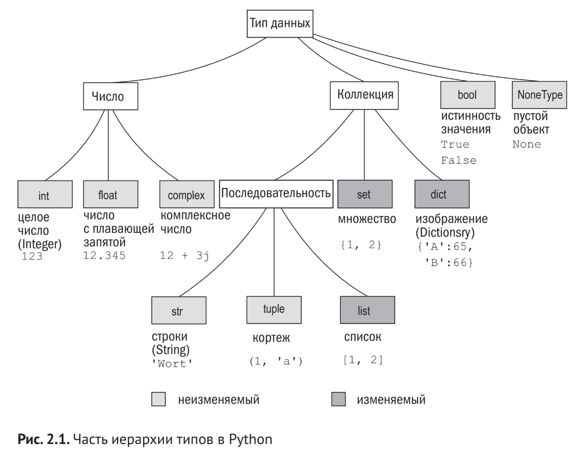

<details><summary>Кратко</summary>

# Краткое содержание: "Глава 3. Краткий обзор Python"

## Общее описание Python
- Встроенные типы данных: целые числа, числа с плавающей точкой, комплексные числа, строки, списки, кортежи, словари, файлы
- Поддержка условных и циклических конструкций (`if-elif-else`, `while`, `for`)
- Функции с гибкими схемами передачи аргументов
- Исключения: `raise`, `try-except-else-finally`
- Переменные не нужно объявлять — они могут ссылаться на любой тип

---

## Встроенные типы данных

### Числовые типы
- **Целые числа** — неограниченный размер (ограничены только памятью)
- **Числа с плавающей точкой** — двойная точность языка C
- **Комплексные числа** — `3+2j`, атрибуты `.real` и `.imag`
- **Логические значения** — `True` (1) и `False` (0)
- Операторы: `+`, `-`, `*`, `/`, `**`, `%`, `//`
- Модули: `math`, `cmath`

### Списки
- Изменяемые, индексируются от начала (0) и от конца (-1)
- Срезы: `[m:n]`, `[:n]`, `[m:]`
- Операторы: `in`, `+`, `*`; функции: `len`, `max`, `min`
- Методы: `append`, `count`, `extend`, `index`, `insert`, `pop`, `remove`, `reverse`, `sort`

### Кортежи
- Неизменяемые, похожи на списки
- Кортеж из одного элемента: `(1,)`
- Методы: только `count` и `index`
- Используются как ключи в словарях
- Преобразование: `tuple()` и `list()`

### Строки
- Неизменяемые
- Ограничители: `' '`, `" "`, `''' '''`, `""" """`
- Методы: `split`, `replace` и др.; модуль `re` для регулярных выражений
- Форматирование: `%`, функция `print`

### Словари
- Ассоциативные массивы на базе хеш-таблиц
- Ключи — неизменяемые типы; значения — любые
- Методы: `clear`, `copy`, `get`, `items`, `keys`, `update`, `values`
- `get()` возвращает значение по умолчанию при отсутствии ключа

### Множества
- Неупорядоченный набор уникальных объектов
- Создание: `set([1, 2, 3, 1, 3, 5])` → `{1, 2, 3, 5}`
- Проверка принадлежности: `in`

### Объекты файлов
- `open("file", "w")` — запись, `open("file", "r")` — чтение
- Методы: `write`, `readline`, `close`
- Модуль `os` — работа с файловой системой
- Модули: `input`, `sys` (stdin/stdout/stderr), `struct`, `pickle`

---

## Управляющие конструкции

### Логические значения и выражения
- `False`: `False`, `0`, `None`, пустые значения (`[]`, `""`)
- `True`: всё остальное
- Операторы сравнения: `<`, `<=`, `==`, `>`, `>=`, `!=`, `is`, `is not`, `in`, `not in`
- Логические операторы: `and`, `not`, `or`

### Команда if-elif-else
```python
if x < 5:
    y = -1
elif x > 5:
    y = 1
else:
    y = 0
```
- Блоки выделяются отступами
- Секции `elif` и `else` не обязательны

### Цикл while
```python
while x > y:
    # тело цикла
```
- Команды `break` и `continue`

### Цикл for
```python
for x in item_list:
    # тело цикла
```
- Перебирает элементы последовательности (аналог foreach)
- Команды `break` и `continue`

### Определение функции
```python
def funct1(x, y, z):
    return x + 2*y + z**2
```
- Аргументы по позиции и по имени
- Значения по умолчанию: `def funct2(x, y=1, z=1)`
- `*tup` — лишние позиционные аргументы
- `**kwargs` — лишние именованные аргументы
- `return` возвращает значение; без него — `None`

### Исключения
```python
try:
    # код
except IOError as error:
    # обработка
else:
    # если исключений не было
finally:
    # выполняется всегда
```
- Собственные исключения: наследование от `Exception`
- `raise` — инициирование исключения

### Обработка контекста с `with`
```python
with open(filename, "r") as f:
    for line in f:
        print(f)
```
- Менеджер контекста автоматически закрывает файл
- Эквивалент `try-except-finally`

---

## Создание модуля
```python
"""Модуль wo. Содержит функцию: words_occur()"""
def words_occur():
    """words_occur() - подсчитывает вхождения слов в файле."""
    file_name = input("Enter the name of the file: ")
    f = open(file_name, 'r')
    word_list = f.read().split()
    f.close()
    occurs_dict = {}
    for word in word_list:
        occurs_dict[word] = occurs_dict.get(word, 0) + 1
    print("File %s has %d words (%d are unique)" \
          % (file_name, len(word_list), len(occurs_dict)))
    print(occurs_dict)

if __name__ == '__main__':
    words_occur()
```
- Строки документации — стандартный способ документирования
- Комментарии начинаются с `#`
- `if __name__ == '__main__':` — запуск как сценария
- Импорт: `import wo`, вызов: `wo.words_occur()`
- Перезагрузка: `imp.reload(wo)`
- Пакеты — группировка модулей в каталогах

---

## Объектно-ориентированное программирование
```python
class Shape:
    """Класс Shape: содержит метод move"""
    def __init__(self, x, y):
        self.x = x
        self.y = y
    def move(self, deltaX, deltaY):
        self.x = self.x + deltaX
        self.y = self.y + deltaY

class Square(Shape):
    """Класс Square: наследует от Shape"""
    def __init__(self, side=1, x=0, y=0):
        Shape.__init__(self, x, y)
        self.side = side

class Circle(Shape):
    """Класс Circle: наследует от Shape и содержит метод area"""
    pi = 3.14159
    def __init__(self, r=1, x=0, y=0):
        Shape.__init__(self, x, y)
        self.radius = r
    def area(self):
        return self.radius * self.radius * self.pi
    def __str__(self):
        return "Circle of radius %s at coordinates (%d, %d)"\
               % (self.radius, self.x, self.y)
```
- Классы определяются `class`
- Конструктор — `__init__`
- Первый аргумент методов — `self`
- Наследование: `class Circle(Shape)`
- Переменные класса (например, `pi`)
- Явный вызов инициализатора базового класса
- Специальные методы: `__str__` (для `print`), перегрузка операторов
- Создание экземпляра: `c1 = sh.Circle()`
- Вызов методов: `c2.area()`, `c2.move(5, 6)`

---

## Итоги
- Глава даёт общий обзор Python; детали будут в следующих главах
- Полезно возвращаться к примерам после изучения соответствующих тем
- Перед переходом к части 4 необходимо чётко понимать возможности Python, представленные в этой главе

</details>

# Глава 3. Краткий обзор Python

**Темы главы:**
- Общее описание Python
- Встроенные типы данных
- Управляющие конструкции
- Создание модулей
- Объектно-ориентированное программирование

Глава даёт первое представление о синтаксисе, семантике и философии Python. При первом чтении не нужно разбирать код досконально — достаточно общего понимания. К главе можно возвращаться по мере изучения других тем.

## 3.1. Общее описание Python

<mark>Python содержит встроенные типы данных: целые числа, числа с плавающей точкой, комплексные числа, строки, списки, кортежи, словари, объекты файлов и др. Для работы с ними используются операторы, встроенные функции, библиотечные функции и методы типов.</mark>



Программисты могут определять собственные классы и создавать их экземпляры.

> **Объект** — экземпляр любого типа данных Python. В Python любой объект является экземпляром того или иного класса.

<mark>Python поддерживает условия (`if-elif-else`) и циклы (`while`, `for`), функции с гибкой передачей аргументов, исключения (`raise`, `try-except-else-finally`).</mark>

Переменные объявлять не нужно — они могут ссылаться на любой тип, объект, функцию или модуль.

## 3.2. Встроенные типы данных

<mark>Типы — от скалярных (числа, логические значения) до сложных структур (списки, словари, файлы).</mark>

### 3.2.1. Числовые типы

Четыре числовых типа:

- **целые числа:** `1`, `–3`, `42`, `888888888888888` — размер ограничен только памятью;
- **числа с плавающей точкой:** `3.0`, `31e12`, `–6e-4`;
- **комплексные числа:** `3 + 2j`, `–4-2j`, `4.2 + 6.3j`;
- **логические значения:** `True`, `False`.


Арифметические операторы: `+`, `–`, `*`, `/`, `**`, `%`.

```python
>>> x = 5 + 2 - 3 * 2
>>> x
1
>>> 5 / 2
2.5      # деление даёт float (новое в Python 3)
>>> 5 // 2
2        # целочисленное деление — дробная часть отсекается
>>> 5 % 2
1
>>> 2 ** 8
256
>>> 1000000001 ** 3
1000000003000000003000000001   # целые неограниченного размера
```

Числа с плавающей точкой — двойной точности C:

```python
>>> x = 4.3 ** 2.4
>>> x
33.13784737771648
>>> 3.5e30 * 2.77e45
9.695e+75
```

Комплексные числа:

```python
>>> x = (3+2j) * (4+9j)
>>> x
(-6+35j)
>>> x.real
-6.0
>>> x.imag
35.0
```

Комплексное число состоит из вещественной и мнимой частей (суффикс `j`). Доступ — через атрибуты `.real` и `.imag`.

Встроенные функции и модули:

```python
>>> round(3.49)
3
>>> import math
>>> math.ceil(3.49)
4
```

Встроенные функции доступны всегда; для библиотечных модулей нужен `import`, вызов — `модуль.функция(аргументы)`. Модуль `cmath` — для комплексных чисел, `math` — для остальных.

Логические значения ведут себя как числа:

```python
>>> x = False
>>> not x
True
>>> y = True * 2
>>> y
2
```

`True` = 1, `False` = 0.

### 3.2.2. Списки

Списки — мощный встроенный тип:

```python
[]
[1]
[1, 2, 3, 4, 5, 6, 7, 8, 12]
[1, "two", 3, 4.0, ["a", "b"], (5,6)]
```

<mark>Элементы — любые типы в произвольном сочетании. Индексация — от начала и от конца, есть срезы:</mark>

```python
>>> x = ["first", "second", "third", "fourth"]
>>> x[0]
'first'
>>> x[-1]
'fourth'
>>> x[1:-1]
['second', 'third']
>>> x[:3]
['first', 'second', 'third']
>>> x[-2:]
['third', 'fourth']
```

Индексы: положительные — с начала (0 — первый), отрицательные — с конца (–1 — последний). Срез `[m:n]`: `m` включается, `n` — нет. `[:n]` — от начала, `[m:]` — до конца.

| x = ["first", "second", "third", "fourth"] | 0 | 1 | 2 | 3 |
|---|---|---|---|---|
| Положительные индексы | 0 | 1 | 2 | 3 |
| Отрицательные индексы | −4 | −3 | −2 | −1 |

Срезы позволяют добавлять, удалять и заменять элементы:

```python
>>> x = [1, 2, 3, 4, 5, 6, 7, 8, 9]
>>> x[1] = "two"
>>> x[8:9] = []
>>> x
[1, 'two', 3, 4, 5, 6, 7, 8]
>>> x[5:7] = [6.0, 6.5, 7.0]
>>> x
[1, 'two', 3, 4, 5, 6.0, 6.5, 7.0, 8]
```

Если новый срез больше или меньше заменяемого — размер списка меняется.

Функции (`len`, `max`, `min`), операторы (`in`, `+`, `*`), команда `del`, методы (`append`, `count`, `extend`, `index`, `insert`, `pop`, `remove`, `reverse`, `sort`):

```python
>>> x = [1, 2, 3, 4, 5, 6, 7, 8, 9]
>>> len(x)
9
>>> [-1, 0] + x
[-1, 0, 1, 2, 3, 4, 5, 6, 7, 8, 9]
>>> x.reverse()
>>> x
[9, 8, 7, 6, 5, 4, 3, 2, 1]
```

`+` и `*` создают новый список, исходный не меняется. Методы вызываются как `x.метод(аргументы)`.

### 3.2.3. Кортежи

> **Кортеж (tuple)** — неизменяемая последовательность; после создания её нельзя изменить.

Операторы (`in`, `+`, `*`) и функции (`len`, `max`, `min`) работают как со списками. Индексация и срезы — только для чтения. Методов всего два: `count` и `index`. Кортежи используют как ключи словарей и там, где изменяемость не нужна.

```python
()
(1,)                          # кортеж из одного элемента — нужна запятая
(1, 2, 3, 4, 5, 6, 7, 8, 12)
(1, "two", 3L, 4.0, ["a", "b"], (5, 6))
```

Преобразование:

```python
>>> tuple([1, 2, 3, 4])
(1, 2, 3, 4)
>>> list((1, 2, 3, 4))
[1, 2, 3, 4]
```

### 3.2.4. Строки

Строки — сильная сторона Python. Ограничители: `' '`, `" "`, `''' '''`, `""" """`; допустимы `\t` и `\n`.

> **Строка** — неизменяемая последовательность символов.

Операторы и функции работают как со списками и кортежами; индексация и срезы — только для чтения. Есть множество методов и модуль `re` для регулярных выражений:

```python
>>> x = "live and let \t \tlive"
>>> x.split()
['live', 'and', 'let', 'live']
>>> x.replace(" let \t \tlive", "enjoy life")
'live and enjoy life'
>>> import re
>>> regexpr = re.compile(r"[\t ]+")
>>> regexpr.sub(" ", x)
'live and let live'
```

Вывод и форматирование:

```python
>>> e = 2.718
>>> x = [1, "two", 3, 4.0, ["a", "b"], (5, 6)]
>>> print("The constant e is:", e, "and the list x is:", x)
The constant e is: 2.718 and the list x is: [1, 'two', 3, 4.0, ['a', 'b'], (5, 6)]
>>> print("the value of %s is: %.2f" % ("e", e))
the value of e is: 2.72
```

Объекты автоматически преобразуются в строки при выводе; оператор `%` даёт форматирование, похожее на `sprintf` в C.

### 3.2.5. Словари

> **Словарь (dictionary)** — ассоциативный массив на базе хеш-таблиц, хранящий пары «ключ–значение».

`len` — число пар, `del` — удаление пары. Методы: `clear`, `copy`, `get`, `items`, `keys`, `update`, `values`.

```python
>>> x = {1: "one", 2: "two"}
>>> x["first"] = "one"
>>> x[("Delorme", "Ryan", 1995)] = (1, 2, 3)
>>> list(x.keys())
['first', 2, 1, ('Delorme', 'Ryan', 1995)]
>>> x[1]
'one'
>>> x.get(1, "not available")
'one'
>>> x.get(4, "not available")
'not available'
```

Ключи — только неизменяемые типы (числа, строки, кортежи). Значения — любые, включая списки и словари. Обращение к отсутствующему ключу вызывает `KeyError`; метод `get` возвращает заданное значение по умолчанию.

### 3.2.6. Множества

> **Множество (set)** — неупорядоченный набор уникальных объектов.

```python
>>> x = set([1, 2, 3, 1, 3, 5])
>>> x
{1, 2, 3, 5}      # дубликаты удалены
>>> 1 in x
True
>>> 4 in x
False
```

### 3.2.7. Объекты файлов

```python
>>> f = open("myfile", "w")
>>> f.write("First line with necessary newline character\n")
44
>>> f.write("Second line to write to the file\n")
33
>>> f.close()
>>> f = open("myfile", "r")
>>> line1 = f.readline()
>>> line2 = f.readline()
>>> f.close()
>>> print(line1, line2)
First line with necessary newline character
Second line to write to the file
>>> import os
>>> print(os.getcwd())
c:\My Documents\test
>>> os.chdir(os.path.join("c:\\", "My Documents", "images"))
>>> filename = os.path.join("c:\\", "My Documents", "test", "myfile")
>>> print(filename)
c:\My Documents\test\myfile
>>> f = open(filename, "r")
>>> print(f.readline())
First line with necessary newline character
>>> f.close()
```

`open` создаёт объект файла; `"w"` — запись, `"r"` — чтение. Модуль `os` — работа с файловой системой и путями.

Другие средства ввода/вывода: `input`, модуль `sys` (`stdin`, `stdout`, `stderr`), `struct` (файлы C), `pickle` (долгосрочное хранение данных Python).

## 3.3. Управляющие конструкции

### 3.3.1. Логические значения и выражения

`False`, `0`, `None`, пустые значения (`[]`, `""`) — ложь. `True` и всё остальное — истина.

Операторы сравнения: `<`, `<=`, `==`, `>`, `>=`, `!=`, `is`, `is not`, `in`, `not in`. Логические: `and`, `not`, `or`. Возвращают `True` или `False`.

### 3.3.2. Команда if-elif-else

```python
x = 5
if x < 5:
    y = -1
    z = 5
elif x > 5:
    y = 1
    z = 11
else:
    y = 0
    z = 10
print(x, y, z)
```

Секции `elif` и `else` необязательны; число `elif` не ограничено. Блоки выделяются отступами — скобки не нужны. Вывод: `5 0 10`.

### 3.3.3. Цикл while

```python
u, v, x, y = 0, 0, 100, 30
while x > y:
    u = u + y
    x = x - y
    if x < y + 2:
        v = v + x
        x = 0
    else:
        v = v + y + 2
        x = x - y - 2
print(u, v)
```

Первая строка — сокращённое присваивание. Поддерживаются `break` и `continue`. Вывод: `60 40`.

### 3.3.4. Цикл for

> **Цикл for** в Python перебирает элементы последовательности (список, кортеж и т. п.) — аналог `foreach`.

```python
item_list = [3, "string1", 23, 14.0, "string2", 49, 64, 70]
for x in item_list:
    if not isinstance(x, int):
        continue
    if not x % 7:
        print("found an integer divisible by seven: %d" % x)
        break
```

`x` последовательно получает значения из списка. `continue` пропускает итерацию, `break` завершает цикл. Вывод: `found an integer divisible by seven: 49`.

### 3.3.5. Определение функции

```python
>>> def funct1(x, y, z):
...     value = x + 2*y + z**2
...     if value > 0:
...         return x + 2*y + z**2
...     else:
...         return 0
...
>>> u, v = 3, 4
>>> funct1(u, v, 2)
15
>>> funct1(u, z=v, y=2)
23
>>> def funct2(x, y=1, z=1):
...     return x + 2 * y + z ** 2
...
>>> funct2(3, z=4)
21
>>> def funct3(x, y=1, z=1, *tup):
...     print((x, y, z) + tup)
...
>>> funct3(2)
(2, 1, 1)
>>> funct3(1, 2, 3, 4, 5, 6, 7, 8, 9)
(1, 2, 3, 4, 5, 6, 7, 8, 9)
>>> def funct4(x, y=1, z=1, **kwargs):
...     print(x, y, z, kwargs)
>>> funct4(1, 2, m=5, n=9, z=3)
1 2 3 {'n': 9, 'm': 5}
```

Функции определяются `def`. `return` задаёт возвращаемое значение любого типа; без `return` возвращается `None`. Аргументы можно передавать по позиции или по имени. Параметры могут иметь значения по умолчанию. `*tup` собирает лишние позиционные аргументы в кортеж, `**kwargs` — лишние именованные в словарь.

### 3.3.6. Исключения

Обработка — командой `try-except-else-finally`. Можно определять свои исключения. Неперехваченное исключение завершает программу.

**Листинг 3.1. Файл exception.py**

```python
class EmptyFileError(Exception):
    pass

filenames = ["myfile1", "nonExistent", "emptyFile", "myfile2"]
for file in filenames:
    try:
        f = open(file, 'r')
        line = f.readline()
        if line == "":
            f.close()
            raise EmptyFileError("%s: is empty" % file)
    except IOError as error:
        print("%s: could not be opened: %s" % (file, error.strerror))
    except EmptyFileError as error:
        print(error)
    else:
        print("%s: %s" % (file, f.readline()))
    finally:
        print("Done processing", file)
```

Определяется собственное исключение от `Exception`. При `IOError` или `EmptyFileError` выполняется соответствующий `except`. Секция `else` необязательна — выполняется, если исключений не было. Секция `finally` тоже необязательна — выполняется всегда.

### 3.3.7. Обработка контекста с ключевым словом with

> **Менеджер контекста** — объект, определяющий действия при входе в блок `with` и завершающие действия при выходе, независимо от исключений.

**Листинг 3.2. Файл with.py**

```python
filename = "myfile.txt"
with open(filename, "r") as f:
    for line in f:
        print(f)
```

`with` создаёт менеджер контекста, который закроет файл даже при исключении. Эквивалент:

```python
filename = "myfile.txt"
try:
    f = open(filename, "r")
    for line in f:
        print(f)
except Exception as e:
    raise e
finally:
    f.close()
```

## 3.4. Создание модуля

Собственные модули импортируются так же, как библиотечные.

**Листинг 3.3. Файл wo.py**

```python
"""Модуль wo. Содержит функцию: words_occur()"""
# Функции интерфейса
def words_occur():
    """words_occur() - подсчитывает вхождения слов в файле."""
    # Запросить у пользователя имя файла.
    file_name = input("Enter the name of the file: ")
    # Открыть файл, прочитать его и сохранить слова в списке.
    f = open(file_name, 'r')
    word_list = f.read().split()
    f.close()
    # Подсчитать количество вхождений каждого слова в файле.
    occurs_dict = {}
    for word in word_list:
        # Увеличить счетчик для данного слова.
        occurs_dict[word] = occurs_dict.get(word, 0) + 1
    # Вывести результаты.
    print("File %s has %d words (%d are unique)" \
          % (file_name, len(word_list), len(occurs_dict)))
    print(occurs_dict)

if __name__ == '__main__':
    words_occur()
```

Строки документации — стандартный способ документирования. Комментарии начинаются с `#`. `read` возвращает всё содержимое файла, `split` — список слов. `\` продолжает длинную команду. `if __name__ == '__main__'` позволяет запустить файл как сценарий: `python wo.py`.

Если файл в пути поиска модулей (`sys.path`), его можно импортировать:

```python
>>> import wo
>>> wo.words_occur()
```

Изменения в `wo.py` не отразятся в текущем сеансе — нужен `reload`:

```python
>>> import imp
>>> imp.reload(wo)
<module 'wo'>
```

> **Пакет** — способ группировки модулей в каталоге или дереве подкаталогов; обращение — `пакет.субпакет.модуль`. Для каждого пакета создаётся (возможно, пустой) инициализационный файл.

## 3.5. Объектно-ориентированное программирование

**Листинг 3.4. Файл sh.py**

```python
"""Модуль sh. Содержит классы Shape, Square и Circle"""
class Shape:
    """Класс Shape: содержит метод move"""
    def __init__(self, x, y):
        self.x = x
        self.y = y
    def move(self, deltaX, deltaY):
        self.x = self.x + deltaX
        self.y = self.y + deltaY

class Square(Shape):
    """Класс Square: наследует от Shape"""
    def __init__(self, side=1, x=0, y=0):
        Shape.__init__(self, x, y)
        self.side = side

class Circle(Shape):
    """Класс Circle: наследует от Shape и содержит метод area"""
    pi = 3.14159
    def __init__(self, r=1, x=0, y=0):
        Shape.__init__(self, x, y)
        self.radius = r
    def area(self):
        """метод area класса Circle: возвращает площадь круга."""
        return self.radius * self.radius * self.pi
    def __str__(self):
        return "Circle of radius %s at coordinates (%d, %d)"\
               % (self.radius, self.x, self.y)
```

Классы определяются `class`. Конструктор — `__init__`. Переменные экземпляра создаются и инициализируются в нём. Методы определяются `def`; первый аргумент по соглашению — `self` (ссылка на экземпляр). Класс `Circle` наследует от `Shape`; `pi` — переменная класса. Базовый класс инициализируется явно. `__str__` используется функцией `print`; другие специальные методы обеспечивают перегрузку операторов.

```python
>>> import sh
>>> c1 = sh.Circle()
>>> c2 = sh.Circle(5, 15, 20)
>>> print(c1)
Circle of radius 1 at coordinates (0, 0)
>>> print(c2)
Circle of radius 5 at coordinates (15, 20)
>>> c2.area()
78.539749999999998
>>> c2.move(5,6)
>>> print(c2)
Circle of radius 5 at coordinates (20, 26)
```

Инициализатор вызывается неявно. `print` неявно использует `__str__`. Метод `move` унаследован от `Shape`. Вызов — `объект.метод()`; `self` передаётся неявно.

## Итоги

- Глава даёт краткий общий обзор Python; подробности — в следующих главах.
- Полезно возвращаться к ней после изучения соответствующих тем.
- Если хотите узнать больше о возможностях Python — переходите к соответствующим главам.
- Перед частью 4 необходимо чётко понимать возможности Python, представленные здесь.

# FAQ

**Нужно ли понимать весь код главы при первом чтении?**
Нет. Достаточно общего представления — детали будут раскрыты в следующих главах.

**Чем список отличается от кортежа?**
Список изменяемый, кортеж — нет. Кортежи используют как ключи словарей и там, где изменяемость не нужна.

**Что даёт оператор `/` в Python 3?**
Деление с результатом типа float. Для целочисленного деления с отсечением дробной части используйте `//`.

**Почему целые числа в Python называют неограниченными?**
Их размер ограничен только объёмом доступной памяти; они увеличиваются по мере необходимости.

**Чем словарь отличается от списка?**
Словарь хранит пары «ключ–значение» и работает на базе хеш-таблиц; доступ — по ключу. Список — упорядоченная последовательность с доступом по индексу.

**Что такое динамическая типизация?**
Тип связан со значением (объектом), а не с переменной; проверяется во время выполнения.

**Зачем нужен `with`?**
Создаёт менеджер контекста, который гарантирует выполнение завершающих действий (например, закрытие файла) даже при исключении.

**Чем `break` отличается от `continue`?**
`break` прерывает цикл, `continue` пропускает текущую итерацию и переходит к следующей.

**Что делает `if __name__ == '__main__'`?**
Позволяет выполнить файл как сценарий; при импорте модуля блок не выполняется.

**Зачем нужен `reload`?**
Чтобы отразить изменения в модуле в текущем интерактивном сеансе — `import` повторно модуль не загружает.