# Что такое Scratch

> **Scratch** — <mark>визуальный язык программирования, в котором программа собирается из разноцветных блоков, а не пишется в виде текста.</mark>

> **Скрипт** — <mark>фрагмент программы спрайта, состоящий из последовательно соединённых блоков.</mark>

## 1. Общее описание

<mark>Scratch — визуальный язык программирования, в котором программа складывается из разноцветных блоков. Детям не нужно писать код, как в текстовых языках программирования. Блоки имеют защёлки, которые не позволяют соединить несовместимые блоки.</mark>

Талисман Scratch — симпатичный рыжий Кот. Он встречает всех, кто открывает редактор.

Знакомство с программированием начинается с создания простейших программ. Например, при нажатии на клавишу `<Пробел>` программа передвинет Кота на 10 шагов и проиграет звук «Мяу».

Scratch работает в браузере, поэтому программировать можно и на компьютере, и на планшете. Готовые проекты детей (мультфильмы и игры) можно запускать даже на смартфоне или телевизионной приставке.

---

## 2. Как поделиться проектом, созданным на Scratch

1. Зарегистрируйтесь на сайте [https://scratch.mit.edu/](https://scratch.mit.edu/).
2. Создайте проект.
3. Откройте доступ к нему, нажав кнопку **Опубликовать** в строке меню.
4. Скопируйте ссылку на проект из строки адреса, например `https://scratch.mit.edu/projects/14155407/`.
5. Поделитесь ссылкой в Интернете.

Также скопировать ссылку можно, нажав кнопку **Copy Link** на странице проекта.

---

## 3. Кто создал Scratch

Проект по созданию Scratch инициирован в 2003 году при финансовой поддержке компаний Science Foundation, Intel Foundation, Microsoft, MacArthur Foundation, LEGO Foundation, Code-to-Learn Foundation, Google, Dell, Fastly, Inversoft и MIT Media Lab research consortia.

Scratch создан в лаборатории Lifelong Kindergarten Массачусетского технологического института под руководством профессора Митчела Резника (Mitchel Resnick) в 2007 году.

Познакомиться с командой разработчиков можно на странице [https://scratch.mit.edu/info/credits/](https://scratch.mit.edu/info/credits/).

---

## 4. На какой возраст рассчитан Scratch

> **Спрайт** — персонаж или объект проекта Scratch, которым можно управлять с помощью скриптов.

Создатели Scratch разрабатывали его специально для детей 8–16 лет. Однако дети 6–7 лет, которые умеют читать, считать и пользоваться мышью, тоже могут создавать простые проекты.

Основной возраст участников сообщества — 8–18 лет.

Креативные пенсионеры также любят создавать проекты на Scratch: это отличная гимнастика для ума и весёлый способ провести свободное время.

---

## 5. Насколько популярен Scratch

На сайте [http://scratch.mit.edu](http://scratch.mit.edu) зарегистрировано более 40 млн пользователей со всего мира:

- 15 млн — из США;
- 2,4 млн — из Великобритании;
- 0,009 млн — из России.

Подробную статистику можно посмотреть на странице [https://scratch.mit.edu/statistics/](https://scratch.mit.edu/statistics/).

---

## 6. Где найти Scratch

Существует два способа работы в среде Scratch.

1. **Онлайн-редактор** — самый простой способ. Запускается по адресу [https://scratch.mit.edu/projects/editor/](https://scratch.mit.edu/projects/editor/). Для сохранения проектов необходимо зарегистрироваться.
2. **Офлайн-редактор** — скачивается со страницы [https://scratch.mit.edu/download](https://scratch.mit.edu/download). Существуют версии под Windows и Mac OS.

---

## 7. Где можно использовать Scratch

Программирование на Scratch — очень весёлое занятие, поэтому лучше всего заниматься им в группах: дети могут сразу делиться проектами, обсуждать их и совместно придумывать сюжеты.

Scratch идеально подходит для:

- дополнительных уроков в начальных классах (в группах продлённого дня);
- библиотек, оборудованных компьютерами;
- кружков юных программистов на базе учреждений дополнительного образования;
- домашнего использования с регистрацией на сайте и размещением проектов.

На сайте есть большое русскоязычное сообщество, в котором дети смогут найти единомышленников, задавать вопросы и обсуждать проекты.

---

## 8. Где найти дополнительную информацию о Scratch

- Официальный форум на русском языке: [https://scratch.mit.edu/discuss/27/](https://scratch.mit.edu/discuss/27/)
- Scratch Wiki: [http://scratch-wiki.info/](http://scratch-wiki.info/)
- Википедия
- Сайт [http://scratch4russia.com/](http://scratch4russia.com/)

### Онлайн-видеокурсы Дениса Голикова

- Программирование на Scratch
- Minecraft
- Python
- Python в Minecraft

Включают видеоуроки, онлайн-поддержку, проверочные тесты и домашние задания: [http://codim.online/1](http://codim.online/1) — скидка 20% по промокоду `kod_20`.

---

## 9. О книге

### О чём узнают дети, прочитавшие эту книгу

Дети узнают, что такое:

> **Цикл** — <mark>конструкция, которая повторяет выполнение блока команд несколько раз.</mark>

> **Условный блок** — <mark>блок, который выполняет команды только при выполнении заданного условия.</mark>

> **Цикл с условием** — конструкция, которая повторяет команды, пока условие остаётся истинным.

> **Логическое выражение** — <mark>выражение, результатом которого является истина или ложь.</mark>

> **Координатная плоскость** — <mark>система координат, позволяющая задавать положение спрайта на сцене.</mark>

> **Процент** — сотая доля числа.

> **Десятичная дробь** — дробь, записанная в десятичной системе счисления.

> **Градус** — единица измерения угла.

> **Переменная** — именованная ячейка памяти, в которой хранится значение.

> **Список** — упорядоченный набор значений, доступных по индексу.

### Чему научатся дети, прочитавшие книгу

Дети научатся:

- создавать мультфильмы, игры и сложные скрипты (программы);
- рисовать в векторном и растровом графических редакторах;
- изменять звук;
- вводить, выводить и обрабатывать информацию.

---

## 10. Правила работы с книгой

Книга состоит из 19 глав. Создание проектов разбирается подробно, по шагам, с объяснением новых понятий и блоков. В конце каждой главы приведены задания для самостоятельного выполнения.

Главы нужно изучать последовательно, одну за другой, иначе можно пропустить объяснение важных понятий.

Будет лучше, если все созданные проекты ребёнок станет выкладывать на сайте [http://scratch.mit.edu](http://scratch.mit.edu). В этом случае автор сможет ответить на вопросы и проверить выполнение заданий. Обязательно добавьте автора в друзья на этом сайте. Профиль: [https://scratch.mit.edu/users/scratch_book/](https://scratch.mit.edu/users/scratch_book/).

Не забудьте подтвердить свой электронный адрес (e-mail) после регистрации.

### Условные обозначения

- **Жирным шрифтом** выделены элементы интерфейса программы Scratch.
- `Узким шрифтом` выделены названия блоков.
- **`Узким жирным шрифтом`** выделены названия переменных и списков.
- Названия клавиш клавиатуры заключены в угловые скобки, например `<Пробел>`.

### Установка Scratch

Если вы решили использовать офлайн-версию программы, помогите детям установить её на компьютер. Для этого перейдите по ссылке [https://scratch.mit.edu/download](https://scratch.mit.edu/download), скачайте и установите **Scratch Offline Editor**.

---

## 11. Об авторе

**Голиков Денис Владимирович** — Scratch-пропагандист. Окончил Московский энергетический институт по специальности «Промышленная электроника».

- В 2013–2019 гг. — педагог дополнительного образования по Scratch.
- В 2014 г. кружок Scratch награждён премией губернатора Московской области.
- В 2015 г. — финалист Конкурса инноваций в образовании, организованного Институтом образования НИУ ВШЭ при поддержке Агентства стратегических инициатив.
- Автор многочисленных учебно-методических комплектов по Scratch, Scratch4Arduino, Arduino, электронике, Интернету вещей и другим темам для детей 7–12 лет.
- Автор онлайн-видеокурсов по программированию на Scratch и в Minecraft.
- Автор бестселлеров «Scratch для юных программистов», «40 занимательных проектов на Scratch для юных программистов» и «42 занимательных проекта на Scratch 3 для юных программистов».
- В настоящее время работает начальником направления «Образование» в частной российской космической компании «Спутникс».

### Контакты

- Электронная почта: scratch.book@ya.ru
- Сайт автора: [http://scratch4russia.com/](http://scratch4russia.com/)
- Страница автора в Facebook: [https://www.facebook.com/ScratchBook4u](https://www.facebook.com/ScratchBook4u)
- Страница автора во «ВКонтакте»: [http://vk.com/scratch.book](http://vk.com/scratch.book)
- Работы автора на сайте Scratch: [https://scratch.mit.edu/users/scratch_book/](https://scratch.mit.edu/users/scratch_book/)
- Страница автора на портале обучения Scratch: [http://scratched.gse.harvard.edu/user/21346](http://scratched.gse.harvard.edu/user/21346)
- Онлайн-видеокурсы автора: [http://codim.online/1](http://codim.online/1)

---

## 12. Благодарности

Огромное спасибо детям Артёму и Алисе, которые помогали придумывать игры и шутки для книги.

Выражаю благодарность всем ученикам, посещавшим в 2013–2019 гг. «Кружок юных программистов» в г. Химки. Без вас написание этой книги было бы невозможным.

Огромное спасибо коллективу издательства «БХВ-Петербург» и лично Евгению Рыбакову и Анне Кузьминой.

---

# Глава 1. Знакомство со Scratch

## 1.1. Знакомство с интерфейсом

Запустите Scratch — перейдите на сайт [https://scratch.mit.edu/](https://scratch.mit.edu/) и нажмите кнопку **Создавай**.

Откроется страница онлайн-редактора.

Если на странице вы увидите надписи на английском языке, переключите её на русский интерфейс. Для этого щёлкните на значке глобуса в строке меню, а затем выберите русский язык почти в самом конце списка языков.

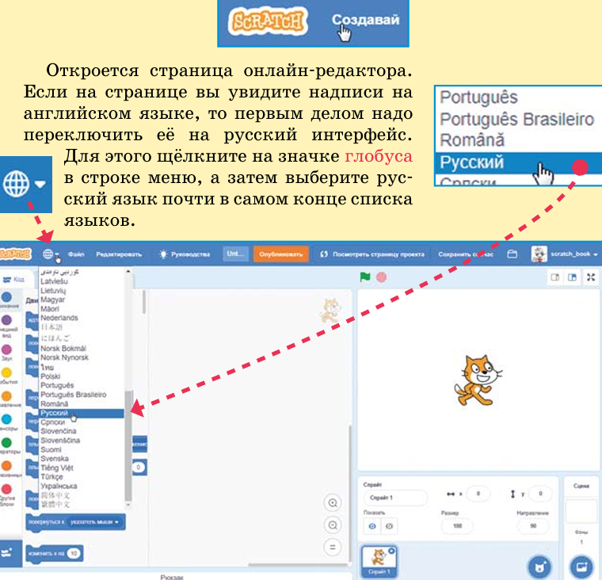

Теперь можно осмотреться.

- **Сцена** — белое поле справа. На ней видно, как работает проект. По сцене перемещаются спрайты (персонажи), на ней вы будете рисовать и изменять её фон. Сейчас на сцене всего один спрайт — Кот.
- **Область скриптов** — огромная область в центре. Там мы будем собирать скрипты проекта из разноцветных блоков.
- **Палитра блоков** — расположена слева. Сейчас выбраны синие блоки **Движение**. Выберите фиолетовые блоки **Внешний вид**. Пощёлкайте по блокам других цветов.
- **Область спрайтов** — расположена под сценой. Все спрайты проекта находятся здесь.

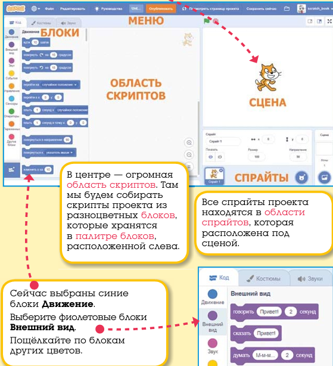

С остальными вкладками и кнопками мы познакомимся позднее, а теперь пришло время сделать первый проект.

---

## 1.2. Первый проект

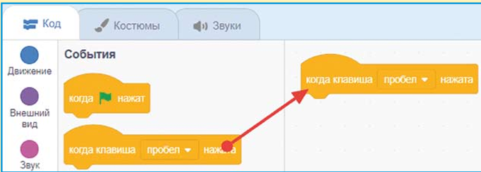

Выберите блоки **События**. Щёлкните мышью на блоке `когда клавиша пробел нажата` и, не отпуская левую кнопку мыши, тяните его в область скриптов.

Расположите блок в верхней части области скриптов и отпустите левую кнопку мыши. Затем выберите синие блоки **Движение** и вытащите в область скриптов блок `идти 10 шагов`. Тащите его прямо к первому блоку. Когда он захочет к нему прицепиться, появится белая полоса — в этот момент отпускайте левую кнопку мыши, блок встанет на место.

Получилась первая программа, состоящая из одного скрипта.

> **Важно!** Каждый скрипт начинается с блока **Событий** с круглой «шапочкой». Скрипт выполняется сверху вниз. Каждый блок по очереди выполняет своё действие.

Нажимайте клавишу `<Пробел>` и посмотрите, что будет происходить на сцене. Котик пойдёт направо.

Если нажимать клавишу `<Пробел>` много раз, Котик скроется за краем сцены. Вытащите его обратно за хвост.

Теперь нажмите клавишу `<Пробел>` и не отпускайте её — Кот побежит. Снова вытащите его на середину сцены.

Отлично! Бегать Кота научили, теперь научим его мяукать.

---

## 1.3. Блоки звука

Выберите сиреневые блоки **Звука**. Прицепите к скрипту блок `включить звук Мяу`.

Снова нажимайте клавишу `<Пробел>` — Кот идёт и мяукает.

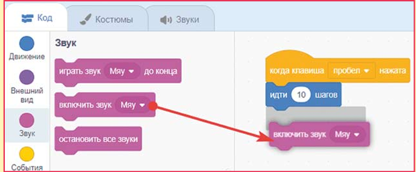

> **Совет.** Если Кот не мяукает, проверьте громкость звука и включите колонки.

Мяукать Кота научили, а теперь попробуем научить его лаять. Щёлкните на вкладку **Звуки**.

Затем наведите мышь на круглый голубой значок слева внизу.

В открывшемся меню нажмите кнопку **Выбрать звук**.

Откроется библиотека звуков. Она содержит более 350 различных звуков, мелодий и эффектов.

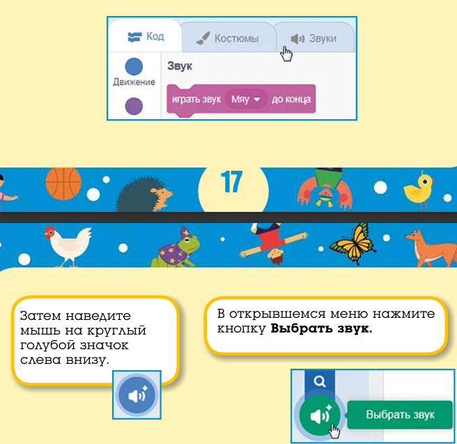

> **Совет.** Для того чтобы прослушать звуки, просто наведите на них указатель мышки.

Выберите категорию **Животные**. Щёлкните по значку звука `Dog1`.

Теперь Кот может использовать два звука — либо «Мяу», либо «Dog1».

Перейдите на вкладку **Скрипты**. Нажав на белый треугольничек, раскройте список звуков в сиреневом блоке и выберите звук `Dog1`.

Нажимайте клавишу `<Пробел>` — теперь Кот бегает и лает. Так гораздо веселее! Получился Кот-иностранец.

Ну вот вы и сделали свой первый проект на Scratch. Осталось только дать ему нормальное имя и поделиться им. Замените имя проекта «Untitled-1» на «Кот лает».

Затем нажмите оранжевую кнопку **Опубликовать** — откроется страница проекта, на которой можно собирать лайки.

Скопируйте ссылку на проект и поделитесь ею с друзьями. Ссылка выглядит примерно так: `https://scratch.mit.edu/projects/287345328/` (числовой номер проекта у вас будет свой).

---

## 1.4. Задания

1. С помощью кнопки **Записать** (на вкладке **Звуки**) попробуйте записать звук с микрофона.
    - Для начала записи нажмите кнопку с кружочком.
    - Для остановки записи нажмите квадратную кнопку.
    - Для прослушивания — кнопку с треугольником.
    - Всё как на настоящем проигрывателе!

2. С помощью кнопки **Загрузить звук** загрузите в проект свою любимую композицию из файла с расширением `mp3`. (Надеюсь, вы знаете, что такое расширение файла?)

---

# FAQ

**Что такое Scratch?**
Визуальный язык программирования, в котором программа собирается из разноцветных блоков.

**Нужно ли писать код в Scratch?**
Нет. Программа складывается из блоков, которые соединяются защёлками.

**Кто талисман Scratch?**
Рыжий Кот.

**Где работает Scratch?**
В браузере, а также в офлайн-версии под Windows и Mac OS.

**На какой возраст рассчитан Scratch?**
В основном на детей 8–16 лет, но дети 6–7 лет тоже могут создавать простые проекты.

**Кто создал Scratch?**
Проект инициирован в 2003 году, создан в 2007 году в лаборатории Lifelong Kindergarten MIT под руководством профессора Митчела Резника.

**Сколько пользователей у Scratch?**
Более 40 млн зарегистрированных пользователей по всему миру.

**Как поделиться проектом?**
Опубликовать проект, скопировать ссылку и поделиться ею.

**Что такое скрипт?**
Фрагмент программы спрайта, состоящий из последовательно соединённых блоков.

**Что такое спрайт?**
Персонаж или объект проекта Scratch, которым можно управлять с помощью скриптов.

**С чего начинается каждый скрипт?**
С блока **Событий** с круглой «шапочкой».

**В каком порядке выполняется скрипт?**
Сверху вниз, блок за блоком.

**Как переключить интерфейс на русский?**
Щёлкнуть на значке глобуса в строке меню и выбрать русский язык.

**Сколько глав в книге?**
19 глав.

**Как связаться с автором?**
По электронной почте scratch.book@ya.ru или через сайт [http://scratch4russia.com/](http://scratch4russia.com/).

# Глава 2. Усложнение первого проекта

## 2.1. Загрузка первого проекта

Запустите Scratch и войдите в свой аккаунт. Раскройте меню и перейдите в раздел **Мои работы**.

Нажмите кнопку **Войти внутрь проекта**.

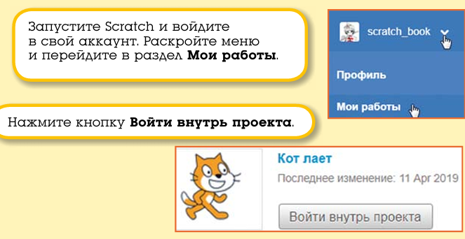

---

## 2.2. Изменение скорости движения

> **Скрипт** — <mark>последовательность блоков, соединённых вместе и запускаемых одним событием.</mark>

Сначала удалите блок звука, чтобы лай не отвлекал вас от знакомства с новыми блоками. Для этого нажмите на сиреневый блок звука и тащите его обратно в палитру блоков. Отпустите левую кнопку мыши. Когда блок будет находиться над палитрой, он исчезнет.

Теперь добавьте к скрипту новый блок из набора **Движение** — `если касается края, оттолкнуться`.

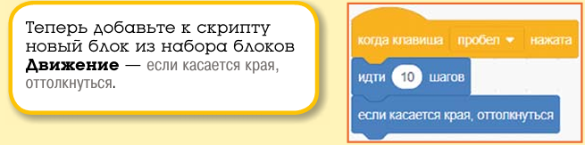

Нажимайте клавишу `<Пробел>` и посмотрите, что произойдёт, когда Кот дойдёт до края экрана. Он оттолкнётся и пойдёт в обратном направлении. Теперь вам не придётся вытаскивать его за хвост.

А теперь попробуйте изменить скорость движения Кота. Для этого надо изменить значение в блоке `идти`. Щёлкните на числе 10. Оно посинеет.

Введите значение 5 и нажмите на клавишу `<Enter>` (либо щёлкните мышью где-нибудь в пустом месте области скриптов).

Снова нажимайте клавишу `<Пробел>` — Кот идёт в два раза медленнее. Конечно, ведь пять в два раза меньше десяти.

А теперь введите туда значение 1.

Теперь Кот идёт очень медленно. А что будет, если ввести в блок `идти` значение больше 10? Поэкспериментируйте.

Как вы уже заметили, при движении влево Кот всегда переворачивается вверх тормашками. Это не похоже на движение настоящих котов — обычно они всегда передвигаются тормашками вниз.

Существует блок, который запрещает спрайту переворачиваться. Это `установить способ вращения влево-вправо`. Добавьте этот блок к скрипту.

Теперь Котик будет бегать лапами вниз. Проверьте, так ли это.

В Scratch существует всего три стиля вращения: «влево-вправо», «не вращать» и «кругом».

У каждого нового спрайта, добавленного в проект, установлен стиль вращения «кругом», поэтому блок стиля вращения мы будем использовать очень часто.

Не забудьте сохранить проект под новым именем: в меню **Файл** выберите команду **Сохранить как копию**.

---

## 2.3. Автомобиль с пятью скоростями

Вы научились перемещать спрайты с различной скоростью, а теперь давайте создадим новый проект, в котором автомобиль, как в жизни, будет иметь пять скоростей.

Создайте новый проект, в котором, как обычно, есть только Кот.

Но нам же нужен автомобиль! Давайте загрузим его из библиотеки спрайтов. Библиотека спрайтов очень похожа на библиотеку звуков. Выберите понравившийся вам автомобиль, например вот такой.

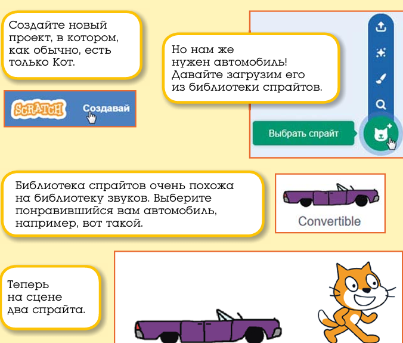

> **Спрайт** — <mark>персонаж или объект проекта Scratch, которым можно управлять с помощью скриптов.</mark>

Теперь на сцене два спрайта. Они оба показаны в области спрайтов.

Этот проект будет про автомобиль, поэтому Кот не нужен. Выберите его спрайт и удалите, нажав на крестик.

Остался только один спрайт — автомобиль. Теперь его надо запрограммировать. У автомобиля будет 5 скоростей, поэтому нужно создать 5 разных скриптов.

Сначала запрограммируем первую скорость. Постройте вот такой скрипт.

Теперь переключим управление с клавиши `<Пробел>` на клавишу `<1>`. Для этого раскройте выпадающий список, нажав на белый треугольничек в блоке `когда клавиша пробел нажата`, и двигайте курсор вниз.

Выберите единичку.

Теперь измените значение в блоке `идти` на 1. На первой скорости машина будет ехать очень медленно.

Первый скрипт автомобиля готов. Протестируйте его.

Нам надо сделать ещё четыре похожих скрипта.

> **Совет.** Есть простой способ скопировать скрипт. Щёлкните на верхнем блоке скрипта правой кнопкой мыши и выберите команду **Дублировать**.

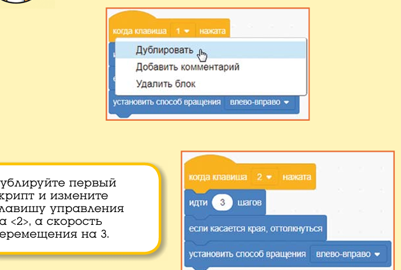

Дублируйте первый скрипт и измените клавишу управления на `<2>`, а скорость перемещения на 3.

Сделайте ещё три скрипта.

Проект почти готов. Давайте украсим сцену — добавим красивый фон. Нажмите кнопку **Выбрать фон**.

Выберите фон, например вот этот.

Автомобиль расположен не очень удачно — он стоит на крыше.

Опустите его на дорогу и не забудьте, что в нашей стране правостороннее движение.

Теперь проект готов. Протестируйте его и не забудьте сохранить.

---

## 2.4. Задания

1. Добавьте автомобилю шестую скорость.
2. Немного уменьшите размер автомобиля, уменьшая значение в окошке **Размер**.
3. Добавьте в проект пешеходов, которые будут стоять на тротуаре. Измените их размер.
4. Добавьте ещё один автомобиль, у которого будет только четыре скорости.

---

# Глава 3. Знакомство с эффектами

## 3.1. Создание нового проекта

Создайте новый проект: в меню **Файл** выберите команду **Новый**.

Появится новый проект, в котором, как обычно, есть только Кот. Он-то нам и нужен. Сегодня ему предстоит стать очень эффектным, например таким.

Для изменения внешнего вида Кота мы будем использовать фиолетовые блоки **Внешний вид**.

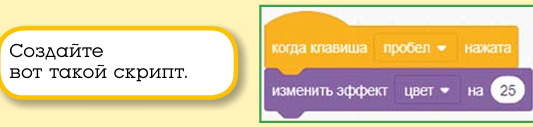

> **Графический эффект** — визуальное изменение спрайта, задаваемое числовым значением.

---

## 3.2. Цветовой эффект

Цветовой эффект изменяет цвет спрайта.

Создайте вот такой скрипт.

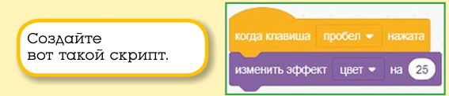

Протестируйте его.

При нажатии клавиши `<Пробел>` Кот меняет цвет. Выглядит весело, но почему так происходит? Дело в том, что все цвета в Scratch имеют свои числовые значения от 0 до 100. Например, красный цвет имеет значение 0, жёлтый — 16, и так далее.

Значение эффекта «цвет» может изменяться в диапазоне от 0 до 200.

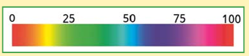

И если при создании проекта наш котик был оранжевого цвета № 11, то после нажатия клавиши `<Пробел>` он станет зелёным.

Таким образом, изменяя эффект «цвет» на 25, Котик пройдёт через испытание палитрой и снова станет рыжим. Это произойдёт ровно через восемь нажатий клавиши `<Пробел>`:

$$25 \cdot 8 = 200$$

Проверьте это.

Измените значение 25 на 1. Нажимайте клавишу `<Пробел>` — теперь цвет изменяется очень плавно.

> **Вопрос.** Сколько раз надо нажать клавишу `<Пробел>`, чтобы окрас Котика вернулся к рыжему цвету?

Вернуть Коту первоначальный вид можно, щёлкнув на фиолетовом блоке `убрать графические эффекты`.

---

## 3.3. Эффект рыбьего глаза

Рыбий глаз — очень интересный эффект, раздувающий спрайт.

Выберите этот эффект из выпадающего списка эффектов. Введите значение 25.

Нажимайте клавишу `<Пробел>` и смотрите, что получится.

Раздуло Котика не слабо — наверное, вчерашнее молоко было позавчерашним.

В отличие от эффекта цвета, этот эффект бесконечный. Если не отпускать клавишу `<Пробел>`, то Кот превратится в лепёшку. Вот таким он станет через 100 нажатий клавиши `<Пробел>`.

Измените значение 25 на 1. Нажимайте клавишу `<Пробел>` — теперь Кот раздувается не спеша.

Не забывайте, что вернуть Коту первоначальный вид можно с помощью блока `убрать графические эффекты`.

---

## 3.4. Эффект завихрения

Завихрение — тоже очень зрелищный эффект.

Выберите его из выпадающего списка и введите значение 5.

Нажимайте клавишу `<Пробел>` и посмотрите, как закрутит Котика.

Вот таким он станет через 15 нажатий на `<Пробел>`, то есть значение эффекта равно:

$$15 \cdot 5 = 75$$

Эффект завихрения бесконечный, как и рыбий глаз. Вот каким будет Котик при значении эффекта завихрения в 1000.

Теперь вам точно нужен блок `убрать графические эффекты`.

---

## 3.5. Эффект укрупнения пикселов

Этот эффект укрупняет точки, из которых состоит изображение — пикселы.

> **Пиксел** — минимальный элемент растрового изображения.

Выглядит это вот так.

Соберите вот такой скрипт и протестируйте его работу.

Посмотрите, что будет при значении эффекта 100 и больше.

При значении эффекта 400 Кот превратится в серый кирпич, а при значении больше 700 совсем исчезнет.

Не забывайте о блоке `убрать графические эффекты`.

---

## 3.6. Эффект мозаики

Этот эффект работает вот так.

Спрайт превращается в мозаику.

Соберите вот такой скрипт и протестируйте его.

При значении 100 и более спрайт выглядит как армия малюсеньких клонов, но это по-прежнему один спрайт.

Верните Котику первоначальный вид.

---

## 3.7. Эффект яркости

Этот эффект увеличивает яркость спрайта.

Сделайте вот такой скрипт и посмотрите, как он работает.

Вот как будет выглядеть Котик после десяти нажатий клавиши `<Пробел>`.

При значении эффекта 100 Кот исчезнет. Таким образом, значение эффекта яркости может изменяться от 0 до 100.

Не забывайте о блоке `убрать графические эффекты`.

---

## 3.8. Эффект прозрачности

Этот эффект позволяет спрайту исчезать и появляться. Он изменяет прозрачность спрайта.

Протестируйте его работу.

Вот так будет выглядеть Котик при значении эффекта прозрачности равном 50.

При значении эффекта прозрачности равном 100 спрайт станет невидимым.

Верните Котику первоначальный вид.

---

## 3.9. Анимация

Для того чтобы при движении Кот не плыл, а шевелил лапами, надо применить блок `следующий костюм`.

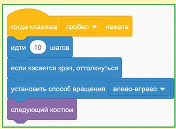

Этот блок переключает по очереди все костюмы спрайта.

> **Костюм** — <mark>одно из изображений спрайта, которое можно переключать для создания анимации.</mark>

Нажимайте клавишу `<Пробел>`, и Кот зашагает. Это происходит из-за того, что у Кота два костюма.

Перейдите на вкладку **Костюмы**.

Здесь вы можете увидеть, что у спрайта два костюма с именами «костюм 1» и «костюм 2».

Нажимайте клавишу `<Пробел>`, и вы увидите, как костюмы по очереди переключаются.

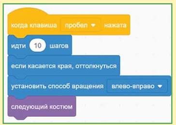

---

## 3.10. Вопросы

1. Какие эффекты применены к Коту?
2. А теперь?
3. А здесь что с Котом?
4. А здесь какие эффекты?

---

## 3.11. Задания

1. Добавьте в новый проект спрайт чёрного щенка и примените к нему поочерёдно все эффекты. Некоторые эффекты работать не будут. Подумайте, почему?
2. А теперь добавьте в проект шарик. Действие каких эффектов будет почти незаметно?
3. Добавьте в проект фон сцены и потренируйтесь на нём. Вот, например, как действует на фон эффект завихрения.

---

# FAQ

**Что такое графический эффект?**
Визуальное изменение спрайта, задаваемое числовым значением.

**Сколько всего стилей вращения в Scratch?**
Три: «влево-вправо», «не вращать» и «кругом».

**Какой стиль вращения установлен у нового спрайта по умолчанию?**
«Кругом».

**Каков диапазон значений эффекта «цвет»?**
От 0 до 200.

**Через сколько нажатий клавиши `<Пробел>` Кот вернётся к рыжему цвету, если эффект «цвет» изменяется на 25?**
Через восемь нажатий: $25 \cdot 8 = 200$.

**Какие эффекты являются бесконечными?**
Рыбий глаз и завихрение.

**Как вернуть спрайту первоначальный вид?**
С помощью блока `убрать графические эффекты`.

**Что делает блок `следующий костюм`?**
Переключает костюмы спрайта по очереди, создавая анимацию.

**Как скопировать скрипт?**
Щёлкнуть на верхнем блоке скрипта правой кнопкой мыши и выбрать команду **Дублировать**.

**Как сохранить проект под новым именем?**
В меню **Файл** выбрать команду **Сохранить как копию**.

# Глава 4. Знакомство с отрицательными числами

## 4.1. Ходим задом наперёд

Создайте новый проект: в меню **Файл** выберите команду **Новый**.

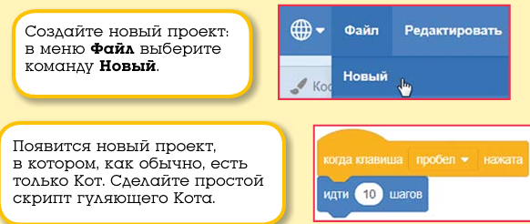

Появится новый проект, в котором, как обычно, есть только Кот. Сделайте простой скрипт гуляющего Кота.

> **Отрицательное число** — число со знаком минус, которое меняет направление действия на противоположное.

Нажимайте клавишу `<Пробел>`. Кот, как обычно, гуляет по сцене.

Для того чтобы научить его ходить задом наперёд и делать всё наоборот, нам понадобится отрицательное число $-10$. Это то же самое, что и 10, только с минусом. Отрицательные числа очень похожи на обыкновенные числа, только они делают всё наоборот: право меняют на лево, верх на низ, перёд на зад, разгон на торможение, рост на снижение, взлёт на падение и так далее.

Замените в скрипте 10 на $-10$.

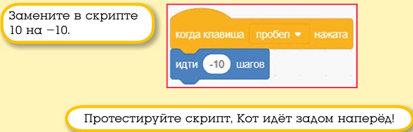

Протестируйте скрипт — Кот идёт задом наперёд!

---

## 4.2. Переворачиваем звуки

А теперь давайте научим его мяукать задом наперёд! Это можно сделать и без отрицательных чисел.

Добавьте к скрипту блок мяуканья.

Перейдите на вкладку **Звуки**.

Здесь вы увидите графическое изображение звука. Чем шире полоса, тем звук громче.

Нажмите на кнопку с треугольником.

Вы услышите звук. Для того чтобы проиграть его задом наперёд, нажмите кнопку **Развернуть**.

Выделенный звук развернётся задом наперёд.

Перейдите на вкладку **Код**. Нажмите клавишу `<Пробел>` и послушайте, как стал мяукать Кот.

> **Эксперимент.** Добавьте Коту другие звуки и переверните их. Какой самый прикольный? Мне понравился перевёрнутый звук `triumph`.

Перевернуть задом наперёд можно не только звуки из библиотеки, это можно сделать и с записанным звуком.

Нажмите кнопку **Записать**.

Затем нажмите оранжевую кнопку **Записать**.

Записанный звук также можно перевернуть — таким способом можно получить очень интересные звуки для ваших проектов.

Также можно переворачивать звуки, скачанные из Интернета.

Для того чтобы загрузить звук или музыку из файла, надо нажать кнопку **Загрузить звук** (на вкладке **Звуки**).

В открывшемся окне необходимо выбрать нужный файл и нажать кнопку **Открыть**. Теперь можно проиграть файл задом наперёд или применить к нему другие звуковые эффекты.

> **Совет.** Загружайте только файлы формата MP3 или WAV! Старайтесь не загружать файлы большого размера. Если в вашем проекте используется только часть музыкального файла, то удалите его неиспользуемую часть, выделив её и нажав клавишу `<Delete>`.

---

## 4.3. Волшебный единорог

Используя отрицательные числа, можно сделать много интересных проектов. Например, про Единорога, появляющегося из ниоткуда.

Откройте библиотеку спрайтов.

Выберите бегущего единорога.

Теперь у нас два спрайта.

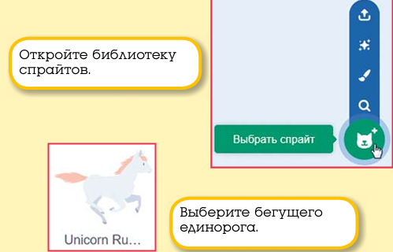

Кот нам не нужен, удалите его, нажав на крестик.

Сделайте вот такие два скрипта для Единорога.

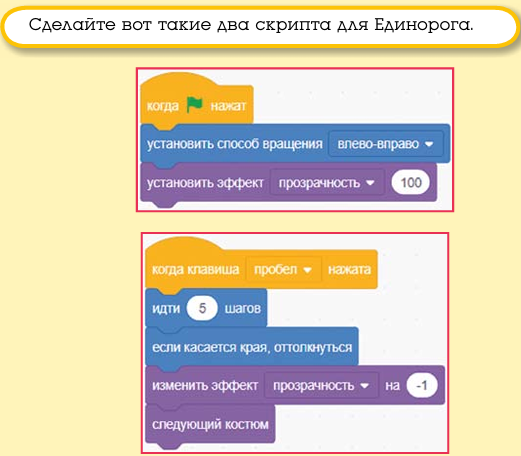

Протестируйте работу скриптов. Щёлкните на зелёном флажке (он находится в правом верхнем углу сцены) — Единорог исчезнет. Нажимайте клавишу `<Пробел>`, и он появится из ниоткуда! Но почему это происходит? Всё очень просто. Когда вы нажимаете на зелёный флажок, эффект призрака становится равным 100, и Единорог исчезает. При нажатии клавиши `<Пробел>` значение эффекта призрака каждый раз уменьшается на 1 и после ста нажатий становится равным нулю.

Давайте добавим красивый фон. Нажмите кнопку **Выбрать фон**.

Снова нажмите на зелёный флажок, а затем на клавишу `<Пробел>`. Так гораздо красивее!

Сохраните проект.

---

## 4.4. Вопросы

1. Что получится, если мы изменим 5 на $-5$ в блоке `идти`?
2. Что получится, если в начале проекта мы установим прозрачность Единорога в значение 0, а затем при нажатии клавиши `<Пробел>` будем изменять её на 1?
3. На улице было $+25$ градусов, а затем температура изменилась на $-5$ градусов. Какая температура стала на улице?
4. У Буратино было 5 золотых, а потом Лиса Алиса подарила ему $-1$ золотой. Сколько золотых стало у Буратино?

---

## 4.5. Задания

1. С помощью инструмента записи голоса запишите какую-нибудь фразу и переверните её задом наперёд.
2. Добавьте в проект с Единорогом волшебную музыку из библиотеки звуков.
3. Добавьте в проект с Единорогом ещё одного Единорога, который будет появляться при нажатии на клавишу `<↑>`.

---

# FAQ

**Что такое отрицательное число?**
Число со знаком минус, которое меняет направление действия на противоположное.

**Что произойдёт, если заменить 10 на $-10$ в блоке `идти`?**
Спрайт будет двигаться в обратном направлении — задом наперёд.

**Как перевернуть звук задом наперёд?**
На вкладке **Звуки** нажать кнопку **Развернуть**.

**Можно ли переворачивать записанные или загруженные звуки?**
Да, и записанные, и загруженные звуки можно переворачивать.

**Какие форматы звуковых файлов лучше загружать?**
MP3 или WAV, стараясь не загружать файлы большого размера.

**Как удалить неиспользуемую часть звука?**
Выделить её и нажать клавишу `<Delete>`.

**Как сделать появление Единорога из ниоткуда?**
При нажатии на зелёный флажок установить эффект призрака в 100 (спрайт исчезает), а при нажатии `<Пробел>` уменьшать его на 1 до нуля.

**Сколько нажатий нужно, чтобы Единорог полностью появился?**
Сто нажатий, так как эффект призрака уменьшается на 1 за раз.

**Что произойдёт, если в блоке `идти` заменить 5 на $-5$?**
Спрайт будет двигаться в противоположную сторону.

**Сколько золотых станет у Буратино, если у него было 5, а Лиса Алиса подарила $-1$?**
4 золотых: $5 + (-1) = 4$.

**Какая температура станет на улице, если было $+25$ градусов, а затем изменилось на $-5$?**
$+20$ градусов: $25 + (-5) = 20$.

# Глава 5. Знакомство с пером

## 5.1. Рисуем каракули

Создайте новый проект: в меню **Файл** выберите команду **Новый**.

Появится новый проект, в котором, как обычно, есть только Кот. Сейчас мы научим его рисовать на сцене. Для этого будем использовать зелёные блоки **Перо**. Чтобы работать с ними, нужно добавить специальное расширение.

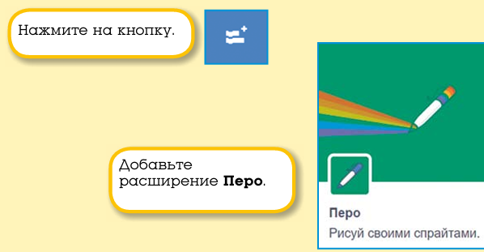

> **Перо** — это цветной фломастер, которым спрайт может рисовать на сцене. Перо может быть **поднято** — тогда спрайт при движении ничего не рисует, — или **опущено** — тогда при движении спрайта за ним тянется линия.

Нажмите на кнопку **Добавить расширение** и выберите **Перо**. Теперь в проект можно добавлять блоки пера.

Сделайте для Кота такую программу.

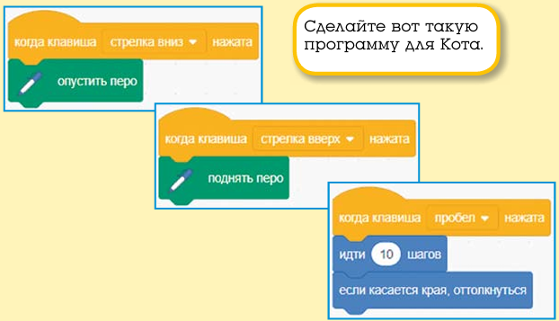

**Подсказка.** Для выбора нужной клавиши раскройте выпадающий список.

Просто нажимайте клавишу `<Пробел>` — Котик, как обычно, гуляет по сцене.

А теперь нажмите клавишу `<↓>`, а затем снова нажимайте `<Пробел>`. Перо будет опущено, и за Котом потянется тонкая синяя линия.

Если потом нажать клавишу `<↑>`, перо будет поднято, и линия появляться не станет.

Немного повеселимся — добавьте к скрипту блок поворота.

Нажимайте клавишу `<Пробел>` — Кот нарисует окружность!

Это происходит потому, что каждый раз Кот делает 10 шагов вперёд и немного поворачивается по часовой стрелке. Задайте угол поворота 1 градус.

Теперь Кот поворачивает по чуть-чуть, и на сцене появляются очень интересные узоры!

Если нажимать клавишу `<Пробел>` много раз, вся сцена будет размалёвана.

**Совет.** Чтобы очистить сцену, щёлкните мышью на блоке **стереть всё**.

**Совет.** Чтобы повернуть Кота в исходное положение, так сказать, поставить его на лапы, нужно просто ввести число 90 в окошке **Направление**.

**Эксперимент.** Изменяйте значения в блоках **идти** и **повернуть**.

Да уж… Художник из Котика получился не очень…

## 5.2. Рисуем красиво

Давайте будем управлять движением Кота с помощью стрелок на клавиатуре. Может, тогда получится нарисовать что-нибудь красивое.

Создайте новый проект.

Здесь вам пригодится блок **повернуться в направлении**.

> **Повернуться в направлении** — блок, который поворачивает спрайт в указанном направлении.

Соберите для Кота вот такую программу. Она состоит из семи скриптов.

При нажатии на зелёный флажок Котик уменьшится в размере и очистит сцену.

**Подсказка.** Нормальный размер спрайта равен 100%. Размер 20% ровно в 5 раз меньше нормального, а размер 50% ровно в 2 раза меньше нормального размера.

При нажатии клавиши `<s>` перо опустится, а при нажатии `<w>` перо поднимется. При нажатии клавиш-стрелок Котик будет поворачиваться в соответствующем направлении и делать по 10 шагов.

**Совет.** Если перо не опускается и не поднимается, проверьте, что вы переключились на английскую раскладку клавиатуры.

Теперь можно нарисовать всё, что состоит из прямоугольников. Попробуйте нарисовать:

- три квадрата;
- ряд из квадратов;
- спираль;
- пирамиду индейцев майя;
- многоэтажку.

Многоэтажку нарисовать не просто. У меня не получилось с первого раза. Любая ошибка — и приходится начинать сначала.

Давайте добавим в проект возможность стереть нарисованное. А что значит стереть нарисованное на белом фоне? Это значит закрасить белым! Нужно добавить в проект возможность рисовать белым.

Добавьте в проект два скрипта.

**Подсказка.** Для выбора цвета в блоке установки цвета необходимо щёлкнуть в цветной овальчик, выбрать пипетку, а затем щёлкнуть в любом месте на сцене, окрашенном в нужный цвет.

Теперь при нажатии клавиши с цифрой `0` Котик будет стирать нарисованное, а при нажатии на клавишу с `1` снова сможет рисовать.

Сохраните проект.

## 5.3. Вопросы

1. Кот рисует короткими отрезками. Как увеличить длину отрезков?
2. Как изменить программу, чтобы она стирала нарисованное на сером фоне?
3. Что будет с Котом, если установить его размер не 20%, а 200%?

## 5.4. Задания

1. Добавьте в проект возможность рисовать красным цветом.
2. Установите размер кота в 10 раз меньше нормального.
3. Сделайте так, чтобы можно было очищать сцену, используя клавиатуру, не нажимая на зелёный флажок.
4. Для того чтобы было удобнее рисовать, сделайте так, чтобы цвет Кота был разным при опущенном пере и при поднятом пере.

# Глава 6. Циклы

## 6.1. Знакомство с циклами

В предыдущих главах для управления спрайтами вам приходилось постоянно нажимать клавиши. Это не всегда удобно. Для автоматического выполнения действий в Scratch есть очень важный оранжевый блок **повторить**. Он позволяет повторить одно действие несколько раз подряд. Давайте попробуем.

> **Цикл** — конструкция, позволяющая многократно выполнять одну и ту же последовательность команд.

Создайте новый проект: в меню **Файл** выберите команду **Новый**.

Соберите для Кота вот такой скрипт.

Блок **повторить** выполнит своё содержимое 10 раз.

Щёлкните по зелёному флажку. Кот смело пошагает вперёд и сделает 10 раз по 10 шагов — всего 100 шагов. Снова щёлкните по флажку — Кот опять сделает 100 шагов.

**Эксперимент.** Вводите разные значения в блок **идти** и в блок **повторить** и посмотрите, что получится. Не вводите в блок **повторить** значения больше 1000.

## 6.2. Циклы и эффект цвета

Вы уже знаете, что эффект «цвет» может изменяться в диапазоне от 0 до 200. Вот как будет изменяться цвет красного спрайта при использовании этого эффекта.

Давайте сделаем Кота, который будет автоматически изменять свой цвет 200 раз и снова становиться рыжим. Удалите созданный скрипт: для этого перетащите его целиком в палитру блоков и отпустите кнопку мыши. Скрипт исчезнет.

Теперь создайте для Кота вот такой скрипт.

Нажмите на зелёный флажок. Кот будет плавно изменять свой цвет, пока снова не станет рыжим.

**Эксперимент.** Измените значение в блоке **повторить** на 400. А сколько раз теперь Кот пройдёт по цветовому кругу? Измените значение в блоке **изменить эффект цвет** на 2. Что изменится в работе скрипта?

## 6.3. Циклы и эффект прозрачности

А теперь давайте поиграем с эффектом прозрачности. Этот эффект изменяется от 0 до 100.

> **Прозрачность** — графический эффект, определяющий степень невидимости спрайта: 0 — спрайт полностью видим, 100 — спрайт полностью невидим.

Создайте для Кота вот такой скрипт.

При нажатии на зелёный флажок сначала пропадут все графические эффекты, а затем Кот плавно исчезнет.

**Эксперимент.** Вводить значение больше 100 в блок **повторить** не имеет смысла, ведь Кот не может стать дважды невидим!

А вот значение в блоке **изменить эффект прозрачность** поменять можно. На что это повлияет?

Очень жаль, что Котик постоянно пропадает. Давайте сделаем так, чтобы он плавно исчезал, а потом так же плавно появлялся. Для этого нам понадобится отрицательное число –1. Это число имеет перед собой знак «минус», поэтому, изменяя эффект призрака на –1, мы будем уменьшать его значение от 100 до 0, пока Котик не станет таким как был.

Доработайте скрипт.

Проверьте, как работает этот скрипт. Нажмите на зелёный флажок. Кот уйдёт в страну призраков, а потом вернётся из неё!

А что, если нам надо запустить Кота в страну призраков 10 раз подряд? Для этого может пригодиться ещё один блок повтора! Выберите его в палитре блоков и подтащите к скрипту так, чтобы он обнял сразу два блока повтора.

Получится вот такой скрипт.

Запустите его. Кот станет невидимым 10 раз подряд.

Сохраните проект.

## 6.4. Вращение

А теперь давайте познакомимся с блоками поворота. Их всего два: **поворот по часовой стрелке** и **поворот против часовой стрелки**.

> **Градус** — единица измерения угла; полная окружность делится на $360°$.

Как вы, наверное, уже знаете, окружность делится на 360 градусов, поэтому спрайт в Scratch может двигаться в одном из 360 направлений.

Градусы обозначаются маленьким кружочком, например, $360°$.

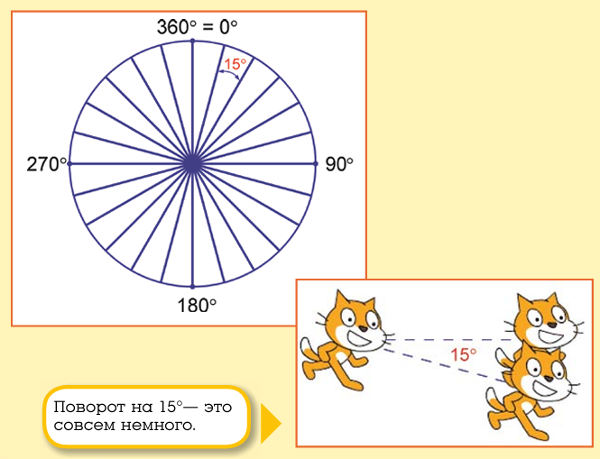

Движение вверх — это движение в направлении $0°$, движение вправо — движение в направлении $90°$ и так далее.

Поворот на $15°$ — это совсем немного.

Для того чтобы повернуть персонаж под углом в $90°$, надо 6 раз повернуть на $15°$:

$$6 \times 15° = 90°$$

А для того чтобы совершить полный оборот, надо повернуться 24 раза по $15°$:

$$24 \times 15° = 360°$$

**Совет.** В блоке **повернуться в направлении 90** спрятана подсказка по направлениям. Если вы забудете, где право и где лево, то всегда сможете подсмотреть правильный ответ.

Обратите внимание, что направления $-90°$ и $270°$ — это одно и то же.

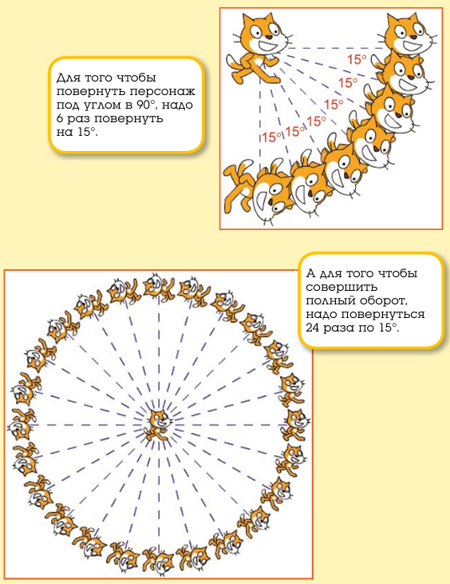

Для того чтобы лучше понять, что такое градусы, создайте новый проект и сделайте такой скрипт.

Вы уже знаете, что 24 раза по $15°$ — это полный оборот. Нажмите на зелёный флажок и убедитесь в этом. Кот сделает ровно один оборот!

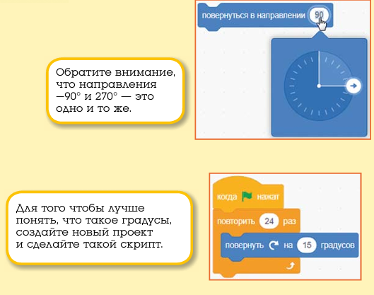

**Эксперимент.** Изменяйте значения в блоках **повторить** и **повернуть** так, чтобы произведение этих чисел было равно 360. Например, 36 и 10, 72 и 5, 10 и 36, 5 и 72, 2 и 180 и так далее. Обратите внимание на скорость вращения Кота.

## 6.5. Бесконечный цикл

Интересно, а что будет, если ввести в блок **повторить** огромное значение, например, один миллион — 1 000 000? В этом случае прогулка Кота затянется на 8 часов, а если ввести один миллиард — 1 000 000 000, то Котик будет гулять целый год!

Однако для бесконечного выполнения скрипта лучше использовать блок **повторять всегда**. Этот блок всегда повторяет своё содержимое до бесконечности.

> **Бесконечный цикл** — цикл, который повторяет своё содержимое неограниченное число раз, пока не будет остановлен.

Создайте для Кота вот такой скрипт.

Щёлкните по зелёному флажку. Теперь Кота ничто не остановит! Можете съездить на лето к бабушке, а вернувшись, убедиться, что Кот всё ещё ходит по сцене кругом. «Идёт направо — песнь заводит, налево — сказку говорит».

Шутка. Кота-сказочника вы сможете запрограммировать после того, как познакомитесь с условным блоком.

## 6.6. Автоматическая печать

Давайте сделаем небольшой проект с применением блока **повторять всегда**. Украсим двор яблоками!

Создайте новый проект.

Войдите в библиотеку спрайтов и выберите **Яблоко**.

Кота удалите знакомым вам способом.

Сделайте вот такую программу из двух скриптов для яблока.

В этой программе используются сразу три новых блока: **перейти на указатель мыши**, **печать** и **ждать**.

> **Перейти на указатель мыши** — блок, который перемещает спрайт в текущее положение указателя мыши на сцене.
> **Печать** — блок, который оставляет отпечаток текущего изображения спрайта на сцене.
> **Ждать** — блок, который приостанавливает выполнение скрипта на заданное количество секунд.

Первый скрипт делает так, чтобы Яблоко всегда перемещалось вслед за указателем мыши, а второй всегда отпечатывает на сцене изображение яблока, проигрывает звук и ждёт 1 секунду, чтобы яблоки не сыпались слишком быстро.

**Совет.** Блок **печать** появится, если добавить расширение **Перо**.

Протестируйте работу программы.

**Совет.** Для того чтобы убрать яблоки со сцены, щёлкните по зелёному блоку **стереть всё**.

Разбрасывать яблоки на белом фоне не очень интересно. Добавьте на сцену какой-нибудь фон. Например вот этот.

Уменьшите размер яблока, введя 60 в окне **Размер**.

Теперь можете разбросать яблоки на травке.

Если вы будете аккуратны, то сможете нарисовать красивую рамку или узор.

Проект готов. Сохраните его.

## 6.7. Задания

1. Измените фон сцены в проекте про яблочки.
2. Сделайте так, чтобы отпечатываемое яблоко изменяло цвет.
3. Сделайте так, чтобы отпечатываемое яблоко изменяло прозрачность.
4. Поэкспериментируйте с временем задержки. Вводите числа с точкой: 0.1, 0.2, 0.5, 0.01, 0.02, 0.05 и проанализируйте результат. Введите отрицательное число, но будьте осторожны, не улетите в прошлое!
5. Измените звук.
6. Сделайте так, чтобы отпечаталось только 15 яблок.
7. Измените костюм Яблока на любой другой из библиотеки спрайтов.
8. Добавьте Яблоку несколько костюмов, которые будут отпечатываться по очереди.
9. Нарисуйте толпу людей.

# FAQ

**Что такое Перо в Scratch?**
Это расширение с зелёными блоками, которое позволяет спрайту рисовать линии на сцене, как фломастером.

**Чем отличается поднятое перо от опущенного?**
При поднятом пере спрайт движется, не оставляя линии; при опущенном — за спрайтом тянется линия.

**Как стереть нарисованное на белом фоне?**
Нужно рисовать белым цветом — то есть «закрашивать» нарисованное белым. Для этого добавляют скрипт с блоком установки белого цвета.

**Почему перо не опускается и не поднимается по клавишам?**
Скорее всего, включена русская раскладка клавиатуры. Переключитесь на английскую.

**Что делает блок «повторить»?**
Повторяет содержимое внутри себя заданное число раз.

**Чем «повторять всегда» отличается от «повторить»?**
«Повторить» выполняется заданное число раз, а «повторять всегда» — бесконечно, пока скрипт не остановят.

**Может ли Кот стать дважды невидимым?**
Нет. Значение прозрачности больше 100 не имеет смысла — спрайт не может стать «более невидимым», чем полностью невидимый.

**Сколько раз нужно повернуть на 15°, чтобы сделать полный оборот?**
24 раза, так как $24 \times 15° = 360°$.

**Одинаковы ли направления –90° и 270°?**
Да, это одно и то же направление.

**Как убрать отпечатанные яблоки со сцены?**
Щёлкнуть по зелёному блоку **стереть всё**.

**Почему блок «печать» не появляется?**
Потому что не добавлено расширение **Перо**. Без него блок печати недоступен.

