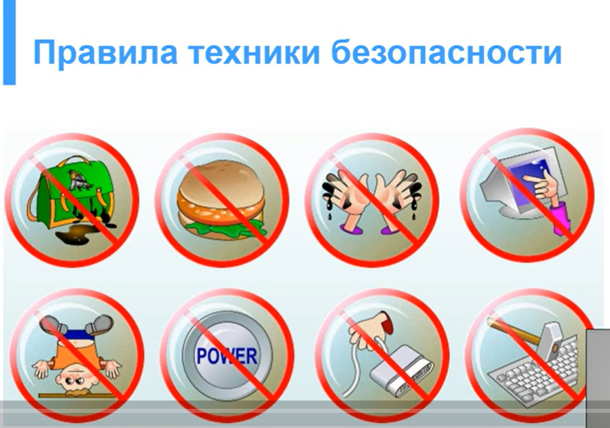
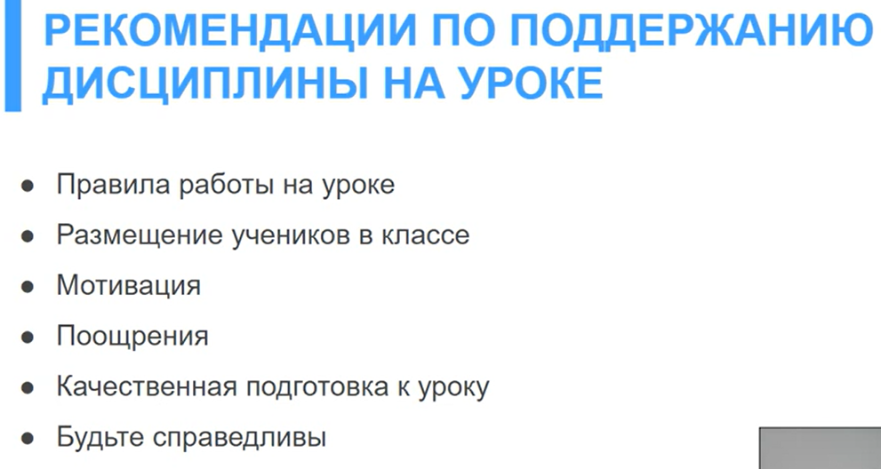
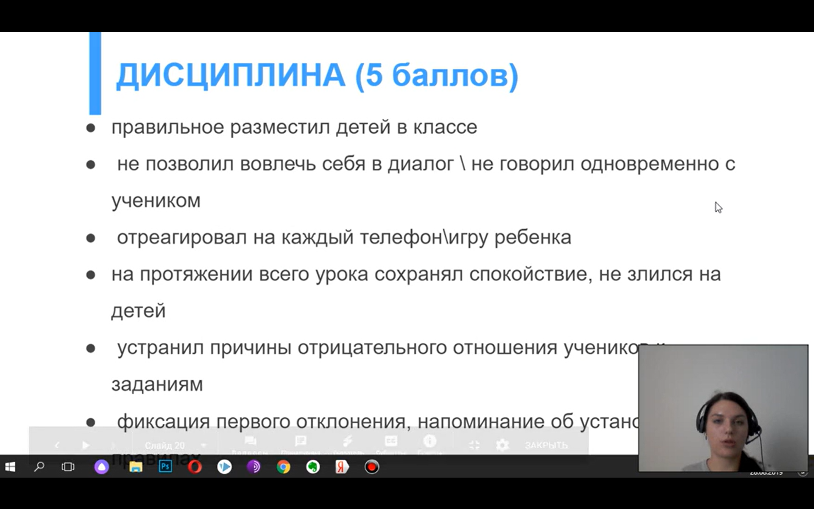

Задается на уроке с помощью правил ТБ:

1. Отсутствие мокрой одежды
2. Не трогаем монитор руками 
3. Не кушать и не пить за ПК
4. Не дергаем провода 
5. Не выключаем без взрослого
6. Не прыгаем, не бегаем
7. Аккуратное отношение к технике

Опрос. Ребята, что на картинке... а что это значит

Еще правила: 

1. Правила поднятой руки
2. Не достаем телефоны

Как поддерживать:

Критерии оценки дисциплины:

Как не давать пиздюкам рассказывать охуительные истрии:

1. Дождаться логической паузы и попросить рассказать после урока
2. Или просить рассказывать хуйню перед занятием

Эти гоблины будут пробивать и смотреть, что можно, а что нет

Если все отвлеклись нужно поймать внимание:

1. Как меня зовут
2. Для взрослых детей можно просто помолчать
3. Перейти к заданию, коротое будет требовать внимание (поочередно необходимо всех опросить)