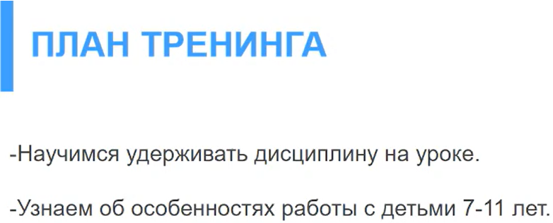
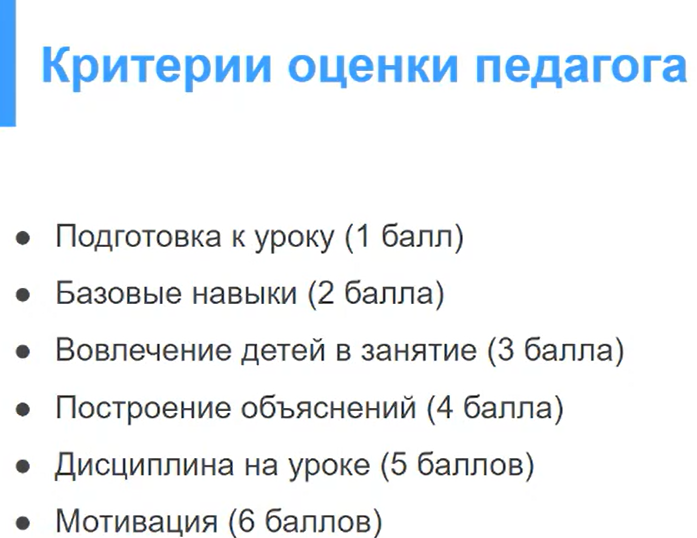
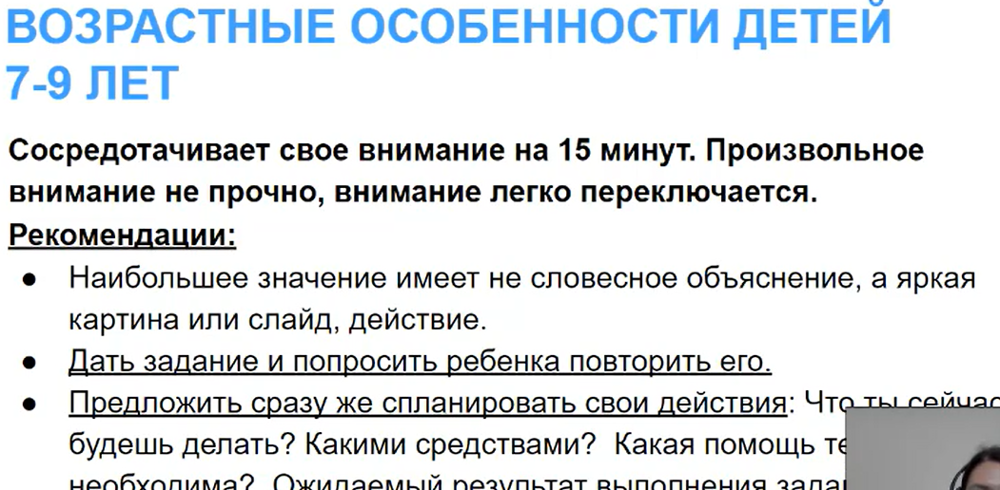
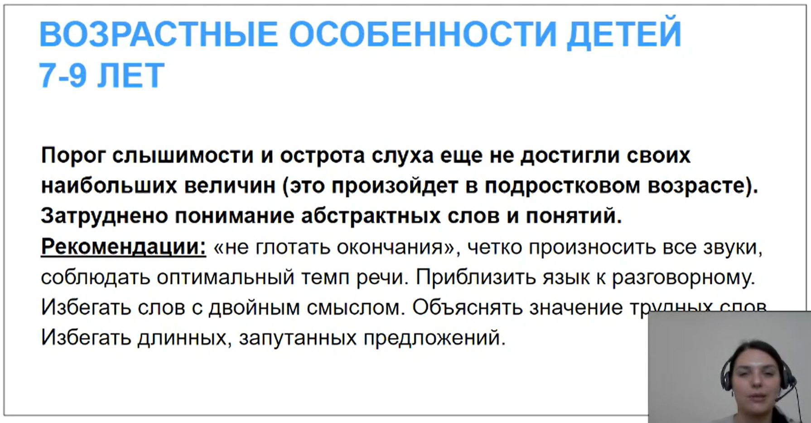
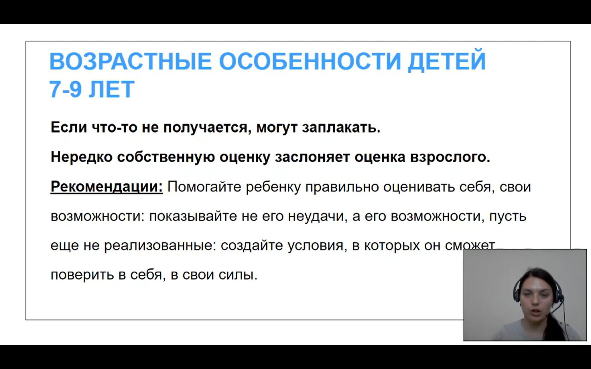
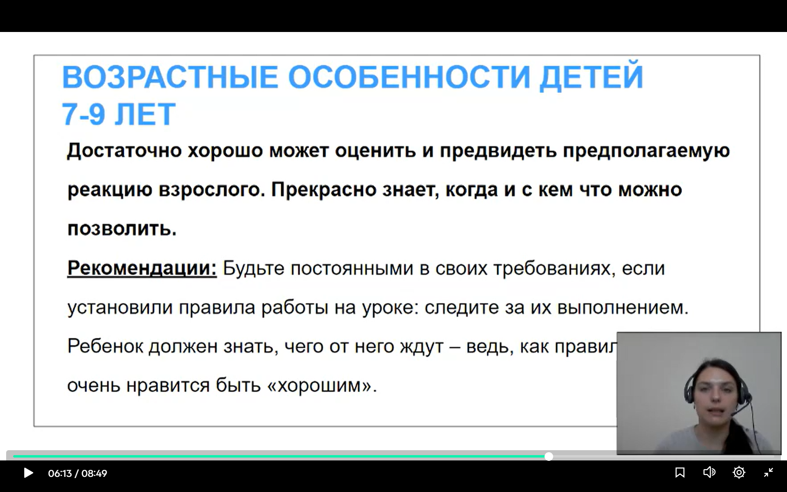
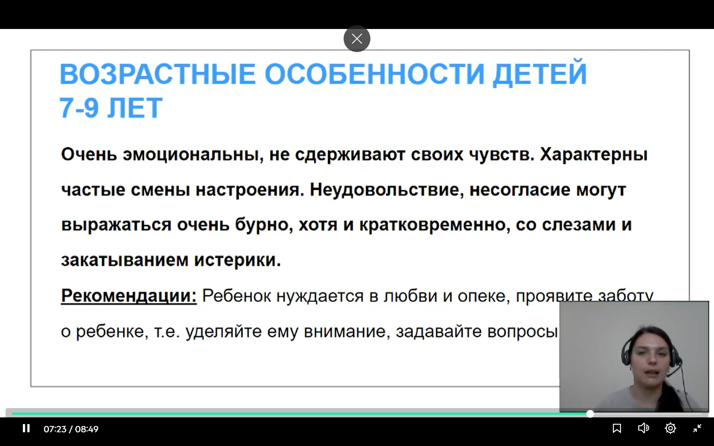
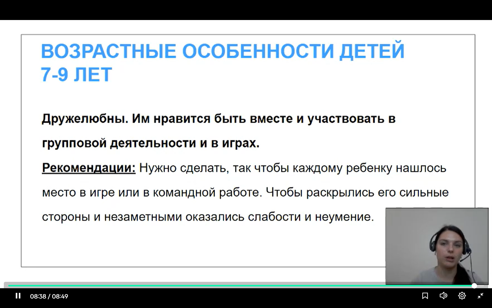

План тренинга:

Еще раз критерии оценки педагога:

Особенности детей 7-9:

Очень активны. Препод очень активный, у него режущий голос. Те, кто ведет старших спокойнее. Необходимо подстраиваться под каждую группу

ЗАПОМИНАЮТ ЧЕРЕЗ МНОГОКРАТНОЕ ПОВТОРЕНИЕ

Четко произносить все звуки. Отсутсвие сложных слов. Ассоциативность для сложных терминов.

