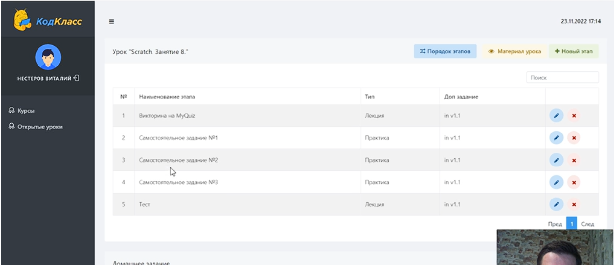
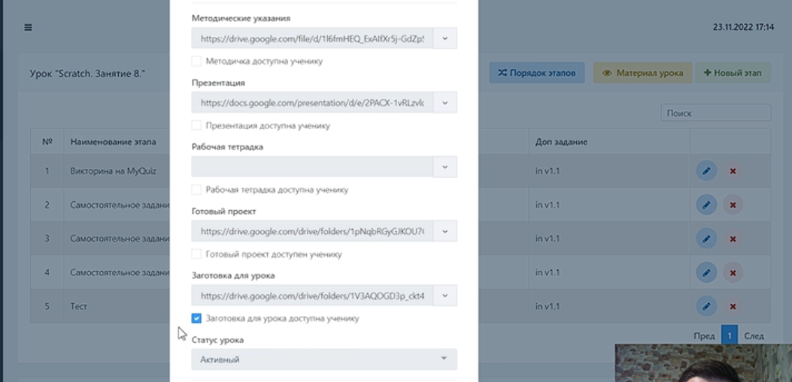
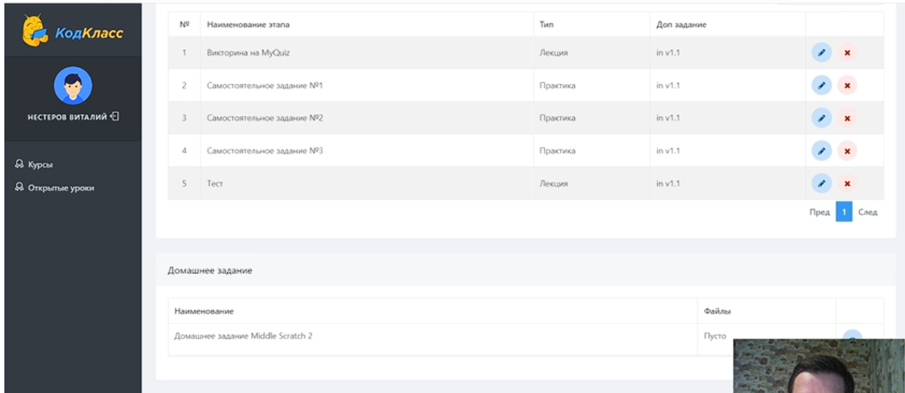

Этапы урока, которые идут поочередно. Нужно подтверждать прохождение каждого этапа. Для лекции достаточно просто открыть и закрыть, а для "практик" необходимо подверждение для каждого

Для детей доступны "материалы к уроку", которые они должны скажать:

На фото выше админка, а не то, что видит ученик. Лучше скачивать заготовки до прихода детей

После завершения детям урока детям становится доступно ДЗ:

