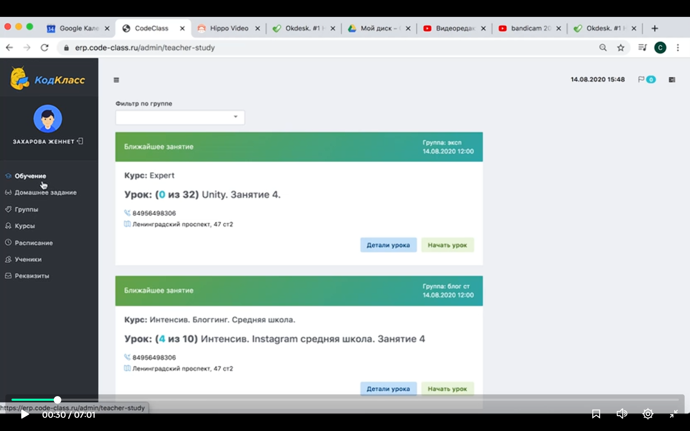
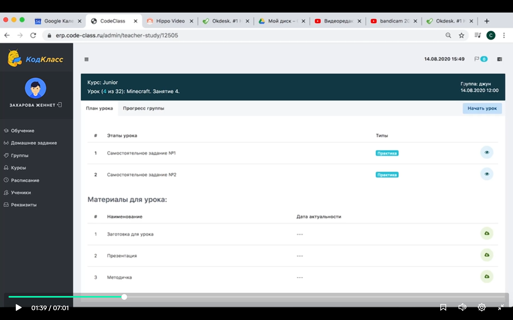
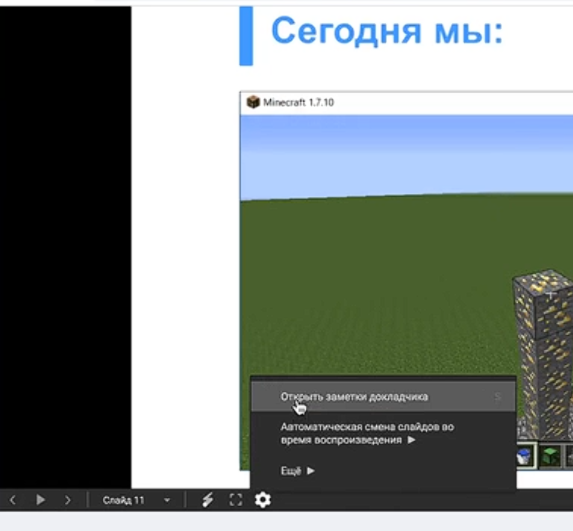
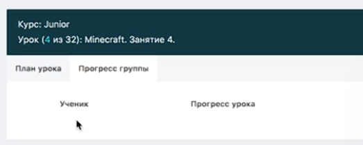

На вкладке "обучение" список назначеных руководителем занятий. 

Кнопка "начать урок" доступна за 15 мин до начала урока. 

Для подготовки урока есть кнопка "детали урока"

Что в деталях урока:

Курс, модуль (?), номер урока

Этапы урока и заготовка для урока видны для учеников, а у препода еще есть и презентация, методичка.

В презентации есть заметки докладчика:

Судя по всему, может быть так, что заметки будут вместо методички (на уроке заметки докладчика должы быть убраны)

Во время урока, на вкладке "Прогресс группы"

Здесь будет прогресс каждого ученика во время занятия.

ЕЩЕ ВОТ ЧТО:

Иногда надо рассказывать про кодкоины (https://docs.google.com/document/d/11K2eCT5xWfFNWt0n0vuEr3UcF-L38bGaocQPhVmBNSo/edit?tab=t.0).

Когда:
1. На первых уроках каждого модуля на слайдах о КодКоинах переключить вкладку на данный документ и показать какие призы ученики могут купить себе в конце курса на КодКоины и как их можно заработать.
2. Если Вам удобно, то на каждом уроке после Самостоятельного задания/в конце урока также можно переключаться на данный документ, подсчитывать количество заработанных КодКоинов у каждого ученика и проставлять их в своём Личном Кабинете в ЕРП.
3. После защиты проекта на последнем занятии годового курса во всех группах необходимо огласить итоговое количество заработанных КодКоинов у каждого ученика, а также узнать у них какой приз каждый из них хочет купить и передать данную информацию руководителю/менеджеру филиала для дальнейшей отправки подарка.

На офлайн-занятиях учёт КодКоинов осуществляется в Рабочей тетради ученика и в ЕРП.  В ЕРП дублировать количество КодКоинов обязательно, в связи с возможной утерей РТ учениками.

