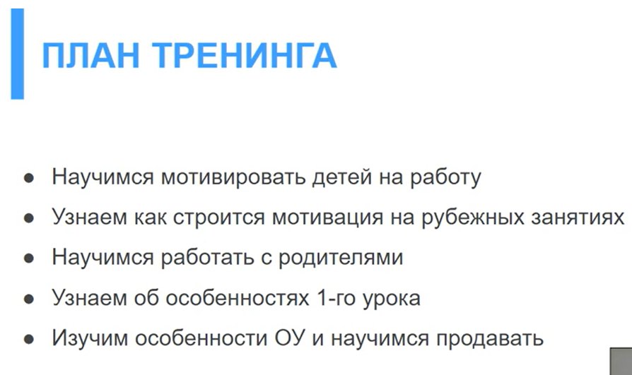

Как мотивировать учеников:

- Внутренняя
- Внешняя

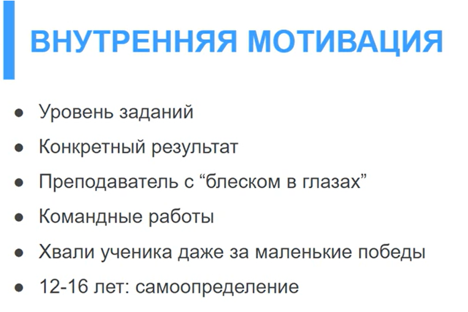

3 категории:

1. Слабые (им нужно больше времени)
   - Простые вопросы и похвала
   - Начинаем создавать возможность, чтобы он что-то ответил
   - Не отбираем мышку, а даем последовательность маленьких, выполнимых шагов
   
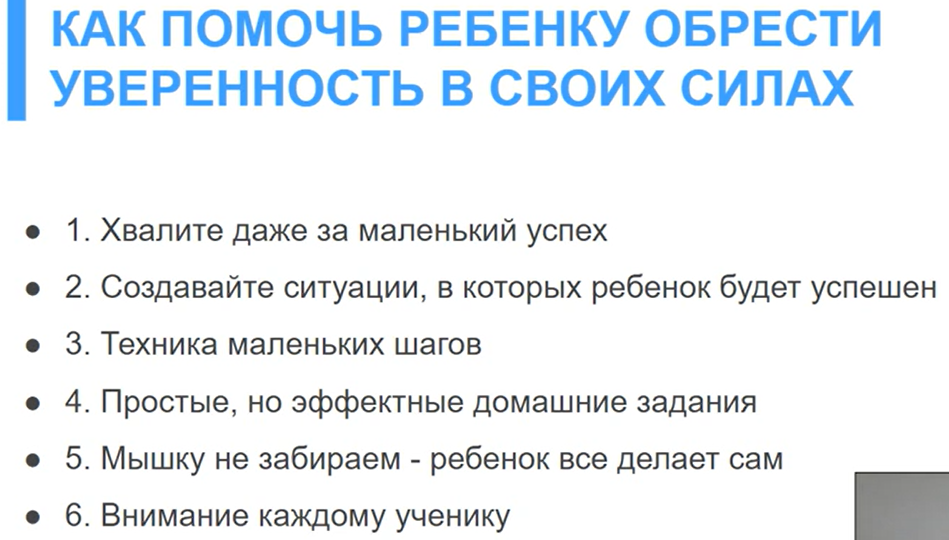   

2. Сильные. Они уже все знают

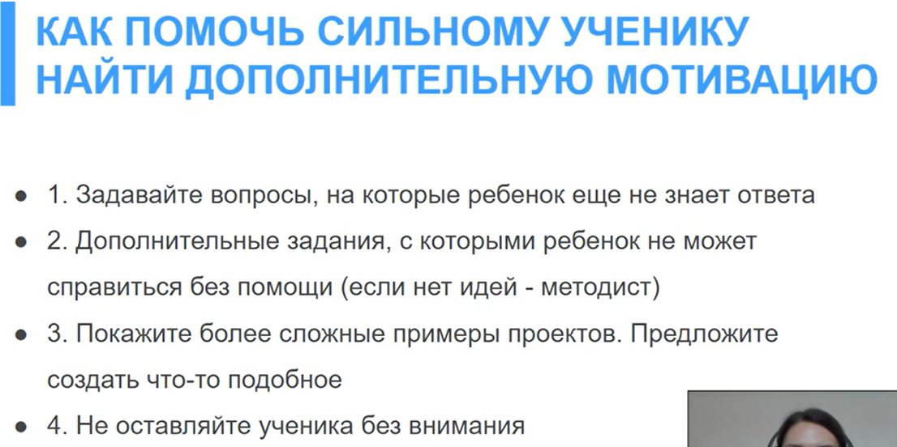

Крч, делать так, чтоб они нуждались в тебе, накидывая им задания и вопросы с которыми они не справляются

3. Тем, кому похуй

Если 1 и 2 не уделять внимание, то они перемещаются в эту категорию.

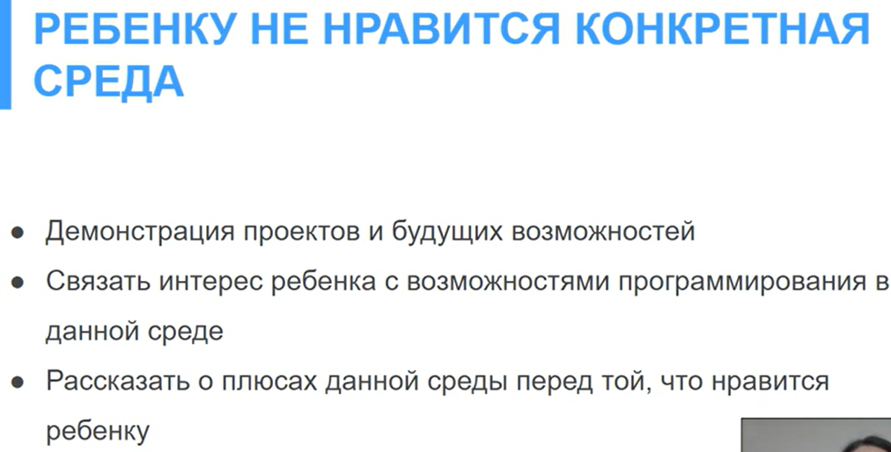

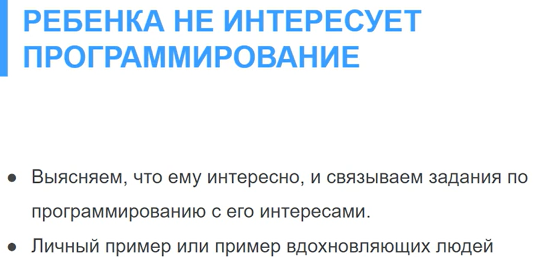

Пример: тебе нравится баскетбол? Давай добавим в Sratch баскетбольный мяч

Внешняя мотивация

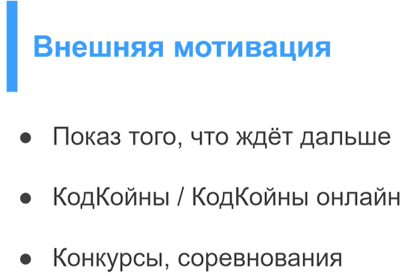

Я так понимаю: внутренняя - в рамках урока. Внешняя - после урока

КОД КОИНЫ МОЖНО ОБМЕНЯТЬ ТОЛЬКО В КОНЦЕ КУРСА

Код коины. Как заработать и на что потратить:

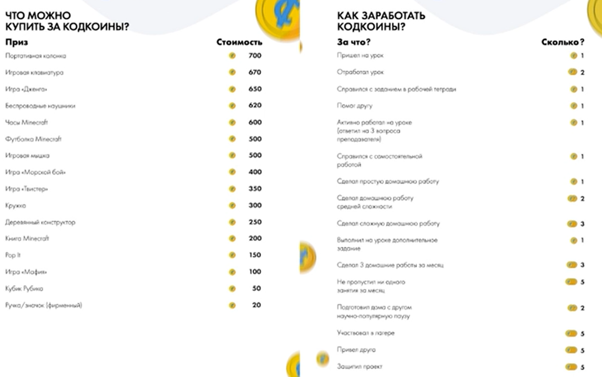

КодКоины обнуляются каждый курс. Можно конфисковать КодКоины, а потом вернуть

Чему мы научимся:

Я так понял перед курсом есть мотивация на курс:

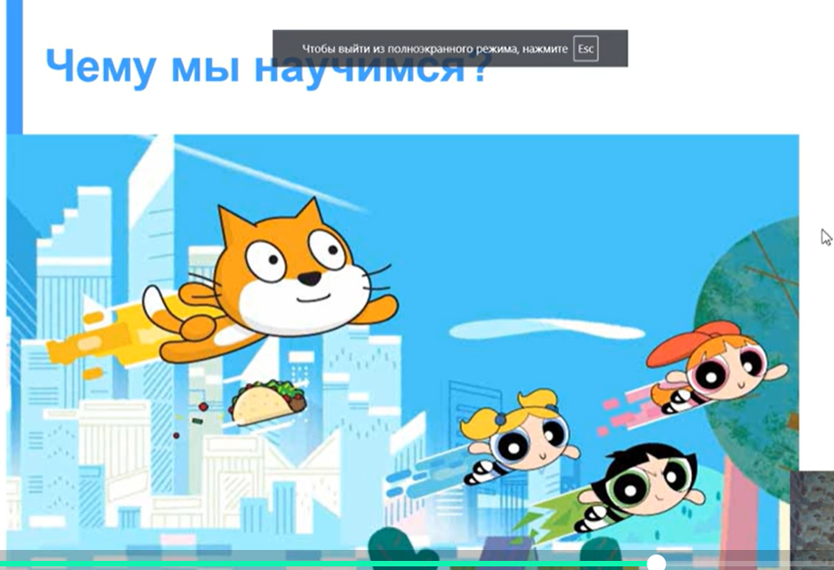

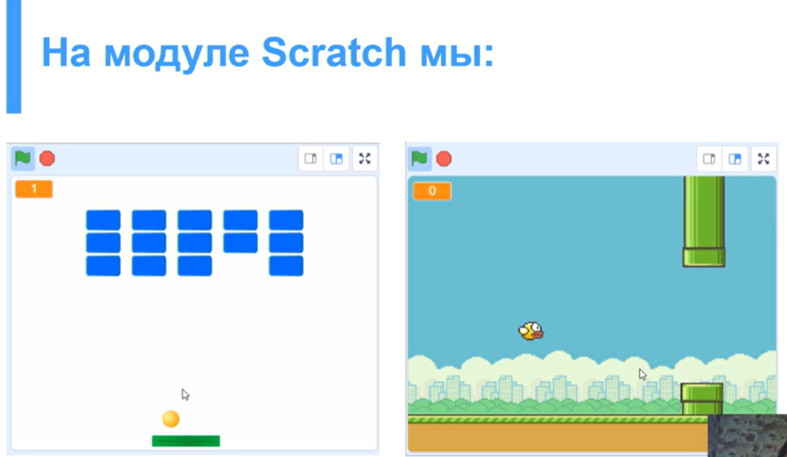

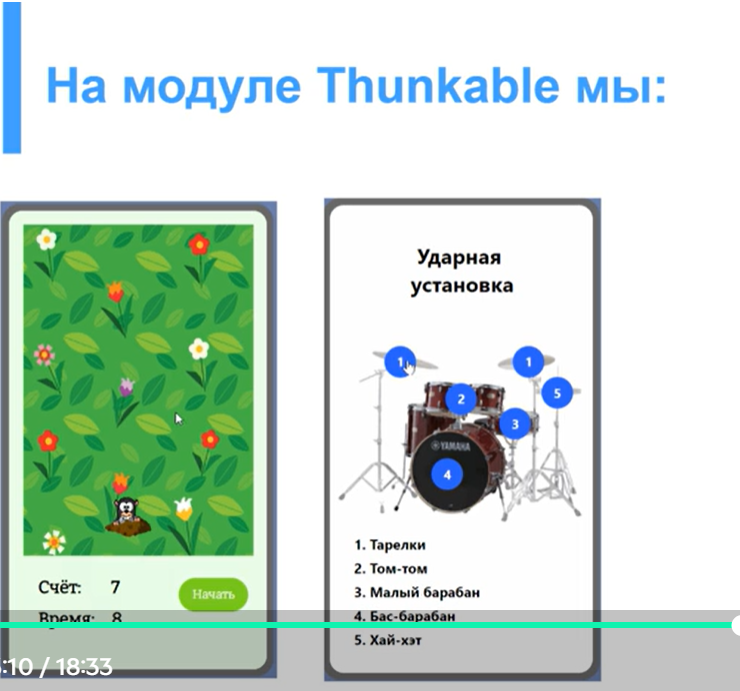

А еще есть мотивация на занятие:

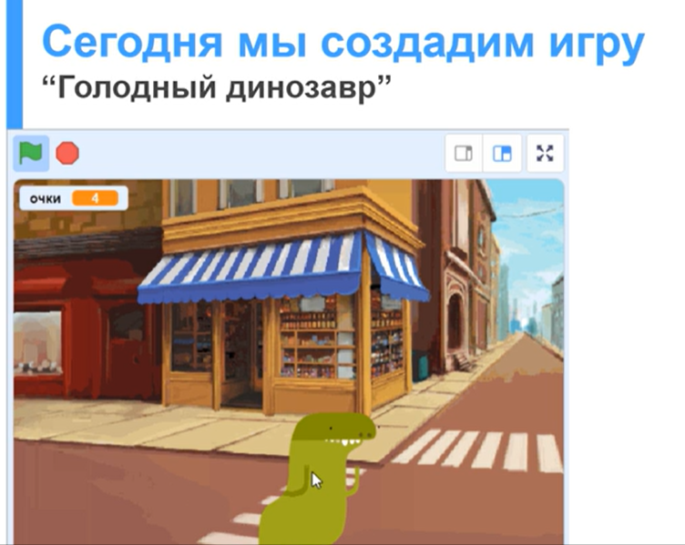

Еще есть на след занятие

Еще есть какая-то мотивация на 4,8,12 занятиях.

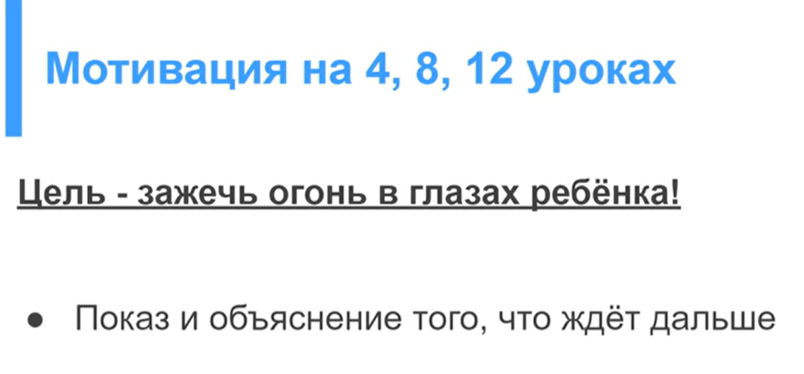

Критерии успеха:

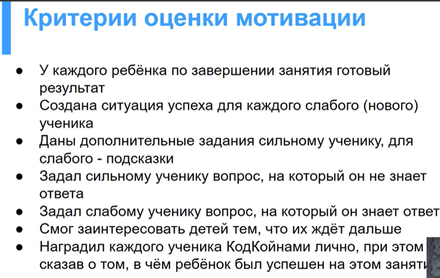