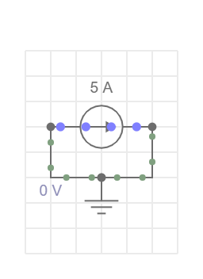
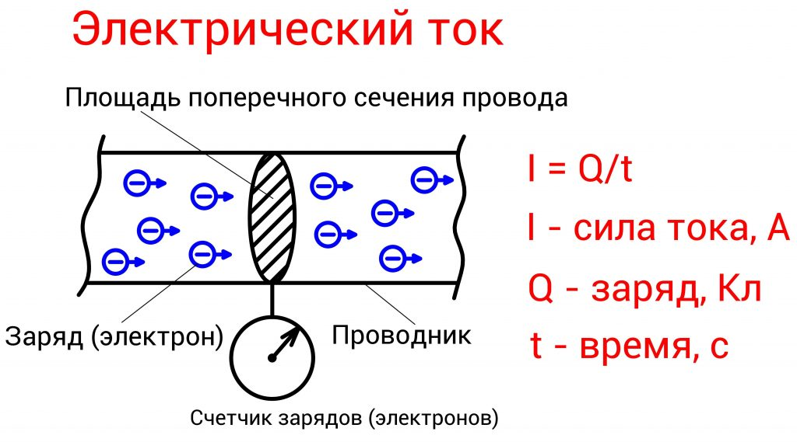

**Что такое ток?**

Ток — это поток электрического заряда. Проще говоря, это движение крошечных частиц — электронов — по проводу. Ток измеряется в амперах (сокращённо А). Если говорят, что ток равен 5 ампер, это значит, что через провод за одну секунду проходит 5 кулонов заряда (кулон — это единица измерения заряда).

У тока всегда есть направление — то есть он течёт от одной точки к другой.

**Важный момент: условное направление тока**

В физике договорились считать, что ток течёт туда, куда двигались бы положительные заряды — от плюса к минусу. Но на самом деле в проводах движутся электроны, а у них заряд отрицательный, поэтому они движутся в противоположную сторону — от минуса к плюсу.

**Как это показано в EveryCircuit**

В приложении EveryCircuit зелёные движущиеся точки — это положительные заряды (условный ток). Они движутся от плюса к минусу. А реальные электроны в это время движутся наоборот — от минуса к плюсу. Чем быстрее движутся точки и чем они ярче, тем больше ток.

**Как увидеть ток на графике**

Если вы хотите посмотреть, как меняется ток через какой-нибудь элемент (например, резистор или лампочку), сделайте так:

1. Выберите этот элемент в схеме.
2. Нажмите кнопку с изображением глаза.
3. На экране осциллографа появится график тока через этот элемент.

---

Если нужно, могу объяснить ещё проще или привести пример.