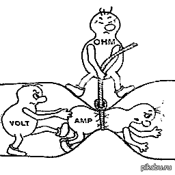

**Энергия электронов и напряжение**

У электронов есть особый вид энергии — электрическая потенциальная энергия. Можно представить, что это как высота, на которой находится шарик: чем выше, тем больше энергии.

В схемах есть особая точка — **земля** (ground). Считается, что в этой точке энергия электрона равна нулю. Это как уровень пола в доме: от него мы измеряем высоту всего остального.

Когда электрон движется между разными точками схемы, его энергия меняется. **Напряжение (разность потенциалов)** между двумя точками показывает, сколько энергии получает или теряет заряд в один кулон, когда проходит от одной точки к другой. Измеряется напряжение в вольтах (В).

**Простая аналогия:**  
Представьте водопад. Разница в высоте между верхом и низом — это напряжение. Чем больше перепад высоты, тем сильнее поток воды (тем больше энергии у электронов).

<table><tr><td>

<mark><strong>Понимать напряжение лучше всего через аналогию с гравитацией и водой,</strong></mark> а затем уже переходить к электричеству. Вот пошаговое объяснение от простого к сложному.

### 1. Аналогия с высотой (Гравитация)
<mark><strong>Представьте себе камень на вершине горы и камень у подножия.</strong></mark>
*   У камня наверху есть **потенциальная энергия**. Если его отпустить, он покатится вниз.
*   Разница между высотой, на которой находится камень наверху, и высотой у подножия — это **разность высот**.

В электричестве:
*   **Напряжение (U)** — <mark><strong>это аналог «разности высот» для электрических зарядов.</strong></mark>
*   <mark><strong>Если есть разность потенциалов (напряжение), у зарядов появляется причина двигаться.</strong></mark> Ток течет от точки с высоким потенциалом (условный «плюс») к точке с низким потенциалом (условный «минус»).

### 2. Аналогия с давлением воды (Самая популярная)
Представьте две цистерны с водой, соединенные трубой.
*   В одной цистерне воды много, и она давит сильно (**высокий потенциал**).
*   В другой воды мало, давление слабое (**низкий потенциал**).
*   **Разница давлений** заставляет воду течь по трубе.

В электричестве:
*   **Напряжение** — <mark><strong>это «электрическое давление», которое проталкивает электроны по проводам.
*   Если давления нет (обе цистерны заполнены одинаково) — вода стоит. </strong></mark>Если нет напряжения (потенциалы равны) — тока нет.

### 3. Строгое физическое определение
**Напряжение (U)** — это работа (A), которую нужно совершить, чтобы переместить единичный заряд (q) из одной точки поля в другую.

\[ U = \frac{A}{q} \]

*   Единица измерения — **Вольт (В)**.
*   **1 Вольт** означает, что для перемещения заряда в 1 Кулон была затрачена работа в 1 Джоуль.

**Простыми словами:** <mark><strong>Напряжение показывает, *насколько сильно* электрическое поле «хочет» перетащить заряд из точки А в точку Б.</strong></mark>

### 4. Ключевые понятия для понимания

**Потенциал — это точка, Напряжение — это разница.**
Нельзя спросить: «Какое напряжение в этой точке?» (строго говоря, это вопрос про потенциал). Напряжение всегда измеряется **между двумя точками**.
*   На батарейке пишут 1.5V. Это значит, что разность потенциалов между клеммой «+» и клеммой «-» равна 1.5 Вольта.

**Напряжение есть, а тока может не быть.**
Если вы воткнули вилку в розетку, но не включили прибор:
*   В розетке **есть напряжение** (220 Вольт).
*   Ток **не течет** (цепь разомкнута, электроны упираются в воздух).
*   Это как закрытый кран: давление в трубе есть, а вода не льется.

### 5. Резюме
1.  **Напряжение** — это причина.
2.  **Ток** — это следствие.
3.  **Сопротивление** — это то, что ограничивает следствие (Закон Ома: \( I = U/R \)).

Если вы видите надпись «Высокое напряжение», знайте: это место, где заряды готовы сорваться с места с огромной силой (как вода под гигантским давлением), и лучше не становиться у них на пути.

</td></tr></table>

---

**Роль земли в EveryCircuit**

В приложении EveryCircuit все напряжения измеряются относительно земли. Поэтому земля — это точка отсчёта, «ноль» для всех остальных точек схемы.

Важная особенность: если от земли до какой-то части схемы нет пути (то есть электроны физически не могут туда добраться), то эта часть схемы считается неактивной и исключается из симуляции. А если в схеме вообще нет символа земли, то вся схема будет неактивной.

---

**Источник напряжения**

Источник напряжения — <mark><strong>это устройство, которое поддерживает постоянное напряжение между своими выводами, независимо от того, какой ток через него течёт.</strong></mark> Обозначается буквой V и измеряется в вольтах.

<mark><strong>Если заряд в один кулон проходит через источник напряжения в 5 вольт (от минуса к плюсу), он получает 5 джоулей энергии.</strong></mark> Это как насос, который поднимает воду наверх: источник «поднимает» заряды от земли до более высокого напряжения, снабжая схему энергией.

<strong>Что такое напряжение и ток</strong>
<table><tr><td>

Конечно. Кратко:

1. **Давление (Потенциал)** — это свойство места в пространстве. Где много зарядов — «высокое давление». Где мало — «низкое».
2. **Разница давлений (Напряжение)** — это то, что заставляет воздух (заряды) двигаться.
3. **Флюгер (Сопротивление/Нагрузка)** — это преграда. Чтобы пройти сквозь нее, частицы тратят энергию, совершая работу (крутят флюгер, греют спираль).
4. **Ветер (Ток)** — это сам поток частиц, бегущих от высокого давления к низкому.

**Итог:** Напряжение — причина, ток — движение, а флюгер — работа, ради которой всё затевалось.

</td></tr></table>

---

**Как управлять параметрами в EveryCircuit**

В EveryCircuit можно менять параметры схемы прямо во время симуляции с помощью специальной ручки (knob). Вы можете, например, покрутить ручку и изменить напряжение источника, наблюдая, как это влияет на всю схему.

Чтобы открыть ручку:
1. Выберите источник напряжения.
2. Нажмите кнопку с изображением ручки (knob).
3. Крутите ручку и смотрите, как меняются напряжения в узлах схемы.

Это отличный способ «почувствовать» схему и понять, как она работает.

---

**Как увидеть напряжение узла на графике**

Если хотите построить график напряжения в какой-либо точке схемы:
1. Выберите нужный узел (точку соединения).
2. Нажмите кнопку с изображением глаза.
3. На экране осциллографа появится график напряжения в этой точке.

---

Если нужно, могу дополнительно пояснить любой из терминов или привести ещё примеры.