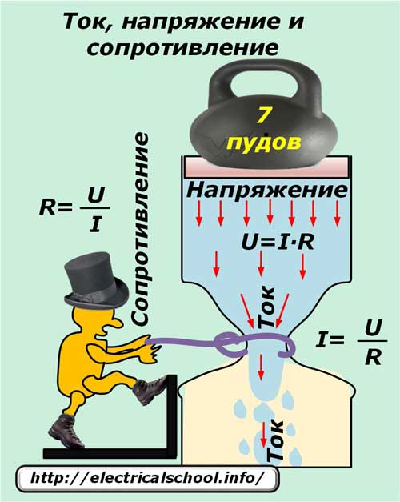

|   |   |
|---|---|
|   |   |

Вот упрощённый перевод с пояснениями для новичка:

---

**Что такое сопротивление?**

Сопротивление — это свойство материала препятствовать прохождению тока. Проще говоря, это то, насколько сильно проводник «сопротивляется» движению электронов. Измеряется сопротивление в омах (Ом).

Если вернутся к ветру, то сопротивление - массивность лопастей флюгера.

**Резистор** — это электронный компонент, у которого сопротивление точно задано. Он как узкая труба для воды: чем уже труба (чем больше сопротивление), тем труднее воде (току) через неё протекать.

---

**Закон Ома**

Резистор поддерживает постоянное соотношение между напряжением на нём (V) и током через него (I). Это соотношение описывается законом Ома:

**I = V / R**

Где:
- **I** — ток через резистор (в амперах),
- **V** — напряжение на резисторе (в вольтах),
- **R** — сопротивление резистора (в омах).

**Что это значит простыми словами?**
- Если увеличить напряжение — ток вырастет.
- Если увеличить сопротивление — ток уменьшится.

**Пример:**  
Если у вас резистор на 2 Ом и вы подали на него 10 вольт, то ток будет:
I = 10 / 2 = 5 ампер.

---

**Куда девается энергия?**

<mark><strong>Когда электроны проходят через резистор, они теряют энергию.</strong></mark> Эта потерянная энергия превращается в тепло. Именно поэтому резисторы нагреваются при работе — как лампочка накаливания или спираль в тостере.

---

**Как поэкспериментировать с резистором в EveryCircuit**

В схеме есть переключатель. С его помощью можно выбрать, что именно подавать на резистор:
- **напряжение** (Voltage) — вы задаёте вольты, и смотрите, какой ток получился;
- **ток** (Current) — вы задаёте амперы, и смотрите, какое напряжение возникло на резисторе.

Можно крутить ручки, менять сопротивление резистора и наблюдать, как меняется другая величина. Это поможет «почувствовать» закон Ома на практике.

