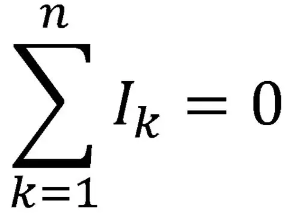
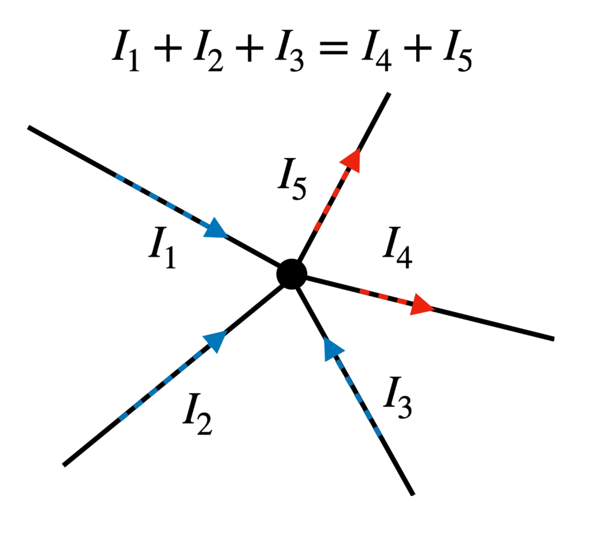

**Первый закон Кирхгофа (закон токов)**

Первый закон Кирхгофа гласит: **сколько тока приходит в узел, столько и уходит из него**.

Если в точке соединяются несколько проводов, то сумма всех втекающих токов равна сумме всех вытекающих. Это логично: заряд не может просто исчезнуть или появиться из ниоткуда.

**Пример:**  
В верхний узел схемы втекает 3 ампера. Из него выходят два провода: по одному уходит 2 ампера, по другому — 1 ампер.  
Проверяем: 3 A = 2 A + 1 A. Всё сходится.

---

**Делитель тока**

Самый простой делитель тока — это два резистора, соединённых параллельно (то есть оба подключены к одной и той же паре точек).

**Важно:** на обоих резисторах одинаковое напряжение, потому что они подключены к одним и тем же узлам.

Ток делится между резисторами так:
- через **больший** резистор идёт **меньший** ток (он сильнее «сопротивляется»),
- через **меньший** резистор идёт **больший** ток (ему «легче» пропускать электроны).

Это как две трубы разной ширины: через широкую трубу воды пройдёт больше, через узкую — меньше.

---

**Как поэкспериментировать в EveryCircuit**

1. **Меняйте сопротивления.** Крутите ручки и смотрите, как перераспределяются токи между резисторами.
2. **Добавьте ещё резисторы.** Нажмите кнопку с логотипом (главное меню), затем выберите резистор. Перетащите его в нужное место на схеме.
3. **Соедините узлы.** Чтобы соединить два узла проводом, сначала выберите один узел, затем — другой.

Как расчитать?

Этот способ работает для любого количества резисторов, соединённых параллельно.

* **Шаг 1.** Найдите общее сопротивление цепи $R_{\text{общ}}$.
* **Шаг 2.** Зная общий ток, найдите напряжение на этом участке (по Закону Ома):
$$U = I_{\text{общ}} \cdot R_{\text{общ}}$$
* **Шаг 3.** Так как в параллели напряжение на всех ветвях одинаковое, ток в нужной ветви считается просто:
$$I_1 = \frac{U}{R_1}$$

*Почему это работает:* Мы помним, что в параллельном соединении у всех резисторов общие узлы, значит, и напряжение у них одинаковое.

---

**Краткий итог:**
- В узле ток не теряется: сколько пришло, столько и ушло.
- В параллельном соединении напряжение на всех резисторах одинаковое.
- Ток распределяется обратно пропорционально сопротивлению: больше сопротивление — меньше ток.

Если нужно, могу объяснить, как посчитать общий ток или сопротивление при параллельном соединении.