# Электротехника: основы электростатики

## Введение

**Электротехника** — это <mark><strong>наука о процессах, связанных с практическим применением электрических и магнитных явлений</strong></mark>, а также отрасль техники, которая применяет их в промышленности, медицине, военном деле и других сферах.

Большое значение электротехники во всех областях деятельности человека объясняется <mark><strong>преимуществами электрической энергии перед другими видами энергии:</strong></mark>

- **Лёгкость преобразования.** Электрическую энергию легко преобразовать в другие виды энергии (механическую, тепловую, световую, химическую и др.), и наоборот — любые другие виды энергии легко преобразуются в электрическую.
- **Передача на большие расстояния.** Электрическую энергию можно передавать практически на любые расстояния. Это позволяет строить электростанции в местах с природными энергетическими ресурсами и передавать энергию туда, где расположены источники промышленного сырья, но нет местной энергетической базы.
- **Удобное дробление мощности.** Электрическую энергию удобно делить на любые части в электрических цепях: мощность приёмников электроэнергии может составлять от долей ватта до тысяч киловатт.
- **Автоматизация.** Процессы получения, передачи и потребления электроэнергии легко поддаются автоматизации.
- **Простота управления.** Процессы с использованием электрической энергии допускают простое управление (нажатие кнопки, выключателя и т. д.).

Особо следует отметить удобство применения электрической энергии при автоматизации производственных процессов — благодаря точности и чувствительности электрических методов контроля и управления. Использование электрической энергии позволило повысить производительность труда во всех областях деятельности человека, автоматизировать почти все технологические процессы в промышленности, на транспорте, в сельском хозяйстве и в быту, а также создать комфорт в производственных и жилых помещениях.

Кроме того, электрическую энергию широко используют в технологических установках для:

- нагрева изделий;
- плавления металлов;
- сварки;
- электролиза;
- получения плазмы;
- получения новых материалов с помощью электрохимии;
- очистки материалов и газов.

В настоящее время электрическая энергия является практически единственным видом энергии для искусственного освещения. Можно сказать, что без электрической энергии невозможна нормальная жизнь современного общества.

**Единственный недостаток** электрической энергии —<mark><strong> невозможность запасать её в больших количествах и сохранять эти запасы в течение длительного времени.</strong></mark> Запасы электрической энергии в аккумуляторах, гальванических элементах и конденсаторах достаточны лишь для работы сравнительно маломощных устройств, причём сроки её сохранения ограничены. Поэтому электрическая энергия должна быть произведена тогда, когда её требует потребитель, и в том количестве, в котором она ему необходима.

Непрерывное расширение области применения электрической энергии влечёт за собой глубокое внедрение электротехники во все отрасли промышленности, сельского хозяйства и быта, а это требует дальнейшего роста электровооружённости труда, широкой автоматизации производственных процессов и использования автоматизированных систем управления.

Эти обстоятельства требуют обеспечения такой профессиональной подготовки специалистов, при которой они будут располагать системой знаний, умений и навыков в актуальных для них областях электротехники.

---

# Глава 1. Основы электростатики

## 1.1. Строение вещества

Все вещества — как простые, так и сложные — состоят из молекул, а молекулы — из атомов.

> **Молекула** — наименьшая частица вещества, которая ещё сохраняет его свойства; химическая комбинация двух или более атомов.  
> **Атом** — наименьшая частица элемента, которая сохраняет химические характеристики элемента.  
> **Химический элемент** — составная часть вещества, построенная из одинаковых атомов.

Простые вещества (медь, алюминий, цинк, свинец и др.) состоят из одинаковых атомов данного вещества. Молекулы сложных веществ могут состоять из нескольких атомов различных химических элементов. Например, поваренная соль (хлористый натрий) состоит из атомов хлора и натрия, а молекулы воды содержат атомы водорода и кислорода.

> **Смесь** — физическая комбинация элементов и соединений. Примерами смесей являются воздух (состоит из кислорода, азота, углекислого газа и других газов) и солёная вода (состоит из соли и воды).

### Строение атома

Атом состоит из протонов, нейтронов и электронов. Протоны и нейтроны сгруппированы в центре атома и образуют **ядро**. Протоны заряжены положительно, нейтроны не имеют электрического заряда. Электроны расположены на оболочках на различных расстояниях от ядра.

Атомы различных элементов отличаются друг от друга. Поскольку существует свыше 100 различных элементов, существует и свыше 100 различных атомов.

> **Атомный номер элемента** — количество протонов в ядре атома; соответствует номеру элемента в периодической таблице Д. И. Менделеева. Атомные номера позволяют отличить один элемент от другого.

Каждый элемент имеет также **атомную массу**, которая определяется общим числом протонов и нейтронов в ядре. Электроны почти не дают вклада в общую массу атома: масса электрона составляет только $1/1836$ часть от массы протона, и этого недостаточно, чтобы её учитывать.

Электроны вращаются вокруг ядра по замкнутым орбитам. Каждая орбита называется **оболочкой**. Оболочки обозначаются буквами $K$, $L$, $M$, $N$ и т. д. Оболочки заполняются постепенно, по мере увеличения атомного номера элемента, в следующей последовательности: сначала заполняется оболочка $K$, затем $L$, $M$, $N$ и т. д. В некоторых случаях этот порядок нарушается: например, оболочка $N$ начинает заполняться при не полностью заполненной оболочке $M$.

Максимальное количество электронов, которое может разместиться на каждой оболочке, показано в табл. 1.1.

**Таблица 1.1**

| Обозначение оболочки | Общее количество электронов |
|----------------------|-----------------------------|
| $K$ | 2 |
| $L$ | 8 |
| $M$ | 18 |
| $N$ | 32 |
| $O$ | 50 |
| $P$ | 72 |
| $Q$ | 98 |

В качестве примера рассмотрим строение атома алюминия, имеющего № 13 в таблице Менделеева и атомную массу 27 (рис. 1.1).

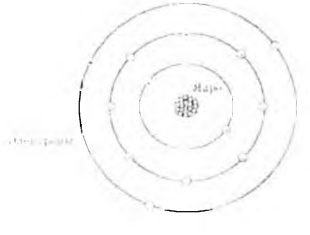

Рис. 1.1 — Строение атома алюминия

Ядро атома алюминия содержит 13 протонов и 14 нейтронов ($13 + 14 = 27$). Тринадцать электронов атома алюминия размещены на трёх электронных оболочках:

- на оболочке $K$ — 2 электрона;
- на оболочке $L$ — 8 электронов;
- на наиболее удалённой от ядра внешней оболочке $M$ — 3 электрона.

> **Валентная оболочка** — внешняя оболочка атома.  
> **Валентность** — количество электронов, которое содержит валентная оболочка.

Чем дальше от ядра валентная оболочка, тем меньшее притяжение со стороны ядра испытывает каждый валентный электрон. Таким образом, потенциальная возможность атома присоединять или терять электроны увеличивается, если валентная оболочка не заполнена и расположена достаточно далеко от ядра.

Электроны валентной оболочки могут получать энергию. Если эти электроны получат достаточно энергии от внешних сил, они могут покинуть атом и стать **свободными электронами**, произвольно перемещаясь от атома к атому.

### Проводники, диэлектрики и полупроводники

> **Проводники** — <mark><strong>материалы, которые содержат большое количество свободных носителей заряда.</strong></mark>

Проводниками являются все металлы, растворы электролитов, расплавы многих веществ и ионизированные газы. <mark><strong>Самой высокой проводимостью среди металлов обладает серебро</strong></mark>; далее в порядке убывания проводимости идут:
2. медь, 
3. золото и 
4. алюминий.

Серебро, медь и золото имеют валентность, равную единице. Однако серебро является лучшим проводником, поскольку его свободные электроны более слабо связаны.

> **Диэлектрики (изоляторы)** — <mark><strong>материалы, которые препятствуют протеканию электричества.</strong></mark>

<mark><strong>В диэлектриках свободные электроны отсутствуют</strong></mark> благодаря тому, что валентные электроны одних атомов присоединяются к другим атомам, заполняя их валентные оболочки и препятствуя образованию свободных электронов. <mark><strong>Диэлектриками являются различные пластмассы, слюда, фарфор, стекло, мрамор, резина, различные смолы, лаки и другие материалы.</strong></mark>

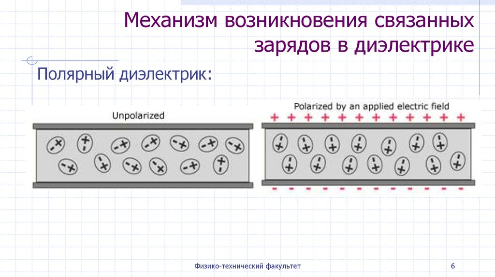

> **Полупроводники** — <mark><strong>материалы, занимающие промежуточное положение между проводниками и изоляторами; их проводимость можно изменять от проводника до изолятора.</strong></mark>

Кремний и германий являются полупроводниковыми материалами.

### Ионизация

Об атоме, который имеет одинаковое число электронов и протонов, говорят, что он<mark><strong> **электрически нейтрален**.</strong></mark>

> **Отрицательный ион** — атом, получивший один или более электронов; становится отрицательно заряженным.  
> **Положительный ион** — атом, потерявший один или более электронов; становится положительно заряженным.  
> **Ионизация** — <mark><strong>процесс присоединения или потери электронов. Ионизация играет большую роль в протекании электрического тока.</strong></mark>

---

## 1.2. Электрические заряды. Закон Кулона. Электрическое поле. Принцип суперпозиции

Ещё в глубокой древности было известно, что янтарь, потёртый о шерсть, приобретает способность притягивать лёгкие предметы. Позже было установлено, что аналогичным свойством обладают многие другие вещества. Тела, способные после натирания притягивать лёгкие предметы, называют **наэлектризованными**. На телах в таком состоянии имеются электрические заряды, а сами тела называют **заряженными**.

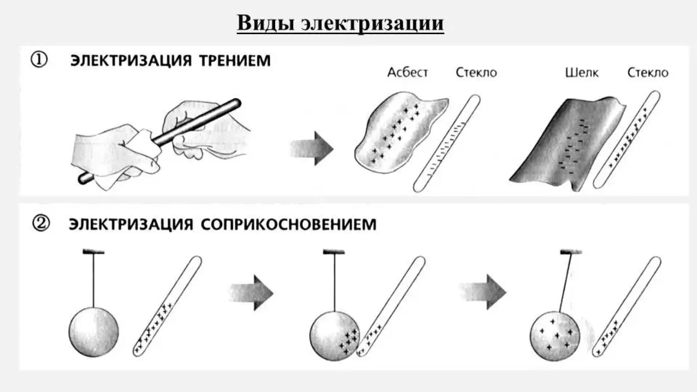

В природе существуют только два вида зарядов — **положительные** и **отрицательные**:

- заряды одного знака (одноимённые заряды) **отталкиваются**;
- заряды разных знаков (разноимённые заряды) **притягиваются**.

Наименьшим (элементарным) зарядом обладают элементарные частицы. Например, протон и позитрон заряжены положительно, электрон и антипротон — отрицательно. Элементарный отрицательный заряд по величине равен элементарному положительному заряду.

<mark><strong>В системе СИ заряд измеряется в кулонах</strong></mark> (Кл). Величина элементарного заряда:

$$e = 1{,}6 \cdot 10^{-19} \text{ Кл}$$

### Закон сохранения электрического заряда

В природе нигде и никогда не возникает и не исчезает электрический заряд одного знака. <mark><strong>Появление положительного электрического заряда $+q$ всегда сопровождается появлением равного по абсолютной величине отрицательного электрического заряда $-q$.</strong></mark> Ни положительный, ни отрицательный заряды не могут исчезнуть по отдельности один от другого; они могут лишь взаимно нейтрализовать друг друга, если равны по абсолютной величине.

> **Закон сохранения электрического заряда:** <mark><strong>в электрически изолированной системе алгебраическая сумма зарядов остаётся постоянной:</strong></mark>
>
> $$q_1 + q_2 + \dots + q_n = \text{const} \tag{1.1}$$

**Изолированной** называется система, не обменивающаяся зарядами с внешней средой.

### Закон Кулона

В 1785 г. Шарль Кулон (1736–1806) экспериментально, с помощью крутильных весов, установил закон взаимодействия двух точечных зарядов, т. е. таких заряженных тел, размерами которых в данной задаче можно пренебречь.

> **Закон Кулона:** <mark><strong>сила взаимодействия двух точечных зарядов прямо пропорциональна произведению этих зарядов, обратно пропорциональна квадрату расстояния между ними и направлена по линии, соединяющей эти заряды.</strong></mark>

Для вакуума этот закон имеет вид:

$$F = \frac{1}{4\pi\varepsilon_0} \cdot \frac{q_1 q_2}{r^2} \tag{1.2}$$

где $\varepsilon_0 = 8{,}85 \cdot 10^{-12} \text{ Кл}^2/(\text{Н} \cdot \text{м}^2) = 8{,}85 \cdot 10^{-12} \text{ Ф/м}$ — электрическая постоянная.

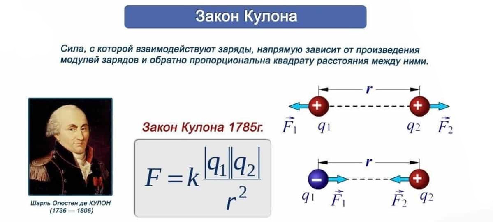

В диэлектрике сила взаимодействия двух точечных зарядов:

$$F = \frac{1}{4\pi\varepsilon_0 \varepsilon} \cdot \frac{q_1 q_2}{r^2} \tag{1.3}$$

где $\varepsilon = F_0 / F > 1$ — **диэлектрическая проницаемость диэлектрика**. Она показывает, во сколько раз сила кулоновского взаимодействия зарядов в диэлектрике меньше, чем в вакууме.

### Электрическое поле

Взаимодействие между зарядами на расстоянии осуществляется через электрическое поле.

> **Электрическое поле** — <mark><strong>одна из форм материи; оно обладает свойством действовать на внесённые в него заряды с некоторой силой.</strong></mark> Электрическое поле является составной частью электромагнитного поля.  
> **Электростатическое поле** — <mark><strong>поле, окружающее неподвижные заряды.</strong></mark>

Представление об электрическом поле было введено в науку в 30-х гг. XIX в. Майклом Фарадеем (1791–1867). Согласно Фарадею, <mark><strong>каждый электрический заряд окружён созданным им электрическим полем.</strong></mark>

|  | 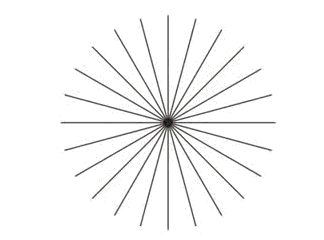 |
|---------------------------------------------------------------------------------------------------------------------------------------------|-------------------------------------------------------------------|

|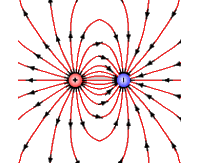   | 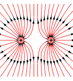  |
|---|---|

> **Пробный заряд** — заряд, с помощью которого исследуют электрическое поле.

Пусть заряд $q$ создаёт электрическое поле. Будем помещать в точку $M$ электрического поля различные пробные заряды $q_{\text{пр}}$ (рис. 1.2).

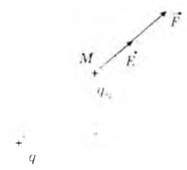

Рис. 1.2 — Пробные заряды в электрическом поле

На каждый из них электрическое поле действует с различными силами. Но если величину каждой силы разделить на соответствующий ей пробный заряд, то получим одно и то же значение, характерное для данной точки поля. Таким образом,<mark><strong> величина, равная силе, действующей на единичный пробный заряд в точке $M$, может служить силовой характеристикой электрического поля. Она называется **напряжённостью электрического поля**:</strong></mark>

$$\vec{E} = \frac{\vec{F}}{q_{\text{пр}}} \tag{1.4}$$

> **Напряжённость электрического поля** — векторная величина; направление вектора $\vec{E}$ совпадает с направлением вектора силы $\vec{F}$, действующей на положительный пробный заряд, помещённый в данную точку поля.

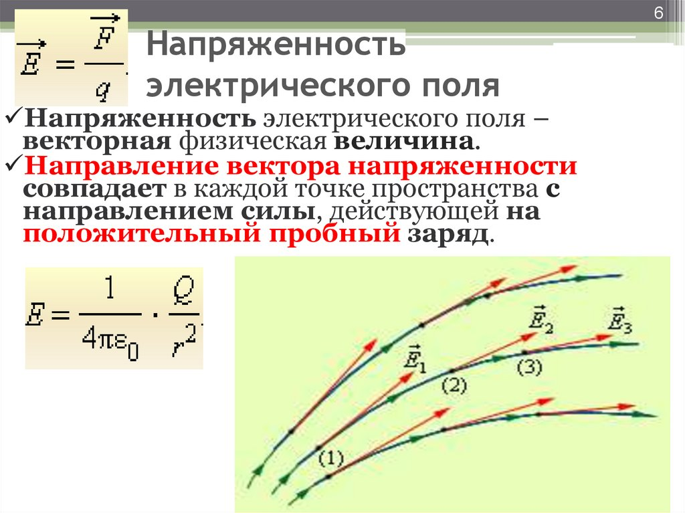

<mark><strong>Напряжённость</strong></mark> не зависит от наличия или отсутствия в данном поле пробных зарядов. 
Она <mark><strong>зависит от:</strong></mark>
1. свойств самого поля, которые определяются зарядом-источником, 
2. расстоянием от него до точки поля, в которой измеряется напряжённость, и 
3. средой, в которой создано поле.

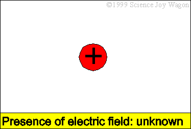

| Потыкать |
|----------|
| https://phet.colorado.edu/sims/html/charges-and-fields/latest/charges-and-fields_all.html         |

<table><tr><td>

напряженность - силовая характеристика поля, не зависящая от велиличны заряда?

Величина $\vec{E}$ определяется только **источниками поля** (зарядами, создавшими это поле) и **геометрией** (расстоянием до них), но никак не зависит от того, каким зарядом мы это поле измеряем.

</td></tr></table>

В системе СИ <mark><strong>напряжённость электрического поля измеряется в вольтах на метр</strong></mark> (В/м).

Пусть имеется положительный точечный заряд — источник поля $Q$. Поместим в некоторую точку поля $M$ этого заряда положительный пробный заряд $q_{\text{пр}}$. На этот заряд будет действовать сила:

$$F = \frac{1}{4\pi\varepsilon_0} \cdot \frac{Q q_{\text{пр}}}{r^2} \tag{1.5}$$

Тогда напряжённость поля, создаваемого точечным зарядом $Q$ в точке $M$:

$$E = \frac{F}{q_{\text{пр}}} = \frac{1}{4\pi\varepsilon_0} \cdot \frac{Q}{r^2} \tag{1.6}$$

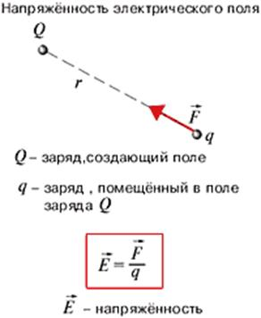

Если заряд $Q$ окружает среда с диэлектрической проницаемостью $\varepsilon$, то напряжённость создаваемого им поля:

$$E = \frac{1}{4\pi\varepsilon_0 \varepsilon} \cdot \frac{Q}{r^2} \tag{1.7}$$

### Графическое изображение электрического поля

Графически электрическое поле изображают **силовыми линиями**. Силовые линии начинаются на положительных зарядах и заканчиваются на отрицательных или уходят в бесконечность.

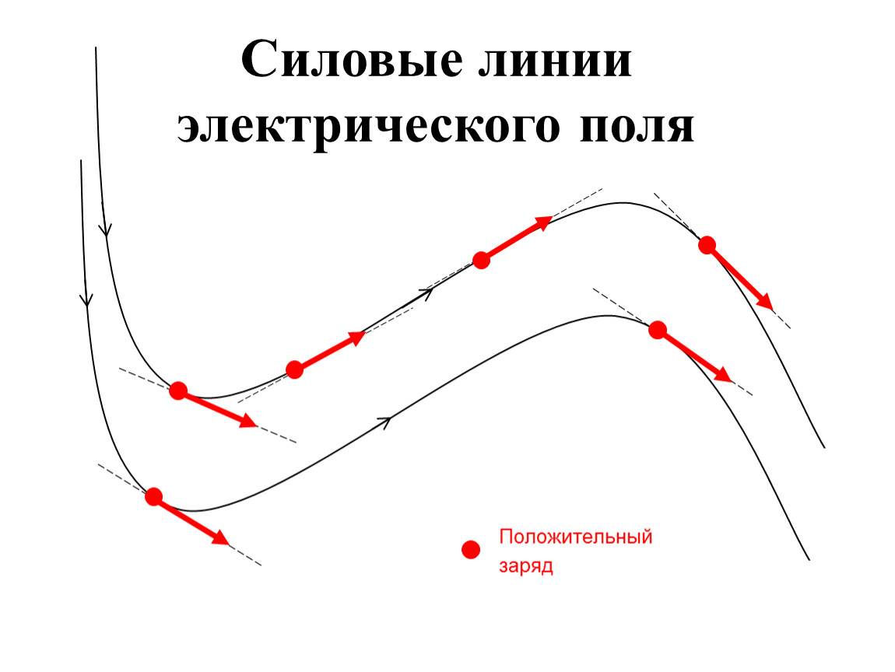

На рис. 1.3 изображены линии напряжённости полей положительного заряда (а), отрицательного заряда (б) и системы из положительного и отрицательного зарядов (в).

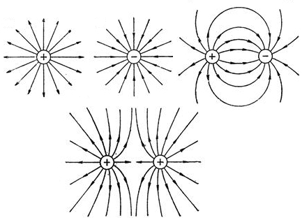

Рис. 1.3 — Силовые линии электрических полей

О величине напряжённости поля судят по густоте линий: <mark><strong>чем гуще расположены линии, тем больше величина напряжённости. Густота линий — это число линий, пронизывающих единичную площадку, перпендикулярную линиям.</strong></mark> Вектор напряжённости поля является касательным к силовым линиям в каждой точке поля.

> **Однородное электрическое поле** — поле, напряжённость которого в каждой точке одинакова по величине и направлению. Силовыми линиями однородного поля являются параллельные прямые, расположенные на одинаковом расстоянии друг от друга.

Из рис. 1.3 видно, что электрическое поле точечного заряда является **неоднородным**.

|   | 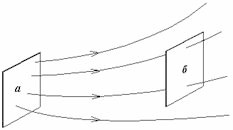  |
|---|---|

<table><tr><td>

Поток вектора напряженности — это число линий напряженности, пронизывающих данную поверхность.

Для плоской поверхности S в однородном поле:

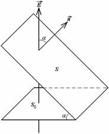

$$\Phi = E \cdot S \cdot \cos\alpha$$

где $(\alpha)$ — угол между вектором $(\vec{E})$ и нормалью $(\vec{n})$ к поверхности.

Поток — скалярная величина:
- если угол острый — поток положительный;
- если угол тупой — поток отрицательный.

Для произвольной поверхности в неоднородном поле поток определяется суммированием по элементарным площадкам:

$$\Phi = \int_S E \cdot dS \cdot \cos\alpha$$

Единица потока напряженности: $(\text{В} \cdot \text{м})$ (вольт-метр).

</td></tr></table>

### Принцип суперпозиции

Опыт показывает, что если на электрический заряд $q$ одновременно действуют электрические поля нескольких зарядов, то результирующая сила оказывается равной геометрической сумме сил, действующих со стороны каждого поля в отдельности.

> **Принцип суперпозиции:** если в данной точке пространства различные заряды создают электрические поля с напряжённостями $\vec{E}_1, \vec{E}_2$ и т. д., то вектор напряжённости электрического поля в этой точке равен сумме векторов напряжённостей всех электрических полей (рис. 1.4):
>
> $$\vec{E} = \vec{E}_1 + \vec{E}_2 + \vec{E}_3 + \dots \tag{1.8}$$

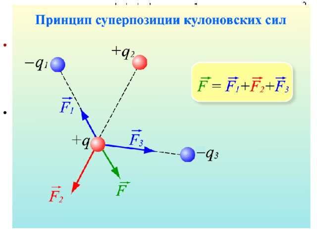

Рис. 1.4 — Принцип суперпозиции электрических полей

---

## 1.3. Проводники и диэлектрики в электрическом поле

По электрическим свойствам тела разделяют на 
1. проводники, 
2. диэлектрики и 
3. полупроводники. 
 
Проводники содержат электрические заряды, которые могут свободно перемещаться внутри этих тел.

### Электростатическая индукция

П<mark><strong>ри внесении металлического проводника в электростатическое поле его свободные электроны перемещаются под действием кулоновских сил в направлении, противоположном направлению вектора напряжённости этого поля</strong></mark>, и скапливаются на поверхности проводника. В результате на поверхностях проводника, перпендикулярных силовым линиям, появятся заряды противоположного знака. Их называют **индуцированными**.

> **Электростатическая индукция** — явление возникновения на поверхностях проводника, внесённого в электрическое поле, поверхностных зарядов противоположных знаков.

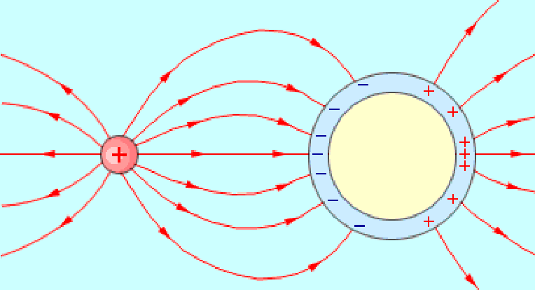

Электрическое поле поверхностных зарядов $\vec{E}'$ будет численно равно внешнему полю $\vec{E}_0$, но направлено противоположно ему. Поэтому результирующее поле внутри проводника будет равно нулю:

$$\vec{E} = \vec{E}_0 - \vec{E}' = 0 \tag{1.9}$$

### Поляризация диэлектриков

<mark><strong>Диэлектриками называют вещества, в которых отсутствуют свободные заряды. Заряды в диэлектриках могут смещаться из своих положений равновесия лишь на малые расстояния, порядка атомных.</strong></mark>

Диэлектрики по типу распределения зарядов разделяются на два типа:

- **Неполярные диэлектрики** — центр распределения положительного заряда в атоме совпадает с центром распределения отрицательного заряда (например, атом водорода).
- **Полярные диэлектрики** — центры распределения положительных и отрицательных зарядов не совпадают (например, хлористый натрий).

Молекулы полярных диэлектриков представляют собой два точечных заряда, равных по величине, противоположных по знаку и расположенных на малом расстоянии друг от друга. Такую систему зарядов называют **электрическим диполем**.

Молекулы полярных диэлектриков, помещённых во внешнее электрическое поле, получают преимущественную ориентацию, располагаясь таким образом, чтобы оси всех диполей оказались параллельными линиям напряжённости внешнего поля. Тепловое движение расстраивает ориентацию диполей, поэтому диполи получают лишь частичную ориентацию, тем большую, чем больше напряжённость внешнего поля (рис. 1.5).

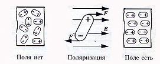

Рис. 1.5 — Ориентация диполей во внешнем электрическом поле: а — без поля; б — при наличии поля

В неполярных молекулах внешнее поле разделяет центры распределения положительных и отрицательных зарядов, образуя диполи, которые, как и в случае полярных молекул, принимают преимущественную ориентацию.

> **Поляризация диэлектрика** — смещение связанных электрических зарядов под действием внешнего электрического поля.

При поляризации на поверхностях диэлектрика, перпендикулярных вектору напряжённости внешнего поля, появляются **связанные заряды** противоположных знаков. Они создают собственное электрическое поле $\vec{E}'$, которое направлено противоположно внешнему полю $\vec{E}_0$. Поэтому поле внутри диэлектрика $\vec{E}$ меньше, чем в вакууме:

$$E = \frac{E_0}{\varepsilon} \tag{1.10}$$

> **Диэлектрическая проницаемость** — величина, показывающая, во сколько раз напряжённость электрического поля в вакууме больше, чем в диэлектрике:
>
> $$\varepsilon = \frac{E_0}{E} \tag{1.11}$$

---

## 1.4. Работа по перемещению заряда в электрическом поле. Потенциал

Рассмотрим однородное электрическое поле, в котором заряд $+q$ перемещается из точки 1 с координатой $x_1$ в точку 2 с координатой $x_2$ под действием кулоновской силы вдоль линии напряжённости (рис. 1.6).

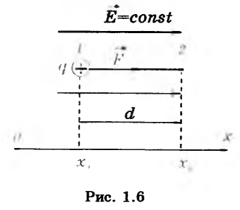

Рис. 1.6 — Перемещение заряда в однородном электрическом поле

Работа этой силы:

$$A_{12} = qE(x_2 - x_1) = qEd \tag{1.12}$$

где $x_2 - x_1 = d$.

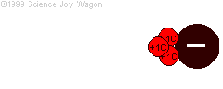

При перемещении заряда между этими же точками по любой криволинейной траектории будет совершена такая же работа. Работа перемещения заряда в электростатическом поле **не зависит от формы траектории** движения заряда, а зависит от положения в этом поле начальной и конечной точек перемещения.

> **Потенциальные поля** — поля, обладающие свойством независимости работы от формы траектории. Электростатические поля являются потенциальными.

Перенесём теперь тот же заряд из точки 2 в точку 1. Так как теперь сила направлена против перемещения, то работа:

$$A_{21} = -qEd \tag{1.13}$$

Суммарная же работа перемещения заряда по замкнутой траектории будет равна нулю:

$$A_{\text{замкн}} = A_{12} + A_{21} = qEd - qEd = 0 \tag{1.14}$$

Согласно закону сохранения энергии, работа перемещения заряда $q$ в электростатическом поле равна изменению его потенциальной энергии, взятому со знаком минус:

$$A = -\Delta W_п = -(W_{п2} - W_{п1}) \tag{1.15}$$

где $W_{п1}$ и $W_{п2}$ — потенциальные энергии заряда $q$ в точках 1 и 2.

С другой стороны, работа:

$$A = Eq(x_2 - x_1) = Eqx_2 - Eqx_1 \tag{1.16}$$

Из (1.15) и (1.16) следует:

$$W_{п1} = qEx_1 \quad \text{и} \quad W_{п2} = qEx_2 \tag{1.17}$$

Таким образом, величина потенциальной энергии заряда в электростатическом поле:

$$W_п = qEx \tag{1.18}$$

### Потенциал

Разные заряды в точке с координатой $x$ обладают разной потенциальной энергией. Однако отношение значения потенциальной энергии к величине соответствующего заряда есть величина постоянная, равная величине потенциальной энергии единичного заряда, находящегося в данной точке поля. Эта величина называется **потенциалом поля** в данной точке:

$$\varphi = \frac{W_п}{q} \tag{1.19}$$

> **Потенциал** — энергетическая характеристика поля; скалярная величина.

Из (1.18) и (1.19) находим:

$$\varphi = \frac{W_п}{q} = \frac{qEx}{q} = Ex \tag{1.20}$$

<mark><strong>Потенциал не зависит от величины заряда $q$, внесённого в данную точку поля, а определяется свойствами самого поля.</strong></mark> Из формулы (1.20) видно, что в однородном поле, в котором напряжённость во всех точках одна и та же, потенциал в каждой точке различный, так как разные точки поля имеют разные координаты. При $x = 0$ и $\varphi = 0$. Следовательно, за точку с нулевым потенциалом можно принять любую точку поля и относительно неё отсчитывать потенциалы других точек.

Рассмотренное однородное электрическое поле может быть создано только в каком-то ограниченном объёме. В реальных случаях абсолютная величина напряжённости электрического поля, создаваемого одиночным зарядом или группой зарядов, убывает по мере удаления от этих зарядов и на бесконечности стремится к нулю. Поэтому при решении задач о потенциалах в неоднородном поле обычно за нулевой принимают потенциал точки, бесконечно удалённой от зарядов, или же потенциал Земли. Потенциал может быть и положительным, и отрицательным. Если поле создано положительным зарядом, то потенциал поля считают положительным.

### Разность потенциалов (напряжение)

Перенесём заряд $q$ из точки поля с потенциалом $\varphi_1$ в точку поля с потенциалом $\varphi_2$. Из формул (1.15) и (1.19) следует:

$$\varphi_1 - \varphi_2 = \frac{A_{12}}{q} \tag{1.21}$$

> **Разность потенциалов (напряжение)** — величина $U = \varphi_1 - \varphi_2$.

Если $\varphi_2 = 0$ (вторая точка удалена в бесконечность), то:

$$\varphi_1 = \frac{A}{q} \tag{1.22}$$

Отсюда следует определение потенциала поля, убывающего в бесконечности:

> **Потенциал** — величина, численно равная работе поля по перемещению единичного заряда из данной точки в бесконечность.

Физический смысл имеет не сам потенциал, а разность потенциалов. Связано это с тем, что потенциал любой точки поля может быть принят за нулевой.

Напряжение и потенциал в системе СИ измеряются в вольтах (В). Если при перемещении заряда величиной в 1 Кл между двумя точками цепи совершается работа в 1 Дж, то напряжение между этими двумя точками равно 1 В.

Для измерения малых напряжений используют:

- милливольты (мВ): $1 \text{ мВ} = 10^{-3} \text{ В}$;
- микровольты (мкВ): $1 \text{ мкВ} = 10^{-6} \text{ В}$.

Для больших напряжений используют киловольты (кВ): $1 \text{ кВ} = 10^3 \text{ В}$.

**Практические значения напряжений:**

| Источник / цепь | Напряжение |
|-----------------|------------|
| Гальванический элемент (батарейка) | 1,5 В |
| Автомобильный аккумулятор | около 12 В |
| Городская осветительная сеть | 220 В |
| Контактный провод — рельс трамвая | 600 В |
| Городские кабельные распределительные цепи | 6 или 11 кВ |
| Длинные линии электропередачи | от 110 до 1000 кВ |

---

## 1.5. Электроёмкость. Конденсаторы. Соединение конденсаторов

В электростатическом поле все точки проводника имеют один и тот же потенциал, который, как показывает опыт, пропорционален заряду проводника, т. е. отношение заряда $q$ к потенциалу $\varphi$ не зависит от заряда $q$. Поэтому оказалось возможным ввести понятие электрической ёмкости (электроёмкости, или просто ёмкости) $C$ уединённого проводника:

$$C = \frac{q}{\varphi} \tag{1.23}$$

> **Электроёмкость** — скалярная величина, численно равная заряду, который нужно сообщить проводнику, чтобы его потенциал изменился на единицу.

Ёмкость определяется геометрическими размерами проводника, его формой и свойствами окружающей среды (её диэлектрической проницаемостью $\varepsilon$) и не зависит от материала проводника.

За единицу ёмкости в системе СИ принимают ёмкость такого проводника, потенциал которого изменяется на 1 В при сообщении ему заряда в 1 Кл. Эта единица ёмкости называется **фарад** (Ф):

$$1 \text{ Ф} = 1 \text{ Кл/В}$$

1 Ф — это очень большая ёмкость. На практике используют:

- микрофарады: $1 \text{ мкФ} = 10^{-6} \text{ Ф}$;
- нанофарады: $1 \text{ нФ} = 10^{-9} \text{ Ф}$;
- пикофарады: $1 \text{ пФ} = 10^{-12} \text{ Ф}$.

### Конденсаторы

Наличие вблизи проводника других тел изменяет его ёмкость, так как потенциал проводника зависит и от электрических полей, создаваемых зарядами, наведёнными в окружающих телах вследствие электростатической индукции.

> **Конденсатор** — система проводников, которая обладает ёмкостью значительно большей, чем уединённый проводник, и притом не зависящей от окружающих тел.

Простейший конденсатор состоит из двух проводников (**обкладок**), расположенных на малом расстоянии друг от друга. Электрическое поле заряженного конденсатора сосредоточено практически полностью между обкладками (внутри) конденсатора. Линии вектора напряжённости поля начинаются на одной обкладке и заканчиваются на другой. Заряды на обкладках одинаковы по величине и противоположны по знаку.

Основной характеристикой конденсатора является его ёмкость:

$$C = \frac{q}{U} = \frac{q}{\varphi_1 - \varphi_2} \tag{1.24}$$

Ёмкость конденсатора зависит от его размеров, формы и диэлектрической проницаемости диэлектрика, находящегося между обкладками.

В случае **плоского конденсатора** его ёмкость:

$$C = \frac{\varepsilon_0 \varepsilon S}{d} \tag{1.25}$$

где:

- $S$ — площадь обкладки;
- $d$ — расстояние между обкладками (пластинами);
- $\varepsilon$ — диэлектрическая проницаемость диэлектрика между обкладками.

Линейные размеры пластин обычно велики по сравнению с расстоянием между пластинами. В этом случае можно пренебречь «краевыми» эффектами и считать электрическое поле сосредоточенным внутри конденсатора и практически однородным, а заряд $q$ распределённым по пластинам равномерно с поверхностной плотностью $\sigma$.

### Параллельное соединение конденсаторов

При необходимости увеличить ёмкость конденсаторы соединяют между собой **параллельно** (рис. 1.7).

Рис. 1.7 — Параллельное соединение конденсаторов

При этом способе соединения общая площадь пластин увеличивается по сравнению с площадью пластины отдельного конденсатора. Общая ёмкость конденсаторов, соединённых параллельно, равна сумме ёмкостей отдельных конденсаторов:

$$C_{\text{общ}} = C_1 + C_2 + C_3 + \dots \tag{1.26}$$

**Вывод формулы.** При параллельном соединении все конденсаторы находятся под одинаковым напряжением $U$, а общий заряд всех конденсаторов равен $Q$. При этом каждый конденсатор соответственно получит заряд $Q_1, Q_2, Q_3$ и т. д. Следовательно, общий заряд:

$$Q = Q_1 + Q_2 + Q_3 + \dots \tag{1.27}$$

Из определения ёмкости следует, что $Q_1 = C_1 U$, $Q_2 = C_2 U$, $Q_3 = C_3 U$. Подставляя эти выражения в формулу (1.27) и разделив обе части равенства на $U$, получим формулу (1.26).

### Последовательное соединение конденсаторов

При необходимости уменьшить ёмкость конденсаторы соединяют **последовательно** (рис. 1.8).

Рис. 1.8 — Последовательное соединение конденсаторов

При этом общая ёмкость конденсаторов вычисляется по формуле:

$$\frac{1}{C_{\text{общ}}} = \frac{1}{C_1} + \frac{1}{C_2} + \frac{1}{C_3} + \dots \tag{1.28}$$

**Вывод формулы.** Общее напряжение на всех конденсаторах равно $U$, а напряжение на каждом конденсаторе соответственно будет равно $U_1, U_2, U_3$ и т. д. Следовательно, общее напряжение:

$$U = U_1 + U_2 + U_3 + \dots \tag{1.29}$$

Из определения ёмкости (1.23) следует, что $U_1 = Q/C_1$, $U_2 = Q/C_2$, $U_3 = Q/C_3$. Подставляя эти выражения в формулу (1.29) и разделив обе части равенства на $Q$, получим формулу (1.28).

---

## FAQ

**Вопрос 1: Почему электрическую энергию нельзя запасать в больших количествах?**

Электрическую энергию невозможно запасать в больших количествах и сохранять длительное время, потому что запасы в аккумуляторах, гальванических элементах и конденсаторах достаточны лишь для работы сравнительно маломощных устройств, причём сроки хранения ограничены. Поэтому электрическая энергия должна производиться тогда, когда её требует потребитель, и в том количестве, которое ему необходимо.

**Вопрос 2: Чем проводники отличаются от диэлектриков на атомном уровне?**

В проводниках содержится большое количество свободных носителей заряда (свободных электронов), которые могут свободно перемещаться между атомами. В диэлектриках свободные электроны отсутствуют, так как валентные электроны одних атомов присоединяются к другим атомам, заполняя их валентные оболочки и препятствуя образованию свободных электронов.

**Вопрос 3: Что такое диэлектрическая проницаемость и что она показывает?**

Диэлектрическая проницаемость $\varepsilon$ — это величина, показывающая, во сколько раз напряжённость электрического поля в вакууме больше, чем в данном диэлектрике: $\varepsilon = E_0 / E > 1$. Она также показывает, во сколько раз сила кулоновского взаимодействия зарядов в диэлектрике меньше, чем в вакууме.

**Вопрос 4: Почему работа по перемещению заряда в электростатическом поле не зависит от формы траектории?**

Электростатическое поле является потенциальным. Это означает, что работа по перемещению заряда определяется только положением начальной и конечной точек перемещения, а не формой траектории. По любой замкнутой траектории суммарная работа равна нулю.

**Вопрос 5: Как изменится общая ёмкость при параллельном и последовательном соединении конденсаторов?**

При параллельном соединении общая ёмкость увеличивается (складывается из ёмкостей всех конденсаторов): $C_{\text{общ}} = C_1 + C_2 + C_3 + \dots$. При последовательном соединении общая ёмкость уменьшается: обратная величина общей ёмкости равна сумме обратных величин ёмкостей всех конденсаторов.

**Вопрос 6: Что такое электрический диполь?**

Электрический диполь — это система из двух точечных зарядов, равных по величине, противоположных по знаку и расположенных на малом расстоянии друг от друга. Молекулы полярных диэлектриков представляют собой электрические диполи.