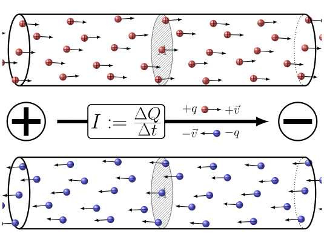
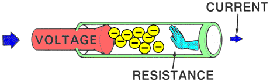
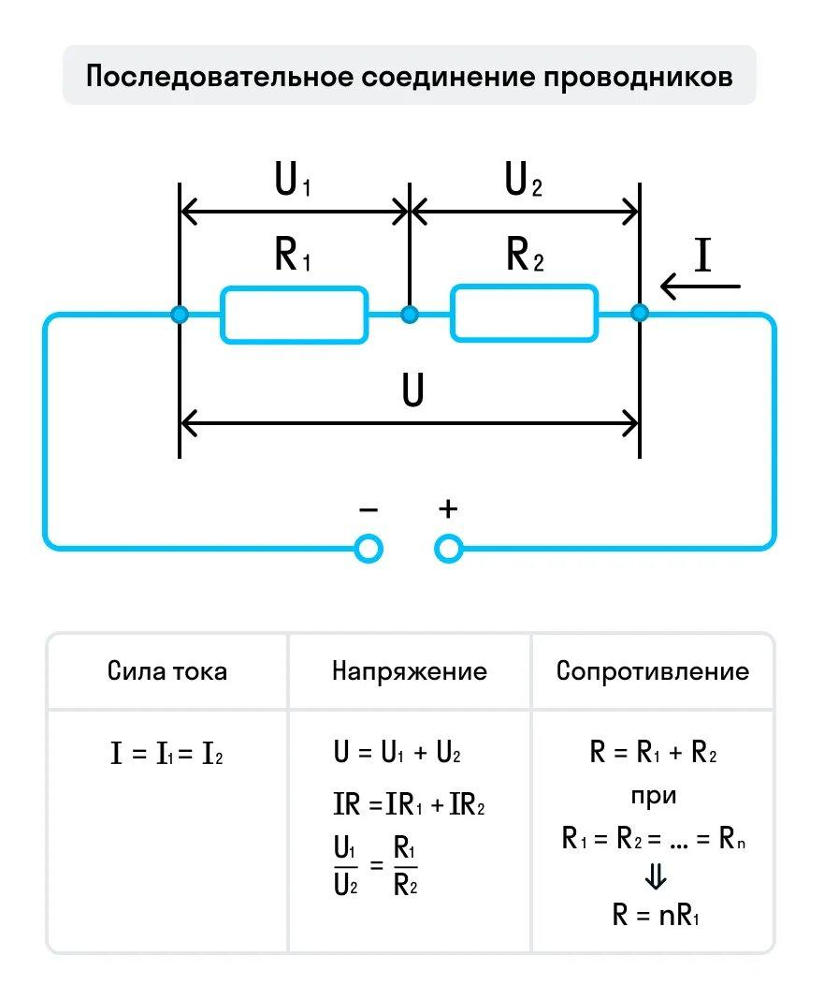
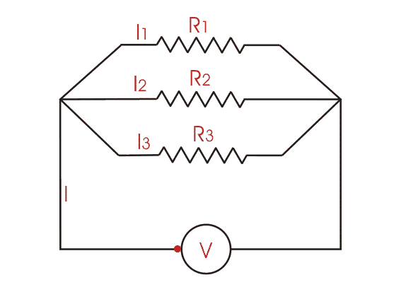
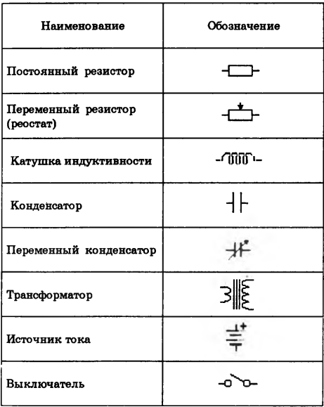
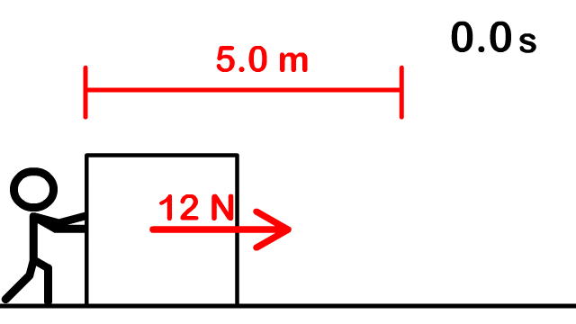
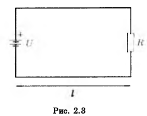
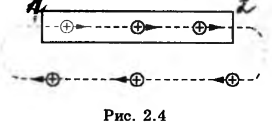
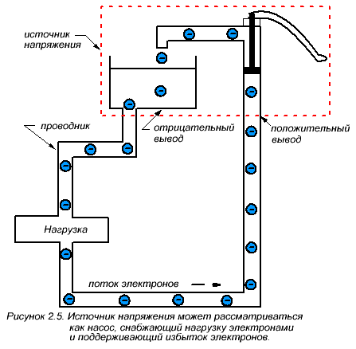
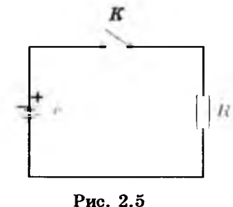

# Глава 2. Постоянный электрический ток

## 2.1. Закон Ома для участка цепи. Сопротивление

### Носители тока и механизм проводимости

В металлах носителями тока являются свободные электроны. Наряду с ними в металлах присутствуют положительные ионы, расположенные в узлах кристаллической решётки; эти ионы не участвуют в переносе тока. При отсутствии внешнего электрического поля свободные электроны движутся хаотически, и ток равен нулю. При появлении электрического поля электроны приобретают дополнительное упорядоченное движение (дрейф) против направления поля, создавая электрический ток.

> **Электрический ток** — <mark><strong>упорядоченное движение электрических зарядов. </strong></mark> 
> **Носители тока** — заряженные частицы, перемещение которых образует электрический ток: в металлах и полупроводниках — электроны, в электролитах — положительные и отрицательные ионы, в ионизированных газах — ионы и электроны.  
> **Ток проводимости** — ток, возникающий внутри твёрдого, жидкого или газообразного проводника.

За направление электрического тока условно принято направление упорядоченного движения положительных зарядов.

### Электрическая цепь

> **Электрическая цепь** — <mark><strong>замкнутый путь из проводников, по которому протекает электрический ток.</strong></mark>

Для поддержания тока в цепи необходим **источник электрической энергии**, преобразующий какую-либо форму энергии (химическую, механическую и др.) в электрическую. Полученная энергия преобразуется в другие формы в **приёмниках** электрической энергии: резисторах, лампах, электролитических ваннах, электродвигателях и т. д.

### Сила тока

> **Сила тока** — скалярная величина $I$, численно равная заряду $\Delta q$, проходящему через поперечное сечение проводника за единицу времени.

Для постоянного тока (сила и направление не изменяются со временем):

$$I = \frac{q}{t},$$

где $q$ — заряд, переносимый через поперечное сечение проводника за время $t$.

Единица силы тока в СИ — **ампер (А)**. При токе 1 А через поперечное сечение проводника за 1 с проходит заряд 1 Кл. Используются также дольные единицы:

$$1 \text{ мА} = 10^{-3} \text{ А}, \quad 1 \text{ мкА} = 10^{-6} \text{ А}.$$

**Практические значения силы тока:**

| Объект | Сила тока |
|---|---|
| Порог ощущения тока человеком | $\approx 0{,}005$ А |
| Опасный для жизни ток | $\approx 0{,}05$ А |
| Лампы накаливания | $0{,}2{-}1$ А |
| Утюги, электрокамины | $5{-}8$ А |
| Электродвигатели трамваев и троллейбусов | $> 100$ А |

### Выражение силы тока через микроскопические параметры

Сила постоянного тока в металлическом проводнике может быть выражена формулой:

$$I = \frac{\Delta q}{\Delta t} = \frac{Ne}{t} = \frac{nVe}{t} = \frac{nSle}{t} = nSev_{\text{др}},$$

где:

- $n = N/V$ — концентрация электронов;
- $N$ — число электронов в объёме $V$ проводника;
- $S$ — площадь поперечного сечения проводника;
- $l$ — длина проводника;
- $e$ — заряд электрона;
- $v_{\text{др}} = l/t$ — средняя скорость упорядоченного движения электронов (скорость дрейфа).

### Плотность тока

> **Плотность тока** — векторная величина, равная заряду, проходящему в единицу времени через единицу поверхности, перпендикулярной направлению движения зарядов:

$$j = \frac{I}{S}.$$

Для металлических проводников:

$$\vec{j} = ne\vec{v}_{\text{др}}.$$

Единица плотности тока — ампер на квадратный метр (А/м²).

Если плотность тока и сила тока не меняются во времени, ток называется **постоянным (стационарным)**. Для постоянного тока сила тока одинакова во всех сечениях проводника. Частным случаем изменяющегося тока является **переменный синусоидальный ток** (переменный ток).

### Скорость распространения электрического взаимодействия

При включении лампы она загорается практически мгновенно, однако это не означает, что электроны движутся с огромной скоростью. Скорость дрейфа свободных электронов в металлах составляет доли миллиметра в секунду. Мгновенное загорание лампы объясняется тем, что **скорость распространения электрического взаимодействия** практически равна скорости света в вакууме:

$$c \approx 300\,000 \text{ км/с}.$$

При замыкании цепи все свободные электроны в проводнике почти одновременно приходят в движение. Аналогия: при открытии водопроводного крана вода начинает течь из ближайших труб, тогда как частицы воды от насосной станции достигнут потребителя значительно позже.

### Сопротивление проводника

Электроны в проводниках испытывают соударения с ионами кристаллической решётки, что тормозит их поступательное движение.

> **Сопротивление проводника** — противодействие проводника направленному движению зарядов (электрическому току). Обозначается $R$, измеряется в **омах (Ом)**.

При соударениях электроны передают решётке избыточную кинетическую энергию, накопленную во время свободного пробега. В результате амплитуда колебаний ионов увеличивается, и температура металла возрастает.

### Закон Ома для участка цепи

В 1826 г. Георг Ом экспериментально установил:

> **Закон Ома для участка цепи:** <mark><strong>сила тока на участке цепи прямо пропорциональна напряжению, приложенному к концам этого участка, и обратно пропорциональна его сопротивлению:</strong></mark>

$$I = \frac{U}{R}.$$

| Потыкать |
|----------|
| https://phet.colorado.edu/sims/html/ohms-law/latest/ohms-law_all.html         |

### Зависимость сопротивления от геометрических параметров

Для однородного проводника постоянного сечения:

$$R = \rho \frac{l}{S},$$

где:

- $\rho$ — удельное сопротивление материала;
- $l$ — длина проводника;
- $S$ — площадь поперечного сечения.

| Потыкать |
|----------|
| https://phet.colorado.edu/sims/html/resistance-in-a-wire/latest/resistance-in-a-wire_all.html         |

> **Удельное сопротивление** — сопротивление проводника единичной длины с единичной площадью поперечного сечения. Единица — **Ом·м**.

> **1 Ом** — сопротивление проводника, по которому течёт ток силой 1 А при напряжении между его концами 1 В.

На практике также используются:

$$1 \text{ кОм} = 10^3 \text{ Ом}, \quad 1 \text{ МОм} = 10^6 \text{ Ом}.$$

**Удельные сопротивления некоторых материалов** (таблица 2.1):

| Материал | $\rho$, Ом·м × 10⁻⁸ | $\alpha$, 1/град |
|---|---|---|
| Серебро | 1,6 | 0,0035 |
| Медь | 1,7–1,8 | 0,0041 |
| Алюминий | 2,95 | 0,0040 |
| Сталь | 12,6–14,6 | 0,0057 |
| Железо | 9–11 | 0,0060 |
| Свинец | 22,1 | 0,0039 |
| Вольфрам | 5,3 | 0,0048 |
| Уголь | 400–600 | −0,005 |
| Константан | 44–50 | 0,00005 |
| Нихром | 100–110 | 0,0001 |
| 10%-ный раствор NaCl | 8 000 000 | −0,02 |

Наименьшим удельным сопротивлением обладают серебро, медь и алюминий, поэтому для изготовления проводов используют медь и алюминий. Для нагревательных приборов применяют сплавы с высоким удельным сопротивлением (например, нихром).

> **Резистор** — устройство, обладающее сопротивлением и используемое для ограничения тока в электрической цепи или в приёмнике электроэнергии. Резисторы бывают с постоянным и переменным (регулируемым) сопротивлением.

### Проводимость

> **Проводимость** — величина, обратная сопротивлению:

$$g = \frac{1}{R}.$$

Единица проводимости — **сименс (См)**: $1 \text{ См} = 1 \text{ Ом}^{-1}$.

> **Удельная проводимость** — величина, обратная удельному сопротивлению:

$$\gamma = \frac{1}{\rho}.$$

### Температурная зависимость сопротивления

Поскольку амплитуда колебаний ионов зависит от температуры, сопротивление проводников также зависит от температуры:

$$R = R_0 (1 + \alpha t),$$

$$\rho = \rho_0 (1 + \alpha t),$$

где:

- $R_0$, $\rho_0$ — сопротивление и удельное сопротивление при 0 °C;
- $\alpha$ — температурный коэффициент сопротивления;
- $t$ — температура в градусах Цельсия.

> **Температурный коэффициент сопротивления** — изменение сопротивления величиной 1 Ом при изменении температуры на 1 °C.

У металлов $\alpha$ положителен, у электролитов и графита — отрицателен. Для точных резисторов используются сплавы с очень низким $\alpha$ (например, константан).

---

## 2.2. Соединение сопротивлений

### 2.2.1. Последовательное соединение

При последовательном соединении конец предыдущего проводника соединяют с началом последующего.

Рис. 2.1 — Последовательное соединение резисторов

**Свойства последовательного соединения:**

1. Сила тока во всех проводниках одинакова:

$$I_1 = I_2 = I_3 = \ldots = I.$$

2. Напряжение на концах всей цепи равно сумме напряжений на отдельных проводниках:

$$U = U_1 + U_2 + U_3.$$

3. По закону Ома $U_i = IR_i$, откуда:

$$R = R_1 + R_2 + R_3.$$

**Общее сопротивление** при последовательном соединении:

$$R = R_1 + R_2 + R_3 + \ldots + R_n.$$

Если все $n$ проводников имеют одинаковое сопротивление $R_1$:

$$R = nR_1.$$

4. Распределение напряжений:

$$\frac{U_1}{U_2} = \frac{R_1}{R_2}.$$

> Напряжения на последовательно соединённых проводниках прямо пропорциональны их сопротивлениям.

### 2.2.2. Параллельное соединение

При параллельном соединении начала всех проводников соединяют в одной точке, а концы — в другой.

Рис. 2.2 — Параллельное соединение резисторов

**Свойства параллельного соединения:**

1. Сила тока в неразветвлённой цепи равна сумме сил токов в параллельно соединённых проводниках:

$$I = I_1 + I_2 + I_3.$$

2. Напряжение на концах всех проводников одинаково:

$$U_1 = U_2 = U_3 = U.$$

3. По закону Ома $I_i = U/R_i$, откуда:

$$\frac{1}{R} = \frac{1}{R_1} + \frac{1}{R_2} + \frac{1}{R_3}.$$

**Общее сопротивление** при параллельном соединении:

$$\frac{1}{R} = \sum_{i=1}^{n} \frac{1}{R_i}.$$

Если $n$ проводников имеют одинаковое сопротивление $R_1$:

$$R = \frac{R_1}{n}.$$

4. Распределение токов:

$$\frac{I_1}{I_2} = \frac{R_2}{R_1}.$$

> Силы токов в параллельно соединённых проводниках обратно пропорциональны их сопротивлениям.

**Условные графические обозначения элементов** (таблица 2.2):

---

## 2.3. Работа и мощность электрического тока. Закон Джоуля–Ленца

### Работа тока

<mark><strong>При перемещении заряда $q$ между точками цепи с напряжением $U$ совершается работа:</strong></mark>

$$A = qU.$$

За время $t$ через проводник переносится заряд $q = It$, следовательно:

$$A = UIt.$$

Единица работы — **джоуль (Дж)**: $1 \text{ Дж} = 1 \text{ В·А·с}$.

### Мощность тока

> **Мощность** — <mark><strong>отношение работы к промежутку времени, за который она совершена:</strong></mark>

$$P = \frac{A}{t} = UI.$$

Единица мощности — **ватт (Вт)**: $1 \text{ Вт} = 1 \text{ Дж/с}$. <mark><strong>Мощность 1 Вт — это мощность, при которой за 1 с совершается работа 1 Дж.</strong></mark>

С помощью закона Ома выражения для работы и мощности можно представить в эквивалентных формах:

$$A = UIt = \frac{U^2}{R}t = I^2Rt,$$

$$P = UI = \frac{U^2}{R} = I^2R.$$

### Закон Джоуля–Ленца

Если проводник неподвижен и в нём не происходит химических превращений, работа тока полностью переходит во внутреннюю энергию проводника (теплоту):

$$Q = IUt = I^2Rt.$$

> **Закон Джоуля–Ленца:** <mark><strong>количество теплоты, выделяющееся в проводнике при прохождении по нему постоянного тока, прямо пропорционально квадрату силы тока, сопротивлению проводника и времени его прохождения.</strong></mark>

Закон установлен Д. Джоулем (1818–1889) и подтверждён опытами Э. Х. Ленца (1804–1866).

---

## 2.4. Расчёт проводов на потерю напряжения

### Постановка задачи

При расчёте проводов обычно задаются:

- напряжением источника $U$;
- расстоянием от источника до приёмника $l$;
- силой тока $I$ или мощностью нагрузки;
- номинальным напряжением $U_{\text{н}}$, необходимым для нормальной работы приёмников.

**Задача:** рассчитать такое сечение проводов $S$, при котором обеспечивается номинальное напряжение на зажимах приёмников.

Рис. 2.3 — Линия электропередачи с нагрузкой

### Расчётная формула

Согласно закону Ома, напряжение источника равно сумме падения напряжения на проводах и напряжения на нагрузке:

$$U = I r_{\text{л}} + U_{\text{н}}.$$

Сопротивление проводов линии:

$$r_{\text{л}} = \rho \frac{2l}{S},$$

где $2l$ — общая длина линии (прямой и обратный провод), $\rho$ — удельное сопротивление материала проводов.

Подставляя, получаем:

$$U = I \rho \frac{2l}{S} + U_{\text{н}},$$

откуда:

$$\Delta U = U - U_{\text{н}} = I \rho \frac{2l}{S}.$$

> **Потеря напряжения в линии** — разность между напряжением источника и напряжением на нагрузке: $\Delta U = U - U_{\text{н}}$.

Нагрузка в линии обычно непостоянна, поэтому необходимо рассчитывать отклонения напряжения от номинального значения при максимальном и минимальном режимах нагрузки.

### Влияние напряжения на потери мощности

Умножив уравнение $U = Ir_{\text{л}} + U_{\text{н}}$ на силу тока $I$, получим уравнение распределения мощности:

$$UI = I^2 r_{\text{л}} + U_{\text{н}}I,$$

где:

- $UI$ — мощность, отдаваемая источником;
- $I^2 r_{\text{л}}$ — потери мощности в проводах линии на нагревание;
- $U_{\text{н}}I$ — мощность, потребляемая нагрузкой.

Если повысить напряжение источника в 2 раза при той же передаваемой мощности, сила тока уменьшится в 2 раза, а потери мощности в проводах уменьшатся в 4 раза (поскольку $P_{\text{пот}} \propto I^2$).

> **Вывод:** для уменьшения потерь в линиях передачи электроэнергию целесообразно передавать при возможно более высоком напряжении.

---

## 2.5. Источники электрического тока. ЭДС. Закон Ома для замкнутой цепи

### Необходимость сторонних сил

Для поддержания постоянного тока в проводнике необходимо, чтобы напряжённость электрического поля внутри проводника была отлична от нуля и не изменялась со временем. Если создать в проводнике электрическое поле, перемещение зарядов приведёт к выравниванию потенциалов и исчезновению тока.

Для поддержания тока необходимо:

- отводить заряды от конца проводника с меньшим потенциалом $\varphi_2$;
- подводить их к концу с большим потенциалом $\varphi_1$,

то есть осуществлять **круговое движение зарядов**.

Рис. 2.4 — Схема кругового движения зарядов

Движение положительных зарядов в сторону убывания потенциала осуществляется электростатическими (кулоновскими) силами. Движение в сторону возрастания потенциала не может осуществляться электростатическими силами — для этого необходимы силы неэлектростатического происхождения.

> **Сторонние силы** — силы неэлектростатического происхождения, обеспечивающие движение зарядов против электростатических сил. Они могут быть обусловлены химическими процессами, диффузией носителей тока, переменными магнитными полями и т. д.  
> **Источник тока** — устройство, в котором возникают сторонние силы.

### Электродвижущая сила (ЭДС)

> **Электродвижущая сила (ЭДС)** — <mark><strong>работа сторонних сил, отнесённая к единице положительного заряда:</strong></mark>

$$\varepsilon = \frac{A_{\text{ст}}}{q}.$$

ЭДС измеряется в **вольтах (В)**.

> **Примечание:** термины «сторонние силы» и «электродвижущая сила» не являются силами в механическом смысле — эти названия сложились исторически.

<table><tr><td>

ЭДС характеризует способность источника тока совершать работу по перемещению зарядов за счёт энергии неэлектрического происхождения.

Батарейка — это насос. Она не толкает электроны «силой», она закачивает энергию в каждый кулон заряда. Если ЭДС = 1.5 В, значит, батарейка даёт каждому кулону 1.5 Джоуля энергии, поднимая его с низкого потенциала на высокий.

</td></tr></table>

### Закон Ома для замкнутой цепи

Рассмотрим замкнутую цепь, состоящую из источника тока с ЭДС $\varepsilon$ и внутренним сопротивлением $r$, и нагрузки с сопротивлением $R$.

Рис. 2.5 — Замкнутая электрическая цепь

Из закона сохранения энергии следует, что работа сторонних сил в источнике расходуется на полную работу тока в цепи — превращается в тепло как на внешнем сопротивлении, так и на внутреннем сопротивлении источника:

$$\varepsilon q = I^2Rt + I^2rt.$$

Разделив обе части на $q = It$, получим:

$$\varepsilon = I(R + r),$$

откуда:

$$I = \frac{\varepsilon}{R + r}.$$

> **Закон Ома для замкнутой цепи:** сила тока в замкнутой цепи прямо пропорциональна ЭДС источника тока и обратно пропорциональна сумме сопротивлений внешнего и внутреннего участков цепи.

Сумма $R + r$ называется **полным сопротивлением цепи**.

---

## 2.6. Разветвлённые цепи. Правила Кирхгофа

Два правила Кирхгофа полностью определяют электрическое состояние цепей и дают основу для их расчёта. Они установлены на основе опытов и являются следствием закона сохранения энергии.

### Первое правило Кирхгофа

> **Первое правило Кирхгофа:** алгебраическая сумма токов в любом узле электрической цепи равна нулю:

$$\sum_{k=1}^{n} I_k = 0.$$

Иными словами, в любом узле цепи сумма приходящих токов равна сумме уходящих токов.

Для узла на рис. 2.6:

$$I_1 + I_2 + I_5 = I_3 + I_4,$$

или в алгебраической форме:

$$I_1 + I_2 - I_3 - I_4 + I_5 = 0.$$

Рис. 2.6 — Узел разветвлённой цепи

**Обоснование:** алгебраическая сумма токов — это заряд, приходящий в узел за единицу времени. Если токи постоянны, эта сумма должна равняться нулю, иначе в узле накапливался бы заряд, потенциал изменялся бы со временем, и токи не были бы постоянными.

### Второе правило Кирхгофа

> **Второе правило Кирхгофа:** в любом замкнутом электрическом контуре сумма всех падений напряжения равна сумме всех ЭДС в нём:

$$\sum_{k=1}^{n} I_k R_k = \sum_{k=1}^{n} \varepsilon_k.$$

Рис. 2.7 — Разветвлённая электрическая цепь с несколькими контурами

### Правило знаков

При составлении уравнений по правилам Кирхгофа необходимо соблюдать правило знаков:

- если при выбранном направлении обхода ЭДС проходится **от минуса к плюсу**, она записывается со знаком **плюс**;
- если направление тока **не совпадает** с направлением обхода контура, падение напряжения записывается со знаком **минус**.

Направления токов на каждом участке можно выбирать произвольно. Действительное направление определяется после решения задачи:

- если ток получился **положительным**, его направление совпадает с предполагаемым;
- если ток получился **отрицательным**, он направлен противоположно.

---

## 2.7. Методы расчёта электрических цепей

### Пример 1. Параллельное соединение. Шунтирование

Пусть в цепь источника тока с ЭДС $\varepsilon$ и внутренним сопротивлением $r$ параллельно включены два сопротивления $R_1$ и $R_2$.

Рис. 2.8 — Параллельное соединение двух резисторов

Выберем направления токов и обхода контуров. Для узла $a$ первое правило Кирхгофа даёт:

$$I - I_1 - I_2 = 0.$$

Применив второе правило Кирхгофа к контурам $aR_1bR_2a$ и $aR_1b\varepsilon a$:

$$I_1R_1 - I_2R_2 = 0,$$

$$Ir + I_1R_1 = \varepsilon.$$

Из первых двух уравнений:

$$I_1 = I \frac{R_2}{R_1 + R_2}, \quad I_2 = I \frac{R_1}{R_1 + R_2}.$$

Отношение токов:

$$\frac{I_1}{I_2} = \frac{R_2}{R_1}.$$

Подставляя $I_1$ в третье уравнение:

$$I\left(r + \frac{R_1R_2}{R_1 + R_2}\right) = \varepsilon.$$

Сравнивая с законом Ома для замкнутой цепи, получаем **общее сопротивление двух параллельно соединённых проводников**:

$$R = \frac{R_1R_2}{R_1 + R_2},$$

или в более удобной форме:

$$\frac{1}{R} = \frac{1}{R_1} + \frac{1}{R_2}.$$

Для произвольного количества параллельно соединённых проводников:

$$\frac{1}{R} = \sum_{i=1}^{n} \frac{1}{R_i}.$$

### Шунтирование

> **Шунтирование** — создание обходного пути для тока с помощью резистора (шунта), подключаемого параллельно измерительному прибору.

Если необходимо измерить ток $I$, превышающий предел измерения амперметра $I_A$, параллельно амперметру включают шунт с сопротивлением $R_{\text{ш}}$.

Рис. 2.9 — Подключение шунта к амперметру

Отношение тока через амперметр к измеряемому току:

$$\frac{I_A}{I} = \frac{R_{\text{ш}}}{R_A + R_{\text{ш}}},$$

где $R_A$ — сопротивление амперметра.

Если требуется измерять ток в $n$ раз больше, чем рассчитан амперметр ($I = nI_A$), сопротивление шунта:

$$R_{\text{ш}} = \frac{R_A}{n - 1}.$$

---

### Пример 2. Разветвлённая цепь

Рассмотрим более сложную цепь с двумя источниками ЭДС и тремя ветвями.

Рис. 2.10 — Разветвлённая цепь с двумя источниками ЭДС

**Порядок расчёта:**

1. Произвольно выбрать направления токов.
2. Составить уравнения по первому правилу Кирхгофа для узлов.
3. Выбрать независимые контуры (в каждый новый контур должна входить хотя бы одна ветвь, не вошедшая в предыдущие).
4. Записать уравнения по второму правилу Кирхгофа с учётом правила знаков.

Для узла $C$:

$$I_1 + I_2 - I_3 = 0.$$

Для контура $ABCEA$ (обход по часовой стрелке):

$$I_1(r_1 + R_1) - I_2(r_2 + R_2) = \varepsilon_1 - \varepsilon_2.$$

Для контура $ECDFE$ (обход по часовой стрелке):

$$I_2(r_2 + R_2) + I_3(r_3 + R_3) = \varepsilon_2 - \varepsilon_3.$$

Решение полученной системы трёх уравнений даёт токи $I_1$, $I_2$, $I_3$.

**Проверка правильности расчёта** — энергетическое условие: алгебраическая сумма мощностей, отдаваемых источниками ЭДС, должна быть равна сумме мощностей, поглощаемых всеми резисторами:

$$\sum_{k=1}^{n} \varepsilon_k I_k = \sum_{k=1}^{n} I_k^2 R_k.$$

Если действительное направление тока в источнике противоположно направлению ЭДС, мощность такого источника считается отрицательной — он работает как приёмник энергии (например, заряжающийся аккумулятор).

---

### Пример 3. Соединение источников тока

#### Последовательное соединение

Пусть $n$ одинаковых источников тока (ЭДС каждого $\varepsilon_1$, внутреннее сопротивление $r_1$) соединены последовательно и замкнуты на внешнюю цепь с сопротивлением $R$.

Рис. 2.11 — Последовательное соединение источников тока

Второе правило Кирхгофа даёт:

$$I(nr_1 + R) = n\varepsilon_1.$$

Сравнивая с законом Ома для замкнутой цепи:

$$\varepsilon = n\varepsilon_1, \quad r = nr_1.$$

> При последовательном соединении одинаковых источников тока ЭДС батареи и её внутреннее сопротивление в $n$ раз больше, чем у одного источника.

#### Параллельное соединение

При параллельном соединении все положительные полюсы соединяются между собой, образуя положительный полюс батареи; аналогично соединяются отрицательные полюсы.

Рис. 2.12 — Параллельное соединение источников тока

Первое правило Кирхгофа:

$$I = I_1 + I_2 + \ldots + I_m.$$

Из второго правила Кирхгофа для каждого контура следует, что при одинаковых источниках токи через них равны:

$$I_1 = I_2 = \ldots = I_m = \frac{I}{m}.$$

Подставляя, получаем:

$$I\left(R + \frac{r_1}{m}\right) = \varepsilon_1.$$

Отсюда:

$$\varepsilon = \varepsilon_1, \quad r = \frac{r_1}{m}.$$

> При параллельном соединении одинаковых источников тока ЭДС батареи равна ЭДС одного источника, а внутреннее сопротивление батареи в $m$ раз меньше, чем у одного источника.

#### Смешанное соединение

Рис. 2.13 — Смешанное соединение источников тока

Батарея состоит из $m$ параллельно соединённых звеньев, в каждом из которых $n$ последовательно соединённых источников. ЭДС и внутреннее сопротивление:

$$\varepsilon = n\varepsilon_1, \quad r = \frac{nr_1}{m}.$$

С помощью различных схем соединения источников можно изменять ЭДС и внутреннее сопротивление в широких пределах, подбирая значения, необходимые для питания данной внешней цепи.

---

## FAQ

**Вопрос 1: Почему при замыкании цепи лампа загорается мгновенно, хотя электроны движутся медленно?**

Электрическое поле распространяется вдоль проводника со скоростью, близкой к скорости света (~300 000 км/с). Поэтому все свободные электроны в проводнике приходят в движение практически одновременно, несмотря на то что их дрейфовая скорость составляет доли миллиметра в секунду.

**Вопрос 2: Чем отличается последовательное соединение от параллельного с точки зрения распределения тока и напряжения?**

При последовательном соединении ток одинаков во всех элементах, а напряжение делится пропорционально сопротивлениям. При параллельном соединении напряжение одинаково на всех элементах, а ток делится обратно пропорционально сопротивлениям.

**Вопрос 3: Зачем нужно повышать напряжение в линиях электропередачи?**

Потери мощности в проводах пропорциональны квадрату силы тока: $P_{\text{пот}} = I^2 r_{\text{л}}$. При повышении напряжения в 2 раза сила тока при той же мощности уменьшается в 2 раза, а потери — в 4 раза.

**Вопрос 4: Что такое шунт и как он рассчитывается?**

Шунт — резистор, подключаемый параллельно амперметру для расширения предела измерения. Если нужно измерять ток в $n$ раз больше, чем предел амперметра, сопротивление шунта рассчитывается как $R_{\text{ш}} = R_A/(n-1)$, где $R_A$ — сопротивление амперметра.

**Вопрос 5: Можно ли выбирать направления токов произвольно при расчёте цепи по правилам Кирхгофа?**

Да, направления токов выбираются произвольно. Если после решения системы уравнений ток получился положительным, его действительное направление совпадает с выбранным; если отрицательным — противоположно.

**Вопрос 6: Почему у металлов температурный коэффициент сопротивления положителен, а у графита — отрицателен?**

У металлов с ростом температуры увеличивается амплитуда колебаний ионов решётки, что усиливает рассеяние электронов и повышает сопротивление. У графита с ростом температуры увеличивается концентрация свободных носителей заряда, что снижает сопротивление.