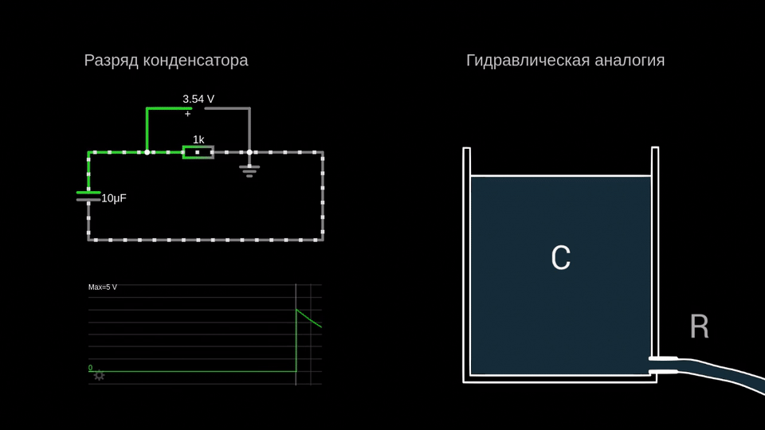
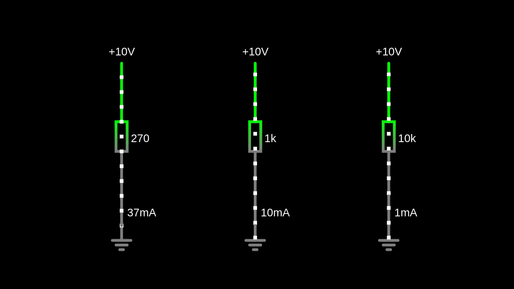
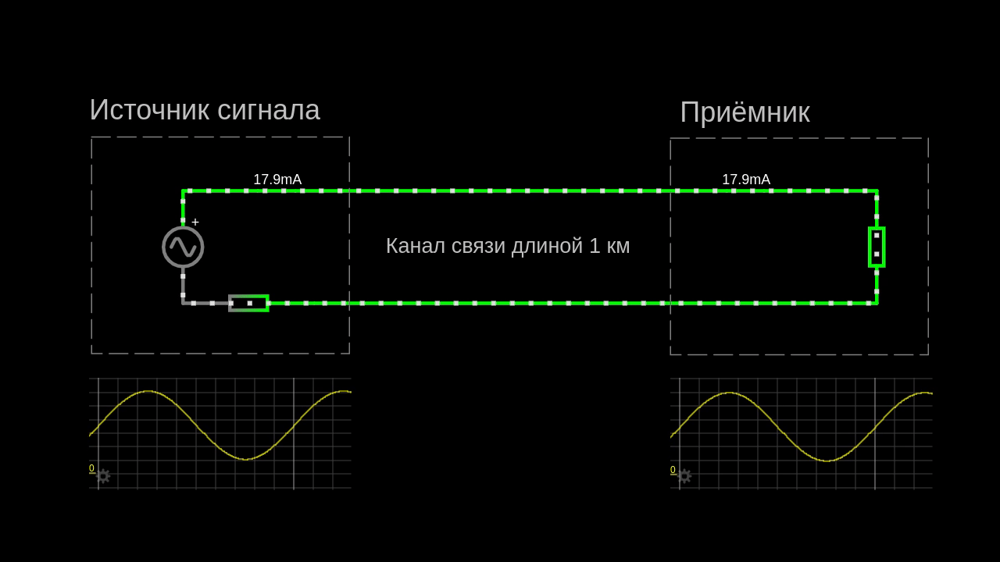
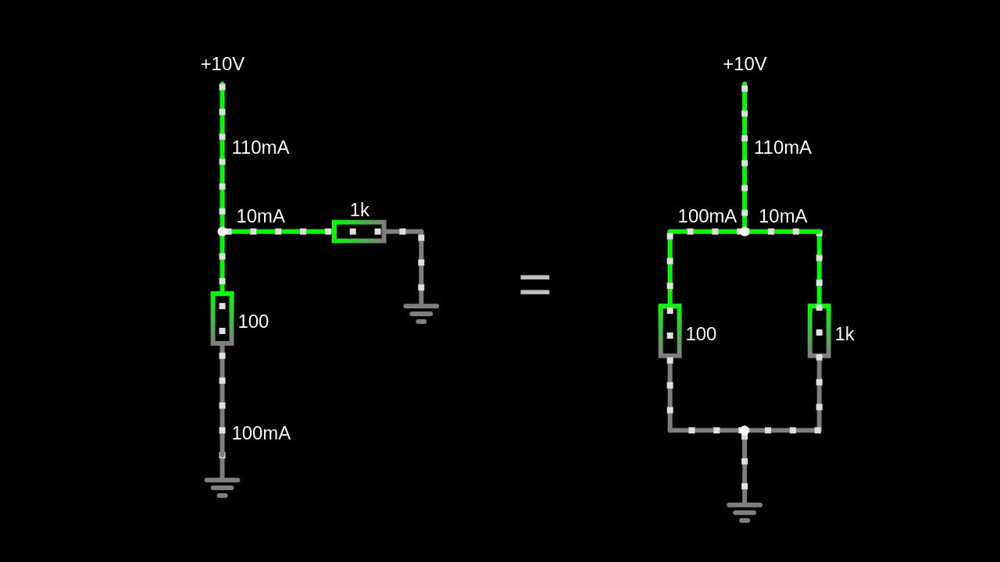
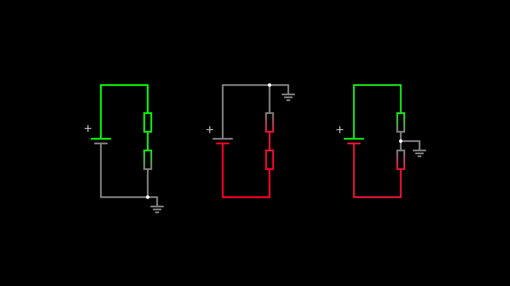
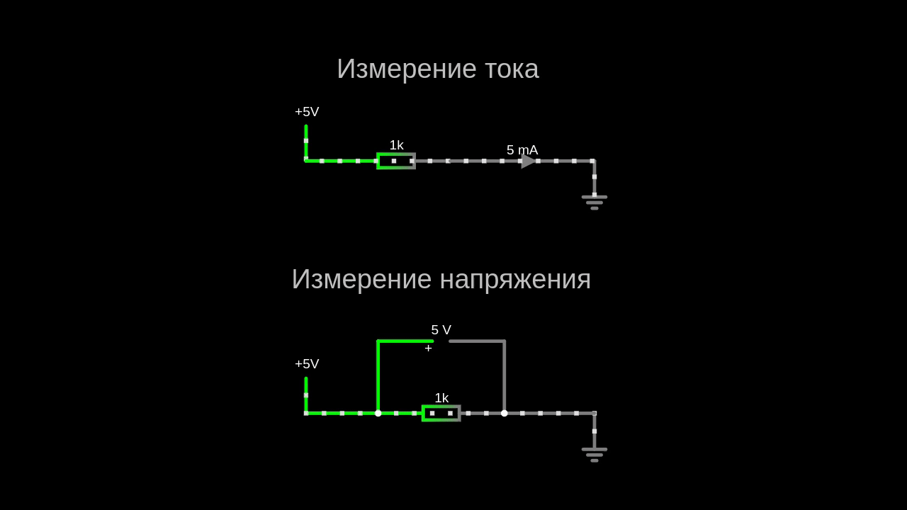
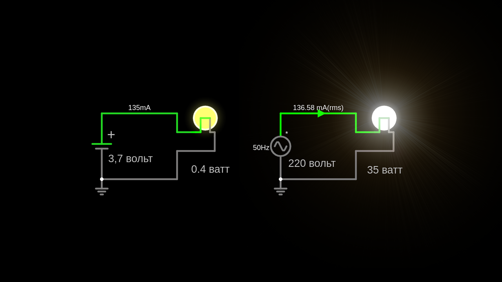
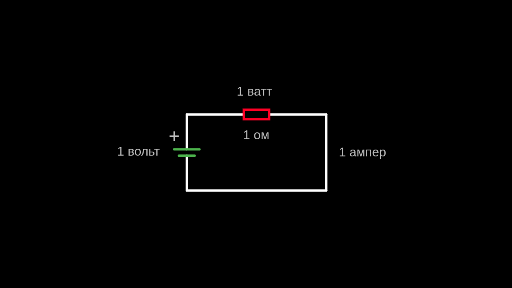

https://habr.com/en/companies/ruvds/articles/709384/

# Электроника для начинающих: от интуитивных аналогий к интерактивному симулятору CircuitJS

## Введение

Многие из нас в детстве заворожённо рассматривали печатные платы, пытаясь понять, как работает этот миниатюрный город из разноцветных деталей. Возможно, у вас был опыт сборки электронных схем по книгам Борисова и Свореня, советский сорокаваттный паяльник, кусочек канифоли в спичечном коробке и штаны с намертво влипшей в ткань каплей припоя.

Современные программные средства иллюстрируют процессы, происходящие в электрических цепях, с недосягаемой для радиолюбителей прошлого наглядностью и интерактивностью. Они визуализируют токи и напряжения в различных частях схемы, снижая порог понимания для людей, которым сложно даются абстрактные знания и язык формул.

---

## Краткое содержание

Вначале я расскажу о том, что люди не имеют интуитивного понимания электричества, поскольку нас с детства окружают явления преимущественно механического характера. Затем — кратко об электрическом заряде, токе, напряжении, электродвижущей силе и мощности. После этого — об основах работы в бесплатном браузерном симуляторе **CircuitJS**. Мы вместе соберём учебную цепь, подключим виртуальные «осциллографы» и наглядно убедимся, как симулятор упрощает изучение электроники.

---

## 1. Электроника — это непросто

Однажды я разговаривал с дядей, стоя у его разобранного сварочного аппарата. Он посетовал, что механическую часть устройства починить проще, чем электронную, потому что «в механике всё и так понятно, её глазами видно». Эта фраза иллюстрирует трудность восприятия электрических процессов: они недоступны для познания в наглядном виде.

Человек развивается в мире, полном механических явлений. Падение предметов, качение тел, течение жидкостей и газов — всё это доступно нам с раннего детства как наблюдение или эксперимент. Наш опыт формирует в мозге интуитивный «физический движок». Мы без труда представляем свойства предметов:

- **плотность** — свинцовое грузило и пенопластовый поплавок;
- **упругость** — колеблющаяся зажатая линейка;
- **пластичность** — пластилин или алюминиевая проволока.

Однако в физике электрических процессов интуитивный опыт — ложный друг. Микромир и его законы отличаются от привычного мира макроскопических предметов. Аналогии могут запутать или дать обманчивое понимание.

Удачен термин **«физика брошенного камня»**, услышанный мной в лекции физика Алексея Семихатова. Мы интуитивно понимаем полёт брошенного камня, его энергию, поведение при рикошете. Но у нас нет такой натренированности в оценке электричества:

- провод под напряжением выглядит так же, как заземлённый;
- мы не ощущаем магнитное поле;
- мы не можем без приборов понять, протекает ли ток по проводу.

Мы эволюционировали в мире, где для эмпирического познания доступны в основном механические явления. Электрические и магнитные явления выглядят как магия.

---

## 2. Базовые понятия электроники

Для объяснения основ электрических явлений обратимся к **гидравлической аналогии**, как это сделано в книге Рудольфа Свореня «Электричество шаг за шагом».

### 2.1. Заряд

> **Заряд** — физическая величина, «количество электричества», выражаемое в числе элементарных частиц-переносчиков заряда.

Единица измерения заряда — **кулон (Кл)**:

$$1\ \text{Кл} = 6{,}24 \cdot 10^{18}\ \text{электронов}$$

Заряд может быть **отрицательным** (электроны) и **положительным** (протоны). Элементарные заряды могут суммироваться или нейтрализовать друг друга.

В электрически нейтральных телах разделение зарядов можно вызвать **механическим трением**: электроны буквально «вырываются» с внешних орбиталей атомов и переносятся в другое вещество. Шаркая тапками по полу, вы вырываете электроны на атомарном уровне и при этом заряжаетесь.

В металлах подвижными носителями заряда являются **электроны**: они самостоятельно отделяются от внешних орбиталей атомов и образуют **электронный газ**. Атомы с положительными протонами удерживаются в кристаллической решётке и не участвуют в токе.

**Гидравлическая аналогия заряда** — количество жидкости. Ведро с жидкостью — аналог обкладки конденсатора, удерживающей заряд. Как ведро можно опрокинуть почти мгновенно, так и конденсатор может быстро отдать заряд.

> *Дополнение из комментариев:* более точная аналогия конденсатора — ёмкость, разделённая упругой перегородкой; нагрузкой выступает водяная вертушка с сопротивлением вращению.

---

### 2.2. Электрический ток

> **Электрический ток** — направленное движение частиц-переносчиков заряда.

В начале XIX века условились считать, что ток протекает **от положительного полюса к отрицательному**. В действительности в металлах электронный газ движется **от минуса к плюсу**, но условное направление (от плюса к минусу) прижилось и повсеместно применяется в схемах.

В проводящих жидкостях в токе участвуют носители **обеих полярностей**, двигаясь в противоположных направлениях. Это важно помнить при изучении вакуумных ламп и полупроводниковых приборов.

**Гидравлический аналог тока** — направленный поток жидкости по трубе. Количество жидкости в единицу времени соответствует электрическому заряду: чем быстрее наполняется мерное ведро, тем больше ток.

> **Важное отличие:** разрубленный шланг со свободным излиянием — аналог **короткого замыкания**; разрыв проводника — **полностью пережатый шланг** с бесконечно большим сопротивлением.

Ток во всех участках неразветвлённой цепи **одинаков**. На этом свойстве основана **токовая петля** — точный способ передачи аналогового сигнала, применяемый в промышленности и авиации.

Единица измерения тока — **ампер (А)**:

$$1\ \text{А} = 1\ \text{Кл/с}$$

Токовым датчиком может выступать обыкновенный резистор.

---

### 2.3. Сопротивление

> **Сопротивление** — физическая величина, показывающая способность участка цепи препятствовать прохождению электрического тока; величина, обратная проводимости.

**Гидравлический аналог резистора** — форсунка или частично приоткрытый кран, ограничивающий поток воды.

Единица измерения — **ом (Ω)**. Один ом — небольшая величина: обмотка звуковоспроизводящей головки из меди может иметь сопротивление всего в несколько ом. Большинство резисторов в радиоэлектронике имеют сопротивление в сотни и тысячи ом.

---

### 2.4. Напряжение

При прохождении тока через резистор на нём **падает напряжение**. В то же время верно, что на резисторе напряжение **появляется**. Это кажущийся парадокс, возникающий из-за относительности измерения: для последующих участков цепи напряжение падает, а для самого резистора — появляется. Это похоже на комиссию при денежном переводе: сумма перевода уменьшается, но её часть появляется у системы.

**Гидравлическая аналогия напряжения** — давление. Если частично закрыть пальцем выход садового шланга, напор повышается; если проделать обходной путь, из него начнёт истекать часть потока.

Схема, демонстрирующая это явление, называется **делителем тока**.

> **Важно:** напряжение измеряется **между двумя точками** схемы — это относительная величина.

Три одинаковые цепи с одним и тем же током могут иметь разные напряжения в точках в зависимости от того, какая точка принята за **нулевой потенциал**. В симуляторе значок заземления явно указывает точку отсчёта.

- **Ток** измеряется **через сечение проводника**.
- **Напряжение** измеряется **между двумя точками**.

---

### 2.5. Электродвижущая сила (ЭДС)

Несмотря на слово «сила», ЭДС измеряется в **вольтах** и выражает работу **сторонних сил неэлектрической природы**. Эти силы «растаскивают» заряд внутри источника питания, концентрируя его на клеммах, работая против электрических сил. Без ЭДС заряды распределились бы по цепи равномерно.

Примеры сторонних сил:

- **химические процессы** в аккумуляторах и батарейках (химические источники тока);
- **фотоэффект** в солнечных панелях;
- **механическое изменение магнитного поля** в генераторах.

Раскручивая ротор генератора с постоянными магнитами, мы создаём движущееся магнитное поле, которое «гонит» электроны по обмоткам, подобно перистальтическому насосу. Источником механической энергии может быть ветер, поток воды, сгорание топлива или усилие мышц.

---

### 2.6. Мощность

> **Мощность** — физическая величина, характеризующая скорость передачи или преобразования энергии в электрической цепи; работа, совершаемая в единицу времени.

Единица измерения — **ватт (Вт)**.

Интересный факт: ток в лампочке карманного фонарика примерно равен току в многократно более яркой лампе люстры. Это возможно потому, что нить накала лампы люстры подобна гирлянде из сотни маломощных лампочек: источнику ЭДС приходится «пропихивать» тот же ток через многократно большее сопротивление.

В цепи с ЭДС $1\ \text{В}$ и сопротивлением нагрузки $1\ \text{Ом}$ протекает ток:

$$I = \frac{U}{R} = \frac{1}{1} = 1\ \text{А}$$

В симуляторе есть режим подсветки выделяющейся мощности в виде тепловой энергии.

---

## 3. Симулятор CircuitJS

### 3.1. Об авторе

Автор симулятора — **Paul Falstad**, физик из США (г. Санта-Барбара), около 50 лет.

Симулятор доступен по ссылкам:

- [falstad.com/circuit/](https://falstad.com/circuit/)
- [lushprojects.com/circuitjs/](https://lushprojects.com/circuitjs/)

Проект живой и развивается: разработчики добавляют новые элементы и исправляют ошибки. Имеется репозиторий на GitHub, интерфейс отлично переведён на русский язык.

---

### 3.2. Знакомство с интерфейсом

Интерфейс лаконичен и минималистичен. Вверху — меню, похожее на классические меню десктопных приложений.

Справа — панель настроек с кнопками:

- **START/stop** — запуск и остановка симуляции;
- **Reset** — сброс параметров.

Внизу — пространство для «осциллографов». Их можно располагать колонками, строками или склеивать в один.

---

### 3.3. Контекстное меню, шорткаты, пробел

Элементы добавляются через меню **«Рисовать»** или контекстное меню (правый клик).

Для начала выберите **«Схемы» → «Пустая схема»**.

Полезные клавиатурные сокращения:

| Клавиша | Элемент |
|---------|---------|
| **r** | резистор (resistor) |
| **w** | провод (wire) |
| **v** | источник питания |
| **g** | заземление (ground) |
| **пробел** | режим перетаскивания и выделения рамкой |

Некоторые элементы (потенциометры, трансформаторы, транзисторы) можно поворачивать, двигая за выводы с зажатой клавишей **Ctrl**.

---

### 3.4. Источники питания и их настройки

Добавьте двухполюсный источник постоянного напряжения (**v**), зайдите в настройки и укажите напряжение **5 В**. Через настройки можно превратить батарейку в генератор переменного или пульсирующего тока, источник ШИМ-сигнала или питания.

Нарисуйте светодиод, резистор, при желании — выключатель, и соедините элементы проводами (**w**).

---

### 3.5. Добавление пользовательских ползунков

Почти все элементы позволяют выносить ползунки с параметрами в меню настроек:

- резистору зададим диапазон сопротивления **от 250 до 800 Ом**;
- батарейке — ползунок напряжения **от 0 до 5 В**.

---

### 3.6. Настройки отображения тока и напряжения в проводниках

Любой провод можно превратить в **амперметр**. Также можно включить отображение напряжения на проводнике. Всё это делается через контекстное меню.

---

### 3.7. Добавление приборов и осциллографов

В симуляторе **осциллографом** называется графопостроитель, работающий по принципу самописца: правый край отображает актуальное значение, график движется влево.

По умолчанию осциллограф отображает:

- **зелёным** — напряжение;
- **жёлтым** — ток.

Увеличьте осциллограф, потянув за правый нижний угол, и включите в настройках **«Показать ВАХ»** (вольт-амперную характеристику). Получится интерактивный **характериограф**.

> **Подсказка:** если индикатор ВАХ не отображает точку, выберите по правому клику **«Макс. масштаб»**.

Управляя ползунками, можно увидеть, как при изменении напряжения и сопротивления «открывается» светодиод и нелинейно растёт ток.

Если подвести курсор к области графиков, на всех осциллографах появится синхронизированная вертикальная черта для сравнения значений.

> **Примечание:** по умолчанию положительное напряжение окрашено в **зелёный**, отрицательное — в **красный**. Цветовую тему можно изменить на светлую, а расцветку — на привычную сине-красную.

---

### 3.8. Сохранение и загрузка файлов

В пункте **«Файл»** всё очевидно. Файлы схем — это обычные текстовые файлы, доступные для правки сторонними приложениями. Есть возможность делиться схемой через короткую ссылку.

---

### 3.9. Отображение выделяемой мощности

Верхнее меню: **«Опции» → «Показать мощность»**. На панели управления можно отрегулировать верхний порог мощности.

Подсвечиваются резисторы, транзисторы, диоды и другие элементы. Точные значения тока, напряжения и рассеиваемой мощности отображаются в нижней информационной панели при наведении курсора на элемент.

---

## 4. Как это может пригодиться

- **Самообразование** в схемотехнике и электронике.
- **Наглядное пособие** для школьных учителей при подготовке уроков.
- **Калькулятор** для несложных расчётов (с учётом неточностей моделей).

---

## 5. Напутствие

Тема электроники непроста. Она подобна фракталу: раскрывается усложняющимися подробностями. Вы часто будете испытывать злость от непонимания и ощущения тупика — через это проходят все, кто идёт тропой познания. Пусть досада будет верным признаком прогресса.

Я буду рад, если вдохновлю вас открыть школьный учебник физики или уроки на YouTube. Будет здорово, если вы проделаете опыты со своими детьми.

Если вы загорелись идеей поэкспериментировать и попаять, отыщите мультиметр, паяльник и горку старых радиодеталей — они пригодятся!

---

## FAQ

**1. Почему электричество сложно понять интуитивно?**  
Потому что мы с детства окружены механическими явлениями, а электрические и магнитные процессы недоступны непосредственному наблюдению.

**2. Какая аналогия помогает понять электричество?**  
Гидравлическая: заряд — количество жидкости, ток — поток, напряжение — давление, сопротивление — сужение трубы.

**3. Что такое заряд?**  
Количество электричества; измеряется в кулонах. Один кулон равен $6{,}24 \cdot 10^{18}$ зарядов электронов.

**4. Чем отличается условное направление тока от реального?**  
Условно ток течёт от плюса к минусу, реально электроны в металлах движутся от минуса к плюсу.

**5. Что такое ЭДС?**  
Работа сторонних сил неэлектрической природы, создающая разность потенциалов на клеммах источника.

**6. Что такое CircuitJS?**  
Бесплатный браузерный симулятор электрических цепей с интерактивной визуализацией токов и напряжений.

**7. Как добавить элемент в CircuitJS?**  
Через меню «Рисовать» или контекстное меню (правый клик); можно использовать горячие клавиши (r, w, v, g).

**8. Что показывает осциллограф в CircuitJS?**  
По умолчанию — напряжение (зелёным) и ток (жёлтым); можно включить отображение вольт-амперной характеристики (ВАХ).