https://stickmanphysics.com/stickman-physics-home/unit-7-electrostatics/electrostatics-conduction-induction-and-friction/

# Электростатика: электризация через соприкосновение, индукцию и трение

## Введение в электростатику

**Электростатика** — это раздел физики, изучающий взаимодействие неподвижных (статических) электрических зарядов. Основные закономерности электростатики определяют поведение заряженных тел и лежат в основе понимания электрических явлений в природе и технике.

## 1. Основные понятия электростатики

### 1.1. Электрические заряды и их взаимодействие

В природе существуют два вида электрических зарядов — **положительные** и **отрицательные**. Взаимодействие между зарядами подчиняется простому правилу:

- **Одноимённые заряды отталкиваются** (положительный отталкивает положительный, отрицательный отталкивает отрицательный).
- **Разноимённые заряды притягиваются** (положительный притягивает отрицательный).

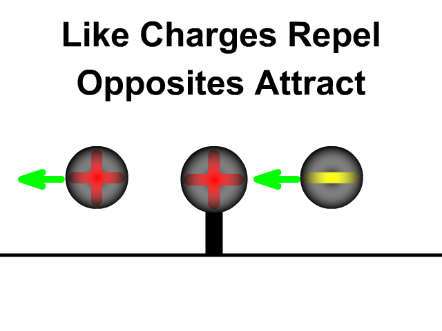

> **Электростатика** — раздел физики, изучающий взаимодействие неподвижных электрических зарядов и создаваемые ими электрические поля.  
> **Электрический заряд** — физическая величина, определяющая интенсивность электромагнитного взаимодействия тел.

### 1.2. Статическое электричество и электрический ток

> **Статическое электричество** — совокупность явлений, связанных с возникновением и взаимодействием неподвижных электрических зарядов.  
> **Электрический ток** — упорядоченное (направленное) движение электрических зарядов.

Различие между статическим электричеством и электрическим током:

- **Статические заряды** создают вокруг себя **электрическое поле**, которое взаимодействует с другими заряженными объектами.
- **Движущиеся заряды (ток)** создают вокруг себя **магнитное поле**.

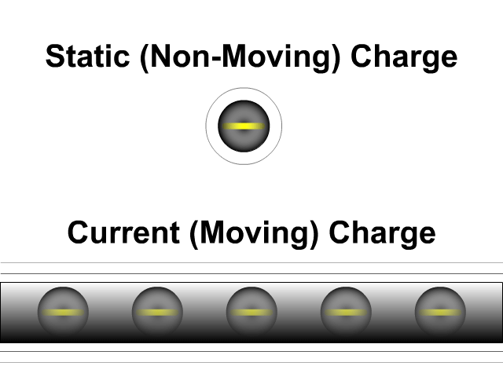

Для возникновения тока необходимы:

- постоянный источник электронов (отрицательный полюс);
- область, в которую электроны могут перемещаться (положительный полюс).

> **Электрическое поле** — особая форма материи, создаваемая неподвижными зарядами и действующая на другие заряды с силой.  
> **Магнитное поле** — особая форма материи, создаваемая движущимися зарядами (током) и действующая на другие движущиеся заряды.

### 1.3. Молния как пример статического электричества

Молния — это результат накопления зарядов в облаках и последующего пробоя воздушного промежутка. Положительные и отрицательные заряды в облаках разделяются, и при достижении критической разности потенциалов происходит разряд — **молния**. По своей природе молния представляет собой форму **заземления** — процесса, при котором накопленный заряд нейтрализуется через проводящий путь к земле.

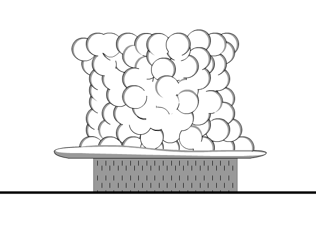

---

## 2. Строение атома

### 2.1. Состав атома

Атом состоит из **ядра** и **электронных оболочек** — областей пространства, в которых с наибольшей вероятностью находятся электроны.

В ядре находятся:

- **протоны** — частицы с положительным зарядом;
- **нейтроны** — частицы без заряда (нейтральные).

Ядро удерживается благодаря **сильным ядерным взаимодействиям**.

Вокруг ядра движутся **электроны** — частицы с отрицательным зарядом.

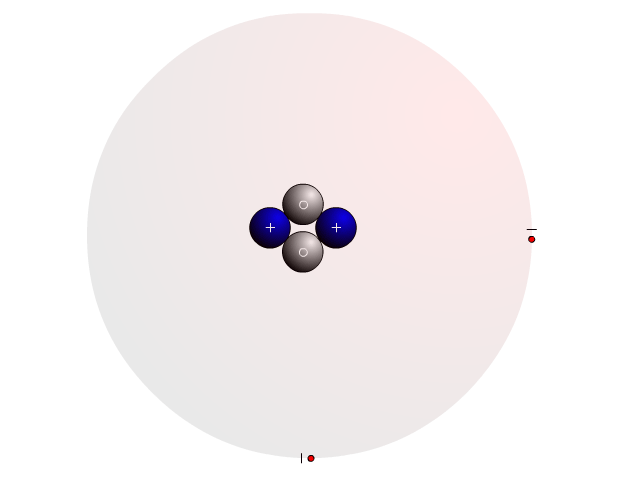

### 2.2. Масса и заряд субатомных частиц

| Частица  | Масса            | Заряд             |
|----------|------------------|-------------------|
| Протон   | $1{,}673 \cdot 10^{-27} \text{ кг}$ | $+1{,}602 \cdot 10^{-19} \text{ Кл}$ |
| Нейтрон  | $1{,}675 \cdot 10^{-27} \text{ кг}$ | $0 \text{ Кл}$     |
| Электрон | $9{,}109 \cdot 10^{-31} \text{ кг}$ | $-1{,}602 \cdot 10^{-19} \text{ Кл}$ |

### 2.3. Нейтральность атома и стабильность

Каждый атом содержит одинаковое количество протонов и электронов, поэтому в целом атом **электрически нейтрален**. Электроны могут участвовать в образовании ковалентных связей с другими атомами, что позволяет атомам достигать стабильного состояния.

> **Стабильный атом** — атом, у которого внешняя электронная оболочка (энергетический уровень) полностью заполнена определённым для неё числом электронов.

### 2.4. Роль периодической таблицы

Периодическая таблица элементов позволяет определить:

- количество протонов в ядре атома (атомный номер);
- количество электронов в нейтральном атоме (равно числу протонов);
- реакционную способность элемента;
- с какими элементами данный атом может вступать в реакции для достижения стабильного состояния.

Важно учитывать, что **электроны** могут относительно легко переходить от одного атома к другому, в то время как **протоны** остаются в ядре и не перемещаются при электрических взаимодействиях.

### 2.5. Приобретение заряда объектом

- **Отрицательно заряженный объект** — объект, который приобрёл больше электронов, чем у него протонов.
- **Положительно заряженный объект** — объект, который потерял часть электронов, и теперь у него меньше электронов, чем протонов.

При этом выполняется **закон сохранения заряда**: если один объект приобрёл электроны и стал отрицательным, то другой объект потерял такое же количество электронов и стал положительным на ту же величину.

---

## 3. Электризация трением

### 3.1. Сродство к электрону

Различные материалы обладают разной способностью удерживать электроны. Это свойство называют **сродством к электрону**.

> **Сродство к электрону** — способность материала удерживать электроны.

- **Материалы с большим сродством к электрону** — удерживают электроны сильнее, при трении часто приобретают электроны и становятся отрицательно заряженными.
- **Материалы с малым сродством к электрону** — удерживают электроны слабее, при трении часто теряют электроны и становятся положительно заряженными.

### 3.2. Механизм электризации трением

При трении двух материалов друг о друга электроны «выбиваются» из мест закрепления. Материал с большим сродством к электрону забирает электроны у материала с меньшим сродством.

В результате:

- объект, получивший электроны, заряжается **отрицательно**;
- объект, потерявший электроны, заряжается **положительно**;
- суммарный заряд системы из двух объектов остаётся **нейтральным**.

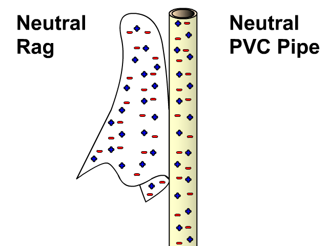

### 3.3. Величина элементарного заряда

Заряд одного электрона и одного протона по модулю одинаков:

$$e = 1{,}6 \cdot 10^{-19} \text{ Кл}$$

- Заряд одного электрона: $-1{,}6 \cdot 10^{-19} \text{ Кл}$
- Заряд одного протона: $+1{,}6 \cdot 10^{-19} \text{ Кл}$

Эта величина используется для расчёта заряда объекта, если известно количество перешедших электронов.

### 3.4. Пример задачи

**Условие.** Вы расчёсываете волосы пластиковой расчёской в сухой день. Расчёска приобрела $2{,}3 \cdot 10^4$ электронов. Заряд одного электрона равен $-1{,}6 \cdot 10^{-19} \text{ Кл}$.

**Вопрос 1.** Что обладает большим сродством к электрону — волосы или пластиковая расчёска? Почему?

**Решение.** Пластиковая расчёска приобрела электроны, значит, она имеет большее сродство к электрону, чем волосы.

**Вопрос 2.** Считая, что до расчёсывания и волосы, и расчёска были нейтральными, определите заряд расчёски после расчёсывания.

**Решение.** Заряд расчёски:

$$Q = n \cdot e = 2{,}3 \cdot 10^4 \cdot (-1{,}6 \cdot 10^{-19}) = -3{,}68 \cdot 10^{-15} \text{ Кл}$$

**Вопрос 3.** Определите заряд волос после расчёсывания.

**Решение.** По закону сохранения заряда заряд волос будет равен по модулю и противоположен по знаку заряду расчёски:

$$Q_{\text{волос}} = +3{,}68 \cdot 10^{-15} \text{ Кл}$$

---

## 4. Электрические проводники

> **Электрический проводник** — материал, в котором электроны могут свободно перемещаться.

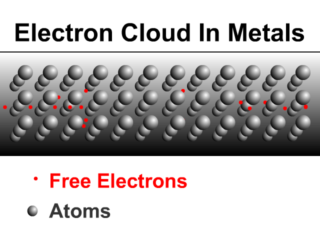

### 4.1. Почему металлы являются хорошими проводниками?

Металлы хорошо проводят электричество благодаря особенностям распределения электронов. В металлах атомы образуют кристаллическую решётку, а часть электронов слабо связана с ядрами и может свободно перемещаться по всему объёму металла. Такие электроны называют **свободными электронами**, а их совокупность — **электронным облаком**.

### 4.2. Металлы с наилучшей проводимостью

Наиболее проводящие металлы (в порядке убывания проводимости):

1. Серебро
2. Медь
3. Золото
4. Алюминий

### 4.3. Распределение заряда между проводниками

При контакте двух одинаковых проводников заряд распределяется между ними **поровну**. Если к заряженному проводнику прикоснуться таким же по форме и размерам нейтральным проводником, то исходный заряд разделится пополам между ними.

**Пример.** Объект 1 имеет заряд $Q$ и контактирует с нейтральным объектом 2. После контакта заряд каждого объекта:

$$Q_1 = Q_2 = \frac{Q}{2}$$

Если затем объект 2 контактирует с нейтральным объектом 3, то заряд снова делится пополам:

$$Q_3 = \frac{Q/2}{2} = \frac{Q}{4}$$

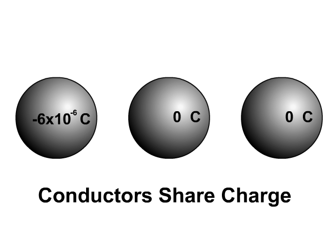

---

## 5. Электрические изоляторы

> **Электрический изолятор** — материал, который не позволяет электронам свободно перемещаться.

### 5.1. Применение изоляторов

Изоляторы используются для:

- покрытия проводов (изоляция);
- изготовления защитных перчаток для электриков;
- предотвращения поражения электрическим током.

Именно благодаря изоляции проводов можно подключать устройства к розетке без риска поражения током.

### 5.2. Распространённые изоляторы

- Резина
- Пластик
- Стекло
- Воздух
- Дерево

---

## 6. Электризация индукцией

### 6.1. Определение

**Электризация индукцией** — это возникновение временного заряда в нейтральном объекте при приближении к нему заряженного объекта без непосредственного контакта.

> **Электростатическая индукция** — <mark><strong>явление перераспределения зарядов в проводнике под действием внешнего электрического поля без контакта с источником поля.</strong></mark>

### 6.2. Основные характеристики электризации индукцией

- **Без контакта.** Заряженный объект не касается нейтрального.
- **Противоположный заряд.** В нейтральном объекте индуцируется заряд, противоположный заряду поднесённого объекта.
- **Временный эффект.** Заряд исчезает после удаления заряженного объекта, так как электроны не передаются между объектами.

### 6.3. Правила индукции

| Заряд поднесённого объекта | Индуцированный заряд |
|---------------------------|----------------------|
| Положительный             | Отрицательный        |
| Отрицательный             | Положительный        |

| 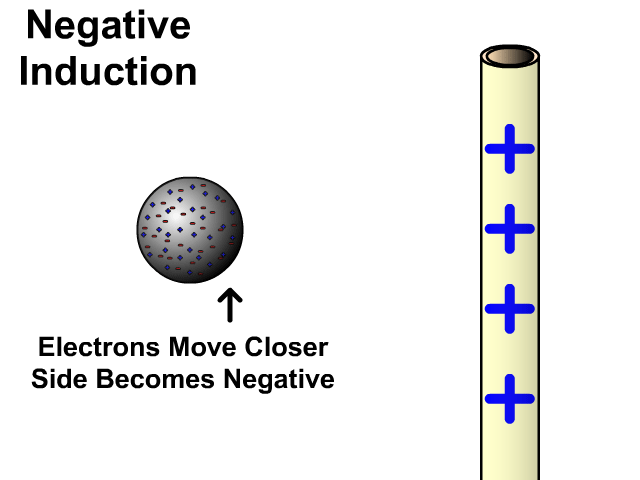 | 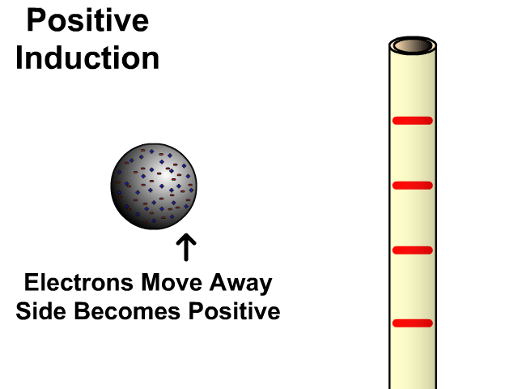 |
|---------------------------------------|---------------------------------------------------|

---

## 7. Электризация соприкосновением (проводимостью)

### 7.1. Определение

**Электризация соприкосновением (проводимостью)** — это возникновение заряда в нейтральном объекте при непосредственном контакте с заряженным объектом.

> **Электризация проводимостью** — передача электрического заряда от заряженного тела к нейтральному при их непосредственном контакте.

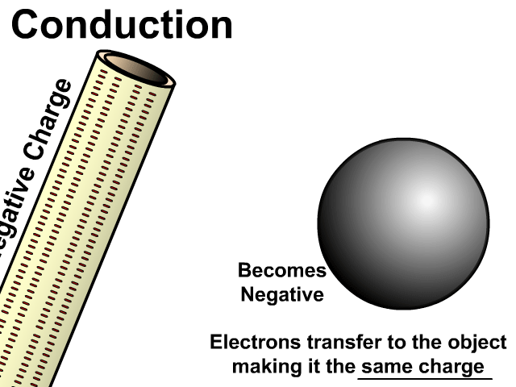

### 7.2. Основные характеристики электризации соприкосновением

- **Контакт обязателен.** Заряженный объект касается нейтрального.
- **Одинаковый заряд.** В нейтральном объекте возникает заряд того же знака, что и у заряженного объекта.
- **Постоянный эффект.** Заряд сохраняется на объекте до тех пор, пока он не будет заземлён.

### 7.3. Механизм передачи заряда

- **Отрицательно заряженный объект** передаёт часть своих электронов нейтральному объекту, делая его отрицательным.
- **Положительно заряженный объект** притягивает электроны из нейтрального объекта, делая его положительным.

### 7.4. Правила электризации соприкосновением

| Заряд контактирующего объекта | Заряд, возникающий в нейтральном объекте |
|-------------------------------|------------------------------------------|
| Отрицательный                 | Отрицательный                            |
| Положительный                 | Положительный                            |

---

## 8. Сравнение индукции и проводимости

| Характеристика | Индукция | Проводимость |
|----------------|----------|--------------|
| Контакт        | Нет      | Да           |
| Знак заряда    | Противоположный | Одинаковый |
| Перенос электронов | Нет (временный эффект) | Да (постоянный эффект) |

### 8.1. Модель индукции

При поднесении отрицательно заряженного объекта к нейтральному проводнику:

- электроны в нейтральном проводнике **отталкиваются** от отрицательного объекта;
- ближняя к заряженному объекту сторона становится **положительной**;
- переноса электронов между объектами не происходит;
- после удаления заряженного объекта нейтральность восстанавливается.

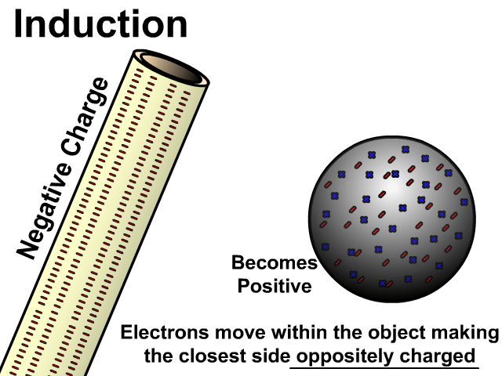

### 8.2. Модель проводимости

При контакте отрицательно заряженного объекта с нейтральным:

- электроны **переходят** с заряженного объекта на нейтральный;
- нейтральный объект получает избыток электронов и становится **отрицательным**;
- электроны остаются на объекте после разъединения.

---

## 9. Электроскоп: последовательное применение индукции и проводимости

> **Электроскоп** — прибор для обнаружения электрического заряда и определения его знака.

### 9.1. Устройство электроскопа

Электроскоп состоит из:

- проводящей сферы сверху;
- проводящего стержня, идущего от сферы внутрь колбы;
- двух лёгких проводящих листков, находящихся в тесном контакте в нижней части стержня.

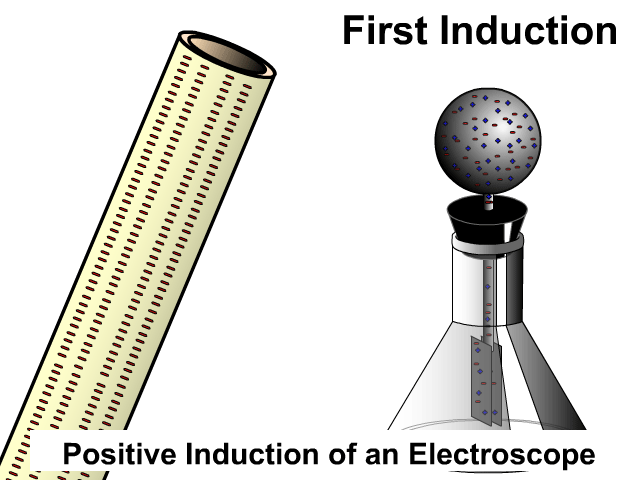

### 9.2. Принцип работы

Когда листки электроскопа заряжаются одноимённым зарядом, они **отталкиваются** друг от друга и расходятся. По углу расхождения можно судить о величине заряда.

### 9.3. Последовательность индукции и проводимости

1. **Индукция.** При приближении заряженного объекта (например, ПВХ-трубки) к сфере электроскопа электроны в сфере перемещаются (отталкиваются или притягиваются), что приводит к перераспределению зарядов внутри электроскопа без контакта.
2. **Проводимость.** При касании заряженным объектом сферы электроны переходят с объекта на электроскоп (или наоборот), и электроскоп приобретает постоянный заряд.

---

## 10. Заземление

> **Заземление** — процесс удаления электрического заряда путём создания проводящего пути от заряженного объекта к земле.

### 10.1. Принцип заземления

Земля способна как принимать, так и отдавать электроны, благодаря чему она нейтрализует заряженные объекты:

- **Отрицательно заряженный объект** — электроны переходят с объекта в землю до полной нейтрализации.
- **Положительно заряженный объект** — электроны переходят из земли на объект до полной нейтрализации.

### 10.2. Молния как пример заземления

Молния — это естественная форма заземления. Накопленный в облаке заряд находит проводящий путь к земле, что сопровождается яркой вспышкой (дуговым разрядом) и звуком (громом). В меньших масштабах подобное явление происходит при ударе статическим электричеством от человека к другому объекту.

---

## 11. Интерактивное моделирование

Для наблюдения за процессами электризации трением, взаимодействия зарядов и индукции можно использовать интерактивную симуляцию PhET.

https://phet.colorado.edu/sims/html/balloons-and-static-electricity/latest/balloons-and-static-electricity_all.html

https://phet.colorado.edu/sims/html/john-travoltage/latest/john-travoltage_all.html

---

## FAQ

**Вопрос 1: Чем отличается статическое электричество от электрического тока?**

Статическое электричество — это неподвижные заряды, которые создают электрическое поле. Электрический ток — это направленное движение электронов, создающее магнитное поле. Для возникновения тока нужны источник электронов и область, куда они могут перемещаться.

**Вопрос 2: Почему при трении один объект заряжается отрицательно, а другой положительно?**

Различные материалы имеют разное сродство к электрону. Материал с большим сродством забирает электроны у материала с меньшим сродством, становясь отрицательным, а второй объект теряет электроны и становится положительным.

**Вопрос 3: Как вычислить заряд объекта, если известно число перешедших электронов?**

Заряд вычисляется по формуле $Q = n \cdot e$, где $n$ — число электронов, $e = -1{,}6 \cdot 10^{-19} \text{ Кл}$ — заряд одного электрона.

**Вопрос 4: В чём разница между электризацией индукцией и проводимостью?**

При индукции заряд возникает без контакта, имеет противоположный знак и исчезает после удаления заряженного объекта. При проводимости заряд передаётся при контакте, имеет тот же знак и сохраняется на объекте.

**Вопрос 5: Что такое заземление и зачем оно нужно?**

Заземление — это создание проводящего пути от заряженного объекта к земле для нейтрализации заряда. Земля принимает или отдаёт электроны, устраняя избыточный заряд. Заземление используется для защиты от поражения током и снятия статического электричества.

**Вопрос 6: Почему металлы являются хорошими проводниками?**

Металлы имеют свободные электроны, слабо связанные с ядрами атомов. Эти электроны образуют «электронное облако» и могут свободно перемещаться по всему объёму металла, обеспечивая проводимость.