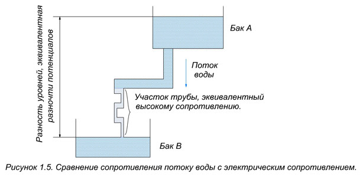

# Сопротивление электрическому току

## 1. Понятие сопротивления

Свободные электроны в проводнике, перемещаясь по цепи, сталкиваются с атомами. Атомы препятствуют потоку электронов, уменьшая значение электрического тока. Это препятствие называется **сопротивлением электрическому току**.

> **Сопротивление** — свойство материала препятствовать прохождению электрического тока; обозначается буквой $R$.

Любой материал характеризуется либо сопротивлением, либо обратной величиной — **электрической проводимостью**:

$$G = \frac{1}{R}$$

где $G$ — проводимость, $R$ — сопротивление.

---

## 2. Аналогия с потоком воды

Сопротивление подобно тому, как если бы в знакомой схеме потока воды, движущегося из бака А в бак В, заменить участок трубопровода на более тонкий. Это, конечно, уменьшит общий поток воды, поступающий в бак В.

*Рис. 1 — Сопротивление электрическому току (аналогия с потоком воды)*

---

## 3. Факторы, влияющие на сопротивление

Любой материал обладает сопротивлением, которое зависит от:

- **свойств самого материала**;
- **температуры**;
- **размера** (длины и площади поперечного сечения);
- **формы**.

---

## 4. Проводники и диэлектрики с точки зрения сопротивления

| Тип материала | Сопротивление | Количество свободных электронов | Примеры |
|---------------|---------------|----------------------------------|---------|
| Проводники | Низкое | Много | Золото, медь, серебро, алюминий, платина |
| Диэлектрики (изоляторы) | Высокое | Мало | Пластмасса, резина, стекло, слюда |

Материалы с **низким** сопротивлением называются **проводниками**: они содержат много свободных электронов и оказывают малое сопротивление току.

Материалы с **высоким** сопротивлением называются **диэлектриками** или **изоляторами**: они содержат мало свободных электронов, что и обусловливает их высокое сопротивление.

---

## 5. Единица измерения сопротивления

Единица измерения сопротивления — **Ом** (обозначается греческой буквой $\Omega$). Названа в честь немецкого учёного-физика **Георга Симона Ома**.

> **Один Ом ($1\ \Omega$)** — сопротивление материала, при котором приложенное напряжение в **один вольт** ($1\ \text{В}$) позволяет протекать току, равному **одному амперу** ($1\ \text{А}$).

Это соотношение выражается законом Ома:

$$R = \frac{U}{I}$$

где:

- $R$ — сопротивление, Ом ($\Omega$);
- $U$ — напряжение, В;
- $I$ — сила тока, А.

---

## FAQ

**1. Что такое сопротивление?**  
Сопротивление — это свойство материала препятствовать прохождению электрического тока; обозначается буквой $R$.

**2. Что такое проводимость?**  
Проводимость — величина, обратная сопротивлению: $G = \dfrac{1}{R}$.

**3. От чего зависит сопротивление материала?**  
От свойств материала, температуры, размеров (длины и сечения) и формы.

**4. Почему проводники имеют низкое сопротивление?**  
Потому что в проводниках много свободных электронов, которые легко переносят ток.

**5. Почему диэлектрики имеют высокое сопротивление?**  
Потому что в диэлектриках очень мало свободных электронов.

**6. В каких единицах измеряется сопротивление?**  
В омах ($\Omega$).

**7. Что такое один Ом?**  
Это сопротивление, при котором напряжение $1\ \text{В}$ создаёт ток $1\ \text{А}$.