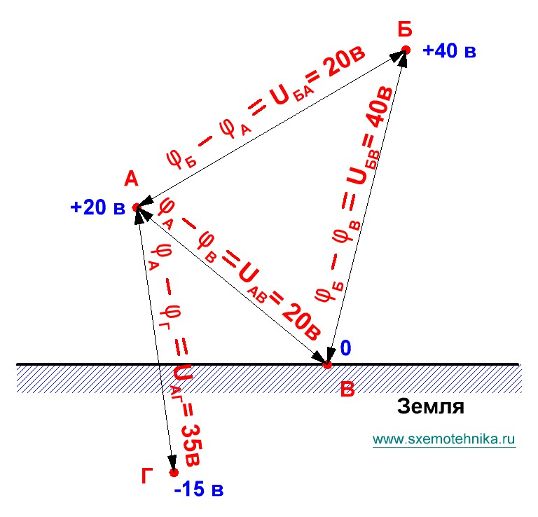

# Потенциал электрического поля

## 1. Зависимость энергии поля от зарядов

В зависимости от количества зарядов и их величины изменяется энергия электрического поля, создаваемого этими зарядами. Величина энергии поля, образованного одним зарядом, отличается от энергии поля, образованного двумя или тремя такими же зарядами.

На практике часто приходится сравнивать различные по величине поля. Сравнение производится по действию полей на **единичный положительный заряд** (так называемый **пробный заряд**).

> **Единичный заряд** — заряд, величина которого равна одной единице заряда.

Пусть поле образовано некоторым положительным зарядом. Чтобы внести в какую-то точку этого поля единичный положительный заряд, необходимо затратить определённую работу на преодоление силы отталкивания между основным и единичным зарядами. Потенциальная энергия поля при этом **возрастает**.

Если внести единичный заряд в другое поле, образованное в два раза большим электрическим зарядом, придётся затратить **большую работу**, чем в первом случае. Следовательно, и потенциальная энергия поля возрастёт больше.

---

## 2. Электрический потенциал

Для характеристики поля в электротехнике вводится специальное понятие — **электрический потенциал**.

> **Электрический потенциал** некоторой точки поля численно равен работе, затрачиваемой при внесении единичного положительного заряда из-за пределов поля в данную точку.

Потенциал точки поля обозначается буквой $\varphi$.

Единица измерения потенциала — **вольт** (В). Название дано в честь итальянского физика **Алессандро Вольта** (1745–1827), открывшего закон взаимодействия электрических токов и предложившего первую гипотезу для объяснения магнитных свойств вещества.

Характеристика поля с помощью электрического потенциала очень удобна: она позволяет сравнивать не только различные электрические поля, но и отдельные точки одного и того же поля. Вместо фразы «шар А наэлектризован сильнее, чем шар Б» можно сказать: «потенциал шара А выше потенциала шара Б».

---

## 3. Точка нулевого потенциала

Электрическое поле может создаваться не только положительным или отрицательным зарядом, но и их совокупностью. В таком поле отдельные точки могут иметь как **отрицательные**, так и **положительные** потенциалы.

Чтобы сравнивать потенциалы различных точек, введено условное понятие о **точке с нулевым потенциалом**: считается, что одна из точек (или несколько точек) имеет потенциал, равный нулю. Потенциалы остальных точек определяются относительно точки нулевого потенциала.

Этот метод аналогичен методу измерения температур: определённая температура (температура тающего льда) принимается за нулевую точку, и относительно неё определяется температура других тел.

> В электротехнике условно считают, что **нулевой потенциал имеет поверхность земли**.

- Если потенциал точки **выше** потенциала земли — точка обладает **положительным** потенциалом.
- Если потенциал точки **ниже** потенциала земли — точка обладает **отрицательным** потенциалом.

---

## 4. Разность потенциалов (напряжение)

Измеряя потенциалы различных точек поля относительно земли, можно убедиться, что они неодинаковы. Значит, между отдельными точками может быть некоторая **разность потенциалов**.

> **Напряжение** — разность потенциалов между двумя точками электрического поля.

Напряжение, как и потенциал, измеряется в **вольтах**.

### Пример

На рис. 1 условно показаны четыре точки:

| Точка | Потенциал |
|-------|-----------|
| А | $+20\ \text{В}$ |
| Б | $+40\ \text{В}$ |
| В (земля) | $0\ \text{В}$ |
| Г | $-15\ \text{В}$ |

*Рис. 1 — Разность потенциалов между различными точками электрического поля*

Разности потенциалов (напряжения):

$$U_{БА} = 40 - 20 = 20\ \text{В}$$

$$U_{АВ} = 20 - 0 = 20\ \text{В}$$

$$U_{БВ} = 40 - 0 = 40\ \text{В}$$

$$U_{АГ} = 20 - (-15) = 35\ \text{В}$$

Потенциал точки Б выше потенциалов точек А, В и Г. Потенциал точки А выше потенциалов точек В и Г, но ниже потенциала точки Б. Потенциал точки В ниже потенциалов точек А и Б, но выше потенциала точки Г.

Следует обратить внимание: точки **отрицательного** потенциала имеют более низкий потенциал, чем точки **нулевого** потенциала.

---

## 5. Общее определение напряжения

Рассмотрим две точки А и Б электрического поля. Допустим:

- потенциал точки А равен $\varphi_A$;
- потенциал точки Б равен $\varphi_Б$.

Потенциал точки А (или Б) определяется работой, которую необходимо затратить на перенос единичного положительного заряда из-за пределов поля в точку А (или Б). Если для переноса единичного положительного заряда в точку А и в точку Б требуется затратить различную по величине работу, то $\varphi_A \neq \varphi_Б$, и между точками А и Б существует разность потенциалов, или напряжение.

> Напряжение $U$ определяется разностью $\varphi_A - \varphi_Б$ и равно работе, совершаемой силами поля при переносе единичного положительного заряда из точки А в точку Б.

$$U = \varphi_A - \varphi_Б$$

---

## FAQ

**1. Что такое электрический потенциал?**  
Потенциал точки поля численно равен работе, затрачиваемой при внесении единичного положительного заряда из-за пределов поля в данную точку.

**2. В каких единицах измеряется потенциал?**  
В вольтах (В).

**3. Какая точка принимается за нулевой потенциал?**  
В электротехнике условно принимают, что нулевой потенциал имеет поверхность земли.

**4. Что такое напряжение?**  
Напряжение — это разность потенциалов между двумя точками электрического поля.

**5. Как вычислить напряжение между двумя точками?**  
Напряжение равно разности потенциалов: $U = \varphi_A - \varphi_Б$.

**6. Может ли потенциал быть отрицательным?**  
Да, если потенциал точки ниже потенциала земли, он считается отрицательным.

**7. Чем удобна характеристика поля через потенциал?**  
Она позволяет сравнивать как разные поля, так и отдельные точки одного поля, заменяя качественные описания количественными.