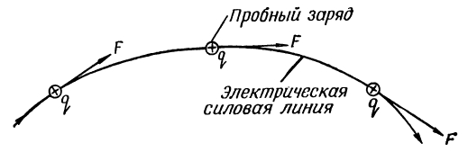

# Напряжённость электрического поля и его графическое изображение

## 1. Определение напряжённости

На единичный положительный заряд, помещённый в любую точку электрического поля, действует некоторая сила.

> **Напряжённость электрического поля** — сила, действующая на единичный неподвижный положительный заряд в данной точке поля.

Напряжённость поля обозначается буквой $E$ и измеряется в **вольтах на метр** (В/м).

Если в данной точке поля находится заряд $q$, и поле действует на него с силой $F$, то напряжённость поля определяется по формуле:

$$E = \frac{F}{q}$$

Если в данной точке находится **единичный заряд** ($q = 1$), то:

$$E = F$$

Это соответствует определению напряжённости электрического поля.

---

## 2. Пример расчёта

**Условие.** В электрическом поле находится заряд $q = 0{,}004$ Кл. На заряд действует сила $F = 4$ Н. Определить напряжённость электрического поля.

**Решение.**

$$E = \frac{F}{q} = \frac{4}{0{,}004} = 1000\ \text{В/м}$$

**Ответ:** напряжённость поля $E = 1000\ \text{В/м}$.

---

## 3. Единицы измерения

> **Кулон (Кл)** — заряд, переносимый через поперечное сечение проводника за одну секунду при неизменяющейся силе тока, равной одному амперу.

> **Ньютон (Н)** — единица силы, под влиянием которой тело массой $1$ кг приобретает ускорение $1\ \text{м/с}^2$.

Названа в честь английского физика, механика, астронома и математика **Исаака Ньютона** (1642–1727).

---

## 4. Различие между напряжённостью и напряжением

| Понятие | Характеристика |
|---------|----------------|
| **Напряжённость поля** $E$ | Характеризует поле в данной точке через силу, действующую на единичный положительный заряд |
| **Напряжение** $U$ | Разность потенциалов между двумя точками поля; работа по переносу единичного положительного заряда из одной точки в другую |

---

## 5. Графическое изображение электрического поля

Вокруг электрического заряда существует электрическое поле. Пробный заряд под действием поля всегда перемещается в определённом направлении:

- если поле создано **положительно** заряженным шаром — пробный положительный заряд **отталкивается** и движется по направлению радиуса шара;
- если шар заряжен **отрицательно** — пробный положительный заряд **притягивается**, но также движется вдоль радиуса;
- в поле, созданном несколькими зарядами, траектория пробного заряда более сложная.

### 5.1. Электрические силовые линии

В электрическом поле можно провести линии, касательные к которым в каждой точке совпадают с направлением силы $F$, действующей на пробный заряд.

> **Электрические силовые линии** — условные линии, касательные к которым в каждой точке совпадают с направлением силы, действующей на пробный заряд.

*Рис. 1 — Электрическая силовая линия*

Электрические силовые линии — это **графическое изображение** реально существующего электрического поля. Они позволяют наглядно охарактеризовать:

- направление движения зарядов в поле;
- характер взаимодействия заряженных тел.

---

## 6. Правила построения силовых линий

При графическом построении электрического поля необходимо помнить:

1. Силовые линии направлены **от положительных зарядов к отрицательным** (по направлению движения пробного положительного заряда).
2. Силовые линии **начинаются** на положительном заряде и **заканчиваются** на отрицательном.
3. Силовые линии всегда **перпендикулярны** поверхности заряженного тела.

*Рис. 2 — Силовые линии электрического поля точечных зарядов: слева — положительного, справа — отрицательного*

*Рис. 3 — Силовые линии электрического поля, образованного двумя зарядами: слева — разноимёнными, справа — одноимёнными*

---

## 7. Движение зарядов в электрическом поле

Следует запомнить:

- **Положительный заряд**, внесённый в электрическое поле, перемещается от точек с **более высоким** потенциалом к точкам с **более низким** потенциалом.
- **Отрицательный заряд**, внесённый в электрическое поле, перемещается от точек с **более низким** потенциалом к точкам с **более высоким** потенциалом.

---

## FAQ

**1. Что такое напряжённость электрического поля?**  
Это сила, действующая на единичный неподвижный положительный заряд в данной точке поля.

**2. В каких единицах измеряется напряжённость?**  
В вольтах на метр (В/м).

**3. По какой формуле вычисляется напряжённость?**  
$E = \dfrac{F}{q}$, где $F$ — сила, $q$ — заряд.

**4. Чем напряжённость отличается от напряжения?**  
Напряжённость характеризует поле в точке через силу, а напряжение — разность потенциалов между двумя точками.

**5. Что такое электрические силовые линии?**  
Условные линии, касательные к которым совпадают с направлением силы, действующей на пробный заряд.

**6. Куда направлены силовые линии?**  
От положительных зарядов к отрицательным; они перпендикулярны поверхности заряженного тела.

**7. Как движется положительный заряд в электрическом поле?**  
От точек с более высоким потенциалом к точкам с более низким потенциалом.