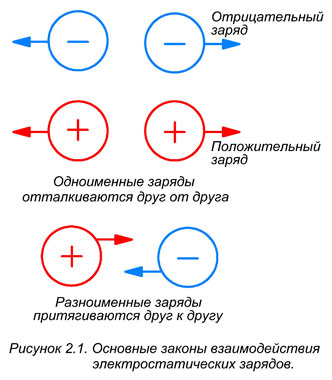

# Взаимодействие электрических зарядов

## 1. Основные законы взаимодействия зарядов

Два одноимённых заряда — будь то два протона либо два электрона — сопротивляются сближению и стремятся удалиться друг от друга. Этот процесс называется **отталкиванием**.

> **Первый закон взаимодействия зарядов:** заряды с одинаковым знаком (одноимённые) **отталкиваются** друг от друга (рис. 2.1).

> **Второй закон взаимодействия зарядов:** разноимённые заряды (с разным знаком) **притягиваются** друг к другу.

*Рис. 2.1 — Взаимодействие электрических зарядов*

---

## 2. Почему электрон не падает на ядро

Отрицательно заряженные электроны притягиваются к положительно заряженным протонам в ядре атома. Однако электрон остаётся на орбите и не падает на ядро.

Это происходит потому, что сила притяжения электрона уравновешивается **центростремительной силой**, возникающей за счёт вращения электрона вокруг ядра.

---

## 3. Факторы, влияющие на силу взаимодействия

Величина сил отталкивания и притяжения между двумя заряженными телами зависит от:

- **расстояния между телами**;
- **величины их зарядов**.

---

## 4. Единица измерения заряда

Заряд отдельного электрона очень мал, поэтому на практике не используется. Принятой в мире единицей измерения заряда является **кулон** (Кл). Она названа в честь французского учёного **Шарля Кулона** и обозначается буквой $Q$.

> **Один кулон** равен заряду $6{,}28 \cdot 10^{18}$ электронов.

---

## 5. Возникновение электрического тока

Электрические заряды возникают за счёт **смещения электронов**. Когда в одной точке имеется **дефицит** электронов, а в другой — **избыток**, между этими точками возникает **разность потенциалов**.

Если две точки, между которыми существует разность потенциалов, соединить проводником, по проводнику потекут электроны.

> **Электрический ток** — упорядоченный (направленный) поток электронов, возникающий в проводнике под действием разности потенциалов.

---

## FAQ

**1. Как взаимодействуют одноимённые заряды?**  
Одноимённые заряды отталкиваются.

**2. Как взаимодействуют разноимённые заряды?**  
Разноимённые заряды притягиваются.

**3. Почему электрон не падает на ядро атома?**  
Сила притяжения электрона уравновешивается центростремительной силой, возникающей из-за вращения электрона вокруг ядра.

**4. От чего зависит сила взаимодействия зарядов?**  
От расстояния между заряженными телами и величины их зарядов.

**5. В каких единицах измеряется заряд?**  
В кулонах (Кл).

**6. Что такое один кулон?**  
Это заряд, равный $6{,}28 \cdot 10^{18}$ зарядов электронов.

**7. Что такое электрический ток?**  
Упорядоченный поток электронов, возникающий при соединении проводником точек с разностью потенциалов.