

<strong>Кратко</strong>
<table><tr><td>

**Узлы, ветви, контуры и законы Кирхгофа**

**Узлы и правило токов:** Узел — это точка соединения нескольких проводников. Согласно **первому правилу Кирхгофа**, сумма токов, входящих в узел, равна сумме токов, выходящих из него (алгебраическая сумма токов в узле равна нулю). Ветвь — это участок цепи с одним значением тока, а контур — любой замкнутый путь в цепи.

**Второе правило Кирхгофа:** Сумма напряжений (падений потенциала) в любом замкнутом контуре цепи равна нулю.

**Закон Ома**

Этот закон связывает три ключевые величины: напряжение (U), ток (I) и сопротивление (R). Формула: **U = I × R**. С его помощью можно рассчитать необходимое сопротивление.

**Практический пример:** для подключения светодиода (требующего 2 В и 20 мА) к батарейке 9 В необходимо «погасить» лишние 7 В на резисторе. Расчет: R = 7 В / 0,02 А = 350 Ом (используется ближайший стандартный номинал 390 Ом). Также рассчитывается мощность резистора (P = U × I), чтобы он не перегрелся.

**Электрические измерения**

Для измерений используется **мультиметр (тестер)** — цифровой или стрелочный прибор с щупами (красный «+», черный «-»). Черный щуп всегда подключается в гнездо «COM».

- **Измерение напряжения:** Прибор подключается параллельно участку цепи (без разрыва цепи) в режиме VDC.
- **Измерение тока:** Более сложная операция. Цепь необходимо разорвать и подключить прибор последовательно (в разрыв), чтобы ток проходил через тестер. Используется гнездо для тока (мА или А).

**Ограничения аналогии с водой**

Аналогия тока с потоком воды полезна, но несовершенна. Ток не «протекает» по проводу, как вода по трубе (где сначала встречает одно препятствие, потом другое). В реальности значение тока в любой точке неразветвленного контура одинаково, поэтому резистор одинаково ограничивает ток, независимо от того, стоит он до или после светодиода.

</td></tr></table>

# Узлы, ветви и контуры

## 1. Первое правило Кирхгофа (правило токов)

Рассмотрим особенности поведения напряжения и тока, что полезно для понимания работы электронных схем. Соединим между собой выводы (также называемые клеммами) нескольких диполей.

> **Узел** — <mark><strong>особая точка электрической цепи, в которой соединены выводы нескольких диполей.</strong></mark>

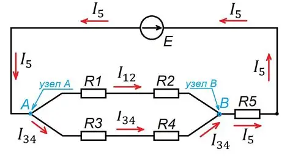

Если нет элемента, то не считается узлом:

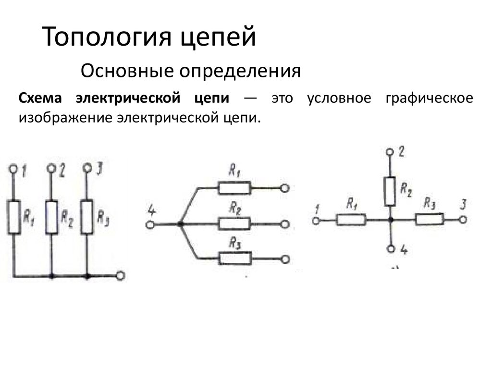

Используем гидравлическую аналогию: соединение в одной точке трёх труб. <mark><strong>Если вода поступает в одну трубу, она будет вытекать из двух остальных.</strong></mark> Если вода в узел соединения поступает из двух труб, <mark><strong>в точке соединения водяное давление стабилизируется и равномерно распределится в трубах</strong></mark>, доступных для выхода. Вода не может выходить из всех трёх труб одновременно, так как она не может материализоваться из воздуха. Ситуация, когда в узел соединения вода поступала бы из всех подключённых к нему труб, также невозможна.

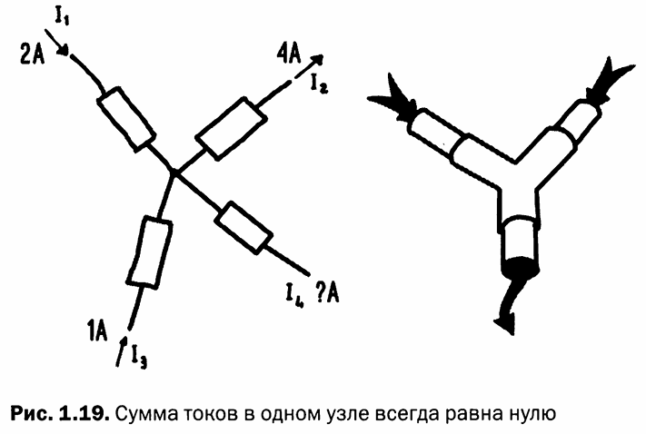

*Рис. 1.19 — Сумма токов в одном узле всегда равна нулю*

Такое же поведение наблюдается в поведении токов: в один узел могут входить и выходить несколько потоков электронов. <mark><strong>Суммарная сила входящих в узел токов равна суммарной силе исходящих из узла токов.</strong></mark>

Установим правило: ток, поступающий в узел, имеет положительный знак, а выходящий из узла ток — отрицательный знак. Сумма всех токов в узле всегда должна равняться нулю.

> **Первое правило Кирхгофа** — <mark><strong>алгебраическая сумма токов в любом узле электрической цепи равна нулю:</strong></mark>
> $$\sum I = 0$$

Для узла, показанного на рис. 1.19, где токи равны, согласно правилу Кирхгофа:

$$I_1 - I_2 + I_3 - I_4 = 0$$

Ток $I_3$ имеет положительный знак, поэтому, в соответствии с установленным правилом, ток поступает в узел.

## 2. Ветви и контуры

Электрическая цепь состоит из узлов, ветвей и компонентов.

> **Ветвь** — <mark><strong>участок цепи, по которому течёт ток одного значения.</strong></mark>

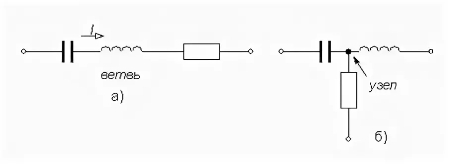

> **Контур** — <mark><strong>замкнутый путь, состоящий из нескольких ветвей и узлов электрической цепи. Термин «замкнутый путь» означает, что, начав с некоторого узла цепи и однократно пройдя по нескольким ветвям и узлам, можно вернуться в исходный узел.</strong></mark>

Электрическая цепь может содержать ветви и узлы, принадлежащие одновременно нескольким контурам (рис. 1.20).

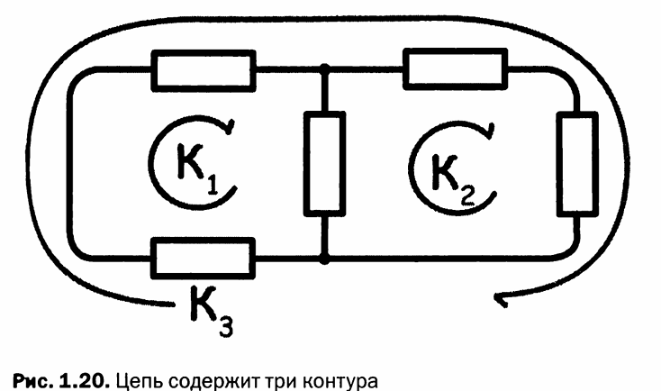

*Рис. 1.20 — Цепь содержит три контура*

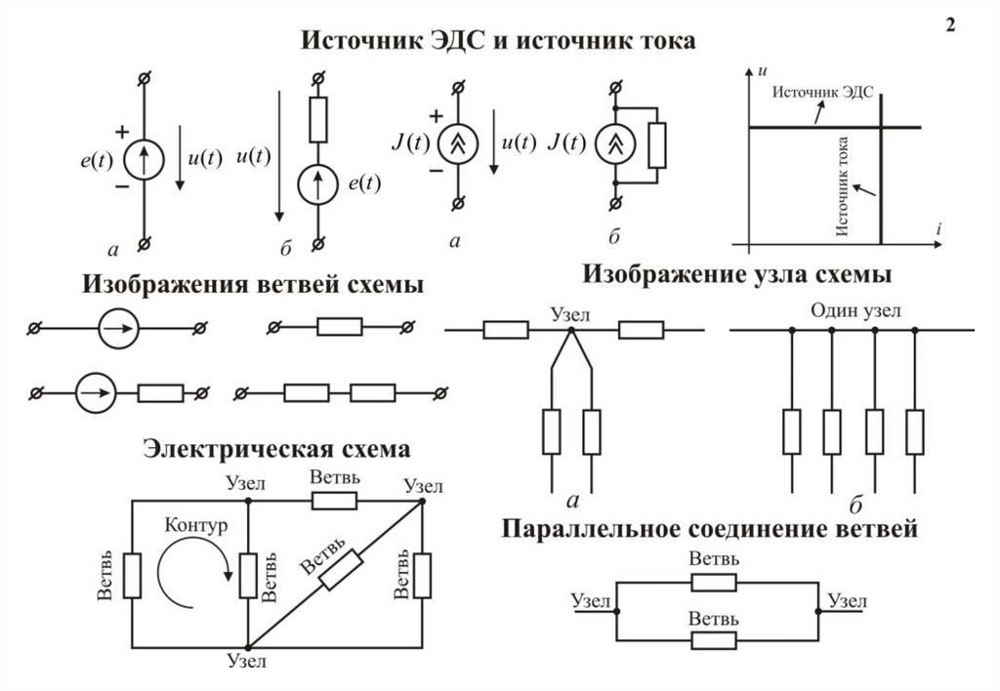

<strong>Примеры</strong>
<table><tr><td>

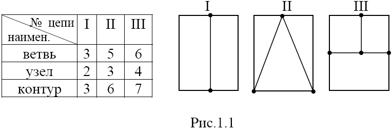

---

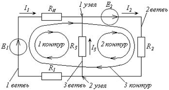

---

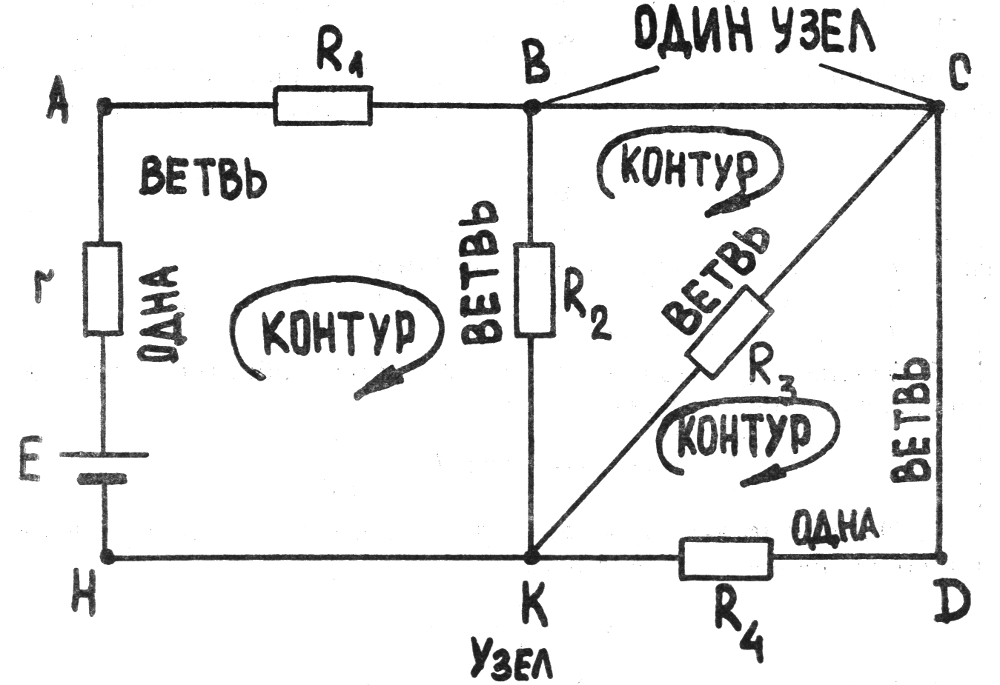

---

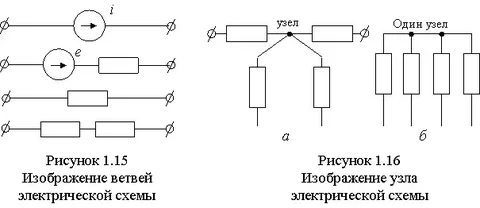

</td></tr></table>

## 3. Направление напряжения

Напряжение на диполях можно обозначить стрелкой, с помощью которой определяется полярность: указатель стрелки направлен на положительный полюс. Напряжение на диполе измеряется тестером или мультиметром, но считать показания мультиметра можно только тогда, когда компонент находится в цепи и подключён к источнику питания. Часто полярность подключённого диполя (с какой стороны ток в диполь входит и с какой истекает) заранее неизвестна, поэтому на диполях просто рисуют стрелки, указывая предполагаемое направление.

Если после выполнения расчётов напряжение имеет отрицательное значение, достаточно изменить направление стрелки (рис. 1.21).

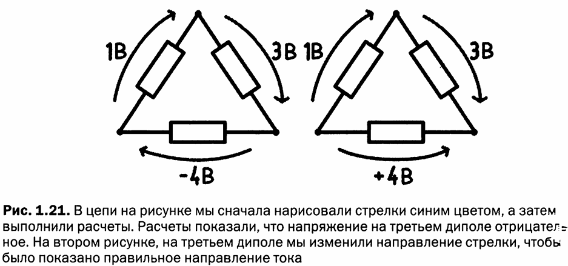

*Рис. 1.21 — В цепи на рисунке сначала были нарисованы стрелки (синим цветом), а затем выполнены расчёты. Расчёты показали, что напряжение на третьем диполе отрицательное. На втором рисунке на третьем диполе направление стрелки изменено, чтобы показать правильное направление тока*

## 4. Второе правило Кирхгофа (правило напряжений)

> **Второе правило Кирхгофа** — если сложить разности потенциалов на сторонах любого замкнутого контура, их сумма должна быть равна нулю:
> $$\sum U = 0$$

Это правило применимо к любому замкнутому контуру цепи.

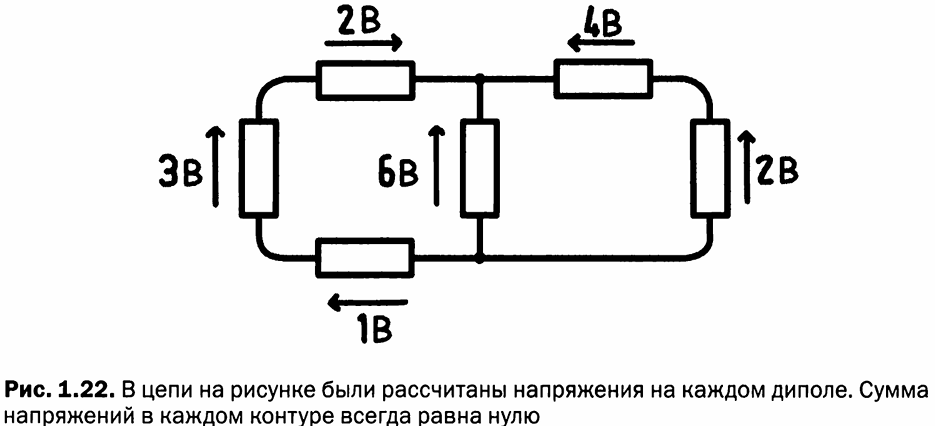

*Рис. 1.22 — В цепи на рисунке были рассчитаны напряжения на каждом диполе. Сумма напряжений в каждом контуре всегда равна нулю*

<mark><strong>Для цепи, изображённой на рисунке 1.22, были рассчитаны напряжения на каждом диполе. Можно убедиться, что во всех трёх контурах цепи сумма напряжений равна нулю.</strong></mark>

## 5. Закон Ома

Применим полученные знания на практике. Возьмём простую цепь, состоящую из резистора, светодиода и батарейки напряжением 9 В (рис. 1.23).

> **Резистор** — компонент, который ограничивает ток в цепи, сопротивляясь его прохождению (подобно трубе с узким горлом, ограничивающей поток воды).

> **Светодиод** — разновидность лампочки, имеющая полярность: при подключении «наоборот» он светиться не будет.

Для работы светодиода необходимо напряжение 2 В и ток от 10 до 20 мА. Если значение напряжения, требуемое для работы светодиода, превысить, компонент можно вывести из строя.

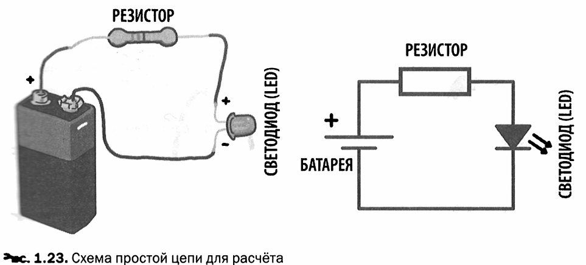

*Рис. 1.23 — Схема простой цепи для расчёта*

Вопрос, который многие задают себе при работе со светодиодом: «Какое сопротивление необходимо, чтобы не сжечь светодиод?». Если подключить светодиод к батарейке 9 В, светодиод включится на некоторое время, а затем сгорит. Для корректной работы светодиода необходимо напряжение 2 В, а мы подключили его к батарейке 9 В — это слишком много. <mark><strong>Чтобы правильно включить светодиод, нужно сопротивление, которое обеспечит падение напряжения, и до светодиода дойдёт только 2 В.</strong></mark>

Батарейка должна быть в состоянии обеспечить ток как минимум в 10 миллиампер, иначе светодиод светиться не будет. Батарейка напряжением 9 В способна обеспечить значительно больший ток, поэтому проблемы не возникнет.

Мы видели, что напряжение можно сравнить с высотой, с которой падает поток воды. Батарею напряжением 9 В можно представить как водопад высотой 9 м. Светодиод можно сравнить с колесом мельницы диаметром 2 м: для его работы необходим водопад высотой не более 2 м. Если поставить такую мельницу под водопад высотой 9 м, поток воды это колесо разрушит. Сопротивление необходимо для того, чтобы «ограничить» поток воды водопада высотой 9 м до 2 м. Таким образом, с помощью сопротивления мы отнимем от общего потока поток воды высотой 7 м (рис. 1.24).

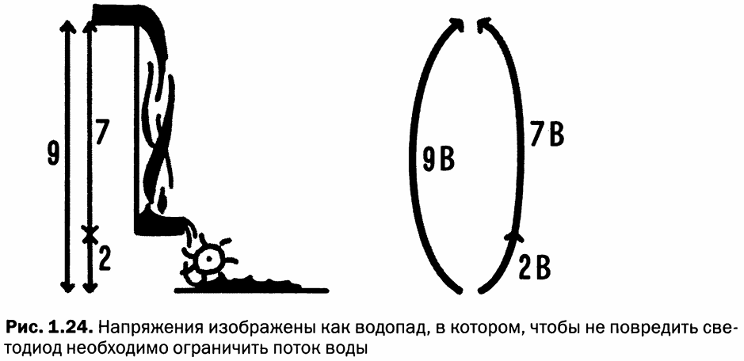

*Рис. 1.24 — Напряжения изображены как водопад, в котором, чтобы не повредить светодиод, необходимо ограничить поток воды*

Что касается напряжений, можно заметить следующее:

- батарейка обеспечивает напряжение 9 В;
- светодиоду требуется не более 2 В;
- <mark><strong>сопротивление необходимо для понижения напряжения на светодиоде и установления допустимого значения тока для светодиода;</strong></mark>
- <mark><strong>на сопротивлении «гасится» напряжение 7 В без повреждения этого элемента.</strong></mark>

Сложим напряжения. Напряжения могут иметь положительный или отрицательный знак — правило знаков устанавливается произвольно. Примем: если двигаться в контуре по часовой стрелке, то напряжение в этом направлении будет со знаком «плюс», а в противоположном направлении — со знаком «минус».

<mark><strong>Уравнение для напряжений:</strong></mark>

$$U_{\text{батарея}} - U_{\text{светодиод}} - U_{\text{резистор}} = 0$$

Подставим в формулу известные величины:

$$9 - 2 - U_{\text{резистор}} = 0$$

$$U_{\text{резистор}} = 9 - 2 = 7\ \text{В}$$

Полученный результат равен напряжению, которое будет на концах сопротивления.

<mark><strong>Теперь вычислим ток.</strong></mark> В цепи должен циркулировать ток 20 мА, так как светодиод потребляет ток такой силы. Батарейка может выдавать сотни миллиампер тока, но сопротивление ограничит этот ток до требуемого значения. На контактах резистора напряжение 7 В, и через него проходит ток 20 мА.

> **Закон Ома** — связь между напряжением, током и сопротивлением:
> $$U = I \cdot R$$
> где $U$ — напряжение (В), $I$ — ток (А), $R$ — сопротивление (Ом).

Из закона Ома выводятся следующие формулы:

$$I = \frac{U}{R}$$

$$R = \frac{U}{I}$$

Для расчёта сопротивления, используемого в нашей цепи, подставим значения в формулу:

$$R = \frac{U}{I} = \frac{7\ \text{В}}{20\ \text{мА}} = \frac{7}{0{,}02} = 350\ \text{Ом}$$

Необходимое для нашей цепи сопротивление имеет значение, равное 350 Ом. В продаже нет элементов сопротивления на 350 Ом, так как такие элементы изготавливают только с определёнными значениями. Величина сопротивления, наиболее близкая к расчётному, — 390 Ом.

<mark><strong>Теперь рассчитаем мощность</strong></mark>, рассеиваемую на этом сопротивлении. Мощность равна напряжению, умноженному на ток:

$$P = U \cdot I$$

Из закона Ома $U = I \cdot R$. Поэтому мощность может быть записана в виде:

$$P = I^2 \cdot R = \frac{U^2}{R}$$

Подставляя в формулу значения:

$$P = I^2 \cdot R = (0{,}02)^2 \cdot 390 = 0{,}0004 \cdot 390 = 0{,}156\ \text{Вт}$$

<mark><strong>В продаже имеются сопротивления разных номиналов и рассеиваемой мощности</strong></mark>, выделяемой в виде тепла. В данном случае будет достаточно обычного сопротивления рассеиваемой мощностью в 1/4 Ватт, что составляет 0,25 Вт. Если бы было выбрано сопротивление с меньшей рассеиваемой мощностью, элемент мог бы перегреться или даже сгореть.

## 6. Электрические измерения

Электрические эффекты невидимы. Мы не можем видеть электроны, проходящие через металлическую проволоку, их невозможно сосчитать. Несмотря на эти трудности, можно измерить ток и напряжение, наблюдая «вторичные» эффекты, такие как электромагнитные поля, вызванные течением тока.

Для измерения токов и напряжений используются вольтметры или амперметры, но более практично использовать **тестер** или **мультиметр** — прибор, способный измерять разные электрические величины.

> **Мультиметр (тестер)** — <mark><strong>измерительный прибор, способный измерять различные электрические величины</strong></mark> (напряжение, ток, сопротивление и др.).

Тестеры имеют цифровой дисплей или индикатор со стрелкой, поворотный переключатель и три или четыре гнезда для подключения **щупов** — пары проводов с металлическими наконечниками на концах (рис. 1.25). Один щуп всегда красного цвета, а другой чёрного. Эти цвета принято считать положительным (красный) и отрицательным (чёрный).

> **Щупы** — пара изолированных проводов с металлическими наконечниками на концах, используемых для подключения измерительного прибора к электрической цепи.

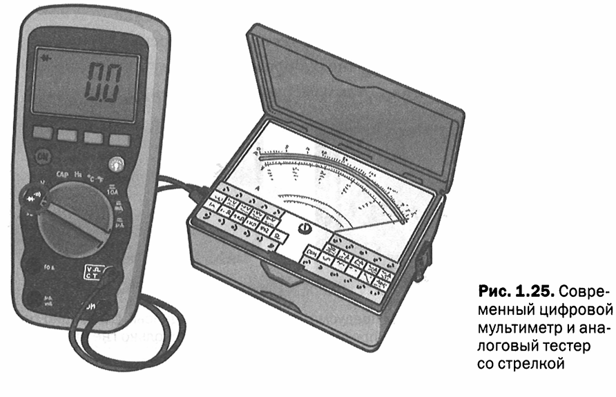

*Рис. 1.25 — Современный цифровой мультиметр и аналоговый тестер со стрелкой*

Можно купить дешёвые приборы, которые измеряют только напряжение, ток и сопротивление, или более сложные и дорогие приборы, позволяющие измерять мощность, частоту, индуктивность, температуру и тестировать транзисторы, диоды, сопротивления и конденсаторы. Приборы со стрелкой могут оказаться сложнее в использовании, потому что часто содержат несколько шкал измерений, наложенных друг на друга, а также множество гнёзд для подключения щупов. Различные приборы для измерения имеют ряд общих черт, и, освоив один, не составит труда работать с другими.

Все модели имеют гнездо с надписью **COM**, что означает общий провод. К этому гнезду всегда подключается чёрный щуп (отрицательный). Также есть гнездо с надписью **V/Ω** для измерения напряжений и сопротивлений, и одно или несколько гнёзд для измерения тока (рис. 1.26). Такие гнёзда обозначаются метками «мА» или «А». Входы для измерения силы тока разделены, поскольку измерения некоторых мощностей требуют определённых мер безопасности для пользователя и для цепей тестера. Токи, которые протекают в цепях схем в экспериментах, будут иметь величины не более нескольких сотен миллиампер.

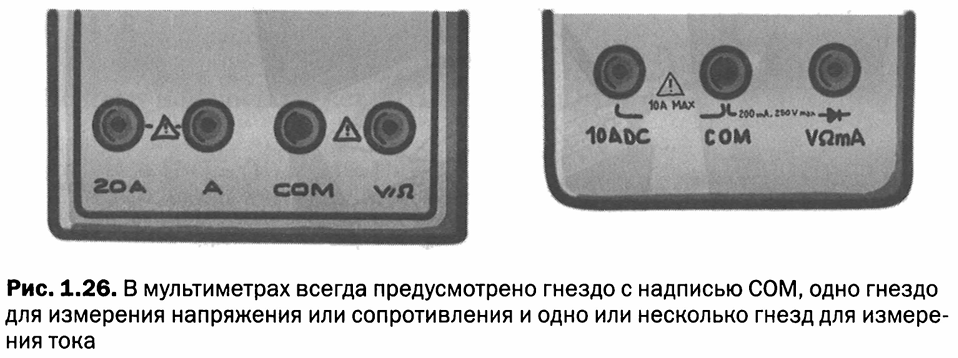

*Рис. 1.26 — В мультиметрах всегда предусмотрено гнездо с надписью COM, одно гнездо для измерения напряжения или сопротивления и одно или несколько гнёзд для измерения тока*

Прибор снабжён переключателем для установки типа измерения и значения (или точности). Переключатель разделён на участки. В поле для напряжений имеются различные пределы: 200 мВ, 2 В, 20 В, 200 В. Современные и более дорогие устройства при измерении самостоятельно выбирают необходимый предел измерения. Если измерить напряжение 10 В прибором, установленным на 2 В, тестер не повредится, но измерение будет осуществляться до полной шкалы (на экране отображается предупреждение или особая надпись). То же самое касается измерения тока и сопротивлений.

### 6.1. Измерение напряжения

<mark><strong>Измерение напряжения — довольно простая операция: для выполнения измерения нет необходимости вносить в схему изменения. Для считывания разности потенциалов достаточно прикоснуться щупами в двух точках цепи.</strong></mark>

Для измерения напряжения необходимо:

1. Вставить красный щуп в гнездо с надписью **V** (напряжение), а чёрный щуп — в гнездо с надписью **COM**.
2. Повернуть переключатель так, чтобы его указатель находился напротив раздела с нужным диапазоном измерения. Если приблизительно неизвестно, какое значение имеет измеряемое напряжение, начинают измерения с максимального значения, а затем, переходя к более низким пределам, проводят измерения более точно.

Будьте внимательны: при переключении предела измерений и выбора режима случайно можно перепутать деления с пределами измерений постоянного напряжения (обозначается **VDC**) с делениями для измерения переменного напряжения (**VAC**). На некоторых приборах может быть только одно деление для измерения переменного напряжения и одно — для постоянного напряжения. Иногда аббревиатуры VDC и VAC заменяются графическими символами: для постоянного тока используется знак прямой линии с точками, для переменного тока — прямая линия рядом с волнистой.

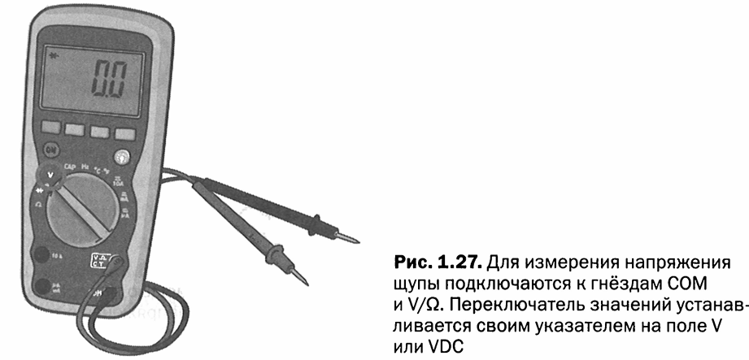

*Рис. 1.27 — Для измерения напряжения щупы подключаются к гнёздам COM и V/Ω. Переключатель значений устанавливается указателем на поле V или VDC*

**Порядок измерения напряжения на батарейке 9 В:**

1. Включаем тестер.
2. Подключаем чёрный щуп к гнезду COM.
3. Устанавливаем переключатель в режим для измерения постоянного напряжения (VDC) и выбираем значение предела, превышающее 9 В (например, 20 В).
4. Подключаем красный щуп к гнезду VDC.
5. Прикасаемся чёрным щупом к отрицательному полюсу батарейки.
6. Не отпуская чёрный щуп от отрицательного полюса батарейки, прикасаемся красным щупом к положительному полюсу батарейки.
7. Держим щупы на контактах батарейки и читаем появившееся на дисплее прибора значение, которое вряд ли будет точно 9 В — скорее всего, немного ниже.

Теперь выполним другие измерения. Не отпуская чёрный щуп от отрицательного полюса батарейки, прикоснёмся красным щупом к положительному выводу светодиода. На дисплее прибора должно появиться значение около 2 В — падение напряжения на концах светодиода. Прикоснёмся щупами к двум выводам резистора — на приборе будет считываться падение напряжения на резисторе, которое составит около 7 В.

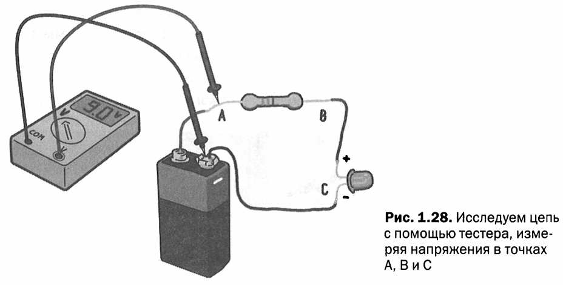

*Рис. 1.28 — Исследуем цепь с помощью тестера, измеряя напряжения в точках A, B и C*

### 6.2. Измерение тока

<mark><strong>Измерение тока является более сложной операцией, так как необходимо разорвать цепь для подключения щупов измеряющего прибора.</strong></mark> Ток сравним с потоком воды в трубопроводе: чтобы измерить его, требуется открыть трубу и подключить измерительный прибор, который работает как своего рода счётчик воды, обнуляясь каждую секунду и сообщая количество прошедшей воды.

Для измерения тока необходимо:

1. Подключить чёрный щуп к гнезду **COM**.
2. Подключить красный щуп к гнезду для измерения силы тока. Будьте внимательны: некоторые приборы имеют два гнезда для измерения силы тока — одно для слабых токов (отмечено как «мА») и другое для сильных токов (как правило, чётко обозначено). В нашем случае используется гнездо для слабых токов.
3. Установить переключатель тестера на соответствующее поле: будьте внимательны, так как и для токов важно разделение на переменный и постоянный ток.

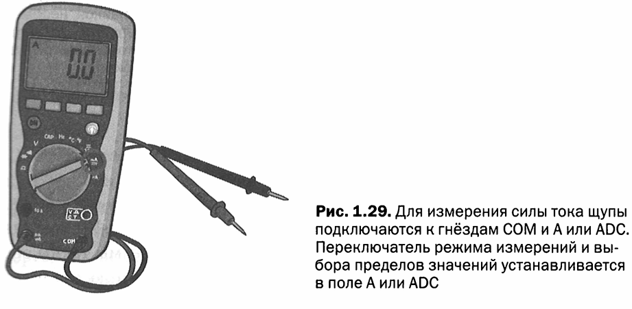

*Рис. 1.29 — Для измерения силы тока щупы подключаются к гнёздам COM и A или ADC. Переключатель режима измерений и выбора пределов значений устанавливается в поле A или ADC*

Измерим ток, текущий в цепи, показанной на рис. 1.29. В соответствии с выполненными расчётами, измеряемая сила тока должна быть между 10 и 20 миллиампер. <mark><strong>Для измерения тока, протекающего в проводе, необходимо разорвать цепь и в этот разрыв подключить тестер </strong></mark>(рис. 1.30). Цепь представляет собой простой контур, который можно разорвать в любой точке.

**Порядок измерения тока:**

1. Включаем тестер.
2. Подключаем чёрный щуп к гнезду COM.
3. Устанавливаем переключатель в режим для измерения тока (поле ADC) и выбираем значение, превышающее 20 миллиампер (например, 200 мА).
4. Подключаем красный щуп к гнезду A.
5. Отсоединяем провод от положительного полюса батарейки.
6. Прикладываем чёрный щуп к положительному полюсу батарейки.
7. Прикладываем красный щуп к проводу, отсоединённому от батарейки.
8. Полученное значение тока, протекающего по цепи, появится на дисплее прибора.

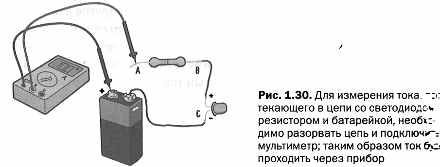

*Рис. 1.30 — Для измерения тока, текущего в цепи со светодиодом, резистором и батарейкой, необходимо разорвать цепь и подключить мультиметр; таким образом ток будет проходить через прибор*

## 7. Правда о воде и токе

На этом этапе необходимо сделать уточнение в метафоре о воде. Представление электрического тока как воды, протекающей в трубе, упрощает понимание и представление о токе. К сожалению, эта модель имеет свои недостатки. Посмотрите на рисунок 1.31:

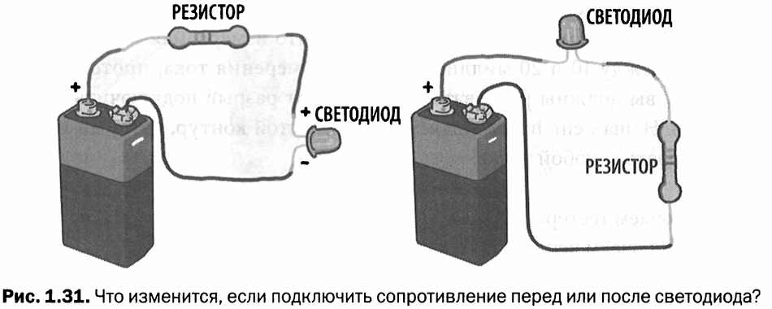

*Рис. 1.31 — Что изменится, если подключить сопротивление перед или после светодиода?*

В первом случае батарейка сначала подключена к сопротивлению, а затем — к светодиоду. Если бы ток вёл себя подобно воде, он бы вышел из положительного полюса и пришёл к сопротивлению. Сопротивление ограничивает ток и рассеивает, переводя в тепло, часть напряжения, достигающего светодиода, благодаря чему светодиод включится и не сгорит. Во втором случае ток сначала встретится со светодиодом, а уже потом с сопротивлением.

Используя метафору воды, мы будем вынуждены сказать, что электрический ток будет ограничен только после того, как пройдёт через светодиод. Сгорит ли светодиод? **Нет!** Потому что <mark><strong>значение тока в любой точке цепи одного контура одинаково.</strong></mark><mark><strong> В обоих случаях, будет ли сопротивление установлено до светодиода или после него, сила тока в цепи будет одинакова</strong></mark>, и на резисторе в любом случае в виде тепла будет рассеиваться напряжение 7 вольт. Используя батарейку напряжением 9 В, сопротивление значением 470 Ом и зная, что светодиоду необходимо напряжение 2 В для включения, получаем:

$$I = \frac{U}{R} = \frac{9 - 2}{470} = \frac{7}{470} \approx 0{,}015\ \text{А} = 15\ \text{мА}$$

Математические формулы не учитывают тот факт, что сопротивление расположено до или после светодиода — они просто рассматривают цепь, по которой течёт ток.

<mark><strong>В действительности реальный ток не ведёт себя как «текущее» вещество. Скорее, как вещество, «заполняющее пространство».</strong></mark> В этом случае «пространство» представляет собой контур цепи. Это как будто бы ток преодолевает «препятствия» на своём пути.

В большинстве книг по электронике первый рисунок — это атом, состоящий из множества небольших сфер, используемый, чтобы объяснить, что такое электроны и как они порождают электрический ток. Даже это объяснение, в котором электроны изображаются в виде маленьких сфер, является неудачным, потому что в конце концов приводит к недостаткам, присущим модели с водой.

Современная физика обнаружила, что электроны не имеют форму шара. Говорится о частицах, но в действительности это поля и волны, и все объяснения становятся очень сложными, так как приходится сталкиваться с рядом вторичных явлений. В большинстве случаев их можно не учитывать, но в определённых условиях, иногда даже не столь экстремальных, они должны быть учтены.

Модель воды часто подвергается критике, потому что она может ограничивать мышление людей, изучающих основы электроники. Однако от модели с водой больше пользы, чем вреда, если вовремя вводить уточнения, указывая на все её ограничения и риски.

## FAQ

**Вопрос: Что гласит первое правило Кирхгофа?**

**Ответ:** Первое правило Кирхгофа (правило токов) гласит, что алгебраическая сумма токов в любом узле электрической цепи равна нулю: $\sum I = 0$. Это означает, что суммарный ток, входящий в узел, равен суммарному току, выходящему из узла.

**Вопрос: Что такое ветвь и контур в электрической цепи?**

**Ответ:** Ветвь — это участок цепи, по которому течёт ток одного значения. Контур — это замкнутый путь, состоящий из нескольких ветвей и узлов, который начинается и заканчивается в одном и том же узле.

**Вопрос: Как рассчитать сопротивление резистора для светодиода?**

**Ответ:** Нужно вычесть напряжение светодиода из напряжения источника питания, а затем разделить полученное значение на требуемый ток. Формула: $R = (U_{\text{источника}} - U_{\text{светодиода}}) / I$. Например, для батарейки 9 В и светодиода с рабочим напряжением 2 В и током 20 мА: $R = (9 - 2) / 0{,}02 = 350$ Ом.

**Вопрос: В чём разница между измерением напряжения и измерением тока?**

**Ответ:** При измерении напряжения щупы прикладываются к двум точкам цепи без её разрыва. При измерении тока цепь необходимо разорвать и подключить мультиметр в разрыв, чтобы ток протекал через прибор.

**Вопрос: Зависит ли работа светодиода от того, где расположен резистор — до или после светодиода?**

**Ответ:** Нет, не зависит. Сила тока в любой точке последовательной цепи одинакова, поэтому резистор ограничивает ток одинаково, независимо от того, расположен он до или после светодиода. Важно лишь общее сопротивление контура.