

<strong>Кратко</strong>
<table><tr><td>

**Основы электроники: схемы, ток и напряжение**

Глава знакомит с базовыми понятиями электроники, необходимыми для понимания работы электронных схем, используя аналогию с потоком воды.

**Печатные платы и компоненты:** Электронные устройства собираются на печатных платах (PCB), где медные дорожки соединяют компоненты. Основным теоретическим элементом цепи является **диполь** — условный компонент с двумя выводами. Реальные компоненты (например, транзисторы с тремя выводами) могут быть представлены как комбинации диполей. Электрическая схема, подобно музыкальной партитуре, символически отображает соединения компонентов.

**Электрический ток:** Это упорядоченное движение заряженных частиц (электронов) по проводнику. Исторически принято считать, что ток течет от плюса к минусу (условность, введенная Франклином). Сила тока измеряется в **амперах (А)**. Существует **постоянный ток (DC)**, текущий в одном направлении (от батарей), и **переменный ток (AC)**, периодически меняющий направление (используется в бытовой сети).

**Напряжение:** Это разность потенциалов, которую можно сравнить с перепадом высот для воды. Именно наличие этой разницы заставляет ток течь. Напряжение измеряется в **вольтах (В)**. Для каждого устройства требуется определенное напряжение и достаточная сила тока; неправильное питание приведет к отказу работы или поломке.

**Мощность:** Показывает, сколько энергии затрачивается на перемещение зарядов. Измеряется в **ваттах (Вт)** и для постоянного тока рассчитывается по формуле: Мощность = Напряжение × Ток.

**Время и частота:** Частота — это число повторяющихся циклов (событий) в секунду, измеряется в **герцах (Гц)**. Она обратно пропорциональна периоду (времени одного полного цикла). У постоянного тока частота равна 0 Гц.

</td></tr></table>

# Электронные схемы, ток и напряжение

## 1. Введение в электронные схемы

Чтобы понять, как работают электронные компоненты, из которых состоят электронные схемы, и в дальнейшем разрабатывать схемы, необходимо начать с основных понятий. В этой главе рассматриваются ток, напряжение, сопротивление и зависимости между ними. Для объяснения понятий <mark><strong>электрический ток сравнивается с потоком воды.</strong></mark>

Электронная плата с компонентами выглядит как миниатюрный город с множеством линий, похожих на аккуратные дороги, соединяющие маленькие цилиндры или кубики с таинственными надписями. Это конечный продукт проектирования и разработки, которая началась, вероятно, несколько месяцев или лет назад. Электронная плата была сначала спроектирована: ряд символов на листе бумаги или на мониторе был соединён линиями в особом порядке, а затем преобразован в реальный объект, состоящий из пластика, смол и металлов различных видов.

Тоненькие линии светло-зелёного цвета называются **дорожками** и являются эквивалентом электрических проводов. Небольшие объекты цилиндрической или кубической формы — это **электронные компоненты**, которые служат для преобразования электрического тока.

> **Печатная плата (PCB, Printed Circuit Board)** — <mark><strong>пластина, на поверхности и/или в объёме которой сформированы электропроводящие цепи (дорожки) для электрического соединения электронных компонентов.</strong></mark>

До изобретения печатных плат (они появились после Второй мировой войны) контактные выводы электронных элементов соединялись проводами. Такой способ сборки радиоэлектронных схем не очень эффективен: легко ошибиться, и такой труд сложно автоматизировать. Схемы, сделанные навесным монтажом, в наши дни монтируются только для создания прототипов. Печатные платы позволяют в короткие сроки собрать надёжную электрическую схему. Современные печатные платы проектируются так, чтобы их можно было собирать с помощью автоматизированных линий, что экономит время и позволяет производить тысячи экземпляров устройств в день.

## 2. Диполи

Основными элементами для построения цепей являются электронные компоненты. Основная масса электронных компонентов представляет собой корпус, из которого выходят два контактных вывода. Общее название такого электронного компонента — **диполь**.

> **Диполь** — <mark><strong>теоретическая модель электронного компонента с двумя контактными выводами</strong></mark>, используемая для изучения соединений и форм электрических цепей (топологии цепей). В магазине электроники диполь как отдельный компонент не продаётся.

Диполи необходимы для изучения соединений и форм электрических цепей. Позже такие соединения будут рассмотрены в деталях.

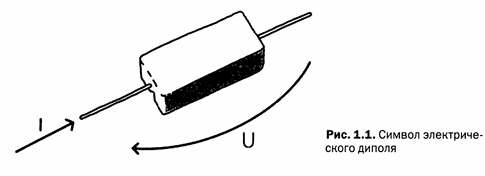

*Рис. 1.1 — Символ электрического диполя*

Показанный на рисунке 1.1 диполь является лишь его символом. <mark><strong>Чтобы облегчить понимание электрических явлений, электрический ток сравнивается с водой, протекающей по трубе.</strong></mark> Эта метафора поможет понять только некоторые явления, несмотря на то что имеет ограничения и может привести к ошибочным выводам. Поэтому эта метафора используется ограниченно, а затем от неё придётся отказаться.

<mark><strong>Электрический провод с протекающим в нём током можно сравнить с трубой, по которой протекает вода.</strong></mark> <mark><strong>Электронные компоненты сравнимы с особой трубой, которая преобразует поток воды.</strong></mark> На самом деле компоненты сделаны из специальных материалов, которые, используя физические, химические и электрические свойства, изменяют или преобразовывают электрический ток, протекающий через данное устройство. <mark><strong>Электрическая цепь образована набором диполей, соединённых друг с другом электрическими проводами.</strong></mark>

**Правила соединения диполей:**

- <mark><strong> диполи имеют только два вывода</strong></mark>;
- <mark><strong>соединения между диполями осуществляются путём соединения их выводов</strong></mark> (а не корпусов);
- <mark><strong>вся жидкость (ток), входящая в один конец диполя, должна выходить из другого его конца</strong></mark>;
- длина выводов диполя может быть такой, как требуется в данный момент;
- соединяя выводы нескольких диполей, получается **узел**;
- цепь диполей не может иметь свободных выводов (должна быть замкнута).

> **Ветвью** называется <mark><strong>участок электрической цепи, по которому протекает однин и тот же ток.</strong></mark> Ветвь <mark><strong>образуется одним или несколькими последовательно соединенными элементами цепи</strong></mark>(т.е. ветвь должна содержать хотя бы один элемент).

> **Узел** — точка электрической цепи, в которой соединены выводы нескольких диполей.  
>Узел — это точка соединения ТРЁХ и более выводов (диполей).  
> Узел - место соединения трех и более ветвей

Примеры:

| 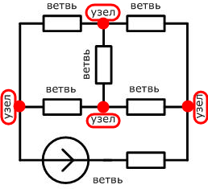                                  | 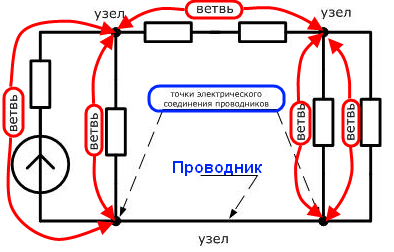                                                                                                                                                                                                                                                                                                                                                                                                             |
|-----------------------------------------------------------|--------------------------------------------------------------------------------------------------------------------------------------------------------------------------------------------------------------------------------------------------------------------------------------------------------------------------------------------------------------------------------------------------------------------------------------|
| содержит <mark><strong>6 ветвей и 4 узла.</strong></mark> | состоит из<mark><strong> 5 ветвей и 3 узлов.</strong></mark> В этой схеме обратите внимание на нижний узел. Очень часто допускают ошибку, считая что там 2 узла электрической цепи, мотивируя это наличием на схеме цепи в нижней части 2-х точек соединения проводников. Однако <mark><strong>на практике следует считать две и более точки, соединенных между собой проводником, как один узел электрической цепи.</strong></mark> |

Когда мы соединяем между собой «пучок» диполей, создаётся то, что математик назвал бы графом.

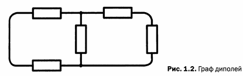

*Рис. 1.2 — Граф диполей*

Если на схеме, показанной на рис. 1.2, заменить каждый диполь реальным электронным компонентом, получится электрическая цепь. Если схема очень сложная, может получиться пересечение линий; в этом случае провода считаются соединёнными, если на пересечении нарисован узел в виде жирной точки (рис. 1.3). Чтобы подчеркнуть, что два пересекающихся провода не соединяются в месте пересечения, в некоторых схемах разработчики в точке пересечения рисуют небольшую арку, обозначая тем самым, что один провод проходит снизу, а другой сверху.

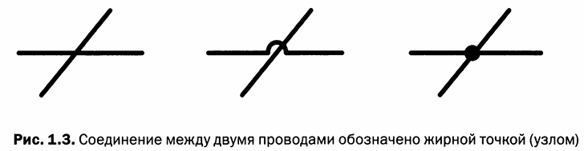

*Рис. 1.3 — Соединение между двумя проводами обозначено жирной точкой (узлом)*

Не у всех электронных компонентов всего два электрических вывода. <mark><strong>Многие элементы имеют три или более выводов.</strong></mark> С точки зрения изображения эти элементы обозначают несколько соединённых диполей, смонтированных в одном корпусе. Например, <mark><strong>у транзистора три вывода, но его можно представить как комплекс из нескольких диполей.</strong></mark> Для простоты используется более простое и быстрое для использования обозначение.

Для многих элементов нет прямого соответствия между символом и реальным устройством. Например, три вывода транзистора имеют обозначения **Э, Б и К** (Эмиттер, База и Коллектор), но не у всех транзисторов так обозначаются выводы. Символы интегральных схем — это прямоугольники с нарисованными отрезками, обозначающими их выводы. Они всегда расположены таким образом, чтобы упростить изображение цепи, и <mark><strong>рисунок на схеме обычно отличается от того, как выглядит этот элемент на самом деле</strong></mark> (рис. 1.4).

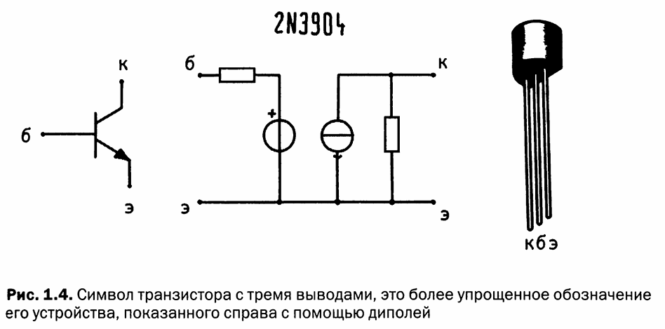

*Рис. 1.4 — Символ транзистора с тремя выводами; справа — более детальное обозначение его устройства с помощью диполей*

## 3. Электрический ток

Непрофессионалы часто путают такие термины, как электричество, ток, напряжение, мощность. Это совершенно разные понятия.

> **Электричество** —<mark><strong> свойство материи, проявляющееся в притяжении или отталкивании тел из-за действия имеющихся электрических зарядов.</strong></mark> Название «электричество» происходит от греческого слова «янтарь»: ещё древние греки заметили, что если потереть тканью или шерстью кусок янтаря, он станет отрицательно заряженным и сможет притягивать лёгкие предметы (пух, кусочки бумаги).

<mark><strong>Ток, напряжение, сопротивление и мощность — это взаимозависимые величины, которые могут быть описаны математическими формулами</strong></mark>, но на данный момент это не обсуждается.

> **Электрический ток** — <mark><strong>движение электрически заряженных частиц внутри электропроводящего материала</strong></mark> (например, меди или железа).

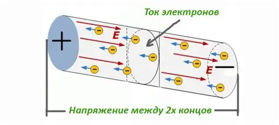

Когда-то считалось, что частицы, перемещающиеся внутри проводника, имеют положительный заряд. Теперь ясно, что эти частицы заряжены отрицательно — это **электроны**. Металлы состоят из атомов, богатых электронами, которые могут свободно перемещаться. Так как электрический ток хорошо проходит через медь и железо, эти металлы называются **проводниками**.

Представьте себе, что мы соединили проводами батарейку и лампочку. В этом случае электрические заряды отправятся по следующему пути: от положительного полюса батарейки, по электрическому проводу электроны попадут на электрический контакт лампочки, далее — через нить накаливания лампочки на второй контакт лампочки, и через второй электрический провод на отрицательный полюс батарейки. <mark><strong>Электрический провод можно сравнить с трубой, а электроны — с молекулами воды, которые текут по этой трубе. Положительный полюс батарейки можно сопоставить с краном, а отрицательный полюс — со стоком, куда вода стекает в конце своего движения</strong></mark> (рис. 1.6).

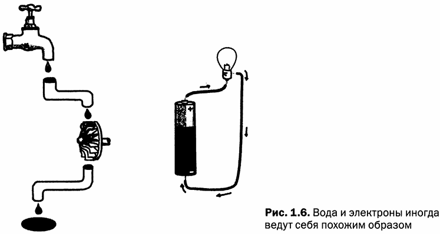

*Рис. 1.6 — Вода и электроны иногда ведут себя похожим образом*

Ток протекает в одном направлении, и заряженные частицы всегда движутся от положительного полюса к отрицательному. Это называется **полярностью**.

> **Полярность** — направление движения заряженных частиц от положительного полюса к отрицательному.

Первым, кто предложил эту идею, был Бенджамин Франклин, у которого не было инструментов или знаний по физике, чтобы доказать, что в действительности электрический ток обусловлен движением отрицательно заряженных электронов, а не гипотетически положительными частицами. Франклин просто описывал то, что мог наблюдать. Эта условность осталась и по сей день, хотя в действительности электроны движутся от отрицательного полюса к положительному. Положительный полюс обычно указывается знаком «+» или красным цветом, в то время как отрицательный полюс обозначается знаком «−» или чёрным цветом.

### Измерение электрического тока

Измерить поток воды достаточно просто: нужен секундомер и водяной счётчик воды, вытекающей из трубы. Скорость потока зависит от диаметра трубы и напора воды и равна количеству литров, которые проходят через секцию трубы в секунду (рис. 1.7). Для измерения силы электрического тока поступают подобным образом — вместо измерения количества проходящей воды требуется посчитать количество электронов, проходящих в электрическом проводе за одну секунду (или лучше через данное сечение провода).

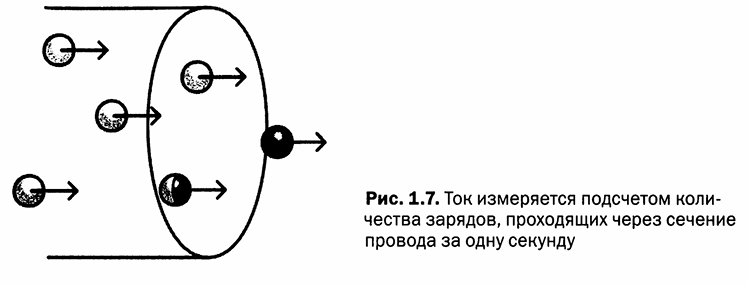

*Рис. 1.7 — Ток измеряется подсчётом количества зарядов, проходящих через сечение провода за одну секунду*

> **Ампер (А)** — <mark><strong>единица измерения электрического тока</strong></mark> (силы тока). Названа в честь французского физика Андре-Мари Ампера (1775–1836). В формулах сила тока обозначается буквой $I$.

Токи небольшой величины могут быть выражены в миллиамперах (мА). Сверхмалые токи, например возникающие в антенне радиоприёмника при приёме радиопередач, выражаются в микроамперах (мкА).

$$1\ \text{мА} = 0{,}001\ \text{А} = 10^{-3}\ \text{А}$$

$$1\ \text{мкА} = 0{,}000001\ \text{А} = 10^{-6}\ \text{А}$$

Полноводные реки, такие как Волга, Тобол или Нил, можно сравнить с линиями электропередач — мощными электрическими кабелями, которые проходят от электростанций к городам. Реки поменьше можно сравнить с кабелем, в котором проходит ток, необходимый, например, для перемещения трамвая. Пожарный шланг может быть приравнен к кабелю для обеспечения работы больших станков, таких как пресс или промышленный токарный станок; домашний кран можно сравнить с кабелем, который тянется от розетки до чайника или тостера (табл. 1.1).

**Таблица 1.1. Потребление тока различными устройствами**

| Устройство | Потребляемый ток |
|---|---|
| Трамвай или поезд | 100–500 А |
| Духовка | 10–20 А |
| Блендер | 1–2 А |
| MP3-проигрыватель | 0,1 А |

Электрический ток измеряется с помощью **амперметра** (рис. 1.9). Классический амперметр — это электромеханический инструмент, оснащённый стрелкой и градуированной шкалой. Такой амперметр со стрелкой можно увидеть в промышленных электрических щитах. Для измерений используется **мультиметр** (или тестер) — инструмент, который может выполнять различные типы электрических измерений, в том числе измерять силу тока.

## 4. Переменный и постоянный ток

Все электрические схемы, которые будут рассматриваться, работают на **постоянном электрическом токе**. То есть его значение остаётся неизменным во времени. Постоянный ток обеспечивает аккумулятор или батарейка.

> **Постоянный ток (DC, Direct Current)** — электрический ток, значение которого остаётся неизменным во времени.

> **Переменный ток (AC, Alternating Current)** — электрический ток, который периодически изменяет своё направление во времени: течёт какое-то время в одном направлении, а затем в противоположном.

В текстах и схемах постоянный ток часто обозначают аббревиатурой **DC** (от английского Direct Current — постоянный ток). Переменный ток обозначается аббревиатурой **AC** (от английского Alternating Current — переменный ток).

Прибегая к аналогии с водой, представим поршневой насос, который, двигаясь, сначала гонит воду по трубе в одном направлении, а потом в обратном (рис. 1.10).

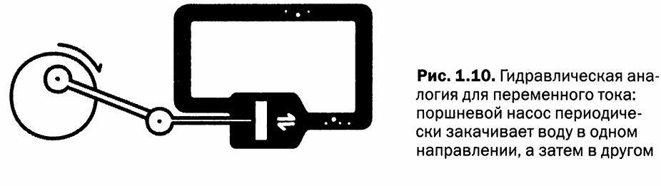

*Рис. 1.10 — Гидравлическая аналогия для переменного тока: поршневой насос периодически закачивает воду в одном направлении, а затем в другом*

В наши дома от электростанций приходит именно переменный ток. В начале XIX века, на заре развития электричества, было принято решение использовать именно переменный ток, поскольку он проще в распределении и менее опасен, чем постоянный ток, хотя и имеет более высокое напряжение.

В Европе ток изменяет своё направление 50 раз (циклов) в секунду — его частота равна 50 Герц. А в странах Северной и Южной Америки частота тока равна 60 Герц, то есть он изменяет своё направление шестьдесят раз в секунду. В отличие от постоянного тока, переменный ток не может быть накоплен и сопряжён с рядом «вторичных» явлений, которые делают его сложным в использовании. В этой книге переменный ток не рассматривается.

## 5. Величины и множители: инженерные числа

В электронике используются числа, которые сильно различаются между собой. В одной и той же формуле огромные величины могут соседствовать с микроскопическими. В расчётах часто приходится использовать числа с большим количеством нулей. Чтобы каждый раз не писать эти цифры, следует использовать экспоненциальное обозначение с основанием десять.

Например:

- число $100$ записывается как $1 \cdot 10^2$ или $10^2$ (десять во второй степени);
- $1000$ записывается как $1 \cdot 10^3$ или $10^3$ (десять в третьей степени);
- $200$ становится $2 \cdot 10^2$.

Числа с запятой могут быть записаны таким образом:

$$0{,}01 = 10^{-2}$$

$$0{,}003 = 3 \cdot 10^{-3}$$

Этот способ записи чисел может показаться немного странным, но он очень помогает в расчётах, потому что не нужно записывать множество нулей.

Степени имеют интересные свойства. Когда два числа имеют одну и ту же основу (десять) и умножаются в одном и том же уравнении, их степени могут быть сложены. Например:

$$0{,}002 \cdot 470000 = (2 \cdot 10^{-3}) \cdot (4{,}7 \cdot 10^5) = 9{,}4 \cdot 10^2 = 940$$

В уравнениях с делением степени чисел с одинаковой основой вычитаются:

$$\frac{220000}{2000} = \frac{2{,}2 \cdot 10^5}{2 \cdot 10^3} = 1{,}1 \cdot 10^{(5-3)} = 1{,}1 \cdot 10^2 = 110$$

Если число со степенью стоит в знаменателе дроби, оно может переместиться в числитель путём изменения знака степени на противоположный:

$$\frac{1}{10^3} = 10^{-3}$$

Чтобы записывать числа ещё быстрее, используются сокращённые записи:

**Для малых величин:**

| Обозначение | Значение | Степень | Название |
|---|---|---|---|
| м | 0,001 | $10^{-3}$ | милли |
| мк | 0,000001 | $10^{-6}$ | микро |
| н | 0,000000001 | $10^{-9}$ | нано |
| п | 0,000000000001 | $10^{-12}$ | пико |

**Для больших величин:**

| Обозначение | Значение | Степень | Название |
|---|---|---|---|
| к | 1 000 | $10^3$ | кило |
| М | 1 000 000 | $10^6$ | мега |

## 6. Напряжение или разность потенциалов

Часто возникают вопросы: «Какое напряжение требуется для работы этого прибора?» — «220 вольт», или «Какую батарейку нужно вставить в эту игрушку?» — «Батарейку на 9 вольт».

Прибегая к метафоре с водой: <mark><strong>вода течёт, если есть перепад высот. Подобно воде, электрический ток будет течь, если существует разница в уровнях</strong></mark>, или, лучше сказать, **разность потенциалов** (рис. 1.11). Это можно представить, <mark><strong>как будто два контакта батареи или аккумулятора расположены на разной высоте.</strong></mark>

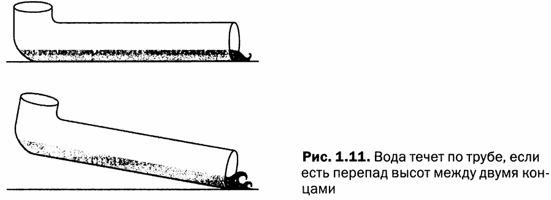

*Рис. 1.11 — Вода течёт по трубе, если есть перепад высот между двумя концами*

Если взять очень длинную трубу, положить её на землю и наполнить водой, вода выйдет из другого конца с небольшой силой. Если поднять один из двух концов трубы, то вода с другого конца будет вытекать с большей силой. Чем больше разница в высоте, тем больше сила (или давление) воды на выходе из трубы. Напряжение можно сравнить с высотой, с которой течёт вода, например с водопадами разной высоты.

Представим, что можно накопить несколько положительных зарядов в одном месте и поставить на некотором расстоянии вторую группу отрицательных зарядов. Между этими двумя группами зарядов возникнет электрическое поле. Если приложить небольшой положительный заряд в этой области, он потечёт по направлению к группе с отрицательным знаком, изменяя при этом её энергию.

Электрический заряд, находящийся в электрическом поле, обладает определённым уровнем потенциальной энергии, потому что находится в этой точке поля. Потенциальная энергия зависит только от положения точки в электрическом поле (поэтому напоминает высоту, на которую помещается труба с водой). <mark><strong>Напряжение</strong></mark> вычисляется путём деления потенциальной энергии на величину заряда частицы и выражает <mark><strong>количество энергии, необходимой для перемещения частицы.</strong></mark> Говорят о разнице потенциалов, так как трудно сделать абсолютные измерения, и легче делать сравнения, а затем предоставлять относительные измерения.

> **Напряжение (разность потенциалов)** — величина, характеризующая количество энергии, необходимой для перемещения электрического заряда между двумя точками электрического поля.

> **Вольт (В)** — единица измерения напряжения. Названа в честь итальянского учёного графа Алессандро Вольта (1745–1827), изобретателя первого гальванического элемента (Вольтова столба).

*Рис. 1.12 — Алессандро Вольта (1745–1827)*

Разность потенциалов измеряют с помощью **вольтметра**. Существуют стрелочные электромеханические вольтметры, которые можно увидеть в промышленных электрических щитах. Для измерений используется мультиметр (тестер) — инструмент, который может выполнять различные типы электрических измерений, в том числе и напряжения.

<mark><strong>Если использовать очень длинную трубу, чтобы выпускать воду с силой и на большое расстояние, необходима значительная разница в высоте между концами трубы.</strong></mark> Так происходит и на электростанциях, генерирующих ток высокого напряжения (даже в сотни тысяч вольт), а затем выводящих его в линии электропередач, которые протянуты на сотни километров (рис. 1.13). На концах линий электропередач, перед тем как ток будет передан в дома или на предприятия, напряжение уменьшается при помощи трансформаторов.

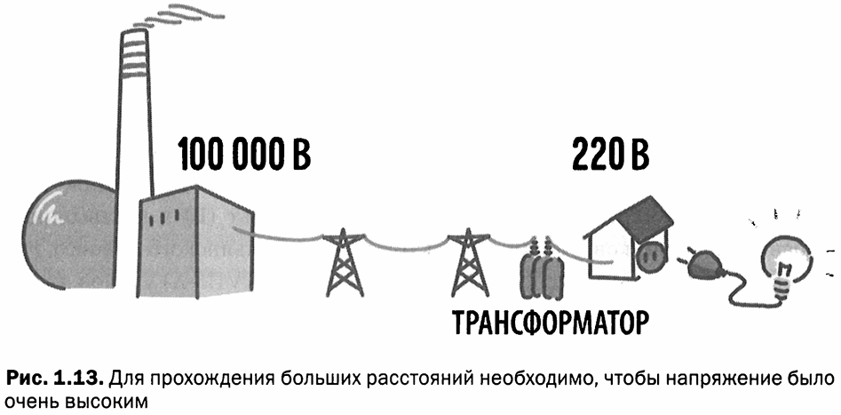

*Рис. 1.13 — Для прохождения больших расстояний необходимо, чтобы напряжение было очень высоким*

Сетевое напряжение, поступающее в наши дома и используемое для бытовых электроприборов, равно 220 вольт. Небольшие электроприборы для своей работы используют более низкое напряжение — 12 или 5 вольт. Через подключённый к компьютеру USB-кабель подаётся напряжение 5 вольт. <mark><strong>Большая разница потенциалов очень опасна</strong></mark> (<mark><strong>хотя, как правило, следует учитывать сочетание силы тока и напряжения</strong></mark>), так как ток высокого напряжения может преодолевать препятствия, проникая даже сквозь слои изолирующего материала. Например, молния может преодолеть слой атмосферы в несколько километров, перед тем как достигнет земли.

<mark><strong>Чтобы предотвратить повреждение цепи и обезопасить себя, необходимо</strong></mark> удостовериться, что:

- <mark><strong>напряжение в сети соответствует требованиям конкретного устройства</strong></mark> или собираемой схемы;
- <mark><strong>источник питания может обеспечить необходимую силу тока.</strong></mark>

Питание в цепи подаётся от **генератора** — источника питания, батареи или другого объекта, способного обеспечить электрическое питание требуемого напряжения и силы тока.

> **Генератор (источник питания)** — <mark><strong>устройство, обеспечивающее электрическое питание цепи с требуемыми напряжением и силой тока.</strong></mark>

Представим, что источник питания — это поток воды, а цепь — водяная мельница. Если мельничное колесо слишком велико, слабый поток воды не сможет его сдвинуть. Если же струя воды будет слишком сильной по сравнению с маленьким мельничным колесом, то падающая вода может это колесо повредить или даже полностью его разрушить (рис. 1.14).

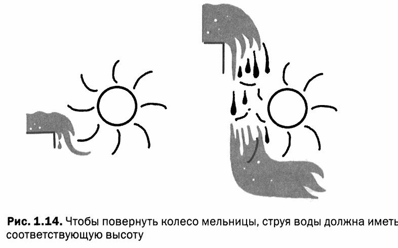

*Рис. 1.14 — Чтобы повернуть колесо мельницы, струя воды должна иметь соответствующую высоту*

Цепь не будет работать, если напряжение источника питания ниже необходимого (рис. 1.15). Если попытаться запитать одной батарейкой электрическое устройство, которому для питания требуются три батарейки, это устройство вряд ли проявит какие-либо признаки жизни. Если подключить к этому устройству четыре или пять батареек, есть риск его сжечь.

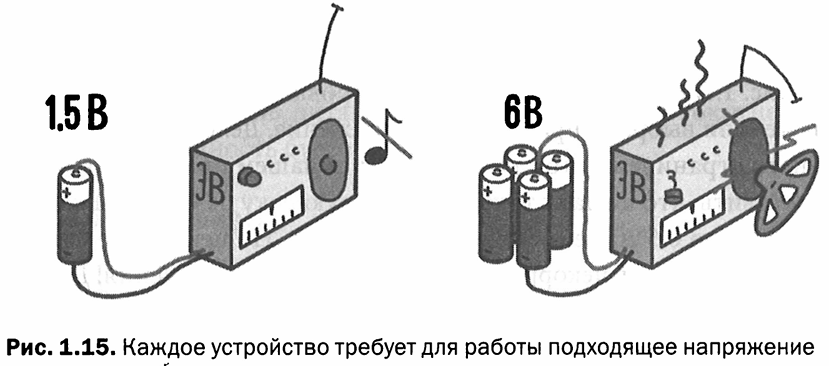

*Рис. 1.15 — Каждое устройство требует для работы подходящее напряжение*

<mark><strong>Каждая цепь потребляет определённое количество электрического тока.</strong></mark> Если обеспечить её малым током, цепь работать не будет, или её работа будет некорректной. Представьте, что вы находитесь на берегу полноводной реки. Если установить трубу, из которой будет поступать вода, вращающая мельницу, труба наполнится водой, которая будет вращать мельничное колесо (рис. 1.16).

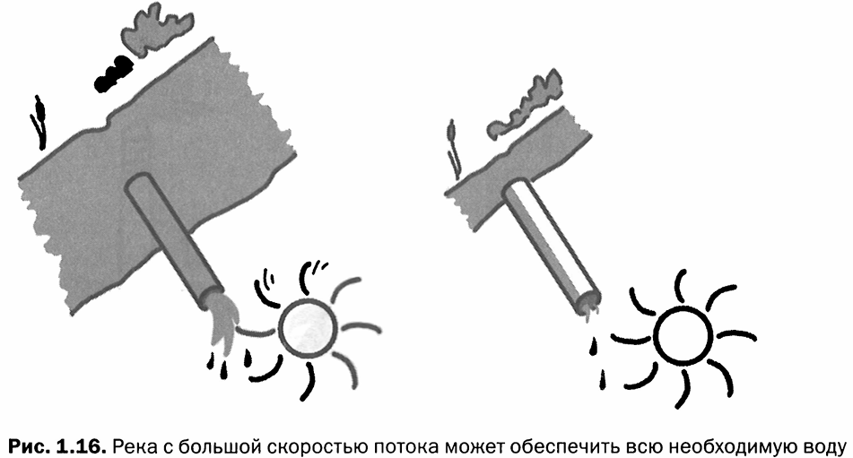

*Рис. 1.16 — Река с большой скоростью потока может обеспечить всю необходимую воду*

На берегу небольшой ленивой речки, текущей с маленькой скоростью, если установить водозаборную трубу, ей будет сложно заполнить трубу и создать необходимый напор, и мельничное колесо не будет вращаться.

В лаборатории есть регулируемый источник питания, позволяющий выставлять нужное напряжение и ток. Чтобы включить цепь, которая требует 5 В с силой тока 1 А, нужно выставить напряжение ровно на 5 В (или чуть меньше). Если повысить напряжение до 7 В, цепь сгорит. Источник питания также имеет регулировку тока (рис. 1.17). Если ток установлен на уровне 0 А, цепь будет выключена, даже если выбрано правильное напряжение — из-за искусственного ограничения ток течь не будет. Если повысить силу тока до 0,5 А, цепь может и заработать, но некоторые устройства могут начать работать некорректно или получить повреждения. Доведя ток до одного ампера, цепь заработает должным образом. Если ограничить ток 15 амперами, ничего не взорвётся — цепь лишнего не возьмёт. Это как если опустить трубу в полноводную реку: труба полностью заполнится, и к мельнице будет поступать только необходимое количество воды.

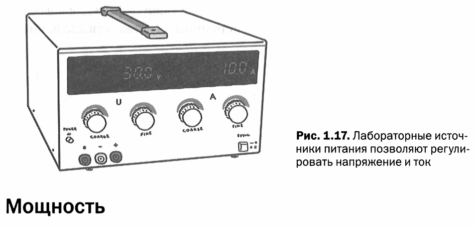

*Рис. 1.17 — Лабораторные источники питания позволяют регулировать напряжение и ток*

## 7. Мощность

Чтобы переместить любую вещь, нужно затратить энергию. Это справедливо и для перемещения даже таких крошечных частиц, как электроны. Перемещение может происходить за разный промежуток времени: за одну секунду, за один час или один год. Чем выше скорость перемещения, тем больше затрачиваемая мощность.

> **Электрическая мощность** —<mark><strong> количество затраченной энергии, поделённое на время:</strong></mark> энергии потребуется тем больше, чем быстрее будет происходить перемещение.

> **Ватт (Вт)** — единица измерения электрической мощности. Названа в честь Джеймса Уатта, жившего в начале XIX века и исследовавшего тягловую силу паровых машин, измеряя затраченное время и энергию.

Электрическая мощность для электрических цепей может быть рассчитана путём умножения измеренного напряжения между выводами диполя на ток, проходящий через него:

$$P = U \cdot I$$

где:

- $P$ — мощность, Вт;
- $U$ — напряжение, В;
- $I$ — сила тока, А.

**Пример расчёта.** Если у нас есть цепь, питающаяся от 9 В батарейки, и ток в цепи 1 А, то потребляемая мощность будет равна:

$$P = 9\ \text{В} \cdot 1\ \text{А} = 9\ \text{Вт}$$

Эта формула позволяет точно рассчитать мощность, потребляемую цепью постоянного тока. Для переменного тока формула расчёта мощности сложнее, и здесь она не рассматривается.

Даже если результат будет приближенным, эту формулу мощности можно использовать для определения тока, потребляемого каким-нибудь бытовым прибором. Если в инструкции или на корпусе фена для волос указана мощность 1000 Вт, а напряжение источника питания сети 220 В, можно рассчитать потребление тока:

$$I = \frac{P}{U} = \frac{1000}{220} \approx 4{,}5\ \text{А}$$

## 8. Время и частота

Ещё один важный параметр в электронных схемах — это время, но говорят не о времени, а о частоте.

> **Частота** — число событий или циклов, которые происходят за одну секунду.

> **Герц (Гц)** — единица измерения частоты. Названа в честь немецкого учёного-физика XIX века Генриха Рудольфа Герца.

Например, если ударять в барабан четыре раза в секунду, будет произведён звук частотой 4 герц. Таким образом, удары разделены друг от друга временем:

$$T = \frac{1\ \text{(секунда)}}{4\ \text{(удара)}} = 0{,}25\ \text{с}$$

Формула, по которой рассчитывается частота:

$$f = \frac{1}{T}$$

где:

- $f$ — частота, Гц;
- $T$ — период, с.

> **Период (T)** — общая продолжительность повторяющегося события. Для переменного тока период — это время, необходимое для прохождения переменным током одного полного цикла: начиная с 0 вольт, достигая максимума, затем спускаясь до минимального значения и снова возвращаясь к 0 вольт (рис. 1.18).

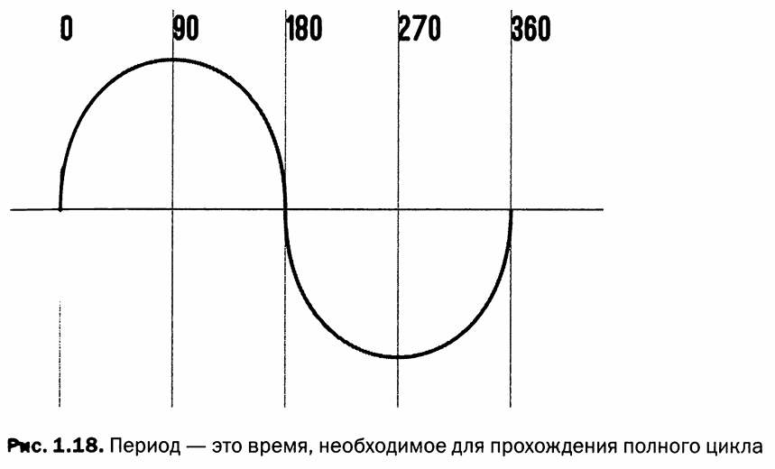

*Рис. 1.18 — Период — это время, необходимое для прохождения полного цикла*

Постоянные токи имеют частоту 0 Гц, так как в этом случае направление потока электронов неизменно.

При расчётах числа с большим количеством нулей как до, так и после запятой не очень удобны. Поэтому в расчётах используются герцы (Гц), а не события, происходящие каждые 0,00000012 сек.

---

## FAQ

**Вопрос: В чём разница между постоянным и переменным током?**

**Ответ:** Постоянный ток (DC) течёт в одном направлении, и его значение не меняется во времени. Переменный ток (AC) периодически меняет направление. Постоянный ток используется в электронных схемах и питается от батарей или аккумуляторов. Переменный ток поступает в дома от электростанций, потому что его легче передавать на большие расстояния.

**Вопрос: Почему электроны движутся от отрицательного полюса к положительному, а на схемах принято обратное направление?**

**Ответ:** Это историческая условность, введённая Бенджамином Франклином, который предположил, что ток течёт от положительного полюса к отрицательному. В то время ещё не было известно, что носителями заряда являются отрицательно заряженные электроны. Условное направление тока от «+» к «−» сохранилось в технике до сих пор.

**Вопрос: Опасно ли высокое напряжение само по себе?**

**Ответ:** Опасность представляет сочетание напряжения и силы тока. Высокое напряжение опасно тем, что может «пробить» изоляцию и создать большой ток через тело человека. Даже небольшой ток (порядка десятков миллиампер) может быть смертельным, если проходит через сердце. Поэтому важно соблюдать осторожность при работе с любым напряжением выше безопасного уровня (обычно считается, что безопасное напряжение — до 36 В).

**Вопрос: Как рассчитать мощность, если известны напряжение и ток?**

**Ответ:** Мощность рассчитывается по формуле $P = U \cdot I$, где $P$ — мощность в ваттах, $U$ — напряжение в вольтах, $I$ — ток в амперах. Например, при напряжении 9 В и токе 1 А мощность составит 9 Вт.

**Вопрос: Что такое частота 50 Гц в домашней розетке?**

**Ответ:** Частота 50 Гц означает, что переменный ток в розетке меняет своё направление 50 раз в секунду, то есть совершает 50 полных циклов за одну секунду. Период одного цикла составляет $T = 1/50 = 0{,}02$ секунды (20 миллисекунд).