

<strong>Кратко</strong>
<table><tr><td>

**Электронные компоненты**

Глава знакомит с основными типами электронных компонентов, принципами их работы, обозначениями на схемах и правилами использования. Компоненты делятся на **пассивные** (не усиливают сигнал) и **активные** (способны усиливать или управлять током).

**Резисторы**
Это компоненты, ограничивающие ток, подобно узкой трубе в водяном потоке. Сопротивление измеряется в **омах**. На корпусе резистора номинал обозначается цветными кольцами, которые считываются по таблице цветов. Существуют стандартные ряды номиналов. При протекании тока резистор выделяет тепло, поэтому важно учитывать допустимую мощность рассеивания.
*   **Последовательное соединение:** Общее сопротивление равно сумме номиналов.
*   **Параллельное соединение:** Общая проводимость увеличивается; для двух резисторов формула: `R = (R1*R2)/(R1+R2)`. Общее сопротивление всегда меньше наименьшего из соединенных.
*   **Делитель напряжения:** Два последовательных резистора позволяют получить меньшее напряжение от источника.
*   **Делитель тока:** Параллельные резисторы разделяют общий ток на части.
*   **Переменные резисторы:** **Потенциометры** и **подстроечные резисторы** позволяют регулировать сопротивление. Они могут работать как реостаты или делители напряжения.

**Специальные резисторы**
*   **Терморезисторы:** Сопротивление меняется от температуры (NTC – уменьшается с нагревом, PTC – увеличивается).
*   **Фоторезисторы:** Сопротивление меняется от освещенности. Используются как датчики света.
*   **Датчики температуры:** Специализированные схемы (например, LM35) дают точное напряжение, пропорциональное температуре.

**Светодиоды (LED)**
Это диоды, излучающие свет. Они имеют полярность: **анод** (длинная ножка, «+») и **катод** (короткая ножка, «-»). Для работы им нужно напряжение около 2–3 В (в зависимости от цвета) и ток 10–20 мА, иначе они сгорят. Для управления яркостью используется **ШИМ** (широтно-импульсная модуляция) — быстрое включение и выключение с разной длительностью импульсов.

**Конденсаторы**
Компоненты, накапливающие электрический заряд, подобно стакану для воды. Емкость измеряется в **фарадах**. Они пропускают переменный ток (оказывая ему сопротивление, называемое реактивным) и блокируют постоянный ток в установившемся режиме.
*   **Типы:** Керамические, электролитические (имеют полярность), лавсановые.
*   **Соединение:** Параллельное — емкость суммируется; последовательное — общая емкость уменьшается (формула как у параллельных резисторов).

**Катушки индуктивности**
Это намотанный провод. Они пропускают постоянный ток, но сопротивляются переменному току (индуктивное сопротивление растет с частотой). Индуктивность измеряется в **генри**. Используются в фильтрах, дросселях и трансформаторах. **Трансформатор** состоит из двух катушек на одном сердечнике и служит для преобразования напряжения.

**Механические компоненты**
*   **Кнопки и переключатели:** Механические устройства для замыкания/размыкания контактов. Классифицируются как SPST, SPDT, DPST, DPDT и т.д.
*   **Реле:** Электрически управляемый переключатель. Слаботочная цепь через электромагнит управляет контактами, коммутирующими мощную нагрузку.
*   **Оптопары:** Состоят из светодиода и фототранзистора, обеспечивая гальваническую развязку цепей.

**Устройства вывода и ввода**
*   **Электродвигатели:** Преобразуют электричество в механическое движение. Бывают постоянного тока, шаговые (точное позиционирование) и серводвигатели (поворот на заданный угол с усилием).
*   **Громкоговорители:** Преобразуют электрический сигнал в звук.
*   **Микрофоны:** Преобразуют звуковые колебания в электрический сигнал.

</td></tr></table>

# Электронные компоненты

## Введение

В этой главе рассматриваются основные типы электронных компонентов, используемых при реализации проектов. Для каждого элемента приводится описание принципов работы, обозначение на схеме и правила использования.

> **Диполь** — <mark><strong>обобщённое обозначение электронного элемента с двумя выводами</strong></mark> (контактами), соединёнными с телом элемента.

Компоненты делятся на пассивные и активные:

> **Пассивные компоненты** —  <mark><strong>элементы, которые не усиливают амплитуду напряжений</strong></mark> и протекающих через них токов.

> **Активные компоненты** — <mark><strong>элементы, которые, как правило, подключены к электропитанию и способны усиливать проходящий через них сигнал.</strong></mark>

Диод относят к числу активных компонентов, хотя он и не усиливает сигнал: эта технология заложила основу для реализации всех остальных активных компонентов.

Каждый компонент обозначается определённым символом, который используется при проектировании электрических схем. На практике количество электронных компонентов насчитывается сотнями тысяч. Чтобы разбираться в них, нужен небольшой опыт и знание принятых производителями правил обозначения компонентов и их цветовой кодировки. Например, номинал большинства резисторов обозначается тремя, четырьмя или пятью цветными кольцами на его корпусе. Если компоненты помечены символом, можно сделать запрос в Интернете и получить описание, технические характеристики или технический паспорт с описаниями, таблицами, схемами, инструкциями, размерами и примерами использования.

---

## 1. Резисторы

<mark><strong>Резисторы ограничивают поток электрического тока.</strong></mark> Представьте, что вы поливаете розы в саду из резинового шланга, как вдруг поток воды прекращается. Вы поворачиваетесь и видите своего друга, который наступил ногой на шланг, уменьшив тем самым поток воды. Резисторы в электрической цепи исполняют роль узкой трубки (рис. 2.1).

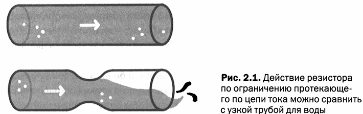

*Рис. 2.1 — Действие резистора по ограничению протекающего по цепи тока можно сравнить с узкой трубой для воды*

> **Резистор** — пассивный электронный компонент, ограничивающий поток электрического тока, изготовленный из материалов с определённым удельным сопротивлением.

Резисторы изготовлены из материалов, которые обеспечивают определённое сопротивление прохождению тока. Например, резистивным материалом является графит — тот же материал, что используется в грифеле простого карандаша. Во время арктической экспедиции дирижабля «Италия» Умберто Нобиле использовал графит, чтобы отремонтировать радио и послать сообщение о том, что требуется помощь.

Низкое значение сопротивления аналогично широкой трубе или материалу, который почти не препятствует прохождению электрического тока. Высокое значение сопротивления означает, что лишь малое количество электронов может проходить через материал.

> **Ом (Ω)** — единица измерения электрического сопротивления. Названа в честь немецкого учёного Георга Симона Ома (1787–1854).

Медь является хорошим проводником, потому что она имеет очень низкое значение удельного сопротивления, почти нулевое: $0{,}0000000169$ Ом на 1 метр проводника (Ом·м). Железо также хорошо проводит ток, но немного хуже, чем медь. Стекло совершенно не проводит ток: его удельное сопротивление составляет $10^{14}$ Ом·м. Резисторы, используемые в электронных схемах, имеют значения сопротивления в диапазоне от нескольких Ом до нескольких миллионов Ом.

### 1.1. Цветовая маркировка резисторов

Наиболее часто используемый тип резистора выглядит как небольшая колбаска с выпуклыми концами и с цветными полосами, которые используются для идентификации значения его сопротивления. <mark><strong>В большинстве случаев на корпус резистора наносятся четыре полосы, одна из которых, расположенная на конце</strong></mark>, очень часто золотистого цвета.

Чтобы считать значение сопротивления:

1. Взять резистор так, чтобы золотистая полоса оказалась справа.
2. Считать цветные полосы слева направо.
3. Определить значение, используя таблицу цветов (табл. 2.1).

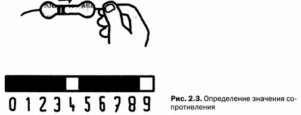

*Рис. 2.3 — Определение значения сопротивления*

**Таблица 2.1. Цветовые коды для считывания значения сопротивления резисторов**

| Цвет | Значение |
|---|---|
| Чёрный | 0 |
| Коричневый | 1 |
| Красный | 2 |
| Оранжевый | 3 |
| Жёлтый | 4 |
| Зелёный | 5 |
| Синий | 6 |
| Сиреневый | 7 |
| Серый | 8 |
| Белый | 9 |

**Пример чтения маркировки.** На резисторе нанесены полосы: коричневая, чёрная, жёлтая и золотая.

1. Золотая полоса — справа.
2. Первая полоса — коричневая: записываем «1».
3. Вторая полоса — чёрная: записываем «0».
4. Третья полоса — жёлтая: записываем «4».
5. На листе написано «1 0 4», но это не значение сопротивления (рис. 2.4).

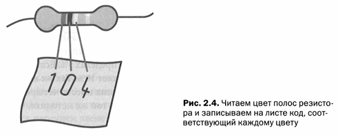

*Рис. 2.4 — Читаем цвет полос резистора и записываем на листе число, соответствующее каждому цвету*

6. Удаляем третью цифру и заменяем её количеством нулей, равным значению третьей цифры: удаляем «4» и записываем четыре нуля «0 0 0 0» (рис. 2.5).

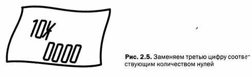

*Рис. 2.5 — Заменяем третью цифру соответствующим количеством нулей*

7. Сопротивление равно 100000 Ом = 100 кОм.

**Правила записи сопротивлений:**

- значения до 999 Ом записываются без сокращений;
- числа, превышающие тысячу, записываются с буквой «к» (кило):

$$1\ \text{кОм} = 1000\ \text{Ом}$$
$$10\ \text{кОм} = 10000\ \text{Ом}$$
$$100\ \text{кОм} = 100000\ \text{Ом}$$

- для обозначения миллиона Ом используется буква «М»:

$$1\ \text{МОм} = 1000000\ \text{Ом}$$

Буква «к» или «М» также используется в качестве разделителя разрядов:

$$2\text{к}2\ \text{Ом} = 2200\ \text{Ом}$$
$$4\text{к}7\ \text{Ом} = 4700\ \text{Ом}$$
$$3\text{М}3\ \text{Ом} = 3300000\ \text{Ом}$$

Последняя цветная полоса указывает на точность значения сопротивления. Золотистый цвет означает, что значение сопротивления может колебаться в пределах **5%**. Если четвёртая полоса серебристого цвета, погрешность составляет **10%**. Существуют элементы с повышенной точностью (1–2%): на них нанесены пять цветных полос, которые считываются по той же методике.

Резисторы производят только определённых номиналов. Допустимые значения соответствуют определённым рядам. Например, не существует сопротивления 21 Ом, но есть сопротивление на 22 или 18 Ом. Нет элементов с сопротивлением 500 кОм, но доступны с 470 кОм или 560 кОм.

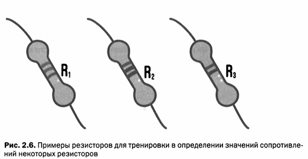

*Рис. 2.6 — Примеры резисторов для тренировки в определении значений сопротивлений*

### 1.2. Обозначение резистора на схеме

Символ, который используется для обозначения резисторов на схемах — прямоугольник с двумя выводами. В мире также используются обозначения для резисторов в виде линии зигзагообразной формы (рис. 2.7).

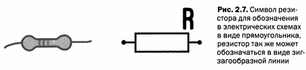

*Рис. 2.7 — Символ резистора для обозначения в электрических схемах в виде прямоугольника; резистор также может обозначаться в виде зигзагообразной линии*

Рядом с символом обычно указывается номинал элемента (значение сопротивления) и наименование элемента в данной схеме (например, R1). Если указано только наименование, электрическая схема сопровождается перечнем элементов, в котором рядом с каждым наименованием указаны номиналы.

### 1.3. Типы и мощность резисторов

В большинстве случаев корпуса резисторов выпускаются в форме колбаски. <mark><strong>При прохождении электрического тока через резистор данный элемент выделяет тепло.</strong></mark> Если через резистор потечёт ток с силой, превосходящей расчётное значение, резистор перегреется и выйдет из строя. <mark><strong>Рассеиваемая на резисторе тепловая энергия должна быть всегда меньше, чем предельная рассеиваемая тепловая энергия элемента.</strong></mark> Наиболее распространены резисторы на 1/4 Вт. Также существуют резисторы мощностью 1/8 Вт, 1/16 Вт и более мощные — на 1/2, 1 или 2 Вт.

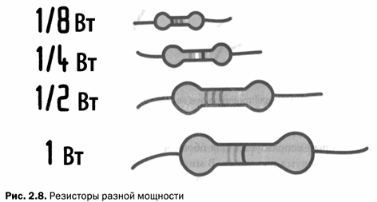

*Рис. 2.8 — Резисторы разной мощности*

Существуют резисторы с керамическим корпусом на 5, 10 и даже до 20 Вт (рис. 2.9).

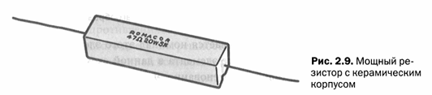

*Рис. 2.9 — Мощный резистор с керамическим корпусом*

Если рассеиваемая тепловая энергия значительна, могут использоваться резисторы с охлаждающими рёбрами.

Современная электроника миниатюрна. **Компоненты, используемые в промышленном производстве, изготавливаются по технологии поверхностного монтажа** (**SMD**, Surface Mount Device). Резисторы такого типа похожи на небольшие чёрные кирпичики с указанным сверху значением: например, надпись **103** обозначает номинал сопротивления $10 \cdot 10^3 = 10000$ Ом. Третья цифра в этой надписи обозначает количество нулей (рис. 2.10).

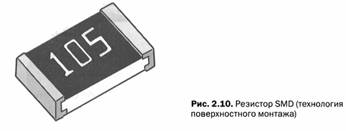

*Рис. 2.10 — Резистор SMD (технология поверхностного монтажа)*

---

## 2. Последовательное и параллельное включение резисторов

### 2.1. Последовательное соединение

Соединив два резистора «паровозиком» так, чтобы один вывод соединился с другим, получается **последовательное соединение**. Ток, который поступает в первый резистор, проходит через него и поступает во второй резистор (рис. 2.11).

> **Последовательное соединение** — соединение элементов, при котором вывод одного элемента соединяется с выводом другого, образуя цепочку, по которой течёт один и тот же ток.

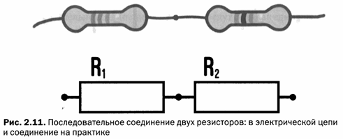

*Рис. 2.11 — Последовательное соединение двух резисторов: в электрической цепи и соединение на практике*

<mark><strong>Два резистора, соединённые последовательно, ведут себя как один резистор</strong></mark>, значение которого равно сумме двух сопротивлений. Это можно объяснить с помощью гидравлических явлений: два узких горла, одно за другим, равнозначны одному более узкому проходу, так как эффекты суммируются (рис. 2.12).

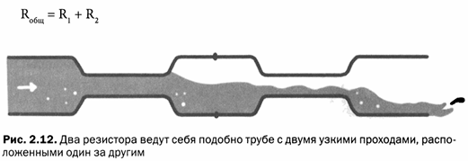

*Рис. 2.12 — Два резистора ведут себя подобно трубе с двумя узкими проходами, расположенными один за другим*

Формула для последовательного соединения резисторов:

$$R_{\text{общ}} = R_1 + R_2$$

Например, если $R_1 = 100$ Ом, а $R_2 = 50$ Ом, общее сопротивление будет равно:

$$R_{\text{общ}} = 100 + 50 = 150\ \text{Ом}$$

Для более чем двух резисторов:

$$R_{\text{общ}} = R_1 + R_2 + R_3 + \ldots + R_n$$

### 2.2. Параллельное соединение

При **параллельном соединении** два резистора укладываются корпусами параллельно друг другу, и их выводы соединяются между собой: вывод одного резистора соединяется с выводом другого с одной стороны, и таким же образом соединяются два других вывода (рис. 2.13).

> **Параллельное соединение** — соединение элементов, при котором их выводы соединяются попарно, <mark><strong>образуя несколько параллельных путей для тока.</strong></mark>

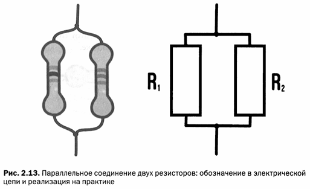

*Рис. 2.13 — Параллельное соединение двух резисторов: обозначение в электрической цепи и реализация на практике*

В этом случае ток на входе этих двух элементов попадает на перепутье и разделяется. Если соединённые резисторы имеют одинаковое значение, ток разделится пополам. В противном случае через резистор с меньшим сопротивлением потечёт больший ток.

Мысленно заменим резисторы трубами: у нас есть два узких прохода, но размер конечного стока равен сумме двух узких проходов (рис. 2.14).

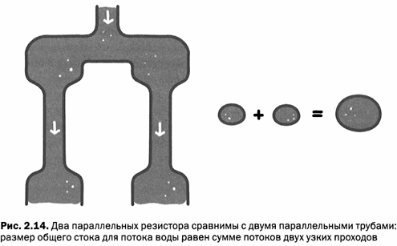

*Рис. 2.14 — Два параллельных резистора сравнимы с двумя параллельными трубами: размер общего стока для потока воды равен сумме потоков двух узких проходов*

Два параллельно соединённых резистора ведут себя как единый компонент. Если два резистора имеют одинаковое сопротивление, общее значение равно половине значения одного сопротивления: два резистора по 150 Ом эквивалентны одному резистору с сопротивлением 75 Ом.

Формула для двух резисторов с разными значениями:

$$R_{\text{общ}} = \frac{R_1 \cdot R_2}{R_1 + R_2}$$

Общая формула для любого числа параллельных резисторов:

$$\frac{1}{R_{\text{общ}}} = \frac{1}{R_1} + \frac{1}{R_2} + \ldots + \frac{1}{R_n}$$

### 2.3. Пример расчёта эквивалентного сопротивления

Попробуем вычислить эквивалентное сопротивление для схемы из нескольких резисторов, показанной на рисунке 2.15. Расчёт эквивалентного сопротивления — это математический процесс определения общего значения сопротивления, образованного соединением группы резисторов. Следует действовать шаг за шагом, упрощая группы резисторов.

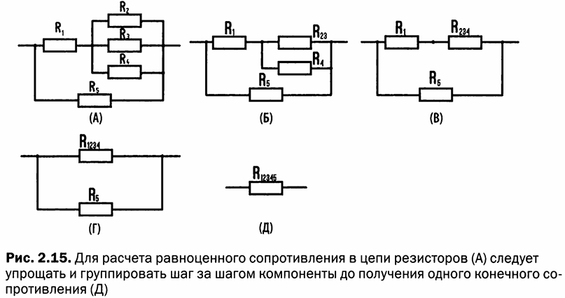

*Рис. 2.15 — Для расчёта равноценного сопротивления в цепи резисторов (А) следует упрощать и группировать шаг за шагом компоненты до появления одного конечного сопротивления (Д)*

**Исходные данные:**

- $R_1 = 10$ Ом
- $R_2 = 100$ Ом
- $R_3 = 47$ Ом
- $R_4 = 56$ Ом
- $R_5 = 120$ Ом

**Шаг 1.** Рассчитаем параллельно соединённые резисторы R2 и R3:

$$R_{23} = \frac{R_2 \cdot R_3}{R_2 + R_3} = \frac{100 \cdot 47}{100 + 47} = \frac{4700}{147} = 31{,}97\ \text{Ом}$$

**Шаг 2.** Рассчитаем параллельно соединённые R23 и R4:

$$R_{234} = \frac{R_{23} \cdot R_4}{R_{23} + R_4} = \frac{31{,}97 \cdot 56}{31{,}97 + 56} = \frac{1790{,}32}{87{,}97} = 20{,}35\ \text{Ом}$$

**Шаг 3.** Получили два последовательно включённых элемента: R1 и R234:

$$R_{1234} = R_1 + R_{234} = 10 + 20{,}35 = 30{,}35\ \text{Ом}$$

**Шаг 4.** Рассчитаем параллельно включённые резисторы R1234 и R5:

$$R_{\text{общ}} = \frac{R_{1234} \cdot R_5}{R_{1234} + R_5} = \frac{30{,}35 \cdot 120}{30{,}35 + 120} = \frac{3642}{150{,}35} = 24{,}22\ \text{Ом}$$

---

## 3. Делитель напряжения и тока

### 3.1. Делитель напряжения

<mark><strong>Соединив последовательно два резистора, получается</strong></mark> **делитель напряжения** — цепь, которая служит для разделения напряжения и уменьшения его значения (рис. 2.17).

> **Делитель напряжения** — цепь из последовательно соединённых резисторов, позволяющая получить на выходе напряжение, составляющее часть входного напряжения.

Делитель напряжения необходим, когда, например, от батарейки напряжением 9 В требуется получить напряжение 3 В. Какие резисторы необходимы для этого? Прежде всего решим, ток какой силы будет протекать через эту пару резисторов. Пусть через цепь должен течь ток силой 10 мА.

**Исходные данные:**

- $I = 10$ мА
- $U_{\text{вход}} = 9$ В
- $U_1 = 3$ В (требуемое напряжение на резисторе R1)

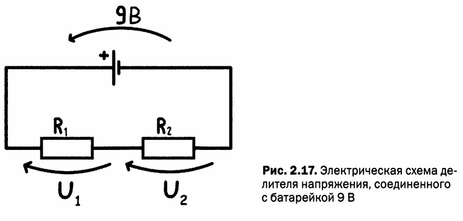

*Рис. 2.17 — Электрическая схема делителя напряжения, соединённого с батарейкой 9 В*

Следуя по цепи, образованной делителем и батарейкой, суммируя напряжения:

$$U_{\text{батарея}} - U_1 - U_2 = 0$$

$$U_2 = U_{\text{батарея}} - U_1 = 9 - 3 = 6\ \text{В}$$

Вычислим R1 с помощью закона Ома:

$$R_1 = \frac{U_1}{I} = \frac{3\ \text{В}}{10\ \text{мА}} = \frac{3}{0{,}01} = 300\ \text{Ом}$$

Вычислим R2:

$$R_2 = \frac{U_2}{I} = \frac{6\ \text{В}}{10\ \text{мА}} = 600\ \text{Ом}$$

**Проверка.** Общее сопротивление цепи:

$$R_{\text{общ}} = R_1 + R_2 = 300 + 600 = 900\ \text{Ом}$$

Сила тока:

$$I = \frac{U}{R_{\text{общ}}} = \frac{9}{900} = 0{,}01\ \text{А} = 10\ \text{мА}$$

Расчёты верны. На практике ситуация будет немного другой, потому что нет стандартного сопротивления 600 Ом. Наиболее близкое значение — 560 Ом.

> **Примечание:** делитель напряжения — это не регулятор напряжения. Когда к точке подключения подсоединяется ещё одна цепь, общая цепь изменяется. В последующих главах будет рассказано, как построить схемы, менее подверженные влиянию подключаемых цепей.

### 3.2. Делитель тока

Два (или более) резистора, включённых параллельно, образуют **делитель тока**, разделяя ток на различные ветви цепи (рис. 2.18).

> **Делитель тока** — <mark><strong>цепь из параллельно соединённых резисторов, разделяющая входной ток на токи в отдельных ветвях пропорционально проводимостям ветвей.</strong></mark>

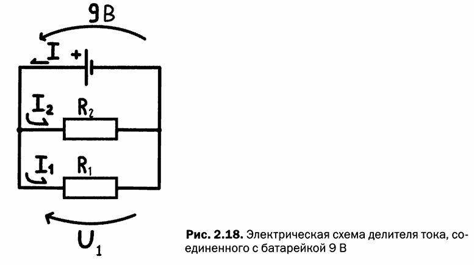

*Рис. 2.18 — Электрическая схема делителя тока, соединённого с батарейкой 9 В*

Пусть нужно пропустить через две ветви токи 10 мА и 20 мА:

- $I_1 = 10$ мА
- $I_2 = 20$ мА
- $U = 9$ В

Сопротивление для первой ветви:

$$R_1 = \frac{U}{I_1} = \frac{9\ \text{В}}{10\ \text{мА}} = 900\ \text{Ом}$$

Сопротивление для второй ветви:

$$R_2 = \frac{U}{I_2} = \frac{9\ \text{В}}{20\ \text{мА}} = 450\ \text{Ом}$$

Общее сопротивление, подключённое к батарейке:

$$R_{\text{общ}} = \frac{R_1 \cdot R_2}{R_1 + R_2} = \frac{900 \cdot 450}{900 + 450} = \frac{405000}{1350} = 300\ \text{Ом}$$

Общий ток, обеспечиваемый батарейкой, равен сумме токов в двух ветвях:

$$I_{\text{общ}} = I_1 + I_2 = 10 + 20 = 30\ \text{мА}$$

Этот ток можно также получить делением напряжения батарейки на полное сопротивление:

$$I_{\text{общ}} = \frac{U}{R_{\text{общ}}} = \frac{9}{300} = 0{,}03\ \text{А} = 30\ \text{мА}$$

---

## 4. Подстроечный резистор и потенциометр

Чтобы увеличить громкость звука колонок или стереосистемы, поворачивается регулятор, изменяющий значение сопротивления. Этот регулятор называется **потенциометром**.

> **Потенциометр** —<mark><strong> переменный резистор с тремя выводами и валом</strong></mark>, сопротивление которого изменяется при вращении вала.

Потенциометр имеет три вывода и вал. Вал соединён с ползуном, который скользит по полосе резистивного материала, расположенного по кругу. Максимальное вращение составляет около 270 градусов, а сопротивление может изменяться от минимального значения (0 Ом) до максимального значения, которое, как правило, написано на элементе. Существуют специальные многооборотные компоненты, которые могут совершать более одного оборота. При вращении вала, в зависимости от направления вращения, сопротивление компонента растёт или убывает, как правило, линейно. Существуют потенциометры, сопротивление которых растёт логарифмически (часто используются в качестве регуляторов громкости).

> **Подстроечный резистор** —<mark><strong> переменный резистор, монтируемый прямо в печатную плату, без вала, с прорезью для регулировки сопротивления отвёрткой.</strong></mark> Используется для предварительной регулировки устройства.

Подстроечные резисторы не имеют вала, но в центре элемента находится прорезь для регулирования сопротивления с помощью отвёртки. Они используются для установки значений, которые не будут часто изменяться.

Гидравлическая модель подстроечного резистора: конусообразная труба, снабжённая подвижным клапаном (рис. 2.19). Когда клапан находится вверху, вода проходит без преграды, но по мере опускания клапана сечение трубы уменьшается, ограничивая прохождение воды.

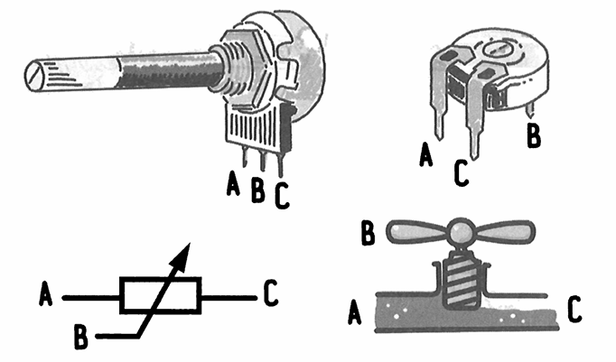

*Рис. 2.19 — Гидравлическая упрощённая модель подстроечного резистора: кран с винтообразным клапаном*

Подстроечные резисторы и потенциометры имеют три вывода и могут использоваться в качестве:

- **регулируемых делителей напряжения** — при этом из центрального вывода выходит промежуточное напряжение, прикладываемое к двум другим выводам;
- **реостатов (переменных резисторов)** — при этом используются только два вывода, и компонент ведёт себя как резистор с изменяемым значением.

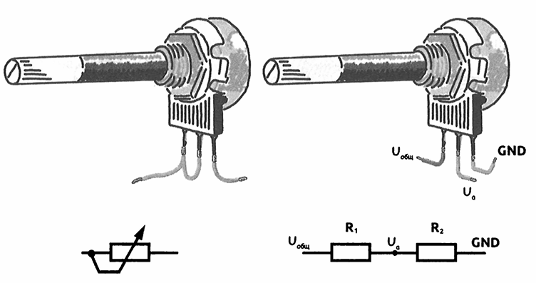

*Рис. 2.20 — Потенциометр, подключённый в качестве реостата и в качестве делителя напряжения*

---

## 5. Измерение сопротивления

Измерить сопротивление легко: для этого используется тестер. Устанавливаем регулятор прибора в положение **R** (или Ω) и выбираем необходимое значение.

Так же, как и для измерения силы тока и напряжения, в секторе для измерения сопротивлений есть несколько предельных значений: от нескольких сотен Ом до мегаом. Выставляется наиболее подходящее значение, которое, как правило, немного больше по сравнению с измеряемым сопротивлением. Если ошиблись, ничего страшного не случится: на стрелочном приборе стрелка или не поднимется, или покажет минимальное значение; на дисплее цифрового прибора вы увидите или нули, или минимальное значение.

**Порядок измерения сопротивления:**

1. Включить прибор в режим измерения сопротивления и выбрать предел измерения.
2. Вставить чёрный щуп в гнездо COM, а красный — в гнездо, помеченное буквой R или Ω (рис. 2.21).
3. Прикоснуться щупами к выводам элемента.

<mark><strong>Если элемент впаян в плату, предварительно его нужно выпаять, иначе при измерении получится ошибка. Не обязательно полностью отключать резистор от цепи — достаточно выпаять один из двух выводов резистора.</strong></mark>

---

## 6. Терморезистор

Резисторы — это компоненты, значение сопротивления которых зависит от многих факторов, включая температуру. Этот эффект может быть использован с пользой: были созданы элементы, значение сопротивления которых напрямую зависит от температуры.

> **Терморезистор** — <mark><strong>резистор, изготовленный из материала, удельное сопротивление которого зависит от температуры.</strong></mark>

Терморезисторы изготавливаются из материалов, удельное значение сопротивления которых зависит от температуры: с каждым градусом сопротивление изменяется на постоянную величину. Существуют материалы, сопротивление которых увеличивается с повышением температуры, и материалы, сопротивление которых уменьшается.

В продаже можно найти два типа терморезисторов:

- **ОТК (отрицательный температурный коэффициент)** — с ростом температуры сопротивление понижается;
- **ПТК (положительный температурный коэффициент)** — с ростом температуры сопротивление возрастает.

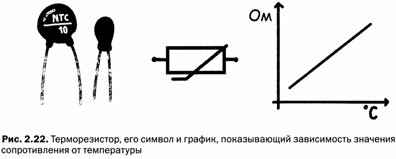

*Рис. 2.22 — Терморезистор, его символ и график, показывающий зависимость значения сопротивления от температуры*

Терморезисторы имеют значение «состояние покоя», которое измеряется при стандартной температуре (обычно около 20 °C) и соответствует нескольким десяткам кОм.

Конструируя делитель напряжения с терморезистором и обычным сопротивлением, можно измерить температуру, считывая падение напряжения на терморезисторе. Напряжение не будет равно данной температуре, но оно изменяется пропорционально (рис. 2.23).

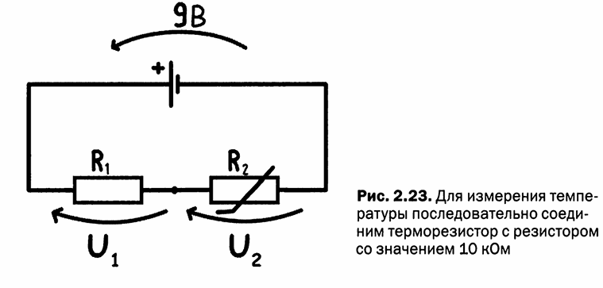

*Рис. 2.23 — Для измерения температуры последовательно соединяется терморезистор с резистором 10 кОм*

Делитель напряжения, подключённый к источнику питания 5 В, состоит из терморезистора в 10 кОм и резистора в 10 кОм. При температуре 20 °C на терморезисторе при измерении будет получено 4,5 В. С изменением температуры сопротивление терморезистора будет меняться, и, следовательно, будет изменяться общее сопротивление, общий ток в цепи и падение напряжения на терморезисторе. Терморезисторы не позволяют сделать точные измерения.

*Рис. 2.24 — Датчик температуры LM35*

Для точного измерения температуры лучше использовать специализированный компонент, например, датчик температуры **LM35** (рис. 2.24). Внешним видом этот компонент напоминает транзистор — небольшой пластмассовый цилиндр с тремя выводами. Внутри он содержит сложную интегральную схему, которая измеряет температуру окружающей среды и выдаёт очень точные и стабильные показания.

Датчик имеет два контакта, на которые подаётся питание (от 4 до 20 В), а третий вывод обеспечивает измерение температуры с шагом 0,1 В на градус. Если на выходе получено 2,5 В, это означает, что температура составляет ровно 25 °C.

---

## 7. Фоторезисторы

Если некоторые резистивные материалы чувствительны к изменениям температуры, то другие чувствительны к изменению света.

> **Фоторезистор** — резистор, изготовленный из материала, электрическое сопротивление которого изменяется при воздействии света (фотонов).

Фоторезисторы изготовлены из специальных материалов: когда на них падает свет (то есть фотоны), значение сопротивления материала изменяется. Изменение не совсем линейное, но существует связь между количеством света, попадающего на компонент, и значением сопротивления. Когда компонент находится в полной темноте, его сопротивление может иметь значения в несколько МОм.

*Рис. 2.25 — Фоторезистор, его символ и график, показывающий поведение элемента при разных уровнях освещения*

Для использования фоторезистора нужно собрать делитель напряжения, в который монтируется новый элемент. Выбирается сопротивление со значением в несколько кОм. К схеме подключается питание напряжением 5 В, а с центрального вывода считывается напряжение, пропорциональное количеству света, попадающего на фоторезистор.

В дополнение к фоторезисторам существуют и другие компоненты:

- **Фотодиод** — ведёт себя как малый генератор тока: фотоны, ударяющиеся об атомы полупроводника, высвобождают свободные электроны и создают на выходе устройства небольшой ток (порядка десятка микроампер). Фотодиоды широко используются в телекоммуникациях, а также могут определять излучения ультрафиолетового и инфракрасного диапазона.

- **Фототранзистор** — работает аналогично фотодиоду, но имеет только два вывода. Использование этого устройства достаточно простое: он ведёт себя как кран, управляемый с помощью света, который контролирует ток между двумя выводами.

*Рис. 2.26 — Фотодиод, фототранзистор и их электронные символы*

---

## 8. Светодиод

Светодиоды — компоненты, излучающие свет, своего рода лампочки. Их обозначают аббревиатурой **LED** (Light Emitting Diode — светоизлучающий диод).

> **Светодиод (LED)** — полупроводниковый компонент, излучающий свет при прохождении через него тока в прямом направлении.

В отличие от лампочки, выводы светодиодов имеют полярность и называются **анодом** и **катодом**. Для работы светодиод должен быть правильно подключён, потому что ток может проходить через компонент только в одном направлении.

> **Анод** — положительный вывод светодиода.

> **Катод** — отрицательный вывод светодиода.

Обычно светодиоды не имеют надписи, позволяющей различить анод и катод. В наиболее распространённой модели с прозрачным цилиндрическим корпусом в виде колпака катод может быть распознан внутри колпака: этот вывод напоминает клюшку для гольфа. Кроме того, катод можно распознать по скосу на линзе светодиода или по длине вывода: вывод катода всегда короче по сравнению с выводом анода.

Светодиод можно представить в виде трубы с обратным клапаном, в которой вода течёт только в одном направлении и вращает вертушку, излучающую свет.

Чтобы включить светодиод, необходимо подать напряжение от 1,2 до 3 В и ток в пределах от 10 до 20 мА: значения напряжения зависят от типа светодиода и цвета свечения (табл. 2.2).

**Таблица 2.2. Напряжение источника питания для светодиода в зависимости от цвета**

| Цвет | Напряжение, В |
|---|---|
| Инфракрасный | 1,3 |
| Красный | 1,9 |
| Жёлтый | 2,0 |
| Зелёный | 2,0 |
| Синий | 3,5 |
| Белый | 3,5 |

Существуют светодиоды, способные излучать невидимый свет в инфракрасном диапазоне: они используются в пультах дистанционного управления, а также в приборах ночного видения в качестве источников «невидимого» света.

**Двухцветные светодиоды** имеют три вывода. Обычно центральный вывод — это катод. Двухцветные светодиоды представляют собой два светодиода, собранных в одном корпусе: общий катод и два анода. Напряжение на аноды подаётся попеременно, включая один или второй диод. Если подать на аноды питание одновременно, получится жёлтый или оранжевый свет (рис. 2.27).

*Рис. 2.27 — Светодиод размером 5 мм, 3 мм, светодиод для поверхностного монтажа (SMD) и символ компонента. На рисунке 5 мм катод имеет более короткий вывод вместе со скосом и особой формой*

**Трёхцветные RGB-светодиоды** состоят из трёх светодиодов в одном корпусе: красный, зелёный и синий. У корпуса четыре вывода: общий катод и три анода. Изменяя интенсивность свечения этих светодиодов, можно получить практически любой цвет (рис. 2.28).

*Рис. 2.28 — Двухцветный светодиод с тремя выводами, RGB-светодиод с четырьмя выводами и их электронные символы*

**Точечные матрицы** — это блоки из нескольких светодиодов, соединённых в сетку или матрицу. **Семисегментный дисплей** состоит из семи светодиодов, с помощью которых можно сформировать любую цифру. Дисплей имеет один общий вывод, который, в зависимости от модели, может быть анодом или катодом. Семь выводов — это контакты соответствующих сегментов, плюс один вывод для отображения точки (рис. 2.29).

*Рис. 2.29 — Массив светодиодов и семисегментный дисплей*

Для простоты управления многоэлементными индикаторами применяются специальные контролирующие интегральные схемы. На вход этих интегральных схем подаётся код знака, который нужно отобразить, а микросхема после обработки сигнала включает соответствующие светодиоды.

Для отображения более сложной информации или графики используются устройства, работа которых основывается на других технологиях. Например, жидкокристаллические (**ЖК**) дисплеи представляют собой большие точечные матрицы. ЖК-дисплей получает команды по последовательному каналу или в виде последовательности цифровых сигналов.

---

## 9. ШИМ-сигналы

На первый взгляд для изменения интенсивности света, излучаемого светодиодом, можно было бы использовать резистор, ограничивающий ток. Однако светодиод включается, если получит на свои выводы определённое напряжение и силу тока. Эти элементы работают по принципу «ВКЛ-ВЫКЛ»: они могут быть или включены, или выключены.

Для изменения интенсивности света следует прибегнуть к одной уловке: включать и выключать светодиод несколько раз в секунду. Это напоминает то, что происходит в кино, где движущееся изображение составлено из множества кадров, проецируемых на экран в быстрой последовательности.

> **ШИМ-сигнал (Широтно-Импульсная Модуляция)** — электрический сигнал, последовательно принимающий значение либо 0 вольт, либо максимальное значение. Последовательность импульсов повторяется очень быстро, а соотношение длительности включённого и выключенного состояния определяет среднюю мощность, подводимую к нагрузке.

Если быстро пролистать сто фотографий включённого светодиода, будет виден фильм со светящимся светодиодом. Если пролистать сто фотографий выключенного светодиода — выключенный светодиод. Если заменить один из снимков включённым светодиодом, покажется слабое свечение. Если бы было пятьдесят снимков включённого и пятьдесят выключенного светодиода, казалось бы, что светодиод светится в половину своей яркости.

*Рис. 2.30 — С помощью ШИМ-сигнала можно регулировать интенсивность яркости свечения светодиода*

Данный эффект в силу инерционности нашего зрения не замечается человеческим глазом — так же, как и в кино. ШИМ-сигналы легко сгенерировать при помощи микроконтроллеров или интегральных схем.

---

## 10. Конденсаторы

> **Конденсатор** — компонент, способный накапливать электрические заряды. Изготовлен в форме «бутерброда» из двух слоёв проводящего материала (обкладок), между которыми находится изоляционный слой (диэлектрик).

Слой из изоляционного материала (иногда это просто воздух) называется **диэлектриком**. Через него не протекает электрический ток, когда конденсатор находится в «рабочем режиме» с постоянным током. В переходных процессах и при изменении тока во времени конденсаторы ведут себя как специализированные резисторы.

Если к конденсатору приложено напряжение, на одной из обкладок накапливаются положительные заряды, на другой — отрицательные.

> **Ёмкость** — способность конденсатора удерживать заряд на пластинах. Выражается в фарадах (Ф), в честь английского физика Майкла Фарадея.

Ёмкость конденсаторов имеет очень широкий диапазон значений: от нескольких пикофарад (пФ) в компонентах для радио и компьютеров до тысяч микрофарад (мкФ) в конденсаторах для мощных источников питания или усилителей.

Конденсатор можно сравнить со стаканом, способным накапливать некоторое количество воды. На самом деле конденсатор больше похож на стакан с небольшим отверстием, через которое вода постепенно вытекает: отверстие — это потери заряда (утечки), которые неизбежно присутствуют в элементе (рис. 2.31).

*Рис. 2.31 — Изображение структуры конденсатора, в котором видны пластины и диэлектрический слой*

### 10.1. Реактивное сопротивление конденсатора

Если через конденсатор подать переменный ток, он будет вести себя как резистор: с увеличением частоты его сопротивление будет уменьшаться всё больше и больше, пока не станет почти нулевым. Правильный термин — не сопротивление, а **реактанс (реактивное сопротивление)**, который по-прежнему выражается в Ом.

> **Реактивное сопротивление (реактанс)** — сопротивление конденсатора или катушки индуктивности переменному току, зависящее от частоты.

Формула для определения реактивного сопротивления конденсатора:

$$X_C = \frac{1}{2\pi f C}$$

где:

- $X_C$ — реактивное сопротивление, Ом;
- $f$ — частота, Гц;
- $C$ — ёмкость, Ф;
- $\pi \approx 3{,}14$.

**Примеры расчёта** для конденсатора ёмкостью 1 мкФ ($10^{-6}$ Ф):

При частоте 50 Гц:

$$X_C = \frac{1}{2\pi \cdot 50 \cdot 10^{-6}} = \frac{10^6}{6{,}28 \cdot 50} = \frac{10^6}{314} \approx 3184\ \text{Ом}$$

При частоте 1 кГц ($10^3$ Гц):

$$X_C = \frac{10^6}{6{,}28 \cdot 10^3} = 159\ \text{Ом}$$

При частоте 100 кГц ($10^5$ Гц):

$$X_C = \frac{10^6}{6{,}28 \cdot 10^5} = 1{,}59\ \text{Ом}$$

### 10.2. Опознавание конденсаторов

Конденсаторы изготавливают с использованием различных технологий, которые отличаются друг от друга типом используемого материала для диэлектрика: керамика, пластик, бумага, специальные жидкости или слюда.

Отдельный тип конденсаторов имеет полярность, которую необходимо соблюдать, чтобы не повредить компонент и чтобы схема работала. Из надписей на корпусе можно узнать ёмкость элемента, максимальное рабочее напряжение и, если это электролитический конденсатор, полярность выводов. Важно, чтобы максимальное напряжение в месте подключения конденсатора не превышало максимально допустимое для данного элемента — в противном случае возможен пробой диэлектрика.

По сравнению с резисторами конденсаторы имеют гораздо более высокие погрешности (около 10% и больше), и их реальное значение может сильно отличаться от номинального.

*Рис. 2.32 — Разные типы конденсаторов: керамический дисковый, электролитический, лавсановый и танталовый*

**Электролитические конденсаторы** содержат диэлектрик, смоченный в жидком растворе. Они имеют цилиндрическую форму; их максимальное рабочее напряжение, номинал и полярность нанесены на корпусе. Диапазон значений ёмкости — от нескольких долей мкФ до нескольких тысяч мкФ.

Символ конденсатора напоминает две пластины с диэлектриком между ними. Если конденсатор имеет полярность, на его символе рядом с пластиной ставится знак «плюс».

**Керамические дисковые конденсаторы** очень распространены, имеют небольшие размеры, не обладают полярностью, и их значения колеблются от нескольких пикофарад до сотен тысяч пикофарад. На их корпусе напечатан код, указывающий номинал и погрешность. Надпись **102K** указывает на ёмкость «10» + два нуля = 1000 пФ. Буква K указывает на погрешность 10% (табл. 2.3).

**Таблица 2.3. Погрешность лавсановых конденсаторов**

| Буква | Погрешность, % |
|---|---|
| F | ±1 |
| G | ±2 |
| J | ±5 |
| K | ±10 |
| M | ±20 |
| Z | +80/−20 |

Примеры обозначений:

- **1p0** или **1P0** = 1 пФ
- **3,3** или **3P3** = 3,3 пФ
- **n12** = 120 пФ

**Лавсановые конденсаторы** похожи на маленький параллелепипед. Надпись **334K100V** означает: «33» + четыре нуля = 330000 пФ, погрешность K = 10%, максимальное напряжение 100 В.

### 10.3. Последовательное и параллельное включение конденсаторов

*Рис. 2.33 — Последовательное и параллельное соединение конденсаторов*

Для увеличения общей ёмкости конденсаторы подключаются **параллельно**. Это равнозначно увеличению площади обкладок:

$$C_{\text{общ}} = C_1 + C_2 + \ldots + C_n$$

Для получения нестандартных значений ёмкости конденсаторы подключаются **последовательно**. Формула напоминает формулу для параллельных резисторов:

$$\frac{1}{C_{\text{общ}}} = \frac{1}{C_1} + \frac{1}{C_2} + \ldots + \frac{1}{C_n}$$

Для двух последовательно включённых конденсаторов:

$$C_{\text{общ}} = \frac{C_1 \cdot C_2}{C_1 + C_2}$$

---

## 11. Компенсаторы и воздушные конденсаторы

Существуют конденсаторы переменной ёмкости. Их ёмкость изменяется с помощью механического привода. Переменные конденсаторы состоят из двух групп пластин: одна группа неподвижна, а другая соединена с валом, который, вращаясь, перемещает свои пластины в воздушном зазоре. При вращении вала пластины, заходя в зазор, увеличивают взаимодействующую площадь, увеличивая ёмкость, или, выходя из зазора, ёмкость уменьшают.

> **Компенсатор (ёмкостный триммер)** — переменный конденсатор небольшой ёмкости (до нескольких десятков пФ), регулируемый с помощью отвёртки и предназначенный для монтажа на печатной плате.

Диэлектрик компенсаторов может быть выполнен из пластика, слюды, стекла или воздуха. Из-за небольшого размера значение ёмкости этих элементов достигает максимум нескольких десятков пикофарад.

Сейчас редко приходится сталкиваться с конденсаторами переменной ёмкости: они использовались в коротковолновых радиоприёмниках или радиопередатчиках. Сегодня вместо них используются **варикапы** — специальные диоды, способные функционировать в качестве ёмкости, управляемой напряжением (рис. 2.34).

*Рис. 2.34 — Компенсатор и переменный конденсатор, в котором чётко видны неподвижные и подвижные пластины в виде гребешков*

---

## 12. Электрические провода

Наиболее широко используемые в электронике элементы — это провода. Наиболее широко используемым металлом для их производства является медь, потому что она является металлом с наименьшим удельным сопротивлением и уступает только серебру, которое используется ограниченно из-за высокой стоимости.

Электрические кабели для экспериментов в основном состоят из жёсткого сердечника — цельной медной проволоки, покрытой резиновой или пластиковой диэлектрической защитной оболочкой. Эти провода отлично подходят для работы с макетной платой (breadboard), но не очень подходят для монтажа более долговременных цепей, так как могут треснуть или сломаться при вибрациях и нагрузках.

Для изготовления катушек используется медный провод, покрытый слоем специальной изолирующей эмали, которая удаляется с помощью лезвия бритвы или наждачной бумаги.

Для подключения различных цепей или внешних компонентов (реле, потенциометры, лампочки, светодиоды, переключатели, разъёмы) наиболее подходящими являются **плетёные кабели** из тонкой медной проволоки. Это гибкие кабели, которые могут гнуться и более устойчивы к механическим нагрузкам. Иногда в одной оболочке могут находиться несколько отдельных проводов.

*Рис. 2.35 — Электрические провода: с жёстким сердечником (D), с многопроволочной жилой (E), коаксиальный (C), с лаковой изоляцией (F), многожильный (A)*

**Коаксиальные кабели** образованы центральным изолированным проводом с жёстким сердечником или многопроволочной жилой, покрытым медной экранирующей оболочкой, а затем ещё одной диэлектрической прочной изолирующей оболочкой. Внешняя экранирующая оплётка необходима для защиты от внешних электромагнитных взаимодействий, которые могут создавать помехи. Коаксиальные кабели, используемые с высокочастотными сигналами, не могут рассматриваться как обычные соединения, потому что они имеют некоторое сопротивление и ёмкость.

Максимальный ток, текущий по кабелю, зависит от сечения токопроводящего сердечника. При превышении максимально допустимого тока кабель начнёт греться, что может привести к возгоранию. Как правило, чем больше сечение кабеля, тем ниже его сопротивление и тем большую мощность можно через него пропустить.

---

## 13. Катушки индуктивности

> **Катушка индуктивности** — компонент, представляющий собой намотанный на каркас электрический провод. Накапливает энергию в электромагнитном поле.

Катушки индуктивности ведут себя противоположным образом по сравнению с конденсаторами: конденсаторы сопротивляются прохождению постоянного тока, пропуская переменный, а катушки индуктивности пропускают постоянные токи, но противостоят переменным. По мере увеличения частоты тока катушка индуктивности ведёт себя подобно резистору, сопротивление которого возрастает с ростом частоты тока.

Ток, проходящий через катушку, создаёт электромагнитное поле, которое влияет на силу проходящего тока, препятствуя любому его изменению. Катушки накапливают энергию при помощи созданного ими электромагнитного поля и могут высвобождать её для кратковременного поддержания постоянной величины тока в цепи при изменении или кратковременном пропадании входящего напряжения (рис. 2.36).

*Рис. 2.36 — Катушка индуктивности и её обозначение, напоминающее спиральный провод. Катушка может быть сравнена со спиральным шлангом*

Катушки индуктивности можно купить или сделать самостоятельно: достаточно намотать эмалированный медный провод вокруг бумажного цилиндра, находящегося на металлическом или ферритовом сердечнике, хотя сердечник может и отсутствовать. Обязательные требования для намотки катушек: сечение провода, диаметр катушки, длина, высота катушки, число витков, интервал и способ намотки провода.

> **Индуктивность** — способность катушки сопротивляться прохождению переменного тока. Измеряется в генри (Гн), в честь американского физика XIX века Джозефа Генри.

Сердечник увеличивает индуктивность катушки и её **добротность** — параметр, обозначенный буквой $Q$, который характеризует качество катушки. Это отношение индуктивного сопротивления к сопротивлению потерь. Чем выше значение добротности $Q$, тем качественнее катушка.

### 13.1. Реактивное сопротивление катушки индуктивности

Реактивное сопротивление катушки индуктивности обозначается буквой $X_L$ и вычисляется по формуле:

$$X_L = 2\pi f L$$

где:

- $X_L$ — реактивное сопротивление, Ом;
- $f$ — частота, Гц;
- $L$ — индуктивность, Гн.

**Примеры расчёта** для катушки с индуктивностью 10 мкГн ($10 \times 10^{-6}$ Гн):

При частоте 0 Гц (постоянный ток):

$$X_L = 2\pi \cdot 0 \cdot 10 \cdot 10^{-6} = 0\ \text{Ом}$$

При частоте 10 Гц:

$$X_L = 2\pi \cdot 10 \cdot (10 \cdot 10^{-6}) = 6{,}28 \cdot 10^{-4} = 0{,}000628\ \text{Ом}$$

При частоте 1 МГц ($10^6$ Гц):

$$X_L = 2\pi \cdot 10^6 \cdot (10 \cdot 10^{-6}) = 6{,}28 \cdot 10 = 62{,}8\ \text{Ом}$$

### 13.2. Соединение катушек индуктивности

Для последовательного соединения:

$$L_{\text{общ}} = L_1 + L_2 + \ldots + L_n$$

Для параллельного соединения:

$$\frac{1}{L_{\text{общ}}} = \frac{1}{L_1} + \frac{1}{L_2} + \ldots + \frac{1}{L_n}$$

Некоторые катушки индуктивности оснащены сердечником из феррита, который может перемещаться вращением по резьбе. Изменяя положение сердечника, изменяется значение индуктивности элемента.

Катушки индуктивности используются как подавители помех на линиях электропередач (такой тип элементов также называют **дросселем**, обычно с индуктивностью в несколько миллигенри), а также в радиоэлектронных схемах — во входных контурах радиоприёмников или выходных контурах радиопередатчиков.

---

## 14. Трансформаторы

Катушки индуктивности широко применяются для создания трансформаторов, в которых две катушки намотаны на один сердечник или просто находятся одна над другой.

> **Трансформатор** — устройство для преобразования входного напряжения в более высокое или низкое напряжение, состоящее из двух или более катушек (обмоток), магнитно связанных между собой.

Трансформатор имеет как минимум две обмотки — **первичную** и **вторичную**, а соотношение между числом витков этих обмоток определяет, каким будет выходное напряжение. Если у первичной обмотки больше витков, чем у вторичной, выходное напряжение будет уменьшено. Этот тип трансформаторов широко распространён: он используется в источниках питания для снижения напряжения сети.

*Рис. 2.37 — Символ трансформатора и изображение различных его моделей: радиочастотный, для блока электропитания и высокочастотных цепей*

Трансформаторы также используются в цепях для обработки аудиосигнала или там, где необходимо согласовать импеданс — выходное сопротивление предыдущего каскада и входное сопротивление последующего каскада. Вторичная обмотка может иметь выводы от различного числа витков для получения различных напряжений или сигналов с разной амплитудой.

---

## 15. Кнопки и переключатели

Кнопки и переключатели обеспечивают самую простую обратную связь с пользователем. Кнопки для печатных плат стоят копейки, а их разнообразие огромно. Существует множество разных типов: с колпачками, крышками и даже с подсветкой.

> **Кнопка** — механическое устройство с пружиной, которая противодействует давлению на кнопку. Пружина может иметь различную жёсткость, чтобы избежать нежелательных нажатий от случайных вибраций.

Самый популярный тип кнопки — **нормально разомкнутый контакт (NO)**: при нажатии на кнопку два вывода замыкаются, образуя электрический контакт. В кнопке с **нормально замкнутыми контактами (NC)** нормальное положение — выводы замкнуты, а при нажатии контакт разрывается (рис. 2.38).

*Рис. 2.38 — Обычная кнопка, кнопка для установки на печатной плате, выключатель и переключатель*

> **Переключатель** — устройство, в котором нажатие кнопки или перемещение рычага из одного положения в другое замыкает или размыкает контакт.

### 15.1. Классификация переключателей

Входные контакты называются **полюсами** (Pole, P), выходные контакты называются **направлениями** (Throw, T). Если входной/выходной контакт один, используется буква **S** (Single), если их два — буква **D** (Double).

Распространённые сокращения:

- **SPST** (Single Pole Single Throw) — один полюс, одно направление;
- **SPDT** (Single Pole Double Throw) — один полюс, два направления (одна группа контактов);
- **DPST** (Double Pole Single Throw) — два полюса, одно направление;
- **DPDT** (Double Pole Double Throw) — два полюса, два направления (две группы контактов);
- **SPnT** (Single Pole n Throw) — один полюс, n направлений (коммутатор);
- **mPnT** (m Pole n Throw) — m полюсов, n направлений (мультипереключатель).

*Рис. 2.39 — Типы переключателей*

Все эти устройства механического типа, и даже если они выполнены в герметичном корпусе, после определённого количества операций они должны быть заменены. Пружины также могут потерять упругость. Продолжительность работы кнопки или переключателя составляет несколько десятков или сотен тысяч операций.

---

## 16. Реле

> **Реле** — электрически управляемый переключатель, у которого цепь управления отделена от коммутируемых цепей.

С помощью сигнала низкого напряжения, подаваемого на управляющие контакты реле, можно коммутировать силовые цепи, по которым текут токи большой силы или высоковольтные цепи.

Реле состоит из группы контактов, которые включаются с помощью электромагнита. Электромагнит состоит из металлического сердечника, вставленного в катушку с большим количеством витков одножильного провода с лаковой изоляцией. Если подать на эту катушку постоянное напряжение, вокруг неё сформируется магнитное поле, усиленное металлическим сердечником, и сердечник станет магнитом. Магнит притянет якорь контактной группы, что приведёт к замыканию нормально разомкнутых контактов и размыканию нормально замкнутых контактов (рис. 2.40).

*Рис. 2.40 — Реле и его символ*

В корпусе большинства реле смонтирован не один простой переключатель, а целая группа контактов. Конфигурация контактов обозначается так же, как и для кнопок и переключателей: SPST, SPDT, DPST, DPDT. **Цоколёвка** (расположение контактов) может быть довольно сложной, и при подключении реле желательно обратиться к техническому паспорту изделия.

Время срабатывания реле — несколько десятков или сотен миллисекунд, что по требованиям современной электроники недостаточно: реле довольно медленные.

### 16.1. Особые типы реле

**Герконовые реле** образованы из небольших стеклянных или пластмассовых капсул, которые окружают **геркон** (герметизированный контакт). Контакт замыкается с помощью простого электромагнита (рис. 2.41).

**Ртутный выключатель** — маленькая капсула, содержащая два контакта, погружённых в каплю ртути, которая выступает в качестве проводника. При наклоне капсулы под определённым углом ртуть перемещается и замыкает контакт. Ртутные выключатели в настоящее время редко используются.

*Рис. 2.41 — Герконовая капсула, взаимодействующая с магнитом, и ртутный выключатель*

В особых ситуациях, где необходима компактность, скорость переключения и малое энергопотребление, используются **твердотельные реле**. Эти устройства фактически являются интегральными схемами, спроектированными в качестве переключателей. Они не могут коммутировать цепи с высокими токами и напряжениями.

**Оптоизолятор (оптопара)** похож на микросхему: в нём содержатся светодиод и фототранзистор, расположенные друг напротив друга. При включении светодиода активируется фототранзистор, который используется как переключатель. Оптопары незаменимы, когда необходимо электрически разделить две цепи: между светодиодом и фототранзистором нет электрического контакта (рис. 2.42).

*Рис. 2.42 — 4N35 — распространённая оптопара: её символ и пример использования*

Для срабатывания оптопары необходимо подать светодиоду напряжение правильной полярности, ограничив ток сопротивлением номиналом от 0,5 до 1 кОм, если элемент подключается к напряжению 5 В.

---

## 17. Электродвигатель

> **Электродвигатель** — устройство, преобразующее электрическую энергию в механическую.

Эти устройства содержат в себе магниты и электромагниты, и для своей работы требуют ток определённой силы. Простейшая модель — **двигатель постоянного тока (ДПТ)**.

Внутри двигателя два элемента: **статор** и **ротор**. Подвижная часть (ротор) представляет собой электромагнит. Статор — постоянный магнит, закреплённый в корпусе двигателя. Принцип работы подобен принципу действия магнитов, которые притягиваются или отталкиваются в зависимости от ориентации их магнитных полюсов. Система щёток поддерживает контакт с обмотками ротора таким образом, чтобы магнитное поле, создаваемое обмотками ротора, всегда находилось в противодействии с магнитами статора, вследствие чего между ротором и статором возникает сила отталкивания — именно это заставляет двигатель вращаться.

Щётки, скользящие по контактам ротора, могут создавать искры и электромагнитные помехи. Чтобы избежать этих помех, используются **бесщёточные двигатели**, где нет «скользящих» контактов, а ротор окружают электромагниты, закреплённые на статоре.

*Рис. 2.43 — Двигатель постоянного тока, шаговый двигатель и их электрические символы*

Для регулирования скорости двигателей постоянного тока подаётся сигнал ШИМ, который несколько раз в секунду включает и выключает двигатель, поддерживая желаемую скорость. Управление двигателями осуществляется с помощью **драйверов** — схем на транзисторах или специализированных интегральных схемах, которые генерируют слаботочные сигналы и управляют двигателями, потребляющими большие токи.

### 17.1. Шаговый двигатель

> **Шаговый двигатель** — двигатель, ротор которого не вращается свободно, а выполняет один шаг за один такт.

Внутри шагового двигателя смонтирована группа электромагнитов. Чтобы повернуть вал двигателя на определённый угол, необходимо в правильной последовательности подать питание на нужные электромагниты. Эти двигатели имеют 4, 6 или 8 проводов для подачи питания. Шаговые двигатели широко используются в робототехнике и автоматизации производства, так как они очень точные: минимальный угол поворота ротора (шаг) может составлять доли градуса.

---

## 18. Серводвигатели

> **Серводвигатель (сервопривод)** — устройство, выходной вал которого может поворачиваться в ограниченном диапазоне (от 180° до 270°) и поддерживать заданную позицию.

Внутри серводвигателя находятся:

- двигатель постоянного тока;
- потенциометр — для определения положения двигателя;
- группа шестерён — для подключения потенциометра и двигателя, а также для увеличения «механической мощности» устройства;
- небольшая контролирующая цепь (драйвер) — принимает контрольный сигнал, запускает двигатель и определяет его положение путём считывания показаний с потенциометра.

От серводвигателя выходят три провода: по красному и чёрному подаётся питание, третий провод (жёлтый или оранжевый) используется для получения контрольного сигнала (рис. 2.44).

*Рис. 2.44 — Серводвигатель и его электрический символ*

Сигнал для управления сервоприводом должен быть точно рассчитан по времени. Чтобы привести сервопривод в положение 0°, создаётся последовательность импульсов амплитудой 5 В. Длительность каждого импульса — 1 мс с паузой между ними 20 мс. Увеличивая длительность импульса до 2 мс, вал серводвигателя поворачивается от 0° до максимального значения (например, 180°).

---

## 19. Громкоговорители

> **Громкоговоритель (динамик)** — устройство, преобразующее электрический сигнал в звук.

Наиболее распространённым является динамический громкоговоритель: ток, протекая по катушке диффузора (мембраны), находящегося в магнитном поле постоянного магнита, перемещает диффузор вперёд или назад. Подавая электрический звуковой сигнал (переменный ток переменной амплитуды и частоты), управляется движение катушки в магнитном поле. Диффузор, перемещая находящийся перед собой воздух, создаёт звуковые колебания.

Громкоговорители характеризуются следующими параметрами:

- **Импеданс** — сопротивление катушки громкоговорителя переменному току. Выражается в омах и имеет очень низкие значения (4, 8, 16 Ом).
- **Мощность** — максимальная мощность электрического сигнала, которую громкоговоритель способен выдержать без повреждений.
- **Диапазон воспроизводимых частот** — частотный диапазон, эффективно воспроизводимый громкоговорителем без искажений. Громкоговорители с большим диаметром диффузора эффективно воспроизводят низкие частоты (**сабвуферы**). Громкоговорители для высоких частот называются **твитерами**, для средних частот — **громкоговорителями среднего диапазона**.

*Рис. 2.45 — Мембранный громкоговоритель и его символ (слева), пьезоэлектрический зуммер (справа)*

**Пьезоэлектрические зуммеры** используют свойства некоторых материалов изменять свою механическую структуру при прохождении электрического тока. Они идеальны для генерирования простых звуковых сигналов.

**Зуммеры** — это электромеханические устройства, похожие на реле: небольшой электромагнит приводит в движение мембрану, которая производит жужжащий звук. Зуммеры являются простыми предупреждающими устройствами.

---

## 20. Микрофоны

> **Микрофон** — устройство, преобразующее акустические воздушные колебания в электрический сигнал.

Принцип работы микрофона обратен принципу работы громкоговорителя: акустические колебания, воздействуя на мембрану, перемещают катушку мембраны микрофона, которая находится в постоянном магнитном поле магнита. В результате на выводах катушки появляется переменный электрический ток, частота и амплитуда которого повторяет частоту и амплитуду акустических колебаний.

Типы микрофонов:

- **Угольные** — в старых телефонах: уголь изменял электрическое сопротивление капсулы под воздействием акустических колебаний.
- **Конденсаторные и электретные** — изготовлены по принципу конденсатора: одна из пластин соединена с мембраной микрофона и, вибрируя, изменяет ёмкость конденсатора, в результате чего получается электрический сигнал.
- **Ленточные** — звуковой сигнал улавливается с помощью тонкой металлической пластинки в магнитном поле.

*Рис. 2.26 — Символ микрофона и микрофонные капсулы различных типов: с частицами угля (A), электретный (B), мембранный (C)*

Каждый микрофон имеет определённое сопротивление на выводах, называемое **импедансом**:

- микрофоны с низким импедансом — до 500 Ом;
- микрофоны с высоким импедансом — несколько десятков килоом.

Эмпирическое правило: микрофон должен быть подключён к усилителю, входное сопротивление которого как минимум в 10 раз выше выходного сопротивления микрофона.

**Характеристики микрофона:**

- **Частотный диапазон** — микрофоны могут быть более чувствительны к определённому диапазону частот.
- **Чувствительность** — эффективность преобразования звукового давления в напряжение на выходе.
- **Направленность** — указывает, является ли устройство узко направленным или может улавливать звуки в разных направлениях.
- **Импеданс** — сопротивление микрофона.

---

## Решения упражнений

### Упражнение на чтение резисторов

1. **Красный, красный, коричневый** = 2, 2, один ноль = 220 Ом.
2. **Коричневый, чёрный, чёрный** = 1, 0, ноль нулей = 10 Ом.
3. **Коричневый, чёрный** = 10. Это особый случай: сопротивление равно 1 Ом.

### Расчёт сопротивления в цепи (рис. 2.16)

**Исходные данные:**

- $R_1 = 220$ Ом
- $R_2 = 1$ кОм = 1000 Ом
- $R_3 = 10$ кОм = 10000 Ом
- $R_4 = 470$ Ом

**Решение:**

Параллельное соединение R2 и R3:

$$R_{23} = \frac{1000 \cdot 10000}{1000 + 10000} = \frac{10000000}{11000} = 909{,}09\ \text{Ом}$$

Последовательное соединение R1 и R23:

$$R_{123} = 220 + 909{,}09 = 1129{,}09\ \text{Ом}$$

Параллельное соединение R123 и R4:

$$R_{\text{общ}} = \frac{1129{,}09 \cdot 470}{1129{,}09 + 470} = \frac{530672{,}3}{1599{,}09} = 331{,}86\ \text{Ом}$$

Общее сопротивление цепи равно **331,86 Ом**.

---

## FAQ

**Вопрос: Чем отличаются пассивные и активные компоненты?**

**Ответ:** Пассивные компоненты (резисторы, конденсаторы, катушки индуктивности) не усиливают амплитуду напряжений и токов, протекающих через них. Активные компоненты (транзисторы, интегральные схемы) подключены к электропитанию и способны усиливать проходящий через них сигнал.

**Вопрос: Как определить сопротивление резистора по цветным полосам?**

**Ответ:** Нужно расположить резистор так, чтобы полоса допуска (золотая или серебряная) была справа, затем считать полосы слева направо. Первые две полосы — цифры значения, третья — множитель (количество нулей), четвёртая — допуск. Например, коричневый-чёрный-жёлтый-золото = 1, 0, четыре нуля = 100000 Ом = 100 кОм, допуск ±5%.

**Вопрос: Как рассчитать общее сопротивление последовательно соединённых резисторов?**

**Ответ:** При последовательном соединении сопротивления складываются: $R_{\text{общ}} = R_1 + R_2 + \ldots + R_n$. Например, 100 Ом + 50 Ом = 150 Ом.

**Вопрос: Как рассчитать общее сопротивление параллельно соединённых резисторов?**

**Ответ:** Для двух резисторов: $R_{\text{общ}} = (R_1 \cdot R_2) / (R_1 + R_2)$. Для нескольких резисторов используется формула: $1/R_{\text{общ}} = 1/R_1 + 1/R_2 + \ldots + 1/R_n$. При параллельном соединении двух одинаковых резисторов общее сопротивление равно половине номинала.

**Вопрос: Почему конденсатор не пропускает постоянный ток, но пропускает переменный?**

**Ответ:** Конденсатор содержит диэлектрик — изолирующий слой между обкладками, поэтому постоянный ток через него не течёт. Переменный ток вызывает периодическую перезарядку обкладок, что эквивалентно протеканию тока. С ростом частоты реактивное сопротивление конденсатора уменьшается по формуле $X_C = 1/(2\pi fC)$.

**Вопрос: Как управлять яркостью светодиода?**

**Ответ:** Яркость светодиода регулируется с помощью ШИМ-сигнала: светодиод быстро включается и выключается, а соотношение времени включённого и выключенного состояния определяет воспринимаемую яркость. Человеческий глаз не замечает мерцания из-за инерционности зрения.

**Вопрос: Что такое реактивное сопротивление?**

**Ответ:** Реактивное сопротивление (реактанс) — это сопротивление конденсатора или катушки индуктивности переменному току, которое зависит от частоты. Для конденсатора $X_C = 1/(2\pi fC)$ — с ростом частоты уменьшается. Для катушки $X_L = 2\pi fL$ — с ростом частоты увеличивается.